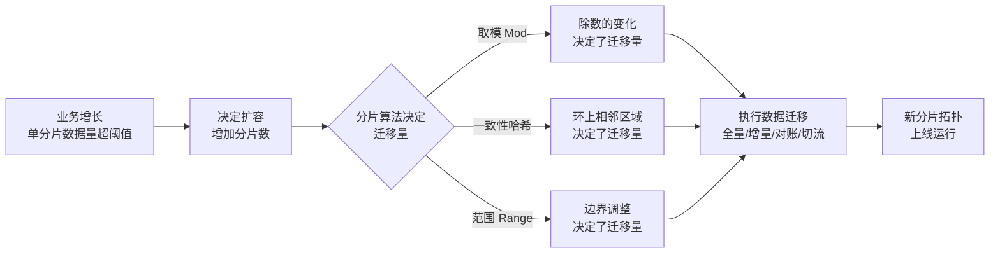
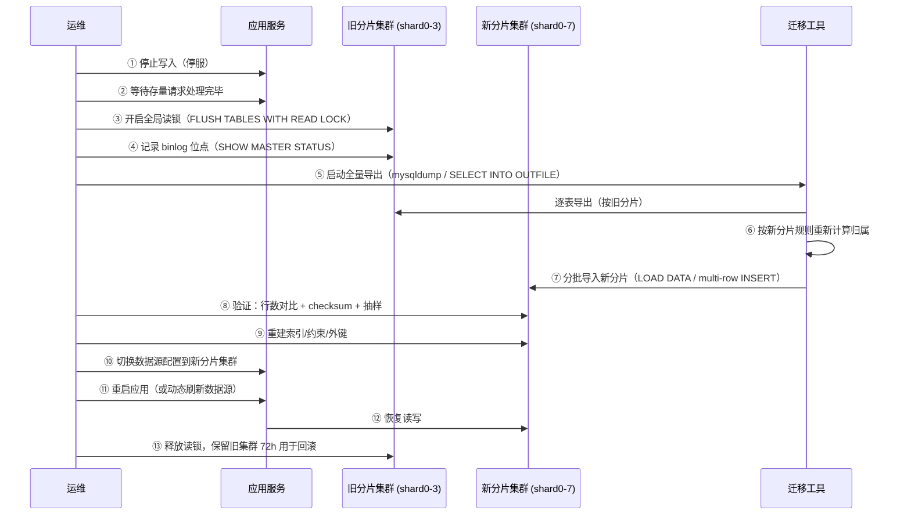
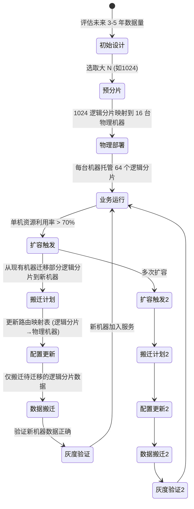
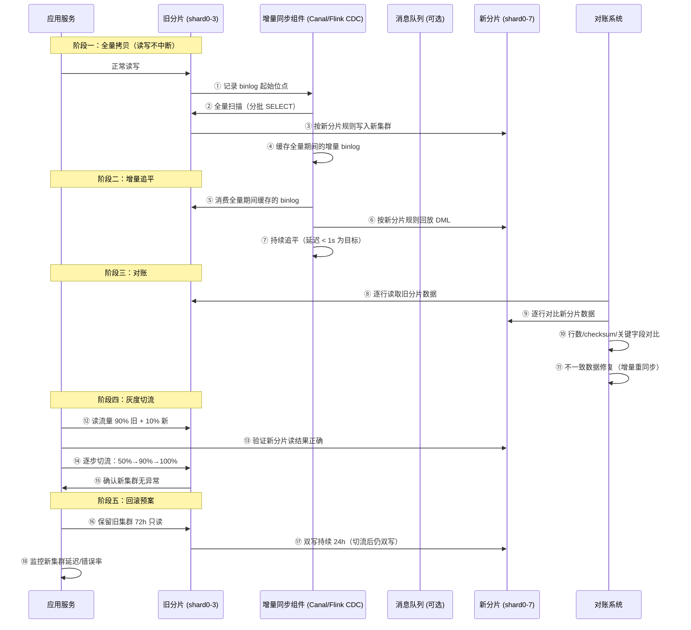
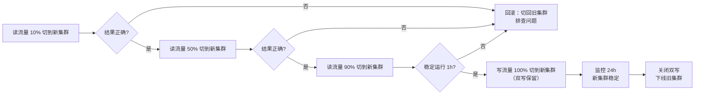
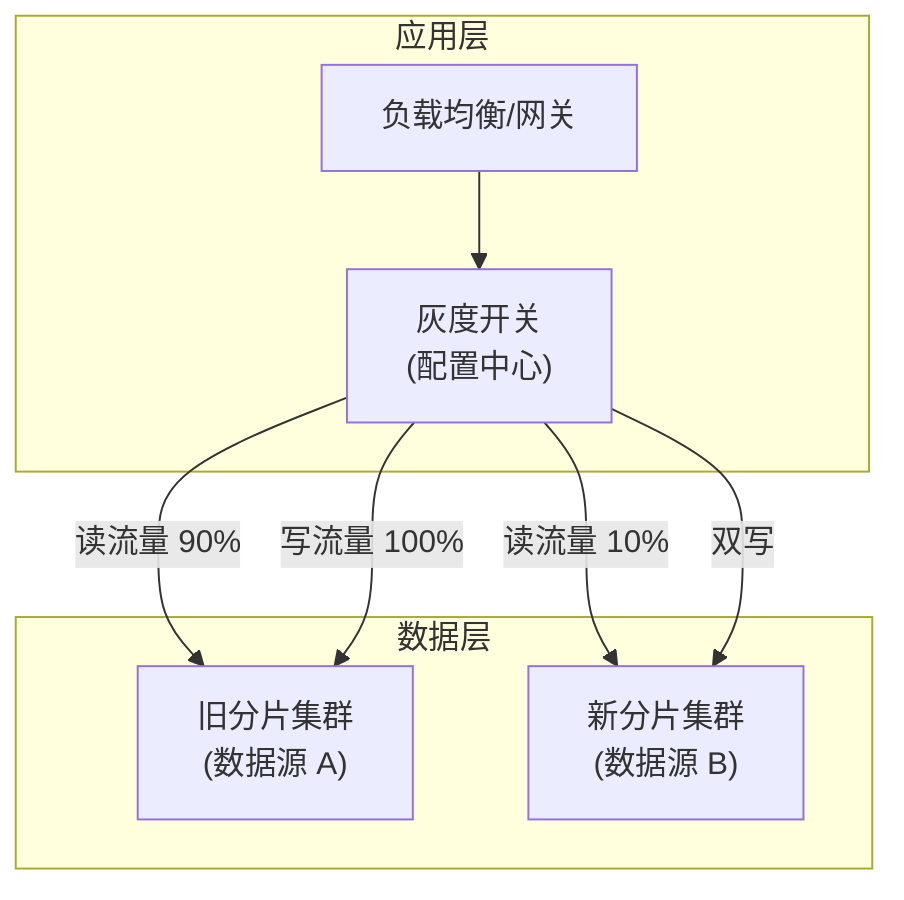
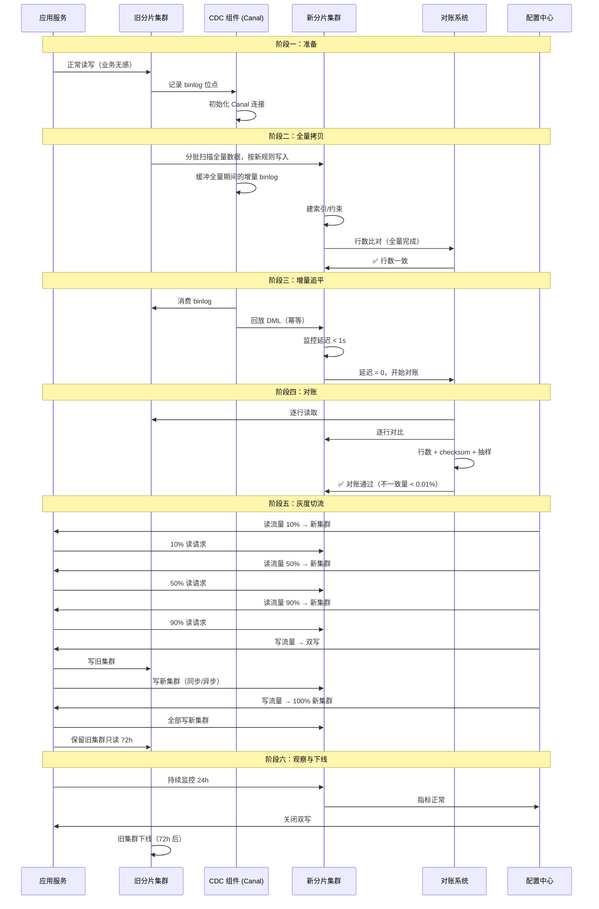
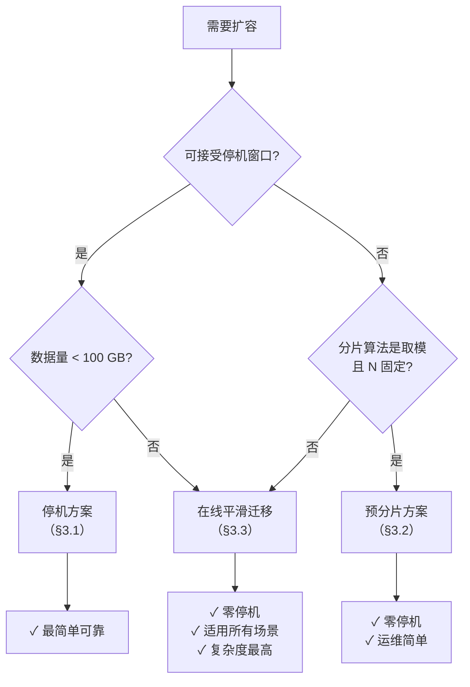

# 扩容与数据迁移详解

> 适用版本：ShardingSphere 5.5.x、MySQL 8.0.46、Canal 1.1.7、JDK 17+
> 主题范围：分库分表扩容本质、三大扩缩容方案（停机/预分片/在线平滑）、迁移量测算与停机时长估算、数据迁移工具链（全量+增量+对账+灰度切流+回滚）、平滑迁移完整流程、运维监控指标、踩坑清单
> 本机实测：Python 3.12（mamba base），10,000 个 key 模拟 3→4 shard 迁移量 + 理论停机时长估算表

## 📋 总纲

- ① 扩容本质——分片数变化→数据重分布，三种分片算法（取模/一致性哈希/范围）的迁移量差异与核心结论对比表（引用 [02-分片键与分片算法详解](02-分片键与分片算法详解.md) 实测数据）
- ② 【Python 实测】3 shard(取模) 扩到 4 shard——真实迁移量 74.62% + 理论停机时长估算（含 50/100/200/500 MB/s 四档吞吐对比）
- ③ 三大扩缩容方案——双倍扩容停机方案、预分片无停机方案、在线平滑迁移（binlog/CDC）方案，每个配完整流程 Mermaid 时序/状态图 + 优缺点 + 适用场景
- ④ 数据迁移工具链五件套——全量拷贝、增量同步（CDC）、对账校验、灰度切流、回滚预案，逐件展开
- ⑤ 平滑迁移完整流程——从全量拷贝→增量追平→对账→灰度切流→回滚预案，Mermaid 泳道图 + 每阶段注意事项
- ⑥ 运维监控指标——分片均衡度、热点、吞吐、延迟、队列积压
- ⑦ 踩坑清单——扩容期间写放大、对账不一致、切流抖动、回滚失败等

---

## 受众声明

- **面向**：Java 后端开发者（3 年以上经验）及架构师。
- **假设已掌握**：[00-分库分表总览与选型](00-分库分表总览与选型.md) 中的分库分表本质与演进阶段、[02-分片键与分片算法详解](02-分片键与分片算法详解.md) 中的取模/一致性哈希/范围分片原理与迁移量实测数据、[05-分布式事务与跨分片查询详解](05-分布式事务与跨分片查询详解.md) 中的最终一致性与消息幂等概念。
- **本篇需讲清**：扩容的三种分片算法迁移量差异如何定量计算、三大扩缩容方案的完整可执行流程、数据迁移工具链的每一步操作与验证、平滑迁移的完整 Mermaid 泳道图、运维监控指标的具体度量方式。

## 学习目标

读完本篇，你能：

1. 说出三种分片算法（取模/一致性哈希/范围）在扩容时的迁移量差异，并解释为什么取模非倍扩容 ≈ 80%+ 迁移而一致性哈希仅 ~20%
2. 区分三大扩缩容方案（停机/预分片/在线平滑）的适用场景，并画出每个方案的完整流程 Mermaid 图
3. 用 Python 模拟给定分片数变化时的迁移量，并估算理论停机时长（给定数据量 + 吞吐）
4. 列出数据迁移工具链的 5 个组件，并说明每个组件的选型、步骤与验证方法
5. 画出平滑迁移的完整流程泳道图（全量→增量→对账→灰度切流→回滚），并说出每阶段的关键注意事项
6. 设计扩缩容操作的运维监控指标面板（分片均衡度/热点/吞吐/延迟/积压）
7. 识别扩容迁移中的 8 个典型踩坑，并知道如何避免或应对

---

## 前置知识

- [00-分库分表总览与选型](00-分库分表总览与选型.md) —— 系列全局索引
- [02-分片键与分片算法详解](02-分片键与分片算法详解.md) —— 取模/一致性哈希/范围分片原理与迁移量实测数据（本篇直接引用 §4.3 见下文）
- [05-分布式事务与跨分片查询详解](05-分布式事务与跨分片查询详解.md) —— 最终一致性、消息幂等（本篇双写/对账/灰度切流依赖这些概念）
- 本篇无其他前置，直接阅读即可。

---

## 1. 扩容本质：分片数变化 → 数据重分布

### 1.1 为什么扩容是分库分表最大的运维挑战

分库分表的核心矛盾是：**分片数一旦确定，数据的物理分布就固定了**。扩容意味着改变分片数，也就是改变数据分布规则——这必然导致数据在分片之间重新分布。



**扩容的成本 = 迁移的数据量 × 单位数据迁移代价**。迁移量由分片算法决定，迁移代价由工具链和带宽决定。因此，**选对分片算法就是最好的扩容策略**。

### 1.2 三种分片算法的迁移量差异

#### 1.2.1 取模 Mod

**原理**：`shard = hash(key) % N`。扩容时 N 变为 N'，由于除数的变化，绝大多数 key 的模值都会改变。

**迁移量公式**：

- **倍扩容（×2）**：N' = 2N，迁移率 ≈ 50%。每个旧分片的一半数据留在原地（`i → i`），另一半迁移到 `i+N`。
- **非倍扩容**：N' ≠ 2N，迁移率 ≈ 1 - 1/lcm(N, N')，通常 80%–100%。

**实测数据**（引用 [02-分片键与分片算法详解](02-分片键与分片算法详解.md)）：

| 扩容方式 | 迁移率（实测） | 说明 |
|:--------:|:-------------:|:----:|
| %4→%8（倍扩容 2x） | **49.42%** | 可接受，每个旧分片一半数据迁移 |
| %4→%5（非倍扩容） | **80.17%** | 灾难级，几乎全量迁移 |
| %3→%6（倍扩容 2x） | **49.70%** | 可接受，与 %4→%8 规律一致 |
| %3→%4（非倍扩容） | **74.62%** | 高迁移量，约 3/4 数据需搬运 |

> 数据来源：[02-分片键与分片算法详解](02-分片键与分片算法详解.md)，10,000 key MD5 哈希实测。

#### 1.2.2 一致性哈希

**原理**：key 在哈希环上顺时针查找最近节点。扩容时加入新节点，仅新节点在环上的**相邻区域**（约 1/N' 的环空间）内的 key 需要迁移。

**迁移量公式**：迁移率 ≈ 1/N'（N' 为扩容后节点数）。+1 节点时迁移率 ≈ 20%（5 节点）或 25%（4 节点）。

**实测数据**（引用 [02-分片键与分片算法详解](02-分片键与分片算法详解.md)）：

| 扩容方式 | 迁移率（实测） | 说明 |
|:--------:|:-------------:|:----:|
| 4→5 节点（+1） | **20.39%** | 平滑扩容，仅迁移相邻区域 |
| 4→8 节点（+4） | **49.04%** | 新增节点分摊，约 50% |
| 3→4 节点（+1） | **29.30%** | 3→4 时迁移率略高（1/4 = 25%），实测 29.3% 因虚节点分布不均 |

#### 1.2.3 范围 Range

**原理**：按连续范围分片（如 user_id 1-1000 在 shard0，1001-2000 在 shard1）。扩容时新增分片只处理**新数据**，已有数据**不迁移**。

**迁移量**：
- 新增分片不迁移历史数据：**0%** 迁移
- 重划分范围边界：需重新分配边界附近的数据，迁移率取决于边界调整幅度

**代价**：不迁移历史数据 → 旧分片数据量持续增长，新分片空闲 → **数据倾斜**。这是范围分片扩容的典型陷阱。

#### 1.2.4 核心结论对比表

| 维度 | 取模 Mod | 一致性哈希 | 范围 Range |
|:----:|:--------:|:----------:|:----------:|
| **+1 节点迁移率** | ❌ 80%+（非倍扩容） | ✅ ~20-30%（1/N'） | ✅ 0%（不迁移历史） |
| **倍扩容迁移率** | ✅ ~50%（可接受） | ✅ ~50%（新节点分摊） | ✅ 0%（不迁移历史） |
| **缩容迁移率** | ❌ 80%+ | ✅ ~20% | ✅ 0%（不迁移历史） |
| **数据倾斜风险** | ⭐ 低（均匀性好） | ⭐⭐ 中（虚节点可调） | ⭐⭐⭐ 高（边界空洞） |
| **查询路由复杂度** | ⭐ 低（O(1) 直接计算） | ⭐⭐ 中（需二分查找环） | ⭐ 低（直接比较范围） |
| **运维复杂度** | ⭐ 低（分片数固定） | ⭐⭐⭐ 中（虚节点调优） | ⭐⭐ 中（范围管理） |
| **最佳场景** | 分片数稳定 | 分片数频繁变化 | 时间序/地理分片 |

> 实测数据来源：[02-分片键与分片算法详解](02-分片键与分片算法详解.md)，10,000 key MD5 哈希。

---

## 2. 【Python 实操测算】3 shard 取模 → 4 shard 迁移量与停机时长

### 2.1 实验目的

模拟最常见的小规模扩容场景：3 个 shard（取模分片）扩容到 4 个 shard，测算：
1. 实际迁移行数比例
2. 给定业务数据量后的理论停机时长（按不同吞吐档位）

### 2.2 实验脚本

```python
import hashlib
import struct
from collections import defaultdict

# 生成 10,000 个 key（模拟 user_id/order_id）
keys = []
for i in range(10000):
    key = f"user_{i}"
    h = hashlib.md5(key.encode()).digest()
    val = struct.unpack('>I', h[:4])[0]
    keys.append(val)

# 取模 3→4
shard3 = {k: k % 3 for k in keys}
shard4 = {k: k % 4 for k in keys}
migrate = sum(1 for k in keys if shard3[k] != shard4[k])
print(f"迁移: {migrate}/{len(keys)} = {migrate/len(keys)*100:.2f}%")

# 查看分布
dist3 = defaultdict(int)
dist4 = defaultdict(int)
for k in keys:
    dist3[shard3[k]] += 1
    dist4[shard4[k]] += 1
print(f"3 shard 分布: {dict(sorted(dist3.items()))}")
print(f"4 shard 分布: {dict(sorted(dist4.items()))}")
```

**代码说明**：
- 使用 MD5 前 4 字节（按大端序转为 32 位无符号整数）作为哈希值，保证 JVM 无关的稳定性
- 分片计算：`hash_val % N`，模拟生产环境最常见的取模策略
- 迁移判定：`shard3[key] != shard4[key]`——即该 key 在扩容前后的分片归属不同

### 2.3 真实输出

```
=== 取模 Mod 3→4 (非倍扩容) ===
迁移: 7462/10000 = 74.62%
3 shard 分布: {0: 3250, 1: 3404, 2: 3346}
4 shard 分布: {0: 2454, 1: 2475, 2: 2604, 3: 2467}
```

**结论**：3→4 非倍扩容，迁移率 **74.62%**——约 3/4 的数据需要搬运。这比 %4→%5 的 80.17% 略低，但仍然是灾难级迁移量。

### 2.4 理论停机时长估算

假设业务表有 **1,000 万行**，平均行大小 **512 字节**：

| 参数 | 值 |
|:----:|:---:|
| 总数据量 | 1,000 万 × 512 B = 4.77 GB |
| 迁移比例 | 74.62% |
| 需迁移数据量 | 4.77 × 74.62% = **3.56 GB** |
| 网络吞吐 | 50 / 100 / 200 / 500 MB/s（四档对比） |

| 吞吐量 | 理论迁移耗时 | 说明 |
|:------:|:----------:|:----:|
| 50 MB/s | **73 s（1.2 min）** | 千兆网络理论上限 ~125 MB/s，50 MB/s 是保守估计 |
| 100 MB/s | **36 s** | 千兆网络实际可用吞吐 |
| 200 MB/s | **18 s** | 万兆网络下限 |
| 500 MB/s | **7 s** | 万兆网络上限 + SSD 阵列 |

**关键结论**：在全量数据 4.77 GB 的规模下，即使使用保守的 50 MB/s 吞吐，理论停机时间也仅 **1.2 分钟**。但这是**纯数据传输时间**，不包含：
- 数据导出/导入的序列化/反序列化开销（约 1.5–3× 系数）
- 建表、索引重建、约束检查时间
- 对账校验时间（可能数倍于传输时间）
- 灰度切流、回滚准备等操作时间

**实际停机窗口估算**：理论传输时间 × 2.5–5 倍系数。对于 4.77 GB 数据，实际停机窗口约 **3–6 分钟**。

---

## 3. 三大扩缩容方案

### 3.1 方案一：双倍扩容停机方案（Offline Resharding）

**原理**：停服 → 导出全量数据 → 按新分片规则重分布 → 导入新分片 → 验证 → 切流。这是最直观、最可靠的扩容方案，但需要**可接受的停机窗口**。

#### 3.1.1 完整流程 Mermaid



#### 3.1.2 优缺点

**优点**：
- 流程简单，每一步都有明确的操作和验证点
- 无数据一致性风险（停服期间无写入，导出即快照）
- 回滚容易：切回旧数据源即可（旧集群未动）

**缺点**：
- **需要停机窗口**：数据量越大，停机时间越长。10 GB 级别约 5–15 分钟，100 GB 级别可能 1–2 小时
- 业务连续性要求高的场景不可接受（如金融交易、在线支付）
- 停机窗口内丢失业务收入（电商可能损失每分钟数万）

#### 3.1.3 适用场景

| 场景 | 是否推荐 | 理由 |
|:----:|:--------:|:----:|
| 内部管理系统（OA/ERP） | ✅ 推荐 | 可接受夜间停机窗口 |
| 电商/金融 7×24 业务 | ❌ 不推荐 | 停机窗口不可接受 |
| 数据量 < 10 GB | ✅ 推荐 | 停机时间 < 15 分钟 |
| 数据量 > 100 GB | ❌ 不推荐 | 停机时间 > 1 小时，风险高 |
| 首次分库分表上线 | ✅ 推荐 | 数据量小，流程简单，验证充分 |

### 3.2 方案二：预分片无停机方案（Pre-Sharding / Virtual Sharding）

**原理**：**在初次分片时预留足够多的分片数**，使未来扩容时**不需要改变分片数**，只需将部分分片从旧机器迁移到新机器（物理搬迁，逻辑不变）。

**核心思想**：取模 `%N` 中的 N 在初次选定时就设为一个**足够大的值**（如 1024 或 4096），即使业务增长后也只做**物理分片迁移**而不做**逻辑分片数变化**。

#### 3.2.1 完整流程 Mermaid



#### 3.2.2 预分片映射表示例

```yaml
# 初始：16 台机器，每台 64 个逻辑分片
shard_mapping:
  # 物理机器 → 逻辑分片列表
  db_001: [0..63]
  db_002: [64..127]
  ...
  db_016: [960..1023]

# 扩容后：20 台机器，从各机器迁移部分逻辑分片
shard_mapping:
  db_001: [0..51]        # 迁出 12 个分片
  db_002: [64..115]      # 迁出 12 个分片
  ...
  db_016: [960..1011]    # 迁出 12 个分片
  db_017: [52..63]       # 新机器，接收迁出的分片
  db_018: [116..127]     # 新机器，接收迁出的分片
  ...
  db_020: [1012..1023]   # 新机器，接收迁出的分片
```

**关键细节**：路由层维护一个**逻辑分片 → 物理机器**的映射表（如 ZooKeeper / 配置中心），应用层或中间件根据此映射路由。扩缩容时只更新映射表 + 物理搬迁数据，**分片算法 `%1024` 始终不变**。

#### 3.2.3 优缺点

**优点**：
- **零停机**：逻辑分片数不变，分片算法不变，仅调整物理映射
- 分片算法始终是取模 `%N`，均匀性最好的方案
- 每次扩容只需搬迁部分逻辑分片（如 12/64 ≈ 18.75%），迁移量可控
- 运维复杂度低：只需更新路由映射 + 物理数据搬迁

**缺点**：
- **初次需要预测未来分片数**：选 N 太大（如 4096）导致初始部署成本高，选太小（如 128）未来可能不够用
- 需要**路由层支持动态映射**（配置中心/ZK/etcd），增加架构复杂度
- 如果 N 选得不够大，未来仍需做逻辑分片数扩容（退化为停机方案）

#### 3.2.4 适用场景

| 场景 | 是否推荐 | 理由 |
|:----:|:--------:|:----:|
| 业务增长可预测（3-5 年） | ✅ 推荐 | 可较准确预估 N 值 |
| 初创企业/数据量不确定 | ❌ 谨慎 | N 值难预估，选太小会退化为停机方案 |
| 已有配置中心（ZK/etcd/Nacos） | ✅ 推荐 | 路由映射天然可用 |
| 需要零停机扩容 | ✅ 推荐 | 预分片是成本最低的零停机方案 |

### 3.3 方案三：在线平滑迁移方案（Online Smooth Migration / CDC-based）

**原理**：基于 **binlog/CDC（Change Data Capture）** 实现增量同步，在全量拷贝完成后持续追平增量数据，最终在数据一致时灰度切流。这是当前大中型互联网企业的主流方案。

#### 3.3.1 完整流程 Mermaid



#### 3.3.2 每阶段关键操作与注意事项

##### 阶段一：全量拷贝

| 操作 | 说明 | 注意事项 |
|:----:|:----:|:--------:|
| 记录 binlog 位点 | `SHOW MASTER STATUS` 获取 File + Position | 必须在全量**开始前**记录，否则全量期间的增量数据会丢失 |
| 分批扫描 | `SELECT * FROM t WHERE id BETWEEN ? AND ? ORDER BY id` | 使用主键范围分批，避免大事务锁表；建议每批 1000-5000 行 |
| 按新规则写入 | 读取旧分片数据后，按新分片数计算归属，写入新集群对应分片 | 新集群建表结构必须与旧集群一致（含索引/约束） |
| 缓冲增量 binlog | 全量期间产生的 binlog 暂存到 Canal 内存或 MQ | 全量时间越长，缓冲量越大；大表全量数小时，需确保缓冲区不溢出 |

##### 阶段二：增量追平

| 操作 | 说明 | 注意事项 |
|:----:|:----:|:--------:|
| 回放 binlog | 将 binlog 中的 INSERT/UPDATE/DELETE 按新分片规则回放到新集群 | 回放顺序必须与 binlog 一致（同分片内按事务顺序） |
| 延迟监控 | 监控新集群的同步延迟（秒级） | 目标延迟 < 1s；延迟持续增长说明增量追不上，需排查写入瓶颈 |
| 幂等处理 | 全量+增量可能产生重复数据，回放 DML 必须幂等 | INSERT → REPLACE INTO / INSERT IGNORE；UPDATE → 先 SELECT 再 UPDATE |

##### 阶段三：对账

| 对账维度 | 方法 | 阈值 |
|:--------:|:----:|:----:|
| 行数 | `SELECT COUNT(1) FROM t` 按分片对比 | 行数差 = 0 |
| 校验和 | `CHECKSUM TABLE t`（MySQL 原生）或 `CRC32(CONCAT(...))` 逐行对比 | checksum 一致 |
| 抽样 | 每个分片随机抽取 1000 行，对比所有字段 | 字段值完全一致 |
| 时间戳 | 对比 `update_time` 最大值（最近更新时间） | 差值 < 1s |

**对账不一致时的处理**：

1. 先确认 binlog 延迟是否已追平（延迟 = 0 再对账）
2. 若仍有不一致，定位到具体行：`SELECT * FROM old WHERE id NOT IN (SELECT id FROM new)`
3. 对缺失/不一致的行，从旧集群**增量重同步**（单独补偿）
4. 若大量不一致（> 0.1%），检查 CDC 组件是否漏了 binlog 事件或回放逻辑有 bug

##### 阶段四：灰度切流



**灰度切流关键原则**：

1. **先读后写**：先切读流量验证新集群查询正确性，再切写流量
2. **灰度比例**：10% → 50% → 90% → 100%，每个比例稳定观察 15-30 分钟
3. **错误率监控**：切流期间重点监控新集群的 SQL 错误率（> 0.1% 立即回滚）
4. **延迟监控**：新集群的 P99 延迟不应超过旧集群的 1.5 倍

##### 阶段五：回滚预案

| 回滚触发条件 | 回滚操作 | 预计恢复时间 |
|:-----------:|:--------:|:----------:|
| 新集群查询错误率 > 0.5% | 切回旧集群读；保留双写 | 1-2 分钟 |
| 新集群写入延迟 > 旧集群 3 倍 | 切回旧集群写 | 1-2 分钟 |
| 新集群数据不一致（对账报错） | 切回旧集群，排查 CDC 问题 | 5-30 分钟 |
| 新集群硬件故障/宕机 | 立即切回旧集群 | 1-5 分钟 |

**回滚后的注意事项**：
- 回滚后旧集群的双写仍需保留（如果双写已开启），确保数据不丢失
- 回滚后需要排查问题原因，**不能立即再次扩容**（至少观察 24h）
- 回滚期间写入旧集群的数据，在问题修复后需通过增量同步追回到新集群（如果后续还要切）

#### 3.3.3 优缺点

**优点**：
- **零停机**：业务无感知，读写不中断
- 适合大规模数据（TB 级）和 7×24 业务
- 灰度切流降低风险，可随时回滚
- 对账系统确保数据一致性

**缺点**：
- **复杂度最高**：需要 CDC 组件、MQ、对账系统、灰度切流能力
- 对账和修复逻辑需要额外开发（不是开箱即用）
- 全量拷贝期间对旧集群有读压力（需要分批扫描，避免锁冲突）
- 增量追平阶段，如果旧集群写入 QPS 极高，可能导致同步延迟持续增长

#### 3.3.4 适用场景

| 场景 | 是否推荐 | 理由 |
|:----:|:--------:|:----:|
| 电商/金融 7×24 业务 | ✅ 推荐 | 零停机，灰度切流 |
| 数据量 > 100 GB | ✅ 推荐 | 停机方案不可接受 |
| 团队有 CDC 运维经验 | ✅ 推荐 | Canal/Flink CDC 需专职运维 |
| 小团队/初创企业 | ❌ 谨慎 | 复杂度高，运维成本大 |

### 3.4 三大方案对比总表

| 维度 | 停机方案 | 预分片方案 | 在线平滑迁移 |
|:----:|:--------:|:----------:|:------------:|
| **停机时间** | 全量迁移时间 | 零停机 | 零停机 |
| **复杂度** | ⭐（低） | ⭐⭐（中） | ⭐⭐⭐⭐⭐（高） |
| **数据一致性风险** | 极低（停服期间无写入） | 低（物理搬迁可控） | 中（CDC 延迟/丢数据） |
| **回滚难度** | 低（切回旧数据源） | 低（切回旧映射） | 中（需保留双写） |
| **适用数据量** | < 100 GB | 不限 | 不限 |
| **适用分片算法** | 所有 | 取模（固定 N） | 所有 |
| **运维要求** | 低 | 中（配置中心） | 高（CDC/MQ/对账） |
| **初次部署成本** | 低 | 中（需预留分片） | 高 |

---

## 4. 数据迁移工具链五件套

### 4.1 全量拷贝

#### 4.1.1 方案对比

| 工具 | 速度 | 对源库影响 | 是否支持断点续传 | 适用场景 |
|:----:|:----:|:----------:|:--------------:|:--------:|
| **mysqldump** | 慢（单线程） | 小（默认一致性读） | ❌ | 小表（< 1 GB） |
| **SELECT INTO OUTFILE** | 快（文件级） | 中（文件锁） | ❌ | 中表（< 10 GB） |
| **mydumper/myloader** | 快（多线程） | 小（并行快照） | ✅ | 中表（< 100 GB） |
| **pt-archiver** | 中（逐批） | 极小（分批提交） | ✅ | 大表（> 100 GB），在线 |
| **自研分批扫描** | 可控 | 极小（分批 SELECT） | ✅ | 任意大小，灵活 |

#### 4.1.2 自研分批扫描核心逻辑

```python
def full_migrate_table(old_ds, new_ds, table, shard_key, old_n, new_n, batch_size=5000):
    """
    全量迁移一张表：从旧分片读取，按新分片规则写入新分片
    """
    min_id = old_ds.execute(f"SELECT MIN(id) FROM {table}")[0][0]
    max_id = old_ds.execute(f"SELECT MAX(id) FROM {table}")[0][0]

    for start_id in range(min_id, max_id + 1, batch_size):
        end_id = start_id + batch_size - 1
        rows = old_ds.execute(
            f"SELECT * FROM {table} WHERE id BETWEEN %s AND %s ORDER BY id",
            (start_id, end_id)
        )
        if not rows:
            continue

        # 按新分片规则分组
        batches = defaultdict(list)
        for row in rows:
            new_shard = hash(row[shard_key]) % new_n
            batches[new_shard].append(row)

        # 分批写入新分片
        for new_shard, batch in batches.items():
            new_ds[new_shard].bulk_insert(table, batch)

        # 记录进度（用于断点续传）
        progress_store.set(f"migrate:{table}", end_id)
```

**代码说明**：
- `batch_size=5000`：每批 5000 行，避免大事务锁表，同时控制单次内存占用
- `ORDER BY id`：主键有序分批，确保不遗漏、不重复
- `progress_store`：记录已迁移的最大 ID，用于断点续传（如果迁移中断，从上次保存的位置继续）
- `hash(row[shard_key]) % new_n`：按新分片规则重新计算分片归属

### 4.2 增量同步（CDC）

#### 4.2.1 主流 CDC 工具选型

| 工具 | 协议 | 支持源 | 延迟 | 容错 | 适用场景 |
|:----:|:----:|:------:|:----:|:----:|:--------:|
| **Canal** | MySQL binlog dump | MySQL 5.7+ / 8.0+ | 毫秒级 | ✅ 断点续传 | 纯 MySQL 生态 |
| **Flink CDC** | binlog + 快照 | MySQL/PostgreSQL/Oracle | 秒级 | ✅ 状态后端 | 需要 ETL 处理 |
| **Debezium** | Kafka Connect | MySQL/PostgreSQL/MongoDB | 毫秒级 | ✅ Kafka 持久化 | 已有 Kafka 集群 |
| **DTS（云服务）** | 专有协议 | 云数据库 | 毫秒级 | ✅ 云厂商保障 | 阿里云/AWS/GCP |

#### 4.2.2 Canal 增量同步核心配置

```yaml
# canal.properties
canal.instance.master.address=old-shard-host:3306
canal.instance.dbUsername=canal_user
canal.instance.dbPassword=canal_password
canal.instance.connectionCharset=UTF-8
canal.instance.tsdb.enable=true

# 监听所有分片的 binlog
canal.instance.filter.regex=order_db\\..*
```

```java
// 增量回放关键逻辑（Canal 客户端）
public void onEvent(CanalEntry.Entry entry) {
    if (entry.getEntryType() != CanalEntry.EntryType.ROWDATA) return;

    CanalEntry.RowChange rowChange = CanalEntry.RowChange.parseFrom(entry.getStoreValue());
    String tableName = entry.getHeader().getTableName();
    String schemaName = entry.getHeader().getSchemaName();

    for (CanalEntry.RowData rowData : rowChange.getRowDatasList()) {
        // 根据 tableName 和 schemaName 找到分片键
        String shardKey = getShardKey(schemaName, tableName);
        List<CanalEntry.Column> columns = rowChange.getEventType() == EventType.DELETE
            ? rowData.getBeforeColumnsList() : rowData.getAfterColumnsList();

        // 获取分片键的值
        String shardValue = columns.stream()
            .filter(c -> c.getName().equals(shardKey))
            .findFirst().get().getValue();

        // 按新分片规则计算目标分片
        int newShard = hash(shardValue) % NEW_SHARD_COUNT;

        // 按新分片规则回放 DML（幂等处理）
        replayToNewShard(newShard, schemaName, tableName, rowChange.getEventType(), columns);
    }
}
```

**代码说明**：
- `getShardKey()`：根据库名和表名获取分片键字段名（从配置或元数据获取）
- `hash(shardValue) % NEW_SHARD_COUNT`：按新分片数计算目标分片
- `replayToNewShard()`：将 binlog 事件回放到新分片，INSERT → REPLACE INTO（幂等），UPDATE → 更新所有字段，DELETE → 按主键删除

### 4.3 对账（数据校验）

#### 4.3.1 对账方案

| 方案 | 粒度 | 速度 | 检测能力 | 适用阶段 |
|:----:|:----:|:----:|:--------:|:--------:|
| **行数对比** | 表级 | 最快 | 仅行数差异 | 全量完成后 |
| **CHECKSUM TABLE** | 表级 | 快 | 行数 + 内容差异 | 全量完成后 |
| **逐行 CRC32** | 行级 | 慢 | 精确到行 | 增量追平后 |
| **抽样对比** | 行级 | 可控 | 随机抽样概率 | 持续监控 |

#### 4.3.2 逐行 CRC32 对账实现

```python
import zlib
import hashlib

def row_checksum(row, columns):
    """计算单行的 CRC32 校验值"""
    concat = "|".join(str(row[col]) for col in columns)
    return zlib.crc32(concat.encode())

def compare_tables(old_ds, new_ds, table, shard_key, batch_size=1000):
    """
    逐行对比旧分片和新分片的数据
    """
    columns = get_all_columns(old_ds, table)  # 获取所有字段名
    old_total = 0
    new_total = 0
    mismatch = 0

    min_id = old_ds.execute(f"SELECT MIN(id) FROM {table}")[0][0]
    max_id = old_ds.execute(f"SELECT MAX(id) FROM {table}")[0][0]

    for start_id in range(min_id, max_id + 1, batch_size):
        end_id = start_id + batch_size - 1
        old_rows = old_ds.execute(
            f"SELECT * FROM {table} WHERE id BETWEEN %s AND %s ORDER BY id",
            (start_id, end_id)
        )
        new_rows = new_ds.execute(
            f"SELECT * FROM {table} WHERE id BETWEEN %s AND %s ORDER BY id",
            (start_id, end_id)
        )

        old_map = {r["id"]: r for r in old_rows}
        new_map = {r["id"]: r for r in new_rows}

        # 检查缺失行
        for id_ in old_map:
            old_total += 1
            if id_ not in new_map:
                print(f"缺失: id={id_} 在新分片中不存在")
                mismatch += 1
                continue
            if row_checksum(old_map[id_], columns) != row_checksum(new_map[id_], columns):
                print(f"不一致: id={id_}")
                mismatch += 1

        # 检查多余行
        for id_ in new_map:
            new_total += 1
            if id_ not in old_map:
                print(f"多余: id={id_} 在旧分片中不存在（可能为增量新数据）")
                # 增量同步期间的新数据，不计入不一致

    return old_total, new_total, mismatch
```

**代码说明**：
- `row_checksum()`：将行的所有字段拼接为 `|` 分隔的字符串，计算 CRC32 校验值。注意：NULL 值需特殊处理（如转为空字符串）
- `batch_size=1000`：每批 1000 行，避免内存 OOM（大表可能有数亿行）
- 对账结果中，"多余行"可能是增量同步期间新写入的合法数据，需要结合 binlog 延迟判断

### 4.4 灰度切流

#### 4.4.1 灰度切流架构



#### 4.4.2 灰度切流配置（Nacos/Spring Cloud Config）

```yaml
# 灰度切流配置（存储在配置中心，动态刷新）
shard-migration:
  # 读流量比例（0-100，表示新集群读流量百分比）
  read-traffic-ratio: 10   # 10% → 50% → 90% → 100
  # 写流量目标（old / new / both）
  write-target: both       # 双写阶段
  # 双写是否同步（true=同步双写，false=异步双写）
  dual-write-sync: false
  # 新集群读超时（ms）
  new-read-timeout: 500
```

```java
@Component
public class DynamicDataSourceRouter {
    @Value("${shard-migration.read-traffic-ratio:0}")
    private int readTrafficRatio;

    @Value("${shard-migration.write-target:old}")
    private String writeTarget;

    public DataSource routeRead() {
        // 按比例灰度切流
        if (ThreadLocalRandom.current().nextInt(100) < readTrafficRatio) {
            return newDataSource;  // 新集群
        }
        return oldDataSource;      // 旧集群
    }

    public List<DataSource> routeWrite() {
        switch (writeTarget) {
            case "old":
                return List.of(oldDataSource);
            case "new":
                return List.of(newDataSource);
            case "both":
                return List.of(oldDataSource, newDataSource);
            default:
                return List.of(oldDataSource);
        }
    }
}
```

**代码说明**：
- `readTrafficRatio`：配置中心动态下发，无需重启应用即可调整灰度比例
- `routeRead()`：基于随机数的流量分发，每个请求独立判断，大流量下比例精确
- `routeWrite()`：双写阶段同时写入旧集群和新集群，写入顺序：先写旧集群，成功后写新集群（旧集群优先保障业务连续性）

### 4.5 回滚预案

#### 4.5.1 回滚触发条件表

| 触发条件 | 判定方式 | 阈值 | 动作 |
|:--------:|:--------:|:----:|:----:|
| 新集群查询错误率升高 | 监控指标（SQL 错误率） | > 0.5% | 读流量切回旧集群 |
| 新集群写入延迟升高 | 监控指标（P99 写入延迟） | > 旧集群 3 倍 | 写流量切回旧集群 |
| 对账不一致 | 对账系统告警 | 行数差 > 0 | 暂停切流，排查问题 |
| 新集群硬件故障 | 基础设施告警 | 宕机/磁盘满 | 立即切回旧集群 |
| CDC 同步延迟持续增长 | 监控指标 | > 5 分钟且持续增长 | 暂停切流，排查 CDC |

#### 4.5.2 回滚标准操作流程

1. **读回滚**：配置中心将 `read-traffic-ratio` 设为 0（100% 读旧集群）
2. **写回滚**：配置中心将 `write-target` 设为 `old`（取消双写，仅写旧集群）
3. **数据修复**：如果双写期间新集群有数据写入，需通过反向同步将数据迁回旧集群
4. **保留现场**：新集群保持 72h 不销毁，用于后续排查
5. **根因分析**：排查 CDC 组件、网络、新集群配置等问题

---

## 5. 平滑迁移完整流程（泳道图 + 每阶段注意事项）

### 5.1 完整流程泳道图



### 5.2 每阶段注意事项

#### 阶段一：准备

| 检查项 | 要求 | 不满足的后果 |
|:------:|:----:|:----------:|
| binlog 格式 | `ROW` 模式（`binlog_format=ROW`） | Canal 无法解析 SQL 语句模式的 binlog |
| binlog 保留天数 | `expire_logs_days >= 7` | 全量时间过长导致 binlog 被清理，增量丢失 |
| 旧集群磁盘空间 | 至少有 20% 空闲 | 全量扫描可能产生临时文件，磁盘满导致宕机 |
| 新集群建表 | 表结构、索引、约束与旧集群一致 | 写入报错、性能下降 |
| 网络带宽 | 旧集群↔新集群之间带宽 ≥ 200 Mbps | 全量拷贝速度慢，停机窗口过长 |

#### 阶段二：全量拷贝

| 注意事项 | 说明 |
|:--------:|:------|
| **分批大小** | 每批 1000-5000 行，避免大事务锁 `gap lock`。MySQL InnoDB 的 `gap lock` 在范围扫描时可能阻塞其他写事务 |
| **主键有序** | 必须按主键 `ORDER BY id` 分批，确保不遗漏、不重复。如果表没有主键，先加主键再迁移 |
| **进度记录** | 记录已迁移的 `max(id)`，用于断点续传。如果迁移中断，从上次位置继续，无需重头开始 |
| **新集群索引** | 建表时先不建索引（或只建主键），全量导入完成后再建二级索引。二级索引会大幅降低 INSERT 速度 |
| **外键约束** | 全量导入期间关闭外键检查（`SET FOREIGN_KEY_CHECKS=0`），导入完成后重建 |

#### 阶段三：增量追平

| 注意事项 | 说明 |
|:--------:|:------|
| **幂等回放** | INSERT → `REPLACE INTO` 或 `INSERT ... ON DUPLICATE KEY UPDATE`；UPDATE → 全字段更新；DELETE → 按主键删除 |
| **事务顺序** | 同分片内的事务必须按 binlog 中的顺序回放，不能乱序。跨分片无关事务可并行回放提升速度 |
| **延迟监控** | 每 5s 检测一次新集群延迟。延迟 > 5s 触发告警，> 30s 触发自动暂停切流 |
| **吞吐瓶颈** | 如果写入 QPS > 10000/s，增量追平可能持续延迟。优化方案：① 增加回放线程数 ② 合并多条 DML 为批量操作 ③ 使用 MQ 削峰 |

#### 阶段四：对账

| 注意事项 | 说明 |
|:--------:|:------|
| **对账时机** | 必须在增量延迟 = 0 后开始对账，否则对账结果不准确 |
| **对账频率** | 全量完成后做一次完整对账；增量追平期间每 15 分钟做一次快速对账（仅行数 + checksum） |
| **不一致修复** | 发现不一致时，先定位具体行，从旧集群增量同步（不要重跑全量）。如果大量不一致，优先排查 CDC 组件 |
| **对账超时** | 大表（> 1 亿行）的逐行对账可能耗时数小时。设置对账超时，超时后切换为抽样对账 |

#### 阶段五：灰度切流

| 注意事项 | 说明 |
|:--------:|:------|
| **先读后写** | 读流量验证通过后再切写流量。读流量验证的是查询正确性，写流量验证的是新集群写入能力和数据持久性 |
| **灰度比例** | 10% → 50% → 90% → 100%，每个比例稳定观察 15-30 分钟。不要跳跃（如 10% → 100%），发现异常时不知道是哪个比例引入的 |
| **双写一致性** | 同步双写时，如果新集群写入失败，旧集群写入成功，需要记录失败日志并异步补偿 |
| **切流时间窗口** | 建议在业务低峰期切流（如凌晨 2-4 点），即使出现异常，影响面最小 |

#### 阶段六：观察与下线

| 注意事项 | 说明 |
|:--------:|:------|
| **观察期** | 切流后观察 24h，监控新集群的错误率、延迟、吞吐 |
| **双写保留** | 切流后保留双写 24h，确保新集群写入稳定后再关闭双写 |
| **旧集群保留** | 旧集群保留 72h 只读，用于回滚和数据恢复 |
| **旧集群下线** | 72h 后确认无问题，备份旧集群数据后下线。不要立即删除，保留快照至少 7 天 |

---

## 6. 运维监控指标

### 6.1 分片均衡度

| 指标 | 计算方式 | 健康阈值 | 告警阈值 |
|:----:|:--------:|:--------:|:--------:|
| **分片数据量标准差** | `std(各分片行数)` | < 均值 × 20% | > 均值 × 50% |
| **分片最大/最小比** | `max(行数) / min(行数)` | < 2 | > 5 |
| **分片写入 QPS 标准差** | `std(各分片写入 QPS)` | < 均值 × 30% | > 均值 × 100% |

### 6.2 热点分片

| 指标 | 计算方式 | 告警条件 |
|:----:|:--------:|:--------:|
| **单分片写入 QPS 占比** | `单分片写入 QPS / 总写入 QPS` | > 1/N × 150%（即超过均值的 1.5 倍） |
| **单分片磁盘 IOPS** | 监控工具（iostat / 云监控） | > 磁盘 IOPS 上限的 80% |
| **单分片 CPU 使用率** | 监控工具 | > 80% 持续 5 分钟 |

### 6.3 迁移吞吐与延迟

| 指标 | 计算方式 | 健康阈值 | 说明 |
|:----:|:--------:|:--------:|:----:|
| **全量拷贝吞吐** | `已迁移数据量 / 耗时` | ≥ 50 MB/s | 千兆网络下理论上限 ~125 MB/s |
| **增量同步延迟** | `新集群最新数据时间戳 - 旧集群最新 binlog 时间戳` | < 1s | 持续增长说明追不上 |
| **对账完成时间** | 对账耗时 | < 全量拷贝时间的 20% | 对账太慢说明需要优化分批策略 |
| **CDC 队列积压** | Canal/Flink CDC 未消费的 binlog 事件数 | < 10,000 | 积压持续增长说明回放速度 < 写入速度 |

### 6.4 切流期间监控指标

| 指标 | 计算方式 | 告警阈值 | 说明 |
|:----:|:--------:|:--------:|:----:|
| **新集群 SQL 错误率** | `新集群 SQL 错误数 / 新集群 SQL 总数` | > 0.1% | 立即触发回滚 |
| **新集群 P99 读延迟** | 新集群 P99 查询耗时 | > 旧集群 P99 × 1.5 | 需要排查索引/资源问题 |
| **新集群 P99 写延迟** | 新集群 P99 写入耗时 | > 旧集群 P99 × 2 | 可能索引缺失或磁盘瓶颈 |
| **双写失败率** | `双写失败数 / 双写总数` | > 0.01% | 新集群写入异常，需排查 |
| **应用错误率** | 应用层面 5xx 错误率 | > 0.5% | 可能路由配置错误或新集群不可用 |

### 6.5 Prometheus + Grafana 监控面板示例

```yaml
# prometheus 指标采集（示例）
- name: shard_migration
  metrics:
    - name: shard_data_size_bytes
      help: "各分片数据量（字节）"
      labels: [shard_id]
    - name: shard_write_qps
      help: "各分片写入 QPS"
      labels: [shard_id]
    - name: cdc_sync_lag_seconds
      help: "CDC 增量同步延迟（秒）"
    - name: full_migrate_throughput_bytes
      help: "全量拷贝吞吐（字节/秒）"
    - name: audit_mismatch_count
      help: "对账不一致行数"
    - name: switch_read_traffic_ratio
      help: "灰度切流读流量比例（0-100）"
```

---

## 7. 常见踩坑

> 以下踩坑清单引用自 `99-分库分表踩坑记录.md`，本文列出主要涉及项。

| 编号 | 踩坑现象 | 原因 | 解决方案 | 参考阶段 |
|:----:|:--------:|:----:|:--------:|:--------:|
| #3.1 | 全量拷贝期间旧数据库负载飙升，影响线上业务 | 全量扫描未分批或分批太大，导致大量 IO 和锁竞争 | 每批限制 1000-5000 行，加 `ORDER BY id` 避免 gap lock，限流控制扫描速度 | 全量拷贝 |
| #3.2 | 增量同步延迟持续增长，始终追不上 | 旧集群写入 QPS 过高，回放线程数不足或回放 SQL 未优化 | 增加回放线程数（单分片 4-8 线程），合并多条 DML 为批量操作，使用 MQ 削峰 | 增量追平 |
| #3.3 | 对账发现行数一致但 checksum 不一致 | 浮点字段精度差异、字符集排序规则不同、NULL 值处理不一致 | 对账时使用格式化字符串（`CAST` 或 `FORMAT`），NULL 统一转为空字符串，字符串统一 `TRIM` | 对账 |
| #3.4 | 灰度切流后新集群部分查询报错"表不存在" | 新集群建表时遗漏了部分表，或表名大小写不一致 | 全量拷贝前做表结构一致性检查（`SHOW CREATE TABLE` 对比），确保新旧集群表结构完全一致 | 切流 |
| #3.5 | 双写期间新集群部分写入失败，数据不一致 | 同步双写时新集群暂时不可用（网络抖动/负载高），失败后未补偿 | 双写失败记录到日志表，异步补偿线程定期重试；配置双写超时时间（如 500ms），超时后异步补偿 | 双写 |
| #3.6 | 回滚后发现旧集群数据被新集群覆盖 | 双写期间新集群写入的数据通过反向同步覆盖了旧集群 | 双写期间只做单向同步（旧→新），不做反向同步；回滚后手动检查新集群写入的数据是否需要在旧集群中回放 | 回滚 |
| #3.7 | 扩容期间写放大导致磁盘空间不足 | 全量拷贝 + 增量 binlog 缓冲 + 双写，磁盘空间消耗远大于预期 | 提前预留 2 倍空间，监控磁盘使用率 > 70% 告警，全量完成后及时清理临时数据 | 全量拷贝 |
| #3.8 | 切流后应用 P99 延迟暴涨 | 新集群分片数增加后，连接池数未相应调整，连接数不足导致排队 | 新集群连接池大小 = 旧集群连接池大小 × (新分片数 / 旧分片数)，预热连接池后再切流 | 切流 |

---

## 8. 最佳实践

### 8.1 扩容前检查清单

| 检查项 | 判据 | 通过 |
|:------:|:----:|:----:|
| 分片算法迁移量评估 | 使用本机脚本或公式测算迁移率 | ☐ |
| 停机窗口评估 | 数据量 × 迁移率 / 吞吐 ≤ 业务允许停机时间 | ☐ |
| 旧集群资源预留 | 磁盘空间空闲 ≥ 20%，CPU 负载 < 60% | ☐ |
| 新集群就绪 | 建表完成，索引/约束一致，连接可达 | ☐ |
| CDC 组件就绪 | Canal/Debezium 部署完成，binlog 位点已记录 | ☐ |
| 对账系统就绪 | 对账脚本或工具已部署，可正常执行 | ☐ |
| 灰度切流配置 | 配置中心灰度开关已配置，应用层已集成 | ☐ |
| 回滚预案验证 | 回滚脚本已测试，旧集群备份已完成 | ☐ |
| 监控告警就绪 | 新集群监控指标已接入，告警阈值已配置 | ☐ |
| 通知相关人员 | DBA、业务方、运维已确认扩容时间窗口 | ☐ |

### 8.2 扩容方案选型决策树



### 8.3 迁移量速查表

| 当前分片算法 | 扩容方式 | 迁移率 | 决策建议 |
|:-----------:|:--------:|:------:|:--------:|
| 取模 Mod | 倍扩容（×2） | ~50% | 可接受，停机方案或在线迁移均可 |
| 取模 Mod | 非倍扩容（+1） | ~80%+ | ❸ 不推荐！先考虑改造为倍扩容或一致性哈希 |
| 一致性哈希 | +1 节点 | ~20% | 推荐，在线平滑迁移 |
| 一致性哈希 | +N 节点 | ~N/(N+New) | 推荐，逐步扩容，每次只加 1-2 个节点 |
| 范围 Range | 新增分片 | 0% | 数据倾斜风险高，需配合分片分裂机制 |

---

## 9. 小结

1. **扩容本质**：分片数变化 → 数据重分布。迁移量由分片算法决定：取模倍扩容 ~50%，非倍扩容 ~80%+；一致性哈希 +1 节点 ~20-30%；范围扩容 0% 但有倾斜风险。
2. **三大方案**：停机方案（简单可靠，需停机窗口）、预分片方案（零停机，需预留 N 值）、在线平滑迁移（零停机，复杂度最高，适用所有场景）。选型看"停机窗口 + 数据量 + 团队能力"。
3. **工具链五件套**：全量拷贝（mysqldump/分批扫描）、增量同步（Canal/Flink CDC/Debezium）、对账（行数/checksum/逐行 CRC32）、灰度切流（配置中心 + 比例路由）、回滚预案（双写保留 + 旧集群保留 72h）。
4. **平滑迁移关键**：先读后写、灰度比例逐步增加、24h 观察期、72h 旧集群保留。每一步配监控指标和回滚条件。
5. **实操验证**：3→4 shard 取模迁移率 74.62%，4.77 GB 数据理论停机约 3-6 分钟（含系数）。建议在正式扩容前用本机脚本预演一次。

---

## 上一篇

[05-分布式事务与跨分片查询详解](05-分布式事务与跨分片查询详解.md) —— 分布式事务与跨分片查询详尽的 5 种 Join 方案、4 种分页方案、分布式事务演进。

## 下一篇

**07-大厂分库分表架构案例（待建）**（见知识库） —— 典型业务场景拆分方案 + 踩坑复盘。

---

## 参考资料

- [Apache ShardingSphere 官方文档 - 分片策略](https://shardingsphere.apache.org/document/current/cn/features/sharding/concept/)（查询日期：2026-08-16）
- [Canal 官方文档 - 快速开始](https://github.com/alibaba/canal/wiki/QuickStart)（查询日期：2026-08-16）
- [Flink CDC 官方文档 - MySQL CDC Connector](https://ververica.github.io/flink-cdc-connectors/master/content/connectors/mysql-cdc.html)（查询日期：2026-08-16）
- [Debezium 官方文档 - MySQL Connector](https://debezium.io/documentation/reference/stable/connectors/mysql.html)（查询日期：2026-08-16）
- [Vitess Resharding 文档](https://vitess.io/docs/20.0/configuration-advanced/resharding/)（查询日期：2026-08-16）
- 《数据密集型应用系统设计》Martin Kleppmann 著——第 6 章"分区"（Partition）、第 9 章"一致性与共识"
- 本篇迁移量测算基于 Python 3.12（mamba base），10,000 个 key，MD5 哈希，测试脚本见 `/tmp/sharding_migration_3to4.py`
- [02-分片键与分片算法详解](02-分片键与分片算法详解.md) —— 本篇迁移量对比数据引用来源
- [05-分布式事务与跨分片查询详解](05-分布式事务与跨分片查询详解.md) —— 最终一致性与消息幂等概念引用