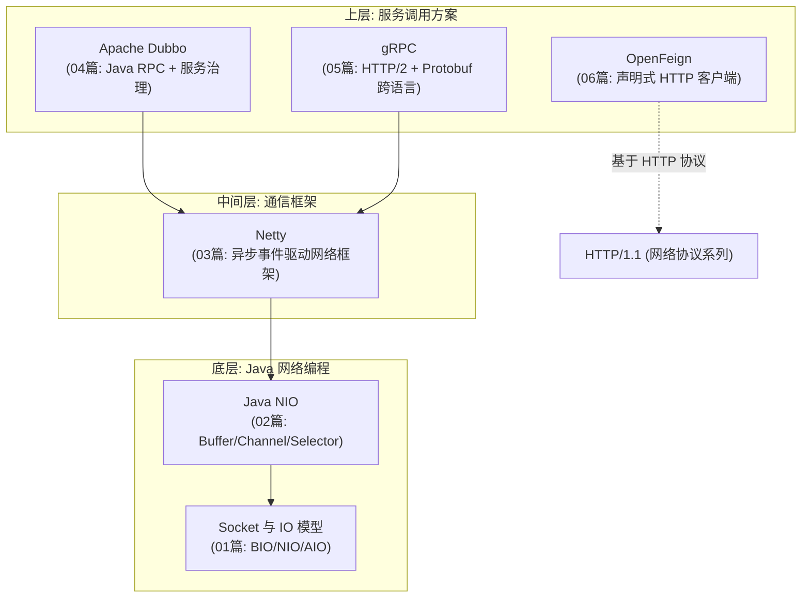

# 00-RPC与远程调用总览

> 版本基线：2026-08 整理，覆盖 Socket→NIO→Netty→Dubbo/gRPC/OpenFeign 完整技术栈
> 受众：Java 后端开发，微服务/分布式场景做服务间通信，需要一张技术地图。
> 关联笔记：系列全部篇目（01-06）

## 📋 总纲

- 1. 服务间通信的演进脉络
- 2. 技术分层地图（一张图看懂全系列）
- 3. 各篇导航与阅读顺序
- 4. 方案对比与选型
- 5. 常见面试考点索引

## 学习目标

学完本篇你能：

1. 画出服务间通信的技术栈分层（Socket→NIO→Netty→RPC 框架）
2. 理解 RPC 框架解决的核心问题（序列化+传输+服务发现+治理）
3. 对比 Dubbo / gRPC / OpenFeign 三条路线的选型
4. 按正确顺序阅读本系列各篇

## 前置知识

- 本篇为总览索引，无前置；各篇内部有前置说明

---

## 1. 服务间通信的演进脉络

```
单机进程内调用
   ↓ 服务拆分(微服务)
进程间通信(IPC)
   ├── HTTP/REST (OpenFeign, 06篇)
   ├── RPC 框架 (Dubbo 04篇 / gRPC 05篇)
   └── 底层都是: Socket → NIO → Netty (01/02/03篇)
```

**演进逻辑**：单体拆微服务 → 服务间要通信 → 通信分两层——**底层网络传输**（Socket/NIO/Netty）和**上层调用协议**（REST/RPC）。

> 🔗 **底层网络传输实现**（Socket/NIO/Netty 的 01/02/03 篇）已迁至 [00-网络底座总览](../网络底座/00-网络底座总览.md)（网络底座/网络通信）；本域聚焦**上层 RPC 调用**（Dubbo/gRPC/Feign）。

---

## 2. 技术分层地图（一张图看懂全系列）



**主线**：Socket 是 Java 网络编程起点 → NIO 解决阻塞 → Netty 封装复杂度 → Dubbo/gRPC 构建于其上做 RPC。

---

## 3. 各篇导航与阅读顺序

| 顺序 | 篇目 | 内容 | 来源 |
|---|---|---|---|
| 1 | [01-Socket与IO模型](../网络底座/网络通信/01-Socket与IO模型.md) | BIO/NIO/AIO 概念 + Socket 编程 | |
| 2 | [02-Java NIO详解](../网络底座/网络通信/02-Java NIO详解.md) | Buffer/Channel/Selector 三大核心 | |
| 3 | [03-Netty核心机制详解](../网络底座/网络通信/03-Netty核心机制详解.md) | 组件/粘包/协议/心跳/调优 | |
| 4 | [04-Apache Dubbo详解](04-Apache Dubbo详解.md) | Java RPC + 服务治理 | |
| 5 | [05-gRPC详解](05-gRPC详解.md) | HTTP/2 + Protobuf 跨语言 RPC | 新建(深度) |
| 6 | [06-OpenFeign详解](06-OpenFeign详解.md) | 声明式 HTTP 客户端（存量生态） | 新建(深度) |
| 7 | [07-Spring HTTP Service Clients详解](07-Spring HTTP Service Clients详解.md) | **Spring 官方推荐声明式客户端**（替代 OpenFeign） | 新建(深度) |

**推荐阅读顺序**：01 → 02 → 03（传输层地基）→ 04/05/06/07（按需选一个 RPC 方案深入）。

---

## 4. 方案对比与选型

| 维度 | Dubbo | gRPC | OpenFeign | HTTP Interface |
|---|---|---|---|---|
| 类型 | RPC 框架 | RPC 框架 | HTTP 客户端 | HTTP 客户端 |
| 协议 | 自定义 TCP（可配） | HTTP/2 + Protobuf | HTTP/1.1 + JSON | HTTP/1.1 + JSON |
| 跨语言 | 弱（Java 为主） | ✅ 强 | ✅ 天然 | ✅ 天然 |
| 服务治理 | ✅ 内置 | 需外部组件 | 需 Spring Cloud | 需 Spring Cloud |
| 提供方 | Apache | CNCF/Google | Netflix→Spring Cloud | **Spring 官方** |
| 维护状态 | ✅ 活跃 | ✅ 活跃 | ⚠️ feature-complete | ✅ 官方演进 |
| 适合 | Java 治理 | 跨语言/流式 | 存量 Spring Cloud | **新项目 HTTP 调用** |

**选型决策**：

```
Java 内部服务、要服务治理 → Dubbo
跨语言/高性能/流式 → gRPC
新项目 HTTP 调用 → Spring HTTP Service Clients(官方推荐)
存量 Spring Cloud HTTP 生态 → OpenFeign(或迁移到 HTTP Interface)
```

> ⚠️ **实事求是**：没有绝对答案——**Dubbo 胜在治理，gRPC 胜在跨语言效率，HTTP Interface 是官方推荐的 HTTP 新方案，OpenFeign 是存量生态**。混合使用也常见。

---

## 5. 常见面试考点索引

| 考点 | 答案所在 |
|---|---|
| BIO/NIO/AIO 区别？ | [01-Socket与IO模型](../网络底座/网络通信/01-Socket与IO模型.md) |
| NIO 三大组件？ | [02-Java NIO详解](../网络底座/网络通信/02-Java NIO详解.md) |
| Netty 为什么快？ | [03-Netty核心机制详解](../网络底座/网络通信/03-Netty核心机制详解.md) |
| 粘包半包怎么解决？ | [03-Netty核心机制详解](../网络底座/网络通信/03-Netty核心机制详解.md) §4 |
| Dubbo 架构与 SPI？ | [04-Apache Dubbo详解](04-Apache Dubbo详解.md) |
| gRPC 为什么用 HTTP/2 + Protobuf？ | [05-gRPC详解](05-gRPC详解.md) §2 |
| gRPC 四种调用模式？ | [05-gRPC详解](05-gRPC详解.md) §4 |
| OpenFeign 原理？ | [06-OpenFeign详解](06-OpenFeign详解.md) §1 |
| Spring HTTP Interface 是什么？ | [07-Spring HTTP Service Clients详解](07-Spring HTTP Service Clients详解.md) §1 |
| OpenFeign 为什么不推荐新项目用了？ | [06-OpenFeign详解](06-OpenFeign详解.md) §9 / [07-Spring HTTP Service Clients详解](07-Spring HTTP Service Clients详解.md) §8 |
| Dubbo vs gRPC vs Feign 选型？ | 本篇 §4 |

## 相关笔记（导航）

- 系列：[01-Socket与IO模型](../网络底座/网络通信/01-Socket与IO模型.md) / [02-Java NIO详解](../网络底座/网络通信/02-Java NIO详解.md) / [03-Netty核心机制详解](../网络底座/网络通信/03-Netty核心机制详解.md) / [04-Apache Dubbo详解](04-Apache Dubbo详解.md) / [05-gRPC详解](05-gRPC详解.md) / [06-OpenFeign详解](06-OpenFeign详解.md) / [07-Spring HTTP Service Clients详解](07-Spring HTTP Service Clients详解.md)
- 邻接主题：**00-网络传输协议总览**（见知识库）（HTTP/2 是 gRPC 基础）、[00-定时任务框架选型总览](../定时任务/00-定时任务框架选型总览.md)、[00-构建工具总览·Maven & Gradle选型对比](../../构建工具/00-构建工具总览·Maven & Gradle选型对比.md)

## 参考资料

- [Apache Dubbo 官方](https://dubbo.apache.org/)，查询日期：2026-08-09
- [gRPC 官方](https://grpc.io/)，查询日期：2026-08-09
- [Spring Cloud OpenFeign 官方](https://docs.spring.io/spring-cloud-openfeign/reference/)，查询日期：2026-08-09
