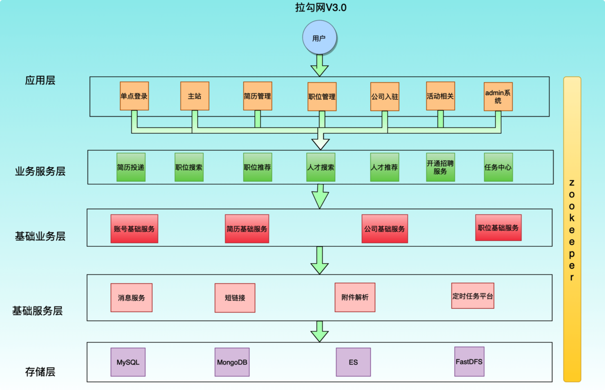
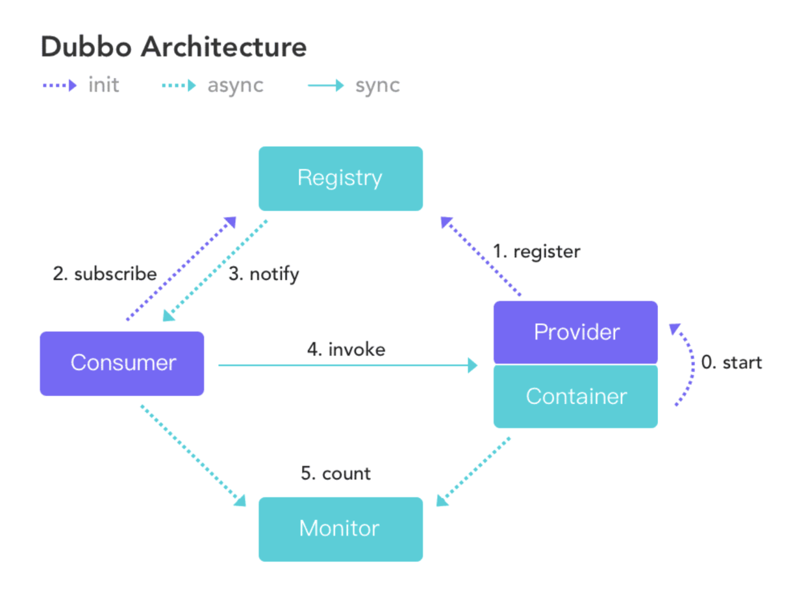

# 04-Apache Dubbo详解

> 版本基线：Apache Dubbo 3.x（阿里开源的高性能 Java RPC 框架）
> 受众：Java 后端开发，要做微服务/分布式服务调用。默认你懂 Spring、[00-RPC与远程调用总览](00-RPC与远程调用总览.md) 的基本概念。
> 关联笔记：[00-RPC与远程调用总览](00-RPC与远程调用总览.md)、[02-Java NIO详解](../网络底座/网络通信/02-Java NIO详解.md)、[05-gRPC详解](05-gRPC详解.md)

## 📋 总纲

- 1. 项目架构演变过程
- 2. Dubbo 架构概述
- 3. 简单示例
- 4. 管理控制台 dubbo-admin
- 5. 配置
- 6. SPI
- 7. 负载均衡策略
- 8. 异步
- 9. 线程模型
- 10. 路由规则

## 学习目标

学完本篇你能：

1. 说清架构演进（单体→垂直→SOA→微服务）与 Dubbo 的定位
2. 画出 Dubbo 核心架构（Provider/Consumer/Registry/Monitor/Container）
3. 用注解/XML 方式开发一个 Dubbo 服务并调用
4. 配置 dubbo-admin 管理控制台
5. 理解 Dubbo SPI 与 JDK SPI 的差异
6. 说出五种负载均衡策略（Random/RoundRobin/LeastActive/ShortestResponse/ConsistentHash）
7. 理解 Dubbo 的异步调用与线程模型
8. 配置路由规则

## 前置知识

- [00-RPC与远程调用总览](00-RPC与远程调用总览.md)——RPC 概念与方案对比
- [02-Java NIO详解](../网络底座/网络通信/02-Java NIO详解.md)——Dubbo 底层网络通信基于 NIO/Netty
- 需掌握：Spring、ZooKeeper/Nacos 基本概念（注册中心）

---

# 1. 项目架构演变过程
随着互联网的发展，用户群体逐渐壮大，网站的流量成倍增长，常规的单体架构已无法满足请求压力暴增和业务的快速迭代，架构的变化势在必行。
## 1.1 单体架构
单体架构所有模块和功能都集中在一个项目中 ，部署时也是将项目所有功能部整体署到服务器中。
- 优点
  - 小项目开发快 成本低 架构简单
  - 易于测试
  - 易于部署
- 缺点
  - 大项目模块耦合严重 不易开发 维护 沟通成本高
  - 新增业务困难
  - 核心业务与边缘业务混合在一块，出现问题互相影响
## 1.2 垂直架构
根据业务把项目垂直切割成多个项目，因此这种架构称之为垂直架构。
做垂直划分的原则是基于业务特性，核心目标，第一个是为了业务之间互不影响，第二个是在研发团队的壮大后为了提高效率，减少之间的依赖。
- 优点
  - 系统拆分实现了流量分担，解决了并发问题
  - 可以针对不同系统进行优化
  - 方便水平扩展，负载均衡，容错率提高
  - 系统间相互独立，互不影响，新的业务迭代时更加高效
- 缺点
  - 服务系统之间接口调用硬编码
  - 搭建集群之后，实现负载均衡比较复杂
  - 服务系统接口调用监控不到位 调用方式不统一
  - 服务监控不到位
  - 数据库资源浪费，充斥慢查询，主从同步延迟大
## 1.3 分布式架构 SOA
SOA全称为Service Oriented Architecture，即面向服务的架构
它是在垂直划分的基础上，将每个项目拆分出多个具备松耦合的服务，一个服务通常以独立的形式存在与操作系统进程中。
各个服务之间通过网络调用，这使得构建在各种各样的系统中的服务，以一种统一和通用的方式进行交互。
> 在做了垂直划分以后，模块随之增多，系统之间的RPC逐渐增多，维护的成本也越来越高，一些通用的业务和模块重复的也越来越多，这个时候上面提到的接口协议不统一、服务无法监控、服务的负载均衡等问题更加突出

- 分层
按照业务性质分层，每一层要求简单和容易维护
  - 应用层
距离用户最近的一层，也称之为接入层。
使用 Tomcat 作为容器，接收用户请求；使用下游 Dubbo 提供的接口来返回数据，并且该层禁止访问数据库。
  - 业务服务层
根据具体的业务场景演进而来
  - 基础业务层
  - 基础服务层
与业务无关的模块，是一些通用的服务
    - 这类服务的特点：请求量大，逻辑简单，特性明显，功能独立
    - 消息服务
  - 存储层
- 分级
同一级的业务也要做好分级，依据业务的重要性进行分级
按照二八定律：网络 80%的流量都在核心功能上面，要优先保证核心业务的稳定
- 隔离
  总体上调用要单向，可以跨层调用；但不能出现逆向调用
- 优点
  - 服务以接口为粒度，为开发者屏蔽远程调用底层细节
  - 业务分层以后架构更加清晰 并且每个业务模块职责单一 扩展性更强
  - 数据隔离，权限回收，数据访问都通过接口 让系统更加稳定安全
  - 服务应用本身无状态化
这里的无状态化指的是应用本身不做内存级缓存 而是把数据存入db
  - 服务责任易确定 每个服务可以确定责任人 这样更容易保证服务质量和稳定
- 缺点
  - 粒度控制复杂
如果没有控制好服务的粒度，服务的模块就会越来越多，就会引发超时，分布式事务等问题
  - 服务接口数量不宜控制 容易引发接口爆炸
所以服务接口建议以业务场景进行单位划分 并对相近的业务做抽象 防止接口爆炸
  - 版本升级兼容困难
  - 调用链路长，服务质量不可监控
调用链路变长，下游抖动可能会影响到上游业务，最终形成连锁反应，服务质量不稳定
同时链路的变成使得服务质量的监控变得困难
## 1.4 微服务架构
微服务架构是一种将单个应用程序，作为一套小型服务开发的方法，每种应用程序都在其自己的进程中独立运行，并使用轻量级机制(通常是HTTP资源的API)进行通信。
这些服务是围绕业务功能构建的，可以通过全自动部署机制进行独立部署。
这些服务的集中化管理非常少，它们可以用不同的编程语言编写， 并使用不同的数据存储技术。
微服务是在SOA上做的升华 , 粒度更加细致，微服务架构强调的一个重点是“业务需要彻底的组件化和服务化”。
# 2. Dubbo 架构概述
是一款高性能的
可以与 Spring 框架无缝集成。
## 2.1 特性
- 面向接口代理的高性能RPC 调用
提供高性能的基于代理的远程调用能力，服务以接口为粒度，为开发者屏蔽远程调用底层细节
- 智能负载均衡
内置多种负载均衡策略，智能感知下游节点健康状况，显著减少调用延迟，提高系统吞吐量
- 服务自动注册与发现
支持多种注册中心服务，服务实例上下线实时感知
- 高度可扩展能力
遵循微内核+插件的设计原则，所有核心能力如
- 运行期流量调度
内置条件、脚本等路由策略，通过配置不同的路由规则，轻松实现灰度发布，同机房优先等功能
- 可视化的服务治理与运维
提供丰富服务治理、运维工具；
随时查询服务元数据、服务健康状态及调用统计，实现下发路由策略、调整配置参数。
## 2.2 处理流程

调用关系说明：
- 蓝色虚线：启动完成
- 虚线：异步执行
- 实线：同步完成
调用关系：
- 服务提供方在启动时会将自己提供的服务注册到服务注册中心。
- 服务消费方在启动时会去服务注册中心订阅自己需要的服务的地址列表，然后服务注册中心异步把消费方需要的服务接口的提供者的地址列表返回给服务消费方，服务消费方根据路由规则和设置的负载均衡算法选择一个服务提供者IP进行调用。
- 监控平台主要用来统计服务的调用次数和调用耗时，即服务消费者和提供者在内存中累计调用服务的次数和耗时，并每分钟定时发送一次统计数据到监控中心，监控中心则使用数据绘制图表来显示。
  - 监控平台不是分布式系统必需的，但是这些数据有助于系统的运维和调优。
  - 服务提供者和消费者可以直接配置监控平台的地址，也可以通过服务注册中心获取。
## 2.3 服务注册中心
通过上面的架构图看出，服务注册中心在其中起到了至关重要的作用。
Dubbo 官方推荐使用 Zookeeper 作为服务注册中心。
# 3. 简单示例
### 📄 开发实战
# 1. 案例介绍
在 Dubbo 中所有的服务调用都是基于接口去进行双方交互的。
双方协定好 Dubbo 调用中的接口，提供者来提供实现类并注册到注册中心上。
调用方则只需要引入该接口，并且同样注册到相同的注册中心上(消费者)。
即可利用注册中心来实现集群感知功能，之后消费者即可对提供者进行调用。
# 2. 简单基于注解示例
程序实现分为以下几步骤:
1. 建立maven工程并且创建API模块:
用于规范双方接口协定
1. 提供provider模块，引入API模块，并且对其中的服务进行实现。
将其注册到注册中心上，对外来统一提供服务
1. 提供consumer模块，引入API模块，并且引入与提供者相同的注册中心；再进行服务调用。
通用 POM
```xml
<properties>
    <dubbo.version>2.7.5</dubbo.version>
</properties>

<dependencyManagement>
    <dependencies>
        <dependency>
            <groupId>org.apache.dubbo</groupId>
            <artifactId>dubbo</artifactId>
            <version>${dubbo.version}</version>
        </dependency>
        <dependency>
            <groupId>org.apache.dubbo</groupId>
            <artifactId>dubbo-common</artifactId>
            <version>${dubbo.version}</version>
        </dependency>
        <dependency>
            <groupId>org.apache.dubbo</groupId>
            <artifactId>dubbo-registry-zookeeper</artifactId>
            <version>${dubbo.version}</version>
        </dependency>
        <dependency>
            <groupId>org.apache.dubbo</groupId>
            <artifactId>dubbo-registry-nacos</artifactId>
            <version>${dubbo.version}</version>
        </dependency>
        <dependency>
            <groupId>org.apache.dubbo</groupId>
            <artifactId>dubbo-rpc-dubbo</artifactId>
            <version>${dubbo.version}</version>
        </dependency>
        <dependency>
            <groupId>org.apache.dubbo</groupId>
            <artifactId>dubbo-remoting-netty4</artifactId>
            <version>${dubbo.version}</version>
        </dependency>
        <dependency>
            <groupId>org.apache.dubbo</groupId>
            <artifactId>dubbo-serialization-hessian2</artifactId>
            <version>${dubbo.version}</version>
        </dependency>
    </dependencies>
</dependencyManagement>

<dependencies>
    <!-- 日志配置 -->
    <dependency>
        <groupId>log4j</groupId>
        <artifactId>log4j</artifactId>
        <version>1.2.16</version>
    </dependency>
    <dependency>
        <groupId>org.slf4j</groupId>
        <artifactId>slf4j-api</artifactId>
        <version>1.7.5</version>
    </dependency>
    <dependency>
        <groupId>org.slf4j</groupId>
        <artifactId>slf4j-log4j12</artifactId>
        <version>1.7.5</version>
    </dependency>

    <!-- json数据化转换 -->
    <dependency>
        <groupId>com.alibaba</groupId>
        <artifactId>fastjson</artifactId>
        <version>1.2.62</version>
    </dependency>
</dependencies>

<build>
    <plugins>
        <plugin>
            <groupId>org.apache.maven.plugins</groupId>
            <artifactId>maven-compiler-plugin</artifactId>
            <version>3.3</version>
            <configuration>
                <source>1.8</source>
                <target>1.8</target>
            </configuration>
        </plugin>
    </plugins>
</build>
```
## 2.1 接口SDK
```xml
/**
 * 演示同步调用
 */
public interface HelloService {
    String sayHello(String name);
}
```
## 2.2 provider
```xml
<dependencies>
    <!--这里引入接口 SDK-->
    <dependency>
        <groupId>org.lub</groupId>
        <artifactId>service-api</artifactId>
        <version>1.0-SNAPSHOT</version>
    </dependency>

    <dependency>
        <groupId>org.apache.dubbo</groupId>
        <artifactId>dubbo</artifactId>
    </dependency>
    <dependency>
        <groupId>org.apache.dubbo</groupId>
        <artifactId>dubbo-registry-zookeeper</artifactId>
    </dependency>
    <dependency>
        <groupId>org.apache.dubbo</groupId>
        <artifactId>dubbo-rpc-dubbo</artifactId>
    </dependency>
    <dependency>
        <groupId>org.apache.dubbo</groupId>
        <artifactId>dubbo-remoting-netty4</artifactId>
    </dependency>
    <dependency>
        <groupId>org.apache.dubbo</groupId>
        <artifactId>dubbo-serialization-hessian2</artifactId>
    </dependency>
</dependencies>
```
实现类
```java
import org.apache.dubbo.config.annotation.Service;
import org.apache.dubbo.rpc.RpcContext;

@Service
public class HelloServiceImpl implements HelloService {
    @Override
    public String sayHello(String name) {
        // 可以获取调用放在上下文对象上附加的变量，如果没有设置，则为 null
        return "hello" + name + RpcContext.getContext().getAttachment("company");
    }
}
```
配置文件
```.properties
# 当前提供者名称
dubbo.application.name=dubbo-demo-annotation-provider
# 对外提供的时候，使用的协议
dubbo.protocol.name=dubbo
# 该服务对外暴露的端口是什么，在消费者使用时，则会使用这个端口
# 并且使用指定的协议与提供者建立连接
dubbo.protocol.port=20880
```
主类
```java
public class DubboPureMain {
    public static void main(String[] args) throws IOException {
        AnnotationConfigApplicationContext applicationContext = new AnnotationConfigApplicationContext(ProviderConfiguration.class);
        applicationContext.start();
        System.in.read();
    }

    @Configuration
    @EnableDubbo(scanBasePackages = "org.lub.impl")
    @PropertySource("classpath:/dubbo-provider.properties")
    static class ProviderConfiguration{
        @Bean
        public RegistryConfig registryConfig(){
            RegistryConfig registryConfig = new RegistryConfig();
            registryConfig.setAddress("zookeeper://localhost:2181,localhost:2182,localhost:2183");
            return registryConfig;
        }
    }
}
```
## 2.3 Customer
```xml
同上即可
```
消费服务
```java
import org.apache.dubbo.config.annotation.Reference;
import org.springframework.stereotype.Component;

@Component
public class Consumer {

    @Reference
    private HelloService helloService;

    public void sayHello(){
        System.out.println(helloService.sayHello("张三"));
    }

}
```
配置文件
```.properties
dubbo.application.name=service-consumer
dubbo.registry.address=zookeeper://localhost:2181,localhost:2182,localhost:2183
```
主类
```java
public static void main(String[] args) throws IOException {
    AnnotationConfigApplicationContext applicationContext = new AnnotationConfigApplicationContext(ConsumerConfiguration.class);

    applicationContext.start();

    Consumer consumer = applicationContext.getBean(Consumer.class);

    while (true) {
        System.in.read();
        // 设置隐式参数
        RpcContext.getContext().setAttachment("company", "qihoo");
        consumer.sayHello();
    }
}

@Configuration
@EnableDubbo(scanBasePackages = "org.lub.service")
@PropertySource("classpath:/dubbo-consumer.properties")
@ComponentScan(value = {"org.lub.service"})
static class ConsumerConfiguration {

}
```
## 2.4 启动调用
1. 分别依次启动服务端和客户端，然后执行调用看结果
1. 启动之后，看 Zookeeper 内在
# 3. 简单基于 XML 示例
## 3.1 provider
server-provider.xml
```xml
<?xml version="1.0" encoding="UTF-8"?>
<beans xmlns:xsi="http://www.w3.org/2001/XMLSchema-instance"
       xmlns:dubbo="http://dubbo.apache.org/schema/dubbo"
       xmlns="http://www.springframework.org/schema/beans"
       xsi:schemaLocation="http://www.springframework.org/schema/beans http://www.springframework.org/schema/beans/spring-beans.xsd
       http://dubbo.apache.org/schema/dubbo http://dubbo.apache.org/schema/dubbo/dubbo.xsd">
    <!--配置应用名-->
    <dubbo:application name="demo-provider"/>
    <!--配置注册中心-->
    <dubbo:registry group="aaa" address="zookeeper://localhost:2181,localhost:2182,localhost:2183"/>
    <!--配置服务协议-->
    <dubbo:protocol name="dubbo" port="20890"/>
    <!--配置服务暴露-->
    <bean id="demoService" class="org.lub.server.service.DemoService"/>
    <dubbo:service interface="com.lub.api.DemoInterface" ref="demoService"/>
</beans>
```
主类
```java
public class XmlServerMain {
    public static void main(String[] args) throws IOException {
        ClassPathXmlApplicationContext context = new ClassPathXmlApplicationContext("server-*.xml");

        context.start();

        System.in.read();
    }
}
```
## 3.2 consumer
server-consumer.xml
```xml
<?xml version="1.0" encoding="UTF-8"?>
<beans xmlns:xsi="http://www.w3.org/2001/XMLSchema-instance"
       xmlns:dubbo="http://dubbo.apache.org/schema/dubbo"
       xmlns="http://www.springframework.org/schema/beans"
       xsi:schemaLocation="http://www.springframework.org/schema/beans http://www.springframework.org/schema/beans/spring-beans.xsd
       http://dubbo.apache.org/schema/dubbo http://dubbo.apache.org/schema/dubbo/dubbo.xsd">
    <!--配置应用名-->
    <dubbo:application name="demo-consumer"/>
    <!--配置注册中心-->
    <dubbo:registry group="aaa" address="zookeeper://localhost:2181,localhost:2182,localhost:2183"/>
    <!--配置代理-->
    <dubbo:reference id="demoService" check="false" interface="com.lub.api.DemoInterface"/>
</beans>
```
主类使用
```bash
public class XmlConsumerMain {
    public static void main(String[] args) throws IOException {

        ClassPathXmlApplicationContext context = new ClassPathXmlApplicationContext("server-*.xml");

        context.start();

        while (true) {
            System.in.read();
            DemoInterface demoService = context.getBean("demoService", DemoInterface.class);
            System.out.println(demoService.sayHello("world"));
        }
    }
}
```
主要的配置需要参见：
dubbo 配置
# 4. 管理控制台dubbo-admin
## 4.1 作用
主要包含：服务管理、路由规则、动态配置、服务降级、访问控制、权重调整、负载均衡等管理功能
其实管理中心就是一个 Web 应用，原来是 war（2.6 以前），需要部署到 Tomcat 即可。
现在 Jar 包，直接可以通过
## 4.2 安装步骤
1. 从 git 上下载
```
https://github.com/apache/dubbo-admin
# 这里下载的时候，看分支为 master 或其他明确版本分支，不推荐 dev 分支
```
1. 修改
  dubbo-admin-server/src/main/resources/application.properties
```.properties
dubbo.registry.address=zookeeper://zk所在机器ip:zk端口
admin.config-center=zookeeper://zk所在机器ip:zk端口
admin.root.user.name=root
admin.root.user.password=root
```
1. 切换到项目所在目录，打包
```bash
mvn clean package -Dmaven.test.skip=true
```
1. 运行
```bash
mvn --projects dubbo-admin-server spring-boot:run
```
  或
```bash
cd dubbo-admin-distribution/target

java -jar xxx.jar
```
# 5. 配置
### 📄 dubbo 配置
# 1. 概述
介绍 Dubbo 配置概况，包括配置组件、配置来源、配置方式、配置加载流程等
## 1.1 配置组件
Dubbo框架的配置项比较繁多，为了更好地管理各种配置，将其按照用途划分为不同的组件，最终所有配置项都会汇聚到URL中，传递给后续处理模块。
常用配置组件如下：
- application: Dubbo应用配置
- registry: 注册中心
- protocol: 服务提供者RPC协议
- config-center: 配置中心
- metadata-report: 元数据中心
- service: 服务提供者配置
- reference: 远程服务引用配置
- provider: service的默认配置或分组配置
- consumer: reference的默认配置或分组配置
- module: 模块配置
- monitor: 监控配置
- metrics: 指标配置
- ssl: SSL/TLS配置
## 1.2
reference可以指定具体的consumer，如果没有指定consumer则会自动使用全局默认的consumer配置。
consumer的属性是reference属性的默认值，可以体现在两个地方：
- 在刷新属性(属性覆盖)时，先提取其consumer的属性，然后提取reference自身的属性覆盖上去，叠加后的属性集合作为配置来源之一。
- 在组装reference的URL参数时，先附加其consumer的属性，然后附加reference自身的属性。
## 1.3 provider 与 service的关系
service可以指定具体的provider，如果没有指定则会自动使用全局默认的provider配置。
provider的属性是service属性的默认值，覆盖规则类似上面的consumer与reference，也可以将provider理解为service的虚拟分组。
## 1.4 配置来源
从Dubbo支持的配置来源说起，默认有6种配置来源：
- JVM System Properties
- System environment
- Externalized Configuration
- Application Configuration
- API/XML/注解
- 从 classpath 读取配置文件
## 1.5 属性覆盖优先级
## 1.6 配置方式
### 1.6.1 API 配置
👇🏻
### 1.6.2 XML配置
👇🏻
### 1.6.3 Annotation 配置
👇🏻
## 1.7 加载流程
## 1.8 编程配置方式
# 2. API 配置
通过API编码方式组装配置，启动Dubbo，发布及订阅服务。此方式可以支持动态创建ReferenceConfig/ServiceConfig，结合泛化调用可以满足API Gateway或测试平台的需要。
> [!note]
> API 属性与XML配置项一一对应，各属性含义请参见：
> [!note]
> API使用范围说明：API 仅用于 OpenAPI, ESB, Test, Mock, Gateway 等系统集成，普通服务提供方或消费方，请采用
示例：
API 编写方法参见 XML 和官方文档。这里不记录赘述
# 3. XML 配置
示例代码：
所有配置项分为三大类，参见下表中的“用途”一列
- 服务发现
表示该配置项用于服务的注册与发现，目的是让消费方找到提供方
- 服务治理
表示该配置项用于治理服务间的关系，或为开发测试提供便利条件
- 性能调优
表示该配置项用于调优性能，不同的选项对性能会产生影响
- 所有配置最终都将转换为 URL 表示，并由服务提供方生成，经注册中心传递给消费者，各属性对应 URL 的参数。
URL 格式：
## 3.1 配置作用
## 3.2 dubbo:application
对应的配置类：
```bash
org.apache.dubbo.config.ApplicationConfig
```
属性：
- name
当前应用名称，用于注册中心计算应用间依赖关系；
  - 必填
- version
当前应用的版本
  - 可选
- owner
应用负责人，用于服务治理，请填写负责人公司邮箱前缀
  - 可选
- organization
组织名称，用于注册中心区分服务来源，
此配置项建议不要使用
  - 可选
- architecture
用于服务分层对应的架构。
  - 可选
- environment
应用环境，如：
  - 可选
- compiler
 Java 字节码编译器，用于动态类的生成，
可选 JDK 和 Javassist
  - 可选
  - 默认值：javassist
- logger
日志输出方式
可选：
  - 可选
  - 默认值：slf4j
- qos相关
  - qosEnable
是否启动 QoS，默认 True
  - qosPort
启动 QoS 绑定的端口，默认：22222
  - qosAcceptForeignIp
是否允许远程访问，默认 false
```xml
<?xml version="1.0" encoding="UTF-8"?>
<beans xmlns="http://www.springframework.org/schema/beans"
       xmlns:xsi="http://www.w3.org/2001/XMLSchema-instance"
       xmlns:dubbo="http://dubbo.apache.org/schema/dubbo"
       xsi:schemaLocation="http://www.springframework.org/schema/beans
       http://www.springframework.org/schema/beans/spring-beans.xsd
       http://dubbo.apache.org/schema/dubbo http://dubbo.apache.org/schema/dubbo/dubbo.xsd">
  <dubbo:application name="demo-provider">
    <dubbo:parameter key="qos-enable" value="true"/>
    <dubbo:parameter key="qos-accept-foreign-ip" value="false"/>
    <dubbo:parameter key="qos-port" value="33333"/>
  </dubbo:application>
</beans>
```
## 3.3
方法参数配置。
对应的配置类：
该标签为
```xml
<dubbo:method name="findXxx" timeout="3000" retries="2">
    <dubbo:argument index="0" callback="true" />
</dubbo:method>
```
属性：
- index
参数索引
  - 与 type 二选一
- type
通过参数类型查找参数的 index
  - 与 index 二选一
- callback
  参数是否为callback接口，
如果为callback，服务提供方将生成反向代理，可以从服务提供方反向调用消费方，
通常用于事件推送.
  - 可选
## 3.4
配置中心。
对应的配置类：
## 3.5
注册中心配置
对应的配置类：
同时如果有多个不同的注册中心，可以声明多个
属性：
- id
注册中心引用 BeanId
可以在
- address
  注册中心服务地址
- protocol
注册中心地址协议
  支持：
- port
注册中心缺省端口，当 address 没有带端口时，使用此端口作为缺省值
- username/password
登录注册中心用户名、密码，如果注册中心不需要验证可不填
- transport
网络传输方式，可选 mina,Netty
性能调优
- timeout
注册中心请求超时时间（毫秒）默认 5000
## 3.6 dubbo:protocol
指定服务在进行数据传输所使用的协议。
- id
在多协议使用的时候，需要指定
  比如在大公司，各个部门之间的技术栈可能不同，所以可能会选择是使用不同的协议交互
- name
指定协议名称
默认使用
## 3.7 dubbo:service
用于指定当前需要对外暴露的服务信息
- interface
服务接口名
- ref
具体实现对象的应用
一般在生产级别都是使用 Spring 去进行 Bean 托管的，所以这里面一般也指的是 Spring 中的 BeanID
- version
对外暴露的版本号
不同的版本号，消费者在消费的时候只会根据固定的版本号进行消费
## 3.8 dubbo:reference
消费者配置
- id
指定该 Bean 在注册到 Spring 中的 id
- interface
服务接口名
- version
指定当前服务版本，与服务提供者的版本一致
- registry
指定所具体使用的注册中心地址
这里面也就是使用上面在
## 3.9
在 dubbo 中最常用的部分，常用属性说明
- mock
用于在方法调用出现错误时，当作服务降级来统一对外返回结果，后面我们也会对这个方法做更多的介绍
- timeout
用于指定当前方法或接口中所有方法的超时时间。
一般都会根据提供者的时长来具体规定
  - 比如在调用第三方服务依赖的时候，可能会对接口的时长放宽，防止第三方服务不稳定导致服务受损
- check
用于在启动时，检查生产者是否有该服务。
一般都会将这个值设置为 false，不让其检查，因为如果模块之间循环引用的话，那么可能会出现相互依赖，都进行 check 的话，那么这两个服务永远启动不起来
- retries
用于指定当前服务在指定是出现错误或超时的重试机制
  - 注意提供者是否有幂等，否则可能出现数据不一致问题
  - 注意提供者是否有类似缓存机制，如出现大面积错误时，可能因为不停重试导致雪崩
- executes
用于在提供者做配置，来确保最大的并行度
  - 可能导致集群功能无法充分利用或堵塞
  - 可以不做配置，结合后面的熔断限流使用
# 4. 注解配置
需要
# 6. SPI
### 📄 Dubbo SPI
# 1. JDK SPI
SPI 机制
# 2. Dubbo中实现类
# 3. 简单示例
1. 创建接口
```java
package com.lub.spi.inter;

import org.apache.dubbo.common.extension.SPI;

@SPI
public interface HelloInterface {
    String say();
}
```
1. 创建实现类 1
```java
package com.lub.spi.service;

import com.lub.spi.inter.HelloInterface;

public class CatHelloService implements HelloInterface {
    @Override
    public String say() {
        return "mimi 喵喵";
    }
}
```
1. 创建实现类 2
```java
package com.lub.spi.service;

import com.lub.spi.inter.HelloInterface;

public class HumanHelloService implements HelloInterface {
    @Override
    public String say() {
        return "Hello 你好";
    }
}
```
1. 创建目录
1. 创建文件: 文件名为上面的接口全类名
1. 填写内容
```java
// 实现类
cat=com.lub.spi.service.CatHelloService
human=com.lub.spi.service.HumanHelloService
```
1. 使用
```java
import com.lub.spi.inter.HelloInterface;
import org.apache.dubbo.common.extension.ExtensionLoader;

import java.util.Set;

public class DubboMain {
    public static void main(String[] args) {
        ExtensionLoader<HelloInterface> extensionLoader = ExtensionLoader.getExtensionLoader(HelloInterface.class);
        Set<String> extensions = extensionLoader.getSupportedExtensions();
        for (String extension : extensions) {
            HelloInterface helloInterface = extensionLoader.getExtension(extension);
            System.out.println(helloInterface.say());
        }
    }
```
# 4. Adaptive 功能
Dubbo中的Adaptive功能，主要解决的问题是如何动态的选择具体的扩展点。
通过
(dubbo中所有的注册信息都是通过URL的形式进行处理的。)这里同样采用相同的方式进行实现。
## 4.1 简单示例
1. 接口
```java
import org.apache.dubbo.common.URL;
import org.apache.dubbo.common.extension.Adaptive;
import org.apache.dubbo.common.extension.SPI;

// 当使用的地方URL 中没有指定的时候，缺省的实现类
@SPI("cat")
public interface HelloInterface {
    String say();

    @Adaptive
    String eat(URL url);
}
```
1. 实现类
  实现方法即可
1. 使用
```java
public static void main(String[] args) {
    // url中参数部分指定具体的实现类
    // url 前面部分随便写
    URL url = URL.valueOf("aa://bbb/ccc?hello.interface=human");

    ExtensionLoader<HelloInterface> extensionLoader = ExtensionLoader.getExtensionLoader(HelloInterface.class);
    HelloInterface adaptiveExtension = extensionLoader.getAdaptiveExtension();
    System.out.println(adaptiveExtension.eat(url));

}
```
# 5. 调用时拦截
Dubbo的Filter机制，是专门为服务提供方和服务消费方调用过程进行拦截设计的，每次远程方法执行，该拦截都会被执行。
这样就为开发者提供了非常方便的扩展性，比如为dubbo接口实现ip白名单功 能、监控功能  、日志记录等。
基于 SPI 开发
1. 创建项目
一般情况下，这种过滤器都是单独开发的，然后利用 SPI 机制，在需要的地方导入依赖就可以使用了
1. 编写接口，实现接口：
```java
org.apache.dubbo.rpc.Filter
```
```java

import org.apache.dubbo.common.constants.CommonConstants;
import org.apache.dubbo.common.extension.Activate;
import org.apache.dubbo.rpc.*;

// 指定供消费方还是提供方使用
@Activate(group = {CommonConstants.CONSUMER, CommonConstants.PROVIDER})
public class MyFilter implements Filter {
    @Override
    public Result invoke(Invoker<?> invoker, Invocation invocation) throws RpcException {

        long start = System.currentTimeMillis();
        try {
            // 这里做一些校验等
            return invoker.invoke(invocation);
        }finally {
            System.out.println("调用耗时："+ (System.currentTimeMillis()-start)+"ms");
        }
    }
}
```
1. 在
```java
timeFilter=实现类全类名
```
1. 在需要使用的项目中，引入依赖即可
# 7. 负载均衡策略
### 📄 负载均衡
在集群负载均衡时，Dubbo 提供了多种均衡策略，缺省为
> [!note]
> 具体实现上，Dubbo 提供的是客户端负载均衡，
> 即由 Consumer 通过负载均衡算法得出需要将请求提交到哪个 Provider 实例。
# 1. 内置策略
## 1.1 Random
在设置的时候 Key=random
- 加权随机
按权重设置随机概率
- 在一个截面上碰撞的概率高，但调用量越大分布越均匀，而且按概率使用权重后也比较均匀，有利于动态调整提供者权重
- 缺点
  - 存在慢的提供者累积请求的问题
比如：第二台机器很慢，但没有宕机，当请求调到第二台时就卡在那里，久而久之，所有请求都卡在调用第二台上
## 1.2 RoundRobin
- 加权轮询
按公约后的权重设置轮询比率，循环调用节点
- 缺点
  - 同样存在慢的提供者累积请求的问题
> [!note]
> 旧版本或一般的加权轮询算法，有一个问题：
> 如果某节点权重过大，会存在某段时间内调用过于集中的问题
> 例如 ABC 三节点有如下权重：
所以 Dubbo 借鉴了 Nginx 的平滑加权轮询策略，对自身算法进行了优化。
> 每个服务器对应两个权重，分别为：Weight 和 CurrentWeight。
> 其中 Weight 是固定的，CurrentWeight 是根据上面描述的情况，动态调整的，初始值为 0
> 当有新请求时，遍历服务器列表，让它的 currentWeight 加上自身权重。遍历之后，找到最大的。
> 选择该服务器 并减去权重总和。
## 1.3 LeastActive
- 加权最少活跃调用优先
活跃数越低，越优先调用，相同活跃数的进行加权随机。
  - 活跃数指调用前后计数差
针对特定提供者：请求发送数 - 响应返回数
  - 表示特定提供者的任务堆积量，活跃数越低，代表该提供者处理能力越强
- 使慢的提供者收到更少请求，
  - 因为越慢的提供者的调用前后计数差会越大
  - 相对的，处理能力越强的节点，处理更多的请求
## 1.4 ShortestResponse
- 加权最短响应优先
在最近一个滑动窗口中，响应时间越短，有优先调用
  - 相同的响应时间，进行加权随机
- 缺点：可能会造成流量过于集中于高性能节点的问题
响应时间：某个提供者的窗口时间内的平均响应时间，默认时间默认为 30s
## 1.5 ConsistentHash
一致性 Hash
- 相同参数的请求总是发到同一提供者
- 当某一台提供者挂起时，原本发往该提供者的请求，基于虚拟节点，平摊到其它提供者，不会引起剧烈变动。
- 算法参见：
- 缺省只对第一个参数 Hash，
如果要修改，请配置
- 缺省用 160 份虚拟节点，
如果要修改，请配置
# 2. 配置
- 服务端服务级别
```xml
<dubbo:service interface="..." loadbalance="roundrobin" />
```
- 客户端服务级别
```xml
<dubbo:reference interface="..." loadbalance="roundrobin" />
```
- 服务端方法级别
```xml
<dubbo:service interface="...">
    <dubbo:method name="..." loadbalance="roundrobin"/>
</dubbo:service>
```
- 客户端方法级别
```xml
<dubbo:reference interface="...">
    <dubbo:method name="..." loadbalance="roundrobin"/>
</dubbo:reference>
```
# 3. 自定义负载均衡器
负载均衡器在Dubbo中的SPI接口是
1. 自定义负载均衡器
1. 配置负载均衡器
1. 方便测试编写的方法
  1. 在服务提供者工程实现类中编写用于测试负载均衡效果的方法
启动不同端口时，方法返回的信息不同
  1. 启动多个服务
但是他们的dubbo通信端口不同，要求他们使用同一个接口注册到同一个注册中心
1. 在消费方指定自定义负载均衡器
1. 启动服务器测试
# 8. 异步
### 📄 异步执行和调用
Provider 端异步执行和 Consumer 端异步调用是相互独立的，你可以任意正交组合两端配置
- Consumer同步 - Provider同步
- Consumer异步 - Provider同步
- Consumer同步 - Provider异步
- Consumer异步 - Provider异步
# 1. 异步执行
Dubbo 服务提供方的异步执行
Provider端异步执行将阻塞的业务从Dubbo内部线程池切换到业务自定义线程，避免Dubbo线程池的过度占用，有助于避免不同服务间的互相影响。
异步执行无异于节省资源或提升RPC响应性能，因为如果业务执行需要阻塞，则始终还是要有线程来负责执行。
## 1.1 CompletableFuture 方案
1. 定义接口
```java
public interface AsyncService {
    CompletableFuture<String> sayHello(String name);
}
```
1. 方法实现
```java
public class AsyncServiceImpl implements AsyncService {
    @Override
    public CompletableFuture<String> sayHello(String name) {
        RpcContext savedContext = RpcContext.getContext();
        // 建议为supplyAsync提供自定义线程池，避免使用JDK公用线程池
        return CompletableFuture.supplyAsync(() -> {
            System.out.println(savedContext.getAttachment("consumer-key1"));
            try {
                Thread.sleep(5000);
            } catch (InterruptedException e) {
                e.printStackTrace();
            }
            return "async response from provider.";
        });
    }
}
```
## 1.2 使用 AsyncContext
Dubbo 提供了一个类似 Servlet 3.0 的异步接口
在没有 CompletableFuture 签名接口的情况下，也可以实现 Provider 端的异步执行。
1. 普通接口
```java
public interface AsyncService {
    String sayHello(String name);
}
```
1. 普通配置
```xml
<bean id="asyncService" class="org.apache.dubbo.samples.governance.impl.AsyncServiceImpl"/>
<dubbo:service interface="org.apache.dubbo.samples.governance.api.AsyncService" ref="asyncService"/>
```
1. 方法实现
```java
public class AsyncServiceImpl implements AsyncService {
    public String sayHello(String name) {
        final AsyncContext asyncContext = RpcContext.startAsync();
        new Thread(() -> {
            // 如果要使用上下文，则必须要放在第一句执行
            asyncContext.signalContextSwitch();
            try {
                Thread.sleep(500);
            } catch (InterruptedException e) {
                e.printStackTrace();
            }
            // 写回响应
            asyncContext.write("Hello " + name + ", response from provider.");
        }).start();
        return null;
    }
}
```
# 2. 异步调用
Dubbo不只提供了堵塞式的的同步调用，同时提供了异步调用的方式。
这种方式主要应用于提供者接口响应耗时明显，消费者端可以利用调用接口的时间去做一些其他的接口调用,利用
这种方式可以大大的提升消费者端的利用率。  目前这种方式可以通过XML的方式进行引入。
从 2.7.0 开始，Dubbo 的所有异步编程接口开始以
## 2.1 异步调用特殊说明
需要特别说明的是，该方式的使用，请确保dubbo的版本在2.5.4及以后的版本使用。  原因在于在2.5.3
及之前的版本使用的时候，会出现异步状态传递问题。
这个问题在2.5.4及以后的 版本[进行了修正](
# 9. 线程模型
### 📄 线程模型
配置 Dubbo 中的线程模型
如果事件处理的逻辑能迅速完成，并且不会发起新的 IO 请求，比如只是在内存中记个标识，则直接在 IO 线程上处理更快，因为减少了线程池调度。
如果事件处理逻辑较慢，或者需要发起新的 IO 请求，比如需要查询数据库，则必须派发到线程池，否则 IO 线程阻塞，将导致不能接收其它请求。
因此，需要通过不同的派发策略和不同的线程池配置的组合来应对不同的场景:
```xml
<dubbo:protocol name="dubbo" dispatcher="all" threadpool="fixed" threads="100" />
```
# 1. Dispatcher
- all
所有消息都派发到线程池
包括请求、响应、连接事件、断开连接、心跳等
- direct
所有消息都不派发到线程池，
全部在 IO 线程上直接执行
- message
只有请求响应消息派发到线程池，
其它连接断开事件，心跳等消息，直接在 IO 线程上执行
- execution
只有请求消息派发到线程池，不含响应
响应和其他连接断开事件，心跳等消息，直接在 IO 线程上执行
- connection
在 IO 线程上，将链接断开事件放入队列，有序逐个执行
其他消息派发到线程池
# 2. ThreadPool
- fixed
固定大小线程池
  - 启动时建立线程，不关闭，一直持有
  - 缺省
- cached
缓存线程池
  - 空闲一分钟自动删除，需要时重建
  - cached
- limited
可伸缩线程池
  - 但池中的线程数只会增长不会收缩
  - 只增长不收缩的目的是为了避免收缩时突然来了大流量引起的性能问题
- eager
优先创建
  - 在任务数量大于
  - 当任务数量大于
## 2.1 自定义线程池
线程池扩展，还是基于 SPI
比如需求：
基于固定线程池，自定义线程池实现类；
实现：当负载达到线程池的 90%的时候，发出告警等操作。
1. 创建实现类或单独项目依赖
这里演示代码只是打印使用率
```java
public class WatchingThreadPool extends FixedThreadPool implements Runnable {
   private static final Logger LOGGER =
LoggerFactory.getLogger(WatchingThreadPool.class);
   private static final double ALARM_PERCENT = 0.90;
   private final Map<URL, ThreadPoolExecutor> THREAD_POOLS = new
ConcurrentHashMap<>();
   public WatchingThreadPool() {
       // 每隔3秒打印线程使用情况
       Executors.newSingleThreadScheduledExecutor()
               .scheduleWithFixedDelay(this, 1,3, TimeUnit.SECONDS);
 }
   @Override
   public Executor getExecutor(URL url) {
       // 从父类中创建线程池
       final Executor executor = super.getExecutor(url);
       if (executor instanceof ThreadPoolExecutor) {
           THREAD_POOLS.put(url, ((ThreadPoolExecutor) executor));
     }
       return executor;
 }
   @Override
   public void run() {
       // 遍历线程池，如果超出指定的部分，进行操作，比如接入公司的告警系统或者短信平台
       for (Map.Entry<URL, ThreadPoolExecutor> entry : THREAD_POOLS.entrySet())
{
           final URL url = entry.getKey();
           final ThreadPoolExecutor executor = entry.getValue();
           // 当前执行中的线程数
           final int activeCount = executor.getActiveCount();
           // 总计线程数
           final int poolSize = executor.getCorePoolSize();
           double used = (double)activeCount / poolSize;
           final int usedNum = (int) (used * 100);
           LOGGER.info("线程池执行状态:[{}/{}]:{}%", activeCount, poolSize,
usedNum);
           if (used >= ALARM_PERCENT) {
               LOGGER.error("超出警戒值！host:{}, 当前已使用量:{}%, URL:{}",
url.getIp(), usedNum, url);
       }
     }
 }
}
```
1. SPI 声明
  1. 创建文件
```
META-INF/dubbo/org.apache.dubbo.common.threadpool.ThreadPool
```
    文件内容
```
watching=实现类全类名
```
1. 在服务提供方项目中引入依赖
1. 在服务提供方项目中设置
```
dubbo.provider.threadpool=watching
```
# 10. 路由规则
### 📄 路由规则
Dubbo在不同场景下使用的路由方案
路由是决定一次请求中需要发往目标机器的重要判断，通过对其控制可以决定请求的目标机器。我们可
以通过创建这样的规则来决定一个请求会交给哪些服务器去处理。

## Dubbo 3.x 新特性（2026-08 补充）

> 联网复查补充：此处补 3.x 关键演进（官方文档查证）。

**Dubbo 3.x 核心变化：应用级服务发现**

| 维度 | 2.x（接口级） | 3.x（应用级） |
|---|---|---|
| 注册粒度 | 每个接口注册到注册中心 | 每个应用注册（接口元数据单独存） |
| 注册数据量 | 大（接口多则爆炸） | **降低约 90%**（官方数据） |
| 大规模集群 | 注册中心压力大 | ✅ 容量大幅提升 |
| 与 Spring Cloud 互操作 | 难 | ✅ 应用模型对齐（可互通） |

**其他 3.x 新特性**：
- **Triple 协议**：基于 HTTP/2 的新协议（对标 gRPC），支持跨语言 + 流式调用
- **Kubernetes 原生支持**：可直接用 K8s Service 做注册中心，不依赖 ZK/Nacos
- **2.x 兼容**：3.x 完全兼容 2.x 协议，可平滑升级（集群内混部）

**升级建议**：存量 2.x 项目可平滑升 3.x（协议兼容）；新项目直接用 3.x。

> ⚠️ **注意**：3.x 应用级服务发现与 2.7 的早期应用级发现存在格式不兼容（官方文档明确），升级前查下方踩坑表与官方升级指南。

## 最佳实践

- **架构选型**：小项目单体足够；服务间调用变多才引入 Dubbo（见第 1 节演进）
- **注册中心**：生产用 Nacos/ZooKeeper 集群，本地开发可用内存注册中心
- **SPI 扩展**：Dubbo SPI 支持按需加载扩展点（协议/负载均衡/序列化），自定义扩展实现接口 + 配置文件即可
- **负载均衡默认 Random**：一致性哈希适合有状态服务
- **异步调用**：高吞吐场景用 CompletableFuture 方案，避免线程阻塞

## 常见踩坑

| 编号 | 坑 | 现象 | 解决方案 |
|---|---|---|---|
| #D1 | Provider/Consumer 接口包不一致 | 序列化失败 | 接口 SDK 独立模块共用 |
| #D2 | 注册中心没起 | 服务找不到 | 先启动 Nacos/ZK |
| #D3 | 版本不一致 | RPC 调用异常 | Provider/Consumer Dubbo 版本对齐 |
| #D4 | 负载均衡选错 | 有状态服务会话丢失 | 有状态用 ConsistentHash |
| #D5 | 超时/重试配置不当 | 雪崩 | 合理设置 timeout + retries（默认重试 2 次） |

## 小结

- Dubbo = 高性能 Java RPC 框架：Provider/Consumer/Registry/Monitor 四角色
- 架构演进：单体→垂直→SOA→微服务，Dubbo 解决服务间 RPC 治理
- SPI 扩展机制 + 5 种负载均衡 + 异步/线程模型可配
- 配套：dubbo-admin 控制台、路由规则

## 下一篇

[05-gRPC详解](05-gRPC详解.md)——Google 的高性能 RPC 方案对比

## 参考资料

- [Apache Dubbo 官方文档](https://dubbo.apache.org/)，查询日期：2026-08-09
