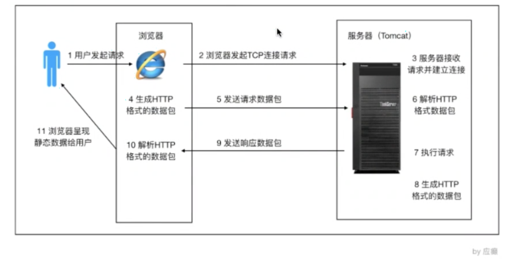
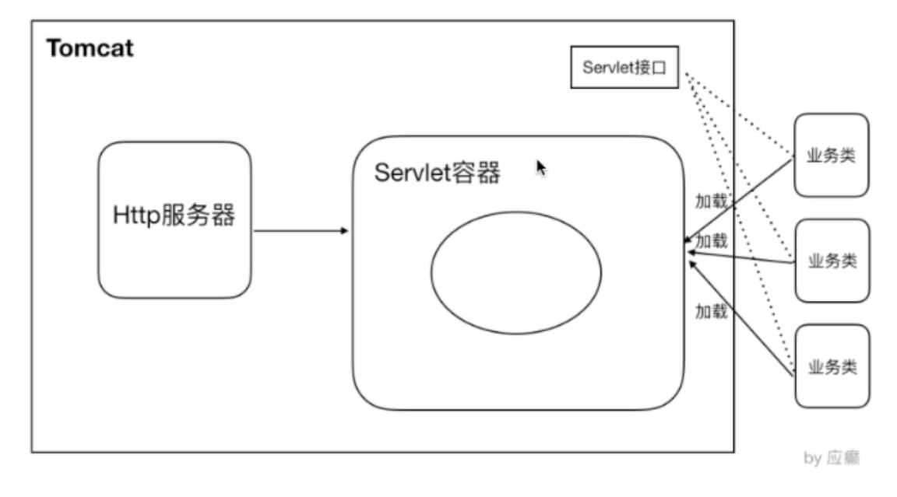
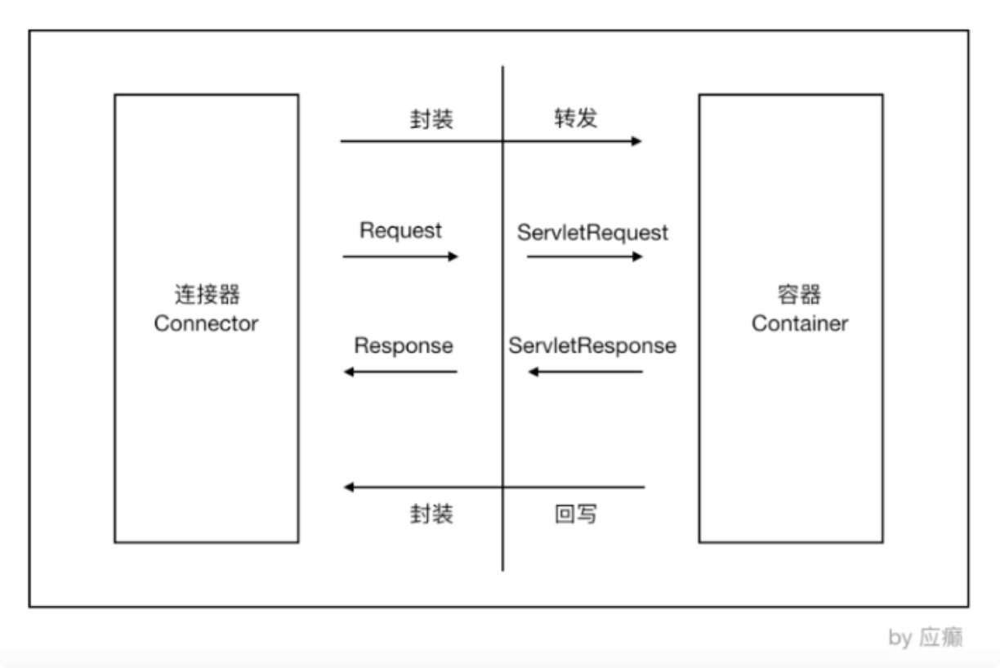
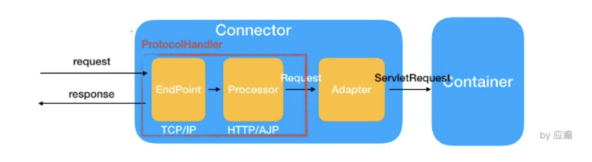
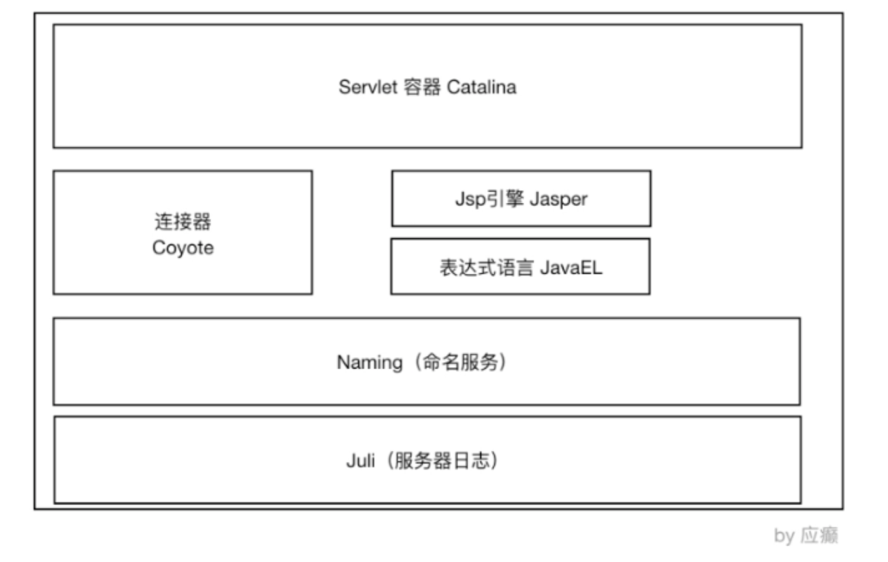
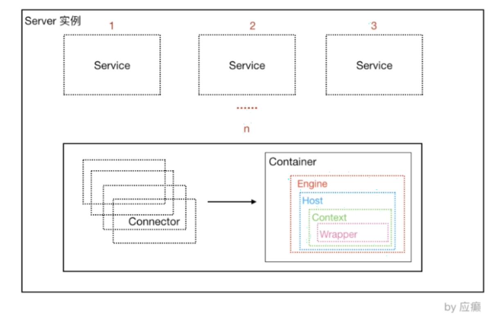

# Tomcat系统架构与原理剖析

> 本文是 Tomcat 学习笔记第 1 章。围绕「浏览器如何访问服务器」「Tomcat 两大核心组件（Coyote 连接器 + Catalina 容器）」展开。
> 关联笔记：[00-Tomcat总览](00-Tomcat总览.md)、[02-Tomcat服务器核心配置详解](02-Tomcat服务器核心配置详解.md)、[06-Tomcat类加载机制详解](06-Tomcat类加载机制详解.md)

## 📋 总纲

1. 浏览器访问服务器的流程
2. Tomcat 系统总体架构
3. 连接器组件 Coyote（协议与 IO 解耦）
4. Servlet 容器 Catalina（模块分层与结构）
5. Container 容器组件体系（Engine/Host/Context/Wrapper）

---

## 1. 浏览器访问服务器的流程

```
浏览器
  │  ① 输入 URL，发起 HTTP 请求
  ▼
HTTP 服务器（Tomcat）
  │  ② 接收请求，交给 Servlet 容器
  ▼
Servlet 容器
  │  ③ 通过 Servlet 接口调用业务类
  ▼
业务代码
```

)

**注意**：浏览器访问服务使用的是 **HTTP 协议**，HTTP 是**应用层协议**，用于定义数据通信的格式；具体的数据传输使用的是 **TCP/IP 协议**（传输层/网络层）。

---

## 2. Tomcat 系统总体架构

### 2.1 Tomcat 请求处理大致过程

```
HTTP 请求
  │
  ▼
连接器 Connector（Coyote）
  │  ① 接收 Socket 连接，解析 HTTP 字节流 → Request/Response 对象
  ▼
Servlet 容器（Catalina）
  │  ② 通过 Servlet 接口调用业务类
  ▼
业务代码
```

)

HTTP 服务器接收到请求之后把请求交给 **Servlet 容器**来处理，Servlet 容器通过 **Servlet 接口**调用业务类。

**Servlet 接口 + Servlet 容器这一整套内容 = Servlet 规范**。

### 2.2 Servlet 容器处理流程

当用户请求某个 URL 资源时：

1. HTTP 服务器会把请求信息使用 **ServletRequest 对象**封装起来
2. 进一步去调用 Servlet 容器中某个具体的 Servlet
3. Servlet 容器拿到请求后，根据 **URL 和 Servlet 的映射关系**，找到相应的 Servlet
4. 如果 Servlet 还没有被加载，就用**反射机制**创建这个 Servlet，并调用 Servlet 的 `init` 方法来**完成初始化**
5. 接着调用这个具体 Servlet 的 **`service` 方法**来处理请求，请求处理过程使用 ServletResponse 对象封装
6. 把 ServletResponse 对象返回给 HTTP 服务器，HTTP 服务器会把响应发送给客户端

### 2.3 Tomcat 系统总体架构

Tomcat 设计了**两个核心组件**：

| 组件 | 职责 | 核心功能 |
|---|---|---|
| **连接器 Connector（Coyote）** | 负责**对外交流** | 处理 Socket 连接，负责网络字节流与 Request 和 Response 对象的转化 |
| **容器 Container（Catalina）** | 负责**内部处理** | 加载和管理 Servlet，以及具体处理 Request 请求 |

两者配合完成 Tomcat 的两大核心功能：**对外通信 + 对内处理**。

---

## 3. Tomcat 连接器组件 Coyote

### 3.1 Coyote 简介

**Coyote 是 Tomcat 中连接器组件的名称，是对外的接口**。客户端通过 Coyote 与服务器建立连接、发送请求并接收响应。

核心职责：

- Coyote 封装了底层的网络通信（Socket 请求及响应处理）
- Coyote 使 **Catalina 容器与具体的请求协议及 IO 操作方式完全解耦**
- Coyote 将 Socket 输入转换封装为 Request 对象，进一步封装后交由 Catalina 容器进行处理；处理请求完成后，Catalina 通过 Coyote 提供的 Response 对象将结果写入输出流
- **Coyote 负责的是具体协议（应用层）和 IO（传输层）相关内容**

)

**Coyote 支持的 IO 模型与协议**：

| 层 | 名称 | 描述 |
|---|---|---|
| 应用层协议 | HTTP/1.1 | 大部分 Web 应用采用的访问协议 |
| 应用层协议 | AJP | 用于和 Web 服务器集成（如 Apache），以实现对静态资源的优化以及集群部署；当前支持 AJP/1.3 |
| 应用层协议 | HTTP/2 | HTTP/2.0 大幅度提升 Web 性能，下一代 HTTP 协议；自 8.5 以及 9.0 版本之后支持 |
| 传输层 IO | NIO | 非阻塞 I/O，采用 Java NIO 类库实现 |
| 传输层 IO | NIO2 | 异步 IO，采用 JDK7 最新 NIO2 类库实现 |
| 传输层 IO | APR | 采用 Apache 可移植运行库实现，是 C、C++ 编写的本地库；选择该方案需要单独安装 APR 库 |

> **历史**：Tomcat 8 之前默认采用 **BIO** 模式，之后改为 **NIO**。无论 NIO、NIO2 还是 APR，性能方面均优于以往的 BIO。

### 3.2 Coyote 的内部组件及流程

)

**Coyote 组件及作用**：

| 组件 | 作用描述 |
|---|---|
| **EndPoint** | Coyote 通信端点，即通信监听的接口，是具体 Socket 接收和发送处理器。是对**传输层**的抽象，因此 EndPoint 用来实现 TCP/IP 协议 |
| **Processor** | 协议处理接口，实现 HTTP 协议。Processor 接收来自 EndPoint 的 Socket，读取字节流解析成 Tomcat Request 和 Response 对象，并通过 Adapter 将其提交到容器处理。Processor 是对**应用层协议**的抽象 |
| **ProtocolHandler** | 协议接口，通过 EndPoint 和 Processor，实现针对具体协议的处理能力。Tomcat 按照协议和 IO 提供了 6 个实现类：`AjpNioProtocol`、`AjpAprProtocol`、`AjpNio2Protocol`、`Http11NioProtocol`、`Http11Nio2Protocol`、`Http11AprProtocol` |
| **Adapter** | 由于协议不同，客户端发过来的请求信息也不尽相同，Tomcat 定义了自己的 Request 类来封装这些请求信息。ProtocolHandler 接口负责解析请求并生成 Tomcat Request 类。但是这个 Request 对象**不是标准的 ServletRequest**，不能用 Tomcat Request 作为参数来调用容器。Tomcat 设计者的解决方案是引入 **CoyoteAdapter**——这是**适配器模式**的经典运用：连接器调用 Service 方法，传入的是 Tomcat Request 对象，CoyoteAdapter 负责将其转成 ServletRequest，再调用容器 |

**一句话总结 Coyote 数据流**：

```
Socket 字节流 → EndPoint（TCP/IP 传输层）→ Processor（HTTP 应用层解析）
→ Tomcat Request 对象 → CoyoteAdapter（适配器模式）→ ServletRequest → 容器
```

---

## 4. Tomcat Servlet 容器 Catalina

### 4.1 Tomcat 模块分层结构图及 Catalina 位置

**Tomcat 是一个由一系列可配置的组件构成的 Web 容器，而 Catalina 是 Tomcat 的 Servlet 容器**。

)

### 4.2 Servlet 容器 Catalina 的结构

)

其实，**可以认为整个 Tomcat 就是一个 Catalina 实例**。Tomcat 启动的时候会初始化这个实例，Catalina 实例通过加载 server.xml 完成其他实例的创建，创建并管理一个 Server；Server 创建并管理多个 Service；每个 Service 又可以有多个 Connector 和一个 Container。

| 组件 | 职责 |
|---|---|
| **Catalina** | 负责解析 Tomcat 的配置文件（server.xml），以此来创建服务器 Server 组件并进行管理 |
| **Server** | 服务器，表示整个 Catalina Servlet 容器以及其他组件，负责组装并启动 Servlet 引擎、Tomcat 连接器。Server 通过实现 **Lifecycle 接口**，提供了一种优雅的启动和关闭整个系统的方式 |
| **Service** | 服务，是 Server 内部的组件，一个 Server 包含多个 Service。它将若干个 Connector 组件绑定到一个 Container |
| **Container** | 容器，负责处理用户的 Servlet 请求，并返回对象给 Web 用户的模块 |

### 4.3 Container 组件的具体结构

Container 组件有几种具体的组件（**父子关系，分层架构**）：

| 组件 | 说明 |
|---|---|
| **Engine** | 表示整个 Catalina 的 Servlet 引擎，用来管理多个虚拟站点。一个 Service 最多只能有一个 Engine，但是一个引擎可包含多个 Host |
| **Host** | 代表一个虚拟主机，或者说一个站点。可以给 Tomcat 配置多个虚拟主机地址；而一个虚拟主机下可包含多个 Context |
| **Context** | 表示一个 Web 应用程序，一个 Web 应用可包含多个 Wrapper |
| **Wrapper** | 表示一个 Servlet。Wrapper 作为容器中的最底层，**不能包含子容器** |

```
Engine（引擎）
 └── Host（虚拟主机）
      └── Context（Web 应用）
           └── Wrapper（Servlet）
```

这 4 种组件是父子关系。Tomcat 通过这种分层的架构，使 Servlet 容器具有很好的灵活性。

> **上述组件的配置就体现在 conf/server.xml 中** → 详见 [02-Tomcat服务器核心配置详解](02-Tomcat服务器核心配置详解.md)

---

## 面试追问 Q&A

### Q1：Tomcat 为什么拆成 Coyote 和 Catalina 两部分？

答：**解耦**。Coyote 负责协议与 IO（应用层/传输层），Catalina 负责 Servlet 容器逻辑。这样协议升级（HTTP/1.1 → HTTP/2）或 IO 模型更换（BIO → NIO → APR）时，Servlet 容器代码完全不用动——Coyote 通过 Adapter 把协议差异消化在连接器内部。

### Q2：CoyoteAdapter 在请求链路中扮演什么角色？

答：适配器模式。ProtocolHandler 解析出的 Tomcat Request 不是标准 ServletRequest，不能直接传给容器；CoyoteAdapter 负责把 Tomcat Request 转成 ServletRequest 再调用容器 Service 方法——它是连接器与容器之间的桥梁。

### Q3：Container 四层组件的父子关系是什么？

答：Engine → Host → Context → Wrapper，层层包含。一个 Service 一个 Engine，Engine 管多个 Host（虚拟主机），Host 管多个 Context（Web 应用），Context 管多个 Wrapper（Servlet）。配置体现在 server.xml。

### Q4：Tomcat 8 之前默认 BIO，为什么改 NIO？

答：BIO 每个请求一个线程，高并发下线程数爆炸、上下文切换开销大；NIO 基于事件驱动（Selector），少量线程可处理大量连接，性能和扩展性显著提升。Tomcat 8 起默认 NIO。

