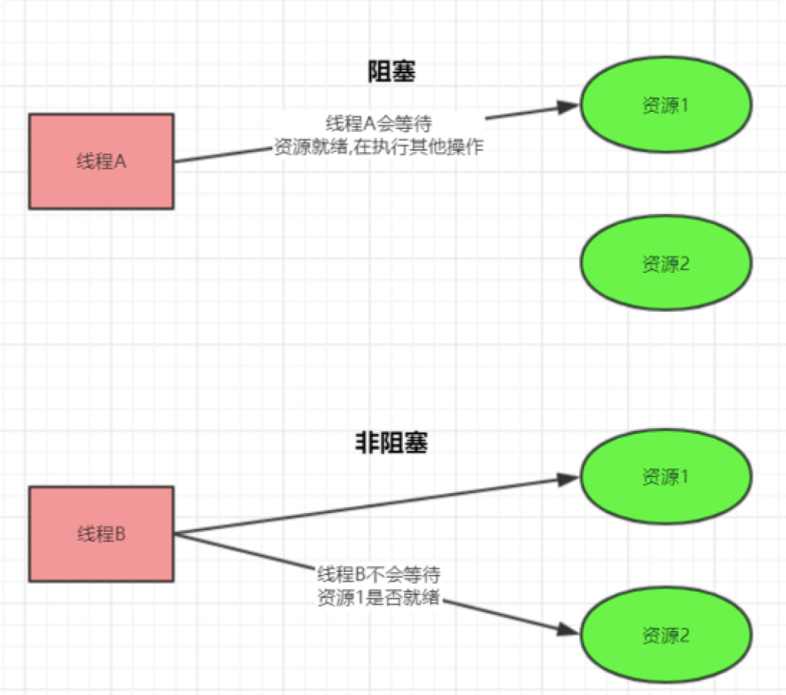
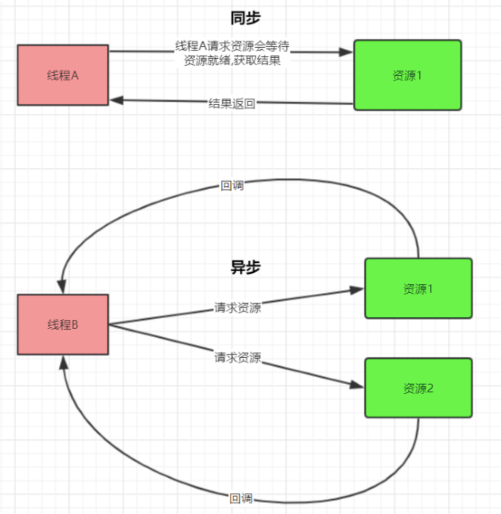
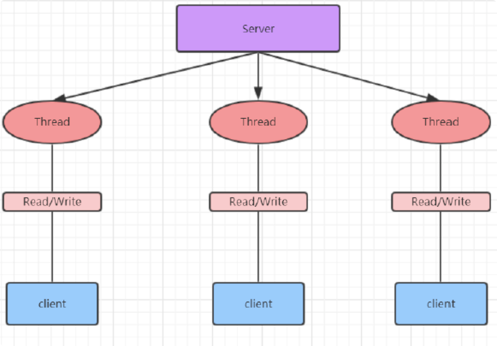
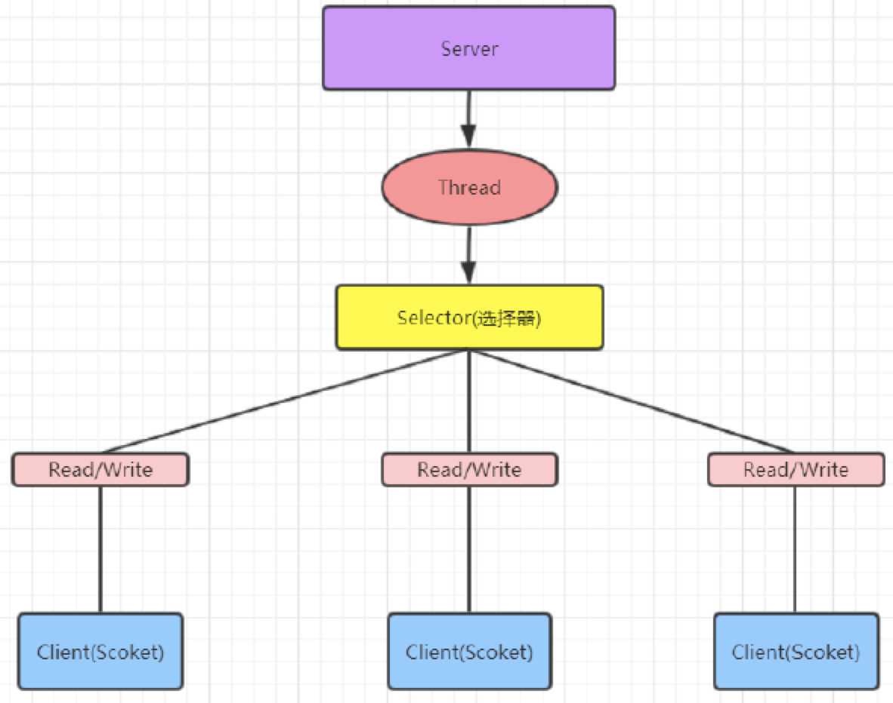

# 01-Socket与I/O模型

> 版本基线：Java Socket 编程 + BIO/NIO/AIO 三大 IO 模型（JDK 8 起 NIO 成熟）
> 受众：Java 后端开发，要理解网络通信的底层 I/O 模型演进。默认你懂 TCP（**01-TCP与UDP详解**（见知识库））、线程基本概念。
> 关联笔记：[00-RPC与远程调用总览](../../服务通信/00-RPC与远程调用总览.md)、[02-Java NIO详解](02-Java NIO详解.md)、[03-Netty核心机制详解](03-Netty核心机制详解.md)

## 📋 总纲

- 1. Socket 网络编程回顾
- 2. IO 模型：BIO / NIO / AIO

## 学习目标

学完本篇你能：

1. 写出一个简单的 Java Socket 客户端/服务端
2. 说清阻塞/非阻塞、同步/异步两组概念的差异
3. 对比 BIO/NIO/AIO 三种 IO 模型的工作原理与适用场景
4. 理解"一连接一线程" vs "一线程多连接"的性能差异根源
5. 为 [02-Java NIO详解](02-Java NIO详解.md) 和 [03-Netty核心机制详解](03-Netty核心机制详解.md) 建立基础

## 前置知识

- **01-TCP与UDP详解**（见知识库）——Socket 是 TCP 编程接口
- 需掌握：Java 线程、TCP 三次握手

---

# 1. Socket网络编程回顾
## 1.1 概述
Socket，套接字就是两台主机之间逻辑连接的端点。TCP/IP协议是传输层协议，主要解决数据如何在网络中传输，而HTTP是应用层协议，主要解决如何包装数据。Socket是通信的基石，是支持TCP/IP协议的网络通信的基本操作单元。它是网络通信过程中端点的抽象表示，包含进行网络通信必须的五种信息：
- 连接使用的协议
- 本地主机的IP地址
- 本地进程的协议端口
- 远程主机的IP地址
- 远程进程的协议
- 端口
## 1.2 Socket 整体流程
Socket编程主要涉及到客户端和服务端两个方面，首先是在服务器端创建一个服务器套接字（ServerSocket），并把它附加到一个端口上，服务器从这个端口监听连接。端口号的范围是0到65536，但是0到1024是为特权服务保留的端口号，可以选择任意一个当前没有被其他进程使用的端口。
客户端请求与服务器进行连接的时候，根据服务器的域名或者IP地址，加上端口号，打开一个套接字。当服务器接受连接后，服务器和客户端之间的通信就像输入输出流一样进行操作。
## 1.3 简单代码实现
- 服务端：
```java
public class ServerDemo {
    public static void main(String[] args) throws IOException {
        ExecutorService executorService = Executors.newCachedThreadPool();

        ServerSocket serverSocket = new ServerSocket(9091);
        while (true){
            Socket accept = serverSocket.accept();

            //
            executorService.execute(() -> handle(accept));
        }
    }

    private static void handle(Socket accept) {
        try {
            InputStream inputStream = accept.getInputStream();
            byte[] bytes = new byte[1024];
            int read = inputStream.read(bytes);
            System.out.println(new String(bytes, 0, read));

            //
            OutputStream outputStream = accept.getOutputStream();
            outputStream.write("...".getBytes());
        }catch (Exception e){
            e.printStackTrace();
        }finally {
            try {
                accept.close();
            }catch (Exception e){
                e.printStackTrace();
            }
        }
    }

}
```
- 客户端：
```java
public class ClientDemo {
    public static void main(String[] args) throws IOException {
        Socket socket = new Socket("127.0.0.1", 9091);

        OutputStream outputStream = socket.getOutputStream();

        String msg = new Scanner(System.in).nextLine();
        outputStream.write(msg.getBytes());

        // 。。。
        InputStream inputStream = socket.getInputStream();
        byte[] bytes = new byte[1024];
        int read = inputStream.read(bytes);
        System.out.println(""+ new String(bytes, 0, read).trim());

        // ...
        socket.close();

    }
}
```
# 2. IO 模型
I/O 模型简单的理解：就是用什么样的通道进行数据的发送和接收，很大程度上决定了程序通信的
性能
Java 共支持 3 种网络编程模型/IO 模式：
- BIO(同步并阻塞)
- NIO(同步非阻塞)
- AIO(异步非阻塞)
阻塞与非阻塞

同步与异步
主要是指的数据的请求方式
同步与异步是指访问数据的一种机制。

## 2.1 BIO
同步阻塞
就是传统的 Socket 编程
服务器实现模式为一个连接一个线程，即客户端有链接请求时服务器端就需要启动一个线程进行处理，如果这个连接不做任何事情会造成不必要的线程开销，可以通过线程池机制改善（实现多个客户连接服务器）

问题分析
- 每个请求都需要创建独立的线程，与对应的客户端进行数据 Read，业务处理，数据 Write
- 并发数较大时，需要创建大量线程来处理连接，系统资源占用较大
- 连接建立后，如果当前线程暂时没有数据可读，则线程就阻塞在 Read 操作上，造成线程资源浪费
## 2.2 NIO
同步非阻塞
服务器实现模式为一个线程处理多个请求（连接），即客户端发送的连接请求都会注册到多路复用器上，多路复用器轮询到连接有 IO 请求就进行处理。

## 2.3 AIO
异步非阻塞
AIO 引入异步通道的概念，采用了 Proactor 模式，简化了程序编写，有效的请求才启动线程，它的特点是先由操作系统完成后才通知服务端程序启动线程去处理，一般适用于连接数较多且连接时间较长的应用
Proactor 模式是一个消息异步通知的设计模式，Proactor 通知的不是就绪事件，而是操作完成事件，这也就是操作系统异步 IO 的主要模型。
### 案例 1
```java
public static void main(String[] args) {
    try(AsynchronousFileChannel channel = AsynchronousFileChannel.open(Paths.get("data.txt"), StandardOpenOption.READ)) {
        // 参数 1 byteBuffer
        // 参数 2 读取的起始位置
        // 参数 3 附件
        // 参数 4 回调对象 CompletionHandler
        ByteBuffer buffer = ByteBuffer.allocate(16);
        channel.read(buffer, 0, buffer, new CompletionHandler<Integer, ByteBuffer>() {
            /**
             * read 成功
             * @param result 读取的字节数
             * @param attachment 传入的附件，方便下次继续读取或其他处理
             */
            @Override
            public void completed(Integer result, ByteBuffer attachment) {
                System.out.println(result);
            }

            @Override
            public void failed(Throwable exc, ByteBuffer attachment) {
            }
        });

        // 上面干活的线程是守护线程
        System.in.read();

    } catch (Exception e) {
        e.printStackTrace();
    }
}
```
## 2.4 BIO、NIO、AIO 适用场景分析
1. BIO适用于连接数目比较小且固定的架构，这种方式对服务器资源要求比较高，并发局限于应用中。JKD1.4 之前是唯一选择，但程序简单易于理解。
1. NIO 方式适用于连接数目多且连接比较短（轻操作）架构，比如聊天服务器，弹幕系统，服务器间通讯等
编程比较复杂，JDK1.4 开始支持
1. AIO 适用于连接数目多且连接比较长的架构，比如相册服务器，充分调用 OS 参与并发操作
编程比较复杂，JDK7 开始支持

## 最佳实践

- **BIO 适合连接数少、逻辑简单的场景**：一连接一线程，代码直观
- **NIO 适合连接数多、短连接场景**：Selector 复用线程，避免线程爆炸
- **AIO 适合读写耗时长的场景**：异步回调，但编码复杂、生态一般
- **生产首选 Netty**：封装 NIO 的复杂度，提供高性能网络通信（见 [03-Netty核心机制详解](03-Netty核心机制详解.md)）

## 常见踩坑

| 编号 | 坑 | 现象 | 解决方案 |
|---|---|---|---|
| #S1 | BIO 高并发下线程爆炸 | OOM/线程数飙升 | 换 NIO/Netty |
| #S2 | 阻塞/非阻塞概念混淆 | 无法定位性能瓶颈 | 阻塞=调用方等结果；非阻塞=调用方不等 |
| #S3 | 同步/异步与阻塞/非阻塞混为一谈 | 概念理解错误 | 两组是正交概念（见正文 2 节） |
| #S4 | Socket 不关流 | 连接泄漏 | try-with-resources 或 finally close |

## 小结

- Socket 是 TCP 编程接口：服务端 bind/listen/accept，客户端 connect
- 阻塞/非阻塞（调用方是否等待）+ 同步/异步（数据获取方式）是正交的两组概念
- BIO：一连接一线程，简单但线程爆炸；NIO：Selector 一线程管多连接；AIO：异步回调
- 演进主线：BIO → NIO → AIO → Netty（[03-Netty核心机制详解](03-Netty核心机制详解.md)）

## 下一篇

[02-Java NIO详解](02-Java NIO详解.md)——NIO 三大核心：Buffer/Channel/Selector

## 参考资料

- [Oracle Java Tutorials: Socket Programming](https://docs.oracle.com/javase/tutorial/networking/sockets/)，查询日期：2026-08-09
