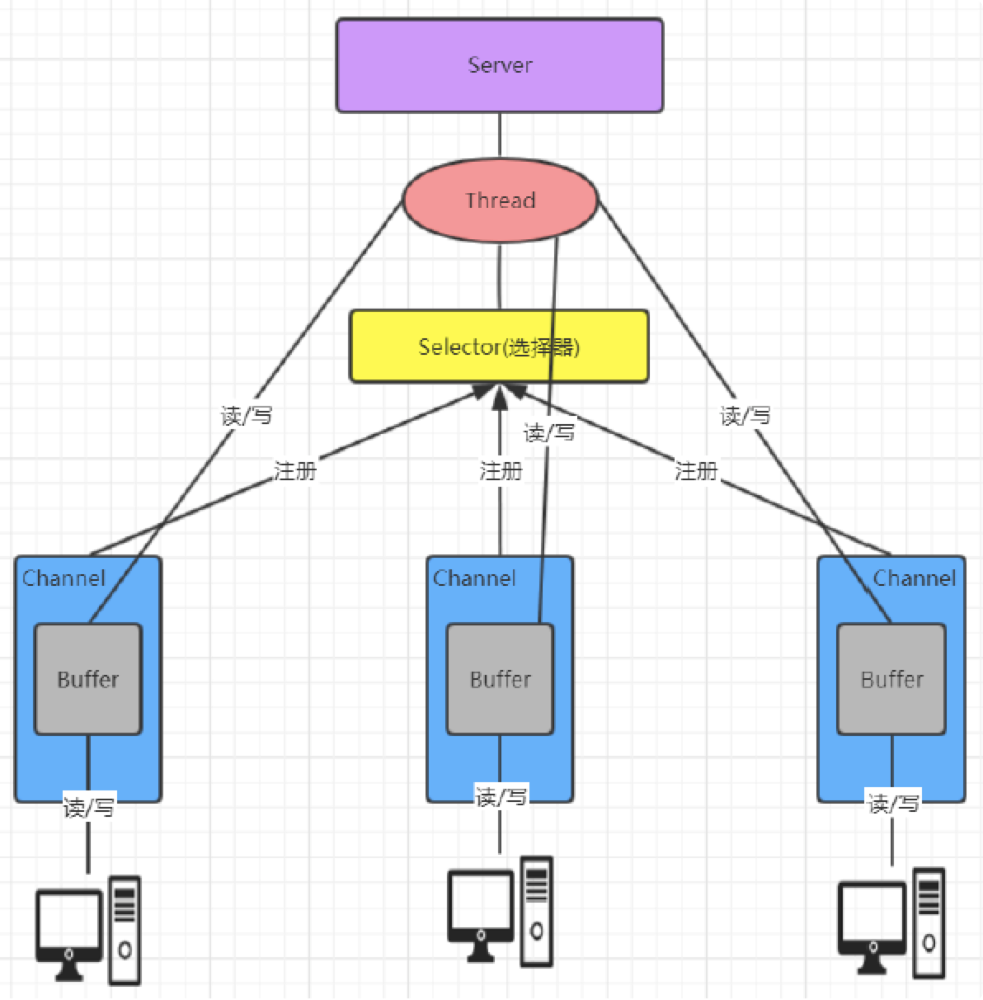
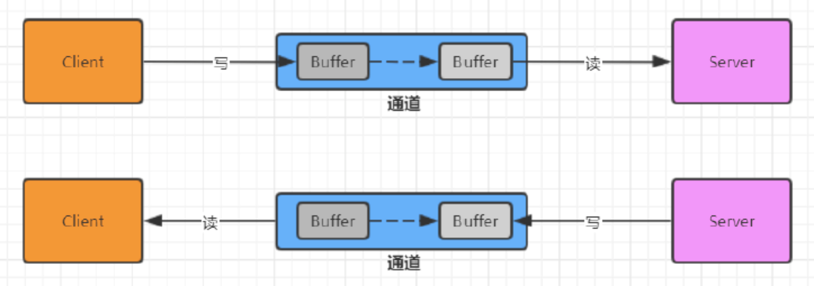
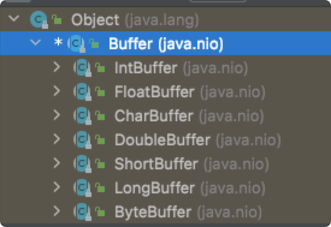
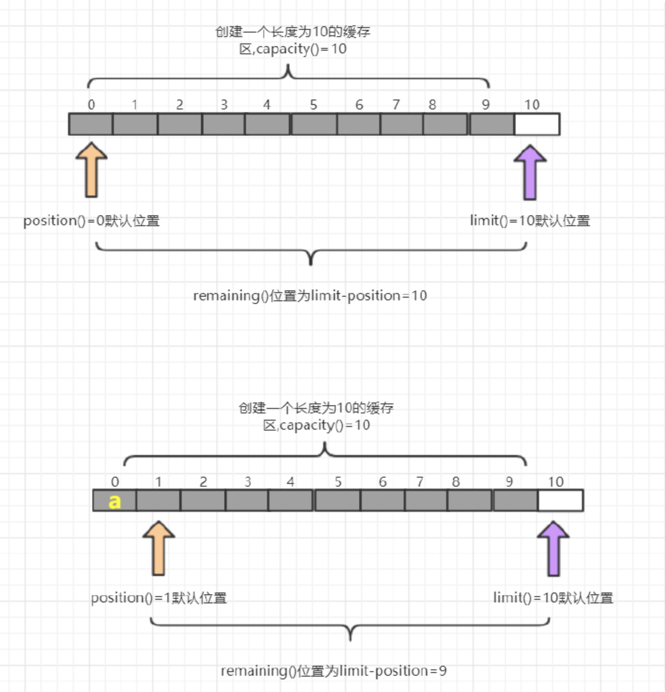
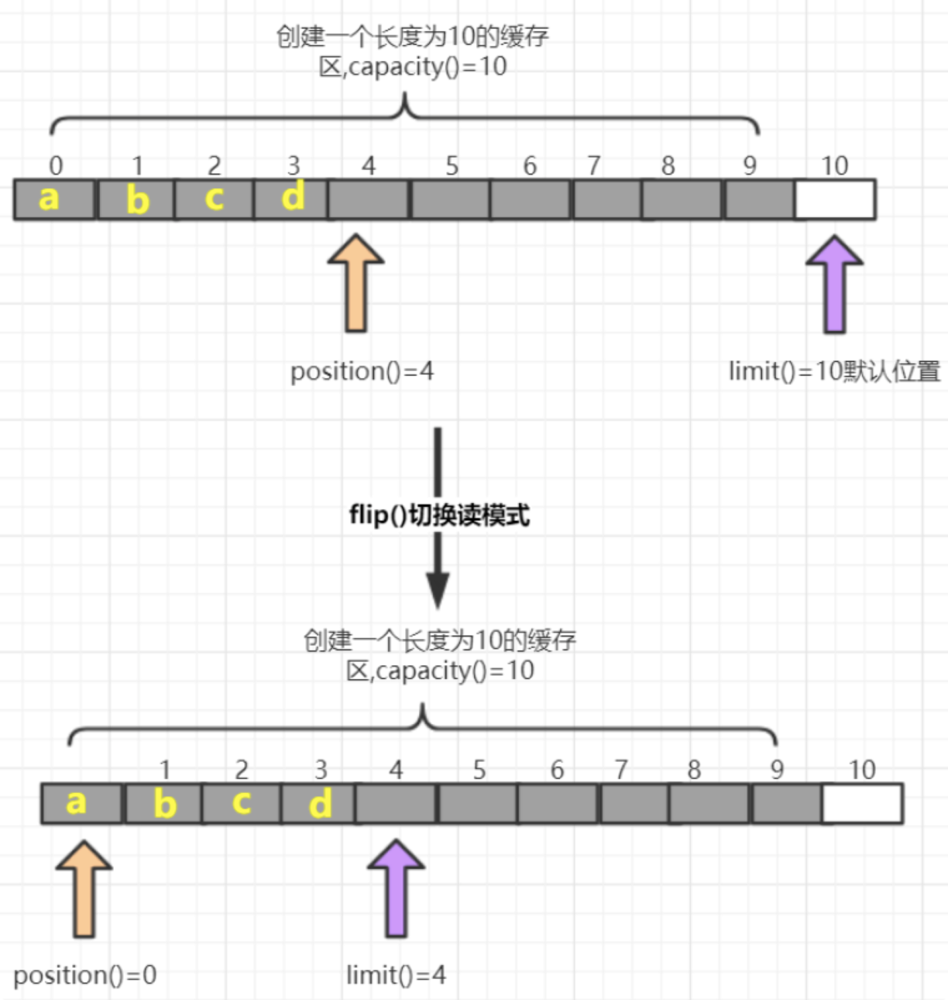
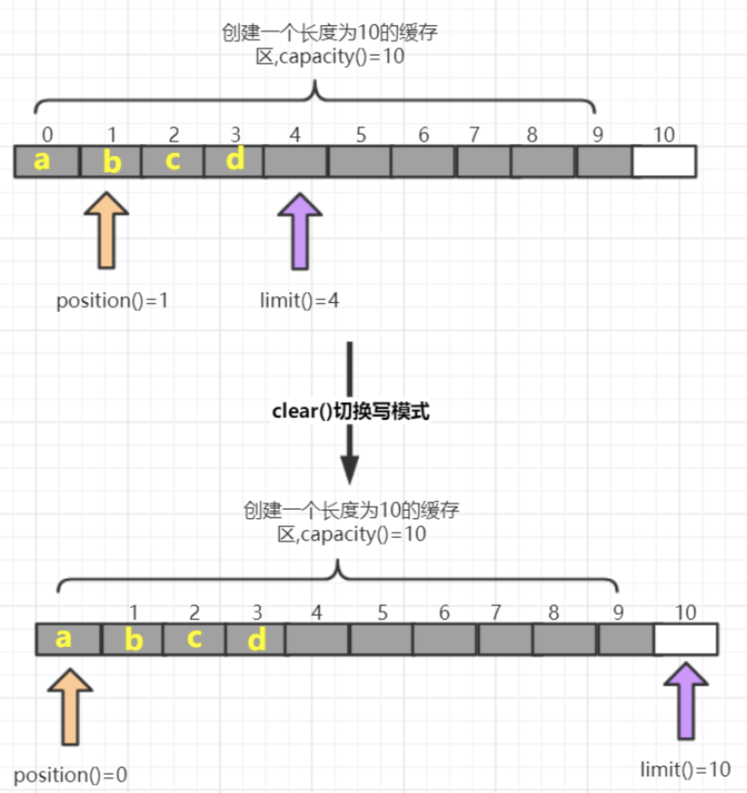
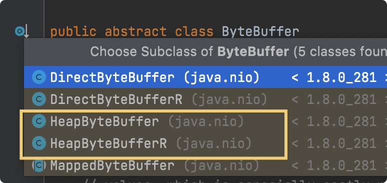

# 02-Java NIO详解

> 版本基线：JDK 1.4 引入的 New IO（NIO），同步非阻塞
> 受众：Java 后端开发，已懂 [01-Socket与IO模型](01-Socket与IO模型.md) 的 BIO/NIO 概念，要深入 NIO 三大核心组件。默认你懂 Java 集合、线程。
> 关联笔记：[00-RPC与远程调用总览](../../服务通信/00-RPC与远程调用总览.md)、[01-Socket与IO模型](01-Socket与IO模型.md)、[03-Netty核心机制详解](03-Netty核心机制详解.md)

## 📋 总纲

- 1. NIO 三大核心组件
- 2. 缓冲区 Buffer
- 3. 通道 Channel
- 4. 选择器 Selector
- 5. 处理消息边界
- 6. 多线程改进

## 学习目标

学完本篇你能：

1. 说清 NIO 三大核心组件（Channel/Buffer/Selector）的分工
2. 熟练使用 Buffer 的读写流程（allocate/flip/clear/compact）
3. 理解 Channel 与流的区别（双向、非阻塞）
4. 用 Selector 实现单线程监听多通道
5. 理解消息边界问题和多线程改进方案
6. 为 [03-Netty核心机制详解](03-Netty核心机制详解.md) 建立 NIO 基础

## 前置知识

- [01-Socket与IO模型](01-Socket与IO模型.md)——BIO/NIO/AIO 概念基础
- 需掌握：Java IO 流、Socket 编程基础

---

Java NIO 全称java non-blocking IO ，是指 JDK 提供的新 API。从 JDK1.4 开始，Java 提供了一系列改进的输入/输出的新特性，被统称为 NIO(即 New IO)，是同步非阻塞的.
NIO是 面向缓冲区编程的。数据读取到一个缓冲区中，需要时可在缓冲区中前后移动，这就增加了处理过程中的灵活性，使用它可以提供非阻塞式的高伸缩性网络
Java NIO 的非阻塞模式，使一个线程从某通道发送请求或者读取数据，但是它仅能得到目前可用的数据，如果目前没有数据可用时，就什么都不会获取，而不是保持线程阻塞，所以直至数据变的可以读取之前，该线程可以继续做其他的事情。 非阻塞写也是如此，一个线程请求写入一些数据到某通道，但不需要等待它完全写入， 这个线程同时可以去做别的事情。
通俗理解：NIO 是可以做到用一个线程来处理多个操作的。假设有 10000 个请求过来,根据实际情况，可以分配50 或者 100 个线程来处理。不像之前的阻塞 IO 那样，非得分配 10000 个。
NIO 和 BIO 比较
- BIO 以流的方式处理数据,而 NIO 以缓冲区的方式处理数据,缓冲区 I/O 的效率比流 I/O 高很多
- BIO 是阻塞的，NIO则是非阻塞的
- BIO 基于字节流和字符流进行操作，而 NIO 基于 Channel(通道)和 Buffer(缓冲区)进行操作，数据总是从通道读取到缓冲区中，或者从缓冲区写入到通道中。Selector(选择器)用于监听多个通道的事件（比如：连接请求， 数据到达等），因此使用单个线程就可以监听多个客户端通道
# 1、NIO 三大核心组件
NIO 有三大核心部分：
- Channel(通道)
- Buffer(缓冲区),
- Selector(选择器)

1. 每个 channel 都会对应一个 Buffer
1. Selector 对应一个线程， 一个线程对应多个 channel(连接)
1. 每个 channel 都注册到 Selector选择器上
1. Selector不断轮询查看Channel上的事件, 事件是通道Channel非常重要的概念
1. Selector 会根据不同的事件，完成不同的处理操作
1. Buffer 就是一个内存块 ， 底层是有一个数组
1. 数据的读取写入是通过 Buffer, 这个和 BIO , BIO 中要么是输入流，或者是输出流, 不能双向，但是NIO 的 Buffer 是可以读也可以写 , channel 是双向的.
# 2、缓冲区 Buffer
## 2.1 基本介绍
缓冲区（Buffer）：缓冲区本质上是一个可以读写数据的内存块，可以理解成是一个数组，该对象提供了一组方法，可以更轻松地使用内存块，，缓冲区对象内置了一些机制，能够跟踪和记录缓冲区的状态变化情况。Channel 提供从网络读取数据的渠道，但是读取或写入的数据都必须经由 Buffer.

## 2.2 Buffer 常用 API 介绍
### 2.2.1 Buffer 类及其子类
```
java.nio.Buffer
```

### 2.2.2 创建
在各个具体类型的 Buffer 中定义了创建的方法：
因为返回值等都不太一样，这部分方法就放在具体的子抽象类中。
比如：
```java
public class CreateBufferDemo {

    public static void main(String[] args) {
        // 1、创建指定长度缓冲区
        /*
        ByteBuffer byteBuffer = ByteBuffer.allocate(5);
        for (int i = 0; i < 5; i++) {
            System.out.println(byteBuffer.get());
        }
        */
        // 多执行一次--会异常 java.nio.BufferUnderflowException
        // System.out.println(byteBuffer.get());

        // 创建一个有内容的缓冲区
        ByteBuffer wrapBuffer = ByteBuffer.wrap("lub".getBytes());
        System.out.println(wrapBuffer.array().length);
        while (wrapBuffer.hasRemaining()){
            System.out.println(wrapBuffer.get());
        }
    }
}
```
### 2.2.3 添加数据
这里也是以 byteBuffer 来举例。

```java
import java.nio.ByteBuffer;
/**
* 添加缓冲区
*/
public class PutBufferDemo {
    public static void main(String[] args) {
        //1.创建一个指定长度的缓冲区, 以ByteBuffer为例
        ByteBuffer byteBuffer = ByteBuffer.allocate(10);
        System.out.println(byteBuffer.position());//0 获取当前索引所在位置
        System.out.println(byteBuffer.limit());//10 最多能操作到哪个索引
        System.out.println(byteBuffer.capacity());//10 返回缓冲区总长度
        System.out.println(byteBuffer.remaining());//10 还有多少个能操作

        //修改当前索引位置
        //byteBuffer.position(1);
        //修改最多能操作到哪个索引位置
        //byteBuffer.limit(9);
        //System.out.println(byteBuffer.position());//1 获取当前索引所在位置
        //System.out.println(byteBuffer.limit());//9 最多能操作到哪个索引
        //System.out.println(byteBuffer.capacity());//10 返回缓冲区总长度
        //System.out.println(byteBuffer.remaining());//8 还有多少个能操作

        //添加一个字节
        byteBuffer.put((byte) 97);
        System.out.println(byteBuffer.position());//1 获取当前索引所在位置
        System.out.println(byteBuffer.limit());//10 最多能操作到哪个索引
        System.out.println(byteBuffer.capacity());//10 返回缓冲区总长度
        System.out.println(byteBuffer.remaining());//9 还有多少个能操作

        //添加一个字节数组
        byteBuffer.put("abc".getBytes());
        System.out.println(byteBuffer.position());//4 获取当前索引所在位置
        System.out.println(byteBuffer.limit());//10 最多能操作到哪个索引
        System.out.println(byteBuffer.capacity());//10 返回缓冲区总长度
        System.out.println(byteBuffer.remaining());//6 还有多少个能操作

        //当添加超过缓冲区的长度时会报错
        byteBuffer.put("012345".getBytes());
        System.out.println(byteBuffer.position());//10 获取当前索引所在位置
        System.out.println(byteBuffer.limit());//10 最多能操作到哪个索引
        System.out.println(byteBuffer.capacity());//10 返回缓冲区总长度
        System.out.println(byteBuffer.remaining());//0 还有多少个能操作
        System.out.println(byteBuffer.hasRemaining());// false 是否还能有操作的数组

        // 如果缓存区存满后, 可以调整position位置可以重复写,这样会覆盖之前存入索引的对应的值
        byteBuffer.position(0);
        byteBuffer.put("012345".getBytes());
    }
}
```
### 2.2.4 读取数据
这里也是以 byteBuffer 来举例。
flip

clear方法图解

```java
import java.nio.ByteBuffer;
/**
* 从缓冲区中读取数据
*/
public class GetBufferDemo {
    public static void main(String[] args) {
        //1.创建一个指定长度的缓冲区
        ByteBuffer allocate = ByteBuffer.allocate(10);

        allocate.put("0123".getBytes());
        System.out.println("position:" + allocate.position());//4
        System.out.println("limit:" + allocate.limit());//10
        System.out.println("capacity:" + allocate.capacity());//10
        System.out.println("remaining:" + allocate.remaining());//6

        //切换读模式
        System.out.println("读取数据--------------");
        allocate.flip();
        System.out.println("position:" + allocate.position());//4
        System.out.println("limit:" + allocate.limit());//10
        System.out.println("capacity:" + allocate.capacity());//10
        System.out.println("remaining:" + allocate.remaining());//6
        for (int i = 0; i < allocate.limit(); i++) {
        System.out.println(allocate.get());
        }
        //读取完毕后.继续读取会报错,超过limit值
        //System.out.println(allocate.get());

        //读取指定索引字节
        System.out.println("读取指定索引字节--------------");
        System.out.println(allocate.get(1));

        System.out.println("读取多个字节--------------");
        // 重复读取
        allocate.rewind();
        byte[] bytes = new byte[4];
        allocate.get(bytes);
        System.out.println(new String(bytes));

        // 将缓冲区转化字节数组返回
        System.out.println("将缓冲区转化字节数组返回--------------");
        byte[] array = allocate.array();
        System.out.println(new String(array));

        // 切换写模式,覆盖之前索引所在位置的值
        System.out.println("写模式--------------");
        allocate.clear();
        allocate.put("abc".getBytes());
        System.out.println(new String(allocate.array()));
    }
}
```
注意事项
- capacity：容量（长度）limit： 界限（最多能读/写到哪里）posotion：位置（读/写哪个索引）
- 获取缓冲区里面数据之前，需要调用flip方法
- 再次写数据之前，需要调用clear方法，但是数据还未消失，等再次写入数据，被覆盖了才会消失。
### 2.2.5 其他方法
- compact
  将剩余没有读的数据向前移动，从 0 开始
  该移动方法是复制的动作，最后的无法覆盖的不用管。
  position 指针指向没有覆盖的第 1 个数据，写入数据的时候会覆盖。
  切换写模式
- rewind
  从头开始读
- mark & reset
  - mark
    做一个标记，记录 position 位置
  - reset
    将 position 重置到mark 的位置
### 2.2.6 分散读取
按照指定的长度，一次性将很多数据读取到多个 buffer 中。
```java
channel.read(new ByteBuffer[]{bf1,bf2,bf3})
```
### 2.2.7 聚合写入
将多个 Buffer 中的数据一次性写入
```java
channel.write(new ByteBuffer[]{bf1,bf2,bf3})
```
## 2.3 只读
这里以 ByteBuffer 为例：
因为 ByteBuffer 默认情况下创建方法实际创建的是子类：

后面带
```java
public ByteBuffer asReadOnlyBuffer() {

        return new HeapByteBufferR(hb,
                                     this.markValue(),
                                     this.position(),
                                     this.limit(),
                                     this.capacity(),
                                     offset);
    }
```
普通的调用该方法可以实现转换成只读。
> 我们可以随时将一个普通的 Buffer 调用该方法变成只读 Buffer，但是不能将一个只读 Buffer 转变为普通 Buffer。
> 只读 Buffer 的实现方法是：在可写方法上直接抛出异常
## 2.4 直接缓冲 DirectxxxBuffer
这里以
```java
byteBuffer.allocateDirect(10);
```
```java

    public static ByteBuffer allocateDirect(int capacity) {
        return new DirectByteBuffer(capacity);
    }
```
零拷贝
调用的是 C 的 Native 函数进行内存的操作和释放。
在
## 2.5 内存映射文件
内存映射文件包含虚拟内存中文件的内容。 借助文件和内存空间之间的这种映射，应用（包括多个进程）可以直接对内存执行读取和写入操作，从而修改文件。
```java
public class NioTest001 {
    public static void main(String[] args) throws IOException {
        // 测试内存映射文件
        RandomAccessFile randomAccessFile = new RandomAccessFile("test2_01.txt", "rw");
        FileChannel fileChannel = randomAccessFile.getChannel();

        MappedByteBuffer mappedByteBuffer = fileChannel.map(FileChannel.MapMode.READ_WRITE, 0, 3);

        // 操作内存，不需要直接操作文件
        mappedByteBuffer.put(0, (byte)'a');
        mappedByteBuffer.put(1, (byte)'c');
        mappedByteBuffer.put(2, (byte)'b');
        // 关闭刷新后查看文件内存。
        randomAccessFile.close();
    }
}
```
# 3、通道 Channel
## 3.1 基本介绍
通常来说NIO中的所有IO都是从 Channel（通道） 开始的。NIO 的通道类似于流，但有些区别如下：
- 通道可以读也可以写，流一般来说是单向的（只能读或者写，所以之前我们用流进行IO操作的时候需要分别创建一个输入流和一个输出流）
- 通道可以异步读写
- 通道总是基于缓冲区Buffer来读写
> 📌 原笔记此处有「Channel 通道」示意图（图片已在原笔记丢失），可用文字理解：Channel 类似双向流，数据必须经 Buffer 读写。
## 3.2 常用类介绍
### 3.2.1 Channel 接口
常 用 的Channel实现类类 有 ：
- FileChannel
- DatagramChannel
- ServerSocketChannel
  - 类似 ServerSocket
- SocketChannel
  - 类似 Socket
> 📌 原笔记此处有「Selector 选择器」示意图（图片已在原笔记丢失），可用文字理解：Selector 监听多个 Channel 的就绪事件。
### 3.2.2 FileChannel
> [!note]
> 只能工作在阻塞模式下
三种获取方式：
- FileInputStream
  只读
- FileOutputStream
  只写
- RandomAccessFile
  可读可写
复制文件案例
以下这种方式，效率高，因为底层使用优化后的零拷贝技术。
```java
public static void main(String[] args){
  try(
    FileChannel from = new FileInputStream("data.txt").getChannel();
    FileChannel to = new FileOutputStream("to.txt").getChannle();
  ){
    //复制文件
    long size = from.size();
    // left 变量代表还剩多少字节
    for (long left = size; left > 0;){
      left -= from.transferTo((size - left), left, to);
    }

  }catch(IOException e){
    //...
  }

}
```
### 3.2.3 ServerSocketChannel
```java
public class NioServer {
    public static void main(String[] args) throws IOException, InterruptedException {
        //1. 打开服务端通道
        ServerSocketChannel serverSocketChannel = ServerSocketChannel.open();
        //2. 绑定端口
        serverSocketChannel.bind(new InetSocketAddress(9091));
        // 3. 模式阻塞，需设置非阻塞模式
        serverSocketChannel.configureBlocking(false);
        //4. 检查是否客户端链接,有客户端链接会返回对应的通道
        while (true){
            SocketChannel socketChannel = serverSocketChannel.accept();
            if (socketChannel==null){
                // 没有客户端链接
                System.out.println("没有...");
                Thread.sleep(1000);
                continue;
            }
            //5. 获取客户端传递过来的数据，并把数据放到 ByteBuffer 中
            ByteBuffer byteBuffer = ByteBuffer.allocate(1024);
            /*
            返回值解读：
            - 正数：本次读到有效字节数
            - 0：本次没有读到数据
            - -1：读到末尾
            模式解读：
              socketChannel也可以设置非阻塞，和serverSocketChannel一样；当是非阻塞时， 下面的读取方法读取不到数据的时候返回值为0
             */
            int readCount = socketChannel.read(byteBuffer);
            System.out.println(new String(byteBuffer.array(), 0, readCount, StandardCharsets.UTF_8));

            //6. 给客户端会写数据
            socketChannel.write(ByteBuffer.wrap("......".getBytes()));
            //7. 释放资源
            socketChannel.close();
        }
    }
}
```
### 3.2.4 SocketChannel
```java
public class NioClient {
    public static void main(String[] args) throws IOException {
        //1. 打开通道
        SocketChannel socketChannel = SocketChannel.open();
        //2. 设置连接 IP 和端口号
        socketChannel.connect(new InetSocketAddress("127.0.0.1", 9091));
        //3. 写出数据
        socketChannel.write(ByteBuffer.wrap("？？？".getBytes(StandardCharsets.UTF_8)));
        //4.接收数据
        ByteBuffer byteBuffer = ByteBuffer.allocate(1024);
        int readCount = socketChannel.read(byteBuffer);
        System.out.println(new String(byteBuffer.array(), 0, readCount,StandardCharsets.UTF_8));

        socketChannel.close();
    }
}
```
# 4、选择器 Selector
## 4.1 基本介绍
可以用一个线程，处理多个的客户端连接，就需使用到NIO的Selector(选择器).
Selector 能够检测多个注册的服务端通道上是否有事件发生，如果有事件发生，便获取事件然后针对每个事件进行相应的处理。
这样就可以只用一个单线程去管理多个通道，也就是管理多个连接和请求。
在没有选择器的情况下，比如上面
> 📌 原笔记此处有「Selector 多路复用」示意图（图片已在原笔记丢失），可用文字理解：单线程通过 Selector 管理多个 Channel 连接。
> [!note]
> 只有在通道真正有读写事件发生时，才会进行读写，就大大地减少了系统开销，并且不必为每个连接都创建一个线程，不用去维护多个线程，避免了多线程之间的上下文切换导致的开销等。
## 4.2 常用 API
### 4.2.1 Selector 抽象类
```java
java.nio.channels.Selector
```
> 📌 原笔记此处有「Selector 常用 API」示意图（图片已在原笔记丢失）。
- Selector.open()
得到一个选择器对象
- selector.select()
阻塞监听所有注册的通道，当有对应的事件操作时，会将 SelectionKey 放入集合内部并返回事件数量
- selector.select(1000)
阻塞 1000 毫秒，监控所有注册的通道，当有对应的事件操作时，会将 SelectionKey 放入集合内部并返回
- selector.selectedKeys()
返回存有 SelectionKey 的集合
### 4.2.2 SelectionKey
```
java.nio.channels.SelectionKey
```
> 📌 原笔记此处有「SelectionKey」示意图（图片已在原笔记丢失），可用文字理解：SelectionKey 封装 Channel 注册到 Selector 时的就绪事件集合。
常用方法：
- SelectionKey.isAcceptable()
是否是连接继续事件
- SelectionKey.isConnectable()
是否是连接就绪事件
- SelectionKey.isReadable()
是否是读就绪事件
- SelectionKey.isWritable()
是否是写就绪事件
定义的 4 种事件
- SelectionKey.OP_ACCEPT
接收连接事件，表示服务器监听到了客户端链接，服务器可以接收这个链接了
- SelectionKey.OP_CONNECT
连接就绪事件，表示客户端与服务器的连接已经建立成功
- SelectionKey.OP_READ
读就绪事件，表示通道中已经有了可读的数据，可以执行读操作了
（通道目前有数据，可以进行读操作了）
- SelectionKey.OP_WRITE
写就绪事件，表示已经可以向通道写数据了
（通道目前可以用于写操作）
### 4.2.3 代码示例
服务端步骤：
1. 打开一个服务端通道
1. 绑定对应端口号
1. 通道默认是阻塞的，需要设置为非阻塞
1. 创建选择器
1. 将服务端通道注册到选择器上，并指定注册监听的事件为 OP_ACCEPT
1. 检查选择器是否有事件
1. 获取事件集合
1. 判断事件是否是客户端连接事件
1. 得到客户端通道，并将通道注册到选择器上，并给定监听事件为 OP_READ
1. 判断是否是客户端读就绪事件
1. 得到客户端通道，读取数据到缓冲区
1. 给客户端会写数据
1. 从集合中删除对应的事件，因为要防止二次处理
```java
public class NioSelectorServer {
    public static void main(String[] args) throws IOException {
        ServerSocketChannel serverSocketChannel = ServerSocketChannel.open();
        serverSocketChannel.bind(new InetSocketAddress(9091));
        serverSocketChannel.configureBlocking(false);

        Selector selector = Selector.open();
        // 注册，将 channel 注入 selector，然后只关注链接事件
        serverSocketChannel.register(selector, SelectionKey.OP_ACCEPT);

        while (true){
            // 事件个数，2000为每 2 秒返回一次。如果不传值，为阻塞方法：即没有事件触发，就不返回
            int select = selector.select(2000);
            if (select<=0){
                System.out.println("无事...");
                continue;
            }

            //7.
            Set<SelectionKey> selectionKeys = selector.selectedKeys();
            Iterator<SelectionKey> iterator = selectionKeys.iterator();

            while (iterator.hasNext()) {
                SelectionKey selectionKey = iterator.next();

                if (selectionKey.isAcceptable()){
                    //9.
                    SocketChannel socketChannel = serverSocketChannel.accept();
                    System.out.println("client conn ...");
                    // 将通道必须设置为非阻塞，因为 selector 需要遍历
                    socketChannel.configureBlocking(false);

                    socketChannel.register(selector, SelectionKey.OP_READ);
                }
                if (selectionKey.isReadable()){
                    try{
                    // 11.
                    SocketChannel channel = (SocketChannel) selectionKey.channel();
                    ByteBuffer byteBuffer = ByteBuffer.allocate(1024);
                    int read = channel.read(byteBuffer);
                    if (read>0){
                        System.out.println("client message: "+ new String(byteBuffer.array(), 0,  read, StandardCharsets.UTF_8));
                        // 12.
                        channel.write(ByteBuffer.wrap("......".getBytes(StandardCharsets.UTF_8)));
                        channel.close();
                    } else if(read == -1){
                        // 返回-1 表示正常客户端关闭动作，调用了 sc.close()
                        selectionKey.cancel();
                    }
                    }catch(IOException e){

                      // 客户端强制关闭的情况下，会进入这里：
                      selectionKey.cancel();  // 取消动作
                    }
                }
                // 13.
                iterator.remove();
            }
        }
    }
}
```
使用分隔方式解决半包的简单伪代码
```java
public static void main(String[] args) throws IOException {
    ServerSocketChannel serverSocketChannel = ServerSocketChannel.open();
    serverSocketChannel.bind(new InetSocketAddress(9091));
    serverSocketChannel.configureBlocking(false);

    Selector selector = Selector.open();
    // channel将自己注册进selector，关注连接事件，附件为空
    serverSocketChannel.register(selector, SelectionKey.OP_ACCEPT, null);

    while (true){
        int selectCount = selector.select();

        Set<SelectionKey> selectionKeys = selector.selectedKeys();
        Iterator<SelectionKey> iterator = selectionKeys.iterator();
        while (iterator.hasNext()){
            SelectionKey selectionKey = iterator.next();

            if (selectionKey.isAcceptable()){
                ServerSocketChannel channel = (ServerSocketChannel) selectionKey.channel();
                SocketChannel socketChannel = channel.accept();
                System.out.println("conn...");
                socketChannel.configureBlocking(false);
                ByteBuffer byteBuffer = ByteBuffer.allocate(16);
                // 将该 channel read 需要的buffer现在就放入附件中，后续使用的时候和该channel是绑定的
                socketChannel.register(selector, SelectionKey.OP_READ, byteBuffer);
            }else if (selectionKey.isReadable()){
                try {
                    SocketChannel channel = (SocketChannel) selectionKey.channel();
                    // 获取附件
                    ByteBuffer attachment = (ByteBuffer) selectionKey.attachment();
                    int read = channel.read(attachment);
                    if (read==-1){
                        selectionKey.cancel();
                    }else{
                        // 如果附件的bytebuffer没有找到分隔符，那就说明是半包，需要扩容
                        // 这部分检测代码略，不是重点，但需要知道分隔符方式
                        ByteBuffer byteBuffer = ByteBuffer.allocate(attachment.capacity()*2);
                        byteBuffer.put(attachment);  // 将旧的数据迁移到新的
                        // 更换附件
                        selectionKey.attach(byteBuffer);
                    }
                }catch (IOException e){
                    e.printStackTrace();
                    selectionKey.cancel();
                }
            }

            iterator.remove();
        }

    }
}
```
客户端代码示例：
略
## 4.3 监听 Channel 事件
可以通过下面三种方法来监听是否有事件发生，方法的返回值代表有多少 Channel 发生了事件。
- 方法 1：阻塞直到绑定事件发生
```java
int count = selector.select()
```
- 方法 2：阻塞直到绑定事件发生，或是超时（单位 ms）
```java
int count = selector.select(long timout)
```
- 方法 3：不会阻塞，也就是不管有没有事件，立刻返回，自己根据返回值检查是否有事件
```java
int count = selector.selectNow()
```
> [!note]
> Select 何时不阻塞
- 事件发生时
  - 客户端发起连接请求，会触发 accept 事件
  - 客户端发送数据过来，客户端正常、异常关闭是，都触发 read 事件，另外如果发送的数据大于 buffer 缓冲区，会触发多次读取事件
  - channel 可写，会触发 write 事件
  - 在 linux 下 nio bug 发生时
- 调用 selector.wakeup()
- 调用 selector.close()
- selector所在线程 interrupt
# 5、处理消息边界
> 📌 原笔记此处有「消息边界问题」示意图（图片已在原笔记丢失），可用文字理解：TCP 是字节流，需自定义协议边界区分消息。
- 一种思路是固定消息长度，数据包大小一样，服务器按预定长度读取，缺点是浪费带宽
- 另一种思路是按分隔符拆分，缺点是效率低
- TLV 格式
  即 Type 类型，Length 长度，Value 数据
  - 类型和长度已知的情况下，就可以方便获取消息大小，分配合适的 Buffer。
  - 缺点是 Buffer 需要提前分配，如果内容过大，则影响 server 吞吐量
  - HTTP1.1 是 TLV 格式
  - HTTP2.0 是 LTV 格式
参见 Netty 源码吧，哈哈。
# 6、多线程改进
这里只做初步探索，如果要进一步，可看 Netty。
```java
package com.lub.C02;

import java.io.IOException;
import java.net.InetSocketAddress;
import java.nio.ByteBuffer;
import java.nio.channels.*;
import java.nio.charset.StandardCharsets;
import java.util.Iterator;
import java.util.concurrent.ConcurrentLinkedQueue;

/**
 * @author lub
 * @date 2021/10/19
 */
public class MultiThreadNioServer {
    public static void main(String[] args) throws IOException {
        Thread.currentThread().setName("boss");
        ServerSocketChannel serverSocketChannel = ServerSocketChannel.open();
        serverSocketChannel.configureBlocking(false);
        Selector boss = Selector.open();
        serverSocketChannel.register(boss,SelectionKey.OP_ACCEPT);
        serverSocketChannel.bind(new InetSocketAddress(9091));

        // 创建少量的 worker
        Worker worker001 = new Worker("worker-001");

        while (true){
            boss.select();
            Iterator<SelectionKey> iterator = boss.selectedKeys().iterator();
            while (iterator.hasNext()){
                SelectionKey selectionKey = iterator.next();
                iterator.remove();
                if (selectionKey.isAcceptable()){
                    SocketChannel socketChannel = serverSocketChannel.accept();
                    socketChannel.configureBlocking(false);

                    //关联，注意这里 register 方法调用，直接在 worker 里面调用。
                    // 因为 register() 如果在worker里面的 run() select方法后面调用，就会因为select()阻塞，导致无法正常注册。
                    // 所以，Netty 等的做法就是将它们放在一个线程里面操作。
                    //socketChannel.register(worker001.worker, SelectionKey.OP_READ);
                    worker001.register(socketChannel);
                }
            }
        }

    }

    static class Worker implements Runnable{
        private Thread thread;
        private Selector worker;
        private String name;
        private boolean start = false; // 控制 register 方法中创建一次
        private ConcurrentLinkedQueue<Runnable> concurrentLinkedQueue = new ConcurrentLinkedQueue();

        public Worker(String name) {
            this.name = name;
        }
        // 初始化线程，和 selector
        public void register(SocketChannel socketChannel) throws IOException {
            if (!start) {
                thread = new Thread(this, name);
                thread.start();
                worker = Selector.open();
                start = true;
            }
            // 因为 上面线程调用 start方法，无法保证下面这个注册，比上面的先运行。可以使用多 if
            // 这里模拟 Netty 等做法。使用队列，在调用 select 的地方进准控制
            concurrentLinkedQueue.add(()->{
                try {
                    socketChannel.register(worker, SelectionKey.OP_READ);
                } catch (ClosedChannelException e) {
                    e.printStackTrace();
                }
            });

            // 唤醒下面的 select
            worker.wakeup();

        }

        @Override
        public void run() {
            while (true){
                try {
                    worker.select();  // 上面已经调用 wake，所以可以刚开始可以跳过
                    // 将任务拿出来，执行
                    Runnable task = concurrentLinkedQueue.poll();
                    if (task!=null){
                        task.run(); // socketChannel.register(worker, SelectionKey.OP_READ);
                    }

                    Iterator<SelectionKey> iterator = worker.selectedKeys().iterator();
                    while (iterator.hasNext()){
                        SelectionKey selectionKey = iterator.next();
                        iterator.remove();
                        // worker 只关注读写，这里暂时不考虑，半包，粘包等情况
                        if (selectionKey.isReadable()){
                            ByteBuffer byteBuffer = ByteBuffer.allocate(16);
                            SocketChannel channel = (SocketChannel) selectionKey.channel();
                            channel.read(byteBuffer);

                            // 下面进行简单打印验证
                            byteBuffer.flip();
                            System.out.println(StandardCharsets.UTF_8.decode(byteBuffer).toString());
                        }
                    }
                } catch (IOException exception) {
                    exception.printStackTrace();
                }
            }
        }
    }
}
```
上面的代码只是演示了一个worker，一般建议worker数量为 可用 CPU 核数相关。
> [!note]
> 如何获取 CPU 个数
> - Runtime.getRuntime().avaliableProcessors()
> - 但是当其工作在docker容器下是，因为容器不是物理隔离的，所以会拿到真实物理机 CPU 个数，而不是容器申请的个数，这样就错估了。
> - 这个问题直到 JDK10 才修复，使用 JVM 参数UseContainerSupport配置，默认开启

## 现代视角：虚拟线程与 NIO 的关系（2026-08 补充）

> 联网复查补充：此处补 Java 21+ 虚拟线程（Virtual Threads）对 NIO/Netty 生态的影响。

**一句话**：虚拟线程让"阻塞式编程"重新变得高性能——很多原本必须用 NIO/Netty 的场景，现在用普通阻塞 IO + 虚拟线程即可。

| 维度 | 传统线程 + BIO | NIO/Netty | 虚拟线程 + BIO |
|---|---|---|---|
| 每连接成本 | 高（1MB 栈） | 低（Selector 复用） | **极低（栈可收缩）** |
| 编程模型 | 简单直观 | 复杂（回调/状态机） | **简单直观（同 BIO）** |
| 高并发连接 | ❌ 线程爆炸 | ✅ | ✅ |
| 适用 | 低并发 | 高并发/高性能 | 高并发且想要简单代码 |
| 引入版本 | - | JDK 1.4 | **JDK 21（正式）** |

**实际影响**：
- **新项目**：连接数中等（万级以下）、追求代码简单 → **虚拟线程 + 阻塞 IO** 是更优解（Spring Boot 3.2+ 可配 `spring.threads.virtual.enabled=true`）
- **Netty 地位不变**：连接数十万级、极致性能、已有生态（Dubbo/gRPC 底层）仍需 Netty
- **学习价值**：NIO 概念仍是理解 Netty 的基础（[03-Netty核心机制详解](03-Netty核心机制详解.md) 必读前置），虚拟线程不替代 NIO 知识

> ⚠️ **选型提醒**：虚拟线程不是银弹——CPU 密集任务无收益、线程池滥用问题仍在；但对 IO 密集的 Web 服务是重大简化。

## 最佳实践

- **Buffer 四状态**：position/limit/capacity/flip 是核心，读写切换必用 flip
- **通道双向**：Channel 可读可写（区别于流的单向），数据必须经 Buffer
- **Selector 优势**：单线程监听多通道事件，避免线程爆炸（IO 密集场景收益大）
- **消息边界**：TCP 是字节流无边界，业务协议要自己定义边界（长度前缀/分隔符/固定长度）

## 常见踩坑

| 编号 | 坑 | 现象 | 解决方案 |
|---|---|---|---|
| #N1 | 忘记 flip | 读不到数据/读到旧数据 | 写→读必须 flip，读完 clear/compact |
| #N2 | Buffer 越界 | BufferUnderflowException/OverflowException | 检查 position/limit |
| #N3 | 通道非阻塞没配对 | 读到 null 或抛异常 | connect/accept 在非阻塞模式注意状态 |
| #N4 | 消息粘包/半包 | 一次读多/少条消息 | 自定义协议边界（见第 5 节） |
| #N5 | 以为 NIO 是异步 | 实际是同步非阻塞 | NIO 同步非阻塞，AIO 才是异步（见 [01-Socket与IO模型](01-Socket与IO模型.md)） |

## 小结

- NIO 三大组件：Channel（通道）/ Buffer（缓冲区）/ Selector（选择器）
- Buffer 核心：position/limit/capacity + flip/clear/compact 读写切换
- Channel 双向、非阻塞，数据经 Buffer 读写
- Selector 单线程监听多通道事件，高伸缩性
- 消息边界问题推动自定义协议 → 这正是 [03-Netty核心机制详解](03-Netty核心机制详解.md) 要解决的

## 下一篇

[03-Netty核心机制详解](03-Netty核心机制详解.md)——封装 NIO 的高性能网络框架

## 参考资料

- [Oracle Java Tutorials: NIO](https://docs.oracle.com/javase/tutorial/essential/io/fileio.html)，查询日期：2026-08-09
