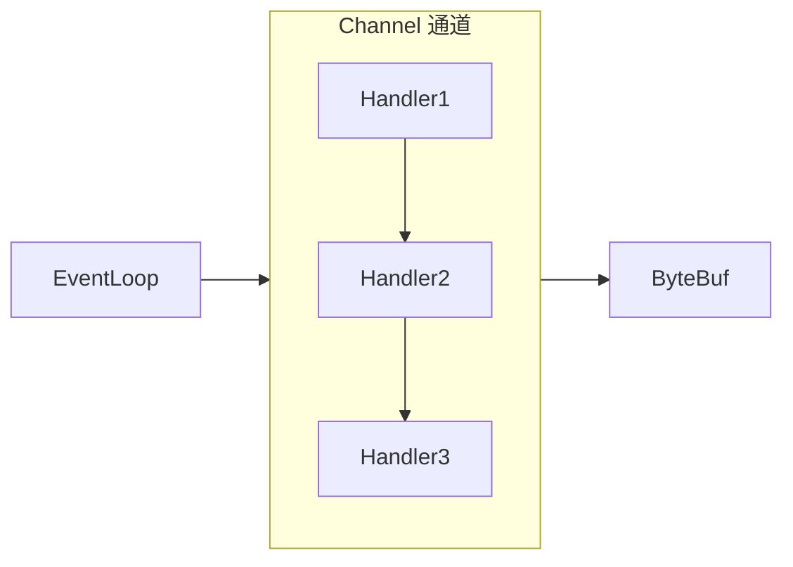

# 03-Netty核心机制详解

> 版本基线：Netty 4.x（异步事件驱动的网络应用框架）
> 受众：Java 后端开发，已懂 [02-Java NIO详解](02-Java NIO详解.md)，要掌握 Netty 的核心组件与实战。默认你懂 NIO 三大组件、线程模型。
> 关联笔记：[00-RPC与远程调用总览](../../服务通信/00-RPC与远程调用总览.md)、[02-Java NIO详解](02-Java NIO详解.md)、[04-Apache Dubbo详解](../../服务通信/04-Apache Dubbo详解.md)

## 📋 总纲

- 1. 概述
- 2. HelloWorld
- 3. 组件（EventLoop / Channel / Future & Promise / Handler & Pipeline / ByteBuf）
- 4. 粘包与半包
- 5. 协议设计与解析
- 6. 心跳
- 7. 参数调优

## 学习目标

学完本篇你能：

1. 说清 Netty 的定位与优势（对比原生 NIO）
2. 写出 Netty 服务端/客户端 HelloWorld
3. 讲透五大组件：EventLoop/Channel/Future&Promise/Handler&Pipeline/ByteBuf
4. 理解粘包半包的产生原因与三种解决方案
5. 设计自定义协议（长度前缀/分隔符）
6. 配置心跳机制与常用参数调优

## 前置知识

- [02-Java NIO详解](02-Java NIO详解.md)——Netty 封装 NIO
- 需掌握：NIO Channel/Buffer/Selector、线程基本概念

---

### 📄 0. 基础
# 1、概述
Netty 是一个异步的、基于事件驱动的网络应用框架，用于快速开发可维护、高性能的网络服务器和客户端。
```java
Netty is an asynchronous event-driven network application framework
for rapid development of maintainable high performance protocol servers & clients.
```
## 1.1 Netty 的地位
Netty 在 Java 网络应用框架中的地位就好比：Spring 在 JEE 中地位
以下框架都使用了 Netty：
- Cassandra
- Spark
- Hadoop
- RocketMQ
- ElasticSearch
- GRPC
- Dubbo
- Spring 5.x
  - flux API 完成抛弃了 Tomcat，使用 Netty 作为服务器端
- Zookeeper
## 1.2 优势
- Netty VS NIO
  工作量大，BUG 多
  - 需要自己构建协议
  - 解决 TCP 传输问题，如粘包、半包等
  - epoll 空轮询导致 CPU 100%
  - 对 API 进行增强，使之更易用
    如： FastThreadLocal => ThreadLocal, ByteBuf => ByteBuffer
- Netty VS 其他网络框架
  - Mina 由 Apache 维护，将来 3.x 版本可能会有较大重构，破坏 API 向下兼容性，Netty 的开发迭代更迅速，API 更简洁，文档更优秀
# 2、HelloWorld
依赖：
```groovy
io.netty:netty-all:4.1.68.Final
```
## 2.1 服务器端
```java
public class HelloServer {
    public static void main(String[] args) {
        // 启动器，负责组装 Netty 组件，启动服务器
        new ServerBootstrap()
                // BossEventLoop, WorkerEventLoop,   组
                .group(new NioEventLoopGroup())
                // 选择 服务器的 serverSocketChannel 实现
                .channel(NioServerSocketChannel.class)
                // boss 负责处理连接，worker 负责处理读写
                // 决定了 worker 将来能干哪些事情
                .childHandler(
                        // channel 代表和客户端进行数据读写的通道，
                        // init初始化，负责添加别的 handler
                        new ChannelInitializer<NioSocketChannel>() {
                            @Override
                            protected void initChannel(NioSocketChannel ch) throws Exception {
                                // 添加具体 Handler，
                                ch.pipeline().addLast(new StringDecoder()); // 将 ByteBuf转换为字符串
                                ch.pipeline().addLast(new ChannelInboundHandlerAdapter() {  // 自定义 handler
                                    // 读事件
                                    @Override
                                    public void channelRead(ChannelHandlerContext ctx, Object msg) throws Exception {

                                        System.out.println(msg);
                                    }
                                });
                            }
                        })
                // 绑定端口
                .bind(9091);
    }
}
```
## 2.2 客户端
```java
public class HelloClient {
    public static void main(String[] args) throws InterruptedException {
        // 启动类
        new Bootstrap()
                // 添加 eventLoop
                .group(new NioEventLoopGroup())
                // 选择客户端 channel 实现
                .channel(NioSocketChannel.class)
                // 添加处理器
                .handler(new ChannelInitializer<NioSocketChannel>() {
                    @Override
                    protected void initChannel(NioSocketChannel ch) throws Exception {
                        ch.pipeline().addLast(new StringEncoder());

                    }
                })
                // 返回channelFuture，异步非阻塞，这个链接过程是耗时过程，下面必须等待连接成功
                .connect(new InetSocketAddress("localhost", 9091))
                // 阻塞方法，直到链接建立；否则获取的对象是一个不可用的
                .sync()
                .channel()
                // 想服务器发送数据
                .writeAndFlush("hello world");
    }
}
```
- 把channel理解为数据的通道
- 把msg理解为流动的数据，最开始输入的byteBuf，但经过pipeline的加工，会变成其他类型的对象，最后输出又变成ByteBuf
- 把handler理解为数据的处理工序
  - 工序有多道，合在一起就是pipeline，负责发布事件传递给每个handler，handler 对自己感兴趣的事件进行处理(重写了相应事件处理方法)
  - handler分inbound和Outbound两类
- 把eventLoop理解为处理数据工人
  - 工人可以管理多个channel的io操作，并且一旦工人负责了某个channel，就要负责到底（绑定）
  - 工人既可以执行 IO 操作，也可以进行任务处理，每个工人有任务队列，队列里可以堆放多个channel的待处理任务，任务分为普通任务，定时任务
  - 工作按照pipeline顺序，依次按照handler的规划代码处理数据，可以为每道工序指定指定不同的工人
# 3、组件
## 3.1 EventLoop
本质是一个单线程执行器（同时维护一个 Selector），里面有 run 方法处理 Channel 上源源不断的 IO 事件。
它的继承关系比较复杂
- 一条线是继承自
- 另一条线是继承自 Netty 自己的
  - 提供了
  - 提供了 parent 方法来看看自己属于哪个 EventLoopGroup
### 3.1.1 EventLoopGroup
是一组 EventLoop，Channel 一般会调用 EventLoopGroup 的 register 方法来绑定其中一个 EventLoop，后续这个 Channel 上的 IO 事件都由此 EventLoop 来处理（保证了 IO事件处理时的线程安全）
- 继承自 Netty 自己的
  - 实现了
  - 另有 next 方法获取集合中下一个
```java
// IO事件，普通事件，定时任务
NioEventLoopGroup eventLoopGroup = new NioEventLoopGroup();

// 普通任务，定时任务
NioEventLoopGroup eventLoopGroup = new DefaultEventLoopGroup();
```
- 传入参数可以设置线程数
- 如果没有设置线程数
  - 寻找命令行参数：
  - 如果找不到，就取服务器
CPU 核心数 * 2
  - 如果两个都获取失败，就设置 1 个线程
Next 方法
```java
public static void main(String[] args) {
        // 事件循环组
        // 不设置线程数，那么就寻找命令行参数：
        // 如果找不到该参数，就设置
        NioEventLoopGroup eventLoopGroup = new NioEventLoopGroup(2);
        for (int i = 0; i < 4; i++) {
            System.out.println(eventLoopGroup.next());
        }
    }
```
```groovy
io.netty.channel.nio.NioEventLoop@5eb5c224
io.netty.channel.nio.NioEventLoop@53e25b76
io.netty.channel.nio.NioEventLoop@5eb5c224
io.netty.channel.nio.NioEventLoop@53e25b76
```
可见使用简单的循环，实现了类似负载均衡。
可以执行普通线程任务
```java
loopGroup.next().submit(()->{
        System.out.println(Thread.currentThread().getName());
    });
```
可以执行定时线程任务
```java
eventLoopGroup.next().scheduleAtFixedRate(()->{
            System.out.println("ok");
        }, 0, 1, TimeUnit.SECONDS);
```
IO 事件
同示例
> [!note]
> 一旦建立链接，该 Channel 会绑定到 eventLoop上，即以后该 Channel 进行数据交流都会在同一个 eventLoop 上进行处理
```java
ChannelFuture channelFuture = new Bootstrap()......
  // 异步非阻塞
  .connect(...);
```
> 带有 Future，Promise的类型都是和异步方法配套使用，用来处理结果
第一种方法
主线程中 sync 同步方法等待
```java
// 使用 sync 方法同步等待上面 connect()里面处理结束之后，进行进一步 获取 channel 等操作。
channelFuture.sync()
```
第二种方法
使用 addListener 方法异步处理结果
```java
channelFuture.addListener(new ChannelFutureListener(){
    @Override
    // 在 NIO 线程连接建立好之后（即上面 connect 中的连接），会调用该方法
    public void operationComplete(ChannelFuture future) throws Exception{
      Channel channel = future.channel();
      //...
      channel.writeAndFlush("...");
    }
});
```
### 3.3.1 Channel 关闭
close 有以下问题：它是异步的，无法保证在它后面的代码就一定在后面运行。
```java
Channel channel = channelFutre.sync().channel();
// 多线程情况下其他异步处理
new Thread(()->{
  Scanner sc = new Scanner(System.in);
  while(True){
     String line = sc.nextLine();
     if ("q".equals(line)) {
       // close
       channel.close();
       break;
     }
     channel.writeAndFlush(line);
  }
}).start();
```
获取 closeFuture
1. 同步处理关闭
```java
ChannelFuture closeFuture = channel.closeFutre();

closeFuture.sync();
log.info("关闭后进行处理...");
```
1. 异步处理关闭
```java

ChannelFuture closeFuture = channel.closeFutre();

closeFuture.addListener(
  new ChannelFutureListener(){
    @Override
    public void operationComplete(ChannelFuture future) throws Exception{
      log.info("关闭后进行的处理...");
    }

  }
);
log.info("关闭后进行处理...");
```
### 3.3.2 优雅关闭
在 Channel 关闭基础上
```java
EventLoopGroup group(boss/worker) = new EventLoopGroup(2);
//...

ChannelFuture closeFuture = channel.closeFutre();

closeFuture.addListener(
  new ChannelFutureListener(){
    @Override
    public void operationComplete(ChannelFuture future) throws Exception{
      log.info("关闭后进行的处理...");

      // 优雅关闭(组内的任务先进行完，拒绝新的任务，依次关闭 )
      group/boss/worker.shutdownGracefully();
    }

  }
);
log.info("关闭后进行处理...");
```
## 3.2 Channel
主要作用：
- close()
  可以用来关闭 Channel
- closeFuture()
  用来处理 channel 的关闭
  - sync 方法作用是同步等待 channel 关闭
  - 而 addListener 方法是异步等待 channel 关闭
- pipeline()
  获取/添加处理器
- write()
  将数据写入
- writeAndFlush()
  将数据写入并刷出
### 3.2.1 ChannelFuture
这里主要讲客户端链接时。
```java
// .connect()； 返回的就是ChannelFuture

// 这里是异步的连接，需要等待连接成功或回调，才能保证通信对象完整
```
```java
channelFuture.sync().channel();
```
或者
```java
channelFuture.addListener(new ChannelFutureListener(){
    @Override
    public void operationComplete(ChannelFuture future) throws Exception{

        Channel channel = future.channel();
        //...
    }
})
```
## 3.3 Future & Promise
在异步处理时，经常用到这两个接口
首先说明 Netty 中的 Future 与 JDK 中的同名，但是是两个接口，Netty 的 Future 继承自 JDK 的 Future，而 Promise 又对 Netty 的 Future 进行了扩展。
- JDK Future
  只能同步等待任务结束（或成功、或失败）才能得到结果
- Netty Future
  可以同步等待任务结束得到结果
  也可以异步方法得到结果，但都是要等任务结果
- Netty Promise
  不仅有 Netty Future 的功能，
  而且脱离了任务独立存在，只作为两个线程间传递结果的容器
```java
public class TestJdkFuture {
    public static void main(String[] args) throws ExecutionException, InterruptedException {
        ExecutorService executorService = Executors.newFixedThreadPool(1);

        Future<Integer> future = executorService.submit(new Callable<Integer>() {
            @Override
            public Integer call() throws Exception {
                System.out.println("start...");
                Thread.sleep(5000);
                return 5;
            }
        });
        System.out.println("等待结果");
        System.out.println("结果是: " + future.get());
    }
}

-----
等待结果
start...
[这里等待]
结果是: 5
```
```java
public class TestNettyFuture {

    public static void main(String[] args) {
        NioEventLoopGroup eventExecutors = new NioEventLoopGroup(2);
        EventLoop eventLoop = eventExecutors.next();

        Future<Integer> future = eventLoop.submit(new Callable<Integer>() {
            @Override
            public Integer call() throws Exception {
                Thread.sleep(5000);
                return 5;
            }
        });
        // sout
        // sout

        future.addListener(new GenericFutureListener<Future<? super Integer>>() {
            @Override
            public void operationComplete(Future<? super Integer> future) throws Exception {
                System.out.println(future.getNow());
            }
        });
    }
}
```
```java
public class TestNettyPromise {
    public static void main(String[] args) throws ExecutionException, InterruptedException {

        // 1、准备 EventLoop 对象
        EventLoop eventLoop = new NioEventLoopGroup(1).next();

        // 2、可以主动创建 promise，结果容器
        DefaultPromise<Integer> defaultPromise = new DefaultPromise<>(eventLoop);

        new Thread(()->{
            System.out.println("cal start ...");
            try {
                Thread.sleep(5000);
                int i = 1/0;
                defaultPromise.setSuccess(5);
            }catch (Exception e){
                defaultPromise.setFailure(e);
            }
        }).start();

        //sout
        System.out.println(defaultPromise.get());
    }
}
```
## 3.4 Handler & Pipeline
ChannelHandler 用来处理 Channel 上的各种事件，分为入站、出站两种、所有 ChannelHandler 被连成一串，就是 Pipeline
- 入站处理器通常是
- 出站处理器通常是
> 打个比方，每个 Channel 是一个产品的加工车间，Pipeline 是车间中的流水线，ChannelHandler 就是流水线上的各道工序，而ByteBuf 就是原材料，经过很多工序的加工；先经过一道道入站工序，再经过一道道出站工序最终变成产品。
```java
public class TestPipeline {

    public static void main(String[] args) {
        new ServerBootstrap()
                .group(new NioEventLoopGroup())
                .channel(NioServerSocketChannel.class)
                .childHandler(new ChannelInitializer<NioSocketChannel>() {
                    @Override
                    protected void initChannel(NioSocketChannel ch) throws Exception {
                        // 1、获取 pipeline
                        ChannelPipeline pipeline = ch.pipeline();
                        // 2、添加处理器，自动会有两个
                        // head <--> 添加的h1 <--> 添加的h2 <--> ... <--> tail

                        pipeline.addLast("h1", new ChannelInboundHandlerAdapter(){
                            @Override
                            public void channelRead(ChannelHandlerContext ctx, Object msg) throws Exception {
                                System.out.println(1);
                                super.channelRead(ctx, msg);
                            }
                        });
                        pipeline.addLast("h2", new ChannelInboundHandlerAdapter(){
                            @Override
                            public void channelRead(ChannelHandlerContext ctx, Object msg) throws Exception {
                                System.out.println(2);
                                //super.channelRead(ctx, msg);
                                // ctx 这里会从到执行到的当前 channel 开始往前找输出，如果找到了就输出，找不到不输出
                                // 所以，如果使用这个的话，该示例输出为 1,2  后面没有了，没有执行出站
                                //ctx.writeAndFlush(ctx.alloc().buffer().writeBytes("server".getBytes(StandardCharsets.UTF_8)));

                                // ch 这里会从整个 pipeline 连，从尾到头往前找，只要链上有就会输出
                                // 所以，如果使用这个的话，该示例输出为 1,2,4,3
                                // 输入和这里添加的顺序是一样的，输出是相反的
                                // 因为是从整个链上找，所以这里是有输出的 ......
                                ch.writeAndFlush(ctx.alloc().buffer().writeBytes("server".getBytes(StandardCharsets.UTF_8)));
                            }
                        });
                        pipeline.addLast("h3", new ChannelOutboundHandlerAdapter(){
                            @Override
                            public void write(ChannelHandlerContext ctx, Object msg, ChannelPromise promise) throws Exception {
                                System.out.println(3);
                                super.write(ctx, msg, promise);
                            }
                        });
                        pipeline.addLast("h4", new ChannelOutboundHandlerAdapter(){
                            @Override
                            public void write(ChannelHandlerContext ctx, Object msg, ChannelPromise promise) throws Exception {
                                System.out.println(4);
                                super.write(ctx, msg, promise);
                            }
                        });
                    }
                })
                .bind(9092);
    }
}
```

> Channel 是车间, Pipeline 是流水线, 事件沿流水线依次经过各 Handler
### 3.4.1 使用内嵌 channel 测试学习
其实测试的时候，可以使用内嵌的，而不用服务端和客户端这种复杂写法。
```java
public class TestEmbeddedChannel {
    public static void main(String[] args) {
        ChannelInboundHandlerAdapter h1 = new ChannelInboundHandlerAdapter() {
            @Override
            public void channelRead(ChannelHandlerContext ctx, Object msg) throws Exception {
                System.out.println(1);
                super.channelRead(ctx, msg);
            }
        };
        ChannelInboundHandlerAdapter h2 = new ChannelInboundHandlerAdapter() {
            @Override
            public void channelRead(ChannelHandlerContext ctx, Object msg) throws Exception {
                System.out.println(2);
                super.channelRead(ctx, msg);
            }
        };

        ChannelOutboundHandlerAdapter h3 = new ChannelOutboundHandlerAdapter() {
            @Override
            public void write(ChannelHandlerContext ctx, Object msg, ChannelPromise promise) throws Exception {
                System.out.println(3);
                super.write(ctx, msg, promise);
            }
        };
        ChannelOutboundHandlerAdapter h4 = new ChannelOutboundHandlerAdapter() {
            @Override
            public void write(ChannelHandlerContext ctx, Object msg, ChannelPromise promise) throws Exception {
                System.out.println(4);
                super.write(ctx, msg, promise);
            }
        };

        EmbeddedChannel embeddedChannel = new EmbeddedChannel(h1, h2, h3, h4);
        // 模拟入站
        embeddedChannel.writeInbound(ByteBufAllocator.DEFAULT.buffer().writeBytes("hello".getBytes(StandardCharsets.UTF_8)));

        // 模拟出站
        embeddedChannel.writeOutbound(ByteBufAllocator.DEFAULT.buffer().writeBytes("world".getBytes(StandardCharsets.UTF_8)));

    }
}
```
## 3.5 ByteBuf
### 3.5.1 创建
自动扩容
```java
public class TestByteBuf {
    public static void main(String[] args) {

        // 测试 ByteBuf 的自动扩容
        ByteBuf buffer = ByteBufAllocator.DEFAULT.buffer();
        System.out.println(buffer);

        StringBuilder sb = new StringBuilder();
        for (int i = 0; i < 400; i++) {
            sb.append("a");
        }
        buffer.writeBytes(sb.toString().getBytes(StandardCharsets.UTF_8));
        System.out.println(buffer);

    }
}
```
```java
// 读指针，写指针，容量
PooledUnsafeDirectByteBuf(ridx: 0, widx: 0, cap: 256)
PooledUnsafeDirectByteBuf(ridx: 0, widx: 400, cap: 512)
```
为了更好看到结果，添加内容打印：
```java
public class TestByteBuf {
    public static void main(String[] args) {

        // 测试 ByteBuf 的自动扩容
        ByteBuf buffer = ByteBufAllocator.DEFAULT.buffer(16);
        // System.out.println(buffer);
        log(buffer);

        StringBuilder sb = new StringBuilder();
        for (int i = 0; i < 32; i++) {
            sb.append("a");
        }
        buffer.writeBytes(sb.toString().getBytes(StandardCharsets.UTF_8));
        // System.out.println(buffer);
        log(buffer);

    }

    private static void log(ByteBuf buffer){
        int length = buffer.readableBytes();
        int rows = length / 16 + (length % 15 == 0 ? 0 : 1) + 4;
        StringBuilder builder = new StringBuilder(rows * 80 * 2)
                .append("read index: ").append(buffer.readerIndex())
                .append(" write index: ").append(buffer.writerIndex())
                .append(" capacity: ").append(buffer.capacity())
                .append(NEWLINE);
        appendPrettyHexDump(builder, buffer);
        System.out.println(builder.toString());
    }
}
```
```java
// 这里为了更好的观察，初始大小设置为 16
read index: 0 write index: 0 capacity: 16

read index: 0 write index: 32 capacity: 64
         +-------------------------------------------------+
         |  0  1  2  3  4  5  6  7  8  9  a  b  c  d  e  f |
+--------+-------------------------------------------------+----------------+
|00000000| 61 61 61 61 61 61 61 61 61 61 61 61 61 61 61 61 |aaaaaaaaaaaaaaaa|
|00000010| 61 61 61 61 61 61 61 61 61 61 61 61 61 61 61 61 |aaaaaaaaaaaaaaaa|
+--------+-------------------------------------------------+----------------+
```
- 默认大小 256
### 3.5.2 直接内存 VS 堆内存
```java

// 基于堆
ByteBuf buffer = ByteBufAllocator.DEFAULT.heapBuffer(10);

// 基于直接内存
ByteBuf buffer = ByteBufAllocator.DEFAULT.directBuffer(10);
```
- 直接内存创建和销毁的代价高昂，但读写性能高，适合配合池化功能一起用
- 直接内存对 GC 压力小，因为这部分内存不受 JVM 垃圾回收的管理，但也要注意及时主动释放
### 3.5.3 池化 VS 非池化
池化的最大意义在于可以重用 ByteBuf，优点有
- 没有池化，则每次都得创建新的 ByteBuf 实例，这个操作对直接内存代价高昂，就算是堆内存，也会增加 GC 压力
- 有了池化，则可以重用池中 ByteBuf 实例，并且采用了与
- 高并发时，池化功能更节约呢村，减少内存溢出的可能
池化功能是否开启，可以通过下面的系统环境变量来设置
```java
-Dio.netty.allocator.type={unpooled|pooled}
```
- 4.1以后，非 Android 平台默认启用池化实现，Android 平台采用非池化实现
- 4.1之前，池化功能还不成熟，默认是非池化实现
### 3.5.4 组成
ByteBuf 由四部分构成

最开始读写指针都在 0
当写入了部分数据，也读取了少量数据的时候：
> [!note]
> 四部分为：废弃部分(写入的数据已被读取)—>可读部分(写入的数据还没有被读)—>可写部分(容量内还没有写入数据的部分)—>可扩展部分(容量到最大容量之间可以进行扩容操作的部分)

### 3.5.5 写入
方法列表，省略一下不重要的方法
### 3.5.6 扩容
扩容规则
- 如果写入后数据大小未超出512，则选择下一个 16 的整数倍
  例如：写入后大小为 12，但超出了初始容量 10，则扩容capacity是 16
- 如果写入后数据大小超过 512，则选择下一个
  例如：写入后大小为 513，则扩容后capacity是
- 扩容不能超过max capacity；会抛异常
### 3.5.7 读取
基本的读取方法与写入是对应的
标记与重设
```java
buffer.markReaderIndex();  // 标记当前读取位
//...读取操作
buffer.resetReaderIndex();  // 重新设置读取 Index，到标记点
```
当然也有一系列
### 3.5.8 retain & release
由于 Netty 中有堆外内存的 ByteBuf 实现，堆外内存最好是手动来释放，而不是由 GC 垃圾回收。
- UnpoolHeapByteBuf
- UnpooledDirectByteBuf
  GC 也可以帮助回收，但是不及时，推荐手动回收
- pooledByteBuf
> 回收内存的源码实现，在下面方法的不同实现：
```java
protected abstract void deallocate()
```
Netty 这里采用了引用计数来控制内存回收，每个 ByteBuf 都实现了
- 每个 ByteBuf 对象的初始计数为 1
- 调用 release 方法计数减 1，如果计数为 0，ByteBuf 内存被回收
- 调用 retain 方法计数加 1，表示调用者没用完之前，其它 handler 即使调用了 release 也不会造成回收
- 当计数为 0 时，底层内存会被回收，这时即使 ByteBuf 对象还在，其各个方法均无法正常使用
由于 pipeline 的存在，基本规则是：
谁是最后使用者，谁负责 release
示例：
- 入站，整个流程结束就到
  - 继续追代码：
```java
protected void onUnhandledInboundMessage(Object msg) {
        try {
            logger.debug(
                    "Discarded inbound message {} that reached at the tail of the pipeline. " +
                            "Please check your pipeline configuration.", msg);
        } finally {
            ReferenceCountUtil.release(msg);
        }
    }
```
  - 里面判断是否 ByteBuf，如果是就释放
- 出站，整个流程结束就到
  - 继续追代码：
```java
@Override
public final void write(Object msg, ChannelPromise promise) {
    assertEventLoop();

    ChannelOutboundBuffer outboundBuffer = this.outboundBuffer;
    if (outboundBuffer == null) {
        try {
            // release message now to prevent resource-leak
            ReferenceCountUtil.release(msg);
        } finally {
            // If the outboundBuffer is null we know the channel was closed and so
            // need to fail the future right away. If it is not null the handling of the rest
            // will be done in flush0()
            // See https://github.com/netty/netty/issues/2362
            safeSetFailure(promise,
                    newClosedChannelException(initialCloseCause, "write(Object, ChannelPromise)"));
        }
        return;
    }
  //.....
}
```
### 3.5.9 切片 slice
零拷贝思想体现之一
ByteBuf 切片的时候还是使用原始的内存模块，只是从中获取指定索引范围内的数据。
```java
ByteBuf b1 = buf.slice(0, 3);
ByteBuf b2 = buf.slice(3, 3);
```
注意点 1：
切片不能增加值，抛出越界异常；因为类似浅拷贝，切片修改会影响主buf
注意点 2：
如果
所以，在切片的时候一般都会调用
```java
ByteBuf b1 = buf.slice(0, 3);
b1.retain();

//...
buf.release()

//...
使用 b1 正常
```
### 3.5.10 duplicate
零拷贝思想体现之一
就好比截取了原始 ByteBuf 所有内容，并且没有 max capacity 的限制，也是与原始 ByteBuf 使用同一块底层内存，只是读写指针是独立的。
### 3.5.11 copy
会将底层内存数据复制
### 3.5.12 逻辑组合 compositeBuffer
将多个 Buffer 组合成一个，使用 write 的方法的话，会出现真实的拷贝动作。
```java
buffer.writeBytes(bf1).writeBytes(bf2);
```
所以，可以使用
```java
CompositeBuffer buffer = ByteBufAllocator.DEFAULT.compositeBuffer();
buffer.addComponent(bf1,bf2);
```
该方法不会因为是逻辑组合，默认不会调整读写指针。
```java
CompositeBuffer buffer = ByteBufAllocator.DEFAULT.compositeBuffer();
buffer.addComponent(true, bf1,bf2);
```
参数添加 true 之后，就会调整读写指针。
### 3.5.13 Unpooled
是一个工具类，提供了非池化的 ByteBuf 创建、组合、复制等操作。
这里仅介绍其跟【零拷贝】有关的 wrappedBuffer 方法，可以用来组装
### 3.5.14 优势
- 池化，可以重用池中 ByteBuf 实例，更节约内存，减少内存溢出的问题
- 读写指针分离，不需要像 ByteBuffer 一样切换读写模式
- 可以自动扩容
- 很多地方体现零拷贝
- 链式调用，使用更流畅方便
一个 Echo 示例
```java
public class EchoTest002 {

    public static void main(String[] args) {
        new ServerBootstrap()
                .group(new NioEventLoopGroup())
                .channel(NioServerSocketChannel.class)
                .childHandler(new ChannelInitializer<NioSocketChannel>() {
                    @Override
                    protected void initChannel(NioSocketChannel socketChannel) throws Exception {
                        socketChannel.pipeline().addLast(new StringDecoder());
                        socketChannel.pipeline().addLast(new ChannelInboundHandlerAdapter(){
                            @Override
                            public void channelRead(ChannelHandlerContext ctx, Object msg) throws Exception {
                                System.out.println("接收到消息: "+ msg);
                                if (msg instanceof String) {
                                    ByteBuf buffer = ctx.alloc().buffer();
                                    buffer.writeBytes(((String) msg).getBytes());
                                    ctx.writeAndFlush(buffer);
                                }
                            }
                        });
                    }
                })
                .bind(9091);
    }
}
```
### 📄 1. Netty 进阶
# 1、粘包与半包
## 1.1 现象分析
粘包
- 现象：
  - 发送:
  - 接收：
- 原因：
  - 应用层：接收方 ByteBuf 设置太大，Netty 默认为 1024
  - 滑动窗口：
    假设发送方 256 bytes 表示一个完成报文，但由于接收方处理不及时且窗口大小足够大，这256 bytes 字节就会缓冲在接收方的滑动窗口中，当滑动窗口中缓冲了多个报文就会粘包
  - Nagle 算法
    会造成粘包
半包
- 现象
  - 发送
  - 接收
- 原因：
  - 应用层：接收方 ByteBuf 小于实际发送数据量
  - 滑动窗口
    假设接收方的窗口只剩了 128 bytes，发送方的报文大小是 256 bytes，这时放不下，只能先发送128 bytes，等待 ack 后，才能发送剩余部分，这就造成了半包
  - MSS 限制
    当发送的数据超过 MSS 限制后，会将数据切分发送，就会造成半包
> [!note]
> 本质原因是因为 TCP 是流式协议，消息无边界
## 1.2 解决方案
- 短连接
  即每次发送之后就关闭 channel，下次发送重新连接发送
  - 只能解决粘包，不能解决半包
  - 性能？？？
- 使用固定长度解码器
  FixedLengthFrameDecoder
  - 浪费带宽
- 分隔符区分边界
  - LineBasedFrameDecoder
    换行符
    构造方法中传最大长度，如果超过最大长度还没有看到换行分界符，就会抛出异常
  - DelimiterBasedFrameDecoder
    可自定义
    构造方法中传最大长度之外，还有自定义分界符
- LTC 解码器
  LengthFieldBasedFrameDecoder
```
A decoder that splits the received {@link ByteBuf}s dynamically by the value of the length field in the message.  It is particularly useful when you decode a binary message which has an integer header field that represents the length of the message body or the whole message.

可以根据消息中的长度字段动态进行拆分的解码器，当解码具有整数标头的二进制消息是，非常有用，该字段表示消息体或者整个消息的长度。
```
  该类中有很多配置参数，可以解析所有带有长度字段的消息，这在特定的 客户端-服务器 协议中非常常见。
## 1.3 LTC案例说明参数
```java
public LengthFieldBasedFrameDecoder(
            int maxFrameLength,
            int lengthFieldOffset, int lengthFieldLength) {
        //...
    }
```
- 案例 1
  从头开始的两个字节表示长度，不剥离头
```
 * BEFORE DECODE (14 bytes)         AFTER DECODE (14 bytes)
 * +--------+----------------+      +--------+----------------+
 * | Length | Actual Content |----->| Length | Actual Content |
 * | 0x000C | "HELLO, WORLD" |      | 0x000C | "HELLO, WORLD" |
 * +--------+----------------+      +--------+----------------+
```
  本例中长度字段代表 12
  默认情况下，解码器认为长度字段后面就是真实内容，因此可以用简单的参数组合来解码。
```
lengthFieldOffset=0  // 长度字段偏移量
lengthFieldLength=2  // 长度字段长度
lengthAdjustment=0  // 长度字段为基准，几个字段之后才是内容
initialBytesToStrip=0  // 从头剥离几个字节(0 表示不剥离头)
```
- 案例 2
  从头开始的两个字节表示长度，剥离头
```
 * BEFORE DECODE (14 bytes)         AFTER DECODE (12 bytes)
 * +--------+----------------+      +----------------+
 * | Length | Actual Content |----->| Actual Content |
 * | 0x000C | "HELLO, WORLD" |      | "HELLO, WORLD" |
 * +--------+----------------+      +----------------+
```
```
lengthFieldOffset=0
lengthFieldLength=2
lengthAdjustment=0
initialBytesToStrip=2  // 剥离长度字段占用的大小
```
- 案例 3
  从头开始 2 字节是长度字段，不剥离头，长度数据代表整个消息长度
```
 * BEFORE DECODE (14 bytes)         AFTER DECODE (14 bytes)
 * +--------+----------------+      +--------+----------------+
 * | Length | Actual Content |----->| Length | Actual Content |
 * | 0x000E | "HELLO, WORLD" |      | 0x000E | "HELLO, WORLD" |
 * +--------+----------------+      +--------+----------------+
```
```
lengthFieldOffset=0
lengthFieldLength=2
lengthAdjustment=-2  // 有点反人类
initialBytesToStrip=0
```
  在有些协议中，长度数据表示整个数据的长度，包括头信息的。
  因为头部长度信息占 2 字节，这里设置
  这样代码在截取的时候，就会往前移，刚好从 0 位置截取，保留整个消息长度头等信息。
- 案例 4
  不剥离头，从头开始， 首先为其他消息头部信息，后面紧跟长度字段。
```
 * BEFORE DECODE (17 bytes)                      AFTER DECODE (17 bytes)
 * +----------+----------+----------------+      +----------+----------+----------------+
 * | Header 1 |  Length  | Actual Content |----->| Header 1 |  Length  | Actual Content |
 * |  0xCAFE  | 0x00000C | "HELLO, WORLD" |      |  0xCAFE  | 0x00000C | "HELLO, WORLD" |
 * +----------+----------+----------------+      +----------+----------+----------------+
```
```
lengthFieldOffset=2
lengthFieldLength=3
lengthAdjustment=0
initialBytesToStrip=0
```
- 案例 5
  不剥离头，从头开始，首先是消息长度信息，后面紧跟其他头部信息，最后是内容体
```
 * BEFORE DECODE (17 bytes)                      AFTER DECODE (17 bytes)
 * +----------+----------+----------------+      +----------+----------+----------------+
 * |  Length  | Header 1 | Actual Content |----->|  Length  | Header 1 | Actual Content |
 * | 0x00000C |  0xCAFE  | "HELLO, WORLD" |      | 0x00000C |  0xCAFE  | "HELLO, WORLD" |
 * +----------+----------+----------------+      +----------+----------+----------------+
```
```
lengthFieldOffset=0
lengthFieldLength=3
lengthAdjustment=2  // 中间有两个字节长度的其他头部数据
initialBytesToStrip=0
```
- 案例 6
  长度头部数据在中间，两边有其他头部数据，最后是内容，
  并且编译结果要剥离第一个头数据，和长度头数据
```
 * BEFORE DECODE (16 bytes)                       AFTER DECODE (13 bytes)
 * +------+--------+------+----------------+      +------+----------------+
 * | HDR1 | Length | HDR2 | Actual Content |----->| HDR2 | Actual Content |
 * | 0xCA | 0x000C | 0xFE | "HELLO, WORLD" |      | 0xFE | "HELLO, WORLD" |
 * +------+--------+------+----------------+      +------+----------------+
```
```
lengthFieldOffset=1  // 长度是从 1 开始
lengthFieldLength=2  // 2 个字节的内容长度数据
lengthAdjustment=1  // 长度头部信息和内容之间的字节数为 1
initialBytesToStrip=3 // 剥离前 3 个字节
```
- 案例 7
  长度头部数据在中间，两边有其他头部数据，最后是内容
  并且编译结果要剥离第一个头部数据和长度头部数据，其中长度头部数据代表整个数据大小。
```
 * BEFORE DECODE (16 bytes)                       AFTER DECODE (13 bytes)
 * +------+--------+------+----------------+      +------+----------------+
 * | HDR1 | Length | HDR2 | Actual Content |----->| HDR2 | Actual Content |
 * | 0xCA | 0x0010 | 0xFE | "HELLO, WORLD" |      | 0xFE | "HELLO, WORLD" |
 * +------+--------+------+----------------+      +------+----------------+
```
```
lengthFieldOffset=1  // 长度是从 1 开始
lengthFieldLength=2  // 2 个字节的内容长度数据
lengthAdjustment=-3  // 反人类呀，见下面解析
initialBytesToStrip=3 // 剥离前 3 个字节
```
  lengthAdjustment
  - 长度数据表示整体长度，这样就比只计算消息体的情况下，多算了 4 个字节
  - 要保留第 2 个其他消息头数据，是 1 个字节
  - 那么这里为了补偿，就需要填写
样例
```java
public class TestLTC001 {
    public static void main(String[] args) {
        EmbeddedChannel channel = new EmbeddedChannel(
                new LengthFieldBasedFrameDecoder(
                        // 最大
                        1024,
                        // 开头偏移
                        0,
                        // 长度数据占用长度，这里设置 4 是因为下面使用的 writeInt
                        4,
                        0, // 这里不需要设置补偿或其他头信息
                        4  // 去掉头信息更加清晰
                ),
                new LoggingHandler(LogLevel.DEBUG)
        );

        ByteBuf buffer = ByteBufAllocator.DEFAULT.buffer();
        writeByte(buffer, "hello, world");
        writeByte(buffer, "ni hao.");

        channel.writeInbound(buffer);

    }

    private static void writeByte(ByteBuf byteBuf, String content){
        byte[] bytes = content.getBytes();
        int length = bytes.length;

        // 测试使用 Int（4 个字节）表示长度
        byteBuf.writeInt(length);
        byteBuf.writeBytes(bytes);
    }
}
```
```
[id: 0xembedded, L:embedded - R:embedded] READ: 12B
         +-------------------------------------------------+
         |  0  1  2  3  4  5  6  7  8  9  a  b  c  d  e  f |
+--------+-------------------------------------------------+----------------+
|00000000| 68 65 6c 6c 6f 2c 20 77 6f 72 6c 64             |hello, world    |
+--------+-------------------------------------------------+----------------+
[id: 0xembedded, L:embedded - R:embedded] READ: 7B
         +-------------------------------------------------+
         |  0  1  2  3  4  5  6  7  8  9  a  b  c  d  e  f |
+--------+-------------------------------------------------+----------------+
|00000000| 6e 69 20 68 61 6f 2e                            |ni hao.         |
+--------+-------------------------------------------------+----------------+
```
# 2、协议设计与解析
比如这里使用
比如发送命令
```redis
set name zhangsan
```
那么发送的是，每一个小命令节中间使用回车换行符
```
*3   //*: 表示开始，3: 表示共有3部分内容,
$3   //$: 表示字符命令，3：表示该字符有三个字节
set
$4   //$: ... 4: 表示该字符有 4 个字节
name
$8   //...
zhangsan
```
```java
import io.netty.bootstrap.Bootstrap;
import io.netty.buffer.ByteBuf;
import io.netty.channel.ChannelFuture;
import io.netty.channel.ChannelHandlerContext;
import io.netty.channel.ChannelInboundHandlerAdapter;
import io.netty.channel.ChannelInitializer;
import io.netty.channel.nio.NioEventLoopGroup;
import io.netty.channel.socket.SocketChannel;
import io.netty.channel.socket.nio.NioSocketChannel;
import io.netty.handler.logging.LoggingHandler;

public class TestRedis {
    public static void main(String[] args) {

        NioEventLoopGroup eventLoopGroup = new NioEventLoopGroup(1);
        final byte[] LINE = {13,10};  // 回车换行
        try {
            Bootstrap bootstrap = new Bootstrap();
            bootstrap.channel(NioSocketChannel.class);
            bootstrap.group(eventLoopGroup);

            ChannelFuture channelFuture = bootstrap.handler(new ChannelInitializer<SocketChannel>() {
                @Override
                protected void initChannel(SocketChannel ch) throws Exception {
                    ch.pipeline().addLast(new LoggingHandler());
                    ch.pipeline().addLast(new ChannelInboundHandlerAdapter(){

                        @Override
                        public void channelActive(ChannelHandlerContext ctx) throws Exception {
                            ByteBuf buffer = ctx.alloc().buffer();
                            buffer.writeBytes("*3".getBytes()).writeBytes(LINE);
                            buffer.writeBytes("$3".getBytes()).writeBytes(LINE);
                            buffer.writeBytes("set".getBytes()).writeBytes(LINE);
                            buffer.writeBytes("$4".getBytes()).writeBytes(LINE);
                            buffer.writeBytes("name".getBytes()).writeBytes(LINE);
                            buffer.writeBytes("$8".getBytes()).writeBytes(LINE);
                            buffer.writeBytes("zhangsan".getBytes()).writeBytes(LINE);

                            ctx.writeAndFlush(buffer);
                        }

                        // 接收
                        @Override
                        public void channelRead(ChannelHandlerContext ctx, Object msg) throws Exception {

                            ByteBuf byteBuf = (ByteBuf) msg;
                            System.out.println(byteBuf.toString());
                        }
                    });
                }
            }).connect("localhost", 6379).sync();

            channelFuture.channel().closeFuture().sync();
        }catch (Exception e){
            e.printStackTrace();
        }
    }
}
```
```
         +-------------------------------------------------+
         |  0  1  2  3  4  5  6  7  8  9  a  b  c  d  e  f |
+--------+-------------------------------------------------+----------------+
|00000000| 2a 33 0d 0a 24 33 0d 0a 73 65 74 0d 0a 24 34 0d |*3..$3..set..$4.|
|00000010| 0a 6e 61 6d 65 0d 0a 24 38 0d 0a 7a 68 61 6e 67 |.name..$8..zhang|
|00000020| 73 61 6e 0d 0a                                  |san..           |
+--------+-------------------------------------------------+----------------+
[id: 0x93b3d378, L:/127.0.0.1:63865 - R:localhost/127.0.0.1:6379] FLUSH
[id: 0x93b3d378, L:/127.0.0.1:63865 - R:localhost/127.0.0.1:6379] READ: 5B
         +-------------------------------------------------+
         |  0  1  2  3  4  5  6  7  8  9  a  b  c  d  e  f |
+--------+-------------------------------------------------+----------------+
|00000000| 2b 4f 4b 0d 0a                                  |+OK..           |
+--------+-------------------------------------------------+----------------+
PooledUnsafeDirectByteBuf(ridx: 0, widx: 5, cap: 2048)
```
设置成功：

> 大部分常见协议，比如 HTTP 等都已经别 Netty 封装好了，不用咱们自己编写。
```java
public static void main(String[] args) {
    NioEventLoopGroup boss = new NioEventLoopGroup(1);
    NioEventLoopGroup worker = new NioEventLoopGroup(2);

    try {
        ChannelFuture channelFuture = new ServerBootstrap().group(boss, worker)
                .channel(NioServerSocketChannel.class)
                .childHandler(new ChannelInitializer<SocketChannel>() {
                    @Override
                    protected void initChannel(SocketChannel socketChannel) {
                        socketChannel.pipeline().addLast(new LoggingHandler(LogLevel.DEBUG));
                        socketChannel.pipeline().addLast(new HttpServerCodec());
                        socketChannel.pipeline().addLast(new ChannelInboundHandlerAdapter() {
                            @Override
                            public void channelRead(ChannelHandlerContext ctx, Object msg) throws Exception {
                                log.info("{}", msg.getClass());
                                if (msg instanceof HttpRequest){
                                    // 请求行，请求头

                                }else if (msg instanceof HttpContent){
                                    // 请求体
                                }
                            }
                        });
                    }
                })
                .bind(8080)
                .sync();
        channelFuture.channel().closeFuture().sync();
    } catch (InterruptedException e) {
        e.printStackTrace();
    }finally {
        worker.shutdownGracefully();
        boss.shutdownGracefully();
    }
}
```
上面最后这种
```java
socketChannel.pipeline().addLast(new SimpleChannelInboundHandler<HttpRequest>() {
    // 简单的筛选，直接根据类型进入选择处理
    @Override
    protected void channelRead0(ChannelHandlerContext ctx, HttpRequest httpRequest) throws Exception {
        String uri = httpRequest.uri();
        HttpHeaders headers = httpRequest.headers();
        log.info("{}", uri);

        DefaultFullHttpResponse response = new DefaultFullHttpResponse(httpRequest.protocolVersion(), HttpResponseStatus.OK);
        String content = "哈哈哈";
        byte[] bytes = content.getBytes();
        response.headers().setInt(CONTENT_LENGTH, bytes.length);
        response.content().writeBytes(bytes);

        ctx.writeAndFlush(response);
    }
});
```
## 2.1 自定义协议要素
- 魔数：用于在第一时间判定是否无效数据包，通常在协议数据的开头发送接受
- 版本号：可以支持协议的升级
- 序列化算法
  消息正文采用的序列化和反序列化方式
  可以由此扩展，例如：json,protobuf,hessian,jdk...
- 指令类型
  是登录、注册、单聊、群聊...
- 请求序号
  为了双工通信，提供异步能力
- 正文长度
- 消息正文
## 2.2 @Shareable
在 Handler 类上标注该注解，表示该 handler 不会保存状态信息，多线程Channel之间可以使用同一个对象。即，可以在多线程环境中只创建一个对象。
```java
@Sharable
@SuppressWarnings({ "StringConcatenationInsideStringBufferAppend", "StringBufferReplaceableByString" })
public class LoggingHandler extends ChannelDuplexHandler {

    private static final LogLevel DEFAULT_LEVEL = LogLevel.DEBUG;
}
```
> 在多 Channel 使用的地方，可以将其抽取成常量，在使用的时候使用一个即可。
# 3、心跳
在某些情况下，比如掉电等情况，服务器中保存的客户端相关 channel 已经无法使用；但是 TCP 不一定能及时反应，这样会导致服务器中部分资源浪费。
其实在服务器端加上心跳检测，在正常的客户端上加上心跳发送，这样就能区分出正常的和异常的客户端 channel。
```java
public IdleStateHandler(
            int readerIdleTimeSeconds,
            int writerIdleTimeSeconds,
            int allIdleTimeSeconds) {

        this(readerIdleTimeSeconds, writerIdleTimeSeconds, allIdleTimeSeconds,
             TimeUnit.SECONDS);
    }
```
- readerIdleTimeSeconds：读超时时间
- writerIdleTimeSeconds：写超时
- allIdleTimeSeconds：读写超时
在服务器的 pipeline 中，添加就可以在后续的 handler中判断并关闭连接。
在客户端的 pipeline 中，添加会继续往下走，在后续 handler 中写出心跳数据 ping，这样让服务器中保持正常的 channel 连接。
# 4、参数调优
## 4.1 CONNECT_TIMEOUT_MILLIS
属于 SocketChannel 参数
- 用在客户端建立连接时，如果在指定毫秒内无法连接，会抛出 timeout 异常
- SO_TIMEOUT 主要用在阻塞 IO，阻塞 IO 中 accept，read 等都是无限等待的，如果不希望永远阻塞，使用它调整超时时间
```java
// 客户端
new Bootstrap().group(new NioEventLoopGroup())
  .option(ChannelOption.CONNECT_TIMEOUT_MILLIS, 300)
  .channel(//...)
  //...

// 服务端
new ServerBootstrap().option()   // 配置给 boss，即 serverSocketChannel
new ServerBootstrap().childOption()  // 配置给 worker，即 socketChannel
```
## 4.2 SO_BACKLOG
属于 ServerSocketChannel 参数
在 TCP 的三次握手中，有两个队列：半连接队列和全链接队列。
在 Linux 2.2+，分别用下面两个参数来控制两个队列的大小：
- sync queue
  半连接队列， 在握手连接过程中，放入
  - 通过
  - 在
- accept queue
全链接队列，
  - 通过
    - 在 Nio 中，会在 bind 函数的第二个参数传入。
    - 在 Netty 中，见下方示例。
  - 如果
在 Netty 中，通过该参数设置
```java
new ServerBootstrap().group(...)
  .option(ChannelOption.SO_BACKLOG, 1024)
  .channel(NioServerSocketChannel.class)
  //....
  .bind(9091);
```
## 4.3 ulimit -n
属于操作系统参数，限制进程能打开多少个文件描述符。
## 4.4 TCP_NODELAY
属于 SocketChannel 参数
默认是 false，即开启了 nagle 算法。
数据包产生后可能会延迟等待一定大小或数据量之后才发送出去，这样可能会造成客户端或服务器一定时间内的延迟。
建议设置为 true。
## 4.5 SO_SNDBUF & SO_RCVBUF
SO_SNDBUF 属于 SocketChannel 参数
SO_RCVBUF 即可用于 SocketChannel 参数，也可以用于 ServerSocketChannel 参数，建议设置在 ServerSocketChannel 上。
发送缓冲区、接收缓冲区    滑动窗口大小。
不建议设置，现阶段的系统都相对比较智能，都会根据设备系统能力，计算出一个相对合理的值。
## 4.6 ALLOCATOR
属于 SocketChannel 参数
用来分配 ByteBuf，
得到分配器对象后，可以根据源码去看看，
```java
io.netty.channel.DefaultChannelConfig
{
  private volatile ByteBufAllocator allocator = ByteBufAllocator.DEFAULT;
}

// 继续追代码
io.netty.buffer.ByteBufAllocator
{
  ByteBufAllocator DEFAULT = ByteBufUtil.DEFAULT_ALLOCATOR;
}

// 继续追代码
io.netty.buffer.ByteBufUtil
{
    static final ByteBufAllocator DEFAULT_ALLOCATOR;
    static {
          String allocType = SystemPropertyUtil.get(
                  "io.netty.allocator.type", PlatformDependent.isAndroid() ? "unpooled" : "pooled");
          allocType = allocType.toLowerCase(Locale.US).trim();

          ByteBufAllocator alloc;
          if ("unpooled".equals(allocType)) {
              alloc = UnpooledByteBufAllocator.DEFAULT;
              logger.debug("-Dio.netty.allocator.type: {}", allocType);
          } else if ("pooled".equals(allocType)) {
              alloc = PooledByteBufAllocator.DEFAULT;
              logger.debug("-Dio.netty.allocator.type: {}", allocType);
          } else {
              alloc = PooledByteBufAllocator.DEFAULT;
              logger.debug("-Dio.netty.allocator.type: pooled (unknown: {})", allocType);
          }

          DEFAULT_ALLOCATOR = alloc;
    }
}

// 继续追其中一个分支
io.netty.buffer.UnpooledByteBufAllocator
{
  public static final UnpooledByteBufAllocator DEFAULT =
            new UnpooledByteBufAllocator(PlatformDependent.directBufferPreferred());

}

// 继续追平台判断这部分代码
io.netty.util.internal.PlatformDependent
{
    private static final boolean DIRECT_BUFFER_PREFERRED;

    public static boolean directBufferPreferred() {
        return DIRECT_BUFFER_PREFERRED;
    }

    // 不首选直接内存，false；代表首选直接内存
    DIRECT_BUFFER_PREFERRED = !SystemPropertyUtil.getBoolean("io.netty.noPreferDirect", false);
    if (logger.isDebugEnabled()) {
        logger.debug("-Dio.netty.noPreferDirect: {}", !DIRECT_BUFFER_PREFERRED);
    }
}
```
根据上面的代码，可以看到：
默认创建的是
环境参数设置：
```java
-Dio.netty.allocator.type=unpooled -Dio.netty.noPreferDirect=true
```
## 4.7 RCVBUF_ALLOCATOR
属于 SocketChannel 参数
负责入站数据的分配，决定入站缓冲区的大小，并可动态调整；统一采用 direct 直接内存，具体池化还是非池化有
### 📄 2. 高级应用
### 📄 3. 核心源码剖析

## 最佳实践

- **EventLoop 绑定**：一个 EventLoop 处理一个 Channel 的所有事件，避免并发问题
- **Handler 职责单一**：编解码/业务处理拆分成多个 Handler，Pipeline 串联
- **ByteBuf 用池化**：默认池化（PooledByteBufAllocator），注意 release 防内存泄漏
- **粘包解决优先级**：长度前缀（LengthFieldBasedFrameDecoder）最通用，分隔符适合文本协议
- **心跳保活**：IdleStateHandler 配置读/写空闲检测，配合业务心跳

## 常见踩坑

| 编号 | 坑 | 现象 | 解决方案 |
|---|---|---|---|
| #T1 | ByteBuf 泄漏 | 内存持续增长 | 池化 + 正确 release（参考 ByteBuf 章节） |
| #T2 | 粘包半包处理错误 | 解码数据错乱 | 用 LengthFieldBasedFrameDecoder 等解码器 |
| #T3 | 长任务阻塞 EventLoop | 连接卡死 | 耗时操作提交业务线程池，EventLoop 只做 IO |
| #T4 | 忘记 @Shareable | Handler 多连接并发异常 | 无状态 Handler 加 @Shareable |
| #T5 | 心跳参数不当 | 误判连接断开/无效连接不清理 | 合理配置 IdleStateHandler 超时 |

## 小结

- Netty = 异步事件驱动网络框架，封装 NIO 复杂度
- 五大组件：EventLoop（事件循环）/ Channel（连接）/ Future&Promise（异步结果）/ Handler&Pipeline（处理链）/ ByteBuf（缓冲区）
- 进阶：粘包半包解决、协议设计、心跳保活、参数调优
- 是 Dubbo（[04-Apache Dubbo详解](../../服务通信/04-Apache Dubbo详解.md)）等 RPC 框架的底层通信基础

## 下一篇

[04-Apache Dubbo详解](../../服务通信/04-Apache Dubbo详解.md)——基于 Netty 的 RPC 框架

## 参考资料

- [Netty 官方文档](https://netty.io/wiki/)，查询日期：2026-08-09
- [Netty 4.x API](https://netty.io/4.1/api/)，查询日期：2026-08-09
