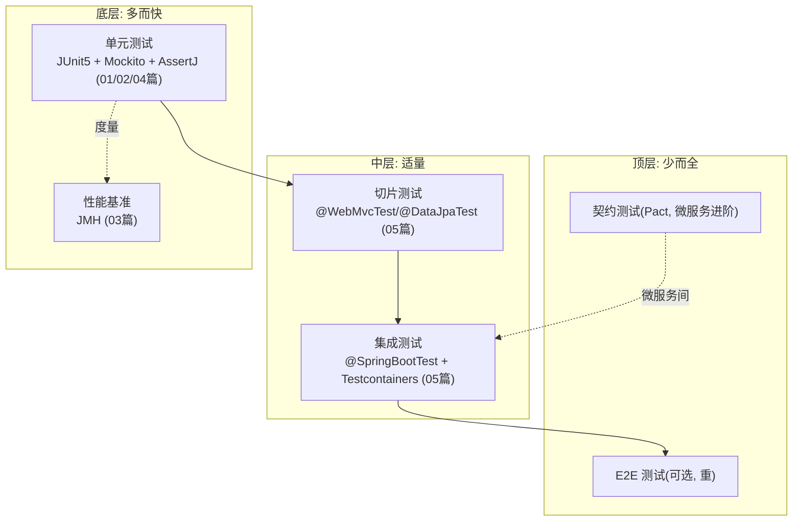

# 00-测试体系总览

> 版本基线：2026-08 整理，覆盖 单元测试 → 集成测试 → 基准测试 → 覆盖率 完整体系
> 受众：Java 后端开发，需要一张测试技术地图。
> 关联笔记：本目录全部篇目

## 📋 总纲

- 1. 测试金字塔
- 2. 各篇导航与阅读顺序
- 3. 工具选型速查
- 4. 覆盖率（JaCoCo）
- 5. 常见面试考点索引

## 学习目标

学完本篇你能：

1. 画出测试金字塔（单元/切片/集成/E2E）
2. 按层选择正确工具
3. 规划测试学习路径
4. 理解覆盖率（JaCoCo）的作用与局限
5. 快速定位"某个测试问题该看哪篇"

## 前置知识

- 本篇为总览索引，无前置；各篇内部有前置说明

---

## 1. 测试金字塔



**主线**：单元测试（最多、最快）→ 切片测试 → 集成测试（少、慢）→ E2E/契约（进阶）。

---

## 2. 各篇导航与阅读顺序

| 顺序 | 篇目 | 内容 | 来源 |
|---|---|---|---|
| 1 | [01-JUnit 5详解](01-JUnit 5详解.md) | Jupiter 架构/注解/参数化/嵌套/扩展 | 查证重建 |
| 2 | [02-Mockito详解](02-Mockito详解.md) | @Mock/@Spy/@Captor/@InjectMocks/verify | 查证重建（重点） |
| 3 | [03-JMH基准测试详解](03-JMH基准测试详解.md) | 基准测试/State/Blackhole/Profiler | 查证重建 |
| 4 | [04-AssertJ与断言最佳实践](04-AssertJ与断言最佳实践.md) | 流式断言/链式/自定义断言 | 查证重建 |
| 5 | [05-Spring Boot测试与Testcontainers](05-Spring Boot测试与Testcontainers.md) | 切片测试/集成测试/Docker 容器 | 查证重建 |

**推荐阅读顺序**：01 JUnit → 02 Mockito → 04 AssertJ（单元测试三件套）→ 05 Spring Boot 测试（集成）→ 03 JMH（性能专项）。

---

## 3. 工具选型速查

| 需求 | 工具 | 篇目 |
|---|---|---|
| 单元测试框架 | **JUnit 5**（JUnit 6 延续 Jupiter） | [01-JUnit 5详解](01-JUnit 5详解.md) |
| Mock 依赖 | **Mockito** | [02-Mockito详解](02-Mockito详解.md) |
| 断言 | **AssertJ**（流式） | [04-AssertJ与断言最佳实践](04-AssertJ与断言最佳实践.md) |
| Spring 集成测试 | @SpringBootTest + @WebMvcTest/@DataJpaTest | [05-Spring Boot测试与Testcontainers](05-Spring Boot测试与Testcontainers.md) |
| 真实依赖测试 | **Testcontainers**（Docker） | [05-Spring Boot测试与Testcontainers](05-Spring Boot测试与Testcontainers.md) |
| 性能基准 | **JMH** | [03-JMH基准测试详解](03-JMH基准测试详解.md) |
| 覆盖率 | **JaCoCo**（见第 4 节） | 本篇 |
| 契约测试 | Pact（微服务进阶，可选） | 后续补充 |

---

## 4. 覆盖率（JaCoCo）

**JaCoCo** = Java 代码覆盖率工具（行/分支/方法/类覆盖）。

```xml
<!-- Maven 配置 -->
<plugin>
    <groupId>org.jacoco</groupId>
    <artifactId>jacoco-maven-plugin</artifactId>
    <version>0.8.12</version>
    <executions>
        <execution>
            <goals><goal>prepare-agent</goal></goals>
        </execution>
        <execution>
            <id>report</id>
            <phase>test</phase>
            <goals><goal>report</goal></goals>
        </execution>
    </executions>
</plugin>
```

```bash
mvn test            # 生成 target/site/jacoco/index.html
```

**覆盖率指标**：

| 指标 | 含义 | 目标 |
|---|---|---|
| 行覆盖 | 代码行被执行比例 | 80%+ |
| 分支覆盖 | if/switch 分支覆盖 | 70%+ |
| 方法/类覆盖 | 方法/类被执行比例 | 90%+ |

**正确认知（实事求是）**：
- ✅ 覆盖率是**发现盲区**的工具（哪些代码没测）
- ⚠️ **覆盖率 ≠ 质量**：100% 覆盖也可能测错；关注**关键路径**（核心业务/异常分支/边界）
- ⚠️ 团队用**增量覆盖**（新代码必须测）比"全局凑数"更有价值

---

## 5. 常见面试考点索引

| 考点 | 答案所在 |
|---|---|
| JUnit 5 架构（Platform/Jupiter/Vintage）？ | [01-JUnit 5详解](01-JUnit 5详解.md) |
| 参数化测试怎么做？ | [01-JUnit 5详解](01-JUnit 5详解.md) §5 |
| JUnit 6 有什么变化？ | [01-JUnit 5详解](01-JUnit 5详解.md) §7 |
| @Mock/@Spy/@InjectMocks 区别？ | [02-Mockito详解](02-Mockito详解.md) §5 |
| stub 和 verify 区别？ | [02-Mockito详解](02-Mockito详解.md) §3-4 |
| ArgumentCaptor 干什么用？ | [02-Mockito详解](02-Mockito详解.md) §6 |
| 为什么用 AssertJ？ | [04-AssertJ与断言最佳实践](04-AssertJ与断言最佳实践.md) |
| JMH 为什么重要？DCE 怎么避免？ | [03-JMH基准测试详解](03-JMH基准测试详解.md) |
| @WebMvcTest vs @SpringBootTest？ | [05-Spring Boot测试与Testcontainers](05-Spring Boot测试与Testcontainers.md) |
| Testcontainers 解决什么问题？ | [05-Spring Boot测试与Testcontainers](05-Spring Boot测试与Testcontainers.md) §6 |
| 覆盖率怎么用才对？ | 本篇 §4 |

## 相关笔记（导航）

- 测试系列：[01-JUnit 5详解](01-JUnit 5详解.md) / [02-Mockito详解](02-Mockito详解.md) / [03-JMH基准测试详解](03-JMH基准测试详解.md) / [04-AssertJ与断言最佳实践](04-AssertJ与断言最佳实践.md) / [05-Spring Boot测试与Testcontainers](05-Spring Boot测试与Testcontainers.md)
- 邻接主题：[00-构建工具总览·Maven & Gradle选型对比](../构建工具/00-构建工具总览·Maven & Gradle选型对比.md)（测试在构建中跑）、[00-并发编程总览](../JDK基础库/并发/00-并发编程总览.md)（并发代码测试）

## 参考资料

- [JUnit 5 官方](https://junit.org/junit5/)，查询日期：2026-08-09
- [Mockito 官方](https://site.mockito.org/)，查询日期：2026-08-09
- [AssertJ 官方](https://assertj.github.io/doc/)，查询日期：2026-08-09
- [Testcontainers 官方](https://testcontainers.com/)，查询日期：2026-08-09
- [JaCoCo 官方](https://www.jacoco.org/jacoco/)，查询日期：2026-08-09
