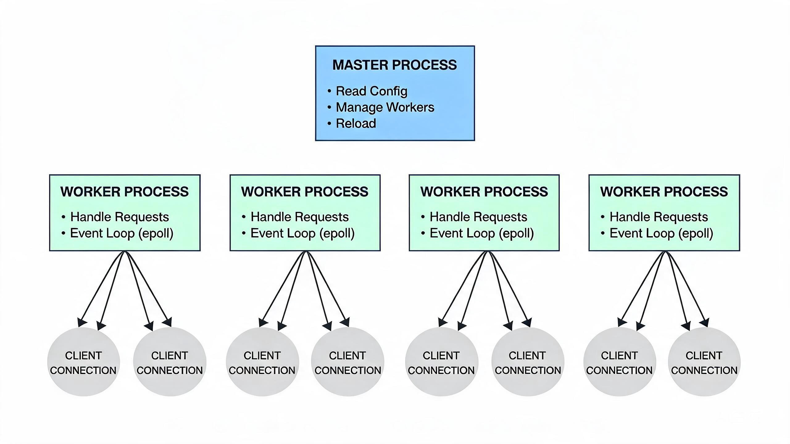
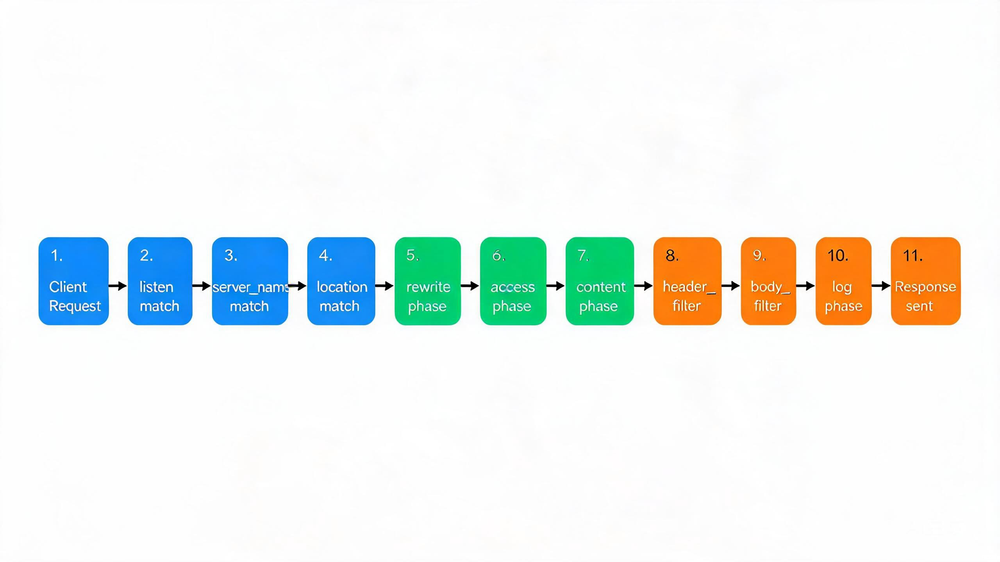
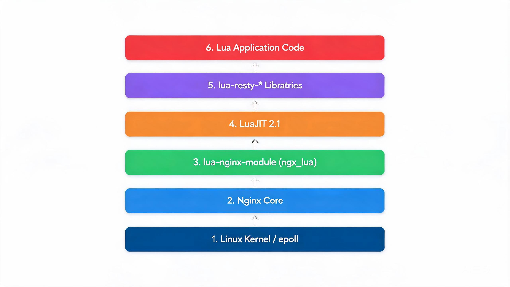

# Nginx 学习笔记（总览）

> 版本基线：Nginx **1.30.4** (stable) / OpenResty **1.29.2.1**，2026-08-05 整理，面向后端开发熟手（Python/Java/Lua），按 7 阶段循序渐进。
> 官方网站：https://nginx.org/en/docs/ ｜ OpenResty：https://openresty.org/en/ ｜ F5 NGINX Admin Guide：https://docs.nginx.com/nginx/admin-guide/

## 📋 总纲

① 基础认知（01-03）：是什么 / 怎么装 / 怎么跑
② 配置基础（04-05）：配置文件结构 / 静态资源服务
③ 核心机制（06-08）：请求处理流程 / location 匹配 / 虚拟主机
④ 反向代理与负载均衡（09-13）：proxy_pass / upstream / WebSocket / 四层 stream
⑤ 安全与传输（14-17）：HTTPS/TLS / rewrite / 访问控制 / 限流防护
⑥ 高级与优化（18-21）：缓存 / 性能调优 / 日志监控 / 动态模块
⑦ OpenResty 与 Lua 插件（22-27）：Lua 执行阶段 / 核心 API / 插件实战 / 网关生态
⑧ 综合（28-31、99）：生产模板 / 命令速查 / 面试题 / 最佳实践 / 踩坑记录
⑨ 08-专题补充（A01-A05）：Python/Java 对接、Consul 服务发现、K8s Ingress、监控

## 1. 关键架构图

## 2. 文档结构

### 2.1 01-基础认知

- [01-Nginx概述与架构原理](01-基础认知/01-Nginx概述与架构原理.md) — 事件驱动模型、master/worker 架构、与 Apache 对比
- [02-安装部署与目录结构](01-基础认知/02-安装部署与目录结构.md) — 包安装/源码编译/Docker、conf/logs/html 目录、nginx -t/-V
- [03-进程模型与控制管理](01-基础认知/03-进程模型与控制管理.md) — master/worker 职责、reload 平滑切换、信号机制

### 2.2 02-配置基础

- [04-配置文件结构与指令体系](02-配置基础/04-配置文件结构与指令体系.md) — 简单/块指令、上下文层级、变量体系
- [05-静态资源服务](02-配置基础/05-静态资源服务.md) — root vs alias、try_files、autoindex、expires

### 2.3 03-核心机制

- [06-请求处理流程详解](03-核心机制/06-请求处理流程详解.md) — server 路由、location 匹配、11 个处理阶段
- [07-location匹配规则](03-核心机制/07-location匹配规则.md) — =/^~/~/~* 优先级、命名 location、匹配陷阱
- [08-虚拟主机](03-核心机制/08-虚拟主机.md) — 基于名称/IP、server_name 通配与正则、default_server

### 2.4 04-反向代理与负载均衡

- [09-反向代理proxy_pass](04-反向代理与负载均衡/09-反向代理proxy_pass.md) — 尾斜杠语义、proxy_set_header、超时、next_upstream
- [10-upstream负载均衡算法](04-反向代理与负载均衡/10-upstream负载均衡算法.md) — 轮询/weight/least_conn/ip_hash/一致性哈希、健康检查
- [11-对接后端FastCGI与uWSGI与gRPC](04-反向代理与负载均衡/11-对接后端FastCGI与uWSGI与gRPC.md) — fastcgi_pass/uwsgi_pass/grpc_pass
- [12-WebSocket代理](04-反向代理与负载均衡/12-WebSocket代理.md) — 协议头升级、长连接超时、SSE 代理
- [13-四层stream代理](04-反向代理与负载均衡/13-四层stream代理.md) — TCP/UDP 负载、与七层代理区别

### 2.5 05-安全与传输

- [14-HTTPS与TLS配置](05-安全与传输/14-HTTPS与TLS配置.md) — 证书链、ssl_protocols/ciphers、HSTS、OCSP、HTTP/2、HTTP/3
- [15-rewrite重写规则](05-安全与传输/15-rewrite重写规则.md) — rewrite/return/set/if、last vs break、if is evil
- [16-访问控制与认证](05-安全与传输/16-访问控制与认证.md) — allow/deny、auth_basic、auth_request、auth_jwt
- [17-限流防护](05-安全与传输/17-限流防护.md) — limit_req 令牌桶 / limit_conn、突发桶

### 2.6 06-高级与优化

- [18-缓存机制](06-高级与优化/18-缓存机制.md) — proxy_cache_path/valid、slice、open_file_cache、浏览器缓存
- [19-性能调优](06-高级与优化/19-性能调优.md) — epoll/reuseport/worker、keepalive、buffer、gzip/Brotli
- [20-日志与监控](06-高级与优化/20-日志与监控.md) — log_format、access_log、stub_status、error_log debug
- [21-动态模块与扩展](06-高级与优化/21-动态模块与扩展.md) — --with-compat、load_module、njs 脚本

### 2.7 07-OpenResty与Lua插件

- [22-OpenResty入门与架构](07-OpenResty与Lua插件/22-OpenResty入门与架构.md) — 与 Nginx 关系、LuaJIT、组件清单
- [23-Lua执行阶段详解](07-OpenResty与Lua插件/23-Lua执行阶段详解.md) — 11 个阶段指令、各阶段职责与可用 API
- [24-OpenResty核心API](07-OpenResty与Lua插件/24-OpenResty核心API.md) — ngx.var/req、location.capture、shared.DICT、cosocket
- [25-lua-resty库生态](07-OpenResty与Lua插件/25-lua-resty库生态.md) — redis/mysql/http/dns/lock/limit-traffic 等
- [26-Lua插件实战](07-OpenResty与Lua插件/26-Lua插件实战.md) — 鉴权、限流、WAF、动态路由/灰度
- [27-网关生态Kong与APISIX](07-OpenResty与Lua插件/27-网关生态Kong与APISIX.md) — 与 OpenResty 关系、插件机制、选型对比

### 2.8 综合文档（28-31、99 在根目录）

- [00-环境准备与实验搭建](01-基础认知/00-环境准备与实验搭建.md) — Docker-Compose 一键拉起实验环境
- [28-生产配置规范与模板](28-生产配置规范与模板.md) — 命名规范、include 拆分、灰度发布
- [29-常用命令速查表](29-常用命令速查表.md) — nginx 命令、日志排查、性能观测
- [30-NGINX面试题与答案](30-NGINX面试题与答案.md) — 高频面试题与详细解析
- [31-最佳实践统一总结](31-最佳实践统一总结.md) — 按知识点汇总 + 小/中/大型项目选型
- [99-踩坑记录与解决方案](99-踩坑记录与解决方案.md) — 全部踩坑条目（#1.x~#5.x 分类编号），被各文档引用

### 2.9 08-专题补充（非 Nginx 本身但配合使用）

- [A01-Python应用对接Nginx实战](08-专题补充/A01-Python应用对接Nginx实战.md) — Gunicorn/uWSGI/Django/Flask
- [A02-Java应用对接Nginx实战](08-专题补充/A02-Java应用对接Nginx实战.md) — Tomcat/Spring Boot/gRPC
- [A03-Nginx与Consul服务发现集成](08-专题补充/A03-Nginx与Consul服务发现集成.md) — 动态上游、consul-template
- [A04-Nginx作为K8s-Ingress控制器](08-专题补充/A04-Nginx作为K8s-Ingress控制器.md) — Ingress-Nginx、Ingress 资源
- [A05-Nginx与Prometheus-Grafana监控](08-专题补充/A05-Nginx与Prometheus-Grafana监控.md) — 指标暴露、VTS 模块、仪表盘

## 3. 学习路线

- 严格按阶段顺序学习，阶段内按编号顺序；每篇在实验环境实测（[00-环境准备与实验搭建](01-基础认知/00-环境准备与实验搭建.md)）
- 改配置必 `nginx -t` 验证 + `nginx -s reload` 热加载；遇坑先查 [99-踩坑记录与解决方案](99-踩坑记录与解决方案.md)
- 按技术栈侧重：Python → 阶段四 + [A01-Python应用对接Nginx实战](08-专题补充/A01-Python应用对接Nginx实战.md)；Java → 阶段四 + [A02-Java应用对接Nginx实战](08-专题补充/A02-Java应用对接Nginx实战.md)；Lua → 阶段七 OpenResty（优势领域）
- 复习巩固：[30-NGINX面试题与答案](30-NGINX面试题与答案.md) 对应阶段刷题、[31-最佳实践统一总结](31-最佳实践统一总结.md) 查漏、[29-常用命令速查表](29-常用命令速查表.md) 随时查阅

## 4. 参考资源

- Nginx 文档总索引：https://nginx.org/en/docs/
- Nginx 新手指南：https://nginx.org/en/docs/beginners_guide.html
- 请求处理流程：https://nginx.org/en/docs/http/request_processing.html
- lua-nginx-module 文档：https://github.com/openresty/lua-nginx-module
- Nginx Wiki 踩坑：https://www.nginx.com/resources/wiki/start/topics/tutorials/config_pitfalls/
- If Is Evil：https://www.nginx.com/resources/wiki/start/topics/depth/ifisevil/
