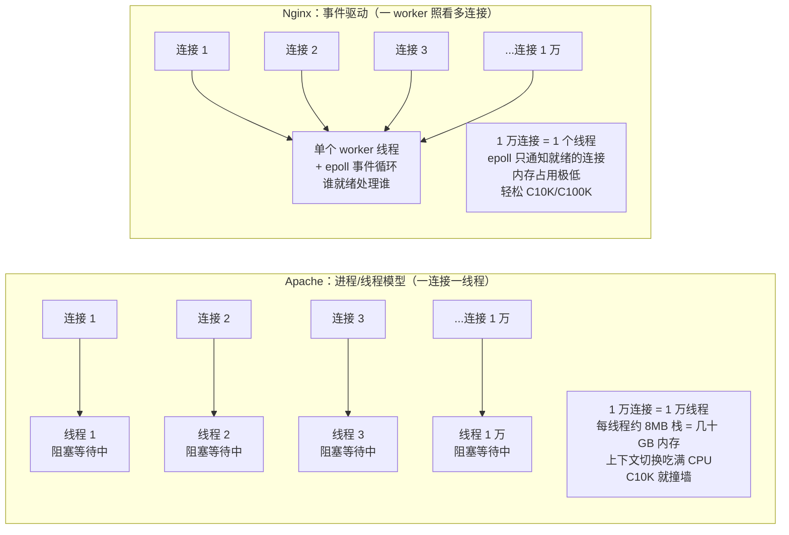
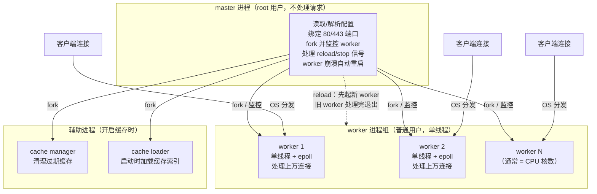
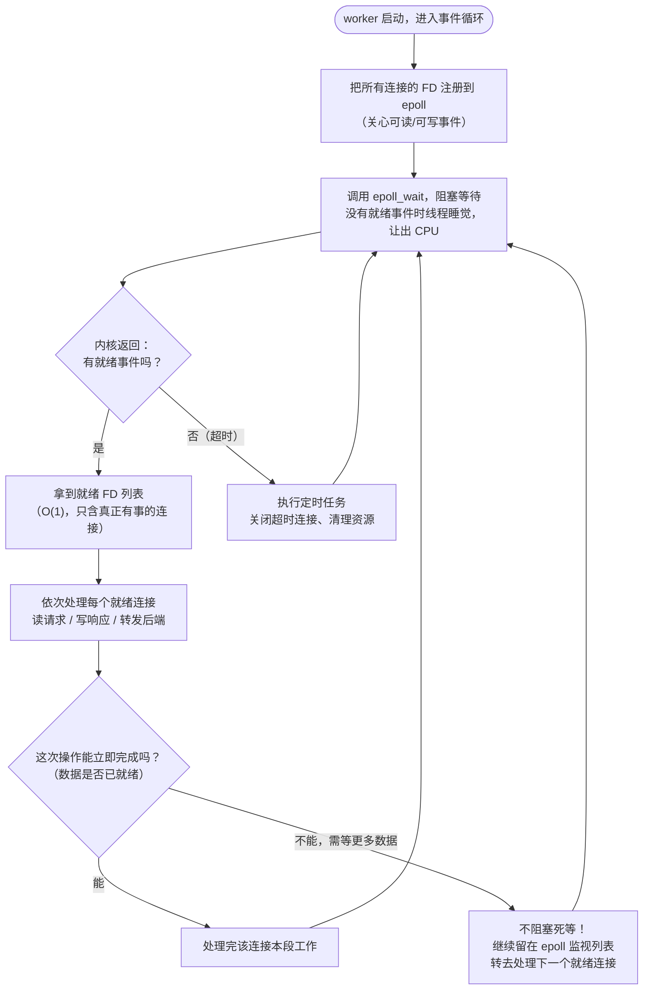
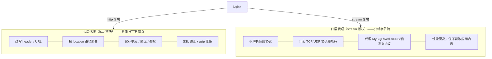

# 01 - Nginx 概述与架构原理

> 版本基线：Nginx 1.30.4 (stable) | 创建日期：2026-08-05
> 受众：后端开发熟手（熟悉 Python/Java/Lua），但服务器运维是小白。操作系统概念会顺带讲清。

---

## 学习目标

学完本篇，你应当能说清楚三件事：Nginx 到底是什么、它在服务器世界里扮演哪些角色；它为什么能用极少的资源扛住海量并发（核心是 master/worker 进程模型 + 事件驱动 IO 多路复用）；以及 Nginx 的版本体系怎么选、生产环境该用哪个分支。这是后续所有配置、调优、排障的认知地基——不理解架构原理，后面写配置就是在抄模板。

---

## 核心概念

### 一、Nginx 是什么

在讲 Nginx 之前，先补两个最基础的服务器概念，因为后面的所有讨论都建立在这上面。

**什么是 Web 服务器（HTTP 服务器）？**

Web 服务器本质上就是一个"一直在后台运行的程序"。它做的事情非常朴素：

1. 启动时告诉操作系统："我要监听 80 端口（或 443 端口），有数据发到这个端口就交给我处理。"（这叫 **bind + listen**，绑定并监听一个端口）
2. 之后它进入一个死循环，等待别人来连它。
3. 当一个客户端（浏览器）发起 HTTP 请求时，操作系统会把这个连接交给这个程序。
4. 程序读取请求内容（`GET /index.html HTTP/1.1` 这样的文本），根据请求返回响应（HTML 页面、图片、JSON 等）。

就这么简单。"端口"你可以理解成一栋大楼里的房间号——操作系统是大楼管理员，数据包是访客，管理员根据房间号把访客送到对应的程序门口。

**什么是进程、什么是线程？**（你大概知道，但这里锚定一下术语，后面要反复用）

- **进程（process）**：一个程序运行起来的实例。操作系统给它分配独立的内存空间。你可以理解为"一个独立的工作间"，里面有自己的工具和材料，别人不能随便进来拿。
- **线程（thread）**：进程里面的执行单位。一个进程可以有多个线程，它们**共享**进程的内存空间，但各自有独立的执行流（各自的"任务清单"）。你可以理解为"工作间里的多个工人"，他们共用工作间的工具，但各干各的活。
- **上下文切换（context switch）**：CPU 同一时刻只能真正执行一个线程（单核视角）。当 CPU 从执行线程 A 切换到线程 B 时，要先把 A 的现场（寄存器、栈指针等）存起来，再把 B 的现场恢复出来，这个动作叫上下文切换。线程越多，切换越频繁，开销越大——这是后面理解 Nginx 优势的关键。

**Nginx 的定义**

Nginx（读作 "engine-x"，引擎 X）是一款**高性能的 HTTP 服务器 / 反向代理服务器**。它由俄罗斯工程师 Igor Sysoev 于 2002 年开始编写，2004 年首次公开发布，采用 BSD 许可证开源。它的核心设计哲学是：**用事件驱动（event-driven）的异步非阻塞 IO 模型，而不是传统的"一个连接一个线程"模型**，从而用极少的进程和内存处理海量并发连接。

> 为什么 Igor Sysoev 要造 Nginx？2000 年代初，俄罗斯的高流量网站（如 Rambler）用 Apache 扛不住并发——Apache 当时的默认模型是"一个连接一个进程/线程"，连接数一上去，内存和上下文切换开销就把机器拖垮了。Nginx 就是为了解决"高并发下资源被线程吃光"这个问题而生的。

一句话总结：**Nginx 是一个用事件驱动架构、以极少资源扛住高并发的 HTTP 服务器和反向代理**。它不只是"能跑网页的服务器"，更是一个被设计来在高并发场景下活下来的服务器。

---

### 二、与 Apache 的对比：什么是事件驱动，为什么适合高并发

要理解 Nginx 为什么快，必须先理解传统服务器（以 Apache 为代表）慢在哪。这一节是整篇文档的"为什么"核心。

#### 2.1 传统服务器的问题：一连接一线程

Apache 经典的工作模型（MPM，Multi-Processing Module）有几种，最典型的是：

- **prefork MPM**：每个连接分配一个**进程**。一个进程占的内存更大（几 MB 起步）。
- **worker / event MPM**：每个连接分配一个**线程**。线程比进程轻，但仍然有开销。

无论进程还是线程，核心思路都是一样的：**来了一个连接，我就派一个"工人"（进程或线程）专门伺候它，直到连接关闭**。

问题来了：这个"工人"绝大部分时间在干什么？——在**等**。等浏览器把请求头发完，等磁盘把文件读出来，等后端把响应返回。在等的这段时间里，这个工人**占着一个线程不撒手，但 CPU 其实没在干活**。

用一个餐厅做类比：

> 传统模型 = **一个服务员专门盯一桌客人**。客人看菜单的时候服务员就在旁边干站着，客人吃菜的时候服务员也干站着。如果有 10000 桌客人，就需要 10000 个服务员。每个服务员（线程）至少要发一套工服（内存栈），即使他大部分时间在发呆。

把数字代入真实的服务器场景：

- 假设有 10000 个并发连接。
- 传统模型需要 10000 个线程。
- Linux 下每个线程默认栈大小约 8MB（可调小，但即便调到 1MB 也要 10GB）。
- 10000 个线程光是栈空间就要几十 GB 内存，更可怕的是 **CPU 在这 10000 个线程之间来回切换**（上下文切换），每次切换都要保存/恢复现场，切换本身就把 CPU 跑满了，真正处理请求的时间反而没多少。

这就是 1999 年 Dan Kegel 提出的著名的 **C10K 问题**（Concurrent 10K，如何处理一万个并发连接）：传统"一连接一线程"模型在万级并发时就撞墙了，不是因为 CPU 不够快，而是因为**线程本身的开销**把系统资源吃光了。

#### 2.2 事件驱动如何解决

Nginx 的思路完全不同：**不要给每个连接派一个专门的服务员，而是用极少的服务员同时照看所有桌子，谁按铃（有事件）就去谁那桌。**

继续餐厅类比：

> 事件驱动模型 = **一个服务员同时照看所有桌子**。每张桌子上有个按铃。服务员站在中间，哪桌按铃就去哪桌处理，处理完立刻回来等下一个铃。客人看菜单、吃菜的时间（对应网络等待、磁盘等待），服务员根本不守着，而是去服务其他按铃的桌子。

这里"按铃"就是操作系统提供的**事件通知机制**——当某个连接"有数据可读了"或"可以写了"，操作系统会告诉 Nginx："嘿，这个连接有事了。"Nginx 才去处理它。在这之前，Nginx 不会傻等，而是去处理其他就绪的连接。

关键在于：**Nginx 的 worker 是单线程的，它在任意时刻只处理一个就绪连接的一小段工作，处理完立刻切到下一个。** 因为大部分连接大部分时间都在"等网络数据"，真正需要 CPU 处理的就绪事件其实很少且很短，所以一两个 worker 线程就能轮转着处理成千上万个连接。

这就是"异步非阻塞"的含义：

- **非阻塞**：当一个连接还没数据时，worker 不会卡在那里等（不阻塞），而是立刻去看下一个连接。
- **异步**：等数据真的来了，操作系统会"事后通知"worker，worker 再回头处理。

#### 2.3 两种模型对比图



#### 2.4 对比小结

| 维度 | Apache（一连接一线程） | Nginx（事件驱动） |
|------|----------------------|------------------|
| 并发模型 | 每连接独占一个进程/线程 | 少量 worker 线程，epoll 轮转处理所有连接 |
| 空闲连接开销 | 每个空闲连接仍占一个线程（8MB 栈） | 空闲连接几乎不占资源，只在就绪时才处理 |
| 内存占用 | 万级并发即几十 GB | 万级并发仅几百 MB |
| 上下文切换 | 线程越多切换越频繁，吃满 CPU | worker 极少，切换开销可忽略 |
| 适合场景 | 连接数中等、每请求计算重 | 高并发、大量长连接、IO 密集 |
| 短板 | 高并发时资源被线程吃光 | CPU 密集型任务会卡住整个 worker（见下） |

> **补充一个重要细节**：Nginx 的事件驱动模型也有它的"软肋"。因为 worker 是单线程的，**如果一个请求要做大量 CPU 计算（或调用了会阻塞的操作），它会把整个 worker 卡住**，这个 worker 上的其他所有连接都得等着。所以 Nginx 适合"IO 密集"（等网络、等磁盘、等后端），不适合"CPU 密集"。这也是为什么 OpenResty 里的 Lua 代码必须用非阻塞 API（如 `ngx.timer`、cosocket），绝不能写死循环或调用会阻塞的库——后面阶段七会专门讲。

---

### 三、master/worker 进程模型

理解了"为什么用事件驱动"，现在看 Nginx 具体是怎么把进程组织起来的。这是 Nginx 架构的骨架。

Nginx 启动后，并不是"一个进程包揽一切"，而是分成**一个 master 进程 + 多个 worker 进程**（可能还有几个辅助进程）。它们分工明确：

#### 3.1 master 进程：管理者

master 进程是 Nginx 启动时**最先创建**的进程，通常以 **root 用户**身份运行。它自己**不处理任何一个客户端请求**，它的职责是"当老板"：

1. **读取并解析配置文件**（`nginx.conf`）。
2. **绑定监听端口**（如 80、443）。注意：1024 以下的端口叫"特权端口"，只有 root 才能绑定，所以这一步必须由 root 身份的 master 来做。
3. **fork（派生）出 worker 进程**，把处理请求的活儿交给它们。
4. **监控 worker 进程**：如果某个 worker 因为 bug 崩溃了，master 会立刻重新 fork 一个新的顶上——这就是 Nginx 高可用性的来源。
5. **处理外部信号**：比如你执行 `nginx -s reload`，master 收到信号后，会启动新的 worker（用新配置），同时通知旧 worker"处理完手头连接就退出"，实现**零停机平滑重载**。
6. **管理日志文件、缓存**等共享资源。

#### 3.2 worker 进程：干活的

worker 进程是真正**处理客户端请求**的进程。master 在 fork worker 时，会让 worker **放弃 root 权限**，降级为一个普通用户（如 `nginx`、`www-data`，由配置里的 `user` 指令指定）。

- **每个 worker 是单线程的**，内部跑一个事件循环（epoll），同时照看成千上万个连接。
- worker 数量由配置指令 `worker_processes` 决定，通常**等于 CPU 核心数**（让每个 worker 独占一个核，避免互相抢核导致上下文切换）。
- 所有 worker 监听**同一个端口**（比如都监听 80），新连接到来时由操作系统或 `accept_mutex` 机制决定交给哪个 worker 处理——这就是 worker 间的负载均衡。

#### 3.3 为什么要这样分？为什么不全交给一个进程？

这是初学者常问的问题。把 master 和 worker 分开，有三个核心好处：

1. **安全**：master 以 root 运行只为"绑端口"这一件需要特权的事，真正接触用户数据的 worker 降级成普通用户。这样即使某个 worker 被漏洞攻陷，攻击者拿到的也只是普通用户权限，不能直接控制整个系统。这叫**权限最小化**。
2. **可靠性**：master 不处理请求，所以它不会被业务逻辑拖垮或崩溃。它站在外面盯着 worker，哪个挂了就拉起哪个。如果只有一个进程，一崩全完。
3. **零停机运维**：reload 时，master 可以"边老边新"——先起新 worker，等旧 worker 处理完存量连接再退场，整个过程不丢一个请求。

#### 3.4 辅助进程

除了 master 和 worker，开启缓存时还会看到两个辅助进程：

- **cache manager**：周期性检查缓存，清理过期条目、控制缓存总大小。
- **cache loader**：Nginx 启动时把磁盘上已有的缓存元数据加载到内存里（只加载一次）。

它们都不处理客户端请求，只是帮 worker 管理共享缓存。

#### 3.5 架构图



#### 3.6 用命令亲眼看看这些进程

光说理论不够直观，装好 Nginx 后跑几条命令就能看到这套进程模型：

```bash
# 查看 nginx 相关进程，会看到 1 个 master + N 个 worker
# master 的 USER 是 root，worker 的 USER 是 nginx（或 www-data）
ps -ef | grep nginx | grep -v grep
# 典型输出（4 核机器）：
# root      1234     1  0 10:00 ?        00:00:00 nginx: master process /usr/sbin/nginx
# nginx     1235  1234  0 10:00 ?        00:00:00 nginx: worker process
# nginx     1236  1234  0 10:00 ?        00:00:00 nginx: worker process
# nginx     1237  1234  0 10:00 ?        00:00:00 nginx: worker process
# nginx     1238  1234  0 10:00 ?        00:00:00 nginx: worker process
```

注意输出的第二列（PPID，父进程 ID）：所有 worker 的父进程都是 master 的 PID（1234），这印证了"master fork 出 worker"。

```bash
# 用 pstree 看进程树，父子关系一目了然
pstree -p | grep nginx
# 输出示意：
# nginx(1234)───nginx(1235)
#              ├─nginx(1236)
#              ├─nginx(1237)
#              └─nginx(1238)
```

```bash
# 查看每个 worker 的 CPU 亲和性（绑核情况）和占用
top -H -p $(pgrep -P $(pgrep -o nginx))
```

> 参考踩坑：[#2.1 worker_processes 设置不当](../99-踩坑记录与解决方案.md#21-worker_processes-设置不当)

---

### 四、事件驱动模型：epoll / kqueue / poll / select

上一节说了"worker 用 epoll 照看上万连接"，但 epoll 到底是什么？这一节把 IO 多路复用从零讲透。这是 Nginx 高性能的真正引擎。

#### 4.1 先搞懂：什么是文件描述符（FD）

在 Unix/Linux 的设计哲学里，**"一切皆文件"**。不光磁盘上的文件是"文件"，一个网络连接、一个管道、一个终端，在程序眼里都是一个"文件"。要使用它，你先要"打开"它，操作系统会给你一个**整数编号**作为凭证，之后你对这个连接的读写都用这个编号。这个编号就叫**文件描述符（File Descriptor，简称 FD）**。

- 你 `accept` 了一个新的客户端连接 → 操作系统给你一个新 FD（比如 7）。
- 之后从这个连接读数据 → `read(7, ...)`；写数据 → `write(7, ...)`。
- 连接关闭 → `close(7)`。

所以"一个并发连接"在程序里就是"一个 FD"。10000 个并发连接 = 10000 个 FD。Nginx 要管理的就是这一堆 FD："哪个 FD 现在有数据可读了？哪个可以写了？"

#### 4.2 什么是 IO 多路复用（IO Multiplexing）

"多路复用"这个词拆开看：

- **多路**：多个通道，即多个连接（多个 FD）。
- **复用**：复用一个线程。

合起来：**用一个线程，同时监视多个 FD，等其中任何一个有事件（可读/可写）时再处理**。这就是 Nginx 单 worker 能管上万连接的底层机制。

如果没有多路复用，一个线程想监视 10000 个连接有没有数据来，只能傻乎乎地一个一个问："连接 1 有数据吗？连接 2 有数据吗？……连接 10000 有数据吗？"然后再回头从连接 1 问起——这叫**轮询（polling）**，绝大多数问询都是白问（连接都在等），CPU 全浪费在"问"上。

多路复用把这个"问"的活儿交给了操作系统内核：你把所有 FD 一次性丢给内核，说"这些 FD 哪个有事了叫我"，然后线程就**睡觉让出 CPU**；内核盯着这些 FD，一有事就把"就绪的 FD 列表"返回给你。这样线程只在"真的有事"时才被唤醒干活。

#### 4.3 四种多路复用机制的演进

多路复用不是一上来就这么高效的，它经历了四代演进。理解这个演进，你就能彻底明白 epoll 为什么强。

**第一代：select（1983 年）**

select 是最古老的机制。它的工作方式：

1. 程序把"我关心的所有 FD"打包成一个位图（bitmap），整体丢给内核。
2. 内核遍历这个位图里的**每一个 FD**，检查它有没有就绪。
3. 内核把"有几个就绪"返回给程序，但**不告诉你具体是哪几个**就绪了。
4. 程序收到后，还得**自己再遍历一遍所有 FD**，逐个检查"是你吗？是你吗？"才能找出真正就绪的那些。

select 的两个致命缺陷：

- **FD 数量上限**：默认最多只能监视 1024 个 FD（`FD_SETSIZE` 限制）。这在 1983 年够用，今天完全不够。
- **O(n) 全量扫描**：每次都要把所有 FD 传给内核扫一遍，程序自己再扫一遍。10000 个连接里只有 3 个就绪，也要扫 10000 次。

**第二代：poll（1986 年）**

poll 用链表代替了位图，**去掉了 1024 的数量上限**。但本质没变——依然是把所有 FD 丢给内核全量扫描，程序自己再全量扫描找就绪的。**复杂度还是 O(n)**，连接数一多依然慢。

**第三代：epoll（Linux 2.6，2002 年）**——Nginx 在 Linux 上的主力

epoll 是 Linux 专门为"大量连接、少量就绪"这个场景重新设计的，它解决了 select/poll 的核心痛点：

1. **内核维护就绪列表**：你注册一次关心的 FD 后，内核会**持续**帮你盯着（不用每次重新传所有 FD）。哪个 FD 就绪了，内核直接把它加到一个"就绪列表"里。
2. **只返回就绪的**：你调用 `epoll_wait` 时，内核**直接把就绪列表**给你，不扫全部 FD。10000 个连接里 3 个就绪，就只返回这 3 个。
3. **复杂度**：获取就绪 FD 是 **O(1)**，处理是 **O(就绪数量)**。和总连接数无关——这就是 epoll 能扛 C10K/C100K 的根本原因。

epoll 还有两种触发模式，这里顺便讲清（面试常问）：

- **LT（Level Triggered，水平触发，Nginx 默认）**：只要 FD 上还有数据没读完，内核就**持续通知**你。比较"宽容"——你一次没读完，下次还会提醒你，不容易漏数据，编程简单。
- **ET（Edge Triggered，边缘触发）**：状态**变化**的瞬间只通知你**一次**，之后不再提醒。你必须一次性把数据**读到读完为止**（循环读直到返回 EAGAIN），否则剩下的数据就丢了。效率更高（通知少），但编程更难、容易出 bug。Nginx 默认用 LT，兼顾性能和稳健。

**第四代：kqueue（FreeBSD/macOS）**

kqueue 是 BSD 系（FreeBSD、macOS）的机制，功能和 epoll 类似——也是内核维护就绪列表、O(1) 获取就绪。Nginx 在 macOS/BSD 上自动用 kqueue。所以你 MacBook 上跑 Nginx，用的就是 kqueue 不是 epoll。

**为什么 Nginx 单 worker 能处理大量并发——终极回答**

把上面的拼起来，逻辑链是这样的：

1. epoll 让一个线程能高效监视上万 FD，且获取就绪 FD 是 O(1)——**监视本身几乎不花 CPU**。
2. worker 是非阻塞的——一个连接没数据时立刻去处理下一个就绪连接，**不把时间浪费在等待上**。
3. 在任意时刻，10000 个连接里通常只有几十个真的有数据要处理（其余都在等网络），所以一个 worker 线程轮转着处理这几十个就绰绰有余——**就绪事件本身就很稀疏**。
4. 每个空闲连接只占很小的内存（一个连接结构约几 KB），不像传统模型要占一整个线程栈（8MB）——**内存占用极低**。

四点合起来：CPU 不浪费在切换和等待上，内存不浪费在空闲线程上。这就是 Nginx 用一两个 worker 进程扛住几万并发的全部秘密。

#### 4.4 事件驱动处理流程图



#### 4.5 四种机制对比表

| 机制 | 出现年代/平台 | FD 上限 | 获取就绪复杂度 | 是否需每次传全部 FD | Nginx 是否使用 |
|------|--------------|---------|---------------|-------------------|---------------|
| select | 1983 / 通用 | 1024 | O(n) 全扫 | 是 | 兜底备用 |
| poll | 1986 / 通用 | 无上限 | O(n) 全扫 | 是 | 兜底备用 |
| epoll | 2002 / Linux | 无上限 | O(1) 只返回就绪 | 否（注册一次持续监视） | Linux 主力 |
| kqueue | 2000 / BSD、macOS | 无上限 | O(1) 只返回就绪 | 否 | BSD/macOS 主力 |

> Nginx 在编译/启动时会**自动选择**当前平台最优的机制（Linux 选 epoll，BSD/macOS 选 kqueue），不需要你手动指定。配置里 `use epoll;` 只是显式声明，一般让它自动选即可。

---

### 五、版本体系：mainline、stable、legacy

Nginx 的版本号是 `主版本.次版本.修订号`（如 1.30.4），其中**次版本的奇偶**决定了它是什么分支。这是初学者最容易忽略、却直接影响生产稳定性的知识点。

#### 5.1 mainline（主线开发版）

- 次版本号是**奇数**，如 1.29.x、1.31.x。
- 它是 Nginx 的"开发主干"，新功能、新特性最先在这里出现，bug 修复也最先合入。
- 优点：能用到最新特性。
- 缺点：可能引入新 bug，**不建议直接用于生产**。适合尝鲜、测试、为新特性做预研。

#### 5.2 stable（稳定版）

- 次版本号是**偶数**，如 1.30.x、1.28.x。
- 它是从某个 mainline 分支"固化"出来的稳定分支，**只接收 bug 修复和安全补丁**，不加新功能。
- 优点：行为稳定、可预测。
- 缺点：新特性要等下一个 stable 才有。
- **生产环境一律用 stable**。本文档基线 1.30.4 就是 stable 分支 1.30 的第 4 个修订版。

#### 5.3 legacy（遗留版）

- 更老的 stable 分支，已被新 stable 取代，但官方还会为它打**关键安全补丁**一段时间。
- 最终会进入 EOL（End of Life，停止维护）。生产环境应主动跟进升级，不要赖在 legacy 上。

#### 5.4 怎么选

| 场景 | 选哪个 | 理由 |
|------|--------|------|
| 生产线上 | stable（如 1.30.4） | 只收安全/bug 修复，行为可预测 |
| 想验证新特性 | mainline（如 1.31.x） | 新特性首发地，但要承担不稳定风险 |
| 老系统暂不能升 | legacy（如 1.26.x） | 仅过渡，应排期升级 |

> **一个常见误区**：以为"版本号越大越新就越好，所以生产也用 mainline"。错。mainline 是开发版，次版本号大不等于更适合生产。生产看的是"稳定分支 + 修订号（.4 表示修了 4 轮 bug，通常比较成熟）"。

> 本文档基线 Nginx **1.30.4** 即 stable 分支。涉及新特性时会标注引入版本（如 `> 自 Nginx 1.25.1 起，HTTP/2 改用独立指令 http2 on;`），帮助你判断你的版本是否支持。

---

### 六、Nginx 能做什么

理解了架构，最后看看 Nginx 在实际工程里扮演哪些角色。Nginx 是个"多面手"，下面这些能力很多是叠加使用的（比如一个 Nginx 同时做反代 + 负载均衡 + HTTPS 终止 + 缓存）。

#### 6.1 Web 服务器（静态资源服务）

最基础的用途：直接把磁盘上的静态文件（HTML、CSS、JS、图片、视频）返回给客户端。Nginx 处理静态文件极快（配合 `sendfile` 零拷贝，数据不经过用户态缓冲直接从磁盘到网卡），性能远超后端应用服务器。生产中常见的"动静分离"就是：静态资源交给 Nginx 直出，动态请求才转给后端。

#### 6.2 反向代理（Reverse Proxy）

Nginx 最核心的用途。它站在后端应用服务器前面，客户端请求先到 Nginx，Nginx 再把请求**转发**给后端，拿到响应再返回给客户端。

- 客户端**不知道**背后有几台后端服务器，只和 Nginx 打交道。
- 好处：隐藏后端真实 IP、统一入口、统一做 HTTPS 解密（SSL 终止）、统一日志、统一限流。

> 顺带区分**正向代理 vs 反向代理**（面试高频，易混）：
> - **正向代理**代理的是**客户端**（如 VPN、翻墙工具）：你通过代理去访问外网，**服务器不知道真实客户端是谁**。
> - **反向代理**代理的是**服务端**（如 Nginx）：客户端访问代理，代理转发给后端，**客户端不知道真实服务器是谁**。
> 记忆口诀：正向"帮客户端出门"，反向"替服务端接客"。Nginx 的核心角色是**反向代理**。

#### 6.3 负载均衡（Load Balancing）

反向代理的进阶：后端不止一台服务器时，Nginx 用 `upstream` 把请求**分发**到多台后端，避免单台被打爆。内置算法：

- **轮询（round-robin）**：默认，依次分发。
- **加权轮询（weight）**：性能强的机器多分点。
- **ip_hash**：同一客户端 IP 固定落到同一台后端（简单的会话保持）。
- **least_conn**：分给当前连接数最少的那台。
- **一致性哈希**（第三方模块）：后端增减时减少缓存失效。

还能配合**健康检查**（被动/主动）自动摘除故障节点。负载均衡是 Nginx 在中大型架构里的标配能力。

#### 6.4 API 网关（API Gateway）

把反向代理 + 负载均衡 + 鉴权 + 限流 + 路由 + 协议转换组合起来，Nginx 就是一个 API 网关。所有外部请求先过 Nginx，在这里统一做：身份认证、限流防护、灰度路由、日志采集、协议转换（HTTP→gRPC 等）。OpenResty（Nginx + Lua）更是把网关能力发挥到极致，Kong、APISIX 都基于它——阶段七会深入。

#### 6.5 邮件代理（Mail Proxy）

Nginx 还能代理邮件协议（SMTP、POP3、IMAP），做邮件负载均衡和认证。这个能力用得少，但 Nginx 内置支持，知道即可。

#### 6.6 TCP/UDP 代理（四层代理，stream 模块）

前面 1-5 都是 **HTTP 层（七层，应用层）** 的代理——Nginx 能看懂 HTTP 协议内容。Nginx 还有个 `stream` 模块，能做 **TCP/UDP 层（四层，传输层）** 的代理：它不解析应用协议，只做字节流转发。可用于代理数据库、Redis、DNS、自定义 TCP 协议等非 HTTP 服务。七层代理智能（能改 header、按路径路由），四层代理通用（什么协议都能转，性能更高）。



---

## 最佳实践

本篇是认知篇，配置层面的最佳实践后面各篇会详细展开。这里先立几条和"架构认知"直接相关的原则：

1. **生产一律用 stable 分支**：用 1.30.4 这类偶数稳定版，不要图新鲜用 mainline。新特性先在测试环境用 mainline 验证，等它固化进下一个 stable 再上生产。

2. **`worker_processes` 设为 `auto`**：让 Nginx 自动按 CPU 核数起 worker。手动写死成"多多益善"反而有害——worker 多了会互相抢核，徒增上下文切换。详见下面的踩坑引用。

3. **事件机制交给 Nginx 自动选择**：Linux 上它自动用 epoll，macOS/BSD 自动用 kqueue，无需手动 `use epoll;`。除非有特殊排查需求，不要画蛇添足。

4. **理解"事件驱动怕阻塞"这条铁律**：在 Nginx/OpenResty 里写任何扩展代码（Lua 等），必须用非阻塞 API。一个阻塞调用会卡死整个 worker 上的所有连接。这条认知会贯穿阶段七。

5. **善用进程命令做健康自检**：线上排查时，第一件事往往就是 `ps -ef | grep nginx` 看 master/worker 是否都在、worker 数对不对。把"看进程"变成肌肉记忆。

6. **权限最小化**：master 用 root 只为绑端口，worker 必须降级成普通用户（`user nginx;`）。永远不要让 worker 以 root 跑——一旦被攻陷就是整台机器沦陷。

---

## 常见踩坑（引用）

本篇主要关联性能类坑点。worker 进程数的设置看似简单，却是新手最常踩的雷：

> 参考踩坑：[#2.1 worker_processes 设置不当](../99-踩坑记录与解决方案.md#21-worker_processes-设置不当)

核心要点：`worker_processes` 不是越大越好，设为 `auto`（等于 CPU 核数）即可；过多 worker 会让多个进程争抢同一批 CPU 核，上下文切换开销反而拖累性能。可配合 `worker_cpu_affinity` 绑核进一步减少切换。

---

## 小结

本篇建立了 Nginx 的整体认知地基，核心要点回顾：

1. **Nginx 是什么**：高性能 HTTP 服务器 + 反向代理，核心设计哲学是**事件驱动、异步非阻塞 IO**，用极少资源扛高并发。它是为解决 C10K 问题而生的高并发服务器。

2. **为什么比 Apache 适合高并发**：Apache 是"一连接一线程/进程"，万级并发时线程本身就把内存和 CPU 切换开销吃光；Nginx 用事件驱动，少量单线程 worker 轮转处理所有连接，空闲连接几乎不占资源。代价是怕 CPU 密集/阻塞操作。

3. **master/worker 进程模型**：master（root，不处理请求，负责配置/绑端口/管理 worker/处理信号）；worker（普通用户，单线程 + 事件循环，处理实际请求）；辅助进程管缓存。这种分工带来安全、可靠、零停机三大好处。

4. **事件驱动 = IO 多路复用**：epoll（Linux）/ kqueue（BSD/macOS）让一个线程高效监视上万 FD，只 O(1) 返回就绪连接。这是 Nginx 单 worker 扛上万并发的底层引擎。select/poll 因 O(n) 全扫和数量限制已被淘汰。

5. **版本体系**：奇数次版本 = mainline 开发版（尝鲜用），偶数次版本 = stable 稳定版（生产用），老稳定版 = legacy（应升级）。生产基线 1.30.4。

6. **Nginx 能做什么**：Web 服务器（静态资源）、反向代理、负载均衡、API 网关、邮件代理、TCP/UDP 四层代理——这些能力常叠加使用。

带着这套认知进入下一篇《02-安装部署与目录结构》，你会知道每装一个组件、每看一个进程，背后对应的是架构里的哪一环。
