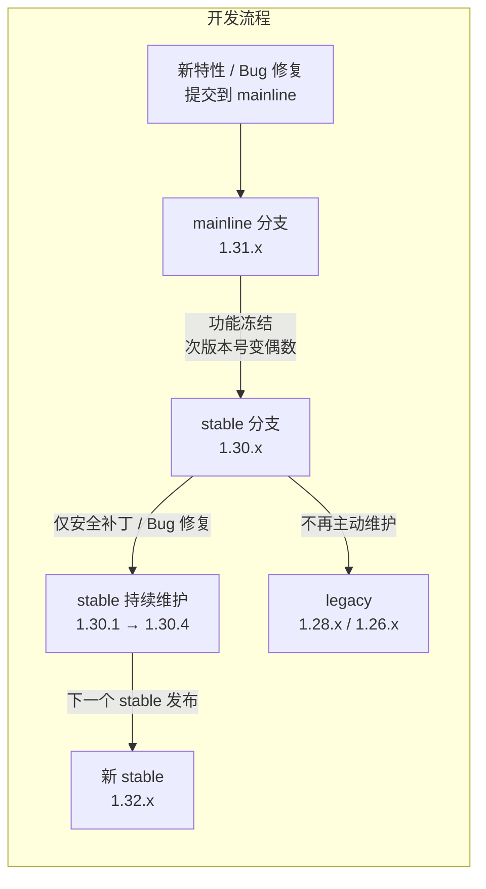
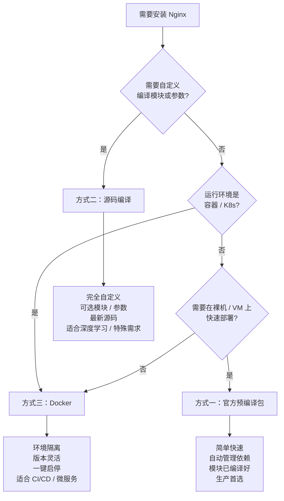

# 02 - 安装部署与目录结构

> 版本基线：Nginx 1.30.4 (stable) | 创建日期：2026-08-05
> 受众：后端开发熟手（熟悉 Python/Java/Lua），但服务器运维是小白。Linux 命令会逐行解释用途。

---

## 学习目标

学完本篇，你应当能够：

1. 说清楚 Nginx 的 mainline / stable / legacy 三种版本分支的区别，并做出正确的版本选择
2. 独立完成 Nginx 的三种安装方式：官方预编译包（apt/yum）、源码编译、Docker 容器化
3. 理解安装后的目录结构，知道每个目录和关键文件的作用
4. 熟练使用 `nginx -t`、`nginx -T`、`nginx -V`、`nginx -s` 等常用命令
5. 通过 systemd 管理 Nginx 服务（启动/停止/重载/开机自启）

这是后续所有配置实验的前置条件——只有把 Nginx 装好、跑起来，后面的配置文件编写、反向代理、负载均衡才有意义。

---

## 核心知识点

### 知识点一：版本选择

Nginx 官方同时维护两条活跃的版本分支，外加已停止主动开发的旧分支（legacy）。理解版本号的含义是选型的第一步。

#### 1.1 版本号规则

Nginx 的版本号格式为 `主版本.次版本.修订号`，例如 `1.30.4`。**次版本号的奇偶性决定了分支类型**：

| 分支类型 | 次版本号 | 含义 | 当前版本（2026-08） |
|----------|----------|------|---------------------|
| **mainline**（主线） | 奇数 | 活跃开发分支，新特性最先进入，可能存在未充分测试的改动 | **1.31.3** |
| **stable**（稳定） | 偶数 | 从某个 mainline 版本冻结而来，只接收 Bug 修复和安全补丁，不加新功能 | **1.30.4** |
| **legacy**（遗留） | 之前的偶数 | 旧稳定分支，仅在严重安全问题时发补丁，推荐迁移到当前 stable | 1.28.x、1.26.x 等 |

> **类比理解**：如果你熟悉 Python，mainline 相当于 Python 的 pre-release/dev 分支，stable 相当于正式 release。如果你熟悉 Java，mainline 类似 JDK 的 early-access 构建，stable 类似 LTS GA 版本。

#### 1.2 mainline vs stable 的核心区别



- **mainline** 不等于"不稳定"。它是官方推荐的默认下载版本（nginx.org 首页默认提供 mainline），经过了基本测试，但会频繁引入新特性，API/指令可能变动。
- **stable** 是从 mainline 冻结的快照，生命周期内只做修复，行为可预测。生产环境应优先选 stable。
- **legacy** 是上一代甚至更早的 stable。只有在你的系统因为某种原因无法升级到当前 stable 时才会用到。

#### 1.3 如何选择版本

| 场景 | 推荐分支 | 理由 |
|------|----------|------|
| 生产环境 | **stable (1.30.4)** | 行为可预测，只修 Bug 不加特性，降低意外风险 |
| 学习 / 实验 | stable 或 mainline 均可 | 建议用 stable，与生产一致 |
| 需要最新特性（如 HTTP/3 新参数） | **mainline (1.31.3)** | 新特性先进入 mainline，等下一个 stable 才会冻结 |
| 老系统无法升级 | legacy (上一代 stable) | 仅过渡，应计划迁移 |

> **特例说明**：某些第三方模块（如 `lua-nginx-module`、`headers-more-nginx-module`）可能对 Nginx 版本有兼容性要求。如果你要用 OpenResty，应跟随 OpenResty 内置的 Nginx 版本，而不是自行选择。

---

### 知识点二：安装方式

Nginx 有三种主流安装方式。下面的 Mermaid 图直观展示了如何根据场景选择：



#### 方式一：官方预编译包安装（apt / yum）

这是**生产环境的首选方式**。nginx.org 提供了官方维护的预编译二进制包，覆盖 Debian/Ubuntu 和 RHEL 系列发行版。优点是安装简单、依赖自动处理、模块已编译好、安全更新及时。

> **为什么不用发行版自带的 nginx 包？**
> Debian/Ubuntu 自带仓库的 Nginx 版本通常落后官方 1-2 个大版本，且模块较少。使用 nginx.org 官方源可以拿到最新 stable 版本，且包含了 HTTP/2、HTTP/3、stream 等模块。**注意：nginx.org 官方包的运行用户是 `nginx`，而 Debian/Ubuntu 自带包的运行用户是 `www-data`，两者不要混装。**

##### 1. Debian / Ubuntu（apt 方式）

```bash
# ===== 第 1 步：安装前置依赖 =====
# curl              → 命令行 HTTP 工具，用于下载 GPG 密钥
# gnupg2            → GPG 验证工具，用于验证软件包签名
# ca-certificates   → 根证书库，让 curl 能验证 HTTPS 连接
# lsb-release       → 获取发行版信息（如 Debian 12 → bookworm，Ubuntu 22.04 → jammy）
# debian-archive-keyring → Debian 官方仓库密钥（仅 Debian 需要，Ubuntu 可省略）
sudo apt install -y curl gnupg2 ca-certificates lsb-release debian-archive-keyring

# ===== 第 2 步：导入 Nginx 官方 GPG 签名密钥 =====
# nginx_signing.key 是 Nginx 官方的 GPG 公钥
# gpg --dearmor 将 ASCII 格式的公钥转换为二进制格式（.gpg）
# tee 将结果写入 keyring 目录，供 apt 验证包来源真实性
curl https://nginx.org/keys/nginx_signing.key | gpg --dearmor \
    | sudo tee /usr/share/keyrings/nginx-archive-keyring.gpg >/dev/null

# ===== 第 3 步：添加 Nginx 官方 stable 仓库源 =====
# deb [signed-by=...] → 声明这是一个 apt 源，并用指定密钥验证
# http://nginx.org/packages/ → stable 分支的包仓库地址
#   （如果要用 mainline，把路径改为 http://nginx.org/packages/mainline/）
# $(lsb_release -is | tr '[:upper:]' '[:lower:]') → 发行版名称小写（如 debian / ubuntu）
# $(lsb_release -cs) → 发行版代号（如 bookworm / jammy）
echo "deb [signed-by=/usr/share/keyrings/nginx-archive-keyring.gpg] \
http://nginx.org/packages/$(lsb_release -is | tr '[:upper:]' '[:lower:]') \
$(lsb_release -cs) nginx" \
    | sudo tee /etc/apt/sources.list.d/nginx.list

# ===== 第 4 步：设置仓库优先级 =====
# 防止系统从发行版自带源安装旧版 nginx，确保始终使用 nginx.org 官方包
# Pin-Priority 900 > 默认优先级 500，确保官方源优先级最高
echo -e "Package: *\nPin: origin nginx.org\nPin: release o=nginx\nPin-Priority: 900" \
    | sudo tee /etc/apt/preferences.d/99nginx

# ===== 第 5 步：更新包索引并安装 =====
# apt update → 刷新所有源的包列表（包括刚添加的 nginx 源）
# apt install nginx → 安装 Nginx（会自动解决依赖）
sudo apt update && sudo apt install -y nginx

# ===== 第 6 步：验证安装 =====
nginx -v
# 预期输出：nginx version: nginx/1.30.4
```

> **特例说明（mainline 源）**：如果想安装 mainline 1.31.3，只需在第 3 步将 URL 中的 `http://nginx.org/packages/` 改为 `http://nginx.org/packages/mainline/`，其余步骤完全相同。

##### 2. RHEL / CentOS / AlmaLinux / Rocky Linux（yum / dnf 方式）

```bash
# ===== 第 1 步：安装 yum-utils =====
# yum-utils 提供 yum-config-manager 等工具（虽然这里直接写 repo 文件更直观）
sudo dnf install -y yum-utils

# ===== 第 2 步：创建 Nginx 官方 stable 仓库配置文件 =====
# tee <<'EOF' → 将多行内容写入文件（'EOF' 防止变量被 shell 展开）
# baseurl 中的 $releasever 是 RHEL 主版本号（如 9），$basearch 是 CPU 架构（如 x86_64）
#   如果要用 mainline，把 baseurl 中的 centos 改为 mainline/centos
# gpgcheck=1 → 验证包签名
# module_hotfixes=true → 允许仓库覆盖 AppStream 模块中的包（RHEL 8+ 需要）
sudo tee /etc/yum.repos.d/nginx.repo <<'EOF'
[nginx-stable]
name=nginx stable repo
baseurl=http://nginx.org/packages/centos/$releasever/$basearch/
gpgcheck=1
enabled=1
gpgkey=https://nginx.org/keys/nginx_signing.key
module_hotfixes=true
EOF

# ===== 第 3 步：安装 Nginx =====
sudo dnf install -y nginx

# ===== 第 4 步：验证安装 =====
nginx -v
# 预期输出：nginx version: nginx/1.30.4
```

> **特例说明（RHEL 8/9 模块冲突）**：RHEL 8+ 引入了 AppStream 模块化机制，系统可能自带 `nginx` 模块。上面的 `module_hotfixes=true` 就是为了让官方源覆盖模块版本。如果安装时遇到模块冲突报错，可先禁用系统模块：`sudo dnf module disable nginx`，再安装官方包。

##### 3. 安装后的验证

```bash
# 查看 Nginx 版本
nginx -v
# 输出: nginx version: nginx/1.30.4

# 查看编译参数和已加载模块（大写 V）
nginx -V
# 输出示例（截取）:
# nginx version: nginx/1.30.4
# built by gcc 12.2.0 (Debian 12.2.0-14)
# built with OpenSSL 3.0.8 7 Feb 2023
# TLS SNI support enabled
# configure arguments: --prefix=/etc/nginx --sbin-path=/usr/sbin/nginx
#   --modules-path=/usr/lib/nginx/modules --conf-path=/etc/nginx/nginx.conf
#   --error-log-path=/var/log/nginx/error.log --http-log-path=/var/log/nginx/access.log
#   --pid-path=/run/nginx.pid --lock-path=/run/lock/subsys/nginx.lock
#   --with-http_ssl_module --with-http_v2_module --with-http_v3_module
#   --with-http_realip_module --with-http_stub_status_module --with-http_gzip_static_module
#   --with-stream --with-stream_ssl_module --with-pcre-jit --with-threads ...
```

可以看到，官方预编译包已经包含了 SSL、HTTP/2、HTTP/3、stream 等常用模块，**绝大多数场景不需要自行编译**。

#### 方式二：源码编译安装

源码编译给你最大的自由度：可以选择编译哪些模块、指定安装路径、开启/关闭特定特性。适合需要第三方模块（如 Lua 模块）、极致性能优化或学习研究的场景。

##### 1. 安装编译依赖

```bash
# ===== Debian / Ubuntu =====
# build-essential  → gcc 编译器 + make 构建工具 + C 标准库头文件
# libpcre2-dev     → PCRE2 正则库开发文件（rewrite 模块、正则 location 需要）
# zlib1g-dev       → zlib 压缩库开发文件（gzip 模块需要）
# libssl-dev       → OpenSSL 开发文件（HTTPS / HTTP/2 / HTTP/3 需要）
sudo apt install -y build-essential libpcre2-dev zlib1g-dev libssl-dev

# ===== RHEL / CentOS / AlmaLinux =====
# gcc make          → 编译器和构建工具
# pcre2-devel       → PCRE2 开发文件
# zlib-devel        → zlib 开发文件
# openssl-devel     → OpenSSL 开发文件
sudo dnf install -y gcc make pcre2-devel zlib-devel openssl-devel
```

> **版本说明**：Nginx 1.21.5 起默认使用 PCRE2（替代旧版 PCRE）。如果你的系统只有 PCRE（非 PCRE2），需要额外安装 `libpcre3-dev`（Debian）或 `pcre-devel`（RHEL），或在 configure 时用 `--with-pcre` 指定 PCRE 源码路径。

##### 2. 下载并解压源码

```bash
# 下载 stable 1.30.4 源码包
# wget → 命令行下载工具；-O 指定输出文件名
wget https://nginx.org/download/nginx-1.30.4.tar.gz

# 解压
# tar -xzf → x 解压、z 处理 gzip、f 指定文件
tar -xzf nginx-1.30.4.tar.gz

# 进入源码目录
cd nginx-1.30.4
```

##### 3. configure 配置

`./configure` 是一个 Shell 脚本，它会检查系统环境（编译器、依赖库是否就绪），生成 Makefile，并决定编译哪些模块、安装到哪里。

```bash
./configure \
    --prefix=/usr/local/nginx \
    --sbin-path=/usr/local/nginx/sbin/nginx \
    --conf-path=/usr/local/nginx/conf/nginx.conf \
    --error-log-path=/usr/local/nginx/logs/error.log \
    --http-log-path=/usr/local/nginx/logs/access.log \
    --pid-path=/usr/local/nginx/logs/nginx.pid \
    --lock-path=/usr/local/nginx/logs/nginx.lock \
    --user=nginx \
    --group=nginx \
    --with-http_ssl_module \
    --with-http_v2_module \
    --with-http_v3_module \
    --with-http_realip_module \
    --with-http_stub_status_module \
    --with-http_gzip_static_module \
    --with-http_sub_module \
    --with-stream \
    --with-stream_ssl_module \
    --with-pcre-jit \
    --with-threads \
    --with-compat
```

**逐参数说明**：

| 参数 | 作用 | 说明 |
|------|------|------|
| `--prefix=PATH` | 安装根目录 | 默认 `/usr/local/nginx`，所有文件都安装到此目录下 |
| `--sbin-path=PATH` | 可执行文件路径 | 默认 `<prefix>/sbin/nginx` |
| `--conf-path=PATH` | 主配置文件路径 | 默认 `<prefix>/conf/nginx.conf` |
| `--error-log-path=PATH` | 错误日志路径 | 默认 `<prefix>/logs/error.log` |
| `--http-log-path=PATH` | 访问日志路径 | 默认 `<prefix>/logs/access.log` |
| `--pid-path=PATH` | PID 文件路径 | master 进程的进程号写入此文件 |
| `--lock-path=PATH` | 锁文件路径 | 防止多个实例同时启动 |
| `--user=USER` | worker 进程运行用户 | 生产环境应使用非特权用户 |
| `--group=GROUP` | worker 进程运行用户组 | 与 --user 配套 |
| `--with-http_ssl_module` | 编译 HTTPS 模块 | **需要 OpenSSL 开发库**。不加则不支持 `listen 443 ssl` |
| `--with-http_v2_module` | 编译 HTTP/2 模块 | 需要 SSL 模块。HTTP/2 要求 TLS（h2 over TLS） |
| `--with-http_v3_module` | 编译 HTTP/3 (QUIC) 模块 | **特例：需要 QUIC-capable SSL 库，见下方说明** |
| `--with-http_realip_module` | 编译 realip 模块 | 从 `X-Forwarded-For` 提取客户端真实 IP（反向代理场景必备） |
| `--with-http_stub_status_module` | 编译状态监控模块 | 提供 `/nginx_status` 端点查看基本连接信息 |
| `--with-http_gzip_static_module` | 编译 gzip 静态模块 | 当请求的文件有 `.gz` 预压缩版本时直接返回，省去实时压缩 |
| `--with-http_sub_module` | 编译响应替换模块 | 在响应体中做字符串替换（如注入统计脚本） |
| `--with-stream` | 编译 TCP/UDP 代理模块 | 四层代理（数据库负载均衡、MySQL 代理等）。不加则只支持 HTTP |
| `--with-stream_ssl_module` | 编译 stream SSL 模块 | stream 代理的 TLS 支持 |
| `--with-pcre-jit` | 启用 PCRE2 JIT | 正则匹配加速，提升 rewrite/location 正则性能 |
| `--with-threads` | 启用线程池支持 | 配合 `aio` 指令实现异步文件 IO，大文件传输场景有用 |
| `--with-compat` | 编译二进制兼容模式 | 允许后续加载独立编译的动态模块（`.so`），不加则动态模块可能不兼容 |

> **特例说明：`--with-http_v3_module` 的 QUIC 依赖**
>
> HTTP/3 基于 QUIC 协议（UDP 上的加密传输），需要 SSL 库提供 QUIC API。**标准的 OpenSSL 3.x 目前不提供 Nginx 所需的 QUIC 接口**，必须使用以下之一：
>
> | SSL 库 | 说明 |
> |--------|------|
> | **BoringSSL** | Google 维护的 OpenSSL 分支，QUIC 支持最完善，Nginx 官方推荐 |
> | **quictls** | 社区维护的 OpenSSL 分支，在 OpenSSL 3.x 基础上回移了 QUIC 支持 |
> | **LibreSSL** | OpenBSD 维护的 OpenSSL 分支，较新版本支持 QUIC |
>
> 编译步骤示例（以 BoringSSL 为例）：
> ```bash
> # 1. 克隆并编译 BoringSSL
> git clone https://boringssl.googlesource.com/boringssl
> cd boringssl && mkdir build && cd build
> cmake .. && make -j$(nproc)
> cd ../..
>
> # 2. 编译 Nginx 时指向 BoringSSL
> ./configure \
>     --with-http_v3_module \
>     --with-openssl=../boringssl \
>     ...其他参数...
> ```
>
> 如果你不需要 HTTP/3，去掉 `--with-http_v3_module` 即可使用系统标准 OpenSSL，省去编译 BoringSSL 的麻烦。**官方预编译包已内置 HTTP/3 支持，无需自行编译。**

##### 4. make 编译 + make install 安装

```bash
# make → 根据 configure 生成的 Makefile 编译源码
# -j$(nproc) → 并行编译，$(nproc) 返回 CPU 核心数，加速编译
make -j$(nproc)

# make install → 将编译产物复制到 --prefix 指定的目录
# 需要 sudo 因为默认安装到 /usr/local/ 下
sudo make install
```

##### 5. 创建运行用户并启动

```bash
# 创建 nginx 用户和用户组（--system 创建系统用户，无登录权限）
# worker 进程以此用户身份运行，降低安全风险
sudo useradd --system --no-create-home --shell /sbin/nologin nginx

# 启动 Nginx（源码编译没有 systemd 服务文件，需手动启动）
sudo /usr/local/nginx/sbin/nginx

# 验证
curl -I http://localhost
# 预期输出: HTTP/1.1 200 OK
```

> **特例说明（源码编译的 systemd 集成）**：源码编译不会自动生成 systemd 服务文件。如果希望用 `systemctl` 管理源码编译的 Nginx，需要手动创建 service 文件（见知识点五的说明）。

#### 方式三：Docker 安装

Docker 方式适合容器化部署、CI/CD 流水线、微服务架构。优点是环境隔离、版本可控、配置即代码。

##### 1. docker run 方式

```bash
docker run -d \
  --name nginx \
  -p 80:80 \
  -p 443:443 \
  -v /etc/nginx/nginx.conf:/etc/nginx/nginx.conf:ro \
  -v /etc/nginx/conf.d:/etc/nginx/conf.d:ro \
  -v /var/log/nginx:/var/log/nginx \
  -v /usr/share/nginx/html:/usr/share/nginx/html:ro \
  -v /etc/nginx/ssl:/etc/nginx/ssl:ro \
  --restart unless-stopped \
  nginx:1.30.4

# 参数逐行说明：
# -d                          → 后台运行（detached 模式）
# --name nginx                → 容器命名为 nginx（方便后续管理）
# -p 80:80                    → 端口映射：宿主机 80 → 容器 80（HTTP）
# -p 443:443                  → 端口映射：宿主机 443 → 容器 443（HTTPS）
# -v .../nginx.conf:...:ro    → 挂载主配置文件（:ro 表示只读，防止容器内意外修改）
# -v .../conf.d:...:ro        → 挂载子配置目录（server 块通常放在这里）
# -v .../nginx:/var/log/nginx → 挂载日志目录（可写，日志输出到宿主机）
# -v .../html:...:ro          → 挂载静态网站根目录
# -v .../ssl:...:ro           → 挂载 TLS 证书目录
# --restart unless-stopped    → 容器退出时自动重启（除非手动 stop）
# nginx:1.30.4                → 使用官方 stable 镜像
```

> **特例说明**：HTTP/3 使用 UDP 443 端口。如果需要 HTTP/3，需额外映射 UDP 端口：`-p 443:443/udp`。

##### 2. docker-compose 方式（推荐）

将配置写成文件，便于版本管理和团队协作：

```yaml
# docker-compose.yml
# 使用方法：在此文件所在目录执行 docker compose up -d
version: '3.8'

services:
  nginx:
    image: nginx:1.30.4          # 官方 stable 镜像
    container_name: nginx        # 容器名称
    ports:
      - "80:80"                  # HTTP 端口
      - "443:443"                # HTTPS 端口
      # - "443:443/udp"          # HTTP/3 (QUIC) 端口，按需开启
    volumes:
      # 配置文件（只读挂载，防止容器内篡改）
      - ./nginx.conf:/etc/nginx/nginx.conf:ro
      - ./conf.d:/etc/nginx/conf.d:ro
      # 日志（可写，输出到宿主机便于查看）
      - ./logs:/var/log/nginx
      # 静态资源
      - ./html:/usr/share/nginx/html:ro
      # TLS 证书
      - ./ssl:/etc/nginx/ssl:ro
    restart: unless-stopped      # 异常退出自动重启
    # 网络模式：默认 bridge 即可
    # 如果需要最高网络性能且不介意端口冲突，可用 host 模式
    # network_mode: host
```

```bash
# 启动
docker compose up -d

# 查看状态
docker compose ps

# 查看日志
docker compose logs -f nginx

# 停止并删除容器
docker compose down

# 重载配置（修改配置文件后）
docker exec nginx nginx -s reload
```

#### 三种安装方式对比

| 对比维度 | 官方预编译包（apt/yum） | 源码编译 | Docker |
|----------|------------------------|----------|--------|
| **安装难度** | 低（几条命令） | 高（需处理依赖和编译参数） | 低（一条命令） |
| **模块灵活性** | 固定（官方预设） | 完全自定义 | 固定（镜像预设） |
| **版本控制** | 跟随官方源更新 | 完全自主 | 镜像标签精确控制 |
| **升级方式** | `apt upgrade nginx` | 重新下载、编译、安装 | 更换镜像标签 |
| **systemd 集成** | 原生支持 | 需手动创建 service 文件 | 由 Docker 管理 |
| **性能** | 最优（官方优化编译） | 可针对 CPU 优化 | 有微小虚拟化开销 |
| **适用场景** | 生产裸机/VM 首选 | 需第三方模块 / 极致优化 / 学习 | 容器化 / CI/CD / 微服务 |
| **环境隔离** | 无（直接装在宿主机） | 无 | 完全隔离 |

> **选择建议**：
> - **生产裸机/VM**：官方预编译包（简单、可靠、有安全更新通道）
> - **K8s/容器化环境**：Docker 镜像
> - **需要 Lua/第三方模块**：源码编译或直接用 OpenResty
> - **学习研究**：Docker（环境干净，随时销毁重建）

---

### 知识点三：目录结构

安装方式不同，目录结构也有差异。下面分别说明官方预编译包和源码编译的目录结构。

#### 3.1 官方预编译包的目录结构

```mermaid
flowchart TD
    ROOT["/ (系统根目录)"]
    ROOT --> ETC["/etc/nginx/ — 配置文件目录"]
    ETC --> CONF["nginx.conf — 主配置文件（核心）"]
    ETC --> CONFD["conf.d/ — 用户自定义 server 配置"]
    CONFD --> DEFAULT["default.conf — 默认站点配置"]
    ETC --> MIME["mime.types — MIME 类型映射表"]
    ETC --> FCGI["fastcgi_params — FastCGI 参数模板"]
    ETC --> UWSGI["uwsgi_params — uWSGI 参数模板"]
    ETC --> SCGI["scgi_params — SCGI 参数模板"]
    ETC --> SNIPPET["snippets/ — 可复用配置片段"]
    ETC --> MODS["modules/ — 动态模块 .so 文件"]

    ROOT --> LOG["/var/log/nginx/ — 日志目录"]
    LOG --> ACCESS["access.log — 访问日志"]
    LOG --> ERROR["error.log — 错误日志"]

    ROOT --> CACHE["/var/cache/nginx/ — 缓存/临时文件"]
    CACHE --> CT["client_temp/ — 客户端请求体缓冲"]
    CACHE --> PT["proxy_temp/ — 代理响应缓冲"]
    CACHE --> FT["fastcgi_temp/ — FastCGI 响应缓冲"]
    CACHE --> UT["uwsgi_temp/ — uWSGI 响应缓冲"]
    CACHE --> ST["scgi_temp/ — SCGI 响应缓冲"]

    ROOT --> HTML["/usr/share/nginx/html/ — 默认网站根目录"]
    HTML --> INDEX["index.html — 默认欢迎页"]
    HTML --> ERR50X["50x.html — 错误页面"]

    ROOT --> SBIN["/usr/sbin/nginx — 可执行文件"]
    ROOT --> PID["/run/nginx.pid — PID 文件（运行时生成）"]
```



**各目录和文件详细说明**：

| 路径 | 类型 | 作用 |
|------|------|------|
| `/etc/nginx/nginx.conf` | 主配置 | Nginx 的"入口配置文件"，定义全局参数（worker 进程数、连接数等），并通过 `include` 指令引入其他配置文件 |
| `/etc/nginx/conf.d/` | 配置目录 | 存放各站点/应用的 server 块配置（如 `default.conf`、`api.conf`），被 `nginx.conf` 中的 `include /etc/nginx/conf.d/*.conf;` 引入 |
| `/etc/nginx/mime.types` | 映射表 | 文件扩展名到 MIME 类型的映射（如 `.html → text/html`），被 `nginx.conf` 中的 `include mime.types;` 引入 |
| `/etc/nginx/fastcgi_params` | 参数模板 | 传递给 FastCGI 后端（如 PHP-FPM）的标准参数。类似地有 `uwsgi_params`（Python uWSGI）、`scgi_params` |
| `/etc/nginx/snippets/` | 配置片段 | 存放可复用的配置片段（如 SSL 参数、代理头设置），通过 `include` 在多处引用，避免重复 |
| `/etc/nginx/modules/` | 动态模块 | 存放动态加载的模块文件（`.so`），通过 `load_module` 指令加载 |
| `/var/log/nginx/access.log` | 访问日志 | 记录每个 HTTP 请求的访问信息（IP、时间、路径、状态码等） |
| `/var/log/nginx/error.log` | 错误日志 | 记录 Nginx 运行时的错误和警告（排查问题的第一站） |
| `/var/cache/nginx/` | 缓存目录 | 存放代理缓存、临时文件。各子目录对应不同协议的临时缓冲区 |
| `/usr/share/nginx/html/` | 网站根目录 | 默认的静态文件目录，包含欢迎页 `index.html` 和错误页 `50x.html` |
| `/usr/sbin/nginx` | 可执行文件 | Nginx 主程序二进制文件 |
| `/run/nginx.pid` | PID 文件 | 记录 master 进程的 PID，用于进程管理（stop/reload 等命令通过它找到进程） |

#### 3.2 源码编译的目录结构

如果用默认 `--prefix=/usr/local/nginx` 编译，所有文件都集中在该目录下：

```
/usr/local/nginx/                ← 安装根目录（--prefix）
├── sbin/
│   └── nginx                    ← 可执行文件（--sbin-path）
├── conf/                        ← 配置文件目录（--conf-path 所在目录）
│   ├── nginx.conf               ← 主配置文件
│   ├── mime.types               ← MIME 类型映射
│   ├── fastcgi_params           ← FastCGI 参数
│   ├── fastcgi.conf             ← FastCGI 配置
│   ├── uwsgi_params             ← uWSGI 参数
│   ├── scgi_params              ← SCGI 参数
│   ├── koi-utf                  ← 字符集映射（俄语）
│   ├── koi-win                  ← 字符集映射（Windows）
│   ├── win-utf                  ← 字符集映射
│   └── fastcgi.conf.default     ← 默认配置备份（.default 后缀）
├── logs/                        ← 日志目录
│   ├── access.log               ← 访问日志（--http-log-path）
│   ├── error.log                ← 错误日志（--error-log-path）
│   └── nginx.pid                ← PID 文件（--pid-path）
└── html/                        ← 默认网站根目录
    ├── index.html               ← 欢迎页
    └── 50x.html                 ← 错误页
```

> **与预编译包的关键差异**：
> 1. 源码编译的配置、日志、网站目录都集中在 `--prefix` 下；预编译包则分散在 `/etc`、`/var/log`、`/usr/share` 等标准 Linux 路径
> 2. 源码编译默认没有 `conf.d/` 目录和 `snippets/` 目录，需要自行创建并在 `nginx.conf` 中 `include`
> 3. 源码编译的 `.default` 文件是初始配置的备份，方便回滚

#### 3.3 nginx.conf 主配置文件的位置

| 安装方式 | 主配置文件路径 |
|----------|---------------|
| 官方预编译包（apt/yum） | `/etc/nginx/nginx.conf` |
| 源码编译（默认 prefix） | `/usr/local/nginx/conf/nginx.conf` |
| 源码编译（自定义 --conf-path） | 你在编译时指定的路径 |
| Docker 镜像 | 容器内 `/etc/nginx/nginx.conf`（通常通过 `-v` 挂载宿主机文件） |

无论哪种安装方式，`nginx -t` 命令都会自动找到并测试主配置文件。也可以用 `nginx -c /path/to/nginx.conf` 显式指定。

---

### 知识点四：常用命令

Nginx 可执行文件支持一系列命令行参数，用于测试配置、查看信息、发送信号等。这些是日常运维最常用的工具。

#### 4.1 nginx -t：测试配置语法

```bash
# -t → test，检查配置文件语法是否正确（不实际运行）
# 每次修改配置后都应该先 -t 再 reload，避免配置错误导致服务中断
sudo nginx -t

# 成功输出:
# nginx: the configuration file /etc/nginx/nginx.conf syntax is ok
# nginx: configuration file /etc/nginx/nginx.conf test is successful

# 失败输出（示例：少了一个分号）:
# nginx: [emerg] unexpected "}" in /etc/nginx/conf.d/default.conf:12
# nginx: configuration file /etc/nginx/nginx.conf test failed
```

> **最佳实践**：养成"改完配置先 `-t`"的习惯。配置语法错误是 Nginx 最常见的问题，`-t` 能在上线前拦住 90% 的低级错误。

#### 4.2 nginx -T：打印完整配置

```bash
# -T → 大写 T，打印当前生效的完整配置
# 与 -t 不同，-T 不仅检查语法，还会把主配置文件和所有 include 引入的子配置文件
# 全部展开输出，并在每个文件前标注来源路径
sudo nginx -T

# 输出示例（截取）:
# # configuration file /etc/nginx/nginx.conf:
# user  nginx;
# worker_processes  auto;
# ...
# # configuration file /etc/nginx/conf.d/default.conf:
# server {
#     listen       80;
#     server_name  localhost;
#     ...
# }
```

> **使用场景**：当你不确定某个指令最终生效的值是什么（可能被多层 include 覆盖），或者需要对比两台服务器的配置差异时，`nginx -T` 输出的完整配置是最权威的参考。可以配合 `nginx -T 2>&1 | grep worker_processes` 快速查找特定指令。

#### 4.3 nginx -V：查看编译参数和已加载模块

```bash
# -V → 大写 V，显示 Nginx 版本、编译器信息、编译参数
# （小写 -v 只显示版本号）
sudo nginx -V

# 输出示例:
# nginx version: nginx/1.30.4
# built by gcc 12.2.0 (Debian 12.2.0-14)
# built with OpenSSL 3.0.8 7 Feb 2023
# TLS SNI support enabled
# configure arguments: --prefix=/etc/nginx --sbin-path=/usr/sbin/nginx
#   --modules-path=/usr/lib/nginx/modules --conf-path=/etc/nginx/nginx.conf
#   --with-http_ssl_module --with-http_v2_module --with-http_v3_module
#   --with-http_realip_module --with-http_stub_status_module
#   --with-http_gzip_static_module --with-stream --with-stream_ssl_module
#   --with-pcre-jit --with-threads ...

# 快速检查是否包含某个模块（grep 过滤）
sudo nginx -V 2>&1 | grep --color=auto 'http_v3'
# 如果有输出，说明 HTTP/3 模块已编译
```

> **使用场景**：
> - 确认当前安装是否包含某个模块（如 stream、http_v3）
> - 排查"为什么某个指令不识别"——可能是因为对应模块未编译
> - 源码编译升级时，用 `nginx -V` 查看上次的编译参数，确保新版本编译参数一致

> **注意**：`nginx -V` 的输出可能很长，且部分输出走的是 stderr。需要用 `2>&1` 将 stderr 重定向到 stdout 才能 grep。

#### 4.4 nginx -s signal：发送控制信号

```bash
# -s → signal，向 master 进程发送控制信号
# 支持 4 种信号：

# 1. stop —— 快速停止
# 发送 SIGTERM 信号，master 立即退出，不管是否有正在处理的请求
sudo nginx -s stop

# 2. quit —— 优雅停止
# 发送 SIGQUIT 信号，master 停止接受新请求，等所有 worker 处理完当前请求后退出
# 生产环境停止服务时应优先用 quit 而非 stop
sudo nginx -s quit

# 3. reload —— 重新加载配置
# 发送 SIGHUP 信号，master 重新读取配置文件，启动新 worker，旧 worker 处理完请求后退出
# 这就是"平滑重载"——不中断现有连接，新连接使用新配置
sudo nginx -s reload

# 4. reopen —— 重新打开日志文件
# 发送 SIGUSR1 信号，重新打开日志文件（用于日志切割）
# 典型场景：日志文件被 mv 重命名后，执行 reopen 让 Nginx 写入新文件
sudo nginx -s reopen
```

**日志切割示例**（reopen 的典型用法）：

```bash
# 日志切割脚本（配合 cron 定时执行）
# 1. 重命名当前日志文件（mv 后 Nginx 仍持有旧文件句柄，写入的是旧文件）
mv /var/log/nginx/access.log /var/log/nginx/access.$(date +%Y%m%d).log

# 2. 发送 reopen 信号，Nginx 重新打开 access.log（新文件）
sudo nginx -s reopen

# 3. 压缩旧日志（可选）
gzip /var/log/nginx/access.$(date +%Y%m%d).log
```

#### 4.5 nginx -c /path/to/conf：指定配置文件

```bash
# -c → 指定配置文件路径（默认使用编译时 --conf-path 指定的路径）
# 用于测试不同配置或在同一台机器上运行多个 Nginx 实例
sudo nginx -c /etc/nginx/nginx.conf          # 使用默认配置
sudo nginx -c /tmp/test-nginx.conf            # 使用自定义配置（如测试用）

# 常见组合：指定配置 + 测试语法
sudo nginx -t -c /tmp/test-nginx.conf

# 常见组合：指定配置 + 启动
sudo nginx -c /tmp/test-nginx.conf
```

> **多实例场景**：同一台机器运行多个 Nginx 实例时，每个实例需要不同的 `--prefix`（或 `-p`）、`-c` 配置文件、`-g "pid /path/to/nginx.pid;"` 指定不同的 PID 文件和端口，否则会冲突。

#### 4.6 其他常用参数

```bash
# -p PREFIX → 指定安装前缀路径（覆盖编译时的 --prefix）
# 用于运行时指定不同的工作目录
sudo nginx -p /usr/local/nginx/

# -g DIRECTIVE → 设置全局指令（覆盖配置文件中的值）
# 示例：临时用 2 个 worker 启动，不改配置文件
sudo nginx -g "worker_processes 2;"

# -q → quiet，测试配置时抑制非错误输出
sudo nginx -t -q

# -? / -h → 帮助
nginx -h
```

#### 命令速查表

| 命令 | 作用 | 日常使用频率 |
|------|------|-------------|
| `nginx -t` | 测试配置语法 | 极高（每次改配置后必用） |
| `nginx -T` | 打印完整生效配置 | 中（排查配置问题时） |
| `nginx -V` | 查看版本和编译参数 | 中（确认模块 / 升级时） |
| `nginx -s reload` | 平滑重载配置 | 极高（上线配置变更） |
| `nginx -s stop` | 快速停止 | 低（紧急情况） |
| `nginx -s quit` | 优雅停止 | 中（计划停机） |
| `nginx -s reopen` | 重新打开日志 | 中（日志切割） |
| `nginx -c PATH` | 指定配置文件 | 低（多实例 / 测试） |
| `nginx -g "DIRECTIVE"` | 设置全局指令 | 低（临时调试） |

---

### 知识点五：systemd 服务管理

在现代 Linux 发行版（Debian 8+、CentOS 7+）中，系统服务由 **systemd** 统一管理。官方预编译包安装时会自动注册 systemd 服务，可以用 `systemctl` 命令管理。

> **什么是 systemd？** 你可以把它理解为一个"系统服务管家"。它负责在开机时启动各种后台服务（如 Nginx、MySQL、SSH），在服务崩溃时自动重启，并提供统一的 `systemctl` 命令来控制它们。类比 Python 的 `supervisor` 或 Java 的 `spring-boot-starter-actuator`，但 systemd 是操作系统级的。

#### 5.1 基础服务管理命令

```bash
# 启动 Nginx 服务
# systemctl start → 启动一个 systemd 管理的服务
sudo systemctl start nginx

# 停止 Nginx 服务
# systemctl stop → 停止服务（等价于 nginx -s quit 的优雅停止）
sudo systemctl stop nginx

# 重启 Nginx 服务
# systemctl restart → 完全重启（先 stop 再 start，会短暂中断所有连接）
# 注意：restart 不是 reload！restart 会断开现有连接，reload 不会
sudo systemctl restart nginx

# 平滑重载配置
# systemctl reload → 发送 reload 信号，等价于 nginx -s reload
# 修改配置后用这个，不会中断现有连接
sudo systemctl reload nginx

# 查看 Nginx 服务状态
# systemctl status → 显示服务运行状态、PID、最近日志
sudo systemctl status nginx

# 状态输出示例:
# ● nginx.service - nginx - high performance web server
#      Loaded: loaded (/lib/systemd/system/nginx.service; enabled)
#      Active: active (running) since Tue 2026-08-05 10:00:00 CST; 2h ago
#        Docs: https://nginx.org/en/docs/
#    Main PID: 1234 (nginx)
#       Tasks: 3 (limit: 4915)
#      Memory: 5.2M
#         CPU: 100ms
#      CGroup: /system.slice/nginx.service
#              ├─1234 nginx: master process /usr/sbin/nginx -g daemon on; master_process on;
#              └─1235 nginx: worker process
```

> **status 输出解读**：
> - `Loaded: ...enabled` → 服务已注册且设置了开机自启
> - `Active: active (running)` → 服务正在运行
> - `Main PID: 1234` → master 进程 PID
> - `CGroup` 下的进程树 → master + worker 进程

#### 5.2 开机自启管理

```bash
# 设置开机自启
# systemctl enable → 将服务注册为开机自动启动
# 原理：在 systemd 的 target 目录（如 multi-user.target.wants）创建符号链接
sudo systemctl enable nginx
# 输出: Created symlink /etc/systemd/system/multi-user.target.wants/nginx.service → /lib/systemd/system/nginx.service.

# 取消开机自启
# systemctl disable → 移除开机自启链接（不影响当前运行状态）
sudo systemctl disable nginx

# 查看是否已设置开机自启
# systemctl is-enabled → 返回 enabled / disabled
sudo systemctl is-enabled nginx
# 输出: enabled

# 检查服务当前是否在运行
sudo systemctl is-active nginx
# 输出: active
```

#### 5.3 systemd 服务文件详解

官方预编译包安装后，systemd 服务文件位于：

| 发行版 | 路径 |
|--------|------|
| Debian/Ubuntu | `/lib/systemd/system/nginx.service` |
| RHEL 系列 | `/usr/lib/systemd/system/nginx.service` |

```ini
# /lib/systemd/system/nginx.service（官方包的内容，简化版）

[Unit]
Description=nginx - high performance web server      # 服务描述
Documentation=https://nginx.org/en/docs/              # 文档链接
After=network-online.target remote-fs.target nss-lookup.target  # 在这些服务之后启动
Wants=network-online.target                           # 依赖网络就绪

[Service]
Type=forking                    # 服务类型：forking 表示主进程会 fork 出后台进程
PIDFile=/run/nginx.pid          # PID 文件路径（与 nginx.conf 中的 pid 指令一致）
ExecStartPre=/usr/sbin/nginx -t -q -g 'daemon on; master_process on;'  # 启动前先测试配置
ExecStart=/usr/sbin/nginx -g 'daemon on; master_process on;'           # 启动命令
ExecReload=/usr/sbin/nginx -s reload                                    # 重载命令
ExecStop=-/sbin/start-stop-daemon --quiet --stop --retry QUIT/5 --pidfile /run/nginx.pid  # 停止命令
TimeoutStopSec=5                # 停止超时时间（秒），超时后强制 kill
KillMode=mixed                  # 终止模式：mixed（SIGTERM 发给主进程，SIGKILL 发给所有进程）
PrivateTmp=true                 # 安全增强：使用私有 /tmp

[Install]
WantedBy=multi-user.target      # 安装到多用户运行级别（即开机自启的 target）
```

> **关键点**：
> - `ExecStartPre` 中的 `nginx -t` 保证了每次启动前都会检查配置语法，配置错误时不会启动
> - `Type=forking` 意味着 Nginx 以 daemon 模式运行（master 进程 fork 后后台运行）
> - `PIDFile` 必须与 `nginx.conf` 中的 `pid` 指令一致，否则 systemd 找不到进程

#### 5.4 源码编译的 systemd 集成

源码编译不会自动生成 service 文件。如果需要用 `systemctl` 管理，手动创建：

```bash
# 创建 systemd 服务文件
# tee <<'EOF' → 将内容写入指定文件
sudo tee /etc/systemd/system/nginx.service <<'EOF'
[Unit]
Description=nginx HTTP Server
After=network.target

[Service]
Type=forking
PIDFile=/usr/local/nginx/logs/nginx.pid
ExecStartPre=/usr/local/nginx/sbin/nginx -t
ExecStart=/usr/local/nginx/sbin/nginx
ExecReload=/usr/local/nginx/sbin/nginx -s reload
ExecStop=/usr/local/nginx/sbin/nginx -s quit
TimeoutStopSec=5
KillMode=mixed

[Install]
WantedBy=multi-user.target
EOF

# 通知 systemd 重新加载服务文件
# daemon-reload → 让 systemd 重新扫描 service 文件
sudo systemctl daemon-reload

# 设置开机自启
sudo systemctl enable nginx

# 启动
sudo systemctl start nginx
```

> **注意**：`PIDFile` 路径必须与 `nginx.conf` 中的 `pid` 指令（或编译时 `--pid-path`）完全一致。源码编译默认 PID 在 `/usr/local/nginx/logs/nginx.pid`，预编译包在 `/run/nginx.pid`。

#### 5.5 命令对照表

| 操作 | systemctl 命令 | 等价的 nginx 命令 |
|------|---------------|-------------------|
| 启动 | `systemctl start nginx` | `nginx` |
| 停止（优雅） | `systemctl stop nginx` | `nginx -s quit` |
| 重载配置 | `systemctl reload nginx` | `nginx -s reload` |
| 重启（断连） | `systemctl restart nginx` | `nginx -s stop && nginx` |
| 查看状态 | `systemctl status nginx` | `ps aux \| grep nginx` |
| 开机自启 | `systemctl enable nginx` | — |
| 取消自启 | `systemctl disable nginx` | — |

> **建议**：生产环境中，日常重载配置用 `systemctl reload nginx`（更规范），紧急排查时直接用 `nginx -t && nginx -s reload`（更快）。两者底层都是发送 SIGHUP 信号，效果相同。

---

## 最佳实践

### 安装阶段

1. **生产环境用官方预编译包**：简单可靠，有安全更新通道，模块齐全。不要在生产环境用源码编译，除非有明确的第三方模块需求。

2. **锁定版本标签**：Docker 环境中用 `nginx:1.30.4` 而非 `nginx:latest`，避免意外升级导致兼容性问题。

3. **不要混装**：nginx.org 官方包和发行版自带包不要同时安装，会导致用户名（`nginx` vs `www-data`）、配置路径冲突。如需切换，先完全卸载旧包：
   ```bash
   # 卸载发行版自带 nginx（Debian/Ubuntu）
   sudo apt purge nginx nginx-common nginx-full
   sudo apt autoremove
   ```

4. **源码编译时记录编译参数**：升级时用 `nginx -V` 查看旧参数，确保新版本编译参数一致。建议把编译参数保存到脚本文件中。

### 配置管理

5. **改配置先 `-t`**：每次修改配置文件后，先 `nginx -t` 验证语法，通过后再 `reload`。这是最重要的一条实践。

6. **配置文件分层管理**：不要把所有配置塞进 `nginx.conf`，利用 `include` 拆分到 `conf.d/` 目录下，每个站点/应用一个文件。

7. **隐藏版本号**：安装后第一时间在 `nginx.conf` 的 `http` 块中设置 `server_tokens off;`，避免暴露具体版本信息。

### 运行阶段

8. **设置文件描述符上限**：高并发场景必须提升 `worker_rlimit_nofile` 和系统 ulimit，否则会报 `too many open files`。

   > 参考踩坑：[#2.6 文件描述符 / sendfile 限制](../99-踩坑记录与解决方案.md#26-文件描述符--sendfile-限制)

9. **日志切割**：配置 logrotate 或用 `nginx -s reopen` 定期切割日志，避免单个日志文件过大。

10. **用 `systemctl reload` 而非 `restart`**：重载配置时用 `reload`（平滑，不断连），只在配置严重错误或升级时才用 `restart`（会断连）。

---

## 常见踩坑（引用）

### 文件描述符 / sendfile 限制

安装后默认的文件描述符上限（通常 1024）在高并发场景下远远不够，会报 `too many open files` 错误。需要在 `nginx.conf` 中设置 `worker_rlimit_nofile`，同时提升系统级 ulimit 限制。此外，`sendfile` 在某些虚拟化环境（如 VirtualBox）中可能有问题，需要关闭。

> 参考踩坑：[#2.6 文件描述符 / sendfile 限制](../99-踩坑记录与解决方案.md#26-文件描述符--sendfile-限制)

---

## 小结

本篇覆盖了 Nginx 从安装到运行的基础知识，核心要点回顾：

| 知识点 | 关键结论 |
|--------|---------|
| **版本选择** | 生产用 stable (1.30.4)，尝鲜用 mainline (1.31.3)，次版本号奇偶区分 |
| **安装方式** | 生产首选官方预编译包（apt/yum），需自定义模块用源码编译，容器环境用 Docker |
| **目录结构** | 预编译包：配置在 `/etc/nginx/`，日志在 `/var/log/nginx/`，站点在 `/usr/share/nginx/html/`；源码编译：全部在 `--prefix` 下 |
| **常用命令** | `nginx -t` 测试配置（最常用），`nginx -T` 查看完整配置，`nginx -V` 查看编译参数，`nginx -s reload` 平滑重载 |
| **systemd** | `systemctl start/stop/reload/status nginx`，`systemctl enable nginx` 设置开机自启 |
| **HTTP/3 编译** | `--with-http_v3_module` 需要 QUIC-capable SSL 库（BoringSSL/quictls），标准 OpenSSL 不支持 |

**下一步**：安装完成并验证运行后，进入 [03-进程模型与控制管理](./03-进程模型与控制管理.md)，理解 Nginx 的 master/worker 进程模型，以及 reload 平滑切换背后的信号机制。
