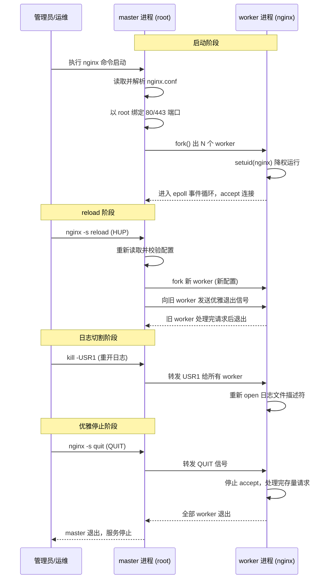
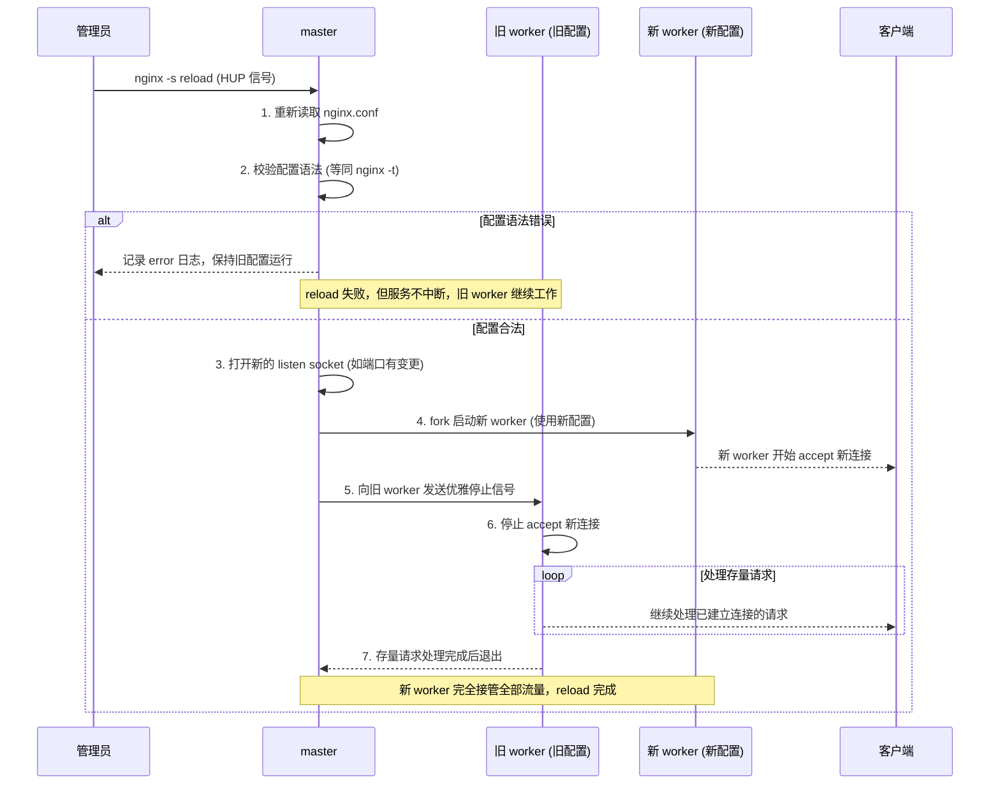
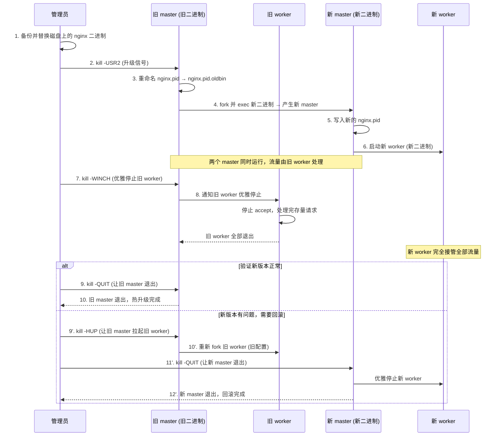

# 03 - 进程模型与控制管理

> 版本基线：Nginx 1.30.4 (stable) | 创建日期：2026-08-05
> 面向人群：后端开发熟手（Python/Java/Lua），但服务器运维是小白。

---

## 学习目标

学完本篇后，你应当能够：

1. 说清 master 进程与 worker 进程各自的职责，以及为什么 Nginx 要采用这种"控制面 / 数据面分离"的模型；
2. 看懂 `ps`/`nginx -s` 命令背后的进程行为，知道 master 以 root 运行、worker 降权运行的安全意义；
3. 掌握 TERM/QUIT/HUP/USR1/USR2/WINCH 六类信号的语义、使用场景，并能用 `nginx -s` 与 `kill` 两种方式发送；
4. 独立完成 `reload` 平滑重载与二进制热升级，理解它们的完整流程与回滚方法；
5. 根据业务类型合理设置 `worker_processes` / `worker_connections` / `worker_cpu_affinity`。

---

## 核心概念：master/worker 模型总览

Nginx 启动后并不是"一个进程包打天下"，而是采用经典的 **master + 多 worker** 进程模型：

- **master 进程**（1 个）：控制面。负责读配置、绑端口、fork worker、收信号、监控 worker 存活。它**不处理任何业务请求**。
- **worker 进程**（N 个）：数据面。真正处理 HTTP/TCP 请求，每个 worker 是单线程、事件驱动（Linux 用 epoll，macOS/BSD 用 kqueue），可同时维持成千上万个连接。
- 可选的 **cache manager / cache loader** 进程：仅当启用了 `proxy_cache_path` 等缓存时才出现，负责缓存键值管理。

这种"一个管理者 + 多个干活的"模型，类比 Python 的 `multiprocessing` 主进程 + 工作进程，或 Java 的主线程负责调度、工作线程处理请求，核心思想一致：**把"管理"和"干活"解耦**。

---

## 核心知识点

### 知识点一：master 进程

#### 1.1 master 进程的职责

master 进程是 Nginx 的"大管家"，承担所有**控制面**工作：

| 职责 | 说明 |
|------|------|
| 读取并解析配置 | 启动时和 reload 时读取 `nginx.conf`，校验语法 |
| 打开监听端口 | 以 root 身份绑定 80/443 等特权端口，fork 后 worker 继承已绑好的 socket |
| 创建/管理 worker | 按 `worker_processes` fork 出 worker；worker 崩溃时自动重启 |
| 接收外部信号 | 接收 `HUP`/`QUIT`/`USR2` 等信号并转发或处理 |
| 维护 pid 文件 | 把自己的 PID 写入 `nginx.pid`，供 `nginx -s` 命令定位 |
| 不处理请求 | master 不读 socket 数据、不跑业务逻辑，崩溃概率极低 |

#### 1.2 master 以 root 运行，worker 降权运行

这是 Nginx 进程模型中最重要的安全设计：

- **master 以 root 运行**：因为绑定 1024 以下端口（80/443）需要 root 权限，读取私钥证书也常需 root。
- **worker 降权运行**：worker 处理来自公网的请求，是最容易被攻击面。master 在 fork worker 后，worker 通过 `setuid()` 切换到 `user` 指令指定的低权限用户（默认 `nobody`）。这样即使 worker 被攻破，攻击者拿到的也只是低权限 shell。

配置示例（`nginx.conf` 顶层 main 上下文）：

```nginx
# main 上下文（不在任何 {} 内）
# 指定 worker 进程运行的用户和组
# 不写时默认 nobody nobody；包安装通常默认 nginx nginx
user nginx nginx;

# master 进程由谁启动就是谁的权限（通常 root）
# worker 进程 fork 后降权为上面的 nginx 用户
worker_processes auto;

# pid 文件位置，master 把自己的 PID 写进去
pid /run/nginx.pid;
```

用 `ps` 验证权限分离（关键看 USER 列）：

```bash
# 查看 nginx 相关进程，关注 USER 与 PPID 列
$ ps -eo user,pid,ppid,cmd | grep nginx | grep -v grep
#   USER    PID   PPID  CMD
#   root   1234      1  nginx: master process /usr/sbin/nginx -c /etc/nginx/nginx.conf
#   nginx  1235   1234  nginx: worker process
#   nginx  1236   1234  nginx: worker process

# 解读：
# - master 的 USER 是 root，PPID 是 1（被 init/systemd 拉起）
# - worker 的 USER 是 nginx，PPID 是 master 的 PID（1234）—— 说明 worker 由 master fork
# - worker 已经从 root 降权为 nginx 用户
```

#### 1.3 为什么需要 master（而不直接开 N 个 worker）

很多人会问：直接启动 N 个 worker 处理请求不就行了，为什么非要一个 master 在上面管着？原因有三：

1. **进程管理与自愈**：worker 崩溃时（例如段错误、第三方模块 bug），master 会自动重新 fork 一个新 worker，并按指数退避避免反复崩溃刷屏。没有 master 的话，一个 worker 挂了就少一份处理能力，没人补救。
2. **优雅重启 / 平滑升级**：master 能在不丢连接的前提下切换配置（reload）甚至切换二进制（热升级）。master 持有监听 socket，新旧 worker 可以无缝交接。如果只有 worker 直接监听，重启必然断连。
3. **权限隔离**：只有 master 是 root，所有 worker 都是低权限。攻击面被限制在 worker 层，符合最小权限原则。

> **特例说明**：在容器（如 Docker 的 non-root 模式）中，若 master 也不是 root，则无法绑定 80/443，需改用 8080 等高端口或通过 `setcap` 给二进制赋能。这是运维小白常踩的点：容器里 `nginx` 启动报 `permission denied` 绑定 80，多半就是非 root 运行。

---

### 知识点二：worker 进程

#### 2.1 worker 处理实际请求

worker 是真正"干活"的进程。每个 worker：

- **单线程 + 事件驱动**：一个 worker 内只有一个主线程，靠 epoll/kqueue 这种 I/O 多路复用同时处理成千上万个连接，没有线程切换开销。
- **相互独立、无共享状态**：worker 之间不共享请求状态，处理请求时无需加锁，因此 Nginx 几乎没有锁竞争（仅在 accept 新连接时有轻量竞争，可由 `accept_mutex`/`reuseport` 缓解）。
- **数量由 `worker_processes` 决定**。

#### 2.2 worker_processes 与 auto

```nginx
# main 上下文
worker_processes auto;   # 自动等于 CPU 逻辑核心数（sysconf(_SC_NPROCESSORS_ONLN)）

# 等价于显式指定，例如 8 核机器：
# worker_processes 8;
```

`auto` 的含义：Nginx 启动时检测系统的 CPU 逻辑核心数，把它作为 worker 数量。这是官方推荐的默认值。

> **特例说明**：
> - 容器内 `auto` 可能取到**宿主机**的核心数（早期未做 cgroup 感知），导致 worker 数过多。新版 Nginx（1.27+）已改善 cgroup 感知，但容器场景建议显式指定 worker 数。
> - CPU 密集型负载（大量 TLS 握手、gzip 压缩）worker 数 = 核心数即可；I/O 密集型（纯反向代理转发静态内容）可略多，但收益递减，一般不超过 `2 × 核心数`。

#### 2.3 worker_connections 决定单个 worker 的最大连接数

```nginx
# events 上下文
events {
    worker_connections 10240;   # 单个 worker 同时可处理的最大连接数（默认 512/1024）
}
```

注意：`worker_connections` 是**每个 worker**的上限，不是全局。全局理论最大连接数 ≈ `worker_processes × worker_connections`。但作为反向代理时，一个客户端请求会占用 2 条连接（客户端→Nginx、Nginx→后端），因此保守估算最大并发客户端数为 `worker_processes × worker_connections / 4`。

> 参考踩坑：[#2.2 worker_connections 与最大连接数计算错误](../99-踩坑记录与解决方案.md#22-worker_connections-与最大连接数计算错误)

#### 2.4 用 ps 命令查看进程示例

```bash
# 1. 查看所有 nginx 进程，显示 PID/PPID/用户/命令
$ ps -ef | grep nginx | grep -v grep
# root      1234     1  0 10:00 ?  00:00:00 nginx: master process /usr/sbin/nginx
# nginx     1235  1234  0 10:00 ?  00:00:00 nginx: worker process
# nginx     1236  1234  0 10:00 ?  00:00:00 nginx: worker process
# nginx     1237  1234  0 10:00 ?  00:00:00 nginx: worker process
# nginx     1238  1234  0 10:00 ?  00:00:00 nginx: worker process

# 解读：
# - 第 1 行 master：UID=root，PPID=1（systemd 拉起）
# - 后 4 行 worker：UID=nginx，PPID=1234（都是 master 的子进程）
# - worker 数量 = worker_processes 的值（这里是 4，说明机器 4 核且用了 auto）

# 2. 只看 master 的 PID（很多命令需要它）
$ cat /run/nginx.pid
# 1234

# 3. 查看每个 worker 占用的 CPU（验证绑核是否生效）
$ ps -eo pid,psr,comm | grep nginx
#  PID  PSR COMM       （PSR = 当前运行在哪个 CPU 核）
# 1235   0 nginx      → 0 号核
# 1236   1 nginx      → 1 号核
# 1237   2 nginx      → 2 号核
# 1238   3 nginx      → 3 号核

# 4. 查看每个 worker 的内存占用
$ ps -o pid,rss,cmd -C nginx
#  RSS = 常驻内存（KB），worker 通常几十 MB
```

---

### 知识点三：信号机制

Nginx 的进程控制几乎全部通过 **UNIX 信号**完成。运维小白只需记住：发信号给 master，master 会自己处理或转发给 worker。

#### 3.1 两种发信号的方式

**方式一：`nginx -s <signal>`（推荐运维小白用）**

```bash
# nginx -s 本质是：读取 nginx.pid 拿到 master PID，再 kill 发信号
nginx -s reload    # 向 master 发送 HUP 信号（重载配置）
nginx -s quit      # 向 master 发送 QUIT 信号（优雅停止）
nginx -s stop      # 向 master 发送 TERM 信号（快速停止）
nginx -s reopen    # 向 master 发送 USR1 信号（重新打开日志）
```

**方式二：`kill -<SIGNAL> <PID>`（更底层，脚本里常用）**

```bash
# 通过 pid 文件拿到 master 的 PID，再直接 kill
kill -HUP  $(cat /run/nginx.pid)    # 等同 nginx -s reload
kill -QUIT $(cat /run/nginx.pid)    # 等同 nginx -s quit
kill -TERM $(cat /run/nginx.pid)    # 等同 nginx -s stop
kill -USR1 $(cat /run/nginx.pid)    # 等同 nginx -s reopen
kill -USR2 $(cat /run/nginx.pid)    # 热升级二进制（nginx -s 不支持，只能 kill）
kill -WINCH $(cat /run/nginx.pid)   # 优雅停止 worker（热升级用，nginx -s 不支持）
```

> **区别说明**：`nginx -s` 只覆盖 reload/quit/stop/reopen 四个常用信号；`USR2`、`WINCH` 这两个热升级专用信号**只能用 `kill` 发送**。运维脚本里也偏好 `kill`，因为不依赖 `nginx` 二进制本身（升级二进制时旧二进制可能已被替换）。

#### 3.2 信号详解表

| 信号 | `nginx -s` 别名 | 作用 | 使用场景 |
|------|----------------|------|----------|
| `TERM` / `INT` | `stop` | 快速停止：立即退出，**中断所有正在处理的请求** | 紧急情况、确定无重要请求时 |
| `QUIT` | `quit` | 优雅停止：worker 停止 accept 新连接，处理完存量请求后再退出 | 日常停机维护 |
| `HUP` | `reload` | 重载配置：重新读配置，启动新 worker，让旧 worker 优雅退出 | 修改配置后生效 |
| `USR1` | `reopen` | 重新打开日志文件：用于日志切割（logrotate 后让 Nginx 写新文件） | 日志轮转 |
| `USR2` | （无） | 升级二进制：master fork 出一个用新二进制的新 master | 热升级 Nginx 版本 |
| `WINCH` | （无） | 优雅停止 worker：只停 worker，master 仍存活（用于热升级中停旧 worker） | 热升级中间步骤 |

#### 3.3 每个信号的详细说明与示例

**TERM / INT — 快速停止**

```bash
# 立即停止 Nginx，所有正在处理的连接被强行中断
# 客户端会收到连接重置（RST）或超时
nginx -s stop
# 等价于
kill -TERM $(cat /run/nginx.pid)
```

> 场景：发现严重安全漏洞需立即下线。**不要**在正常维护时用它，否则用户的 POST/转账类请求会被打断。

**QUIT — 优雅停止**

```bash
# master 收到 QUIT 后：
# 1. 通知所有 worker 停止 accept 新连接
# 2. worker 继续处理已建立的连接，直到全部完成
# 3. 所有 worker 退出后，master 退出
nginx -s quit
# 等价于
kill -QUIT $(cat /run/nginx.pid)
```

> 场景：日常发版、维护。配合 `worker_shutdown_timeout` 可设置最长等待时间，超时后强制断开（避免卡死的连接拖住退出）。

**HUP — 重载配置（详见知识点四）**

```bash
# 平滑重新加载配置，不中断服务
nginx -s reload
# 等价于
kill -HUP $(cat /run/nginx.pid)
```

**USR1 — 重新打开日志（日志切割）**

```bash
# 典型 logrotate 后置脚本：
# 1. 把当前 access.log 改名归档
mv /var/log/nginx/access.log /var/log/nginx/access.log.$(date +%Y%m%d)
# 2. 让 Nginx 重新打开日志文件（写新文件，而不是继续写已改名的旧文件）
kill -USR1 $(cat /run/nginx.pid)
# 3. 压缩归档
gzip /var/log/nginx/access.log.$(date +%Y%m%d)
```

> 原理：Nginx 一直持有打开的文件描述符。直接 `mv` 文件后，Nginx 仍写原 inode（已改名的文件）。`USR1` 让它重新 `open()` 同名新文件，从而切到新日志。

**USR2 + WINCH — 热升级二进制（详见知识点五）**

```bash
# 见知识点五完整流程
```

#### 3.4 master/worker 信号交互时序图

下面的时序图展示了一个完整生命周期中，信号如何在 管理员 → master → worker 之间流转：



> **关键认知**：worker 是 master 的子进程，master 通过信号"指挥"worker；worker 永远不主动接收外部信号，外部信号一律先到 master，由 master 决定是否转发。

---

### 知识点四：reload 平滑重载

#### 4.1 reload 的完整流程

`nginx -s reload`（即 HUP 信号）是日常运维最高频的操作。它能在**不中断任何连接**的前提下让新配置生效，流程如下：

1. **master 收到 HUP 信号**
2. **master 重新读取并校验配置语法**（等同于 `nginx -t`）
3. **若配置非法**：master 记录 error 日志，**继续使用旧配置运行**，reload 失败但服务不中断
4. **若配置合法**：
   - master 打开新的监听 socket（仅当端口有变更时）
   - master 用新配置 **fork 出一批新 worker**
   - 新 worker 开始 accept 新连接
   - master 向**旧 worker 发送优雅退出信号**
   - 旧 worker 停止 accept 新连接，处理完存量请求后退出
5. 最终全部流量由新 worker 接管

#### 4.2 reload 时序图



#### 4.3 什么情况下 reload 会失败

reload 的"失败"分两种：

**失败一：配置语法错误（master 主动拒绝）**

```bash
# 假设 nginx.conf 里少了一个分号
$ nginx -t
# nginx: [emerg] unexpected "}" in /etc/nginx/nginx.conf:25
# nginx: configuration file /etc/nginx/nginx.conf test failed

# 此时执行 reload：
$ nginx -s reload
# nginx: [emerg] unexpected "}" in /etc/nginx/nginx.conf:25
# reload 失败，但旧配置继续运行，服务不中断 ✅
```

这是 Nginx 设计上非常贴心的一点：**reload 失败 ≠ 服务中断**。master 在 fork 新 worker 前先校验，语法不过就原样运行，绝不让坏配置把服务搞挂。

**失败二：配置合法但运行时出错（reload "成功"但 worker 异常）**

```bash
# 例如配置了一个不存在的 upstream，语法合法但请求时会报 502
# reload 本身会成功（新 worker 起来了），但实际请求会失败
# 这种需要靠 nginx -t + 业务监控发现
```

> **最佳实践**：每次 reload 前先 `nginx -t` 预检；reload 后观察 error 日志与业务指标。

#### 4.4 reload 与 restart 的区别

| 维度 | `nginx -s reload`（HUP） | `systemctl restart nginx`（stop + start） |
|------|--------------------------|--------------------------------------------|
| 是否断连 | **不断**，旧 worker 处理完存量请求才退出 | **断连**，所有连接立即中断 |
| 是否丢请求 | 不丢 | 丢（正在处理的请求被打断） |
| 端口占用 | 持续占用，平滑交接 | 短暂释放后重新绑定 |
| 配置生效 | 新 worker 用新配置 | 重启后用新配置 |
| 适用场景 | 日常改配置、加 server、调参数 | 二进制变更、系统大版本升级、配置无法 reload 生效时 |

> **特例说明**：极少数指令 reload 不生效，必须 restart，例如更改了 `listen` 的某些 socket 参数、`worker_rlimit_nofile` 等需要在 master 启动时设置的指令。遇到 reload 后行为不符预期，可考虑 restart。

---

### 知识点五：优雅停止与升级

#### 5.1 优雅停止：nginx -s quit

```bash
# 优雅停止：处理完存量请求再退出
nginx -s quit
# 等价于
kill -QUIT $(cat /run/nginx.pid)
```

配合 `worker_shutdown_timeout` 控制最长等待时间，防止卡死连接拖住退出：

```nginx
# main 上下文
# worker 优雅停止时的最长等待时间，超时强制断开所有连接
worker_shutdown_timeout 30s;
```

> 场景对比：
> - `nginx -s quit`：日常发版、维护，不丢请求
> - `nginx -s stop`：紧急下线，可接受丢请求
> - `systemctl stop nginx`：实际就是发 TERM（快速停止），等价 `nginx -s stop`

#### 5.2 热升级二进制：USR2 + WINCH

热升级是 Nginx 进程模型最精妙的设计之一——**在不中断任何连接的前提下，把运行中的 Nginx 换成新版本的二进制**。核心思路是利用 master 能 fork 出新 master 的能力，让"旧 master + 旧 worker"和"新 master + 新 worker"短暂并存，流量平滑迁移后再退出旧 master。

**完整流程（每步配注释）：**

```bash
# === 步骤 1：备份并替换二进制 ===
cp /usr/sbin/nginx /usr/sbin/nginx.old       # 备份旧二进制，用于回滚
cp ./nginx-1.30.4/objs/nginx /usr/sbin/nginx # 用新编译的二进制覆盖

# === 步骤 2：发送 USR2，触发升级 ===
kill -USR2 $(cat /run/nginx.pid)
# master 收到 USR2 后：
#   - 把 nginx.pid 重命名为 nginx.pid.oldbin
#   - fork 并 exec 新二进制，产生"新 master"
#   - 新 master 写入新的 nginx.pid
#   - 新 master 启动自己的新 worker
# 此刻：旧 master + 旧 worker + 新 master + 新 worker 同时存在

# === 步骤 3：发送 WINCH，优雅停止旧 worker ===
kill -WINCH $(cat /run/nginx.pid.oldbin)
# 旧 master 收到 WINCH 后：优雅停止自己的旧 worker
# 旧 worker 处理完存量请求后退出
# 此刻：流量全部由新 worker 处理；旧 master 仍存活（占着，便于回滚）

# === 步骤 4a：验证新版本正常 → 提交升级 ===
nginx -v   # 确认新版本号
curl ...   # 业务验证
kill -QUIT $(cat /run/nginx.pid.oldbin)   # 让旧 master 退出，升级完成

# === 步骤 4b：新版本有问题 → 回滚 ===
kill -HUP $(cat /run/nginx.pid.oldbin)    # 让旧 master 重新拉起旧 worker（不重读配置）
kill -QUIT $(cat /run/nginx.pid)          # 让新 master 优雅退出
# 回滚完成，回到旧二进制
```

#### 5.3 热升级时序图



> **关键点**：
> - 升级期间全程不丢连接，新旧 worker 共存时各自处理自己 accept 的连接。
> - 旧 master 在步骤 3 之后**不要急着退出**，它就是你回滚的"保险绳"。只有验证无误后才发 QUIT 让它退出。
> - `nginx.pid.oldbin` 文件是回滚的关键，别手动删。
> - 热升级适合无停机窗口的核心服务；普通业务用 `systemctl restart` + 负载均衡摘流即可，不必上热升级。

---

### 知识点六：worker 进程数调优基础

#### 6.1 worker_processes 的选择原则

```nginx
# main 上下文
worker_processes auto;   # 官方推荐默认值，自动匹配 CPU 核心数
```

选择原则：

| 负载类型 | 推荐 worker 数 | 理由 |
|----------|----------------|------|
| CPU 密集（TLS 握手、gzip/Brotli 压缩、大量 SSL） | = CPU 核心数 | 避免过多 worker 争抢 CPU，减少上下文切换 |
| I/O 密集（纯反向代理转发、静态文件） | = 核心数 ~ 2× 核心数 | 瓶颈在 I/O，多几个 worker 可在等 I/O 时切换，但收益递减 |
| 混合负载 | = 核心数（用 `auto`） | 通用稳妥选择 |

> **核心结论**：绝大多数场景直接 `worker_processes auto;` 即可。盲目调大 worker 数不仅无益，反而增加上下文切换和内存开销。

> 参考踩坑：[#2.1 worker_processes 设置不当](../99-踩坑记录与解决方案.md#21-worker_processes-设置不当)

#### 6.2 worker_cpu_affinity 绑核（CPU 亲和性）

**什么是 CPU 亲和性（CPU Affinity）**：

操作系统调度器默认会把进程在各个 CPU 核之间迁移，以求负载均衡。但迁移有代价：进程原先缓存在 CPU 的 L1/L2 缓存里的数据会失效，需要重新从内存加载，造成 cache miss。**CPU 亲和性**就是把某个进程"钉"在指定的 CPU 核上，不让调度器迁移它，从而保持缓存热度、减少 cache miss。

Nginx 用 `worker_cpu_affinity` 把每个 worker 绑定到固定的 CPU 核：

```nginx
# main 上下文，假设 4 核 CPU

# 方式一：手动用位掩码指定（每位代表一个 CPU 核，1 表示绑定）
worker_processes 4;
worker_cpu_affinity 0001 0010 0100 1000;
# 解读：
# - worker 1 (第1个) 绑定到 0 号核 (0001)
# - worker 2 (第2个) 绑定到 1 号核 (0010)
# - worker 3 (第3个) 绑定到 2 号核 (0100)
# - worker 4 (第4个) 绑定到 3 号核 (1000)
# 这样每个 worker 独占一个核，互不干扰，缓存利用率最高

# 方式二：自动绑定（自 Nginx 1.9.10 起）
worker_processes auto;
worker_cpu_affinity auto;
# Nginx 自动把每个 worker 绑定到不同的可用 CPU 核
# 这是最省心的写法，推荐
```

> **特例说明**：
> - `worker_cpu_affinity` 的位掩码长度必须 ≥ CPU 核数，否则会绑定失败。8 核机器要写 8 位掩码，如 `00000001 00000010 ...`。
> - 在容器/cgroup 限制 CPU 的场景，绑核可能绑到宿主机真实核上反而坏事，此时建议不绑或用 `auto`。
> - 绑核收益在 CPU 密集型负载（大量 TLS、压缩）最明显；纯 I/O 转发场景收益有限。
> - 配合 `reuseport`（每个 worker 独立监听 socket）可进一步减少 accept 惊群，性能更优，但超出本篇范围，详见阶段六性能调优。

#### 6.3 与 worker_connections 配合估算容量

```nginx
# main 上下文
worker_processes auto;          # = CPU 核心数，例如 8

events {
    worker_connections 10240;   # 每个 worker 最大连接数
}

# 全局理论最大连接数 = 8 × 10240 = 81920
# 反向代理场景保守最大并发客户端 = 81920 / 4 = 20480
```

同时记得提升系统文件描述符上限（`worker_connections` 受 `ulimit -n` 约束）：

```nginx
worker_rlimit_nofile 65535;     # main 上下文，master 启动时设置 fd 上限
```

> 参考踩坑：[#2.2 worker_connections 与最大连接数计算错误](../99-踩坑记录与解决方案.md#22-worker_connections-与最大连接数计算错误)、[#2.6 文件描述符 / sendfile 限制](../99-踩坑记录与解决方案.md#26-文件描述符--sendfile-限制)

---

## 最佳实践

1. **worker 数量用 `auto`**：除非有明确的特殊需求（如容器 cgroup 限制），否则 `worker_processes auto;` 是最稳的默认值。

2. **reload 前必 `nginx -t`**：养成"改完配置 → `nginx -t` 预检 → `nginx -s reload`"的三步习惯，避免坏配置上线。虽然 reload 失败不会中断服务，但会让你以为生效了实际没生效。

3. **停止用 quit 不用 stop**：日常维护用 `nginx -s quit` 优雅停止，避免打断用户请求。只有紧急情况才用 `stop`。

4. **日志切割用 USR1**：logrotate 配置里 postrotate 发送 `kill -USR1 $(cat /run/nginx.pid)`，不要用 restart。

5. **热升级留好回滚路**：升级前备份旧二进制（`nginx.old`），升级后先观察再发 QUIT 提交；异常时用 `nginx.pid.oldbin` 回滚。

6. **生产环境绑核 + reuseport**：CPU 密集型负载开启 `worker_cpu_affinity auto;`，必要时配合 `listen ... reuseport;` 减少 accept 竞争。

7. **监控 worker 存活**：master 会自动重启崩溃的 worker，但仍需监控 worker 数量是否稳定（频繁崩溃说明有 bug 或资源耗尽）。

---

## 常见踩坑（引用）

> 参考踩坑：[#2.1 worker_processes 设置不当](../99-踩坑记录与解决方案.md#21-worker_processes-设置不当)
>
> 参考踩坑：[#2.2 worker_connections 与最大连接数计算错误](../99-踩坑记录与解决方案.md#22-worker_connections-与最大连接数计算错误)
>
> 参考踩坑：[#2.6 文件描述符 / sendfile 限制](../99-踩坑记录与解决方案.md#26-文件描述符--sendfile-限制)

---

## 小结

本篇是理解 Nginx 运维的"地基"，核心要点回顾：

1. **master/worker 分工**：master 管控制面（读配置、绑端口、管 worker、收信号），worker 管数据面（处理请求）。master 以 root 运行绑特权端口，worker 降权运行保安全。

2. **进程数量**：`worker_processes auto` 自动匹配 CPU 核心数；`worker_connections` 控制单 worker 连接上限；反向代理时实际并发要除以 4。

3. **信号即控制**：`nginx -s` 覆盖 reload/quit/stop/reopen 四个常用信号；USR2/WINCH 只能用 `kill`。master 是唯一的信号入口，再转发给 worker。

4. **reload 平滑重载**：master 先校验配置（失败则保持旧配置不断服）→ 起新 worker → 让旧 worker 优雅退出。日常改配置用 reload，不用 restart。

5. **优雅停止与热升级**：`quit` 优雅停、`stop` 快速停；热升级靠 USR2（起新 master）+ WINCH（停旧 worker）+ QUIT（提交）/ HUP（回滚），全程不丢连接。

6. **调优基础**：worker 数按 CPU 核心数；`worker_cpu_affinity auto` 绑核提升缓存命中率；记得同步提升 `worker_rlimit_nofile` 与系统 ulimit。

掌握这些后，你就具备了独立完成 Nginx 日常运维（改配置、重启、升级、日志切割）的能力。下一篇将进入配置文件的语法结构，正式开始"写配置"。
