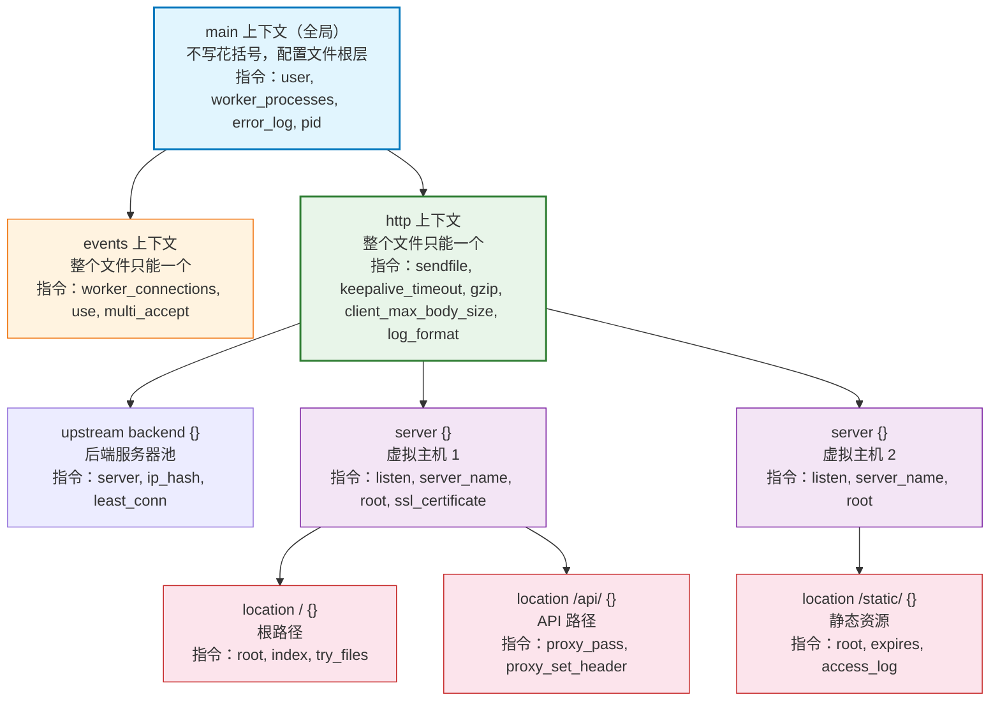
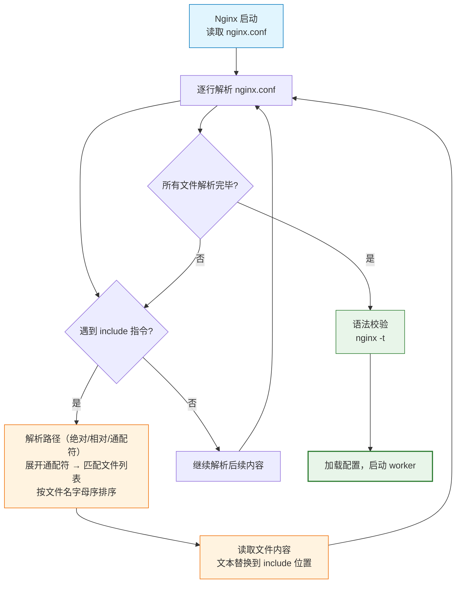
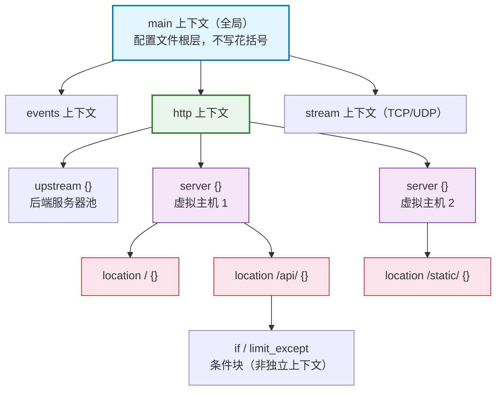
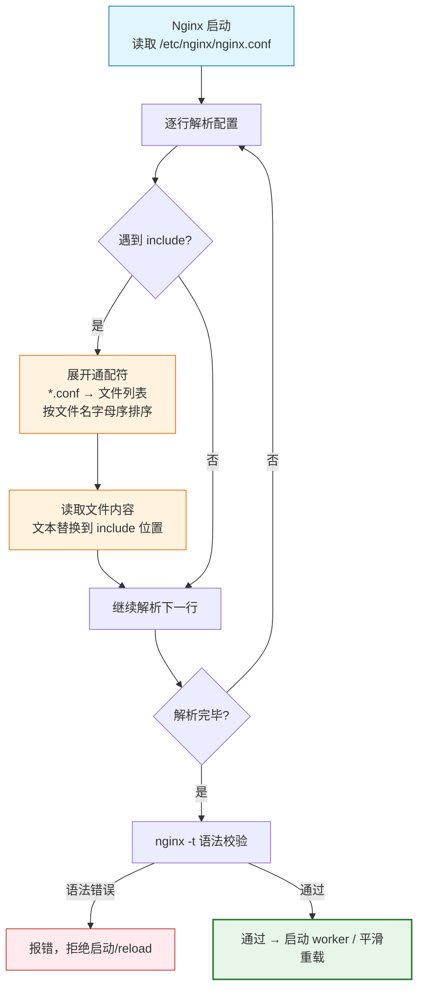

# 04 - 配置文件结构与指令体系

> 版本基线：Nginx 1.30.4 (stable) | 创建日期：2026-08-05
> 受众：后端开发熟手（熟悉 Python/Java/Lua），但服务器运维是小白。会用代码的思维方式来理解 Nginx 配置。

---

## 学习目标

学完本篇，你应当能说清楚六件事：

1. Nginx 配置文件的基本语法单位是什么——简单指令和块指令的区别，以及什么是"上下文"。
2. 配置文件的整体骨架长什么样——`main → events → http → server → location` 这五层嵌套关系，每一层能放什么指令，指令是如何从父层继承到子层的。
3. `include` 指令怎么把一个巨大的配置文件拆成多个小文件来管理——路径规则和通配符用法。
4. Nginx 的变量体系——内置变量有哪些、怎么自定义变量、`map` 指令怎么做条件映射、变量的作用域和生命周期。
5. 常见指令分别能在哪些上下文里使用——一张速查表。
6. 生产环境如何组织配置文件目录——拆分策略和命名规范。

这是后续所有配置实操的语法地基。不搞清楚指令层级和继承规则，后面写 `location`、`proxy_pass`、`rewrite` 时就是在堆模板，出了问题完全不知道从哪里查起。

---

## 核心知识点

### 一、指令分类：简单指令 vs 块指令

Nginx 的配置文件（`nginx.conf`）本质上就是一堆**指令（directive）**的集合。指令是 Nginx 配置的最小语法单位，类似于编程语言中的"语句"。指令分两类：

#### 1.1 简单指令（Simple Directive）

以**分号 `;`** 结尾的单行指令。格式是：`指令名 参数;`

```nginx
worker_processes auto;      # 指令名=worker_processes，参数=auto，分号结尾
worker_connections 1024;    # 指令名=worker_connections，参数=1024，分号结尾
access_log /var/log/nginx/access.log;  # 指令名=access_log，参数=路径
```

简单指令就是"一行一个配置项"，写完加分号。这跟 C 语句、CSS 声明（`color: red;`）是同一个思路。

#### 1.2 块指令（Block Directive）

用**花括号 `{ }`** 包裹的指令，里面可以嵌套其他指令。格式是：`指令名 参数 { ...子指令... }`

```nginx
events {                   # 块指令 events，后面跟花括号
    worker_connections 1024;  # 块内部的简单指令
}

http {                     # 块指令 http，Nginx 的 HTTP 核心配置都在这里面
    server {                # 块指令 server，一个 server 代表一个虚拟主机
        listen 80;          # server 内部的简单指令
        location / {        # 块指令 location，定义 URL 匹配规则
            root /usr/share/nginx/html;  # location 内部的简单指令
        }
    }
}
```

块指令的关键特征是**花括号内可以继续嵌套指令**——既可以是简单指令，也可以是新的块指令。这种嵌套能力构成了 Nginx 配置的层级结构。

#### 1.3 什么是上下文（Context）

当一个块指令内部嵌套了其他指令时，这个块指令就形成了一个**上下文（context）**。上下文就是指令的"作用域"——决定了指令在什么范围内生效。

你可以把上下文理解成编程语言中的**作用域/命名空间**：

```nginx
# 伪代码类比，帮助你理解上下文

http {                        # http 上下文 —— 类似全局命名空间
    server {                  # server 上下文 —— 类似一个类的定义
        location /api {       # location 上下文 —— 类似一个方法
            # 这里的指令只在 /api 路径下生效
        }
    }
}
```

Nginx 有几个**核心上下文**（也叫"块"），它们之间有严格的嵌套关系：

| 上下文 | 花括号写法 | 能嵌套在谁的内部 | 典型用途 |
|--------|-----------|-----------------|---------|
| **main**（全局） | 不写花括号，就是配置文件的根 | 无（它是最外层） | 设置全局参数，如 worker_processes |
| **events** | `events { }` | main | 设置连接相关参数，如 worker_connections |
| **http** | `http { }` | main | HTTP 服务器的全部配置 |
| **server** | `server { }` | http | 定义一个虚拟主机（一个域名/IP 对应的站点） |
| **location** | `location { }` | server | 定义 URL 路径匹配规则和处理方式 |
| **upstream** | `upstream { }` | http | 定义后端服务器池（负载均衡用） |

> **特例说明**：
> - `main` 上下文没有花括号——配置文件中所有不在任何 `{ }` 内的指令，都属于 main 上下文。
> - `if` 和 `limit_except` 虽然也用花括号，但它们不是独立上下文，而是 location 内部的条件/限制块。`if` 在 Nginx 中有大量行为陷阱，后面踩坑文档会专门讲。
> - `stream { }` 上下文（TCP/UDP 四层代理）与 `http { }` 平级，也在 main 下，但本阶段先不涉及。

#### 1.4 代码示例对比

下面用一个完整的例子展示简单指令和块指令的对比：

```nginx
# ===== main 上下文（全局，不在任何花括号内）=====

user  nginx;                          # [简单指令] worker 进程以 nginx 用户身份运行
worker_processes  auto;               # [简单指令] worker 数量自动等于 CPU 核心数
error_log  /var/log/nginx/error.log warn;  # [简单指令] 错误日志路径和级别
pid        /var/run/nginx.pid;       # [简单指令] master 进程 PID 文件路径

# ===== events 上下文 =====

events {
    worker_connections  1024;         # [简单指令] 每个 worker 最大连接数 1024
}

# ===== http 上下文 =====

http {
    include       /etc/nginx/mime.types;   # [简单指令] include 本身也是简单指令，加载 MIME 映射表
    default_type  application/octet-stream;# [简单指令] 默认 MIME 类型

    # ----- server 上下文：第一个虚拟主机 -----
    server {
        listen       80;               # [简单指令] 监听 80 端口
        server_name  localhost;        # [简单指令] 域名

        # ----- location 上下文：根路径 -----
        location / {
            root   /usr/share/nginx/html;  # [简单指令] 站点根目录
            index  index.html index.htm;   # [简单指令] 默认首页文件
        }
    }

    # ----- server 上下文：第二个虚拟主机 -----
    server {
        listen       8080;             # [简单指令] 监听 8080 端口
        server_name  api.example.com;   # [简单指令] API 域名

        location /api/ {
            proxy_pass http://127.0.0.1:8000;  # [简单指令] 反向代理到后端
        }
    }
}
```

> **语法要点**：
> - 指令名和参数之间用**任意空白（空格/Tab）**分隔，不需要等号。
> - 简单指令**必须以 `;` 结尾**，漏写分号是新手最常见的语法错误——Nginx 会把下一行也当成参数，报出莫名其妙的 "invalid number of arguments" 错误。
> - 块指令的花括号 `{` 紧跟在指令名和参数之后，不需要分号。但花括号内的最后一条子指令仍需分号。
> - `#` 开头是注释，Nginx 解析时跳过整行。

---

### 二、上下文层级：main → events → http → server → location

理解了"什么是上下文"，现在来看上下文之间是怎么嵌套的。这是 Nginx 配置的核心骨架。

#### 2.1 嵌套关系总览

Nginx 配置文件有严格的层级结构，外层是内层的"父上下文"，内层是外层的"子上下文"：

```
main（全局）
 ├── events { }           ← 与 http 平级，都在 main 下
 └── http { }
      ├── upstream { }     ← 后端服务器池
      ├── server { }       ← 虚拟主机
      │    └── location { } ← URL 路径匹配
      │         └── (if/limit_except 等条件块)
      └── server { }
           └── location { }
```

#### 2.2 每个上下文的作用域和能放什么指令

**main 上下文（全局层）**

这是整个配置文件的最外层，不属于任何花括号。放的是影响 Nginx 整体行为的指令：

```nginx
# 这些指令直接写在文件顶部，不在任何 { } 内
user nginx;                   # worker 进程运行身份
worker_processes auto;        # worker 数量
worker_rlimit_nofile 65535;   # worker 最大文件描述符数
error_log /var/log/nginx/error.log warn;  # 全局错误日志
pid /var/run/nginx.pid;      # PID 文件
daemon on;                   # 是否以守护进程方式运行（前台调试设 off）
```

> main 上下文能放的核心指令有限：`user`、`worker_processes`、`error_log`、`pid`、`daemon`、`events`、`http`、`stream`、`load_module` 等。像 `listen`、`server_name`、`root` 这些指令**不能**放在 main 里。

**events 上下文**

只管一件事：网络连接相关的参数。整个配置文件中只能有一个 `events { }` 块。

```nginx
events {
    worker_connections 1024;   # 每个 worker 最大并发连接数
    use epoll;                 # 事件驱动模型（Linux 用 epoll，BSD 用 kqueue）
    multi_accept on;           # 是否一次性接收所有新连接（默认 off）
}
```

> events 上下文能放的指令很少：`worker_connections`、`use`、`multi_accept`、`accept_mutex` 等。

**http 上下文**

HTTP 服务器的"总指挥部"。所有 HTTP 相关的配置都在这个块内。一个配置文件只能有一个 `http { }` 块。

```nginx
http {
    # --- 全局 HTTP 参数 ---
    include       /etc/nginx/mime.types;    # MIME 类型映射表
    default_type  application/octet-stream; # 默认 MIME 类型
    sendfile      on;                       # 启用零拷贝（高效传输文件）
    keepalive_timeout  65;                  # 客户端 keepalive 超时秒数
    gzip  on;                               # 启用 gzip 压缩

    # --- upstream：后端服务器池（负载均衡） ---
    upstream backend {
        server 192.168.1.10:8000;
        server 192.168.1.11:8000;
    }

    # --- server：虚拟主机（可以有多个） ---
    server {
        listen 80;
        server_name www.example.com;
        location / { ... }
    }

    server {
        listen 443 ssl;
        server_name api.example.com;
        location /api/ { ... }
    }
}
```

> http 上下文可以放：`sendfile`、`keepalive_timeout`、`gzip`、`client_max_body_size`、`include`、`log_format`、`server`（嵌套块）、`upstream`（嵌套块）等。

**server 上下文**

一个 `server { }` 代表一个虚拟主机（Virtual Host）。通过 `listen` + `server_name` 区分不同的站点。http 内可以有任意多个 server 块。

```nginx
server {
    listen 80;                              # 监听端口
    server_name www.example.com;            # 匹配的域名
    root /var/www/site1;                   # 站点根目录（可被 location 继承）
    access_log /var/log/nginx/site1.log;   # 该站点访问日志

    location / { ... }                     # 根路径
    location /static/ { ... }              # 静态资源路径
    location /api/ { ... }                 # API 代理路径
}
```

> server 上下文可以放：`listen`、`server_name`、`root`、`access_log`、`error_page`、`ssl_certificate`、`location`（嵌套块）等。

**location 上下文**

配置文件的最内层。一个 `location { }` 定义了"某个 URL 路径该怎么处理"。server 内可以有多个 location 块。

```nginx
location /static/ {
    root /var/www/static;        # 静态文件目录
    expires 30d;                 # 浏览器缓存 30 天
    access_log off;              # 静态资源不记访问日志
}
```

> location 上下文可以放：`root`、`alias`、`index`、`try_files`、`proxy_pass`、`fastcgi_pass`、`rewrite`、`return`、`expires`、`add_header` 等。location 是最灵活的上下文，大部分请求处理逻辑都在这里。

#### 2.3 指令继承规则

Nginx 的指令继承机制是理解配置行为的关键。规则如下：

1. **子上下文自动继承父上下文的指令值**——如果子上下文没有显式写某指令，就用父上下文的值。
2. **子上下文可以覆盖父上下文的指令**——如果子上下文显式写了同一个指令，子上下文的值优先。
3. **不是所有指令都能被继承**——有些指令只在特定上下文生效（如 `listen` 只在 server 内有效），不存在继承一说。

用一个具体例子说明继承：

```nginx
http {
    # ----- 在 http 层设的值，对所有 server/location 生效（继承） -----
    sendfile on;                    # 全局开启 sendfile
    keepalive_timeout 65;           # 全局 keepalive 65 秒
    client_max_body_size 10m;       # 全局允许上传 10MB

    server {
        listen 80;
        server_name site1.com;

        # server 层没写 sendfile/keepalive_timeout/client_max_body_size
        # → 自动继承 http 层的值

        location / {
            root /var/www/site1;
            # sendfile=on, keepalive_timeout=65, client_max_body_size=10m 全部继承
        }

        location /upload {
            # 这里需要更大的上传限制 → 覆盖（override）http 层的值
            client_max_body_size 100m;   # 仅此 location 允许上传 100MB
            # sendfile 和 keepalive_timeout 仍然继承 http 层的值
        }
    }

    server {
        listen 80;
        server_name site2.com;

        # site2 需要关闭 keepalive → 在 server 层覆盖
        keepalive_timeout 0;   # 此 server 下所有 location 的 keepalive 都变成 0
    }
}
```

> **特例说明——覆盖的"破坏性"**：
> 继承是按"块"覆盖的，不是按"属性"合并的。这一点在 `proxy_set_header`、`add_header` 这类**数组型指令**上特别明显。如果你在 location 里写了一行 `add_header X-Custom foo`，它不会和 server 层的 `add_header X-Frame-Options DENY` 合并——而是**整个覆盖掉**，server 层的 `add_header` 在这个 location 里全部失效。这正是踩坑文档 #1.8（root 放在 location 内导致继承断裂）这类问题的根源。

> 参考踩坑：[#1.8 root 放在 location 内导致未匹配 location 无根目录](../99-踩坑记录与解决方案.md#18-root-放在-location-内导致未匹配-location-无根目录)

#### 2.4 上下文层级树（Mermaid）



> **看图要点**：从 main 到 location 是逐层嵌套的。一个指令能放在哪一层，是由它的"上下文要求"决定的。放错层（比如把 `listen` 写到 http 里、把 `worker_processes` 写到 http 里）会直接报错 `nginx: [emerg] "xxx" directive is not allowed here`。

---

### 三、include 指令：拆分配置文件

随着配置越来越复杂，把所有配置塞在一个 `nginx.conf` 里会变得不可维护。`include` 指令的作用就是：**把其他文件的内容"粘贴"到当前位置**，实现配置文件的模块化拆分。

#### 3.1 include 的作用

`include` 本质上是一个"文本替换"操作——Nginx 在解析配置时，遇到 `include` 就把指定文件的内容原封不动地插入到 `include` 所在的位置，然后再继续解析。被 include 的文件内容必须符合 Nginx 配置语法。

这跟 C 语言的 `#include`、Python 的 `import`（但更接近 C 的文本插入）是同一个思路。

```nginx
# nginx.conf —— 主配置文件，用 include 拆分

user  nginx;
worker_processes  auto;
error_log  /var/log/nginx/error.log warn;
pid        /var/run/nginx.pid;

include /etc/nginx/conf.d/events.conf;   # 把 events 块拆到单独文件

http {
    include       /etc/nginx/mime.types;        # include MIME 映射表
    default_type  application/octet-stream;

    include /etc/nginx/conf.d/*.conf;           # 通配符：加载所有 .conf 文件（见下文）

    # http 层的其他公共配置可以放在一个单独文件
    include /etc/nginx/conf.d/http_defaults.conf;
}
```

#### 3.2 include 的路径规则

`include` 的路径可以是**绝对路径**或**相对路径**：

```nginx
# 方式一：绝对路径（推荐，最清晰）
include /etc/nginx/mime.types;              # 从根目录开始的完整路径
include /etc/nginx/conf.d/default.conf;    # 明确指向某个文件

# 方式二：相对路径（相对于 Nginx 的 prefix 目录）
include conf.d/default.conf;               # 相对于 --prefix 指定的目录
# 如果 Nginx 安装时 --prefix=/etc/nginx，则实际查找 /etc/nginx/conf.d/default.conf
```

> **相对路径的基准目录**：相对路径是相对于 Nginx 编译时的 `--prefix` 目录（不是当前配置文件所在目录）。可以用 `nginx -V` 查看 prefix 目录。包安装时通常是 `/etc/nginx`。因为相对路径容易让人困惑，**生产环境强烈建议统一使用绝对路径**。

#### 3.3 通配符 include

`include` 支持 shell 风格的通配符（glob）：

```nginx
# 加载 conf.d 目录下所有 .conf 文件
include /etc/nginx/conf.d/*.conf;

# 加载 sites-enabled 目录下所有文件（不限扩展名）
include /etc/nginx/sites-enabled/*;

# 加载 vhost 目录下所有以 .conf 结尾的文件，按文件名字母序依次加载
include /etc/nginx/vhost/*.conf;
```

通配符匹配的文件按**文件名字母序**依次加载。如果多个文件定义了同一个 server（相同的 listen + server_name），后加载的会覆盖先加载的，Nginx 会报 `conflicting server name` 警告。

> **特例说明**：
> - 通配符匹配不到任何文件时，Nginx **不会报错**（视为空操作）。但如果你明确写了一个不存在的文件名（不带通配符），如 `include /etc/nginx/missing.conf;`，Nginx 会报 `open() "...missing.conf" failed` 并启动失败。
> - `include` 可以出现在**任何上下文**中——main、http、server、location 都行。被 include 的文件内容会被插入到对应位置，所以被 include 的文件内的指令必须与 include 所在的上下文匹配。比如在 `http { }` 内 include 一个文件，那个文件里只能放 http 层级的指令（不能放 `worker_processes` 这种 main 层指令）。

#### 3.4 include 加载流程（Mermaid）



> **关键理解**：include 不是"运行时"加载，而是"解析时"就把文件内容展开了。所以修改了被 include 的文件后，必须 `nginx -s reload` 才能生效。同时，`nginx -t` 会校验所有被 include 的文件的语法，不通过就拒绝 reload。

---

### 四、变量体系

Nginx 的变量是配置中最灵活的部分。有了变量，配置就能"动态化"——根据请求的不同属性（域名、路径、IP、请求头等）做出不同的处理。Nginx 的变量分为**内置变量**和**自定义变量**两类。

#### 4.1 Nginx 变量的概念

Nginx 变量的形式是 `$变量名`，跟 Shell/PHP 的变量语法一样。变量在配置被解析时创建，在**处理请求时**才被求值（计算）。

关键理解：

- 变量是**每个请求独立**的——不同请求的同一个变量值不同。`$host` 在请求 A 时是 `www.a.com`，在请求 B 时是 `www.b.com`。
- 变量是**惰性求值**的——只有当请求处理到使用该变量的指令时，Nginx 才去计算它的值。
- 变量的值**总是字符串类型**（即使是 `$server_port` 这样的数字，也是字符串 `"80"`）。部分变量在某些指令中有特殊类型转换行为（如 `if`），但底层存储都是字符串。

#### 4.2 常用内置变量

Nginx 内置了几百个变量，覆盖了请求的方方面面。下面列出最常用的一批，按类别分组：

**请求基本信息类**

| 变量 | 含义 | 示例值 |
|------|------|--------|
| `$host` | 请求行中的 Host 头部字段（去掉端口）；如果为空则用 server_name | `www.example.com` |
| `$uri` | 当前请求的标准化 URI 路径（不含查询参数），可能被 rewrite 改写 | `/api/users` |
| `$request_uri` | 原始请求 URI（含查询参数），不会被 rewrite 改写 | `/api/users?id=42&page=1` |
| `$args` | 查询参数字符串（`?` 后面的全部内容） | `id=42&page=1` |
| `$query_string` | 同 `$args`（别名） | `id=42&page=1` |
| `$scheme` | 请求协议：http 或 https | `https` |
| `$request_method` | HTTP 方法 | `GET` / `POST` |
| `$request` | 完整的原始请求行 | `GET /api/users?id=42 HTTP/1.1` |
| `$document_uri` | 同 `$uri`（别名） | `/api/users` |

> **`$uri` vs `$request_uri` 的区别（重要）**：
> - `$request_uri` 是浏览器发来的**原始** URI，永远不会变——它是请求行中 `GET <这里> HTTP/1.1` 的那个值。
> - `$uri` 是**当前处理阶段**的 URI，会被 `rewrite` 指令改写。如果你在 location 里用 `rewrite ^/old/(.*)$ /new/$1 break;`，rewrite 之后 `$uri` 变成了 `/new/xxx`，但 `$request_uri` 仍然是 `/old/xxx`。

**客户端连接类**

| 变量 | 含义 | 示例值 |
|------|------|--------|
| `$remote_addr` | 客户端 IP 地址 | `203.0.113.5` |
| `$remote_port` | 客户端端口 | `54321` |
| `$remote_user` | HTTP Basic Auth 认证后的用户名（未认证为空） | `admin` |
| `$server_addr` | Nginx 接收请求的服务器 IP | `192.168.1.100` |
| `$server_port` | Nginx 接收请求的服务器端口 | `80` |
| `$server_name` | 匹配到的 server_name | `www.example.com` |
| `$scheme` | 请求协议 | `http` |

**请求头 / 响应头类**

Nginx 用 `$http_` 前缀访问**任意请求头**，用 `$sent_http_` 前缀访问**任意响应头**：

| 变量 | 含义 | 示例值 |
|------|------|--------|
| `$http_user_agent` | 请求头 `User-Agent`（全小写，下划线替换连字符） | `Mozilla/5.0...` |
| `$http_referer` | 请求头 `Referer` | `https://www.google.com/` |
| `$http_x_forwarded_for` | 请求头 `X-Forwarded-For` | `203.0.113.5, 10.0.0.1` |
| `$http_x_custom_header` | 任意自定义请求头 `X-Custom-Header` | 由客户端决定 |
| `$sent_http_content_type` | Nginx 即将发送的响应头 `Content-Type` | `text/html` |
| `$sent_http_x_powered_by` | 自定义响应头 `X-Powered-By` | `MyApp/1.0` |
| `$upstream_http_x_backend_header` | 从后端（upstream）收到的响应头 | — |

> **命名规则**：`$http_` 后面跟的是请求头名称的**全小写、连字符替换为下划线**版本。请求头 `X-Custom-Header` 对应变量 `$http_x_custom_header`。`$sent_http_` 和 `$upstream_http_` 同理。

> 参考踩坑：[#1.11 含下划线的请求头被静默丢弃](../99-踩坑记录与解决方案.md#111-含下划线的请求头被静默丢弃)

**代码示例——内置变量的使用**

```nginx
server {
    listen 80;
    server_name api.example.com;

    # 用 $remote_addr 记录客户端真实 IP
    # 用 $request_uri 记录原始请求路径（含参数）
    log_format main '$remote_addr - $remote_user [$time_local] '
                    '"$request" $status $body_bytes_sent '
                    '"$http_referer" "$http_user_agent"';
    access_log /var/log/nginx/api.access.log main;

    location / {
        # 根据请求方法返回不同内容
        # $request_method 取值如 GET/POST/PUT/DELETE
        if ($request_method = POST) {
            return 405 "Method Not Allowed";
        }

        # 把客户端 IP 传给后端（通过自定义请求头）
        proxy_set_header X-Real-IP $remote_addr;

        # 把原始 Host 传给后端
        proxy_set_header Host $host;

        # 把原始 URI（含参数）记录到响应头（仅调试用）
        add_header X-Debug-URI $request_uri;

        proxy_pass http://backend;
    }
}
```

#### 4.3 自定义变量：set 指令

`set` 指令用于自定义变量并赋值：

```nginx
# 语法：set $变量名 值;
set $cache_ttl 3600;     # 定义变量 $cache_ttl，值为 3600（字符串 "3600"）
```

`set` 可以在 server、location、if 上下文中使用。值可以是字符串字面量、其他变量、或它们的组合。

```nginx
server {
    listen 80;
    server_name www.example.com;

    # 在 server 层定义变量，所有 location 可继承使用
    set $backend_root "http://127.0.0.1:8000";

    location /api/ {
        # 引用上面定义的变量
        # $backend_root 被替换为 http://127.0.0.1:8000
        proxy_pass $backend_root/api/;
    }

    location /static/ {
        # 用 $host 拼接 CDN 地址
        set $cdn_url "https://cdn.example.com";
        add_header X-CDN "$cdn_url (served by $host)";
        # 变量可以在字符串中插值（类似 Shell/PHP 的双引号插值）
    }
}
```

> **特例说明——`set` 的求值时机**：
> `set` 指令在请求处理的 **rewrite 阶段**执行（后面"请求处理流程"文档会详解 11 个阶段）。这意味着 `set` 赋的值在后续的 rewrite、access、content 等阶段才可用。如果你试图在 `set` 之前（如 map 或更早的阶段）引用该变量，可能得到空值。

#### 4.4 map 指令：按条件映射变量值

`map` 指令是 Nginx 中最强大的变量处理工具。它的作用是：**根据一个变量的值，映射出另一个变量的值**。类似于编程语言中的 `switch-case` 或字典查找。

```nginx
# 语法：
# map $源变量 $目标变量 {
#     值1   结果1;
#     值2   结果2;
#     default  默认结果;
# }

# 例：根据 $host 决定后端地址
map $host $backend {
    default      http://127.0.0.1:8000;   # 默认后端
    "www.example.com"  http://192.168.1.10:8000;  # 主站走专用后端
    "api.example.com"   http://192.168.1.20:8000;  # API 走另一组
}
```

`map` 必须放在 **http 上下文**中（不能放在 server 或 location 里）。它定义的变量可以在后续的任何 http/server/location 中使用。

**完整示例——根据设备类型返回不同根目录**

```nginx
http {
    # 根据 User-Agent 判断设备类型
    map $http_user_agent $device_type {
        default                    "desktop";  # 默认桌面端
        "~*Mobile"                 "mobile";   # 匹配含 Mobile 的 UA
        "~*Android.*Mobile"        "android";  # 安卓手机
        "~*iPhone"                 "iphone";   # iPhone
        "~*iPad"                   "tablet";   # iPad
    }

    # 根据设备类型映射不同的静态文件根目录
    map $device_type $site_root {
        default   /var/www/desktop;   # 桌面端根目录
        mobile    /var/www/mobile;    # 移动端根目录
        android   /var/www/mobile;
        iphone    /var/www/mobile;
        tablet    /var/www/tablet;    # 平板端根目录
    }

    server {
        listen 80;
        server_name www.example.com;

        location / {
            # $site_root 的值由上面的 map 根据请求的 User-Agent 自动决定
            root $site_root;
            index index.html;
        }
    }
}
```

> **`map` 的匹配规则**：
> - `map` 中的匹配值可以是精确字符串，也可以是正则表达式（用 `~` 前缀表示区分大小写，`~*` 表示不区分大小写）。
> - 匹配顺序是：精确字符串 → 正则（按定义顺序）→ default。
> - `map` 是**惰性求值**的——只有当 `$目标变量` 实际被使用时，map 才去计算结果。如果请求从未引用 `$device_type`，map 中的正则匹配根本不会执行。

#### 4.5 变量的作用域和生命周期

理解变量的生命周期对避免诡异 bug 很重要：

| 属性 | 说明 |
|------|------|
| **创建时机** | 配置解析阶段（`nginx -t` / reload 时）。此时变量"注册"到 Nginx 中 |
| **求值时机** | 请求处理阶段。每个请求独立求值，互不影响 |
| **生命周期** | 单个请求。请求 A 的变量值不会泄露到请求 B |
| **默认值** | 未赋值的变量默认是**空字符串 `""`**（不是 null/undefined） |
| **作用域** | `set` 定义的变量在定义所在的 server/location 及其子块中可用；`map` 定义的全局可用 |

```nginx
server {
    listen 80;

    location /a {
        set $my_var "hello";
        # $my_var = "hello"，在此 location 内可用
        return 200 "var=$my_var\n";  # 输出: var=hello
    }

    location /b {
        # 这里访问 $my_var 得到空字符串（不是 "hello"）
        # 因为 /a 和 /b 是不同的请求，变量不共享
        return 200 "var=$my_var\n";  # 输出: var=（空）
    }
}
```

> **特例说明——子请求与变量共享**：
> 在 OpenResty/Lua 环境中，通过 `ngx.location.capture` 发起的子请求**可以共享父请求的变量**（通过 `ctx`）。但在纯 Nginx 配置中，每个请求的变量是隔离的。这部分在阶段七 OpenResty 文档中会深入讲解。

---

### 五、指令上下文速查表

下表列出常见指令及其可用上下文。"可用上下文"列中的 `main`、`http`、`server`、`location` 表示该指令可以写在哪些层级。

#### 5.1 核心指令

| 指令 | 可用上下文 | 说明 |
|------|-----------|------|
| `user` | main | worker 进程运行用户 |
| `worker_processes` | main | worker 数量 |
| `worker_rlimit_nofile` | main | 最大文件描述符 |
| `error_log` | main, http, server, location | 错误日志（可在各层覆盖） |
| `pid` | main | PID 文件路径 |
| `daemon` | main | 是否守护进程运行 |
| `include` | 任意上下文 | 加载外部配置文件 |
| `events { }` | main | 事件连接配置块 |
| `worker_connections` | events | 每 worker 最大连接数 |
| `use` | events | 事件驱动模型 |
| `multi_accept` | events | 一次性接收所有新连接 |

#### 5.2 HTTP 指令

| 指令 | 可用上下文 | 说明 |
|------|-----------|------|
| `http { }` | main | HTTP 配置块 |
| `sendfile` | http, server, location | 零拷贝传输 |
| `keepalive_timeout` | http, server, location | keepalive 超时 |
| `keepalive_requests` | http, server, location | keepalive 最大请求数 |
| `client_max_body_size` | http, server, location | 请求体最大大小 |
| `client_body_timeout` | http, server, location | 请求体超时 |
| `default_type` | http, server, location | 默认 MIME 类型 |
| `types { }` | http, server | MIME 类型映射块 |
| `log_format` | http | 定义日志格式 |
| `access_log` | http, server, location, if | 访问日志 |
| `error_page` | http, server, location, if | 错误页 |
| `gzip` | http, server, location | gzip 压缩开关 |
| `gzip_types` | http, server, location | gzip 压缩的 MIME 类型 |
| `map` | http | 变量映射 |
| `upstream { }` | http | 后端服务器池 |

#### 5.3 Server/Location 指令

| 指令 | 可用上下文 | 说明 |
|------|-----------|------|
| `server { }` | http | 虚拟主机 |
| `listen` | server | 监听地址和端口 |
| `server_name` | server | 域名 |
| `root` | http, server, location, if | 站点根目录 |
| `alias` | location | 路径别名（仅 location） |
| `index` | http, server, location | 默认首页 |
| `try_files` | server, location | 尝试多个文件 |
| `location { }` | server, location | URL 匹配块 |
| `return` | server, location, if | 直接返回响应 |
| `rewrite` | server, location, if | URL 重写 |
| `proxy_pass` | location, if, limit_except | 反向代理 |
| `proxy_set_header` | http, server, location | 代理请求头 |
| `fastcgi_pass` | location, if | FastCGI 代理 |
| `expires` | http, server, location, if | 浏览器缓存过期 |
| `add_header` | http, server, location, if | 添加响应头 |
| `set` | server, location, if | 定义变量 |
| `if` | server, location | 条件判断 |
| `limit_except` | location | HTTP 方法限制 |

> **使用提示**：不确定某个指令能用在哪一层时，最可靠的方式是查 [Nginx 官方指令文档](https://nginx.org/en/docs/dirindex.html)，每个指令的文档页都明确标注了 `Context:` 字段。也可以用 `nginx -t` 快速验证——放错层会直接报 `directive is not allowed here`。

---

### 六、配置文件的组织最佳实践

当一个 Nginx 实例上跑着多个站点、多个域名、多种功能时，如何组织配置文件直接决定了运维效率。下面是生产环境推荐的拆分策略和命名规范。

#### 6.1 目录结构推荐

```text
/etc/nginx/
├── nginx.conf              ← 主配置文件：只放全局参数 + include 指令
├── mime.types              ← MIME 类型映射表（系统自带，不动）
├── conf.d/                 ← 额外的公共配置片段（被 nginx.conf include）
│   ├── gzip.conf           ← gzip 压缩相关配置
│   ├── proxy_params.conf    ← 反向代理公共参数（proxy_set_header 等）
│   └── log_format.conf      ← 日志格式定义
├── sites-available/        ← 所有站点配置（按站点一个文件）
│   ├── www.example.com.conf
│   ├── api.example.com.conf
│   └── admin.example.com.conf
├── sites-enabled/           ← 已启用的站点（软链接到 sites-available）
│   ├── www.example.com.conf   -> ../sites-available/www.example.com.conf
│   └── api.example.com.conf    -> ../sites-available/api.example.com.conf
└── snippets/                ← 可复用的配置片段（被多个站点 include）
    ├── ssl-params.conf      ← SSL 公共参数
    └── php-fpm.conf         ← PHP-FPM 公共参数
```

#### 6.2 拆分策略：按站点拆 + 按功能拆

**按站点拆**（每个域名/服务一个独立配置文件）：

```nginx
# /etc/nginx/sites-available/www.example.com.conf
server {
    listen 80;
    server_name www.example.com;
    root /var/www/site1;

    location / {
        try_files $uri $uri/ /index.html;
    }
}

# /etc/nginx/sites-available/api.example.com.conf
server {
    listen 80;
    server_name api.example.com;

    location /api/ {
        proxy_pass http://backend;
    }
}
```

**按功能拆**（把公共配置提取为可复用片段）：

```nginx
# /etc/nginx/snippets/proxy_params.conf —— 公共代理参数
# 多个站点的 proxy_set_header 写法相同，提取为 snippet 复用
proxy_set_header Host $host;
proxy_set_header X-Real-IP $remote_addr;
proxy_set_header X-Forwarded-For $proxy_add_x_forwarded_for;
proxy_set_header X-Forwarded-Proto $scheme;
proxy_connect_timeout 5s;
proxy_read_timeout 60s;
```

```nginx
# /etc/nginx/sites-available/api.example.com.conf —— 引用公共片段
server {
    listen 80;
    server_name api.example.com;

    location /api/ {
        include /etc/nginx/snippets/proxy_params.conf;   # 一行搞定所有代理头
        proxy_pass http://backend;
    }
}
```

#### 6.3 命名规范

| 规则 | 说明 | 示例 |
|------|------|------|
| 站点配置用域名命名 | 一眼看出是哪个站点 | `www.example.com.conf` |
| 功能片段用功能描述 | 一眼看出是做什么的 | `ssl-params.conf`、`proxy_params.conf` |
| 统一 `.conf` 后缀 | 与通配符 `include *.conf` 配合 | 所有配置文件都以 `.conf` 结尾 |
| 禁用的站点不删文件 | 用软链接控制启停 | `sites-enabled/` 中有链接 = 启用，无链接 = 禁用 |
| 按字母序排列 | 避免命名冲突，加载顺序可预测 | `a-` 前缀强制优先加载（极少用） |

#### 6.4 nginx.conf 主文件的推荐写法

主配置文件应该尽量精简，只放全局参数和 include 指令：

```nginx
# /etc/nginx/nginx.conf

user  nginx;                          # worker 运行用户
worker_processes  auto;               # 自动匹配 CPU 核心数
worker_rlimit_nofile 65535;           # 最大文件描述符
error_log  /var/log/nginx/error.log warn;
pid        /var/run/nginx.pid;

events {
    worker_connections  4096;         # 每 worker 最大连接数
    multi_accept on;                  # 一次性接收所有新连接
}

http {
    # --- 基础配置 ---
    include       /etc/nginx/mime.types;
    default_type  application/octet-stream;
    sendfile      on;
    keepalive_timeout  65;
    server_tokens off;                # 隐藏版本号

    # --- 加载公共配置片段 ---
    include /etc/nginx/conf.d/*.conf;

    # --- 加载所有已启用的站点 ---
    include /etc/nginx/sites-enabled/*;
}
```

> **设计理念**：`nginx.conf` 是"骨架"，具体的站点配置和功能片段通过 include 挂载进来。这样新增站点时只需在 `sites-available/` 加一个文件、在 `sites-enabled/` 建一个软链接，然后 `nginx -t && nginx -s reload` 即可，完全不用动主配置文件。

---

## Mermaid 图汇总

### 上下文层级树



### include 加载流程



---

## 最佳实践

1. **主配置文件保持精简**——`nginx.conf` 只放全局参数和 include，具体站点配置全部拆到独立文件。修改某个站点时不需要碰主文件。

2. **用 `sites-available` + `sites-enabled` 软链接模式管理站点**——这是 Debian/Ubuntu 系发行版的标准做法，通过建/删软链接来启用/禁用站点，避免直接删除配置文件导致丢失。

3. **公共配置提取为 snippet**——多个站点共用的配置（如 proxy 请求头、SSL 参数、PHP-FPM 参数）提取为可复用片段，用 `include` 引入。改一处，所有站点生效。

4. **统一使用绝对路径**——include 路径用绝对路径（`/etc/nginx/...`），避免相对路径的 `--prefix` 依赖导致的困惑。

5. **每次修改后先 `nginx -t` 再 `reload`**——`nginx -t` 会校验所有被 include 的文件，语法错误会在 reload 前暴露，避免线上配置语法错误导致服务中断。

6. **指令尽量放在能被继承的层级**——`root` 放在 server 层让所有 location 继承，而不是每个 location 重复写。需要覆盖时再在具体 location 中写。

7. **善用 `map` 替代 `if` 做条件分支**——`if` 指令在 Nginx 中有大量行为陷阱（踩坑文档 #1.7），`map` 更安全、更高效。

8. **变量名清晰表达语义**——自定义变量用有意义的名字（`$device_type` 而非 `$a`），让配置可读。

---

## 常见踩坑引用

> 参考踩坑：[#1.8 root 放在 location 内导致未匹配 location 无根目录](../99-踩坑记录与解决方案.md#18-root-放在-location-内导致未匹配-location-无根目录)
> ——根因是不理解指令继承规则。root 应放 server 层级继承，每个 location 重复写 root 时，漏写的 location 会落到默认值。

> 参考踩坑：[#1.7 if is evil（在 location 中滥用 if）](../99-踩坑记录与解决方案.md#17-if-is-evil在-location-中滥用-if)
> ——`if` 在 location 中有大量非预期行为，能用 `map` / `try_files` 替代就不要用 `if`。

> 参考踩坑：[#1.11 含下划线的请求头被静默丢弃](../99-踩坑记录与解决方案.md#111-含下划线的请求头被静默丢弃)
> ——Nginx 默认丢弃含下划线的请求头，需设置 `underscores_in_headers on`。理解 `$http_xxx` 变量的命名规则是关键。

> 参考踩坑：[#1.6 $uri 在内部跳转后被改写](../99-踩坑记录与解决方案.md#16-uri-在内部跳转后被改写)
> ——`$uri` 会被 rewrite 改写，`$request_uri` 不会。用错变量会导致逻辑错误。

---

## 小结

本篇是 Nginx 配置的语法骨架。核心要点回顾：

1. **指令分两种**：简单指令（`;` 结尾）和块指令（`{ }` 包裹）。块指令形成"上下文"，即指令的作用域。

2. **上下文是严格的层级嵌套**：`main → events → http → server → location`。每一层能放什么指令是固定的，放错层直接报错。`upstream` 和 `server` 是 http 的子块，`location` 是 server 的子块。

3. **指令从父上下文继承到子上下文**，子上下文可覆盖。但数组型指令（如 `add_header`、`proxy_set_header`）的覆盖是"整体替换"而非"合并"——这是最常见的继承陷阱。

4. **`include` 是文本替换**，在配置解析时展开。支持绝对路径、相对路径和通配符。用 `include` 拆分配置文件是生产环境的标准做法。

5. **变量让配置动态化**。内置变量覆盖请求的各个方面（`$host`、`$uri`、`$request_uri`、`$remote_addr`、`$http_xxx` 等）；`set` 自定义变量；`map` 做条件映射。变量是每请求独立的、惰性求值的、值类型为字符串。

6. **配置文件组织**：主文件精简 + 站点拆分 + 公共片段复用。用 `sites-available`/`sites-enabled` 软链接管理站点启停。

下一篇 [05-静态资源服务.md](05-静态资源服务.md) 将进入实战，学习 `root`、`alias`、`index`、`try_files`、`expires` 等指令的具体用法。

