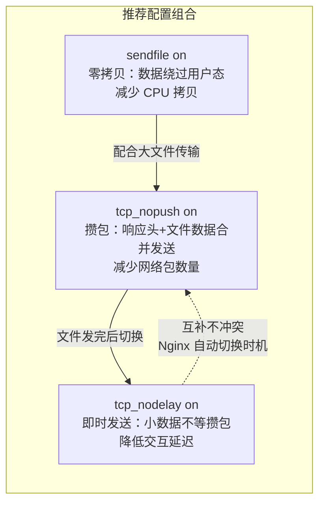
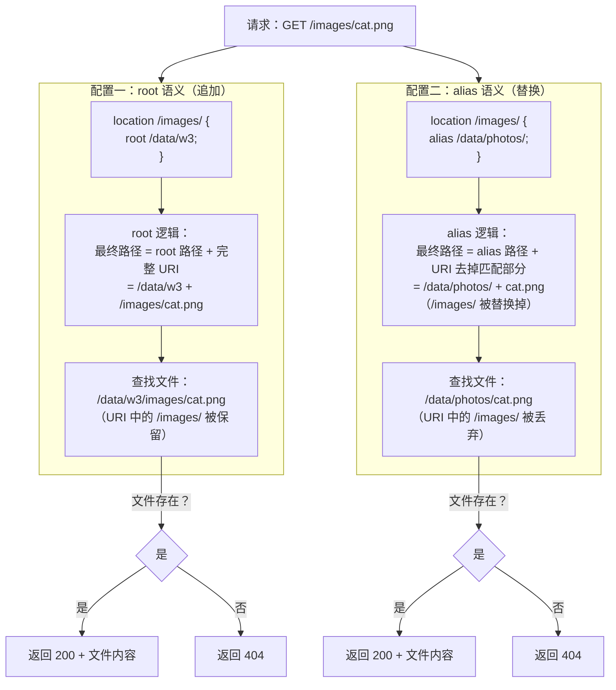

# 05 - 静态资源服务

> 版本基线：Nginx 1.30.4 (stable) | 创建日期：2026-08-05
> 受众：后端开发熟手（熟悉 Python/Java/Lua），但服务器运维是小白。操作系统概念会顺带讲清。

---

## 学习目标

学完本篇，你应当能独立写出一套生产可用的 Nginx 静态资源服务配置。具体来说：理解 `root` 与 `alias` 两种路径映射方式的本质区别（追加 vs 替换），不会再在路径拼接上犯迷糊；掌握 `index`、`try_files` 如何控制默认文件查找与回退逻辑，能正确配置 SPA 前端路由；知道如何用 `types`/`default_type` 控制 MIME 类型、用 `autoindex` 开放目录列表、用 `expires` 设置浏览器缓存头；理解 `sendfile`/`tcp_nopush`/`tcp_nodelay` 三个传输优化指令各自的职责与配合关系；会用 `gzip` 压缩响应体以减少带宽。这些是 Nginx 作为 Web 服务器的最基础能力，也是后续"动静分离"架构的前提。

---

## 核心知识点

### 知识点一：root 指令

#### 1.1 root 的语义

`root` 指令用于设置请求的"根目录"。Nginx 在定位静态文件时，会把 **root 路径 + 完整的请求 URI** 拼接在一起，得到文件在磁盘上的绝对路径。

用一个具体例子说清楚"追加"这个语义：

- 配置：`root /data/w3;`
- 请求：`GET /images/cat.png`
- Nginx 查找的文件路径：`/data/w3/images/cat.png`

注意：root 路径 `/data/w3` 和 URI `/images/cat.png` 是**直接拼接**的，URI 中的 `/images/` 部分被完整保留在最终路径里。这就是"root 是追加"的含义——它把请求 URI 原封不动地追加到 root 路径后面。

#### 1.2 root 可放在 http/server/location 上下文

`root` 可以出现在三个上下文中，低层级继承高层级的值：

```nginx
http {
    root /var/www/default;           # http 层级：全局默认根目录

    server {
        listen 80;
        server_name example.com;
        root /var/www/example;       # server 层级：覆盖 http 层的默认值

        location / {
            # 此处不写 root，继承 server 层的 /var/www/example
            # 请求 GET / → 查找 /var/www/example/index.html
        }

        location /static/ {
            root /var/www/static;    # location 层级：覆盖 server 层的值
            # 请求 GET /static/app.js → 查找 /var/www/static/static/app.js
            # 注意！URI 中的 /static/ 依然被拼进去了
        }
    }
}
```

逐行说明：

- `root /var/www/default;`——http 层级的全局默认值。如果 server 和 location 都不写 root，就用这个。
- `root /var/www/example;`——server 层级覆盖了 http 层。这个 server 下的所有 location 默认用 `/var/www/example`。
- `location /` 块内没有写 root，所以继承 server 层的 `/var/www/example`。请求 `/` 时查找 `/var/www/example/index.html`（index 指令的默认行为，后面会讲）。
- `location /static/` 块内写了 `root /var/www/static;`，覆盖了 server 层的值。请求 `/static/app.js` 时查找 `/var/www/static/static/app.js`——注意最终路径里有**两个** `static`，因为 root 是追加完整 URI，而 URI 本身就包含 `/static/`。

#### 1.3 特例说明：root 放在 location 内的问题

从上面的例子可以看到，`location /static/` 里写 `root /var/www/static;` 会导致查找 `/var/www/static/static/app.js`，多了一层 `/static/` 目录。这通常不是你想要的。如果希望 `/static/app.js` 映射到 `/var/www/static/app.js`（不要重复路径），应该用 `root /var/www;`（让 URI 的 `/static/` 部分充当子目录），或者用后面要讲的 `alias`。

更重要的是，如果每个 location 都单独写 root，一旦新增一个 location 忘了写，它就会落到一个你意想不到的默认值（可能是 http 层的，也可能是编译时的默认 `/etc/nginx/html`），导致 404。

> 参考踩坑：[#1.8 root 放在 location 内导致未匹配 location 无根目录](../99-踩坑记录与解决方案.md#18-root-放在-location-内导致未匹配-location-无根目录)

最佳做法是：**在 server 层写一次 root**，只在需要不同根目录的 location 内覆盖。

---

### 知识点二：alias 指令

#### 2.1 alias 的语义

`alias` 指令也是用来映射 URL 到磁盘路径的，但它的语义和 root 完全不同：**把 location 匹配的部分替换为 alias 路径**。

用一个具体例子说清楚"替换"这个语义：

- 配置：`location /images/ { alias /data/photos/; }`
- 请求：`GET /images/cat.png`
- Nginx 查找的文件路径：`/data/photos/cat.png`

注意：location 匹配到的 `/images/` 部分被"丢弃"了，用 alias 路径 `/data/photos/` **替换**掉了它，只保留 URI 中匹配部分**之后**的 `cat.png`。这就是"alias 是替换"的含义。

#### 2.2 alias 只能放在 location 中

和 root 不同，`alias` **只能出现在 location 上下文中**，不能放在 http 或 server 层。这是因为 alias 的语义依赖于 location 的匹配——它需要知道"替换掉哪一部分"，而这个"哪一部分"就是 location 匹配到的字符串。

```nginx
server {
    listen 80;
    server_name example.com;

    # ✅ 正确：alias 在 location 内
    location /images/ {
        alias /data/photos/;         # /images/cat.png → /data/photos/cat.png
    }

    # ✅ 正确：root 在 location 内（但注意路径拼接问题）
    location /assets/ {
        root /data;                  # /assets/app.js → /data/assets/app.js
    }

    # ❌ 错误：alias 不能放在 server 层
    # alias /data/photos/;           # nginx -t 会报错
}
```

逐行说明：

- `location /images/` + `alias /data/photos/;`——请求 `/images/cat.png`，匹配部分 `/images/` 被替换为 `/data/photos/`，最终查找 `/data/photos/cat.png`。
- `location /assets/` + `root /data;`——请求 `/assets/app.js`，root 追加完整 URI，最终查找 `/data/assets/app.js`。注意这里 root 的值是 `/data`（不含 `/assets/`），URI 中的 `/assets/` 自动成为子目录。
- 最后注释掉的 `alias /data/photos/;` 放在 server 层会导致 `nginx -t` 配置测试失败。

#### 2.3 alias 与 root 的对比

| 维度 | root | alias |
|------|------|-------|
| 语义 | root 路径 + **完整 URI** 拼接 | location 匹配部分**替换**为 alias 路径 |
| 路径计算 | `/data` + `/img/a.png` = `/data/img/a.png` | `/data/` 替换 `/img/` → `/data/a.png` |
| 可用上下文 | http、server、location | **仅 location** |
| 尾斜杠要求 | 不敏感（`root /data` 和 `root /data/` 效果一样） | **必须与 location 尾斜杠对应** |
| 正则 location | 正常使用 | 需配合捕获组使用 |
| 性能 | 无差异 | 无差异 |
| 推荐场景 | 大多数情况下的默认选择 | URL 路径与磁盘目录名不一致时 |

**记忆口诀**：root 是"追加"（把 URI 追到 root 后面），alias 是"替换"（把 location 匹配部分换成 alias 路径）。

#### 2.4 特例说明：alias 使用正则带捕获时需格外小心

当 location 使用正则表达式匹配时，alias 必须引用正则的捕获组来构造文件路径，否则 Nginx 不知道该用什么替换。

```nginx
# 正则 location + alias：必须用 $1、$2 等捕获组
location ~ ^/download/(.*)\.(mp4|mp3)$ {
    alias /data/media/$1.$2;
    # 请求 /download/movie/trailer.mp4
    # 正则捕获：$1 = movie/trailer，$2 = mp4
    # 最终查找：/data/media/movie/trailer.mp4
}
```

逐行说明：

- `location ~ ^/download/(.*)\.(mp4|mp4)$`——正则匹配，捕获两组：`$1` 是文件名（含子路径），`$2` 是扩展名。
- `alias /data/media/$1.$2;`——用捕获组拼接出真实路径。如果不写 `$1.$2` 而只写一个固定路径，所有请求都会映射到同一个文件，这显然是错误的。

> 参考踩坑：[#1.2 root vs alias 混淆](../99-踩坑记录与解决方案.md#12-root-vs-alias-混淆)

---

### 知识点三：index 指令

#### 3.1 index 指定的默认文件

当客户端请求的是一个目录（URI 以 `/` 结尾，或者请求路径对应磁盘上的一个目录而非文件）时，Nginx 不会直接返回目录列表（除非开了 autoindex），而是尝试在目录下查找 `index` 指令指定的默认文件。

```nginx
server {
    listen 80;
    server_name example.com;
    root /var/www/html;

    location / {
        index index.html index.htm index.php;
        # 请求 GET / 时，Nginx 会依次尝试：
        # 1. /var/www/html/index.html
        # 2. /var/www/html/index.htm
        # 3. /var/www/html/index.php
    }
}
```

逐行说明：

- `index index.html index.htm index.php;`——定义默认文件查找列表，Nginx 按**从左到右**的顺序依次尝试。
- 请求 `GET /` 对应目录 `/var/www/html/`，Nginx 先找 `index.html`，如果存在就返回它；如果不存在，继续找 `index.htm`；再不存在找 `index.php`。

#### 3.2 多个 index 文件的查找顺序

`index` 指令可以指定多个文件，Nginx 严格按**书写顺序**从左到右逐个尝试。第一个找到的文件会被返回，后面的不再尝试。

```nginx
location / {
    index index.html index.htm fallback.html;
    # 查找顺序：
    # 第 1 步：检查 index.html 是否存在 → 存在则返回，结束
    # 第 2 步：检查 index.htm 是否存在 → 存在则返回，结束
    # 第 3 步：检查 fallback.html 是否存在 → 存在则返回，结束
    # 第 4 步：都不存在 → 进入内部重定向或返回 403
}
```

#### 3.3 index 找不到时的内部重定向

如果 `index` 列出的所有文件都不存在，Nginx 的行为取决于配置：

- 如果配置了 `try_files`，走 try_files 的回退逻辑（见下一个知识点）。
- 如果没有 `try_files`，但 URI 以 `/` 结尾：
  - `autoindex on`：返回目录列表。
  - `autoindex off`（默认）：返回 **403 Forbidden**。
- 如果 URI 不以 `/` 结尾，Nginx 会先做一次 **301 内部重定向**，在 URI 末尾补上 `/`，然后重新走 index 查找流程。

```nginx
server {
    root /var/www/html;

    location /api/ {
        # 假设 /var/www/html/api/ 目录下没有 index.html
        # 且 autoindex 为 off（默认）
        # 请求 GET /api/ → 返回 403 Forbidden
    }

    location /docs {
        # 请求 GET /docs（无尾斜杠）
        # Nginx 发现 /var/www/html/docs 是一个目录
        # → 301 重定向到 /docs/
        # → 浏览器重新请求 /docs/
        # → 走 index 查找
    }
}
```

> **注意**：`index` 指令的处理涉及一个"内部重定向"机制——当 Nginx 找到 index 文件时，它不是直接读文件返回，而是**把请求 URI 内部改写为该 index 文件的路径**，然后重新走 location 匹配。这意味着如果 `index.php` 命中，请求会被重新路由到处理 `.php` 的 location（如果有 `location ~ \.php$` 的话）。这是 Nginx 能让 `index index.php` 自动交给 PHP-FPM 处理的底层原理。

---

### 知识点四：try_files 指令

#### 4.1 try_files 的作用

`try_files` 指令按顺序尝试一组文件/目录，返回第一个找到的；如果全部找不到，则回退到最后一个参数（一个 URI 或一个状态码）。它是 Nginx 静态资源服务中最重要的指令之一，比用 `if` 判断文件存在要安全得多。

#### 4.2 语法

```nginx
# 语法一：最后一个参数是 URI（内部重定向到该 URI）
try_files file ... uri;

# 语法二：最后一个参数是 =code（返回指定状态码）
try_files file ... =code;
```

- `file ...`：一到多个要尝试的文件路径。可以是变量（如 `$uri`）、字面量路径，也可以在末尾加 `/` 表示尝试目录。
- `uri`：所有文件都不存在时的回退 URI，Nginx 会内部重定向到这个 URI 重新处理。
- `=code`：所有文件都不存在时直接返回状态码（如 `=404`）。

#### 4.3 典型用法：SPA 前端路由

单页应用（SPA）的路由是前端管理的（如 React Router 的 `/users/123`），这些路径在磁盘上没有对应的文件。如果用户直接访问 `/users/123`，Nginx 会 404。解决方法是用 `try_files` 回退到 `index.html`，让前端路由接管。

```nginx
server {
    listen 80;
    server_name example.com;
    root /var/www/spa;

    location / {
        try_files $uri $uri/ /index.html;
        # 逐行说明：
        # $uri    → 先尝试请求路径对应的文件，如 /users/123 → /var/www/spa/users/123
        # $uri/   → 再尝试请求路径对应的目录，如 /users/123/ → /var/www/spa/users/123/
        #          （如果目录存在，会走 index 查找）
        # /index.html → 都找不到时，内部重定向到 /index.html
        #               返回前端入口文件，由前端路由解析 /users/123 并渲染
    }

    # 静态资源单独走这个 location，不走 try_files 回退
    location ~* \.(js|css|png|jpg|gif|svg|woff2?|ttf|eot)$ {
        # 静态资源不存在就直接 404，不要回退到 index.html
        # 否则浏览器请求不存在的 JS 文件会收到 HTML，MIME 不匹配报错
        try_files $uri =404;
    }
}
```

逐行说明：

- `try_files $uri $uri/ /index.html;`——这是 SPA 的经典配置。`$uri` 是当前请求的 URI 变量。先尝试精确文件，再尝试目录，最后回退到 `index.html`。
- `location ~* \.(js|css|...)$` 块——对静态资源文件，不回退到 index.html。因为如果某个 JS 文件确实不存在（比如引用路径错误），你应该看到 404 而不是收到一段 HTML（浏览器会报 MIME 类型不匹配的错误）。
- `try_files $uri =404;`——文件不存在直接返回 404 状态码。

#### 4.4 特例说明：不要用 if 判断文件存在

很多初学者会用 `if (-f $request_filename)` 来判断文件是否存在，这是一个经典坑点。`if` 指令在 location 上下文中行为不可预测（"If Is Evil"），可能导致性能问题甚至段错误。判断文件存在**永远应该用 `try_files`**。

```nginx
# ❌ 错误：用 if 判断文件存在
location / {
    if (!-f $request_filename) {
        proxy_pass http://backend;     # 危险！行为不可预测
    }
}

# ✅ 正确：用 try_files 实现相同逻辑
location / {
    try_files $uri $uri/ @backend;     # 文件/目录不存在时回退到命名 location
}

location @backend {
    proxy_pass http://backend;
}
```

> 参考踩坑：[#1.3 try_files 误用 / 用 if 判断文件存在](../99-踩坑记录与解决方案.md#13-try_files-误用--用-if-判断文件存在)

> 参考踩坑：[#1.9 把所有请求都交给后端（包括静态资源）](../99-踩坑记录与解决方案.md#19-把所有请求都交给后端包括静态资源)

---

### 知识点五：MIME 类型与 types 指令

#### 5.1 include mime.types 的作用

浏览器需要知道收到的响应体是什么类型的内容（HTML？图片？JSON？），才能正确渲染或处理。这个类型信息通过 HTTP 响应头 `Content-Type` 传递，如 `Content-Type: text/html` 或 `Content-Type: image/png`。

Nginx 通过文件扩展名到 MIME 类型的映射表来确定 `Content-Type`。这个映射表通常放在一个单独的文件 `mime.types` 中，在 `nginx.conf` 里用 `include` 引入。

```nginx
http {
    include       mime.types;          # 引入 MIME 类型映射表
    default_type  application/octet-stream;  # 无法匹配时的默认类型

    server {
        listen 80;
        # ...
    }
}
```

逐行说明：

- `include mime.types;`——加载 MIME 映射表。这个文件的内容是一系列 `types { ... }` 块，形如 `text/html html htm;`（表示 `.html` 和 `.htm` 映射到 `text/html`）。
- `default_type application/octet-stream;`——当请求的文件扩展名在映射表中找不到时，使用这个默认类型。`application/octet-stream` 是"二进制流"，浏览器遇到它通常会触发下载而不是直接显示。

`mime.types` 文件的典型内容（摘录）：

```nginx
types {
    text/html                             html htm shtml;
    text/css                              css;
    text/javascript                       js mjs;
    application/json                      json;
    image/png                             png;
    image/jpeg                            jpeg jpg;
    image/gif                             gif;
    image/svg+xml                         svg svgz;
    application/font-woff                 woff;
    application/font-woff2                woff2;
    video/mp4                             mp4;
    application/octet-stream              bin exe dll;
    # ... 更多映射
}
```

#### 5.2 default_type 的作用

`default_type` 设定的是"兜底"的 Content-Type。当文件的扩展名在 `types` 映射表中找不到时，Nginx 就用这个默认值。

```nginx
http {
    include       mime.types;
    default_type  application/octet-stream;  # 兜底类型

    server {
        location /api/ {
            # 反向代理场景下，后端通常自己设置 Content-Type
            # 如果后端没设置，Nginx 用 default_type
            default_type application/json;   # 在此 location 内覆盖为 JSON
            proxy_pass http://backend;
        }
    }
}
```

#### 5.3 如何自定义 MIME 类型映射

如果有些扩展名不在默认的 `mime.types` 里（比如某些新的字体格式、自定义文件类型），你可以用 `types` 指令追加或覆盖映射。

```nginx
http {
    include       mime.types;
    default_type  application/octet-stream;

    # 追加自定义 MIME 类型映射
    types {
        application/wasm    wasm;       # WebAssembly 模块
        text/markdown       md;         # Markdown 文件
        application/manifest+json webmanifest;  # PWA 清单文件
    }
}
```

逐行说明：

- 在 `http` 块内用 `types { ... }` 可以**追加**新的映射。注意：如果同一个扩展名在 `mime.types` 和这里的 `types` 块都出现了，**后定义的覆盖先定义的**。
- `application/wasm wasm;`——把 `.wasm` 文件映射为 `application/wasm` 类型，这样浏览器能正确识别并编译 WebAssembly 模块。
- `text/markdown md;`——把 `.md` 文件映射为 `text/markdown`。

> **特例**：如果你想让某个 location 对所有文件都返回特定的 Content-Type（比如纯文本 API 调试），可以在该 location 内用 `types { }` 清空所有映射，再设 `default_type`：
> ```nginx
> location /raw/ {
>     types { }                          # 清空 MIME 映射
>     default_type text/plain;           # 所有文件都当作纯文本返回
>     root /var/www/debug;
> }
> ```

---

### 知识点六：autoindex 目录列表

#### 6.1 autoindex on 的效果

当请求对应的路径是一个目录，且 `index` 指令列出的默认文件都不存在时，如果开启了 `autoindex on`，Nginx 会生成一个 HTML 格式的目录列表页面，展示该目录下的文件和子目录。

```nginx
location /files/ {
    alias /data/share/;          # 映射到磁盘目录
    autoindex on;                # 开启目录列表
    # 请求 GET /files/ 时，如果 /data/share/ 下没有 index.html
    # Nginx 返回一个 HTML 页面，列出 /data/share/ 下的文件和目录
}
```

生成的页面效果类似：

```
Index of /files/
../
report-2026-01.pdf             2026-01-15 10:30   245760
data/                          2026-01-10 14:00      -
image.png                      2026-01-12 09:15   102400
```

#### 6.2 autoindex_exact_size / autoindex_localtime

```nginx
location /files/ {
    alias /data/share/;
    autoindex on;
    autoindex_exact_size off;    # off：显示人类可读大小（如 1.2M）；on（默认）：精确字节数
    autoindex_localtime on;      # on：显示本地时间；off（默认）：显示 UTC 时间
    autoindex_format html;       # html（默认）/ xml / json / jsonp
}
```

逐行说明：

- `autoindex_exact_size off;`——默认 `on` 会显示精确字节数（如 `245760`），设为 `off` 显示可读格式（如 `240K`）。
- `autoindex_localtime on;`——默认 `off` 显示 UTC 时间，设为 `on` 显示服务器本地时间。
- `autoindex_format html;`——控制输出格式。`html` 是浏览器查看用的，`json`/`jsonp` 适合程序化获取目录列表。

#### 6.3 安全注意事项

**autoindex 会暴露目录结构，生产环境需谨慎使用。**

```nginx
# ❌ 危险：全局开启 autoindex
# http {
#     autoindex on;    # 所有目录都暴露
# }

# ✅ 安全：仅在特定 location 开启，且限制在特定目录
location /public-files/ {
    alias /data/public/;
    autoindex on;               # 仅此目录开放列表
}

# 其他 location 保持 autoindex off（默认值）
location / {
    root /var/www/html;
    # autoindex 默认 off，目录下没有 index 文件时返回 403
}
```

安全要点：

1. **永远不要在 http 或 server 层全局开启 autoindex**——这会让所有没有 index 文件的目录都暴露文件列表。
2. **仅在需要文件共享的特定 location 开启**，且该目录不应包含敏感文件。
3. 如果目录列表面向公网，考虑配合 `auth_basic` 加一层密码认证。

---

### 知识点七：expires 缓存控制头

#### 7.1 expires 的作用

`expires` 指令用于设置 `Cache-Control` 和 `Expires` 响应头，告诉浏览器（或 CDN 等中间缓存）这个资源可以缓存多久。合理配置缓存可以大幅减少重复请求，降低服务器负载和用户等待时间。

#### 7.2 语法

```nginx
expires time | epoch | max | off;
```

- `time`：可以是相对时间（如 `30d`、`1h`、`10m`）或绝对时间（如 `Thu, 31 Dec 2026 23:59:59 GMT`）。设为相对时间时，`Expires` 头 = 当前时间 + 该值，`Cache-Control: max-age` = 该值的秒数。
- `epoch`：设为 `Wed, 31 Dec 1969 23:59:59 GMT`，`Cache-Control: no-cache`——强制每次都向服务器验证。
- `max`：设为 `Thu, 31 Dec 2037 23:55:55 GMT`，`Cache-Control: max-age=315360000`（10 年）——永久缓存。
- `off`（默认）：不修改 `Cache-Control` 和 `Expires` 头。

#### 7.3 常见用法

```nginx
server {
    root /var/www/html;

    # 静态资源长期缓存（30 天）
    location ~* \.(jpg|jpeg|png|gif|ico|css|js|woff2?|ttf|eot|svg|mp4|webm)$ {
        expires 30d;                          # 缓存 30 天
        add_header Cache-Control "public";    # public：允许 CDN 等中间缓存
        access_log off;                       # 静态资源不记访问日志，减少 IO
    }

    # HTML 文件短缓存或禁缓存（保证用户能及时看到更新）
    location ~* \.(html|htm)$ {
        expires -1;                           # 设为已过期，浏览器每次都验证
        add_header Cache-Control "no-cache";  # no-cache：可以缓存但每次需验证
    }

    # API 响应禁止缓存
    location /api/ {
        expires off;                          # 不设置缓存头
        add_header Cache-Control "no-store, no-cache, must-revalidate";
        proxy_pass http://backend;
    }
}
```

逐行说明：

- `expires 30d;`——静态资源（图片、CSS、JS、字体等）内容很少变化，设 30 天缓存。浏览器在 30 天内不会再次请求这些文件，直接用本地缓存。
- `add_header Cache-Control "public";`——`public` 表示响应可以被浏览器和 CDN 等中间代理缓存。如果不加这个，`expires` 指令默认添加的是 `Cache-Control: max-age=2592000`（30 天的秒数），加 `public` 让 CDN 也能缓存。
- `access_log off;`——静态资源请求频繁且无需分析，关闭访问日志减少磁盘 IO。
- `expires -1;`——`-1` 是一个特殊值，表示 `Expires` 头设为过去的时间（已过期），配合 `Cache-Control: no-cache` 让浏览器每次使用缓存前都向服务器验证（通过 `ETag` 或 `Last-Modified`）。
- `expires off;` + `add_header Cache-Control "no-store, ..."`——API 响应完全不缓存，`no-store` 是最强的禁缓存指令。

> **特例**：`expires` 还支持变量，实现更灵活的缓存策略：
> ```nginx
> # 根据文件类型动态设置缓存时间
> map $request_uri $cache_time {
>     default         1h;
>     ~*\.(jpg|png)$  30d;
>     ~*\.(css|js)$   7d;
>     ~*\.html$       5m;
> }
>
> location / {
>     expires $cache_time;     # 使用变量动态设置
> }
> ```

---

### 知识点八：sendfile 与 tcp_nopush

#### 8.1 sendfile on：零拷贝传输文件

在讲解 `sendfile` 之前，先理解传统文件传输为什么慢。

**传统方式（没有 sendfile）**：当 Nginx 要把磁盘上的文件发给客户端时，数据要经历这样的旅程：

1. Nginx 调用 `read()`，操作系统把文件数据从**磁盘**读到**内核缓冲区**（内核态内存）。
2. 操作系统把数据从**内核缓冲区**复制到**用户缓冲区**（Nginx 进程的内存，用户态）。
3. Nginx 调用 `write()`，数据从**用户缓冲区**复制到 **socket 缓冲区**（内核态内存）。
4. 操作系统把数据从 **socket 缓冲区**发送到**网卡**。

数据在内核态和用户态之间来回拷贝了**四次**，其中两次是多余的（数据到了用户态又原封不动地送回内核态）。

**sendfile 方式（零拷贝）**：`sendfile()` 是 Linux 2.2+ 提供的系统调用，它让操作系统直接把文件数据从**内核缓冲区**送到 **socket 缓冲区**，**完全绕过用户态**。数据只拷贝两次（磁盘→内核缓冲区→网卡），省掉了两次无意义的用户态拷贝。这就是"零拷贝"的含义——零次用户态拷贝。

```nginx
http {
    sendfile on;     # 开启零拷贝文件传输
    # 对于静态文件服务，sendfile on 能显著减少 CPU 和内存开销
}
```

> **什么是"零拷贝"？** "零"指的是 CPU 不需要参与数据搬运（不执行 memcpy），数据在内核空间内直接从文件描述符传递到 socket 描述符。严格来说数据在内核内仍然有一次 DMA 拷贝（磁盘→内核缓冲区），但省掉了所有 CPU 拷贝和用户态/内核态上下文切换，因此称为"零拷贝"。

> **特例**：在某些虚拟化环境（如 VirtualBox 共享文件夹）中，`sendfile` 可能有问题，导致文件内容损坏或传输失败。遇到这种情况可以设为 `sendfile off;`。

#### 8.2 tcp_nopush：配合 sendfile 发送大文件

`tcp_nopush` 对应 Linux 的 `TCP_CORK` 选项。开启后，Nginx 会把多个小数据包"攒"在一起，攒够一个完整的 TCP 段（接近 MTU 大小，通常约 1.5KB）后再一次性发出去，而不是来一点发一点。

```nginx
http {
    sendfile      on;        # 先开 sendfile
    tcp_nopush    on;        # 再开 tcp_nopush，让响应头和文件数据合并成一个包发送
    # 效果：HTTP 响应头 + 文件起始数据会合并到第一个 TCP 段中
    # 减少了网络包数量，尤其对大文件传输有利
}
```

`tcp_nopush` 的典型场景是配合 `sendfile` 发送大文件：Nginx 会先把 HTTP 响应头"压住"不发，等 `sendfile` 的第一批文件数据准备好后，把响应头和文件数据合并到一个 TCP 包里发送，减少网络包数量。

#### 8.3 tcp_nodelay：小数据即时发送

`tcp_nodelay` 对应 Linux 的 `TCP_NODELAY` 选项，它和 `tcp_nopush` 看似矛盾，实则互补：

- `tcp_nodelay on`：**禁用 Nagle 算法**。Nagle 算法会把小数据包攒起来等凑够大包再发，这会增加延迟。禁用它后，数据立即发送，适合对延迟敏感的小数据（如交互式 SSH、WebSocket 消息、API 响应）。
- `tcp_nopush on`：**启用"攒包"策略**，适合大文件传输，减少包数量。

```nginx
http {
    sendfile      on;
    tcp_nopush    on;       # 大文件场景：攒包发送
    tcp_nodelay   on;       # 小数据场景：即时发送

    # 看似矛盾，但 Nginx 会在合适的时机切换：
    # - sendfile 传输文件时：tcp_nopush 生效，攒包发送
    # - 文件传输完成后（或非 sendfile 场景）：tcp_nodelay 生效，立即发送剩余数据
}
```

#### 8.4 三者的配合关系



三者配合的完整逻辑：

1. **`sendfile on`** 是基础：让文件数据绕过用户态，直接从内核缓冲区到 socket。
2. **`tcp_nopush on`** 在 `sendfile` 传输期间生效：把响应头和文件数据攒到一起发，减少网络包。
3. **`tcp_nodelay on`** 在 `sendfile` 传输结束后生效：文件发完后，如果有剩余的小数据（如最后一个不完整的包），立即发出去，不等攒包。

**生产推荐**：三个都设为 `on`，Nginx 会在合适的时机自动切换，不需要你操心。

```nginx
http {
    sendfile        on;
    tcp_nopush      on;
    tcp_nodelay     on;
    # 三者同时开启，Nginx 自动协调，兼容大文件传输和低延迟交互
}
```

> 参考踩坑：[#2.6 文件描述符 / sendfile 限制](../99-踩坑记录与解决方案.md#26-文件描述符--sendfile-限制)

---

### 知识点九：gzip 压缩

#### 9.1 gzip on/off

`gzip` 指令控制是否对响应体进行 gzip 压缩。开启后，Nginx 会在发送响应前用 gzip 算法压缩 HTML、CSS、JS 等文本内容，大幅减少传输体积（通常可压缩 60%-80%），代价是消耗少量 CPU 做压缩计算。

```nginx
http {
    gzip on;          # 开启 gzip 压缩
    # 开启后，Nginx 会对符合条件的响应添加 Content-Encoding: gzip 头
    # 浏览器收到后自动解压
}
```

#### 9.2 完整 gzip 配置与逐行说明

```nginx
http {
    gzip               on;                # 开启 gzip 压缩
    gzip_comp_level    6;                 # 压缩级别 1-9（级别越高压缩率越好但越耗 CPU）
    gzip_min_length    1k;                # 小于 1KB 的响应不压缩（太小压缩无收益反而浪费 CPU）
    gzip_types         text/plain         # 压缩的 MIME 类型列表
                       text/css
                       text/javascript
                       application/javascript
                       application/json
                       application/xml
                       image/svg+xml;
    gzip_vary          on;                # 添加 Vary: Accept-Encoding 头
    gzip_buffers       16 8k;             # 压缩缓冲区：16 块 × 8KB
    gzip_disable       "msie6";           # 对 IE6 不启用 gzip（IE6 有解压 bug）
    gzip_proxied       any;               # 对所有代理请求都压缩（默认只压缩本地响应）

    server {
        listen 80;
        root /var/www/html;
    }
}
```

逐行说明：

- `gzip on;`——总开关。注意：`text/html` 类型**总是会被压缩**，不需要在 `gzip_types` 里显式列出。
- `gzip_comp_level 6;`——压缩级别，范围 1（最快、压缩率最低）到 9（最慢、压缩率最高）。`6` 是性能和压缩率的常用平衡点。对于纯文本，`4-6` 的性价比最高。
- `gzip_min_length 1k;`——只压缩大于 1KB 的响应。太小的文件压缩后可能反而变大（gzip 头有开销），且压缩本身有 CPU 成本，不值得。
- `gzip_types text/plain text/css ...`——指定哪些 MIME 类型的响应需要压缩。默认只压缩 `text/html`。注意：图片（png/jpg）、视频（mp4）等已经是压缩格式，再 gzip 压缩没有收益反而浪费 CPU，**不要**加进 gzip_types。
- `gzip_vary on;`——添加 `Vary: Accept-Encoding` 响应头。这告诉 CDN 等中间缓存：同一个 URL，如果客户端支持 gzip 和不支持 gzip，响应内容不同，需要分别缓存。不加这个头，CDN 可能给不支持 gzip 的客户端返回压缩后的内容。
- `gzip_buffers 16 8k;`——压缩时使用的缓冲区。`16 8k` 表示 16 块，每块 8KB，共 128KB。一般用默认值即可。
- `gzip_disable "msie6";`——对 User-Agent 匹配 `msie6`（IE6）的请求禁用 gzip。IE6 对 gzip 有已知的解压 bug。
- `gzip_proxied any;`——控制是否对代理请求（Nginx 作为反向代理时从后端拿到的响应）进行压缩。`any` 表示无论后端响应带了什么头都压缩。默认值 `off` 是不压缩代理响应。

#### 9.3 gzip_static：预压缩文件

`gzip_static` 是一个与 `gzip` 不同的指令：它不实时压缩，而是直接查找磁盘上**已经预先压缩好**的 `.gz` 文件。如果请求的文件是 `app.js`，Nginx 会先找 `app.js.gz`，如果存在且客户端支持 gzip，就直接返回这个预压缩文件。

```nginx
http {
    gzip_static on;        # 开启预压缩文件查找

    # 实时压缩也保留（预压缩文件不存在时回退到实时压缩）
    gzip on;
    gzip_comp_level 6;
    gzip_types text/css text/javascript application/javascript;
}
```

`gzip_static` 的优势：

1. **零 CPU 开销**：不需要在每次请求时实时压缩，直接发送已压缩的文件。
2. **可使用最高压缩级别**：预压缩是在部署阶段做的，可以用 `gzip -9` 最高级别压缩，不怕慢。

```bash
# 在部署时预先压缩静态文件
gzip -9 -k /var/www/html/assets/app.js
gzip -9 -k /var/www/html/assets/style.css
# -k 保留原文件，生成 app.js.gz 和 style.css.gz
# Nginx 收到请求且客户端支持 gzip 时，直接发送 .gz 文件
```

> **注意**：`gzip_static on` 需要在编译 Nginx 时加上 `--with-http_gzip_static_module`。用 `nginx -V` 可以查看编译参数是否包含此模块。`gzip_static always` 则不论客户端是否支持 gzip 都发送 .gz 文件（用于配合反向代理的解压场景）。

---

## root vs alias 路径解析对比图

下面用 Mermaid 流程图直观展示同一个请求在 root 和 alias 两种配置下的路径解析差异：



**关键区别一目了然**：同样请求 `/images/cat.png`，root 把 `/images/cat.png` 整体追加到 `/data/w3` 后面，而 alias 把 `/images/` 替换为 `/data/photos/`，只保留 `cat.png`。

---

## 最佳实践

### 1. root 放 server 层，alias 仅在必要时使用

在 server 块顶部写一次 `root`，让所有 location 继承。只在 URL 路径与磁盘目录名不一致时才用 `alias`。这避免了"每个 location 各写一个 root 导致漏写 404"的问题。

```nginx
server {
    root /var/www/html;         # server 层统一设 root

    location / {                # 继承 root
        try_files $uri $uri/ /index.html;
    }

    location /static/ {         # 继承 root，查找 /var/www/html/static/...
        expires 30d;
    }

    location /cdn-assets/ {     # URL 路径与磁盘路径不一致，用 alias
        alias /data/cdn/;       # /cdn-assets/app.js → /data/cdn/app.js
    }
}
```

### 2. 动静分离：静态资源不让后端处理

静态资源（图片、CSS、JS、字体）直接由 Nginx 返回，不要转发给后端应用服务器。Nginx 的 `sendfile` 零拷贝处理静态文件远比后端应用快。

```nginx
# 静态资源由 Nginx 直出
location ~* \.(jpg|jpeg|png|gif|ico|css|js|woff2?|ttf|eot|svg|mp4|webm)$ {
    root /var/www/static;
    expires 30d;
    access_log off;
    try_files $uri =404;
}

# 动态请求才转给后端
location / {
    try_files $uri $uri/ @backend;
}

location @backend {
    proxy_pass http://backend;
}
```

### 3. SPA 用 try_files 回退到 index.html

单页应用的所有前端路由都应该回退到入口 HTML 文件，但静态资源文件（JS/CSS）不要回退。

### 4. 开启传输优化三件套

生产环境标配 `sendfile on` + `tcp_nopush on` + `tcp_nodelay on`，让 Nginx 自动协调大文件传输和低延迟交互。

### 5. gzip 只压缩文本类响应

CSS、JS、HTML、JSON、XML、SVG 等文本类响应开启 gzip 压缩；图片、视频、字体等已是压缩格式的不要压缩。有条件时用 `gzip_static` 预压缩进一步降低 CPU 开销。

### 6. 静态资源设长缓存，HTML 设短缓存或禁缓存

带 hash 的静态资源文件（如 `app.a3f5b2.js`）可以设长期缓存（30d 甚至 1y），因为文件内容变化时 hash 会变，URL 也跟着变。HTML 入口文件要设短缓存或 `no-cache`，保证用户能及时拿到最新的资源引用。

```nginx
# 带 hash 的静态资源：长期缓存
location ~* \.([a-f0-9]{6,})\.(js|css)$ {
    expires 1y;
    add_header Cache-Control "public, immutable";   # immutable：浏览器连验证都不用
}

# HTML：短缓存
location ~* \.html$ {
    add_header Cache-Control "no-cache";             # 每次验证 ETag
}
```

---

## 常见踩坑（引用）

本篇涉及的踩坑条目集中在配置类坑点的路径映射与请求分发上：

> 参考踩坑：[#1.2 root vs alias 混淆](../99-踩坑记录与解决方案.md#12-root-vs-alias-混淆)

root 和 alias 的语义差异是 Nginx 静态资源配置中最常见的错误来源。核心记忆点：root 是"追加完整 URI"，alias 是"替换 location 匹配部分"。alias 的尾斜杠必须与 location 的尾斜杠对应，否则路径会错乱。

> 参考踩坑：[#1.3 try_files 误用 / 用 if 判断文件存在](../99-踩坑记录与解决方案.md#13-try_files-误用--用-if-判断文件存在)

在 location 中用 `if (-f $request_filename)` 判断文件是否存在是经典的"If Is Evil"坑点，行为不可预测甚至可能导致段错误。判断文件存在永远用 `try_files`。

> 参考踩坑：[#1.8 root 放在 location 内导致未匹配 location 无根目录](../99-踩坑记录与解决方案.md#18-root-放在-location-内导致未匹配-location-无根目录)

每个 location 各写一个 root 时，一旦新增 location 忘了写，它会落到编译时默认值（如 `/etc/nginx/html`），导致莫名其妙的 404。root 应在 server 层统一设置。

> 参考踩坑：[#1.9 把所有请求都交给后端（包括静态资源）](../99-踩坑记录与解决方案.md#19-把所有请求都交给后端包括静态资源)

`location / { fastcgi_pass ...; }` 或 `location / { proxy_pass ...; }` 会把所有请求（包括静态资源）都转给后端，性能极差。应该让 Nginx 优先直接服务静态文件，命中不了再代理。

---

## 小结

本篇覆盖了 Nginx 作为静态资源 Web 服务器的全部核心配置，要点回顾：

1. **root vs alias**：root 是"追加完整 URI"到根路径后面，alias 是"替换 location 匹配部分"为 alias 路径。root 可放 http/server/location，alias 只能放 location。生产中 root 放 server 层统一设置，alias 仅在 URL 路径与磁盘路径不一致时使用。

2. **index 指令**：定义目录的默认文件查找列表，按书写顺序从左到右尝试，全部找不到则走 autoindex 或返回 403。index 命中时会触发内部重定向，重新走 location 匹配。

3. **try_files 指令**：按顺序尝试文件/目录，全部找不到时回退到 URI 或状态码。SPA 经典配置 `try_files $uri $uri/ /index.html`。永远不要用 `if` 判断文件存在，用 try_files。

4. **MIME 类型**：`include mime.types` 加载扩展名到 Content-Type 的映射表，`default_type` 设兜底类型。可用 `types { }` 追加或覆盖映射。

5. **autoindex**：目录没有 index 文件时展示文件列表。仅在特定 location 开启，切勿全局开启，以免暴露目录结构。

6. **expires**：设置 `Cache-Control`/`Expires` 响应头控制浏览器缓存。静态资源设长缓存（30d），HTML 设短缓存或 no-cache，API 响应禁缓存。

7. **sendfile / tcp_nopush / tcp_nodelay**：sendfile 开启零拷贝（数据绕过用户态），tcp_nopush 攒包发送大文件，tcp_nodelay 即时发送小数据。三者同时开启，Nginx 自动协调。

8. **gzip 压缩**：对文本类响应（HTML/CSS/JS/JSON/XML/SVG）开启 gzip，设 `gzip_comp_level 6`、`gzip_min_length 1k`。不要压缩已压缩格式（图片/视频/字体）。`gzip_static` 可直接发送预压缩的 .gz 文件，零 CPU 开销。

带着这些知识进入下一篇《06-请求处理流程详解》，你会理解 Nginx 从收到请求到返回响应的完整 11 阶段处理管线，以及 root/alias/try_files/index 在整个流程中的执行时机。

## 🧪 本机实测（2026-08-09）

> 环境：nginx:1.30.4（Docker），html 目录放 `root-test/hello.txt`（内容 ROOT-TEST-FILE）与 `hello.txt`（内容 HELLO-TOP-LEVEL）。

| 请求 | 配置 | 返回内容 | 结论 |
|------|------|---------|------|
| `/root-test/hello.txt` | `location /root-test/ { root /usr/share/nginx/html; }` | ROOT-TEST-FILE | root 追加完整 URI → `html/root-test/hello.txt` |
| `/alias-test/hello.txt` | `location /alias-test/ { alias /usr/share/nginx/html/; }` | HELLO-TOP-LEVEL | alias 替换匹配部分 → `html/hello.txt` |

root 是「追加」，alias 是「替换」，实测行为与文档语义完全一致（见踩坑 #1.2）。
