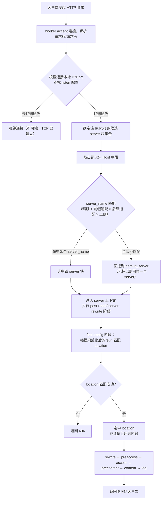
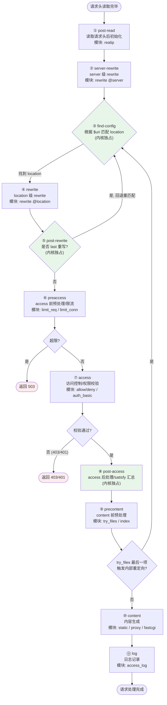
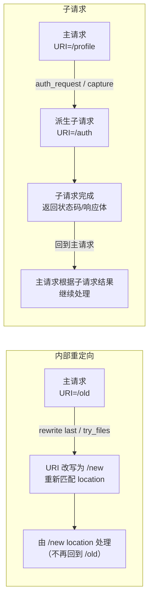

# 06 - 请求处理流程详解

> 版本基线：Nginx 1.30.4 (stable) | 创建日期：2026-08-05
> 受众：后端开发熟手（熟悉 Python/Java/Lua），但服务器运维是小白。操作系统概念会顺带讲清。

---

## 学习目标

学完本篇，你应当能在脑海中完整复现"一个 HTTP 请求从进入 Nginx 到返回响应"的全过程。具体来说：

- 理解 Nginx **请求路由决策**的完整链路：客户端请求 → IP:Port 匹配 `listen` → Host 头匹配 `server_name` → 选中 server 块 → 匹配 location → 处理请求。
- 掌握 `listen` 指令的语法、IP:Port 匹配规则，以及 `default_server` 的作用。
- 掌握 `server_name` 的四种匹配方式（精确 / 前缀通配符 / 后缀通配符 / 正则）及其优先级顺序，理解 `server_name ""` 的特殊含义。
- 理解 Nginx 把 HTTP 请求处理划分为 **11 个阶段（phase）** 的设计，知道每个阶段能做什么、哪些模块在此阶段工作。
- 区分**内部重定向**与**子请求**两个概念，理解 `$uri` 在内部跳转后为什么会变化。
- 避开常见的配置踩坑（`#1.6 $uri 变化`、`#1.7 if is evil`）。

> **前置知识**：阅读本篇前，建议先完成 [03-进程模型与控制管理](../01-基础认知/03-进程模型与控制管理.md)，理解 master/worker 进程模型与事件驱动机制。

---

## 核心知识点

### 知识点一：请求路由决策全流程

当 Nginx 的 worker 进程通过事件循环（epoll/kqueue）接收到一个客户端 TCP 连接后，它会按 HTTP 协议解析请求行和请求头，然后走一条**固定的路由决策链路**来决定"这个请求交给谁处理"。整条链路如下：

```
客户端请求 → ① IP:Port 匹配 listen → ② Host 头匹配 server_name → 选中 server 块
          → ③ 匹配 location → ④ 进入 11 阶段处理 → 返回响应
```

下面逐步说明每一步。

#### 第一步：IP:Port 匹配 listen

Nginx 启动时，master 进程会为配置中所有 `listen` 指令创建监听 socket（`bind` + `listen`）。一个客户端连接到达时，内核已经通过 TCP 四元组确定了它是发给哪个 IP:Port 的。worker 进程 `accept` 这个连接后，Nginx 根据**连接的本地地址（local address）**去查找对应的监听配置，从而确定一组候选的 server 块。

- 一个 `listen 80` 可能对应多个 server 块（虚拟主机）。
- 一个 `listen 80` 和一个 `listen 8080` 是两套不同的候选集合。

> **特例**：如果一个 IP:Port 上有多个 server 块，但没有任何一个匹配 Host 头，Nginx 会使用该 IP:Port 上标记了 `default_server` 的那个 server 块；若都没标记，则用**第一个**监听该 IP:Port 的 server 块作为默认。

#### 第二步：Host 头匹配 server_name

确定了候选 server 集合后，Nginx 取出请求头中的 `Host` 字段，与每个 server 块的 `server_name` 进行匹配。匹配按优先级顺序进行（详见知识点三）：

1. 精确名称匹配
2. 前缀通配符匹配（`*.example.org`）
3. 后缀通配符匹配（`mail.*`）
4. 正则表达式匹配（`~^www\d+\.example\.com$`）

第一个命中的 server 块被选中。如果全部不匹配，则回退到 `default_server`。

> **特例**：HTTP/1.0 请求可能没有 Host 头。此时 `$host` 会被设为 `server_name` 的值或监听的 IP，匹配逻辑同样会回退到默认 server。另外，如果请求的 Host 头带了端口号（如 `example.com:8080`），Nginx 会自动剥掉端口号再做匹配。

#### 第三步：选中 server 块

一旦 server 块确定，请求的配置上下文就确定了——`root`、`index`、`access_log`、各种 `proxy_set_header` 等在 server 层级定义的指令都会被继承到请求中。接下来进入 location 匹配。

#### 第四步：匹配 location

Nginx 根据规范化后的请求 URI（`$uri`，已解码、已合并 `//`、已去掉查询参数）在选中的 server 块内匹配 `location`。location 匹配有独立的优先级规则（精确 `=` > 前缀 `^~` > 正则 `~`/`~*` > 普通前缀），这部分将在 [07-location匹配规则](07-location匹配规则.md) 详解。

> **特例**：location 匹配发生在 **find-config 阶段**（11 个阶段中的第 3 个），而不是在路由决策的"前置阶段"。这意味着 server 选定后，请求会先进入 post-read、server-rewrite 阶段，之后才做 location 匹配。server 级的 rewrite 可以改变 `$uri`，从而影响后续 location 匹配的结果。

#### 第五步：处理请求

location 选定后，请求继续走完剩余的阶段（rewrite → preaccess → access → precontent → content → log），最终在 content 阶段生成响应内容（读静态文件 / proxy_pass / fastcgi_pass 等），并由 log 阶段记录访问日志。

#### 完整路由决策流程图



---

### 知识点二：listen 指令详解

`listen` 指令决定 Nginx 在哪些地址和端口上监听连接。它只能出现在 `server` 块中。如果 server 块没有写 `listen`，Nginx 会使用默认值 `listen *:80`（超级用户权限下）或 `listen *:8080`。

#### 语法

```nginx
# 完整语法（节选常用参数）
listen address[:port] [default_server] [ssl] [http2] [quic]
      [backlog=number] [rcvbuf=size] [sndbuf=size]
      [deferred] [bind] [ipv6only=on|off] [reuseport]
      [so_keepalive=on|off|[keepidle]:[keepintvl]:[keepcnt]];

# 只指定端口（监听所有地址）
listen port [default_server] [ssl] [http2] [quic] ...;

# 监听 Unix 域 socket
listen unix:path [default_server] [ssl] [http2] [quic] ...;
```

#### IP:Port 匹配规则

Nginx 在内部用一个哈希表（`ngx_http_listen_ports`）管理所有监听端口。匹配逻辑：

1. 先按**端口**分组。
2. 同一端口下，再按**地址**精确匹配。优先匹配具体 IP 地址的监听，其次匹配通配地址（`*:80` 或 `0.0.0.0:80`）。
3. 同一 IP:Port 上可以有多个 server 块（虚拟主机），它们组成一个候选列表，等待 `server_name` 进一步筛选。

> **特例**：如果同时配置了 `listen 192.168.1.10:80`（具体 IP）和 `listen 80`（通配地址），来自 `192.168.1.10` 的请求会优先匹配到具体 IP 的那组 server 块，而不会落到通配组。这与操作系统的 `bind` 行为一致——更具体的地址优先。

#### default_server 的作用

当一个请求的 Host 头在该 IP:Port 上的所有 server 块中都匹配失败时，Nginx 会使用标记了 `default_server` 的 server 块来处理。每个 IP:Port 上**只能有一个** `default_server`。

如果没有显式标记 `default_server`，Nginx 会把该 IP:Port 上**第一个** server 块当作默认。

#### IPv4 / IPv6 监听

- `listen 80;` 监听 IPv4 所有地址（`0.0.0.0:80`）。
- `listen [::]:80;` 监听 IPv6 所有地址。在大多数系统上，由于默认开启 `IPV6_V6ONLY=0`（双栈），它会**同时接受 IPv4 和 IPv6 连接**。
- `listen [::]:80 ipv6only=on;` 则只监听 IPv6，不接收 IPv4。

> **特例**：同时写 `listen 80;` 和 `listen [::]:80;` 在某些双栈系统上会触发 `bind() to 0.0.0.0:80 failed (98: Address already in use)` 错误，因为 IPv6 通配已经占用了 IPv4。解决办法是只写 `listen [::]:80;`（依赖双栈），或给 IPv6 加 `ipv6only=on`。

#### 代码示例

```nginx
http {
    # ---------- 80 端口：三个虚拟主机 ----------
    server {
        listen 80;                      # 监听所有 IPv4 地址的 80 端口
        # 因为是第一个 server 块，自动成为 80 端口的默认 server
        server_name www.example.com;
        return 200 "www server\n";
    }

    server {
        listen 80;                      # 同一 IP:Port 上的第二个虚拟主机
        server_name api.example.com;
        return 200 "api server\n";
    }

    server {
        listen 80 default_server;       # 显式标记为默认 server
        # 当 Host 头匹配不到 www/api 时，请求落到这里
        server_name _;                  # "_" 是无效主机名，永远不会被 Host 匹配
        return 444;                     # 444 = 直接关闭连接，不返回响应
    }

    # ---------- 只监听特定 IP ----------
    server {
        listen 192.168.1.10:8080;       # 只监听 192.168.1.10 的 8080 端口
        server_name internal.example.com;
        # 来自其他 IP 的请求根本不会到达这个 server
        return 200 "internal server\n";
    }

    # ---------- IPv6 ----------
    server {
        listen [::]:80;                 # 监听 IPv6 所有地址（双栈下也含 IPv4）
        server_name ipv6.example.com;
        return 200 "ipv6 server\n";
    }

    # ---------- HTTPS（TLS）----------
    server {
        listen 443 ssl;                 # 443 端口 + 启用 SSL/TLS
        http2 on;                       # 1.25.1+ 用独立指令开启 HTTP/2
        server_name secure.example.com;

        ssl_certificate     /etc/nginx/ssl/fullchain.crt;
        ssl_certificate_key /etc/nginx/ssl/server.key;
        return 200 "https server\n";
    }
}
```

> **版本提示**：自 Nginx 1.25.1 起，HTTP/2 不再通过 `listen 443 ssl http2` 参数启用，而是用独立的 `http2 on;` 指令。旧写法仍兼容但会告警（见踩坑 `#4.6`）。HTTP/3（QUIC）则通过 `listen 443 quic reuseport;` 启用。

---

### 知识点三：server_name 匹配规则

`server_name` 指令用于在同一个 IP:Port 上区分不同的虚拟主机。它支持四种匹配方式，Nginx 按固定优先级顺序依次尝试。

#### 1. 精确名称匹配（最高优先级）

```nginx
server {
    listen 80;
    server_name example.com;        # 精确匹配，Host 必须完全等于 example.com
}
```

Nginx 把所有精确名称存入哈希表，查找复杂度 O(1)，性能最好。生产环境应尽量使用精确名称。

#### 2. 前缀通配符匹配

以 `*` 开头的通配符，匹配任意子域名前缀：

```nginx
server {
    listen 80;
    server_name *.example.com;      # 匹配 www.example.com、a.b.example.com 等
    # 注意：不匹配 example.com 本身（* 至少要匹配一段）
}
```

#### 3. 后缀通配符匹配

以 `*` 结尾的通配符，匹配任意后缀：

```nginx
server {
    listen 80;
    server_name mail.*;             # 匹配 mail.example.com、mail.org 等
    # * 只在最后一段，且至少匹配一段（不匹配 mail 本身）
}
```

> **特例**：通配符只能在名称的**开头或结尾**出现一次，不能在中间。`www.*.com`、`*example*` 都是非法的。如果通配符名称前有点号（如 `.example.org`），它既匹配 `example.org` 也匹配 `*.example.org`，这是特殊写法。

#### 4. 正则表达式匹配（最低优先级）

以 `~` 开头表示正则匹配，`~*` 表示不区分大小写的正则：

```nginx
server {
    listen 80;
    server_name ~^www\d+\.example\.com$;   # 匹配 www1.example.com、www2.example.com
    # 正则必须以 ^ 开头、$ 结尾来锚定，否则可能误匹配
}
```

正则匹配按 server 块在配置文件中出现的**顺序**依次尝试，第一个命中的即被选中。正则匹配性能不如哈希查找，且可读性差，应尽量避免。

#### 匹配优先级顺序

Nginx 严格按以下顺序匹配，一旦在某一层命中就不再往下走：

```
精确名称  >  前缀通配符(*.xxx)  >  后缀通配符(xxx.*)  >  正则(~)  >  默认 server
```

> **特例**：通配符之间的"前缀"与"后缀"不是按出现顺序，而是按类型分层。前缀通配符整体优先于后缀通配符。同类型内，更长的通配符优先。

#### server_name "" 的含义

```nginx
server {
    listen 80;
    server_name "";                 # 匹配没有 Host 头的请求（HTTP/1.0 或畸形请求）
    return 444;
}
```

`server_name ""` 设置一个空名称，它**不会**匹配任何正常的 Host 头，但会匹配 Host 头缺失的请求。注意：在 0.8.48 版本以后，`server_name` 的默认值就是 `""`，所以不写 `server_name` 等价于写 `server_name ""`。

#### 代码示例（逐行说明）

```nginx
http {
    # ====== 优先级 1：精确匹配 ======
    server {
        listen 80;
        server_name www.example.com;       # Host=www.example.com 精确命中
        root /var/www/www;
    }

    # ====== 优先级 2：前缀通配符 ======
    server {
        listen 80;
        server_name *.example.com;         # Host=api.example.com、test.example.com 命中
        # 注意：www.example.com 已被上面的精确匹配抢走，不会到这
        root /var/www/wildcard;
    }

    # ====== 优先级 3：后缀通配符 ======
    server {
        listen 80;
        server_name www.*;                 # Host=www.example.org、www.other.cn 命中
        # 只有 www.example.com 之外的 www.xxx 才会落到这里
        root /var/www/www-any;
    }

    # ====== 优先级 4：正则匹配 ======
    server {
        listen 80;
        server_name ~^(?<user>.+)\.example\.com$;  # 命中 xxx.example.com
        # 用 (?<name>...) 捕获，后续可用 $user 变量引用
        # 注意：www.example.com、api.example.com 已被更高优先级抢走
        root /var/www/users/$user;
    }

    # ====== 默认 server ======
    server {
        listen 80 default_server;          # 以上都不匹配时，请求落到这里
        server_name _;                     # "_" 永不匹配，纯粹占位
        return 444;                        # 直接断开连接，拒绝非法 Host
    }

    # ====== 空 server_name：匹配无 Host 头的请求 ======
    server {
        listen 80;
        server_name "";                    # 匹配 HTTP/1.0 无 Host 头的请求
        return 444;
    }
}
```

> **生产建议**：优先使用精确名称（哈希查找，O(1)）；通配符次之；正则尽量不用。一定要配置 `default_server` 并返回 444 或 421，防止别人把垃圾域名解析到你的 IP 上"蹭"你的 server（俗称"虚拟主机劫持"）。

---

### 知识点四：HTTP 请求处理的 11 个阶段

路由决策（listen → server_name → location）解决的是"请求交给哪个 location"的问题。但选定 location 后，请求还要经过一系列**处理阶段（phase）**才能完成。Nginx 把整个 HTTP 请求处理流程拆分成 **11 个有序的阶段**，每个阶段挂载若干模块的 handler，按阶段顺序依次执行。

这个设计的好处是：**模块解耦**。`limit_req`、`access`、`rewrite`、`proxy` 等模块不需要互相调用，只需要"注册"到对应的阶段，Nginx 引擎会按顺序调度。理解了阶段顺序，你就能预判一条指令到底在什么时机生效。

> **核心心智模型**：阶段是"容器"，模块是"内容"。同一阶段内的多个模块按 `ngx_modules` 数组顺序执行；不同阶段严格按编号 1→11 执行。

#### 11 个阶段总览

| 序号 | 阶段名 | 内部常量 | 职责一句话 | 典型模块/指令 |
|------|--------|----------|-----------|---------------|
| 1 | post-read | `NGX_HTTP_POST_READ_PHASE` | 读取完请求头后的初始化 | `ngx_http_realip`（realip） |
| 2 | server-rewrite | `NGX_HTTP_SERVER_REWRITE_PHASE` | server 级 rewrite（在 location 匹配前） | `ngx_http_rewrite`（rewrite @server） |
| 3 | find-config | `NGX_HTTP_FIND_CONFIG_PHASE` | 根据 `$uri` 匹配 location | 内核核心（`ngx_http_core_find_location`） |
| 4 | rewrite | `NGX_HTTP_REWRITE_PHASE` | location 级 rewrite | `ngx_http_rewrite`（rewrite @location） |
| 5 | post-rewrite | `NGX_HTTP_POST_REWRITE_PHASE` | rewrite 后处理（检测是否需要重做 location 匹配） | 内核核心 |
| 6 | preaccess | `NGX_HTTP_PREACCESS_PHASE` | access 前的预处理（限流等） | `ngx_http_limit_req`、`ngx_http_limit_conn` |
| 7 | access | `NGX_HTTP_ACCESS_PHASE` | 访问控制（权限校验） | `ngx_http_access`（allow/deny）、`ngx_http_auth_basic` |
| 8 | post-access | `NGX_HTTP_POST_ACCESS_PHASE` | access 后处理（处理 access 阶段的 deny 结果） | 内核核心 |
| 9 | precontent | `NGX_HTTP_PRECONTENT_PHASE` | content 前预处理（try_files 等） | `ngx_http_try_files`、`ngx_http_index`、`ngx_http_autoindex` |
| 10 | content | `NGX_HTTP_CONTENT_PHASE` | 内容生成（产生响应体） | `ngx_http_static`、`ngx_http_proxy`、`ngx_http_fastcgi` |
| 11 | log | `NGX_HTTP_LOG_PHASE` | 日志记录（响应已发给客户端后） | `ngx_http_log`（access_log） |

#### 各阶段详解

**1. post-read（读取请求头后）**

请求头读取完毕后立即执行，是第一个阶段。此时 `$uri`、`$args` 等变量已就绪。此阶段主要用于在一切处理之前"修正"请求信息。最典型的模块是 `realip`——当 Nginx 前面还有一层负载均衡（如 LVS/HAProxy/云 SLB）时，`$remote_addr` 是 LB 的 IP 而非真实客户端 IP，`realip` 模块在此阶段读取 `X-Forwarded-For`/`X-Real-IP` 并把 `$remote_addr` 改写为真实客户端 IP。

```nginx
# 设置可信代理，从此阶段的 XFF 头中提取真实 IP
set_real_ip_from 10.0.0.0/8;        # 信任来自 10.x.x.x 的代理
set_real_ip_from 172.16.0.0/12;     # 信任来自 172.16-31.x.x 的代理
real_ip_header X-Forwarded-For;     # 从哪个头读取真实 IP
real_ip_recursive on;               # 从 XFF 链尾端递归剥离可信代理 IP
```

> **特例**：post-read 阶段在 location 匹配之前就执行，所以它用的是 **server 级**的配置，而非 location 级。realip 模块的指令通常写在 `http` 或 `server` 块。

**2. server-rewrite（server 级 rewrite）**

此阶段执行 `server` 块内、`location` 块外的 `rewrite`、`set` 等指令。它发生在 location 匹配**之前**，因此这里改写 `$uri` 会直接影响后续 find-config 阶段匹配到哪个 location。

```nginx
server {
    listen 80;
    server_name www.example.com;

    # server 级 rewrite：在 location 匹配前执行
    if ($host = 'www.example.com') {
        rewrite ^/(.*)$ http://example.com/$1 permanent;
    }
    # 注意：这里的 if 是安全的（只做 return/rewrite），详见踩坑 #1.7
}
```

> **特例**：虽然 `if` 在 location 内"是邪恶的"，但在 server 级做 `return`/`rewrite ... last` 是安全的。这是 Nginx 官方认可的少数 if 用法。

**3. find-config（查找 location）**

这是唯一一个**不可被模块注册**的阶段——它由 Nginx 内核独占执行。内核根据当前的 `$uri` 在选中 server 块的 location 列表中做匹配，找到后把请求的 `loc_conf`（location 级配置）切换到该 location 的配置。

此阶段本身不产生任何输出，但它决定了后续 rewrite/access/content 阶段使用哪套 location 配置。注意：如果后续的 rewrite 改变了 `$uri`，post-rewrite 阶段会让请求**重新回到 find-config**再做一次 location 匹配（即"内部重定向"）。

**4. rewrite（location 级 rewrite）**

此阶段执行 `location` 块内的 `rewrite`、`set`、`if` 等 rewrite 模块指令。这是 rewrite 模块的"主战场"。

```nginx
location /download/ {
    # location 级 rewrite：在当前 location 内改写 $uri
    rewrite ^/download/(.*)$ /files/$1 break;   # break = 停止 rewrite，留在当前 location
    root /data;
}
```

> **特例**：`rewrite ... last` 与 `rewrite ... break` 的区别就在这个阶段体现——`last` 会触发 post-rewrite 重新走 find-config，`break` 则停在当前 location。详见踩坑 `#1.5`。

**5. post-rewrite（rewrite 后处理）**

此阶段也是内核独占，不可被模块注册。它的核心职责是：**检测 rewrite 阶段是否产生了"需要重新匹配 location"的信号**（即 `last` 标志）。如果有，则把请求"回退"到 find-config 阶段重新匹配 location；如果没有，则继续往下走。

这个"回退"机制就是**内部重定向**的实现基础。为防止无限循环，Nginx 限制最多重新匹配 **10 次**，超过则返回 500。

**6. preaccess（access 前预处理）**

此阶段在访问控制之前做"预处理"，最典型的是**限流**。`limit_req`（请求限流）和 `limit_conn`（连接限流）都注册在此阶段。这样限流判断发生在权限校验和内容生成之前，能有效保护后端。

```nginx
http {
    # 定义限流 key 和速率（每秒 10 个请求）
    limit_req_zone $binary_remote_addr zone=req_limit:10m rate=10r/s;

    server {
        location /api/ {
            # preaccess 阶段：突发允许 20 个排队，不延迟
            limit_req zone=req_limit burst=20 nodelay;
            proxy_pass http://backend;
        }
    }
}
```

> **特例**：`limit_conn` 也在此阶段，但限制的是并发连接数而非请求速率。preaccess 阶段的模块如果判定超限，可以直接返回 503，请求不会继续进入 access/content 阶段。

**7. access（访问控制）**

此阶段做权限校验：`allow`/`deny`（基于 IP）、`auth_basic`（HTTP 基础认证）、`auth_request`（子请求鉴权）等。如果此阶段任何模块返回 403/401，请求终止。

```nginx
location /admin/ {
    # access 阶段：基于 IP 的访问控制
    allow 192.168.1.0/24;      # 允许内网
    allow 10.0.0.0/8;
    deny all;                   # 拒绝其他所有人

    # access 阶段：HTTP 基础认证
    auth_basic "Admin Area";
    auth_basic_user_file /etc/nginx/.htpasswd;

    proxy_pass http://backend;
}
```

> **特例**：access 阶段的多个模块按顺序执行，先 allow/deny，再 auth_basic。如果 allow/deny 已经 deny，auth_basic 不会执行。`satisfy any` 指令可以改变"全部通过"为"任一通过即可"。

**8. post-access（access 后处理）**

此阶段由内核处理 access 阶段的遗留逻辑。最常见的是配合 `satisfy` 指令：当 `satisfy any` 时，只要 access 阶段有一个模块通过即可放行，post-access 负责汇总判断。如果 access 阶段返回了 deny 且 satisfy 条件不满足，post-access 会在此处终止请求并返回 403。

**9. precontent（content 前预处理）**

此阶段在真正生成内容之前做"预处理"。最典型的是 `try_files`——它按顺序检查文件是否存在，不存在则内部重定向到最后一项。`index`（默认首页查找）和 `autoindex`（目录列表）也注册在此阶段。

```nginx
location / {
    # precontent 阶段：try_files 按序尝试
    try_files $uri $uri/ /index.html;
    # 含义：先找 $uri 文件 → 再找 $uri/ 目录 → 都没有则内部重定向到 /index.html
}
```

> **特例**：`try_files` 的最后一项会触发**内部重定向**（回到 find-config 重新匹配 location），而不是当作文件路径。这是 SPA 前端路由的核心配置。详见知识点五。

**10. content（内容生成）**

这是最核心的阶段——真正产生响应体内容。每个请求只会由**一个** content handler 处理（先注册的优先）。典型模块：

- `ngx_http_static`：读静态文件返回（默认的 content handler）
- `ngx_http_proxy`：`proxy_pass` 反向代理
- `ngx_http_fastcgi`：`fastcgi_pass`（PHP-FPM 等）
- `ngx_http_autoindex`：目录列表
- `return`/`echo` 等也会注册 content handler

```nginx
location /api/ {
    # content 阶段：proxy_pass 注册的 handler 把请求转发给后端
    proxy_pass http://backend;
}

location /static/ {
    # content 阶段：默认 static handler 读取磁盘文件
    root /var/www/static;
}
```

> **特例**：如果一个 location 同时有 `proxy_pass` 和 `try_files`，`try_files` 在 precontent 阶段先执行。只有 try_files 全部"未命中"（走到最后一项触发内部重定向）后，才会到 content 阶段执行 proxy_pass。如果 try_files 中途命中了某个文件，则直接由 static handler 返回，proxy_pass 根本不会执行。这是很多"proxy_pass 不生效"问题的根源。

**11. log（日志记录）**

最后一个阶段，在响应已经发给客户端之后执行。`access_log` 指令注册的 `ngx_http_log` 模块在此阶段写访问日志。此阶段即使出错也不会影响已返回的响应。

```nginx
http {
    log_format main '$remote_addr - $remote_user [$time_local] '
                    '"$request" $status $body_bytes_sent '
                    '"$http_referer" "$http_user_agent"';

    server {
        access_log /var/log/nginx/access.log main;   # log 阶段写入
    }
}
```

> **特例**：log 阶段是"尽力而为"的——如果日志文件写入失败（磁盘满等），Nginx 不会回滚已发送的响应，只会记一条 error 日志。可以设置 `access_log off;` 关闭特定 location 的日志。

#### 11 个阶段执行流程图



> **理解阶段的意义**：后续学习 `rewrite`（阶段 2/4/5）、`limit_req`（阶段 6）、`access`（阶段 7）、`try_files`（阶段 9）、`proxy_pass`（阶段 10）时，知道它们各自挂在哪个阶段，就能准确预判执行顺序和相互影响。这是 Nginx 高阶配置的核心认知。

---

### 知识点五：内部重定向

#### 什么是内部重定向

**内部重定向（internal redirect）**是指 Nginx 在处理请求的过程中，**改变 `$uri` 并重新进行 location 匹配**的机制。它完全发生在 Nginx 内部，对客户端透明——客户端只发了一个请求，也只收到一个响应，URL 浏览器地址栏不会变化（区别于 301/302 外部重定向）。

能触发内部重定向的指令有三个：

1. **`rewrite ... last`**：改写 URI 后，用新 URI 重新匹配 location。
2. **`try_files`**：当前面所有项都不存在时，最后一项作为新 URI 触发内部重定向。
3. **`index`**：当请求是一个目录时，追加 index 文件名，触发内部重定向到该文件。

#### 内部重定向后 $uri 的变化

这是最容易踩坑的地方：**内部重定向会改变 `$uri`**，而 `$request_uri` 始终不变。

| 变量 | 含义 | 内部重定向后是否变化 |
|------|------|---------------------|
| `$uri` | 当前规范化后的请求 URI（不含参数） | **会变**（变成重定向后的新路径） |
| `$request_uri` | 原始请求 URI（含查询参数） | **不变**（始终是客户端发来的原始值） |

看一个具体例子：

```nginx
server {
    listen 80;
    root /var/www;

    location / {
        # try_files 最后一项 /index.php 触发内部重定向
        try_files $uri $uri/ /index.php?$query_string;
        # 假设请求 GET /article/123
        # 第 1 次：$uri = /article/123，文件不存在
        # 第 2 次：$uri = /article/123/，目录不存在
        # 第 3 次：内部重定向到 /index.php?...
    }

    location ~ \.php$ {
        # 内部重定向后 $uri 已经变成 /index.php（不再是 /article/123）
        fastcgi_pass unix:/var/run/php-fpm.sock;
        # ❌ 如果这里用 $uri 传给 PHP，PHP 拿到的是 /index.php 而非 /article/123
        # ✅ 需要原始路径时应使用 $request_uri
        fastcgi_param REQUEST_URI $request_uri;
    }
}
```

上面的例子就是经典的踩坑场景 `#1.6`：在 `try_files` 之后，`$uri` 已经被改写成了 `/index.php`，如果用它传给后端做路由参数，PHP/后端会拿到错误的路径。

> **引用踩坑 [#1.6 $uri 在内部跳转后被改写](../99-踩坑记录与解决方案.md#16-uri-在内部跳转后被改写)**：`$uri` 会随 rewrite/try_files 内部跳转而**变化**，而 `$request_uri` 始终是原始值。需要原始路径时务必用 `$request_uri`。

```nginx
# ❌ 危险：$uri 可能已被 try_files 改写为 /index.php
try_files $uri /index.php?$uri;

# ✅ 正确：用 $request_uri 保留原始路径
try_files $uri /index.php?$request_uri;
# 或直接用 $query_string / $args 保留查询参数
```

#### 内部重定向的循环保护

由于内部重定向会让请求"回到 find-config 重新匹配 location"，而新的 location 可能再次触发 rewrite/try_files，理论上可能死循环。Nginx 限制最多 **10 次**内部重定向，超过后返回 500 Internal Server Error。

```nginx
# ❌ 死循环示例（会触发 500）
location /a {
    rewrite ^ /b last;     # /a → 重定向到 /b
}
location /b {
    rewrite ^ /a last;     # /b → 重定向到 /a → 无限循环 → 500
}
```

> **特例**：`rewrite ... break` 不会触发内部重定向（它停在当前 location），所以不会产生循环。这也是 break 和 last 的关键区别（踩坑 `#1.5`）。

---

### 知识点六：子请求（subrequest）

#### 什么是子请求

**子请求（subrequest）**是 Nginx 内部的一种机制：在处理一个请求的过程中，**派生出一个或多个"子请求"**去访问其他 location，然后把子请求的响应合并或作为中间结果使用。子请求和原始请求共享连接，但对客户端来说仍然是"一个请求一个响应"。

子请求与内部重定向的关键区别：

| 维度 | 内部重定向 | 子请求 |
|------|-----------|--------|
| 请求数量 | 1 个（URI 被替换，重新匹配 location） | 1 个主请求 + N 个子请求 |
| 控制流 | "跳转"到新 location，不回来 | 子请求完成后**回到**主请求继续处理 |
| `$uri` | 被改写 | 主请求的 `$uri` 不变 |
| 触发方式 | rewrite last / try_files / index | `auth_request` / SSI / `ngx.location.capture` |
| 典型场景 | SPA 路由回退、URL 美化 | 鉴权、聚合多个接口、SSI 包含 |

#### 内置的子请求用法：auth_request

Nginx 内置的 `ngx_http_auth_request` 模块就是基于子请求实现的：在 access 阶段，它派发一个子请求到指定 location，根据子请求的响应状态码决定是否放行主请求。

```nginx
server {
    location /protected/ {
        # access 阶段：派发子请求到 /auth
        auth_request /auth;
        proxy_pass http://backend;
    }

    # 子请求的目标 location
    location = /auth {
        internal;              # internal 标记：只允许内部访问，外部直接访问返回 404
        proxy_pass http://auth-service/validate;
        proxy_pass_request_body off;          # 不转发主请求的 body
        proxy_set_header Content-Length "";
        proxy_set_header X-Original-URI $request_uri;  # 把原始 URI 传给鉴权服务
    }
}
```

上面例子中，访问 `/protected/xxx` 时，Nginx 会先发一个子请求到 `/auth`，如果鉴权服务返回 2xx 则放行，返回 401/403 则拒绝主请求。

#### OpenResty 中的 ngx.location.capture

在 OpenResty（带 LuaJIT 的 Nginx 发行版）中，可以用 `ngx.location.capture` 发起子请求，实现接口聚合：

```nginx
# Nginx 配置：定义两个内部 location
location = /internal/user {
    internal;
    proxy_pass http://user-service;
}
location = /internal/orders {
    internal;
    proxy_pass http://order-service;
}

location /api/profile {
    content_by_lua_block {
        -- 发起两个子请求，并行获取用户信息和订单
        local res1, res2 = ngx.location.capture_multi{
            { "/internal/user" },
            { "/internal/orders" }
        }
        -- 合并两个子请求的响应返回给客户端
        ngx.say("user: ", res1.body)
        ngx.say("orders: ", res2.body)
    }
}
```

> **特例**：子请求共享主请求的请求头和连接，但可以有独立的 `$uri`、响应状态码和响应体。子请求**不会**产生独立的 TCP 连接（除非它 proxy_pass 到外部后端）。标记了 `internal` 的 location 只能被内部重定向或子请求访问，外部直接访问会返回 404，这是一种安全边界。

#### 内部重定向 vs 子请求（对比总结）



一句话总结：**内部重定向是"跳过去不回来"，子请求是"派出去再回来"**。

---

## 最佳实践

### 1. 虚拟主机配置：始终显式声明 default_server

```nginx
# ✅ 推荐：显式标记 default_server，拒绝非法 Host
server {
    listen 80 default_server;
    server_name _;          # "_" 永不匹配，纯占位
    return 444;             # 直接断开连接
}

server {
    listen 80;
    server_name example.com www.example.com;   # 精确匹配，O(1) 哈希查找
    # ... 正常配置
}
```

避免依赖"第一个 server 块就是默认"的隐式行为——配置文件顺序变化时容易出 bug。

### 2. server_name 用精确名称，避免正则

```nginx
# ✅ 推荐：列出所有需要的精确域名
server_name example.com www.example.com api.example.com;

# ❌ 避免：正则可读性差、性能低、维护困难
# server_name ~^(www|api)\.example\.com$;
```

如果域名很多，用通配符 `*.example.com` 比正则更好。

### 3. 理解阶段顺序，正确组合 try_files 与 proxy_pass

```nginx
# ✅ 典型的前后端分离配置
location / {
    # precontent 阶段：先尝试静态文件
    try_files $uri $uri/ @backend;
    # try_files 命中静态文件 → static handler 直接返回
    # 全部未命中 → 内部重定向到 @backend → content 阶段 proxy_pass
}

location @backend {
    # content 阶段：只有静态文件不存在时才代理到后端
    proxy_pass http://backend;
}
```

### 4. 需要原始路径时用 $request_uri 而非 $uri

```nginx
# ✅ 重定向用 $request_uri（保留原始路径 + 参数）
return 301 https://example.com$request_uri;

# ✅ try_files 回退参数用 $request_uri 或 $args
try_files $uri /index.php?$args;
```

详见踩坑 `#1.6`。

### 5. 不要在 location 中滥用 if

`if` 指令属于 rewrite 模块（阶段 4），在 location 内与 proxy_pass（阶段 10）、try_files（阶段 9）等混合会产生不可预测行为。安全的替代方案：

- 基于变量的条件 → 用 `map`
- 基于文件存在性 → 用 `try_files`
- 基于 Host 的跳转 → 用多个 server 块
- 基于 User-Agent 等的路由 → 用 `error_page` + 命名 location

详见踩坑 `#1.7`。

### 6. 利用 internal 标记保护内部 location

```nginx
# 被 try_files / auth_request / 子请求访问的 location，加 internal
location @fallback {
    internal;               # 外部直接访问返回 404
    proxy_pass http://backend;
}
```

---

## 常见踩坑引用

本篇涉及以下踩坑条目，详细的现象、原因和解决方案见 [99-踩坑记录与解决方案](../99-踩坑记录与解决方案.md)：

| 编号 | 坑点 | 与本篇的关联 |
|------|------|-------------|
| **#1.6** | [$uri 在内部跳转后被改写](../99-踩坑记录与解决方案.md#16-uri-在内部跳转后被改写) | 知识点五：内部重定向后 `$uri` 变成新路径，需原始路径时用 `$request_uri` |
| **#1.7** | [if is evil（在 location 中滥用 if）](../99-踩坑记录与解决方案.md#17-if-is-evil在-location-中滥用-if) | 知识点四：`if` 属于 rewrite 模块（阶段 4），在 location 内与 content 阶段指令混合行为不可预测 |

此外，以下踩坑与本篇的后续学习相关，可提前了解：

| 编号 | 坑点 | 关联阶段 |
|------|------|---------|
| #1.1 | location 匹配优先级陷阱 | find-config（阶段 3） |
| #1.5 | rewrite 的 last 与 break 区别 | rewrite / post-rewrite（阶段 4/5） |
| #1.3 | try_files 误用 / 用 if 判断文件存在 | precontent（阶段 9） |
| #1.4 | proxy_pass 末尾斜杠导致 URI 被改写 | content（阶段 10） |

---

## 小结

本篇是理解 Nginx 内部运作的"骨架"篇。核心要点回顾：

1. **路由决策链路**：`IP:Port 匹配 listen` → `Host 匹配 server_name` → `选中 server` → `匹配 location` → `11 阶段处理`。这条链路是固定的，理解它就能定位"请求为什么走到了错误的 server/location"。

2. **listen**：决定监听地址与端口，`default_server` 兜底未匹配 Host 的请求，IPv4/IPv6 双栈需注意 `bind` 冲突。

3. **server_name**：四种匹配方式按优先级 `精确 > 前缀通配 > 后缀通配 > 正则` 执行。生产用精确名称，配 `default_server` 防劫持。

4. **11 个阶段**：这是 Nginx 模块化的精髓——`post-read → server-rewrite → find-config → rewrite → post-rewrite → preaccess → access → post-access → precontent → content → log`。每个阶段挂载特定模块，按序执行。记住阶段顺序，就能预判 rewrite/limit_req/access/try_files/proxy_pass 的执行时机和相互影响。

5. **内部重定向**：`rewrite last` / `try_files` / `index` 会改变 `$uri` 并重新匹配 location。`$uri` 会变、`$request_uri` 不变（踩坑 `#1.6`）。最多 10 次防死循环。

6. **子请求**：派生子请求访问其他 location 后回到主请求，用于鉴权（`auth_request`）和接口聚合（OpenResty `ngx.location.capture`）。与内部重定向的区别是"派出去再回来"vs"跳过去不回来"。

> **下一篇**：[07-location匹配规则](07-location匹配规则.md)将深入讲解 find-config 阶段（阶段 3）的 location 匹配优先级、`=`/`^~`/`~`/`~*` 的区别与陷阱。
