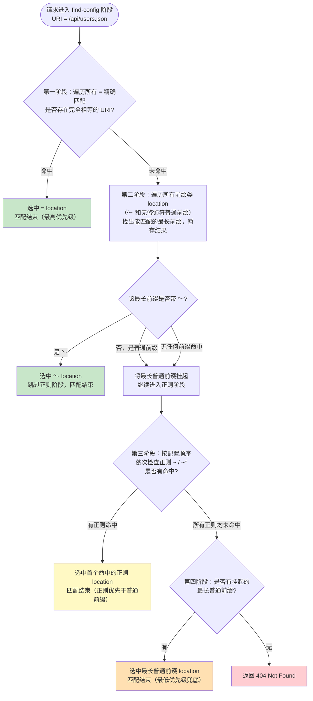

# 07 - location 匹配规则

> 版本基线：Nginx 1.30.4 (stable) | 创建日期：2026-08-05
> 受众：后端开发熟手（熟悉 Python/Java/Lua），但服务器运维是小白。操作系统概念会顺带讲清。

---

## 学习目标

学完本篇，你应当能在拿到一段 Nginx 配置时，准确预判任意一个请求 URL 会命中哪个 `location`，并知道为什么。具体来说：

- 掌握 `location` 指令的**完整语法**：四种修饰符（`=`、`^~`、`~`、`~*`）、无修饰符的普通前缀匹配、`@` 命名 location 各自的语义。
- 牢记 location 匹配的**四级优先级顺序**：精确 `=` > 前缀优先 `^~` > 正则 `~`/`~*` > 普通前缀，并能解释"正则优先于普通前缀"这一最容易踩坑的规则。
- 能用一张 Mermaid 决策流程图复现从精确到正则到普通前缀的完整匹配过程。
- 掌握 `=`、`^~`、`~`/`~*`、`@` 各自的典型应用场景与代码写法。
- 理解 location 嵌套的规则与限制（正则 location 不能嵌套正则 location）。
- 结合 `root`/`alias` 在 location 中的行为，避开路径拼接类踩坑。
- 避开常见的配置踩坑（`#1.1` location 优先级、`#1.2` root vs alias、`#1.4` proxy_pass 正则特例、`#1.8` root 放 location 内）。

> **前置知识**：阅读本篇前，建议先完成 [06-请求处理流程详解](06-请求处理流程详解.md)，理解路由决策链路（`listen` → `server_name` → 选中 server → 匹配 location）以及 find-config 阶段（11 阶段中的第 3 个）的作用。本篇正是对 find-config 阶段的深入展开。

---

## 核心知识点

### 知识点一：location 的语法

`location` 指令用于在选中的 server 块内，根据请求 URI 把请求分发到不同的处理逻辑。它可以出现在 `server` 块和 `location` 块中（即支持嵌套，详见知识点七）。

#### 语法格式

```nginx
location [ = | ^~ | ~ | ~* ] uri { ... }
location @name { ... }
```

拆开看：

- `location`——指令关键字。
- `[ = | ^~ | ~ | ~* ]`——可选的修饰符，决定匹配方式与优先级。不写修饰符就是"普通前缀匹配"。
- `uri`——匹配模式，可以是普通字符串（前缀）或正则表达式（配合 `~`/`~*`）。
- `@name`——命名 location，`@` 开头的标识符，只能被内部跳转访问。
- `{ ... }`——location 体，里面写这个 location 的处理指令。

#### 四种修饰符

Nginx 的 location 匹配有四种带修饰符的写法，外加一种无修饰符的普通前缀匹配，它们的语义和优先级各不相同。

**1. `=` 精确匹配**

要求请求 URI 与模式**完全相等**才算命中。命中后立即停止所有匹配，直接使用该 location。这是最高优先级。

```nginx
# 只有请求恰好是 /favicon.ico 才命中
location = /favicon.ico {
    # 逐行说明：
    # = 表示精确匹配，URI 必须完全等于 /favicon.ico
    # /favicon.ico?abc=123 也能命中（查询参数不影响 location 匹配）
    # /favicon.ico/ 不会命中（多了斜杠，不相等）
    log_not_found off;   # 文件不存在时不记 error 日志
    access_log off;      # 不记访问日志，减少磁盘 IO
    return 204;          # 直接返回 204 No Content
}
```

**2. `^~` 前缀优先匹配**

以指定字符串开头的"前缀匹配"。一旦命中，就**不再继续检查后面的正则 location**。它的优先级高于正则，低于精确 `=`。

```nginx
# 所有以 /static/ 开头的请求命中这里
location ^~ /static/ {
    # 逐行说明：
    # ^~ 表示前缀匹配，且命中后跳过后续正则 location
    # /static/app.js、/static/css/main.css 都会命中
    # 即使后面有 location ~* \.js$，也不会再被它抢走
    root /var/www/static;   # 静态资源根目录
    expires 30d;            # 浏览器缓存 30 天
}
```

**3. `~` 区分大小写的正则匹配**

使用 PCRE 正则表达式匹配请求 URI，区分大小写。多个正则 location 按**配置文件中出现的顺序**依次尝试，第一个命中的即生效。

```nginx
# 匹配以 .php 结尾的请求（区分大小写）
location ~ \.php$ {
    # 逐行说明：
    # ~ 表示正则匹配，区分大小写
    # \.php$ 表示 URI 以 .php 结尾（$ 锚定结尾）
    # /test.php 命中，/test.PHP 不命中（大小写敏感）
    fastcgi_pass unix:/var/run/php-fpm.sock;
    fastcgi_param SCRIPT_FILENAME $document_root$fastcgi_script_name;
    include fastcgi_params;
}
```

**4. `~*` 不区分大小写的正则匹配**

与 `~` 类似，但忽略大小写。常用于匹配文件扩展名（图片、字体等）。

```nginx
# 匹配图片资源（不区分大小写）
location ~* \.(gif|jpg|jpeg|png|ico|svg)$ {
    # 逐行说明：
    # ~* 表示正则匹配，不区分大小写
    # \.(gif|jpg|...)$ 匹配以这些扩展名结尾的 URI
    # /a.PNG、/b.JPG 都能命中（大小写不敏感）
    root /var/www/images;
    expires 7d;
    access_log off;     # 静态资源不打访问日志
}
```

#### 无修饰符：普通前缀匹配

不写任何修饰符，只写一个 URI 字符串，就是普通前缀匹配。它的优先级**最低**——低于所有带修饰符的 location。当多个普通前缀都能匹配时，取**最长前缀**那个。

```nginx
# 普通前缀匹配
location /api {
    # 逐行说明：
    # 没有修饰符，是普通前缀匹配，优先级最低
    # /api、/api/users、/apikey 都能匹配（前缀匹配）
    # 但如果有正则 location 命中，正则会优先于此
    proxy_pass http://backend;
}

location /api/v2 {
    # 同为普通前缀，但前缀更长
    # /api/v2/users 会优先匹配这里（最长前缀优先）
    proxy_pass http://backend_v2;
}
```

> **关键理解**：普通前缀匹配的"最长前缀优先"只在普通前缀之间比较。一旦有正则 location 命中，正则优先于任何普通前缀（哪怕普通前缀更长）。这是踩坑 `#1.1` 的核心，详见知识点二。

#### `@` 命名 location

以 `@` 开头的 location 是"命名 location"，它**不能被外部 URL 直接匹配**，只能通过内部跳转（`error_page`、`try_files`、`rewrite`）访问。

```nginx
location @fallback {
    # 逐行说明：
    # @ 开头，是命名 location，外部直接访问 @fallback 会 404
    # 只能被 try_files、error_page、rewrite 等内部跳转到
    # 常用作"回退"处理逻辑
    proxy_pass http://backend;
}
```

> **特例**：命名 location 的名字是一个标识符（`@` 后跟字母数字下划线），不是 URI 也不是正则。它不参与正常的 location 匹配流程，只有内部跳转显式指名时才会被"跳转"到。命名 location 内部不能再嵌套 location。

#### 修饰符速查表

| 修饰符 | 匹配方式 | 大小写 | 命中后行为 | 优先级 |
|--------|----------|--------|-----------|--------|
| `=` | 精确匹配（完全相等） | — | 立即停止，直接使用 | 1（最高） |
| `^~` | 前缀匹配 | — | 命中后跳过正则 | 2 |
| `~` | 正则匹配 | 区分 | 按配置顺序，首个命中即停 | 3 |
| `~*` | 正则匹配 | 不区分 | 按配置顺序，首个命中即停 | 3 |
| 无 | 普通前缀匹配 | — | 最长前缀优先 | 4（最低） |
| `@name` | 命名 location | — | 不参与外部匹配 | 仅内部跳转 |

> **版本提示**：Nginx 1.30.x 仍沿用上述经典 location 匹配模型。自 1.22 起对正则 location 的错误处理略有优化（正则编译失败时的报错更清晰），但匹配优先级规则从未改变，这是 Nginx 最稳定的核心机制之一。

---

### 知识点二：匹配优先级（最核心知识点）

location 匹配的优先级是 Nginx 配置中**最容易踩坑**的地方。很多人误以为"谁写在前面谁优先"或"更具体（更长）的匹配优先"，实际上 Nginx 有一套固定的四级优先级规则，且正则与普通前缀的优先级关系常常反直觉。

#### 完整优先级顺序

当一个请求进入 find-config 阶段时，Nginx 按以下**固定顺序**逐层匹配：

```
1. = 精确匹配        （最高优先级，命中即停，直接使用）
2. ^~ 前缀匹配        （命中后不再查正则，直接使用）
3. 正则 ~ / ~*       （按配置中出现顺序，首个命中即停）
4. 普通前缀匹配       （最长前缀优先，最低优先级）
```

**关键理解：正则优先于普通前缀（除非用 `^~` 或 `=`）**

这是最反直觉的一点：普通前缀匹配的优先级**最低**，低于正则。也就是说，即使你写了一个很长的普通前缀 `location /api/v2/users/profile`，只要存在一个正则 location（如 `location ~ \.php$`）命中了请求，正则就会"抢走"这个请求。

要保护某个普通前缀不被正则覆盖，必须给它加上 `^~` 修饰符（提升到第 2 级），或者用 `=` 精确匹配（提升到第 1 级）。

> 引用踩坑 [#1.1 location 匹配优先级陷阱](../99-踩坑记录与解决方案.md#11-location-匹配优先级陷阱)：写了多个 location，请求却命中了意料之外的那个。以为 `location /api` 会优先于 `location /`，结果被正则 location 抢走。

#### 匹配过程的精确描述

Nginx 的 location 匹配并不是"从上到下扫一遍"那么简单，而是一个**多阶段决策**过程：

1. **第一阶段：检查精确匹配 `=`**
   遍历所有 `=` location，如果请求 URI 与某个 `=` 模式完全相等，立即选中它，**匹配结束**。

2. **第二阶段：记录最长前缀匹配（含 `^~` 和无修饰符）**
   遍历所有前缀类 location（`^~` 和无修饰符的普通前缀），找出能匹配请求 URI 的、**前缀最长**的那一个，记住它（暂不决定使用）。
   - 如果这个最长前缀 location 带有 `^~` 修饰符，则**立即选中它，跳过正则阶段**，匹配结束。
   - 如果它只是普通前缀（无修饰符），则先"挂起"，进入正则阶段继续检查。

3. **第三阶段：按顺序检查正则 `~` / `~*`**
   按配置文件中出现的**先后顺序**，依次用每个正则 location 去匹配请求 URI。第一个命中的正则 location 被选中，**匹配结束**。
   - 如果没有任何正则命中，则回到第二阶段"挂起"的那个最长普通前缀 location，使用它。

4. **第四阶段：使用最长普通前缀**
   如果前三个阶段都没命中，最终使用第二阶段记录的最长普通前缀 location。如果一个都没有，返回 404。

#### location 匹配决策流程图



> **这张图是本篇的灵魂**。请反复对照：精确 `=` 在最前，普通前缀在最后，正则夹在中间——正则"压"在普通前缀之上，这正是"正则优先于普通前缀"的来源。而 `^~` 是唯一能"挡住"正则的前缀类修饰符。

#### 场景分析：多个 location 同时存在的匹配结果

下面给出一个完整的配置，然后用 6 个请求场景逐一分析命中结果。先把配置看懂：

```nginx
server {
    listen 80;
    server_name example.com;
    root /var/www/html;

    # ① 精确匹配
    location = / {
        return 200 "hit: = / (精确根路径)\n";
    }

    # ② 精确匹配特定文件
    location = /favicon.ico {
        return 204;
    }

    # ③ 前缀优先：保护静态资源前缀
    location ^~ /static/ {
        return 200 "hit: ^~ /static/\n";
    }

    # ④ 正则：匹配图片扩展名（不区分大小写）
    location ~* \.(jpg|png|gif)$ {
        return 200 "hit: ~* images\n";
    }

    # ⑤ 正则：匹配 .php（区分大小写）
    location ~ \.php$ {
        return 200 "hit: ~ php\n";
    }

    # ⑥ 普通前缀
    location /api {
        return 200 "hit: /api (普通前缀)\n";
    }

    # ⑦ 更长的普通前缀
    location /api/v2 {
        return 200 "hit: /api/v2 (更长普通前缀)\n";
    }

    # ⑧ 普通前缀兜底
    location / {
        return 200 "hit: / (普通前缀兜底)\n";
    }
}
```

逐行说明配置：

- ① `location = /`：精确匹配根路径 `/`，只有请求恰好是 `/` 时命中。
- ② `location = /favicon.ico`：精确匹配 favicon，常用于避免它被正则干扰。
- ③ `location ^~ /static/`：前缀优先，命中后跳过正则，保护静态资源。
- ④ `location ~* \.(jpg|png|gif)$`：正则，匹配图片扩展名，不区分大小写。
- ⑤ `location ~ \.php$`：正则，匹配 `.php` 结尾，区分大小写。
- ⑥ `location /api`：普通前缀，优先级最低。
- ⑦ `location /api/v2`：更长的普通前缀，在普通前缀中优先于 ⑥。
- ⑧ `location /`：普通前缀兜底，匹配所有未被更高优先级抢走的请求。

现在逐一分析 6 个请求场景：

**场景 1：请求 `GET /`**

- 第一阶段（`=`）：`location = /` 完全相等 → 命中 ①。
- 结果：命中 ① `= /`。精确匹配最高优先级，立即结束。

**场景 2：请求 `GET /static/logo.png`**

- 第一阶段（`=`）：无精确匹配 `/static/logo.png`。
- 第二阶段（前缀）：最长匹配前缀是 `^~ /static/`（③）。因为它带 `^~`，立即选中，跳过正则。
- 结果：命中 ③ `^~ /static/`。即使正则 ④ `\.(png)$` 也能匹配，但因为 `^~` 命中后不再查正则，所以正则被"挡住"了。这正是 `^~` 的保护作用。

**场景 3：请求 `GET /api/avatar.png`**

- 第一阶段（`=`）：无精确匹配。
- 第二阶段（前缀）：最长匹配前缀是普通前缀 `/api`（⑥，无修饰符）。挂起，进入正则。
- 第三阶段（正则）：④ `~* \.(png)$` 命中（`.png` 结尾）。
- 结果：命中 ④ `~* images`。**注意**：虽然普通前缀 `/api` 也能匹配，但正则优先于普通前缀，所以正则 ④ 抢走了请求。这就是踩坑 `#1.1` 的典型表现——你以为 `/api` 会处理，结果被图片正则截胡。

**场景 4：请求 `GET /api/v2/users`**

- 第一阶段（`=`）：无精确匹配。
- 第二阶段（前缀）：能匹配的前缀有 `/api`（⑥）和 `/api/v2`（⑦）。最长前缀是 `/api/v2`（⑦，普通前缀）。挂起，进入正则。
- 第三阶段（正则）：④ `\.png$` 不匹配，⑤ `\.php$` 不匹配。无正则命中。
- 第四阶段：使用挂起的最长普通前缀 ⑦ `/api/v2`。
- 结果：命中 ⑦ `/api/v2`。这里没有正则干扰，普通前缀按"最长优先"工作。

**场景 5：请求 `GET /api/v2/data.php`**

- 第一阶段（`=`）：无精确匹配。
- 第二阶段（前缀）：最长匹配前缀是 `/api/v2`（⑦，普通前缀）。挂起，进入正则。
- 第三阶段（正则）：⑤ `~ \.php$` 命中（以 `.php` 结尾）。
- 结果：命中 ⑤ `~ php`。即使 `/api/v2` 是更长的普通前缀，正则 ⑤ 仍然优先。若想保护 `/api/v2` 不被 `.php` 正则抢走，应改为 `location ^~ /api/v2`。

**场景 6：请求 `GET /about.html`**

- 第一阶段（`=`）：无精确匹配。
- 第二阶段（前缀）：能匹配的前缀只有 `/`（⑧，普通前缀）。挂起，进入正则。
- 第三阶段（正则）：④ 不匹配（非图片），⑤ 不匹配（非 php）。无正则命中。
- 第四阶段：使用挂起的最长普通前缀 ⑧ `/`。
- 结果：命中 ⑧ `/`（兜底）。

#### 场景命中结果汇总表

| 场景 | 请求 URI | 命中的 location | 命中原因 |
|------|----------|-----------------|----------|
| 1 | `/` | ① `= /` | 精确匹配，最高优先级 |
| 2 | `/static/logo.png` | ③ `^~ /static/` | 前缀优先，命中后跳过正则 |
| 3 | `/api/avatar.png` | ④ `~* images` | 正则优先于普通前缀 `/api` |
| 4 | `/api/v2/users` | ⑦ `/api/v2` | 无正则命中，最长普通前缀生效 |
| 5 | `/api/v2/data.php` | ⑤ `~ php` | 正则优先于更长的普通前缀 `/api/v2` |
| 6 | `/about.html` | ⑧ `/` | 无精确/正则命中，兜底普通前缀 |

#### 特例说明：普通前缀即使更长，只要正则命中，正则也优先

这是 location 匹配中最需要刻进肌肉记忆的规则。看场景 3 和场景 5：

- 场景 3 中，普通前缀 `/api` 能匹配 `/api/avatar.png`，但正则 `\.(png)$` 也命中了，结果是正则胜出。
- 场景 5 中，普通前缀 `/api/v2` 比 `/api` 更长，能匹配 `/api/v2/data.php`，但正则 `\.php$` 命中后照样胜出。

"最长前缀优先"只在**普通前缀之间**比较——它决定的是"如果没有正则命中，用哪个普通前缀"。一旦正则命中，普通前缀（无论多长）都靠边站。

要打破这个规则，只有两种手段：

1. 给前缀加 `^~`：把前缀匹配提升到第 2 级，命中后跳过正则。
2. 用 `=` 精确匹配：提升到第 1 级，直接命中。

> 引用踩坑 [#1.1 location 匹配优先级陷阱](../99-踩坑记录与解决方案.md#11-location-匹配优先级陷阱)：普通前缀即使更长，只要正则命中，正则也优先（除非用 `^~` 或 `=`）。

---

### 知识点三：精确匹配 `=` 的应用场景

精确匹配 `=` 是最高优先级，命中后立即停止一切匹配。它的核心价值是**保证某个特定 URI 一定走指定 location，不被任何正则或前缀干扰**。

#### 典型场景

**1. `location = /favicon.ico` 避免被正则干扰**

浏览器几乎对每个站点都会自动请求 `/favicon.ico`，如果该文件不存在又没特殊处理，会触发一次 404 + error 日志，并可能被 `.ico` 正则 location 错误捕获。用精确匹配可以干净利落地处理它。

```nginx
server {
    listen 80;
    root /var/www/html;

    # 精确匹配 favicon，避免被正则干扰
    location = /favicon.ico {
        # 逐行说明：
        # = 精确匹配，只有恰好 /favicon.ico 命中
        # 即使后面有 location ~* \.ico$，也不会抢走（= 优先级最高）
        log_not_found off;   # 文件不存在时不写 error 日志
        access_log off;      # 不记访问日志，避免日志被 favicon 请求刷屏
        expires 30d;         # 浏览器缓存 30 天，减少重复请求
        try_files /favicon.ico =404;  # 有就返回，没有就 404（不写 error 日志）
    }

    # 假设有这样一个正则，正常会匹配 .ico
    location ~* \.ico$ {
        # /favicon.ico 不会走到这里，因为 = /favicon.ico 优先级更高
        root /var/www/icons;
    }
}
```

**2. `location = /50x.html` 错误页**

当后端出错时，Nginx 默认返回 `/50x.html`。用精确匹配可以确保错误页本身不会被正则（如 `.php`、`.html` 的正则）二次处理，避免错误页请求又触发错误，形成死循环。

```nginx
server {
    listen 80;
    root /var/www/html;

    # 精确匹配错误页
    location = /50x.html {
        # 逐行说明：
        # = 精确匹配 /50x.html
        # 确保错误页只读静态文件，不会被 location ~ \.html$ 之类的正则拦截
        root /usr/share/nginx/html;  # 错误页所在目录
        internal;                    # internal：只允许内部跳转访问，外部直接访问返回 404
    }

    location = /404.html {
        root /usr/share/nginx/html;
        internal;                    # 同样只内部访问
    }

    error_page 500 502 503 504 /50x.html;  # 5xx 内部跳转到 /50x.html
    error_page 404             /404.html;  # 404 内部跳转到 /404.html
}
```

**3. `location = /` 精确匹配根路径**

首页 `/` 是访问量最大的路径之一，用精确匹配可以避免它走兜底的 `location /`，做专门优化（如直接返回缓存内容）。

```nginx
server {
    listen 80;
    root /var/www/html;

    # 精确匹配根路径首页
    location = / {
        # 逐行说明：
        # = 精确匹配，只有恰好 / 命中（/index 或 /home 不会命中）
        index index.html;        # 查找 index.html
        try_files /index.html =404;
    }

    # 普通前缀兜底
    location / {
        try_files $uri $uri/ /index.html;
    }
}
```

> **特例**：精确匹配只比较"路径部分"，查询参数不影响匹配。`/favicon.ico?v=1` 和 `/favicon.ico` 都能命中 `location = /favicon.ico`，因为 location 匹配用的是 `$uri`（不含查询参数）。

---

### 知识点四：前缀优先 `^~` 的应用场景

`^~` 的核心价值是**保护某个前缀不被后面的正则 location 覆盖**。它是唯一能在"前缀类"和"正则类"之间建立屏障的修饰符。

#### 典型场景：保护静态资源前缀

当你有一个静态资源目录 `/static/`，同时又有匹配文件扩展名的正则 location（如 `~* \.(js|css)$`）时，若不加 `^~`，正则会优先于普通前缀 `/static/`，导致静态资源走了正则 location，可能配置不一致。

```nginx
server {
    listen 80;
    root /var/www/html;

    # ✅ 用 ^~ 保护静态资源前缀
    location ^~ /static/ {
        # 逐行说明：
        # ^~ 前缀优先，命中 /static/xxx 后跳过正则
        # /static/app.js 不会走到下面的 ~* \.js$ 正则
        # 保证所有 /static/ 下的资源统一走这套配置
        root /var/www/static;
        expires 30d;
        access_log off;
        add_header Cache-Control "public, immutable";
    }

    # 正则：匹配 js/css（不区分大小写）
    location ~* \.(js|css)$ {
        # 没有 ^~ 保护的话，/static/app.js 会被这里抢走
        # 现在只有非 /static/ 路径下的 js/css 会走到这里
        root /var/www/assets;
        expires 7d;
    }

    location / {
        try_files $uri $uri/ /index.html;
    }
}
```

#### 对比：不加 `^~` 会怎样

```nginx
server {
    listen 80;
    root /var/www/html;

    # ❌ 不加 ^~，普通前缀
    location /static/ {
        root /var/www/static;
        expires 30d;
    }

    # 正则会优先于上面的普通前缀
    location ~* \.js$ {
        # /static/app.js 会被这里抢走！
        # 导致走了 root /var/www/assets，而不是预期的 /var/www/static
        root /var/www/assets;
    }
}
```

> 引用踩坑 [#1.1 location 匹配优先级陷阱](../99-踩坑记录与解决方案.md#11-location-匹配优先级陷阱)：写了 `location /static/` 以为能优先匹配，结果被正则 `~* \.js$` 抢走。用 `^~` 即可解决。

#### `^~` 的其他用法

```nginx
# 保护上传目录不被 .php 正则执行（安全相关）
location ^~ /uploads/ {
    # 逐行说明：
    # ^~ 保护 /uploads/ 前缀，后续正则 location ~ \.php$ 不会抢走
    # 配合嵌套 location 禁止 uploads 下执行 php
    root /var/www/uploads;

    location ~ \.php$ {
        return 403;   # 上传目录禁止执行 PHP
    }
}
```

> **特例**：`^~` 只对"前缀匹配"生效。如果请求根本不以该前缀开头，`^~` 不会触发。另外，`^~` 与 `=` 的区别是：`=` 要求完全相等，`^~` 只要求前缀开头。

---

### 知识点五：正则匹配 `~` 和 `~*`

正则 location 使用 PCRE（Perl Compatible Regular Expressions）库对请求 URI 做正则匹配。它适合"按规则批量匹配"的场景，如按扩展名、按路径模式分发请求。

#### 正则语法要点

Nginx 正则 location 遵循 PCRE 语法，几个常用要点：

- `~` 区分大小写，`~*` 不区分大小写。
- `^` 锚定开头，`$` 锚定结尾。
- `.` 匹配任意字符（除换行），`\.` 匹配字面量点号。
- `()` 捕获组，可用 `$1`、`$2` 引用。
- `[]` 字符集，`[^]` 取反，`|` 表示或。
- 命名捕获：`(?<name>pattern)`，后续用 `$name` 引用。

```nginx
server {
    listen 80;

    # 区分大小写：只匹配小写 .php
    location ~ \.php$ {
        # 逐行说明：
        # ~ 区分大小写正则
        # \.php$：以 .php 结尾
        # /test.php 命中，/test.PHP 不命中
        fastcgi_pass unix:/var/run/php-fpm.sock;
    }

    # 不区分大小写：匹配各种图片扩展名
    location ~* \.(jpg|jpeg|png|gif|webp|svg)$ {
        # 逐行说明：
        # ~* 不区分大小写正则
        # /a.JPG、/b.png、/c.SVG 都能命中
        root /var/www/images;
        expires 7d;
    }

    # 匹配特定路径模式
    location ~ ^/user/(\d+)/profile$ {
        # 逐行说明：
        # ^/user/ 锚定开头
        # (\d+) 捕获一段数字（用户 ID）
        # /profile$ 锚定结尾
        # /user/123/profile 命中，$1 = 123
        # 注意：正则 location 中 proxy_pass 不能带 URI
        proxy_pass http://backend;
        proxy_set_header X-User-Id $1;  # 把捕获的用户 ID 传给后端
    }
}
```

#### 捕获组的使用

正则 location 中的捕获组 `$1`、`$2` 可以在 location 体内引用，常用于把 URL 中的某段传递给后端。

```nginx
server {
    listen 80;

    # 用捕获组提取下载文件名
    location ~ ^/download/(.*)$ {
        # 逐行说明：
        # ^/download/ 锚定开头
        # (.*) 捕获 /download/ 之后的所有内容
        # /download/files/report.pdf → $1 = files/report.pdf
        # 注意：正则 location 中 proxy_pass 不能带 URI（见下方特例）
        root /data/archives;
        # 这里 $1 可用于其他指令，如日志或 header
        add_header X-Requested-File $1;
    }

    # 命名捕获：可读性更好
    location ~ ^/blog/(?<year>\d{4})/(?<month>\d{2})/ {
        # 逐行说明：
        # (?<year>\d{4}) 命名捕获，匹配 4 位年份
        # (?<month>\d{2}) 命名捕获，匹配 2 位月份
        # /blog/2026/08/hello → $year=2026, $month=08
        proxy_pass http://backend;
        proxy_set_header X-Year $year;       # 用命名变量引用
        proxy_set_header X-Month $month;
    }
}
```

#### 特例说明：正则 location 中 proxy_pass 不能带 URI

这是最容易报错的正则 location 规则。当 location 使用正则（`~` 或 `~*`）或命名 location（`@`）时，`proxy_pass` **不能带 URI 部分**（包括尾斜杠），否则 Nginx 启动时会报错。

```nginx
server {
    listen 80;

    # ❌ 错误：正则 location 的 proxy_pass 带 URI 会报错
    location ~ ^/api/(.*)$ {
        # proxy_pass http://backend/$1;   # ❌ 报错："proxy_pass cannot have URI part in location given by regular expression"
        # 原因：正则匹配的 URI 改写规则不确定，Nginx 无法安全地做"前缀替换"
    }

    # ✅ 正确：正则 location 的 proxy_pass 不带 URI
    location ~ ^/api/(.*)$ {
        # 逐行说明：
        # 正则 location 中 proxy_pass 只能写到主机:端口
        # 请求 /api/users 会被原样转发给后端 → 后端收到 /api/users
        proxy_pass http://backend;          # ✅ 不带任何 URI / 斜杠
        proxy_set_header X-Captured-Path $1; # 用捕获组传信息给后端
    }
}
```

> 引用踩坑 [#1.4 proxy_pass 末尾斜杠导致 URI 被改写](../99-踩坑记录与解决方案.md#14-proxy_pass-末尾斜杠导致-uri-被改写)：当 location 使用正则或命名 location 时，proxy_pass **不能**带 URI 部分，否则报错。需要在正则 location 中改写转发路径时，应配合 `rewrite` 指令实现。

如果确实需要在正则 location 中"剥掉前缀"再转发，正确做法是用 `rewrite ... break`：

```nginx
# 正则 location + rewrite 实现前缀剥离
location ~ ^/api/(.*)$ {
    # 逐行说明：
    # 先用 rewrite 把 /api/xxx 改写为 /xxx（break 留在当前 location）
    rewrite ^/api/(.*)$ /$1 break;
    # 现在 $uri 已经是 /xxx，proxy_pass 原样转发
    proxy_pass http://backend;   # 后端收到 /xxx（前缀已被剥掉）
}
```

> **特例**：如果需要在正则 location 中根据捕获组动态选择上游，可以用变量形式的 `proxy_pass http://backend_$1;`（不带路径 URI，只有变量化的主机），这是允许的。

---

### 知识点六：命名 location `@`

命名 location 以 `@` 开头，它**不参与正常的 location 匹配流程**，外部 URL 永远无法直接匹配到它。它只能被以下指令"内部跳转"访问：

- `try_files` 的最后一项
- `error_page` 指定的跳转目标
- `rewrite ... last`（改写为 `@name` 形式时）

#### 典型用法一：try_files 回退到后端

这是命名 location 最常见的用法——当前面的静态文件都不存在时，回退到后端应用处理（如 SPA 路由或动态请求）。

```nginx
server {
    listen 80;
    root /var/www/html;

    location / {
        # 逐行说明：
        # try_files 按顺序尝试：
        # 1. $uri：查找请求对应的文件
        # 2. $uri/：查找请求对应的目录
        # 3. @backend：前两项都不存在时，内部跳转到命名 location @backend
        try_files $uri $uri/ @backend;
    }

    # 命名 location：只能被 try_files / error_page 内部跳转访问
    location @backend {
        # 逐行说明：
        # @backend 是命名 location，外部直接访问 http://example.com/@backend 会 404
        # 只有 try_files 走到最后一项时，才内部跳转到这里
        # 此时 $uri 保持原始值（try_files 内部重定向，$uri 可能变化，详见踩坑 #1.6）
        proxy_pass http://app_server;
        proxy_set_header Host $host;
        proxy_set_header X-Real-IP $remote_addr;
    }
}
```

#### 典型用法二：error_page 错误处理

```nginx
server {
    listen 80;
    root /var/www/html;

    # 定义 5xx 错误时跳转到 @error 命名 location
    error_page 500 502 503 504 @error;

    location / {
        proxy_pass http://backend;
    }

    location @error {
        # 逐行说明：
        # 当后端返回 5xx 错误时，Nginx 内部跳转到 @error
        # 这里可以返回一个友好的错误页，或代理到降级服务
        root /var/www/error;
        try_files /50x.html =502;   # 优先返回自定义错误页，找不到则返回 502
    }
}
```

#### 典型用法三：基于条件的内部跳转（替代 if）

结合 `error_page` + `return` 触发命名 location，可以实现相对安全的条件路由（比在 location 内滥用 `if` 安全）：

```nginx
server {
    listen 80;

    # 用 map 判断是否是爬虫（比 if 安全）
    map $http_user_agent $is_bot {
        default 0;
        ~*bot 1;
    }

    location / {
        # 逐行说明：
        # 如果是爬虫，return 418 触发 error_page → 跳转到 @bot
        # 如果不是爬虫，正常代理到 @app
        error_page 418 = @bot;
        if ($is_bot) {
            return 418;       # if 里只做 return，是安全的（见踩坑 #1.7）
        }
        # 非爬虫走到这里
        proxy_pass http://app_server;
    }

    location @bot {
        # 爬虫请求单独走这套配置
        proxy_pass http://bot_backend;
    }
}
```

> **特例**：命名 location 内部**不能再嵌套 location**（无论何种修饰符）。命名 location 本身是一个"叶子节点"，只能包含处理指令。另外，命名 location 不能被 `internal` 标记（它本身就是"内部访问"语义），但普通 location 可以加 `internal` 来限制只允许内部访问。

#### `@` 命名 location 与 `internal` 普通location 的区别

两者都能实现"只允许内部访问"，但有细微差别：

```nginx
server {
    listen 80;

    # 方式一：命名 location（@开头）
    location @fallback {
        # 只能被 try_files/error_page/rewrite 内部跳转访问
        # 外部无法用任何 URL 匹配到它
        proxy_pass http://backend;
    }

    # 方式二：普通 location + internal 指令
    location /internal-auth {
        internal;          # internal 标记：外部直接访问返回 404
        # 但它可以被外部 URL "/internal-auth" "匹配到"（只是被 internal 拒绝）
        # 命名 location 根本不参与匹配，连"匹配到"这一步都不会发生
        proxy_pass http://auth-service;
    }
}
```

> **选择建议**：纯粹做内部回退用 `@`；需要被 `auth_request` 子请求访问的，用 `internal` 普通 location（因为 `auth_request` 需要一个 URI 路径，而非命名 location）。

---

### 知识点七：location 嵌套

location 可以嵌套 location——即在一个 location 块内部再写 location 块。嵌套的 location 只在父 location 匹配成功后，才会对请求 URI 做"二次匹配"。

#### 嵌套规则

- 父 location 可以是任意类型（`=`、`^~`、`~`、`~*`、普通前缀）。
- 子 location 也可以是任意类型，**但有一个关键限制**：**正则 location 不能嵌套正则 location**。
- 命名 location（`@`）不能嵌套任何 location，也不能被嵌套。

```nginx
server {
    listen 80;
    root /var/www/html;

    # 父 location：前缀匹配
    location /api/ {
        # 逐行说明：
        # 父 location 是普通前缀 /api/
        # 请求 /api/xxx 先命中父 location，再到子 location 做二次匹配

        # 子 location 1：普通前缀（允许）
        location /api/v2/ {
            # 请求 /api/v2/users 命中这里
            proxy_pass http://backend_v2;
        }

        # 子 location 2：精确匹配（允许）
        location = /api/health {
            # 请求恰好 /api/health 命中这里
            return 200 "ok";
        }

        # 子 location 3：正则（允许，父不是正则）
        location ~ \.json$ {
            # /api/users.json 命中这里（父 location 匹配后，正则子 location 抢走）
            proxy_pass http://backend;
        }

        # 子 location 4：默认处理
        proxy_pass http://backend;
    }
}
```

#### 嵌套 location 的匹配过程

当请求进入一个父 location 后，Nginx 会在该父 location 的子 location 中**重新执行一遍完整的 location 匹配流程**（精确 `=` > `^~` > 正则 > 普通前缀）。如果子 location 都不匹配，则使用父 location 的配置。

```nginx
server {
    listen 80;
    root /var/www/html;

    # 父 location：保护 /uploads/ 前缀
    location ^~ /uploads/ {
        # 逐行说明：
        # 父 location 用 ^~ 保护，命中后跳过 server 级正则
        # 然后在子 location 中做二次匹配

        # 子 location：禁止 uploads 下执行 php
        location ~ \.php$ {
            # 请求 /uploads/shell.php 命中这里
            return 403;    # 安全：上传目录禁止执行 PHP
        }

        # 父 location 默认：返回静态文件
        # 请求 /uploads/photo.jpg 不匹配子正则，走父 location
        autoindex off;
        expires 30d;
    }
}
```

> 这个模式是 Nginx 安全配置的经典写法：用 `^~` 锁定上传目录前缀，再用嵌套正则 location 禁止执行脚本，防止上传的文件被当作代码执行（见踩坑 `#3.3`）。

#### 特例说明：正则 location 不能嵌套正则 location

```nginx
server {
    listen 80;

    # ❌ 错误：正则 location 内嵌套正则 location
    location ~ ^/api/ {
        location ~ \.php$ {        # ❌ nginx -t 报错："location cannot be inside the location given by regular expression"
            fastcgi_pass unix:/var/run/php-fpm.sock;
        }
    }

    # ✅ 正确：正则父 location 内只能嵌套非正则子 location
    location ~ ^/api/ {
        # 子 location 用普通前缀（允许）
        location /api/v2/ {
            proxy_pass http://backend;
        }
        # 子 location 用精确匹配（允许）
        location = /api/health {
            return 200 "ok";
        }
    }
}
```

> **特例**：这条限制的原因是正则匹配的"作用域"无法确定子正则的匹配基准。如果你确实需要"在某个正则前缀下再做正则匹配"，可以改用 `if`（但注意 `if` 的安全限制，见踩坑 `#1.7`）或把外层改成 `^~` 前缀匹配。

#### 命名 location 不能嵌套

```nginx
server {
    listen 80;

    # ❌ 错误：命名 location 内不能嵌套 location
    location @fallback {
        location /inner {       # ❌ 报错
            proxy_pass http://backend;
        }
    }

    # ✅ 正确：命名 location 内直接写处理指令
    location @fallback {
        proxy_pass http://backend;
    }
}
```

---

### 知识点八：root 和 alias 在不同 location 中的行为

`root` 和 `alias` 都用于把请求 URI 映射到磁盘文件路径，但它们的拼接语义完全不同。在 location 中使用时，不同类型的 location 会影响它们的行为，这里结合踩坑做系统梳理。

#### root：追加语义

`root` 把 **root 路径 + 完整请求 URI** 拼接，URI 中的 location 匹配部分**被完整保留**。

```nginx
server {
    listen 80;

    # root 在 server 层写一次，所有 location 继承（推荐做法）
    root /var/www/html;

    location /images/ {
        # 逐行说明：
        # 继承 server 的 root /var/www/html
        # 请求 /images/cat.png → /var/www/html/images/cat.png
        # root 追加完整 URI，/images/ 部分被保留在最终路径里
    }

    location /static/ {
        # 覆盖 root（location 层级）
        root /var/www/static;
        # 请求 /static/app.js → /var/www/static/static/app.js
        # 注意！最终路径里有两个 static（root 追加完整 URI 导致）
    }
}
```

#### alias：替换语义

`alias` 把 location 匹配的部分**替换**为 alias 路径，只保留 URI 中匹配部分**之后**的内容。

```nginx
server {
    listen 80;

    location /images/ {
        # 逐行说明：
        # alias 把 /images/ 替换为 /data/photos/
        # 请求 /images/cat.png → /data/photos/cat.png
        # /images/ 部分被"丢弃"，替换为 alias 路径
        alias /data/photos/;
        # 注意：location 末尾有 /，alias 末尾也要有 /（保持一致）
    }

    location /static/ {
        # 请求 /static/app.js → /var/www/static/app.js
        alias /var/www/static/;
    }
}
```

#### root 与 alias 的对比

| 维度 | root | alias |
|------|------|-------|
| 拼接语义 | root 路径 + **完整 URI** | 用 alias 路径**替换** location 匹配部分 |
| 可用上下文 | http / server / location | **仅 location** |
| 尾斜杠要求 | 不影响拼接（追加完整 URI） | 必须与 location 尾斜杠**一致** |
| 正则 location 中 | 正常使用 | 需用 `alias` + 捕获组手动指定路径 |

> 引用踩坑 [#1.2 root vs alias 混淆](../99-踩坑记录与解决方案.md#12-root-vs-alias-混淆)：`root` 是"追加"，`alias` 是"替换"。alias 末尾斜杠与 location 末尾斜杠要对应，否则路径错乱。

#### 在正则 location 中使用 alias

正则 location 没有"固定的前缀"可以被替换，所以用 alias 时需要配合捕获组手动指定替换后的路径：

```nginx
server {
    listen 80;

    # 正则 location + alias + 捕获组
    location ~ ^/download/(.*)$ {
        # 逐行说明：
        # 正则匹配 /download/files/report.pdf，$1 = files/report.pdf
        # alias 用 $1 拼接路径 → /data/archives/files/report.pdf
        alias /data/archives/$1;
    }
}
```

> **特例**：如果正则 location 用 alias 但不使用捕获组，Nginx 无法知道要替换哪部分，会导致路径错误。root 在正则 location 中则没有这个问题（它直接追加完整 URI）。

#### root 放在 location 内的陷阱

如果在每个 location 内单独写 root，一旦新增 location 忘了写，它会落到默认值（可能是 http 层的，也可能是编译时默认的 `/etc/nginx/html`），导致 404。

```nginx
server {
    listen 80;

    # ❌ 反面示例：每个 location 单独写 root
    location / {
        root /var/www/html;
        # ...
    }

    location /api/ {
        # 忘了写 root！会落到默认值 /etc/nginx/html
        # 请求 /api/data 找 /etc/nginx/html/api/data → 404
        proxy_pass http://backend;
    }
}

# ✅ 正确做法：root 放 server 层，location 内只在需要时覆盖
server {
    listen 80;
    root /var/www/html;          # server 层写一次，所有 location 继承

    location / {
        # 继承 server 的 root /var/www/html
        try_files $uri $uri/ /index.html;
    }

    location /static/ {
        # 需要不同根目录时才覆盖
        root /var/www/static;
    }
}
```

> 引用踩坑 [#1.8 root 放在 location 内导致未匹配 location 无根目录](../99-踩坑记录与解决方案.md#18-root-放在-location-内导致未匹配-location-无根目录)：root 应放 server 层级继承；每个 location 重复写 root 时，漏写的 location 会落到默认值。最佳做法是在 server 块顶部写一次 root。

#### alias 的安全陷阱：尾斜杠不匹配导致目录穿越

```nginx
server {
    listen 80;

    # ❌ 危险：location 无尾斜杠而 alias 有
    location /files {
        alias /data/files/;
        # 请求 /files../etc/passwd 可能穿越到 /data/files../etc/passwd
        # 由于 /data/files 是 /data/files/ 的前缀，alias 替换后路径可能越界
    }

    # ✅ 正确：location 与 alias 末尾斜杠保持一致
    location /files/ {
        alias /data/files/;      # 都带尾斜杠
        # 请求 /files/report.pdf → /data/files/report.pdf
    }

    # ✅ 或用 root 替代（更不易出错）
    location /files/ {
        root /data;              # /data/files/report.pdf
    }
}
```

> **选择建议**：能用 root 解决的场景优先用 root（不易出错）；只有当不希望 location 路径出现在最终文件路径中时，才用 alias。alias 务必保证尾斜杠与 location 一致。

---

## 最佳实践

### 1. 始终有一个兜底的 `location /`

确保所有未被其他 location 匹配的请求都有一个明确的归宿，避免返回 404 或落到意外的默认行为。

```nginx
server {
    listen 80;
    root /var/www/html;

    # 兜底 location，放在最后
    location / {
        try_files $uri $uri/ /index.html;
    }
}
```

### 2. 用 `=` 精确匹配高频特定文件

对 `/favicon.ico`、`/robots.txt`、错误页等"固定路径 + 高频请求"的资源，用 `=` 精确匹配，避免它们被正则干扰，同时关闭日志减少开销。

```nginx
location = /favicon.ico { log_not_found off; access_log off; return 204; }
location = /robots.txt  { log_not_found off; access_log off; }
```

### 3. 静态资源前缀用 `^~` 保护

凡是确定要走静态文件处理的目录前缀（`/static/`、`/assets/`、`/uploads/`），都加 `^~`，防止被扩展名正则 location 抢走，保证配置一致性。

```nginx
location ^~ /static/  { root /var/www/static;  expires 30d; access_log off; }
location ^~ /assets/  { root /var/www/assets;  expires 30d; access_log off; }
```

### 4. 正则 location 写在普通前缀之后

虽然正则的匹配顺序按"配置中出现顺序"，但把正则写在普通前缀之后，能让阅读者更容易建立"前缀兜底、正则优先"的心智模型。同时，多个正则之间按业务优先级排列，最具体的正则放前面。

```nginx
# 普通前缀
location /api/    { proxy_pass http://backend; }
location /        { try_files $uri $uri/ /index.html; }

# 正则（写在后面，但优先级高于普通前缀）
location ~* \.(jpg|png|gif)$  { root /var/www/images; expires 7d; }
location ~ \.php$              { fastcgi_pass unix:/var/run/php-fpm.sock; }
```

### 5. 正则 location 的 proxy_pass 不带 URI

记住这条硬规则：正则 location（`~`/`~*`）和命名 location（`@`）中的 `proxy_pass` 只能写到主机:端口，不能带路径或斜杠。需要剥前缀时用 `rewrite ... break` 配合。

```nginx
location ~ ^/api/(.*)$ {
    proxy_pass http://backend;          # ✅ 不带 URI
    # 需要剥前缀时：
    # rewrite ^/api/(.*)$ /$1 break;
    # proxy_pass http://backend;
}
```

### 6. root 放 server 层，alias 尾斜杠对齐

```nginx
server {
    root /var/www/html;          # server 层写一次 root

    location /images/ {
        alias /data/photos/;     # alias 时，尾斜杠与 location 对齐
    }
}
```

### 7. 上传目录用 `^~` + 嵌套正则禁止执行脚本

```nginx
location ^~ /uploads/ {
    root /var/www/uploads;
    location ~ \.php$ { return 403; }   # 上传目录禁止执行 PHP
}
```

### 8. 内部回退用 `@` 命名 location，鉴权子请求用 `internal` 普通 location

```nginx
# 回退用 @
location / {
    try_files $uri @backend;
}
location @backend {
    proxy_pass http://backend;
}

# auth_request 子请求用 internal + 普通 location
location = /auth {
    internal;
    proxy_pass http://auth-service/validate;
}
```

---

## 常见踩坑引用

本篇涉及以下踩坑条目，详细的现象、原因和解决方案见 [99-踩坑记录与解决方案](../99-踩坑记录与解决方案.md)：

| 编号 | 坑点 | 与本篇的关联 |
|------|------|-------------|
| **#1.1** | [location 匹配优先级陷阱](../99-踩坑记录与解决方案.md#11-location-匹配优先级陷阱) | 知识点二：正则优先于普通前缀，普通前缀即使更长也会被正则抢走。用 `^~` 或 `=` 锁定前缀 |
| **#1.2** | [root vs alias 混淆](../99-踩坑记录与解决方案.md#12-root-vs-alias-混淆) | 知识点八：root 是"追加"，alias 是"替换"，尾斜杠必须对应 |
| **#1.4** | [proxy_pass 末尾斜杠导致 URI 被改写](../99-踩坑记录与解决方案.md#14-proxy_pass-末尾斜杠导致-uri-被改写) | 知识点五：正则 location 和命名 location 中 proxy_pass **不能**带 URI，否则报错 |
| **#1.8** | [root 放在 location 内导致未匹配 location 无根目录](../99-踩坑记录与解决方案.md#18-root-放在-location-内导致未匹配-location-无根目录) | 知识点八：root 应放 server 层继承，漏写的 location 会落到默认值导致 404 |

此外，以下踩坑与本篇的后续学习相关，可提前了解：

| 编号 | 坑点 | 关联知识点 |
|------|------|-----------|
| #1.3 | try_files 误用 / 用 if 判断文件存在 | 知识点六：命名 location 常配合 try_files 使用 |
| #1.5 | rewrite 的 last 与 break 区别 | 知识点五：正则 location 中用 `rewrite ... break` 剥前缀 |
| #1.6 | $uri 在内部跳转后被改写 | 知识点六：try_files 内部跳转后 $uri 变化 |
| #1.7 | if is evil（在 location 中滥用 if） | 知识点六：用 error_page + 命名 location 替代 location 内 if |
| #3.3 | 把任意 .php 请求交给 PHP-FPM | 知识点七：嵌套 location 禁止上传目录执行 PHP |
| #3.7 | alias 目录穿越 | 知识点八：alias 尾斜杠不匹配导致路径越界 |

---

## 小结

本篇是 Nginx 路由决策的"最后一公里"——find-config 阶段的完整展开。核心要点回顾：

1. **location 语法**：四种修饰符（`=` 精确、`^~` 前缀优先、`~` 区分大小写正则、`~*` 不区分大小写正则）、无修饰符的普通前缀匹配、`@` 命名 location。修饰符决定匹配方式和优先级。

2. **匹配优先级（最核心）**：`=`（最高）> `^~` > 正则 `~`/`~*` > 普通前缀（最低）。记住一句口诀：**"正则压在普通前缀之上，`^~` 是唯一能挡住正则的前缀修饰符"**。普通前缀的"最长优先"只在普通前缀之间比较，一旦正则命中，普通前缀无论多长都靠边站（踩坑 `#1.1`）。

3. **精确匹配 `=`**：保证特定 URI 不被正则干扰，常用于 `/favicon.ico`、错误页、根路径首页。

4. **前缀优先 `^~`**：保护静态资源、上传目录等前缀不被扩展名正则覆盖，是"前缀 vs 正则"屏障的关键工具。

5. **正则 `~`/`~*`**：用 PCRE 匹配 URI，支持捕获组（`$1`、`$name`）。硬限制：正则 location 和命名 location 中 `proxy_pass` 不能带 URI（踩坑 `#1.4`），需剥前缀时用 `rewrite ... break`。

6. **命名 location `@`**：不参与外部匹配，只能被 `try_files`/`error_page`/`rewrite` 内部跳转访问。常用作回退处理。不能嵌套 location。

7. **location 嵌套**：父 location 匹配后在子 location 中重新走完整匹配流程。关键限制：**正则 location 不能嵌套正则 location**，命名 location 不能嵌套任何 location。`^~` + 嵌套正则是保护上传目录的经典安全写法。

8. **root 与 alias**：root 是"追加完整 URI"，alias 是"替换匹配部分"。root 放 server 层继承（踩坑 `#1.8`），alias 尾斜杠必须与 location 一致（踩坑 `#1.2`、`#3.7`）。能用 root 优先用 root。

> **下一篇**：[28-生产配置规范与模板](../28-生产配置规范与模板.md)将讲解如何用 `include` 拆分大型配置，以及 `http`/`server`/`location` 上下文间的指令继承规则。

## 🧪 本机实测（2026-08-09）

> 环境：nginx:1.30.4（Docker），各 location 用 `return 200` 返回标识，curl 验证命中。

| 请求 | 命中 location | 实测结果 |
|------|--------------|---------|
| `/exact` | `= /exact` | 精确匹配 ✓ |
| `/static/a.png` | `^~ /static/` | ^~ 前缀，跳过正则 ✓ |
| `/photo.jpg` | `~ \.(png\|jpg)$` | 正则（小写扩展名）✓ |
| `/photo.JPG` | `~* \.(PNG\|JPG)$` | 正则（忽略大小写）✓ |
| `/plain/any` | `location /plain/` | 普通前缀 ✓ |
| `/plain/a.png` | `~ \.(png\|jpg)$` | **普通前缀被正则覆盖** ✓ |
| `/other` | `location /` | 兜底 ✓ |

⚠️ 配置期坑：同一 server 内 `location ^~ /static/` 与 `location /static/` 前缀相同会报 **`duplicate location`** 配置错误——`^~` 修饰符不改变「路径相同即冲突」的规则，普通前缀演示应使用不同路径。
