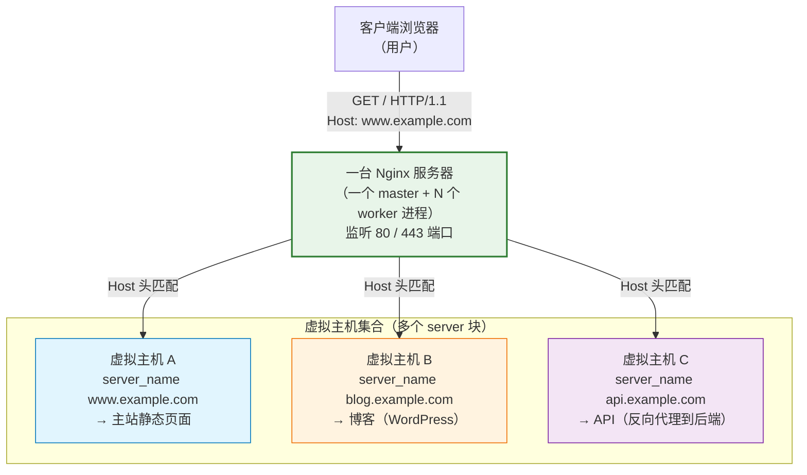
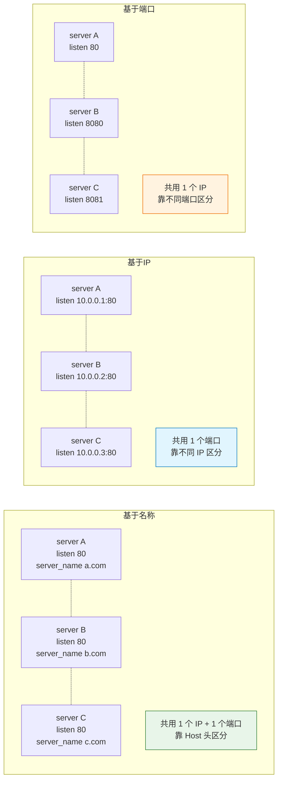

# 08 - 虚拟主机

> 版本基线：Nginx 1.30.4 (stable) | 创建日期：2026-08-05
> 受众：后端开发熟手（熟悉 Python/Java/Lua），但服务器运维是小白。会用"多项目部署"的视角来理解虚拟主机。

---

## 学习目标

学完本篇，你应当能独立完成"一台 Nginx 服务器上同时托管多个站点"的配置。具体来说：

- 理解**虚拟主机（Virtual Host）**的概念，以及为什么一台物理服务器能服务多个域名/站点。
- 掌握虚拟主机的**三种实现方式**：基于名称（最常用）、基于 IP、基于端口，并知道各自的适用场景与局限。
- 掌握 `default_server` 的作用、一个端口只能有一个 `default_server` 的规则，以及不设 default_server 时的兜底行为。
- 彻底搞清 `server_name` 的四种匹配方式（精确 / 前缀通配符 / 后缀通配符 / 正则）及其优先级顺序，理解正则捕获组 `$1` 的用法，以及 `server_name ""` / `server_name _` / `server_name *` 等特殊值的含义。
- 了解通配符证书与 SAN 证书在多域名 HTTPS 虚拟主机中的基础概念（详细配置留到 14-HTTPS 文档）。
- 掌握大型项目中"每站点一个 conf 文件 + include conf.d/*.conf"的配置组织方式。
- 避开常见踩坑：不要用 `if` 判断 Host（踩坑 `#1.7`），以及 proxy_set_header 中 Host 头的传递问题（踩坑 `#3.5`）。

> **前置知识**：阅读本篇前，建议先完成 [06-请求处理流程详解](06-请求处理流程详解.md)，理解 listen/server_name 的路由决策链路与 11 个处理阶段。本篇是 06 文档中"虚拟主机"部分的展开与深化。

---

## 核心知识点

### 知识点一：什么是虚拟主机

#### 虚拟主机的概念

**虚拟主机（Virtual Host，简称 vhost）**是指在一台物理服务器（或一个 Nginx 实例）上，通过配置多个 `server {}` 块，让这台服务器能够同时服务多个不同的网站/域名/站点。

打个比方：一台服务器就像一栋写字楼，虚拟主机就是写字楼里的不同办公室。访客（客户端请求）通过不同的"门牌号"（域名/IP/端口）找到对应的办公室，但他们进的是同一栋楼（同一台服务器、同一个 Nginx 进程）。

从 Nginx 配置的角度看，一个 `server {}` 块就是一个虚拟主机：

```nginx
http {
    server {              # 虚拟主机 A：主站
        listen 80;
        server_name www.example.com;
        # ... 主站的配置
    }

    server {              # 虚拟主机 B：博客
        listen 80;
        server_name blog.example.com;
        # ... 博客的配置
    }

    server {              # 虚拟主机 C：API
        listen 80;
        server_name api.example.com;
        # ... API 的配置
    }
}
```

上面三个 `server {}` 块共享同一个 80 端口、同一个 Nginx 进程，但对外表现为三个独立的网站。Nginx 根据每个请求的 Host 头（或其他特征）把它们路由到不同的 server 块。

#### 为什么需要虚拟主机

在虚拟主机技术出现之前，"一个网站 = 一台服务器"是常态。如果你有三个站点（主站、博客、API），就需要三台服务器。这带来明显的问题：

| 问题 | 不用虚拟主机 | 用虚拟主机 |
|------|-------------|-----------|
| 硬件成本 | 3 台服务器 | 1 台服务器 |
| 资源利用率 | 每台服务器大部分时间闲置（CPU/内存利用率低） | 一台服务器充分利用 |
| 运维成本 | 维护 3 台机器的部署、监控、安全 | 维护 1 台机器 |
| IP 地址消耗 | 每站一个公网 IP | 可共用一个公网 IP（基于名称的虚拟主机） |

Nginx（以及 Apache 等所有主流 Web 服务器）都支持虚拟主机，这是现代 Web 服务器的基本能力。云时代的"一台云主机跑多个站点"正是依赖于此。

> **特例说明**：虚拟主机是"逻辑隔离"而非"物理隔离"。多个站点共享同一个 Nginx 进程的 CPU、内存、文件描述符等资源。如果某个站点突发流量打满 worker 连接，其他站点也会受影响。对安全或性能隔离要求极高的场景，仍应使用独立的 Nginx 实例或容器。

#### 三种虚拟主机类型

Nginx 区分不同虚拟主机的依据有三个维度，对应三种实现方式：

| 类型 | 区分依据 | 关键指令 | 适用场景 | 公网 IP 需求 |
|------|---------|---------|---------|-------------|
| **基于名称** | HTTP 请求的 Host 头 | `server_name` | 最常用，绝大多数生产场景 | 1 个 IP 即可 |
| **基于 IP** | 连接的本地 IP 地址 | `listen IP:port` | 内网多网卡、SSL 早期方案 | 每站一个 IP |
| **基于端口** | 连接的本地端口 | `listen port` | 开发/测试环境、内部服务 | 1 个 IP 即可 |

三种方式可以混合使用。例如一台服务器有两个 IP，每个 IP 上跑多个基于名称的虚拟主机，其中一个站点还额外监听 8080 端口。

> **历史背景**：基于名称的虚拟主机依赖 HTTP/1.1 的 Host 头。HTTP/1.0 协议没有 Host 头字段，所以早期只能用基于 IP 的虚拟主机。随着 HTTP/1.1 在 1999 年标准化（RFC 2616），基于名称的虚拟主机成为主流，因为它不消耗额外 IP 地址。现在 IPv4 地址枯竭，基于名称更是事实标准。

#### 虚拟主机概念图



> **看图要点**：客户端的请求都会到达同一个 Nginx 进程，Nginx 根据 Host 头将请求分发到不同的虚拟主机（server 块）。对客户端来说，三个站点就像三台独立的服务器，但实际上它们跑在同一台机器上。

---

### 知识点二：基于名称的虚拟主机（最常用）

#### 原理：通过 server_name 区分不同站点

基于名称的虚拟主机是生产环境最常用的方式。它的核心原理是：**多个 server 块监听同一个 IP:Port，Nginx 通过请求头中的 Host 字段来区分请求属于哪个 server 块**。

HTTP/1.1 协议规定，客户端发起请求时**必须**携带 Host 头，指明要访问的域名。Nginx 收到请求后，取出 Host 头的值，与各 server 块的 `server_name` 进行匹配，命中哪个就用哪个 server 块处理。

```
# 请求示例
GET / HTTP/1.1
Host: blog.example.com        ← 这一行是关键，Nginx 据此选择虚拟主机
User-Agent: Mozilla/5.0
```

> **特例说明**：HTTP/1.0 请求可以不带 Host 头。如果 Nginx 收到一个没有 Host 头的请求（或 Host 头值为空），它会回退到 `default_server`（见知识点五）。另外，如果 Host 头带了端口号（如 `example.com:8080`），Nginx 会自动剥掉端口号再做匹配。

#### 代码示例：配置两个站点 example.com 和 blog.example.com

```nginx
http {
    # ===== 虚拟主机 1：主站 example.com =====
    server {
        listen 80;                          # 监听所有 IPv4 地址的 80 端口
        server_name example.com;            # 精确匹配 Host=example.com 的请求
        root /var/www/main;                 # 主站根目录
        index index.html;                   # 默认首页

        location / {
            try_files $uri $uri/ /index.html;  # SPA 路由回退
        }
    }

    # ===== 虚拟主机 2：博客 blog.example.com =====
    server {
        listen 80;                          # 同一个 80 端口（基于名称的核心：共用端口）
        server_name blog.example.com;       # 精确匹配 Host=blog.example.com 的请求
        root /var/www/blog;                 # 博客根目录
        index index.php index.html;         # 优先 index.php

        location / {
            try_files $uri $uri/ /index.php?$query_string;  # PHP 路由回退
        }

        location ~ \.php$ {
            fastcgi_pass unix:/var/run/php-fpm.sock;  # PHP-FPM 处理
            fastcgi_param SCRIPT_FILENAME $document_root$fastcgi_script_name;
            include fastcgi_params;
        }
    }
}
```

**逐行说明**：

- `listen 80;`：两个 server 块都监听 80 端口。这是基于名称虚拟主机的核心特征——**共用 IP:Port，靠 server_name 区分**。
- `server_name example.com;` / `server_name blog.example.com;`：分别精确匹配不同的域名。Nginx 把所有精确名称存入哈希表，查找复杂度 O(1)，性能极好。
- `root /var/www/main;` / `root /var/www/blog;`：两个站点有不同的文档根目录。Nginx 会从各自 root 读取静态文件。
- 其余 location / try_files / fastcgi_pass 配置在每个 server 内独立，互不干扰。

**验证方式**：在本机 hosts 文件中添加 `127.0.0.1 example.com blog.example.com`，然后分别用 `curl -H "Host: example.com" http://127.0.0.1/` 和 `curl -H "Host: blog.example.com" http://127.0.0.1/` 测试，可以看到不同的响应。

> **特例说明**：一个 `server_name` 指令可以写多个域名（空格分隔），它们都会匹配到同一个 server 块。例如 `server_name example.com www.example.com;` 表示主站和带 www 的域名都走这个 server。这在"裸域名 + www 域名"统一入口的场景非常常见。

---

### 知识点三：基于 IP 的虚拟主机

#### 原理：通过不同 IP 地址区分站点

基于 IP 的虚拟主机是指**每个 server 块监听不同的 IP 地址**（可以在同一端口上）。Nginx 根据连接的本地 IP 地址来区分请求属于哪个 server 块。

这要求服务器上有多个 IP 地址。获取多个 IP 的方式：
- 服务器有多块物理网卡，每块网卡一个 IP。
- 一块网卡上配置多个 IP（IP 别名 / secondary IP）。
- 云服务器绑定多个弹性公网 IP。

#### 代码示例

```nginx
http {
    # ===== 虚拟主机 1：监听 192.168.1.10 =====
    server {
        listen 192.168.1.10:80;             # 只监听 192.168.1.10 这个 IP 的 80 端口
        server_name site1.example.com;      # 此处 server_name 仍然有用（见下方说明）
        root /var/www/site1;
        # 来自 192.168.1.11 或其他 IP 的请求不会到达这个 server
    }

    # ===== 虚拟主机 2：监听 192.168.1.11 =====
    server {
        listen 192.168.1.11:80;             # 只监听 192.168.1.11 这个 IP 的 80 端口
        server_name site2.example.com;
        root /var/www/site2;
    }
}
```

**逐行说明**：

- `listen 192.168.1.10:80;`：`listen` 指令的第一个参数是 `IP:Port`，指定只监听这个 IP 地址。与 `listen 80;`（监听所有地址 `0.0.0.0:80`）不同，这里绑定了具体 IP。
- 两个 server 块分别绑定不同的 IP，操作系统层面就是两个独立的 `bind()` 调用。
- 即使两个 server 块的 `server_name` 相同，它们也会被正确区分——因为区分依据是 IP 而非 Host。

> **特例说明**：基于 IP 的虚拟主机中，`server_name` 仍然有意义。如果同一个 IP 上有多个 server 块（即 IP + 名称混合模式），Nginx 会先按 IP 选定候选集合，再在该集合内按 server_name 匹配。另外，Nginx 匹配 listen 时，具体 IP 的监听优先于通配地址（`*:80`）的监听——这与操作系统的 `bind` 行为一致。

#### 与基于名称的区别

| 维度 | 基于名称 | 基于 IP |
|------|---------|---------|
| 区分依据 | Host 头（域名） | 连接的本地 IP |
| 需要 IP 数量 | 1 个即可 | 每个站点 1 个 |
| 关键指令 | `server_name` | `listen IP:port` |
| HTTPS 支持 | 需 SNI（见知识点七） | 每个 IP 独立证书，无需 SNI |
| 现代使用率 | 极高（事实标准） | 低（IPv4 昂贵，多为遗留系统） |
| 配置复杂度 | 低 | 中（需配置多 IP） |

> **历史背景**：在 TLS 协议早期，HTTPS 握手发生在 HTTP 请求之前，服务器在握手时还不知道客户端要访问哪个域名，因此一个 IP 只能配一张证书。这就是基于 IP 的虚拟主机在 HTTPS 场景曾经不可替代的原因。后来 SNI（Server Name Indication，RFC 6066）解决了这个问题——客户端在 TLS 握手时就把域名带上，服务器据此选择证书。现在主流浏览器和 Nginx 都支持 SNI，基于名称的 HTTPS 虚拟主机已经成为标准。

---

### 知识点四：基于端口的虚拟主机

#### 原理：通过不同端口区分站点

基于端口的虚拟主机是指**每个 server 块监听不同的端口**（可以在同一 IP 上）。Nginx 根据连接的本地端口来区分请求属于哪个 server 块。

这种方式不需要多个 IP 地址，但有一个显著缺点：**客户端访问时必须在 URL 中指定端口号**（如 `http://example.com:8080`），这在面向公网用户的场景中几乎不可接受。因此基于端口的虚拟主机主要用于：

- 开发/测试环境（本地跑多个项目）。
- 内部管理后台（不需要对外暴露标准端口）。
- 与基于名称混合使用（80 端口跑主站，8080 端口跑管理后台）。

#### 代码示例

```nginx
http {
    # ===== 虚拟主机 1：主站，监听 80 =====
    server {
        listen 80;                          # 标准 HTTP 端口
        server_name example.com;
        root /var/www/main;
        # 用户访问 http://example.com/
    }

    # ===== 虚拟主机 2：管理后台，监听 8080 =====
    server {
        listen 8080;                        # 非标准端口
        server_name admin.example.com;
        root /var/www/admin;
        # 用户访问 http://example.com:8080/
        # 注意：URL 中必须带 :8080 端口号
    }

    # ===== 虚拟主机 3：监控面板，监听 8081 =====
    server {
        listen 8081;                        # 另一个非标准端口
        server_name monitor.example.com;
        root /var/www/monitor;
        # 用户访问 http://example.com:8081/
    }
}
```

**逐行说明**：

- `listen 80;` / `listen 8080;` / `listen 8081;`：三个 server 块分别监听不同端口。每个端口是独立的候选 server 集合。
- `server_name` 在基于端口的虚拟主机中仍然有效。如果 8080 端口上有多个 server 块，Nginx 会继续用 Host 头做二次筛选（即"端口 + 名称"混合模式）。
- 用户访问非标准端口时，浏览器地址栏会显示端口号（如 `:8080`），这是面向公网用户时的主要缺点。

> **特例说明**：基于端口的虚拟主机中，如果 `server_name` 匹配不到，同样回退到该端口的 `default_server`。另外，非 root 用户无法监听 1024 以下端口，开发环境中用 8080/8081 等高位端口可以避免权限问题。

#### 三种虚拟主机类型的对比总结



---

### 知识点五：default_server

#### default_server 的作用

当一个请求的 Host 头在某个 IP:Port 上的所有 server 块中都**匹配失败**时，Nginx 会使用标记了 `default_server` 的 server 块来处理。这个机制确保任何到达 Nginx 的请求都有一个"兜底"的处理 server。

`default_server` 是 `listen` 指令的一个参数，写在 `listen` 后面：

```nginx
listen 80 default_server;   # 此 server 块是 80 端口的默认 server
```

#### 一个端口只能有一个 default_server

每个 IP:Port 上**只能有一个** server 块标记 `default_server`。如果配置了两个，Nginx 启动时会报错：

```
nginx: [emerg] duplicate default server for 0.0.0.0:80
```

#### 不设 default_server 时的行为

如果某个 IP:Port 上没有任何 server 块标记 `default_server`，Nginx 会把该 IP:Port 上**配置文件中出现的第一个** server 块当作默认。

这意味着默认 server 的选择依赖于 server 块在配置文件中的**书写顺序**——这在生产环境中是一个隐患。如果有人调整了 server 块的顺序或新增了一个 server 放在最前面，默认 server 就悄悄变了，可能导致非预期的行为。

> **特例说明**：如果配置文件通过 `include conf.d/*.conf` 加载多个文件，server 块的"出现顺序"取决于文件名按字母序排列后的加载顺序。`a.conf` 中的 server 会比 `z.conf` 中的先加载。依赖隐式默认 server 时，这种顺序依赖很容易引发难以排查的问题。因此，**始终显式声明 `default_server`** 是最佳实践。

#### 防止未定义 Host 请求：server_name ""; return 444;

在生产环境中，可能有人把他们的域名 DNS 解析到你的服务器 IP 上，然后通过你的 Nginx 访问（俗称"虚拟主机劫持"或"蹭流量"）。为了防止这种情况，应该配置一个 default_server，拒绝所有未匹配的 Host：

```nginx
http {
    # ===== 默认 server：拒绝所有未匹配 Host 的请求 =====
    server {
        listen 80 default_server;           # 显式标记为 80 端口的默认 server
        server_name _;                      # "_" 是无效主机名，永远不会被任何 Host 匹配
        # 此 server 块只在"所有 server_name 都没匹配上"时才被选中
        return 444;                         # 444 = Nginx 特有状态码，直接关闭连接不返回响应
    }

    # ===== 正常站点 1 =====
    server {
        listen 80;
        server_name www.example.com;
        root /var/www/www;
    }

    # ===== 正常站点 2 =====
    server {
        listen 80;
        server_name api.example.com;
        root /var/www/api;
    }
}
```

**逐行说明**：

- `listen 80 default_server;`：将此 server 块设为 80 端口的默认兜底 server。即使它写在最前面，也不影响其他 server 块的正常匹配——default_server 只在"所有 server_name 都没命中"时才生效。
- `server_name _;`：下划线 `_` 不是合法的域名，永远不会匹配任何真实的 Host 头。这是一种"占位"写法，表示这个 server 块不主动匹配任何域名，只作为兜底。（`_` 只是一个约定俗成的无效名称，换成 `-` 或 `!invalid` 等其他非法名称效果相同。）
- `return 444;`：444 是 Nginx 特有的非标准 HTTP 状态码，表示**直接关闭 TCP 连接**，不返回任何 HTTP 响应。相比返回 403 或 421，444 更省资源（不生成响应体、不记日志体），且对扫描器/爬虫更不友好。

> **特例说明**：`return 444` 会直接断开连接，客户端看到的是"连接被重置"而非一个 HTTP 错误页。如果你希望给用户一个友好的提示，可以改为 `return 421;`（Misdirected Request）或 `return 444;`。另外，`server_name ""`（空字符串）匹配的是**没有 Host 头**的请求（如 HTTP/1.0），而 `server_name _` 匹配的是**有 Host 头但匹配不上任何 server_name**的请求。两者可以配合使用。

#### server_name "" 匹配无 Host 头请求

```nginx
# 匹配没有 Host 头的请求（HTTP/1.0 或畸形请求）
server {
    listen 80;
    server_name "";          # 空字符串：匹配 Host 头缺失或为空的请求
    return 444;
}
```

> **特例说明**：自 Nginx 0.8.48 起，`server_name` 的默认值就是 `""`（空字符串）。所以如果一个 server 块**不写** `server_name`，它等价于 `server_name ""`，会匹配没有 Host 头的请求。这有时会导致意外行为——如果你忘了写 server_name，这个 server 块可能会"抢走"那些无 Host 头的请求。

---

### 知识点六：server_name 匹配规则详解

`server_name` 指令支持四种匹配方式，Nginx 在选定 server 块时按**固定的优先级顺序**依次尝试。一旦在某一层命中，就不再往下走。理解这个优先级是正确配置虚拟主机的关键。

#### 1. 精确名称匹配（最高优先级）

```nginx
server_name example.com;            # Host 必须完全等于 example.com
server_name www.example.com;        # Host 必须完全等于 www.example.com

# 一个 server_name 可以写多个精确名称（空格分隔）
server_name example.com www.example.com;
```

Nginx 把所有精确名称存入哈希表，查找复杂度 O(1)，性能最好。**生产环境应尽量使用精确名称。**

#### 2. 前缀通配符匹配

以 `*` 开头的通配符，匹配任意子域名前缀：

```nginx
server_name *.example.com;          # 匹配 www.example.com、a.b.example.com 等
# 注意：不匹配 example.com 本身（* 至少要匹配一段）
```

> **特例说明**：通配符 `*` 只能在名称的**开头或结尾**出现一次，不能在中间。`www.*.com`、`*example*` 都是非法的，Nginx 启动时会报错。另外，特殊的 `.example.org` 写法（以点号开头）既匹配 `example.org` 也匹配 `*.example.org`，这是前缀通配符的一种简写形式。

#### 3. 后缀通配符匹配

以 `*` 结尾的通配符，匹配任意后缀：

```nginx
server_name www.*;                  # 匹配 www.example.com、www.example.org 等
# 注意：* 只在最后一段，且至少匹配一段（不匹配 www 本身）
```

#### 4. 正则表达式匹配（最低优先级）

以 `~` 开头表示区分大小写的正则匹配，`~*` 表示不区分大小写：

```nginx
server_name ~^www\d+\.example\.com$;    # 匹配 www1.example.com、www2.example.com
# 正则必须以 ^ 开头、$ 结尾来锚定，否则可能误匹配
```

#### 匹配优先级顺序

Nginx 严格按以下顺序匹配，一旦在某一层命中就不再往下走：

```
精确名称  >  前缀通配符(*.xxx)  >  后缀通配符(xxx.*)  >  正则(~)  >  默认 server
```

> **特例说明**：通配符之间的"前缀"与"后缀"不是按出现顺序，而是按类型分层。前缀通配符整体优先于后缀通配符。同类型内，更长的通配符优先。正则匹配按 server 块在配置文件中出现的**顺序**依次尝试，第一个命中的即被选中。

#### 正则中的捕获组使用 $1

正则 `server_name` 中的捕获组可以在后续配置中通过 `$1`、`$2` 引用，也可以用命名捕获 `(?<name>...)` 通过 `$name` 引用：

```nginx
server {
    listen 80;
    # 使用命名捕获组 (?<user>...)，匹配 xxx.example.com
    server_name ~^(?<user>.+)\.example\.com$;

    # 后续可用 $user 变量引用捕获到的用户名部分
    root /var/www/users/$user;         # 如 Host=bob.example.com → root=/var/www/users/bob
}
```

```nginx
server {
    listen 80;
    # 使用编号捕获组，匹配 www1.example.com、www2.example.com
    server_name ~^www(\d+)\.example\.com$;

    # 后续可用 $1 引用捕获到的数字部分
    root /var/www/www$1;               # 如 Host=www3.example.com → root=/var/www/www3
}
```

> **特例说明**：命名捕获组 `(?<name>...)` 比编号捕获组 `$1` 可读性更好，推荐使用命名捕获。注意正则中 `.` 需要转义为 `\.`，否则 `.` 会匹配任意字符。正则匹配性能不如哈希查找，且可读性差，应尽量避免使用。

#### 特殊值：server_name ""、server_name _、server_name *

| 写法 | 含义 | 是否能被 Host 匹配 |
|------|------|-------------------|
| `server_name "";` | 空名称。匹配**没有 Host 头**的请求（HTTP/1.0 或畸形请求） | 不匹配任何正常 Host |
| `server_name _;` | 无效主机名（下划线不是合法域名）。常用作 default_server 的占位符 | 永远不会被 Host 匹配 |
| `server_name *;` | 特殊通配符，匹配该端口上的**所有**请求 | 匹配所有（优先级低于精确名称） |

> **特例说明**：`server_name *` 看起来像通配符，但它的行为与 `*.example.com` 不同——它会匹配任意 Host。不过这个写法不推荐使用，因为它会"吃掉"所有未精确匹配的请求，容易导致路由混乱。正确做法是显式列出所有域名，用 `default_server` + `return 444` 兜底。

#### 完整代码示例（逐行说明）

```nginx
http {
    # ====== 优先级 1：精确匹配 ======
    server {
        listen 80;
        server_name www.example.com;       # Host=www.example.com 精确命中
        root /var/www/www;                 # 命中后 root 为 /var/www/www
    }

    # ====== 优先级 2：前缀通配符 ======
    server {
        listen 80;
        server_name *.example.com;         # Host=api.example.com、test.example.com 命中
        # 注意：www.example.com 已被上面的精确匹配抢走，不会到这
        root /var/www/wildcard;
    }

    # ====== 优先级 3：后缀通配符 ======
    server {
        listen 80;
        server_name www.*;                 # Host=www.example.org、www.other.cn 命中
        # 只有 www.example.com 之外的 www.xxx 才会落到这里
        root /var/www/www-any;
    }

    # ====== 优先级 4：正则匹配 ======
    server {
        listen 80;
        server_name ~^(?<user>.+)\.example\.com$;  # 命中 xxx.example.com
        # 用 (?<user>...) 命名捕获，后续可用 $user 变量引用
        # 注意：www.example.com 已被精确匹配抢走，api.example.com 已被前缀通配抢走
        # 所以这里只会匹配到 user1.example.com、user2.example.com 等
        root /var/www/users/$user;         # 如 Host=bob.example.com → /var/www/users/bob
    }

    # ====== 默认 server ======
    server {
        listen 80 default_server;          # 以上都不匹配时，请求落到这里
        server_name _;                     # "_" 永不匹配，纯粹占位
        return 444;                        # 直接断开连接，拒绝非法 Host
    }

    # ====== 空 server_name：匹配无 Host 头的请求 ======
    server {
        listen 80;
        server_name "";                    # 匹配 HTTP/1.0 无 Host 头的请求
        return 444;                        # 同样拒绝
    }
}
```

> **生产建议**：优先使用精确名称（哈希查找，O(1)）；通配符次之；正则尽量不用。一定要配置 `default_server` 并返回 444 或 421，防止别人把垃圾域名解析到你的 IP 上"蹭"你的 server。关于 server_name 的路由决策细节，可回顾 [06-请求处理流程详解](06-请求处理流程详解.md) 的知识点一和知识点三。

---

### 知识点七：通配符证书与多域名 HTTPS（基础概念）

在 HTTPS 场景下，虚拟主机的配置会变得复杂一些——因为 TLS 握手发生在 HTTP 请求之前。本节只介绍基础概念，详细配置留到 [14-HTTPS与TLS配置.md](../05-安全与传输/14-HTTPS与TLS配置.md)。

#### 一个 server 块配多个域名

最简单的情况：一张证书覆盖多个域名，用一个 server 块即可：

```nginx
server {
    listen 443 ssl;
    http2 on;                              # 1.25.1+ 用独立指令开启 HTTP/2
    server_name www.example.com example.com;  # 两个域名共用一张证书
    ssl_certificate     /etc/nginx/ssl/fullchain.crt;
    ssl_certificate_key /etc/nginx/ssl/server.key;
    root /var/www/main;
}
```

#### SAN 证书 / 通配符证书的概念

传统证书只覆盖一个域名（CN = www.example.com）。要在一个 server 块里服务多个域名，需要证书能覆盖多个域名。两种常见方案：

| 证书类型 | 覆盖范围 | 示例 | 适用场景 |
|---------|---------|------|---------|
| **SAN 证书**（Subject Alternative Name） | 显式列出多个域名 | SAN: www.example.com, api.example.com, blog.example.com | 域名数量固定且较少 |
| **通配符证书** | 一个域名及其所有子域名 | *.example.com（覆盖 www/api/blog 等所有子域） | 子域名多且会动态增加 |

```nginx
# 通配符证书：一张 *.example.com 证书覆盖所有子域名
server {
    listen 443 ssl;
    http2 on;
    server_name www.example.com;           # 主站
    ssl_certificate     /etc/nginx/ssl/star.example.com.crt;  # *.example.com 通配符证书
    ssl_certificate_key /etc/nginx/ssl/star.example.com.key;
    root /var/www/www;
}

server {
    listen 443 ssl;
    http2 on;
    server_name api.example.com;           # API（复用同一张通配符证书）
    ssl_certificate     /etc/nginx/ssl/star.example.com.crt;  # 同一张证书
    ssl_certificate_key /etc/nginx/ssl/star.example.com.key;  # 同一把密钥
    location / {
        proxy_pass http://backend;
    }
}
```

> **特例说明**：通配符证书 `*.example.com` 只覆盖**一级子域名**（如 `www.example.com`、`api.example.com`），不覆盖 `example.com` 本身（裸域名），也不覆盖 `a.b.example.com`（二级子域名）。如果需要覆盖裸域名，证书的 SAN 列表中需要同时包含 `example.com` 和 `*.example.com`。Let's Encrypt 免费签发通配符证书（需 DNS-01 验证）。

#### SNI：基于名称的 HTTPS 虚拟主机基础

SNI（Server Name Indication）是 TLS 协议的扩展，允许客户端在 TLS 握手时就把目标域名发送给服务器。服务器据此选择对应的证书。有了 SNI，一个 IP:443 上可以跑多个 HTTPS 虚拟主机，各自用不同的证书：

```nginx
# SNI 示例：同一 IP:443 上两个 HTTPS 虚拟主机，各用不同证书
server {
    listen 443 ssl;
    server_name www.example.com;
    ssl_certificate     /etc/nginx/ssl/www.example.com.crt;   # 证书 A
    ssl_certificate_key /etc/nginx/ssl/www.example.com.key;
}

server {
    listen 443 ssl;
    server_name api.example.com;
    ssl_certificate     /etc/nginx/ssl/api.example.com.crt;   # 证书 B
    ssl_certificate_key /etc/nginx/ssl/api.example.com.key;
}
```

> **预告**：HTTPS 虚拟主机的完整配置（证书链、SNI 细节、HTTP/2、HSTS、HTTP 跳转 HTTPS 等）将在 [14-HTTPS与TLS配置.md](../05-安全与传输/14-HTTPS与TLS配置.md) 中详细讲解。本节只需建立"多域名 HTTPS 需要通配符/SAN 证书或 SNI"的基础认知。

---

### 知识点八：大型项目的配置文件组织

当 Nginx 上托管的虚拟主机越来越多时，把所有 `server {}` 块都塞在一个 `nginx.conf` 里会变得不可维护。生产环境的标准做法是：**每个站点一个独立的 conf 文件，通过 `include` 统一加载**。

#### 每个站点一个 conf 文件

把每个虚拟主机的配置拆分到独立文件中，文件名用域名命名，一目了然：

```text
/etc/nginx/
├── nginx.conf                    # 主配置文件：全局参数 + include 指令
├── conf.d/                       # 站点配置目录（每个站点一个 .conf 文件）
│   ├── www.example.com.conf      # 主站配置
│   ├── blog.example.com.conf     # 博客配置
│   ├── api.example.com.conf      # API 配置
│   └── default.conf              # 默认 server（兜底）
└── snippets/                     # 可复用的配置片段
    ├── ssl-params.conf           # SSL 公共参数
    └── proxy_params.conf         # 反向代理公共参数
```

#### include conf.d/*.conf

主配置文件 `nginx.conf` 中用通配符 include 加载所有站点配置：

```nginx
# /etc/nginx/nginx.conf

user  nginx;
worker_processes  auto;
error_log  /var/log/nginx/error.log warn;
pid        /var/run/nginx.pid;

events {
    worker_connections  4096;
}

http {
    include       /etc/nginx/mime.types;
    default_type  application/octet-stream;
    sendfile      on;
    keepalive_timeout  65;

    # 加载 conf.d 目录下所有 .conf 文件（按文件名字母序）
    include /etc/nginx/conf.d/*.conf;
}
```

#### 各站点配置文件示例

```nginx
# /etc/nginx/conf.d/default.conf
# 默认 server：兜底未匹配的 Host
server {
    listen 80 default_server;
    server_name _;
    return 444;
}
```

```nginx
# /etc/nginx/conf.d/www.example.com.conf
# 主站虚拟主机
server {
    listen 80;
    server_name www.example.com example.com;
    root /var/www/main;
    index index.html;

    location / {
        try_files $uri $uri/ /index.html;
    }
}
```

```nginx
# /etc/nginx/conf.d/api.example.com.conf
# API 虚拟主机（反向代理到后端）
server {
    listen 80;
    server_name api.example.com;

    location / {
        include /etc/nginx/snippets/proxy_params.conf;  # 复用公共代理参数
        proxy_pass http://backend;
    }
}
```

```nginx
# /etc/nginx/snippets/proxy_params.conf
# 公共反向代理参数（被多个站点 include 复用）
proxy_set_header Host $host;
proxy_set_header X-Real-IP $remote_addr;
proxy_set_header X-Forwarded-For $proxy_add_x_forwarded_for;
proxy_set_header X-Forwarded-Proto $scheme;
proxy_connect_timeout 5s;
proxy_read_timeout 60s;
```

**逐行说明**：

- `include /etc/nginx/conf.d/*.conf;`：通配符加载，按文件名字母序依次加载。`default.conf` 中的 `default_server` 因为字母序排在 `www`/`api` 之前，但它用了 `default_server` 标记，所以无论加载顺序如何，它都是 80 端口的默认 server。
- 每个站点文件独立，新增站点只需在 `conf.d/` 加一个 `.conf` 文件，修改站点只需改对应文件，互不影响。
- `snippets/proxy_params.conf` 是可复用片段，多个站点的 `proxy_set_header` 写法相同，提取出来用 `include` 引入，改一处所有站点生效。

> **特例说明**：通配符 `include` 匹配不到任何文件时不会报错（视为空操作）。但如果多个文件定义了相同的 `server_name`（如两个文件都写了 `server_name api.example.com`），Nginx 启动时会报 `conflicting server name "api.example.com" on 0.0.0.0:80, ignored` 警告，后加载的被忽略。每次修改后务必先 `nginx -t` 校验。关于 include 的详细机制，可回顾 [04-配置文件结构与指令体系](../02-配置基础/04-配置文件结构与指令体系.md) 的知识点三。

> **Debian/Ubuntu 的 sites-available + sites-enabled 模式**：Debian 系发行版提供了另一种组织方式——`sites-available/` 存放所有站点配置，`sites-enabled/` 存放软链接。启用站点时建软链接（`ln -s ../sites-available/www.example.com.conf`），禁用时删软链接。这种方式可以在不删除配置文件的情况下快速启停站点，适合需要频繁上下线的环境。

---

## Mermaid 图：虚拟主机请求路由图

下面这张图展示了一个请求从客户端发出到被路由到正确虚拟主机的完整流程，涵盖了基于名称、基于 IP、基于端口三种方式的决策过程。


> **看图要点**：路由决策分两步——第一步按 IP:Port 选定候选 server 集合（对应基于 IP/端口的虚拟主机），第二步在该集合内按 Host 头匹配 server_name（对应基于名称的虚拟主机）。两步都失败时回退到 default_server。这个流程与 [06-请求处理流程详解](06-请求处理流程详解.md) 的路由决策链路一致，本篇是从"虚拟主机"视角的重新审视。

---

## 最佳实践

### 1. 始终显式声明 default_server

```nginx
# 推荐做法：显式标记 default_server，拒绝非法 Host
server {
    listen 80 default_server;
    server_name _;          # "_" 永不匹配，纯占位
    return 444;             # 直接断开连接
}
```

不要依赖"第一个 server 块就是默认"的隐式行为。配置文件顺序变化、include 加载顺序变化时，隐式默认 server 会悄悄改变，导致难以排查的问题。

### 2. server_name 用精确名称，避免正则

```nginx
# 推荐：列出所有需要的精确域名（哈希查找 O(1)）
server_name example.com www.example.com api.example.com;

# 避免：正则可读性差、性能低、维护困难
# server_name ~^(www|api)\.example\.com$;
```

如果子域名很多且会动态增加，用通配符 `*.example.com` 比正则更好（通配符也存入哈希表，性能优于正则）。

### 3. 基于名称优先，基于端口用于内部服务

```nginx
# 面向公网的站点：用基于名称的虚拟主机（共用 80/443）
server { listen 80; server_name www.example.com; ... }
server { listen 80; server_name api.example.com; ... }

# 内部管理后台：用基于端口的虚拟主机（不对外暴露标准端口）
server { listen 8080; server_name admin.internal; ... }
```

基于端口的方式要求用户在 URL 中指定端口号，不适合面向公网用户。但用于内部服务（管理后台、监控面板）可以避免占用 80 端口，还能配合防火墙做访问控制。

### 4. 用 if 判断 Host 是反模式——用多个 server 块替代

```nginx
# 错误：用 if 判断 Host（if is evil）
server {
    listen 80;
    if ($host = 'blog.example.com') {
        root /var/www/blog;     # 行为不可预测！
    }
    if ($host = 'www.example.com') {
        root /var/www/www;      # 行为不可预测！
    }
}

# 正确：用多个 server 块替代
server {
    listen 80;
    server_name blog.example.com;
    root /var/www/blog;
}
server {
    listen 80;
    server_name www.example.com;
    root /var/www/www;
}
```

详见踩坑 `#1.7`。

### 5. 每个站点独立配置文件，用 include 统一加载

```nginx
# nginx.conf 主文件保持精简
http {
    include /etc/nginx/conf.d/*.conf;   # 每个站点一个 .conf 文件
}
```

新增站点只需加文件，修改站点只需改对应文件，互不影响。公共配置提取为 snippet 复用。

### 6. 反向代理时正确传递 Host 头

```nginx
location / {
    proxy_pass http://backend;
    proxy_set_header Host $host;           # 传递用户访问的域名（非上游 IP）
    proxy_set_header X-Real-IP $remote_addr;
    proxy_set_header X-Forwarded-For $proxy_add_x_forwarded_for;
}
```

不显式设置 `proxy_set_header Host` 时，Nginx 默认传给后端的是 `$proxy_host`（上游地址），而非用户访问的域名。如果后端依赖 Host 做虚拟主机路由或签名校验，就会出问题。详见踩坑 `#3.5`。

### 7. HTTPS 虚拟主机优先用通配符证书或 SAN 证书

```nginx
# 一张 *.example.com 通配符证书覆盖所有子域名
server { listen 443 ssl; server_name www.example.com;  ssl_certificate /etc/nginx/ssl/star.example.com.crt; ... }
server { listen 443 ssl; server_name api.example.com;  ssl_certificate /etc/nginx/ssl/star.example.com.crt; ... }
```

避免每个子域名单独申请证书。Let's Encrypt 免费签发通配符证书。详细配置见 14-HTTPS 文档。

---

## 常见踩坑引用

本篇涉及以下踩坑条目，详细的现象、原因和解决方案见 [99-踩坑记录与解决方案](../99-踩坑记录与解决方案.md)：

| 编号 | 坑点 | 与本篇的关联 |
|------|------|-------------|
| **#1.7** | [if is evil（在 location 中滥用 if）](../99-踩坑记录与解决方案.md#17-if-is-evil在-location-中滥用-if) | 不要用 `if ($host = ...)` 判断 Host 来区分虚拟主机，应该用多个 server 块。`if` 在 location 内仅 `return`/`rewrite last` 安全。 |
| **#3.5** | [不当的 proxy_set_header / Host 头问题](../99-踩坑记录与解决方案.md#35-不当的-proxy_set_header--host-头问题) | 反向代理时默认传给后端的 Host 是 `$proxy_host`（上游 IP），而非用户访问的域名。需显式 `proxy_set_header Host $host;`。 |

此外，以下踩坑与本篇的后续学习相关，可提前了解：

| 编号 | 坑点 | 关联场景 |
|------|------|---------|
| #1.1 | location 匹配优先级陷阱 | 虚拟主机内的 location 匹配规则 |
| #3.2 | 危险的 document root | 虚拟主机的 root 路径配置安全 |
| #4.1 | 证书链不完整 | HTTPS 虚拟主机的证书配置 |
| #4.6 | HTTP/2 配置坑 | HTTPS 虚拟主机的 HTTP/2 开启方式 |

---

## 小结

本篇是"一台服务器服务多站点"的完整指南。核心要点回顾：

1. **虚拟主机概念**：一台 Nginx 服务器通过多个 `server {}` 块同时服务多个域名/站点。它节省服务器资源，是现代 Web 服务器的标准能力。三种实现方式各有适用场景。

2. **基于名称（最常用）**：多个 server 块共用同一 IP:Port，靠 HTTP/1.1 的 Host 头区分。这是生产环境的事实标准，只需一个公网 IP 即可服务无数站点。

3. **基于 IP**：每个 server 块监听不同 IP，靠 `listen IP:port` 区分。需要多个 IP 地址，现代主要用于遗留系统或 HTTPS 无 SNI 场景。

4. **基于端口**：每个 server 块监听不同端口，靠 `listen port` 区分。不需多 IP，但用户要在 URL 中指定端口号，适合内部服务。

5. **default_server**：未匹配 Host 时的兜底 server。每个 IP:Port 只能有一个。不设时用第一个 server（隐式，不推荐）。生产环境应显式声明 `default_server` + `server_name _` + `return 444` 防止虚拟主机劫持。

6. **server_name 匹配规则**：四种方式按 `精确 > 前缀通配(*.xxx) > 后缀通配(xxx.*) > 正则(~)` 优先级匹配。精确用哈希表 O(1) 最快，正则最慢应避免。正则捕获组可用 `$1` 或命名捕获 `$name` 引用。特殊值 `""` 匹配无 Host 头请求，`_` 是永不匹配的占位符。

7. **多域名 HTTPS**：通配符证书 `*.example.com` 或 SAN 证书覆盖多域名。SNI 让一个 IP:443 上可跑多个 HTTPS 虚拟主机。详细配置在 14-HTTPS 文档。

8. **配置文件组织**：每站点一个 `.conf` 文件放 `conf.d/`，主文件用 `include conf.d/*.conf` 统一加载。公共参数提取为 snippet 复用。新增/修改站点互不影响。

> **下一篇预告**：阶段三核心机制到此完成。接下来进入 [09-反向代理proxy_pass](../04-反向代理与负载均衡/09-反向代理proxy_pass.md)，学习 Nginx 最核心的生产用途——反向代理，包括 `proxy_pass` 的 URI 改写规则、`proxy_set_header` 透传、超时与 buffer 配置等。
