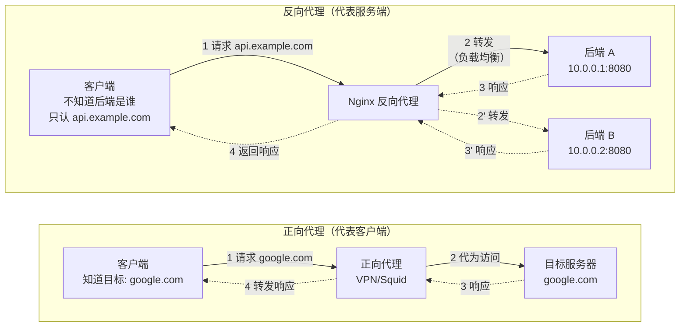
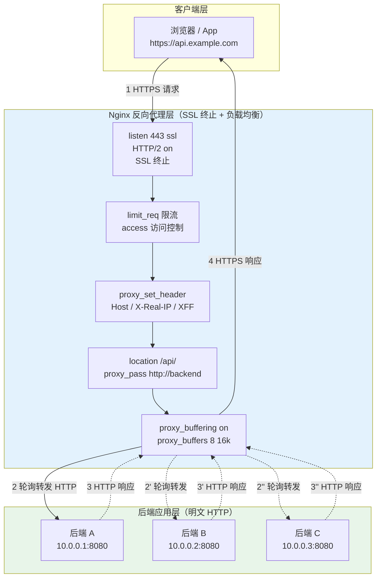
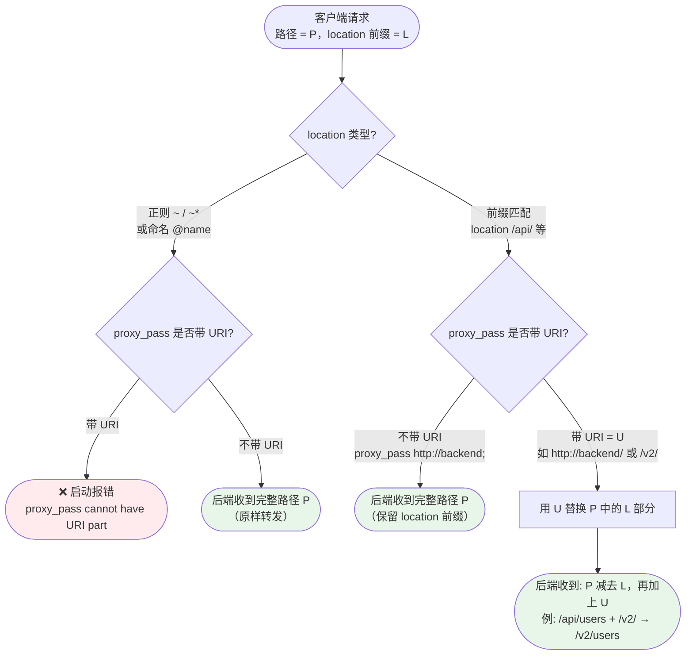

# 09 - 反向代理 proxy_pass

> 版本基线：Nginx 1.30.4 (stable) | 创建日期：2026-08-05
> 受众：后端开发熟手（熟悉 Python/Java/Lua），但服务器运维是小白。反向代理是后端到 Nginx 的过渡地带，本文会把"代理"这件事一次讲透。

---

## 学习目标

学完本篇，你应当能够：

- 区分**正向代理**与**反向代理**的本质差异，理解反向代理在负载均衡、SSL 终止、缓存、安全隔离上的核心价值。
- 掌握 `proxy_pass` 的语法与最简用法，能独立写出一个把请求转发到后端的反向代理 location。
- 彻底搞懂 `proxy_pass` **尾斜杠语义**——带 URI 与不带 URI 时请求路径如何被改写，并能预判四种场景下后端实际收到的 URI。
- 掌握 `proxy_set_header` 透传请求头的正确写法，理解 `Host`、`X-Real-IP`、`X-Forwarded-For`、`X-Forwarded-Proto` 的作用，以及 header 在 `http→server→location` 间的继承规则。
- 合理配置 `proxy_connect_timeout`、`proxy_send_timeout`、`proxy_read_timeout` 三个超时，并知道何时需要调大或调小。
- 理解 `proxy_buffering` 与 `proxy_buffers` 系列指令，知道 SSE/流式响应为什么必须关闭缓冲。
- 掌握 `proxy_next_upstream` 故障转移机制，明白非幂等请求（POST/PUT/DELETE）被重试的风险。
- 了解 `proxy_redirect`、`proxy_intercept_errors`、`proxy_http_version` 等常用辅助指令。
- 避开踩坑 `#1.4`、`#2.5`、`#3.5`、`#5.4`、`#5.7`。

> **前置知识**：阅读本篇前，建议先完成 [06-请求处理流程详解](../03-核心机制/06-请求处理流程详解.md)，理解 11 个处理阶段（尤其 content 阶段是 `proxy_pass` 的生效位置），以及 [07-location匹配规则](../03-核心机制/07-location匹配规则.md)。

---

## 核心知识点

### 知识点一：正向代理 vs 反向代理

"代理"这个词在两种场景下含义完全不同。区分它们的关键是：**代理代表谁的利益**。

#### 正向代理（Forward Proxy）

正向代理代表**客户端**的利益。客户端知道自己想访问哪个目标服务器，但因为某种原因（网络不通、被墙、需要匿名）无法直接访问，于是把请求交给代理，由代理代为访问并把结果返回给客户端。

典型例子就是 VPN 或科学上网工具：你的浏览器配置了代理 `127.0.0.1:7890`，你输入 `https://www.google.com`，浏览器把请求发给代理，代理去访问 Google 再把结果转回来。整个过程中客户端清楚目标服务器是谁。

- 配置方：**客户端**（浏览器设置代理地址）。
- 客户端是否知道目标服务器：**知道**。
- 目标服务器看到的来源：**代理 IP**（看不到真实客户端）。
- 典型用途：突破网络限制、匿名访问、缓存加速。

#### 反向代理（Reverse Proxy）

反向代理代表**服务端**的利益。客户端访问的是一个域名（如 `https://api.example.com`），它以为自己在直接和目标服务器通信，但实际上请求到达的是 Nginx，Nginx 再把请求转发给后端真正的应用服务器，并把响应返回给客户端。客户端**完全不知道**后端有几台服务器、分别是什么 IP。

- 配置方：**服务端**（运维在 Nginx 上配 `proxy_pass`）。
- 客户端是否知道后端服务器：**不知道**，只认域名。
- 后端服务器看到的来源：**Nginx IP**（看不到真实客户端，除非透传 header）。
- 典型用途：负载均衡、SSL 终止、缓存、安全隔离。

> **一句话记忆**：正向代理代理的是客户端，客户端知道目标；反向代理代理的是服务端，客户端不知道后端。

#### 正向代理 vs 反向代理对比图



#### 反向代理的核心价值

Nginx 之所以几乎成了反向代理的代名词，是因为它在反向代理这个位置上能同时承担多项职责：

1. **负载均衡**：一个域名背后挂多台后端服务器，Nginx 按轮询 / IP 哈希 / 最少连接等策略分发请求，后端可以水平扩容，客户端无感知。
2. **SSL 终止（SSL Termination）**：HTTPS 握手只在 Nginx 上做，后端用明文 HTTP，减轻后端的加解密 CPU 负担，证书也只需在 Nginx 上管理一份。
3. **缓存**：把后端的静态响应缓存在 Nginx 内存/磁盘，命中时直接返回，不再回源，降低后端压力。
4. **安全隔离**：后端服务器不直接暴露公网，所有外部流量必经 Nginx，可以在 Nginx 层做访问控制、限流、WAF 等防护。

---

### 知识点二：proxy_pass 基本用法

`proxy_pass` 是 `ngx_http_proxy` 模块的核心指令，它的作用是把当前请求**转发**给指定的后端服务器。它只能出现在 `location` 或 `location` 下的 `if` 中（不推荐后者），属于 content 阶段（阶段 10）的处理逻辑。

#### 语法

```nginx
# 转发到后端地址（不带 URI 部分）
proxy_pass address;

# 转发到后端地址并带 URI 部分（会改写请求路径）
proxy_pass address URI;

# 也可以用变量（动态上游，需注意 SSRF 风险）
proxy_pass $variable;
```

其中 `address` 可以是以下形式：

| 地址形式 | 示例 | 说明 |
|---------|------|------|
| 域名 + 端口 | `http://backend.example.com:8080` | 直连指定后端 |
| IP + 端口 | `http://127.0.0.1:8080` | 本地后端最常见 |
| Unix 域 socket | `http://unix:/tmp/backend.socket:/` | 本机高性能通信 |
| upstream 名 | `http://backend` | 引用 upstream 块（负载均衡） |

#### 最简反向代理

```nginx
http {
    # 定义一个上游服务器组（负载均衡用，单台也行）
    upstream backend {
        server 127.0.0.1:8080;     # 后端应用地址，如 Node.js / Spring Boot
    }

    server {
        listen 80;                  # 对外监听 80 端口
        server_name api.example.com;

        location / {
            proxy_pass http://backend;   # 把所有请求转发给 upstream backend
            # 此时后端收到的请求路径与客户端发来的一致（不改写）
        }
    }
}
```

逐行说明：

- `upstream backend { ... }`：定义一个名为 `backend` 的上游服务器组，里面可以放一台或多台后端。即使只有一台，也建议用 upstream，便于后续扩容和配 keepalive。
- `server 127.0.0.1:8080;`：后端应用监听在本地 8080 端口。
- `listen 80;`：Nginx 对外提供服务的端口，客户端访问 `http://api.example.com` 即走这里。
- `proxy_pass http://backend;`：核心一行——把请求交给 `backend` 这个 upstream 处理。注意这里**不带尾斜杠**，意味着请求路径原样转发。

客户端请求 `GET http://api.example.com/users/list`，后端 `127.0.0.1:8080` 实际收到的请求路径是 `/users/list`，与原始路径完全一致。

> **特例**：如果 `proxy_pass` 直接写死地址而非 upstream 名，如 `proxy_pass http://127.0.0.1:8080;`，效果相同，但失去了负载均衡和 keepalive 复用的能力。生产环境推荐始终用 upstream。

---

### 知识点三：proxy_pass 尾斜杠语义（最易踩坑）

`proxy_pass` 末尾有没有 URI 部分（哪怕只是一个 `/`），决定了转发给后端的请求路径如何被改写。这是反向代理中**踩坑率最高**的一个知识点，也是踩坑 `#1.4` 的核心内容。

#### 规则一：不带 URI——原样转发

当 `proxy_pass` 后面只有一个地址，**没有路径、没有斜杠**时，Nginx 会把客户端的**完整请求 URI 原样转发**给后端（包括 location 匹配的前缀）。

```nginx
location /api/ {
    proxy_pass http://backend;      # 不带 URI
}
# 请求 /api/users → 后端收到 /api/users（前缀 /api/ 保留）
```

#### 规则二：带 URI（哪怕只是 `/`）——替换前缀

当 `proxy_pass` 带了 URI 部分（哪怕只是一个尾斜杠 `/`），Nginx 会用 `proxy_pass` 中的 URI 部分**替换掉** location 匹配的前缀部分。

```nginx
location /api/ {
    proxy_pass http://backend/;     # 带尾斜杠（URI 部分为 /）
}
# 请求 /api/users → 后端收到 /users（前缀 /api/ 被替换为 /）
```

#### 规则三：带 URI 路径——替换并附加

当 `proxy_pass` 带了更长的 URI 路径时，同样执行"替换前缀"逻辑——用 proxy_pass 中的 URI 部分替换掉 location 匹配的前缀。

```nginx
location /api/ {
    proxy_pass http://backend/v2/;  # 带 URI 路径 /v2/
}
# 请求 /api/users → 后端收到 /v2/users（前缀 /api/ 被替换为 /v2/）
```

#### 规则四：特例——正则 location 与命名 location 不能带 URI

当 location 使用正则匹配（`~`/`~*`）或命名 location（`@name`）时，`proxy_pass` **不能**带 URI 部分，否则 Nginx 启动时会报错。原因是正则/命名 location 的匹配方式无法像前缀那样确定"前缀部分"是什么，因此无法执行替换逻辑。

```nginx
# 正则 location：不能带 URI
location ~ ^/api/(.*)$ {
    proxy_pass http://backend;      # ✅ 只能不带 URI，后端收到完整原始路径
    # proxy_pass http://backend/$1; # ❌ 报错：proxy_pass cannot have URI part
}

# 命名 location：不能带 URI
location @fallback {
    proxy_pass http://backend;      # ✅ 只能不带 URI
    # proxy_pass http://backend/;   # ❌ 报错
}
```

> **特例说明**：如果你确实需要在正则 location 里改写路径，应该用 `rewrite` 指令先改写 `$uri`，再配合不带 URI 的 `proxy_pass`，或者用 `$1`/`$2` 等捕获组拼接到 proxy_pass 中（此时 proxy_pass 用变量，属于另一套逻辑）。详见踩坑 `#1.5`（rewrite 的 last 与 break）。

#### 四种场景对比表

假设客户端请求 `GET /api/users?name=alice`，location 为 `location /api/ { ... }`，下面是不同 proxy_pass 写法下后端实际收到的路径：

| 场景 | proxy_pass 写法 | 是否带 URI | 后端收到的路径 | 说明 |
|------|----------------|-----------|---------------|------|
| 1 | `http://backend` | 否 | `/api/users` | 原样转发，保留 `/api/` 前缀 |
| 2 | `http://backend/` | 是（`/`） | `/users` | 用 `/` 替换 `/api/`，剥掉前缀 |
| 3 | `http://backend/v2/` | 是（`/v2/`） | `/v2/users` | 用 `/v2/` 替换 `/api/`，改写前缀 |
| 4 | `http://backend`（正则 location） | 否 | `/api/users` | 正则 location 强制不带 URI |

> 注意：查询参数 `?name=alice` 在以上所有场景中都会**原样保留**，尾斜杠语义只影响路径部分，不影响 query string。

#### 代码示例（逐行说明）

```nginx
upstream backend {
    server 127.0.0.1:8080;
}

server {
    listen 80;

    # ====== 场景一：保留完整路径（不带 URI）======
    # 后端路由注册的是 /api/users，需要保留 /api 前缀
    location /api/ {
        proxy_pass http://backend;      # 不带 URI，/api/users → /api/users
    }

    # ====== 场景二：剥掉前缀（带尾斜杠）======
    # 后端路由注册的是 /users，不带 /api 前缀
    location /api/ {
        proxy_pass http://backend/;     # 带 /，/api/users → /users
    }

    # ====== 场景三：替换并附加路径（带 URI 路径）======
    # 后端路由有版本号前缀 /v2/
    location /api/ {
        proxy_pass http://backend/v2/;  # /api/users → /v2/users
    }

    # ====== 场景四：正则 location 不能带 URI ======
    location ~ ^/api/(.*)$ {
        # $1 捕获了 api 后面的部分，但 proxy_pass 不能直接用 $1 拼 URI
        proxy_pass http://backend;     # ✅ 后端收到 /api/users（原样）
    }
}
```

> **引用踩坑 [#1.4 proxy_pass 末尾斜杠导致 URI 被改写](../99-踩坑记录与解决方案.md#14-proxy_pass-末尾斜杠导致-uri-被改写)**：是否带 URI 决定了"原样转发"还是"替换前缀"。调试反向代理 404 时，第一步就是检查 proxy_pass 末尾有没有那个斜杠。

---

### 知识点四：proxy_set_header 透传请求头

Nginx 在转发请求给后端时，并不是把客户端的原始请求头原封不动传过去——它有自己的默认行为，并且需要你显式配置才能把客户端信息（真实 IP、原始 Host、协议）传递给后端。

#### 默认行为

默认情况下，Nginx 只会向上游传递**有限的几个头**，并且对关键头做了改写：

| 请求头 | 默认传递的值 | 说明 |
|--------|------------|------|
| `Host` | `$proxy_host`（上游地址） | 不是客户端访问的域名，而是 upstream 的地址 |
| `Connection` | `close` | 默认短连接，开启 keepalive 时需清理 |
| 其他头 | 原样传递 | 客户端发来的大部分头会保留 |

最大的问题是 `Host` 头默认变成了上游地址（如 `127.0.0.1:8080`），而不是客户端访问的域名（如 `api.example.com`）。后端如果依赖 `Host` 做虚拟主机路由、签名校验、生成绝对 URL，就会全部出错。

#### 常用透传配置

一个生产可用的反向代理 location，通常需要透传以下四个头：

```nginx
location / {
    proxy_pass http://backend;

    proxy_set_header Host $host;                              # 客户端访问的域名（不含端口）
    proxy_set_header X-Real-IP $remote_addr;                  # 客户端真实 IP
    proxy_set_header X-Forwarded-For $proxy_add_x_forwarded_for;  # IP 转发链
    proxy_set_header X-Forwarded-Proto $scheme;               # 客户端原始协议 http/https
}
```

逐行说明：

- `Host $host`：`$host` 是客户端请求头中的 Host 值（优先）或 server_name。覆盖默认的 `$proxy_host`，让后端知道用户访问的是哪个域名。
- `X-Real-IP $remote_addr`：`$remote_addr` 是与 Nginx 直接建立 TCP 连接的对端 IP。把它放进 `X-Real-IP`，后端就能拿到客户端真实 IP。如果 Nginx 前面还有一层 LB（如云 SLB），应配合 `realip` 模块先还原真实 IP。
- `X-Forwarded-For $proxy_add_x_forwarded_for`：`$proxy_add_x_forwarded_for` 是一个特殊变量——它把现有的 `X-Forwarded-For` 头的值（如果客户端或上游已传）追加 `$remote_addr`，形成"IP 转发链"。后端取链中合适的值即可还原客户端 IP。
- `X-Forwarded-Proto $scheme`：`$scheme` 是客户端访问 Nginx 用的协议（`http` 或 `https`）。后端据此判断原始请求是否为 HTTPS，用于生成重定向 URL 等。

> **特例**：`$proxy_add_x_forwarded_for` 是"追加"而非"重置"XFF 链。如果客户端伪造了 `X-Forwarded-For: 1.2.3.4`，Nginx 会把它保留并追加真实 IP。因此最外层的边缘 Nginx 应该用 `proxy_set_header X-Forwarded-For $remote_addr;` 重置 XFF，而非追加。详见踩坑 `#3.6`（不信任 XFF 链）。

#### header 继承规则：覆盖而非追加

`proxy_set_header` 在 `http → server → location` 三个层级之间遵循**覆盖继承**规则——而不是追加合并。理解这条规则，才能避免"server 层配了一堆头，location 层一加就全没了"的陷阱。

规则是：

1. 如果当前层级（如 location）**没有任何** `proxy_set_header` 指令，则继承上一层级（server）的全部 `proxy_set_header`。
2. 如果当前层级**出现了哪怕一条** `proxy_set_header`，则上一层级（server / http）的**所有** `proxy_set_header` 全部失效，只使用当前层级显式声明的那些。

```nginx
http {
    # http 层：定义通用的 header 透传
    proxy_set_header Host $host;
    proxy_set_header X-Real-IP $remote_addr;
    proxy_set_header X-Forwarded-For $proxy_add_x_forwarded_for;

    server {
        listen 80;

        # location A：没有写 proxy_set_header → 继承 http 层的全部配置
        location /api/ {
            proxy_pass http://backend;
        }

        # location B：写了一条 proxy_set_header → http 层配置全部失效！
        location /webhook/ {
            proxy_pass http://backend;
            proxy_set_header X-GitHub-Event $http_x_github_event;  # 只生效这一条
            # Host / X-Real-IP / X-Forwarded-For 全部丢失，回到默认值 $proxy_host
        }

        # location C：正确写法——既然要加头，就把需要的头全部重写一遍
        location /upload/ {
            proxy_pass http://backend;
            proxy_set_header Host $host;                                # 重新声明
            proxy_set_header X-Real-IP $remote_addr;                   # 重新声明
            proxy_set_header X-Forwarded-For $proxy_add_x_forwarded_for;  # 重新声明
            proxy_set_header X-Forwarded-Proto $scheme;
            proxy_set_header Content-Type $content_type;               # 额外需要
        }
    }
}
```

> **特例**：很多团队的习惯是把公共的 `proxy_set_header` 全部写在 `http` 或 `server` 层，location 层只在需要时覆盖——但一旦覆盖就要把所有需要的头都重新写一遍。这正是踩坑 `#3.5` 的常见触发场景。

> **引用踩坑 [#3.5 不当的 proxy_set_header / Host 头问题](../99-踩坑记录与解决方案.md#35-不当的-proxy_set_header--host-头问题)**：默认 `Host $proxy_host` 会让后端拿不到真实域名；header 继承是覆盖而非追加，location 层一加头就清空上层配置。
>
> **引用踩坑 [#5.4 后端拿不到真实客户端 IP](../99-踩坑记录与解决方案.md#54-后端拿不到真实客户端-ip)**：未传递 `X-Real-IP` / `X-Forwarded-For`，或后端未配置信任代理，导致后端只能看到 Nginx 的内网 IP。后端框架（Flask 的 ProxyFix、Spring Boot 的 `server.forward-headers-strategy`）也需要对应配置。

---

### 知识点五：proxy 超时配置

反向代理涉及三个超时维度，分别对应"建立连接""发送请求""读取响应"三个阶段。合理设置超时，能防止后端慢响应拖垮 Nginx 的 worker 连接。

#### 三个超时指令

| 指令 | 作用阶段 | 默认值 | 含义 |
|------|---------|--------|------|
| `proxy_connect_timeout` | 建立到后端的 TCP 连接 | 60s | 连接后端服务器超时时间 |
| `proxy_send_timeout` | 向后端发送请求 | 60s | 两次连续写操作之间的间隔超时 |
| `proxy_read_timeout` | 读取后端响应 | 60s | 两次连续读操作之间的间隔超时 |

需要特别注意的是，`proxy_send_timeout` 和 `proxy_read_timeout` 不是"总耗时"，而是**两次连续 I/O 操作之间的间隔**。只要数据在持续流动，即使总传输时间很长也不会超时。只有当某一方"卡住"超过这个时间没有任何数据传输，才会触发超时。

#### 各超时的适用场景与推荐值

```nginx
location /api/ {
    proxy_pass http://backend;

    # 连接超时：后端 TCP 连不上（宕机/防火墙）时快速失败
    # 不应设太长，否则连接阶段就拖垮 worker；5-10s 足够
    proxy_connect_timeout 5s;

    # 发送超时：向后端传大请求体（如文件上传）时
    # 网络正常则数据持续流动不会超时；设 60s 兜底即可
    proxy_send_timeout 60s;

    # 读取超时：等后端处理响应
    # 慢接口/报表生成可能需要几分钟，按业务最长接口设
    # SSE/WebSocket 长连接需设很大（如 3600s）
    proxy_read_timeout 60s;
}
```

#### 典型场景配置

```nginx
# 场景一：快速 API 接口（毫秒级响应），快速失败
location /api/fast/ {
    proxy_pass http://backend;
    proxy_connect_timeout 3s;     # 后端连不上 3 秒就放弃
    proxy_send_timeout 10s;       # 发送 10 秒兜底
    proxy_read_timeout 10s;       # 读取 10 秒，慢就报错
}

# 场景二：慢接口（报表导出、大数据查询）
location /api/report/ {
    proxy_pass http://backend;
    proxy_connect_timeout 5s;     # 连接仍要快
    proxy_send_timeout 120s;      # 允许大请求体上传
    proxy_read_timeout 300s;      # 后端处理可能要 5 分钟
}

# 场景三：WebSocket / SSE 长连接
location /ws/ {
    proxy_pass http://backend;
    proxy_http_version 1.1;
    proxy_set_header Upgrade $http_upgrade;
    proxy_set_header Connection "upgrade";
    proxy_read_timeout 3600s;     # 长连接，1 小时兜底
    proxy_send_timeout 3600s;
}
```

> **特例**：`proxy_read_timeout` 触发时，Nginx 返回 504 Gateway Time-out 给客户端。如果后端在处理过程中已经发送了一部分响应头但迟迟不发响应体，超时后连接会被关闭，客户端可能看到不完整的响应。因此慢接口应配合 `proxy_buffering` 和前端loading提示使用。

> **版本提示**：自 Nginx 1.29.7 起，upstream keepalive 默认开启，到后端的连接可复用，`proxy_connect_timeout` 在连接复用时不会触发（无需重新建立 TCP 连接）。

---

### 知识点六：proxy buffer 配置

当 Nginx 从后端读取响应时，默认会先把响应**缓冲**在内存中，等收齐或缓冲填满后再发给客户端。这个机制叫 `proxy_buffering`，它的作用是：让慢速客户端不拖慢后端连接，让后端尽快释放。

#### 缓冲机制涉及的指令

| 指令 | 默认值 | 作用 |
|------|--------|------|
| `proxy_buffering` | `on` | 是否缓冲后端响应 |
| `proxy_buffer_size` | 4k/8k | 读取响应**首部**（状态行 + 响应头）的缓冲区 |
| `proxy_buffers` | `8 4k` | 读取响应**体**的缓冲区（数量 + 单块大小） |
| `proxy_busy_buffers_size` | `8k/16k` | 忙时缓冲——向客户端发送数据时仍占用缓冲的上限 |
| `proxy_max_temp_file_size` | `1024m` | 缓冲溢出时落盘临时文件的最大大小 |
| `proxy_temp_path` | 编译时指定 | 临时文件存放路径 |

#### 工作原理

```
后端响应 → [proxy_buffer_size: 读响应头]
         → [proxy_buffers: 读响应体, 边收边发给客户端]
         → 超出 proxy_buffers + proxy_busy_buffers → 写入 proxy_temp_path 临时文件
         → 临时文件超过 proxy_max_temp_file_size → 报错中断
```

当响应体较小（能装进 `proxy_buffers`）时，全程在内存中完成，速度快。当响应体超过缓冲容量，Nginx 会把溢出部分写入 `proxy_temp_path` 指定的临时文件，用磁盘 IO 兜底。临时文件过大时（超过 `proxy_max_temp_file_size`），响应会被截断。

#### 代码示例（逐行说明）

```nginx
location /api/ {
    proxy_pass http://backend;

    proxy_buffering on;               # 开启响应缓冲（默认值）
    proxy_buffer_size 16k;            # 响应首部缓冲设为 16k
                                      # 默认 4k/8k，响应头大（多 Cookie/自定义头）时会不够
    proxy_buffers 8 16k;              # 响应体缓冲：8 块 × 16k = 128k
                                      # 超过 128k 的响应会落临时文件
    proxy_busy_buffers_size 32k;      # 忙时缓冲：向客户端发送时仍占用的上限
                                      # 应大于单块 proxy_buffers，小于总和的一半左右
    proxy_max_temp_file_size 256m;    # 临时文件最大 256m，超过则报错
    proxy_temp_path /var/cache/nginx/proxy_temp;  # 临时文件路径
}
```

#### 何时关闭缓冲：SSE 与流式响应

对于 Server-Sent Events（SSE）、流式接口、大文件下载等场景，响应是**持续不断**产生的，需要边收边发、不能等齐再发。此时必须关闭缓冲：

```nginx
# SSE / 流式响应：关闭缓冲，让数据实时透传给客户端
location /sse/ {
    proxy_pass http://backend;
    proxy_buffering off;              # 关键：关闭缓冲
    proxy_cache off;                  # 同时关闭缓存
    proxy_read_timeout 3600s;         # 长连接超时设大
    proxy_set_header Connection '';   # 清理 Connection 头（配合 keepalive）
}

# 大文件下载：也建议关闭缓冲或调大缓冲
location /download/ {
    proxy_pass http://backend;
    proxy_buffering off;              # 边收边发，避免落临时文件占满磁盘
    proxy_max_temp_file_size 0;      # 0 = 完全禁止落盘（另一种关闭方式）
}
```

> **特例**：`proxy_buffering off` 时，Nginx 把响应直接透传给客户端（同步转发），如果客户端网速慢，后端连接会被拖住，直到客户端收完。这会占用更多后端连接时间，因此只在确实需要流式转发的场景关闭。

> **引用踩坑 [#2.5 proxy buffer 过小导致落盘或响应被截断](../99-踩坑记录与解决方案.md#25-proxy-buffer-过小导致落盘或响应被截断)**：默认 buffer 较小（4k/8k），大响应落临时文件导致磁盘 IO 飙升，或响应首部超过 `proxy_buffer_size` 被判为 invalid header。应按后端响应体大小调大 `proxy_buffer_size` 和 `proxy_buffers`。

---

### 知识点七：proxy_next_upstream 故障转移

当 upstream 中有多个后端服务器时，如果当前请求发往的那台后端出了问题（连接失败、超时、返回错误状态码），Nginx 是否要把请求**重试**到下一台后端？这就是 `proxy_next_upstream` 控制的行为。

#### 作用与默认值

```nginx
# 语法
proxy_next_upstream error | timeout | invalid_header | http_500 | http_502 | http_503 | http_504 | http_429 | non_idempotent | off ...;

# 默认值
proxy_next_upstream error timeout;
```

默认情况下，Nginx 只在以下两种情况下重试下一台后端：

- `error`：与后端建立连接、发送请求或读取响应时发生错误（连接拒绝、连接重置等）。
- `timeout`：在与后端通信过程中发生超时（`proxy_connect_timeout`、`proxy_read_timeout`、`proxy_send_timeout` 触发）。

这两个默认值是安全的——它们只在"后端没响应"时重试，不会在"后端正常处理但返回了错误状态码"时重试。

#### 可选值详解

| 可选值 | 含义 | 重试触发条件 |
|--------|------|------------|
| `error` | 通信错误 | 连接、发送、读取时出错 |
| `timeout` | 通信超时 | connect/send/read 超时 |
| `invalid_header` | 响应头非法 | 后端返回的响应头格式错误 |
| `http_500` | 后端返回 500 | 服务器内部错误 |
| `http_502` | 后端返回 502 | 网关错误 |
| `http_503` | 后端返回 503 | 服务不可用 |
| `http_504` | 后端返回 504 | 网关超时 |
| `http_429` | 后端返回 429 | 请求过多（限流） |
| `non_idempotent` | 允许非幂等请求重试 | 默认情况下 POST 等非幂等请求出错**不重试**，加上此项才重试 |
| `off` | 禁用重试 | 任何情况都不切换到下一台后端 |

> **幂等性说明**：GET、HEAD、OPTIONS、PUT、DELETE 被视为幂等请求——重复执行结果相同，重试安全。POST、PATCH 被视为非幂等——重复执行可能产生副作用（如重复创建订单），默认不重试。`non_idempotent` 选项会打破这个保护，慎用。

#### 配套控制指令

```nginx
# 最大重试次数（含第一次请求），默认 0 = 不限制
proxy_next_upstream_tries 3;

# 重试总超时，默认 0 = 不限制
proxy_next_upstream_timeout 10s;
```

`proxy_next_upstream_tries` 限制的是总共尝试几次后端（包括第一次）。`proxy_next_upstream_timeout` 限制的是整个重试过程的总时长。

#### 非幂等请求的重试风险

这是踩坑 `#5.7` 的核心。考虑一个支付场景：

```
客户端 POST /api/pay → Nginx → 后端 A（开始处理扣款）
后端 A 处理太慢 → proxy_read_timeout 触发 → Nginx 认为失败
Nginx 重试到后端 B → 后端 B 也执行扣款 → 重复扣款！
```

即使后端 A 实际上已经成功扣款，只是响应慢了，Nginx 也会因为超时而重试。对于 POST 等非幂等请求，重试可能造成**重复提交、重复扣款、重复发货**等严重后果。

```nginx
# 写接口（POST/PUT/DELETE）：禁止重试
location /api/write/ {
    proxy_pass http://backend;
    proxy_next_upstream off;          # 任何错误都不重试，保证不重复
    # 或只在 error 时重试（不含 timeout），减少连接失败的影响
    # proxy_next_upstream error;
}

# 读接口（GET）：可以激进重试
location /api/read/ {
    proxy_pass http://backend;
    proxy_next_upstream error timeout http_502 http_503 http_504;  # 这些情况都重试
    proxy_next_upstream_tries 3;      # 最多试 3 台
    proxy_next_upstream_timeout 10s;  # 重试总超时 10 秒
}
```

> **特例**：即使 `proxy_next_upstream` 配置了 `timeout`，默认也不会重试非幂等请求（POST/PUT 等）——因为 `non_idempotent` 默认不在选项中。只有显式加上 `non_idempotent`，非幂等请求才会因 timeout 重试。但这样做风险极高，生产环境几乎不应使用。

> **引用踩坑 [#5.7 proxy_next_upstream 导致非幂等请求被重试](../99-踩坑记录与解决方案.md#57-proxy_next_upstream-导致非幂等请求被重试)**：默认 `error timeout` 重试可能把 POST 请求重复发到另一台后端，造成重复提交。写接口应设 `proxy_next_upstream off` 或去掉 `timeout`。

---

### 知识点八：其他常用 proxy 指令

除了前面七个核心知识点，`ngx_http_proxy` 模块还有一组辅助指令，在日常配置中经常用到。

#### proxy_redirect：重写后端的 Location 头

后端返回 301/302 重定向时，`Location` 响应头里可能写的是后端的内网地址（如 `http://127.0.0.1:8080/login`），直接透传给客户端会暴露内网地址且无法访问。`proxy_redirect` 用于改写这个头。

```nginx
location /api/ {
    proxy_pass http://backend;

    # 把后端返回的 Location: http://backend:8080/xxx 改写为 /xxx
    proxy_redirect http://backend:8080/ /;

    # 默认值 default：自动处理 proxy_pass 带的地址到 Host 的映射
    # proxy_redirect default;

    # off：关闭自动改写
    # proxy_redirect off;
}
```

> **特例**：当 proxy_pass 带了 URI（尾斜杠场景）时，`proxy_redirect default` 会自动把后端地址替换为客户端访问的 Host。如果 proxy_pass 不带 URI，则 `default` 不生效。

#### proxy_intercept_errors：拦截后端错误页

```nginx
location /api/ {
    proxy_pass http://backend;

    proxy_intercept_errors on;        # 开启：后端返回 4xx/5xx 时用 Nginx 自己的错误页
    # 默认 off：原样透传后端的错误响应体

    error_page 500 502 503 504 /50x.html;  # 配合自定义错误页
}
```

开启后，后端返回错误状态码（响应码 ≥ 400 且 `proxy_intercept_errors on`）时，Nginx 不会透传后端的错误页，而是用 `error_page` 指定的页面替代。这样可以对客户端隐藏后端的错误细节，统一展示友好的错误页。

#### proxy_pass_request_body / proxy_pass_request_headers

控制是否把客户端的请求体和请求头传给后端：

```nginx
location = /auth {
    internal;
    proxy_pass http://auth-service;

    proxy_pass_request_body off;      # 不转发请求体（鉴权不需要 body）
    proxy_set_header Content-Length "";  # 清空 Content-Length（因为不传 body）

    proxy_pass_request_headers off;   # 不转发客户端请求头
    proxy_set_header X-Original-URI $request_uri;  # 只传必要的头
}
```

这两个指令在 `auth_request` 子请求场景特别有用——鉴权服务通常只需要 URI 和 token，不需要完整的请求体和头。

#### proxy_method：覆盖请求方法

```nginx
location /api/ {
    proxy_pass http://backend;
    proxy_method GET;                 # 强制把所有请求方法改为 GET 转发
    # 适用于某些只接受 GET 的旧后端
}
```

> **特例**：`proxy_method` 会覆盖客户端发来的所有请求方法。一般很少用，特殊场景如把 OPTIONS 预检请求转为 GET 才会用到。

#### proxy_http_version：代理用的 HTTP 版本

```nginx
location / {
    proxy_pass http://backend;

    proxy_http_version 1.1;           # 用 HTTP/1.1 与后端通信
    proxy_set_header Connection "";    # 清理 Connection 头，启用 keepalive
}
```

这是配置反向代理时**几乎必加**的一组指令。原因：

| HTTP 版本 | 默认行为 | 对 keepalive 的影响 |
|----------|---------|-------------------|
| 1.0 | 每个请求新建连接，响应后关闭 | 不支持长连接复用 |
| 1.1 | 支持 keepalive、chunked 传输编码 | 需配合 `proxy_set_header Connection ""` |

```nginx
# 旧版 Nginx（1.29.7 前）必须手动配：
upstream backend {
    server 127.0.0.1:8080;
    keepalive 32;                     # 缓存 32 个空闲长连接
}

server {
    location / {
        proxy_pass http://backend;
        proxy_http_version 1.1;        # 必须设 1.1 才能复用长连接
        proxy_set_header Connection "";  # 清理 Connection: close
    }
}
```

> **版本提示**：自 Nginx 1.29.7 起，`proxy_http_version` 默认值从 1.0 改为 1.1，upstream keepalive 默认开启，`Connection` 头默认被清理。因此在 1.30.4 上，上述 `proxy_http_version 1.1` 和 `proxy_set_header Connection ""` 不再是必写项，但显式写出仍然安全且向后兼容。WebSocket 代理则**必须**显式设为 1.1（见踩坑 `#5.3`）。

> **特例**：WebSocket 代理时，`proxy_set_header Connection "upgrade"` 与 keepalive 的 `proxy_set_header Connection ""` 冲突。WebSocket 所在的 location 不要清理 Connection 头，应单独配置 Upgrade/Connection 头，且该 location 的连接不进入 upstream keepalive 缓存。

---

## 反向代理架构图

下面这张图展示了一个典型的生产级 Nginx 反向代理架构：客户端经过 HTTPS 到达 Nginx，Nginx 完成 SSL 终止后，通过 HTTP 转发给后端集群，同时承担负载均衡、缓存、安全防护等职责。



图中的数据流：客户端发起 HTTPS 请求（1）→ Nginx 完成 TLS 握手与 SSL 终止 → 经限流/访问控制 → 透传请求头 → proxy_pass 转发给后端集群（2）→ 后端用明文 HTTP 处理并返回响应（3）→ Nginx 缓冲响应后以 HTTPS 返回给客户端（4）。整个过程中后端无需处理 TLS，也不直接暴露公网。

## proxy_pass URI 改写逻辑图

这张决策流程图帮助你快速判断：给定一个 proxy_pass 写法，后端实际会收到什么路径。



> **记忆要点**：前缀 location 下，proxy_pass 带 URI 就"替换前缀"，不带就"原样转发"；正则/命名 location 永远不能带 URI。query string 在所有场景都原样保留。

---

## 最佳实践

### 1. 始终用 upstream，即使只有一台后端

```nginx
# ✅ 推荐：用 upstream，便于扩容和配 keepalive
upstream backend {
    server 127.0.0.1:8080;
    keepalive 32;
}

location / {
    proxy_pass http://backend;
}

# ❌ 避免：直接写死地址，无法负载均衡、无法 keepalive
# location / {
#     proxy_pass http://127.0.0.1:8080;
# }
```

### 2. 透传客户端信息的标准 header 套件

把公共的 `proxy_set_header` 写在 `http` 或 `server` 层，所有 location 默认继承：

```nginx
http {
    # 公共 header 透传（所有 location 默认继承）
    proxy_set_header Host $host;
    proxy_set_header X-Real-IP $remote_addr;
    proxy_set_header X-Forwarded-For $proxy_add_x_forwarded_for;
    proxy_set_header X-Forwarded-Proto $scheme;

    upstream backend {
        server 127.0.0.1:8080;
        keepalive 32;
    }

    server {
        listen 80;

        location / {
            proxy_pass http://backend;
            proxy_http_version 1.1;
            proxy_set_header Connection "";
            # 注意：一旦这里再写 proxy_set_header，上面的全部失效
        }
    }
}
```

> 如果某个 location 需要额外加头，必须把 `Host`/`X-Real-IP`/`X-Forwarded-For` 等也重新写一遍（知识点四的继承规则）。

### 3. 按接口类型分别配置超时和重试

```nginx
# 读接口：激进重试、短超时
location /api/read/ {
    proxy_pass http://backend;
    proxy_connect_timeout 3s;
    proxy_read_timeout 10s;
    proxy_next_upstream error timeout http_502 http_503 http_504;
    proxy_next_upstream_tries 3;
}

# 写接口：禁止重试、长超时
location /api/write/ {
    proxy_pass http://backend;
    proxy_connect_timeout 5s;
    proxy_read_timeout 60s;
    proxy_next_upstream off;      # POST/PUT 绝不重试
}
```

### 4. SSE / WebSocket 单独 location 关闭缓冲

```nginx
# 流式响应：关闭缓冲 + 长超时
location /sse/ {
    proxy_pass http://backend;
    proxy_buffering off;
    proxy_cache off;
    proxy_read_timeout 3600s;
    proxy_http_version 1.1;
    proxy_set_header Connection "";
}
```

### 5. 调试 proxy_pass 路径改写的快速方法

当后端返回 404 或路径不对时，按以下步骤排查：

1. 确认 location 是前缀匹配还是正则/命名——后者 proxy_pass 不能带 URI。
2. 检查 proxy_pass 末尾**有没有斜杠**——有则替换前缀，无则原样转发。
3. 在后端打印实际收到的请求路径，与预期对比。
4. 查询参数是否丢失——尾斜杠语义不影响 query string，如果丢了检查 `rewrite` 或 `proxy_pass` 是否用了变量。

### 6. 开启 upstream keepalive 降低 TIME_WAIT

```nginx
upstream backend {
    server 127.0.0.1:8080;
    keepalive 32;                  # 每个 worker 缓存 32 个空闲连接
    keepalive_requests 1000;        # 单连接最大请求数
    keepalive_time 1h;             # 单连接最大存活时间
}

location / {
    proxy_pass http://backend;
    proxy_http_version 1.1;         # 1.30.4 默认已 1.1，显式写出更清晰
    proxy_set_header Connection ""; # 1.30.4 默认已清理，显式写出更清晰
}
```

> **版本提示**：1.29.7 起 upstream keepalive 默认开启，但显式配置 `keepalive 32` 仍能控制缓存数量。设过大会压垮后端连接池（踩坑 `#5.6`），建议 16-64。

---

## 常见踩坑引用

本篇涉及以下踩坑条目，详细的现象、原因和解决方案见 [99-踩坑记录与解决方案](../99-踩坑记录与解决方案.md)：

| 编号 | 坑点 | 与本篇的关联 |
|------|------|-------------|
| **#1.4** | [proxy_pass 末尾斜杠导致 URI 被改写](../99-踩坑记录与解决方案.md#14-proxy_pass-末尾斜杠导致-uri-被改写) | 知识点三：带 URI 与不带 URI 决定"替换前缀"还是"原样转发"，正则/命名 location 不能带 URI |
| **#2.5** | [proxy buffer 过小导致落盘或响应被截断](../99-踩坑记录与解决方案.md#25-proxy-buffer-过小导致落盘或响应被截断) | 知识点六：默认 buffer 4k/8k 太小，大响应落临时文件或首部超限被判 invalid header |
| **#3.5** | [不当的 proxy_set_header / Host 头问题](../99-踩坑记录与解决方案.md#35-不当的-proxy_set_header--host-头问题) | 知识点四：默认 `Host $proxy_host` 让后端拿不到真实域名；header 继承是覆盖非追加 |
| **#5.4** | [后端拿不到真实客户端 IP](../99-踩坑记录与解决方案.md#54-后端拿不到真实客户端-ip) | 知识点四：未传 `X-Real-IP`/`X-Forwarded-For`，或后端框架未配置信任代理 |
| **#5.7** | [proxy_next_upstream 导致非幂等请求被重试](../99-踩坑记录与解决方案.md#57-proxy_next_upstream-导致非幂等请求被重试) | 知识点七：默认 `error timeout` 重试可能把 POST 重复发到另一台后端 |

此外，以下踩坑与本篇的后续学习相关，可提前了解：

| 编号 | 坑点 | 关联场景 |
|------|------|---------|
| #3.4 | SSRF / proxy_pass 可被用户控制的变量影响 | proxy_pass 用变量时的安全风险 |
| #3.6 | 不信任 X-Forwarded-For 链 | XFF 追加 vs 重置的边界场景 |
| #5.3 | WebSocket 代理未升级协议头 | proxy_http_version 与 Upgrade/Connection 头 |
| #5.6 | 长连接复用导致后端连接数被压垮 | upstream keepalive 设过大 |

---

## 小结

本篇是反向代理的"操作手册"篇，把 `proxy_pass` 及其周边指令一次性讲透。核心要点回顾：

1. **正向 vs 反向代理**：正向代理代表客户端（客户端知道目标），反向代理代表服务端（客户端不知道后端）。反向代理的核心价值是负载均衡、SSL 终止、缓存和安全隔离。

2. **proxy_pass 基本用法**：`proxy_pass http://backend;` 把请求转发给 upstream。始终用 upstream 而非写死地址，便于扩容和 keepalive。

3. **尾斜杠语义（最易踩坑）**：不带 URI 则原样转发完整路径；带 URI（哪怕只是 `/`）则用 URI 部分替换 location 前缀；正则/命名 location 不能带 URI。调试 404 第一步就是检查那个斜杠（踩坑 `#1.4`）。

4. **proxy_set_header 透传**：默认 `Host $proxy_host` 会让后端拿不到真实域名，必须显式配 `Host $host`、`X-Real-IP $remote_addr`、`X-Forwarded-For $proxy_add_x_forwarded_for`、`X-Forwarded-Proto $scheme`。header 继承是覆盖非追加——location 一旦写了任意一条 `proxy_set_header`，上层全部失效（踩坑 `#3.5`、`#5.4`）。

5. **超时配置**：`proxy_connect_timeout`（连接，宜短）、`proxy_send_timeout`（发送）、`proxy_read_timeout`（读取，按业务最长接口设）。SSE/WebSocket 需调大 read_timeout。

6. **buffer 配置**：`proxy_buffering on` 默认开启，用 `proxy_buffer_size`（首部）和 `proxy_buffers`（响应体）控制。响应超 buffer 落临时文件，过小会截断或 invalid header（踩坑 `#2.5`）。SSE/流式响应必须 `proxy_buffering off`。

7. **proxy_next_upstream 故障转移**：默认 `error timeout` 重试。非幂等请求（POST/PUT/DELETE）默认不重试，但 `timeout` 触发时仍可能造成重复提交——写接口应设 `off` 或去掉 `timeout`（踩坑 `#5.7`）。

8. **其他指令**：`proxy_redirect` 改写 Location 头、`proxy_intercept_errors` 拦截后端错误页、`proxy_pass_request_body/headers` 控制透传、`proxy_method` 覆盖方法、`proxy_http_version 1.1` 配合 keepalive（1.30.4 默认已是 1.1）。

> **下一篇**：[10-upstream负载均衡算法](10-upstream负载均衡算法.md)将深入讲解 `upstream` 块的负载均衡算法（轮询、ip_hash、least_conn）、健康检查机制与 `keepalive` 连接复用的细节。

## 🧪 本机实测（2026-08-09）

> 环境：macOS + Docker Desktop，nginx:1.30 官方镜像（**nginx/1.30.4**），后端 = 宿主机 `python3 -m http.server 8899`（打印收到的请求行）。

**proxy_pass 尾斜杠语义实测**（请求 `/api_a/users`、`/api_b/users`、`/api_c/users`，观察后端实际收到的路径）：

| 配置 | 后端收到 | 结论 |
|------|---------|------|
| `location /api_a/` + `proxy_pass http://host:8899/` | `GET /users` | location 前缀被替换为 `/` |
| `location /api_b/` + `proxy_pass http://host:8899` | `GET /api_b/users` | 不带 URI，完整路径原样转发 |
| `location /api_c` + `proxy_pass http://host:8899/` | `GET //users` | **双斜杠**！无尾斜杠 location + 带 URI proxy_pass 的典型坑 |

- 场景 C 的 `//users` 成因：匹配前缀 `/api_c` 被替换为 `/`，剩余 `/users` 直接拼接 → `//users`。生产配置应避免该组合（location 与 proxy_pass 的尾斜杠必须配套，见踩坑 #1.4）。
- 正则 location 下 proxy_pass 带 URI 直接配置报错（nginx -t 失败），配置期即拦截。
