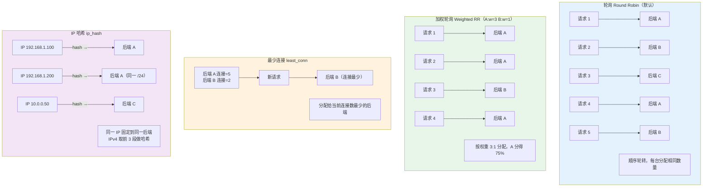
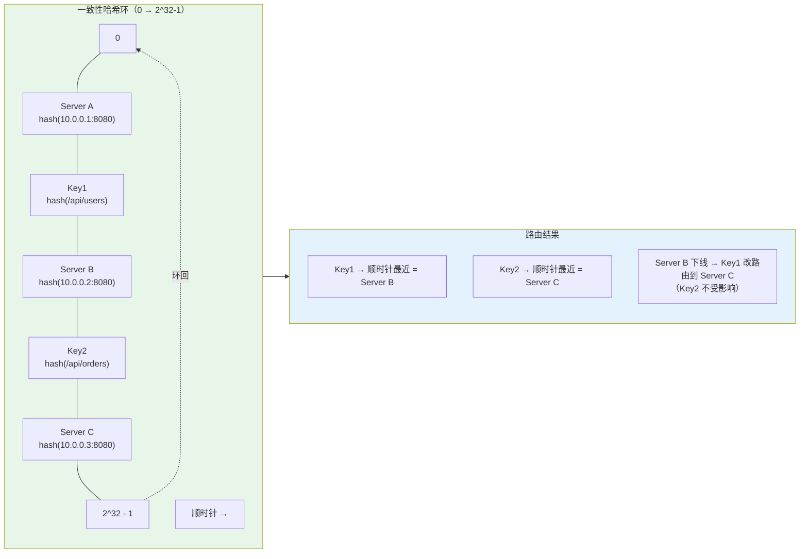
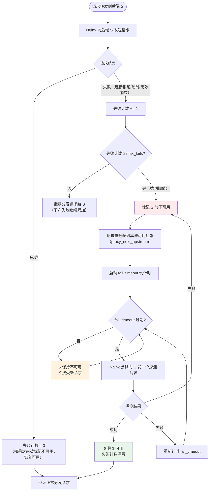

# 10 - upstream 负载均衡算法

> 版本基线：Nginx 1.30.4 (stable) | 创建日期：2026-08-05
> 受众：后端开发熟手（熟悉 Python/Java/Lua），但服务器运维是小白。本篇在 [09-反向代理proxy_pass](09-反向代理proxy_pass.md) 的基础上，深入 `upstream` 块的负载均衡算法、健康检查机制与长连接复用。

---

## 学习目标

学完本篇，你应当能够：

- 理解 `upstream` 块的作用与基本语法，掌握 `server` 指令的全部参数及其适用场景。
- 区分 Nginx 内置的五种负载均衡算法（轮询、加权轮询、最少连接、IP 哈希、一致性哈希），并能根据业务场景选择合适的算法。
- 理解 `ip_hash` 的工作原理（IPv4 前 3 段 / IPv6 全段）及其"非永久绑定"特性。
- 掌握一致性哈希（`hash` 指令）的哈希环原理，理解它与 `ip_hash` 的本质区别。
- 理解被动健康检查（`max_fails` + `fail_timeout`）的工作机制，知道单台后端时的特例行为。
- 掌握 `upstream keepalive` 长连接复用的完整配置，理解 `keepalive`、`keepalive_requests`、`keepalive_time`、`keepalive_timeout` 的作用。
- 了解 NGINX Plus 商业版独有的功能（主动健康检查、`zone` 状态共享、`slow_start` 慢启动）。
- 避开踩坑 `#2.3`、`#5.1`、`#5.2`、`#5.5`、`#5.6`。

> **前置知识**：阅读本篇前，建议先完成 [09-反向代理proxy_pass](09-反向代理proxy_pass.md)，理解 `proxy_pass` 的基本用法、尾斜杠语义与 `proxy_http_version` 的作用。本篇的 `upstream` 块正是 `proxy_pass http://backend;` 中那个 `backend` 的定义位置。

---

## 负载均衡算法总览

Nginx 开源版内置五种负载均衡算法，商业版（NGINX Plus）额外提供主动健康检查、慢启动等增强功能。下表是全部算法的快速对比：

| 算法 | 触发指令 | 请求分发依据 | 会话保持 | 开源版 | 引入版本 |
|------|---------|------------|---------|--------|---------|
| 轮询（Round Robin） | 默认，无需指令 | 顺序轮转 | 否 | 是 | — |
| 加权轮询（Weighted RR） | `weight=N` | 权重比例 | 否 | 是 | — |
| 最少连接（least_conn） | `least_conn` | 当前活跃连接数 | 否 | 是 | 1.3.1 |
| IP 哈希（ip_hash） | `ip_hash` | 客户端 IP 哈希 | 是 | 是 | 1.3.1 |
| 一致性哈希（hash） | `hash $key consistent` | 自定义 key 哈希 | 是 | 是 | 1.7.2 |
| 随机（random） | `random [two]` | 随机选择 | 否 | 是 | 1.15.1 |

> **说明**：每个 `upstream` 块只能使用一种负载均衡算法。轮询是默认算法，其他四种需要显式声明对应指令。`random` 是 1.15.1 引入的辅助算法，本篇不做深入展开，重点讲解前五种。

---

## 核心知识点

### 知识点一：upstream 块基础

#### upstream 的作用

`upstream` 块用于定义一组后端服务器。它的核心价值在于：

1. **服务器抽象**：把多台后端服务器封装成一个逻辑组，通过一个名称引用。`proxy_pass http://backend;` 中的 `backend` 就是 upstream 块的名字。
2. **负载均衡**：内置五种算法，自动在多台后端之间分发请求。
3. **健康检查**：自动检测后端可用性，剔除故障节点。
4. **连接复用**：通过 `keepalive` 指令缓存到后端的长连接，避免反复建连。
5. **优雅运维**：支持 `backup`（备用服务器）、`down`（标记下线）等运维手段。

即使只有一台后端服务器，也建议使用 upstream 块——便于后续扩容，也能启用 keepalive 长连接复用。

#### 基本语法

```nginx
http {
    # upstream 块只能定义在 http 上下文中
    upstream backend {
        server 192.168.1.10:8080;    # 后端服务器 1
        server 192.168.1.11:8080;    # 后端服务器 2
        server 192.168.1.12:8080;    # 后端服务器 3
    }

    server {
        listen 80;
        location / {
            proxy_pass http://backend;   # 引用 upstream 名称
        }
    }
}
```

逐行说明：

- `upstream backend { ... }`：定义一个名为 `backend` 的上游服务器组。名称必须是合法的 Nginx 变量名（字母、数字、下划线），后续在 `proxy_pass` 中通过 `http://backend` 引用。
- `server 192.168.1.10:8080;`：声明一台后端服务器，格式为 `address[:port]`。地址可以是 IP、域名或 Unix 域 socket（`unix:/tmp/backend.sock`）。省略端口时默认 80。
- `proxy_pass http://backend;`：把请求转发给 `backend` 这个 upstream 组，由 Nginx 根据负载均衡算法选择一台后端。

#### server 指令参数详解

`server` 指令支持以下参数，按功能分为四组：

**第一组：负载均衡参数**

| 参数 | 默认值 | 说明 |
|------|--------|------|
| `weight=number` | 1 | 服务器权重，影响请求分配比例 |
| `max_conns=number` | 0 | 最大同时活跃连接数，0 表示不限制 |

**第二组：健康检查参数**

| 参数 | 默认值 | 说明 |
|------|--------|------|
| `max_fails=number` | 1 | 在 `fail_timeout` 时间窗口内允许的失败次数，超过则标记为不可用 |
| `fail_timeout=time` | 10s | 双重含义：1) 统计 `max_fails` 的时间窗口；2) 服务器被标记不可用后的恢复等待时间 |

**第三组：状态控制参数**

| 参数 | 默认值 | 说明 |
|------|--------|------|
| `backup` | — | 标记为备用服务器，仅在所有主服务器不可用时才启用 |
| `down` | — | 标记为永久不可用，常用于优雅下线 |

**第四组：商业版参数**

| 参数 | 默认值 | 说明 | 版本要求 |
|------|--------|------|---------|
| `slow_start=time` | 0 | 慢启动时间，服务器恢复后逐步增加权重 | NGINX Plus |
| `resolve` | — | 定期重新解析域名 IP，支持 DNS 动态变更 | NGINX Plus |
| `route=string` | — | 路由名称，配合 `sticky route` 做会话保持 | NGINX Plus |
| `service=name` | — | 解析 DNS SRV 记录，自动发现服务实例 | NGINX Plus |

#### 代码示例（逐行说明）

```nginx
http {
    upstream backend {
        # ---- 主服务器 ----
        server 192.168.1.10:8080 weight=3 max_fails=3 fail_timeout=30s max_conns=1000;
        # weight=3：权重为 3，分配到这台的请求概率是 weight=1 的 3 倍
        # max_fails=3：30 秒内失败 3 次才标记不可用（默认 1 次太敏感）
        # fail_timeout=30s：统计窗口 30 秒；标记不可用后也等 30 秒再重试
        # max_conns=1000：限制同时活跃连接数为 1000，保护后端不被压垮

        server 192.168.1.11:8080 weight=2 max_fails=3 fail_timeout=30s max_conns=800;
        # weight=2：权重为 2，分配概率是 weight=1 的 2 倍

        server 192.168.1.12:8080 weight=1 max_fails=3 fail_timeout=30s;
        # weight=1（默认）：权重最低，分配请求最少

        # ---- 备用服务器 ----
        server 192.168.1.99:8080 backup;
        # backup：仅当上面三台全部不可用时才启用

        # ---- 下线服务器 ----
        server 192.168.1.13:8080 down;
        # down：标记为永久不可用，Nginx 不会向它发任何请求
        # 常用于优雅下线：先标记 down，确认无流量后再关闭后端进程

        # ---- 长连接复用 ----
        keepalive 32;
        # 每个 worker 缓存 32 个到后端的空闲长连接（见知识点八）
    }

    server {
        listen 80;
        location / {
            proxy_pass http://backend;
        }
    }
}
```

> **特例说明**：
> 1. `upstream` 块只能定义在 `http` 上下文中，不能放在 `server` 或 `location` 中。每个 `http` 块可以包含多个 `upstream` 块，各自独立命名。
> 2. `fail_timeout` 的双重含义容易混淆——它既是"统计失败的时间窗口"，也是"标记不可用后的恢复等待时间"。例如 `max_fails=3 fail_timeout=30s` 表示：30 秒内出现 3 次失败 → 标记不可用 → 30 秒后重新尝试。两个 30 秒是同一个值。
> 3. `max_conns` 在开源版中是**每个 worker 独立计数**的（没有 `zone` 指令共享状态）。如果有 4 个 worker，实际最大连接数是 `max_conns × 4`。只有商业版的 `zone` 指令才能实现全 worker 共享计数（见知识点十）。

---

### 知识点二：轮询（Round Robin，默认算法）

#### 工作原理

轮询是 Nginx 的**默认负载均衡算法**，不需要任何额外指令。请求按顺序逐一分发到 upstream 中的每台后端服务器，循环往复。

```
请求 1 → 后端 A
请求 2 → 后端 B
请求 3 → 后端 C
请求 4 → 后端 A（回到开头，继续循环）
请求 5 → 后端 B
请求 6 → 后端 C
...
```

#### 代码示例

```nginx
upstream backend {
    # 不写任何负载均衡指令，默认就是轮询
    server 192.168.1.10:8080;    # 后端 A
    server 192.168.1.11:8080;    # 后端 B
    server 192.168.1.12:8080;    # 后端 C
}
# 请求 1→A, 2→B, 3→C, 4→A, 5→B, 6→C ... 依次循环
```

#### 适用场景

- 后端服务器**性能相同**（CPU、内存、网络配置一致）。
- 请求**处理时间相近**（不会出现某台后端积压大量慢请求的情况）。
- 不需要会话保持（Session 在后端间共享，或无状态服务）。

> **特例说明**：轮询不保证绝对均匀。如果某台后端处理某个请求特别慢，Nginx 的 worker 在等待响应期间无法把后续请求分给它，导致短时间内流量倾斜到其他后端。这种场景应改用 `least_conn`（知识点四）。

---

### 知识点三：加权轮询（Weight）

#### 工作原理

加权轮询是轮询的增强版，通过 `weight` 参数为每台后端分配不同的权重。Nginx 按权重比例分发请求——权重越高，分配到的请求越多。

#### 权重计算逻辑

假设有两台后端，`backend1 weight=3`，`backend2 weight=1`，总权重为 4。Nginx 的加权轮询算法不是简单地"3:1 交替分发"，而是在一个调度周期内（总权重次请求）按权重比例分配：

```
调度周期（4 次请求）：
请求 1 → backend1
请求 2 → backend1
请求 3 → backend2
请求 4 → backend1
--- 新的周期 ---
请求 5 → backend1
请求 6 → backend1
请求 7 → backend2
请求 8 → backend1
...
```

具体分发顺序由 Nginx 内部的平滑加权轮询算法（Smooth Weighted Round-Robin）决定，确保在任意时间段内流量比例都接近权重比，而不是集中爆发。

#### 代码示例

```nginx
upstream backend {
    # 场景：backend1 是 8 核 16G，backend2 是 4 核 8G，性能比约 3:1
    server 192.168.1.10:8080 weight=3;   # 高性能机器，分配 75% 请求
    server 192.168.1.11:8080 weight=1;   # 低性能机器，分配 25% 请求
}
# 总权重 = 3 + 1 = 4
# backend1 分得 3/4 = 75%，backend2 分得 1/4 = 25%
```

#### 适用场景

- 后端服务器**性能不均**（如一台 8 核、一台 4 核），通过权重让高性能机器承担更多流量。
- 灰度发布：新版本服务器设低权重（如 `weight=1`），老版本设高权重（如 `weight=9`），逐步引流到新版本。
- 金丝雀发布：将少量流量导入新部署的节点。

> **特例说明**：加权轮询是**统计上趋近权重比**，不是严格的 N:1 交替。由于请求处理时间不同、worker 进程独立调度，短时间内实际比例可能偏离设定值。如果需要精确控制流量比例，应在应用层使用更细粒度的流量控制（如服务网格的权重路由）。

---

### 知识点四：最少连接（least_conn）

#### 工作原理

`least_conn` 指令把请求分配给**当前活跃连接数最少**的后端服务器。Nginx 会实时跟踪每台后端的活跃连接数（已发出但尚未收到响应的请求），新请求总是流向最空闲的那台。

```
当前状态：
  后端 A：活跃连接 5
  后端 B：活跃连接 2  ← 最少，新请求来这
  后端 C：活跃连接 8

新请求到达 → 分配给后端 B（连接数最少）
后端 B 活跃连接变为 3

下一个请求到达 → 重新比较，分配给当前最少的那台
```

#### 与加权轮询的组合：least_conn + weight

`least_conn` 可以与 `weight` 组合使用。当多台后端的活跃连接数相同时，Nginx 按**权重比例**在它们之间选择。权重越高的服务器，在连接数相同的情况下被选中的概率越大。

```nginx
upstream backend {
    least_conn;                              # 启用最少连接算法
    server 192.168.1.10:8080 weight=3;       # 高性能机器，连接数相同时优先选它
    server 192.168.1.11:8080 weight=1;       # 低性能机器
    server 192.168.1.12:8080 weight=1;       # 低性能机器
}
# 如果三台后端活跃连接数相同，按 3:1:1 的权重概率分配
```

#### 代码示例

```nginx
upstream backend {
    # 场景：请求处理时间差异大（有些 10ms，有些 5s）
    # 用轮询会导致慢请求堆积在某台后端
    least_conn;                              # 启用最少连接算法
    server 192.168.1.10:8080 weight=3;       # 8 核机器，权重高
    server 192.168.1.11:8080 weight=2;       # 4 核机器，权重中
    server 192.168.1.12:8080 weight=1;       # 2 核机器，权重低
}
```

#### 适用场景

- 请求**处理时间差异大**：有些请求几毫秒返回，有些需要几秒甚至几十秒。轮询会导致慢请求堆积在分配到它的那台后端，而 `least_conn` 能自动把新请求分给更空闲的机器。
- 混合负载：同一组后端同时处理快速 API 请求和慢速报表请求。
- 长连接服务：如 WebSocket、SSE，连接持续时间长，轮询会导致连接数不均。

> **特例说明**：当所有后端的活跃连接数相同时（例如刚启动，所有连接数都是 0），`least_conn` 退化为加权轮询——按 `weight` 比例选择。因此 `least_conn` 本质上是"连接数优先，权重兜底"的策略。

---

### 知识点五：IP 哈希（ip_hash）

#### 工作原理

`ip_hash` 指令根据**客户端 IP 地址**进行哈希计算，将哈希结果映射到固定的后端服务器。同一个客户端 IP 的请求总是被分配到同一台后端，实现**会话保持**（Session 粘性）。

哈希的输入是客户端 IP 地址：

- **IPv4**：取前 3 段（如 `192.168.1.100` 只取 `192.168.1`），第 4 段忽略。这意味着同一个 `/24` 子网内的所有客户端会被分配到同一台后端。
- **IPv6**：取完整地址（128 位全部参与哈希）。

```
客户端 192.168.1.100 → hash("192.168.1") → 后端 A
客户端 192.168.1.200 → hash("192.168.1") → 后端 A（同一 /24 子网）
客户端 10.0.0.50     → hash("10.0.0")    → 后端 C
```

#### 代码示例

```nginx
upstream backend {
    ip_hash;                              # 启用 IP 哈希算法（必须在 server 指令之前声明）
    server 192.168.1.10:8080 weight=3;    # 后端 A，ip_hash 也支持 weight
    server 192.168.1.11:8080 weight=2;    # 后端 B
    server 192.168.1.12:8080 weight=1;    # 后端 C
}
# 客户端 IP 192.168.1.100 的所有请求 → 固定到后端 A（直到后端变更）
```

逐行说明：

- `ip_hash;`：声明使用 IP 哈希算法。注意：`ip_hash`、`least_conn`、`hash` 等**负载均衡指令互斥**，一个 upstream 块只能用一个。
- `weight=3`：`ip_hash` 自 Nginx 1.3.2 起支持 `weight` 参数。权重影响哈希到每台后端的概率分布，但同一个 IP 仍然固定分配。
- 同一个客户端 IP 的所有请求会固定到同一台后端，后端的 Session 无需跨机器共享。

#### 适用场景和限制

**适用场景**：
- 后端使用**本地 Session**（如 Tomcat 的内存 Session），没有 Redis 等共享存储。
- 需要保持客户端与后端的**会话粘性**，如购物车、登录状态。
- 客户端 IP 相对固定（非大规模 NAT/代理环境）。

**限制**：
- **后端变更会导致哈希重分布**：添加或移除后端服务器时，哈希空间改变，大量客户端的请求会被重新分配到不同的后端，导致 Session 丢失。
- **NAT 环境下负载不均**：企业内网大量用户共用同一个公网 IP（NAT），这些请求会被全部固定到同一台后端，导致负载严重不均。
- **不支持 backup 服务器**：`ip_hash` 模块不支持 `backup` 参数。
- **IPv4 只取前 3 段**：同一 `/24` 子网内的所有客户端被当作同一个来源，可能导致企业内网流量集中。

> **特例说明：后端下线时 ip_hash 会自动重分配（不是永久绑定）**
>
> `ip_hash` 的绑定关系是**基于当前可用后端列表**计算的，不是永久绑定。当某台后端被标记为不可用（`max_fails`/`fail_timeout` 触发）或显式标记为 `down` 时：
>
> 1. Nginx 将该后端从可用列表中移除。
> 2. 重新计算哈希分布，原先分配到该后端的客户端会被**自动重分配**到其他可用后端。
> 3. 当该后端恢复后，客户端会重新回到原来的绑定关系。
>
> 因此，**移除一台后端服务器时，应使用 `down` 参数而非直接删除 `server` 行**。使用 `down` 可以保留该服务器在哈希空间中的位置，使剩余服务器的哈希分布变化最小化：
>
> ```nginx
> upstream backend {
>     ip_hash;
>     server 192.168.1.10:8080;
>     server 192.168.1.11:8080 down;   # 标记下线而非删除，保留哈希位置
>     server 192.168.1.12:8080;
> }
> # 直接删除 192.168.1.11 的 server 行会导致哈希空间完全重算
> # 用 down 标记则只影响分配到该后端的客户端，其余客户端不变
> ```

---

### 知识点六：一致性哈希（hash 指令）

#### 与 ip_hash 的区别

`hash` 指令是 `ip_hash` 的通用化版本。它们的区别在于哈希的**输入 key**：

| 特性 | ip_hash | hash |
|------|---------|------|
| 哈希输入 | 固定为客户端 IP（IPv4 前 3 段） | 任意 Nginx 变量（`$uri`、`$request_uri`、`$remote_addr` 等） |
| 一致性 | 不支持 | 支持（`consistent` 参数） |
| 引入版本 | 1.3.1 | 1.7.2 |
| 会话保持 | 基于 IP | 基于自定义 key |

#### 语法

```nginx
# 简单哈希（取模）：添加/移除服务器时大量 key 重新映射
hash $key;

# 一致性哈希（Ketama 算法）：添加/移除服务器时只影响相邻 key
hash $key consistent;
```

常用 key 选择：

| key 变量 | 含义 | 适用场景 |
|---------|------|---------|
| `$remote_addr` | 客户端 IP | 等效于 ip_hash 但支持一致性 |
| `$request_uri` | 完整请求 URI（含参数） | 按 URL 分配到缓存节点 |
| `$uri` | 请求路径（不含参数） | 按路径分配到缓存节点 |
| `$http_x_user_id` | 自定义请求头 | 按用户 ID 做会话保持 |

#### 一致性哈希原理简述（哈希环）

一致性哈希通过**哈希环**解决"后端变更导致大量重映射"的问题：

1. **构建哈希环**：将哈希空间想象成一个 0 到 2^32-1 的首尾相连的环。
2. **服务器上环**：对每台后端服务器的标识（如 `IP:port`）做哈希，将哈希值映射到环上的某个位置。每台服务器在环上生成多个**虚拟节点**（virtual nodes），确保分布均匀。
3. **请求上环**：对请求的 key（如 `$request_uri`）做同样的哈希，映射到环上的某个位置。
4. **顺时针查找**：从 key 的位置沿环**顺时针**走，遇到的**第一台服务器**即为该请求的目标。

```
哈希环示意：

           0
         /     \
    ServerA     ServerB
      |           |
    ServerC     Key1 → ServerB（顺时针最近的）
      |           |
         \     /
          2^32-1

当 ServerB 下线时：
  Key1 顺时针遇到的下一个是 ServerA（只影响原来分配到 ServerB 的 key）
  其他 key 的分配不变
```

**关键优势**：当添加或移除一台服务器时，只影响哈希环上**该服务器位置附近**的 key，绝大多数 key 的分配保持不变。而简单取模哈希（不加 `consistent`）在服务器数量变化时，几乎所有 key 都需要重新映射。

#### 代码示例

```nginx
# 场景一：按请求 URI 做一致性哈希，优化缓存命中率
upstream cache_backend {
    hash $request_uri consistent;         # 按完整 URI（含参数）做一致性哈希
    server 192.168.1.10:8080;             # 缓存节点 A
    server 192.168.1.11:8080;             # 缓存节点 B
    server 192.168.1.12:8080;             # 缓存节点 C
}
# 同一个 URL 的请求总是打到同一台缓存节点，命中率最大化
# 添加/移除节点时只有少量 URL 需要重新缓存

# 场景二：按客户端 IP 做一致性哈希（替代 ip_hash）
upstream session_backend {
    hash $remote_addr consistent;         # 按客户端 IP 做一致性哈希
    server 192.168.1.10:8080;
    server 192.168.1.11:8080;
}
# 比 ip_hash 更平滑：添加/移除后端时只有部分客户端重映射

# 场景三：简单哈希（不加 consistent，不推荐用于动态后端）
upstream simple_backend {
    hash $request_uri;                    # 简单取模哈希
    server 192.168.1.10:8080;
    server 192.168.1.11:8080;
}
# 后端数量变化时几乎全部 key 重新映射，仅适合后端固定的场景
```

逐行说明：

- `hash $request_uri consistent;`：使用请求的完整 URI（含查询参数）作为哈希 key，启用一致性哈希算法。`consistent` 关键字触发了 Ketama 算法。
- `hash $remote_addr consistent;`：用客户端 IP 做一致性哈希，效果类似 `ip_hash` 但支持一致性——后端变更时只影响部分客户端。
- `hash $request_uri;`（不加 `consistent`）：简单取模哈希，`hash(key) % N`，N 为后端数量。后端数量变化时几乎全部 key 重新映射。

#### 适用场景

- **缓存命中率优化**：多级缓存架构中，按 URL 将请求固定到同一台缓存节点，避免同一资源被多台节点重复缓存。
- **会话保持**：按用户 ID 或 IP 做一致性哈希，比 `ip_hash` 更平滑地应对后端扩缩容。
- **分片路由**：按特定 key（如用户 ID）将请求路由到负责该分片的后端。

> **特例说明**：`hash` 指令如果不加 `consistent` 参数，则使用简单的取模哈希（`hash(key) % server_count`），添加或移除服务器时**几乎所有 key** 都会重新映射，失去了"一致性"的优势。因此生产环境几乎总是应该加 `consistent`。另外，`hash` 指令同样不支持 `backup` 服务器——如果配置了 `backup`，Nginx 会在启动时忽略它，直到所有主服务器不可用时才将请求转给 backup（此时哈希分配逻辑不再生效）。

---

### 知识点七：健康检查

健康检查是 Nginx 判断后端服务器是否可用的机制。开源版只支持**被动健康检查**，商业版（NGINX Plus）额外支持**主动健康检查**。

#### 被动健康检查：max_fails + fail_timeout（开源版）

被动健康检查不需要额外的指令——它在请求转发过程中**顺便**检测后端状态。核心机制依赖 `server` 指令的 `max_fails` 和 `fail_timeout` 参数：

1. Nginx 向某台后端转发请求。
2. 如果请求失败（连接拒绝、超时、读到无效响应头等），该后端的失败计数器 +1。
3. 如果在 `fail_timeout` 时间窗口内，失败次数达到 `max_fails`，该后端被标记为**不可用**。
4. 在接下来的 `fail_timeout` 时间内，Nginx 不再向该后端分发请求。
5. `fail_timeout` 过期后，Nginx 会尝试向该后端发一个请求——如果成功，恢复可用；如果失败，继续等待下一个 `fail_timeout` 周期。

#### 被动检查的工作机制

```
时间线示例（max_fails=3, fail_timeout=30s）：

t=0s   请求 → 后端A，失败（失败计数=1）
t=5s   请求 → 后端A，失败（失败计数=2）
t=10s  请求 → 后端A，失败（失败计数=3 ≥ max_fails）
       → 后端A 被标记为不可用，接下来 30s 不分发请求给它
       → 请求转给其他可用后端

t=10s ~ t=40s  后端A 不可用期间，所有请求分给后端B、C

t=40s  fail_timeout 过期，Nginx 尝试向后端A 发一个请求
       → 如果成功：后端A 恢复可用，失败计数清零
       → 如果失败：后端A 继续不可用，再等 30s
```

#### 主动健康检查：health_check 指令（NGINX Plus 独有）

被动检查的缺点是"只有被请求的瞬间才能发现问题"。NGINX Plus 提供了 `health_check` 指令，**主动**向后端发送健康探测请求：

```nginx
# NGINX Plus 独有功能
upstream backend {
    zone backend 64k;                     # 必须配 zone 才能用 health_check
    server 192.168.1.10:8080;
    server 192.168.1.11:8080;
}

server {
    location / {
        proxy_pass http://backend;
        health_check interval=5s          # 每 5 秒探测一次
                     fails=3              # 连续失败 3 次标记不可用
                     passes=2             # 连续成功 2 次恢复可用
                     uri=/health          # 探测请求的 URI
                     match=ok;            # 使用 match 块定义健康判定条件
    }
}

# match 块：定义健康响应的判定标准
match ok {
    status 200;                           # 响应状态码必须是 200
    header Content-Type = application/json;  # 响应头必须包含此字段
    body ~ '"status":"ok"';               # 响应体匹配正则
}
```

#### 第三方模块：nginx_upstream_check_module

开源版如果需要主动健康检查，可以使用第三方模块 `nginx_upstream_check_module`。它需要重新编译 Nginx（不支持动态加载），配置方式类似 NGINX Plus：

```nginx
# 需要编译安装 nginx_upstream_check_module
upstream backend {
    server 192.168.1.10:8080;
    server 192.168.1.11:8080;
    check interval=3000 rise=2 fall=3 timeout=2000 type=http;
    # interval=3000：每 3 秒探测一次
    # rise=2：连续成功 2 次恢复可用
    # fall=3：连续失败 3 次标记不可用
    # timeout=2000：探测超时 2 秒
    # type=http：使用 HTTP 探测
    check_http_send "GET /health HTTP/1.0\r\n\r\n";  # 探测请求内容
    check_http_expect_alive http_2xx;                 # 期望 2xx 状态码
}
```

#### 代码示例（被动健康检查，逐行说明）

```nginx
upstream backend {
    # 被动健康检查配置
    server 192.168.1.10:8080 max_fails=3 fail_timeout=30s;
    # max_fails=3：30 秒内失败 3 次才标记不可用
    # fail_timeout=30s：统计窗口 30 秒 + 不可用恢复等待 30 秒
    # 默认 max_fails=1 太敏感，偶发网络抖动就会下线后端

    server 192.168.1.11:8080 max_fails=3 fail_timeout=30s;

    # 故障转移：请求失败时自动重试下一台
    # proxy_next_upstream 在 location 中配置
}

server {
    location / {
        proxy_pass http://backend;

        # 以下情况触发重试到下一台后端
        proxy_next_upstream error timeout http_502 http_503 http_504;

        # 重试次数和总超时
        proxy_next_upstream_tries 3;       # 最多尝试 3 台（含首次）
        proxy_next_upstream_timeout 10s;   # 重试总超时 10 秒
    }
}
```

> **引用踩坑 [#5.1 upstream 被动健康检查误判](../99-踩坑记录与解决方案.md#51-upstream-被动健康检查误判)**：开源版默认 `max_fails=1`、`fail_timeout=10s`，一次偶发失败就会把后端下线 10 秒。生产环境应调大为 `max_fails=3 fail_timeout=30s`，容忍偶发抖动。

> **引用踩坑 [#5.2 单台后端时 max_fails/fail_timeout 失效](../99-踩坑记录与解决方案.md#52-单台后端时-max_failsfail_timeout-失效)**：当 upstream 只有一台 server 时，`max_fails`、`fail_timeout`、`slow_start` 参数被忽略——Nginx 永远不会把唯一的一台后端标记为不可用（因为没有其他后端可以接管）。解决方案是至少加一台 `backup` 服务器，或用 `proxy_next_upstream` 配合重试。

> **特例说明**：被动健康检查的"失败"判定标准是：连接被拒绝（connection refused）、连接超时、读取响应超时、响应头格式非法。**后端返回 500/502/503 等错误状态码不算失败**——除非你在 `proxy_next_upstream` 中显式配置了 `http_500` 等选项。这意味着即使后端持续返回 500，被动健康检查也不会把它下线。如果需要根据 HTTP 状态码做健康检查，必须用 NGINX Plus 的 `health_check` 或第三方模块。

---

### 知识点八：upstream keepalive（长连接复用）

#### keepalive 指令：缓存到后端的长连接

默认情况下，Nginx 到后端的每个请求都会新建一条 TCP 连接，请求完成后关闭。在高并发场景下，大量 TCP 连接的建立和关闭会带来显著的性能开销，后端会出现大量 `TIME_WAIT` 状态的连接。

`keepalive` 指令解决了这个问题——它在 Nginx 和后端之间维护一个**空闲长连接缓存池**。请求完成后，连接不关闭，而是放回缓存池供下一个请求复用。

```
没有 keepalive：                     有 keepalive：
请求1 → 建连 → 转发 → 响应 → 关连    请求1 → 建连 → 转发 → 响应 → 放回缓存池
请求2 → 建连 → 转发 → 响应 → 关连    请求2 → 复用缓存池连接 → 转发 → 响应 → 放回
请求3 → 建连 → 转发 → 响应 → 关连    请求3 → 复用缓存池连接 → 转发 → 响应 → 放回
（3 次 TCP 握手 + 3 次挥手）           （1 次 TCP 握手 + 1 次挥手）
```

#### 必须配套的指令：proxy_http_version + Connection 头

启用 keepalive 长连接需要三个条件同时满足：

1. `upstream` 块中声明 `keepalive N;`——设置缓存池大小。
2. `location` 中设置 `proxy_http_version 1.1;`——HTTP/1.0 不支持 keepalive。
3. `location` 中设置 `proxy_set_header Connection "";`——清除默认的 `Connection: close` 头。

#### keepalive_requests / keepalive_time / keepalive_timeout

长连接不是无限复用的，三条指令控制连接的生命周期：

| 指令 | 默认值 | 作用 | 引入版本 |
|------|--------|------|---------|
| `keepalive_requests` | 1000 | 单条连接最多处理多少个请求，超过后关闭 | 1.15.3 |
| `keepalive_time` | 1h | 单条连接最长存活时间，超过后关闭 | 1.19.10 |
| `keepalive_timeout` | 60s | 空闲超时——连接在缓存池中闲置超过此时间则关闭 | 1.15.3 |

这三条指令防止长连接因累积过多请求或存活过久而出现内存泄漏、连接老化等问题。

#### 版本提示：1.29.7 起默认开启

自 Nginx 1.29.7 起，upstream keepalive 的基础设施默认开启：

- `proxy_http_version` 默认值从 `1.0` 改为 `1.1`。
- 向上游发送请求时，默认自动清理 `Connection` 头（等效于 `proxy_set_header Connection "";`）。

在 1.30.4 上，`proxy_http_version 1.1` 和 `proxy_set_header Connection ""` 不再是必写项。但 `keepalive N;` 仍然需要在 upstream 块中显式声明，以控制缓存池大小——不写则不缓存空闲连接。

#### 代码示例（逐行说明）

```nginx
http {
    upstream backend {
        server 192.168.1.10:8080;
        server 192.168.1.11:8080;

        keepalive 32;                # 每个 worker 缓存最多 32 个空闲长连接
        # 注意：这是"每个 worker"独立计数，4 个 worker = 最多 128 个空闲连接
        # 不是总连接数！活跃连接（正在处理请求的）不受此限制

        keepalive_requests 1000;     # 单条连接最多处理 1000 个请求后关闭重建
        # 防止连接因处理过多请求而出现内存泄漏或性能退化

        keepalive_time 1h;          # 单条连接最长存活 1 小时
        # 即使没达到 1000 个请求，存活超过 1 小时也会关闭重建
        # 防止连接老化（如后端防火墙的连接超时）

        keepalive_timeout 60s;      # 空闲连接在缓存池中最多闲置 60 秒
        # 超过 60 秒没有被复用的连接会被关闭
        # 避免缓存池中堆积大量低效空闲连接
    }

    server {
        listen 80;

        location / {
            proxy_pass http://backend;

            # 1.30.4 上以下两行可不写（1.29.7 起默认行为），
            # 但显式写出更清晰，且向后兼容旧版本
            proxy_http_version 1.1;           # 用 HTTP/1.1 与后端通信（支持 keepalive）
            proxy_set_header Connection "";   # 清除 Connection: close，启用长连接复用

            # 透传客户端信息（标准套件）
            proxy_set_header Host $host;
            proxy_set_header X-Real-IP $remote_addr;
            proxy_set_header X-Forwarded-For $proxy_add_x_forwarded_for;
            proxy_set_header X-Forwarded-Proto $scheme;
        }
    }
}
```

> **引用踩坑 [#2.3 未启用 upstream keepalive（长连接复用）](../99-踩坑记录与解决方案.md#23-未启用-upstream-keepalive长连接复用)**：旧版 Nginx 默认到上游用短连接，高并发下后端出现大量 `TIME_WAIT`，QPS 上不去。解决方案是在 upstream 块中加 `keepalive 32`，在 location 中加 `proxy_http_version 1.1` + `proxy_set_header Connection ""`。1.30.4 上后两者已默认开启，但 `keepalive N` 仍需显式声明。

> **引用踩坑 [#5.6 长连接复用导致后端连接数被压垮](../99-踩坑记录与解决方案.md#56-长连接复用导致后端连接数被压垮)**：`keepalive 1000;` 设过大会导致后端连接池被打满。`keepalive` 限制的是每个 worker 的**空闲**缓存连接数，不是总连接数。4 个 worker × 1000 = 4000 个空闲连接可能远超后端承受能力。建议设为 16-64。

> **引用踩坑 [#5.5 upstream keepalive 与负载均衡方法顺序（旧版）](../99-踩坑记录与解决方案.md#55-upstream-keepalive-与负载均衡方法顺序旧版)**：1.29.7 前，使用 `ip_hash`/`least_conn` 等非默认算法时，必须先声明负载均衡方法再写 `keepalive`，否则可能不生效。1.29.7+ 已默认开启 keepalive，顺序不再强制。

> **特例说明**：WebSocket 代理时，`proxy_set_header Connection "upgrade"` 与 keepalive 的 `proxy_set_header Connection ""` 冲突。WebSocket 所在的 location **不要**清理 Connection 头，应单独配置 `Upgrade`/`Connection` 头。该 location 的连接也不会进入 upstream keepalive 缓存池——WebSocket 是长连接，本身就不会关闭，不需要缓存复用。详见 [12-WebSocket代理](12-WebSocket代理.md) 和踩坑 `#5.3`。

---

### 知识点九：backup 服务器

#### 工作原理

`backup` 参数将一台服务器标记为**备用服务器**。在正常运行期间，backup 服务器不参与负载均衡，Nginx 不会向它分发任何请求。只有当**所有主服务器（非 backup）都被标记为不可用**时，backup 服务器才会被启用。当任意一台主服务器恢复后，backup 服务器重新回到待命状态。

#### 代码示例

```nginx
upstream backend {
    # 主服务器集群
    server 192.168.1.10:8080 max_fails=3 fail_timeout=30s;   # 主 A
    server 192.168.1.11:8080 max_fails=3 fail_timeout=30s;   # 主 B
    server 192.168.1.12:8080 max_fails=3 fail_timeout=30s;   # 主 C

    # 备用服务器：仅当 A、B、C 全部不可用时才启用
    server 192.168.1.99:8080 backup;                          # 备用 D
}
# 正常运行：请求在 A、B、C 之间负载均衡，D 闲置
# A、B、C 全部宕机：请求全部转到 D
# A 恢复：请求回到 A（和 B、C），D 重新待命
```

#### 适用场景

- **灾备兜底**：主集群全部宕机时，用一台低配机器提供降级服务（如返回缓存数据或静态提示页）。
- **维护窗口**：计划性维护时逐台下线主服务器，确保始终有 backup 兜底。注意：只有一台主服务器时 `max_fails`/`fail_timeout` 被忽略（踩坑 `#5.2`），所以至少要有两台主服务器才能触发 backup。
- **跨机房容灾**：主服务器在同机房，backup 在异地机房，平时不承担流量，仅故障时启用。

> **特例说明**：`ip_hash` 和 `hash` 算法对 backup 服务器的支持有限。`ip_hash` 不支持 backup 服务器（配置了会被忽略）。`hash` 指令在所有主服务器可用时不计算 backup，只有全部主服务器不可用时才将请求转给 backup（此时哈希分配逻辑不再生效）。因此 backup 主要与轮询、加权轮询、`least_conn` 配合使用。

---

### 知识点十：upstream 的状态共享

#### Nginx 各 worker 进程独立维护后端状态

Nginx 采用多 worker 进程架构（详见 [03-进程模型与控制管理](../01-基础认知/03-进程模型与控制管理.md)）。在开源版中，每个 worker 进程**独立维护** upstream 的运行时状态：

- **连接计数**：每个 worker 独立统计到每台后端的活跃连接数。`least_conn` 算法基于本 worker 的连接数做决策，不同 worker 的决策可能不同。
- **失败计数**：每个 worker 独立统计后端失败次数。一个 worker 把后端 A 标记为不可用，其他 worker 可能仍认为 A 可用。
- **max_conns 限制**：开源版的 `max_conns` 是每个 worker 独立限制的。4 个 worker × `max_conns=1000` = 实际最大 4000 连接。

这意味着：
1. 不同 worker 对同一台后端的健康状态判断可能不一致。
2. `least_conn` 的负载均衡效果在 worker 间是各自为政的，整体负载可能不完全均衡。
3. `max_conns` 的实际效果是 `设定值 × worker 数量`，可能远超预期。

#### zone 指令（商业版）：worker 间共享状态

NGINX Plus 的 `zone` 指令创建一块**共享内存区域**，让所有 worker 进程共享 upstream 的配置和运行时状态：

```nginx
# NGINX Plus 独有功能
upstream backend {
    zone backend 64k;                  # 创建 64KB 共享内存区域，名为 backend
    # 所有 worker 共享以下状态：
    # - 后端健康状态（一个 worker 标记不可用，全部 worker 同步）
    # - 活跃连接计数（max_conns 全局生效）
    # - keepalive 连接池（连接可跨 worker 复用）

    server 192.168.1.10:8080 max_conns=1000;  # max_conns 现在是全局限制
    server 192.168.1.11:8080;
}
```

`zone` 的优势：

1. **健康状态一致**：一个 worker 检测到后端故障，全部 worker 立即同步，避免其他 worker 继续向故障后端发请求。
2. **max_conns 全局生效**：`max_conns=1000` 就是全局 1000，不再乘以 worker 数量。
3. **keepalive 连接池共享**：空闲连接可跨 worker 复用，连接利用率更高。
4. **支持动态管理**：配合 NGINX Plus 的 API（`api` 指令），可以动态添加/移除/上下线后端服务器，无需 reload。

> **特例说明**：开源版没有 `zone` 指令，worker 间状态不共享。在大多数场景下这不会造成严重问题——因为请求会被负载均衡器（如 LVS、云 SLB）均匀分发到各 worker，每个 worker 的后端状态大致一致。但在极端场景下（如某台后端间歇性故障），可能出现"一个 worker 认为它可用、另一个认为不可用"的情况，导致部分请求失败。如果对健康检查的一致性要求很高，需要考虑 NGINX Plus 或第三方模块。

---

### 知识点十一：慢启动 slow_start

#### 工作原理

`slow_start` 参数让一台服务器在**恢复可用**或**新加入** upstream 时，不立即承担全部权重，而是从权重 0 开始**逐步增加**到设定值。这个过程叫"慢启动"。

```
慢启动过程（slow_start=30s, weight=10）：

t=0s    服务器恢复 → 权重 = 0（不接受请求）
t=3s    权重 = 1（接受少量请求）
t=6s    权重 = 2
t=9s    权重 = 3
...
t=30s   权重 = 10（完全恢复，承担全部流量）
```

慢启动的价值在于：刚恢复的后端可能还在预热（如 JVM JIT 编译、缓存加载、数据库连接池建立），如果立即涌入全部流量，可能导致响应缓慢甚至再次崩溃。慢启动给后端一个"热身"的时间窗口。

#### 配置示例

```nginx
# NGINX Plus 独有功能
upstream backend {
    server 192.168.1.10:8080 weight=10 slow_start=30s;
    # weight=10：正常运行时权重为 10
    # slow_start=30s：恢复或新加入时，用 30 秒从 0 逐步增加到 10

    server 192.168.1.11:8080 weight=10 slow_start=30s;

    zone backend 64k;                  # slow_start 依赖 zone 共享状态
}
```

逐行说明：

- `slow_start=30s`：服务器恢复后，用 30 秒时间逐步从权重 0 增加到 `weight` 设定值。在这 30 秒内，该服务器只承担逐步增加的少量流量。
- `zone backend 64k;`：`slow_start` 依赖 `zone` 指令共享状态，否则各 worker 独立计时会导致慢启动不一致。因此 `slow_start` 必须配合 `zone` 使用，而 `zone` 是商业版功能——所以 `slow_start` 也是**仅商业版支持**的。

#### 适用场景

- 后端使用 JVM 类运行时（Java/Scala/Kotlin）：JVM 需要预热（JIT 编译热点代码），冷启动时性能只有峰值的 20%-50%。
- 后端有本地缓存（如 Guava Cache、Caffeine）：恢复后需要时间从数据库或 Redis 重新加载缓存。
- 后端有连接池（如数据库连接池、HTTP 客户端连接池）：需要时间逐步建立连接。
- 后端从故障中恢复：避免立即涌入大量请求导致"二次崩溃"。

> **特例说明**：`slow_start` 仅在以下情况触发——服务器从不可用状态恢复（`fail_timeout` 过期后探测成功）、服务器通过 NGINX Plus API 动态加入或启用（`state=up`）。**服务器首次启动（Nginx reload）时不触发慢启动**——因为此时所有服务器都是"新"的，如果都慢启动则没有服务器可以接收流量。另外，`slow_start` 在单台后端的 upstream 中不生效（与 `max_fails`/`fail_timeout` 一样，单台后端时这些参数被忽略）。

---

## Mermaid 图

### 图一：各负载均衡算法请求分发示意图



### 图二：一致性哈希环示意图



图中的核心逻辑：服务器和请求 key 都通过哈希函数映射到环上的某个位置。请求 key 沿环**顺时针**找到的第一台服务器即为目标。当某台服务器下线时，只有分配到它的 key 需要重新路由到下一台，其余 key 的路由不变——这就是"一致性"的含义。

### 图三：被动健康检查流程



流程要点：
1. 被动检查**不主动探测**，只在请求转发过程中顺便记录失败。
2. 失败计数在 `fail_timeout` 时间窗口内累计，达到 `max_fails` 后标记不可用。
3. 不可用期间持续 `fail_timeout` 时间，到期后发一个探测请求判断是否恢复。
4. 探测失败则继续不可用，再等一个 `fail_timeout` 周期。
5. **HTTP 500/502/503 等错误状态码不算失败**——除非配置了 `proxy_next_upstream http_500` 等。

---

## 最佳实践

### 1. 始终用 upstream 块，即使只有一台后端

```nginx
# 推荐：用 upstream，便于扩容和 keepalive
upstream backend {
    server 127.0.0.1:8080;
    keepalive 32;
}

# 避免：直接写死地址
# proxy_pass http://127.0.0.1:8080;  # 无法 keepalive，无法扩容
```

### 2. 根据场景选择算法

| 场景 | 推荐算法 | 理由 |
|------|---------|------|
| 后端性能相同，请求处理时间相近 | 轮询（默认） | 简单公平 |
| 后端性能不同 | 加权轮询 | 按性能比例分配 |
| 请求处理时间差异大 | `least_conn` | 避免慢请求堆积 |
| 需要会话保持，无共享 Session | `ip_hash` | 按 IP 固定分配 |
| 缓存节点，需优化命中率 | `hash $request_uri consistent` | 同一 URL 固定到同一缓存节点 |
| 后端会动态扩缩容，需平滑重分布 | `hash $key consistent` | 一致性哈希，最小化重映射 |

### 3. 合理配置健康检查参数

```nginx
upstream backend {
    # 不要用默认的 max_fails=1 fail_timeout=10s（太敏感）
    server 192.168.1.10:8080 max_fails=3 fail_timeout=30s;
    server 192.168.1.11:8080 max_fails=3 fail_timeout=30s;

    # 至少加一台 backup，避免单台后端时 max_fails/fail_timeout 失效
    server 192.168.1.99:8080 backup;
}
```

### 4. 开启 keepalive 但控制大小

```nginx
upstream backend {
    server 192.168.1.10:8080;
    server 192.168.1.11:8080;

    keepalive 32;                    # 16-64 之间，不要过大
    keepalive_requests 1000;         # 单连接最大请求数
    keepalive_time 1h;              # 单连接最大存活时间
    keepalive_timeout 60s;          # 空闲超时
}

server {
    location / {
        proxy_pass http://backend;
        # 1.30.4 上以下两行已默认开启，显式写出更清晰
        proxy_http_version 1.1;
        proxy_set_header Connection "";

        # 标准透传头
        proxy_set_header Host $host;
        proxy_set_header X-Real-IP $remote_addr;
        proxy_set_header X-Forwarded-For $proxy_add_x_forwarded_for;
        proxy_set_header X-Forwarded-Proto $scheme;
    }
}
```

### 5. ip_hash 移除服务器时用 down 而非删除

```nginx
upstream backend {
    ip_hash;
    server 192.168.1.10:8080;
    server 192.168.1.11:8080 down;   # 用 down 标记，保留哈希位置
    server 192.168.1.12:8080;
}
# 直接删除 192.168.1.11 的 server 行会导致哈希空间完全重算
# 用 down 只影响分配到该后端的客户端，其余客户端的绑定不变
```

### 6. 区分读接口和写接口的重试策略

```nginx
# 读接口：可以激进重试
location /api/read/ {
    proxy_pass http://backend;
    proxy_next_upstream error timeout http_502 http_503 http_504;
    proxy_next_upstream_tries 3;
}

# 写接口：禁止重试，避免重复提交
location /api/write/ {
    proxy_pass http://backend;
    proxy_next_upstream off;
}
```

> 详见踩坑 `#5.7`（proxy_next_upstream 导致非幂等请求被重试）。

### 7. 算法选择速查决策树

```
需要会话保持？
├─ 是 → 后端会动态扩缩容？
│       ├─ 是 → hash $key consistent（一致性哈希）
│       └─ 否 → ip_hash（简单 IP 哈希）
└─ 否 → 请求处理时间差异大？
        ├─ 是 → least_conn（最少连接）
        └─ 否 → 后端性能不同？
                ├─ 是 → weight=N（加权轮询）
                └─ 否 → 默认轮询
```

---

## 常见踩坑引用

本篇涉及以下踩坑条目，详细的现象、原因和解决方案见 [99-踩坑记录与解决方案](../99-踩坑记录与解决方案.md)：

| 编号 | 坑点 | 与本篇的关联 |
|------|------|-------------|
| **#2.3** | [未启用 upstream keepalive（长连接复用）](../99-踩坑记录与解决方案.md#23-未启用-upstream-keepalive长连接复用) | 知识点八：旧版默认短连接导致大量 TIME_WAIT，需显式配置 `keepalive` + `proxy_http_version 1.1` + `Connection ""` |
| **#5.1** | [upstream 被动健康检查误判](../99-踩坑记录与解决方案.md#51-upstream-被动健康检查误判) | 知识点七：默认 `max_fails=1` 太敏感，一次偶发失败就下线后端 10 秒 |
| **#5.2** | [单台后端时 max_fails/fail_timeout 失效](../99-踩坑记录与解决方案.md#52-单台后端时-max_failsfail_timeout-失效) | 知识点七、九：只有一台 server 时健康检查参数被忽略，需加 backup 服务器 |
| **#5.5** | [upstream keepalive 与负载均衡方法顺序（旧版）](../99-踩坑记录与解决方案.md#55-upstream-keepalive-与负载均衡方法顺序旧版) | 知识点八：1.29.7 前使用非默认算法时需先声明算法再写 keepalive |
| **#5.6** | [长连接复用导致后端连接数被压垮](../99-踩坑记录与解决方案.md#56-长连接复用导致后端连接数被压垮) | 知识点八：`keepalive` 设过大会打满后端连接池，建议 16-64 |

此外，以下踩坑与本篇的后续学习相关，可提前了解：

| 编号 | 坑点 | 关联场景 |
|------|------|---------|
| #5.3 | WebSocket 代理未升级协议头 | keepalive 的 `Connection ""` 与 WebSocket 的 `Connection "upgrade"` 冲突 |
| #5.7 | proxy_next_upstream 导致非幂等请求被重试 | 健康检查触发故障转移时 POST 请求被重复发送 |

---

## 小结

本篇是负载均衡的"算法手册"篇，把 `upstream` 块的负载均衡算法、健康检查与连接复用一次讲透。核心要点回顾：

1. **upstream 块基础**：定义一组后端服务器，通过名称在 `proxy_pass` 中引用。`server` 指令支持 `weight`、`max_fails`、`fail_timeout`、`backup`、`down`、`max_conns` 等参数，商业版额外支持 `slow_start`、`resolve`、`route`、`service`。即使单台后端也建议用 upstream。

2. **轮询（默认）**：请求按顺序逐一分发，适用于后端性能相同、请求处理时间相近的场景。不需要额外指令。

3. **加权轮询**：通过 `weight` 参数按比例分配请求，适用于后端性能不均的场景。使用平滑加权轮询算法，统计上趋近权重比。

4. **最少连接（least_conn）**：把请求分配给当前活跃连接数最少的后端，适用于请求处理时间差异大的场景。可与 `weight` 组合，连接数相同时按权重选择。

5. **IP 哈希（ip_hash）**：根据客户端 IP（IPv4 前 3 段 / IPv6 全段）做哈希固定分配，实现会话保持。**不是永久绑定**——后端下线时自动重分配，移除服务器应用 `down` 而非删除以保留哈希位置。

6. **一致性哈希（hash）**：`hash $key consistent;` 支持自定义哈希 key 和一致性哈希算法（Ketama）。哈希环原理确保后端变更时只影响相邻 key，适用于缓存命中率优化。不加 `consistent` 则退化为简单取模哈希。

7. **健康检查**：开源版只有被动检查（`max_fails` + `fail_timeout`），在请求转发过程中顺便检测后端状态。HTTP 500 等错误状态码不算失败。主动检查需 NGINX Plus 的 `health_check` 或第三方模块。默认 `max_fails=1` 太敏感，应调大为 3（踩坑 `#5.1`）。单台后端时健康检查参数被忽略（踩坑 `#5.2`）。

8. **upstream keepalive**：`keepalive N` 缓存到后端的空闲长连接，需配合 `proxy_http_version 1.1` + `proxy_set_header Connection ""`。1.29.7 起后两者默认开启。`keepalive_requests`、`keepalive_time`、`keepalive_timeout` 控制连接生命周期。缓存大小建议 16-64（踩坑 `#2.3`、`#5.5`、`#5.6`）。

9. **backup 服务器**：所有主服务器不可用时才启用，适用于灾备兜底和维护窗口。`ip_hash` 不支持 backup。

10. **状态共享**：开源版各 worker 独立维护后端状态（连接计数、失败计数、max_conns 限制），可能导致状态不一致。商业版的 `zone` 指令实现全 worker 共享状态。

11. **慢启动（slow_start）**：仅商业版支持，让恢复的后端从权重 0 逐步增加到设定值，避免冷启动被流量压垮。依赖 `zone` 指令，首次启动不触发。

> **下一篇**：[12-WebSocket代理](12-WebSocket代理.md)将讲解 WebSocket 协议的代理配置，包括 `Upgrade`/`Connection` 头的透传、长连接超时设置，以及与 upstream keepalive 的冲突处理。

## 🧪 本机实测（2026-08-09）

> 环境：nginx:1.30.4（Docker），upstream 指向宿主机两个 Python echo 服务（8896/8897，响应体分别为 backend-8896 / backend-8897），`proxy_pass http://lab;`。

**① 默认轮询（round-robin）**：请求在后端间轮转分发（实测 8 连发有交替；注意 reload 时 upstream 轮询状态**保留**，权重配置切换后首轮分布会带旧状态偏置）。

**② weight=3:1 加权轮询**：16 连发实测分布 `8897×12 + 8896×4`，**与平滑加权轮询（SWRR）理论精确吻合**（权重比 3:1 → 4 请求一轮：8897,8897,8896,8897）。

```nginx
upstream lab {
    server host.docker.internal:8896;
    server host.docker.internal:8897 weight=3;   # 3 倍权重
}
```
