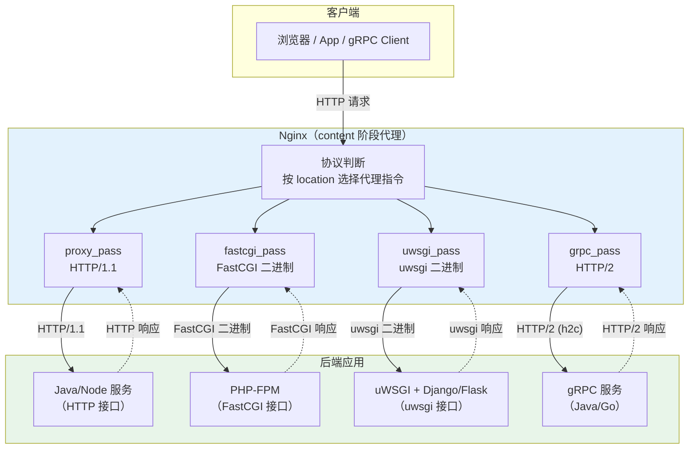

# 11 - 对接后端 FastCGI/uWSGI/gRPC

> 版本基线：Nginx 1.30.4 (stable) | 创建日期：2026-08-05
> 受众：后端开发熟手（熟悉 Python/Java），服务器小白。你已经知道怎么写应用代码，但"应用怎么挂在 Nginx 后面"还一知半解。本文把 Nginx 对接后端的四种协议——FastCGI、uWSGI、SCGI、gRPC——一次讲透，并给出 Python 和 Java 的典型落地方案。

---

## 学习目标

学完本篇，你应当能够：

- 理解 **FastCGI** 协议的设计动机（常驻进程替代 fork-per-request），掌握 `fastcgi_pass` 与 `fastcgi_param` 的用法，能独立完成 Nginx + PHP-FPM 的对接配置，并知道 `SCRIPT_FILENAME` 参数为何是整条链路中最关键的一环。
- 理解 **uWSGI** 协议（二进制协议 vs HTTP），掌握 `uwsgi_pass`、`uwsgi_param`、`uwsgi_modifier1` 的用法，能完成 Nginx + uWSGI + Django/Flask 的对接，并清楚何时该用 `uwsgi_pass`、何时该退回 `proxy_pass`。
- 了解 **SCGI** 协议与 `scgi_pass` 的基本用法，理解它与 FastCGI 的异同，知道为什么实际项目极少用到。
- 理解 **gRPC** 基于 HTTP/2 的特性，掌握 `grpc_pass` 的用法，能完成 Nginx 代理 gRPC 服务的配置，知道 h2c（明文 HTTP/2）与 TLS 两种模式的区别。
- 能用一张对比表说清 `proxy_pass`（通用 HTTP 代理）与 `fastcgi_pass`/`uwsgi_pass`（专用二进制协议代理）的适用边界与性能差异。
- 针对 Python 后端，能在三种典型部署方案（Gunicorn / uWSGI / Daphne ASGI）中做出正确选择并写出对应的 Nginx 配置。
- 针对 Java 后端，能完成 Tomcat、Spring Boot 内嵌容器、gRPC Java 三种场景的 Nginx 对接配置。
- 避开踩坑 `#1.12`（alias 下 SCRIPT_FILENAME 拼接出错）、`#5.4`（后端拿不到真实客户端 IP）。

> **前置知识**：阅读本篇前，建议先完成 [09-反向代理 proxy_pass](../04-反向代理与负载均衡/09-反向代理proxy_pass.md)，理解 `proxy_pass` 的基本用法、`proxy_set_header` 透传机制与 `upstream` 负载均衡，以及 [07-location 匹配规则](../03-核心机制/07-location匹配规则.md) 中 `root` 与 `alias` 的路径拼接差异。

---

## 核心知识点

### 知识点一：FastCGI 协议与 fastcgi_pass

#### FastCGI 是什么

要理解 FastCGI，先回到它的前身——CGI（Common Gateway Interface）。

最早的 Web 服务器处理动态请求的方式是：每来一个请求，就 fork 一个新的进程来执行脚本（如 PHP、Perl），执行完毕后进程退出。这就是传统 CGI 的工作方式。问题显而易见：进程创建和销毁的开销极大，高并发下服务器会被 fork 调度拖垮。

FastCGI（Fast CGI）的改进思路是：**让处理动态请求的进程常驻内存**。不再为每个请求 fork 新进程，而是启动若干个长期运行的 worker 进程，Nginx 通过一个持久化的协议与它们通信，把请求丢过去，worker 处理完再还回来，进程不退出，下一个请求继续复用。

| 对比维度 | 传统 CGI | FastCGI |
|---------|---------|---------|
| 进程生命周期 | 每请求 fork，处理完退出 | 常驻内存，循环处理多请求 |
| 进程创建开销 | 每次都有 fork/exec 开销 | 仅启动时创建一次 |
| 通信协议 | 通过环境变量 + stdin/stdout | FastCGI 二进制协议（TCP/Unix socket） |
| 并发能力 | 极差（受 fork 限制） | 高（worker 进程池） |

最常见的 FastCGI 后端是 **PHP-FPM**（FastCGI Process Manager），它管理着一池 PHP worker 进程，等待 Nginx 通过 FastCGI 协议发来的请求。

#### fastcgi_pass 指令

`fastcgi_pass` 是 `ngx_http_fastcgi_module` 模块的核心指令，作用是把当前请求通过 FastCGI 协议转发给后端。它出现在 `location` 或 `location` 下的 `if` 中，属于 content 阶段的处理逻辑。

```nginx
# 语法
fastcgi_pass address;

# address 可以是：
fastcgi_pass 127.0.0.1:9000;           # TCP 地址（PHP-FPM 默认监听 9000）
fastcgi_pass unix:/var/run/php-fpm.sock; # Unix 域 socket（本机高性能）
fastcgi_pass backend;                    # upstream 名（负载均衡）
```

`fastcgi_pass` 与 `proxy_pass` 在结构上很相似，区别在于：`proxy_pass` 用 HTTP 协议与后端通信，而 `fastcgi_pass` 用 FastCGI 二进制协议。后端必须能听懂 FastCGI 协议——这意味着你不能把 `fastcgi_pass` 指向一个普通的 HTTP 服务。

#### fastcgi_param：传递参数给后端

FastCGI 后端（如 PHP-FPM）不接收 HTTP 请求头，而是通过 FastCGI 协议接收一组**键值对参数**（CGI 变量）。`fastcgi_param` 指令就是用来设置这些参数的。

```nginx
# 语法
fastcgi_param name value;

# 示例
fastcgi_param QUERY_STRING    $query_string;        # URL 查询参数
fastcgi_param REQUEST_METHOD $request_method;       # GET/POST 等
fastcgi_param CONTENT_TYPE    $content_type;         # 请求体类型
fastcgi_param SCRIPT_FILENAME $document_root$fastcgi_script_name;  # 脚本文件路径
```

Nginx 安装后自带了一个参数文件，通常位于 `/etc/nginx/fastcgi_params` 或 `/etc/nginx/fastcgi.conf`，里面预定义了常用的 CGI 变量。两个文件的区别是：

| 文件 | 是否包含 SCRIPT_FILENAME | 说明 |
|------|------------------------|------|
| `fastcgi_params` | 不包含 | 只定义通用 CGI 变量，SCRIPT_FILENAME 需自己加 |
| `fastcgi.conf` | 包含（`$document_root$fastcgi_script_name`） | 等于 fastcgi_params + SCRIPT_FILENAME |

在大多数现代发行版中，推荐用 `include fastcgi.conf;`，因为它已经包含了 SCRIPT_FILENAME，不用再手动写。

#### SCRIPT_FILENAME 参数的重要性

在所有 `fastcgi_param` 中，`SCRIPT_FILENAME` 是最关键的一个。它告诉 PHP-FPM："你要执行的 PHP 文件在磁盘上的完整路径是什么"。如果这个参数拼错了，PHP-FPM 找不到文件，直接返回 404 或 "File not found"。

```nginx
# 标准写法：document_root + script_name
fastcgi_param SCRIPT_FILENAME $document_root$fastcgi_script_name;

# $document_root：root 指令的值，如 /var/www/html
# $fastcgi_script_name：请求 URI 中对应的脚本路径，如 /index.php
# 拼接结果：/var/www/html/index.php
```

这里有两个变量需要理解：

- `$document_root`：当前请求匹配的 `root` 指令的值。如果 `root /var/www/html;`，则 `$document_root` = `/var/www/html`。
- `$fastcgi_script_name`：请求 URI 中与脚本对应的部分，通常是 `$uri`（如果 URI 以 .php 结尾）。如请求 `/index.php`，则值为 `/index.php`。

二者拼接后，就是磁盘上的绝对路径。但注意——如果你用的是 `alias` 而非 `root`，拼接逻辑会出问题，这正是踩坑 `#1.12` 的核心。

#### 常用 fastcgi_param 列表

| 参数名 | Nginx 变量 | 含义 |
|--------|-----------|------|
| `QUERY_STRING` | `$query_string` | URL 查询字符串 |
| `REQUEST_METHOD` | `$request_method` | HTTP 方法 |
| `CONTENT_TYPE` | `$content_type` | 请求体 Content-Type |
| `CONTENT_LENGTH` | `$content_length` | 请求体长度 |
| `SCRIPT_NAME` | `$fastcgi_script_name` | 脚本路径 |
| `SCRIPT_FILENAME` | `$document_root$fastcgi_script_name` | 脚本磁盘绝对路径（最关键） |
| `REQUEST_URI` | `$request_uri` | 原始请求 URI（含参数） |
| `DOCUMENT_URI` | `$document_uri` | 规范化后的 URI |
| `DOCUMENT_ROOT` | `$document_root` | 文档根目录 |
| `SERVER_PROTOCOL` | `$server_protocol` | HTTP 协议版本 |
| `REMOTE_ADDR` | `$remote_addr` | 客户端 IP |
| `REMOTE_PORT` | `$remote_port` | 客户端端口 |
| `SERVER_ADDR` | `$server_addr` | 服务器 IP |
| `SERVER_PORT` | `$server_port` | 服务器端口 |
| `SERVER_NAME` | `$server_name` | server_name |
| `REDIRECT_STATUS` | `200` | 重定向状态码（PHP 安全检查） |
| `HTTPS` | `$https if_not_empty` | 是否 HTTPS |

其中 `REDIRECT_STATUS` 设为 `200` 是一个安全措施——PHP 的 `cgi.force_redirect` 机制要求这个值不能为空，否则拒绝执行，防止 PHP 被直接调用绕过 Nginx。

#### 代码示例：Nginx + PHP-FPM 完整配置

```nginx
# /etc/nginx/conf.d/php.conf

server {
    listen 80;                                  # 对外监听 80 端口
    server_name app.example.com;                # 域名
    root /var/www/html;                         # 站点根目录，$document_root 来源
    index index.php index.html;                 # 默认首页优先级

    location / {
        # 先尝试匹配文件、目录，找不到则交给 index.php（前端控制器模式）
        try_files $uri $uri/ /index.php?$query_string;
    }

    # 处理所有 .php 请求
    location ~ \.php$ {
        # 安全检查：文件不存在直接 404，防止 RCE（踩坑 #3.3）
        try_files $uri =404;

        # 转发给 PHP-FPM（Unix socket，本机性能最优）
        fastcgi_pass unix:/var/run/php-fpm.sock;

        # 包含预定义的 FastCGI 参数（含 SCRIPT_FILENAME）
        include fastcgi.conf;

        # 显式设置 SCRIPT_FILENAME（即使 fastcgi.conf 已包含，显式写更清晰）
        fastcgi_param SCRIPT_FILENAME $document_root$fastcgi_script_name;

        # FastCGI 缓冲区配置（与 proxy buffer 类似）
        fastcgi_buffer_size 16k;                # 读取 FastCGI 响应首部的缓冲
        fastcgi_buffers 8 16k;                  # 读取响应体的缓冲（8 × 16k = 128k）
        fastcgi_index index.php;                # fastcgi_pass 地址是目录时附加的默认文件

        # 传递 HTTPS 状态（非空时传递，空值不传）
        fastcgi_param HTTPS $https if_not_empty;
    }

    # 静态资源：直接由 Nginx 处理，不交给 PHP（踩坑 #1.9）
    location ~* \.(js|css|png|jpg|gif|ico|svg|woff2?)$ {
        expires 30d;
        access_log off;
    }
}
```

逐行说明：

- `root /var/www/html;`：站点根目录，`$document_root` 的值来源于此。所有 PHP 文件路径都基于此拼接。
- `try_files $uri $uri/ /index.php?$query_string;`：前端控制器模式——大多数现代 PHP 框架（Laravel、Symfony）的入口都是 `index.php`，把所有找不到的请求路由给它处理。
- `location ~ \.php$`：正则匹配所有以 `.php` 结尾的请求。注意正则 location 中 `fastcgi_pass` 不能带 URI（与 proxy_pass 同理）。
- `try_files $uri =404;`：安全措施，如果 PHP 文件不存在直接返回 404，而不是交给 PHP-FPM 去"猜"路径执行（踩坑 `#3.3` 的远程代码执行风险）。
- `fastcgi_pass unix:/var/run/php-fpm.sock;`：通过 Unix 域 socket 与 PHP-FPM 通信。相比 TCP（`127.0.0.1:9000`），Unix socket 少了网络栈开销，本机部署性能更优。
- `include fastcgi.conf;`：引入预定义的 CGI 参数。这个文件等价于 `fastcgi_params` + `SCRIPT_FILENAME`。
- `fastcgi_param SCRIPT_FILENAME ...`：显式写出最关键的参数。`$document_root`（`/var/www/html`）+ `$fastcgi_script_name`（如 `/index.php`）= `/var/www/html/index.php`。
- `fastcgi_buffer_size` / `fastcgi_buffers`：与 `proxy_buffering` 系列机制相同，控制 Nginx 读取 FastCGI 响应的缓冲区大小。PHP 输出大量 HTML 时默认 4k/8k 不够用。
- `fastcgi_param HTTPS $https if_not_empty;`：如果客户端通过 HTTPS 访问 Nginx，把这个信息传给 PHP，让 PHP 知道原始请求是 HTTPS（用于生成 `https://` 的绝对 URL）。`if_not_empty` 表示非空时才传。

> **特例说明：alias 下 SCRIPT_FILENAME 拼接问题**

当 `location` 使用 `alias` 而非 `root` 时，`$document_root$fastcgi_script_name` 的拼接会出错。

```nginx
# ❌ 错误：alias 下用 $document_root$fastcgi_script_name
location /api/ {
    alias /app/www/;                        # $document_root = /app/www/
    fastcgi_param SCRIPT_FILENAME $document_root$fastcgi_script_name;
    fastcgi_pass unix:/var/run/php-fpm.sock;
}
# 请求 /api/test.php 时：
# $document_root = /app/www/
# $fastcgi_script_name = /api/test.php（注意它包含了 location 前缀 /api/）
# 拼接结果 = /app/www//api/test.php（路径错误，文件不存在）
```

问题根源：`alias` 是"替换"语义（用 alias 路径替换 location 前缀），但 `$fastcgi_script_name` 仍然包含完整的请求路径（含 `/api/` 前缀），而 `$document_root` 已经指向了 alias 路径，二者拼接就会重复。

```nginx
# ✅ 正确：alias 下改用 $request_filename
location /api/ {
    alias /app/www/;                        # alias 替换前缀
    fastcgi_param SCRIPT_FILENAME $request_filename;  # $request_filename 已正确解析
    fastcgi_pass unix:/var/run/php-fpm.sock;
}
# 请求 /api/test.php 时：
# $request_filename = /app/www/test.php（alias 正确替换后的完整磁盘路径）
```

`$request_filename` 是 Nginx 根据 `root`/`alias` 规则解析后的**实际磁盘文件路径**，无论用 root 还是 alias 都能正确拼接，因此 alias 场景下应优先使用它。

> **引用踩坑 [#1.12 alias 下 SCRIPT_FILENAME 拼接出错](../99-踩坑记录与解决方案.md#112-alias-下-script_filename-拼接出错)**：alias 下 `$document_root` 指向 alias 路径，再拼 `$fastcgi_script_name`（含 location 前缀）会重复。改用 `$request_filename` 即可。

---

### 知识点二：uWSGI 协议与 uwsgi_pass

#### uWSGI 是什么

这里有一个容易混淆的命名问题，需要先厘清：

- **WSGI**（Web Server Gateway Interface）：Python 的 Web 应用与 Web 服务器之间的**标准接口规范**（PEP 3333）。它定义了应用如何以 callable 的形式被调用。Django、Flask 都是 WSGI 应用。
- **uWSGI**：一个用 C 编写的 **Python Web 服务器**（软件名称），它实现了 WSGI 规范，能把 Python 应用跑起来。
- **uwsgi 协议**（注意全小写）：uWSGI 服务器自己设计的**二进制通信协议**，用于 Web 服务器（如 Nginx）与 uWSGI 服务器之间的高效通信。

三者关系：你的 Django/Flask 应用是 WSGI 应用 → 跑在 uWSGI 服务器上 → uWSGI 服务器通过 uwsgi 协议与 Nginx 通信。

uWSGI 服务器同时支持两种对外接口：
1. **uwsgi 二进制协议**（默认，通过 `uwsgi_pass` 对接）
2. **HTTP 协议**（通过 `--http` 参数开启，用 `proxy_pass` 对接）

#### uwsgi_pass 指令

`uwsgi_pass` 是 `ngx_http_uwsgi_module` 模块的指令，把请求通过 uwsgi 二进制协议转发给 uWSGI 后端。

```nginx
# 语法
uwsgi_pass address;

# address 可以是：
uwsgi_pass 127.0.0.1:8000;            # TCP 地址
uwsgi_pass unix:/tmp/uwsgi.sock;       # Unix 域 socket（最常见）
uwsgi_pass backend;                    # upstream 名
```

#### uwsgi_param：传递参数

与 `fastcgi_param` 类似，`uwsgi_param` 用来设置传递给 uWSGI 后端的参数。

```nginx
uwsgi_param QUERY_STRING    $query_string;
uwsgi_param REQUEST_METHOD  $request_method;
uwsgi_param CONTENT_TYPE    $content_type;
uwsgi_param CONTENT_LENGTH  $content_length;
uwsgi_param REQUEST_URI     $request_uri;
uwsgi_param DOCUMENT_ROOT   $document_root;
uwsgi_param SERVER_PROTOCOL $server_protocol;
uwsgi_param REMOTE_ADDR     $remote_addr;
uwsgi_param REMOTE_PORT     $remote_port;
uwsgi_param SERVER_ADDR     $server_addr;
uwsgi_param SERVER_PORT     $server_port;
uwsgi_param SERVER_NAME     $server_name;
```

Nginx 同样自带了一个 `/etc/nginx/uwsgi_params` 文件，通常直接 `include` 即可。注意：uwsgi 协议中**没有 SCRIPT_FILENAME** 概念——Python 应用不像 PHP 那样按文件路径执行脚本，而是由 uWSGI 服务器加载应用模块（如 `myproject.wsgi:application`），所以不需要告诉它"执行哪个文件"。

#### uwsgi_modifier1：设置协议修饰符

uwsgi 二进制协议的每个请求包头部有一个 **modifier1** 字节，用来告诉 uWSGI 服务器这个请求应该怎么处理。`uwsgi_modifier1` 指令设置这个值。

| modifier1 值 | 含义 | 说明 |
|-------------|------|------|
| 0（默认） | WSGI 请求 | 交给 Python WSGI 应用处理 |
| 5 | 静态文件 | 让 uWSGI 直接返回静态文件 |
| 6 | 缓存 | 让 uWSGI 从缓存返回 |
| 9 | 静态文件（path info） | 静态文件 + PATH_INFO 解析 |
| 14 | RPC | uWSGI RPC 调用 |
| 17 | 高级 RPC | 高级 RPC 调用 |

```nginx
# 默认值 0：标准 WSGI 请求
uwsgi_modifier1 0;    # 绝大多数场景不需要改

# 特殊场景：让 uWSGI 直接服务静态文件
uwsgi_modifier1 5;
```

在 99% 的 Python Web 应用场景中，`modifier1` 保持默认值 0 即可，不需要显式设置。现代版本的 uWSGI 和 Nginx 已不再需要手动配置 modifier。

#### 代码示例：Nginx + uWSGI + Django/Flask

```nginx
# /etc/nginx/conf.d/django.conf

upstream uwsgi_backend {
    server unix:/tmp/uwsgi.sock;     # uWSGI 通过 Unix socket 监听
}

server {
    listen 80;                       # 对外监听 80 端口
    server_name api.example.com;
    charset utf-8;                   # Django 默认 UTF-8

    # 客户端上传大小限制（Django admin 上传文件可能很大）
    client_max_body_size 75m;

    location / {
        # 通过 uwsgi 协议转发给 uWSGI
        uwsgi_pass uwsgi_backend;

        # 包含预定义的 uwsgi 参数
        include uwsgi_params;

        # 传递 Django 需要的额外参数
        uwsgi_param Host $host;              # 原始 Host
        uwsgi_param X-Real-IP $remote_addr;  # 客户端真实 IP
        uwsgi_param X-Forwarded-For $proxy_add_x_forwarded_for;  # IP 转发链
        uwsgi_param X-Forwarded-Proto $scheme;  # 原始协议 http/https
    }

    # Django 静态文件（collectstatic 收集后由 Nginx 直接服务）
    location /static/ {
        alias /opt/myproject/staticfiles/;   # Django STATIC_ROOT
        expires 30d;
        access_log off;
    }

    # Django 上传的媒体文件
    location /media/ {
        alias /opt/myproject/media/;         # Django MEDIA_ROOT
        expires 7d;
        access_log off;
    }
}
```

对应的 uWSGI 启动命令：

```bash
# 启动 uWSGI，通过 Unix socket 监听，加载 Django WSGI 应用
uwsgi --socket /tmp/uwsgi.sock \      # 监听 Unix socket（与 Nginx fastcgi_pass 对应）
      --chmod-socket=666 \             # socket 权限，Nginx 需要可写
      --module myproject.wsgi:application \  # Django WSGI 应用入口
      --processes 4 \                  # 4 个 worker 进程
      --threads 2 \                    # 每进程 2 线程
      --master \                       # 启用 master 进程管理
      --die-on-term                    # 收到 SIGTERM 时退出
```

逐行说明：

- `uwsgi_pass uwsgi_backend;`：把请求通过 uwsgi 二进制协议发给 uWSGI。注意这里用的是 upstream 名，即使单台也推荐用 upstream，便于后续扩容。
- `include uwsgi_params;`：引入预定义参数。这个文件包含了 `QUERY_STRING`、`REQUEST_METHOD` 等标准 CGI 变量，但没有 Host/X-Real-IP——这些需要自己加。
- `uwsgi_param Host $host;` 等：与 `proxy_set_header` 的作用完全对应，只是换成 uwsgi 协议的参数传递方式。后端 Django 需要这些参数来获取真实客户端 IP（踩坑 `#5.4`）。
- `location /static/`：Django 的 `collectstatic` 命令把所有静态文件收集到一个目录，由 Nginx 直接服务，不经过 Python（踩坑 `#1.9`）。
- uWSGI 的 `--socket` 参数指定 Unix socket 路径，必须与 Nginx 的 `uwsgi_pass` 路径一致。`--chmod-socket=666` 确保运行 Nginx 的用户有读写权限。

> **特例**：uWSGI 的 `--chmod-socket=666` 只是为了方便调试。生产环境应让 Nginx 和 uWSGI 运行在同一个用户组下，socket 权限设为 `660`，更安全。

#### uwsgi_pass vs proxy_pass：何时用哪个

uWSGI 服务器有两种工作模式，决定了你用哪种 Nginx 指令对接：

| uWSGI 启动方式 | 监听方式 | Nginx 对接指令 | 通信协议 |
|---------------|---------|---------------|---------|
| `--socket /path` | Unix socket | `uwsgi_pass unix:/path;` | uwsgi 二进制 |
| `--socket 0.0.0.0:8000` | TCP | `uwsgi_pass 127.0.0.1:8000;` | uwsgi 二进制 |
| `--http 0.0.0.0:8000` | HTTP | `proxy_pass http://127.0.0.1:8000;` | HTTP |

代码示例对比：

```nginx
# 方式一：uwsgi_pass（uwsgi 二进制协议，性能更好）
# uWSGI 启动：uwsgi --socket /tmp/uwsgi.sock --module myproject.wsgi:application
location / {
    uwsgi_pass unix:/tmp/uwsgi.sock;
    include uwsgi_params;
    uwsgi_param Host $host;
    uwsgi_param X-Real-IP $remote_addr;
    uwsgi_param X-Forwarded-For $proxy_add_x_forwarded_for;
}

# 方式二：proxy_pass（HTTP 协议，通用但多了 HTTP 解析开销）
# uWSGI 启动：uwsgi --http :8000 --module myproject.wsgi:application
location / {
    proxy_pass http://127.0.0.1:8000;
    proxy_set_header Host $host;
    proxy_set_header X-Real-IP $remote_addr;
    proxy_set_header X-Forwarded-For $proxy_add_x_forwarded_for;
}
```

两者的本质区别：

- `uwsgi_pass`：Nginx 用 uwsgi 二进制协议与 uWSGI 通信，二进制协议开销极低，没有 HTTP 头的序列化/反序列化。性能更好，但**只能对接 uWSGI 服务器**。
- `proxy_pass`：Nginx 用标准 HTTP 与 uWSGI 通信，uWSGI 需要启动 HTTP 模式（`--http`），内部要做 HTTP 解析。性能略低，但**通用**——如果换成 Gunicorn、Daphne 等其他服务器，配置不用改。

**选择建议**：如果你的后端确定是 uWSGI 且追求极致性能，用 `uwsgi_pass`。如果后端可能换成其他 WSGI 服务器（如 Gunicorn），或者调试时需要直接用浏览器访问 uWSGI（`--http` 模式可以直接被访问），用 `proxy_pass` 更灵活。

---

### 知识点三：SCGI 协议与 scgi_pass

#### SCGI 是什么

SCGI（Simple Common Gateway Interface）是 FastCGI 的简化版。设计目标是比 FastCGI 更简单——FastCGI 的协议头是二进制格式，SCGI 的协议头则是纯文本的键值对，以 `netstring` 编码传输，实现更简单。

| 对比维度 | FastCGI | SCGI |
|---------|---------|------|
| 协议头格式 | 二进制 | 纯文本（netstring 编码） |
| 实现复杂度 | 较高 | 极低 |
| 性能 | 略优（二进制解析快） | 略低（文本解析） |
| 生态 | PHP-FPM 等大量使用 | 极少使用 |

SCGI 在实际项目中几乎见不到。少数使用场景包括 Python 的 `flup` 库、一些 C 语言写的轻量 Web 应用。大部分 Python 应用要么用 uwsgi 协议，要么直接用 HTTP。

#### scgi_pass 用法

```nginx
# 语法
scgi_pass address;

# 示例
location / {
    scgi_pass 127.0.0.1:4000;     # 转发给 SCGI 后端
    include scgi_params;           # 预定义参数文件
    scgi_param SCRIPT_FILENAME $document_root$fastcgi_script_name;
}
```

`scgi_param` 的用法与 `fastcgi_param` 完全一致。Nginx 也自带了 `/etc/nginx/scgi_params` 文件。

> **特例**：SCGI 的参数中同样可以（且通常需要）传递 `SCRIPT_FILENAME`，因为 SCGI 后端和 FastCGI 后端一样，是按文件路径执行的。但 SCGI 后端极少见，实际项目中几乎不会用到 `scgi_pass`。了解其存在即可，遇到时查文档。

---

### 知识点四：gRPC 代理与 grpc_pass

#### gRPC 是什么

gRPC 是 Google 开源的高性能 RPC（Remote Procedure Call）框架。与传统的 HTTP REST API 不同，gRPC 基于 **HTTP/2** 协议，使用 **Protobuf** 作为接口描述语言和序列化格式，具有以下特性：

- **HTTP/2 多路复用**：一个 TCP 连接上可以并发多个请求/响应，无需像 HTTP/1.1 那样排队等待。
- **二进制传输**：Protobuf 序列化后的数据体积远小于 JSON，解析速度也快得多。
- **双向流式**：支持单向流、双向流式 RPC，适合实时通信场景。
- **跨语言**：用 .proto 文件定义接口，自动生成各语言客户端/服务端代码。Go、Java、Python、C++ 都支持。

gRPC 在微服务架构中广泛使用，尤其适合内部服务间的高性能通信。Java/Go 微服务最常选用 gRPC 作为 RPC 协议。

#### grpc_pass 指令

`grpc_pass` 是 `ngx_http_grpc_module` 模块的指令（Nginx 1.13.10+ 引入），把 gRPC 请求转发给后端 gRPC 服务。它本质上是 HTTP/2 代理——因为 gRPC 就是 HTTP/2 的一种应用。

```nginx
# 语法
grpc_pass [grpc://|grpcs://]address;

# 示例
grpc_pass 127.0.0.1:50051;               # 默认 grpc://（明文 HTTP/2，即 h2c）
grpc_pass grpc://10.0.0.1:50051;         # 明文 HTTP/2（h2c）
grpc_pass grpcs://10.0.0.1:50051;        # TLS 加密的 HTTP/2
grpc_pass grpc_backend;                  # upstream 名
```

| 协议前缀 | 含义 | 传输方式 |
|---------|------|---------|
| `grpc://`（或无前缀） | 明文 HTTP/2 | h2c（HTTP/2 cleartext） |
| `grpcs://` | 加密 HTTP/2 | TLS + HTTP/2 |

#### 需要 HTTP/2 支持

gRPC 基于 HTTP/2，因此 Nginx 对外监听的端口必须开启 HTTP/2。否则客户端无法通过 HTTP/2 与 Nginx 通信，gRPC 请求会在协议握手阶段失败。

```nginx
server {
    listen 443 ssl;       # 对外监听 443
    http2 on;              # 开启 HTTP/2（1.25.1+ 新写法）
    # ...
}
```

> **版本提示**：自 Nginx 1.25.1 起，HTTP/2 改用独立指令 `http2 on;`，旧写法 `listen 443 ssl http2;` 已弃用（踩坑 `#4.6`）。1.30.4 中应使用 `http2 on;`。

#### 代码示例：Nginx 代理 gRPC 服务

```nginx
# /etc/nginx/conf.d/grpc.conf

# 定义上游 gRPC 服务集群
upstream grpc_backend {
    server 10.0.0.1:50051;        # gRPC 后端 A（默认 h2c 明文）
    server 10.0.0.2:50051;        # gRPC 后端 B
    keepalive 32;                  # 长连接复用，gRPC 基于 HTTP/2 天然支持
}

# TLS 终止后以明文 h2c 转发给后端 gRPC
server {
    listen 443 ssl;                # 对外提供 TLS 加密
    http2 on;                       # 必须开启 HTTP/2（gRPC 依赖它）

    server_name grpc.example.com;

    # TLS 证书
    ssl_certificate     /etc/nginx/ssl/fullchain.crt;
    ssl_certificate_key  /etc/nginx/ssl/server.key;
    ssl_protocols TLSv1.2 TLSv1.3;

    location / {
        # 以明文 HTTP/2（h2c）转发给后端
        grpc_pass grpc://grpc_backend;

        # 传递客户端真实信息给后端（gRPC 通过 HTTP/2 头传递）
        grpc_set_header X-Real-IP $remote_addr;
        grpc_set_header X-Forwarded-For $proxy_add_x_forwarded_for;
        grpc_set_header X-Forwarded-Proto $scheme;

        # gRPC 超时设置（gRPC 调用可能比普通 HTTP 慢）
        grpc_connect_timeout 5s;       # 连接后端超时
        grpc_send_timeout 60s;         # 发送超时
        grpc_read_timeout 60s;         # 读取超时（流式 RPC 需调大）
    }
}
```

逐行说明：

- `upstream grpc_backend`：定义 gRPC 后端集群。gRPC 基于 HTTP/2 多路复用，一个连接可以并发多个请求，因此 `keepalive` 的收益尤其大。
- `listen 443 ssl; http2 on;`：gRPC 要求 HTTP/2，对外必须开启。客户端通过 TLS + HTTP/2 与 Nginx 通信。
- `grpc_pass grpc://grpc_backend;`：`grpc://` 表示用明文 HTTP/2（h2c）与后端通信。Nginx 完成 TLS 终止后，内部以明文方式把 HTTP/2 帧转发给后端 gRPC 服务。后端 gRPC 服务需以明文模式启动（Go 的 `grpc.NewServer()` 不加 TLS credential）。
- `grpc_set_header`：与 `proxy_set_header` 作用相同，把客户端信息通过 HTTP/2 头传递给后端。gRPC 的 metadata 就是通过 HTTP/2 头传输的。
- `grpc_connect_timeout` / `grpc_send_timeout` / `grpc_read_timeout`：与 proxy 系列超时对应。gRPC 流式 RPC 可能长时间持续发送数据，`grpc_read_timeout` 需要按场景调大。

#### 适用场景：Java/Go 微服务的 gRPC 网关

gRPC 网关的典型架构是：

```
客户端（gRPC over TLS）→ Nginx（TLS 终止 + 负载均衡）→ 多台 gRPC 后端（明文 h2c）
```

Nginx 在这个架构中的价值：

1. **TLS 终止**：证书只配在 Nginx，后端 gRPC 服务用明文 h2c，减轻后端加解密负担。
2. **负载均衡**：多个 gRPC 后端实例挂在一个 upstream 下，Nginx 按轮询/最少连接分发。
3. **统一入口**：多个 gRPC 服务通过路径路由到不同后端（gRPC 的 `:path` 伪头区分不同方法）。

```nginx
# 多 gRPC 服务路由
server {
    listen 443 ssl;
    http2 on;

    # 用户服务：/user.UserService/* → 10.0.0.1:50051
    location /user.UserService/ {
        grpc_pass grpc://10.0.0.1:50051;
    }

    # 订单服务：/order.OrderService/* → 10.0.0.2:50052
    location /order.OrderService/ {
        grpc_pass grpc://10.0.0.2:50052;
    }
}
```

gRPC 请求的 `:path` 伪头格式为 `/<package>.<service>/<method>`，如 `/com.example.user.UserService/GetUser`，Nginx 可以据此做路径路由。

> **特例说明：gRPC 需要 HTTP/2 over cleartext (h2c) 或 TLS**

gRPC 与后端的通信有两种模式：

1. **h2c（明文 HTTP/2）**：`grpc_pass grpc://backend;`。后端 gRPC 服务以明文启动。这是最常见的内部部署方式——Nginx 已经在外层做了 TLS 终止，内网通信用明文即可。
2. **TLS（加密 HTTP/2）**：`grpc_pass grpcs://backend;`。后端 gRPC 服务也启用 TLS。适用于后端不在可信内网、或者合规要求端到端加密的场景。

注意：普通的 `proxy_pass http://` **不能**代理 gRPC 请求。因为 `proxy_pass` 默认用 HTTP/1.1 与后端通信，而 gRPC 要求 HTTP/2。即使配了 `proxy_http_version 1.1`，HTTP/1.1 也不支持 HTTP/2 的多路复用和流式特性。必须用 `grpc_pass`。

> **特例**：如果后端 gRPC 服务也启用了 TLS，用 `grpc_pass grpcs://backend;`。此时还需配置 `grpc_ssl_certificate` 等指令做 mTLS（双向 TLS），适用于零信任网络架构。

---

### 知识点五：proxy_pass 与 fastcgi_pass/uwsgi_pass 的对比

`proxy_pass`、`fastcgi_pass`、`uwsgi_pass`、`scgi_pass`、`grpc_pass` 都是 content 阶段的代理指令，但它们与后端通信使用的协议不同，适用的后端类型也不同。

#### 何时用 proxy_pass

`proxy_pass` 用**标准 HTTP** 与后端通信。这是最通用的方式——只要后端能说 HTTP，就能用 `proxy_pass` 对接。适用于：

- Java 应用（Tomcat、Spring Boot、Jetty）
- Node.js 应用（Express、Koa）
- Python 应用通过 Gunicorn / Daphne 启动
- 任何提供 HTTP 接口的服务

优点是通用、可调试（直接 `curl` 后端），缺点是 HTTP 协议头序列化/解析有一定开销。

#### 何时用 fastcgi_pass / uwsgi_pass

`fastcgi_pass` 用 FastCGI 二进制协议，`uwsgi_pass` 用 uwsgi 二进制协议。二进制协议省去了 HTTP 头的文本解析，性能更好，但只能对接特定的后端：

- `fastcgi_pass` → PHP-FPM、其他 FastCGI 后端
- `uwsgi_pass` → uWSGI 服务器

如果你的后端是 PHP-FPM，必须用 `fastcgi_pass`（PHP-FPM 不提供 HTTP 接口）。如果你的后端是 uWSGI，`uwsgi_pass` 和 `proxy_pass`（uWSGI 开 HTTP 模式）都可以，前者性能更好。

#### 对比表格

| 对比维度 | proxy_pass | fastcgi_pass | uwsgi_pass | scgi_pass | grpc_pass |
|---------|-----------|-------------|-----------|-----------|-----------|
| 通信协议 | HTTP/1.1（或 1.1） | FastCGI 二进制 | uwsgi 二进制 | SCGI 文本 | HTTP/2 |
| 后端类型 | 任意 HTTP 服务 | PHP-FPM 等 | uWSGI | SCGI 后端（极少） | gRPC 服务 |
| 传输方式 | 文本头 + body | 二进制 | 二进制 | 文本头 + body | HTTP/2 帧 + body |
| 参数传递 | `proxy_set_header` | `fastcgi_param` | `uwsgi_param` | `scgi_param` | `grpc_set_header` |
| 缓冲指令 | `proxy_buffer*` | `fastcgi_buffer*` | `uwsgi_buffer*` | `scgi_buffer*` | `grpc_buffer*` |
| 超时指令 | `proxy_*_timeout` | `fastcgi_*_timeout` | `uwsgi_*_timeout` | `scgi_*_timeout` | `grpc_*_timeout` |
| 性能 | 通用基准 | 高（省 HTTP 解析） | 高（省 HTTP 解析） | 中 | 高（HTTP/2 多路复用） |
| 可调试性 | 高（可 curl） | 低（需工具） | 低（需工具） | 中 | 低（需 grpcurl） |
| 典型场景 | Java/Node/通用 | PHP | Python uWSGI | 极少 | Java/Go 微服务 |
| HTTP/2 要求 | 否 | 否 | 否 | 否 | 是 |

可以看到，每种代理指令都有自己的一套配套指令（参数传递、缓冲、超时等），命名模式完全一致，只是前缀不同。理解了一种，其他几种的结构自然就懂了。

> **记忆要点**：五种代理指令的架构是对称的——`xxx_pass`（转发）、`xxx_param`/`xxx_set_header`（传参）、`xxx_buffer*`（缓冲）、`xxx_*_timeout`（超时）。区别仅在于与后端通信使用的协议不同。

---

### 知识点六：Python 应用的典型对接方式

Python Web 应用有三种主流的 Nginx 对接方式，对应不同的应用服务器。理解它们的区别，关键在于分清 **WSGI** 和 **ASGI**。

- **WSGI**：同步接口规范（PEP 3333）。每个请求独占一个 worker，处理完才能接下一个。适用于传统的 Django/Flask 应用。
- **ASGI**：异步接口规范（PEP 3333 的异步版）。支持 WebSocket、长轮询、Server-Sent Events 等异步场景。适用于 Django Channels、FastAPI。

#### 方式一：Nginx + Gunicorn + Django/Flask（proxy_pass http）

Gunicorn（Green Unicorn）是一个纯 Python 实现的 **WSGI 服务器**。它通过预 fork 的 worker 进程来处理请求，只提供 HTTP 接口——所以 Nginx 必须用 `proxy_pass` 对接。

```nginx
upstream gunicorn_backend {
    server 127.0.0.1:8000;
    keepalive 32;
}

server {
    listen 80;
    server_name api.example.com;
    client_max_body_size 75m;

    location / {
        proxy_pass http://gunicorn_backend;
        proxy_set_header Host $host;
        proxy_set_header X-Real-IP $remote_addr;
        proxy_set_header X-Forwarded-For $proxy_add_x_forwarded_for;
        proxy_set_header X-Forwarded-Proto $scheme;
    }

    location /static/ {
        alias /opt/myproject/staticfiles/;
        expires 30d;
    }
}
```

对应的 Gunicorn 启动命令：

```bash
# Gunicorn 监听 8000 端口，4 个 worker 进程
gunicorn myproject.wsgi:application \
    --bind 0.0.0.0:8000 \
    --workers 4 \
    --access-logfile -
```

**适用场景**：Django、Flask、Bottle 等 WSGI 应用的标准部署方式。Gunicorn 配置简单、稳定可靠，是 Python Web 部署的事实标准。如果你不需要 WebSocket，Gunicorn 是首选。

> **对后端开发者特别说明**：Gunicorn 是一个 WSGI 服务器——它实现了 WSGI 规范，让你的 Python 应用能被 Web 服务器调用。但它**只有 HTTP 接口**，没有自己的二进制协议。所以 Nginx 必须用 `proxy_pass http://` 而非 `uwsgi_pass`。这一点与 uWSGI 不同——uWSGI 既是 WSGI 服务器，又自己造了一个 uwsgi 二进制协议。

#### 方式二：Nginx + uWSGI + Django/Flask（uwsgi_pass）

如知识点二所述，uWSGI 是一个功能更丰富的 WSGI 服务器，它有自己的二进制协议。用 `uwsgi_pass` 对接性能更好。

```nginx
upstream uwsgi_backend {
    server unix:/tmp/uwsgi.sock;
}

server {
    listen 80;
    server_name api.example.com;

    location / {
        uwsgi_pass uwsgi_backend;
        include uwsgi_params;
        uwsgi_param Host $host;
        uwsgi_param X-Real-IP $remote_addr;
        uwsgi_param X-Forwarded-For $proxy_add_x_forwarded_for;
        uwsgi_param X-Forwarded-Proto $scheme;
    }

    location /static/ {
        alias /opt/myproject/staticfiles/;
        expires 30d;
    }
}
```

**适用场景**：对性能有极致要求、后端确定使用 uWSGI 的 Django/Flask 项目。uWSGI 配置项非常多（进程管理、内存监控、缓存、定时任务等），适合需要精细控制的场景。但复杂度也更高——如果只是简单部署，Gunicorn 更省心。

#### 方式三：Nginx + Daphne + ASGI（proxy_pass http, WebSocket）

Daphne 是一个 **ASGI 服务器**，用于运行 Django Channels、FastAPI 等异步框架。它支持 WebSocket 和 HTTP/2，是 Python 异步 Web 应用的标准部署服务器。

```nginx
upstream daphne_backend {
    server 127.0.0.1:8000;
}

server {
    listen 80;
    server_name api.example.com;

    location / {
        proxy_pass http://daphne_backend;
        proxy_set_header Host $host;
        proxy_set_header X-Real-IP $remote_addr;
        proxy_set_header X-Forwarded-For $proxy_add_x_forwarded_for;
        proxy_set_header X-Forwarded-Proto $scheme;
    }

    # WebSocket 路由（Django Channels 的 ASGI 应用）
    location /ws/ {
        proxy_pass http://daphne_backend;
        proxy_http_version 1.1;                       # WebSocket 必须 HTTP/1.1
        proxy_set_header Upgrade $http_upgrade;       # 透传 Upgrade 头
        proxy_set_header Connection "upgrade";        # 透传 Connection 头
        proxy_set_header Host $host;
        proxy_read_timeout 3600s;                     # 长连接超时设大
    }
}
```

对应的 Daphne 启动命令：

```bash
# Daphne 监听 8000 端口，加载 ASGI 应用
daphne -b 0.0.0.0 -p 8000 myproject.asgi:application
```

**适用场景**：Django Channels（WebSocket）、FastAPI（异步 API）、需要长连接或实时通信的 Python 应用。Daphne 用 `proxy_pass` 对接（ASGI 服务器只提供 HTTP 接口），WebSocket 部分需要额外配置 Upgrade/Connection 头（踩坑 `#5.3`）。

#### 三种方式对比

| 方式 | 应用服务器 | 接口规范 | Nginx 指令 | WebSocket | 适用框架 |
|------|-----------|---------|-----------|-----------|---------|
| 方式一 | Gunicorn | WSGI（同步） | `proxy_pass http` | 不支持 | Django/Flask（传统） |
| 方式二 | uWSGI | WSGI（同步） | `uwsgi_pass` | 支持（需配置） | Django/Flask（高性能） |
| 方式三 | Daphne | ASGI（异步） | `proxy_pass http` | 支持 | Django Channels/FastAPI |

> **选择建议**：不需要 WebSocket → Gunicorn（最简单）。需要 WebSocket 或异步 → Daphne（或 Uvicorn，用法类似）。追求极致性能且不惧复杂配置 → uWSGI。

---

### 知识点七：Java 应用的典型对接方式

Java 后端与 Nginx 的对接比 Python 简单——因为 Java 应用服务器（Tomcat、Jetty、Undertow）全部提供标准 HTTP 接口，Nginx 一律用 `proxy_pass` 对接即可。唯一的特例是 gRPC Java。

#### 方式一：Nginx + Tomcat（proxy_pass http://tomcat:8080）

Tomcat 是 Java 最经典的 Servlet 容器，默认监听 8080 端口，提供 HTTP 接口。

```nginx
upstream tomcat_backend {
    server 10.0.0.1:8080;          # Tomcat 实例 A
    server 10.0.0.2:8080;          # Tomcat 实例 B
    keepalive 32;
}

server {
    listen 80;
    server_name api.example.com;

    location / {
        proxy_pass http://tomcat_backend;
        proxy_set_header Host $host;
        proxy_set_header X-Real-IP $remote_addr;
        proxy_set_header X-Forwarded-For $proxy_add_x_forwarded_for;
        proxy_set_header X-Forwarded-Proto $scheme;
    }
}
```

**适用场景**：传统 Java Web 应用（WAR 包部署到 Tomcat），或者需要独立 Tomcat 容器管理的项目。Tomcat 需要配置 `RemoteIpValve` 来正确解析 X-Forwarded-For 中的真实客户端 IP。

Tomcat 侧配置（`server.xml`）：

```xml
<!-- 让 Tomcat 信任 Nginx 代理头，还原真实客户端 IP（对应踩坑 #5.4） -->
<Valve className="org.apache.catalina.valves.RemoteIpValve"
       remoteIpHeader="X-Forwarded-For"
       protocolHeader="X-Forwarded-Proto" />
```

#### 方式二：Nginx + Spring Boot embedded Tomcat（proxy_pass http）

Spring Boot 内嵌了 Tomcat（默认）或 Jetty/Undertow，应用以 jar 包形式独立运行，不需要外部容器。

```nginx
upstream springboot_backend {
    server 10.0.0.1:8080;          # Spring Boot 实例 A
    server 10.0.0.2:8080;          # Spring Boot 实例 B
    keepalive 32;
}

server {
    listen 80;
    server_name api.example.com;

    location / {
        proxy_pass http://springboot_backend;
        proxy_set_header Host $host;
        proxy_set_header X-Real-IP $remote_addr;
        proxy_set_header X-Forwarded-For $proxy_add_x_forwarded_for;
        proxy_set_header X-Forwarded-Proto $scheme;
    }
}
```

Spring Boot 侧配置（`application.properties`）：

```properties
# 让 Spring Boot 信任代理头，还原真实客户端 IP（对应踩坑 #5.4）
server.forward-headers-strategy=NATIVE
# 可选：设置 Tomcat 线程数
server.tomcat.threads.max=200
```

`server.forward-headers-strategy=NATIVE` 让内嵌 Tomcat 使用 `RemoteIpValve` 自动解析 `X-Forwarded-For` 和 `X-Forwarded-Proto`，这样 Java 代码中 `request.getRemoteAddr()` 就能拿到真实客户端 IP 而非 Nginx 的内网 IP。

**适用场景**：Spring Boot 微服务、Spring Cloud 架构下的独立服务。这是当前 Java 后端最主流的部署方式。

#### 方式三：Nginx + gRPC Java（grpc_pass）

如果 Java 微服务使用 gRPC 通信（Spring Boot gRPC 或 grpc-java），Nginx 作为 gRPC 网关用 `grpc_pass` 对接。

```nginx
upstream grpc_java_backend {
    server 10.0.0.1:9090;          # gRPC Java 服务 A
    server 10.0.0.2:9090;          # gRPC Java 服务 B
    keepalive 32;
}

server {
    listen 443 ssl;
    http2 on;                       # gRPC 必须 HTTP/2
    server_name grpc.example.com;

    ssl_certificate     /etc/nginx/ssl/fullchain.crt;
    ssl_certificate_key /etc/nginx/ssl/server.key;

    location / {
        grpc_pass grpc://grpc_java_backend;     # 明文 h2c 转发
        grpc_set_header X-Real-IP $remote_addr;
        grpc_set_header X-Forwarded-For $proxy_add_x_forwarded_for;
    }
}
```

**适用场景**：Java 微服务使用 gRPC 做内部通信（如 Spring Cloud gRPC、grpc-java 框架），Nginx 作为 gRPC 负载均衡网关。相比 HTTP REST + `proxy_pass`，gRPC 的二进制 Protobuf 传输在高吞吐场景下性能优势明显。

#### 三种方式对比

| 方式 | 后端类型 | 通信协议 | Nginx 指令 | 适用场景 |
|------|---------|---------|-----------|---------|
| 方式一 | 独立 Tomcat | HTTP | `proxy_pass http` | 传统 WAR 部署 |
| 方式二 | Spring Boot 内嵌容器 | HTTP | `proxy_pass http` | 微服务 jar 部署（主流） |
| 方式三 | gRPC Java 服务 | gRPC (HTTP/2) | `grpc_pass` | 高性能内部 RPC |

> **共同要点**：无论哪种 Java 对接方式，都必须配置后端的"信任代理"机制（Tomcat 的 `RemoteIpValve`、Spring Boot 的 `forward-headers-strategy`），否则后端拿到的客户端 IP 全是 Nginx 的内网地址（踩坑 `#5.4`）。这一点与 Python 的 ProxyFix、与 09 篇讲的 `proxy_set_header X-Real-IP` 是同一个问题的两侧——Nginx 负责传，后端负责收。

---

## 各协议请求处理流程对比图

下面的流程图展示了 Nginx 用不同协议对接后端时，请求在各环节的处理方式差异。



关键差异在于 Nginx 与后端之间的通信协议：

- `proxy_pass` 把请求按 **HTTP/1.1 文本** 发给后端，后端做 HTTP 解析。通用但开销最高。
- `fastcgi_pass` 把请求按 **FastCGI 二进制帧** 发给 PHP-FPM，省去 HTTP 文本解析。只对接 FastCGI 后端。
- `uwsgi_pass` 把请求按 **uwsgi 二进制帧** 发给 uWSGI，同理省去 HTTP 解析。只对接 uWSGI。
- `grpc_pass` 把请求按 **HTTP/2 帧** 转发给 gRPC 服务，利用 HTTP/2 多路复用。只对接 gRPC 后端。

---

## 最佳实践

### 1. FastCGI：用 fastcgi.conf 而非 fastcgi_params

```nginx
# ✅ 推荐：fastcgi.conf 已包含 SCRIPT_FILENAME
include fastcgi.conf;

# ❌ 容易漏：fastcgi_params 不含 SCRIPT_FILENAME，需手动加
# include fastcgi_params;
# fastcgi_param SCRIPT_FILENAME $document_root$fastcgi_script_name;
# （忘了加这行，PHP 返回 "File not found" 或 "Primary script unknown"）
```

### 2. alias 场景下统一用 $request_filename

```nginx
# ✅ alias 下用 $request_filename，root 和 alias 都安全
location /api/ {
    alias /app/www/;
    fastcgi_param SCRIPT_FILENAME $request_filename;
    fastcgi_pass unix:/var/run/php-fpm.sock;
}
```

这样写无论 root 还是 alias 都不会出错，不需要关心 `$document_root` 和 `$fastcgi_script_name` 的拼接细节。

### 3. Python 应用：默认选 Gunicorn，异步选 Daphne

```nginx
# 标准方案：Gunicorn + proxy_pass（最简单、最稳定）
location / {
    proxy_pass http://gunicorn_backend;
    proxy_set_header Host $host;
    proxy_set_header X-Real-IP $remote_addr;
    proxy_set_header X-Forwarded-For $proxy_add_x_forwarded_for;
    proxy_set_header X-Forwarded-Proto $scheme;
}

# 异步方案：Daphne + proxy_pass + WebSocket 支持
location /ws/ {
    proxy_pass http://daphne_backend;
    proxy_http_version 1.1;
    proxy_set_header Upgrade $http_upgrade;
    proxy_set_header Connection "upgrade";
    proxy_read_timeout 3600s;
}
```

### 4. gRPC 网关：TLS 终止在 Nginx，后端用 h2c

```nginx
server {
    listen 443 ssl;
    http2 on;                       # 对外 TLS + HTTP/2

    location / {
        grpc_pass grpc://backend;   # 对内明文 h2c（性能好，内网可信）
        grpc_set_header X-Real-IP $remote_addr;
    }
}
```

后端 gRPC 服务以明文模式启动，Nginx 负责 TLS 终止。只有零信任网络或合规要求端到端加密时才用 `grpcs://`。

### 5. 所有场景都要传真实客户端 IP

无论用哪种协议，都要把客户端真实 IP 传给后端，否则后端只能看到 Nginx 的内网 IP：

```nginx
# HTTP 代理
proxy_set_header X-Real-IP $remote_addr;
proxy_set_header X-Forwarded-For $proxy_add_x_forwarded_for;

# FastCGI
fastcgi_param REMOTE_ADDR $remote_addr;

# uWSGI
uwsgi_param REMOTE_ADDR $remote_addr;

# gRPC
grpc_set_header X-Real-IP $remote_addr;
grpc_set_header X-Forwarded-For $proxy_add_x_forwarded_for;
```

后端也要做对应配置（Python 的 ProxyFix、Java 的 forward-headers-strategy），否则传了也不解析。

### 6. 静态资源交 Nginx 处理，不经过后端

```nginx
# Django/Flask 静态文件
location /static/ {
    alias /opt/myproject/staticfiles/;
    expires 30d;
    access_log off;
}

# PHP 静态资源
location ~* \.(js|css|png|jpg|gif|ico|svg|woff2?)$ {
    root /var/www/html;
    expires 30d;
    access_log off;
}
```

后端只处理动态请求，静态文件由 Nginx 直接服务（踩坑 `#1.9`）。

---

## 常见踩坑引用

本篇涉及以下踩坑条目，详细的现象、原因和解决方案见 [99-踩坑记录与解决方案](../99-踩坑记录与解决方案.md)：

| 编号 | 坑点 | 与本篇的关联 |
|------|------|-------------|
| **#1.12** | [alias 下 SCRIPT_FILENAME 拼接出错](../99-踩坑记录与解决方案.md#112-alias-下-script_filename-拼接出错) | 知识点一：alias 下 `$document_root$fastcgi_script_name` 拼接重复，改用 `$request_filename` |
| **#5.4** | [后端拿不到真实客户端 IP](../99-踩坑记录与解决方案.md#54-后端拿不到真实客户端-ip) | 知识点五/六/七：无论哪种协议都要传 `X-Real-IP`/`X-Forwarded-For`，后端也要配置信任代理 |

此外，以下踩坑与本篇的关联场景密切相关，可提前了解：

| 编号 | 坑点 | 关联场景 |
|------|------|---------|
| #1.9 | 把所有请求都交给后端（包括静态资源） | FastCGI/uWSGI 场景下静态资源应由 Nginx 直接服务 |
| #3.3 | 把任意 .php 请求交给 PHP-FPM（RCE） | fastcgi_pass 的安全检查：`try_files $uri =404` |
| #5.3 | WebSocket 代理未升级协议头 | Python ASGI（Daphne）的 WebSocket 配置 |
| #4.6 | HTTP/2 配置坑 | gRPC 需要 `http2 on`（1.25.1+ 新写法） |

---

## 小结

本篇把 Nginx 对接后端的四种协议逐一讲透，并给出了 Python 和 Java 的典型落地方案。核心要点回顾：

1. **FastCGI（fastcgi_pass）**：常驻进程替代 fork-per-request，最常用于对接 PHP-FPM。`fastcgi_param` 传递 CGI 变量，其中 `SCRIPT_FILENAME` 最关键——它告诉 PHP-FPM 执行哪个文件。alias 下用 `$document_root$fastcgi_script_name` 会拼接出错，改用 `$request_filename`（踩坑 `#1.12`）。

2. **uWSGI（uwsgi_pass）**：uWSGI 是 Python WSGI 服务器，有自己的二进制协议。`uwsgi_pass` 用二进制协议通信，比 `proxy_pass` 的 HTTP 方式性能更好。但只能对接 uWSGI，且没有 `SCRIPT_FILENAME` 概念（Python 不按文件执行）。`uwsgi_modifier1` 控制请求类型，默认 0 为 WSGI，一般不用改。

3. **SCGI（scgi_pass）**：FastCGI 的简化版，文本协议头。实际项目极少使用，了解即可。

4. **gRPC（grpc_pass）**：基于 HTTP/2 的高性能 RPC，适合 Java/Go 微服务。Nginx 对外必须开 `http2 on`，对后端可用 `grpc://`（h2c 明文）或 `grpcs://`（TLS）。`proxy_pass` 不能代理 gRPC（HTTP/1.1 不支持多路复用）。典型架构是 Nginx 做 TLS 终止 + 负载均衡，后端用明文 h2c。

5. **五种代理指令对比**：`proxy_pass`（HTTP，通用）、`fastcgi_pass`（FastCGI，PHP）、`uwsgi_pass`（uwsgi，Python uWSGI）、`scgi_pass`（SCGI，极少）、`grpc_pass`（HTTP/2，gRPC）。它们各自有配套的 param/set_header、buffer、timeout 指令，命名模式对称。通用场景用 `proxy_pass`，专用协议场景用对应的 `xxx_pass` 性能更好。

6. **Python 三种对接方式**：Gunicorn（WSGI 同步，`proxy_pass http`，最简单）、uWSGI（WSGI，`uwsgi_pass`，高性能）、Daphne（ASGI 异步，`proxy_pass http` + WebSocket）。Gunicorn 是 WSGI 服务器只有 HTTP 接口，uWSGI 既是 WSGI 服务器又有自己的协议。

7. **Java 三种对接方式**：Tomcat（`proxy_pass http`，传统 WAR）、Spring Boot 内嵌容器（`proxy_pass http`，微服务主流）、gRPC Java（`grpc_pass`，高性能 RPC）。Java 后端一律用 `proxy_pass`，gRPC 除外。后端需配置信任代理（`RemoteIpValve` / `forward-headers-strategy`）才能拿到真实客户端 IP（踩坑 `#5.4`）。

> **下一篇**：[12-WebSocket 代理](12-WebSocket代理.md)将深入讲解 Nginx 代理 WebSocket 连接的完整配置，包括 Upgrade/Connection 头透传、子协议协商、连接超时管理等。
