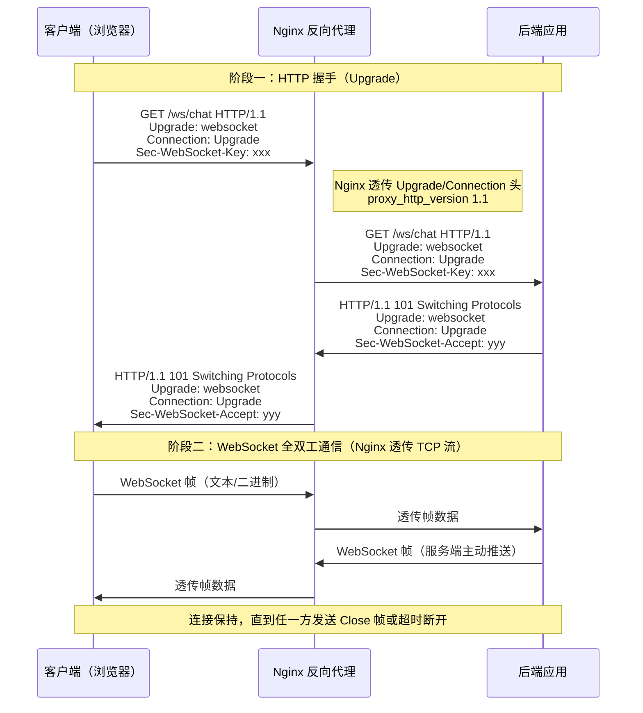
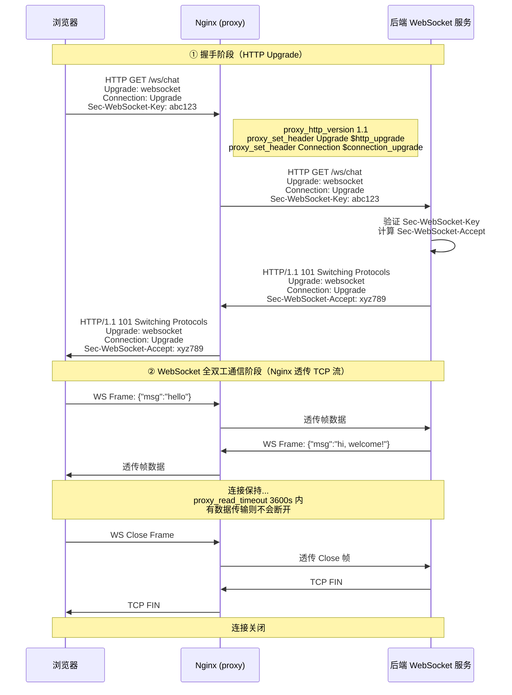

# 12 - WebSocket 代理

> 版本基线：Nginx 1.30.4 (stable) | 创建日期：2026-08-05
> 受众：后端开发熟手（熟悉 Python/Java/Node.js，写过 WebSocket 聊天或推送），但服务器运维是小白。本文把 WebSocket/SSE 这类"非标准 HTTP"的流量如何穿过 Nginx 讲透。

---

## 学习目标

学完本篇，你应当能够：

- 理解 **WebSocket 协议**的本质——它不是 HTTP，而是通过 HTTP Upgrade 握手升级出来的全双工 TCP 通道，并能说出握手过程中 `Upgrade`/`Connection`/`101` 的含义。
- 掌握 Nginx 代理 WebSocket 的**三个必须配置**：`proxy_http_version 1.1`、`proxy_set_header Upgrade $http_upgrade`、`proxy_set_header Connection "upgrade"`，并知道为什么缺一不可。
- 掌握用 `map` 变量动态设置 `Connection` 头的写法，理解为什么"普通 HTTP 和 WebSocket 共用同一个 location 时"不能用硬编码的 `Connection "upgrade"`。
- 理解 `proxy_read_timeout` 对 WebSocket 长连接的影响，知道为什么默认 60s 会让 WebSocket 被频繁断开。
- 理解 upstream `keepalive` 与 WebSocket `Connection` 头的**冲突**，知道 WebSocket 所在的 location 不能 `proxy_set_header Connection ""`。
- 掌握 **SSE（Server-Sent Events）**的代理配置——关闭 buffering、设置长超时，理解 SSE 与 WebSocket 在代理配置上的异同。
- 独立写出聊天应用 WebSocket 和实时通知 SSE 的完整生产配置。
- 避开踩坑 `#5.3`（WebSocket 代理未升级协议头）、`#2.5`（proxy buffer 过小导致落盘或响应被截断）。

> **前置知识**：阅读本篇前，建议先完成 [09-反向代理 proxy_pass](09-反向代理proxy_pass.md)，理解 `proxy_pass`、`proxy_set_header`、`proxy_read_timeout`、`proxy_buffering` 等基础指令。本文是它们的"长连接特化版"。

---

## 核心知识点

### 知识点一：WebSocket 协议基础

#### WebSocket 是什么

WebSocket 是一种在单个 TCP 连接上进行**全双工通信**的协议，标准化于 RFC 6455。与 HTTP 的"请求-响应"模式不同，WebSocket 连接建立后，客户端和服务端可以**随时主动向对方发送数据**，不需要对方先发请求。

用后端开发的视角来理解：

| 维度 | HTTP | WebSocket |
|------|------|-----------|
| 通信模式 | 请求-响应（半双工） | 全双工（双向同时收发） |
| 连接生命周期 | 短连接为主（keepalive 复用但仍是一问一答） | 长连接，建立后持续保持 |
| 服务端推送 | 不支持（需轮询 / long polling） | 原生支持 |
| 协议头开销 | 每次请求都带完整 HTTP 头 | 握手后用帧（frame）传输，开销极小（2-14 字节） |
| 典型场景 | CRUD 接口、页面请求 | 聊天、实时通知、协同编辑、行情推送 |

#### 与 HTTP 的关系

WebSocket 并不是一个完全独立于 HTTP 的协议——它的**握手阶段借用 HTTP**，握手成功后就"升级"为 WebSocket 协议。具体来说：

1. 客户端发起一个**特殊的 HTTP GET 请求**，携带 `Upgrade: websocket` 和 `Connection: Upgrade` 头。
2. 服务端如果支持 WebSocket，返回 HTTP `101 Switching Protocols` 响应，同意升级。
3. 从这一刻起，这条 TCP 连接不再是 HTTP，双方改用 WebSocket 帧格式通信。

> **关键点**：WebSocket 的握手是 HTTP，但握手之后就不是了。这就是为什么 Nginx 代理 WebSocket 时，既要处理 HTTP 握手，又要在握手成功后"透传"后续的 WebSocket 流量——Nginx 本身不理解 WebSocket 帧，它只是把 TCP 数据流原封不动地在客户端和后端之间搬运。

#### 握手过程

客户端发起的握手请求长这样：

```http
GET /ws/chat HTTP/1.1
Host: example.com
Upgrade: websocket
Connection: Upgrade
Sec-WebSocket-Key: dGhlIHNhbXBsZSBub25jZQ==
Sec-WebSocket-Version: 13
```

服务端的握手响应长这样：

```http
HTTP/1.1 101 Switching Protocols
Upgrade: websocket
Connection: Upgrade
Sec-WebSocket-Accept: s3pPLMBiTxaQ9kYGzzhZRbK+xOo=
```

几个关键字段的含义：

- `Upgrade: websocket`：客户端请求升级协议为 WebSocket。
- `Connection: Upgrade`：告诉中间代理"这是一个升级请求，请透传 Upgrade 头"。
- `Sec-WebSocket-Key`：客户端生成的随机 Base64 字符串，用于服务端验证握手合法性。
- `101 Switching Protocols`：服务端同意升级，状态码 101 表示"协议切换"。
- `Sec-WebSocket-Accept`：服务端用 `Sec-WebSocket-Key` + 固定 GUID 拼接后做 SHA-1 + Base64 计算出的值，客户端据此验证服务端身份。

#### WebSocket 握手时序图



> **特例**：如果 Nginx 没有正确透传 `Upgrade`/`Connection` 头，后端收到的就是一个普通 HTTP GET 请求，不会返回 101，而是返回 200 或 404——WebSocket 连接建立失败。这就是踩坑 `#5.3` 的根因。

---

### 知识点二：Nginx 代理 WebSocket 的核心配置

要让 Nginx 正确代理 WebSocket，有三个配置**缺一不可**。

#### 三个必须的配置

```nginx
location /ws/ {
    proxy_pass http://backend;

    # ① 必须用 HTTP/1.1 与后端通信
    proxy_http_version 1.1;

    # ② 透传客户端的 Upgrade 头
    proxy_set_header Upgrade $http_upgrade;

    # ③ 设置 Connection 头为 upgrade
    proxy_set_header Connection "upgrade";
}
```

逐行说明：

- `proxy_http_version 1.1;`：**必须**。Nginx 默认用 HTTP/1.0 与后端通信（1.29.7 后默认改为 1.1，但 WebSocket 场景仍需显式声明）。HTTP/1.0 不支持 `Upgrade` 机制——`Upgrade` 和 `Connection` 头在 HTTP/1.0 中没有定义语义，后端会忽略它们，握手无法完成。

- `proxy_set_header Upgrade $http_upgrade;`：**必须**。`$http_upgrade` 是 Nginx 内置变量，它的值就是客户端请求头中 `Upgrade` 字段的值（WebSocket 请求时为 `websocket`）。这一行把客户端的 `Upgrade` 头透传给后端。如果不加这行，Nginx 默认不会转发 `Upgrade` 头，后端不知道客户端想升级协议。

- `proxy_set_header Connection "upgrade";`：**必须**。这一行设置 `Connection` 头的值为字符串 `"upgrade"`，告诉后端"这是一个升级请求，请保持连接并处理 Upgrade"。HTTP/1.1 默认 `Connection: keep-alive`，如果不改为 `upgrade`，后端可能不会进入协议升级流程。

> **为什么是硬编码字符串 `"upgrade"` 而不是 `$http_connection`？** 因为 `Connection` 头的值在升级场景下应该是 `Upgrade`（首字母大写），而客户端发来的可能是 `upgrade`（小写）或 `Upgrade`（大写）。直接硬编码 `"upgrade"` 可以保证一致性——HTTP 头值不区分大小写，所以 `"upgrade"` 和 `"Upgrade"` 等效。

> **引用踩坑 [#5.3 WebSocket 代理未升级协议头](../99-踩坑记录与解决方案.md#53-websocket-代理未升级协议头)**：缺少这三个配置中的任何一个，WebSocket 握手都会失败——连接立即断开或 101 切换不成功。现象是浏览器控制台报 `WebSocket connection failed` 或 `Unexpected response code: 200/404`。

#### 完整的最小可用配置

```nginx
http {
    upstream backend {
        server 127.0.0.1:8080;       # 后端 WebSocket 服务
    }

    server {
        listen 80;
        server_name ws.example.com;

        location /ws/ {
            proxy_pass http://backend;

            # ====== WebSocket 三件套 ======
            proxy_http_version 1.1;                    # ① HTTP/1.1
            proxy_set_header Upgrade $http_upgrade;    # ② 透传 Upgrade 头
            proxy_set_header Connection "upgrade";     # ③ Connection 设为 upgrade

            # ====== 长连接超时（见知识点四）======
            proxy_read_timeout 3600s;                  # 避免长连接被 60s 默认超时断开
        }
    }
}
```

> **特例**：在 Nginx 1.30.4 上，`proxy_http_version` 默认已是 1.1（1.29.7 起改的默认值），但 WebSocket 场景仍**强烈建议显式写出** `proxy_http_version 1.1`——原因是如果未来某个 location 继承了其他层级的配置，或者你升级/回退 Nginx 版本，隐式默认值可能发生变化，显式声明最安全。

---

### 知识点三：Connection 头的 map 写法

#### 问题：硬编码 Connection "upgrade" 的副作用

知识点二中的写法有一个潜在问题：`proxy_set_header Connection "upgrade";` 是**硬编码**的，意味着**所有**经过这个 location 的请求，`Connection` 头都会被设为 `upgrade`——即使是普通 HTTP 请求也不例外。

如果同一个 location 既处理 WebSocket 握手，又处理普通 HTTP 请求（比如 WebSocket 服务端在握手前先返回一个 HTML 页面），那么普通 HTTP 请求也会带上 `Connection: upgrade`，这可能导致：

- 后端误以为是升级请求，返回 101 但没有后续 WebSocket 帧，连接挂起。
- HTTP keepalive 失效——`Connection: upgrade` 不是 `keep-alive`，连接无法复用。
- 某些后端框架对非标准 `Connection` 值返回 400 Bad Request。

#### 解决：用 map 根据 $http_upgrade 动态设置 Connection 头

Nginx 的 `map` 指令可以根据一个变量的值，动态生成另一个变量的值。我们可以用 `$http_upgrade`（客户端是否发送了 Upgrade 头）来决定 `Connection` 头的值：

```nginx
# map 写在 http 上下文中（与 server 平级）
http {
    # 根据 $http_upgrade 的值，决定 $connection_upgrade 的值
    map $http_upgrade $connection_upgrade {
        default upgrade;      # 客户端发了 Upgrade 头 → Connection 设为 upgrade
        ''      close;        # 客户端没发 Upgrade 头（普通 HTTP）→ Connection 设为 close
    }

    upstream backend {
        server 127.0.0.1:8080;
    }

    server {
        listen 80;

        location /ws/ {
            proxy_pass http://backend;

            proxy_http_version 1.1;
            proxy_set_header Upgrade $http_upgrade;          # 透传 Upgrade 头
            proxy_set_header Connection $connection_upgrade;  # 用 map 变量动态设置
            proxy_read_timeout 3600s;
        }
    }
}
```

逐行说明：

- `map $http_upgrade $connection_upgrade { ... }`：`map` 指令定义了一个映射规则——输入变量是 `$http_upgrade`（客户端请求头 `Upgrade` 的值），输出变量是 `$connection_upgrade`（我们自定义的新变量）。
  - `default upgrade;`：当 `$http_upgrade` 的值**不匹配**任何显式列出的 key 时（即客户端发了 `Upgrade: websocket` 等），`$connection_upgrade` 的值为 `upgrade`。
  - `''  close;`：当 `$http_upgrade` 的值为**空字符串**时（即客户端没发 `Upgrade` 头，是普通 HTTP 请求），`$connection_upgrade` 的值为 `close`。
- `proxy_set_header Connection $connection_upgrade;`：在 location 中用 `$connection_upgrade` 变量替代硬编码字符串。WebSocket 请求时自动设为 `upgrade`，普通 HTTP 请求时自动设为 `close`。

> **map 的执行时机**：`map` 是在配置加载时编译映射表，运行时查表——不是每次请求都执行 if 判断，性能开销极小。这也是 Nginx 官方推荐用 `map` 替代 `if` 的典型场景。

#### 两种写法对比

| 维度 | 硬编码 `Connection "upgrade"` | map 变量 `$connection_upgrade` |
|------|------------------------------|-------------------------------|
| WebSocket 请求 | 正常工作 | 正常工作 |
| 普通 HTTP 请求 | Connection 被错误设为 upgrade | Connection 自动设为 close |
| 适用场景 | location 只处理 WebSocket | location 混合处理 WebSocket + HTTP |
| 推荐度 | 简单场景可用 | 生产推荐，更健壮 |

> **最佳实践**：即使当前 location 只处理 WebSocket，也建议用 map 写法——因为未来可能有人在同一个 location 加普通 HTTP 接口，map 写法能自动兼容，不会踩坑。

---

### 知识点四：WebSocket 长连接超时

#### 问题：默认 60s 超时会断开 WebSocket

`proxy_read_timeout` 的默认值是 60s。它的含义是"两次连续读操作之间的间隔超时"——如果 Nginx 在 60s 内没有从后端收到任何数据，就会认为连接出了问题，主动断开。

对于普通 HTTP 请求，60s 足够等后端返回响应。但 WebSocket 是长连接——握手成功后，连接会一直保持，直到客户端或服务端主动关闭。如果在这期间 60s 内没有任何数据传输（比如聊天室没人说话），Nginx 就会把连接断掉，用户会看到 WebSocket 莫名其妙掉线。

> **注意**：`proxy_read_timeout` 计的是"两次读操作之间的**间隔**"，不是"总时长"。只要数据在持续流动，即使连接保持了几个小时也不会超时。只有在某一方"沉默"超过这个时间，才会触发。但对于聊天等低频场景，沉默 60s 太常见了。

#### 解决：设置较长的超时

```nginx
location /ws/ {
    proxy_pass http://backend;

    proxy_http_version 1.1;
    proxy_set_header Upgrade $http_upgrade;
    proxy_set_header Connection $connection_upgrade;

    # WebSocket 长连接超时：设为 1 小时
    proxy_read_timeout 3600s;        # 读取超时设为 3600s（1 小时）
    proxy_send_timeout 3600s;        # 发送超时也设为 3600s（保持对称）
}
```

逐行说明：

- `proxy_read_timeout 3600s;`：把读取超时从默认 60s 调到 3600s（1 小时）。这意味着 WebSocket 连接在"沉默"1 小时后才会被 Nginx 断开。对于大多数聊天/推送场景，1 小时足够了。
- `proxy_send_timeout 3600s;`：发送超时也调大，保持读写对称。虽然 WebSocket 主要是读超时的问题，但发送方向也设大一些不会有副作用。

#### 超时值怎么选

| 场景 | 推荐值 | 说明 |
|------|--------|------|
| 高频推送（行情、弹幕） | `600s`（10 分钟） | 数据流密集，很少长时间沉默 |
| 聊天应用 | `3600s`（1 小时） | 可能几分钟没人说话 |
| 低频通知 | `86400s`（24 小时） | 可能几小时才推一条消息 |
| 配合心跳机制 | `proxy_read_timeout` 略大于心跳间隔 × 2 | 最优方案（见下方说明） |

> **最佳实践：配合心跳**。最健壮的做法是后端定期发送 WebSocket Ping 帧（或自定义心跳消息），间隔小于 `proxy_read_timeout`。比如每 30 秒发一次心跳，`proxy_read_timeout` 设为 90s——既保证连接不被误断，又不至于在连接真正断开时等太久才发现。这样可以把超时设得比较短（90s），避免僵尸连接长期占用资源。

> **特例**：`proxy_read_timeout` 设得过长（如 `86400s`）的风险是——如果客户端网络异常断开（如手机进隧道、WiFi 切换），Nginx 和后端不会立即感知，连接会"僵尸"存活直到超时。这会占用后端连接资源。因此**不要无脑设成无限大**，配合心跳 + 适中超时才是正解。

---

### 知识点五：WebSocket 与 upstream keepalive 的冲突

#### 问题：Connection 头被清空

在 [09-反向代理 proxy_pass](09-反向代理proxy_pass.md) 的知识点八中，我们学到：为了开启 upstream keepalive（到后端的长连接复用），需要在 location 中配置：

```nginx
proxy_http_version 1.1;
proxy_set_header Connection "";     # 清空 Connection 头，启用 keepalive
```

但 WebSocket 代理需要的是：

```nginx
proxy_http_version 1.1;
proxy_set_header Upgrade $http_upgrade;
proxy_set_header Connection "upgrade";   # Connection 设为 upgrade
```

这两者**直接冲突**——一个要清空 `Connection`，一个要设为 `upgrade`。如果同一个 location 里同时写了这两组配置，后写的 `proxy_set_header Connection` 会覆盖先写的，导致其中一个失效。

#### 根因：keepalive 连接池与 WebSocket 连接不兼容

upstream keepalive 的工作原理是：Nginx 与后端之间维护一个**空闲长连接池**，普通 HTTP 请求结束后，连接归还到池中供下次请求复用。

但 WebSocket 连接是**持久全双工连接**——握手成功后连接一直被占用，永远不会"空闲"，因此**无法归还到 keepalive 连接池**。如果强行把 WebSocket 连接放入 keepalive 池，会导致连接状态混乱。

#### 解决：WebSocket 所在 location 不要清理 Connection 头

规则很简单——**WebSocket 的 location 和 keepalive 的 location 分开配置**：

```nginx
http {
    map $http_upgrade $connection_upgrade {
        default upgrade;
        ''      close;
    }

    upstream backend {
        server 127.0.0.1:8080;
        keepalive 32;                     # 开启 keepalive（给普通 HTTP 用）
    }

    server {
        listen 80;

        # ====== 普通 HTTP 接口：用 keepalive ======
        location /api/ {
            proxy_pass http://backend;

            proxy_http_version 1.1;
            proxy_set_header Connection "";   # 清空 Connection，启用 keepalive
            # 1.30.4 默认已清空，显式写出更清晰
        }

        # ====== WebSocket 接口：不用 keepalive，设 Upgrade ======
        location /ws/ {
            proxy_pass http://backend;

            proxy_http_version 1.1;
            proxy_set_header Upgrade $http_upgrade;           # 透传 Upgrade
            proxy_set_header Connection $connection_upgrade;   # 用 map 设置，不要清空！
            proxy_read_timeout 3600s;                          # 长连接超时

            # 注意：这里绝对不能写 proxy_set_header Connection "";
            # 否则 Upgrade 头会被后端忽略，WebSocket 握手失败
        }
    }
}
```

逐行说明：

- 普通 HTTP 的 `/api/` location：正常配置 keepalive，`Connection ""` 清空头，连接复用。
- WebSocket 的 `/ws/` location：**不**配置 `Connection ""`，而是用 `$connection_upgrade`（map 变量）设置 `Connection` 头。WebSocket 连接不进入 keepalive 池，每次都新建到后端的连接，握手后保持。
- 两个 location 共用同一个 upstream，但 keepalive 池只服务普通 HTTP 请求，WebSocket 请求绕过 keepalive 逻辑。

> **特例说明**：如果用了知识点三的 map 写法，`$connection_upgrade` 在普通 HTTP 请求时值为 `close`，在 WebSocket 请求时值为 `upgrade`——这天然兼容了两种场景。但即便如此，`/ws/` location 仍然不应该写 `proxy_set_header Connection ""`，因为那会覆盖 map 变量的值。keepalive 的 `Connection ""` 只应该出现在不需要协议升级的普通 HTTP location 中。

> **引用踩坑 [#5.3 WebSocket 代理未升级协议头](../99-踩坑记录与解决方案.md#53-websocket-代理未升级协议头)**：开了 upstream keepalive 后，如果在 WebSocket location 里沿用了 `proxy_set_header Connection ""`，会导致 `Upgrade` 头被后端忽略（因为 `Connection` 不是 `upgrade`），WebSocket 握手失败。这是 keepalive 配置"传染"到 WebSocket location 的典型踩坑。

---

### 知识点六：SSE（Server-Sent Events）代理

#### SSE 的特点

SSE（Server-Sent Events）是一种基于 HTTP 的**单向流式推送**协议，标准化于 HTML5 规范。与 WebSocket 的双向通信不同，SSE 是**服务端到客户端的单向推送**——客户端发起一个普通 HTTP 请求，服务端不关闭连接，持续以 `text/event-stream` 格式推送数据。

| 维度 | WebSocket | SSE |
|------|-----------|-----|
| 通信方向 | 全双工（双向） | 单向（服务端 → 客户端） |
| 协议 | WebSocket（非 HTTP） | 标准 HTTP |
| 连接类型 | 升级后的 TCP 长连接 | HTTP 长连接（不关闭响应体） |
| 数据格式 | WebSocket 帧（文本/二进制） | `text/event-stream`（纯文本） |
| 自动重连 | 需客户端手动实现 | 浏览器原生自动重连 |
| 代理配置 | 需 Upgrade 头 + HTTP/1.1 | 关闭 buffering + 长超时 |
| 典型场景 | 聊天、协同编辑、游戏 | 实时通知、行情推送、AI 流式回复 |

> **为什么 SSE 在大模型时代又火了？** ChatGPT 等 LLM 的流式回复用的就是 SSE——服务端逐 token 输出，前端边收边渲染。SSE 相比 WebSocket 更简单（不需要协议升级，标准 HTTP），且浏览器原生支持 `EventSource` API 自动重连。

#### 代理配置：关闭 buffering + 长超时

SSE 代理的核心要点是两个：**关闭缓冲**和**设置长超时**。

```nginx
location /sse/ {
    proxy_pass http://backend;

    # ====== 关闭缓冲（最关键）======
    proxy_buffering off;              # 关闭响应缓冲，让数据实时透传给客户端
    proxy_cache off;                  # 同时关闭缓存（防止缓存干扰流式响应）

    # ====== 长超时（同 WebSocket）======
    proxy_read_timeout 3600s;         # SSE 是长连接，默认 60s 会断开
    proxy_send_timeout 3600s;         # 发送超时也调大

    # ====== HTTP 版本 ======
    proxy_http_version 1.1;           # 用 HTTP/1.1（SSE 不需要 Upgrade，但 1.1 支持.chunked 传输）

    # ====== 注意：SSE 不需要 Upgrade/Connection 头 ======
    # SSE 是标准 HTTP，不需要协议升级
    # 如果用了 map，$connection_upgrade 对 SSE 请求会自动为 close
    # proxy_set_header Connection $connection_upgrade;  # 可选，SSE 时值为 close
}
```

逐行说明：

- `proxy_buffering off;`：**最关键的一行**。`proxy_buffering on`（默认）时，Nginx 会把后端的响应缓冲在内存中，等收齐或缓冲填满再发给客户端。对于 SSE，后端是持续不断推送数据的，如果缓冲开启，数据会被攒在 Nginx 里——客户端看到的不是"实时推送"，而是"一批一批地突然蹦出来"，甚至可能因为缓冲区满而被截断。关闭缓冲后，Nginx 收到后端的每一块数据就立即转发给客户端。

- `proxy_cache off;`：关闭缓存。SSE 是动态流式数据，缓存毫无意义，反而可能干扰。

- `proxy_read_timeout 3600s;`：和 WebSocket 一样，SSE 是长连接，默认 60s 会在"沉默"超时后断开。设为 3600s 保证低频推送场景下连接不会被误断。

- `proxy_http_version 1.1;`：SSE 不需要协议升级（不需要 `Upgrade` 头），但 HTTP/1.1 支持 `chunked` 传输编码——SSE 响应通常用 `Transfer-Encoding: chunked` 来实现"不知道总长度，持续发送"的效果。HTTP/1.0 不支持 chunked，会导致 SSE 无法正常工作。

> **特例**：SSE 不需要 `proxy_set_header Upgrade` 和 `proxy_set_header Connection "upgrade"`——这是 SSE 和 WebSocket 代理配置的**核心区别**。SSE 是标准 HTTP，WebSocket 是协议升级。如果你发现 SSE 的 location 配了 Upgrade 头，那一定是抄了 WebSocket 的配置没改干净。

> **引用踩坑 [#2.5 proxy buffer 过小导致落盘或响应被截断](../99-踩坑记录与解决方案.md#25-proxy-buffer-过小导致落盘或响应被截断)**：SSE 场景下，如果忘记关闭 `proxy_buffering`，数据会被缓冲在 Nginx 内存/临时文件中，客户端看到的是"延迟 + 分批"的推送，而不是实时流。更严重的情况下，缓冲区满后响应可能被截断，客户端收到不完整的 SSE 流。

#### SSE vs WebSocket 代理配置对比

| 配置项 | WebSocket | SSE |
|--------|-----------|-----|
| `proxy_http_version` | `1.1`（必须） | `1.1`（推荐） |
| `Upgrade` 头 | `proxy_set_header Upgrade $http_upgrade`（必须） | 不需要 |
| `Connection` 头 | `$connection_upgrade`（必须） | 不需要（或用 map 自动为 close） |
| `proxy_buffering` | 不涉及（WebSocket 帧不走 HTTP 缓冲） | `off`（必须） |
| `proxy_read_timeout` | 调大（如 3600s） | 调大（如 3600s） |
| `proxy_cache` | 不涉及 | `off`（推荐） |

---

### 知识点七：实战场景

#### 场景一：聊天应用 WebSocket

一个典型的聊天应用架构：前端通过 WebSocket 连接到 Nginx，Nginx 代理到后端的 WebSocket 服务（如 Node.js + Socket.io、Go + gorilla/websocket）。后端可能有多台实例，用 `ip_hash` 保证同一用户连到同一台后端（WebSocket 是有状态连接，不能随便切换后端）。

```nginx
http {
    # ====== map：动态设置 Connection 头 ======
    map $http_upgrade $connection_upgrade {
        default upgrade;
        ''      close;
    }

    # ====== WebSocket 后端集群 ======
    upstream ws_backend {
        ip_hash;                        # IP 哈希：同一客户端连到同一台后端
                                        # WebSocket 是有状态长连接，不能在多台后端间切换
        server 10.0.0.1:8080;           # 后端实例 A
        server 10.0.0.2:8080;           # 后端实例 B
        server 10.0.0.3:8080;           # 后端实例 C
    }

    # ====== 普通 HTTP API 后端 ======
    upstream api_backend {
        server 10.0.0.1:8000;           # 后端 API 实例 A
        server 10.0.0.2:8000;           # 后端 API 实例 B
        keepalive 32;                   # 开启 keepalive（普通 HTTP 用）
    }

    server {
        listen 443 ssl;
        server_name chat.example.com;
        http2 on;

        # SSL 配置（略，参见阶段五 HTTPS 文档）
        ssl_certificate     /etc/nginx/ssl/chat.crt;
        ssl_certificate_key /etc/nginx/ssl/chat.key;

        # ====== 聊天 WebSocket 端点 ======
        location /ws/chat {
            proxy_pass http://ws_backend;               # 代理到 WebSocket 集群

            # WebSocket 三件套
            proxy_http_version 1.1;
            proxy_set_header Upgrade $http_upgrade;
            proxy_set_header Connection $connection_upgrade;

            # 长连接超时
            proxy_read_timeout 3600s;                    # 1 小时
            proxy_send_timeout 3600s;

            # 透传客户端信息
            proxy_set_header Host $host;
            proxy_set_header X-Real-IP $remote_addr;
            proxy_set_header X-Forwarded-For $proxy_add_x_forwarded_for;
            proxy_set_header X-Forwarded-Proto $scheme;
        }

        # ====== 普通 HTTP API ======
        location /api/ {
            proxy_pass http://api_backend;               # 代理到 API 集群

            # keepalive 配置
            proxy_http_version 1.1;
            proxy_set_header Connection "";              # 清空 Connection，启用 keepalive

            # 透传客户端信息
            proxy_set_header Host $host;
            proxy_set_header X-Real-IP $remote_addr;
            proxy_set_header X-Forwarded-For $proxy_add_x_forwarded_for;
            proxy_set_header X-Forwarded-Proto $scheme;
        }

        # ====== 静态资源（前端页面）======
        location / {
            root /var/www/chat-frontend;
            try_files $uri $uri/ /index.html;
        }
    }
}
```

> **特例**：WebSocket + `ip_hash` 是常见组合，因为 WebSocket 是有状态连接——如果用户的连接被切换到另一台后端，那台后端没有该用户的会话状态，连接就会出错。但 `ip_hash` 的问题是后端扩缩容时哈希分布会变化，可能导致已有连接断开。更健壮的方案是用 Sticky Session（基于 Cookie 的会话亲和），但开源版 Nginx 不原生支持，需要第三方模块或在上游用 Redis 共享会话状态。

#### 场景二：实时通知 SSE

一个实时通知系统：后端通过 SSE 推送通知给前端（如订单状态变更、系统公告）。SSE 比 WebSocket 更简单，适合"只需要服务端推送、不需要客户端回传"的场景。

```nginx
http {
    upstream notification_backend {
        server 10.0.0.1:8000;
        server 10.0.0.2:8000;
        keepalive 32;
    }

    # map（如果同时有 WebSocket 和 SSE，map 仍可复用）
    map $http_upgrade $connection_upgrade {
        default upgrade;
        ''      close;
    }

    server {
        listen 443 ssl;
        server_name app.example.com;
        http2 on;

        ssl_certificate     /etc/nginx/ssl/app.crt;
        ssl_certificate_key /etc/nginx/ssl/app.key;

        # ====== SSE 通知端点 ======
        location /sse/notifications {
            proxy_pass http://notification_backend;

            # 关闭缓冲（SSE 最关键配置）
            proxy_buffering off;                        # 数据实时透传，不缓冲
            proxy_cache off;                            # 关闭缓存

            # 长超时
            proxy_read_timeout 3600s;                   # SSE 长连接，1 小时
            proxy_send_timeout 3600s;

            # HTTP/1.1（支持 chunked 传输）
            proxy_http_version 1.1;

            # SSE 不需要 Upgrade 头
            # 用 map 时 $connection_upgrade 自动为 close（因为 SSE 请求没有 Upgrade 头）
            proxy_set_header Connection $connection_upgrade;

            # 透传客户端信息
            proxy_set_header Host $host;
            proxy_set_header X-Real-IP $remote_addr;
            proxy_set_header X-Forwarded-For $proxy_add_x_forwarded_for;
            proxy_set_header X-Forwarded-Proto $scheme;
        }

        # ====== 普通 API ======
        location /api/ {
            proxy_pass http://notification_backend;
            proxy_http_version 1.1;
            proxy_set_header Connection "";
            proxy_set_header Host $host;
            proxy_set_header X-Real-IP $remote_addr;
            proxy_set_header X-Forwarded-For $proxy_add_x_forwarded_for;
            proxy_set_header X-Forwarded-Proto $scheme;
        }

        # ====== AI 流式对话（也是 SSE）======
        location /api/chat/stream {
            proxy_pass http://notification_backend;

            proxy_buffering off;                        # 关闭缓冲，逐 token 透传
            proxy_cache off;
            proxy_read_timeout 300s;                    # AI 对话通常几分钟内完成
            proxy_http_version 1.1;
            proxy_set_header Connection $connection_upgrade;
            proxy_set_header Host $host;
            proxy_set_header X-Real-IP $remote_addr;
            proxy_set_header X-Forwarded-For $proxy_add_x_forwarded_for;
            proxy_set_header X-Forwarded-Proto $scheme;
        }
    }
}
```

> **特例**：AI 流式对话（如 ChatGPT 式逐 token 输出）用的也是 SSE，但超时设置与普通通知不同——AI 对话通常在几分钟内完成（一次对话不会持续几小时），所以 `proxy_read_timeout 300s` 足够。如果设成 3600s，当后端异常卡住时客户端要等很久才报错。根据业务特点设置超时，不要无脑照搬。

---

## WebSocket 握手时序图

下面这张时序图完整展示了 WebSocket 从握手到通信的全过程，以及 Nginx 在其中扮演的角色：



> **Nginx 的角色**：在握手阶段，Nginx 是一个 HTTP 反向代理，负责透传 `Upgrade`/`Connection` 头；在握手成功后，Nginx 变成了一个"TCP 管道"——它不理解 WebSocket 帧的内容，只是把客户端和后端之间的 TCP 数据流双向搬运。因此 `proxy_read_timeout` 对 WebSocket 连接的"沉默"检测仍然生效。

---

## 最佳实践

### 1. 始终用 map 写法设置 Connection 头

```nginx
# ✅ 推荐：map 写法，兼容 WebSocket 和普通 HTTP
http {
    map $http_upgrade $connection_upgrade {
        default upgrade;
        ''      close;
    }
    # ...
    location /ws/ {
        proxy_set_header Connection $connection_upgrade;
    }
}

# ❌ 避免：硬编码，普通 HTTP 请求也会带上 Connection: upgrade
# location /ws/ {
#     proxy_set_header Connection "upgrade";
# }
```

### 2. WebSocket 和普通 HTTP 分开 location

```nginx
# ✅ WebSocket 独立 location，不与 keepalive 冲突
location /ws/ {
    proxy_pass http://backend;
    proxy_http_version 1.1;
    proxy_set_header Upgrade $http_upgrade;
    proxy_set_header Connection $connection_upgrade;   # 不清空 Connection
    proxy_read_timeout 3600s;
}

# 普通 HTTP 另一个 location，正常用 keepalive
location /api/ {
    proxy_pass http://backend;
    proxy_http_version 1.1;
    proxy_set_header Connection "";                     # 清空 Connection
}
```

### 3. 配合心跳机制设置超时

```nginx
# 后端每 30 秒发一次 WebSocket Ping 帧
# proxy_read_timeout 设为心跳间隔的 2-3 倍
location /ws/ {
    proxy_pass http://backend;
    proxy_http_version 1.1;
    proxy_set_header Upgrade $http_upgrade;
    proxy_set_header Connection $connection_upgrade;
    proxy_read_timeout 90s;         # 30s 心跳 × 3 = 90s，既防误断又防僵尸
}
```

### 4. SSE 必须关闭 buffering

```nginx
location /sse/ {
    proxy_pass http://backend;
    proxy_buffering off;            # 最关键的一行
    proxy_cache off;
    proxy_read_timeout 3600s;
    proxy_http_version 1.1;
}
```

### 5. WebSocket 集群用 ip_hash 保证会话亲和

```nginx
upstream ws_backend {
    ip_hash;                        # 同一 IP 始终连到同一台后端
    server 10.0.0.1:8080;
    server 10.0.0.2:8080;
}
```

### 6. 调试 WebSocket 代理的排查清单

当 WebSocket 连接失败时，按以下步骤排查：

1. **检查浏览器控制台**：报 `Unexpected response code: 200` 说明握手没成功（后端没返回 101），检查是否缺少 `proxy_http_version 1.1` 或 `Upgrade`/`Connection` 头。
2. **检查 Nginx 配置**：确认 WebSocket location 有完整的"三件套"（`proxy_http_version 1.1` + `Upgrade` + `Connection`）。
3. **检查 keepalive 冲突**：确认 WebSocket location 没有 `proxy_set_header Connection ""`。
4. **检查超时**：如果连接每隔 60 秒断一次，是 `proxy_read_timeout` 默认值太小。
5. **直连后端测试**：绕过 Nginx 直接连后端 WebSocket，确认后端本身没问题。
6. **抓包确认**：用 `tcpdump` 或浏览器开发者工具的 Network 面板查看握手请求/响应，确认 `Upgrade`/`Connection`/`101` 是否正常。

---

## 常见踩坑引用

本篇涉及以下踩坑条目，详细的现象、原因和解决方案见 [99-踩坑记录与解决方案](../99-踩坑记录与解决方案.md)：

| 编号 | 坑点 | 与本篇的关联 |
|------|------|-------------|
| **#5.3** | [WebSocket 代理未升级协议头](../99-踩坑记录与解决方案.md#53-websocket-代理未升级协议头) | 知识点二/五：缺少 `proxy_http_version 1.1` + `Upgrade`/`Connection` 头，或 keepalive 的 `Connection ""` 覆盖了升级头，导致握手失败 |
| **#2.5** | [proxy buffer 过小导致落盘或响应被截断](../99-踩坑记录与解决方案.md#25-proxy-buffer-过小导致落盘或响应被截断) | 知识点六：SSE 忘记关闭 `proxy_buffering`，数据被缓冲导致推送延迟或响应被截断 |

此外，以下踩坑与本篇的后续学习相关，可提前了解：

| 编号 | 坑点 | 关联场景 |
|------|------|---------|
| #3.5 | 不当的 proxy_set_header / Host 头问题 | WebSocket location 也要透传 Host / X-Real-IP 等 |
| #5.6 | 长连接复用导致后端连接数被压垮 | WebSocket 长连接占用后端连接，需关注后端连接池上限 |
| #5.7 | proxy_next_upstream 导致非幂等请求被重试 | WebSocket 握手请求不应被重试到另一台后端 |

---

## 小结

本篇把 WebSocket 和 SSE 这两类"非标准 HTTP"流量如何穿过 Nginx 讲透。核心要点回顾：

1. **WebSocket 协议基础**：WebSocket 是全双工通信协议，通过 HTTP Upgrade 握手升级而来。客户端发 `Upgrade: websocket` + `Connection: Upgrade`，服务端返回 `101 Switching Protocols`，之后切换为 WebSocket 帧通信。Nginx 在握手阶段是 HTTP 代理，握手后是 TCP 透传管道。

2. **三个必须配置**：`proxy_http_version 1.1`（HTTP/1.0 不支持 Upgrade）、`proxy_set_header Upgrade $http_upgrade`（透传升级头）、`proxy_set_header Connection "upgrade"`（或 map 变量）。缺任何一个握手都会失败（踩坑 `#5.3`）。

3. **map 写法**：用 `map $http_upgrade $connection_upgrade { default upgrade; '' close; }` 动态设置 `Connection` 头——WebSocket 请求时为 `upgrade`，普通 HTTP 请求时为 `close`。生产环境推荐用 map 写法，兼容混合场景。

4. **长连接超时**：`proxy_read_timeout` 默认 60s，WebSocket 低频场景会被误断。调大到 3600s 或配合心跳设为心跳间隔的 2-3 倍。不要无脑设无限大，避免僵尸连接。

5. **与 keepalive 的冲突**：upstream keepalive 要求 `Connection ""`，WebSocket 要求 `Connection "upgrade"`——两者冲突。WebSocket location 不要清空 Connection 头，且 WebSocket 连接不进入 keepalive 连接池。两者分开 location 配置。

6. **SSE 代理**：SSE 是单向 HTTP 长连接流式推送，不需要协议升级。核心配置是 `proxy_buffering off`（关闭缓冲，数据实时透传）+ `proxy_read_timeout 3600s`（长超时）。忘记关 buffering 会导致推送延迟或截断（踩坑 `#2.5`）。

7. **WebSocket vs SSE 对比**：WebSocket 需 Upgrade 头 + HTTP/1.1；SSE 需关闭 buffering + 长超时。两者都需要调大 `proxy_read_timeout`，但 SSE 不涉及协议升级和 keepalive 冲突问题。

> **下一篇**：[13-四层 stream 代理](13-四层stream代理.md)将从七层 HTTP 代理切换到四层 TCP/UDP 代理，讲解 `stream` 模块的配置——代理 MySQL/Redis/DNS 等非 HTTP 协议。

## 🧪 本机实测（2026-08-09）

> 环境：nginx:1.30.4（Docker），后端 = 宿主机 20 行 Python socket 服务（打印请求头并回 101）。

`proxy_http_version 1.1; proxy_set_header Upgrade $http_upgrade; proxy_set_header Connection "upgrade";` 配置下，curl 带升级头请求 `/ws/`：

- 后端收到的请求头含：`Upgrade: websocket`、`Connection: upgrade`、`Sec-WebSocket-Version: 13`、`Sec-WebSocket-Key` ✓（关键头完整透传）
- 后端回 101 后，客户端收到 `HTTP/1.1 101 Switching Protocols` ✓

三个关键配置缺任何一个，升级头都会被丢弃、握手必失败（见踩坑 #5.3）。
