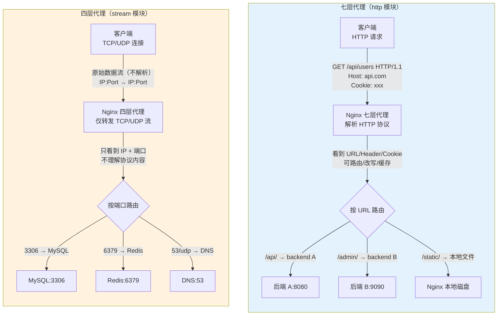
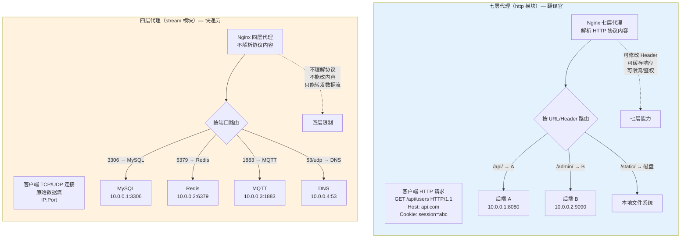

# 13 - 四层 stream 代理

> 版本基线：Nginx 1.30.4 (stable) | 创建日期：2026-08-05
> 受众：后端开发熟手（熟悉 Python/Java/Go，连过 MySQL/Redis），但服务器运维是小白。前面所有篇讲的都是七层 HTTP 代理，本文切换到四层 TCP/UDP 代理——用 Nginx 代理数据库、消息队列、DNS 等非 HTTP 协议。

---

## 学习目标

学完本篇，你应当能够：

- 区分**四层代理（stream）**与**七层代理（HTTP）**的本质差异，理解它们各自能看到什么数据、适用什么场景。
- 掌握 `stream` 模块在 `nginx.conf` 中的位置——它与 `http` 平级，不在 `http` 内部，且需要编译时启用 `--with-stream`。
- 独立写出 TCP 代理配置，代理 MySQL/Redis/PostgreSQL 等数据库连接。
- 独立写出 UDP 代理配置，代理 DNS 查询等 UDP 协议。
- 掌握 `stream` 上下文中的 `upstream` 负载均衡，理解它与七层 `upstream` 的区别（变量更少，没有 `$uri`/`$host` 等）。
- 理解 `proxy_timeout`、`proxy_connect_timeout` 等超时指令和被动健康检查机制。
- 了解 `stream` 模块的 SSL/TLS 终止能力，以及 `ssl_preread` 指令如何基于 SNI 做路由。
- 避开踩坑 `#5.1`（upstream 被动健康检查误判）、`#5.2`（单台后端时 max_fails/fail_timeout 失效）。

> **前置知识**：阅读本篇前，建议先完成 [09-反向代理 proxy_pass](09-反向代理proxy_pass.md) 和 [10-upstream 负载均衡算法](10-upstream负载均衡算法.md)，理解七层代理和负载均衡的基础概念。本文是它们的"四层版"——概念相通，但配置上下文和可用指令完全不同。

---

## 核心知识点

### 知识点一：四层代理 vs 七层代理

#### 什么是四层和七层

"四层"和"七层"来自 OSI 网络模型：

- **四层（传输层）**：工作在 TCP/UDP 层面，代理只能看到**IP 地址 + 端口 + 原始数据流**，不理解数据内容的协议含义。
- **七层（应用层）**：工作在 HTTP/HTTPS 等应用协议层面，代理能**解析协议内容**——URL 路径、请求头、Cookie、请求体等都能看到并修改。

Nginx 的 `http` 块就是七层代理，`stream` 块就是四层代理。

#### 对比表格

| 维度 | 七层代理（http 模块） | 四层代理（stream 模块） |
|------|----------------------|------------------------|
| 工作层级 | OSI 第七层（应用层） | OSI 第四层（传输层） |
| 能看到的数据 | HTTP 请求行、Header、Body、Cookie、URL | 仅 IP + 端口 + TCP/UDP 数据流 |
| 协议理解 | 理解 HTTP 协议语义 | 不理解任何应用协议 |
| 路由依据 | URL 路径、Host、Header 等 | 仅 IP + 端口（可加 SNI/SSL preread） |
| 可用指令 | `proxy_pass`、`proxy_set_header`、`location` 等 | `proxy_pass`（stream 版）、无 header 操作 |
| 可用变量 | `$uri`、`$host`、`$http_*` 等丰富变量 | `$remote_addr`、`$server_port` 等有限变量 |
| 协议支持 | HTTP/HTTPS/WebSocket | 任何 TCP/UDP 协议（MySQL/Redis/DNS/SSH/MQTT…） |
| 性能 | 略低（需解析 HTTP 协议） | 更高（仅转发数据流，不解析协议） |
| 典型场景 | Web API、网站、反向代理 | 数据库代理、消息队列、DNS、SSH 跳板 |

#### 各自的适用场景

**七层代理适合**：
- Web 网站、REST API——需要按 URL 路径路由、修改 Header、做缓存。
- HTTPS 终止——需要解析 HTTP 请求后转发。
- 基于 Cookie 的会话保持——需要读取/修改 HTTP 头。
- WebSocket/SSE——虽然握手是 HTTP，但仍需七层处理 Upgrade 头。

**四层代理适合**：
- 数据库代理（MySQL/PostgreSQL/Redis）——这些不是 HTTP 协议，七层代理无法处理。
- 消息队列（MQTT/RabbitMQ）——TCP 长连接协议。
- DNS 解析——UDP 协议。
- SSH 跳板——TCP 协议，不需要解析内容。
- 游戏服务器——自定义 TCP/UDP 协议。
- TLS 透传/SSL 终止——不解析 HTTP 内容，只做 TCP 层转发。

> **关键区别**：七层代理能"理解"流量内容并做智能路由（如 `/api/` 转发到 A，`/admin/` 转发到 B）；四层代理只能"搬运"数据流，无法根据内容路由（除非用 `ssl_preread` 读取 SNI）。但四层代理更通用——任何 TCP/UDP 协议都能代理，不限于 HTTP。

#### 四层 vs 七层代理对比图



> **一句话记忆**：七层代理是"翻译官"——能看懂 HTTP 内容并做智能决策；四层代理是"快递员"——不看包裹里是什么，只按地址转发。

---

### 知识点二：stream 模块

#### stream 模块在 nginx.conf 中的位置

`stream` 模块是 Nginx 的独立核心模块，它的配置块与 `http` 块**平级**——写在 `nginx.conf` 的最外层（main 上下文），**不在** `http` 块内部。

```nginx
# /etc/nginx/nginx.conf

# main 上下文（最外层）
worker_processes auto;

events {
    worker_connections 1024;
}

http {
    # 七层代理配置（所有 http/server/location 都在这里）
    server {
        listen 80;
        # ...
    }
}

stream {
    # 四层代理配置（与 http 平级！不在 http 内部！）
    server {
        listen 3306;
        # ...
    }
}
```

逐行说明：

- `http { ... }`：七层代理的上下文，前面所有篇讲的 `server`/`location`/`proxy_pass` 都在这里。
- `stream { ... }`：四层代理的上下文，与 `http` 平级。在 `stream` 内部可以写 `upstream` 和 `server`，但这里的 `server` 与 `http` 里的 `server` 完全不同——它用 `listen` 监听 TCP/UDP 端口，用 `proxy_pass` 转发到后端。
- **最常见的错误**：把 `stream` 写在 `http` 内部，Nginx 启动时报 `stream directive is not allowed here`。

#### 编译要求

`stream` 模块需要编译时启用 `--with-stream` 参数：

```bash
# 查看当前 Nginx 是否启用了 stream 模块
nginx -V 2>&1 | grep stream

# 如果输出中包含 --with-stream，则已启用
# 预编译包（apt/yum 安装的 Nginx）默认包含 stream 模块
```

> **版本提示**：从 Nginx 1.9.0 起，`stream` 模块正式成为核心模块。官方预编译包（通过 apt/yum 安装的）默认包含 `--with-stream`，无需额外操作。只有从源码编译时才需要显式加 `--with-stream` 参数。`--with-stream_ssl_module` 和 `--with-stream_ssl_preread_module` 用于 SSL/TLS 相关功能（见知识点七）。

#### 基本语法结构

```nginx
stream {
    # 定义上游服务器组（可选，单台后端可不用 upstream）
    upstream mysql_backend {
        server 10.0.0.1:3306;
        server 10.0.0.2:3306;
    }

    # 定义四层代理服务
    server {
        listen 3306;                      # 监听 TCP 3306 端口
        proxy_pass mysql_backend;          # 转发到 upstream
        # 或直接写地址：proxy_pass 10.0.0.1:3306;
    }
}
```

逐行说明：

- `upstream mysql_backend { ... }`：定义一个名为 `mysql_backend` 的上游服务器组，用法与 `http` 中的 upstream 类似，但**可用的指令更少**（如没有 `keepalive`）。
- `server { listen 3306; proxy_pass mysql_backend; }`：一个四层代理服务——监听 3306 端口的 TCP 连接，转发到 `mysql_backend` upstream。

> **特例**：`stream` 上下文中的 `server` 块**没有** `location` 指令——四层代理不理解协议内容，无法按 URL 路径路由。一个 `server` 块监听一个端口，所有到达该端口的连接都走同一个 `proxy_pass`。如果需要按内容路由，只能用 `ssl_preread`（见知识点七）或开多个 `server` 块监听不同端口。

---

### 知识点三：TCP 代理

TCP 代理是 `stream` 模块最常用的功能——监听一个 TCP 端口，把连接转发到后端的 TCP 服务。

#### 基本用法

```nginx
stream {
    # 代理 MySQL
    server {
        listen 3306;                       # 监听 3306 端口（TCP）
        proxy_pass 10.0.0.1:3306;          # 转发到后端 MySQL
    }

    # 代理 Redis
    server {
        listen 6379;                       # 监听 6379 端口（TCP）
        proxy_pass 10.0.0.2:6379;          # 转发到后端 Redis
    }

    # 代理 PostgreSQL
    server {
        listen 5432;                       # 监听 5432 端口（TCP）
        proxy_pass 10.0.0.3:5432;          # 转发到后端 PostgreSQL
    }
}
```

逐行说明：

- `listen 3306;`：监听 3306 端口的 TCP 连接。`stream` 模块的 `listen` 默认是 TCP，不需要额外参数。
- `proxy_pass 10.0.0.1:3306;`：把连接转发到 `10.0.0.1` 的 3306 端口。注意：`stream` 的 `proxy_pass` 直接写 `IP:Port`，**不带** `http://` 前缀（七层代理才带 `http://`）。
- 三个 `server` 块分别代理三种数据库，客户端连接 Nginx 所在机器的 3306/6379/5432 端口，就等于直连后端的 MySQL/Redis/PostgreSQL。

#### 配合 upstream 做负载均衡

```nginx
stream {
    # 定义 MySQL 读写集群
    upstream mysql_cluster {
        server 10.0.0.1:3306 max_fails=3 fail_timeout=30s;   # 主库
        server 10.0.0.2:3306 max_fails=3 fail_timeout=30s;   # 从库
    }

    server {
        listen 3306;
        proxy_pass mysql_cluster;           # 转发到 upstream（负载均衡）

        # 超时配置（见知识点六）
        proxy_connect_timeout 5s;           # 连接后端超时
        proxy_timeout 600s;                 # 代理超时（连接保持时长）
    }
}
```

逐行说明：

- `upstream mysql_cluster { ... }`：定义 MySQL 集群。`stream` 中的 `upstream` 用法与 `http` 中类似——支持 `server` 指令、`max_fails`/`fail_timeout`（被动健康检查）、负载均衡方法（`least_conn`/`hash`）。
- `max_fails=3 fail_timeout=30s`：被动健康检查——3 次失败后标记为不可用，30 秒后重试（见知识点六）。
- `proxy_pass mysql_cluster;`：转发到 upstream，默认轮询。
- `proxy_connect_timeout 5s;`：连接后端 MySQL 的超时时间，5 秒连不上就切换下一台。
- `proxy_timeout 600s;`：代理连接的最大保持时长——如果连接 600 秒没有任何数据传输，Nginx 会断开。数据库连接通常比较持久，设为 600s（10 分钟）比较合理。

> **特例**：`stream` 的 `proxy_pass` 与 `http` 的 `proxy_pass` 有一个关键区别——`stream` 版本直接写 `IP:Port` 或 `upstream名`，**不带协议前缀**（`http://`）。因为四层代理不关心应用层协议，它只是在 TCP 层面转发连接。如果写成 `proxy_pass http://10.0.0.1:3306`，Nginx 会报错。

---

### 知识点四：UDP 代理

UDP 代理用于转发 UDP 协议的流量，最典型的场景是 DNS 代理。

#### 基本用法

```nginx
stream {
    # 代理 DNS（UDP 53 端口）
    server {
        listen 53 udp;                     # 监听 53 端口，指定 udp 协议
        proxy_pass 10.0.0.1:53;            # 转发到后端 DNS 服务器
        proxy_timeout 3s;                  # UDP 超时设短一些（DNS 查询很快）
        proxy_responses 1;                 # 期望 1 个响应数据包
    }
}
```

逐行说明：

- `listen 53 udp;`：监听 53 端口，`udp` 参数指定使用 UDP 协议（不加 `udp` 默认是 TCP）。
- `proxy_pass 10.0.0.1:53;`：转发到后端 DNS 服务器的 53 端口。
- `proxy_timeout 3s;`：UDP 代理的超时时间。UDP 是无连接的，Nginx 在收到客户端第一个数据包后转发给后端，然后等待后端响应。如果 3 秒内没有收到响应，就关闭这个"会话"。DNS 查询通常在毫秒级完成，3 秒足够。
- `proxy_responses 1;`：**UDP 专属指令**。指定期望从后端收到几个响应数据包。DNS 查询通常是 1 个请求 1 个响应，设为 1。收到 1 个响应包后 Nginx 就关闭会话。如果不设置，Nginx 会等到 `proxy_timeout` 超时才关闭，浪费资源。

#### UDP 与 TCP 代理的区别

| 维度 | TCP 代理 | UDP 代理 |
|------|---------|---------|
| `listen` 语法 | `listen 3306;`（默认 TCP） | `listen 53 udp;`（需加 `udp`） |
| 连接模型 | 长连接，保持到任一方断开 | 无连接，以"会话"为单位 |
| `proxy_responses` | 不适用（TCP 是流式） | 必须设置（否则等超时才关闭） |
| `proxy_timeout` 含义 | 两次数据传输之间的间隔 | 整个 UDP 会话的超时 |
| 典型场景 | MySQL/Redis/SSH | DNS/NTP/Syslog |

> **特例**：同一个端口不能同时监听 TCP 和 UDP（除非用两个 `server` 块分别 `listen 53;` 和 `listen 53 udp;`）。DNS 协议同时支持 TCP（区域传输、大响应）和 UDP（普通查询），如果需要同时代理两者，要写两个 `server` 块。

```nginx
stream {
    # DNS TCP（大响应/区域传输）
    server {
        listen 53;
        proxy_pass 10.0.0.1:53;
        proxy_timeout 10s;
    }

    # DNS UDP（普通查询）
    server {
        listen 53 udp;
        proxy_pass 10.0.0.1:53;
        proxy_timeout 3s;
        proxy_responses 1;
    }
}
```

---

### 知识点五：stream 的负载均衡

#### upstream 在 stream 上下文中可用

`stream` 上下文中也可以使用 `upstream` 块来定义后端服务器组，并支持负载均衡算法。

```nginx
stream {
    upstream redis_cluster {
        # 默认负载均衡方法：轮询（round-robin）
        server 10.0.0.1:6379 max_fails=3 fail_timeout=30s;
        server 10.0.0.2:6379 max_fails=3 fail_timeout=30s;
        server 10.0.0.3:6379 max_fails=3 fail_timeout=30s;
    }

    upstream mysql_read {
        # 最少连接：优先连到当前连接数最少的后端
        least_conn;
        server 10.0.0.1:3306;
        server 10.0.0.2:3306;
    }

    upstream mqtt_cluster {
        # 哈希：按客户端 IP 做哈希，同一 IP 连到同一台后端
        hash $remote_addr consistent;
        server 10.0.0.1:1883;
        server 10.0.0.2:1883;
    }

    server {
        listen 6379;
        proxy_pass redis_cluster;
    }

    server {
        listen 3306;
        proxy_pass mysql_read;
    }

    server {
        listen 1883;
        proxy_pass mqtt_cluster;
    }
}
```

逐行说明：

- `upstream redis_cluster { ... }`：Redis 集群，默认轮询。
- `upstream mysql_read { least_conn; ... }`：MySQL 读集群，用 `least_conn`（最少连接）算法——优先把新连接分配给当前活跃连接数最少的那台后端。数据库场景下 `least_conn` 比轮询更合理，避免某台后端连接过多。
- `upstream mqtt_cluster { hash $remote_addr consistent; ... }`：MQTT 集群，用 `hash $remote_addr consistent`——按客户端 IP 做一致性哈希，同一客户端始终连到同一台后端。MQTT 是有状态的长连接（类似 WebSocket），不能随便切换后端。`consistent` 参数使用一致性哈希算法，后端增减时只有部分连接受影响。
- 三组 `server` 分别监听不同端口，代理到各自的 upstream。

#### 与七层 upstream 的区别

| 维度 | http 中的 upstream | stream 中的 upstream |
|------|-------------------|---------------------|
| 可用变量 | `$uri`、`$host`、`$http_*`、`$args` 等丰富变量 | 仅 `$remote_addr`、`$server_port`、`$protocol` 等少量变量 |
| `hash` 可基于 | `$uri`、`$host`、`$http_cookie` 等任何 HTTP 变量 | 仅 `$remote_addr`（或 SSL 变量如 `$ssl_preread_server_name`） |
| `ip_hash` | 支持（等于 `hash $remote_addr`） | 不支持（用 `hash $remote_addr` 替代） |
| `keepalive` | 支持（长连接复用） | 不支持（四层代理本身就是长连接，无连接池概念） |
| `keepalive_requests` 等 | 支持 | 不支持 |
| `server` 参数 | `weight`、`max_fails`、`fail_timeout`、`backup`、`down`、`slow_start` | `weight`、`max_fails`、`fail_timeout`、`backup`、`down`（无 `slow_start`） |
| 负载均衡方法 | 轮询、`ip_hash`、`least_conn`、`hash`、`random` | 轮询、`least_conn`、`hash`（无 `ip_hash`、`random`） |

> **特例**：`stream` 中**没有** `ip_hash` 指令。如果需要按客户端 IP 做哈希，用 `hash $remote_addr;` 替代，效果相同。`consistent` 参数启用一致性哈希，推荐使用——后端增减时连接迁移更平滑。

> **特例**：`stream` 中**不支持** `keepalive`。七层 HTTP 的 `keepalive` 是复用空闲的 HTTP 长连接来处理多个请求；四层 TCP 代理本身就是一条长连接对应一个客户端连接，没有"空闲连接池"的概念。后端连接的生命周期与客户端连接完全一致——客户端断开，后端连接也断开。

---

### 知识点六：stream 的健康检查和超时

#### 超时指令

`stream` 模块有三个核心超时指令：

| 指令 | 作用 | 默认值 | 说明 |
|------|------|--------|------|
| `proxy_connect_timeout` | 连接后端超时 | 60s | 建立 TCP 连接到后端的超时 |
| `proxy_timeout` | 代理超时 | 10m | 两次数据传输之间的间隔超时 |
| `resolver_timeout` | DNS 解析超时 | 30s | 解析 upstream 中域名的超时 |

```nginx
stream {
    upstream mysql_backend {
        server 10.0.0.1:3306 max_fails=3 fail_timeout=30s;
        server 10.0.0.2:3306 max_fails=3 fail_timeout=30s;
    }

    server {
        listen 3306;
        proxy_pass mysql_backend;

        proxy_connect_timeout 5s;          # 5 秒内连不上后端就切换下一台
        proxy_timeout 600s;                # 连接保持中 600 秒无数据传输则断开
    }
}
```

逐行说明：

- `proxy_connect_timeout 5s;`：Nginx 尝试与后端建立 TCP 连接的超时时间。5 秒内连不上（后端宕机/防火墙拒绝），就认为这台后端不可用，触发 `max_fails` 计数，并切换到下一台。这个值不宜太大，否则连接阶段就卡住客户端。
- `proxy_timeout 600s;`：连接建立后，两次数据传输之间的间隔超时。与七层的 `proxy_read_timeout` 类似——如果客户端或后端 600 秒内没有发送任何数据，Nginx 会断开连接。数据库连接通常比较持久但不会完全沉默（有心跳/查询），600s 比较合理。

#### 被动健康检查

开源版 Nginx 的 `stream` 模块只支持**被动健康检查**——与七层相同，靠 `max_fails` + `fail_timeout` 统计失败次数：

- `max_fails`：在 `fail_timeout` 时间窗口内，允许的最大失败次数（默认 1）。
- `fail_timeout`：统计窗口时长，也是标记不可用后的冷却时间（默认 10s）。
- 超过 `max_fails` 后，该后端被标记为不可用，在 `fail_timeout` 期间不会被分配新连接。
- `fail_timeout` 过后，Nginx 会尝试给它分配一个连接，如果成功则恢复，失败则继续标记不可用。

```nginx
upstream mysql_backend {
    # 3 次失败后标记为不可用，30 秒后重试
    server 10.0.0.1:3306 max_fails=3 fail_timeout=30s;
    server 10.0.0.2:3306 max_fails=3 fail_timeout=30s;
    server 10.0.0.3:3306 backup;             # 备用后端，所有主后端都不可用时才启用
}
```

> **引用踩坑 [#5.1 upstream 被动健康检查误判](../99-踩坑记录与解决方案.md#51-upstream-被动健康检查误判)**：默认 `max_fails=1` 太敏感——一次网络抖动就标记后端不可用，导致后端被频繁剔除。建议设为 `max_fails=3 fail_timeout=30s`，容忍偶发错误。注意：被动健康检查只在有真实流量时才能发现问题——如果某台后端在空闲时宕机，Nginx 不会主动探测，直到下一个请求被分配过去才会失败。

> **引用踩坑 [#5.2 单台后端时 max_fails/fail_timeout 失效](../99-踩坑记录与解决方案.md#52-单台后端时-max_failsfail_timeout-失效)**：如果 upstream 中只有一台 server，`max_fails`/`fail_timeout`/`slow_start` 全部被忽略——该 server 永远不会被标记为不可用，Nginx 会不断重试。解决方案是加一台 `backup` server，或用多个 `server` 组成集群。

> **特例**：主动健康检查（定期探测后端是否存活，而非被动等待请求失败）需要 NGINX Plus 的 `health_check` 指令，或第三方模块 `nginx_upstream_check_module`。开源版 Nginx 不支持 stream 上下文的主动健康检查。如果业务强依赖健康检查，可以考虑用 HAProxy 替代（HAProxy 开源版支持四层主动健康检查）。

---

### 知识点七：SSL/TLS 终止（stream ssl）

#### stream 模块做 TLS 终止

`stream` 模块不仅能转发明文 TCP，还能做 TLS 终止——客户端用 TLS 加密连接到 Nginx，Nginx 解密后用明文 TCP 转发给后端。这在数据库加密连接、MQTT over TLS 等场景很有用。

```nginx
stream {
    # TLS 终止：客户端 → Nginx(TLS) → 后端(明文)
    server {
        listen 6379 ssl;                   # 监听 6379 端口，启用 TLS

        # TLS 证书配置
        ssl_certificate     /etc/nginx/ssl/redis.crt;
        ssl_certificate_key /etc/nginx/ssl/redis.key;
        ssl_protocols       TLSv1.2 TLSv1.3;

        # 解密后转发明文到后端 Redis
        proxy_pass 10.0.0.1:6379;          # 后端 Redis 用明文，不需要 TLS
    }
}
```

逐行说明：

- `listen 6379 ssl;`：监听 6379 端口，`ssl` 参数启用 TLS。客户端需要用 TLS 连接这个端口（如 `redis-cli --tls -h nginx-host -p 6379`）。
- `ssl_certificate` / `ssl_certificate_key`：TLS 证书和私钥，与七层 HTTPS 配置相同。
- `proxy_pass 10.0.0.1:6379;`：Nginx 完成 TLS 解密后，用明文 TCP 连接后端 Redis。后端 Redis 不需要配置 TLS。

> **特例**：`stream` 的 TLS 终止与 `http` 的 HTTPS 终止类似，但有一个重要区别——`stream` 不解析应用层协议。Nginx 只做 TLS 握手和数据解密，不理解 Redis/MySQL 协议内容。这意味着你无法在 `stream` 层面做基于协议内容的路由或修改。

#### ssl_preread：读取 SNI 后再路由

`ssl_preread` 是 `stream` 模块的一个强大功能——它可以在**不解密** TLS 流量的情况下，读取 TLS 握手中的 SNI（Server Name Indication）字段，据此做路由决策。

**适用场景**：多个 HTTPS 服务共用 443 端口，但不想在 Nginx 上做 TLS 终止（可能因为后端各自管理证书，或后端需要端到端加密）。`ssl_preread` 让 Nginx 读取 SNI 后直接把**加密的 TLS 流量**透传到对应的后端，由后端自己做 TLS 终止。

```nginx
stream {
    # map：根据 SNI 名选择后端地址
    map $ssl_preread_server_name $backend {
        api.example.com   10.0.0.1:8443;     # API 服务
        admin.example.com 10.0.0.2:9443;     # 管理后台
        chat.example.com  10.0.0.3:8080;     # 聊天服务
        default           10.0.0.1:8443;     # 默认后端
    }

    # ssl_preread 服务器：读取 SNI，不终止 TLS
    server {
        listen 443;
        ssl_preread on;                      # 开启 SNI 预读（不解密 TLS）
        proxy_pass $backend;                 # 根据 SNI 路由到不同后端
        proxy_timeout 600s;
    }
}
```

逐行说明：

- `map $ssl_preread_server_name $backend { ... }`：`$ssl_preread_server_name` 是 `ssl_preread` 开启后可用的变量，它的值是 TLS 客户端在握手时发送的 SNI 字段（即客户端想访问的域名）。`map` 根据 SNI 域名映射到不同的后端地址。
- `ssl_preread on;`：开启 SNI 预读。Nginx 会读取 TLS ClientHello 中的 SNI 字段，但**不做 TLS 握手**——不使用证书、不解密数据。
- `proxy_pass $backend;`：根据 map 变量路由到不同的后端。后端收到的是**原始加密的 TLS 流量**，由后端自己做 TLS 终止。

> **ssl_preread vs TLS 终止对比**：
>
> | 维度 | TLS 终止（`listen ssl`） | ssl_preread（`ssl_preread on`） |
> |------|------------------------|-------------------------------|
> | Nginx 是否解密 | 是，Nginx 做 TLS 握手和解密 | 否，Nginx 只读 SNI，不解密 |
> | 证书管理 | 集中在 Nginx 上 | 分散在各后端上 |
> | 后端协议 | 明文 TCP | 加密 TLS |
> | 路由依据 | 仅端口 | SNI 域名 |
> | 适用场景 | 统一管理证书、后端不支持 TLS | 端到端加密、后端各自管理证书 |
> | 多域名共用 443 | 需配多证书或通配符证书 | 天然支持，按 SNI 分流 |

> **特例**：`ssl_preread` 只对 TLS 流量有效。如果客户端不发送 SNI（如某些旧版 curl、某些编程语言的 HTTP 客户端），`$ssl_preread_server_name` 的值为空，会走 `map` 中的 `default` 分支。因此 `default` 分支一定要指向一个合理的后端。

> **特例**：`ssl_preread` 模式下，Nginx 无法做基于 HTTP 内容的操作——不能看 URL、不能改 Header、不能做 HTTP 缓存。它只是"TLS 流量的四层路由器"。如果需要 HTTP 层面的处理，应该用七层 HTTPS 代理（`http` 块 + `listen 443 ssl`）。

---

### 知识点八：常见使用场景

#### 场景一：数据库代理（MySQL 读写分离）

```nginx
stream {
    # MySQL 写集群（主库）
    upstream mysql_write {
        server 10.0.0.1:3306 max_fails=3 fail_timeout=30s;
        # 写操作只有主库，不轮询
    }

    # MySQL 读集群（从库）
    upstream mysql_read {
        least_conn;                          # 最少连接：读负载均衡
        server 10.0.0.2:3306 max_fails=3 fail_timeout=30s;
        server 10.0.0.3:3306 max_fails=3 fail_timeout=30s;
    }

    # 写端口
    server {
        listen 13306;                        # 对外暴露 13306 为写端口
        proxy_pass mysql_write;
        proxy_connect_timeout 5s;
        proxy_timeout 600s;
    }

    # 读端口
    server {
        listen 23306;                        # 对外暴露 23306 为读端口
        proxy_pass mysql_read;
        proxy_connect_timeout 5s;
        proxy_timeout 600s;
    }
}
```

> **说明**：四层代理无法区分 SQL 语句是 SELECT 还是 INSERT，所以读写分离需要在**端口层面**区分——应用连 13306 走主库写，连 23306 走从库读。如果需要智能读写分离（自动判断 SQL 类型），需要七层 MySQL 代理（如 ProxySQL、MySQL Router），Nginx stream 做不到。

#### 场景二：MQTT 代理

```nginx
stream {
    upstream mqtt_backend {
        hash $remote_addr consistent;        # 按客户端 IP 一致性哈希
        server 10.0.0.1:1883 max_fails=3 fail_timeout=30s;
        server 10.0.0.2:1883 max_fails=3 fail_timeout=30s;
    }

    # MQTT 明文
    server {
        listen 1883;                         # MQTT 标准端口
        proxy_pass mqtt_backend;
        proxy_connect_timeout 5s;
        proxy_timeout 3600s;                  # MQTT 长连接，设长超时
    }

    # MQTT over TLS
    server {
        listen 8883 ssl;                     # MQTT TLS 端口
        ssl_certificate     /etc/nginx/ssl/mqtt.crt;
        ssl_certificate_key /etc/nginx/ssl/mqtt.key;
        ssl_protocols       TLSv1.2 TLSv1.3;
        proxy_pass mqtt_backend;
        proxy_connect_timeout 5s;
        proxy_timeout 3600s;
    }
}
```

> **说明**：MQTT 是物联网常用的消息协议，基于 TCP 长连接。用 `hash $remote_addr consistent` 保证同一设备始终连到同一台后端（MQTT 有 session 状态）。MQTT over TLS（8883 端口）用 `stream` 的 TLS 终止功能加密。

#### 场景三：SSH 代理

```nginx
stream {
    upstream ssh_backend {
        server 10.0.0.1:22;
    }

    server {
        listen 2222;                         # 对外暴露 2222 端口
        proxy_pass ssh_backend;
        proxy_timeout 3600s;                 # SSH 会话可能持续很久
    }
}
```

> **说明**：通过 Nginx 代理 SSH，可以隐藏后端服务器的真实 IP，也便于统一管理访问入口。`proxy_timeout` 设大一些，因为 SSH 会话可能保持很长时间（如 tail -f 日志）。

#### 场景四：DNS 代理

```nginx
stream {
    upstream dns_backend {
        server 10.0.0.1:53;
        server 10.0.0.2:53;
    }

    # DNS UDP
    server {
        listen 53 udp;
        proxy_pass dns_backend;
        proxy_timeout 3s;
        proxy_responses 1;
    }

    # DNS TCP（大响应/区域传输）
    server {
        listen 53;
        proxy_pass dns_backend;
        proxy_timeout 10s;
    }
}
```

> **说明**：DNS 同时支持 UDP（普通查询）和 TCP（大响应超过 512 字节时自动切换、区域传输）。两个 `server` 块分别监听 53 端口的 UDP 和 TCP，转发到同一个 DNS 后端集群。

---

## 四层 vs 七层代理对比图



> **选择指南**：如果后端是 HTTP 服务（Web API、网站），用七层代理（`http` 块）；如果后端是非 HTTP 协议（数据库、MQTT、DNS、SSH），用四层代理（`stream` 块）。两者可以共存于同一个 `nginx.conf` 中——`http` 块处理 Web 流量，`stream` 块处理非 Web 流量。

---

## 最佳实践

### 1. stream 与 http 分开，各司其职

```nginx
# /etc/nginx/nginx.conf

events {
    worker_connections 1024;
}

http {
    # 七层：Web API、网站、WebSocket
    include /etc/nginx/conf.d/http/*.conf;
}

stream {
    # 四层：数据库、MQTT、DNS
    include /etc/nginx/conf.d/stream/*.conf;
}
```

> 用 `include` 把配置拆分到不同目录，便于管理。`http` 和 `stream` 各自的 server 配置分开放，避免混淆。

### 2. 数据库代理设合理的超时

```nginx
server {
    listen 3306;
    proxy_pass mysql_backend;

    proxy_connect_timeout 5s;       # 连接超时：5 秒（快速失败）
    proxy_timeout 600s;             # 代理超时：10 分钟（数据库连接持久）
}
```

> 数据库连接的特点是：建立连接后可能长时间保持（连接池），但不会完全沉默（有心跳/查询）。`proxy_timeout` 设为 600s 比较合理——既允许连接保持，又能在真正断开时及时清理。

### 3. 有状态服务用一致性哈希

```nginx
upstream mqtt_backend {
    hash $remote_addr consistent;   # MQTT 有状态，按 IP 哈希
    server 10.0.0.1:1883;
    server 10.0.0.2:1883;
}
```

> WebSocket、MQTT 等有状态长连接协议，需要用 `hash $remote_addr consistent` 保证会话亲和。`consistent` 参数让后端增减时连接迁移最小化。

### 4. 被动健康检查调大容错

```nginx
upstream mysql_backend {
    # 至少 2 台，避免单台后端时健康检查失效
    server 10.0.0.1:3306 max_fails=3 fail_timeout=30s;
    server 10.0.0.2:3306 max_fails=3 fail_timeout=30s;
    server 10.0.0.3:3306 backup;    # 备用：所有主节点不可用时启用
}
```

> `max_fails=3` 容忍偶发网络抖动，`backup` 提供兜底。避免单台后端（踩坑 `#5.2`）和过于敏感的健康检查（踩坑 `#5.1`）。

### 5. 多域名 HTTPS 用 ssl_preread 分流

```nginx
stream {
    map $ssl_preread_server_name $backend {
        api.example.com   10.0.0.1:8443;
        admin.example.com 10.0.0.2:9443;
        default           10.0.0.1:8443;
    }

    server {
        listen 443;
        ssl_preread on;              # 读 SNI，不解密，透传到后端
        proxy_pass $backend;
    }
}
```

> 当多个 HTTPS 服务共用 443 端口、且各后端自行管理证书时，`ssl_preread` 是最优雅的方案——Nginx 只做四层路由，不做 TLS 终止。

### 6. UDP 代理必须设 proxy_responses

```nginx
server {
    listen 53 udp;
    proxy_pass dns_backend;
    proxy_timeout 3s;
    proxy_responses 1;               # UDP 必设：收到 1 个响应就关闭会话
}
```

> 不设 `proxy_responses` 会导致 UDP 会话一直保持到 `proxy_timeout` 超时，浪费 Nginx 连接资源。

---

## 常见踩坑引用

本篇涉及以下踩坑条目，详细的现象、原因和解决方案见 [99-踩坑记录与解决方案](../99-踩坑记录与解决方案.md)：

| 编号 | 坑点 | 与本篇的关联 |
|------|------|-------------|
| **#5.1** | [upstream 被动健康检查误判](../99-踩坑记录与解决方案.md#51-upstream-被动健康检查误判) | 知识点六：stream 的被动健康检查默认 `max_fails=1` 太敏感，一次网络抖动就剔除后端。应调为 `max_fails=3 fail_timeout=30s` |
| **#5.2** | [单台后端时 max_fails/fail_timeout 失效](../99-踩坑记录与解决方案.md#52-单台后端时-max_failsfail_timeout-失效) | 知识点六：stream upstream 只有一台 server 时，健康检查被忽略，后端宕机后 Nginx 不断重试。应加 `backup` server |

此外，以下踩坑与本篇的后续学习相关，可提前了解：

| 编号 | 坑点 | 关联场景 |
|------|------|---------|
| #5.6 | 长连接复用导致后端连接数被压垮 | stream 长连接代理也会占用后端连接，需关注连接上限 |
| #4.5 | TLS 协议与加密套件过旧 | stream ssl 终止也需要配置安全的 TLS 协议和加密套件 |
| #2.2 | worker_connections 与最大连接数计算错误 | stream 代理也占用 worker_connections，高并发时需调大 |

---

## 小结

本篇把 Nginx 的四层 stream 代理从概念到实战讲透。核心要点回顾：

1. **四层 vs 七层**：七层代理（`http` 模块）理解 HTTP 协议，能按 URL/Header/Cookie 路由、改写、缓存；四层代理（`stream` 模块）只看 IP+端口+数据流，不理解协议内容，但能代理任何 TCP/UDP 协议。七层是"翻译官"，四层是"快递员"。

2. **stream 模块位置**：`stream` 块与 `http` 块平级，写在 `nginx.conf` 最外层，不在 `http` 内部。需要编译时 `--with-stream`（预编译包默认包含）。`stream` 内部的 `server` 没有 `location`——四层代理无法按 URL 路由。

3. **TCP 代理**：`listen 3306; proxy_pass 10.0.0.1:3306;` 即可代理 MySQL/Redis 等数据库。`proxy_pass` 直接写 `IP:Port`，不带 `http://` 前缀。

4. **UDP 代理**：`listen 53 udp;` 加 `udp` 参数。必须设 `proxy_responses` 指定期望响应包数，否则会话等到超时才关闭，浪费资源。DNS 代理是典型场景。

5. **stream 负载均衡**：`stream` 中的 `upstream` 支持 `least_conn`、`hash`（不支持 `ip_hash`，用 `hash $remote_addr` 替代）。可用变量比七层少得多（没有 `$uri`/`$host` 等）。不支持 `keepalive`——四层本身就是长连接，无连接池概念。

6. **健康检查和超时**：`proxy_connect_timeout`（连接后端）、`proxy_timeout`（代理超时）。被动健康检查用 `max_fails`/`fail_timeout`（踩坑 `#5.1`），单台后端时失效需加 `backup`（踩坑 `#5.2`）。主动健康检查需 NGINX Plus 或第三方模块。

7. **SSL/TLS 终止**：`listen 6379 ssl;` 做 TLS 终止（Nginx 解密，后端明文）；`ssl_preread on;` 做 SNI 预读（不解密，按域名路由加密流量到不同后端）。`ssl_preread` 适合多域名共用 443 端口且后端各自管理证书的场景。

8. **常见场景**：数据库读写分离（按端口区分读写）、MQTT 代理（`hash $remote_addr consistent` 保证会话亲和）、SSH 跳板（简单 TCP 转发）、DNS 代理（UDP + TCP 双协议）。`stream` 和 `http` 可以共存于同一个 `nginx.conf`，各司其职。

> **阶段四回顾**：从 [09-反向代理 proxy_pass](09-反向代理proxy_pass.md) 到本篇，阶段四覆盖了七层 HTTP 代理（proxy_pass、upstream 负载均衡、WebSocket/SSE 代理）和四层 TCP/UDP 代理（stream 模块）。接下来将进入阶段五——安全与传输，学习 HTTPS/TLS 配置、rewrite 重写规则等内容。

## 🧪 本机实测（2026-08-09）

> 环境：nginx:1.30.4（Docker），stream 是**顶级块**，必须写在主配置（http 块之外），不能放 conf.d（conf.d 在 http 块内）：

```nginx
stream {
    server {
        listen 8090;
        proxy_pass host.docker.internal:8899;
    }
}
```

`curl http://127.0.0.1:8090/` → **HTTP 200**（TCP 透传到宿主机 Python 后端）✓。四层代理对上层的 HTTP 协议无感知，字节流直接透传。
