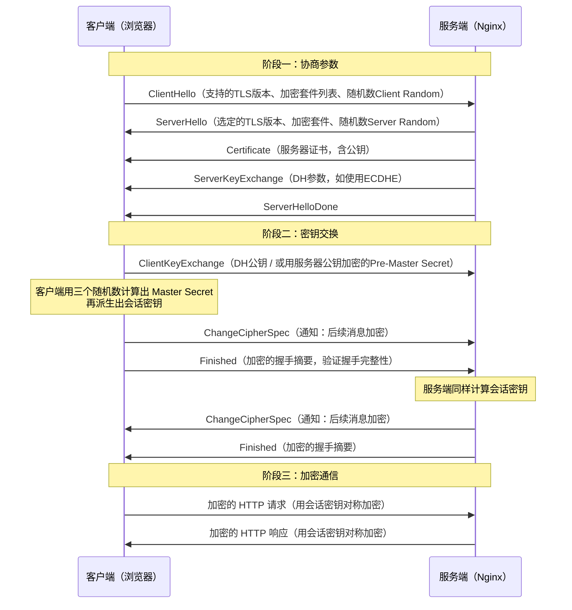
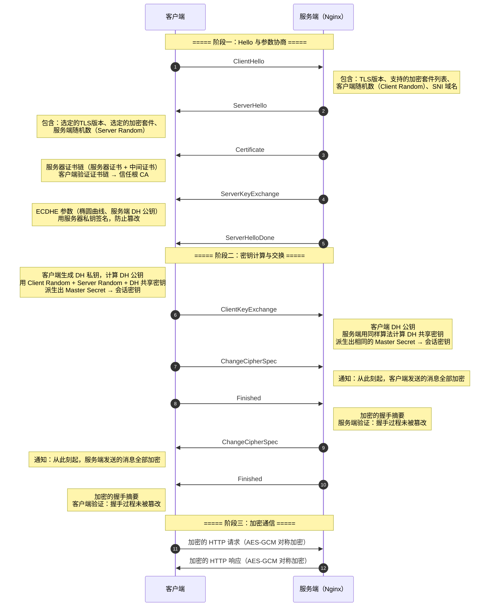
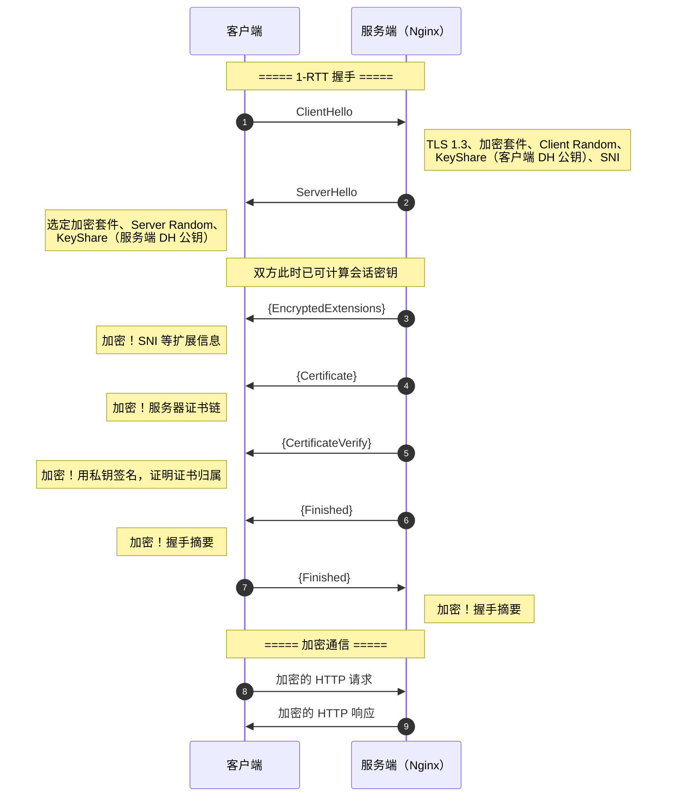
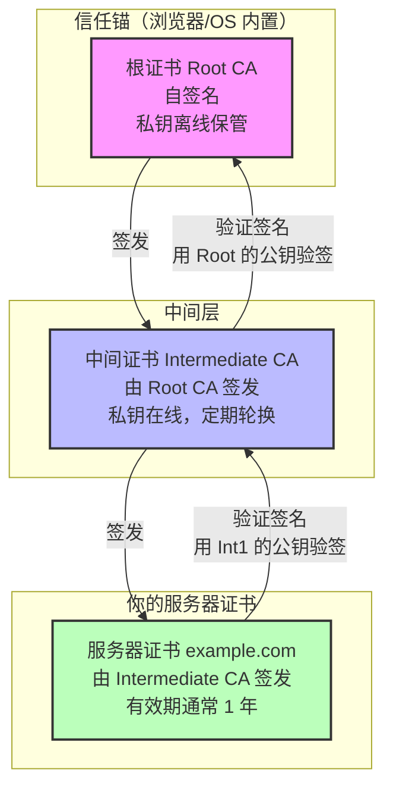
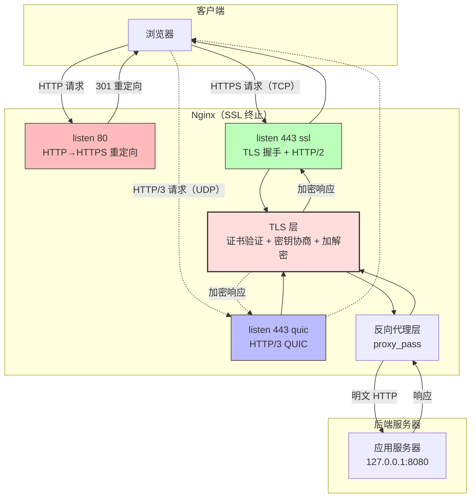

# 14 - HTTPS 与 TLS 配置

> 版本基线：Nginx 1.30.4 (stable) | 创建日期：2026-08-05
> 受众：后端开发熟手（熟悉 Python/Java/Lua），但服务器运维是小白。本文从"为什么要 HTTPS"讲起，一步步把 TLS 握手、证书链、安全配置、HTTP/2、HTTP/3 全部讲透。

---

## 目录

- [1. 学习目标](#1-学习目标)
- [2. 核心知识点](#2-核心知识点)
  - [2.1 知识点一：HTTPS 与 TLS 基础](#21-知识点一https-与-tls-基础)
  - [2.2 知识点二：基本 HTTPS 配置](#22-知识点二基本-https-配置)
  - [2.3 知识点三：TLS 协议版本与加密套件](#23-知识点三tls-协议版本与加密套件)
  - [2.4 知识点四：会话复用](#24-知识点四会话复用)
  - [2.5 知识点五：OCSP Stapling](#25-知识点五ocsp-stapling)
  - [2.6 知识点六：HSTS](#26-知识点六hsts)
  - [2.7 知识点七：HTTP/2 配置](#27-知识点七http2-配置)
  - [2.8 知识点八：HTTP/3（QUIC）](#28-知识点八http3quic)
  - [2.9 知识点九：HTTP 到 HTTPS 的重定向](#29-知识点九http-到-https-的重定向)
  - [2.10 知识点十：混合内容处理](#210-知识点十混合内容处理)
  - [2.11 知识点十一：证书自动续期](#211-知识点十一证书自动续期lets-encrypt--certbot)
  - [2.12 知识点十二：SNI](#212-知识点十二sniserver-name-indication)
- [3. Mermaid 图](#3-mermaid-图)
- [4. 最佳实践](#4-最佳实践)
- [5. 常见踩坑引用](#5-常见踩坑引用)
- [6. 小结](#6-小结)

---

## 1. 学习目标

学完本篇，你应当能够：

- 理解 **HTTPS = HTTP over TLS** 的本质，说清楚 TLS 握手过程中对称加密与非对称加密如何配合，以及证书链（根证书 → 中间证书 → 服务器证书）的验证逻辑。
- 独立写出 Nginx 的**最小可用 HTTPS 配置**，正确配置 `ssl_certificate` / `ssl_certificate_key`，并知道为什么必须提供完整的证书链。
- 掌握 `ssl_protocols`、`ssl_ciphers`、`ssl_prefer_server_ciphers` 等安全参数的推荐配置，理解 TLS 1.2 与 TLS 1.3 的差异（1-RTT 握手、0-RTT、强制前向安全）。
- 理解**会话复用**（Session Cache、Session Tickets）的原理与配置方法，知道它如何减少握手开销。
- 配置 **OCSP Stapling**，理解为什么需要它以及 `resolver` 的作用。
- 正确启用 **HSTS**，理解 `includeSubDomains` / `preload` 的含义与风险。
- 在 Nginx 1.25.1+ 上用 `http2 on;` 启用 HTTP/2，在 Nginx 1.25.0+ 上配置 HTTP/3（QUIC）并理解 `Alt-Svc` 头的作用。
- 用 `return 301` 实现 HTTP 到 HTTPS 的重定向，理解为什么推荐 `return` 而非 `rewrite`。
- 使用 **certbot + Let's Encrypt** 实现证书的自动签发与续期。
- 理解 **SNI** 的作用，在一个 IP 上配置多个 HTTPS 站点。
- 避开踩坑 `#4.1`～`#4.6`。

> **前置知识**：建议先完成 [04-配置文件结构与指令体系](../02-配置基础/04-配置文件结构与指令体系.md) 和 [08-虚拟主机](../03-核心机制/08-虚拟主机.md)，了解 server 块与虚拟主机的基本概念。

---

## 2. 核心知识点

### 2.1 知识点一：HTTPS 与 TLS 基础

#### 什么是 HTTPS

HTTPS = HTTP over TLS/SSL。简单说，就是 HTTP 协议的明文数据在传输之前，先经过 TLS（Transport Layer Security，传输层安全）协议的加密，接收方再解密。这样即使中间人截获了数据包，看到的也只是一堆密文。

```
HTTP 请求/响应（明文）
        ↓ TLS 加密
密文在网络中传输
        ↓ TLS 解密
HTTP 请求/响应（明文）
```

> **SSL vs TLS**：SSL（Secure Sockets Layer）是 Netscape 在 1990 年代设计的协议，经历了 SSL 1.0/2.0/3.0。后来 IETF 接管标准化，改名为 TLS，经历了 TLS 1.0/1.1/1.2/1.3。现在说的"SSL 证书"其实就是 TLS 证书，只是习惯叫法没改过来。SSL 3.0 及以下已经全部不安全，必须禁用。

#### 对称加密 vs 非对称加密

TLS 同时使用了两种加密方式，各取所长：

| 对比维度 | 对称加密 | 非对称加密 |
|---------|---------|-----------|
| 密钥数量 | 1 把（双方共用同一把） | 2 把（公钥 + 私钥，成对出现） |
| 加解密速度 | 快（适合大数据量） | 慢（比对称慢 100~1000 倍） |
| 安全性 | 密钥传输是难点 | 公钥可公开，私钥不传输 |
| 典型算法 | AES、ChaCha20 | RSA、ECC、DH |
| TLS 中的用途 | 加密实际业务数据 | 握手阶段交换对称密钥 |

**为什么不能只用非对称加密？** 因为太慢了。如果用 RSA 加密整个 HTTP 响应，一个几 MB 的页面可能要算好几秒。

**为什么不能只用对称加密？** 因为双方需要先安全地约定一把共享密钥。如果在网络上直接明文发送密钥，中间人就能截获。

**TLS 的解法**：握手阶段用非对称加密安全地交换一把对称密钥（称为"会话密钥"），之后的业务数据全部用这把对称密钥加密。这样既保证了密钥交换的安全性，又保证了数据传输的高效性。

#### TLS 握手过程简述

以 TLS 1.2 的一次完整握手为例（TLS 1.3 在后面知识点三中详述）：



握手过程的核心目的有两个：

1. **身份验证**：客户端通过证书验证服务端的身份（防止中间人冒充）。
2. **密钥协商**：双方安全地交换/生成一把对称的会话密钥，用于后续数据加密。

> **特例说明**：TLS 1.2 的传统 RSA 握手中，客户端生成 Pre-Master Secret，用服务器公钥加密后发给服务端。这种方式不具备**前向安全**（Forward Secrecy）——如果服务端私钥日后泄露，之前录制的所有流量都可以被解密。因此现代配置强制使用 ECDHE（椭圆曲线 Diffie-Hellman 临时密钥交换），每次握手生成独立的临时密钥，私钥泄露不影响历史流量。

#### 证书的作用

TLS 证书（X.509 证书）有两个核心作用：

1. **验证服务器身份**：证书由受信任的 CA（Certificate Authority，证书颁发机构）签发，证明"这个公钥确实属于 example.com"。浏览器内置了操作系统/浏览器信任的根 CA 列表，如果证书不在信任链上，浏览器会报错。
2. **交换对称密钥的载体**：证书中包含服务器的公钥，客户端用这个公钥加密信息（或验证 DH 参数的签名），确保只有持有私钥的服务器才能解密。

#### 证书链

浏览器验证服务器证书时，不是直接验证单张证书，而是验证一条**信任链**：

```
根证书（Root CA）
  │  自签名，预装在操作系统/浏览器中
  │  ↓ 签发
中间证书（Intermediate CA）
  │  由根 CA 签发，用于隔离风险（根证书离线保管）
  │  ↓ 签发
服务器证书（Server Certificate）
     你的域名证书，由中间 CA 签发
```

验证过程是从服务器证书开始，逐级向上验证签名，直到遇到浏览器信任的根证书。如果链中任何一环缺失，验证就会失败。

> **特例说明**：有些 CA 只有一级结构（根 CA 直接签发服务器证书），没有中间证书。但主流 CA（Let's Encrypt、DigiCert 等）都使用两级或三级结构。配置时必须把中间证书和服务器证书一起提供给 Nginx，否则部分客户端会验证失败（详见踩坑 #4.1）。

---

### 2.2 知识点二：基本 HTTPS 配置

#### 核心指令

| 指令 | 作用 | 上下文 |
|------|------|--------|
| `listen 443 ssl;` | 监听 443 端口并启用 SSL/TLS | server |
| `ssl_certificate` | 指向证书文件（含服务器证书 + 中间证书） | http, server |
| `ssl_certificate_key` | 指向私钥文件 | http, server |
| `ssl_protocols` | 允许的 TLS 协议版本 | http, server |
| `ssl_ciphers` | 允许的加密套件 | http, server |

> **版本提示**：自 Nginx 1.15.0 起，`listen 443 ssl;` 中的 `ssl` 参数是必需的（用于区分 HTTP 和 HTTPS 监听）。在更早版本中也可以用 `listen 443; ssl on;` 的写法，但 `ssl on` 指令已在 1.15.0 中废弃。

#### 最小可用配置示例

```nginx
server {
    listen 443 ssl;                          # 监听 443 端口，启用 TLS
    server_name example.com;                 # 绑定域名

    ssl_certificate     /etc/nginx/ssl/fullchain.crt;  # 证书文件（服务器证书 + 中间证书）
    ssl_certificate_key /etc/nginx/ssl/server.key;     # 私钥文件

    ssl_protocols TLSv1.2 TLSv1.3;           # 只允许 TLS 1.2 和 1.3

    location / {
        proxy_pass http://127.0.0.1:8080;    # 业务请求转发给后端
    }
}
```

逐行说明：

- `listen 443 ssl;` —— 443 是 HTTPS 的标准端口。`ssl` 参数告诉 Nginx 这个端口的连接需要做 TLS 握手。如果不加 `ssl`，Nginx 会把 443 当作普通 HTTP 端口处理。
- `server_name example.com;` —— 匹配请求的 Host 头。HTTPS 场景下，这还与 SNI（Server Name Indication）有关，详见知识点十二。
- `ssl_certificate` —— 指向合并后的证书链文件。文件内容必须是"服务器证书在前，中间证书在后"的顺序。如果只放服务器证书，浏览器可能报证书链不完整（详见踩坑 #4.1）。
- `ssl_certificate_key` —— 指向服务器私钥文件。私钥必须与证书中的公钥配对，且权限应设为 `600`（只有 owner 可读）。
- `ssl_protocols TLSv1.2 TLSv1.3;` —— 明确禁用 TLS 1.0/1.1 和 SSL 3.0，这些旧版本存在已知安全漏洞（POODLE、BEAST 等）。
- `location /` —— 正常的业务代理配置，TLS 握手完成后，Nginx 拿到的是解密后的明文 HTTP 请求，代理逻辑与 HTTP 完全一致。

#### 证书文件准备

```bash
# 从 CA 获取的文件通常有三个：
# cert.pem      — 服务器证书
# chain.pem     — 中间证书链
# fullchain.pem — 服务器证书 + 中间证书（已合并）
# privkey.pem   — 私钥

# 如果 CA 只给了分离的文件，需要手动合并
# 注意：服务器证书必须在前面
cat cert.pem chain.pem > fullchain.crt

# 验证证书与私钥是否匹配
# 两个命令的输出应该一致
openssl x509 -noout -modulus -in fullchain.crt | openssl md5
openssl rsa  -noout -modulus -in server.key   | openssl md5

# 验证证书链是否完整
openssl s_client -connect example.com:443 -servername example.com
# 如果输出 "Verify return code: 0 (ok)" 表示证书链完整
```

> **引用踩坑 #4.1**：如果 `ssl_certificate` 只配了服务器证书而漏了中间证书，桌面 Chrome 可能正常（因为它会自动补全或缓存中间证书），但 Android、旧版 Java、curl 等客户端会报 `CERT_AUTHORITY_INVALID`。永远使用 `fullchain.crt` 而非单独的 `cert.pem`。

---

### 2.3 知识点三：TLS 协议版本与加密套件

#### ssl_protocols

```nginx
ssl_protocols TLSv1.2 TLSv1.3;
```

- `TLSv1.2` —— 目前兼容性最好的安全版本，几乎所有现代浏览器都支持。
- `TLSv1.3` —— 2018 年发布的最新版本，安全性更高、握手更快。

已禁用的版本及原因：

| 协议版本 | 状态 | 禁用原因 |
|---------|------|---------|
| SSL 2.0 | 2011 年废弃 | 存在严重安全缺陷 |
| SSL 3.0 | 2015 年废弃 | POODLE 攻击 |
| TLS 1.0 | 2020 年废弃 | BEAST 攻击，弱加密算法 |
| TLS 1.1 | 2020 年废弃 | 缺乏 AEAD 加密支持 |

> **特例说明**：如果你的服务需要兼容非常老的客户端（如 Windows XP 上的 IE6），可能不得不开放 TLS 1.0。但这种情况应尽量通过升级客户端来解决，而不是降低安全标准。

#### ssl_ciphers

```nginx
ssl_ciphers ECDHE-ECDSA-AES128-GCM-SHA256:ECDHE-RSA-AES128-GCM-SHA256:ECDHE-ECDSA-AES256-GCM-SHA384:ECDHE-RSA-AES256-GCM-SHA384:ECDHE-ECDSA-CHACHA20-POLY1305:ECDHE-RSA-CHACHA20-POLY1305;
```

加密套件的命名格式为 `密钥交换-认证-加密-哈希`，以 `ECDHE-RSA-AES128-GCM-SHA256` 为例：

| 部分 | 值 | 含义 |
|------|-----|------|
| 密钥交换 | ECDHE | 椭圆曲线 Diffie-Hellman 临时密钥（提供前向安全） |
| 认证 | RSA | 用 RSA 证书认证服务端身份 |
| 加密 | AES128-GCM | AES-128 计数器模式 + Galois/Counter Mode（AEAD 加密） |
| 哈希 | SHA256 | 用于 PRF（伪随机函数） |

选择加密套件的原则：

1. **密钥交换必须用 ECDHE**（前向安全），不用纯 RSA 密钥交换。
2. **加密算法用 AEAD**（AES-GCM 或 ChaCha20-Poly1305），不用 CBC 模式（有 Lucky13 等攻击）。
3. **优先用 ECDSA** 证书（比 RSA 更快），但需要 CA 支持。

> **注意**：`ssl_ciphers` 只影响 TLS 1.2 及以下。TLS 1.3 的加密套件由 `ssl_conf_command Ciphersuites` 控制，且默认就是安全的，无需额外配置。

#### ssl_prefer_server_ciphers

```nginx
ssl_prefer_server_ciphers off;
```

- `on` —— 服务端决定使用哪个加密套件（从 `ssl_ciphers` 列表中按服务端优先级选择）。
- `off` —— 客户端决定使用哪个加密套件（从客户端支持的列表中选择）。

> **版本提示**：在 TLS 1.2 时代，推荐设为 `on`，因为服务端的配置通常更安全。但在 TLS 1.3 中，加密套件协商机制变了，客户端的偏好通常更优。自 Nginx 1.21.1 起，默认值已改为 `off`。如果你的配置主要面向 TLS 1.3，保持 `off` 即可。

#### TLS 1.3 的改进

TLS 1.3 相比 1.2 有三大改进：

**1. 1-RTT 握手（减少一个往返）**

TLS 1.2 需要 2-RTT 才能完成握手并开始发送数据。TLS 1.3 只需要 1-RTT：

```
TLS 1.2: ClientHello → ServerHello+Certificate+... → ClientKeyExchange+Finished → (可以发数据)
         |<-------------- 2 RTT -------------->|

TLS 1.3: ClientHello(+KeyShare) → ServerHello+EncryptedExtensions+Finished → (可以发数据)
         |<-------- 1 RTT -------->|
```

**2. 0-RTT 恢复（会话复用时的零往返）**

如果客户端之前连接过该服务器并缓存了会话，TLS 1.3 允许在第一个数据包中就携带应用数据（0-RTT），无需等待握手完成。这对于延迟敏感的场景（如移动端 API）非常有用。

> **特例说明**：0-RTT 数据存在**重放攻击**风险——攻击者可以截获 0-RTT 数据包并重新发送。因此 0-RTT 只应用于幂等请求（GET），不应用于有副作用的操作（POST/PUT/DELETE）。Nginx 默认不启用 0-RTT（`ssl_early_data off;`）。

**3. 强制前向安全**

TLS 1.3 移除了 RSA 密钥交换和静态 DH，只保留（EC）DHE 临时密钥交换。这意味着每次握手都生成新的临时密钥，私钥泄露不影响历史流量——前向安全成为强制特性。

#### 推荐的安全配置示例

```nginx
server {
    listen 443 ssl;
    http2 on;                                          # 启用 HTTP/2（详见知识点七）
    server_name example.com;

    # --- 证书 ---
    ssl_certificate     /etc/nginx/ssl/fullchain.crt;
    ssl_certificate_key /etc/nginx/ssl/server.key;

    # --- TLS 协议版本 ---
    ssl_protocols TLSv1.2 TLSv1.3;                     # 仅允许 1.2 和 1.3

    # --- 加密套件（针对 TLS 1.2） ---
    ssl_ciphers ECDHE-ECDSA-AES128-GCM-SHA256:ECDHE-RSA-AES128-GCM-SHA256:ECDHE-ECDSA-AES256-GCM-SHA384:ECDHE-RSA-AES256-GCM-SHA384:ECDHE-ECDSA-CHACHA20-POLY1305:ECDHE-RSA-CHACHA20-POLY1305;
    ssl_prefer_server_ciphers off;                     # TLS 1.3 时代建议 off

    # --- 会话复用（详见知识点四） ---
    ssl_session_cache shared:SSL:10m;
    ssl_session_timeout 1d;
    ssl_session_tickets off;                           # 出于安全考虑关闭 tickets

    # --- 安全头 ---
    add_header Strict-Transport-Security "max-age=31536000; includeSubDomains" always;

    location / {
        proxy_pass http://127.0.0.1:8080;
    }
}
```

> **引用踩坑 #4.5**：如果仍启用 TLS 1.0/1.1 或使用 CBC 模式的加密套件，SSL Labs 评分会降到 B 或更低。生产环境必须只允许 TLS 1.2+ 和 AEAD 加密套件。

---

### 2.4 知识点四：会话复用

TLS 握手是一个计算密集型操作（尤其是非对称加密部分）。如果每次连接都完整握手，服务端 CPU 开销很大，用户也会感受到延迟。会话复用（Session Resumption）让"曾经握手过的客户端"在后续连接中跳过部分握手步骤。

#### ssl_session_cache（会话缓存）

```nginx
ssl_session_cache shared:SSL:10m;
```

- `shared:SSL:10m` —— 在所有 worker 进程间共享一块 10MB 的缓存区，名称为 `SSL`。
- 1MB 大约可以存储 4000 个会话，10MB 约支持 4 万个并发会话。
- `shared` 关键字确保所有 worker 都能访问同一份缓存（默认是每个 worker 独立的，不共享）。

> **特例说明**：不用 `shared` 时（如 `ssl_session_cache builtin:10m;`），每个 worker 维护自己的缓存，同一客户端的第二次请求如果落到不同 worker 上就无法复用会话，效率低。生产环境必须用 `shared`。

#### ssl_session_timeout（缓存超时）

```nginx
ssl_session_timeout 1d;
```

- 会话在缓存中的存活时间。超过这个时间后，客户端需要重新完整握手。
- 默认 5 分钟，偏短。生产环境通常设为 `1h`～`1d`。
- 设过长会增加安全风险（会话密钥被窃取后可长时间复用）。

#### ssl_session_tickets（会话票据）

```nginx
ssl_session_tickets off;
```

会话票据（Session Tickets，RFC 5077）是另一种会话复用机制。服务端用票据加密密钥（STEK）将会话信息加密后发给客户端，客户端在后续连接中出示票据，服务端解密后恢复会话。

| 对比 | Session Cache | Session Tickets |
|------|--------------|-----------------|
| 存储位置 | 服务端内存 | 客户端（加密票据） |
| 服务端开销 | 占内存 | 不占内存 |
| 多机部署 | 需共享缓存或粘性路由 | 只需共享 STEK |
| 安全性 | 会话在服务端，较安全 | STEK 泄露则全部会话可解密 |
| TLS 1.3 | 不使用 | 使用（改名为 PSK） |

> **特例说明**：出于安全考虑，建议关闭 Session Tickets（`off`）。因为 Nginx 默认的 STEK 生命周期管理和轮换机制不够安全，且多台 Nginx 的 STEK 需要手动同步。如果必须用 Tickets（如多机部署且无法共享 Session Cache），需要配置 `ssl_session_ticket_key` 并定期轮换密钥。

#### 配置示例

```nginx
server {
    listen 443 ssl;
    server_name example.com;

    ssl_certificate     /etc/nginx/ssl/fullchain.crt;
    ssl_certificate_key /etc/nginx/ssl/server.key;
    ssl_protocols       TLSv1.2 TLSv1.3;

    # --- 会话复用配置 ---
    ssl_session_cache    shared:SSL:10m;    # 共享缓存 10MB（约 4 万会话）
    ssl_session_timeout  1d;                # 会话缓存 1 天
    ssl_session_tickets  off;               # 关闭票据，使用 Cache 模式

    location / {
        proxy_pass http://127.0.0.1:8080;
    }
}
```

---

### 2.5 知识点五：OCSP Stapling

#### OCSP 是什么

OCSP（Online Certificate Status Protocol，在线证书状态协议）是用来检查证书是否被吊销的协议。浏览器在建立 TLS 连接时，可以向 CA 的 OCSP 服务器查询当前证书是否仍然有效（未被吊销）。

#### 为什么需要 Stapling

传统 OCSP 查询有几个问题：

1. **延迟**：浏览器在握手完成后还要额外发一个 HTTP 请求到 CA 的 OCSP 服务器查询状态，增加了页面加载延迟。
2. **隐私泄露**：CA 的 OCSP 服务器知道哪些用户在访问哪些网站。
3. **可用性**：如果 OCSP 服务器宕机或被墙，浏览器要么等待超时（慢），要么跳过检查（不安全）。

**OCSP Stapling**（OCSP 装订）的解决思路是：Nginx 主动定期去 CA 的 OCSP 服务器查询证书状态，拿到一个带签名的 OCSP 响应，在 TLS 握手时直接"装订"发给浏览器。浏览器不需要自己去查。

#### 配置指令

```nginx
ssl_stapling on;                                        # 启用 OCSP Stapling
ssl_stapling_verify on;                                 # 启用 OCSP 响应验证
ssl_trusted_certificate /etc/nginx/ssl/chain.crt;      # 信任链（含中间证书，用于验证 OCSP 签名）
resolver 8.8.8.8 8.8.4.4 valid=300s;                   # DNS 解析器（OCSP 服务器需要域名解析）
resolver_timeout 5s;                                    # DNS 解析超时
```

逐行说明：

- `ssl_stapling on;` —— 开启 OCSP Stapling。Nginx 会在后台主动获取 OCSP 响应并缓存。
- `ssl_stapling_verify on;` —— 验证 OCSP 响应的签名，确保响应确实来自合法 CA。
- `ssl_trusted_certificate` —— 指向包含中间证书（和根证书）的文件，用于验证 OCSP 响应签名。这个文件与 `ssl_certificate` 可以是同一个 `fullchain.crt`。
- `resolver` —— **关键配置**。Nginx 获取 OCSP 响应需要解析 CA 的 OCSP 服务器域名，这需要 DNS 解析。如果不配 `resolver`，OCSP Stapling 无法工作。
- `resolver_timeout 5s;` —— DNS 解析超时，超时后 Nginx 会在下一次请求时重试。

> **引用踩坑 #4.4**：很多开发者配了 `ssl_stapling on;` 却忘了配 `resolver`，导致 OCSP Stapling 静默失效。可以用 `openssl s_client -connect example.com:443 -status` 检查，如果输出 `OCSP Response Status: successful` 则表示正常。

#### 完整配置示例

```nginx
http {
    resolver 8.8.8.8 8.8.4.4 valid=300s ipv6=off;      # 全局 DNS 解析器
    resolver_timeout 5s;

    server {
        listen 443 ssl;
        http2 on;
        server_name example.com;

        ssl_certificate     /etc/nginx/ssl/fullchain.crt;
        ssl_certificate_key /etc/nginx/ssl/server.key;
        ssl_protocols       TLSv1.2 TLSv1.3;

        # OCSP Stapling
        ssl_stapling            on;
        ssl_stapling_verify     on;
        ssl_trusted_certificate /etc/nginx/ssl/fullchain.crt;

        location / {
            proxy_pass http://127.0.0.1:8080;
        }
    }
}
```

```bash
# 验证 OCSP Stapling 是否生效
openssl s_client -connect example.com:443 -servername example.com -status

# 正常输出应包含：
# OCSP Response Status: successful (0x0)
# Response verify OK

# 如果输出 "no OCSP response received" 说明 Stapling 未生效
# 常见原因：刚启动还没拿到 OCSP 响应（等几分钟）、缺 resolver、证书不含 OCSP URL
```

> **特例说明**：Let's Encrypt 证书的 OCSP 响应获取可能需要几秒到几十秒。Nginx 启动后不会立即有 OCSP 响应，需要等后台线程去获取。可以用 `nginx -V 2>&1 | grep ssl_stapling` 确认编译时是否包含了相关模块（默认都包含）。

---

### 2.6 知识点六：HSTS（HTTP Strict Transport Security）

#### HSTS 的作用

HSTS 是一个 HTTP 响应头，告诉浏览器："这个域名以后都只通过 HTTPS 访问，即使用户输入了 http:// 也自动跳转到 https://"。

没有 HSTS 时，存在**降级攻击**风险：

1. 用户输入 `http://example.com`（不是 https）。
2. 中间人截获这个 HTTP 请求，假装是服务器返回响应。
3. 用户在不知情的情况下与中间人通信，数据被窃听。

有了 HSTS 后，浏览器记住"example.com 必须用 HTTPS"，即使输入 `http://` 也会在浏览器内部直接跳转到 `https://`，不给中间人可乘之机。

#### 配置指令

```nginx
add_header Strict-Transport-Security "max-age=31536000; includeSubDomains; preload" always;
```

参数说明：

| 参数 | 含义 |
|------|------|
| `max-age=31536000` | HSTS 策略有效期为 31536000 秒（1 年）。浏览器在此期间强制使用 HTTPS |
| `includeSubDomains` | 策略覆盖所有子域名（如 `api.example.com`、`blog.example.com`） |
| `preload` | 声明该站点愿意被加入浏览器的 HSTS 预加载列表 |
| `always` | 确保在所有响应（包括 4xx/5xx 错误页）中都下发此头 |

#### includeSubDomains / preload 的含义

- **includeSubDomains** —— 如果设了此参数，所有子域名也被强制 HTTPS。**前提是所有子域名都已支持 HTTPS**，否则那些 HTTP-only 的子域名会无法访问。

- **preload** —— 浏览器的 HSTS 策略是在**首次访问**后生效的。也就是说，用户的第一次访问仍然走 HTTP，可能被中间人攻击。为了解决这个问题，主流浏览器维护了一个"HSTS 预加载列表"（内置于浏览器中），在这个列表中的域名即使首次访问也会强制 HTTPS。设了 `preload` 参数后，可以去 [hstspreload.org](https://hstspreload.org/) 提交你的域名加入此列表。

#### 启用前提

> **引用踩坑 #4.2**：启用 HSTS 前**必须确认全站已完全迁移到 HTTPS**。如果还有页面或子域名是 HTTP 的，启用 HSTS（尤其是 `includeSubDomains`）会导致这些页面无法访问，而且 HSTS 策略在浏览器端无法轻易撤销（要等 `max-age` 过期）。建议先用短 `max-age`（如 `max-age=300`，5 分钟）测试，确认无误后再改长。

#### 配置示例

```nginx
server {
    listen 443 ssl;
    http2 on;
    server_name example.com;

    ssl_certificate     /etc/nginx/ssl/fullchain.crt;
    ssl_certificate_key /etc/nginx/ssl/server.key;

    # 第一阶段：先用短 max-age 测试（部署后观察 1-2 天）
    # add_header Strict-Transport-Security "max-age=300" always;

    # 第二阶段：确认无误后，启用完整 HSTS
    add_header Strict-Transport-Security "max-age=31536000; includeSubDomains; preload" always;

    location / {
        proxy_pass http://127.0.0.1:8080;
    }
}

# HTTP 端口的重定向也要配（详见知识点九）
server {
    listen 80;
    server_name example.com;
    return 301 https://$host$request_uri;
}
```

> **特例说明**：`add_header` 在 Nginx 中的继承规则比较特殊——如果当前 `location` 块中定义了任何 `add_header`，则不会继承上层 `server` 块的 `add_header`。因此如果你在某个 `location` 里加了别的 `add_header`，需要把 HSTS 头也重新写一遍，或者使用 `include` 指令引入公共头配置。

---

### 2.7 知识点七：HTTP/2 配置

#### 版本提示

> **重要**：自 Nginx 1.25.1 起，HTTP/2 的启用方式发生了变化。旧写法 `listen 443 ssl http2;` 中的 `http2` 参数被弃用，改为独立指令 `http2 on;`。

```nginx
# Nginx 1.25.1+ 新写法（推荐）
server {
    listen 443 ssl;
    http2 on;               # 独立指令，清晰明了
}

# Nginx 1.25.0 及以下旧写法（已弃用，新版会告警）
# server {
#     listen 443 ssl http2;  # http2 参数已弃用
# }
```

> **引用踩坑 #4.6**：在 Nginx 1.25.1+ 上仍使用 `listen 443 ssl http2;` 会在错误日志中产生告警：`the "listen ... http2" directive is deprecated, use the "http2" directive instead`。虽然暂时还能工作，但应尽早迁移到新写法。

#### HTTP/2 的优势

HTTP/2 是 HTTP 协议的第二个主要版本，相比 HTTP/1.1 有三大核心改进：

| 特性 | HTTP/1.1 | HTTP/2 |
|------|----------|--------|
| 多路复用 | 不支持（一个连接一个请求） | 支持（一个连接并发多个请求） |
| 头部压缩 | 无（每次重复发送完整头） | HPACK 压缩 |
| 服务端推送 | 不支持 | 支持（Server Push） |
| 传输格式 | 纯文本 | 二进制分帧 |
| 加密要求 | 可选 | Nginx 中要求 TLS（h2 over TLS） |

**1. 多路复用（Multiplexing）**

HTTP/1.1 中，浏览器为了并行加载资源，需要为每个资源建立一个 TCP 连接（通常限制 6 个并发连接）。HTTP/2 在一个 TCP 连接上可以同时发送多个请求和响应，互不阻塞。

**2. 头部压缩（HPACK）**

HTTP/1.1 的请求头是纯文本，每次请求都重复发送大量相同的头（如 Cookie、User-Agent）。HTTP/2 使用 HPACK 算法压缩头部，双方维护一张静态表和动态表，重复的头只传索引号。

**3. 服务端推送（Server Push）**

服务端可以在客户端请求 HTML 时，主动把 CSS/JS 等资源一并推送过去，减少客户端的往返请求。不过 Chrome 已于 2022 年移除了对 HTTP/2 Server Push 的支持，实际用途有限。

#### 配置示例

```nginx
server {
    listen 443 ssl;
    http2 on;                                           # 启用 HTTP/2（1.25.1+ 新写法）
    server_name example.com;

    ssl_certificate     /etc/nginx/ssl/fullchain.crt;
    ssl_certificate_key /etc/nginx/ssl/server.key;
    ssl_protocols       TLSv1.2 TLSv1.3;

    # HTTP/2 的 keepalive 连接超时
    keepalive_timeout   65s;                            # 复用 TCP 连接，减少握手开销

    location / {
        proxy_pass http://127.0.0.1:8080;
    }
}
```

```bash
# 验证是否启用了 HTTP/2
curl -I --http2 https://example.com

# 正常输出应包含：
# HTTP/2 200

# 或用 openssl 查看 ALPN 协商结果
echo | openssl s_client -connect example.com:443 -alpn h2 2>/dev/null | grep ALPN
# 正常输出：ALPN protocol: h2
```

> **特例说明**：HTTP/2 要求 TLS，且需要 ALPN（Application-Layer Protocol Negotiation）支持。Nginx 编译时需要链接支持 ALPN 的 OpenSSL（1.0.2+）。如果 OpenSSL 版本太低，`http2 on;` 会报错。可以用 `nginx -V 2>&1 | grep openssl` 查看编译时使用的 OpenSSL 版本。

---

### 2.8 知识点八：HTTP/3（QUIC）

#### HTTP/3 基于 QUIC（UDP）

HTTP/3 不再使用 TCP 作为传输层，而是基于 QUIC（Quick UDP Internet Connections）协议，QUIC 运行在 UDP 之上。这是一个根本性的变化：

| 对比 | HTTP/2 | HTTP/3 |
|------|--------|--------|
| 传输层 | TCP | QUIC（基于 UDP） |
| 队头阻塞 | TCP 层有（一个包丢失阻塞整个连接） | 无（每个流独立） |
| 连接建立 | TCP 握手 + TLS 握手（2-3 RTT） | QUIC 合并握手（1 RTT） |
| 连接迁移 | 不支持（IP 变化需重建连接） | 支持（用 Connection ID 标识连接） |

#### Nginx 1.25.0+ 支持 QUIC/HTTP3

自 Nginx 1.25.0 起，官方正式支持 HTTP/3（QUIC）。配置方式如下：

```nginx
server {
    listen 443 ssl;                # TCP 上的 HTTPS + HTTP/2
    listen 443 quic reuseport;     # UDP 上的 QUIC + HTTP/3
    http2 on;                      # TCP 侧启用 HTTP/2
    http3 on;                      # 启用 HTTP/3（1.25.0+）
    server_name example.com;

    ssl_certificate     /etc/nginx/ssl/fullchain.crt;
    ssl_certificate_key /etc/nginx/ssl/server.key;
    ssl_protocols       TLSv1.2 TLSv1.3;

    # Alt-Svc 头：告诉浏览器可以用 HTTP/3 连接
    add_header Alt-Svc 'h3=":443"; ma=86400' always;

    location / {
        proxy_pass http://127.0.0.1:8080;
    }
}
```

逐行说明：

- `listen 443 ssl;` —— 监听 TCP 443 端口，提供 HTTPS（HTTP/1.1 和 HTTP/2）。
- `listen 443 quic reuseport;` —— 监听 UDP 443 端口，提供 HTTP/3。`reuseport` 让多个 worker 进程共享同一个 UDP 套接字，避免惊群问题。
- `http2 on;` —— TCP 侧启用 HTTP/2。
- `http3 on;` —— 启用 HTTP/3 支持（1.25.0+ 新指令）。
- `add_header Alt-Svc 'h3=":443"; ma=86400' always;` —— **关键头**。Alt-Svc（Alternative Services）告诉浏览器："这个服务还支持 HTTP/3，端口 443，有效期 86400 秒（1 天）"。浏览器收到后会异步尝试用 HTTP/3 重新连接，如果成功则后续请求走 HTTP/3。

#### Alt-Svc 头的作用

浏览器第一次访问时走的是 TCP（HTTP/2），因为 UDP 的 HTTP/3 还没被浏览器发现。服务端通过 `Alt-Svc` 头告诉浏览器"我支持 HTTP/3"，浏览器在后台尝试用 QUIC 建立连接，成功后后续请求自动升级到 HTTP/3。这个过程对用户完全透明。

```
第一次请求：浏览器 → TCP 443 → HTTP/2 响应 + Alt-Svc 头
浏览器发现 Alt-Svc，后台尝试 QUIC 连接
后续请求：浏览器 → UDP 443 → HTTP/3
```

#### quic_* 参数调优

```nginx
server {
    listen 443 ssl;
    listen 443 quic reuseport;
    http2 on;
    http3 on;
    server_name example.com;

    ssl_certificate     /etc/nginx/ssl/fullchain.crt;
    ssl_certificate_key /etc/nginx/ssl/server.key;
    ssl_protocols       TLSv1.3;                   # HTTP/3 强制要求 TLS 1.3

    # QUIC 参数调优
    quic_retry on;                                 # 启用重试，防止地址欺骗攻击
    quic_gso on;                                   # 启用 Generic Segmentation Offload（提升发送性能）
    quic_host_key /etc/nginx/ssl/quic_host.key;    # 重试令牌的加密密钥

    add_header Alt-Svc 'h3=":443"; ma=86400' always;

    location / {
        proxy_pass http://127.0.0.1:8080;
    }
}
```

参数说明：

- `quic_retry on;` —— 启用 QUIC Retry 机制。服务端在握手时先发一个 Retry 包，要求客户端再次发起连接。这可以防止 IP 欺骗放大攻击。
- `quic_gso on;` —— 启用 UDP Generic Segmentation Offload，让网卡硬件批量发送多个 UDP 包，减少系统调用开销。需要网卡和内核支持。
- `quic_host_key` —— 用于加密 Retry 令牌的密钥文件。多台 Nginx 需要共享同一把密钥，否则连接迁移会失败。

#### 版本提示与依赖

> **重要依赖**：HTTP/3 需要支持 QUIC 的 TLS 库。Nginx 1.25.0+ 要求 OpenSSL 3.x+ 或使用 quictls/openssl（一个 OpenSSL 的 QUIC 补丁分支）。标准的 OpenSSL 3.0 尚不完整支持 QUIC API，因此实际编译时通常需要：
> - OpenSSL 3.2.0+（原生 QUIC 支持）
> - 或 quictls/openssl 3.x（OpenSSL 1.1.1 的 QUIC 补丁版）
> - 或 BoringSSL（Google 的 OpenSSL 分支）

```bash
# 检查 Nginx 是否编译了 QUIC 支持
nginx -V 2>&1 | grep -i quic

# 应该能看到 --with-http_v3_module 参数
# 如果没有，需要重新编译 Nginx

# 检查 OpenSSL 版本
openssl version
# 需要 OpenSSL 3.2.0+ 或 quictls
```

#### 注意事项

> **防火墙**：HTTP/3 使用 UDP 443 端口。很多服务器的防火墙只开放了 TCP 443，忘记开放 UDP 443 会导致 HTTP/3 无法使用。浏览器会回退到 HTTP/2，但用户无法享受 HTTP/3 的优势。
>
> **CDN/负载均衡**：如果前面有 CDN（如 Cloudflare）或 L4 负载均衡器，需要确认它们是否支持转发 UDP 流量。部分云厂商的 L4 负载均衡器只支持 TCP。
>
> **特例说明**：HTTP/3 目前仍在逐步普及中。即使配置正确，也不是所有客户端都支持。配置 `Alt-Svc` 头后，支持的浏览器会自动升级，不支持的浏览器继续走 HTTP/2，无需特殊处理。

```bash
# 开放 UDP 443 端口（firewalld 示例）
firewall-cmd --permanent --add-port=443/udp
firewall-cmd --reload

# 或 iptables 示例
iptables -A INPUT -p udp --dport 443 -j ACCEPT

# 验证 HTTP/3 是否可用
curl -I --http3 https://example.com
# 需要 curl 7.66+ 且编译时支持 HTTP/3
```

---

### 2.9 知识点九：HTTP 到 HTTPS 的重定向

用户在浏览器中输入域名时，通常会省略 `https://` 前缀，浏览器默认使用 HTTP。因此需要在 80 端口配置重定向，把所有 HTTP 请求跳转到 HTTPS。

#### 方式一：return 301（推荐）

```nginx
server {
    listen 80;
    server_name example.com www.example.com;

    return 301 https://$host$request_uri;
    # return 301: 永久重定向，浏览器会缓存
    # $host: 请求的域名（与用户输入一致，保留 www 或 non-www）
    # $request_uri: 原始请求 URI（含参数，不会被 rewrite 改写）
}
```

逐行说明：

- `listen 80;` —— 监听 HTTP 默认端口 80。
- `server_name` —— 匹配需要重定向的域名。
- `return 301 https://$host$request_uri;` —— 返回 301 永久重定向。`$host` 是用户请求的域名（来自 Host 头），`$request_uri` 是完整的原始请求路径（含查询参数）。这样重定向后用户看到的 URL 与输入的完全一致，只是协议从 http 变成了 https。

#### 方式二：rewrite（不推荐）

```nginx
server {
    listen 80;
    server_name example.com;

    rewrite ^ https://$host$request_uri permanent;
    # rewrite: 使用 rewrite 模块
    # ^: 匹配所有 URI
    # permanent: 等同于 301 永久重定向
}
```

#### 为什么推荐 return 而非 rewrite

> **引用踩坑 #1.6**：`rewrite` 涉及 Nginx 的 rewrite 模块，它会修改 `$uri` 变量，可能导致后续处理逻辑异常。而 `return` 是一个简单的动作指令，直接返回响应，不触发 rewrite 阶段的复杂逻辑。此外，`return` 的性能略优于 `rewrite`（少了一个正则匹配步骤）。

对比两种方式：

| 对比 | return 301 | rewrite ... permanent |
|------|-----------|----------------------|
| 性能 | 更快（无正则匹配） | 稍慢 |
| 安全性 | 不修改 $uri | 可能修改 $uri |
| 可读性 | 简洁明了 | 需要理解正则 |
| 官方推荐 | 是 | 否 |

#### 完整的重定向配置

```nginx
# HTTP → HTTPS 重定向
server {
    listen 80;
    server_name example.com www.example.com;

    return 301 https://$host$request_uri;
}

# HTTPS 主配置
server {
    listen 443 ssl;
    http2 on;
    server_name example.com www.example.com;

    ssl_certificate     /etc/nginx/ssl/fullchain.crt;
    ssl_certificate_key /etc/nginx/ssl/server.key;

    # www → non-www 重定向（可选）
    if ($host = www.example.com) {
        return 301 https://example.com$request_uri;
    }

    location / {
        proxy_pass http://127.0.0.1:8080;
    }
}
```

> **特例说明**：如果使用 Let's Encrypt 的 webroot 验证方式，HTTP 80 端口的 server 块中需要保留 `.well-known/acme-challenge/` 路径的访问，不能全部重定向（详见知识点十一）。

---

### 2.10 知识点十：混合内容处理

#### 什么是混合内容

当 HTTPS 页面中引用了 HTTP 协议的资源（如图片、CSS、JS、API 请求），就产生了"混合内容"（Mixed Content）。浏览器会根据资源类型采取不同措施：

| 类型 | 示例 | 浏览器行为 |
|------|------|-----------|
| 被动混合内容 | `` | 通常允许加载，但地址栏不显示安全锁 |
| 主动混合内容 | `<script src="http://...">` | 阻止加载，页面功能受损 |
| 主动混合内容 | `<link href="http://...">` | 阻止加载 |
| 混合内容 XHR/Fetch | `fetch("http://...")` | 被 CORS 策略阻止 |

#### 解决方案

> **引用踩坑 #4.3**：混合内容问题的根源在前端代码——页面中的资源链接仍使用 `http://`。解决方式有三种：

**1. 资源改用 https:// 或相对协议 //**

```html
<!-- 错误：HTTP 资源 -->

<script src="http://cdn.example.com/app.js"></script>

<!-- 正确：HTTPS -->

<script src="https://cdn.example.com/app.js"></script>

<!-- 正确：相对协议（自动适应当前页面协议） -->

```

**2. 启用 HSTS 自动升级**

```nginx
# HSTS 的 includeSubDomains 会让浏览器自动把同域的 HTTP 请求升级为 HTTPS
add_header Strict-Transport-Security "max-age=31536000; includeSubDomains" always;
```

启用 HSTS 后，浏览器在加载同域 HTTP 资源时会自动升级为 HTTPS，不需要修改前端代码。但这只对同域资源有效，跨域资源仍需手动修改。

**3. 用 Nginx 反向代理跨域 HTTP 接口**

```nginx
server {
    listen 443 ssl;
    server_name example.com;

    # 将跨域的 HTTP API 代理为同域 HTTPS
    location /external-api/ {
        proxy_pass http://external-service:8080/;   # 内部代理，对外仍是 HTTPS
        # 客户端请求 https://example.com/external-api/users
        # Nginx 转发到 http://external-service:8080/users
    }

    location / {
        proxy_pass http://127.0.0.1:8080;
    }
}
```

> **特例说明**：混合内容只在 HTTPS 页面引用 HTTP 资源时才会出现。如果页面本身是 HTTP，引用 HTTP 资源不会有问题。因此混合内容是迁移到 HTTPS 后才会暴露的问题，迁移前应全局检查所有资源链接。

---

### 2.11 知识点十一：证书自动续期（Let's Encrypt + certbot）

#### Let's Encrypt 与 certbot 简介

Let's Encrypt 是一个免费的 CA，提供有效期 90 天的 TLS 证书。certbot 是 Let's Encrypt 官方推荐的客户端工具，可以自动完成证书申请、验证、安装和续期。

> **为什么有效期只有 90 天？** 短有效期是 Let's Encrypt 的安全策略——即使证书私钥泄露，暴露窗口也最多 90 天。配合自动续期，对用户体验无影响。

#### certbot 的基本使用

```bash
# 安装 certbot（Ubuntu/Debian）
apt update && apt install -y certbot python3-certbot-nginx

# 安装 certbot（CentOS/RHEL）
yum install -y certbot python3-certbot-nginx

# 方式一：自动配置 Nginx（certbot 会自动修改 nginx 配置）
certbot --nginx -d example.com -d www.example.com

# 方式二：只获取证书，手动配置 Nginx
certbot certonly --nginx -d example.com -d www.example.com
```

#### webroot 方式验证

certbot 需要验证你对域名的控制权。webroot 方式是让 certbot 在你的网站根目录放一个验证文件，Let's Encrypt 的服务器通过 HTTP 访问该文件来验证。

```bash
# 使用 webroot 方式获取证书
certbot certonly --webroot \
    -w /var/www/html \
    -d example.com \
    -d www.example.com
```

这需要 Nginx 配置中开放 `.well-known/acme-challenge/` 路径的访问：

```nginx
server {
    listen 80;
    server_name example.com www.example.com;

    # Let's Encrypt 验证路径，不要重定向到 HTTPS
    location ^~ /.well-known/acme-challenge/ {
        root /var/www/html;                          # 验证文件的根目录
        default_type "text/plain";
        # 不记录日志
        access_log off;
        log_not_found off;
    }

    # 其余请求重定向到 HTTPS
    location / {
        return 301 https://$host$request_uri;
    }
}
```

> **特例说明**：`location ^~ /.well-known/acme-challenge/` 使用了 `^~` 前缀匹配，优先级高于正则匹配，确保验证请求不会被其他 location 抢走。如果不加这个特殊 location，HTTP→HTTPS 的全局重定向会导致 Let's Encrypt 的验证请求也被重定向，验证失败。

获取证书后，证书文件位于 `/etc/letsencrypt/live/example.com/`：

```
/etc/letsencrypt/live/example.com/
├── cert.pem         # 服务器证书
├── chain.pem        # 中间证书
├── fullchain.pem    # 服务器证书 + 中间证书（推荐使用）
└── privkey.pem      # 私钥
```

对应的 Nginx 配置：

```nginx
server {
    listen 443 ssl;
    http2 on;
    server_name example.com www.example.com;

    ssl_certificate     /etc/letsencrypt/live/example.com/fullchain.pem;
    ssl_certificate_key /etc/letsencrypt/live/example.com/privkey.pem;

    location / {
        proxy_pass http://127.0.0.1:8080;
    }
}
```

#### 自动续期的 crontab

Let's Encrypt 证书有效期 90 天，建议在到期前 30 天自动续期。certbot 提供了 `certbot renew` 命令，会检查所有已安装的证书，对即将过期的证书自动续期。

```bash
# 测试续期流程（不实际执行，只模拟）
certbot renew --dry-run

# 实际续期命令（只对 30 天内到期的证书执行续期）
certbot renew --quiet

# 续期后需要 reload Nginx 使新证书生效
certbot renew --quiet --deploy-hook "systemctl reload nginx"
```

配置 crontab 定时执行：

```bash
# 编辑 root 的 crontab
crontab -e

# 每天凌晨 3 点检查并续期证书
# --deploy-hook 在续期成功后自动 reload nginx
0 3 * * * certbot renew --quiet --deploy-hook "systemctl reload nginx"

# 或用 systemd timer（更现代的方式）
# /etc/systemd/system/certbot-renew.timer
# [Timer]
# OnCalendar=*-*-* 03:00:00
# Persistent=true
```

> **特例说明**：`certbot renew` 只会对 30 天内到期的证书执行续期操作，未到期的证书会被跳过。因此每天执行一次不会产生额外开销。`--deploy-hook` 只在实际有证书被续期时才触发，不会每次都 reload Nginx。

---

### 2.12 知识点十二：SNI（Server Name Indication）

#### SNI 的作用

在 TLS 握手过程中，服务端需要知道客户端要访问哪个域名，才能选择对应的证书。但问题在于：TLS 握手发生在 HTTP 请求之前，此时服务端还看不到 HTTP 的 Host 头。

SNI（Server Name Indication）是 TLS 协议的一个扩展，它让客户端在 ClientHello 阶段就告诉服务端"我要访问的域名是什么"，服务端据此选择正确的证书。

```
没有 SNI 的情况：
  客户端 → ClientHello（不含域名）→ 服务端
  服务端只能返回默认证书（一个 IP 只能配一张证书）

有 SNI 的情况：
  客户端 → ClientHello（含域名 example.com）→ 服务端
  服务端根据域名选择 example.com 的证书返回
```

#### 一个 IP 配多个 HTTPS 站点

有了 SNI，Nginx 可以在一个 IP 的 443 端口上配置多个 HTTPS 虚拟主机，每个虚拟主机使用不同的证书：

```nginx
# 站点一
server {
    listen 443 ssl;
    http2 on;
    server_name site-a.com;

    ssl_certificate     /etc/nginx/ssl/site-a/fullchain.crt;
    ssl_certificate_key /etc/nginx/ssl/site-a/server.key;

    location / {
        proxy_pass http://127.0.0.1:8080;
    }
}

# 站点二（同一个 IP，同一个端口）
server {
    listen 443 ssl;
    http2 on;
    server_name site-b.com;

    ssl_certificate     /etc/nginx/ssl/site-b/fullchain.crt;
    ssl_certificate_key /etc/nginx/ssl/site-b/server.key;

    location / {
        proxy_pass http://127.0.0.1:8081;
    }
}
```

Nginx 根据 TLS 握手中 ClientHello 携带的 SNI 信息（即 `server_name`），选择对应的 server 块，使用该块的证书进行握手。

#### SNI 的兼容性

> **特例说明**：SNI 是 TLS 1.0 就有的扩展（RFC 6066），但部分非常老的客户端不支持 SNI：
> - Windows XP 上的 IE6/IE7/IE8
> - Android 2.x
> - Java 6
>
> 不支持 SNI 的客户端连接时，Nginx 会使用**默认 server 块**（即配置文件中第一个监听 443 的 server）的证书。如果客户端要访问的域名与默认证书不匹配，会报证书错误。
>
> 对于现代浏览器（Chrome、Firefox、Safari、Edge 等近 10 年的版本），SNI 都是支持的，无需担心。

```bash
# 测试 SNI 是否正常工作
# 用 openssl 指定 SNI 域名
openssl s_client -connect 192.168.1.100:443 -servername site-a.com
# 应该返回 site-a.com 的证书

openssl s_client -connect 192.168.1.100:443 -servername site-b.com
# 应该返回 site-b.com 的证书

# 如果不指定 -servername，返回的是默认 server 块的证书
openssl s_client -connect 192.168.1.100:443
```

#### 默认 server 的指定

```nginx
# 用 default_server 明确指定哪个 server 块是默认的
server {
    listen 443 ssl default_server;
    server_name _;                                     # _ 是通配符，匹配所有未识别的域名
    ssl_certificate     /etc/nginx/ssl/default/fullchain.crt;
    ssl_certificate_key /etc/nginx/ssl/default/server.key;
    return 444;                                        # 对未识别的域名直接关闭连接
}

server {
    listen 443 ssl;
    server_name site-a.com;
    # ...
}
```

> **特例说明**：如果不显式指定 `default_server`，Nginx 会把配置文件中**第一个** `listen 443 ssl` 的 server 块作为默认。建议显式指定，避免因配置文件顺序变化导致行为不一致。

---

## 3. Mermaid 图

### 3.1 TLS 1.2 握手时序图

> 知识点一中已展示过简化版时序图。这里展示更完整的 TLS 1.2 ECDHE 握手流程，包含会话密钥的派生过程：



### 3.2 TLS 1.3 握手时序图（对比）

> TLS 1.3 将握手从 2-RTT 减少到 1-RTT，且握手消息（除 ClientHello 外）全部加密：



### 3.3 证书链结构图



验证过程说明：

1. 浏览器拿到服务器证书后，用中间证书的公钥验证服务器证书的签名。
2. 再用根证书的公钥验证中间证书的签名。
3. 根证书是自签名的，且预装在浏览器/操作系统中，到此验证完成。
4. 如果任何一环缺失（如中间证书没配），验证链断裂，浏览器报错。

### 3.4 HTTPS 完整架构图



---

## 4. 最佳实践

### 4.1 生产级 HTTPS 配置模板

以下是一个综合了本篇所有知识点的生产级配置模板：

```nginx
# http 块级别的公共配置
http {
    # --- DNS 解析器（OCSP Stapling 需要） ---
    resolver 8.8.8.8 8.8.4.4 valid=300s ipv6=off;
    resolver_timeout 5s;

    # --- 全局 SSL 配置（所有 server 继承） ---
    ssl_protocols                 TLSv1.2 TLSv1.3;
    ssl_ciphers                   ECDHE-ECDSA-AES128-GCM-SHA256:ECDHE-RSA-AES128-GCM-SHA256:ECDHE-ECDSA-AES256-GCM-SHA384:ECDHE-RSA-AES256-GCM-SHA384:ECDHE-ECDSA-CHACHA20-POLY1305:ECDHE-RSA-CHACHA20-POLY1305;
    ssl_prefer_server_ciphers     off;
    ssl_session_cache             shared:SSL:10m;
    ssl_session_timeout           1d;
    ssl_session_tickets           off;

    # --- HTTP → HTTPS 重定向 ---
    server {
        listen 80;
        server_name example.com www.example.com;

        # Let's Encrypt 验证路径
        location ^~ /.well-known/acme-challenge/ {
            root /var/www/html;
            access_log off;
            log_not_found off;
        }

        # 其余请求重定向到 HTTPS
        location / {
            return 301 https://$host$request_uri;
        }
    }

    # --- HTTPS 主配置 ---
    server {
        listen 443 ssl;
        listen 443 quic reuseport;                    # HTTP/3（可选，需编译支持）
        http2 on;
        http3 on;
        server_name example.com www.example.com;

        # --- 证书 ---
        ssl_certificate     /etc/letsencrypt/live/example.com/fullchain.pem;
        ssl_certificate_key /etc/letsencrypt/live/example.com/privkey.pem;

        # --- OCSP Stapling ---
        ssl_stapling            on;
        ssl_stapling_verify     on;
        ssl_trusted_certificate /etc/letsencrypt/live/example.com/fullchain.pem;

        # --- 安全头 ---
        add_header Strict-Transport-Security "max-age=31536000; includeSubDomains; preload" always;
        add_header X-Frame-Options           "SAMEORIGIN" always;
        add_header X-Content-Type-Options    "nosniff" always;
        add_header Alt-Svc                   'h3=":443"; ma=86400' always;

        # --- 业务代理 ---
        location / {
            proxy_pass http://127.0.0.1:8080;
            proxy_set_header Host              $host;
            proxy_set_header X-Real-IP         $remote_addr;
            proxy_set_header X-Forwarded-For   $proxy_add_x_forwarded_for;
            proxy_set_header X-Forwarded-Proto $scheme;
        }
    }
}
```

### 4.2 安全检查清单

部署 HTTPS 前后，按以下清单逐项检查：

| 检查项 | 验证命令 | 期望结果 |
|--------|---------|---------|
| 证书链完整 | `openssl s_client -connect example.com:443 -servername example.com` | `Verify return code: 0 (ok)` |
| TLS 版本 | `nmap --script ssl-enum-ciphers -p 443 example.com` | 只有 TLSv1.2 和 TLSv1.3 |
| HTTP/2 启用 | `curl -I --http2 https://example.com` | `HTTP/2 200` |
| HSTS 头 | `curl -I https://example.com` | 包含 `Strict-Transport-Security` |
| OCSP Stapling | `openssl s_client -connect example.com:443 -status` | `OCSP Response Status: successful` |
| HTTP 重定向 | `curl -I http://example.com` | `301 Moved Permanently` → https |
| 私钥权限 | `ls -l /etc/nginx/ssl/server.key` | `-rw-------`（600） |
| SSL Labs 评分 | [ssllabs.com/ssltest](https://www.ssllabs.com/ssltest/) | A 或 A+ |

### 4.3 私钥安全

```bash
# 私钥文件权限必须严格
chmod 600 /etc/nginx/ssl/server.key
chown root:root /etc/nginx/ssl/server.key

# 永远不要把私钥提交到 Git
# .gitignore 中加入
echo "*.key" >> .gitignore
echo "/etc/nginx/ssl/" >> .gitignore
```

### 4.4 版本兼容性参考

| 功能 | 最低 Nginx 版本 | 依赖 |
|------|----------------|------|
| TLS 1.3 | 1.13.0 | OpenSSL 1.1.1+ |
| `http2 on;` 独立指令 | 1.25.1 | - |
| HTTP/3（QUIC） | 1.25.0 | OpenSSL 3.2+ 或 quictls |
| `ssl_conf_command` | 1.19.4 | OpenSSL 1.0.2+ |
| 0-RTT（`ssl_early_data`） | 1.15.3 | OpenSSL 1.1.1+ + TLS 1.3 |

---

## 5. 常见踩坑引用

本篇涉及的所有踩坑条目汇总，详细内容见 [99-踩坑记录与解决方案.md](../99-踩坑记录与解决方案.md)：

| 编号 | 坑点 | 涉及知识点 | 一句话原因 | 关键修复 |
|------|------|-----------|-----------|---------|
| [#4.1](../99-踩坑记录与解决方案.md#41-证书链不完整中间证书缺失) | 证书链不完整 | 知识点二 | `ssl_certificate` 只配了服务器证书，缺中间证书 | 合并为 `fullchain.crt`，服务器证书在前 |
| [#4.2](../99-踩坑记录与解决方案.md#42-未启用-hsts) | 未启用 HSTS | 知识点六 | 未下发 `Strict-Transport-Security` 头 | 全站 HTTPS 后启用，先用短 `max-age` 测试 |
| [#4.3](../99-踩坑记录与解决方案.md#43-混合内容mixed-content) | 混合内容 | 知识点十 | HTTPS 页面引用 HTTP 资源 | 资源改 `https://`，或用 HSTS 自动升级，或反向代理 |
| [#4.4](../99-踩坑记录与解决方案.md#44-ocsp-stapling-未启用) | OCSP Stapling 未生效 | 知识点五 | 配了 `ssl_stapling on` 但忘了 `resolver` | 添加 `resolver` + `ssl_trusted_certificate` |
| [#4.5](../99-踩坑记录与解决方案.md#45-tls-协议与加密套件过旧) | TLS 协议与加密套件过旧 | 知识点三 | 仍启用 TLS 1.0/1.1 或 CBC 套件 | 仅 `TLSv1.2 TLSv1.3` + AEAD 套件 |
| [#4.6](../99-踩坑记录与解决方案.md#46-http2-配置坑listen-与-http2-指令) | HTTP/2 配置坑 | 知识点七 | 1.25.1 起旧 `listen ... http2` 弃用 | 改用 `http2 on;` 独立指令 |
| [#1.6](../99-踩坑记录与解决方案.md#16-uri-在内部跳转后被改写) | $uri 在内部跳转后被改写 | 知识点九 | `rewrite` 修改 `$uri` 导致参数丢失 | 用 `return 301 ... $request_uri` 替代 `rewrite` |

---

## 6. 小结

本篇从 HTTPS 的底层原理到 Nginx 的工程配置，完整覆盖了 TLS 安全传输的方方面面。核心要点回顾：

**原理层**：

- HTTPS = HTTP + TLS。TLS 握手用非对称加密交换对称密钥，之后用对称加密传输数据，兼顾安全与效率。
- 证书链是"根 CA → 中间 CA → 服务器证书"的信任传递链，配置时必须提供完整链路。
- TLS 1.3 带来了 1-RTT 握手、0-RTT 恢复和强制前向安全，是当前最优选择。

**配置层**：

- 最小配置只需 `listen 443 ssl` + `ssl_certificate` + `ssl_certificate_key` 三行。
- 安全加固：`ssl_protocols TLSv1.2 TLSv1.3` + ECDHE-AEAD 加密套件 + `ssl_session_cache shared:SSL:10m`。
- 性能优化：会话复用减少握手开销，OCSP Stapling 消除客户端查询延迟。
- 安全加固：HSTS 防降级攻击，HTTP→HTTPS 重定向用 `return 301`。
- 协议升级：HTTP/2 用 `http2 on`，HTTP/3 用 `listen 443 quic reuseport` + `Alt-Svc` 头。

**运维层**：

- 用 certbot + Let's Encrypt 实现免费证书的自动签发与续期。
- 用 SNI 在一个 IP 上承载多个 HTTPS 站点。
- 部署前用 SSL Labs 检查评分，部署后用 crontab 自动续期。

**一句话总结**：HTTPS 配置的核心是"证书链完整 + TLS 1.2/1.3 only + AEAD 加密套件 + 会话复用 + HSTS"。把这五件事做对，SSL Labs 评分就是 A 以上。

## 🧪 本机实测（2026-08-09）

> 环境：nginx:1.30.4（Docker），自签证书：`openssl req -x509 -newkey rsa:2048 -nodes -keyout lab.key -out lab.crt -days 365 -subj "/CN=localhost"`。

| 命令 | 结果 |
|------|------|
| `curl -k https://127.0.0.1:8443/` | HTTP 200 ✓ |
| `curl https://127.0.0.1:8443/`（不信任自签） | 000（证书验证失败，符合预期）✓ |
| 握手详情 | **TLSv1.3 / AEAD-AES256-GCM-SHA384** ✓ |

`ssl_certificate` + `ssl_protocols TLSv1.2 TLSv1.3` + `ssl_ciphers HIGH:!aNULL:!MD5` 配置可用；自签证书不被客户端信任是预期行为，生产必须用受信 CA 完整证书链（见踩坑 #4.1）。
