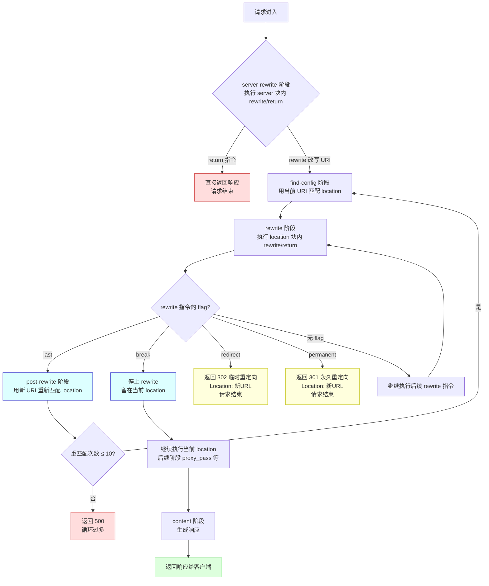

# 15 - rewrite 重写规则

> **版本基线**：Nginx 1.30.4
> **受众**：后端开发熟手，服务器小白
> **前置阅读**：建议先完成「阶段二 - 配置基础」与「阶段四 - location 匹配」相关章节

---

## 目录

- [1. 学习目标](#1-学习目标)
- [2. 核心知识点](#2-核心知识点)
  - [2.1 知识点一：rewrite 模块概述](#21-知识点一rewrite-模块概述)
  - [2.2 知识点二：rewrite 指令详解](#22-知识点二rewrite-指令详解)
  - [2.3 知识点三：return 指令](#23-知识点三return-指令)
  - [2.4 知识点四：set 指令](#24-知识点四set-指令)
  - [2.5 知识点五：if 指令（If Is Evil）](#25-知识点五if-指令if-is-evil)
  - [2.6 知识点六：map 指令](#26-知识点六map-指令)
  - [2.7 知识点七：常见重写场景](#27-知识点七常见重写场景)
  - [2.8 知识点八：rewrite 的性能影响](#28-知识点八rewrite-的性能影响)
  - [2.9 知识点九：$uri vs $request_uri 的陷阱](#29-知识点九uri-vs-request_uri-的陷阱)
- [3. Mermaid 图：rewrite 执行流程](#3-mermaid-图rewrite-执行流程)
- [4. 最佳实践小节](#4-最佳实践小节)
- [5. 常见踩坑引用](#5-常见踩坑引用)
- [6. 小结](#6-小结)

---

## 1. 学习目标

完成本章后，你应当能够：

1. **理解 rewrite 模块**在 Nginx 请求处理流水线中的位置（server-rewrite 阶段与 rewrite 阶段），并知道它与 location 匹配的先后关系。
2. **熟练使用 `rewrite` 指令**，能区分 `last`、`break`、`redirect`、`permanent` 四种 flag 的行为差异，避免经典的「last vs break」陷阱。
3. **优先使用 `return` 指令**完成简单重定向，理解它为什么比 `rewrite` 更高效。
4. **掌握 `set` 与 `map`** 两个变量操作指令，能在合适的场景用 `map` 替代危险的条件判断。
5. **认清 `if` 的「邪恶」本质**，记住 If Is Evil 中唯一安全的用法，掌握至少四种替代方案。
6. **独立实现六大常见重写场景**：HTTP→HTTPS、www 规范化、SEO 迁移、伪静态化、UA 分流、GeoIP 分流。
7. **规避 `$uri` 与 `$request_uri` 的陷阱**，理解变量在 rewrite / try_files 之后的变化规律。
8. **评估 rewrite 的性能开销**，在「可读性」与「性能」之间做出合理取舍。

---

## 2. 核心知识点

### 2.1 知识点一：rewrite 模块概述

Nginx 的 `ngx_http_rewrite_module`（下称 **rewrite 模块**）是请求 URL 重写与条件控制的核心模块。它默认编译进 Nginx，**无需 `--with` 选项**，但依赖 **PCRE 库**（正则表达式）。

#### rewrite 模块包含的指令

| 指令 | 作用 | 上下文 |
|------|------|--------|
| `rewrite` | 按正则匹配 URI 并替换，可触发重新匹配 location 或返回重定向 | server、location、if |
| `return` | 直接返回状态码（可带响应体或跳转 URL），**立即结束当前请求** | server、location、if |
| `set` | 设置自定义变量 | server、location、if |
| `if` | 条件判断（语法受限，详见 2.5） | server、location |
| `break` | 停止当前上下文后续 rewrite 指令的执行 | server、location、if |

> **特例说明**：`break` 既是 `rewrite` 指令的 flag，也是一个独立指令。作为独立指令时，它写在 location 内部，表示「停止执行本 location 内后续 rewrite 模块的指令」（如 `rewrite`、`set`），但**不会**阻止后续阶段（如 content 阶段的 `proxy_pass`）的执行。初学者常把「break 指令」与「break flag」混淆，需注意区分。

#### rewrite 在请求处理阶段中的位置

Nginx 将一个 HTTP 请求的生命周期划分为 **11 个阶段**（phase），rewrite 模块的指令分布在其中两个阶段：

```
请求进入
  │
  ▼
┌─────────────────────────────────────┐
│ 1. post-read                         │  读取完请求头后立即触发
├─────────────────────────────────────┤
│ 2. server-rewrite   ★ rewrite 模块   │  server 块内的 rewrite/return/if/set 在此执行
├─────────────────────────────────────┤
│ 3. find-config                       │  根据 URI 匹配 location
├─────────────────────────────────────┤
│ 4. rewrite          ★ rewrite 模块   │  location 块内的 rewrite/return/if/set 在此执行
├─────────────────────────────────────┤
│ 5. post-rewrite                      │  如果 URI 被 rewrite 改写，回到 find-config 重新匹配
├─────────────────────────────────────┤
│ 6. preaccess                         │
│ 7. access                            │  访问控制（allow/deny/auth）
│ 8. post-access                       │
│ 9. precontent                        │  try_files
│ 10. content                          │  生成响应（proxy_pass / fastcgi_pass / root 等）
│ 11. log                              │  记录日志
└─────────────────────────────────────┘
```

关键结论：

- **server 块内的 rewrite 指令**在 `server-rewrite` 阶段执行，**早于 location 匹配**。这意味着 server 级别的 rewrite 可以改变 URI，从而影响后续匹配到哪个 location。
- **location 块内的 rewrite 指令**在 `rewrite` 阶段执行，**晚于 location 匹配**。如果在 location 内用 `rewrite ... last` 改写了 URI，会触发 `post-rewrite` 阶段「跳回」`find-config` 重新匹配 location。
- `return` 指令无论写在 server 还是 location，执行后**立即结束请求**，不再走后续阶段。

> **特例说明**：`if` 块虽然写在 server 或 location 内，但它**不创建新的阶段**，而是把内部的指令「内联」到所在上下文对应的阶段。这也是 `if` 行为诡异的原因之一——内联后指令的执行顺序可能与直觉不符（详见 2.5）。

---

### 2.2 知识点二：rewrite 指令详解

#### 语法

```nginx
rewrite regex replacement [flag];
```

- **regex**：PCRE 正则表达式，对当前 URI（`$uri`）进行匹配。默认**区分大小写**；要忽略大小写用 `~*` 风格不行，需在正则中使用 `(?i)` 前缀。
- **replacement**：替换字符串。若以 `http://`、`https://` 或 `$scheme` 开头，Nginx 会直接向客户端返回重定向（无需 flag，默认 302）；否则只修改内部 URI。
- **flag**：控制 rewrite 后的行为，可省略（默认继续执行后续 rewrite 指令）。

#### flag 的四种值

| flag | 行为 | 是否重新匹配 location | 是否返回重定向 |
|------|------|----------------------|----------------|
| `last` | 停止当前（server/location）上下文后续 rewrite 指令，用新 URI **重新匹配 location** | 是 | 否 |
| `break` | 停止当前上下文后续 rewrite 指令，**留在当前 location** 继续执行 | 否 | 否 |
| `redirect` | 返回 **302** 临时重定向给客户端 | 否（请求已结束） | 是（302） |
| `permanent` | 返回 **301** 永久重定向给客户端 | 否（请求已结束） | 是（301） |

##### last：重新匹配 location

```nginx
server {
    location /old/ {
        # URI 改写为 /new/hello，然后用新 URI 重新匹配 location
        rewrite ^/old/(.*)$ /new/$1 last;
    }

    location /new/ {
        # 上面的 rewrite ... last 会让请求来到这里
        return 200 "matched /new/";
    }
}
```

- 第 4 行：`^/old/(.*)$` 匹配 `/old/hello`，捕获 `hello`，替换为 `/new/hello`。
- `last` 表示「停止 `/old/` location 内后续 rewrite 指令，用 `/new/hello` 重新走 find-config」，于是匹配到第 8 行的 `/new/`。

##### break：留在当前 location

```nginx
location /api/ {
    rewrite ^/api/(.*)$ /backend/$1 break;
    # URI 内部改为 /backend/xxx，但仍然留在本 location 内
    # 下面的 proxy_pass 会用改写后的 URI 转发
    proxy_pass http://backend_server;
}
```

- 第 2 行：`break` 表示「改写 URI 后不再重新匹配 location，继续在当前 location 执行后续指令」。
- 第 5 行：`proxy_pass` 拿到的是改写后的 `/backend/xxx`。

##### redirect：302 临时重定向

```nginx
location /promo {
    rewrite ^/promo$ /promotion redirect;
    # 浏览器收到 302，地址栏变成 /promotion，重新发请求
}
```

- 临时活动页常用 `redirect`，因为活动结束后可能撤掉，搜索引擎不会缓存 302 跳转。

##### permanent：301 永久重定向

```nginx
location /old-page {
    rewrite ^/old-page$ /new-page permanent;
    # 浏览器收到 301，地址栏变成 /new-page，搜索引擎更新索引
}
```

- SEO 迁移（旧 URL 永久废弃）用 `permanent`，搜索引擎会把权重转移到新 URL。

#### last vs break 的区别（引用踩坑 #1.5）

这是一个**经典高频踩坑点**，初学者几乎必踩。

| 维度 | `last` | `break` |
|------|--------|---------|
| 是否重新匹配 location | **是**，用新 URI 回到 find-config | **否**，留在当前 location |
| 后续 rewrite 指令 | 停止当前上下文后续 rewrite 指令 | 停止当前上下文后续 rewrite 指令 |
| 后续 content 阶段指令（proxy_pass 等） | 由**新匹配到的 location** 执行 | 由**当前 location** 执行 |
| 典型场景 | 把请求「路由」到另一个 location | 改写 URI 后在当前 location 内继续处理 |

**踩坑 #1.5 核心**：当你以为用 `last` 改写后会进入「另一个 location」处理，但实际上新 URI 又匹配回了**同一个 location**，就会形成循环。Nginx 有 10 次循环保护，超过则报 500。

```nginx
# 错误示例：循环陷阱
location / {
    rewrite ^/(.*)$ /index.php?path=$1 last;
    # 假设 /index.php 也匹配到 / 这个 location（比如 location ~ \.php$ 没生效）
    # 那么新 URI /index.php 又会回到这里，无限循环 -> 500
}
```

**判断口诀**：
- 想让请求**去别的 location** 处理 → 用 `last`。
- 想**改写 URI 但自己继续处理**（常见于 proxy_pass 前改写路径） → 用 `break`。
- 不确定就先用 `break`，它更安全（不会重新匹配，不会循环）。

> **特例说明**：当 `replacement` 以 `http://`、`https://` 开头时，**无论是否写 flag，Nginx 都会返回重定向**（默认 302）。此时写 `last` 或 `break` 是无意义的，应明确写 `redirect` 或 `permanent` 指定状态码。

---

### 2.3 知识点三：return 指令

#### 语法

```nginx
return code [text];        # 返回状态码 + 纯文本响应体
return code URL;           # 返回状态码 + 跳转 URL（用于 3xx 重定向）
return URL;                # 省略 code，默认 302 跳转到 URL（需以 http/https 开头）
```

- **code**：HTTP 状态码。支持标准状态码，也支持 Nginx 自定义的 `444`（关闭连接，不返回任何响应）。
- **text**：响应体文本。若 code 是 3xx，则第二个参数被当作跳转 URL（写入 `Location` 响应头）。
- **URL**：仅当以 `http://` 或 `https://` 开头时，才可省略 code，默认返回 302。

#### return 比 rewrite 更高效

`rewrite` 需要：

1. 编译并执行 PCRE 正则匹配；
2. 计算替换字符串；
3. 根据 flag 决定后续流程（可能重新匹配 location）。

而 `return` **不涉及正则匹配**，执行后立即构造响应并结束请求。因此：

> **凡是能用 `return` 完成的重定向，都不要用 `rewrite`。**

#### 常见用法

##### (1) HTTP → HTTPS 强制跳转

```nginx
server {
    listen 80;
    server_name example.com;
    # 301 永久重定向到 HTTPS，保留原始 URI 和查询参数
    return 301 https://$host$request_uri;
}
```

- `301`：永久重定向，搜索引擎更新索引。
- `$host`：请求的 Host 头（即域名），保持原域名不变。
- `$request_uri`：**原始**完整的请求 URI（含查询参数），不受 rewrite 影响（详见 2.9）。

##### (2) return 444：静默关闭连接

```nginx
server {
    listen 80 default_server;
    server_name _;
    # 对非法 Host 请求，直接断开 TCP 连接，不返回任何 HTTP 响应
    # 常用于拦截扫描器、无效域名访问
    return 444;
}
```

- `444` 是 Nginx 自定义非标准状态码，表示「关闭连接且不返回响应头/体」。
- 客户端会看到「连接被重置」，比返回 403 更省带宽，也更能干扰扫描器。

##### (3) return 200：返回纯文本

```nginx
location = /health {
    # 健康检查接口，直接返回 200 ok，无需转发到后端
    return 200 "ok";
    # 默认 Content-Type: text/plain
    # 如需 JSON，用 add_header 指定（见下）
    add_header Content-Type application/json;
}
```

> **特例说明**：`add_header` 在 `return` 之后写，但 `return` 会立即结束请求，`add_header` 还能生效吗？能。因为 `add_header` 在响应头过滤阶段执行，而 `return` 设置的响应体在 content 阶段，`add_header` 仍会被处理。但要注意：`return` 之后的指令（如 `proxy_pass`）**不会**执行。

##### (4) 用 return 代替 rewrite 做重定向

```nginx
# 不推荐：用 rewrite 做简单重定向（多了正则开销）
# rewrite ^/old$ /new permanent;

# 推荐：用 return 做精确路径重定向
location = /old {
    return 301 /new;
}
```

- 对于**精确路径**重定向，`location = /old` + `return` 比正则 `rewrite` 更高效、更易读。
- `return 301 /new` 中的 `/new` 是相对路径，Nginx 会补全为 `http://$host/new` 写入 Location 头。

---

### 2.4 知识点四：set 指令

#### 语法

```nginx
set $variable value;
```

- **variable**：变量名，必须以 `$` 开头。可以是自定义变量，也可以覆盖某些可写变量。
- **value**：值，可以是字符串、其他变量、或变量与字符串的拼接。

`set` 用于定义自定义变量，变量在请求处理过程中可以被后续指令引用。

#### 代码示例

```nginx
server {
    location /api/ {
        # 定义变量 $backend，值为后端服务地址
        set $backend "http://app_server:8080";
        # 根据请求头拼接一个 trace_id 变量
        set $trace_id "$request_id";
        # 把自定义变量传给后端（通过 proxy_set_header）
        proxy_set_header X-Trace-Id $trace_id;
        proxy_pass $backend;
    }
}
```

逐行说明：

- 第 3 行：`set $backend "http://app_server:8080";` —— 定义 `$backend` 变量，值为后端地址字符串。
- 第 5 行：`set $trace_id "$request_id";` —— `$request_id` 是 Nginx 内置变量（唯一请求 ID），赋值给自定义变量 `$trace_id`。
- 第 7 行：`proxy_set_header X-Trace-Id $trace_id;` —— 把 `$trace_id` 作为请求头传给后端，便于全链路追踪。
- 第 8 行：`proxy_pass $backend;` —— 用变量做 `proxy_pass` 的地址。**注意**：当 `proxy_pass` 含变量时，Nginx 不会在启动时解析 upstream，而是每次请求解析，需要配合 `resolver` 指令（用于域名解析）。

> **特例说明**：当 `proxy_pass`、`fastcgi_pass` 等指令的参数**包含变量**时，Nginx 要求在当前上下文配置 `resolver` 指令（指定 DNS 服务器），否则启动时报错 `no resolver defined to resolve ...`。这是因为含变量的地址无法在配置加载时静态解析。示例：
> ```nginx
> location /api/ {
>     resolver 8.8.8.8 valid=300s;
>     set $backend "app.example.com";
>     proxy_pass http://$backend:8080;
> }
> ```

---

### 2.5 知识点五：if 指令（If Is Evil）

#### 语法

```nginx
if (condition) {
    ...
}
```

`condition` 可以是：

- 变量名：变量为空字符串或 `0` 时为假，其余为真。
- `=` / `!=`：相等 / 不等比较。
- `~` / `~*`：正则匹配（区分 / 不区分大小写）。
- `!~` / `!~*`：正则不匹配。
- `-f` / `!-f`：文件存在 / 不存在。
- `-d` / `!-d`：目录存在 / 不存在。
- `-e` / `!-e`：文件/目录/软链接存在 / 不存在。
- `-x` / `!-x`：可执行 / 不可执行。

#### if 在 location 上下文中「是邪恶的」

Nginx 官方文档有一篇著名文章：[If Is Evil](https://nginx.org/en/docs/http/ngx_http_rewrite_module.html#if)。核心结论：

> `if` 是 `rewrite` 模块的一部分，行为在 **location 块内**极其诡异且不可预测。它会把块内的指令「内联」到 location 对应的阶段，导致部分指令（如 `proxy_pass`）被意外忽略或重复执行。

问题根源：`if` 并非真正的「条件块」，它是一个**伪容器**，内部指令的执行语义取决于指令本身属于哪个模块。rewrite 模块的指令（`return`/`rewrite`/`set`）在 if 内正常工作；但其他模块的指令（`proxy_pass`、`try_files`、`add_header`）在 if 内行为不可预期。

#### 唯一安全的用法

官方明确指出，`if` 在 location 内**只有以下两种用法是 100% 安全的**：

```nginx
# 安全用法 1：return ...（任意状态码）
if ($slow) {
    return 403;
}

# 安全用法 2：rewrite ... last
if ($request_method = POST) {
    rewrite ^/(.*)$ /api/$1 last;
}
```

其他 rewrite 模块指令（`set`、`break`）在 if 内「通常」也安全，但官方只对上述两种作明确保证。

#### 不安全的用法（必须避免）

```nginx
# 危险：proxy_pass 在 if 内可能不生效或产生意外行为
if ($http_cookie ~* "token") {
    proxy_pass http://auth_backend;
}
proxy_pass http://default_backend;

# 危险：try_files 在 if 内行为不可预测
if ($args) {
    try_files $uri /index.php?$args;
}

# 危险：add_header 在 if 内会被父 location 的 add_header 覆盖逻辑搞乱
if ($https) {
    add_header X-Https "on";
}
```

#### 替代方案

##### 替代方案 1：用 try_files 替代文件存在判断

```nginx
# 不推荐：用 if -f 判断文件
if (!-f $request_filename) {
    rewrite ^/(.*)$ /index.php?$1 last;
}

# 推荐：用 try_files 一步到位
location / {
    try_files $uri $uri/ /index.php?$args;
}
```

- `try_files` 依次尝试 `$uri`（文件）、`$uri/`（目录），都不存在则内部跳转到 `/index.php`，比 `if -f` 更清晰且安全。

##### 替代方案 2：用多个 server 块替代基于 Host 的 if

```nginx
# 不推荐：用 if $host 分流
server {
    listen 80;
    if ($host = 'a.com') { ... }
    if ($host = 'b.com') { ... }
}

# 推荐：用多个 server 块
server {
    listen 80;
    server_name a.com;
    # a.com 的配置
}
server {
    listen 80;
    server_name b.com;
    # b.com 的配置
}
```

- Nginx 本身就是基于 `server_name` 做 Host 路由的，用 `if` 判断 `$host` 是在重复造轮子，且行为不可靠。

##### 替代方案 3：用 map 替代变量条件判断

```nginx
# 不推荐：用 if 判断 UA
if ($http_user_agent ~* "mobile") {
    set $is_mobile 1;
}

# 推荐：用 map 映射（在 http 块定义）
map $http_user_agent $is_mobile {
    default 0;
    ~*mobile 1;
}
# 请求时 $is_mobile 自动计算，无需 if
```

##### 替代方案 4：用 error_page + 命名 location 替代复杂 if

```nginx
# 需求：当文件不存在时返回特定页面
location / {
    # try_files 找不到则内部跳转到 @fallback 命名 location
    try_files $uri @fallback;
}

location @fallback {
    # 复杂逻辑集中在这里，无需 if
    proxy_pass http://backend;
}
```

- `@` 开头的是「命名 location」，不能被外部直接访问，只能由 `try_files`、`error_page`、`rewrite` 内部跳转进入，是替代复杂 if 的利器。

> **引用踩坑 #1.7**：最常见的 `if` 踩坑是在 location 内用 `if` 包裹 `proxy_pass`，导致请求被发到错误的后端或 `proxy_pass` 直接不生效。一旦遇到 `if` 内 `proxy_pass` 行为异常，第一反应应当是「改用 map + 多 location」或「改用 try_files」。详见第 5 节踩坑引用。

---

### 2.6 知识点六：map 指令

#### 作用

`map` 指令根据**一个源变量的值**，映射出**另一个目标变量的值**。它本质是一张「查找表」，在请求到来时按源变量查表，得到目标变量。相比 `if` 的条件判断，`map` 更安全（在配置加载时静态构建）、更高效（哈希表查找）、更易读。

#### 语法

```nginx
map $source $target {
    default       默认值;
    值1           结果1;
    值2           结果2;
    ~*正则        结果3;      # 正则匹配（忽略大小写）
    ~正则         结果4;      # 正则匹配（区分大小写）
}
```

- `map` 只能在 **http 上下文**定义（不能写在 server/location 内）。
- `default` 是未匹配任何条件时的兜底值。
- 匹配顺序：先精确字符串匹配，再正则匹配（按出现顺序），最后 `default`。
- 目标变量 `$target` 在**被引用时才计算**（惰性求值），且只计算一次。

#### 代码示例

```nginx
http {
    # 根据 User-Agent 判断是否移动端
    map $http_user_agent $is_mobile {
        default      0;          # 默认值：PC
        "~*mobile"   1;          # 正则忽略大小写匹配 mobile，命中则为 1（移动端）
        "~*android"  1;          # 匹配 android
        "~*iphone"   1;          # 匹配 iphone
    }

    server {
        listen 80;

        location / {
            # $is_mobile 已由 map 自动计算，无需 if
            if ($is_mobile) {
                rewrite ^/(.*)$ /m/$1 last;
            }
            # 注意：这里 if 只做 rewrite ... last，属于安全用法
            proxy_pass http://backend;
        }
    }
}
```

逐行说明：

- 第 2 行：`map $http_user_agent $is_mobile {` —— 以请求头 `User-Agent`（`$http_user_agent`）为源变量，计算目标变量 `$is_mobile`。
- 第 3 行：`default 0;` —— 兜底值为 `0`（非移动端）。
- 第 4 行：`"~*mobile" 1;` —— `~*` 表示不区分大小写的正则匹配，UA 含 `mobile` 则 `$is_mobile = 1`。
- 第 5-6 行：同理匹配 `android`、`iphone`。
- 第 13 行：`if ($is_mobile)` —— 因为 `$is_mobile` 为 `0`（假）或 `1`（真），这里的 if 判断是安全的（只做 `rewrite ... last`）。

#### map 在 http 上下文定义，变量在请求时才计算

两个关键点：

1. **定义位置**：`map` 必须在 `http {}` 块内、`server {}` 块外定义。它的「映射表」在 Nginx 加载配置时构建为哈希表，开销极低。
2. **惰性求值**：目标变量**只有在请求中实际被读取时**才会触发查表计算，且同一请求内只计算一次、缓存结果。即使定义了 100 个 `map`，未被引用的不会产生任何开销。

> **特例说明**：`map` 的源变量和目标变量不能同名。若目标变量已通过 `set` 在别处定义，`map` 仍会覆盖它——但为了避免混淆，强烈建议 `map` 的目标变量使用专属命名（如加前缀 `$is_`、`$map_`）。

---

### 2.7 知识点七：常见重写场景

#### 场景一：HTTP → HTTPS 重定向

```nginx
server {
    listen 80;
    server_name example.com www.example.com;
    # 所有 HTTP 请求 301 永久跳转到 HTTPS
    return 301 https://$host$request_uri;
}

server {
    listen 443 ssl;
    server_name example.com www.example.com;
    ssl_certificate     /etc/nginx/ssl/example.crt;
    ssl_certificate_key /etc/nginx/ssl/example.key;
    # HTTPS 的正式配置...
}
```

逐行说明：

- 第 3 行：`return 301 https://$host$request_uri;` —— `$host` 保留原域名，`$request_uri` 保留原始路径+查询参数。用 `return` 而非 `rewrite`，避免正则开销。
- 使用 `301` 而非 `302`，让搜索引擎更新索引为 HTTPS。

#### 场景二：www → 非 www（或反向）

```nginx
# www.example.com -> example.com
server {
    listen 443 ssl;
    server_name www.example.com;
    ssl_certificate     /etc/nginx/ssl/example.crt;
    ssl_certificate_key /etc/nginx/ssl/example.key;
    return 301 https://example.com$request_uri;
}

# 主站
server {
    listen 443 ssl;
    server_name example.com;
    ssl_certificate     /etc/nginx/ssl/example.crt;
    ssl_certificate_key /etc/nginx/ssl/example.key;
    # 主站配置
}
```

逐行说明：

- 第 5 行：`return 301 https://example.com$request_uri;` —— 把 `www.example.com` 永久跳转到 `example.com`，保留原始路径。
- 反向（非 www → www）只需把 `server_name` 和跳转目标对调即可。

> **特例说明**：两个 server 块都要监听 443 并配置证书，否则浏览器在跳转前会先对 `www.example.com` 做证书校验。可以用一个**通配证书**（`*.example.com`）覆盖，或用同一证书配置多域名（SAN）。

#### 场景三：旧 URL → 新 URL（SEO 迁移）

```nginx
# 精确路径迁移：用 location = + return
location = /old-page {
    return 301 /new-page;
}

# 批量路径迁移：用 rewrite 正则
location /blog/ {
    # /blog/2023/01/hello -> /articles/2023/01/hello
    rewrite ^/blog/(.*)$ /articles/$1 permanent;
}
```

逐行说明：

- 第 2-4 行：单个精确页面迁移，`location = /old-page` 精确匹配，`return 301` 永久跳转，**无正则开销**。
- 第 7-9 行：批量目录迁移，`rewrite` 用正则捕获 `$1`，`permanent` 返回 301，搜索引擎把 `/blog/*` 的权重转移到 `/articles/*`。

#### 场景四：伪静态化（/article/123 → /article.php?id=123）

```nginx
location /article/ {
    # /article/123 -> /article.php?id=123
    rewrite ^/article/(\d+)$ /article.php?id=$1 last;
    # last：用新 URI /article.php 重新匹配 location
    # 期望匹配到 location ~ \.php$ 并交给 fastcgi 处理
}

location ~ \.php$ {
    fastcgi_pass   unix:/var/run/php-fpm.sock;
    fastcgi_index  index.php;
    fastcgi_param  SCRIPT_FILENAME  $document_root$fastcgi_script_name;
    include        fastcgi_params;
}
```

逐行说明：

- 第 3 行：`^/article/(\d+)$` 匹配 `/article/` 加纯数字，捕获数字 ID 到 `$1`。
- 第 3 行：替换为 `/article.php?id=123`，`last` 让新 URI 重新匹配 location，从而进入第 7 行的 `~ \.php$`。
- 第 8-11 行：PHP FastCGI 处理配置，`$fastcgi_script_name` 此时为 `/article.php`，`$_GET['id']` 由查询参数 `?id=123` 提供。

> **特例说明**：如果 `~ \.php$` 这个 location 不存在或没生效，`/article.php` 可能又匹配回 `/article/`（前缀匹配），形成循环导致 500。这是踩坑 #1.5 的典型表现。排查时先确认 `location ~ \.php$` 是否被正确匹配（可用 `error_log` 的 rewrite 日志辅助）。

#### 场景五：根据 User-Agent 分流（PC/移动端）

```nginx
http {
    map $http_user_agent $is_mobile {
        default      0;
        "~*mobile"   1;
        "~*android"  1;
        "~*iphone"   1;
    }

    server {
        listen 80;
        server_name example.com;

        location / {
            # 安全用法：if 内只做 rewrite ... last
            if ($is_mobile) {
                rewrite ^/(.*)$ /mobile/$1 last;
            }
            proxy_pass http://pc_backend;
        }

        location /mobile/ {
            proxy_pass http://mobile_backend;
        }
    }
}
```

逐行说明：

- 第 2-7 行：`map` 预计算 `$is_mobile`，避免在 `if` 内直接用正则匹配 UA（那样既低效又危险）。
- 第 15 行：`if ($is_mobile)` —— `1` 为真，`0` 为假，这是 `if` 的安全用法（只含 `rewrite ... last`）。
- 第 16 行：移动端请求 rewrite 到 `/mobile/` 前缀，`last` 重新匹配到第 21 行的 `/mobile/` location，转发到移动端后端。

#### 场景六：根据地理位置分流（需 GeoIP 模块）

```nginx
http {
    # GeoIP2 模块（需 --with-http_geoip2_module，依赖 libmaxminddb）
    geoip2 /etc/nginx/geoip/GeoLite2-Country.mmdb {
        $geoip2_country_code country iso_code;
        auto_reload 5m;
    }

    # 用 map 把国家码映射到后端集群
    map $geoip2_country_code $region_backend {
        default   http://global_backend;
        CN        http://cn_backend;
        US        http://us_backend;
        JP        http://jp_backend;
    }

    server {
        listen 80;
        location / {
            # $region_backend 由 map 自动计算，直接用于 proxy_pass
            proxy_pass $region_backend;
            # 含变量，需要 resolver
            resolver 8.8.8.8 valid=300s;
        }
    }
}
```

逐行说明：

- 第 3-6 行：`geoip2` 指令读取 MaxMind 数据库，把客户端 IP 映射到国家代码变量 `$geoip2_country_code`。`auto_reload 5m` 每 5 分钟检查数据库更新。
- 第 9-14 行：`map` 把国家代码映射到对应后端地址，`default` 兜底为全球集群。
- 第 22 行：`proxy_pass $region_backend;` —— 含变量，需配合 `resolver`。
- 第 23 行：`resolver 8.8.8.8 valid=300s;` —— 因为 `proxy_pass` 含变量，需指定 DNS 服务器解析后端域名，`valid=300s` 缓存 DNS 结果 300 秒。

> **特例说明**：GeoIP 模块**不是默认编译**的。Nginx 1.30 系列推荐使用 `ngx_http_geoip2_module`（第三方，基于 MaxMind GeoLite2），旧的 `ngx_http_geoip_module`（基于 GeoIP1）已随 MaxMind 停止维护而逐步淘汰。使用前需确认编译参数或安装动态模块。

---

### 2.8 知识点八：rewrite 的性能影响

#### 正则匹配的开销

`rewrite` 每次执行都要：

1. **编译正则**：Nginx 在配置加载时预编译正则为 PCRE 字节码（一次性开销，启动时完成）。
2. **执行匹配**：每次请求都要执行正则引擎，复杂正则（含大量回溯）在高并发下是显著的 CPU 开销。

经验值：

- 简单前缀正则（`^/old/(.*)$`）开销极低，可忽略。
- 复杂正则（嵌套量词、大量分支）可能成为瓶颈，建议用 `location` 前缀匹配 + 简单 rewrite 替代。

#### last 导致的重新匹配 location 的开销

`rewrite ... last` 会触发：

1. `post-rewrite` 阶段跳回 `find-config`。
2. 重新遍历 location 列表做匹配（前缀 + 正则）。
3. 进入新 location 后，可能再次触发 rewrite，形成链式跳转。

每次「重新匹配」都是一次完整的 location 匹配流程，在高并发下累积可观。

#### 循环保护：最多 10 次循环

Nginx 对 rewrite 导致的 location 重匹配有硬限制：**最多 10 次**。超过则返回 `500 Internal Server Error`，并在 error_log 记录：

```
rewrite or internal redirection cycle while processing "/..."
```

这是防止配置错误导致死循环的安全阀。但 10 次循环本身也是性能浪费，正常配置应控制在 1-2 次。

#### 推荐用 return 替代 rewrite 做简单重定向

性能优先级排序（从高到低）：

1. **`return`**（无正则，最高效）——用于精确路径重定向、状态码返回。
2. **`location` 前缀匹配 + `try_files`**（无正则或简单正则）——用于文件存在判断。
3. **`rewrite ... break`**（一次正则，不重新匹配）——用于路径改写后留在当前 location。
4. **`rewrite ... last`**（一次正则 + 重新匹配）——用于路由到其他 location，尽量少用。

**原则**：能用 `return` 就不用 `rewrite`；能用 `break` 就不用 `last`；能用 `location` 精确匹配就不用正则 `rewrite`。

```nginx
# 反面：用 rewrite 做简单域名跳转（多余的正则）
# rewrite ^(.*)$ https://example.com$1 permanent;

# 正面：用 return（无正则，高效）
return 301 https://example.com$request_uri;
```

---

### 2.9 知识点九：$uri vs $request_uri 的陷阱

这是**第二个高频踩坑点**（踩坑 #1.6），涉及两个极易混淆的变量。

#### 两个变量的定义

| 变量 | 含义 | 是否随 rewrite/try_files 变化 |
|------|------|------------------------------|
| `$uri` | 当前请求的 **规范化 URI**（解码后，不含查询参数） | **是**，rewrite/try_files 会更新它 |
| `$request_uri` | **原始**请求行中的 URI（含查询参数，未解码） | **否**，始终保持客户端发来的原始值 |

#### $uri 在 rewrite/try_files 后会变化

```nginx
location /old/ {
    rewrite ^/old/(.*)$ /new/$1?x=1 last;
}

location /new/ {
    # 此时：
    # $uri         = /new/hello   （已被 rewrite 改写）
    # $request_uri = /old/hello?a=1 （保持原始值，含原始查询参数）
    return 200 "uri=$uri, request_uri=$request_uri";
}
```

- 请求 `GET /old/hello?a=1`：
  - rewrite 把 `$uri` 改为 `/new/hello`，并追加查询参数 `?x=1`。
  - 进入 `/new/` 后，`$uri` = `/new/hello`（不含查询参数），`$request_uri` = `/old/hello?a=1`（原始完整值）。

#### $request_uri 始终保持原始值

```nginx
# HTTP -> HTTPS 跳转：用 $request_uri 保证原始参数不丢失
server {
    listen 80;
    return 301 https://$host$request_uri;
}
```

- 用 `$request_uri` 能保留原始的查询参数（`?a=1&b=2`）。
- 如果误用 `$uri`，查询参数会丢失（`$uri` 不含 `?` 后部分），导致跳转后页面参数缺失。

#### 代码示例对比

```nginx
# 错误：用 $uri 做 HTTPS 跳转，丢失查询参数
# return 301 https://$host$uri;          # /page?a=1 会变成 /page，丢失 ?a=1

# 正确：用 $request_uri，保留完整原始请求
return 301 https://$host$request_uri;    # /page?a=1 完整保留
```

```nginx
# 错误：用 $request_uri 做缓存 key（含查询参数，可能被攻击者用随机参数打穿缓存）
proxy_cache_key "$scheme$request_method$host$request_uri";
# 攻击者发 /page?x=1、/page?x=2 ... 每个都是不同 key，缓存击穿

# 正确：用 $uri 做缓存 key（忽略无关查询参数）
proxy_cache_key "$scheme$request_method$host$uri";
# 但要注意：如果业务依赖查询参数区分内容，这样会导致缓存串
```

> **引用踩坑 #1.6**：核心陷阱是**在 rewrite 之后用 `$uri` 做 HTTP 跳转**，导致跳转地址是改写后的路径而非用户原始路径；或在跳转时用 `$uri` 丢失查询参数。规则：**做重定向一律用 `$request_uri`；做内部路由/缓存 key 用 `$uri`**。详见第 5 节踩坑引用。

---

## 3. Mermaid 图：rewrite 执行流程

下图展示 `rewrite` 指令在四种 flag 下的不同行为路径：



**流程要点解读**：

- **`last`**：改写 URI 后走 `post-rewrite` → `find-config` 重新匹配 location，可能进入新的 location 再次执行 rewrite，形成链式跳转（受 10 次保护）。
- **`break`**：改写 URI 后**不重新匹配**，直接留在当前 location 继续执行 content 阶段（如 `proxy_pass`）。
- **`redirect` / `permanent`**：直接构造 302/301 响应返回客户端，请求结束，不再走后续阶段。
- **无 flag**：继续执行当前上下文后续 rewrite 指令，URI 可能被多次改写。

---

## 4. 最佳实践小节

1. **优先用 `return` 做重定向**：无正则开销，最高效。`return 301 https://$host$request_uri;` 是 HTTP→HTTPS 的标准写法。

2. **`rewrite` 能用 `break` 就不用 `last`**：`break` 不触发重新匹配，更可控，不会循环。

3. **`if` 只用于 `return` 和 `rewrite ... last`**：其他指令一律用 `map`、`try_files`、多 server 块、命名 location 替代。牢记 If Is Evil。

4. **用 `map` 替代条件判断**：在 http 块定义 map，把复杂条件逻辑前置为变量计算，location 内只做简单判断。

5. **重定向用 `$request_uri`，内部路由用 `$uri`**：`$request_uri` 保留原始完整请求（含参数），`$uri` 是当前规范化路径。

6. **`proxy_pass` 含变量必须配 `resolver`**：`set $b "app.com"; proxy_pass http://$b;` 时，加 `resolver 8.8.8.8 valid=300s;`。

7. **开启 rewrite 日志辅助调试**：调试期间 `rewrite_log on;`，会在 error_log 记录每步 rewrite 的匹配与替换，定位循环问题神器；上线前关闭。

8. **SEO 迁移用 301，临时活动用 302**：301 会被搜索引擎缓存，302 不会。用错会导致权重流失或临时页被永久收录。

9. **`location =` 精确匹配优先于正则 rewrite**：单页面跳转用 `location = /old { return 301 /new; }` 比正则 `rewrite` 更高效。

10. **定期检查循环**：上线前用 `nginx -t` 校验语法，上线后观察 error_log 是否有 `rewrite or internal redirection cycle`，有则立即排查 `last` 链路。

---

## 5. 常见踩坑引用

> 以下编号沿用《Nginx 踩坑手册》系列，便于跨章节交叉引用。

### 踩坑 #1.5：last vs break 导致循环或路径错乱

- **现象**：用 `rewrite ... last` 后，请求反复在同一个 location 之间跳转，最终 500；或改写后的路径没有进入预期的 location，导致 404 / 转发到错误后端。
- **根因**：`last` 会用新 URI **重新匹配 location**。若新 URI 又匹配回当前 location（或形成 A→B→A 链），即触发循环保护（10 次）。`break` 则留在当前 location，不会重新匹配。
- **排查**：开启 `rewrite_log on;`，观察 error_log 中每步 rewrite 的输入输出 URI，确认匹配链路。
- **规避**：路由到其他 location 用 `last`，改写后在当前 location 处理用 `break`。不确定时优先 `break`。
- **关联章节**：2.2「last vs break 的区别」、2.7「场景四：伪静态化」、2.8「循环保护」。

### 踩坑 #1.6：$uri vs $request_uri 用错导致参数丢失或地址错误

- **现象**：HTTP→HTTPS 跳转后查询参数丢失；或 rewrite 后做跳转，跳到了改写后的路径而非用户原始路径。
- **根因**：`$uri` 是当前规范化 URI（随 rewrite/try_files 变化，不含查询参数）；`$request_uri` 是原始完整请求（含查询参数，永不变化）。
- **规避**：做 HTTP 重定向（`return 301`）一律用 `$request_uri`；做内部路由判断、缓存 key 用 `$uri`。
- **关联章节**：2.9「$uri vs $request_uri 的陷阱」。

### 踩坑 #1.7：location 内 if 包裹 proxy_pass 等指令行为异常

- **现象**：在 `location` 内用 `if` 包裹 `proxy_pass` / `try_files` / `add_header`，出现请求发到错误后端、`proxy_pass` 不生效、响应头丢失等诡异行为。
- **根因**：`if` 是 rewrite 模块的伪容器，会把内部指令内联到 location 阶段。非 rewrite 模块指令（proxy_pass 等）在 if 内的执行语义不可预期。官方文档明确警告 If Is Evil。
- **规避**：
  - `if` 内只放 `return` 或 `rewrite ... last`。
  - 用 `map` 把条件前置为变量。
  - 用多个 location / 多个 server 块分流。
  - 用 `try_files` + 命名 location 替代文件判断类 if。
- **关联章节**：2.5「if 指令（If Is Evil）」。

### 踩坑 #1.10：proxy_pass 含变量未配 resolver 导致启动报错或解析失败

- **现象**：`proxy_pass http://$backend;` 启动报 `no resolver defined to resolve app.example.com`；或运行时后端域名解析失败。
- **根因**：`proxy_pass` 参数含变量时，Nginx 无法在配置加载时静态解析域名，必须在运行时用 DNS 解析，因此要求上下文中有 `resolver` 指令。
- **规避**：含变量的 `proxy_pass` 所在 location/server 内加 `resolver 8.8.8.8 valid=300s;`（valid 控制缓存时长）。若后端是固定 upstream，尽量用不带变量的 `proxy_pass http://upstream_name;` 以走 upstream 静态解析。
- **关联章节**：2.4「set 指令」特例说明、2.7「场景六：GeoIP 分流」。

---

## 6. 小结

本章系统讲解了 Nginx rewrite 模块的核心能力：

- **指令层面**：`rewrite`（正则改写 + 4 种 flag）、`return`（高效返回/重定向）、`set`（自定义变量）、`if`（条件判断，慎用）、`break`（停止 rewrite）。
- **阶段层面**：rewrite 模块指令分布在 `server-rewrite`（server 块，早于 location 匹配）和 `rewrite`（location 块，晚于匹配）两个阶段；`last` 会经 `post-rewrite` 跳回 `find-config` 重新匹配。
- **关键决策**：
  - 重定向优先 `return`，路径改写优先 `break`，路由到其他 location 才用 `last`。
  - 条件判断优先 `map`，`if` 只用于 `return` 和 `rewrite ... last`。
  - 重定向用 `$request_uri`，内部路由用 `$uri`。
  - `proxy_pass` 含变量必须配 `resolver`。
- **性能与安全**：正则有开销，循环有 10 次保护，`if` 在 location 内是 Evil。掌握 `map` + `try_files` + 命名 location 三大替代武器，可规避绝大多数 if 陷阱。

下一章将进入「安全与传输」的其他主题（如 SSL/TLS 配置、限流、访问控制），rewrite 作为 URL 控制的基石，将贯穿后续所有章节。

## 🧪 本机实测（2026-08-09）

> 环境：nginx:1.30.4（Docker）。

- **last**：`location /old/ { rewrite ^/old/(.*)$ /new/$1 last; }` + `location /new/ { return 200 ...; }` → 请求 `/old/abc` 重写为 `/new/abc` 后**重新进入 location 匹配**，命中 `/new/` ✓
- **break**：`location /b/ { rewrite ^/b/(.*)$ /other/$1 break; }` → 请求 `/b/abc` 重写为 `/other/abc` 后**停留当前 location** 进入 content 阶段找文件（`html/other/abc` 不存在 → **404**）✓
- **return 301**：`location /go/ { return 301 https://example.com/new-place; }` → 响应头 `Location: https://example.com/new-place` ✓
