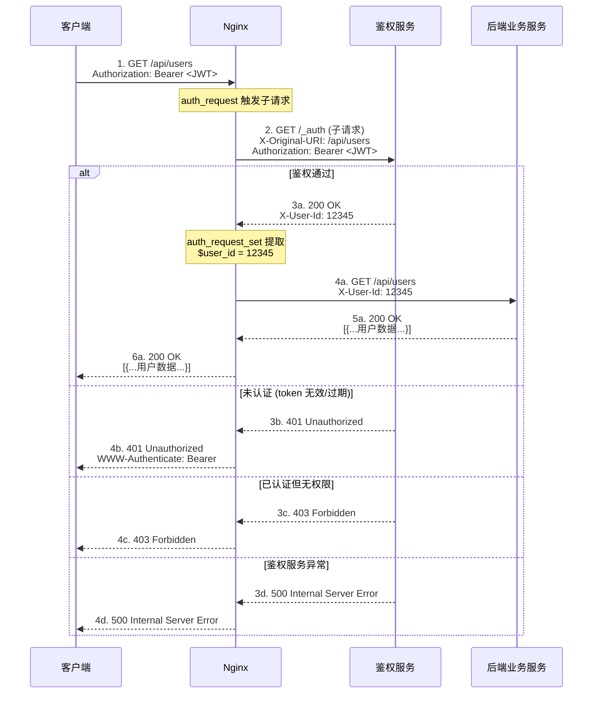

# 16 - 访问控制与认证

> **版本基线**：Nginx 1.30.4 (stable) | 创建日期：2026-08-05
> **受众**：后端开发熟手（熟悉 Python/Java/Lua），但服务器运维是小白。本篇把 Nginx 层的"谁能访问"和"你是谁"两件事一次讲透。

---

## 目录

- [1. 学习目标](#1-学习目标)
- [2. 核心知识点](#2-核心知识点)
  - [2.1 知识点一：allow / deny IP 访问控制](#21-知识点一allow--deny-ip-访问控制)
  - [2.2 知识点二：auth_basic HTTP 基本认证](#22-知识点二auth_basic-http-基本认证)
  - [2.3 知识点三：auth_request 子请求鉴权](#23-知识点三auth_request-子请求鉴权)
  - [2.4 知识点四：auth_jwt（JWT 认证，商业版）](#24-知识点四auth_jwtjwt-认证商业版)
  - [2.5 知识点五：server_tokens 隐藏版本号](#25-知识点五server_tokens-隐藏版本号)
  - [2.6 知识点六：限制 HTTP 方法](#26-知识点六限制-http-方法)
  - [2.7 知识点七：secure_link 防盗链](#27-知识点七secure_link-防盗链)
  - [2.8 知识点八：Referer 校验防盗链](#28-知识点八referer-校验防盗链)
  - [2.9 知识点九：安全加固清单](#29-知识点九安全加固清单)
- [3. Mermaid 图：auth_request 鉴权流程](#3-mermaid-图auth_request-鉴权流程)
- [4. 最佳实践](#4-最佳实践)
- [5. 常见踩坑引用](#5-常见踩坑引用)
- [6. 小结](#6-小结)

---

## 1. 学习目标

学完本篇，你应当能够：

- 掌握 `allow` / `deny` 指令的匹配顺序与用法，能正确配置 IP 白名单/黑名单。
- 理解 `auth_basic` HTTP 基本认证的工作原理，能用 `htpasswd` 或 `openssl passwd` 生成密码文件。
- 理解 `auth_request` 子请求鉴权机制——这是"边车模式"在 Nginx 的体现，能用它对接后端统一鉴权服务（如 JWT 校验）。
- 了解 NGINX Plus 的 `auth_jwt` 指令及开源版的替代方案。
- 掌握 `server_tokens off` 隐藏版本号的配置。
- 掌握 `limit_except` 限制 HTTP 方法。
- 掌握 `secure_link` 与 `valid_referers` 两种防盗链方案。
- 能组合运用安全加固清单（隐藏版本号、禁用方法、安全响应头、限制请求体大小）。
- 避开踩坑 `#3.1`（版本号泄露）、`#3.4`（SSRF）、`#3.5`（Host 头问题）。

> **前置知识**：建议先完成 [04-配置文件结构与指令体系](../02-配置基础/04-配置文件结构与指令体系.md) 和 [07-location匹配规则](../03-核心机制/07-location匹配规则.md)。

---

## 2. 核心知识点

### 2.1 知识点一：allow / deny IP 访问控制

`allow` 和 `deny` 指令来自 `ngx_http_access_module`，用于基于客户端 IP 地址做访问控制。这是 Nginx 最简单、最轻量的安全手段。

#### 指令说明

| 指令 | 作用 |
|------|------|
| `allow address | CIDR | unix: | all;` | 允许指定 IP / 网段 / 所有地址访问 |
| `deny address | CIDR | unix: | all;` | 拒绝指定 IP / 网段 / 所有地址访问 |

两个指令可以出现在 `http`、`server`、`location`、`limit_except` 上下文中。

#### 匹配顺序：从上到下，首个匹配生效

Nginx 按配置文件中 **从上到下** 的顺序逐条检查 `allow` / `deny` 规则，**第一条匹配的规则生效**，后续规则不再检查。如果没有任何规则匹配，默认允许访问。

这与防火墙规则类似——先写的优先级更高。

#### 支持的地址格式

- **单个 IP**：`192.168.1.100`
- **CIDR 网段**：`192.168.1.0/24`、`10.0.0.0/8`
- **IPv6**：`2001:db8::1`、`2001:db8::/32`
- **all**：所有地址

#### 代码示例

```nginx
# 场景：管理后台只允许内网访问，其他全部拒绝
location /admin/ {
    allow 10.0.0.0/8;        # 允许 10.x.x.x 内网网段
    allow 192.168.0.0/16;    # 允许 192.168.x.x 内网网段
    allow 172.16.0.0/12;     # 允许 172.16.x.x ~ 172.31.x.x 内网网段
    allow 127.0.0.1;         # 允许本机回环地址
    deny all;               # 拒绝其他所有 IP（放在最后兜底）
    
    proxy_pass http://backend;  # 通过的请求转发给后端
}
```

```nginx
# 场景：黑名单模式——封禁特定 IP，其他放行
location / {
    deny 203.0.113.66;      # 封禁恶意 IP
    deny 198.51.100.0/24;   # 封禁恶意网段
    allow all;              # 允许其他所有 IP
    
    proxy_pass http://backend;
}
```

```nginx
# 场景：IPv6 支持
location /api/ {
    allow 2001:db8::/32;    # 允许指定 IPv6 网段
    allow ::1;              # 允许 IPv6 回环地址
    deny all;              # 拒绝其他
    
    proxy_pass http://backend;
}
```

#### 特例说明

1. **继承规则**：子上下文会继承父上下文的 allow/deny 规则。如果 `server` 块配置了规则，`location` 块没有重新配置，则继承 server 的规则。但一旦 `location` 中写了任何一条 allow/deny，就**不会**继承父级规则，而是在当前级别重新定义。
2. **`unix:` 前缀**：用于允许/拒绝通过 Unix 域套接字连接的请求（较少使用）。
3. **Nginx 变量不支持**：allow/deny 只接受字面量地址，不能写 `allow $var;`，无法实现动态 IP 列表。需要动态控制时，考虑用 `geo` 模块或 `map` 配合变量。
4. **CIDR 优先级与书写顺序有关，而非前缀长度**：即使一条更精确的 CIDR 规则写在一条更宽泛的规则后面，也不会覆盖前面的匹配。例如 `deny 10.0.0.0/8; allow 10.0.0.1;`——一个 `10.0.0.1` 的请求会先匹配到 `deny 10.0.0.0/8` 被拒绝，`allow 10.0.0.1` 永远不会被检查到。

#### 适用场景

- **IP 白名单**：管理后台、内部工具仅允许办公网络/VPN 访问。
- **IP 黑名单**：封禁恶意爬虫、攻击源 IP。
- **内网限制**：开发/测试环境仅限内网访问。

---

### 2.2 知识点二：auth_basic HTTP 基本认证

`auth_basic` 来自 `ngx_http_auth_basic_module`，实现标准的 HTTP Basic Authentication（RFC 7617）。浏览器会弹出用户名/密码对话框，验证通过后才能访问。

#### 指令说明

| 指令 | 作用 |
|------|------|
| `auth_basic string \| off;` | 启用基本认证，string 为认证提示语（realm）；`off` 表示关闭（覆盖上级配置） |
| `auth_basic_user_file path;` | 指定密码文件路径 |

#### 生成密码文件

**方式一：使用 htpasswd（Apache HTTP Server 工具，最常用）**

```bash
# 安装 apache2-utils（Ubuntu/Debian）
# apt install apache2-utils

# 创建新密码文件并添加用户（-c 创建文件，-b 直接传密码）
htpasswd -cb /etc/nginx/.htpasswd admin "MyP@ssw0rd"
# -c: create（新建文件，已存在会覆盖！追加用户时不要加 -c）
# -b: batch（命令行直接传密码，避免交互）
# /etc/nginx/.htpasswd: 密码文件路径
# admin: 用户名
# "MyP@ssw0rd": 密码

# 追加用户（不加 -c！）
htpasswd -b /etc/nginx/.htpasswd user2 "AnotherP@ss"

# 使用 bcrypt 加密（更安全，推荐）
htpasswd -Bcb /etc/nginx/.htpasswd admin "MyP@ssw0rd"
# -B: 使用 bcrypt 加密（默认 cost=5，可用 -C 指定 4-31）
```

**方式二：使用 openssl passwd**

```bash
# 用 openssl 生成密码哈希（apr1 算法，兼容 htpasswd 格式）
openssl passwd -apr1 "MyP@ssw0rd"
# 输出示例: $apr1$abc12345$XxxXxxXxxXxxXxxXxxXxx.
# -apr1: Apache MD5 加密算法

# 手动写入密码文件（格式: 用户名:哈希）
echo "admin:$(openssl passwd -apr1 'MyP@ssw0rd')" > /etc/nginx/.htpasswd

# 追加用户
echo "user2:$(openssl passwd -apr1 'AnotherP@ss')" >> /etc/nginx/.htpasswd
```

密码文件格式（每行一个用户）：

```
admin:$apr1$abc12345$XxxXxxXxxXxxXxxXxxXxx.
user2:$apr1$def67890$YyyYyyYyyYyyYyyYyyYyy.
```

#### 代码示例

```nginx
# 场景：整个站点需要认证
server {
    listen 80;
    server_name internal.example.com;
    
    auth_basic "Restricted Area";           # 启用基本认证，提示语为 "Restricted Area"
    auth_basic_user_file /etc/nginx/.htpasswd;  # 密码文件路径
    
    location / {
        proxy_pass http://backend;
    }
}
```

```nginx
# 场景：仅特定路径需要认证，其他公开
server {
    listen 80;
    server_name example.com;
    
    location / {
        # 公开访问，不设 auth_basic
        proxy_pass http://backend;
    }
    
    location /admin/ {
        auth_basic "Admin Login";               # 仅 /admin/ 需要认证
        auth_basic_user_file /etc/nginx/.htpasswd;
        proxy_pass http://backend;
    }
    
    location /public-api/ {
        auth_basic off;                         # 显式关闭（覆盖 server 级配置）
        proxy_pass http://backend;
    }
}
```

#### 逐行说明

```nginx
location /admin/ {
    auth_basic "Restricted";        # 1. 开启基本认证，浏览器弹窗提示 "Restricted"
                                    #    未认证时 Nginx 返回 401 + WWW-Authenticate 头
    auth_basic_user_file /etc/nginx/.htpasswd;  # 2. 指定密码文件，Nginx 从中查找用户名和哈希
    proxy_pass http://backend;      # 3. 认证通过后才把请求转发给后端
}
```

#### 特例说明

1. **明文传输**：HTTP Basic 认证的用户名/密码使用 Base64 编码（不是加密）传输。**必须配合 HTTPS 使用**，否则密码等于明文传输，可被中间人截获。
2. **密码文件权限**：确保密码文件权限为 `640` 或 `600`，属主为 Nginx worker 运行用户（如 `nginx` 或 `www-data`），防止其他用户读取。
   ```bash
   chown root:nginx /etc/nginx/.htpasswd
   chmod 640 /etc/nginx/.htpasswd
   ```
3. **认证缓存**：浏览器收到 401 后会在后续请求中自动携带 `Authorization` 头，直到浏览器关闭或用户清除缓存。无法在服务端"注销"。
4. **satisfy 指令**：默认情况下，如果同时配置了 `allow/deny` 和 `auth_basic`，客户端需要**同时满足**两个条件（IP 通过 AND 认证通过）。可用 `satisfy any;` 改为"满足其一即可"：
   ```nginx
   location /admin/ {
       satisfy any;                    # 满足 IP 限制或认证其一即可
       allow 10.0.0.0/8;
       deny all;
       auth_basic "Restricted";
       auth_basic_user_file /etc/nginx/.htpasswd;
       proxy_pass http://backend;
   }
   # 内网用户无需认证直接访问，外网用户需输入用户名密码
   ```

#### 适用场景

- **临时保护**：测试环境、预发布环境不想被外部访问。
- **内网工具**：Grafana、Jenkins 等监控/管理面板前加一层认证。
- **简单场景**：不需要复杂认证体系，只需要一个用户名/密码门槛。

> **注意**：HTTP Basic 认证不适合作为面向公网的正式认证方案，应配合 HTTPS 或改用 `auth_request` 对接专业鉴权服务。

---

### 2.3 知识点三：auth_request 子请求鉴权

`auth_request` 来自 `ngx_http_auth_request_module`，这是 Nginx 最灵活的鉴权机制。它的工作原理是：收到客户端请求后，Nginx 先向一个**内部鉴权服务**发送一个子请求（subrequest），根据鉴权服务的响应状态码决定是放行还是拒绝原始请求。

> **对后端开发者的说明**：这是"边车模式"（Sidecar Pattern）在 Nginx 的体现。Nginx 作为"边车"，在请求到达后端之前，先调用一个独立的鉴权微服务做身份校验。后端应用只需要专注业务逻辑，鉴权逻辑与业务逻辑解耦，由独立的鉴权服务负责。这与 Service Mesh 中 Envoy 的外部鉴权（ext_authz）思路完全一致。

#### 指令说明

| 指令 | 作用 |
|------|------|
| `auth_request uri \| off;` | 设置鉴权子请求的内部 URI；`off` 关闭（覆盖上级配置） |
| `auth_request_set $variable value;` | 从鉴权响应中提取头信息存入变量 |

#### 鉴权服务返回状态码约定

| 状态码 | 含义 | Nginx 行为 |
|--------|------|------------|
| **2xx**（通常是 200） | 鉴权通过 | 继续处理原始请求，转发给后端 |
| **401** | 未认证 | 返回 401 给客户端（需登录） |
| **403** | 已认证但无权限 | 返回 403 给客户端（禁止访问） |
| 其他 | 鉴权服务异常 | 返回 500 给客户端 |

> 鉴权子请求的响应体**会被丢弃**，Nginx 只关心状态码和响应头。

#### 代码示例

```nginx
# 鉴权服务的内部 location（可以是本地处理，也可以代理到后端鉴权服务）
location = /_auth {
    internal;                       # 1. 标记为内部 location，外部无法直接访问
    proxy_pass http://auth-service/verify;  # 2. 转发到后端鉴权服务
    proxy_pass_request_body off;    # 3. 不转发原始请求体（鉴权只需头部信息）
    proxy_set_header Content-Length "";     # 4. 清空 Content-Length（因为不传 body）
    proxy_set_header X-Original-URI $request_uri;  # 5. 传递原始请求 URI 给鉴权服务
    proxy_set_header X-Original-Method $request_method;  # 6. 传递原始 HTTP 方法
    proxy_set_header Authorization $http_authorization;   # 7. 传递客户端的 Authorization 头（含 JWT Token）
}

# 需要鉴权的 API 路由
location /api/ {
    auth_request /_auth;            # 8. 发送子请求到 /_auth 做鉴权
    auth_request_set $user_id $upstream_http_x_user_id;  # 9. 从鉴权响应头提取 X-User-Id 存入 $user_id
    proxy_pass http://backend;      # 10. 鉴权通过后转发给后端
    proxy_set_header X-User-Id $user_id;  # 11. 把用户 ID 传递给后端
}
```

#### 逐行说明

```nginx
# === 鉴权服务 location（被 auth_request 调用的子请求目标） ===
location = /_auth {
    internal;                                    # 内部 location，外部直接访问返回 404
    proxy_pass http://auth-service/verify;       # 子请求转发到鉴权微服务
    proxy_pass_request_body off;                 # 不转发原始请求体（减少开销，鉴权一般只需 token）
    proxy_set_header Content-Length "";          # 因为不传 body，清空 Content-Length 头
    proxy_set_header X-Original-URI $request_uri;  # 告诉鉴权服务原始请求的 URI
    proxy_set_header X-Original-Method $request_method;  # 告诉鉴权服务原始请求的方法（GET/POST...）
    proxy_set_header Authorization $http_authorization;   # 透传客户端的 Authorization 头（Bearer Token）
}

# === 业务 API location（需要鉴权的路由） ===
location /api/ {
    auth_request /_auth;                         # 关键！触发子请求到 /_auth 做鉴权
    auth_request_set $user_id $upstream_http_x_user_id;
    # auth_request_set: 从鉴权响应的 HTTP 头中提取值
    # $upstream_http_x_user_id: 对应鉴权服务响应头中的 X-User-Id
    # $user_id: 把提取的值存入这个 Nginx 变量
    proxy_pass http://backend;                   # 鉴权通过（2xx）后，转发原始请求到后端
    proxy_set_header X-User-Id $user_id;        # 把从鉴权服务拿到的用户 ID 传给后端
}
```

#### 后端鉴权服务示例（Python/Flask）

```python
from flask import Flask, request, jsonify
import jwt

app = Flask(__name__)

@app.route('/verify', methods=['GET'])
def verify():
    """鉴权服务：被 Nginx auth_request 子请求调用"""
    token = request.headers.get('Authorization', '')  # 从头中取 token
    
    if not token.startswith('Bearer '):
        return '', 401  # 没有 token → Nginx 返回 401 给客户端
    
    try:
        payload = jwt.decode(token[7:], 'secret-key', algorithms=['HS256'])
        # 校验通过，返回 200 + 用户信息头
        resp = jsonify()
        resp.status_code = 200
        resp.headers['X-User-Id'] = str(payload['user_id'])  # 通过响应头传回用户信息
        resp.headers['X-User-Role'] = payload.get('role', 'user')
        return resp
    except jwt.ExpiredSignatureError:
        return '', 401  # token 过期 → 401
    except jwt.InvalidTokenError:
        return '', 403  # token 无效 → 403
```

#### 特例说明

1. **子请求方法**：auth_request 发出的子请求始终使用 **GET** 方法，无论原始请求是什么方法。这也是为什么需要用 `X-Original-Method` 头传递原始方法给鉴权服务。
2. **子请求不带请求体**：默认情况下，子请求不携带原始请求的 body。如果鉴权服务需要读取请求体内容，需要额外配置。
3. **响应体被丢弃**：鉴权服务的响应体不会被传递给客户端，只有状态码和响应头（可通过 `auth_request_set` 提取）被使用。
4. **级联调用**：auth_request 可以嵌套——鉴权 location 内部也可以有 auth_request，但不推荐超过一层，性能和复杂度都会受影响。
5. **缓存鉴权结果**：如果鉴权服务较慢，可以在鉴权 location 中加 `proxy_cache` 缓存鉴权结果，避免每次请求都调用鉴权服务。

#### 适用场景

- **微服务统一鉴权**：所有 API 请求在 Nginx 层统一做 JWT 校验，后端无需重复实现认证逻辑。
- **权限网关**：Nginx 作为 API 网关，在请求到达后端前完成身份验证和权限校验。
- **渐进式迁移**：旧系统没有认证，可以通过 Nginx + auth_request 在不改动后端代码的情况下增加鉴权。

---

### 2.4 知识点四：auth_jwt（JWT 认证，商业版）

`auth_jwt` 是 **NGINX Plus（商业版）** 独有的指令，来自 `ngx_http_auth_jwt_module`。它允许 Nginx 直接在自身验证 JWT（JSON Web Token），无需外部鉴权服务。

#### 指令说明

| 指令 | 作用 |
|------|------|
| `auth_jwt string \| off;` | 启用 JWT 认证，string 为 token 来源描述 |
| `auth_jwt_key_file path;` | 指定用于验证 JWT 签名的密钥文件（JWK 格式） |
| `auth_jwt_claim_set $variable name;` | 从 JWT payload 中提取 claim 存入变量 |
| `auth_jwt_header_set $variable name;` | 从 JWT header 中提取字段存入变量 |

#### NGINX Plus 示例（仅供参考）

```nginx
# NGINX Plus 专属指令
location /api/ {
    auth_jwt "realm";                              # 启用 JWT 认证
    auth_jwt_key_file /etc/nginx/jwt_keys.jwk;     # 密钥文件（JWK 格式）
    
    # 从 JWT payload 中提取用户信息
    auth_jwt_claim_set $user_id sub;               # 提取 sub claim → $user_id
    auth_jwt_claim_set $user_role role;            # 提取 role claim → $user_role
    
    proxy_pass http://backend;
    proxy_set_header X-User-Id $user_id;
    proxy_set_header X-User-Role $user_role;
}
```

#### 工作原理

1. Nginx 从 `Authorization: Bearer <token>` 头或 cookie 中提取 JWT。
2. Nginx 使用本地密钥文件验证 JWT 的签名（HMAC 或 RSA/ECDSA）。
3. 验证通过后，Nginx 可以通过 `auth_jwt_claim_set` 提取 payload 中的字段。
4. 验证失败返回 401。

**优势**：Nginx 自身完成 JWT 校验，无需外部子请求，延迟更低。
**限制**：仅 NGINX Plus 可用，需要购买商业授权。

#### 开源版替代方案

开源 Nginx 没有 `auth_jwt`，但有三种替代方案：

| 方案 | 说明 | 优缺点 |
|------|------|--------|
| **auth_request + 后端 JWT 校验** | 用 `auth_request` 发子请求到后端鉴权服务做 JWT 校验 | 最推荐。灵活、与业务解耦，但多一次内部请求 |
| **OpenResty / Lua** | 用 `lua-nginx-module` 在 Nginx 内执行 Lua 脚本校验 JWT | 性能好、无需额外服务，但需安装 OpenResty 和 Lua 依赖 |
| **第三方模块 njs** | 用 Nginx 内置的 njs（JavaScript）编写 JWT 校验逻辑 | 轻量，但 njs 生态不如 Lua 成熟 |

**OpenResty + Lua 示例**：

```nginx
# 使用 OpenResty 的 lua-nginx-module
location /api/ {
    access_by_lua_block {
        local jwt = require "resty.jwt"
        local auth_header = ngx.var.http_authorization
        
        if not auth_header or not auth_header:find("Bearer ") then
            ngx.exit(ngx.HTTP_UNAUTHORIZED)  -- 401
        end
        
        local token = auth_header:sub(8)  -- 去掉 "Bearer " 前缀
        local jwt_obj = jwt:verify("secret-key", token)
        
        if not jwt_obj.verified then
            ngx.exit(ngx.HTTP_UNAUTHORIZED)  -- 401
        end
        
        -- 提取用户信息存入 Nginx 变量
        ngx.var.user_id = jwt_obj.payload.sub
    }
    
    set $user_id "";
    proxy_pass http://backend;
    proxy_set_header X-User-Id $user_id;
}
```

---

### 2.5 知识点五：server_tokens 隐藏版本号

默认情况下，Nginx 会在错误页面和 `Server` 响应头中暴露版本号，例如 `nginx/1.30.4`。这让攻击者可以针对性地查找该版本的已知漏洞。

#### 指令说明

```nginx
server_tokens on | off | build | string;
```

| 值 | 行为 |
|----|------|
| `on`（默认） | 显示 `nginx/1.30.4`（版本号） |
| `off` | 只显示 `nginx`（隐藏版本号） |
| `build` | 显示构建名称 |
| `string`（1.11.10+） | 自定义 Server 头内容（需配合 `more_set_headers` 第三方模块才能真正改写） |

#### 代码示例

```nginx
http {
    server_tokens off;  # 全局隐藏版本号，错误页和 Server 头只显示 "nginx"
    
    # ... server 配置 ...
}
```

也可以在 server 或 location 级别覆盖：

```nginx
server {
    server_tokens off;  # 仅此 server 隐藏版本号
}
```

#### 验证效果

```bash
# 修改前（server_tokens on）
curl -I http://example.com
# Server: nginx/1.30.4     ← 暴露版本号

# 修改后（server_tokens off）
curl -I http://example.com
# Server: nginx            ← 版本号已隐藏
```

> **关联踩坑**：详见 [踩坑 #3.1 暴露 Nginx 版本号](../99-踩坑记录与解决方案.md#31-暴露-nginx-版本号)。默认 `server_tokens on` 会在错误页和响应头中暴露 `nginx/1.30.4`，便于攻击者针对性利用。设为 `off` 即可隐藏版本号，只显示 `nginx`。

#### 特例说明

1. **隐藏版本号不等于隐藏 Nginx**：`server_tokens off` 只隐藏版本号，仍然显示 `nginx`。如果需要完全隐藏或伪造 Server 头，需要使用第三方模块（如 `headers-more-nginx-module`）的 `more_clear_headers` 指令。但从安全角度来说，隐藏版本号已经足够，"安全通过隐蔽"（security through obscurity）本身不是可靠的防护手段。
2. **错误页也受影响**：404、500 等错误页面中的版本号也会被隐藏。

---

### 2.6 知识点六：限制 HTTP 方法

`limit_except` 来自 `ngx_http_core_module`，用于限制当前 location 允许的 HTTP 方法。它的工作方式是：**列出允许的方法，其余方法被拒绝**。

#### 语法

```nginx
limit_except method ... { ... }
```

`method` 可以是：`GET`、`HEAD`、`POST`、`PUT`、`DELETE`、`MKCOL`、`COPY`、`MOVE`、`OPTIONS`、`PROPFIND`、`PROPPATCH`、`LOCK`、`UNLOCK`、`PATCH`。

> **注意**：`limit_except GET` 实际上也允许 `HEAD` 方法（因为 HEAD 是 GET 的子集，Nginx 内部处理时二者等价）。

#### 代码示例

```nginx
# 场景一：只允许 GET 和 POST，禁止 PUT/DELETE 等修改操作
location /api/ {
    limit_except GET POST {    # 允许 GET 和 POST，其他方法进入下面的块
        deny all;             # 拒绝所有 IP（即拒绝 PUT/DELETE 等方法）
    }
    proxy_pass http://backend;
}
# GET /api/users  → 允许（匹配 limit_except 中的 GET）
# POST /api/users → 允许（匹配 limit_except 中的 POST）
# DELETE /api/users/1 → 403（不在允许列表中，触发 deny all）
```

```nginx
# 场景二：静态资源只允许 GET/HEAD
location /static/ {
    limit_except GET {         # 只允许 GET（HEAD 自动包含）
        deny all;             # 其他方法拒绝
    }
    root /var/www/static;
}
```

```nginx
# 场景三：限制写操作仅限内网
location /api/admin/ {
    limit_except GET POST {    # GET/POST 所有人可用
        allow 10.0.0.0/8;     # PUT/DELETE 仅允许内网
        deny all;
    }
    proxy_pass http://backend;
}
# 外网用户：只能 GET/POST
# 内网用户：可以 GET/POST/PUT/DELETE
```

#### 特例说明

1. **GET 隐含 HEAD**：`limit_except GET` 不会阻止 HEAD 请求。Nginx 内部把 HEAD 当作 GET 处理，只是不返回响应体。
2. **limit_except 块内可用的指令**：块内只能使用 `ngx_http_access_module`（allow/deny）和 `ngx_http_auth_basic_module`（auth_basic）的指令。不能在块内写 proxy_pass 等其他指令。
3. **与 location 正则配合**：如果用正则 location 精确匹配 API 路径，可以更灵活地控制不同接口允许的方法。

---

### 2.7 知识点七：secure_link 防盗链

`secure_link` 来自 `ngx_http_secure_link_module`，通过**带签名的 URL** 实现防盗链。服务端生成一个包含过期时间和 MD5 签名的 URL，只有在有效期内且签名正确的请求才能访问。

#### 指令说明

| 指令 | 作用 |
|------|------|
| `secure_link expression;` | 从 URL 中提取校验参数（签名、过期时间） |
| `secure_link_md5 expression;` | 定义 MD5 签名的计算公式 |
| `secure_link_secret word;` | 旧版指令（0.8.50 前），已被 secure_link_md5 取代 |

#### 工作流程

1. 服务端（后端应用）生成下载链接：`MD5(密钥 + URI + 过期时间)` + 过期时间戳。
2. 将签名和过期时间作为 URL 参数：`/file.zip?md5=xxx&expires=1234567890`。
3. Nginx 收到请求后，用相同公式重新计算 MD5，与 URL 中的签名比对。
4. 签名匹配且未过期 → `$secure_link` 变量为 `"1"`，允许访问。
5. 签名不匹配或已过期 → `$secure_link` 变量为空字符串 `""`，拒绝访问。

#### 代码示例

```nginx
location /download/ {
    # 1. 从请求参数中提取 md5 和 expires
    secure_link $arg_md5,$arg_expires;
    # $arg_md5: URL 参数 md5 的值
    # $arg_expires: URL 参数 expires 的值
    # 两个值用逗号拼接作为 secure_link 的输入
    
    # 2. 定义 MD5 签名计算公式
    secure_link_md5 "$secret$uri$arg_expires";
    # 签名 = MD5( 密钥 + URI + 过期时间戳 )
    # $secret: 在下面用 set 定义
    # $uri: 请求的 URI 路径（如 /download/file.zip）
    # $arg_expires: 过期时间戳
    
    # 3. 设置密钥
    set $secret "my_secret_key_2026";
    
    # 4. 签名不匹配或已过期 → 返回 403
    if ($secure_link = "") {
        return 403;
    }
    
    # 5. 签名有效 → 提供文件下载
    root /data/downloads;
}
```

#### 生成带签名 URL 的后端代码（Python）

```python
import hashlib
import time

def generate_download_url(base_url, file_path, secret, expire_seconds=3600):
    """
    生成带 secure_link 签名的下载 URL
    
    Args:
        base_url: 站点基础 URL，如 https://example.com
        file_path: 文件路径，如 /download/file.zip
        secret: 与 Nginx 配置中一致的密钥
        expire_seconds: 有效期（秒）
    
    Returns:
        带签名的完整 URL
    """
    expires = int(time.time()) + expire_seconds  # 计算过期时间戳
    
    # MD5 签名计算公式必须与 Nginx 的 secure_link_md5 一致
    # Nginx 配置: secure_link_md5 "$secret$uri$arg_expires";
    # 对应 Python: MD5(secret + uri + expires)
    raw = f"{secret}{file_path}{expires}"
    md5_hash = hashlib.md5(raw.encode()).hexdigest()
    # 注意: base64 编码方式也常用，此处使用 hex
    
    url = f"{base_url}{file_path}?md5={md5_hash}&expires={expires}"
    return url

# 使用示例
url = generate_download_url(
    "https://example.com",
    "/download/file.zip",
    "my_secret_key_2026",  # 必须与 Nginx 中的 $secret 一致
    expire_seconds=3600     # 1 小时有效
)
print(url)
# 输出: https://example.com/download/file.zip?md5=abc123...&expires=1785870000
```

#### 特例说明

1. **密钥一致性**：后端生成签名时使用的密钥、URI、过期时间的拼接顺序必须与 Nginx 的 `secure_link_md5` 表达式**完全一致**，否则签名永远不匹配。
2. **URI 不含查询参数**：`$uri` 只包含路径部分，不含 `?` 后的查询参数。如果签名中包含查询参数会导致不一致。
3. **过期时间检查**：Nginx 自动检查 `$arg_expires` 是否小于当前时间。如果已过期，`$secure_link` 为空。
4. **`$secure_link_expires` 变量**：包含从请求中提取的过期时间戳，可用于日志记录。
5. **MD5 的安全性**：MD5 本身已不推荐用于安全场景，但 secure_link 的安全性主要依赖密钥保密而非算法强度。如果需要更高安全性，可考虑使用 `secure_link` 的 base64 变体。

#### 适用场景

- **文件下载防盗链**：生成限时下载链接，防止链接被分享后永久有效。
- **付费内容保护**：只有付费用户才能获得有效签名 URL。
- **临时授权访问**：类似 AWS S3 的 Presigned URL 机制。

---

### 2.8 知识点八：Referer 校验防盗链

`valid_referers` 来自 `ngx_http_referer_module`，通过检查请求的 `Referer` 头来防盗链。如果请求的 Referer 不是合法来源，则通过 `$invalid_referer` 变量标记为非法。

#### 指令说明

```nginx
valid_referers none | blocked | server_names | string ...;
```

| 参数 | 含义 |
|------|------|
| `none` | 允许没有 Referer 头的请求（直接在浏览器地址栏输入 URL） |
| `blocked` | 允许 Referer 头被代理/防火墙清除的请求（Referer 值不以 `http://` 或 `https://` 开头） |
| `server_names` | 允许 Referer 中的域名与当前 server_name 匹配的请求 |
| `string` | 允许指定的域名（可用 `*` 通配符，如 `*.example.com`） |
| 正则表达式 | 以 `~` 开头，允许匹配正则的 Referer |

#### 变量

- `$invalid_referer`：空字符串 `""` 表示 Referer 合法；`"1"` 表示 Referer 非法。

#### 代码示例

```nginx
# 场景：防止图片被盗链，只允许来自自己域名的请求
location ~* \.(jpg|jpeg|png|gif|webp|mp4|mp3)$ {
    valid_referers none blocked server_names
        *.example.com      # 允许的来源域名
        *.example.org      # 允许的关联域名
        ~\.google\.        # 允许 Google 图片搜索
        ~\.baidu\.com;     # 允许百度搜索
    
    if ($invalid_referer) {
        return 403;         # Referer 非法 → 返回 403
        # 也可以返回一张防盗链提示图片:
        # rewrite ^/ /hotlink-denied.png last;
    }
    
    root /var/www/images;
}
```

#### 逐行说明

```nginx
location ~* \.(jpg|jpeg|png|gif)$ {
    # 定义合法的 Referer 来源
    valid_referers none blocked server_names
    #  none:       允许没有 Referer 头的请求（用户直接在地址栏输入图片 URL）
    #  blocked:    允许 Referer 头存在但被修改（不以 http:// https:// 开头）的请求
    #  server_names: 允许 Referer 域名匹配当前 server_name 的请求
        *.example.com      # 允许所有 example.com 的子域名
        ~\.google\.;       # 允许 Google 的所有域名（正则匹配）
    
    # 如果 Referer 不在合法列表中，$invalid_referer = "1"
    if ($invalid_referer) {
        return 403;         # 返回 403 Forbidden
    }
    
    root /var/www/images;   # Referer 合法 → 正常提供图片
}
```

#### 特例说明

1. **Referer 可伪造**：Referer 头可以被客户端伪造，因此 Referer 校验**不是强安全手段**，只能防止普通的盗链（如在他人网站 `` 标签中引用你的图片）。对于有技术能力的攻击者无效。
2. **`none` 的取舍**：如果配置了 `none`，直接在浏览器地址栏输入图片 URL 可以访问（因为没有 Referer 头）。如果不配置 `none`，直接输入 URL 会被拒绝，可能影响用户体验。
3. **搜索引擎图片搜索**：如果希望被搜索引擎收录图片，需要把搜索引擎域名加入白名单。
4. **HTTPS → HTTP 降级**：现代浏览器在从 HTTPS 页面跳转到 HTTP 资源时，默认不发送 Referer（或发送空值），需要配合 `blocked` 或 `none` 处理。
5. **与 secure_link 对比**：Referer 校验简单但可伪造；secure_link 安全但需要后端动态生成 URL。两者可组合使用。

#### 适用场景

- **图片/视频防盗链**：防止其他网站直接引用你的图片资源消耗带宽。
- **API 来源限制**：只允许特定域名的页面调用 API（需注意 Referer 可伪造，不能作为唯一安全手段）。

---

### 2.9 知识点九：安全加固清单

将前面学到的安全措施组合起来，形成一份完整的安全加固清单。以下是生产环境 Nginx 的推荐安全配置。

#### 加固清单总览

| 加固项 | 指令 | 说明 |
|--------|------|------|
| 隐藏版本号 | `server_tokens off` | 防止攻击者针对性利用版本漏洞 |
| 禁用不需要的 HTTP 方法 | `limit_except` | 减少攻击面 |
| 安全响应头 | `add_header` | 防止 XSS、点击劫持、MIME 嗅探 |
| 限制请求体大小 | `client_max_body_size` | 防止大文件上传攻击 |
| 限制请求头大小 | `large_client_header_buffers` | 防止慢速攻击 |

#### 完整代码示例

```nginx
http {
    # ========== 1. 隐藏版本号 ==========
    server_tokens off;
    # 错误页和 Server 响应头只显示 "nginx"，不显示版本号
    # 关联踩坑 #3.1

    # ========== 2. 限制请求体大小 ==========
    client_max_body_size 10m;
    # 限制单个请求的 body 最大为 10MB
    # 超过返回 413 Request Entity Too Large
    # 防止恶意大文件上传消耗服务器资源
    # 根据业务调整：API 接口一般 1-10m，文件上传可适当放大

    # ========== 3. 限制请求头大小 ==========
    large_client_header_buffers 4 8k;
    # 读取大型客户端请求头的缓冲区：4 个缓冲区 × 每个 8k
    # 防止超长 URL/头部攻击（慢速 HTTP DoS 攻击的一种）

    # ========== 4. 全局安全响应头 ==========
    # add_header 的 always 参数：即使响应是错误状态码（如 404/500）也会添加这些头
    # 不加 always 则只在 200/201/204/206/301/302/303/304/307/308 状态码时添加
    
    add_header X-Frame-Options "SAMEORIGIN" always;
    # 防止点击劫持（Clickjacking）
    # SAMEORIGIN: 只允许同源页面在 iframe 中嵌套
    # DENY: 完全禁止被 iframe 嵌套
    # ALLOW-FROM uri: 只允许指定来源嵌套（已被现代浏览器废弃）
    
    add_header X-Content-Type-Options "nosniff" always;
    # 防止浏览器 MIME 嗅探
    # 浏览器有时会把声明的 text/plain 当作 HTML 执行（XSS 风险）
    # nosniff: 强制浏览器严格遵守 Content-Type 声明
    
    add_header X-XSS-Protection "1; mode=block" always;
    # 启用浏览器内置的 XSS 过滤器（主要针对 IE/旧版浏览器）
    # 1; mode=block: 检测到 XSS 攻击时直接阻止页面渲染
    # 注意: 现代浏览器（Chrome 78+）已移除此过滤器，但保留头不会有害
    
    add_header Referrer-Policy "strict-origin-when-cross-origin" always;
    # 控制 Referer 头的发送策略
    # strict-origin-when-cross-origin: 同源发完整 Referer，跨源只发 origin，HTTPS→HTTP 不发
    
    add_header Content-Security-Policy "default-src 'self'" always;
    # 内容安全策略（CSP），限制资源加载来源
    # default-src 'self': 默认只允许加载同源资源
    # 根据业务需要细化为 script-src/style-src/img-src 等
    
    server {
        listen 443 ssl;
        server_name example.com;
        
        # ========== 5. 禁用不需要的 HTTP 方法 ==========
        # 在 server 级别限制全局只允许 GET/POST/HEAD
        # 需要 PUT/DELETE 的接口在特定 location 中单独放行
        
        if ($request_method !~ ^(GET|POST|HEAD)$ ) {
            return 405;
        }
        # 405 Method Not Allowed
        # 阻止 TRACE（可被 XST 攻击利用）、CONNECT、PATCH 等不需要的方法
        
        location / {
            # 继承 server 级别的安全头
            proxy_pass http://backend;
        }
        
        location /api/upload/ {
            # 上传接口单独允许 PUT
            limit_except GET POST PUT {
                deny all;
            }
            client_max_body_size 50m;  # 上传接口放大 body 限制
            proxy_pass http://backend;
        }
        
        location /admin/ {
            # 管理后台：IP 白名单 + 基本认证
            allow 10.0.0.0/8;
            deny all;
            auth_basic "Admin";
            auth_basic_user_file /etc/nginx/.htpasswd;
            proxy_pass http://backend;
        }
    }
}
```

#### 关于 add_header 的 always 参数

```nginx
# 不加 always：只在成功响应时添加头
add_header X-Frame-Options "SAMEORIGIN";
# 200 → 有 X-Frame-Options 头
# 404 → 没有 X-Frame-Options 头 ← 安全漏洞！

# 加 always：所有响应都添加头
add_header X-Frame-Options "SAMEORIGIN" always;
# 200 → 有 X-Frame-Options 头
# 404 → 有 X-Frame-Options 头
# 500 → 有 X-Frame-Options 头
```

> **关键点**：安全响应头**必须**加 `always` 参数。否则错误页面（404/500 等）不会有安全头，攻击者可能利用错误页面进行攻击。

#### add_header 的继承规则

```nginx
server {
    add_header X-Frame-Options "SAMEORIGIN" always;
    
    location / {
        # 继承 server 级别的 add_header ✅
        proxy_pass http://backend;
    }
    
    location /api/ {
        # 一旦在 location 中写了任何 add_header，
        # server 级别的 add_header 全部失效！需要重新声明
        add_header X-Content-Type-Options "nosniff" always;
        # X-Frame-Options 在这里不生效！需要重新写
        proxy_pass http://backend;
    }
}

# 正确做法：location 中如果需要添加额外头，要重新声明所有需要的头
location /api/ {
    add_header X-Frame-Options "SAMEORIGIN" always;          # 重新声明
    add_header X-Content-Type-Options "nosniff" always;     # 新增
    proxy_pass http://backend;
}
```

---

## 3. Mermaid 图：auth_request 鉴权流程



### 流程说明

1. **客户端**携带 JWT Token 向 Nginx 发起 API 请求。
2. Nginx 配置了 `auth_request /_auth`，在处理请求前先向鉴权服务发送一个 **GET 子请求**，携带原始请求的 URI、方法和 Authorization 头。
3. 鉴权服务验证 JWT Token：
   - **验证通过**（200）：Nginx 通过 `auth_request_set` 从响应头提取用户信息，将原始请求转发给后端业务服务。
   - **验证失败**（401）：Nginx 直接返回 401 给客户端，请求不会到达后端。
   - **权限不足**（403）：Nginx 返回 403，请求不会到达后端。
   - **鉴权服务异常**（500）：Nginx 返回 500，保护后端不被未授权请求访问。
4. 只有鉴权通过的请求才会到达后端业务服务，后端只需处理业务逻辑，无需重复实现认证。

---

## 4. 最佳实践

### 4.1 认证方案选择

| 场景 | 推荐方案 | 理由 |
|------|----------|------|
| 内部工具/测试环境 | `auth_basic` | 简单快速，无需开发 |
| 管理后台 | `allow/deny` + `auth_basic` | 双重保护 |
| 面向公网的 API | `auth_request` + 后端鉴权服务 | 灵活、可扩展、与业务解耦 |
| JWT Token 验证 | `auth_request` + 后端 JWT 校验（开源版） | 无需购买 NGINX Plus |
| 微服务统一鉴权 | `auth_request`（边车模式） | 所有服务共享一套鉴权逻辑 |

### 4.2 安全配置分层

```nginx
# http 层：全局默认安全策略
http {
    server_tokens off;
    client_max_body_size 10m;
    add_header X-Frame-Options "SAMEORIGIN" always;
    add_header X-Content-Type-Options "nosniff" always;
    
    # server 层：站点级覆盖
    server {
        # 可覆盖 http 层的配置
        
        # location 层：路由级精细控制
        location /admin/ {
            allow 10.0.0.0/8;
            deny all;
            auth_basic "Admin";
            auth_basic_user_file /etc/nginx/.htpasswd;
            # 注意：location 中写了 add_header 会覆盖 server 层的 add_header
        }
    }
}
```

### 4.3 密码文件管理

```bash
# 1. 使用 bcrypt 加密（比 apr1 更安全）
htpasswd -Bcb /etc/nginx/.htpasswd admin "StrongP@ssw0rd"

# 2. 严格设置文件权限
chown root:nginx /etc/nginx/.htpasswd
chmod 640 /etc/nginx/.htpasswd

# 3. 不要把密码文件放在 web 根目录下！
# 错误: /var/www/html/.htpasswd （可被直接下载）
# 正确: /etc/nginx/.htpasswd （在 web 根目录之外）
```

### 4.4 安全头完整清单

```nginx
# 推荐的安全响应头完整配置
add_header X-Frame-Options "SAMEORIGIN" always;
add_header X-Content-Type-Options "nosniff" always;
add_header X-XSS-Protection "1; mode=block" always;
add_header Referrer-Policy "strict-origin-when-cross-origin" always;
add_header Permissions-Policy "camera=(), microphone=(), geolocation=()" always;
add_header Content-Security-Policy "default-src 'self'; script-src 'self' 'unsafe-inline'" always;
add_header Strict-Transport-Security "max-age=31536000; includeSubDomains" always;
# HSTS 仅在 HTTPS server 中添加
```

---

## 5. 常见踩坑引用

### #3.1 暴露 Nginx 版本号

> 默认 `server_tokens on`，错误页和 `Server` 响应头中会显示 `nginx/1.30.4`，便于攻击者针对性利用已知漏洞。

**解决方案**：

```nginx
http {
    server_tokens off;  # 隐藏版本号，只显示 nginx
}
```

> 详见：[踩坑 #3.1 暴露 Nginx 版本号](../99-踩坑记录与解决方案.md#31-暴露-nginx-版本号)

---

### #3.4 SSRF / proxy_pass 可被用户控制的变量影响

> 在配置 `auth_request` 的鉴权服务 location 时，如果 `proxy_pass` 使用了用户可控的变量（如 `$arg_target`），可能导致 SSRF（服务端请求伪造），攻击者可让 Nginx 代理到任意内网地址。

**危险写法**：

```nginx
location = /_auth {
    internal;
    proxy_pass $arg_target;  # 危险！用户可控变量直接作为上游地址
}
```

**正确做法**：

```nginx
location = /_auth {
    internal;
    proxy_pass http://auth-service/verify;  # 固定地址，不接受用户输入
}
```

> 详见：[踩坑 #3.4 SSRF / proxy_pass 可被用户控制的变量影响](../99-踩坑记录与解决方案.md#34-ssrf--proxy_pass-可被用户控制的变量影响)

---

### #3.5 不当的 proxy_set_header / Host 头问题

> 在 `auth_request` 的鉴权 location 中配置 `proxy_pass` 时，如果未正确设置 `Host` 头，鉴权服务收到的 Host 可能是上游 IP（`$proxy_host`）而非期望的域名，导致基于 Host 的路由或签名校验失效。

**正确配置**：

```nginx
location = /_auth {
    internal;
    proxy_pass http://auth-service/verify;
    proxy_set_header Host $host;              # 传递用户访问的域名
    proxy_set_header X-Real-IP $remote_addr;  # 客户端真实 IP
    proxy_set_header X-Original-URI $request_uri;
}
```

> 详见：[踩坑 #3.5 不当的 proxy_set_header / Host 头问题](../99-踩坑记录与解决方案.md#35-不当的-proxy_set_header--host-头问题)

---

## 6. 小结

本篇系统讲解了 Nginx 的访问控制与认证机制，覆盖了从简单到复杂的九个知识点：

1. **allow/deny**：最基础的 IP 级访问控制，按从上到下首个匹配生效，适合白名单/黑名单场景。
2. **auth_basic**：HTTP 基本认证，用 htpasswd 或 openssl 生成密码文件，适合临时保护和内网工具。
3. **auth_request**：子请求鉴权，Nginx 在请求到达后端前先调用鉴权服务校验，是边车模式在 Nginx 的体现，适合微服务统一鉴权。
4. **auth_jwt**：NGINX Plus 商业版独有，开源版可用 auth_request + 后端校验或 OpenResty/Lua 替代。
5. **server_tokens**：一行配置隐藏版本号，是最基本的安全加固。
6. **limit_except**：限制 HTTP 方法，减少攻击面。
7. **secure_link**：基于 MD5 签名和过期时间的防盗链，安全性较高。
8. **valid_referers**：基于 Referer 头的防盗链，简单但可伪造。
9. **安全加固清单**：组合隐藏版本号、禁用方法、安全响应头、限制请求体大小等，形成多层防护。

**关键要点**：

- 安全防护应**分层**：IP 控制在最外层，认证在中间层，业务权限在最内层。
- `auth_request` 是后端开发者最应关注的机制——它把鉴权逻辑从业务中解耦，Nginx 作为边车承担鉴权职责。
- 安全响应头务必加 `always` 参数，确保错误页面也有安全防护。
- `add_header` 在 location 中会覆盖 server 层的设置，需要重新声明所有头。
- HTTP Basic 认证必须配合 HTTPS 使用，否则密码等于明文传输。

> **下一篇**：[17 - 限流防护](./17-限流防护.md)——在访问控制之上，进一步学习如何用 Nginx 限制请求速率和并发连接，保护后端不被流量打垮。
