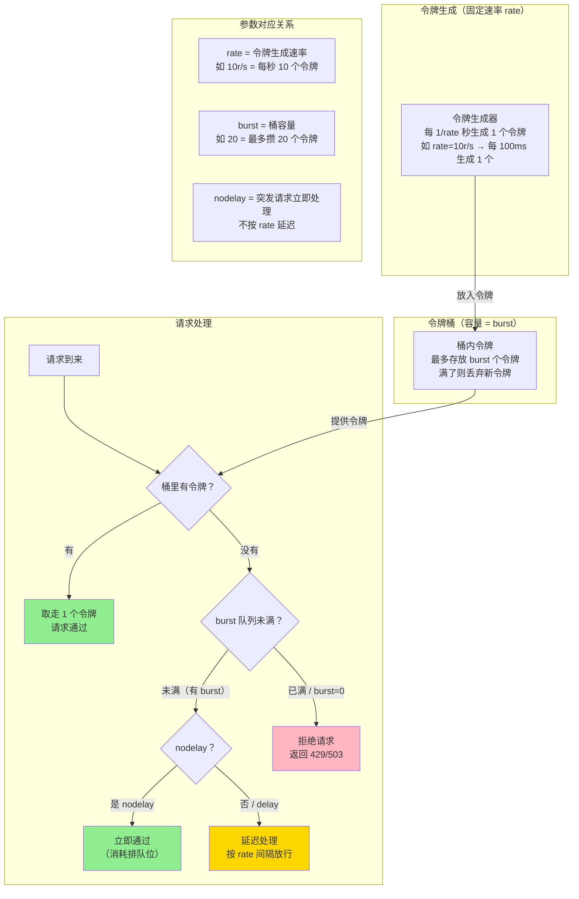
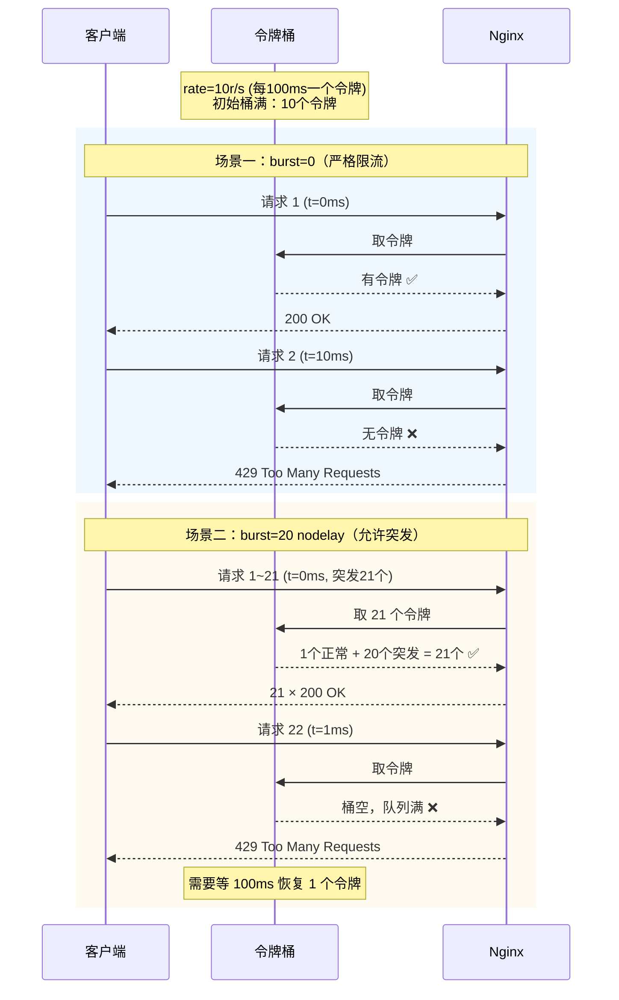

# 17 - 限流防护

> **版本基线**：Nginx 1.30.4 (stable) | 创建日期：2026-08-05
> **受众**：后端开发熟手（熟悉 Python/Java/Lua），但服务器运维是小白。本篇把 Nginx 的限流机制从原理到实战一次讲透。

---

## 目录

- [1. 学习目标](#1-学习目标)
- [2. 核心知识点](#2-核心知识点)
  - [2.1 知识点一：限流的基本概念](#21-知识点一限流的基本概念)
  - [2.2 知识点二：limit_req_zone（请求速率限流）](#22-知识点二limit_req_zone请求速率限流)
  - [2.3 知识点三：limit_req（应用限流）](#23-知识点三limit_req应用限流)
  - [2.4 知识点四：limit_conn_zone（并发连接限流）](#24-知识点四limit_conn_zone并发连接限流)
  - [2.5 知识点五：limit_rate（带宽限流）](#25-知识点五limit_rate带宽限流)
  - [2.6 知识点六：多维度限流组合](#26-知识点六多维度限流组合)
  - [2.7 知识点七：限流的状态码和日志](#27-知识点七限流的状态码和日志)
  - [2.8 知识点八：白名单和豁免](#28-知识点八白名单和豁免)
  - [2.9 知识点九：实战场景](#29-知识点九实战场景)
- [3. Mermaid 图：令牌桶算法原理图](#3-mermaid-图令牌桶算法原理图)
- [4. 最佳实践](#4-最佳实践)
- [5. 常见踩坑引用](#5-常见踩坑引用)
- [6. 小结](#6-小结)

---

## 1. 学习目标

学完本篇，你应当能够：

- 理解**限流的必要性**和两种限流维度（请求速率、并发连接数），能用通俗语言解释令牌桶算法。
- 掌握 `limit_req_zone` 定义限流区域的语法，理解 `$key` 的选择（IP、server_name 等）和 `zone`、`rate` 参数的含义。
- 掌握 `limit_req` 应用限流的用法，彻底搞懂 `burst`（突发桶）、`nodelay`、`delay` 三个参数的组合行为。
- 掌握 `limit_conn_zone` 和 `limit_conn` 限制并发连接数的用法。
- 掌握 `limit_rate` 和 `limit_rate_after` 限制带宽的用法。
- 能组合多维度限流（IP 速率 + IP 并发 + 全局连接）形成立体防护。
- 掌握 `limit_req_status`、`limit_conn_status`、`limit_req_log_level` 自定义限流响应和日志级别。
- 能用 `geo` + `map` 实现白名单豁免特定 IP 的限流。
- 能根据实际场景（API 限流、防暴力破解、下载限速）编写完整限流配置。
- 避开踩坑 `#2.2`（连接数计算）。

> **前置知识**：建议先完成 [04-配置文件结构与指令体系](../02-配置基础/04-配置文件结构与指令体系.md) 和 [16-访问控制与认证](./16-访问控制与认证.md)。

---

## 2. 核心知识点

### 2.1 知识点一：限流的基本概念

#### 为什么需要限流

在后端开发中，你一定遇到过这些场景：

- 某个接口被恶意刷请求，数据库连接池被打满，整个服务雪崩。
- 爬虫以极高频率抓取数据，正常用户请求被排队阻塞。
- 大文件下载占用全部带宽，其他用户访问卡顿。
- 某个用户开了 100 个并发连接，其他用户连不上。

**限流的核心目的**：在流量超过系统承受能力时，主动丢弃或排队多余的请求，保护后端服务不被打垮。这是一种"牺牲部分请求来保全整体可用性"的取舍。

> **类比**：限流就像地铁早高峰的限流栏杆——不是为了阻止所有人进站，而是控制进站速度，避免站台拥挤踩踏。有人被拦在外面等待，但站台内的乘客能安全上车。

#### 两种限流维度

| 维度 | 关注点 | Nginx 指令 | 类比 |
|------|--------|------------|------|
| **请求速率（QPS）** | 单位时间内允许多少个请求 | `limit_req` | 地铁每分钟放行多少人 |
| **并发连接数** | 同时允许多少个活跃连接 | `limit_conn` | 地铁站内最多容纳多少人 |

此外还有**带宽限流**（`limit_rate`），限制每个连接的传输速率，不属于上述两个维度，而是控制数据传输速度。

#### 令牌桶算法原理

Nginx 的 `limit_req` 模块基于**漏桶算法**（Leaky Bucket）的变体实现，通常被通俗地理解为"令牌桶"。用最简单的话来解释：

**想象一个水桶**：

1. **桶里放令牌**：系统以固定速率往桶里放令牌（比如每秒放 10 个）。
2. **令牌有上限**：桶的容量有限，满了就不再放（令牌溢出丢弃）。
3. **请求要令牌**：每个请求来了一手交一个令牌一手过去。
4. **有令牌就过**：桶里有令牌 → 拿走一个，请求通过。
5. **没令牌等或拒**：桶里没令牌了 → 请求被拒绝（或排队等待）。

```
     令牌生成（固定速率，如 10 个/秒）
           │
           ▼
    ┌──────────────┐
    │   令牌桶     │  ← 容量 = burst（桶最多放多少令牌）
    │  ● ● ● ● ●   │
    │  ● ● ●       │
    └──────┬───────┘
           │ 取令牌
           ▼
      请求到来 ──→ 有令牌？──→ 通过
                  │
                  └─ 没有 ──→ 拒绝（或排队等待）
```

**关键参数对应**：

- `rate`：令牌生成速率（每秒生成多少令牌 = 每秒允许多少请求）。
- `burst`：桶的容量（最多能攒多少令牌 = 允许多少个突发请求排队）。
- `nodelay`：有令牌的排队请求立即放行（不延迟），而不是按固定间隔放行。

> **注意**：严格来说，Nginx 的 `limit_req` 实现的是"漏桶"而非标准"令牌桶"。但二者在效果上高度相似，社区和文档中通常混用这两个概念。核心思想都是：以固定速率处理请求，多余的请求排队或丢弃。

---

### 2.2 知识点二：limit_req_zone（请求速率限流）

`limit_req_zone` 来自 `ngx_http_limit_req_module`，用于**定义**一个限流区域。它本身不会触发限流，只是声明"用什么维度、什么速率来限流"。

#### 语法

```nginx
limit_req_zone $key zone=name:size rate=rate;
```

| 参数 | 说明 | 示例 |
|------|------|------|
| `$key` | 限流的维度变量，相同 key 的请求共享同一个限流计数器 | `$binary_remote_addr`（按 IP） |
| `zone=name:size` | 共享内存区名称和大小，用于存储各 key 的限流状态 | `zone=mylimit:10m` |
| `rate=rate` | 每个 key 的请求速率限制 | `rate=10r/s`（每秒 10 个请求） |

#### $key 的选择

`$key` 决定了"按什么维度限流"。相同的 key 值共享同一个限流计数器。

| $key | 限流维度 | 适用场景 |
|------|----------|----------|
| `$binary_remote_addr` | 按客户端 IP | 最常用，防止单 IP 刷接口 |
| `$server_name` | 按虚拟主机 | 限制每个站点的总请求量 |
| `$http_x_api_key` | 按 API Key | 按租户/用户限流 |
| `$request_uri` | 按请求路径 | 限制特定接口的访问频率 |
| `""`（空字符串） | 全局限流 | 限制全局总 QPS |

> **为什么用 `$binary_remote_addr` 而非 `$remote_addr`？**
> `$remote_addr` 是字符串形式的 IP（如 `192.168.1.100`，最长 15 字节）；`$binary_remote_addr` 是二进制形式（IPv4 固定 4 字节，IPv6 固定 16 字节）。使用二进制形式可以大幅减少共享内存的占用——10MB 内存约可存储 16 万个 IPv4 状态（4 字节/个），而用字符串形式只能存约 6 万个。

#### zone 参数

`zone=name:size` 定义共享内存区的名称和大小。Nginx 的多个 worker 进程通过这块共享内存同步限流状态。

- **name**：区域名称，在 `limit_req` 中引用。
- **size**：内存大小，如 `10m`。每个 IP 的状态记录约占用 64 字节（含哈希表开销）。
  - 10m ≈ 16 万个 IPv4 记录
  - 1m ≈ 1.6 万个 IPv4 记录
- 如果共享内存满了，新 IP 的请求会被直接拒绝（返回 503）。

#### rate 参数

`rate` 定义每个 key 的请求速率：

- `rate=10r/s`：每秒 10 个请求（即每 100ms 一个令牌）。
- `rate=60r/m`：每分钟 60 个请求（即每秒 1 个令牌）。

> **注意**：`rate` 的最小粒度是毫秒级。`10r/s` 意味着两个请求之间至少间隔 100ms，而不是"1 秒内收到 10 个请求就全部通过"。如果在 100ms 内来了 10 个请求，只有第 1 个立即通过，其余 9 个要么排队（有 burst）要么被拒绝（无 burst）。

#### 代码示例

```nginx
http {
    # 定义限流区域：按客户端 IP 限流，每秒 10 个请求
    limit_req_zone $binary_remote_addr zone=api_limit:10m rate=10r/s;
    # $binary_remote_addr: 用客户端 IP 的二进制形式作为限流 key
    # zone=api_limit:10m: 共享内存区名为 api_limit，大小 10MB
    # rate=10r/s: 每个 IP 每秒最多 10 个请求
    
    # 定义限流区域：按 API Key 限流，每分钟 100 个请求
    limit_req_zone $http_x_api_key zone=apikey_limit:5m rate=100r/m;
    # $http_x_api_key: 用请求头 X-API-Key 的值作为限流 key
    # zone=apikey_limit:5m: 共享内存区 5MB
    # rate=100r/m: 每个 API Key 每分钟最多 100 个请求
    
    # 定义限流区域：全局限流，每秒 1000 个请求
    limit_req_zone $server_name zone=global_limit:10m rate=1000r/s;
    # $server_name: 按虚拟主机名限流（单 server 内所有请求共享计数器）
    # zone=global_limit:10m: 共享内存区 10MB
    # rate=1000r/s: 每秒最多 1000 个请求
    
    server {
        # 在 location 中用 limit_req 应用限流（见下一个知识点）
        location /api/ {
            limit_req zone=api_limit;  # 应用上面定义的 api_limit 区域
            proxy_pass http://backend;
        }
    }
}
```

#### 特例说明

1. **必须在 http 上下文中定义**：`limit_req_zone` 只能出现在 `http` 块中，不能在 server 或 location 中定义。
2. **共享内存满了的后果**：如果新 IP 的状态记录无法写入共享内存（内存已满），Nginx 会返回 503 给该 IP。应根据预估的独立 IP 数量合理设置 zone 大小。
3. **key 为空时的行为**：如果 `$key` 变量的值为空字符串（如 `$http_x_api_key` 不存在时），该请求**不会被限流**（Nginx 跳过该请求的限流检查）。需要用 `map` 处理空值。

---

### 2.3 知识点三：limit_req（应用限流）

`limit_req` 用于在 `http`、`server` 或 `location` 上下文中**应用** `limit_req_zone` 定义的限流规则。

#### 语法

```nginx
limit_req zone=name [burst=number] [nodelay | delay=number];
```

| 参数 | 说明 |
|------|------|
| `zone=name` | 引用的限流区域名称（必须） |
| `burst=number` | 突发桶大小，允许排队的请求数（默认 0） |
| `nodelay` | 排队请求立即处理，不延迟（令牌够就立即放行） |
| `delay=number` | 前 number 个请求立即处理，之后的排队请求延迟处理 |

#### burst 参数详解

`burst` 是限流配置中最容易混淆的参数。它定义了**突发缓冲区的大小**——当请求速率超过 `rate` 时，允许多少个请求排队等待。

- **没有 burst（burst=0）**：超过 rate 的请求立即被拒绝，严格按 rate 放行。
- **有 burst 无 nodelay**：超出的请求进入排队，按 rate 间隔延迟处理。队列满后拒绝。
- **有 burst 有 nodelay**：超出的请求进入排队但立即处理（不延迟）。队列满后拒绝。

#### nodelay 和 delay 参数

- **nodelay**：排队中的请求不等待，有令牌就立即放行。效果上允许短时间内 burst 个请求"突发通过"，之后恢复 rate 速率。
- **delay=n**：前 n 个排队请求立即放行，第 n+1 个开始按 rate 延迟处理。这是 nodelay 的精细化版本（1.15.7+）。

#### burst 和 nodelay/delay 的组合行为对比

| 配置 | 行为 | 适用场景 |
|------|------|----------|
| `burst=0`（默认） | 严格限流：超过 rate 的请求立即拒绝 | 最严格，不允任何突发 |
| `burst=10`（无 nodelay） | 超出的请求排队，按 rate 延迟处理 | 平滑限流，但请求会被延迟 |
| `burst=10 nodelay` | 超出的请求立即处理，不延迟 | 允许突发，用户体验好 |
| `burst=10 delay=5` | 前 5 个立即处理，后续 5 个延迟处理 | 折中方案：部分突发+部分延迟 |

**时序图示例**（rate=10r/s，即每 100ms 一个令牌）：

```
场景：100ms 内来了 15 个请求

burst=0:          [通过1] [拒绝×14]
                  → 严格拒绝超出的请求

burst=10 无nodelay: [通过1] [排队×10，每100ms放行1个] [拒绝×4]
                  → 排队的请求被延迟处理，11 个请求分布在 1.1 秒内完成

burst=10 nodelay:  [通过1] [立即通过×10] [拒绝×4]
                  → 11 个请求在 100ms 内全部通过，之后 1 秒内不允许新请求（桶空了）
```

#### 代码示例

```nginx
http {
    # 定义限流区域
    limit_req_zone $binary_remote_addr zone=api_limit:10m rate=10r/s;
    
    server {
        location /api/ {
            # 配置一：严格限流，不允许突发
            limit_req zone=api_limit;
            # burst 默认为 0：每秒只允许 10 个请求
            # 第 11 个请求立即返回 503
            # 适合：必须严格控制 QPS 的场景
            
            proxy_pass http://backend;
        }
        
        location /api/v2/ {
            # 配置二：允许突发，但排队延迟
            limit_req zone=api_limit burst=20;
            # burst=20：允许 20 个请求排队
            # 排队的请求按 rate（每 100ms 一个）延迟处理
            # 第 21 个请求被拒绝
            # 适合：可以容忍延迟，但不允许突发的场景
            
            proxy_pass http://backend;
        }
        
        location /api/v3/ {
            # 配置三：允许突发，立即处理（最常用）
            limit_req zone=api_limit burst=20 nodelay;
            # burst=20 nodelay：允许 20 个请求立即通过（不延迟）
            # 之后恢复 rate（10r/s）
            # 第 21 个请求被拒绝
            # 适合：允许短暂突发，用户体验好的场景
            
            proxy_pass http://backend;
        }
        
        location /api/v4/ {
            # 配置四：折中方案，部分突发+部分延迟
            limit_req zone=api_limit burst=20 delay=5;
            # burst=20 delay=5：
            #   前 5 个请求立即通过（突发）
            #   第 6~20 个请求按 rate 延迟处理（排队）
            #   第 21 个请求被拒绝
            # 适合：允许少量突发，大量请求平滑限流
            
            proxy_pass http://backend;
        }
    }
}
```

#### 逐行说明

```nginx
# 配置：每 IP 每秒 10 个请求，允许 20 个突发，立即处理
limit_req_zone $binary_remote_addr zone=api_limit:10m rate=10r/s;
# 1. 定义限流区域：
#    - key = $binary_remote_addr（按客户端 IP）
#    - zone 名为 api_limit，共享内存 10MB
#    - rate = 10r/s（每秒 10 个请求 = 每 100ms 生成一个令牌）

location /api/ {
    limit_req zone=api_limit burst=20 nodelay;
    # 2. 应用限流：
    #    - zone=api_limit：引用上面定义的区域
    #    - burst=20：桶容量 20，允许 20 个请求排队
    #    - nodelay：排队请求立即处理，不延迟
    
    # 实际行为：
    # - 桶里有令牌时，请求立即通过
    # - 桶里没令牌但队列未满时，请求排队（nodelay 下立即处理）
    # - 队列已满（超过 burst+1 个请求）时，返回 503
    
    proxy_pass http://backend;
}
```

#### 特例说明：burst=0 nodelay vs burst=10 nodelay

```nginx
# 严格限流（burst=0，无突发容忍）
limit_req zone=mylimit;           # 等价于 burst=0
# rate=10r/s 时：
# - 每 100ms 只放行 1 个请求
# - 100ms 内第 2 个请求 → 503
# - 不允许任何突发，最严格

# 允许突发（burst=10 nodelay）
limit_req zone=mylimit burst=10 nodelay;
# rate=10r/s 时：
# - 突然来 11 个请求 → 全部通过（1 个正常 + 10 个突发）
# - 之后 1 秒内的新请求 → 503（桶空了，需要等令牌恢复）
# - 适合大部分实际场景：允许短暂突发，长期平均不超 rate
```

> **选择建议**：生产环境推荐 `burst=n nodelay`（n 根据业务设为 5~50）。纯 `burst=0` 太严格会导致正常用户偶发 503；`burst=n` 不加 `nodelay` 会导致请求被延迟，用户体验差。

---

### 2.4 知识点四：limit_conn_zone（并发连接限流）

`limit_conn_zone` 和 `limit_conn` 来自 `ngx_http_limit_conn_module`，用于限制**并发连接数**。与 `limit_req` 限制请求速率不同，`limit_conn` 限制的是"同一时刻有多少个活跃连接"。

#### 语法

```nginx
# 定义并发连接限流区域
limit_conn_zone $key zone=name:size;

# 应用并发连接限制
limit_conn zone_name number;
```

| 参数 | 说明 |
|------|------|
| `$key` | 限流维度（通常用 `$binary_remote_addr` 按 IP） |
| `zone=name:size` | 共享内存区名称和大小 |
| `number` | 每个 key 允许的最大并发连接数 |

#### 代码示例

```nginx
http {
    # 定义并发连接限流区域：按客户端 IP 限制
    limit_conn_zone $binary_remote_addr zone=conn_limit:10m;
    # $binary_remote_addr: 按客户端 IP 维度统计并发连接
    # zone=conn_limit:10m: 共享内存区 10MB
    
    server {
        location /download/ {
            # 每个 IP 最多 3 个并发连接
            limit_conn conn_limit 3;
            # conn_limit: 引用上面定义的区域
            # 3: 每个 IP 同时最多 3 个活跃连接
            # 第 4 个连接 → 503
            
            root /data/downloads;
        }
        
        location /api/ {
            # 每个 IP 最多 10 个并发连接
            limit_conn conn_limit 10;
            proxy_pass http://backend;
        }
    }
}
```

```nginx
# 限制全局总连接数
http {
    # 用空字符串作为 key，所有请求共享一个计数器
    limit_conn_zone $server_name zone=total_conn:10m;
    
    server {
        location / {
            limit_conn total_conn 1000;
            # 全站最多 1000 个并发连接
            # 超过 → 503
            proxy_pass http://backend;
        }
    }
}
```

#### 逐行说明

```nginx
# 1. 定义并发连接限流区域
limit_conn_zone $binary_remote_addr zone=conn_limit:10m;
# $binary_remote_addr: 用客户端 IP 作为统计维度
# zone=conn_limit:10m: 共享内存区名为 conn_limit，大小 10MB
# 注意：limit_conn_zone 不需要 rate 参数（连接数限制不涉及速率）

location /download/ {
    limit_conn conn_limit 3;
    # conn_limit: 引用上面定义的区域名
    # 3: 每个 IP 最多同时保持 3 个连接
    # 当某 IP 已有 3 个活跃连接时，第 4 个连接被拒绝（返回 503）
    # 连接关闭后计数减少，新连接可以建立
    
    root /data/downloads;
}
```

#### 特例说明

1. **连接计数基于请求**：只有正在被 Nginx 处理的请求才会计数。请求完成后（响应发送完毕）连接计数减少。如果客户端发起 keepalive 长连接但中间没有活跃请求，该连接**不计数**。
2. **key 为空不限流**：与 `limit_req` 类似，如果 `$key` 为空字符串，该请求不会被计数和限制。
3. **与 limit_req 的区别**：`limit_req` 关注的是"单位时间内来了多少请求"（速率）；`limit_conn` 关注的是"同一时刻有多少个请求正在处理"（并发）。一个速率高但每个请求很快完成的场景，用 `limit_req` 更合适；一个单请求耗时长（如大文件下载）的场景，用 `limit_conn` 更合适。

#### 适用场景

- **限制单 IP 并发连接**：防止单个用户开太多连接占用资源。
- **限制下载并发**：防止用户用多线程下载工具开 100 个连接。
- **限制全局连接数**：保护后端不因连接数过多而崩溃。

> **关联踩坑**：并发连接数的计算与 `worker_connections` 密切相关，详见 [踩坑 #2.2 worker_connections 与最大连接数计算错误](../99-踩坑记录与解决方案.md#22-worker_connections-与最大连接数计算错误)。反向代理场景每个客户端会占用两条连接（客户端→Nginx、Nginx→后端），实际并发连接数需要除以 2 来估算。

---

### 2.5 知识点五：limit_rate（带宽限流）

`limit_rate` 用于限制**每个连接的响应传输速率**（带宽限流）。它不影响请求到达 Nginx 的速率，而是控制 Nginx 向客户端发送响应数据的速度。

#### 指令说明

| 指令 | 作用 |
|------|------|
| `limit_rate rate;` | 限制每个连接的响应速率（字节/秒），0 表示不限速 |
| `limit_rate_after size;` | 前多少字节不限速，之后才开始限速 |

#### 代码示例

```nginx
http {
    server {
        # 全局限速：每个连接 100KB/s
        limit_rate 100k;
        # 100k: 每秒最多发送 100KB 响应数据
        # 对所有 location 生效
        
        location /download/ {
            # 下载限速：前 1MB 不限速，之后限 100KB/s
            limit_rate_after 1m;
            # 1m: 响应的前 1MB 数据不限速（全速发送）
            # 让小文件快速下载完成，大文件才限速
            
            limit_rate 100k;
            # 100k: 超过 1MB 后，限速为 100KB/s
            
            root /data/downloads;
        }
        
        location /video/ {
            # 视频流不限速
            limit_rate 0;
            # 0: 关闭限速（覆盖 server 级配置）
            root /data/videos;
        }
        
        location /api/ {
            # API 不限速（API 响应通常很小，无需限速）
            limit_rate 0;
            proxy_pass http://backend;
        }
    }
}
```

#### 逐行说明

```nginx
location /download/ {
    limit_rate_after 1m;
    # limit_rate_after: 设置不限速的字节数阈值
    # 1m = 1MB: 前 1MB 全速传输
    # 场景：让用户快速开始下载（前几秒体验好），大文件才限速
    
    limit_rate 100k;
    # limit_rate: 设置限速值
    # 100k = 100KB/s: 超过 1MB 后，每秒最多发送 100KB
    # 一个 10MB 文件：
    #   前 1MB 全速传输（可能不到 1 秒）
    #   后 9MB 以 100KB/s 传输（约 90 秒）
    # 总时间约 91 秒
    
    root /data/downloads;
}
```

#### 特例说明

1. **按连接限速**：`limit_rate` 限制的是**单个连接**的速率。如果用户开了 3 个连接下载同一个文件，总带宽是 `3 × 100KB/s = 300KB/s`。需要配合 `limit_conn` 限制并发连接数才能精确控制总带宽。
2. **`$limit_rate` 变量**：可以通过变量动态设置限速值：
   ```nginx
   # 根据请求参数动态设置限速
   # /download/file.zip?speed=200k → 限速 200KB/s
   # /download/file.zip?speed=0    → 不限速
   set $limit_rate $arg_speed;
   ```
   > 注意：`$limit_rate` 是特殊变量，赋值后 Nginx 会自动使用该值作为当前连接的限速。如果值为 0 或空则不限速。
3. **仅对响应体限速**：`limit_rate` 只影响响应体的传输速率，不影响请求的接收速率和响应头的发送。
4. **proxy 场景**：在反向代理场景中，`limit_rate` 限制的是 Nginx → 客户端方向的速率。Nginx 会以全速从后端接收响应（到 buffer），然后以限速发送给客户端。

#### 适用场景

- **大文件下载限速**：防止少数用户的大文件下载占用全部带宽。
- **视频流平滑传输**：控制视频传输速率，避免缓冲过多数据。
- **公平带宽分配**：让所有用户获得相对均匀的带宽。

---

### 2.6 知识点六：多维度限流组合

生产环境中，单一维度的限流往往不够。通常需要同时限制 IP 请求速率、IP 并发连接数和全局连接数，形成立体防护。

#### 代码示例

```nginx
http {
    # ========== 限流区域定义 ==========
    
    # 1. 按 IP 限制请求速率：每秒 10 个请求
    limit_req_zone $binary_remote_addr zone=req_limit:10m rate=10r/s;
    
    # 2. 按 IP 限制并发连接数：每个 IP 最多 20 个并发连接
    limit_conn_zone $binary_remote_addr zone=ip_conn_limit:10m;
    
    # 3. 全局总并发连接数限制：全站最多 1000 个并发连接
    limit_conn_zone $server_name zone=global_conn_limit:10m;
    
    server {
        location /api/ {
            # === 同时应用三个维度的限流 ===
            
            limit_req zone=req_limit burst=20 nodelay;
            # 维度一：请求速率限流
            # 每个 IP 每秒最多 10 个请求，允许 20 个突发
            # 超过 → 503
            
            limit_conn ip_conn_limit 20;
            # 维度二：单 IP 并发连接限制
            # 每个 IP 最多 20 个同时活跃连接
            # 超过 → 503
            
            limit_conn global_conn_limit 1000;
            # 维度三：全局并发连接限制
            # 全站最多 1000 个同时活跃连接
            # 超过 → 503
            
            proxy_pass http://backend;
        }
    }
}
```

#### 逐行说明

```nginx
# ===== 限流区域定义（http 块中） =====

# 维度一：请求速率
limit_req_zone $binary_remote_addr zone=req_limit:10m rate=10r/s;
# 按 IP 限流，每秒 10 个请求，共享内存 10MB

# 维度二：单 IP 并发连接
limit_conn_zone $binary_remote_addr zone=ip_conn_limit:10m;
# 按 IP 统计并发连接数，共享内存 10MB

# 维度三：全局并发连接
limit_conn_zone $server_name zone=global_conn_limit:10m;
# 用 $server_name 作为 key（同一 server 内所有请求共享一个计数器）
# 效果等同于限制单站点的总连接数

# ===== 限流应用（location 块中） =====
location /api/ {
    # 三个限流规则同时生效，任何一个触发都会返回 503
    # 1. 请求速率：每 IP 每秒 10 个 + 突发 20（立即处理）
    limit_req zone=req_limit burst=20 nodelay;
    
    # 2. 单 IP 并发：每 IP 最多 20 个活跃连接
    limit_conn ip_conn_limit 20;
    
    # 3. 全局并发：全站最多 1000 个活跃连接
    limit_conn global_conn_limit 1000;
    
    # 效果：
    # - 正常用户：速率 < 10r/s，并发 < 20 → 全部通过
    # - 轻度刷接口：速率 > 10r/s 但突发 < 20 → 短暂通过后开始 503
    # - 恶意攻击：高并发高频率 → 三个维度都会触发，迅速 503
    # - 全站保护：即使单个 IP 没超限，全站总连接达 1000 → 新连接 503
    
    proxy_pass http://backend;
}
```

#### 特例说明

1. **多规则同时检查**：Nginx 会同时检查所有 `limit_req` 和 `limit_conn` 规则。任何一个触发都会拒绝请求，不需要等所有规则都触发。
2. **`limit_conn` 可叠加**：同一个 location 中可以写多个 `limit_conn`，分别引用不同的 zone（如同时限制单 IP 并发和全局并发）。
3. **限流顺序**：`limit_req` 在请求处理早期阶段（preaccess 阶段）检查，`limit_conn` 在 access 阶段检查。如果 `limit_req` 拒绝了请求，`limit_conn` 不会再检查。

---

### 2.7 知识点七：限流的状态码和日志

默认情况下，限流触发时 Nginx 返回 **503 Service Unavailable**。可以通过指令自定义返回的状态码和日志级别。

#### 指令说明

| 指令 | 默认值 | 说明 |
|------|--------|------|
| `limit_req_status code;` | 503 | 请求速率限流触发时返回的状态码 |
| `limit_conn_status code;` | 503 | 并发连接限流触发时返回的状态码 |
| `limit_req_log_level info \| notice \| warn \| error;` | error | 请求速率限流触发的日志级别 |
| `limit_conn_log_level info \| notice \| warn \| error;` | error | 并发连接限流触发的日志级别 |

#### 代码示例

```nginx
http {
    limit_req_zone $binary_remote_addr zone=api_limit:10m rate=10r/s;
    limit_conn_zone $binary_remote_addr zone=conn_limit:10m;
    
    # 自定义限流状态码
    limit_req_status 429;    # 请求速率限流 → 返回 429 Too Many Requests
    # 429 是 HTTP/1.1 (RFC 6585) 定义的标准限流状态码
    # 比 503 更语义化：503 表示"服务不可用"，429 表示"请求太多"
    
    limit_conn_status 429;   # 并发连接限流 → 返回 429
    
    # 自定义限流日志级别
    limit_req_log_level warn;   # 请求速率限流日志级别设为 warn
    # 默认是 error，设为 warn 可以在 error.log 中更容易看到限流事件
    # 但不要设为 info，否则日志量太大
    
    limit_conn_log_level warn;  # 并发连接限流日志级别设为 warn
    
    server {
        location /api/ {
            limit_req zone=api_limit burst=20 nodelay;
            limit_conn conn_limit 20;
            proxy_pass http://backend;
        }
    }
}
```

#### 日志示例

```bash
# 限流触发时，Nginx error.log 中的日志（默认 error 级别）
2026/08/05 10:23:45 [error] 12345#0: *6789 limiting requests, excess: 20.000 by zone "api_limit", client: 203.0.113.66, server: example.com, request: "GET /api/users HTTP/1.1", host: "example.com"

# 设为 warn 级别后
2026/08/05 10:23:45 [warn] 12345#0: *6789 limiting requests, excess: 20.000 by zone "api_limit", client: 203.0.113.66, server: example.com, request: "GET /api/users HTTP/1.1", host: "example.com"

# 并发连接限流日志
2026/08/05 10:23:46 [warn] 12345#0: *6790 limiting connections by zone "conn_limit", client: 203.0.113.66, server: example.com, request: "GET /api/download HTTP/1.1", host: "example.com"
```

#### 特例说明

1. **429 vs 503**：`429 Too Many Requests` 是 RFC 6585 定义的标准限流状态码，语义更准确。`503 Service Unavailable` 暗示服务端故障而非客户端请求过多。生产环境推荐使用 429。
2. **Retry-After 头**：可以配合 `add_header` 添加 `Retry-After` 头，告诉客户端多久后重试：
   ```nginx
   limit_req_status 429;
   # 需要在触发 429 的 location 中添加（注意 add_header 继承规则）
   add_header Retry-After "60" always;
   ```
3. **日志级别选择**：
   - `error`（默认）：限流事件被视为错误，与 503 语义一致。
   - `warn`：限流事件被视为警告，更适合频繁限流的场景（避免 error 日志过多）。
   - `info`：限流事件被视为信息，日志量可能很大，不推荐。
4. **access_log 中的记录**：被限流拒绝的请求也会记录在 access.log 中，状态码为 429 或 503（取决于配置）。

---

### 2.8 知识点八：白名单和豁免

生产环境中，通常需要对特定 IP（如内部监控、健康检查、合作伙伴 API）豁免限流。Nginx 通过 `geo` + `map` 组合实现白名单豁免。

#### 原理

1. 用 `geo` 模块定义哪些 IP 是白名单（值为 0）。
2. 用 `map` 把白名单标记转换为限流 key：白名单 IP 的 key 设为空字符串（不限流），非白名单 IP 的 key 设为 `$binary_remote_addr`（正常限流）。
3. `limit_req_zone` 使用 map 后的变量作为 key。

#### 代码示例

```nginx
http {
    # ========== 第一步：用 geo 定义白名单 ==========
    geo $limit {
        default 1;           # 默认值为 1（需要限流）
        10.0.0.0/8 0;        # 内网 10.x.x.x → 0（白名单，不限流）
        192.168.0.0/16 0;    # 内网 192.168.x.x → 0（白名单）
        172.16.0.0/12 0;     # 内网 172.16~31.x.x → 0（白名单）
        127.0.0.1 0;         # 本机回环 → 0（白名单）
    }
    # geo 模块：根据客户端 IP 返回不同的值
    # $limit 变量：白名单 IP 为 0，其他 IP 为 1
    
    # ========== 第二步：用 map 转换为限流 key ==========
    map $limit $limit_key {
        0 "";                    # 白名单（$limit=0）→ key 为空字符串 → 不限流
        1 $binary_remote_addr;   # 非白名单（$limit=1）→ key 为客户端 IP → 正常限流
    }
    # map 模块：把 $limit 的值映射为 $limit_key
    # 当 $limit_key 为空字符串时，limit_req_zone 不对该请求限流
    
    # ========== 第三步：用转换后的 key 定义限流区域 ==========
    limit_req_zone $limit_key zone=api_limit:10m rate=10r/s;
    # $limit_key: 白名单 IP → ""（空）→ 不限流
    #             非白名单 IP → IP 地址 → 按 IP 限流
    
    server {
        location /api/ {
            limit_req zone=api_limit burst=20 nodelay;
            # 白名单 IP 的请求不受限流影响
            # 非白名单 IP 按 10r/s + burst=20 限流
            proxy_pass http://backend;
        }
    }
}
```

#### 逐行说明

```nginx
# === geo 模块：IP 白名单标记 ===
geo $limit {
    default 1;           # 所有未列出的 IP → $limit = 1（需要限流）
    10.0.0.0/8 0;        # 10.0.0.0/8 网段 → $limit = 0（白名单）
    192.168.0.0/16 0;    # 192.168.0.0/16 网段 → $limit = 0（白名单）
    172.16.0.0/12 0;     # 172.16.0.0/12 网段 → $limit = 0（白名单）
    127.0.0.1 0;         # 本机 → $limit = 0（白名单）
}
# geo 指令根据 $remote_addr（客户端 IP）匹配规则，返回对应的值给 $limit
# 这是"打标记"的过程：白名单打 0，非白名单打 1

# === map 模块：标记转 key ===
map $limit $limit_key {
    0 "";                    # 如果 $limit = 0（白名单）→ $limit_key = ""（空字符串）
    1 $binary_remote_addr;   # 如果 $limit = 1（非白名单）→ $limit_key = 客户端 IP
}
# map 指令把 $limit 的值映射为 $limit_key 的新值
# 关键：空字符串作为 limit_req_zone 的 key 时，Nginx 跳过限流检查

# === 限流区域定义 ===
limit_req_zone $limit_key zone=api_limit:10m rate=10r/s;
# 白名单 IP：$limit_key = "" → 不参与限流
# 非白名单 IP：$limit_key = "192.168.1.100" → 按 IP 限流，10r/s

# === 应用限流 ===
location /api/ {
    limit_req zone=api_limit burst=20 nodelay;
    # 内网 IP（10.x/192.168.x/172.16-31.x/127.0.0.1）→ 不限流
    # 外网 IP → 每秒 10 个请求 + 突发 20
    proxy_pass http://backend;
}
```

#### 特例说明

1. **`geo` 的匹配规则**：与 `allow/deny` 类似，`geo` 按**最长前缀匹配**（不是从上到下）。更精确的 CIDR 会优先匹配。
2. **空字符串 key 的行为**：当 `limit_req_zone` 的 `$key` 为空字符串时，Nginx **跳过该请求的限流检查**。这是官方文档明确的行为，也是白名单方案的核心原理。
3. **`map` 的 default**：如果 `map` 中没有匹配项，使用 `default`（如果定义了）或空字符串。建议显式定义所有情况。
4. **多维度白名单**：如果同时有 `limit_req` 和 `limit_conn`，需要分别为它们创建白名单 map：
   ```nginx
   limit_conn_zone $limit_key zone=conn_limit:10m;
   # 同样使用 $limit_key，白名单 IP 的并发连接也不受限制
   ```

---

### 2.9 知识点九：实战场景

#### 场景一：API 限流（每 IP 每秒 10 请求，突发 20）

```nginx
http {
    # 定义限流区域
    limit_req_zone $binary_remote_addr zone=api_limit:10m rate=10r/s;
    
    # 自定义状态码
    limit_req_status 429;
    
    server {
        listen 80;
        server_name api.example.com;
        
        location /api/ {
            limit_req zone=api_limit burst=20 nodelay;
            # rate=10r/s: 每个 IP 每秒 10 个请求
            # burst=20: 允许 20 个突发请求排队
            # nodelay: 突发请求立即处理，不延迟
            
            # 添加 Retry-After 头，提示客户端 60 秒后重试
            add_header Retry-After "60" always;
            
            proxy_pass http://backend;
        }
    }
}
```

**行为分析**：
- 正常用户每秒发 5 个请求 → 全部通过（远低于 10r/s）。
- 用户偶尔突发 25 个请求（1 秒内）→ 前 21 个通过（1 个正常 + 20 个突发），后 4 个返回 429。
- 攻击者每秒发 100 个请求 → 前 21 个通过，后 79 个返回 429。

#### 场景二：登录接口限流（防暴力破解，每 IP 每分钟 5 次）

```nginx
http {
    # 定义登录限流区域：每分钟 5 次请求
    limit_req_zone $binary_remote_addr zone=login_limit:10m rate=5r/m;
    # rate=5r/m: 每个 IP 每分钟 5 次请求
    # 即每 12 秒允许 1 次请求
    
    limit_req_status 429;
    
    server {
        listen 80;
        server_name example.com;
        
        location /api/login {
            limit_req zone=login_limit burst=3 nodelay;
            # rate=5r/m: 每 IP 每分钟 5 次
            # burst=3 nodelay: 允许 3 次突发，立即处理
            # 即 1 分钟内最多 4 次登录尝试（1+3）
            # 第 5 次开始 → 429
            
            # 注意：防暴力破解还需要配合验证码、账号锁定等后端策略
            # Nginx 限流只是第一道防线
            
            proxy_pass http://backend;
        }
        
        # 其他接口不受登录限流影响
        location /api/ {
            proxy_pass http://backend;
        }
    }
}
```

**行为分析**：
- 正常用户登录：输入一次密码就成功了 → 没问题。
- 用户偶尔输错密码：连续尝试 4 次 → 前 4 次通过（1+3 突发），第 5 次 429。
- 暴力破解：每秒发 100 个登录请求 → 前 4 个通过，后 96 个 429。1 分钟内最多 4 次尝试。

> **注意**：`rate=5r/m` 的实际含义是"每 12 秒生成一个令牌"。第一次请求立即通过（桶里有令牌），第二次请求如果在 12 秒内则需要排队（有 burst 才行）。设 `burst=3` 意味着前 4 次请求可以在 12 秒内全部完成，之后每 12 秒才能再试一次。

#### 场景三：下载限速（前 1MB 不限速，之后限 100KB/s）

```nginx
http {
    # 限制并发连接数：每 IP 最多 3 个下载连接
    limit_conn_zone $binary_remote_addr zone=download_conn:10m;
    
    server {
        listen 80;
        server_name download.example.com;
        
        location /download/ {
            # 限制并发连接数
            limit_conn download_conn 3;
            # 每 IP 最多 3 个并发下载连接
            # 防止多线程下载工具开太多连接绕过限速
            
            # 带宽限速
            limit_rate_after 1m;
            # 前 1MB 不限速：让小文件快速下载，大文件开始限速
            # 用户下载 500KB 的文档 → 全速，不受限速影响
            
            limit_rate 100k;
            # 超过 1MB 后限速 100KB/s
            # 10MB 文件：前 1MB 全速（约 1 秒），后 9MB 限速（约 90 秒）
            
            root /data/downloads;
        }
    }
}
```

**行为分析**：
- 下载 500KB 文件 → 全速完成（小于 1MB 阈值）。
- 下载 10MB 文件 → 前 1MB 全速，后 9MB 以 100KB/s 传输，总时间约 91 秒。
- 用户开 3 个连接同时下载 → 每个连接各自限速 100KB/s，总带宽 300KB/s。
- 用户开 4 个连接 → 第 4 个被拒绝（limit_conn 限制为 3）。

#### 完整配置示例：多维度组合限流

```nginx
http {
    # ===== 白名单 =====
    geo $limit {
        default 1;
        10.0.0.0/8 0;        # 内网白名单
        192.168.0.0/16 0;
        127.0.0.1 0;
    }
    map $limit $limit_key {
        0 "";
        1 $binary_remote_addr;
    }
    
    # ===== 限流区域定义 =====
    # 1. API 请求速率限流
    limit_req_zone $limit_key zone=api_req:10m rate=10r/s;
    
    # 2. 登录接口请求速率限流（更严格）
    limit_req_zone $limit_key zone=login_req:10m rate=5r/m;
    
    # 3. 单 IP 并发连接限流
    limit_conn_zone $limit_key zone=ip_conn:10m;
    
    # 4. 全局并发连接限流
    limit_conn_zone $server_name zone=global_conn:10m;
    
    # ===== 限流状态码和日志 =====
    limit_req_status 429;
    limit_conn_status 429;
    limit_req_log_level warn;
    limit_conn_log_level warn;
    
    server {
        listen 443 ssl;
        server_name api.example.com;
        
        # 全局并发连接限制
        limit_conn global_conn 1000;
        
        # 全局限速（兜底）
        limit_rate_after 1m;
        limit_rate 500k;
        
        # API 接口
        location /api/ {
            limit_req zone=api_req burst=20 nodelay;  # 每秒 10 + 突发 20
            limit_conn ip_conn 20;                     # 每人最多 20 并发
            proxy_pass http://backend;
        }
        
        # 登录接口（更严格限流）
        location /api/login {
            limit_req zone=login_req burst=3 nodelay;  # 每分钟 5 + 突发 3
            limit_conn ip_conn 5;                       # 每人最多 5 并发
            proxy_pass http://backend;
        }
        
        # 下载接口（限速 + 限并发）
        location /download/ {
            limit_conn ip_conn 3;                      # 每人最多 3 并发下载
            limit_rate_after 1m;                       # 前 1MB 不限速
            limit_rate 100k;                           # 之后 100KB/s
            root /data/downloads;
        }
        
        # 健康检查（白名单已豁免，无需额外配置）
        location /health {
            proxy_pass http://backend;
        }
    }
}
```

---

## 3. Mermaid 图：令牌桶算法原理图



### 令牌桶工作流程说明

1. **令牌生成**：系统以固定速率（`rate`）持续生成令牌，放入桶中。如 `rate=10r/s` 表示每 100ms 生成一个令牌。
2. **桶容量限制**：桶最多存放 `burst` 个令牌。桶满后新生成的令牌被丢弃（不积累）。
3. **请求到来**：
   - **桶有令牌**：请求取走一个令牌，立即通过。
   - **桶无令牌但有 burst**：
     - `nodelay`：请求立即通过（消耗排队位，不延迟）。相当于"借"了一个令牌。
     - 无 `nodelay`：请求排队等待，按 `rate` 间隔延迟处理。
     - `delay=n`：前 n 个请求立即通过，之后排队延迟。
   - **桶无令牌且队列满（或 burst=0）**：请求被拒绝，返回 429 或 503。

### burst 和 nodelay 组合的直观示例



---

## 4. 最佳实践

### 4.1 限流参数选择

| 参数 | 推荐值 | 理由 |
|------|--------|------|
| `rate` | 根据后端 QPS 承受能力 / 预估用户数计算 | 核心参数，需压测确定 |
| `burst` | rate 的 1~3 倍 | 允许合理突发，不宜过大 |
| `nodelay` | 推荐加 | 用户体验好，突发请求不延迟 |
| `zone size` | 每万 IP 约 1MB | 根据预估独立 IP 数设置 |
| `limit_req_status` | 429 | 语义准确，比 503 更合适 |

### 4.2 分层限流策略

```nginx
http {
    # 第一层：全局保护（防止后端被压垮）
    limit_req_zone $server_name zone=global:10m rate=1000r/s;
    
    # 第二层：单 IP 速率限制（防止单用户刷接口）
    limit_req_zone $binary_remote_addr zone=per_ip:10m rate=10r/s;
    
    # 第三层：敏感接口额外限制（如登录防暴力破解）
    limit_req_zone $binary_remote_addr zone=login:10m rate=5r/m;
    
    server {
        location /api/ {
            limit_req zone=global burst=100 nodelay;     # 全局 1000r/s
            limit_req zone=per_ip burst=20 nodelay;      # 单 IP 10r/s
            proxy_pass http://backend;
        }
        
        location /api/login {
            limit_req zone=global burst=100 nodelay;     # 全局保护
            limit_req zone=per_ip burst=20 nodelay;      # 单 IP 速率
            limit_req zone=login burst=3 nodelay;        # 登录额外限制
            proxy_pass http://backend;
        }
    }
}
```

### 4.3 白名单最佳实践

```nginx
# 内网、监控、CDN 回源 IP 等加入白名单
geo $limit {
    default 1;
    10.0.0.0/8 0;          # 内网
    192.168.0.0/16 0;      # 内网
    127.0.0.1 0;           # 本机
    # CDN 回源 IP（如 Cloudflare）
    # 173.245.48.0/20 0;
    # 103.21.244.0/22 0;
}
```

### 4.4 限流配置清单

```nginx
http {
    # 1. 定义限流区域（http 块）
    limit_req_zone $limit_key zone=api:10m rate=10r/s;
    limit_conn_zone $limit_key zone=conn:10m;
    
    # 2. 设置状态码和日志（http 块）
    limit_req_status 429;
    limit_conn_status 429;
    limit_req_log_level warn;
    limit_conn_log_level warn;
    
    # 3. 在 location 中应用（可叠加多个）
    location /api/ {
        limit_req zone=api burst=20 nodelay;
        limit_conn conn 20;
        add_header Retry-After "60" always;
        proxy_pass http://backend;
    }
}
```

### 4.5 监控限流效果

```bash
# 查看限流日志
tail -f /var/log/nginx/error.log | grep "limiting"

# 统计被限流的请求数
grep "limiting" /var/log/nginx/error.log | wc -l

# 统计被限流的 IP Top 10
grep "limiting" /var/log/nginx/error.log \
    | grep -oP 'client: \K[0-9.]+' \
    | sort | uniq -c | sort -rn | head -10

# 查看 429 响应数
awk '$9 == 429' /var/log/nginx/access.log | wc -l
```

---

## 5. 常见踩坑引用

### #2.2 worker_connections 与最大连接数计算错误

> 在配置 `limit_conn` 限制并发连接数时，需要注意 Nginx 自身的 `worker_connections` 限制。反向代理场景下，每个客户端请求会占用**两条连接**（客户端→Nginx、Nginx→后端），因此理论最大客户端连接数为 `worker_processes * worker_connections / 4`（保守估计）。

**影响**：如果 `limit_conn` 设置的全局连接数上限超过了 Nginx 自身的连接数承受能力，限流形同虚设——Nginx 自己会先因为连接数耗尽而拒绝服务。

**解决方案**：

```nginx
# 确保 worker_connections 足够大
events {
    worker_connections 65535;  # 单 worker 最大连接数
}

# 同时提升系统文件描述符上限
# worker_rlimit_nofile 65535;

# limit_conn 的全局上限不应超过 Nginx 最大连接数的合理比例
# 如 4 worker × 65535 = 262140 总连接
# 反向代理场景有效客户端连接约 262140 / 4 ≈ 65535
# limit_conn global 50000;  # 留有余量
```

> 详见：[踩坑 #2.2 worker_connections 与最大连接数计算错误](../99-踩坑记录与解决方案.md#22-worker_connections-与最大连接数计算错误)

---

## 6. 小结

本篇系统讲解了 Nginx 的限流防护机制，覆盖了从原理到实战的九个知识点：

1. **限流基本概念**：理解令牌桶算法——以固定速率生成令牌，请求需要消耗令牌，无令牌则排队或拒绝。
2. **limit_req_zone**：定义限流区域，选择 `$key`（IP/API Key/server_name），设置 `zone`（共享内存大小）和 `rate`（请求速率）。
3. **limit_req**：应用限流，核心参数 `burst`（突发桶大小）和 `nodelay`/`delay`（排队策略）。生产推荐 `burst=n nodelay`。
4. **limit_conn_zone / limit_conn**：限制并发连接数，适合大文件下载等长连接场景。
5. **limit_rate / limit_rate_after**：带宽限流，前 N 字节不限速，之后限速。注意按连接限速，需配合 `limit_conn` 控制总带宽。
6. **多维度组合**：同时限制 IP 速率 + IP 并发 + 全局连接，形成立体防护。
7. **状态码和日志**：推荐用 429 替代默认 503，日志级别设为 warn。
8. **白名单豁免**：用 `geo` + `map` 组合，将白名单 IP 的限流 key 设为空字符串，实现豁免。
9. **实战场景**：API 限流、防暴力破解、下载限速的完整配置。

**关键要点**：

- **令牌桶核心**：`rate` 控制平均速率，`burst` 控制突发容忍度，`nodelay` 决定突发请求是否延迟。
- **burst 选择**：`burst=0` 最严格但易误杀正常用户；`burst=n nodelay` 最常用，允许短暂突发。
- **按连接 vs 按请求**：`limit_req` 限制请求速率（短请求场景），`limit_conn` 限制并发连接数（长连接场景），两者互补。
- **白名单是刚需**：生产环境必须为内网、监控、健康检查等配置白名单豁免，否则误杀自己人。
- **429 优于 503**：429 语义更准确，配合 `Retry-After` 头可以引导客户端合理重试。
- **多维度组合**：单一限流维度容易被绕过（如换 IP 绕过 IP 限流），组合速率+并发+全局才能有效防护。

> **上一篇**：[16 - 访问控制与认证](./16-访问控制与认证.md)——在限流之前，先学习如何控制"谁能访问"和"你是谁"。

## 🧪 本机实测（2026-08-09）

> 环境：nginx:1.30.4（Docker），`limit_req_zone $binary_remote_addr zone=reqzone:10m rate=2r/s;`

**① rate=1r/m 连发 3 个请求（无 burst）**：`200 → 503 → 503` ✓（第 1 个通过，其余被限）

**② rate=2r/s burst=4 nodelay，20 并发**：`200×5 + 503×15` ✓（放行数 = 1 即时 + burst 4，与理论精确吻合）

**③ ⚠️ 实测发现的坑：limit_req 与 return 同 location 不生效**
```nginx
location / {
    limit_req zone=reqzone burst=4 nodelay;
    return 200 "ok";   # ← return 在 rewrite 阶段直接响应
}
```
20 并发**全部 200**，限流完全失效。原因：`return` 属于 rewrite 模块，在 **rewrite 阶段**（早于 preaccess）直接生成响应并终止请求处理，`limit_req`（preaccess 阶段）根本没机会执行。**要限流的 location 必须让请求走到 content 阶段（静态文件 / proxy_pass），不能配 `return`。**
