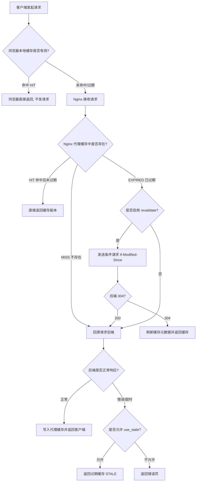
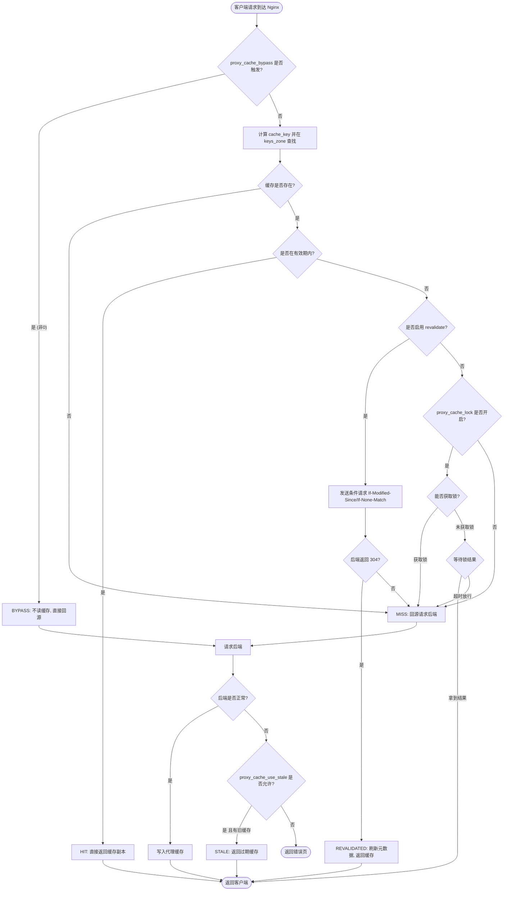

# 18 - 缓存机制

> 版本基线：Nginx 1.30.4 | 受众：后端开发熟手，服务器小白

缓存是 Nginx 作为反向代理时“性价比最高”的性能优化手段之一。配置得当，单台 Nginx 即可扛住数万 QPS 的读请求；配置失当，则可能把后端拖垮、把磁盘写满、把热数据击穿。本篇系统讲解 Nginx 的缓存机制，从三层缓存架构到分片缓存、缓存击穿防护、清理与监控，逐一拆解。

---

## 一、学习目标

学完本篇后，你应当能够：

1. 理解“浏览器缓存 → Nginx 代理缓存 → 后端缓存”的三层缓存架构，并清楚每一层的职责边界。
2. 使用 `proxy_cache_path` 正确声明缓存区，理解 `levels`、`keys_zone`、`max_size`、`inactive`、`use_temp_path` 等参数的含义与取舍。
3. 在 `location` 中通过 `proxy_cache` 启用缓存，并设计合理的 `proxy_cache_key` 与 `proxy_cache_valid` 策略。
4. 掌握 `proxy_cache_use_stale`、`proxy_cache_lock`、`proxy_cache_revalidate` 等高可用与防击穿手段。
5. 使用 `slice` 模块对大文件做分片缓存，使用 `open_file_cache` 对静态文件描述符缓存。
6. 通过 `expires` / `Cache-Control` 控制浏览器缓存，通过 `$upstream_cache_status` 监控命中率。
7. 了解开源版缓存的清理变通方案与商业版 `proxy_cache_purge` 的差异。

---

## 二、核心知识点

### 知识点一：Nginx 缓存概述

#### 1. 三层缓存架构

一次客户端读请求在典型架构中会依次经过三层缓存：

| 层级 | 位置 | 缓存内容 | 失效/刷新控制方 |
|------|------|----------|------------------|
| 第一层 | 浏览器 | 响应体（HTML/JS/图片等） | `Cache-Control` / `Expires` / `ETag` |
| 第二层 | Nginx 代理缓存 | 后端响应的副本（磁盘文件） | `proxy_cache_valid` / `inactive` / `X-Accel-Expires` |
| 第三层 | 后端应用/数据库 | 计算结果、对象、DB 查询结果 | 应用自身（如 Redis、本地缓存） |

- **浏览器缓存**：离用户最近，命中后连网络都不走，但只对“同一个用户、同一台设备”有效。
- **Nginx 代理缓存**：在反向代理层把后端响应落盘，所有经过该 Nginx 的用户共享，是“跨用户”加速的关键。
- **后端缓存**：最贴近业务逻辑，能缓存计算密集型结果，但后端一旦被打满，再快的缓存也救不回来——所以前两层是后端的第一道防线。

#### 2. 代理缓存的价值

- **减少后端压力**：同一资源的重复请求由 Nginx 直接返回，后端 QPS 大幅下降。
- **降低延迟**：磁盘读取（尤其是 SSD / 内存盘）远快于回源到后端 + 应用计算 + DB 查询。
- **提升吞吐**：Nginx 单机可承载的并发连接数远高于大多数应用服务器，缓存命中场景下吞吐量提升一个数量级很常见。
- **提升可用性**：配合 `proxy_cache_use_stale`，即使后端短暂宕机，Nginx 仍可返回过期缓存，保证服务降级而非完全不可用。

#### 3. 缓存请求流程图



> 特例说明：`DYNAMIC` 状态表示该响应未被缓存（如设置了 `proxy_no_cache` 或响应头 `Set-Cookie`），此时 Nginx 透传后端响应但不落盘。

---

### 知识点二：proxy_cache_path 定义缓存区

`proxy_cache_path` 用于在 `http` 上下文声明一个缓存区（缓存目录 + 共享内存元数据区）。一个 Nginx 可声明多个缓存区，分别服务不同业务。

#### 语法

```nginx
proxy_cache_path path [levels=levels] [use_temp_path=on|off]
                 keys_zone=name:size [inactive=time] [max_size=size]
                 [min_free=size] [manager_files=number] [manager_threshold=time]
                 [manager_sleep=time] [loader_files=number] [loader_threshold=time]
                 [loader_sleep=time] [purger=on|off] ...;
```

> 上下文：`http`。**不能**写在 `server` 或 `location` 中。

#### 参数详解

| 参数 | 说明 | 示例 |
|------|------|------|
| `path` | 缓存文件存放的根目录 | `/data/nginx/cache` |
| `levels` | 目录层级，从 MD5 哈希末尾取字符构造子目录，避免单目录文件过多 | `levels=1:2` |
| `keys_zone` | 共享内存区名与大小（存放缓存键等元数据） | `keys_zone=api_cache:10m` |
| `max_size` | 缓存区磁盘最大使用量，超出后 LRU 淘汰 | `max_size=10g` |
| `inactive` | 缓存项在指定时间内未被访问则自动删除（默认 10m） | `inactive=60m` |
| `use_temp_path` | 是否先写临时目录再移动；`off` 直接写缓存目录，减少一次拷贝（推荐 off） | `use_temp_path=off` |
| `min_free` | 保持磁盘最少空闲空间 | `min_free=1g` |
| `manager_*` | 缓存管理进程淘汰旧缓存的相关阈值 | `manager_files=100` |
| `loader_*` | Nginx 启动时从磁盘加载缓存索引的速度参数 | `loader_files=300` |
| `purger` | 商业版（NGINX Plus）功能，启用通配符清理 | `purger=on` |

#### 关于 levels 的原理

缓存文件名是 cache_key 的 MD5（32 位十六进制）。若所有文件平铺在同一目录，单目录文件数过多会严重拖慢文件系统。`levels` 通过从哈希末尾取字符构造子目录打散文件：

- `levels=1:2` 表示：从哈希末尾取 **1 个字符**作为第一级目录，再取 **2 个字符**作为第二级目录。
- 假设某 cache_key 的 MD5 为 `e5a1b2c3d4e5f6a7b8c9d0e1f2a3b429`（末尾为 `...429`），那么：
  - 第一级目录 = 末尾 1 字符 = `9`
  - 第二级目录 = 往前 2 字符 = `42`
  - 最终路径形如：`/data/nginx/cache/9/42/e5a1b2c3d4e5f6a7b8c9d0e1f2a3b429`
- `levels` 最多 3 级，每级取 1 或 2 个字符，如 `levels=1:2:1`、`levels=2:2`。

> 特例说明：`levels` 不影响功能正确性，只影响文件系统性能。缓存量大时建议至少两级；`keys_zone` 大小按“每 1MB 共享内存约可存放 8000 个缓存键”估算。

#### 代码示例

```nginx
http {
    # 声明一个名为 api_cache 的缓存区
    proxy_cache_path /data/nginx/cache/api            # 缓存文件根目录
                     levels=1:2                        # 两级子目录，从哈希末尾取 1、2 个字符
                     keys_zone=api_cache:20m           # 共享内存区名 api_cache，大小 20MB（约 16 万个键）
                     max_size=10g                      # 磁盘最多用 10GB，超出 LRU 淘汰
                     inactive=60m                      # 60 分钟未被访问的缓存自动删除
                     use_temp_path=off;                # 直接写缓存目录，省一次拷贝

    # 声明第二个缓存区：静态资源，独立目录与配额
    proxy_cache_path /data/nginx/cache/static
                     levels=2:2
                     keys_zone=static_cache:50m
                     max_size=50g
                     inactive=24h
                     use_temp_path=off;
}
```

逐行说明：

- 第 3 行：缓存根目录，需提前创建并保证 `nginx` worker 进程用户有读写权限。
- 第 4 行：`levels=1:2`，两级散列目录。
- 第 5 行：`keys_zone=api_cache:20m`，共享内存名 `api_cache`，20MB。后续 `location` 中用 `proxy_cache api_cache;` 引用。
- 第 6 行：`max_size=10g`，磁盘上限。**注意**：这是“软上限”，由缓存管理进程周期性检查并淘汰，短时间内可能略超。
- 第 7 行：`inactive=60m`。**关键易混点**：`inactive` 是“闲置回收时间”，与 `proxy_cache_valid`（缓存有效期）是两回事——后者决定多久过期，前者决定多久没人用就删。
- 第 8 行：`use_temp_path=off`，避免“先写临时目录再 rename”的额外开销。

> 特例说明：`keys_zone` 的 `size` 只存元数据（键、响应头、小部分信息），**不存响应体**。响应体始终落盘。因此增大 `keys_zone` 不会增加响应缓存容量，只是能管理更多缓存键。

---

### 知识点三：proxy_cache 启用缓存

声明缓存区后，在 `location` 中通过 `proxy_cache` 启用，并配合缓存键、有效期等指令精细化控制。

#### 核心指令

| 指令 | 默认值 | 说明 |
|------|--------|------|
| `proxy_cache zone_name \| off` | off | 启用指定缓存区 |
| `proxy_cache_key string` | `$scheme$proxy_host$request_uri` | 缓存键，决定“什么算同一个资源” |
| `proxy_cache_valid [code ...] time` | — | 按状态码设置缓存有效期 |
| `proxy_cache_min_uses number` | 1 | 至少被请求多少次才缓存 |
| `proxy_cache_methods GET HEAD ...` | GET HEAD | 缓存哪些方法（仅当响应可缓存时） |
| `proxy_no_cache string ...` | — | 条件成立则不写入缓存 |
| `proxy_cache_bypass string ...` | — | 条件成立则不读缓存（绕过） |

#### 缓存键设计

默认键 `$scheme$proxy_host$request_uri` 适合大多数场景，但有时需要自定义：

- `$scheme$request_method$host$request_uri`：把方法和主机名纳入键，区分不同虚拟主机与方法。
- 加入 `$http_x_user_region`：按用户区域分别缓存（多区域个性化内容）。
- **切勿**把会变化的字段（如时间戳、随机数、用户 Session ID）放进键，否则命中率趋零。

> 特例说明：带 `?` 后查询参数的请求，`$request_uri` 包含完整 query string。若后端对参数顺序不敏感，建议在键中先归一化（用 Lua 或 map 排序参数），否则 `/api?a=1&b=2` 和 `/api?b=2&a=1` 会生成两份缓存。

#### 代码示例

```nginx
http {
    proxy_cache_path /data/nginx/cache/api levels=1:2 keys_zone=api_cache:20m max_size=10g inactive=60m use_temp_path=off;

    upstream backend {
        server 10.0.0.11:8080;
        server 10.0.0.12:8080;
    }

    server {
        listen 80;
        server_name api.example.com;

        location /api/ {
            proxy_cache api_cache;                                  # 启用 api_cache 缓存区
            proxy_cache_key "$scheme$request_method$host$request_uri";  # 自定义缓存键：方法+主机+URI
            proxy_cache_valid 200 302 10m;                          # 200/302 缓存 10 分钟
            proxy_cache_valid 404 1m;                               # 404 缓存 1 分钟（防穿透）
            proxy_cache_valid 500 502 503 504 0s;                   # 5xx 不缓存（0s 表示不缓存）
            proxy_cache_valid any 5m;                               # 其他状态码默认缓存 5 分钟
            proxy_cache_min_uses 2;                                 # 至少被请求 2 次才缓存（过滤偶发请求）
            proxy_cache_methods GET HEAD;                           # 只缓存 GET/HEAD

            proxy_pass http://backend;
            proxy_set_header Host $host;
            proxy_set_header X-Real-IP $remote_addr;
        }
    }
}
```

逐行说明：

- `proxy_cache api_cache;`：引用知识点二声明的共享内存区名。
- `proxy_cache_key "..."`：用方法 + 主机 + URI 作为键。例如 `GET|api.example.com|/api/list`。
- `proxy_cache_valid 200 302 10m;`：成功响应缓存 10 分钟。多条 `proxy_cache_valid` 按状态码匹配，**先具体后 any**。
- `proxy_cache_valid 500 ... 0s;`：用 `0s` 显式表示“5xx 不缓存”。也可直接不写，默认就不缓存非 200/301/302 之外的响应（实际行为：未声明 valid 的状态码不缓存）。
- `proxy_cache_min_uses 2;`：第一次请求不缓存，第二次才落盘。**注意**：这会让“冷启动”数据延迟进入缓存，慎用于强一致场景。
- `proxy_cache_methods GET HEAD;`：POST/PUT 等默认不缓存。即使写了 `proxy_cache_methods POST`，也要求响应可缓存且默认键不含方法时易冲突。

> 特例说明：后端可通过响应头覆盖 Nginx 的缓存策略——`X-Accel-Expires` 设置有效期（`0` 或 `@` 绝对时间）、`Expires`、`Cache-Control: max-age`、`Set-Cookie`（默认导致不缓存）、`Vary`。后端响应 `Cache-Control: no-cache/no-store/private` 时 Nginx 默认不缓存。

---

### 知识点四：proxy_cache_use_stale

当后端出现错误或超时时，Nginx 可以选择返回**已过期的旧缓存**而非错误页，从而在故障期间保持“降级可用”。

#### 语法

```nginx
proxy_cache_use_stale error | timeout | invalid_header
                     | updating | http_500 | http_502 | http_503 | http_504
                     | http_403 | http_404 | http_429 | off ...;
```

#### 可选值含义

| 值 | 触发条件 |
|----|----------|
| `error` | 与后端建立连接、发送请求、读取响应时出错 |
| `timeout` | 与后端通信超时 |
| `invalid_header` | 后端返回无效响应头 |
| `http_500` 等 | 后端返回指定状态码 |
| `updating` | 缓存正在被后台更新时返回旧内容（配合 `proxy_cache_background_update`） |
| `off` | 禁用（默认） |

#### 代码示例

```nginx
location /api/ {
    proxy_cache api_cache;
    proxy_cache_valid 200 10m;

    # 后端出错/超时/返回 5xx/429 时，用过期缓存兜底
    proxy_cache_use_stale error timeout invalid_header
                          http_500 http_502 http_503 http_504 http_429;

    # 配合后台更新：过期时由一个请求回源刷新，其余请求拿旧内容
    proxy_cache_background_update on;

    proxy_pass http://backend;
}
```

逐行说明：

- `proxy_cache_use_stale error timeout ...`：列出所有“回源失败”的触发条件，命中任一即返回过期缓存。
- `proxy_cache_background_update on;`：当缓存过期时，发起一个后台请求更新缓存，期间用 `updating` 旧内容响应其他请求，避免阻塞。

> 特例说明：`proxy_cache_use_stale` 只能返回**已存在但过期**的缓存。若该 key 从未被缓存（MISS）且后端故障，仍会返回错误。它不是“凭空变出内容”，而是“宁旧勿错”。

#### 适用场景

- 后端部署发版短暂不可用时，保持接口可用（返回稍旧数据）。
- 后端依赖的下游服务抖动时，避免错误透传到用户。

---

### 知识点五：proxy_cache_bypass / proxy_no_cache

两者都接受一个或多个变量表达式，**取值非空且非 `0` 时触发**，但语义不同：

| 指令 | 触发后行为 | 典型用途 |
|------|------------|----------|
| `proxy_cache_bypass` | **不读缓存**，直接回源；但响应仍可能被写入缓存 | 登录用户跳过缓存读，但为匿名用户预热缓存 |
| `proxy_no_cache` | **不写入缓存**（但仍可读缓存） | 带 `Set-Cookie` 的动态响应不落盘 |

#### 代码示例

```nginx
map $cookie_sessionid $skip_cache {
    default 0;          # 默认不跳过
    ""      0;          # 无 session 也走缓存
    "~."    1;          # 有 sessionid（非空）则跳过缓存
}

server {
    location /api/ {
        proxy_cache api_cache;
        proxy_cache_valid 200 10m;

        # 命中 $skip_cache=1（登录用户）时不读缓存，直接回源
        proxy_cache_bypass $skip_cache;
        # 同时不写入缓存，避免登录态响应被匿名用户读到
        proxy_no_cache $skip_cache;

        # 也可基于请求头/参数控制，例如带 ?nocache=1 的请求绕过
        proxy_cache_bypass $http_cache_control $arg_nocache;
        proxy_no_cache    $http_cache_control $arg_nocache;

        proxy_pass http://backend;
    }
}
```

逐行说明：

- `map` 块：根据 `$cookie_sessionid` 是否非空，生成变量 `$skip_cache`（1 表示跳过）。这是“基于 Cookie 动态控制缓存”的常见写法。
- `proxy_cache_bypass $skip_cache;`：登录用户（有 sessionid）`$skip_cache=1`，绕过缓存读，直接回源拿最新数据。
- `proxy_no_cache $skip_cache;`：同时不让登录态响应落盘，防止 A 用户的个性化内容被缓存后返回给 B 用户。
- `proxy_cache_bypass $http_cache_control $arg_nocache;`：第二个示例——当请求头 `Cache-Control` 非空或 query 参数 `nocache` 非空时绕过缓存。

> 特例说明：`proxy_cache_bypass` 与 `proxy_no_cache` 是**独立**的，可单独使用。只设 `bypass` 不设 `no_cache` 时，登录用户回源得到的响应**会被写入缓存**（覆盖匿名缓存），这通常不是你想要的——所以两者常成对出现。

---

### 知识点六：proxy_cache_lock（防缓存击穿）

**缓存击穿（dogpile effect）**：某个热点缓存过期的瞬间，大量并发请求同时 miss 并回源，瞬间打垮后端。`proxy_cache_lock` 让同一 cache_key 只允许一个请求回源，其余请求等待结果。

#### 相关指令

| 指令 | 默认值 | 说明 |
|------|--------|------|
| `proxy_cache_lock on \| off` | off | 开启后，同一 key 同时只允许一个请求回源 |
| `proxy_cache_lock_timeout time` | 5s | 等待锁的最长时间，超时后放行请求回源（不再等） |
| `proxy_cache_lock_age time` | 5s | 锁的最大持有时间，超时后认为持锁请求异常，释放锁给下一个 |

#### 代码示例

```nginx
location /hot/ {
    proxy_cache api_cache;
    proxy_cache_valid 200 10m;

    proxy_cache_lock on;              # 开启缓存锁，防击穿
    proxy_cache_lock_timeout 5s;      # 等待锁最多 5s，超时则放行该请求回源
    proxy_cache_lock_age 5s;          # 持锁请求 5s 内未完成则视为异常，释放锁

    proxy_pass http://backend;
}
```

逐行说明：

- `proxy_cache_lock on;`：首个 miss 请求获得锁回源，其余请求阻塞等待。
- `proxy_cache_lock_timeout 5s;`：等待者的耐心上限。超时后该等待请求**直接回源**（不再走锁），相当于放弃击穿保护以换取响应不无限延迟。
- `proxy_cache_lock_age 5s;`：持锁者的生命线。若持锁请求卡死（如后端慢），5s 后锁被强制释放，下一个等待者获得锁。

> 特例说明：`proxy_cache_lock` 只对“同一 cache_key”生效。若缓存键设计过细（如包含用户 ID），锁将退化为按用户隔离，击穿防护作用减弱。对真正的热点公共资源，键应尽量粗粒度。

#### 适用场景

- 秒杀、热门榜单、首页推荐等高并发读热点。
- 后端扛并发能力弱、单次回源耗时长的接口。

---

### 知识点七：proxy_cache_revalidate

缓存过期后，Nginx 可不直接丢弃并完整回源，而是向后端发**条件请求**（`If-Modified-Since` / `If-None-Match`）。若后端返回 `304 Not Modified`，则只需刷新缓存有效期，无需重新传输响应体——**省带宽、省后端计算**。

#### 代码示例

```nginx
location /articles/ {
    proxy_cache api_cache;
    proxy_cache_valid 200 10m;

    proxy_cache_revalidate on;        # 过期时发条件请求而非直接回源

    proxy_pass http://backend;
}
```

逐行说明：

- `proxy_cache_revalidate on;`：缓存过期（EXPIRED）时，Nginx 带上上次响应的 `Last-Modified` / `ETag` 发条件请求。
- 后端返回 `304` → Nginx 刷新缓存元数据（有效期、`Date` 等），原响应体继续用，状态记为 `REVALIDATED`。
- 后端返回 `200`（内容变了）→ 正常回源，更新整个缓存。

> 特例说明：`revalidate` 的前提是后端响应中带 `Last-Modified` 或 `ETag`。若后端两者都不返回，条件请求无法构造，`revalidate` 退化为普通回源。

---

### 知识点八：slice 模块（大文件分片缓存）

默认情况下，一个 2GB 的视频文件首次请求就要从后端拉完整 2GB 才能缓存，既慢又占内存。`slice` 模块把大文件切成固定大小的分片，**每个分片独立缓存**，断点续传、范围请求（`Range`）也能命中分片缓存。

#### 核心指令

| 指令 | 说明 |
|------|------|
| `slice size` | 分片大小（如 `500k`、`1m`），`0` 表示关闭（默认） |
| `proxy_cache_key` | **必须包含 `$slice_range`**，否则不同分片会互相覆盖 |
| `proxy_set_header Range $slice_range;` | 把当前分片的范围传给后端 |

#### 代码示例

```nginx
location /video/ {
    proxy_cache api_cache;
    proxy_cache_valid 200 206 1h;             # 206 Partial Content 也要缓存

    slice 500k;                                # 每片 500KB
    proxy_cache_key $uri$is_args$args$slice_range;  # 键含分片范围，区分各片
    proxy_set_header Range $slice_range;       # 告诉后端只请求当前分片

    proxy_pass http://backend;
}
```

逐行说明：

- `slice 500k;`：把文件按 500KB 切片。客户端请求 `Range: bytes=0-` 时，Nginx 内部会拆成多个 `bytes=0-511999`、`bytes=512000-1023999` … 的子请求。
- `proxy_cache_key $uri$is_args$args$slice_range;`：键加入 `$slice_range`，保证 `/video/a.mp4` 的第 1 片和第 2 片是不同缓存项。**漏掉这一步是常见错误**。
- `proxy_set_header Range $slice_range;`：把分片范围作为 `Range` 头发给后端，后端返回对应 `206` 分片。
- `proxy_cache_valid 200 206 1h;`：`206 Partial Content` 必须显式声明缓存，否则分片不落盘。

> 特例说明：
> 1. 后端必须支持 `Range` 请求（返回 `206` 与 `Accept-Ranges: bytes`），否则 slice 失效。
> 2. `slice` 大小需权衡：太小→子请求数过多、开销大；太大→首片延迟高、内存占用大。常见取 `1m` 或 `500k`。
> 3. 启用 slice 后 `proxy_cache_lock` 等指令按分片键生效。

#### 适用场景

- 视频点播、大文件下载、软件包分发。
- 需要支持随机跳转（拖动进度条）的场景。

---

### 知识点九：open_file_cache（文件描述符缓存）

`proxy_cache` 缓存的是“代理响应”，而 `open_file_cache` 缓存的是**打开的文件描述符、文件大小、修改时间等元数据**，用于 Nginx 自身作为静态文件服务器时减少 `open()/stat()` 系统调用。

#### 核心指令

| 指令 | 默认值 | 说明 |
|------|--------|------|
| `open_file_cache max=N [inactive=time]` | off | 启用，最多缓存 N 个文件描述符 |
| `open_file_cache_valid time` | 60s | 多久校验一次缓存项是否仍有效（stat 检查） |
| `open_file_cache_min_uses number` | 1 | 在 inactive 期内至少被访问几次才保留 |
| `open_file_cache_errors on \| off` | off | 是否缓存打开错误（避免反复尝试打不开的文件） |

#### 代码示例

```nginx
server {
    listen 80;
    server_name static.example.com;
    root /var/www/static;

    location / {
        open_file_cache max=10000 inactive=20m;   # 最多缓存 1 万个 fd，闲置 20 分钟淘汰
        open_file_cache_valid 60s;                 # 每 60s 校验一次文件是否变化
        open_file_cache_min_uses 2;                # 20m 内至少访问 2 次才保留
        open_file_cache_errors on;                 # 缓存打开失败，防止恶意扫描反复触发
    }
}
```

逐行说明：

- `open_file_cache max=10000 inactive=20m;`：缓存最近打开的 1 万个文件描述符。`inactive` 是闲置回收时间。
- `open_file_cache_valid 60s;`：每 60 秒对缓存项做一次 `stat()`，发现文件已变更则失效。这是“一致性 vs 性能”的旋钮。
- `open_file_cache_min_uses 2;`：过滤一次性访问的冷文件，只缓存热点。
- `open_file_cache_errors on;`：把“文件不存在”等错误也缓存，避免被恶意请求反复触发磁盘 IO。

> 特例说明：`open_file_cache` 只对 Nginx 直接读磁盘的静态文件生效，**对 `proxy_pass` 代理响应无效**。它是文件系统层优化，与 `proxy_cache`（应用层缓存）正交，可叠加使用。

#### 适用场景

- 静态资源服务器（图片、CSS、JS、字体）。
- 高并发小文件分发（如 CDN 边缘节点）。

---

### 知识点十：浏览器缓存控制

第一层缓存在用户浏览器。Nginx 通过响应头指导浏览器如何缓存。

#### 核心指令

| 指令 / 头 | 说明 |
|-----------|------|
| `expires time \| epoch \| max \| off` | 设置 `Expires` 与 `Cache-Control: max-age` |
| `add_header Cache-Control ...` | 追加更精细的 `Cache-Control` 指令 |
| `ETag` / `If-None-Match` | Nginx 默认为静态文件生成 `ETag`，支持 `304` |

#### 代码示例

```nginx
server {
    listen 80;
    server_name static.example.com;
    root /var/www/static;

    # 1) 简单设置：指定相对过期时间
    location ~* \.(jpg|jpeg|png|gif|ico|woff2)$ {
        expires 30d;                                   # 30 天，自动生成 Expires 与 max-age=2592000
        add_header Cache-Control "public";             # public：允许 CDN/代理缓存
        access_log off;
    }

    # 2) HTML 短缓存 + 必须重新验证
    location ~* \.html$ {
        expires 1m;
        add_header Cache-Control "public, must-revalidate";  # 过期后必须回源验证
    }

    # 3) 完全不缓存的动态接口
    location /api/ {
        add_header Cache-Control "no-store, no-cache, must-revalidate";
        add_header Pragma "no-cache";
        expires off;
    }

    # 4) 启用 ETag（静态文件默认开启，这里显式说明）
    location /assets/ {
        etag on;                                       # 默认 on，静态文件自动生成 Etag
        expires 7d;
    }
}
```

逐行说明：

- `expires 30d;`：Nginx 自动设置 `Expires: <30天后的时间>` 和 `Cache-Control: max-age=2592000`。
- `add_header Cache-Control "public";`：`public` 允许中间代理缓存；`private` 仅浏览器缓存；`no-cache` 可缓存但使用前必须验证；`no-store` 完全不缓存；`must-revalidate` 过期后必须验证。
- `expires off;` + `no-store`：动态接口彻底禁用浏览器缓存。
- `etag on;`：Nginx 基于文件 `mtime` + `size` 生成弱 ETag。浏览器下次请求带 `If-None-Match`，匹配则返回 `304`。

> 特例说明：`expires` 与 `add_header Cache-Control` 同时使用时，`Cache-Control: max-age` 由 `expires` 生成，`add_header` 的内容会**追加**（默认不覆盖）。若想完全自定义，用 `add_header Cache-Control "..." always;` 并配合 `expires off;`。

#### ETag / If-None-Match 协商流程

1. 浏览器首次请求 → Nginx 返回 `ETag: "abc123"`。
2. 浏览器再次请求带 `If-None-Match: "abc123"`。
3. Nginx 比对当前文件 ETag：相同 → 返回 `304 Not Modified`（无响应体）；不同 → 返回 `200` + 新文件。

---

### 知识点十一：缓存清理（purge）

缓存失效后想“立即删除指定 URL 的缓存”，开源版 Nginx **没有内置主动 purge 指令**，需要变通。

#### 方案对比

| 方案 | 说明 |
|------|------|
| 第三方模块 `ngx_cache_purge` | 编译安装后提供 `proxy_cache_purge` 指令，按 URL 清理 |
| 商业版 NGINX Plus | 原生 `proxy_cache_purge` 指令，支持通配符清理（`purger=on`） |
| 变通：`proxy_cache_bypass` + DELETE | 用一个“删除标记”让后续请求绕过缓存并回源覆盖 |
| 暴力：删除磁盘文件 | 直接 `rm` 缓存文件，或 `find ... -delete`，重启 loader 重建索引 |

#### 代码示例（变通方案：基于 DELETE 方法绕过缓存）

```nginx
map $request_method $purge_flag {
    default 0;
    DELETE  1;        # DELETE 方法触发清理逻辑
}

server {
    location /api/ {
        proxy_cache api_cache;
        proxy_cache_valid 200 10m;

        # 收到 DELETE 请求时，绕过缓存读 + 不写缓存，并发起回源拿新数据覆盖
        # 实际“清理”靠下一次 GET 回源覆盖实现
        proxy_cache_bypass $purge_flag;
        proxy_no_cache    $purge_flag;

        # 仅允许内网/管理端发 DELETE
        limit_except GET HEAD {
            allow 10.0.0.0/8;
            deny  all;
        }

        proxy_pass http://backend;
    }
}
```

逐行说明：

- `map $request_method $purge_flag`：把 `DELETE` 方法映射为 `1`。
- `proxy_cache_bypass $purge_flag;`：DELETE 时不读旧缓存，强制回源。
- `proxy_no_cache $purge_flag;`：DELETE 的响应不落盘（避免用 DELETE 响应覆盖正常缓存）。
- `limit_except`：限制只有内网才能用非 GET/HEAD 方法，防止外部滥用。

#### 代码示例（第三方模块 ngx_cache_purge，需编译安装）

```nginx
location ~ /purge(/.*) {                 # 访问 /purge/api/list 即清理 /api/list 的缓存
    allow 10.0.0.0/8;
    deny  all;
    proxy_cache_purge api_cache $scheme$request_method$host$1;
}
```

> 特例说明：`proxy_cache_purge` 的 cache_key 必须与 `proxy_cache_key` **完全一致**，否则清不到。第三方模块需重新编译 Nginx，运维成本较高；若清理需求强烈，建议评估 NGINX Plus 或自研“删除磁盘文件 + 触发 loader”方案。

---

### 知识点十二：缓存命中率监控

通过响应头 `$upstream_cache_status` 暴露每次请求的缓存状态，便于排障与统计。

#### `$upstream_cache_status` 取值

| 值 | 含义 |
|----|------|
| `MISS` | 缓存中无此项，请求被回源（首次访问） |
| `BYPASS` | 命中 `proxy_cache_bypass`，绕过缓存回源 |
| `EXPIRED` | 缓存存在但已过期，回源刷新 |
| `STALE` | 后端故障，返回了过期旧缓存（`use_stale`） |
| `UPDATING` | 缓存正在被后台更新，本次返回旧内容 |
| `REVALIDATED` | 条件请求（`revalidate`）命中 `304`，刷新了元数据 |
| `HIT` | 命中有效缓存，直接返回 |
| `DYNAMIC` | 响应未被缓存（如 `proxy_no_cache` 生效或响应不可缓存） |

#### 代码示例

```nginx
server {
    location /api/ {
        proxy_cache api_cache;
        proxy_cache_valid 200 10m;

        # 在响应头中暴露缓存状态，便于浏览器/日志观察
        add_header X-Cache-Status $upstream_cache_status always;

        # 同时把缓存状态记录到访问日志，便于离线统计命中率
        log_format cache_log '$remote_addr - $time_local "$request" '
                             'status=$status upstream_cache_status=$upstream_cache_status '
                             'request_time=$request_time upstream_response_time=$upstream_response_time';
        access_log /var/log/nginx/api_cache.log cache_log;

        proxy_pass http://backend;
    }
}
```

逐行说明：

- `add_header X-Cache-Status $upstream_cache_status always;`：`always` 保证错误响应也带该头。浏览器开发者工具可直接看到 `X-Cache-Status: HIT/MISS/...`。
- `log_format cache_log`：自定义日志格式，含 `upstream_cache_status`，用于离线计算命中率：`HIT 次数 / (HIT + MISS + EXPIRED + BYPASS 次数)`。
- 命中率优化方向：`MISS` 偏高→缓存时间太短或键过细；`BYPASS` 偏高→`proxy_cache_bypass` 条件过宽；`EXPIRED` 偏高→考虑 `revalidate` 或延长有效期。

> 特例说明：`$upstream_cache_status` 在未启用 `proxy_cache` 时为空。生产环境建议通过 Promtail/Filebeat 采集日志后用 Loki/ELK 做命中率面板。

---

## 三、Mermaid 图：代理缓存请求流程图（含 HIT/MISS/BYPASS 分支）



> 图例：HIT（命中直接返回）、MISS（回源并写入）、BYPASS（绕过缓存）、EXPIRED→REVALIDATED（条件验证）、STALE（故障兜底）。

---

## 四、最佳实践

1. **分层设计缓存区**：按业务隔离——`api_cache`（短有效期、小配额）、`static_cache`（长有效期、大配额），避免互相挤占。
2. **合理估算 `keys_zone`**：每 1MB 约 8000 个键。键数量 = 资源数 × 缓存键维度（如含用户区域则翻倍），预留 20% 余量。
3. **`use_temp_path=off`**：缓存目录与临时目录同盘时关掉，省一次拷贝，SSD 上提升明显。
4. **`proxy_cache_lock` + `background_update` + `use_stale` 三件套**：高可用读场景标配，防击穿 + 故障兜底 + 后台刷新。
5. **缓存键宁粗勿细**：含用户级字段会大幅降低命中率；含随机字段直接废掉缓存。
6. **404 也缓存**：`proxy_cache_valid 404 1m;` 防止恶意/无效请求穿透到后端。
7. **不要缓存带 `Set-Cookie` 的响应**：默认即不缓存，自定义为键时尤其注意，防止串号。
8. **监控 `X-Cache-Status`**：把命中率纳入 SLO，命中率持续低于 80% 要排查键设计或有效期。
9. **磁盘选型**：缓存盘建议 SSD 或 tmpfs（内存盘）——缓存命中后瓶颈往往在磁盘 IO。
10. **`open_file_cache` 与 `proxy_cache` 各司其职**：静态文件服务用前者，反代用后者，不要混淆。

---

## 五、常见踩坑

### #2.5（buffer）相关：proxy_buffering 与缓存的关系

本篇缓存机制与**阶段二 #2.5（buffer）**强相关，引用如下要点：

- `proxy_cache` 的写入依赖 `proxy_buffering on;`（默认 on）。若误把 `proxy_buffering off;`，Nginx 会**边收边转发**响应，无法完整落盘，**代理缓存将不生效**。
- 缓存大响应时，`proxy_buffer_size` / `proxy_buffers` / `proxy_busy_buffers_size` 必须能容纳响应头与首部分响应体，否则可能缓存失败或触发 `an upstream response is buffered to a temporary file` 警告。
- 常见错误：开启了 `proxy_cache` 却“命中率始终为 0”，排查第一步即确认 `proxy_buffering` 未被关闭、`proxy_buffers` 未过小。

> 详见阶段二 #2.5（buffer）章节关于 `proxy_buffering`、`proxy_buffers` 的完整说明。核心结论：**代理缓存生效的前提是响应可被完整缓冲**。

其他本篇常见坑：

- **坑 1**：`proxy_cache_key` 漏写 `$request_uri` 的 query string 归一化，导致参数顺序不同的请求生成多份缓存。
- **坑 2**：`inactive` 与 `proxy_cache_valid` 混淆——前者是“闲置回收”，后者是“有效期”。`inactive` 应**大于** `proxy_cache_valid`，否则热数据可能因 idle 被提前删。
- **坑 3**：`max_size` 是软上限，短时超量正常；若磁盘被写满，检查 `max_size` 是否设得过大或 `loader` 未跟上。
- **坑 4**：`slice` 模块忘了在 `proxy_cache_key` 加 `$slice_range`，导致所有分片互相覆盖、视频卡顿。
- **坑 5**：`proxy_cache_use_stale updating` 必须配合 `proxy_cache_background_update on;`，否则 `updating` 状态永远不会触发。
- **坑 6**：后端响应 `Cache-Control: no-cache` 会让 Nginx 默认不缓存——想强制缓存需用 `proxy_ignore_headers Cache-Control Expires;`（慎用，可能违反 HTTP 语义）。

---

## 六、小结

Nginx 缓存机制是一条“**声明缓存区 → 启用缓存 → 设计键与有效期 → 防击穿与故障兜底 → 监控命中率 → 按需清理**”的完整链路：

- 用 `proxy_cache_path` 在 `http` 层声明缓存区，关注 `levels`/`keys_zone`/`max_size`/`inactive`/`use_temp_path`。
- 用 `proxy_cache` + `proxy_cache_key` + `proxy_cache_valid` 在 `location` 层启用并精细化控制。
- 高可用三件套：`proxy_cache_lock`（防击穿）、`proxy_cache_use_stale`（故障兜底）、`proxy_cache_revalidate`（省带宽）。
- 大文件用 `slice` 分片缓存，静态文件用 `open_file_cache` 描述符缓存，浏览器层用 `expires`/`Cache-Control`/`ETag` 协商。
- 通过 `$upstream_cache_status` 监控 HIT/MISS/BYPASS/EXPIRED/STALE/UPDATING/REVALIDATED/DYNAMIC，闭环优化命中率。
- 牢记前置条件：**`proxy_buffering on` 是代理缓存生效的前提**（见 #2.5 buffer）。

掌握上述内容，你就能在生产环境中为不同业务设计出兼顾性能、可用性与一致性的缓存策略。下一篇将进入 Nginx 的安全与访问控制主题。

## 🧪 本机实测（2026-08-09）

> 环境：nginx:1.30.4（Docker），`proxy_cache_path /var/cache/nginx/lab levels=1:2 keys_zone=labcache:10m`，后端 = 宿主机 Python http.server。

| 请求序 | X-Cache-Status |
|--------|---------------|
| 第 1 次 | MISS（回源） |
| 第 2 次起 | HIT ✓ |

`proxy_cache` + `proxy_cache_valid 200 60s` + `add_header X-Cache-Status $upstream_cache_status` 组合工作正常，连续请求稳定命中缓存。
