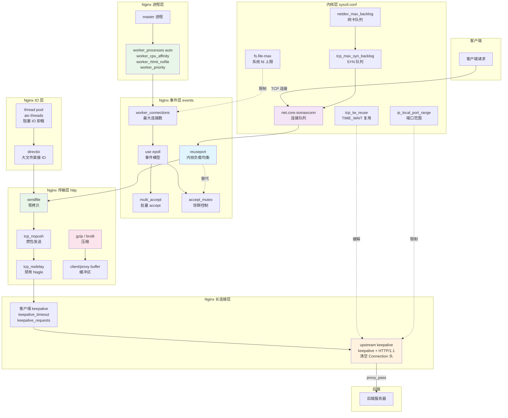

# 19 - 性能调优

> **版本基线**：Nginx 1.30.4 (stable) | 创建日期：2026-08-05
> **受众**：后端开发熟手（熟悉 Python/Java/Lua），但服务器性能调优是小白。本篇把 Nginx 从进程模型到内核参数的调优手段系统讲透。

---

## 目录

- [1. 学习目标](#1-学习目标)
- [2. 核心知识点](#2-核心知识点)
  - [2.1 知识点一：worker 进程调优](#21-知识点一worker-进程调优)
  - [2.2 知识点二：events 调优](#22-知识点二events-调优)
  - [2.3 知识点三：reuseport](#23-知识点三reuseport)
  - [2.4 知识点四：keepalive 调优](#24-知识点四keepalive-调优)
  - [2.5 知识点五：sendfile / tcp_nopush / tcp_nodelay](#25-知识点五sendfile--tcp_nopush--tcp_nodelay)
  - [2.6 知识点六：gzip 与 Brotli 压缩](#26-知识点六gzip-与-brotli-压缩)
  - [2.7 知识点七：buffer 调优](#27-知识点七buffer-调优)
  - [2.8 知识点八：内核参数调优](#28-知识点八内核参数调优)
  - [2.9 知识点九：线程池（thread pool）](#29-知识点九线程池thread-pool)
  - [2.10 知识点十：性能基准测试](#210-知识点十性能基准测试)
  - [2.11 知识点十一：性能调优清单](#211-知识点十一性能调优清单)
- [3. Mermaid 图：Nginx 性能调优全景图](#3-mermaid-图nginx-性能调优全景图)
- [4. 最佳实践](#4-最佳实践)
- [5. 常见踩坑引用](#5-常见踩坑引用)
- [6. 小结](#6-小结)

---

## 1. 学习目标

学完本篇，你应当能够：

- 理解 Nginx **worker 进程模型**与性能的关系，掌握 `worker_processes`、`worker_cpu_affinity`、`worker_rlimit_nofile`、`worker_priority` 的调优方法。
- 掌握 `events` 块的核心参数：`worker_connections`、`use epoll`、`multi_accept`、`accept_mutex`，理解 select/poll/epoll 的区别和"惊群问题"。
- 理解 `reuseport` 的内核层负载均衡机制，知道它如何消除 accept 锁竞争，以及与 HTTP/3 的配合。
- 彻底搞懂**客户端 keepalive**和**upstream keepalive**两套长连接机制，知晓 1.29.7 起的默认行为变更。
- 掌握 `sendfile` / `tcp_nopush` / `tcp_nodelay` 三者的零拷贝与 Nagle 算法原理及配合方式。
- 掌握 `gzip` 进阶用法（`gzip_static` 预压缩）和 `Brotli` 第三方模块的配置。
- 理解 `client_body_buffer_size`、`proxy_buffer_size`、`proxy_buffers` 等 buffer 参数对内存与磁盘 IO 的影响。
- 掌握 `sysctl.conf` 中与 Nginx 相关的内核参数调优（somaxconn、tcp_max_syn_backlog、tcp_tw_reuse 等）。
- 理解**线程池**（thread pool）处理阻塞 IO 的适用场景与局限。
- 能使用 `ab`、`wrk`、`hey` 进行性能基准测试并解读结果。
- 产出一份从低到高的性能调优检查清单。
- 避开踩坑 `#2.1`–`#2.6`。

> **前置知识**：建议先完成 [03-进程模型与控制管理](../01-基础认知/03-进程模型与控制管理.md)、[05-静态资源服务](../02-配置基础/05-静态资源服务.md) 和 [09-反向代理proxy_pass](../04-反向代理与负载均衡/09-反向代理proxy_pass.md)。

---

## 2. 核心知识点

### 2.1 知识点一：worker 进程调优

Nginx 采用**多进程架构**：一个 master 进程负责管理，多个 worker 进程负责处理实际请求。worker 进程的数量和行为直接决定了 Nginx 能否充分利用服务器硬件。这是所有性能调优的起点。

#### worker_processes auto

`worker_processes` 控制 worker 进程的数量。

- **设为具体数字**（如 `worker_processes 4`）：固定 worker 数量。
- **设为 `auto`**：Nginx 自动检测 CPU 核心数并设为相同值。

```nginx
# nginx.conf 顶层
worker_processes auto;   # 自动等于 CPU 逻辑核心数，是最推荐的设置
```

为什么要等于 CPU 核心数？因为 Nginx 是单线程多路复用模型，每个 worker 进程在绝大多数时间运行在**单核**上。如果 worker 数 < 核心数，部分 CPU 核心闲置；如果 worker 数 > 核心数，多个 worker 争抢同一核心，产生不必要的上下文切换开销。

> **引用踩坑 [#2.1](../99-踩坑记录与解决方案.md#21-worker_processes-设置不当)**：worker_processes 设置不当导致 CPU 利用不均或上下文切换开销过大。

#### worker_cpu_affinity 绑核

**什么是 CPU 亲和性（CPU Affinity）**

CPU 亲和性是指把一个进程"绑定"到特定的 CPU 核心上，让操作系统调度器尽量只在那个核心上运行该进程。

**为什么要绑核**

操作系统调度器会在不同 CPU 核心之间迁移进程，以实现"负载均衡"。但这种迁移有代价：

1. **缓存失效**：进程从核心 A 迁移到核心 B 后，核心 A 的 L1/L2 cache 里的热数据全部失效，需要重新从内存加载，造成 cache miss 性能下降。
2. **TLB 刷新**：CPU 迁移还可能导致 TLB（Translation Lookaside Buffer，页表缓存）失效。

通过 `worker_cpu_affinity` 绑核，可以让每个 worker 固定在一个核心上运行，最大化 cache 命中率。

```nginx
worker_processes auto;        # 假设 4 核 CPU，auto 会启动 4 个 worker

# worker_cpu_affinity 用二进制位掩码表示，每一位对应一个 CPU 核心
# 4 核示例：
worker_cpu_affinity 0001 0010 0100 1000;
# worker 0 → CPU 0（第 1 位为 1）
# worker 1 → CPU 1（第 2 位为 1）
# worker 2 → CPU 2（第 3 位为 1）
# worker 3 → CPU 3（第 4 位为 1）
```

```
# 验证绑核效果
taskset -cp <pid>     # 查看某 worker 进程绑定的 CPU 核心
ps -eo pid,psr,comm | grep nginx   # PSR 列显示进程当前运行在哪个核心
```

> **特例说明**：在现代 Linux 内核（2.6 及以上）中，调度器已经比较智能，绑核带来的收益在多数场景下并不显著（5% 以内）。如果你的 CPU 支持 SMT（超线程，如 Intel 的 HT），绑核时要注意物理核与逻辑核的映射关系。此外，容器化环境（Docker/K8s）中 CPU 可能被 cgroup 限制，`auto` 检测到的核心数可能与实际可用不符，需结合 `worker_processes` 手动指定。

#### worker_rlimit_nofile 提升文件描述符上限

每个连接、每个打开的文件都需要一个文件描述符（file descriptor, fd）。高并发场景下，默认的 fd 上限（通常 1024）远远不够。

```nginx
# nginx.conf 顶层
worker_rlimit_nofile 65535;   # 设置每个 worker 进程可打开的最大文件描述符数
                               # 此值需 >= worker_connections
                               # 修改后需 reload Nginx 生效
```

```
# 系统层面也要同步提升，否则 worker_rlimit_nofile 受系统限制
# /etc/security/limits.conf:
# *  soft  nofile  65535
# *  hard  nofile  65535
# 修改后重新登录 shell 生效，或执行 ulimit -n 65535
```

> **引用踩坑 [#2.6](../99-踩坑记录与解决方案.md#26-文件描述符--sendfile-限制)**：高并发时报 `too many open files`。

#### worker_priority 进程优先级

`worker_priority` 设置 worker 进程的 nice 值，范围 -20（最高优先级）到 19（最低优先级），默认 0。

```nginx
worker_priority -5;   # 提高 worker 进程的调度优先级（nice 值越小优先级越高）
                      # 范围：-20 到 19
                      # 默认 0；设为负值让 Nginx 在 CPU 紧张时优先获得时间片
```

> **特例说明**：通常不需要调整。只有在同一台机器上运行多个争抢 CPU 的服务，且希望 Nginx 优先时才设为负值。但要注意：如果 Nginx 优先级过高，可能饿死其他关键进程（如数据库）。生产环境中，更好的做法是给不同服务分配独立的 CPU 核心（cgroup 或绑核），而非调 nice 值。

#### 完整代码示例

```nginx
# /etc/nginx/nginx.conf —— worker 进程调优综合配置

user nginx;                          # worker 进程以 nginx 用户运行
worker_processes auto;               # 自动设为 CPU 核心数
worker_cpu_affinity auto;            # 1.11.5+ 支持 auto，自动绑核（推荐）
worker_rlimit_nofile 65535;          # 每个 worker 最大文件描述符数
worker_priority 0;                   # 进程优先级，默认 0 即可

error_log /var/log/nginx/error.log warn;  # 错误日志级别设为 warn
pid /run/nginx.pid;                 # PID 文件路径

events {
    worker_connections 65535;        # 单 worker 最大连接数（见知识点二）
}

http {
    # ... HTTP 配置 ...
}
```

---

### 2.2 知识点二：events 调优

`events` 块控制 Nginx 的事件驱动模型，决定了 worker 如何接收和处理连接。这是连接层性能调优的核心。

#### worker_connections：单 worker 最大连接数

```nginx
events {
    worker_connections 65535;   # 每个 worker 进程同时可处理的最大连接数
                                # 此值受 worker_rlimit_nofile 限制
                                # 全局最大连接数 = worker_processes × worker_connections
}
```

**反向代理场景的连接数折算**：

作为反向代理时，每个客户端请求占用**两条**连接：
- 客户端 → Nginx（入口连接）
- Nginx → 后端（出口连接）

因此理论最大客户端并发数约为：

```
最大客户端数 ≈ worker_processes × worker_connections / 2
```

保守估计（考虑 keepalive 占用的空闲连接、临时缓冲等）：

```
最大客户端数 ≈ worker_processes × worker_connections / 4
```

> **引用踩坑 [#2.2](../99-踩坑记录与解决方案.md#22-worker_connections-与最大连接数计算错误)**：误以为 `worker_processes × worker_connections` 就是最大客户端数。

#### use epoll：Linux 事件模型

`use` 指令指定事件模型。Nginx 会自动选择最高效的模型，通常不需要手动指定，但理解其原理很重要。

```nginx
events {
    use epoll;                # Linux 上使用 epoll 事件模型
    worker_connections 65535;
}
```

**select / poll / epoll 区别**：

| 特性 | select | poll | epoll |
|------|--------|------|-------|
| **最大连接数** | FD_SETSIZE（默认 1024） | 无上限 | 无上限 |
| **性能复杂度** | O(n)，每次遍历所有 fd | O(n)，每次遍历所有 fd | O(1)，只返回就绪的 fd |
| **工作方式** | 每次调用都把全部 fd 从用户态拷贝到内核态 | 同 select | fd 只在 epoll_ctl 时注册一次，之后不需要重复拷贝 |
| **内核遍历** | 内核线性扫描所有 fd | 内核线性扫描所有 fd | 内核通过回调机制，只通知就绪的 fd |
| **触发方式** | 水平触发（LT） | 水平触发（LT） | 支持水平触发（LT）和边缘触发（ET） |

**通俗解释**：

- **select/poll**：就像一个老师（内核）每次都点名全班所有学生（fd），问"你有没有问题要问？"。即使只有 1 个学生举手，老师也得把全班 1024 个（select）或更多（poll）学生都问一遍。学生越多，点名越慢。
- **epoll**：就像老师给每个学生发了一个呼叫器。学生有问题时按下呼叫器（事件回调），老师只去看按了呼叫器的学生。无论全班有多少学生，老师都只需要处理真正有问题的那些。

这就是为什么 epoll 在高并发（万级连接）下性能远超 select/poll：它的时间复杂度不随连接数增长。

> **特例说明**：Nginx 在 Linux 上默认自动选择 epoll，在 BSD/macOS 上选择 kqueue，不需要手动 `use epoll`。手动指定仅用于调试或覆盖自动检测。

#### multi_accept on：一次接受多个连接

```nginx
events {
    worker_connections 65535;
    multi_accept on;           # 允许 worker 一次 accept 多个连接
                                # 默认 off：一次只 accept 一个
                                # 开启后，当大量连接同时到达时减少事件循环次数
}
```

- **`multi_accept off`（默认）**：worker 被唤醒后每次只 accept 一个连接，然后回到事件循环。如果有 100 个连接同时到达，需要循环 100 次。
- **`multi_accept on`**：worker 被唤醒后尽可能多地 accept，一次性把内核 accept 队列里的连接全部取走。

> **特例说明**：`multi_accept on` 在使用 `accept_mutex off`（即开启了 reuseport 或高版本默认行为）时收益更明显。但如果使用了 `accept_mutex on`，多个 worker 会争抢 accept 锁，一次只允许一个 worker accept，此时 `multi_accept` 的效果受限。

#### accept_mutex：惊群问题与 accept 锁

**惊群问题（Thundering Herd）**

当一个新的连接到达监听端口时，内核会唤醒所有阻塞在 `accept()` 上的 worker 进程。但只有一个 worker 能成功 accept 这个连接，其余 worker 被白白唤醒，浪费 CPU。这就是"惊群"。

```nginx
events {
    worker_connections 65535;
    accept_mutex on;           # 开启 accept 互斥锁，避免惊群
                                # 默认值在不同版本有变化：1.11.3 前默认 on，之后默认 off
    accept_mutex_delay 500ms;  # 获取不到锁时，等待多久后重试（默认 500ms）
}
```

- **`accept_mutex on`**：同一时刻只有一个 worker 尝试 accept。worker 通过争抢 accept 锁来获取 accept 权限，拿到锁的 worker 才会监听端口上的新连接事件。避免了惊群，但引入了锁竞争开销和 500ms 等待延迟。
- **`accept_mutex off`**：所有 worker 同时监听端口，由内核唤醒。现代 Linux 内核（3.9+）的 `EPOLLEXCLUSIVE` 标志已经在内核层缓解了惊群问题，因此 Nginx 1.11.3+ 将默认值改为 `off`。

> **版本提示**：
> - Nginx 1.11.3 起 `accept_mutex` 默认为 `off`（因为现代内核已解决惊群）。
> - 如果使用了 `reuseport`（知识点三），则不需要 `accept_mutex`，因为每个 worker 有独立的监听 socket。

> **引用踩坑 [#2.2](../99-踩坑记录与解决方案.md#22-worker_connections-与最大连接数计算错误)**：events 调优中 worker_connections 的连接数计算。

#### 完整代码示例

```nginx
events {
    worker_connections 65535;   # 单 worker 最大连接数
    use epoll;                  # 使用 epoll（Linux 通常自动选择，可省略）
    multi_accept on;           # 一次 accept 多个连接，高并发下提升吞吐
    accept_mutex off;          # 1.11.3+ 默认 off，现代内核已解决惊群
}
```

---

### 2.3 知识点三：reuseport

`reuseport` 是 Linux 内核 3.9（2013 年）引入的 `SO_REUSEPORT` socket 选项。Nginx 1.9.1 开始支持该特性。它是解决 accept 锁竞争、提升高并发吞吐的终极武器。

#### reuseport 的作用

传统模式下，所有 worker 共享同一个监听 socket。新连接到达时，内核需要决定唤醒哪个 worker（可能惊群），或者靠 `accept_mutex` 锁来串行化。

`reuseport` 让**每个 worker 进程拥有独立的监听 socket**，这些 socket 都绑定同一个端口。内核层面的负载均衡器（hash 算法）会将新连接**均匀分配**到不同的 worker 的 socket 上。

```
# 传统模式
                    ┌─ worker 0 ─┐
客户端 ──→ 监听 socket ──→ ├─ worker 1 ─┤  （内核唤醒所有 worker，靠 accept_mutex 串行）
                    └─ worker 2 ─┘

# reuseport 模式
              ┌─ socket 0 ──→ worker 0
客户端 ──→ 内核 ──┼─ socket 1 ──→ worker 1   （内核 hash 分发，每个 worker 独立 accept）
              └─ socket 2 ──→ worker 2
```

#### 内核层负载均衡

内核使用一个基于四元组（源 IP、源端口、目标 IP、目标端口）的 hash 函数，将连接分发到不同的 socket。这种分发方式：

1. **无锁**：每个 worker 只 accept 自己 socket 上的连接，不需要争抢 accept 锁。
2. **均匀**：内核 hash 保证了连接在 worker 间均匀分布。
3. **低延迟**：消除了 `accept_mutex` 带来的 500ms 等待延迟。

#### listen 80 reuseport

```nginx
http {
    server {
        listen 80 reuseport;       # 启用 reuseport，每个 worker 独立监听 80 端口
        # listen 443 ssl reuseport; # HTTPS 同样支持
        server_name example.com;

        location / {
            proxy_pass http://backend;
        }
    }
}
```

逐行说明：

```nginx
listen 80 reuseport;
# listen 80        —— 监听 80 端口
# reuseport        —— 启用 SO_REUSEPORT，内核为每个 worker 创建独立监听 socket
#                    效果：内核自动负载均衡新连接到各 worker，无 accept 锁竞争
```

#### 与 HTTP/3 的配合

HTTP/3 基于 QUIC 协议（UDP），连接管理比 TCP 更复杂。`reuseport` 对 HTTP/3 尤为重要：

- QUIC 连接需要在 worker 间正确路由（一个连接的数据包必须到达同一个 worker）。
- `reuseport` 让内核基于四元组 hash 分发 UDP 包，保证同一 QUIC 连接的包总是到同一个 worker。
- Nginx 的 HTTP/3 实现（`ngx_http_v3_module`）要求在 `listen` 中启用 `reuseport`。

```nginx
server {
    listen 443 ssl;            # TCP（HTTP/2）
    listen 443 quic reuseport; # UDP（HTTP/3），reuseport 是 HTTP/3 的推荐配置
    http2 on;
    http3 on;
    server_name example.com;
    ssl_certificate /etc/nginx/ssl/fullchain.crt;
    ssl_certificate_key /etc/nginx/ssl/server.key;
}
```

> **版本提示**：
> - `reuseport` 需要 Nginx **1.9.1+** 和 Linux 内核 **3.9+**。
> - `reuseport` 只能在 `listen` 指令中使用，且同一个端口只需在一个 server 块中声明。
> - HTTP/3 需要 Nginx 编译时启用 QUIC 支持（`--with-http_v3_module`）。

> **特例说明**：`reuseport` 并非万能。在连接数较少时（如几十个并发），内核 hash 的均匀性不如 round-robin 精确，可能出现轻微不均。此外，如果 worker 之间的处理速度差异大（如某些 worker 处理的请求更耗时），reuseport 无法像 `least_conn` 那样动态调整。对于绝大多数高并发场景，reuseport 的收益远大于这些局限。

---

### 2.4 知识点四：keepalive 调优

keepalive（长连接复用）是性能调优中**性价比最高**的一项。它分为两套独立的机制：客户端 keepalive 和 upstream keepalive。

#### 客户端 keepalive

客户端 keepalive 控制 Nginx 与客户端（浏览器、App）之间的长连接复用。

```nginx
http {
    keepalive_timeout 75s;       # 客户端长连接空闲超时时间
                                  # 默认 75s；设为 0 则关闭长连接
                                  # 超过此时间无新请求，Nginx 主动关闭连接

    keepalive_requests 1000;     # 单条长连接上允许的最大请求数
                                  # 默认 1000；达到后关闭该连接并新建
                                  # 设大可减少连接建立开销，但过大会导致连接"老化"

    keepalive_time 1h;           # 1.19.10+ 单条长连接的最大存活时间
                                  # 无论是否活跃，超过此时间后连接被关闭
                                  # 防止长期复用同一连接带来的内存碎片累积
}
```

逐行说明：

```nginx
keepalive_timeout 75s;
# keepalive_timeout —— 长连接空闲超时
# 75s               —— 75 秒无活动则关闭
# 浏览器默认也有自己的 keep-alive 超时，取双方较小值生效

keepalive_requests 1000;
# keepalive_requests —— 单连接最大请求数
# 1000               —— 处理 1000 个请求后关闭重建
# 防止单个连接上累积过多请求导致内存问题

keepalive_time 1h;
# keepalive_time —— 单连接最大存活时长（1.19.10+）
# 1h             —— 1 小时后强制关闭重建
# 这是对 keepalive_requests 的补充：即使请求很少，1 小时后也要重建
```

> **引用踩坑 [#2.4](../99-踩坑记录与解决方案.md#24-客户端-keepalive-未合理配置)**：`keepalive_timeout` 设为 0 或过小，高并发短请求下大量 TIME_WAIT 堆积。

#### upstream keepalive

upstream keepalive 控制 Nginx 与后端服务器之间的长连接复用。这是反向代理场景的性能关键。

**没有 upstream keepalive 时**：每个客户端请求，Nginx 都与后端新建一条 TCP 连接，用完即关。高 QPS 下后端出现大量 TIME_WAIT，TCP 三次握手开销成为瓶颈。

```nginx
upstream backend {
    server 127.0.0.1:8080;     # 后端服务器地址
    server 127.0.0.1:8081;     # 第二台后端

    keepalive 32;              # 每个 worker 缓存的空闲长连接数
                               # 不是总连接数！是空闲连接池大小
                               # 设为后端可接受的小值（16-64）

    keepalive_requests 1000;   # upstream 单连接最大请求数（默认 1000）
    keepalive_time 1h;         # upstream 单连接最大存活时间（1.19.10+）
    keepalive_timeout 60s;     # upstream 空闲连接超时（1.21.7+）
}

server {
    listen 80;
    server_name example.com;

    location / {
        proxy_pass http://backend;

        # 以下两行是启用 upstream keepalive 的关键
        proxy_http_version 1.1;          # 必须使用 HTTP/1.1 才能复用长连接
                                         # HTTP/1.0 默认 Connection: close
        proxy_set_header Connection "";  # 清空 Connection 头
                                         # 阻止 "Connection: close" 传给后端
                                         # 这样后端才知道连接可以复用
    }
}
```

逐行说明：

```nginx
keepalive 32;
# keepalive 32 —— 每个 worker 维护最多 32 个空闲长连接到后端
# 设过大 → 后端连接池被压垮（每个 worker 32 个，4 核就是 128 个）
# 设过小 → 连接复用率低，退化为短连接
# 推荐值：16-64，取决于后端连接池容量

proxy_http_version 1.1;
# proxy_http_version 1.1 —— 与后端通信用 HTTP/1.1
# HTTP/1.1 默认支持 keep-alive，HTTP/1.0 默认 close
# 这一行是 upstream keepalive 生效的前提条件

proxy_set_header Connection "";
# Connection "" —— 把 Connection 请求头设为空字符串
# Nginx 默认会向后端发送 "Connection: close"
# 清空后，后端收到的是无 Connection 头的 HTTP/1.1 请求 → 保持长连接
```

> **版本提示**：Nginx **1.29.7** 起默认开启 upstream keepalive，并默认使用 HTTP/1.1 且自动清理 Connection 头。1.29.7 之前的版本需要手动配置上述三行。即使在 1.29.7+，显式配置也不会出错，只是不再强制。

> **引用踩坑 [#2.3](../99-踩坑记录与解决方案.md#23-未启用-upstream-keepalive长连接复用)**：未启用 upstream keepalive 导致大量 TIME_WAIT，QPS 上不去。

> **特例说明**：WebSocket 场景**不要**使用 `proxy_set_header Connection ""`。WebSocket 需要 `Connection "upgrade"` 来升级协议。同一个 server 中，WebSocket 的 location 和普通反代的 location 应分开配置。参见踩坑 `#5.3`。

> **引用踩坑 [#2.4](../99-踩坑记录与解决方案.md#24-客户端-keepalive-未合理配置)**：客户端 keepalive 未合理配置。

---

### 2.5 知识点五：sendfile / tcp_nopush / tcp_nodelay

这三个指令控制 Nginx 如何向网络发送数据，涉及零拷贝和 TCP 算法优化。它们需要配合使用才能发挥最大效果。

#### sendfile on：零拷贝

`sendfile` 在 [05-静态资源服务](../02-配置基础/05-静态资源服务.md) 中已介绍过基本用法，这里补充底层原理。

**传统文件发送流程（read + write）**：

```
磁盘 → 内核缓冲区（page cache） → 用户空间缓冲区 → socket 缓冲区 → 网卡
         (内核态)                (用户态)          (内核态)
                     ↑ 4 次上下文切换 ↑     ↑ 4 次数据拷贝 ↑
```

1. `read()`：内核把数据从 page cache 拷贝到用户空间缓冲区（内核态→用户态切换）
2. `write()`：用户空间缓冲区拷贝到 socket 缓冲区（用户态→内核态切换）

共 4 次上下文切换、4 次数据拷贝（2 次 DMA、2 次 CPU 拷贝），其中 2 次拷贝是多余的（数据经过了用户空间但没有做任何处理）。

**sendfile 流程**：

```
磁盘 → 内核缓冲区（page cache） → socket 缓冲区 → 网卡
         (内核态)                  (内核态)
              ↑ 2 次上下文切换 ↑     ↑ 3 次数据拷贝（2 DMA + 1 CPU）↑
```

`sendfile()` 系统调用直接在内核态把数据从 page cache 拷贝到 socket 缓冲区，**完全绕过用户空间**：

- 2 次上下文切换（vs 4 次）
- 2 次 DMA 拷贝 + 1 次 CPU 拷贝（vs 2 DMA + 2 CPU）
- 数据不经过用户空间，零用户态拷贝

在 Linux 2.4+ 配合支持 SG-DMA（Scatter-Gather DMA）的网卡，连最后的 CPU 拷贝都可以省掉，真正实现"零拷贝"。

```nginx
http {
    sendfile on;              # 启用零拷贝发送文件
                              # 仅对静态文件生效（直接读磁盘发送）
                              # 反向代理场景无效（数据来自后端，不在磁盘）
}
```

> **特例说明**：VirtualBox 等虚拟机的共享文件夹中 sendfile 可能有问题（数据不一致），需 `sendfile off`。参见踩坑 `#2.6`。

#### tcp_nopush：配合 sendfile 发送大文件

`tcp_nopush` 对应 Linux 的 `TCP_CORK` 选项。开启后，内核会"塞住"（cork）socket，累积数据直到达到 MSS（最大分段大小）或收到 `TCP_NODELAY` 才发送。

```nginx
http {
    sendfile on;              # 零拷贝
    tcp_nopush on;            # 开启 TCP_CORK，攒满一个包再发
                              # 配合 sendfile：先把 HTTP 响应头攒着，
                              # 和文件数据一起作为一个 TCP 段发送
                              # 减少小包数量，提升网络效率
}
```

**工作原理**：

- 开启 `tcp_nopush` 后，Nginx 发送 HTTP 响应时，会先缓存响应头，等文件数据从 sendfile 到来后，一起发送。
- 效果：响应头和文件数据的第一个 chunk 合并成一个 TCP 段，减少网络上的小包。
- 当 sendfile 传输完成后，Nginx 会自动取消 cork，把剩余数据发出去。

#### tcp_nodelay：小数据即时发送

`tcp_nodelay` 对应 `TCP_NODELAY` 选项，**禁用 Nagle 算法**。

**Nagle 算法**：TCP 默认启用 Nagle 算法，当有待确认的小数据包时，会缓存后续小数据，攒够一个 MSS 再发。这会引入延迟（对交互式应用不友好）。

```nginx
http {
    sendfile on;
    tcp_nopush on;
    tcp_nodelay on;           # 禁用 Nagle 算法，小数据立即发送
                              # 对 keepalive 长连接上的小请求/响应尤为重要
                              # 避免最后一个不满 MSS 的包被 Nagle 延迟
}
```

#### 三者配合

```nginx
http {
    sendfile on;              # 零拷贝：文件传输绕过用户空间
    tcp_nopush on;            # 攒包：发送大文件时合并响应头和数据
    tcp_nodelay on;           # 即时发送：长连接上的小数据不延迟
}
```

**看似矛盾，实则互补**：

- `tcp_nopush` 和 `tcp_nodelay` 是互斥的 TCP 选项（`TCP_CORK` 和 `TCP_NODELAY`）。
- Nginx 的巧妙之处在于：在 sendfile 传输大文件期间使用 `tcp_nopush`（攒包），传输结束后自动切换到 `tcp_nodelay`（把最后不满 MSS 的尾巴立即发出去）。
- 两者同时 `on` 时，Nginx 会在合适的时机自动切换，兼具大文件传输效率和长连接小数据低延迟。

> **特例说明**：`tcp_nopush` 和 `tcp_nodelay` 同时开启是 Nginx 官方推荐的配置。只有当 `sendfile on` 时 `tcp_nopush` 才有意义。

> **引用踩坑 [#2.6](../99-踩坑记录与解决方案.md#26-文件描述符--sendfile-限制)**：sendfile 限制相关。

---

### 2.6 知识点六：gzip 与 Brotli 压缩

压缩是减少网络传输量、提升页面加载速度的有效手段。Nginx 内置 gzip 模块，也可通过第三方模块支持 Brotli。

#### gzip 配置回顾

```nginx
http {
    gzip on;                          # 开启 gzip 压缩
    gzip_comp_level 6;                # 压缩级别 1-9，6 是性能与压缩率的平衡点
                                       # 1 最快压缩率最低，9 最慢压缩率最高
    gzip_min_length 1k;               # 小于 1KB 的响应不压缩
                                       # 太小的文件压缩后可能更大（gzip 头开销）
    gzip_types text/plain
               text/css
               text/xml
               text/javascript
               application/json
               application/javascript
               application/xml
               image/svg+xml;         # 需要压缩的 MIME 类型
                                       # text/html 默认始终压缩，无需列出
    gzip_vary on;                     # 添加 "Vary: Accept-Encoding" 响应头
                                       # 让缓存代理知道响应因 Accept-Encoding 而异
    gzip_disable "msie6";             # IE6 不支持 gzip，排除
    gzip_proxied any;                 # 反向代理场景也压缩
                                       # any: 无论请求来自代理与否都压缩
}
```

逐行说明：

```nginx
gzip on;
# gzip on —— 启用动态 gzip 压缩
# 每次请求实时压缩，消耗 CPU

gzip_comp_level 6;
# gzip_comp_level 6 —— 压缩级别
# 1: 快但压缩率低（~70% 原始大小）
# 6: 推荐，平衡点（~65%）
# 9: 慢但压缩率高（~63%），CPU 开销大
# 超过 6 后压缩率提升不明显，但 CPU 开销显著增加

gzip_min_length 1k;
# gzip_min_length 1k —— 只压缩大于 1KB 的响应
# gzip 压缩会添加 ~20-40 字节的头信息
# 小文件压缩后可能反而变大

gzip_vary on;
# gzip_vary on —— 添加 Vary: Accept-Encoding
# CDN/缓存服务器据此缓存不同编码版本
# 不加可能导致缓存返回压缩版给不支持 gzip 的客户端
```

#### gzip_static：预压缩文件

`gzip_static` 让 Nginx 直接发送预压缩好的 `.gz` 文件，避免实时压缩的 CPU 开销。

```nginx
http {
    gzip_static on;       # 自动查找 .gz 预压缩文件
                          # 请求 /style.css 时，优先发送 /style.css.gz
                          # 找不到 .gz 则回退到原始文件（并按 gzip on 动态压缩）
}

# 预压缩文件需要提前生成：
# gzip -c -9 /var/www/html/style.css > /var/www/html/style.css.gz
```

```nginx
# 更精细的控制
gzip_static always;    # always: 总是发送 .gz 文件（即使客户端不支持 gzip 也发）
                       # on:     只在客户端支持 gzip 时发送 .gz
                       # off:    关闭（默认）
```

> **特例说明**：`gzip_static` 要求预压缩文件的修改时间**不早于**原始文件，否则 Nginx 认为预压缩文件过期，会忽略它。构建流程中要注意先生成原始文件再压缩。

#### Brotli：ngx_brotli 模块

Brotli 是 Google 开发的压缩算法，压缩率优于 gzip（同级别下体积小 15-25%），尤其擅长文本压缩。现代浏览器（Chrome、Firefox、Edge）均支持。

> **版本提示**：Brotli 不是 Nginx 官方内置模块，需要编译 `ngx_brotli` 第三方模块（由 Google 维护，仓库：`github.com/google/ngx_brotli`）。安装方式：

```bash
# 编译时添加 ngx_brotli 模块
./configure --add-module=/path/to/ngx_brotli
make && make install
```

```nginx
http {
    # Brotli 动态压缩
    brotli on;                              # 开启 Brotli 动态压缩
    brotli_comp_level 6;                    # 压缩级别 0-11，6 是推荐值
                                             # 0 不压缩，11 压缩率最高但最慢
                                             # Brotli 6 的压缩率 ≈ gzip 9
    brotli_min_length 1k;                   # 小于 1KB 不压缩
    brotli_types text/plain
                 text/css
                 text/xml
                 text/javascript
                 application/json
                 application/javascript
                 application/xml
                 image/svg+xml;             # 需要压缩的 MIME 类型
    brotli_buffers 16 8k;                   # 压缩缓冲区：16 块 × 8KB

    # Brotli 预压缩（类似 gzip_static）
    brotli_static on;                       # 自动查找 .br 预压缩文件
                                             # 需提前用 brotli 命令生成:
                                             # brotli -c -q 11 style.css > style.css.br
}
```

逐行说明：

```nginx
brotli on;
# brotli on —— 启用 Brotli 动态压缩
# 仅当客户端发送 Accept-Encoding: br 时才使用 Brotli
# 否则回退到 gzip

brotli_comp_level 6;
# brotli_comp_level 6 —— Brotli 压缩级别 0-11
# 与 gzip 的 1-9 不同，Brotli 有 12 个级别
# 6 是推荐值：压缩率优于 gzip 9，速度优于 gzip 6
# 11 极慢，仅适用于离线预压缩

brotli_static on;
# brotli_static on —— 发送 .br 预压缩文件
# 优先级：brotli_static > brotli(动态) > gzip_static > gzip(动态)
```

#### gzip 与 Brotli 共存

```nginx
http {
    # 两者同时开启时，Nginx 根据客户端 Accept-Encoding 选择：
    # 支持 br → 用 Brotli
    # 不支持 br 但支持 gzip → 用 gzip
    # 都不支持 → 不压缩
    gzip on;
    brotli on;
    # ... 其余配置 ...
}
```

> **特例说明**：Brotli 仅在 HTTPS 下生效（浏览器限制，HTTP 下浏览器不发送 `Accept-Encoding: br`）。如果你的站点还是 HTTP，Brotli 不会生效，gzip 仍然有用。

---

### 2.7 知识点七：buffer 调优

Buffer（缓冲区）决定了 Nginx 在内存中暂存多少数据。设置过小会导致数据落盘（磁盘 IO 飙升）或响应被截断；设置过大会浪费内存。

#### client_body_buffer_size / client_max_body_size

这两个参数控制 Nginx 接收**客户端请求体**时的缓冲行为。

```nginx
http {
    client_max_body_size 50m;        # 客户端请求体最大允许大小
                                      # 超过返回 413 Request Entity Too Large
                                      # 默认 1m；设为 0 表示不限制（不推荐）

    client_body_buffer_size 1m;      # 请求体内存缓冲区大小
                                      # 小于此值 → 存内存（快）
                                      # 超过此值 → 存临时文件（慢，产生磁盘 IO）
                                      # 默认 8k/16k（32 位/64 位系统）
}
```

逐行说明：

```nginx
client_max_body_size 50m;
# client_max_body_size 50m —— 请求体最大 50MB
# 常见场景：
#   普通表单提交 → 1m 足够
#   图片上传 → 10m-50m
#   视频上传 → 500m 或更大
# 设为 0 → 不限制（有 DoS 风险，不推荐）

client_body_buffer_size 1m;
# client_body_buffer_size 1m —— 1MB 以内存内存
# 超过 1MB 的请求体写入临时文件
# 临时文件路径由 client_body_temp_path 控制
# 建议：根据你的请求体大小分布来设，让大多数请求不落盘
```

#### proxy_buffer_size / proxy_buffers / proxy_busy_buffers_size

这三个参数控制 Nginx 代理**后端响应**时的缓冲行为。

```nginx
http {
    proxy_buffer_size 16k;          # 读取后端响应头的缓冲区大小
                                     # 默认 4k/8k
                                     # 后端响应头很大时需调大，否则报 invalid header

    proxy_buffers 8 16k;            # 读取后端响应体的缓冲区
                                     # 8 块 × 16k = 128k 总缓冲
                                     # 默认 8 块，每块 4k/8k

    proxy_busy_buffers_size 32k;    # "忙"缓冲区大小
                                     # 当缓冲区数据达到此值时，Nginx 开始向客户端发送
                                     # 同时继续从后端读取剩余数据
                                     # 默认为 proxy_buffers 的 2 块大小
                                     # 必须 < proxy_buffers 总大小 - 1 块
}
```

逐行说明：

```nginx
proxy_buffer_size 16k;
# proxy_buffer_size 16k —— 响应头缓冲区
# 只缓存 HTTP 响应头（status line + headers），不存响应体
# 如果后端返回很大的 header（如很长的 Set-Cookie），4k 不够会报错
# 16k 通常足够

proxy_buffers 8 16k;
# proxy_buffers 8 16k —— 响应体缓冲区：8 块，每块 16KB
# 总缓冲 = 8 × 16k = 128KB
# 响应体 < 128KB → 全部缓存在内存
# 响应体 > 128KB → 超出部分写入临时文件（磁盘 IO）
# 调大 → 更多响应留在内存，但每个连接占更多内存

proxy_busy_buffers_size 32k;
# proxy_busy_buffers_size 32k —— 忙缓冲阈值
# Nginx 从后端读数据到 proxy_buffers，同时向客户端发送已缓冲的数据
# 当缓冲数据量 >= 32k 时，开始"忙碌"地并行发送
# 作用：让数据尽早流向客户端，减少整体延迟
# 约束：必须 < (proxy_buffers 总大小 - proxy_buffer_size 对应的 1 块)
```

> **引用踩坑 [#2.5](../99-踩坑记录与解决方案.md#25-proxy-buffer-过小导致落盘或响应被截断)**：proxy buffer 过小导致落盘或响应被截断。

> **特例说明**：对于 SSE（Server-Sent Events）、流式响应或 WebSocket，必须关闭代理缓冲，否则 Nginx 会把数据攒在内存中不发给客户端，导致实时性丧失：

```nginx
# SSE / 流式响应关闭缓冲
location /sse/ {
    proxy_pass http://backend;
    proxy_buffering off;           # 关闭响应缓冲，收到后端数据立即转发
    proxy_cache off;               # 同时关闭缓存
    proxy_set_header Connection ""; # 保持长连接
}
```

#### 完整代码示例

```nginx
http {
    # 客户端请求体缓冲
    client_max_body_size 50m;
    client_body_buffer_size 1m;
    client_body_temp_path /var/cache/nginx/client_temp 1 2;  # 临时文件目录及子目录层级

    # 后端响应缓冲
    proxy_buffer_size 16k;
    proxy_buffers 8 16k;
    proxy_busy_buffers_size 32k;
    proxy_temp_path /var/cache/nginx/proxy_temp 1 2;  # 代理临时文件目录

    server {
        location / {
            proxy_pass http://backend;
        }

        # SSE/流式响应：关闭缓冲
        location /sse/ {
            proxy_pass http://backend;
            proxy_buffering off;
        }
    }
}
```

---

### 2.8 知识点八：内核参数调优

Nginx 运行在 Linux 内核之上，内核网络参数直接影响 Nginx 的连接处理能力。以下参数通过 `/etc/sysctl.conf` 配置，执行 `sysctl -p` 生效。

```bash
# /etc/sysctl.conf —— Nginx 相关内核参数

# 1. 连接队列（全连接队列）
net.core.somaxconn = 65535
# somaxconn —— socket accept() 全连接队列最大长度
# 默认 128（旧内核）或 4096（新内核）
# Nginx 的 backlog 不能超过此值
# 推荐值：65535
# 作用：当 Nginx 来不及 accept 时，已完成三次握手的连接在此排队
#       队列满后新连接被丢弃（客户端看到连接超时）

# 2. SYN 队列（半连接队列）
net.ipv4.tcp_max_syn_backlog = 65535
# tcp_max_syn_backlog —— SYN_RCVD 状态的最大连接数
# 默认 1024
# 推荐值：65535
# 作用：尚未完成三次握手的连接（收到 SYN，已发 SYN-ACK）在此排队
#       防 SYN Flood 攻击和高并发下的连接丢失
# 注意：实际值 = max(tcp_max_syn_backlog, somaxconn)，取较大者

# 3. 网卡接收队列
net.core.netdev_max_backlog = 65535
# netdev_max_backlog —— 网卡收到数据包后，在内核协议栈处理前的排队长度
# 默认 1000
# 推荐值：65535
# 作用：当网卡收包速度 > 内核处理速度时，数据包在此排队
#       队列满后丢包（需要重传，降低性能）
# 注意：此值与网卡驱动和硬件相关，过高可能浪费内存

# 4. TIME_WAIT 复用
net.ipv4.tcp_tw_reuse = 1
# tcp_tw_reuse = 1 —— 允许将 TIME_WAIT 状态的连接用于新的 TCP 连接
# 默认 0（关闭）
# 推荐值：1（作为客户端/主动关闭方时开启）
# 作用：Nginx 作为反向代理时主动关闭后端连接，产生大量 TIME_WAIT
#       开启后可快速复用这些连接的端口，缓解端口耗尽
# 注意：此选项只对"主动发起连接"的一方（客户端角色）有效
#       Nginx 对后端是客户端角色，对前端是服务端角色
# 警告：tcp_tw_recycle（已废弃，4.12 内核移除）不要用，会导致 NAT 环境丢包

# 5. FIN-WAIT-2 超时
net.ipv4.tcp_fin_timeout = 15
# tcp_fin_timeout —— FIN-WAIT-2 状态的超时时间（秒）
# 默认 60
# 推荐值：15-30
# 作用：主动关闭方发送 FIN 后进入 FIN-WAIT-2，等待对方 FIN
#       超时后直接关闭，释放端口
#       缩短此值可更快回收处于 FIN-WAIT-2 的连接

# 6. 本地端口范围
net.ipv4.ip_local_port_range = 10000 65535
# ip_local_port_range —— 本地端口分配范围
# 默认 32768-60999
# 推荐值：10000-65535
# 作用：Nginx 作为客户端连后端时，每条连接需要一个本地端口
#       端口范围越大，可建立的连接越多
# 计算：可用端口数 = 65535 - 10000 = 55536
#       理论最大连接数 ≈ 55536（受此限制 + TIME_WAIT 占用）

# 7. 系统最大文件描述符
fs.file-max = 1000000
# file-max —— 系统全局最大文件描述符数
# 默认值因系统而异（通常几万）
# 推荐值：1000000（百万级）
# 作用：所有进程的 fd 总和上限
#       Nginx 每个 worker 需要 worker_connections 个 fd
#       总 fd ≈ worker_processes × worker_connections
# 注意：还需配合 /etc/security/limits.conf 的 nofile 设置（进程级限制）

# 8. TCP keepalive 探测（TCP 层，非 HTTP 层）
net.ipv4.tcp_keepalive_time = 600
# tcp_keepalive_time —— TCP 连接空闲多久后开始发送 keepalive 探测
# 默认 7200（2 小时）
# 推荐值：600（10 分钟）
# 作用：及时发现死连接（对端崩溃但未发 FIN）

net.ipv4.tcp_keepalive_intvl = 30
# tcp_keepalive_intvl —— 探测间隔
# 默认 75
# 推荐值：30

net.ipv4.tcp_keepalive_probes = 3
# tcp_keepalive_probes —— 探测次数，超过后认定连接已死
# 默认 9
# 推荐值：3
```

应用配置：

```bash
# 编辑配置文件
sudo vim /etc/sysctl.conf

# 立即生效
sudo sysctl -p

# 查看当前值
sysctl net.core.somaxconn
sysctl net.ipv4.tcp_tw_reuse
sysctl fs.file-max
```

> **特例说明**：
> - `tcp_tw_reuse` 依赖 TCP timestamp 选项（`net.ipv4.tcp_timestamps = 1`，默认开启）。
> - `tcp_tw_recycle` 在 NAT 环境（如公司内网、CDN）下会导致丢包，Linux 4.12 已移除此选项，切勿使用。
> - 容器环境中（Docker/K8s），部分 sysctl 参数需要在 host 层面设置，容器内修改 `net.core.*` 可能无效（需要 `--privileged` 或 host network）。

---

### 2.9 知识点九：线程池（thread pool）

Nginx 是事件驱动（非阻塞 IO）的，但某些操作天生是阻塞的——比如磁盘文件读取。当 worker 在执行阻塞 IO 时，它无法处理其他连接，造成性能下降。线程池（thread pool）用于把这些阻塞操作卸载到独立线程中执行。

#### aio threads：线程池处理阻塞 IO

```nginx
http {
    # 定义线程池
    thread_pool default threads=32 max_queue=65536;
    # thread_pool default —— 线程池名称为 default
    # threads=32          —— 池中 32 个工作线程
    # max_queue=65536     —— 等待队列最大长度，超过则拒绝（返回错误）

    server {
        location /download/ {
            root /data/files;

            aio threads;             # 使用线程池执行异步文件 IO
                                      # 读文件操作卸载到线程池，不阻塞 worker 事件循环
            sendfile on;             # 小文件仍用 sendfile（零拷贝）
            directio 8m;             # 大于 8MB 的文件用 directio（绕过 page cache）
                                      # 大文件走 directio + aio threads
                                      # 小文件走 sendfile
        }
    }
}
```

逐行说明：

```nginx
thread_pool default threads=32 max_queue=65536;
# thread_pool       —— 定义线程池的指令
# default           —— 线程池名称（default 是默认池名）
# threads=32        —— 32 个线程并行处理阻塞 IO
#                      线程数通常设为磁盘数 × 2~4
#                      SSD 可设更高（32-64），HDD 不宜太多（磁头寻道瓶颈）
# max_queue=65536   —— 等待队列上限，满了就返回错误
#                      防止磁盘 IO 满载时请求无限堆积

aio threads;
# aio threads —— 启用异步 IO，使用 default 线程池
# 当 Nginx 需要读磁盘文件时，把读操作提交给线程池
# worker 主线程不阻塞，继续处理其他连接

directio 8m;
# directio 8m —— 大于 8MB 的文件使用直接 IO（O_DIRECT）
# 绕过内核 page cache，避免大文件污染缓存
# 小文件仍走 sendfile（利用 page cache）
# 大文件走 directio + aio threads（不阻塞 worker）
```

#### 适用场景

线程池**只对磁盘文件 IO 有收益**：

- **大文件下载/视频流**：用户下载几百 MB 的文件，读磁盘是阻塞操作。不开线程池时，worker 在读文件期间无法处理其他连接。开线程池后，读操作在后台线程执行，worker 继续服务其他请求。
- **静态资源服务**：大量静态文件请求，磁盘 IO 成为瓶颈。

```nginx
# 典型场景：视频/大文件下载站
location /videos/ {
    root /data/videos;
    aio threads;
    directio 8m;        # 8MB 以上用 directio
    sendfile on;        # 8MB 以下用 sendfile
    output_buffers 2 1m;
}
```

> **特例说明：纯网络 IO 无收益**。线程池解决的是**磁盘阻塞 IO** 问题。如果你的 Nginx 纯做反向代理（proxy_pass），数据来自后端网络而非本地磁盘，磁盘 IO 不是瓶颈，线程池**没有收益**。反向代理的性能瓶颈在连接管理和网络 IO，这些已经是非阻塞的（epoll）。盲目开启 `aio threads` 只会增加线程切换开销。

> **版本提示**：`thread_pool` 指令需要 Nginx 编译时启用 `--with-threads`（1.7.11+）。官方预编译包通常已包含。

---

### 2.10 知识点十：性能基准测试

调优前先测量，调优后再测量。没有基准数据的调优是盲目的。以下是三种常用压测工具。

#### ab (Apache Bench)

`ab` 是最简单基础的压测工具，Apache HTTP Server 自带，大多数 Linux 发行版可通过 `apache2-utils` 或 `httpd-tools` 安装。

```bash
# 安装
# Ubuntu/Debian: apt install apache2-utils
# CentOS/RHEL:   yum install httpd-tools

# 基本用法
ab -n 10000 -c 100 http://example.com/
# -n 10000  —— 总请求数 10000
# -c 100    —— 并发数 100（同时 100 个请求）
# URL       —— 末尾必须带 /（否则 ab 报 invalid URL）

# 带选项
ab -n 10000 -c 100 -k -H "Accept-Encoding: gzip" http://example.com/
# -k              —— 启用 keep-alive（测试长连接性能）
# -H "header"     —— 添加自定义请求头

# POST 测试
ab -n 1000 -c 50 -p post_data.json -T application/json http://example.com/api
# -p file    —— POST 请求体文件
# -T type    —— Content-Type
```

**解读 ab 结果**：

```
Requests per second:    8543.21 [#/sec] (mean)
# 每秒处理的请求数（QPS/RPS）—— 最核心的指标

Time per request:       11.706 [ms] (mean)
# 平均每个请求耗时（含并发等待）

Time per request:       0.117 [ms] (mean, across all concurrent requests)
# 单个请求实际处理时间 = 上面的值 / 并发数

Transfer rate:          1234.56 [Kbytes/sec] received
# 每秒传输的数据量（吞吐量）

Connection Times (ms)
              min  mean[+/-sd] median   max
Connect:        0    1   0.5      1       8
Processing:     2   10   3.2      9      25
Waiting:        2    9   3.0      8      24
Total:          2   11   3.3     10      30
# 连接、处理、等待各阶段耗时分布
# Connect：TCP 建连时间
# Processing：从发请求到收完响应
# Waiting：从发完请求到收到第一个字节（TTFB）
```

> **注意**：ab 是单线程的（即使 `-c` 设很高，所有并发在一个线程内实现），压测能力有限。对于超高并发（万级 QPS）可能 ab 自身成为瓶颈。此外 ab 不支持复杂的测试场景（多 URL、脚本化请求）。

#### wrk

`wrk` 是现代压测工具，支持多线程、Lua 脚本，性能远超 ab。

```bash
# 安装
# macOS: brew install wrk
# Ubuntu: apt install wrk (或从源码编译)

# 基本用法
wrk -t4 -c100 -d30s http://example.com/
# -t4     —— 使用 4 个线程（通常设为 CPU 核心数）
# -c100   —— 保持 100 个并发连接
# -d30s   —— 持续测试 30 秒
# 注意：-c 应 >= -t，每个线程分配 c/t 个连接

# 启用 keep-alive（wrk 默认就启用长连接）
wrk -t4 -c100 -d30s -H "Connection: keep-alive" http://example.com/

# 使用 Lua 脚本（复杂场景）
wrk -t4 -c100 -d30s -s post.lua http://example.com/api
```

```lua
-- post.lua: wrk Lua 脚本示例 —— POST 请求
wrk.method = "POST"
wrk.body   = '{"key":"value"}'
wrk.headers["Content-Type"] = "application/json"

-- 动态生成不同请求（每个请求随机 user_id）
request = function()
   local user_id = math.random(1, 10000)
   wrk.body = string.format('{"user_id":%d}', user_id)
   return wrk.format(nil, "/api/users/" .. user_id)
end
```

**解读 wrk 结果**：

```
Running 30s test @ http://example.com/
  4 threads and 100 connections
  Thread Stats   Avg      Stdev     Max   +/- Stdev
    Latency     9.50ms    3.20ms  45.00ms   85.00%
    Req/Sec     2.50k     0.20k    3.00k     90.00%
  298765 requests in 30.00s, 120.50MB read
Requests/sec:   9958.83      # 每秒请求数（QPS）
Transfer/sec:      4.02MB    # 每秒传输量

# Latency —— 延迟分布（均值、标准差、最大值）
# Req/Sec —— 每个线程每秒请求数
# 关键指标：QPS（Requests/sec）和 Latency（延迟）
```

#### hey

`hey` 是用 Go 编写的压测工具，轻量且支持更丰富的输出。

```bash
# 安装
# macOS: brew install hey
# 或: go install github.com/rakyll/hey@latest

# 基本用法
hey -n 10000 -c 100 http://example.com/
# -n 10000 —— 总请求数
# -c 100   —— 并发数

# 持续时间模式
hey -z 30s -c 100 http://example.com/
# -z 30s —— 持续 30 秒（与 -n 二选一）

# POST 请求
hey -m POST -H "Content-Type: application/json" -d '{"key":"value"}' -n 1000 -c 50 http://example.com/api
# -m POST —— HTTP 方法
# -d body —— 请求体
# -H hdr  —— 请求头

# 输出 CSV
hey -n 10000 -c 100 -o csv http://example.com/ > results.csv
```

**解读 hey 结果**：

```
Summary:
  Total:        10.0234 secs   # 总耗时
  Slowest:      0.0456 secs    # 最慢请求
  Fastest:      0.0012 secs    # 最快请求
  Average:      0.0098 secs    # 平均
  Requests/sec: 9976.62        # QPS

  Total data:    120.50 MB     # 总传输量
  Size/request:   1205 bytes   # 每请求大小

Response time histogram:
  0.001  [1]      |
  0.005  [3500]   |■■■■■■■■
  0.010  [5200]   |■■■■■■■■■■■■
  0.015  [1000]   |■■
  ...

Latency distribution:
  10% in 0.0034 secs   # 10% 的请求在 3.4ms 内完成
  25% in 0.0050 secs
  50% in 0.0080 secs   # 中位数
  75% in 0.0120 secs
  90% in 0.0180 secs
  95% in 0.0250 secs
  99% in 0.0400 secs   # P99 延迟（尾部延迟）
```

#### 如何解读压测结果

| 指标 | 含义 | 关注点 |
|------|------|--------|
| **QPS (RPS)** | 每秒请求数 | 最核心的吞吐量指标 |
| **Latency (avg)** | 平均延迟 | 反映整体响应速度 |
| **Latency (P99)** | 99 分位延迟 | 反映尾部延迟，用户体验的"最差情况" |
| **Latency (P50/median)** | 中位数延迟 | "典型"用户的体验 |
| **Error rate** | 错误率 | 超时、5xx 等错误占比 |
| **Transfer rate** | 吞吐量 (bytes/sec) | 带宽利用率 |

**调优评估方法**：

1. **只改一个变量**：每次只调一个参数，对比前后结果。
2. **关注 P99 而非均值**：均值会掩盖尾部延迟问题。P99 = 100ms 意味着每 100 个请求中有 1 个超过 100ms。
3. **区分吞吐量和延迟**：QPS 高但延迟也高，说明系统在高负载下勉强支撑。理想的调优是 QPS 升高的同时延迟不变或下降。
4. **注意压测端瓶颈**：确保压测工具自身不是瓶颈。wrk 多线程能力远超 ab 单线程。如果压测端 CPU 满载，结果不可信。
5. **预热**：先跑一轮不计入结果，让 page cache 和 JIT 等预热，再正式测量。

> **特例说明**：压测时注意客户端到服务端的网络。如果在本机压测本机（`127.0.0.1`），网络延迟为零，结果偏高且不真实。建议从另一台机器压测，或在同机房压测。跨地域压测则主要测量网络延迟而非服务器性能。

---

### 2.11 知识点十一：性能调优清单

以下清单从**低成本高收益**到**高成本精细调优**排列。建议按顺序逐项检查。

#### 第一梯队：基础配置（影响程度：高，改动成本：低）

| 序号 | 调优项 | 推荐配置 | 影响程度 |
|------|--------|----------|----------|
| 1 | worker_processes | `auto` | 高 |
| 2 | worker_connections | `65535` | 高 |
| 3 | worker_rlimit_nofile | `65535` | 高 |
| 4 | sendfile | `on` | 高 |
| 5 | tcp_nopush | `on` | 中 |
| 6 | tcp_nodelay | `on` | 中 |
| 7 | gzip | `on` + `gzip_comp_level 6` | 高 |
| 8 | keepalive_timeout | `75s`（默认即可） | 高 |

#### 第二梯队：反向代理优化（影响程度：高，改动成本：中）

| 序号 | 调优项 | 推荐配置 | 影响程度 |
|------|--------|----------|----------|
| 9 | upstream keepalive | `keepalive 32` + `proxy_http_version 1.1` | 高 |
| 10 | proxy_buffer_size | `16k` | 中 |
| 11 | proxy_buffers | `8 16k` | 中 |
| 12 | client_max_body_size | 按业务设置 | 中 |
| 13 | keepalive_requests | `1000` | 中 |

#### 第三梯队：连接层优化（影响程度：中，改动成本：中）

| 序号 | 调优项 | 推荐配置 | 影响程度 |
|------|--------|----------|----------|
| 14 | multi_accept | `on` | 中 |
| 15 | reuseport | `listen 80 reuseport` | 中（高并发场景） |
| 16 | worker_cpu_affinity | `auto`（1.11.5+） | 低（现代内核） |

#### 第四梯队：内核参数（影响程度：高，改动成本：中，需 root）

| 序号 | 调优项 | 推荐配置 | 影响程度 |
|------|--------|----------|----------|
| 17 | net.core.somaxconn | `65535` | 高 |
| 18 | net.ipv4.tcp_max_syn_backlog | `65535` | 高 |
| 19 | net.ipv4.tcp_tw_reuse | `1` | 高（反代场景） |
| 20 | fs.file-max | `1000000` | 高 |
| 21 | net.ipv4.ip_local_port_range | `10000 65535` | 中 |
| 22 | net.core.netdev_max_backlog | `65535` | 中 |
| 23 | net.ipv4.tcp_fin_timeout | `15` | 低 |

#### 第五梯队：高级优化（影响程度：视场景，改动成本：高）

| 序号 | 调优项 | 推荐配置 | 影响程度 |
|------|--------|----------|----------|
| 24 | gzip_static | `on`（需预压缩） | 中 |
| 25 | Brotli | 编译 ngx_brotli + `brotli on` | 中（HTTPS 文本） |
| 26 | thread pool | `aio threads`（大文件场景） | 高（大文件站） |
| 27 | directio | `directio 8m`（大文件） | 中 |
| 28 | worker_priority | 通常不改 | 低 |

> **核心原则**：先做第一、第二梯队（覆盖 80% 收益），再按瓶颈所在逐层深入。性能调优是**测量 → 调整 → 再测量**的循环，不是一次性配置。

---

## 3. Mermaid 图：Nginx 性能调优全景图



> **图解**：从左到右是数据流方向（客户端 → 内核 → Nginx → 后端）。每一层都有可调参数。虚线表示"替代"或"限制"关系。高亮节点是最关键的调优项：reuseport（连接分发）、upstream keepalive（长连接复用）、sendfile（零拷贝）、gzip（压缩）、somaxconn（连接队列）、worker_processes（进程模型）。

---

## 4. 最佳实践

### 4.1 调优方法论

1. **先测量再调优**：用 ab/wrk/hey 建立基线，明确当前 QPS 和延迟。
2. **一次只改一个参数**：否则无法判断哪个改动有效。
3. **改完重新测量**：对比基线，确认收益。
4. **关注瓶颈所在**：用 `top`、`iostat`、`netstat`、`ss` 定位瓶颈（CPU？磁盘？网络？文件描述符？），针对性调优。
5. **回归测试**：调优后验证功能正常，性能不降级。

### 4.2 生产推荐配置模板

```nginx
# /etc/nginx/nginx.conf —— 生产环境性能调优模板

user nginx;
worker_processes auto;
worker_cpu_affinity auto;
worker_rlimit_nofile 65535;
worker_priority 0;

error_log /var/log/nginx/error.log warn;
pid /run/nginx.pid;

events {
    worker_connections 65535;
    multi_accept on;
    accept_mutex off;       # 1.11.3+ 默认 off
}

http {
    include       /etc/nginx/mime.types;
    default_type  application/octet-stream;

    # --- 传输优化 ---
    sendfile on;
    tcp_nopush on;
    tcp_nodelay on;

    # --- 客户端 keepalive ---
    keepalive_timeout 75s;
    keepalive_requests 1000;
    keepalive_time 1h;

    # --- 客户端请求体 ---
    client_max_body_size 50m;
    client_body_buffer_size 1m;

    # --- 压缩 ---
    gzip on;
    gzip_comp_level 6;
    gzip_min_length 1k;
    gzip_types text/plain text/css text/xml text/javascript
               application/json application/javascript application/xml
               image/svg+xml;
    gzip_vary on;
    gzip_static on;
    # brotli on;              # 需编译 ngx_brotli
    # brotli_comp_level 6;
    # brotli_static on;

    # --- 代理缓冲 ---
    proxy_buffer_size 16k;
    proxy_buffers 8 16k;
    proxy_busy_buffers_size 32k;

    # --- upstream ---
    upstream backend {
        server 127.0.0.1:8080;
        keepalive 32;
        keepalive_requests 1000;
        keepalive_time 1h;
    }

    server {
        listen 80 reuseport;
        server_name example.com;

        location / {
            proxy_pass http://backend;
            proxy_http_version 1.1;
            proxy_set_header Connection "";
            proxy_set_header Host $host;
            proxy_set_header X-Real-IP $remote_addr;
            proxy_set_header X-Forwarded-For $proxy_add_x_forwarded_for;
        }
    }
}
```

```bash
# /etc/sysctl.conf —— 配套内核参数
net.core.somaxconn = 65535
net.ipv4.tcp_max_syn_backlog = 65535
net.core.netdev_max_backlog = 65535
net.ipv4.tcp_tw_reuse = 1
net.ipv4.tcp_fin_timeout = 15
net.ipv4.ip_local_port_range = 10000 65535
fs.file-max = 1000000
net.ipv4.tcp_keepalive_time = 600
net.ipv4.tcp_keepalive_intvl = 30
net.ipv4.tcp_keepalive_probes = 3
```

```bash
# /etc/security/limits.conf —— 进程级 fd 限制
# *  soft  nofile  65535
# *  hard  nofile  65535
```

### 4.3 调优禁忌

- **不要盲目照抄网上配置**：每台服务器的 CPU、内存、网络、负载特征不同，调优参数应基于实际测量。
- **不要一次改太多**：无法定位有效改动。
- **不要忽略 ulimit**：`worker_rlimit_nofile` 设了 65535 但系统 ulimit 还是 1024，白搭。
- **不要在压测时用 ab 测超高频场景**：ab 单线程，自身成为瓶颈，换 wrk。
- **不要对纯反代开 aio threads**：没有磁盘 IO 瓶颈，白增线程开销。
- **不要对 SSE/流式响应开 proxy_buffering**：数据会被攒在内存里不发出。

---

## 5. 常见踩坑引用

本篇涉及以下踩坑条目，详见 [99-踩坑记录与解决方案](../99-踩坑记录与解决方案.md)：

| 编号 | 坑点 | 本篇相关知识点 |
|------|------|----------------|
| [#2.1](../99-踩坑记录与解决方案.md#21-worker_processes-设置不当) | worker_processes 设置不当 | 知识点一：worker 进程调优 |
| [#2.2](../99-踩坑记录与解决方案.md#22-worker_connections-与最大连接数计算错误) | worker_connections 与最大连接数计算错误 | 知识点二：events 调优 |
| [#2.3](../99-踩坑记录与解决方案.md#23-未启用-upstream-keepalive长连接复用) | 未启用 upstream keepalive | 知识点四：keepalive 调优 |
| [#2.4](../99-踩坑记录与解决方案.md#24-客户端-keepalive-未合理配置) | 客户端 keepalive 未合理配置 | 知识点四：keepalive 调优 |
| [#2.5](../99-踩坑记录与解决方案.md#25-proxy-buffer-过小导致落盘或响应被截断) | proxy buffer 过小导致落盘或截断 | 知识点七：buffer 调优 |
| [#2.6](../99-踩坑记录与解决方案.md#26-文件描述符--sendfile-限制) | 文件描述符 / sendfile 限制 | 知识点一、五：worker 进程、sendfile |

---

## 6. 小结

本篇从五个层次系统讲解了 Nginx 性能调优：

1. **进程层**：`worker_processes auto` 让 worker 数等于 CPU 核心数；`worker_cpu_affinity` 绑核提升 cache 命中；`worker_rlimit_nofile` 提升文件描述符上限。

2. **事件层**：`worker_connections` 设大（65535）；`use epoll` 利用 O(1) 事件模型；`multi_accept on` 批量 accept；`reuseport` 让内核层负载均衡到各 worker，彻底消除 accept 锁竞争。

3. **传输层**：`sendfile on` 零拷贝绕过用户空间；`tcp_nopush on` 攒包发送大文件；`tcp_nodelay on` 禁用 Nagle 算法让小数据即时发送。三者配合兼顾大文件效率和小数据低延迟。

4. **连接层**：客户端 keepalive（`keepalive_timeout` + `keepalive_requests`）和 upstream keepalive（`keepalive 32` + `proxy_http_version 1.1` + 清空 Connection 头）是性价比最高的调优项。1.29.7 起 upstream keepalive 默认开启。

5. **内核层**：`somaxconn`、`tcp_max_syn_backlog` 提升连接队列；`tcp_tw_reuse` 复用 TIME_WAIT；`fs.file-max` 提升系统 fd 上限；`ip_local_port_range` 扩大端口范围。

此外，`gzip` / `Brotli` 压缩减少传输量，`buffer` 调优避免落盘，`thread pool` 处理大文件阻塞 IO，`ab` / `wrk` / `hey` 进行基准测试验证效果。

**核心心法**：性能调优是"测量 → 定位瓶颈 → 针对性调整 → 再测量"的循环。先做第一梯队（worker_processes + worker_connections + sendfile + gzip + keepalive）覆盖 80% 收益，再按瓶颈逐层深入。永远不要盲目照抄配置，永远基于实际测量数据做决策。

> **下一篇预告**：阶段六的其他高级主题（如 Lua 扩展、动态配置、可观测性等），将在此基础上进一步探索 Nginx 的进阶能力。

## 🧪 本机实测（2026-08-09）

> 环境：nginx:1.30.4（Docker），`gzip on; gzip_types text/plain text/css application/javascript;`，测试文件 big.txt = **106,000 字节**纯文本。

| 请求 | 响应大小 | Content-Encoding |
|------|---------|-----------------|
| 不带 Accept-Encoding | 106,000 字节 | 无 |
| 带 `Accept-Encoding: gzip` | **826 字节（压缩率 99.2%）** | gzip ✓ |

gzip 对文本类资源的压缩效果实测：纯文本可压缩到原始大小的约 0.8%，静态/API 响应开启 gzip 收益巨大。
