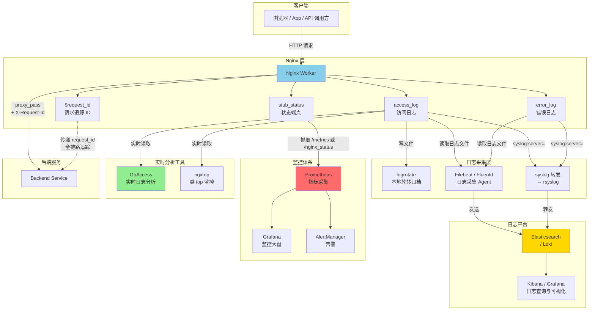

# 20 - 日志与监控

> **版本基线**：Nginx 1.30.4 (stable) | 创建日期：2026-08-05
> **受众**：后端开发熟手（熟悉 Python/Java/Lua），但服务器运维是小白。本篇把 Nginx 的日志体系与监控方案从原理到实战一次讲透。

---

## 目录

- [1. 学习目标](#1-学习目标)
- [2. 核心知识点](#2-核心知识点)
  - [2.1 知识点一：access_log 与 log_format](#21-知识点一access_log-与-log_format)
  - [2.2 知识点二：error_log](#22-知识点二error_log)
  - [2.3 知识点三：日志轮转](#23-知识点三日志轮转)
  - [2.4 知识点四：syslog 转发](#24-知识点四syslog-转发)
  - [2.5 知识点五：stub_status 模块](#25-知识点五stub_status-模块)
  - [2.6 知识点六：自定义状态页（开源方案）](#26-知识点六自定义状态页开源方案)
  - [2.7 知识点七：请求追踪](#27-知识点七请求追踪)
  - [2.8 知识点八：慢请求分析](#28-知识点八慢请求分析)
  - [2.9 知识点九：实时监控方案](#29-知识点九实时监控方案)
- [3. Mermaid 图：日志采集与监控架构](#3-mermaid-图日志采集与监控架构)
- [4. 最佳实践](#4-最佳实践)
- [5. 常见踩坑引用](#5-常见踩坑引用)
- [6. 小结](#6-小结)

---

## 1. 学习目标

学完本篇，你应当能够：

- 掌握 `log_format` 自定义日志格式的方法，理解常用日志变量（`$remote_addr`、`$request_time`、`$upstream_response_time` 等）的含义。
- 掌握 `access_log` 指令的用法，能按 location 级别开关日志，能输出 JSON 格式日志方便采集系统消费。
- 理解 `error_log` 的 8 个级别（debug ~ emerg），知道调试模式需要 `--with-debug` 编译选项。
- 掌握用 `logrotate` + `nginx -s reopen`（USR1 信号）实现日志轮转，避免日志文件无限膨胀。
- 掌握将 access_log / error_log 转发到 syslog 服务器（rsyslog、ELK 等）的配置方法。
- 掌握 `stub_status` 模块暴露的连接状态指标（Active / Reading / Writing / Waiting）的含义，了解开源版与商业版 status API 的区别。
- 了解用 `lua-resty-prometheus` 或 `ngx_vts` 模块暴露 Prometheus 指标的开源方案。
- 掌握用 `$request_id` 实现全链路请求追踪，并传递给后端。
- 能用 `awk` 等命令从日志中分析慢请求。
- 了解 GoAccess、ngxtop 等实时日志分析工具。
- 避开踩坑 `#2.6`（文件描述符限制与日志文件）。

> **前置知识**：建议先完成 [04-配置文件结构与指令体系](../02-配置基础/04-配置文件结构与指令体系.md) 和 [09-反向代理proxy_pass](../04-反向代理与负载均衡/09-反向代理proxy_pass.md)。

---

## 2. 核心知识点

### 2.1 知识点一：access_log 与 log_format

Nginx 的访问日志由 `ngx_http_log_module` 提供。它通过两个核心指令配合工作：`log_format` 定义日志的**格式模板**，`access_log` 决定**写到哪里、用什么格式**。

#### log_format 定义日志格式

```nginx
log_format name [escape=default|json|none] string ...;
```

| 参数 | 说明 |
|------|------|
| `name` | 格式名称，在 `access_log` 中引用 |
| `escape` | 转义方式：`default`（默认，转义非 ASCII 字符）、`json`（JSON 安全转义）、`none`（不转义） |
| `string` | 日志格式字符串，由文本和 Nginx 变量组成 |

#### 常用日志变量

| 变量 | 含义 | 示例值 |
|------|------|--------|
| `$remote_addr` | 客户端 IP（直连 Nginx 的地址，非真实客户端） | `192.168.1.100` |
| `$time_local` | 请求时间（本地时区，通用日志格式） | `05/Aug/2026:10:23:45 +0800` |
| `$request` | 原始请求行（方法 + URI + 协议） | `GET /api/users HTTP/1.1` |
| `$status` | 响应状态码 | `200` |
| `$body_bytes_sent` | 发送给客户端的响应体字节数（不含响应头） | `1024` |
| `$request_time` | 请求总耗时（从接收第一个字节到发送完最后一个字节） | `0.235` |
| `$upstream_response_time` | 后端响应耗时（从发请求到收完响应头+体） | `0.180` |
| `$upstream_addr` | 后端服务器地址 | `10.0.0.1:8080` |
| `$http_referer` | 请求头 Referer 的值 | `https://example.com/page` |
| `$http_user_agent` | 请求头 User-Agent 的值 | `Mozilla/5.0 ...` |

#### access_log 指令

```nginx
access_log path [format [buffer=size] [gzip[=level]] [flush=time] [if=condition]];
access_log off;
```

| 参数 | 说明 |
|------|------|
| `path` | 日志文件路径，或 `syslog:` 前缀，或内存日志 `memory:` |
| `format` | 引用的 `log_format` 名称（默认 `combined`） |
| `buffer=size` | 日志写入缓冲区大小，减少磁盘 IO（如 `buffer=32k`） |
| `gzip[=level]` | 压缩日志后写入（1~9），需要 Nginx 编译时链接 zlib |
| `flush=time` | 缓冲区刷写间隔（如 `flush=5s`），配合 buffer 使用 |
| `if=condition` | 条件日志，仅当条件为真时记录 |

#### access_log off 关闭日志

某些 location（如健康检查、静态资源）请求量极大但无需记录日志，可以关闭以减少 IO：

```nginx
location /health {
    access_log off;   # 不记录该 location 的访问日志
    proxy_pass http://backend;
}
```

#### 代码示例：定义 JSON 格式日志方便采集

JSON 格式日志能被 Filebeat、Fluentd、Logstash 等采集工具直接解析，无需用复杂的正则切割，是生产环境的推荐做法。

```nginx
http {
    # 定义 JSON 格式的日志
    log_format json_combined escape=json
        '{'
            '"@timestamp":"$time_iso8601",'
            '"remote_addr":"$remote_addr",'
            '"request_method":"$request_method",'
            '"request_uri":"$request_uri",'
            '"server_name":"$server_name",'
            '"status":$status,'
            '"body_bytes_sent":$body_bytes_sent,'
            '"request_time":$request_time,'
            '"upstream_addr":"$upstream_addr",'
            '"upstream_response_time":"$upstream_response_time",'
            '"http_referer":"$http_referer",'
            '"http_user_agent":"$http_user_agent",'
            '"request_id":"$request_id"'
        '}';
    # escape=json: 对变量值中的特殊字符（引号、反斜杠等）做 JSON 安全转义
    #             确保输出的 JSON 字符串合法，不会被恶意请求头破坏解析
    # $time_iso8601: ISO 8601 格式时间（如 2026-08-05T10:23:45+08:00）
    #                比 $time_local 更适合机器解析
    # $request_method: 请求方法（GET/POST 等），从 $request 中拆出更方便
    # $request_uri: 原始请求 URI（含参数），不会因 rewrite 而改变
    # $status / $body_bytes_sent: 数值类型不加引号，输出为 JSON 数字
    # $request_time: 请求总耗时（秒，浮点数）
    # $upstream_response_time: 后端响应耗时（可能有多个，用逗号分隔）
    # $request_id: 请求唯一标识（32 位十六进制），用于全链路追踪

    server {
        listen 80;
        server_name example.com;

        # 使用 JSON 格式记录访问日志，带缓冲
        access_log /var/log/nginx/access.log json_combined buffer=32k flush=5s;
        # /var/log/nginx/access.log: 日志文件路径
        # json_combined: 引用上面定义的 JSON 格式
        # buffer=32k: 32KB 缓冲区，攒满后一次性写入磁盘，减少 IO 次数
        # flush=5s: 即使缓冲区没满，最多 5 秒也会刷写一次，保证日志时效性

        location / {
            proxy_pass http://backend;
        }

        # 健康检查不记录日志
        location /health {
            access_log off;
            proxy_pass http://backend;
        }
    }
}
```

输出的日志示例：

```json
{"@timestamp":"2026-08-05T10:23:45+08:00","remote_addr":"203.0.113.66","request_method":"GET","request_uri":"/api/users","server_name":"example.com","status":200,"body_bytes_sent":1024,"request_time":0.235,"upstream_addr":"10.0.0.1:8080","upstream_response_time":"0.180","http_referer":"https://example.com/page","http_user_agent":"Mozilla/5.0 (Macintosh)","request_id":"a1b2c3d4e5f6a7b8c9d0e1f2a3b4c5d6"}
```

#### 特例说明

1. **`$request_time` 是请求总耗时**：它从 Nginx **接收请求的第一个字节**开始计时，到 Nginx **发送完响应的最后一个字节**结束。包含了接收请求体、等待后端响应、发送响应体的全部时间。而 `$upstream_response_time` 仅计算 Nginx 与后端之间的交互时间。因此 `$request_time - $upstream_response_time` 的差值可以粗略反映 Nginx 自身的处理开销和客户端网络传输耗时。

2. **`escape=json` 的重要性**：如果不加 `escape=json`，当 User-Agent 中含有 `"` 或 `\` 时，输出的 JSON 会格式错误，导致采集工具解析失败。`escape=json` 会自动将这些字符转义为 `\"` 和 `\\`。

3. **buffer 与 flush 的取舍**：开启 `buffer` 后日志不会立即写盘，在崩溃时可能丢失最后几条日志。对日志完整性要求极高的场景（如审计日志）不要开 buffer；普通访问日志开 buffer 能显著降低 IO。

4. **`$body_bytes_sent` vs `$bytes_sent`**：`$body_bytes_sent` 只统计响应体大小（不含响应头），`$bytes_sent` 统计整个响应（含响应头）的大小。

5. **默认格式 `combined`**：Nginx 自带一个名为 `combined` 的默认格式，如果不指定 `log_format`，`access_log` 默认使用它。格式为：`$remote_addr - $remote_user [$time_local] "$request" $status $body_bytes_sent "$http_referer" "$http_user_agent"`。

---

### 2.2 知识点二：error_log

`error_log` 由 `ngx_core_module` 提供，用于记录 Nginx 运行时的错误和诊断信息。与 `access_log` 不同，`error_log` 可以出现在 `main`、`http`、`server`、location 等多个上下文。

#### error_log 的级别

从低到高共 8 个级别：

| 级别 | 说明 | 使用场景 |
|------|------|----------|
| `debug` | 调试信息（最详细） | 排查复杂问题，需要 `--with-debug` 编译 |
| `info` | 一般信息 | 记录启动、reload 等运行信息 |
| `notice` | 通知 | 重要但不紧急的信息 |
| `warn` | 警告 | 配置问题或潜在风险（如限流触发） |
| `error` | 错误（默认级别） | 请求处理错误、连接失败等 |
| `crit` | 严重 | 关键错误，如 worker 异常 |
| `alert` | 告警 | 必须立即处理的问题 |
| `emerg` | 紧急 | 系统不可用，如绑定端口失败 |

指定某个级别后，该级别及**更高**级别的日志都会被记录。例如设为 `warn`，则 `warn`、`error`、`crit`、`alert`、`emerg` 都会记录。

#### 调试模式

要记录 `debug` 级别的日志，Nginx 必须在编译时启用 `--with-debug` 选项：

```bash
# 查看当前 Nginx 是否编译了 debug 支持
nginx -V 2>&1 | grep -- '--with-debug'

# 如果没有，需要重新编译
./configure --with-debug ...
make && make install
```

#### 语法

```nginx
error_log file [level];
```

#### 代码示例

```nginx
# main 上下文：全局错误日志，级别为 warn
error_log /var/log/nginx/error.log warn;
# /var/log/nginx/error.log: 全局错误日志路径
# warn: 记录 warn 及以上级别（warn/error/crit/alert/emerg）
#       不记录 info/notice/debug（减少日志量）

http {
    server {
        listen 80;
        server_name example.com;

        # 指定 server 级别的 error_log（覆盖全局）
        error_log /var/log/nginx/example.com.error.log error;
        # error: 仅记录 error 及以上级别
        # 适合生产环境日常运行，日志量适中

        location /api/ {
            # 调试某个 location 的问题时，临时开启 debug 级别
            # 注意：需要 Nginx 编译时 --with-debug
            error_log /var/log/nginx/api_debug.log debug;
            # debug: 记录所有级别的日志，包括最详细的调试信息
            # 仅在排查问题时临时使用，平时不要开（日志量极大）

            proxy_pass http://backend;
        }
    }
}
```

#### 特例说明

1. **debug 级别日志量极大**：开启 `debug` 后，每个请求会产生几十甚至上百行日志，严重影响性能和磁盘。仅用于临时排查问题，排查完立即关闭。

2. **可以针对特定客户端开启 debug**：如果只想调试某个 IP 的请求，避免影响全局日志：
   ```nginx
   # 只有来自 192.168.1.100 的请求记录 debug 日志
   error_log /var/log/nginx/debug.log debug;
   # 配合 debug_connection 指令（需要 --with-debug）
   events {
       debug_connection 192.168.1.100/32;
   }
   ```

3. **error_log 不能完全关闭**：与 `access_log off` 不同，`error_log` 没有真正的"关闭"选项。如果写 `error_log /dev/null;`（不指定级别），Nginx 会回退到默认的 `error` 级别记录到该文件。从 1.7.11 起，可以用 `error_log /dev/null crit;` 只记录最严重的错误来"近似关闭"。

4. **stderr 日志**：编译时的默认 error_log 是 `logs/error.log`。如果用 systemd 管理 Nginx，可以把 error_log 指向 stderr（`error_log stderr warn;`），让日志走 journald 统一管理。

---

### 2.3 知识点三：日志轮转

Nginx 的 access_log 会持续追加写入同一个文件。如果不做轮转，日志文件会无限膨胀，最终撑满磁盘。日志轮转的核心思路是：定期把当前日志文件重命名归档，让 Nginx 写入一个新文件。

#### 核心问题：Nginx 持有文件句柄

当直接重命名 access.log 文件时，Nginx 的 worker 进程仍持有原文件的文件描述符（fd），会继续写入重命名后的文件，而不会自动创建新的 access.log。必须通知 Nginx **重新打开**日志文件。

#### nginx -s reopen 重新打开日志文件

```bash
# 给 master 进程发送 reopen 信号，通知所有 worker 重新打开日志文件
nginx -s reopen
# 等价于 kill -USR1 $(cat /var/run/nginx.pid)
# worker 收到信号后，关闭当前的日志 fd，重新以同名文件打开
# 此时新日志写入新的 access.log，旧文件保留为归档
```

#### USR1 信号

`nginx -s reopen` 的底层实现就是向 master 进程发送 `USR1` 信号。master 收到后通知所有 worker 重新打开日志文件。这是日志轮转的关键信号。

| 信号 | 作用 |
|------|------|
| `USR1` | 重新打开日志文件（reopen），用于日志轮转 |
| `USR2` | 热升级二进制文件 |
| `HUP` | 重新加载配置（reload） |
| `QUIT` | 优雅关闭（等待请求处理完） |
| `TERM` / `INT` | 快速关闭 |

#### logrotate 配置示例

`logrotate` 是 Linux 系统自带的日志轮转工具，通常配合 cron 定时执行。

```bash
# /etc/logrotate.d/nginx
/var/log/nginx/*.log {
    daily              # 每天轮转一次
    # daily: 每天轮转；weekly: 每周；monthly: 每月
    # 也可用 size 100M 按大小轮转

    missingok          # 日志文件不存在时不报错
    # 避免某些 server 没有 error.log 时 logrotate 报错退出

    rotate 30          # 保留 30 个归档文件
    # 超过 30 个旧文件后自动删除最旧的
    # 即保留约 30 天的历史日志

    compress           # 用 gzip 压缩归档文件
    # 节省磁盘空间，日志压缩率通常很高（80%+）

    delaycompress      # 延迟压缩：最新一轮归档不压缩，下一轮才压缩
    # 因为 Nginx reopen 后可能还有少量日志写入旧文件
    # 延迟一轮压缩，避免文件被锁导致压缩失败

    notifempty         # 日志文件为空时不轮转
    # 避免产生空的归档文件

    create 640 nginx adm   # 轮转后创建新日志文件的权限和属主
    # 640: 文件权限（owner 读写、group 读、其他无权限）
    # nginx: 文件属主（Nginx worker 的运行用户）
    # adm: 文件属组（adm 组通常有读日志的权限，方便运维查看）

    sharedscripts      # 多个日志文件轮转后只执行一次脚本
    # 因为下面的 postrotate 脚本只需要执行一次 nginx reopen

    postrotate         # 轮转后执行的脚本
        if [ -f /var/run/nginx.pid ]; then
            kill -USR1 `cat /var/run/nginx.pid`
        fi
    endscript
    # postrotate: 在日志文件重命名后、新文件创建后执行
    # kill -USR1: 向 Nginx master 发送 USR1 信号
    #   → master 通知所有 worker 重新打开日志文件
    #   → worker 关闭旧 fd（指向已重命名的归档文件）
    #   → worker 以原文件名重新打开（指向新创建的空文件）
    # if [ -f ... ] 判断 pid 文件存在，避免 Nginx 未运行时报错
}
```

#### 轮转流程图

```
1. logrotate 执行（如每天凌晨）
   │
   ▼
2. 将 access.log 重命名为 access.log.1（轮转）
   │  此时 Nginx 仍持有旧 fd，继续写入 access.log.1
   ▼
3. 创建新的空 access.log（create 640 nginx adm）
   │  但 Nginx 的 fd 还指向旧文件，不会写入新文件
   ▼
4. 执行 postrotate: kill -USR1（nginx -s reopen）
   │  Nginx 收到 USR1 信号
   ▼
5. worker 重新打开日志文件
   │  关闭旧 fd → 以 access.log 名打开新文件
   ▼
6. 新日志写入新的 access.log，access.log.1 为归档
   │  下一轮轮转时 access.log.1 → access.log.2.gz（压缩）
```

#### 特例说明

1. **不要在轮转期间 reload**：reload（HUP 信号）会导致 worker 重新加载配置，可能与 USR1 信号产生竞争。日志轮转脚本只发 USR1，不要发 HUP。

2. **copytruncate 方案的取舍**：有些场景不方便发 USR1 信号（如 Nginx 运行在容器内），可以用 `copytruncate` 替代 `postrotate`：
   ```
   /var/log/nginx/*.log {
       daily
       rotate 30
       compress
       copytruncate    # 复制当前日志到归档，然后清空原文件
   }
   ```
   `copytruncate` 的缺点：复制和清空之间有一个极小的时间窗口，可能丢失几条日志；且大文件复制开销大。生产环境优先用 `postrotate` + USR1 方案。

3. **容器环境的日志轮转**：Docker 环境下推荐让 Nginx 输出到 stdout/stderr，由 Docker 的日志驱动统一管理轮转，而不是写文件。这样不需要 logrotate。

---

### 2.4 知识点四：syslog 转发

在集中化日志架构中，Nginx 不把日志写本地文件，而是直接转发到 syslog 服务器（如 rsyslog、syslog-ng），再由 syslog 服务器分发到 ELK、Loki 等日志平台。

#### syslog:server= 参数

```nginx
access_log syslog:server=address [facility=...] [tag=...] [severity=...] format;
error_log  syslog:server=address [facility=...] [tag=...] [severity=...] level;
```

| 参数 | 说明 |
|------|------|
| `server=address` | syslog 服务器地址，支持 `host:port`（UDP）、`unix:path`（Unix socket） |
| `facility=` | syslog 设施（kern/user/local0~7 等），默认 `local7` |
| `tag=` | 日志标签，默认 `nginx` |
| `severity=` | syslog 严重级别（info/notice/warning/error 等） |

#### 代码示例

```nginx
http {
    log_format json_combined escape=json
        '{"time":"$time_iso8601","remote_addr":"$remote_addr","status":$status,"request_time":$request_time}';

    server {
        listen 80;
        server_name example.com;

        # 将访问日志转发到 syslog 服务器
        access_log syslog:server=10.0.0.100:514 facility=local0 tag=nginx_access
                   json_combined;
        # syslog:: 使用 syslog 协议输出日志
        # server=10.0.0.100:514: syslog 服务器地址和端口（UDP 514）
        # facility=local0: syslog 设施为 local0（用于在 syslog 中分类）
        # tag=nginx_access: 日志标签，方便 syslog 服务器过滤 Nginx 访问日志
        # json_combined: 使用上面定义的 JSON 格式

        # 将错误日志也转发到 syslog
        error_log syslog:server=10.0.0.100:514 facility=local0 tag=nginx_error warn;
        # warn: 只记录 warn 及以上级别
        # tag=nginx_error: 与 access 日志区分
    }
}
```

#### 特例说明

1. **默认用 UDP**：`server=host:port` 默认使用 UDP 协议。UDP 不保证可靠传输，网络拥塞时可能丢日志。对日志完整性要求高的场景可以用 Unix socket（`server=unix:/dev/log`）走本地 rsyslog 中转，或使用 TCP（需 syslog 服务器支持）。

2. **syslog 和文件日志可同时使用**：一个 location 可以配置多个 `access_log`，同时写文件和发 syslog：
   ```nginx
   location /api/ {
       access_log /var/log/nginx/api_access.log json_combined;
       access_log syslog:server=10.0.0.100:514 tag=nginx_api json_combined;
       proxy_pass http://backend;
   }
   ```

3. **buffer 不适用于 syslog**：`buffer` 和 `flush` 参数只对文件日志有效，syslog 输出不支持缓冲。

---

### 2.5 知识点五：stub_status 模块

`ngx_http_stub_status_module` 提供 Nginx 自身的基本连接状态信息，是开源版 Nginx 唯一内置的状态监控端点。

#### stub_status 基本状态信息

访问 stub_status 端点会返回如下纯文本：

```
Active connections: 5
server accepts handled requests
 1234 1234 5678
Reading: 0 Writing: 3 Waiting: 2
```

#### 各指标含义

| 指标 | 含义 | 说明 |
|------|------|------|
| Active connections | 当前活跃连接数 | 所有正在处理的连接总数（含 Reading/Writing/Waiting） |
| accepts | 已接受的连接总数 | 从 Nginx 启动以来接受的总连接数（计数器，只增不减） |
| handled | 已处理的连接总数 | 从 Nginx 启动以来处理的总连接数（通常等于 accepts） |
| requests | 已处理的请求总数 | 从 Nginx 启动以来处理的总请求数（计数器） |
| Reading | 正在读取请求头的连接数 | Nginx 正在从客户端读取请求头的连接数 |
| Writing | 正在返回响应的连接数 | Nginx 正在向客户端发送响应的连接数 |
| Waiting | 空闲等待中的连接数 | 开启 keepalive 后，连接空闲等待下一个请求的数量 |

> **Reading + Writing + Waiting = Active connections**

#### 代码示例

```nginx
server {
    listen 80;
    server_name localhost;

    # stub_status 端点配置
    location /nginx_status {
        stub_status;             # 启用 stub_status 模块，输出状态信息
        # stub_status: 不需要参数，直接在 location 中启用

        access_log off;          # 不记录对该端点的访问日志
        # 避免监控系统频繁访问 /nginx_status 污染访问日志

        # 限制只有内网可以访问（状态信息不应暴露给公网）
        allow 127.0.0.1;         # 允许本机访问（Prometheus 抓取）
        allow 10.0.0.0/8;        # 允许内网访问
        deny all;               # 拒绝其他所有 IP
    }
}
```

访问 `http://localhost/nginx_status` 返回示例：

```
Active connections: 15
server accepts handled requests
 89321 89321 456789
Reading: 1 Writing: 3 Waiting: 11
```

#### 关键指标解读

- **accepts vs handled**：正常情况下两者相等。如果 `accepts > handled`，说明有连接被接受但没被处理（可能因资源限制被丢弃），需要关注。
- **Waiting 占比高**：开启了 keepalive 时，大量连接处于 Waiting 状态是正常的——它们是复用的空闲长连接，不消耗额外资源。如果 Waiting 为 0 且 Active 很高，可能是短连接太多，应考虑开启 keepalive。
- **requests / handled**：平均每个连接处理的请求数。如果该值接近 1，说明连接复用率低（每个连接只处理一个请求就断开）。

#### 版本提示

> **重要**：开源版 Nginx **仅有 `stub_status`**，提供上述 7 个基础指标。完整的 status API（包含各 upstream 的健康状态、缓存命中率、各 server 的详细请求统计等）是 **NGINX Plus（商业版）** 的功能，通过 `status` 端点提供。

---

### 2.6 知识点六：自定义状态页（开源方案）

`stub_status` 的指标太少，无法满足 Prometheus + Grafana 的监控需求。开源社区有几种方案来暴露更丰富的指标。

#### 方案一：lua-resty-prometheus（推荐）

基于 OpenResty 的 Lua 库，在 Nginx 中嵌入一个 Prometheus 指标暴露端点。这是目前最主流的开源方案。

```nginx
# 需要 OpenResty 或编译了 ngx_lua 的 Nginx
http {
    lua_shared_dict prometheus_metrics 10M;

    init_by_lua_block {
        prometheus = require("prometheus").init("prometheus_metrics")
        metric_requests = prometheus:counter("nginx_http_requests_total", "Number of HTTP requests")
        metric_latency = prometheus:histogram("nginx_http_request_duration_seconds", "HTTP request latency")
    }

    log_by_lua_block {
        metric_requests:inc(1, {ngx.var.server_name, ngx.var.status})
        metric_latency:observe(ngx.var.request_time, {ngx.var.server_name})
    }

    server {
        location /metrics {
            content_by_lua_block {
                prometheus:collect()
            }
            access_log off;
            allow 127.0.0.1;
            deny all;
        }
    }
}
```

- 在 `init_by_lua_block` 中初始化 Prometheus 指标（计数器、直方图）。
- 在 `log_by_lua_block` 中记录每个请求的状态码和耗时。
- `/metrics` 端点暴露 Prometheus 格式的指标，供 Prometheus 抓取。

#### 方案二：ngx_vts 模块

`nginx-module-vts` 是第三方 C 模块，提供比 stub_status 更丰富的虚拟主机流量统计。

```nginx
http {
    vhost_traffic_status_zone;   # 启用流量统计共享内存

    server {
        location /status {
            vhost_traffic_status_display;       # 启用状态页
            vhost_traffic_status_display_format html;  # 输出格式（html/json/prometheus）
            access_log off;
            allow 127.0.0.1;
            deny all;
        }
    }
}
```

- `vhost_traffic_status_zone`：在 http 块中开启，分配共享内存统计各虚拟主机流量。
- 支持 `html`、`json`、`prometheus` 三种输出格式，可直接对接 Prometheus。

#### 方案对比

| 方案 | 优点 | 缺点 | 适用场景 |
|------|------|------|----------|
| lua-resty-prometheus | 灵活自定义指标，社区活跃 | 需要 OpenResty / ngx_lua | 已用 OpenResty 的环境 |
| ngx_vts | 开箱即用，指标丰富 | 需编译第三方 C 模块 | 原生 Nginx + 需要虚拟主机级统计 |
| stub_status（内置） | 无需额外安装 | 指标太少 | 简单监控 / 健康检查 |

---

### 2.7 知识点七：请求追踪

在微服务架构中，一个用户请求可能经过 Nginx → API 网关 → 多个后端服务。当出现问题时，需要用一个唯一 ID 串联整条链路，这就是**全链路追踪**。

#### $request_id

自 **Nginx 1.11.0** 起，内置了 `$request_id` 变量。它是一个 32 位十六进制字符串（16 字节随机数），每个请求唯一。

```
a1b2c3d4e5f6a7b8c9d0e1f2a3b4c5d6
```

#### 在日志中记录 request_id

```nginx
http {
    log_format json_combined escape=json
        '{"time":"$time_iso8601","request_id":"$request_id","method":"$request_method","uri":"$request_uri","status":$status,"request_time":$request_time}';
    # 在 log_format 中加入 $request_id
    # 每条日志都带上请求唯一 ID

    server {
        listen 80;
        access_log /var/log/nginx/access.log json_combined;

        location /api/ {
            # 将 request_id 传递给后端
            proxy_set_header X-Request-Id $request_id;
            # $request_id: Nginx 为该请求生成的唯一 ID
            # X-Request-Id: 自定义请求头名，后端读取此头获取追踪 ID
            # 后端收到后应记录在自己的日志中，并在调用下游服务时继续传递

            proxy_pass http://backend;
        }
    }
}
```

#### 完整全链路追踪配置

```nginx
http {
    log_format trace escape=json
        '{"time":"$time_iso8601",'
        '"request_id":"$request_id",'
        '"remote_addr":"$remote_addr",'
        '"method":"$request_method",'
        '"uri":"$request_uri",'
        '"status":$status,'
        '"request_time":$request_time,'
        '"upstream_addr":"$upstream_addr",'
        '"upstream_response_time":"$upstream_response_time"}';

    server {
        listen 80;
        access_log /var/log/nginx/access.log trace;

        location /api/ {
            # 传递追踪 ID 给后端
            proxy_set_header X-Request-Id $request_id;
            # 后端日志中记录该 ID，调用下游服务时继续透传

            # 传递客户端真实信息
            proxy_set_header X-Real-IP $remote_addr;
            proxy_set_header X-Forwarded-For $proxy_add_x_forwarded_for;

            proxy_pass http://backend;
        }
    }
}
```

#### 适用场景：全链路追踪

当用户反馈"某个请求慢"时，可以：

1. 从 Nginx 日志中用 `request_id` 找到该请求的记录，查看 `request_time` 和 `upstream_response_time`。
2. 用 `request_id` 在后端服务日志中搜索，找到该请求在各服务中的处理耗时。
3. 如果后端调用了下游服务，下游也应记录并透传 `X-Request-Id`，形成完整链路。

#### 特例说明

1. **$request_id 是 Nginx 自动生成的**：如果客户端已经发送了 `X-Request-Id` 头，Nginx 不会使用它，而是生成新的 `$request_id`。如果希望尊重客户端传入的 ID：
   ```nginx
   map $http_x_request_id $trace_id {
       default $http_x_request_id;   # 客户端传了就用客户端的
       ""      $request_id;          # 客户端没传就用 Nginx 生成的
   }
   # 后续用 $trace_id 代替 $request_id
   ```

2. **32 位十六进制 = 128 位随机数**：碰撞概率极低（2^128 分之一），可以安全地作为全局唯一 ID 使用。

---

### 2.8 知识点八：慢请求分析

通过在日志中记录 `$request_time` 和 `$upstream_response_time`，可以分析哪些请求耗时过长。

#### 记录耗时信息的日志格式

```nginx
http {
    log_format perf escape=json
        '{"time":"$time_iso8601",'
        '"method":"$request_method",'
        '"uri":"$request_uri",'
        '"status":$status,'
        '"request_time":$request_time,'
        '"upstream_addr":"$upstream_addr",'
        '"upstream_response_time":"$upstream_response_time",'
        '"upstream_status":"$upstream_status"}';
    # request_time: 总耗时（Nginx 收到请求到响应完成的完整时间）
    # upstream_response_time: 后端处理耗时
    # upstream_status: 后端返回的状态码
    # upstream_addr: 后端地址（可判断是哪台后端慢）

    server {
        access_log /var/log/nginx/access.log perf;
        location / {
            proxy_pass http://backend;
        }
    }
}
```

#### 分析慢请求的 awk 命令

以下命令针对**非 JSON 的传统日志格式**（combined 格式变体）。如果用 JSON 格式，建议用 `jq` 工具解析。

**传统日志格式示例**（便于 awk 解析）：

```nginx
log_format perf '$time_local "$request_method $request_uri" '
                '$status $request_time $upstream_response_time '
                '$upstream_addr';
```

```bash
# 示例日志行：
# 05/Aug/2026:10:23:45 "GET /api/users" 200 0.235 0.180 10.0.0.1:8080

# 命令一：找出耗时超过 1 秒的慢请求
awk '$5 > 1 {print}' /var/log/nginx/access.log
# $5: 第五列是 request_time（秒）
# > 1: 只打印耗时超过 1 秒的行
# 输出所有慢请求的完整日志

# 命令二：统计最慢的 Top 10 请求
awk '{print $5, $2, $3}' /var/log/nginx/access.log | sort -rn | head -10
# {print $5, $2, $3}: 打印 耗时 + 方法 + URI
# sort -rn: 按数值降序排序（从慢到快）
# head -10: 取前 10 条

# 命令三：按 URI 分组统计平均耗时
awk '{uri=$3; time[uri]+=$5; count[uri]++} 
     END {for (u in time) printf "%s avg=%.3f count=%d\n", u, time[u]/count[u], count[u]}' 
     /var/log/nginx/access.log | sort -t= -k2 -rn
# uri=$3: 第三列是 URI
# time[uri]+=$5: 累加每个 URI 的总耗时
# count[uri]++: 统计每个 URI 的请求次数
# END 块: 计算并输出每个 URI 的平均耗时和请求次数
# sort -t= -k2 -rn: 按平均耗时降序排列

# 命令四：对比 Nginx 总耗时与后端耗时，找出 Nginx 自身开销大的请求
awk '$5 - $6 > 0.5 {print $0, "nginx_overhead=" $5-$6}' /var/log/nginx/access.log
# $5: request_time（总耗时）
# $6: upstream_response_time（后端耗时）
# $5-$6 > 0.5: Nginx 自身开销（网络传输+buffer）超过 0.5 秒
# 输出 Nginx 侧耗时过高的请求

# 命令五：统计状态码分布
awk '{count[$4]++} END {for (code in count) print code, count[code]}' 
     /var/log/nginx/access.log | sort
# $4: 第四列是状态码
# count[$4]++: 按状态码分组计数
# 输出各状态码的出现次数
```

#### 特例说明

1. **`$upstream_response_time` 可能有多个值**：当请求被 `proxy_next_upstream` 重试到多台后端时，该变量包含多个值（逗号分隔），如 `0.180, 0.200`。awk 解析时需要注意这种多值情况。

2. **JSON 日志用 jq 解析更方便**：如果用 JSON 格式日志，用 `jq` 工具比 awk 更可靠：
   ```bash
   # 找出慢请求（JSON 格式）
   jq -c 'select(.request_time > 1)' /var/log/nginx/access.log

   # 按 URI 统计平均耗时（JSON 格式）
   jq -r '[.uri, .request_time] | @tsv' /var/log/nginx/access.log \
       | awk '{t[$1]+=$2; c[$1]++} END {for (u in t) printf "%s avg=%.3f n=%d\n", u, t[u]/c[u], c[u]}'
   ```

---

### 2.9 知识点九：实时监控方案

除了事后分析日志，还有实时监控 Nginx 的工具。

#### GoAccess：实时日志分析

GoAccess 是一个开源的实时 Web 日志分析器，能终端实时展示 + 生成 HTML 报告。

```bash
# 实时分析 Nginx 访问日志（终端模式）
goaccess /var/log/nginx/access.log
# 默认会提示选择日志格式，按空格选择 Nginx 的 combined 格式

# 指定日志格式实时分析
goaccess /var/log/nginx/access.log --log-format=COMBINED

# 生成实时 HTML 报告
goaccess /var/log/nginx/access.log \
    --log-format=COMBINED \
    --real-time-html \
    -o /var/www/html/report.html
# --real-time-html: 实时更新 HTML 报告（WebSocket 推送）
# -o: 输出 HTML 文件路径
# 配合 Nginx 静态文件服务即可在浏览器查看实时报表

# 分析 JSON 格式日志
goaccess /var/log/nginx/access.log \
    --log-format='{"@timestamp":"%x","remote_addr":"%h","request_method":"%m","request_uri":"%U","status":%s,"body_bytes_sent":%b,"request_time":%T,"http_user_agent":"%u"}' \
    --date-format=%Y-%m-%dT%H:%M:%S%z \
    --time-format=%H:%M:%S
# 需要手动指定 JSON 中各字段对应的 GoAccess 占位符
```

GoAccess 展示的指标包括：
- 独立访客数、请求总数、带宽
- 请求方法、状态码分布
- Top URL、Top 来源 IP、Top User-Agent
- 404 错误统计、请求耗时分布

#### ngxtop：类 top 的 Nginx 监控

ngxtop 是一个 Python 工具，用类似 `top` 命令的交互式界面实时监控 Nginx 日志。

```bash
# 安装
pip install ngxtop

# 基本用法：实时监控默认日志
ngxtop
# 自动检测 Nginx 配置中的 access_log 路径并实时分析
# 界面类似 top，按请求频率实时刷新

# 指定日志文件
ngxtop -l /var/log/nginx/access.log
# -l: 指定日志文件路径

# 指定日志格式（自定义格式时）
ngxtop -l /var/log/nginx/access.log -f '$remote_addr - $remote_user [$time_local] "$request" $status $body_bytes_sent'

# 只查看状态码为 4xx/5xx 的请求
ngxtop -l /var/log/nginx/access.log --filter 'status >= 400'

# 按请求路径分组统计
ngxtop -l /var/log/nginx/access.log --group-by request_uri

# 查看 Top 10 请求路径
ngxtop -l /var/log/nginx/access.log --group-by request_uri -n 10
# -n 10: 只显示前 10 条
```

#### 工具对比

| 工具 | 特点 | 适用场景 |
|------|------|----------|
| GoAccess | 终端实时 + HTML 报告，指标丰富 | 日常运维监控、可视化报表 |
| ngxtop | 轻量、交互式、类 top | 快速排查问题、实时查看 Top 请求 |
| Prometheus + Grafana | 长期存储、告警、Dashboard（需 exporter） | 生产级监控体系 |

> **生产推荐**：日常排查用 ngxtop 快速看一下；需要可视化报表用 GoAccess；需要长期监控和告警则搭建 Prometheus + Grafana 体系（配合 lua-resty-prometheus 或 nginx-exporter）。

---

## 3. Mermaid 图：日志采集与监控架构



### 架构说明

1. **日志产生**：Nginx 处理每个请求时，同时产生 access_log（访问日志）和 error_log（错误日志），并为每个请求分配 `$request_id`。

2. **日志采集（三条路径并行）**：
   - **本地轮转**：logrotate + USR1 信号定期归档本地日志文件，防止磁盘撑满。
   - **syslog 转发**：access_log / error_log 直接转发到 syslog 服务器（rsyslog），再转发到日志平台。
   - **Agent 采集**：Filebeat / Fluentd 读取本地日志文件，发送到 Elasticsearch / Loki。

3. **日志平台**：Elasticsearch（或 Loki）存储日志，Kibana（或 Grafana）提供查询和可视化界面。通过 `$request_id` 可以在日志平台中串联 Nginx 和后端服务的日志，实现全链路追踪。

4. **监控体系**：Prometheus 定期抓取 Nginx 的 `/metrics`（lua-resty-prometheus）或 `/nginx_status`（stub_status）端点，存储时序指标，Grafana 展示监控大盘，AlertManager 负责告警。

5. **实时分析**：GoAccess 和 ngxtop 实时读取本地日志文件，提供终端交互式分析，适合日常快速排查。

---

## 4. 最佳实践

### 4.1 日志格式选择

```nginx
http {
    # 生产推荐：JSON 格式日志
    log_format json_combined escape=json
        '{"@timestamp":"$time_iso8601",'
        '"remote_addr":"$remote_addr",'
        '"request_method":"$request_method",'
        '"request_uri":"$request_uri",'
        '"status":$status,'
        '"body_bytes_sent":$body_bytes_sent,'
        '"request_time":$request_time,'
        '"upstream_response_time":"$upstream_response_time",'
        '"upstream_addr":"$upstream_addr",'
        '"http_referer":"$http_referer",'
        '"http_user_agent":"$http_user_agent",'
        '"request_id":"$request_id"}';
    # escape=json: 确保 JSON 合法，避免特殊字符破坏解析
    # 包含 request_id: 支持全链路追踪
    # 包含 upstream_*: 支持慢请求分析
}
```

### 4.2 日志分级策略

```nginx
http {
    # 全局访问日志（带缓冲）
    access_log /var/log/nginx/access.log json_combined buffer=32k flush=5s;
    # buffer + flush: 减少 IO，5 秒时效性足够

    server {
        # 静态资源：不记录日志（请求量大、价值低）
        location ~* \.(js|css|png|jpg|gif|ico|woff2?)$ {
            access_log off;
        }

        # 健康检查：不记录日志
        location /health {
            access_log off;
        }

        # API 接口：记录详细日志（含追踪 ID）
        location /api/ {
            access_log /var/log/nginx/api_access.log json_combined;
            proxy_set_header X-Request-Id $request_id;
            proxy_pass http://backend;
        }
    }

    # 错误日志级别
    error_log /var/log/nginx/error.log warn;
    # warn 级别：平衡日志量和信息量
    # 不用 error（会漏掉 warn 级别的限流信息）
    # 不用 info/notice（日志量太大）
}
```

### 4.3 日志轮转配置清单

```bash
# /etc/logrotate.d/nginx
/var/log/nginx/*.log {
    daily
    rotate 30
    missingok
    compress
    delaycompress
    notifempty
    create 640 nginx adm
    sharedscripts
    postrotate
        if [ -f /var/run/nginx.pid ]; then
            kill -USR1 `cat /var/run/nginx.pid`
        fi
    endscript
}
```

### 4.4 监控配置清单

```nginx
http {
    server {
        # stub_status 状态端点（基础监控）
        location /nginx_status {
            stub_status;
            access_log off;
            allow 127.0.0.1;     # Prometheus 抓取
            deny all;
        }

        # Prometheus 指标端点（如果使用 lua-resty-prometheus）
        location /metrics {
            content_by_lua_block { prometheus:collect() }
            access_log off;
            allow 127.0.0.1;
            deny all;
        }
    }
}
```

### 4.5 监控指标告警阈值建议

| 指标 | 告警阈值 | 说明 |
|------|----------|------|
| Active connections | > worker_connections × 80% | 连接数接近上限 |
| Waiting 占比 | < 10%（高并发时） | keepalive 复用率低 |
| 5xx 错误率 | > 1% | 后端异常增多 |
| 平均 request_time | > 1s | 响应变慢 |
| accepts - handled | > 0 | 有连接被丢弃 |
| error.log 中 emerg/crit | > 0 | 出现严重错误 |

---

## 5. 常见踩坑引用

### #2.6 文件描述符 / sendfile 限制

> 日志轮转与日志文件操作涉及文件描述符（fd）的使用。Nginx 每个 worker 进程打开的日志文件也占用文件描述符。在高并发场景下，如果系统文件描述符上限不足，可能导致日志写入失败或其他功能异常。

**影响**：
- Nginx 每个 worker 打开 access.log 和 error.log 各占用一个 fd。
- 如果配置了多个 server 各自的日志文件，或者一个 location 配置了多个 access_log（文件 + syslog），fd 占用会增多。
- 日志轮转时 reopen 操作需要关闭旧 fd、打开新 fd，如果 fd 上限已满，reopen 会失败。

**解决方案**：

```nginx
# nginx.conf
worker_rlimit_nofile 65535;  # 提升 worker 进程的 fd 上限

events {
    worker_connections 65535;
}
```

```bash
# 系统层面提升 fd 上限
# /etc/security/limits.conf
# *  soft  nofile  65535
# *  hard  nofile  65535

# 查看 Nginx 当前打开的 fd
ls -l /proc/$(cat /var/run/nginx.pid)/fd | wc -l
```

> 详见：[踩坑 #2.6 文件描述符 / sendfile 限制](../99-踩坑记录与解决方案.md#26-文件描述符--sendfile-限制)

---

## 6. 小结

本篇系统讲解了 Nginx 的日志体系与监控方案，覆盖了九个知识点：

1. **access_log 与 log_format**：`log_format` 定义格式模板（支持 JSON），`access_log` 决定写到哪里。生产推荐 JSON 格式 + `escape=json` + buffer/flush。
2. **error_log**：8 个级别从 debug 到 emerg，生产用 warn。debug 级别需要 `--with-debug` 编译，仅临时排查使用。
3. **日志轮转**：logrotate 重命名日志文件 + `nginx -s reopen`（USR1 信号）让 Nginx 重新打开 fd。`delaycompress` 避免文件锁冲突。
4. **syslog 转发**：`access_log syslog:server=` 直接转发到 syslog 服务器，适合集中化日志架构。可同时写文件和发 syslog。
5. **stub_status**：开源版唯一内置状态端点，提供 7 个基础指标（Active/accepts/handled/requests/Reading/Writing/Waiting）。完整 status API 是商业版功能。
6. **自定义状态页**：lua-resty-prometheus（OpenResty）或 ngx_vts 模块暴露 Prometheus 指标，对接 Grafana 监控大盘。
7. **请求追踪**：`$request_id`（1.11.0+，32 位十六进制）实现全链路追踪，通过 `proxy_set_header X-Request-Id` 传递给后端。
8. **慢请求分析**：日志中记录 `request_time` 和 `upstream_response_time`，用 awk/jq 分析慢请求，区分 Nginx 开销和后端耗时。
9. **实时监控**：GoAccess 实时日志分析 + HTML 报告，ngxtop 类 top 交互式监控，Prometheus + Grafana 生产级监控体系。

**关键要点**：

- **JSON 日志是标配**：`escape=json` 确保格式合法，采集工具直接解析，免去正则切割之苦。
- **buffer 减少 IO**：高流量场景开 `buffer=32k flush=5s`，平衡性能和时效性。审计日志不开 buffer。
- **日志分级**：静态资源和健康检查 `access_log off`，API 接口记录详细日志含 `request_id`。
- **轮转必须 reopen**：logrotate 重命名文件后必须发 USR1 信号，否则 Nginx 继续写旧文件。
- **stub_status 是基础**：开源版只有基础指标，生产监控需要 lua-resty-prometheus 或 exporter。
- **request_id 串联全链路**：Nginx 生成 ID，传递给后端，后端继续透传，实现端到端追踪。
- **监控工具分层**：ngxtop 快速排查 → GoAccess 可视化报表 → Prometheus+Grafana 长期监控告警。

> **上一篇**：[19 - 性能调优](./19-性能调优.md)——在日志监控之前，先学习如何压榨 Nginx 的性能。
> **下一篇**：[21 - 动态模块与扩展](./21-动态模块与扩展.md)——了解 Nginx 的动态模块加载机制和 njs 脚本扩展能力。

## 🧪 本机实测（2026-08-09）

> 环境：nginx:1.30.4（Docker），`location /basic_status { stub_status; }`（官方镜像编译含 `--with-http_stub_status_module`）。

```
Active connections: 1 
server accepts handled requests
 26 26 26 
Reading: 0 Writing: 1 Waiting: 0 
```

`stub_status` 输出正常：Active connections / accepts handled requests / Reading / Writing / Waiting 五组指标齐全。
