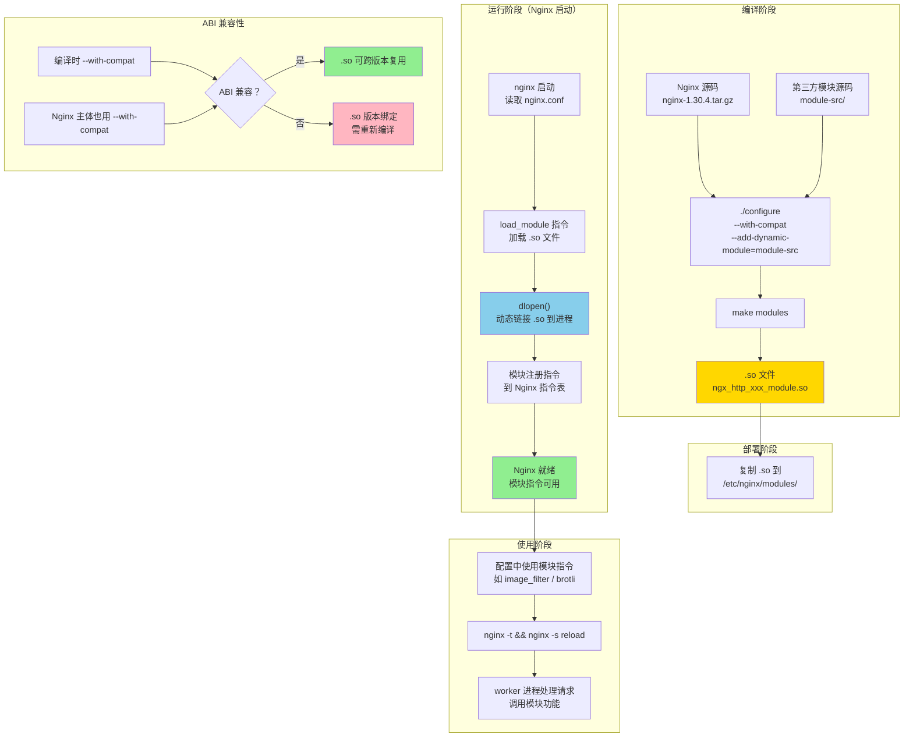

# 21 - 动态模块与扩展

> **版本基线**：Nginx 1.30.4 (stable) | 创建日期：2026-08-05
> **受众**：后端开发熟手（熟悉 Python/Java/Lua），但服务器运维是小白。本篇把 Nginx 的动态模块机制、njs 脚本扩展和编译自定义模块从原理到实战一次讲透。

---

## 目录

- [1. 学习目标](#1-学习目标)
- [2. 核心知识点](#2-核心知识点)
  - [2.1 知识点一：动态模块概述](#21-知识点一动态模块概述)
  - [2.2 知识点二：官方动态模块](#22-知识点二官方动态模块)
  - [2.3 知识点三：常用第三方动态模块](#23-知识点三常用第三方动态模块)
  - [2.4 知识点四：njs 脚本](#24-知识点四njs-脚本)
  - [2.5 知识点五：Perl 模块（embedded perl）](#25-知识点五perl-模块embedded-perl)
  - [2.6 知识点六：编译自定义动态模块](#26-知识点六编译自定义动态模块)
  - [2.7 知识点七：扩展方式对比](#27-知识点七扩展方式对比)
- [3. Mermaid 图：动态模块加载流程](#3-mermaid-图动态模块加载流程)
- [4. 最佳实践](#4-最佳实践)
- [5. 常见踩坑引用](#5-常见踩坑引用)
- [6. 小结](#6-小结)

---

## 1. 学习目标

学完本篇，你应当能够：

- 理解**静态编译**与**动态加载**的区别，知道 `--with-compat` 编译选项的作用和 ABI 兼容性原理。
- 掌握 `load_module` 指令的用法，能在配置中加载 `.so` 动态模块。
- 知道官方预编译包自带的动态模块有哪些，能用 `ls /etc/nginx/modules/` 查看。
- 了解常用的第三方动态模块（ngx_brotli、ngx_cache_purge、nginx_upstream_check_module、headers-more-nginx-module）各自的作用。
- 理解 **njs** 是什么（Nginx 的 JavaScript 子集解释器），与 OpenResty/Lua 的定位区别，能用 `js_import` / `js_set` / `js_content` 编写简单的 njs 脚本。
- 了解 `ngx_http_perl_module`（embedded perl）的 `perl_set` / `perl` 指令。
- 能从源码编译第三方模块为动态模块（`./configure --add-dynamic-module=... --with-compat` + `make modules`）。
- 能用表格对比原生配置指令、njs、OpenResty/Lua、C 模块四种扩展方式的适用场景、性能和复杂度。

> **前置知识**：建议先完成 [02-安装部署与目录结构](../02-配置基础/../01-基础认知/02-安装部署与目录结构.md) 和 [04-配置文件结构与指令体系](../02-配置基础/04-配置文件结构与指令体系.md)。

---

## 2. 核心知识点

### 2.1 知识点一：动态模块概述

#### 静态编译 vs 动态加载

在 Nginx 1.9.11 之前，所有模块（包括第三方模块）都必须在编译时静态链接进 Nginx 二进制文件。这意味着：

- 想增加一个模块 → 必须重新 `./configure && make && make install`。
- 想去掉一个模块 → 也要重新编译。
- 每次升级 Nginx → 第三方模块要跟着重新编译。

自 **Nginx 1.9.11**（2016 年 2 月）起，Nginx 支持**动态模块**（Dynamic Modules）。模块可以编译成独立的 `.so` 共享库文件，在运行时通过 `load_module` 指令按需加载，无需重新编译 Nginx 主体。

| 对比项 | 静态编译 | 动态加载 |
|--------|----------|----------|
| 编译方式 | `--add-module=路径` | `--add-dynamic-module=路径` |
| 产物 | 编译进 nginx 二进制 | 独立 `.so` 文件 |
| 增删模块 | 重新编译整个 Nginx | 修改 `load_module` + reload |
| 升级 Nginx | 模块需要重新编译 | 只要 ABI 兼容，`.so` 可直接复用 |
| 性能 | 无额外开销 | 加载时有一次性开销，运行时几乎无差异 |

> **注意**：动态模块在 Nginx 启动时加载一次（不是每个请求加载），加载后与静态模块在性能上没有可感知的区别。唯一的开销是启动时多了一个 dlopen 调用。

#### --with-compat 编译选项（ABI 兼容性）

动态模块要能跨版本复用，必须保证 **ABI（Application Binary Interface）兼容**。`--with-compat` 编译选项就是为此设计的：

- 加了 `--with-compat` 编译的 Nginx，其内部数据结构布局被"冻结"，不会因小版本升级而改变。
- 用 `--with-compat` 编译的动态模块 `.so`，可以加载到同样用 `--with-compat` 编译的其他版本 Nginx 中。
- 官方预编译包的 Nginx 默认就带了 `--with-compat`，所以官方仓库的动态模块 `.so` 可以直接用。

```
# 没有 --with-compat：模块与 Nginx 版本严格绑定
nginx 1.30.4 (无 compat) ← 只能加载为 1.30.4 编译的 .so

# 有 --with-compat：模块可跨兼容版本复用
nginx 1.30.4 (有 compat) ← 可加载为 1.30.x 编译的 .so（同样有 compat）
```

#### load_module 指令

```nginx
load_module module.so;
```

- 必须放在 `nginx.conf` 的**最外层**（main 上下文），在 `events` 和 `http` 之前。
- 路径相对于模块搜索目录（通常是 `/etc/nginx/modules/` 或编译时 `--modules-path` 指定的路径）。
- 一条 `load_module` 加载一个模块，多个模块写多条指令。

#### 版本提示

> **重要**：Nginx **1.9.11+** 开始支持动态模块。本篇基线版本 1.30.4 完全支持。官方预编译包（nginx.org 仓库的 RPM/DEB）自 1.9.11 起就将部分模块编译为独立的 `.so` 动态模块。

#### 代码示例

```nginx
# /etc/nginx/nginx.conf

# 加载动态模块（必须在 events 和 http 之前）
load_module modules/ngx_http_image_filter_module.so;
# modules/ngx_http_image_filter_module.so: 图片处理模块的动态库
# 路径相对于 --modules-path（通常是 /etc/nginx/modules/）
# 加载后，image_filter 指令就可以在 http/server/location 中使用

load_module modules/ngx_stream_module.so;
# 加载四层代理模块（stream 模块）

events {
    worker_connections 1024;
}

http {
    # 此时可以使用 image_filter 等模块指令
    server {
        location /image/ {
            image_filter resize 150 100;   # 调整图片尺寸
            proxy_pass http://backend;
        }
    }
}
```

#### 特例说明

1. **load_module 只能用一次同一个模块**：重复加载同一个 `.so` 会导致报错。每个模块写一条 `load_module` 即可。

2. **模块路径的相对性**：`load_module modules/xxx.so` 中的 `modules/` 是相对于 `--modules-path` 的路径。可以用绝对路径避免歧义：`load_module /etc/nginx/modules/xxx.so;`。

3. **加载顺序敏感**：某些模块之间有依赖关系，`load_module` 的顺序需要遵循依赖顺序。一般先加载被依赖的模块。

---

### 2.2 知识点二：官方动态模块

官方 Nginx 仓库（nginx.org 的 yum/apt 仓库）的预编译包，会将一部分原本编译进二进制的模块拆分为独立的动态模块 `.so` 文件。

#### 查看已安装模块

```bash
# 查看官方预编译包自带的动态模块
ls /etc/nginx/modules/
# 输出示例：
# ngx_http_image_filter_module.so
# ngx_http_geoip_module.so
# ngx_http_js_module.so          ← njs 模块
# ngx_http_perl_module.so        ← Perl 模块
# ngx_http_xslt_filter_module.so
# ngx_mail_module.so
# ngx_stream_module.so
# ngx_stream_geoip_module.so
# ngx_stream_js_module.so

# 查看当前 Nginx 编译时支持的模块路径
nginx -V 2>&1 | grep -o '\-\-modules-path=[^ ]*'
# 输出：--modules-path=/etc/nginx/modules

# 查看当前 Nginx 已加载的动态模块
nginx -V 2>&1 | grep -o '\-\-with-[^ ]*module'
# 显示编译时开启的模块（静态编译的部分）
```

#### 官方常见动态模块一览

| 模块 | `.so` 文件 | 作用 |
|------|-----------|------|
| image_filter | `ngx_http_image_filter_module.so` | 图片缩放/裁剪/旋转（依赖 libgd） |
| geoip | `ngx_http_geoip_module.so` | 基于 IP 的地理信息（依赖 MaxMind GeoIP 库） |
| xslt_filter | `ngx_http_xslt_filter_module.so` | XML/XSLT 转换 |
| njs (http) | `ngx_http_js_module.so` | Nginx JavaScript 子集解释器 |
| njs (stream) | `ngx_stream_js_module.so` | stream 模块的 njs 支持 |
| perl | `ngx_http_perl_module.so` | 嵌入 Perl 解释器 |
| mail | `ngx_mail_module.so` | 邮件代理（SMTP/POP3/IMAP） |
| stream | `ngx_stream_module.so` | 四层 TCP/UDP 代理 |

#### 加载模块示例

```nginx
# /etc/nginx/nginx.conf

# 加载图片过滤模块（图片处理）
load_module modules/ngx_http_image_filter_module.so;
# 加载后可用 image_filter 指令对图片进行实时缩放、裁剪

# 加载 GeoIP 模块（IP 地理定位）
load_module modules/ngx_http_geoip_module.so;
# 加载后可用 geoip_country / geoip_city 指令获取客户端地理位置

events {
    worker_connections 1024;
}

http {
    # 使用 image_filter 模块
    server {
        location /thumb/ {
            # 将图片缩放到 150x100
            image_filter resize 150 100;
            # image_filter: 来自 image_filter 模块
            # resize: 缩放模式
            # 150 100: 目标宽度和高度
            proxy_pass http://backend;
        }
    }

    # 使用 GeoIP 模块
    geoip_country /usr/share/GeoIP/GeoIP.dat;
    # 加载 GeoIP 国家级数据库文件
    # 加载后可用 $geoip_country_code 等变量

    server {
        location / {
            # 根据 IP 所在国家做不同处理
            if ($geoip_country_code = "CN") {
                proxy_pass http://cn_backend;
            }
            # $geoip_country_code: 来自 GeoIP 模块的变量
            # 返回客户端 IP 所在的国家代码（如 CN/US/JP）
        }
    }
}
```

#### 特例说明

1. **Debian/Ubuntu 可能默认编译为静态**：某些发行版（如 Ubuntu 官方仓库的 nginx）可能将 stream、mail 等模块静态编译进二进制，而非拆分为 `.so`。用 `nginx -V` 确认。推荐使用 nginx.org 官方仓库的包，模块拆分更规范。

2. **依赖系统库**：`image_filter` 依赖 `libgd`，`geoip` 依赖 `libgeoip`，`xslt_filter` 依赖 `libxslt`。如果缺少依赖库，加载 `.so` 时会报 `cannot open shared object file` 错误。需要用包管理器安装对应的 `-devel` / `-dev` 包。

---

### 2.3 知识点三：常用第三方动态模块

除了官方模块，社区还有大量第三方模块。以下是最常用的几个。

#### ngx_brotli：Brotli 压缩

Brotli 是 Google 开发的压缩算法，对文本类内容（HTML/CSS/JS）的压缩率比 gzip 高 15%~25%，现代浏览器均支持。

```nginx
# 加载 Brotli 模块
load_module modules/ngx_http_brotli_filter_module.so;   # 压缩响应
load_module modules/ngx_http_brotli_static_module.so;   # 预压缩文件服务

http {
    # 同时启用 gzip 和 brotli
    gzip on;
    gzip_types text/css application/javascript;

    brotli on;                          # 开启 Brotli 压缩
    brotli_comp_level 6;                # 压缩级别（0-11，推荐 4-6）
    brotli_types text/css application/javascript application/json;
    # 浏览器会通过 Accept-Encoding 头声明支持的算法
    # Nginx 优先返回 Brotli 压缩（如果浏览器支持），否则回退 gzip
}
```

**作用**：替代/补充 gzip，提供更高的压缩率，减少传输体积。适合静态资源和 API JSON 响应的压缩。

#### ngx_cache_purge：缓存清理

Nginx 原生的 `proxy_cache` 只能按时间过期，无法主动清理指定 URL 的缓存。`ngx_cache_purge` 提供了这个能力。

```nginx
http {
    proxy_cache_path /var/cache/nginx levels=1:2 keys_zone=api_cache:10m;

    server {
        # 正常缓存
        location /api/ {
            proxy_cache api_cache;
            proxy_pass http://backend;
        }

        # 清理指定 URL 的缓存
        location ~ /purge(/.*) {
            allow 127.0.0.1;        # 只有内网可以清理缓存
            allow 10.0.0.0/8;
            deny all;
            proxy_cache_purge api_cache $1$is_args$args;
            # proxy_cache_purge: 来自 ngx_cache_purge 模块
            # api_cache: 要清理的缓存区域名
            # $1$is_args$args: 要清理的缓存 key（匹配的 URL 路径 + 参数）
            # 访问 /purge/api/users?id=1 即可清理 /api/users?id=1 的缓存
        }
    }
}
```

**作用**：后端数据更新后，主动通知 Nginx 清理对应 URL 的缓存，而不需要等自然过期。适合内容更新后需要立即生效的场景。

#### nginx_upstream_check_module：主动健康检查

开源版 Nginx 只有被动健康检查（请求失败后才标记下线）。此模块提供**主动健康检查**——定期向后端发探测请求，提前发现不健康的后端。

```nginx
http {
    upstream backend {
        server 10.0.0.1:8080;
        server 10.0.0.2:8080;

        # 主动健康检查
        check interval=3000 rise=2 fall=3 timeout=2000 type=http;
        # interval=3000: 每 3 秒检查一次
        # rise=2: 连续 2 次成功后标记为健康
        # fall=3: 连续 3 次失败后标记为下线
        # timeout=2000: 检查超时 2 秒
        # type=http: 用 HTTP 请求检查（也支持 tcp/ssl/smtp 等）
    }

    server {
        # 查看后端健康状态
        location /upstream_status {
            check_status;             # 输出后端健康状态页面
            access_log off;
            allow 127.0.0.1;
            deny all;
        }
    }
}
```

**作用**：定期主动探测后端健康状态，避免把请求发给已宕机的后端。弥补开源版只有被动检查的不足。

> **注意**：此模块与 Nginx 版本耦合较紧，不同 Nginx 版本需要打不同的 patch，编译较复杂。生产中也可考虑用 Consul + consul-template 或 Nginx Plus 替代。

#### headers-more-nginx-module：高级 header 控制

原生 `add_header` 有局限性：只能追加响应头、不能修改/删除请求头和响应头。此模块提供了完整的 header 操作能力。

```nginx
http {
    server {
        location /api/ {
            # 清除响应头（原生 add_header 做不到）
            more_clear_headers "Server" "X-Powered-By" "X-Runtime";
            # more_clear_headers: 清除指定的响应头
            # 隐藏后端框架信息（如 X-Powered-By: Express）

            # 修改请求头传给后端
            more_set_headers 'X-Custom-Header: my-value';
            # more_set_headers: 设置/覆盖响应头（比 add_header 更强力）

            # 修改传给后端的请求头
            more_set_input_headers 'Host: api.internal';
            # more_set_input_headers: 修改客户端发来的请求头

            proxy_pass http://backend;
        }
    }
}
```

**作用**：灵活控制请求头和响应头（增、删、改），原生 `add_header` 只能追加且在某些场景（如 if 块内）行为不可预测。适合需要精细控制 header 的安全合规场景。

#### 各模块速查

| 模块 | 作用 | 原生替代方案 |
|------|------|-------------|
| ngx_brotli | Brotli 压缩 | gzip（压缩率较低） |
| ngx_cache_purge | 主动清理缓存 | 等待自然过期 / 删除缓存目录 |
| nginx_upstream_check_module | 主动健康检查 | 被动健康检查（max_fails/fail_timeout） |
| headers-more-nginx-module | 高级 header 控制 | add_header / proxy_set_header（功能有限） |

---

### 2.4 知识点四：njs 脚本

#### njs 是什么

**njs**（Nginx JavaScript）是 Nginx 官方维护的一个 JavaScript 子集解释器，可以直接在 Nginx 配置中嵌入 JS 代码。它不是完整的 Node.js 或 V8，而是一个轻量的、专为 Nginx 请求处理设计的 JS 运行时。

**njs 的定位**：
- 语法兼容 ECMAScript 5.1 + 部分 ES6 特性。
- 可以在 Nginx 的多个处理阶段（rewrite、access、content、log 等）执行 JS 代码。
- 可以操作 Nginx 变量、请求头、响应头、子请求等。
- 单线程同步执行（不能写异步 setTimeout/Promise）。

#### 与 OpenResty/Lua 的定位区别

| 对比项 | njs | OpenResty / Lua |
|--------|-----|-----------------|
| 维护方 | Nginx 官方 | OpenResty 社区（章亦春） |
| 语言 | JavaScript 子集 | Lua |
| 运行时 | 自研轻量解释器 | LuaJIT（高性能 JIT 编译） |
| 生态 | 官方维护，库较少 | 生态丰富（lua-resty-* 系列库） |
| 性能 | 解释执行，性能一般 | LuaJIT 性能接近原生 C |
| 异步 | 不支持（同步阻塞） | 支持协程异步（ngx.timer / cosocket） |
| 安装 | 加载 `ngx_http_js_module.so` 即可 | 需要安装 OpenResty 或编译 ngx_lua |
| 适用场景 | 轻量逻辑、简单变量计算、header 操作 | API 网关、复杂业务逻辑、WAF |

> **一句话总结**：njs 适合"用 JS 写几行简单逻辑"的轻量场景；OpenResty/Lua 适合"在 Nginx 里写完整应用"的重度场景。如果你的需求只是根据请求头做个简单判断或设置个变量，njs 足够且更轻量；如果要写鉴权、限流、动态路由等复杂逻辑，选 OpenResty。

#### js_import / js_set / js_content 指令

| 指令 | 作用 | 上下文 |
|------|------|--------|
| `js_import` | 导入 JS 模块文件 | http / server / location |
| `js_set` | 用 JS 函数计算并设置 Nginx 变量的值 | http / server / location |
| `js_content` | 用 JS 函数处理请求并生成响应 | location / if in location |
| `js_body_filter` | 用 JS 函数过滤响应体 | location / if in location |
| `js_header_filter` | 用 JS 函数过滤响应头 | location / if in location |

#### 版本提示

> njs 是 Nginx 官方维护的轻量脚本方案。从 Nginx 1.9.11 起可作为动态模块加载（`ngx_http_js_module.so`），官方仓库的预编译包已包含。njs 自身版本独立迭代（如 njs 0.8.x）。

#### 简单示例：用 njs 设置响应头

首先创建 JS 文件：

```javascript
// /etc/nginx/njs/hello.js

// 导出一个函数，用于设置 Nginx 变量
function setCustomHeader(r) {
    // r: njs 的请求对象（HTTP Request）
    // r.headersIn: 请求头对象（可读可写）
    // r.headersOut: 响应头对象（可读可写）
    // r.variables: Nginx 变量对象
    // r.log(): 写入 error_log
    // r.return(status, body): 返回响应

    r.log("njs: processing request");  // 记录日志（写入 error_log）

    // 根据请求头设置自定义响应头
    var ua = r.headersIn['User-Agent'] || 'unknown';
    // r.headersIn['User-Agent']: 读取请求头 User-Agent

    r.headersOut['X-Processed-By'] = 'njs';
    // r.headersOut['X-Processed-By']: 设置响应头

    r.headersOut['X-UA-Length'] = ua.length.toString();
    // 设置响应头为 User-Agent 字符串长度

    return "ok";
    // js_set 场景: return 的值赋给 Nginx 变量
}

// 导出一个函数，用于直接生成响应（js_content 场景）
function hello(r) {
    r.return(200, "Hello from njs!\n");
    // r.return(状态码, 响应体): 直接返回响应
    // 200: HTTP 状态码
    // "Hello from njs!\n": 响应体内容
}

export default { setCustomHeader, hello };
// ES6 模块导出语法
// setCustomHeader: 供 js_set 使用
// hello: 供 js_content 使用
```

然后在 Nginx 配置中使用：

```nginx
# /etc/nginx/nginx.conf

# 加载 njs 动态模块
load_module modules/ngx_http_js_module.so;
# 加载后才能使用 js_import / js_set / js_content 指令

events {
    worker_connections 1024;
}

http {
    # 导入 JS 模块文件
    js_import hello.js;
    # hello.js: JS 文件路径（相对于配置文件目录或绝对路径）
    # 导入后，可以用 hello.函数名 引用导出的函数

    server {
        listen 80;
        server_name example.com;

        # 用 js_set 设置变量（在请求处理时调用 JS 函数计算变量值）
        js_set $custom_header hello.setCustomHeader;
        # $custom_header: 定义一个 Nginx 变量
        # hello.setCustomHeader: 调用 hello.js 中导出的 setCustomHeader 函数
        # 函数的返回值赋给 $custom_header 变量
        # 注意：js_set 是惰性求值的——只有当 $custom_header 被使用时才调用 JS 函数

        location / {
            # 使用 js_set 定义的变量添加响应头
            add_header X-Processed-By $custom_header always;
            # $custom_header 的值由 setCustomHeader 函数计算
            # 函数内部已通过 r.headersOut 设置了响应头
            # add_header 这里再追加一个

            proxy_pass http://backend;
        }

        # 用 js_content 直接生成响应（不需要后端）
        location /hello {
            js_content hello.hello;
            # hello.hello: 调用 hello.js 中导出的 hello 函数
            # 函数内部用 r.return(200, ...) 直接返回响应
            # 不经过后端，Nginx 直接用 JS 生成响应
        }
    }
}
```

#### 特例说明

1. **js_set 是惰性求值**：`js_set` 定义的变量只有在被实际使用时（如出现在 `add_header`、`log_format` 中）才会调用 JS 函数计算。如果变量从未被引用，JS 函数不会执行。多次使用同一个变量，函数只执行一次并缓存结果。

2. **njs 不支持异步**：njs 中不能使用 `setTimeout`、`Promise`、`async/await` 等异步特性。所有代码同步执行。如果需要发子请求或访问外部资源，只能用 `r.subrequest()` 进行内部子请求（且必须配合 `js_content` 使用，不能在 `js_set` 中使用）。

3. **r 对象的可用方法**：njs 的 `r`（请求对象）提供的方法是有限的，与 Node.js 的 `http.IncomingMessage` 不同。核心方法包括：
   - `r.headersIn` / `r.headersOut`：请求头 / 响应头
   - `r.variables`：Nginx 变量
   - `r.args`：查询参数
   - `r.uri`：请求 URI
   - `r.method`：请求方法
   - `r.return(status, body)`：返回响应
   - `r.log()` / `r.warn()` / `r.error()`：日志
   - `r.subrequest(uri, args, callback)`：子请求

4. **njs 版本与 Nginx 版本独立**：njs 有自己的版本号（如 0.8.9），与 Nginx 版本不同步。升级 njs 模块 `.so` 文件即可获得新特性，不影响 Nginx 主体。

---

### 2.5 知识点五：Perl 模块（embedded perl）

Nginx 支持通过 `ngx_http_perl_module` 嵌入 Perl 解释器，在配置中执行 Perl 代码。这是 Nginx 最早期的脚本扩展方式，比 njs 和 Lua 都早。

#### ngx_http_perl_module

```nginx
# 加载 Perl 模块
load_module modules/ngx_http_perl_module.so;

http {
    # 加载 Perl 代码
    perl_modules perl/lib;
    # perl_modules: 指定 Perl 模块搜索路径
    # perl/lib: 相对于配置文件的路径

    perl_require hello.pm;
    # perl_require: 加载 Perl 模块文件
    # hello.pm: Perl 模块文件名

    server {
        location /perl {
            perl hello::handler;
            # perl: 调用 Perl 模块中的 handler 函数处理请求
            # hello::handler: hello 包中的 handler 子程序
        }
    }
}
```

#### perl_set / perl 指令

```nginx
http {
    perl_modules perl/lib;
    perl_require utils.pm;

    # 用 perl_set 设置变量
    perl_set $custom_var utils::compute_value;
    # perl_set: 用 Perl 函数计算 Nginx 变量的值
    # utils::compute_value: Perl 子程序名
    # 类似 js_set，但用 Perl 实现

    server {
        location / {
            # 使用 perl_set 定义的变量
            add_header X-Computed $custom_var;

            # 直接用 Perl 生成响应
            location /perl_hello {
                perl utils::hello_handler;
                # 调用 Perl 函数处理请求并生成响应
            }
        }
    }
}
```

Perl 模块文件示例：

```perl
# /etc/nginx/perl/lib/utils.pm
package utils;
use nginx;

sub compute_value {
    my $r = shift;    # $r: Nginx 请求对象
    # 类似 njs 的 r 对象，提供请求信息访问
    return "computed_" . $r->remote_addr;
    # 返回值赋给 Nginx 变量
}

sub hello_handler {
    my $r = shift;
    $r->send_http_header("text/html");
    $r->print("Hello from Perl!\n");
    return OK;
}

1;
```

#### 简要说明

> **不常用**。Perl 模块是 Nginx 早期的脚本扩展方案，现在几乎被 njs 和 OpenResty/Lua 完全取代。它的主要问题：
> - Perl 语法对后端开发不友好（Python/Java 开发者不熟悉 Perl）。
> - Perl 解释器较重，内存占用大。
> - 社区几乎不再维护相关的示例和文档。
> - 仅在极少数遗留系统中使用。
>
> **新项目不要用 Perl 模块**。如果需要脚本扩展，首选 njs（轻量）或 OpenResty/Lua（重度）。

#### 特例说明

1. **Perl 模块需要系统安装 Perl**：`ngx_http_perl_module` 依赖系统的 Perl 解释器和 libperl 库。加载 `.so` 时如果找不到 libperl 会报错。

2. **perl_set 也是惰性求值**：与 `js_set` 类似，`perl_set` 定义的变量只有在被使用时才调用 Perl 函数。

---

### 2.6 知识点六：编译自定义动态模块

当需要使用不在官方仓库中的第三方模块时，需要从源码编译为动态模块。

#### 编译步骤

以编译 `headers-more-nginx-module` 为例：

```bash
# 第一步：准备源码
# 下载 Nginx 源码（版本必须与已安装的 Nginx 完全一致）
wget http://nginx.org/download/nginx-1.30.4.tar.gz
tar xzf nginx-1.30.4.tar.gz
cd nginx-1.30.4

# 下载第三方模块源码
git clone https://github.com/openresty/headers-more-nginx-module.git ../headers-more-nginx-module

# 第二步：查看已安装 Nginx 的编译参数（必须保持一致）
nginx -V 2>&1
# 记录输出的所有 --with-xxx --add-module=xxx 等参数

# 第三步：配置编译
./configure \
    --with-compat \
    # --with-compat: 开启 ABI 兼容性，使编译出的 .so 可跨版本复用
    # 这是编译动态模块的关键参数！
    # 不加此参数，.so 只能在完全相同版本的 Nginx 上使用

    --add-dynamic-module=../headers-more-nginx-module \
    # --add-dynamic-module=: 将第三方模块编译为动态模块（.so）
    # 与 --add-module=（静态编译）的区别：
    #   --add-module= 编译进 nginx 二进制
    #   --add-dynamic-module= 编译为独立 .so 文件

    --prefix=/etc/nginx \
    --modules-path=/etc/nginx/modules \
    # --modules-path: 指定 .so 文件的安装路径
    # 与已安装 Nginx 的模块路径保持一致

    # 其他参数需要与 nginx -V 的输出保持一致
    --with-http_ssl_module \
    --with-http_v2_module \
    --with-http_realip_module \
    # ...（复制 nginx -V 的所有参数）

# 第四步：只编译模块（不安装整个 Nginx）
make modules
# make modules: 只编译动态模块，不编译 nginx 二进制
# 编译产物在 objs/ 目录下：objs/ngx_http_headers_more_filter_module.so

# 第五步：复制 .so 到模块目录
cp objs/ngx_http_headers_more_filter_module.so /etc/nginx/modules/
# 将编译好的 .so 复制到 Nginx 的模块目录

# 第六步：在 nginx.conf 中加载
# load_module modules/ngx_http_headers_more_filter_module.so;

# 第七步：验证配置
nginx -t
# 测试配置是否正确（包括 .so 是否能正常加载）

# 第八步：重新加载
nginx -s reload
```

#### 逐行说明

```bash
# 关键命令拆解

./configure --with-compat --add-dynamic-module=../module-src
#          ↑                ↑
#          ABI 兼容          编译为动态模块（而非静态编译）
#
# --with-compat 的作用：
#   1. 冻结 Nginx 内部数据结构的内存布局
#   2. 确保 .so 文件可以在不同小版本的 Nginx 间复用
#   3. 官方仓库的 Nginx 默认带了此选项，所以官方 .so 可以直接用
#
# --add-dynamic-module= 的作用：
#   1. 告诉 configure 这是一个动态模块
#   2. 生成的 Makefile 中会有 modules 目标
#   3. make modules 时编译出 .so 文件

make modules
# 只编译动态模块，不重新编译 nginx 二进制文件
# 产物：objs/ngx_http_xxx_module.so
# 这个 .so 就是可加载的动态模块

# 验证 .so 的兼容性
nginx -V 2>&1 | grep compat
# 如果输出包含 --with-compat，说明当前 Nginx 支持加载兼容的 .so
```

#### 特例说明

1. **Nginx 源码版本必须与已安装版本一致**：即使加了 `--with-compat`，编译动态模块时使用的 Nginx 源码版本也应与目标 Nginx 版本一致（至少大版本一致）。跨大版本（如 1.28 → 1.30）可能有 ABI 变化。

2. **不是所有模块都支持动态编译**：有些老旧的第三方模块只支持 `--add-module`（静态编译），不支持 `--add-dynamic-module`。如果模块源码中没有声明支持动态编译，configure 时会报错或忽略。

3. **编译参数必须与已安装 Nginx 一致**：除了 `--add-dynamic-module` 和 `--with-compat`，其他 `--with-xxx` 参数应与 `nginx -V` 的输出保持一致，否则可能因数据结构不匹配导致 `.so` 加载后崩溃。

4. **make modules 不会覆盖已安装的 nginx**：`make modules` 只编译 `.so`，不会执行 `make install`，因此不会影响当前运行的 Nginx 二进制。只有手动复制 `.so` 并 `load_module` 后才会生效。

---

### 2.7 知识点七：扩展方式对比

Nginx 提供了多种扩展方式，从简单到复杂依次为：原生配置指令 → njs → OpenResty/Lua → C 模块。

#### 对比表

| 维度 | 原生配置指令 | njs | OpenResty / Lua | C 模块 |
|------|-------------|-----|-----------------|--------|
| **语言** | Nginx 配置语法 | JavaScript 子集 | Lua | C |
| **复杂度** | 低 | 中低 | 中高 | 高 |
| **性能** | 最高（C 原生） | 中等（解释执行） | 高（LuaJIT） | 最高（C 原生） |
| **灵活性** | 低（固定指令集） | 中（JS 逻辑） | 高（完整编程能力） | 最高（可访问全部内部 API） |
| **异步支持** | 不适用 | 不支持 | 支持（协程/cosocket） | 支持（需遵循事件模型） |
| **安装难度** | 无需安装 | 加载 `.so` 即可 | 需安装 OpenResty | 需编译 |
| **生态/库** | Nginx 内置指令 | njs 标准库（有限） | lua-resty-* 系列（丰富） | C 标准库 |
| **调试难度** | 低（nginx -t） | 中（r.log + error_log） | 中（ngx.log + resty CLI） | 高（GDB） |
| **维护方** | Nginx 官方 | Nginx 官方 | OpenResty 社区 | 各模块作者 |

#### 各自的适用场景

**原生配置指令**：
- 场景：常规的反向代理、负载均衡、静态资源、HTTPS、限流等。
- 例子：`proxy_pass`、`limit_req`、`gzip`、`ssl_certificate`。
- 选择原则：能用原生指令解决的，不要引入脚本或模块。

**njs**：
- 场景：需要在请求处理中嵌入少量逻辑，但不想安装 OpenResty。
- 例子：根据请求头动态设置变量、简单的请求重写逻辑、生成简单的响应。
- 选择原则：逻辑简单（几十行以内）、无外部 IO 需求、团队更熟悉 JS 而非 Lua。

**OpenResty / Lua**：
- 场景：需要在 Nginx 中实现复杂业务逻辑，如 API 网关、WAF、动态路由、鉴权。
- 例子：JWT 验证、动态 upstream、请求体改写、访问 Redis/MySQL。
- 选择原则：逻辑复杂、需要异步访问外部资源（Redis/MySQL/HTTP）、需要丰富的第三方库。
- 详见：[22-OpenResty入门与架构](../07-OpenResty与Lua插件/22-OpenResty入门与架构.md)。

**C 模块**：
- 场景：性能极致要求、需要访问 Nginx 内部 API、现有方案都无法满足。
- 例子：ngx_brotli（压缩）、nginx_upstream_check_module（主动健康检查）。
- 选择原则：性能要求极高或功能无法用脚本实现时才考虑。开发成本高，维护困难，需跟随 Nginx 版本升级。

#### 选择决策流程

```
需求来了
  │
  ├─ 原生指令能搞定？ ──→ 是 → 用原生指令（如 proxy_pass / limit_req）
  │      │
  │      └─ 否
  │
  ├─ 逻辑简单（< 50 行），无外部 IO？ ──→ 是 → 用 njs
  │      │
  │      └─ 否
  │
  ├─ 需要异步访问 Redis/MySQL/HTTP？ ──→ 是 → 用 OpenResty/Lua
  │      │
  │      └─ 否
  │
  ├─ 性能极致要求 / 需要内部 API？ ──→ 是 → 开发 C 模块
  │
  └─ 默认 → 重新评估需求，优先用原生指令
```

#### 特例说明

1. **njs 和 OpenResty 不应混用**：虽然技术上可以同时加载 njs 模块和 ngx_lua 模块，但会导致两个脚本运行时共存，增加复杂度和内存开销。选一个即可。

2. **C 模块是最后手段**：开发 C 模块需要深入理解 Nginx 内部架构（事件模型、内存池、请求生命周期），一个 bug 可能导致整个 Nginx 崩溃。除非有充分理由，优先用脚本方案。

3. **原生指令 + map/geo 的威力**：很多看似需要脚本的场景，其实用 `map` + `geo` + 变量就能解决。例如根据 IP 做白名单、根据请求头路由到不同 upstream。在引入脚本之前，先想想能否用原生指令组合实现。

---

## 3. Mermaid 图：动态模块加载流程



### 流程说明

1. **编译阶段**：使用 `--with-compat --add-dynamic-module=` 将第三方模块源码编译为独立的 `.so` 文件。`make modules` 只编译动态模块，不重新编译 Nginx 主体。

2. **部署阶段**：将 `.so` 文件复制到 Nginx 的模块目录（`/etc/nginx/modules/`）。

3. **运行阶段**：Nginx 启动时，读取 `nginx.conf` 中的 `load_module` 指令，通过 `dlopen()` 系统调用将 `.so` 动态链接到进程地址空间，并将模块提供的指令注册到 Nginx 的指令表中。

4. **使用阶段**：模块加载后，其指令就可以在 `http` / `server` / `location` 配置中使用。修改配置后 `nginx -s reload` 即可生效，无需重新编译。

5. **ABI 兼容性**：只有编译 Nginx 主体和编译 `.so` 都使用 `--with-compat` 时，`.so` 才能跨小版本复用。否则 `.so` 与 Nginx 版本严格绑定，升级 Nginx 时必须重新编译模块。

---

## 4. 最佳实践

### 4.1 模块管理规范

```nginx
# /etc/nginx/nginx.conf

# === 动态模块加载区（统一放在文件最顶部）===
# 建议所有 load_module 集中在此处，并添加注释说明用途

load_module modules/ngx_http_image_filter_module.so;     # 图片处理
load_module modules/ngx_http_js_module.so;                # njs 脚本支持
load_module modules/ngx_http_brotli_filter_module.so;     # Brotli 压缩
load_module modules/ngx_http_headers_more_filter_module.so;  # 高级 header 控制

events {
    worker_connections 65535;
}

http {
    # ... 正常配置 ...
}
```

### 4.2 优先使用原生指令

```nginx
# 好的做法：用 map + 原生指令实现路由逻辑
http {
    map $http_x_region $backend_pool {
        default  "default_backend";
        cn       "cn_backend";
        us       "us_backend";
    }
    # 用 map 根据请求头选择后端，无需脚本

    upstream default_backend { server 10.0.0.1:8080; }
    upstream cn_backend { server 10.0.1.1:8080; }
    upstream us_backend { server 10.0.2.1:8080; }

    server {
        location /api/ {
            proxy_pass http://$backend_pool;
            # $backend_pool 由 map 计算，无需 njs/Lua
        }
    }
}
```

### 4.3 njs 使用建议

```nginx
http {
    # njs 适合简单逻辑
    js_import utils.js;

    # 用 js_set 做变量计算（惰性求值，性能好）
    js_set $is_internal utils.checkInternal;
    # checkInternal: 检查请求是否来自内网（简单逻辑，适合 njs）

    server {
        location /api/ {
            # 用 njs 变量做简单条件判断
            if ($is_internal = "yes") {
                # 内网请求不走限流
                proxy_pass http://backend;
            }
            proxy_pass http://backend;
        }
    }
}
```

```javascript
// utils.js - 保持简单
function checkInternal(r) {
    var ip = r.remoteAddress;
    if (ip.startsWith('10.') || ip.startsWith('192.168.') || ip.startsWith('127.')) {
        return "yes";
    }
    return "no";
}
export default { checkInternal };
```

### 4.4 编译模块的版本管理

```bash
# 为每个自定义 .so 记录编译信息
# 建议在模块目录下维护一个版本清单文件

# /etc/nginx/modules/VERSIONS.txt
# ngx_http_headers_more_filter_module.so
#   compiled: 2026-08-05
#   nginx: 1.30.4
#   module: headers-more-nginx-module v0.37
#   compat: yes (--with-compat)
#
# ngx_http_brotli_filter_module.so
#   compiled: 2026-08-05
#   nginx: 1.30.4
#   module: ngx_brotli v1.0.0rc
#   compat: yes

# 升级 Nginx 时检查兼容性
nginx -V 2>&1 | grep compat   # 确认新版本有 --with-compat
# 如果有 compat，.so 可直接复用；否则需重新编译
```

### 4.5 扩展方式选择清单

| 需求 | 推荐方案 | 示例 |
|------|----------|------|
| 反向代理、负载均衡 | 原生指令 | `proxy_pass` / `upstream` |
| 限流、访问控制 | 原生指令 | `limit_req` / `allow` `deny` |
| 根据 header/URI 路由 | `map` + 原生指令 | `map $http_x_region $backend` |
| 图片缩放 | 官方 image_filter 模块 | `load_module` + `image_filter` |
| Brotli 压缩 | 第三方 ngx_brotli | `load_module` + `brotli on` |
| 简单变量计算 | njs `js_set` | 根据请求头计算标识 |
| 复杂鉴权（JWT） | OpenResty/Lua | `access_by_lua_block` |
| 访问 Redis 做缓存 | OpenResty/Lua | `lua-resty-redis` |
| 主动健康检查 | 第三方 check 模块 | `check interval=3000` |
| 缓存清理 | 第三方 cache_purge | `proxy_cache_purge` |

---

## 5. 常见踩坑引用

本篇涉及的动态模块与扩展内容，暂无直接关联的踩坑条目。但以下踩坑与模块使用间接相关，供参考：

### 间接关联：#2.6 文件描述符 / sendfile 限制

> 加载大量动态模块或使用 njs/Lua 脚本时，可能增加每个 worker 的内存和资源开销。虽然不会直接导致文件描述符问题，但在高并发场景下，模块的内存占用会影响 `worker_connections` 的实际可用量。

> 详见：[踩坑 #2.6 文件描述符 / sendfile 限制](../99-踩坑记录与解决方案.md#26-文件描述符--sendfile-限制)

### 间接关联：#1.11 含下划线的请求头被静默丢弃

> 使用 `headers-more-nginx-module` 或 njs 操作请求头时，需注意 Nginx 默认丢弃含下划线的请求头。如果要处理 `X_Custom_Header` 这类头，需要 `underscores_in_headers on;`。

> 详见：[踩坑 #1.11 含下划线的请求头被静默丢弃](../99-踩坑记录与解决方案.md#111-含下划线的请求头被静默丢弃)

---

## 6. 小结

本篇系统讲解了 Nginx 的动态模块机制与扩展能力，覆盖了七个知识点：

1. **动态模块概述**：静态编译（`--add-module`）与动态加载（`--add-dynamic-module`）的区别。`--with-compat` 保证 ABI 兼容性，`load_module` 在配置中加载 `.so`。Nginx 1.9.11+ 支持动态模块。
2. **官方动态模块**：官方预编译包自带的 `.so` 在 `/etc/nginx/modules/` 下，包括 image_filter、geoip、njs、perl、stream 等。加载即可使用。
3. **常用第三方动态模块**：ngx_brotli（压缩）、ngx_cache_purge（缓存清理）、nginx_upstream_check_module（主动健康检查）、headers-more-nginx-module（高级 header 控制）。
4. **njs 脚本**：Nginx 官方的 JavaScript 子集解释器，用 `js_import` 导入模块、`js_set` 设置变量、`js_content` 生成响应。轻量但不支持异步，适合简单逻辑。
5. **Perl 模块**：`ngx_http_perl_module` 通过 `perl_set` / `perl` 嵌入 Perl 代码。老旧方案，不推荐新项目使用。
6. **编译自定义动态模块**：`./configure --with-compat --add-dynamic-module=路径` + `make modules` 编译出 `.so`，复制到模块目录后 `load_module` 加载。
7. **扩展方式对比**：原生指令（最简单）→ njs（轻量脚本）→ OpenResty/Lua（重度脚本）→ C 模块（性能极致），按需求复杂度递进选择。

**关键要点**：

- **动态模块不牺牲性能**：`.so` 在启动时加载一次，运行时与静态模块无性能差异。
- **--with-compat 是关键**：编译动态模块时必须加 `--with-compat`，否则 `.so` 与 Nginx 版本严格绑定，无法跨版本复用。
- **load_module 放最顶部**：所有 `load_module` 指令必须在 `events` 和 `http` 之前，建议集中管理并注释。
- **njs 是轻量替代**：不需要安装 OpenResty，加载 `ngx_http_js_module.so` 即可用 JS 写简单逻辑。但不支持异步，复杂场景仍需 OpenResty。
- **优先用原生指令**：`map` + `geo` + 变量组合能解决大量看似需要脚本的需求。引入脚本前先想想能否用原生指令实现。
- **Perl 模块已过时**：新项目不要用，选 njs 或 OpenResty/Lua。
- **C 模块是最后手段**：开发成本高、维护困难，仅在性能极致要求或功能无法用脚本实现时考虑。

> **上一篇**：[20 - 日志与监控](./20-日志与监控.md)——了解 Nginx 的日志体系和监控方案。
> **下一篇**：[22 - OpenResty入门与架构](../07-OpenResty与Lua插件/22-OpenResty入门与架构.md)——进入 OpenResty + Lua 的世界，学习在 Nginx 中用 Lua 开发 API 网关插件。
