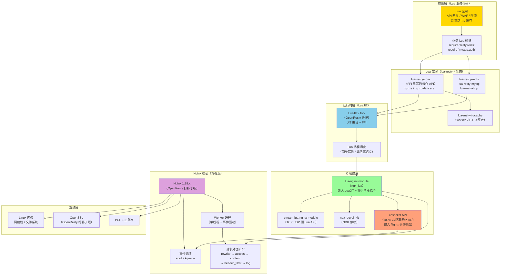
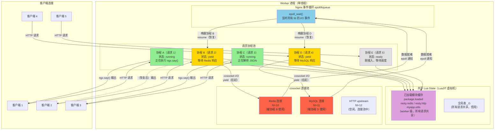

# 22 - OpenResty 入门与架构

> **版本基线**：OpenResty 1.29.2.1（基于 Nginx 1.29.x）| 创建日期：2026-08-05
> **受众**：后端开发熟手（熟悉 Python/Java/Lua），但服务器运维是小白。本篇从架构原理到安装上手，把 OpenResty 的定位、核心组件、并发模型和应用场景一次讲透，为后续 Lua 插件开发打基础。

---

## 目录

- [1. 学习目标](#1-学习目标)
- [2. 核心知识点](#2-核心知识点)
  - [2.1 知识点一：OpenResty 是什么](#21-知识点一openresty-是什么)
  - [2.2 知识点二：OpenResty vs Nginx vs 传统 Web 框架](#22-知识点二openresty-vs-nginx-vs-传统-web-框架)
  - [2.3 知识点三：安装 OpenResty](#23-知识点三安装-openresty)
  - [2.4 知识点四：OpenResty 的核心组件](#24-知识点四openresty-的核心组件)
  - [2.5 知识点五：第一个 OpenResty 程序](#25-知识点五第一个-openresty-程序)
  - [2.6 知识点六：lua_package_path 和 lua_package_cpath](#26-知识点六lua_package_path-和-lua_package_cpath)
  - [2.7 知识点七：lua_code_cache 指令](#27-知识点七lua_code_cache-指令)
  - [2.8 知识点八：OpenResty 的并发模型](#28-知识点八openresty-的并发模型)
  - [2.9 知识点九：OpenResty 能做什么（应用场景概述）](#29-知识点九openresty-能做什么应用场景概述)
- [3. Mermaid 图](#3-mermaid-图)
- [4. 最佳实践](#4-最佳实践)
- [5. 常见踩坑引用](#5-常见踩坑引用)
- [6. 小结](#6-小结)

---

## 1. 学习目标

学完本篇，你应当能够：

- 理解 **OpenResty 的本质**：它不是 Nginx 的 fork，而是一个以 Nginx 为组件的"更高层 Web 平台"，集成了增强版 Nginx + LuaJIT + 大量 Lua 库。
- 能用一句话说清 OpenResty 与原生 Nginx、传统 Web 框架（Django/Spring）、Node.js 的核心区别。
- 掌握 **三种安装方式**（官方预编译包 / 源码编译 / Docker），知道为什么官方推荐用 OpenResty 发行版而非自行在 Nginx 上编译 lua-nginx-module。
- 说出 OpenResty 的 **六大核心组件**（lua-nginx-module、stream-lua-nginx-module、ngx_devel_kit、lua-resty-core、lua-resty-lrucache、LuaJIT2 fork）各自的作用。
- 写出第一个 `content_by_lua_block` 的 Hello World 程序，并用 `curl` 验证。
- 理解 `lua_package_path` / `lua_package_cpath` 中 `;;` 的含义，能正确配置第三方 Lua 库的搜索路径。
- 知道 `lua_code_cache on/off` 的区别，明白为什么生产环境必须 `on`、为什么 `off` 只能用于开发调试。
- 理解 OpenResty 的 **并发模型**：同一 worker 内所有请求共享一个 Lua 解释器（Lua State），用轻量 Lua 协程隔离请求上下文。
- 了解 OpenResty 的 **典型应用场景**：API 网关、WAF、限流、动态路由、复杂缓存、请求聚合等。

> **前置知识**：建议先完成 [01-Nginx概述与架构原理](../01-基础认知/01-Nginx概述与架构原理.md)、[03-进程模型与控制管理](../01-基础认知/03-进程模型与控制管理.md) 和 [21-动态模块与扩展](../06-高级与优化/21-动态模块与扩展.md)。

---

## 2. 核心知识点

### 2.1 知识点一：OpenResty 是什么

#### 定义

**OpenResty** 是一个完整的 Web 平台，它把以下几样东西打包成一个整体：

1. **增强版 Nginx 核心**——在官方 Nginx 基础上打了若干补丁和优化。
2. **增强版 LuaJIT（luajit2 fork）**——OpenResty 自己维护的 LuaJIT 分支，比官方 LuaJIT 更活跃、修复更多 bug。
3. **大量 Lua 库**——`lua-resty-*` 系列（redis、mysql、http、core、lrucache 等），开箱即用。
4. **大量第三方 Nginx 模块**——lua-nginx-module、stream-lua-nginx-module、headers-more-nginx-module 等。

> **关键认知**：OpenResty **不是 Nginx 的 fork**。它没有复制 Nginx 的源码然后独立发展，而是把 Nginx 作为一个**组件**引入，在其上叠加 Lua 可编程能力。你可以把 OpenResty 理解为一个"更高层的应用与网关平台"，Nginx 只是它的底层传输引擎。

#### 核心 C 模块：lua-nginx-module（ngx_lua）

OpenResty 的心脏是 **lua-nginx-module**（简称 ngx_lua）。这个 C 模块做了两件事：

1. **把 LuaJIT 2.1 嵌入 Nginx**——在 Nginx 的 worker 进程内初始化一个 LuaJIT 虚拟机（Lua State）。
2. **在 Nginx 的各个请求处理阶段插入 Lua 执行入口**——如 `rewrite_by_lua`、`access_by_lua`、`content_by_lua`、`log_by_lua` 等。

#### 工作原理：subrequest + 协程 + cosocket

OpenResty 的非阻塞魔法来自三个机制的配合：

| 机制 | 作用 | 说明 |
|------|------|------|
| **Nginx subrequest（子请求）** | 提供"协程让出后 Nginx 继续处理事件"的能力 | Lua 代码 yield（让出）后，Nginx 事件循环可以处理其他请求 |
| **Lua 协程** | 在同一个 Lua State 内隔离不同请求的执行上下文 | 每个请求分配一个轻量协程，互不干扰 |
| **cosocket（cosocket API）** | 100% 非阻塞的网络 I/O | MySQL/Redis/HTTP 等网络操作通过 cosocket 实现，底层接入 Nginx 事件模型 |

**cosocket** 是 OpenResty 最核心的创新之一。普通的 Lua I/O 库（如 `io.open`、`luasocket`）是**阻塞**的——一旦发起网络调用，整个 worker 进程都会卡住，其他请求全部排队等待。而 cosocket 把网络 I/O 接入了 Nginx 的事件模型（epoll/kqueue），做到了：

- Lua 代码发起网络调用（如 `redis:get()`）
- 底层 cosocket 注册到 Nginx 事件循环，**当前请求的 Lua 协程 yield（挂起）**
- Nginx 事件循环继续处理**其他请求**
- 当网络数据就绪时，Nginx 唤醒对应的 Lua 协程继续执行

这就是 OpenResty 能做到"**用同步的代码写法，实现非阻塞的 I/O 语义**"的根本原因。

> **一句话总结**：OpenResty = Nginx（高性能 Web 服务器）+ LuaJIT（高性能脚本运行时）+ cosocket（非阻塞 I/O 桥接）+ lua-resty-\* 生态（开箱即用库）。

#### 特例说明

1. **OpenResty 的 LuaJIT 不是官方 LuaJIT**：OpenResty 使用自己维护的 `luajit2` fork。官方 LuaJIT 项目（由 Mike Pall 维护）更新缓慢，OpenResty 的 fork 包含大量 bug 修复和性能优化。**不要用官方 LuaJIT 替换 OpenResty 自带的版本**，否则可能出现不可预期的兼容性问题。

2. **cosocket 不能在所有阶段使用**：cosocket API（如 `ngx.socket.tcp`、`ngx.socket.udp`）只能在 `rewrite_by_lua`、`access_by_lua`、`content_by_lua` 等阶段使用，不能在 `set_by_lua`、`log_by_lua`（部分版本）、`init_by_lua`（worker 初始化阶段，此时还没有请求上下文）中使用。在不适用的阶段调用会报错。

3. **OpenResty 的"非阻塞"仅限于 cosocket 和 Nginx 提供的 API**：如果你在 Lua 代码中调用了阻塞的 C 库（如通过 FFI 调用阻塞的 C 函数、使用标准 Lua 的 `io.open` 读文件），整个 worker 仍然会阻塞。**在 OpenResty 中绝对不要使用阻塞 I/O**。

---

### 2.2 知识点二：OpenResty vs Nginx vs 传统 Web 框架

#### 与原生 Nginx 的关系

OpenResty = Nginx + Lua 可编程能力。原生 Nginx 只能通过配置指令（`if`/`map`/`rewrite`/`proxy_pass` 等）做有限的逻辑控制，而 OpenResty 让你在 Nginx **内部**用完整的编程语言（Lua）编写业务逻辑。

| 对比项 | 原生 Nginx | OpenResty |
|--------|-----------|-----------|
| 编程能力 | 配置指令 + 变量（有限） | 完整的 Lua 编程语言 |
| 逻辑复杂度 | 简单条件判断、路由 | 任意复杂逻辑（循环、函数、面向对象） |
| 外部资源访问 | 只能 `proxy_pass` 到上游 | 可直接在 Lua 中访问 MySQL/Redis/HTTP |
| 请求体操作 | 不能（只能透传或缓存到文件） | 可以读取、修改、生成请求体 |
| 响应体操作 | 只能追加 header / 过滤（有限） | 可以完全控制响应内容 |
| 第三方库 | C 模块（编译困难） | lua-resty-\* 系列（纯 Lua，开箱即用） |
| 性能 | C 原生（最高） | LuaJIT 接近 C（极高性能） |

#### 与传统 Web 框架（Django/Spring）的关系

传统 Web 框架运行在应用服务器上（Gunicorn/uWSGI/Tomcat），前面通常放一个 Nginx 做反向代理。OpenResty 则是"**Web 服务器 + 应用服务器**"的融合体——它本身既是高性能 Web 服务器（处理 HTTP 连接、静态资源、TLS），又能在内部运行应用逻辑。

| 对比项 | 传统 Web 框架（Django/Spring） | OpenResty |
|--------|-------------------------------|-----------|
| 架构 | Nginx → 应用服务器（WSGI/JVM） | Web 服务器 + 应用服务器融合 |
| 进程模型 | 多进程/多线程（每请求一线程/进程） | 事件驱动 + 协程（每 worker 单线程，协程并发） |
| 单机连接数 | 几百到几千（受线程/进程数限制） | 10K - 1000K+（事件驱动，连接几乎不占内存） |
| 语言性能 | Python/Java（解释/JIT，中等） | LuaJIT（接近 C，极高） |
| 生态 | 语言生态丰富（pip/maven） | lua-resty-\* 生态（专注网关/代理场景） |
| 适用场景 | 业务逻辑重的 Web 应用 | 高并发网关/代理/中间件层 |

#### 与 Node.js 的关系

Node.js 和 OpenResty 都是事件驱动的，但异步编程模型不同：

| 对比项 | Node.js | OpenResty |
|--------|---------|-----------|
| 语言 | JavaScript（V8 引擎） | Lua（LuaJIT） |
| 异步模型 | 回调 / Promise / async-await | **协程**（同步写法，非阻塞语义） |
| 代码风格 | 异步回调（回调地狱，需 async/await 缓解） | **同步代码风格**（看起来像阻塞，实际非阻塞） |
| 单线程 | 是（主线程 + libuv 线程池） | 是（每 worker 单线程 + Lua 协程） |
| I/O 非阻塞 | 所有 I/O 默认非阻塞 | 只有 cosocket API 非阻塞（阻塞 I/O 会卡住） |
| 生态 | npm（最丰富） | lua-resty-\*（专注网关场景） |

> **核心区别**：Node.js 用回调/Promise 表达异步，OpenResty 用协程实现"同步写法、非阻塞语义"。OpenResty 的 Lua 代码读起来像普通同步代码（`local res = redis:get("key")`），但底层是协程 yield + 事件唤醒，不会阻塞 worker。

#### 版本提示

> OpenResty 当前开源版为 **1.29.2.1**，基于 Nginx 1.29.x。OpenResty 的版本号格式为 `Nginx主版本.OpenResty次版本.OpenResty修订号`，例如 `1.29.2.1` 表示基于 Nginx 1.29.x 的 OpenResty 第 2 个次版本的第 1 次修订。

---

### 2.3 知识点三：安装 OpenResty

OpenResty 提供三种安装方式，从简到难依次为：官方预编译包 > Docker 镜像 > 源码编译。

#### 方式一：官方预编译包（apt/yum）

官方提供 DEB 和 RPM 仓库，安装后通过包管理器更新。

**Ubuntu/Debian（apt）**：

```bash
# 第一步：安装 prerequisite 工具
sudo apt-get -y install --no-install-recommends wget gnupg ca-certificates lsb-release
# wget gnupg ca-certificates lsb-release: 添加官方源所需的基础工具
# --no-install-recommends: 不安装推荐包，减少不必要的依赖

# 第二步：添加 OpenResty 官方 GPG 密钥
wget -O - https://openresty.org/package/pubkey.gpg | sudo gpg --dearmor -o /usr/share/keyrings/openresty.gpg
# 下载官方 GPG 公钥并转换为 gpg 格式
# /usr/share/keyrings/openresty.gpg: 密钥存放路径（Debian 12+ 推荐位置）

# 第三步：添加 OpenResty 官方 apt 源
echo "deb [signed-by=/usr/share/keyrings/openresty.gpg] http://openresty.org/package/ubuntu $(lsb_release -sc) main" \
    | sudo tee /etc/apt/sources.list.d/openresty.list
# [signed-by=...]: 指定验证签名的密钥路径
# $(lsb_release -sc): 自动获取当前系统的代号（如 jammy/noble）
# /etc/apt/sources.list.d/openresty.list: 源配置文件路径

# 第四步：更新包索引并安装
sudo apt-get update
sudo apt-get -y install openresty
# 安装后，OpenResty 的二进制路径为 /usr/local/openresty/nginx/sbin/nginx
# 配置文件路径为 /usr/local/openresty/nginx/conf/nginx.conf
```

**CentOS/RHEL（yum）**：

```bash
# 第一步：添加 OpenResty 官方 yum 源
sudo yum install -y yum-utils
# yum-utils: 提供 yum-config-manager 工具

sudo yum-config-manager --add-repo https://openresty.org/package/centos/openresty.repo
# 添加 OpenResty 官方仓库

# 第二步：安装
sudo yum install -y openresty
# 安装路径同上：/usr/local/openresty/
```

**安装后的目录结构**：

```bash
/usr/local/openresty/
├── nginx/
│   ├── sbin/
│   │   └── nginx              # OpenResty 的 nginx 二进制（内置 LuaJIT）
│   ├── conf/
│   │   ├── nginx.conf          # 主配置文件
│   │   └── mime.types
│   └── logs/
│       ├── access.log
│       └── error.log
├── lualib/                     # OpenResty 自带的 Lua 库
│   ├── resty/                  # lua-resty-* 系列库
│   │   ├── redis.lua
│   │   ├── mysql.lua
│   │   ├── http.lua
│   │   └── ...
│   └── ngx/                    # lua-resty-core 的内部模块
├── luajit/                     # OpenResty 自带的 LuaJIT2
│   ├── bin/
│   │   ├── luajit              # LuaJIT 解释器
│   │   └── resty               # OpenResty 的命令行工具（可执行 Lua 脚本）
│   └── lib/
└── site/                       # 用户自己的 Lua 脚本/模块存放处
    └── lualib/
```

#### 方式二：源码编译

当你需要自定义编译选项或使用最新开发版时，从源码编译。

```bash
# 第一步：下载源码包
wget https://openresty.org/download/openresty-1.29.2.1.tar.gz
# 从 OpenResty 官方网站下载指定版本的源码包

# 第二步：解压
tar -xzf openresty-1.29.2.1.tar.gz
cd openresty-1.29.2.1
# 解压后进入源码目录
# 注意：OpenResty 的源码包内已包含 Nginx 源码、LuaJIT 源码和所有 bundled 模块

# 第三步：安装编译依赖
# Ubuntu/Debian:
sudo apt-get install -y build-essential libpcre3-dev libssl-dev zlib1g-dev
# build-essential: gcc/make 等基础编译工具
# libpcre3-dev: PCRE 正则库（Nginx rewrite 模块依赖）
# libssl-dev: OpenSSL 开发库（HTTPS 支持）
# zlib1g-dev: zlib 压缩库（gzip 支持）

# CentOS/RHEL:
# sudo yum install -y gcc make pcre-devel openssl-devel zlib-devel

# 第四步：配置编译选项
./configure \
    --prefix=/usr/local/openresty \
    # --prefix: 安装根目录
    # 所有文件（nginx 二进制、配置、lualib 等）都安装到此目录下

    --with-http_ssl_module \
    # --with-http_ssl_module: 启用 HTTPS/TLS 支持

    --with-http_v2_module \
    # --with-http_v2_module: 启用 HTTP/2 支持

    --with-http_realip_module \
    # --with-http_realip_module: 获取客户端真实 IP（配合 X-Forwarded-For）

    --with-stream \
    --with-stream_ssl_module \
    # --with-stream: 启用四层 TCP/UDP 代理
    # --with-stream_ssl_module: stream 模块的 TLS 支持

    -j4
    # -j4: 使用 4 个 CPU 核心并行编译（加速编译）
    # 数字建议设为 CPU 核心数

# 第五步：编译和安装
make -j4
sudo make install
# make install 会把编译产物复制到 --prefix 指定的目录

# 第六步：验证安装
/usr/local/openresty/nginx/sbin/nginx -V
# -V: 显示编译参数和版本信息
# 输出应包含：openresty/1.29.2.1 + 配置的所有 --with 选项
```

#### 方式三：Docker 镜像

最快捷的体验方式，适合学习和快速验证。

```bash
# 拉取官方镜像
docker pull openresty/openresty:1.29.2.1-alpine
# openresty/openresty: 官方镜像名
# 1.29.2.1-alpine: 基于 Alpine Linux 的精简镜像（体积小，约 30MB）
# 也可用 1.29.2.1（基于 Debian，体积大但兼容性好）

# 启动容器
docker run -d \
    --name my-openresty \
    # --name: 容器名称

    -p 80:80 \
    # -p 80:80: 映射容器的 80 端口到主机 80 端口

    -v /path/to/nginx.conf:/usr/local/openresty/nginx/conf/nginx.conf \
    # -v: 挂载自定义配置文件（覆盖容器内默认配置）

    -v /path/to/lua:/usr/local/openresty/lualib/custom \
    # 挂载自定义 Lua 脚本目录

    openresty/openresty:1.29.2.1-alpine

# 验证
curl http://localhost/
docker exec my-openresty openresty -V
```

#### 验证安装

```bash
# 查看 OpenResty 版本
openresty -V 2>&1
# 输出示例：
# nginx version: openresty/1.29.2.1
# built by gcc ...
# configure arguments: --prefix=/usr/local/openresty ...

# 启动 OpenResty
sudo openresty
# 或用完整路径：sudo /usr/local/openresty/nginx/sbin/nginx

# 测试配置
openresty -t

# 重新加载配置
openresty -s reload

# 停止
openresty -s stop
```

#### 特例说明

1. **官方推荐用 OpenResty 发行版，而非自行在 Nginx 上编译 lua-nginx-module**：这是 OpenResty 官方反复强调的。原因有三：
   - OpenResty 自带的 **LuaJIT2 fork** 包含大量针对 lua-nginx-module 的优化和 bug 修复，官方 LuaJIT 不包含这些。
   - OpenResty 对 **OpenSSL 和 Nginx 打了补丁**，修复了一些上游未合并的长期 bug（如 OpenSSL 的某些 TLS 交互问题）。
   - lua-nginx-module、lua-resty-core、LuaJIT 之间存在**紧耦合的版本匹配关系**，自行组合版本极易出现兼容性问题。

2. **不要和系统已有的 Nginx 冲突**：如果系统已安装官方 Nginx（`apt install nginx`），两者会抢占 80 端口。建议卸载系统 Nginx，或修改 OpenResty 的 `listen` 端口。OpenResty 的二进制名也是 `nginx`，但通过 `openresty` 命令软链接调用。

3. **Alpine 镜像缺少部分 C 库**：如果你的 Lua 脚本通过 FFI 调用了系统 C 库（如 `libcrypto`），Alpine 镜像可能缺少对应的库。生产环境建议用基于 Debian 的完整镜像。

---

### 2.4 知识点四：OpenResty 的核心组件

OpenResty 不是一个单一的软件，而是多个组件的集合。以下是核心组件清单：

| 组件 | 类型 | 作用 | 是否必须 |
|------|------|------|----------|
| **lua-nginx-module**（ngx_lua） | C 模块 | 把 LuaJIT 嵌入 Nginx，提供各阶段指令（`content_by_lua` 等）和 cosocket API | 必须 |
| **stream-lua-nginx-module** | C 模块 | 在 TCP/UDP stream 模块中提供 Lua API（四层代理可编程） | 可选（需 `--with-stream`） |
| **ngx_devel_kit**（NDK） | C 模块 | lua-nginx-module 的底层依赖，提供 Nginx 开发工具包 | 必须（被 ngx_lua 依赖） |
| **lua-resty-core** | Lua 库 | 用 LuaJIT FFI 重写的官方 resty 核心 API（`ngx.re`、`ngx.balancer` 等） | **必须，不可关闭** |
| **lua-resty-lrucache** | Lua 库 | worker 进程内的 LRU 缓存，供 lua-resty-core 和用户代码使用 | 必须 |
| **LuaJIT2 fork** | 运行时 | OpenResty 维护的 LuaJIT 分支，比官方 LuaJIT 更活跃 | 必须 |
| **OpenSSL 补丁** | 补丁 | 修复 OpenSSL 上游未合并的 bug | 内置 |
| **Nginx 补丁** | 补丁 | 修复 Nginx 上游未合并的 bug、增强与 Lua 的交互 | 内置 |

#### 组件详解

**lua-nginx-module（ngx_lua）**：

这是 OpenResty 的心脏。它在 Nginx 编译时静态链接进二进制，负责：
- 在 worker 进程启动时创建 LuaJIT 虚拟机（Lua State）
- 提供 `*_by_lua` / `*_by_lua_block` / `*_by_lua_file` 系列指令
- 实现 cosocket API（`ngx.socket.tcp`、`ngx.socket.udp`）
- 提供 `ngx.` 命名空间下的所有 API（`ngx.say`、`ngx.exit`、`ngx.var`、`ngx.req` 等）
- 管理请求级 Lua 协程的生命周期

**stream-lua-nginx-module**：

与 lua-nginx-module 平行，但作用于 Nginx 的 stream 模块（TCP/UDP 四层代理）。提供 `content_by_lua_block`（stream 上下文）等指令，可以在 TCP 连接建立后执行 Lua 逻辑。适用于 TCP 网关、自定义协议代理等场景。

**ngx_devel_kit（NDK）**：

NDK（Nginx Development Kit）是一个辅助模块，为第三方 C 模块开发提供工具函数。lua-nginx-module 在内部依赖 NDK 的一些功能（如注册指令、共享内存等）。NDK 本身不直接面向用户，但如果没有它，ngx_lua 无法编译。

**lua-resty-core**：

这是**必装且不可关闭**的组件。早期版本的 ngx_lua 的 API 直接用 C 实现，后来 OpenResty 用 LuaJIT FFI 重写了这些 API，形成了 lua-resty-core。它在 `init_by_lua` 阶段被自动加载，提供：
- `ngx.re.*`（正则表达式，基于 PCRE）
- `ngx.balancer.*`（动态负载均衡）
- `ngx.semaphore`（信号量）
- `ngx.shared.dict.*` 的 FFI 实现
- `ngx.errlog.*`（错误日志操作）
- 以及其他大量核心 API

> **重要**：从 OpenResty 1.13.2.1 起，`lua_load_resty_core off` 指令被废弃。lua-resty-core 始终被加载，**无法关闭**。如果你试图关闭它，Nginx 会启动报错。

**lua-resty-lrucache**：

一个纯 Lua 实现的 LRU（Least Recently Used）缓存库。它在 worker 进程级别缓存数据（所有请求共享），常用于缓存模块编译结果、配置数据等。lua-resty-core 内部也使用它。

**LuaJIT2 fork**：

OpenResty 维护的 LuaJIT 分支（`openresty/luajit2`）。官方 LuaJIT（Mike Pall 维护）更新缓慢，OpenResty 的 fork 在此基础上：
- 修复了大量 JIT 编译器的 bug
- 增加了新的 FFI 特性
- 优化了与 lua-nginx-module 的交互性能

#### 代码示例：查看已安装组件

```bash
# 查看 OpenResty 编译信息
openresty -V 2>&1
# 输出中会包含所有编译时启用的模块和参数
# 关注 --with- 和 --add-module= 行

# 查看自带的 Lua 库
ls /usr/local/openresty/lualib/resty/
# 输出示例：
# redis.lua    mysql.lua    http.lua    core.lua    lrucache/
# string.lua   aes.lua      random.lua  sha*.lua    ...

# 查看 LuaJIT 版本
/usr/local/openresty/luajit/bin/luajit -v
# 输出示例：LuaJIT 2.1.1741563501 (OpenResty) -- 基于 Lua 5.1
```

#### 特例说明

1. **lua-resty-core 不可关闭**：如前所述，从 OpenResty 1.13.2.1 起，`lua_load_resty_core` 指令被废弃，lua-resty-core 始终加载。如果你在旧配置中看到 `lua_load_resty_core off;`，删除它，否则会报错。

2. **stream-lua-nginx-module 需要单独启用**：默认安装的 OpenResty 已编译了 stream-lua 模块，但需要在 `nginx.conf` 中配置 `stream {}` 块才能使用。如果你的 Nginx 配置中没有 `stream` 块，该模块处于"已编译但未使用"状态。

3. **自带的 lua-resty-* 库可以直接 require**：OpenResty 安装目录下的 `lualib/resty/` 已经在默认搜索路径中。在 Lua 代码中直接 `local redis = require "resty.redis"` 即可，不需要额外配置 `lua_package_path`。

---

### 2.5 知识点五：第一个 OpenResty 程序

#### Hello World 示例

下面是 OpenResty 最经典的 Hello World——用 `content_by_lua_block` 在 Nginx 内部用 Lua 直接生成响应，不经过任何后端。

```nginx
# /usr/local/openresty/nginx/conf/nginx.conf

worker_processes auto;         # worker 进程数设为 auto（自动匹配 CPU 核心数）
events {
    worker_connections 1024;   # 每个 worker 最大连接数
}

http {
    # 设置 Lua 模块搜索路径（;; 保留默认路径）
    lua_package_path '/usr/local/openresty/lualib/?.lua;;';
    # /usr/local/openresty/lualib/?.lua: 自定义 Lua 库搜索路径
    # ? : 被替换为模块名（如 require "mylib" → 查找 mylib.lua）
    # ;; : 保留 OpenResty 默认搜索路径（包含自带的 resty/* 库）

    # 设置 C 模块（.so）搜索路径
    lua_package_cpath '/usr/local/openresty/lualib/?.so;;';
    # ?.so: Lua C 扩展模块的搜索模式
    # ;; : 保留默认路径

    server {
        listen 80;              # 监听 80 端口
        server_name localhost;   # 虚拟主机名

        location /hello {
            default_type text/plain;   # 设置响应 Content-Type 为 text/plain
            # default_type: 因为 content_by_lua_block 直接生成响应体，
            #   需要显式指定 Content-Type（默认是 application/octet-stream）

            content_by_lua_block {
                -- content_by_lua_block: 在 content 阶段执行 Lua 代码
                -- 这是 Nginx 11 个请求处理阶段中的 "content" 阶段
                -- 在此阶段生成响应体（headers + body）

                ngx.say("Hello, OpenResty!")
                -- ngx.say(): 输出一行文本并自动追加 \n（换行符）
                -- 等价于 ngx.print("Hello, OpenResty!\n")
                -- ngx.say 会自动调用 ngx.flush() 刷新缓冲区
            }
        }
    }
}
```

#### 逐行说明

```nginx
location /hello {
    #          ↑
    #     匹配 URI 以 /hello 开头的请求
    #     如 /hello、/hello/world、/hello?name=test 都会匹配

    default_type text/plain;
    #          ↑
    #     设置默认 Content-Type
    #     content_by_lua_block 生成的内容没有文件扩展名
    #     Nginx 无法自动推断 MIME 类型，需要显式指定

    content_by_lua_block {
    #    ↑
    #    指令名：在 content 阶段用 Lua 代码生成响应
    #    _block 表示 Lua 代码直接内联在配置文件中（用 {} 包裹）
    #    对应的 _file 版本：content_by_lua_file "/path/to/hello.lua";

        ngx.say("Hello, OpenResty!")
        # ↑    ↑
        # |    要输出的内容
        # |
        # ngx 命名空间：OpenResty 提供的全局表
        #   ngx.say()  : 输出内容 + \n，并 flush
        #   ngx.print(): 输出内容（不追加 \n）
        #   ngx.flush(): 手动刷新缓冲区
        #   ngx.exit() : 结束请求（带状态码）
        #   ngx.header : 设置/读取响应头
        #   ngx.var    : 访问 Nginx 变量
        #   ngx.req    : 读取请求信息（URI/header/body）
    }
}
```

#### 运行和验证

```bash
# 第一步：测试配置语法
openresty -t
# nginx: configuration file ... test is successful

# 第二步：启动（或 reload）
openresty
# 如果已在运行：openresty -s reload

# 第三步：验证
curl http://localhost/hello
# 输出：Hello, OpenResty!
# （注意 ngx.say 会自动追加一个换行符）

# 带详情查看
curl -v http://localhost/hello
# < HTTP/1.1 200 OK
# < Content-Type: text/plain
# < Transfer-Encoding: chunked
# Hello, OpenResty!
```

#### block 与 file 的区别

```nginx
# 方式一：content_by_lua_block（内联，适合短代码）
location /hello {
    content_by_lua_block {
        ngx.say("Hello, OpenResty!")
    }
}

# 方式二：content_by_lua_file（外部文件，适合长代码和模块化）
location /hello {
    content_by_lua_file "/usr/local/openresty/lualib/hello.lua";
    # 路径可以是绝对路径或相对于 prefix 的相对路径
    # 文件内容：ngx.say("Hello, OpenResty!")
}
```

#### 特例说明

1. **`content_by_lua_block` 中使用 `--` 注释而非 `#`**：Lua 的注释语法是 `--`（单行）和 `--[[ ... --]]`（多行），不是 Nginx 的 `#`。在 `*_by_lua_block` 内的代码遵循 Lua 语法，不是 Nginx 配置语法。

2. **`content_by_lua_block` 和 `content_by_lua_file` 不能同时用于同一 location**：一个 location 只能有一个 content 阶段处理器。如果你同时写了 `proxy_pass` 和 `content_by_lua_block`，Nginx 会报配置错误。

3. **`ngx.say` 自动追加 `\n`**：`ngx.say("Hello")` 输出 `Hello\n`，而 `ngx.print("Hello")` 输出 `Hello`（无换行）。如果对响应格式有严格要求（如 JSON），注意不要用 `ngx.say`，用 `ngx.print` 避免多余的换行符。

---

### 2.6 知识点六：lua_package_path 和 lua_package_cpath

#### 作用

这两个指令设置 Lua 模块的搜索路径，告诉 LuaJIT 去哪里找 `require` 的模块。

| 指令 | 搜索内容 | 文件类型 | 上下文 |
|------|----------|----------|--------|
| `lua_package_path` | Lua 源码模块 | `.lua` | http |
| `lua_package_cpath` | Lua C 扩展模块 | `.so`（Linux）/ `.dylib`（macOS） | http |

#### `;;` 的含义

```nginx
lua_package_path '/path/to/?.lua;/another/path/?.lua;;';
#                                                          ↑↑
#                                                    ;; = 保留默认路径
```

`;;` 是一个特殊标记，表示**在此位置插入 OpenResty 的默认搜索路径**。默认路径包含：
- `/usr/local/openresty/lualib/?.lua`（自带的 lua-resty-* 库）
- `/usr/local/openresty/lualib/?.lua` 的其他变体

如果你不写 `;;`，自带的 `resty.redis`、`resty.http` 等库将无法被 `require` 到。

#### 代码示例

```nginx
http {
    # 设置 Lua 源码模块搜索路径
    lua_package_path '/usr/local/openresty/lualib/?.lua;/data/lualib/?.lua;;';
    # /usr/local/openresty/lualib/?.lua: OpenResty 自带库（通常已包含在默认路径中）
    # /data/lualib/?.lua: 自定义 Lua 库目录
    # ;;: 保留默认搜索路径（包含自带的 resty/* 库）
    #
    # 搜索顺序：先搜自定义路径 → 再搜默认路径
    # require "mylib" → 先找 /usr/local/openresty/lualib/mylib.lua
    #                → 再找 /data/lualib/mylib.lua
    #                → 再找默认路径下的 mylib.lua
    #                → 都找不到则报错 "module 'mylib' not found"

    # 设置 Lua C 扩展模块搜索路径
    lua_package_cpath '/data/lualib/?.so;;';
    # /data/lualib/?.so: 自定义 C 扩展模块目录
    # ;;: 保留默认 C 模块搜索路径
    #
    # require "mycext" → 查找 /data/lualib/mycext.so
    #                 → 再找默认路径

    server {
        listen 80;

        location /test {
            content_by_lua_block {
                -- 可以 require 自定义路径下的模块
                local mylib = require "mylib"
                -- require "mylib" 会按 lua_package_path 配置的路径搜索

                -- 也可以 require OpenResty 自带的库（因为 ;; 保留了默认路径）
                local redis = require "resty.redis"
                -- require "resty.redis" → 找到 /usr/local/openresty/lualib/resty/redis.lua

                ngx.say("modules loaded successfully")
            }
        }
    }
}
```

#### 多路径分隔

```nginx
# 多个路径用分号 ; 分隔
lua_package_path '/data/lualib/?.lua;/opt/lualib/?.lua;/app/lualib/?.lua;;';
# 搜索时按从左到右的顺序，找到第一个匹配的文件即停止
```

#### 特例说明

1. **路径中的 `?` 是必须的**：`?` 是模块名的占位符。`require "resty.redis"` 中的 `resty.redis` 会把 `.` 替换为 `/`，变成 `resty/redis`，再替换 `?`，最终查找 `resty/redis.lua`。如果你漏写了 `?`，搜索会失败。

2. **`;;` 必须放在最后或需要的位置**：`;;` 不是"追加"，而是"在此位置插入默认路径"。如果你写 `lua_package_path '/data/?.lua;;;/extra/?.lua';`，默认路径会被插在 `;;` 的位置，`/extra/?.lua` 会在默认路径之后被搜索。

3. **`lua_package_path` 只能在 http 上下文设置**：不能放在 `server` 或 `location` 块中。所有 server/location 共享同一个搜索路径。

4. **修改路径后需要 reload**：`lua_package_path` 在 Nginx 配置加载时读取。修改后需要 `openresty -s reload` 才能生效。

---

### 2.7 知识点七：lua_code_cache 指令

#### 作用

```nginx
lua_code_cache on | off;
```

`lua_code_cache` 控制是否缓存 Lua 代码的编译结果（字节码）。

| 值 | 行为 | 适用场景 |
|----|------|----------|
| `on`（默认） | Lua 代码在第一次执行时编译为字节码并缓存，后续请求直接复用缓存 | **生产环境必须用** |
| `off` | 每次请求都重新加载、解析、编译 Lua 代码 | 仅开发调试用 |

#### 代码示例

**开发环境（lua_code_cache off）**：

```nginx
http {
    lua_package_path '/data/lualib/?.lua;;';

    # 开发时关闭缓存，修改 Lua 文件后立即生效（无需 reload）
    lua_code_cache off;
    # off: 每次请求都重新加载 require 的模块文件
    #      修改 .lua 文件后，下一个请求就能用到最新代码
    #      但性能极差（每次都重新编译）

    server {
        listen 80;

        location /test {
            content_by_lua_file "/data/lualib/test.lua";
            # content_by_lua_file: 从外部文件加载 Lua 代码
            # lua_code_cache off 时，每次请求都重新读取此文件
        }
    }
}
```

**生产环境（lua_code_cache on）**：

```nginx
http {
    lua_package_path '/data/lualib/?.lua;;';

    # 生产环境必须开启缓存
    lua_code_cache on;
    # on: Lua 代码只在首次加载时编译为字节码并缓存
    #     后续请求直接使用缓存的字节码
    #     修改 .lua 文件后需要 openresty -s reload 才能生效
    #     性能最佳

    server {
        listen 80;

        location /test {
            content_by_lua_file "/data/lualib/test.lua";
            # lua_code_cache on 时，test.lua 只在首次请求时加载
            # 后续请求直接执行缓存的字节码
        }
    }
}
```

#### 逐行说明

```nginx
lua_code_cache off;
#               ↑
#               off: 关闭代码缓存
#               - 每次请求重新 require 所有模块
#               - content_by_lua_file 每次都重新读文件
#               - content_by_lua_block 每次都重新编译
#               - 优点：改代码后立即生效（开发方便）
#               - 缺点：性能极差（每次编译 + 文件 I/O）

lua_code_cache on;
#              ↑
#              on: 开启代码缓存（默认值）
#              - require 的模块在 worker 级别缓存（只加载一次）
#              - content_by_lua_file 的内容在首次加载后缓存
#              - 优点：性能好（字节码复用）
#              - 缺点：改代码后需 reload 才能生效
```

#### 特例说明

1. **关闭 lua_code_cache 会导致严重性能问题**：关闭后，每个请求都要重新加载、解析、编译 Lua 代码。对于 `require` 的模块，每次请求都要重新执行模块文件的加载和初始化。在高并发场景下，性能可能下降 **10-100 倍**。**绝对不要在生产环境关闭此选项**。

2. **`lua_code_cache off` 不影响 `init_by_lua` 和 `init_worker_by_lua`**：这两个阶段在 worker 启动时执行，无论 `lua_code_cache` 是 `on` 还是 `off`，它们都只执行一次。`lua_code_cache off` 只影响请求阶段的代码（`*_by_lua` 系列）。

3. **`lua_code_cache` 可以在 server 和 location 上下文设置**：不同于 `lua_package_path`（只能在 http 级别），`lua_code_cache` 可以在 http/server/location 三个级别设置，实现"部分 location 关闭缓存用于调试，其他 location 保持开启"。

   ```nginx
   http {
       lua_code_cache on;  # 全局开启

       server {
           listen 80;

           # 只有这个 location 关闭缓存（正在调试此模块）
           location /debug {
               lua_code_cache off;   # 调试时关闭
               content_by_lua_file "/data/lualib/debug.lua";
           }

           # 其他 location 保持开启
           location /api {
               lua_code_cache on;    # 显式开启（可省略，继承 http 级）
               content_by_lua_file "/data/lualib/api.lua";
           }
       }
   }
   ```

4. **修改 Lua 文件后需要 reload（当 `lua_code_cache on` 时）**：生产环境修改 Lua 代码后，需要执行 `openresty -s reload` 让所有 worker 重新加载。reload 会优雅地关闭旧 worker 并启动新 worker，新 worker 会重新加载 Lua 代码。

---

### 2.8 知识点八：OpenResty 的并发模型

#### 核心原理

OpenResty 继承了 Nginx 的事件驱动 + 多 worker 进程模型，在此基础上引入了 Lua 协程。理解并发模型需要抓住三个层次：

**第一层：Nginx 的 master/worker 模型**

- **master 进程**：管理 worker 进程的创建/销毁、配置加载、信号处理。不处理业务请求。
- **worker 进程**：实际处理 HTTP 请求的进程。每个 worker 是单线程的，用事件循环（epoll/kqueue）处理大量并发连接。
- 通常 `worker_processes auto`，worker 数量等于 CPU 核心数。

**第二层：worker 内的 Lua 解释器共享**

- **同一个 worker 进程内的所有请求共享同一个 Lua 解释器（Lua State）**。
- 这意味着：所有 `require` 过的 Lua 模块只在 worker 内加载一次，驻留在内存中，所有请求复用。
- 这与传统 Web 框架（每请求创建独立运行时）有本质区别——OpenResty 的模块加载是 worker 级别的"一次加载，永久复用"。

**第三层：请求级的 Lua 协程隔离**

- 虽然所有请求共享同一个 Lua State，但**每个请求分配一个独立的 Lua 协程**。
- 协程是轻量的（约 2-4KB 栈空间），协程之间的局部变量互不干扰。
- 当某个请求的 Lua 代码执行 cosocket I/O（如 `redis:get()`）时，该请求的协程 yield（挂起），worker 的事件循环去处理其他请求。I/O 就绪后，协程被 resume（恢复）继续执行。

#### worker 内 Lua 协程模型

```
                    Worker 进程（单线程）
                    ┌─────────────────────────────────────────────┐
                    │                                             │
                    │   Nginx 事件循环（epoll/kqueue）              │
                    │       │                                     │
                    │       │  监听所有连接的 I/O 事件               │
                    │       │                                     │
                    │   共享 Lua State（LuaJIT 虚拟机）              │
                    │   ┌───┴───────────────────────────────┐      │
                    │   │  已加载的 Lua 模块（require 缓存）  │      │
                    │   │  - resty.redis                      │      │
                    │   │  - resty.http                       │      │
                    │   │  - myapp.utils                       │      │
                    │   │  （所有请求共享，worker 级缓存）       │      │
                    │   └─────────────────────────────────────┘      │
                    │                                             │
                    │   请求协程池（每个请求一个协程）                │
                    │   ┌──────┐ ┌──────┐ ┌──────┐ ┌──────┐        │
                    │   │请求 A │ │请求 B │ │请求 C │ │请求 D │        │
                    │   │running│ │yield │ │running│ │等待   │        │
                    │   └──┬───┘ └──┬───┘ └──┬───┘ └───────┘        │
                    │      │        │        │                      │
                    │      │   cosocket I/O   │                      │
                    │      │   yield 等待     │                      │
                    │      │   Redis 返回     │                      │
                    │      │        │        │                      │
                    │   ┌──┴────────┴────────┴──┐                   │
                    │   │   cosocket 连接池       │                   │
                    │   │   - Redis conn (idle)  │                   │
                    │   │   - MySQL conn (idle)  │                   │
                    │   │   - HTTP upstream      │                   │
                    │   └────────────────────────┘                   │
                    │                                             │
                    └─────────────────────────────────────────────┘
```

#### 内存效率

由于模块在 worker 级别共享，即使有数万个并发请求，每个 worker 也只需要：
- **一份** Lua 模块代码的内存（所有请求复用）
- **每个请求** 一个协程的栈空间（约 2-4KB）
- **每个请求** 的请求数据（headers、body 等由 Nginx 管理）

这意味着：即使 10 万并发请求，额外的 Lua 内存开销也仅为几百 MB（10万 × 2-4KB ≈ 200-400MB），远低于传统"每请求一线程/进程"的模型。

#### 代码示例：验证模块共享

```nginx
http {
    server {
        listen 80;

        location /counter {
            content_by_lua_block {
                -- 访问共享的 package.loaded 表（Lua 模块缓存）
                local module_data = package.loaded["my_counter"]
                -- package.loaded: Lua 的模块缓存表
                -- 所有 require 过的模块都在此缓存，worker 级别共享

                if not module_data then
                    -- 第一次请求时加载模块
                    module_data = require "my_counter"
                    module_data.count = 0
                    -- 初始化计数器
                end

                -- 每次请求递增计数器
                module_data.count = module_data.count + 1
                -- 因为模块在 worker 级共享，count 会持续累加

                ngx.say("Request count in this worker: ", module_data.count)
                -- 多次请求 /counter 会看到数字递增
                -- 注意：不同 worker 的计数器是独立的（因为每个 worker 有自己的 Lua State）
            }
        }
    }
}
```

#### 特例说明

1. **不同 worker 的 Lua State 是独立的**：每个 worker 进程有自己独立的 LuaJIT 虚拟机。模块的 `require` 缓存、全局变量都是 worker 私有的。如果你在一个 worker 中修改了全局变量，其他 worker 不会感知。**跨 worker 共享数据需要用 `ngx.shared.DICT`（共享内存字典）**。

2. **模块中的全局变量是危险的**：由于所有请求共享同一个 Lua State，在模块顶层定义的全局变量会被所有请求看到。如果不小心在请求处理代码中修改了全局变量（忘记 `local`），会导致请求间的数据串扰。**始终使用 `local` 声明变量**。

3. **cosocket 连接数有上限**：每个 worker 可以同时持有的 cosocket 连接数受 `lua_max_pending_timers` 和系统文件描述符限制。高并发场景需要调大 `worker_rlimit_nofile` 和 `worker_connections`。

4. **Lua 协程不是 OS 线程**：Lua 协程是用户态的轻量级调度，不能利用多核。真正的多核并行靠 Nginx 的多 worker 进程实现（每个 worker 绑定一个 CPU 核心）。

---

### 2.9 知识点九：OpenResty 能做什么（应用场景概述）

OpenResty 的核心价值在于"**在 Nginx 内部用 Lua 编程**"，这使得许多原本需要外部应用服务器才能完成的逻辑，可以前移到网关层。以下是典型应用场景：

#### 场景一：在 Lua 中聚合/处理多种上游输出

```nginx
location /dashboard {
    content_by_lua_block {
        -- 同时请求多个后端服务，聚合结果返回给客户端
        local http = require "resty.http"
        local httpc = http.new()

        -- 发起多个子请求并行获取数据
        local res1, res2

        -- 并行请求用户信息和订单信息
        local th1 = ngx.thread.spawn(function()
            local res, err = httpc:request_uri("http://user-service:8080/api/user/123")
            res1 = res
        end)

        local th2 = ngx.thread.spawn(function()
            local res, err = httpc:request_uri("http://order-service:8080/api/orders?uid=123")
            res2 = res
        end)

        -- 等待两个子线程都完成
        ngx.thread.wait(th1)
        ngx.thread.wait(th2)

        -- 聚合结果
        ngx.header.content_type = "application/json"
        ngx.say('{"user":' .. res1.body .. ',"orders":' .. res2.body .. '}')
        -- 一次请求，返回聚合后的数据
        -- 客户端只需一次请求即可获取多个服务的数据
    }
}
```

#### 场景二：请求到达后端前的访问控制与安全校验

```nginx
location /api/ {
    access_by_lua_block {
        -- access_by_lua_block: 在 access 阶段执行（content 阶段之前）
        -- 适合做鉴权、安全检查，不通过则拒绝请求

        -- JWT Token 验证
        local auth_header = ngx.var.http_authorization
        -- ngx.var.http_authorization: 读取请求头 Authorization 的值
        -- ngx.var.http_XXX 可以读取任意请求头（XXX 为头名大写，- 转 _）

        if not auth_header then
            ngx.exit(ngx.HTTP_UNAUTHORIZED)
            -- ngx.exit(): 直接结束请求，返回指定状态码
            -- ngx.HTTP_UNAUTHORIZED: 401 状态码
        end

        -- 验证 Token（简化示例）
        local token = auth_header:match("Bearer%s+(.+)")
        if not token or token ~= "valid-secret-token" then
            ngx.exit(ngx.HTTP_FORBIDDEN)
            -- 403 Forbidden
        end

        -- 验证通过，请求继续进入 content 阶段（如 proxy_pass）
    }

    proxy_pass http://backend;
    -- access_by_lua_block 通过后，请求继续走 proxy_pass 转发到后端
}
```

#### 场景三：操纵响应头

```nginx
location /api/ {
    header_filter_by_lua_block {
        -- header_filter_by_lua_block: 在响应头过滤阶段执行
        -- 此时响应头已从后端返回，但尚未发送给客户端
        -- 可以修改、添加、删除响应头

        -- 隐藏后端框架信息（安全加固）
        ngx.header["Server"] = nil
        -- ngx.header: 响应头操作表
        -- 设为 nil 即删除该响应头

        ngx.header["X-Powered-By"] = nil
        -- 删除后端暴露的框架信息

        -- 添加自定义响应头
        ngx.header["X-Gateway"] = "OpenResty"
        ngx.header["X-Response-Time"] = ngx.var.upstream_response_time
        -- 将上游响应时间透传给客户端

        -- 添加安全相关头
        ngx.header["X-Content-Type-Options"] = "nosniff"
        ngx.header["X-Frame-Options"] = "DENY"
    }

    proxy_pass http://backend;
}
```

#### 场景四：动态选择 upstream

```nginx
upstream backend_1 { server 10.0.0.1:8080; }
upstream backend_2 { server 10.0.0.2:8080; }
upstream backend_3 { server 10.0.0.3:8080; }

# 用 balancer_by_lua_block 实现动态负载均衡
upstream dynamic_backend {
    server 0.0.0.0;  # 占位 server（实际地址由 Lua 动态指定）

    balancer_by_lua_block {
        -- balancer_by_lua_block: 在负载均衡选择阶段执行
        -- 每次请求到此 upstream 时都会调用

        -- 根据请求特征动态选择后端
        local key = ngx.var.http_x_tenant or "default"
        -- 根据租户 ID 选择不同的后端集群

        local backends = {
            default = "10.0.0.1:8080",
            tenant_a = "10.0.0.2:8080",
            tenant_b = "10.0.0.3:8080",
        }

        local backend = backends[key] or backends.default

        -- 设置本次请求的上游地址
        local balancer = require "ngx.balancer"
        local host, port = backend:match("([^:]+):(%d+)")
        balancer.set_current_peer(host, tonumber(port))
        -- set_current_peer(): 动态指定本次请求的 upstream 后端地址
    }
}

server {
    location /api/ {
        proxy_pass http://dynamic_backend;
        -- 所有请求经过 dynamic_backend，由 Lua 动态决定转发到哪台后端
    }
}
```

#### 场景五：复杂 Web 应用（同步非阻塞 DB 访问）

```nginx
location /user/profile {
    content_by_lua_block {
        -- 直接在 Nginx 中访问数据库，不需要后端应用服务器
        -- 代码看起来是同步的，但底层通过 cosocket 实现非阻塞

        local mysql = require "resty.mysql"
        local redis = require "resty.redis"

        -- 1. 先从 Redis 缓存查
        local red = redis:new()
        red:set_timeout(1000)  -- 1 秒超时
        red:connect("127.0.0.1", 6379)

        local cached = red:get("user:123:profile")
        -- redis:get(): cosocket 非阻塞 I/O
        -- 调用时协程 yield，Nginx 事件循环继续处理其他请求
        -- Redis 返回后协程 resume 继续

        if cached and cached ~= ngx.null then
            ngx.header.content_type = "application/json"
            ngx.say(cached)
            return
            -- 缓存命中，直接返回
        end

        -- 2. 缓存未命中，查 MySQL
        local db = mysql:new()
        db:connect({
            host = "127.0.0.1",
            port = 3306,
            database = "myapp",
            user = "root",
            password = "secret",
        })

        local res = db:query("SELECT * FROM users WHERE id = 123")
        -- db:query(): cosocket 非阻塞 I/O
        -- 查询 MySQL 时 worker 不会卡住，仍可处理其他请求

        -- 3. 写入 Redis 缓存（TTL 60 秒）
        red:set("user:123:profile", res[1].data, "EX", 60)

        -- 4. 返回结果
        ngx.header.content_type = "application/json"
        ngx.say(res[1].data)

        -- 5. 关闭连接（放回连接池）
        red:set_keepalive(10000, 100)  -- 空闲 10 秒，连接池上限 100
        db:set_keepalive(10000, 100)
    }
}
```

#### 场景六：rewrite 阶段做复杂 URL 分发

```nginx
location / {
    rewrite_by_lua_block {
        -- rewrite_by_lua_block: 在 rewrite 阶段执行
        -- 适合做 URL 重写、复杂路由逻辑

        local uri = ngx.var.uri
        -- ngx.var.uri: 当前请求的 URI（已规范化）

        -- 复杂路由规则（比 Nginx rewrite/map 更灵活）
        if uri:match("^/v1/") then
            -- /v1/ 开头的请求 → 重写为 /api/v1/
            ngx.var.uri = uri:gsub("^/v1/", "/api/v1/")
            -- ngx.var.uri = ...: 修改请求 URI
        elseif uri:match("^/old/(.+)$") then
            -- /old/xxx → /new/xxx
            ngx.var.uri = uri:gsub("^/old/", "/new/")
        end

        -- 根据请求头动态设置 upstream 变量
        local version = ngx.var.http_x_api_version or "v2"
        ngx.var.upstream_target = "backend_" .. version
        -- 设置自定义变量，供 proxy_pass 使用
    }

    proxy_pass http://$upstream_target;
    -- $upstream_target 由 Lua 动态设置
}
```

#### 场景七：高级缓存机制

```nginx
http {
    -- 创建共享内存字典（worker 间共享）
    lua_shared_dict my_cache 10m;
    -- lua_shared_dict: 创建 Nginx 共享内存区域
    -- my_cache: 字典名
    -- 10m: 大小 10MB（所有 worker 共享）

    server {
        location /api/data {
            access_by_lua_block {
                local cache = ngx.shared.my_cache
                -- ngx.shared.my_cache: 获取共享内存字典

                -- 生成缓存 key
                local cache_key = "api_data:" .. ngx.var.uri .. ngx.var.args

                -- 尝试从共享内存缓存读取
                local cached = cache:get(cache_key)
                -- cache:get(): 从共享内存读取（非阻塞，worker 内操作）

                if cached then
                    -- 缓存命中，直接返回
                    ngx.header.content_type = "application/json"
                    ngx.header["X-Cache"] = "HIT"
                    ngx.say(cached)
                    ngx.exit(ngx.HTTP_OK)
                    -- 跳过后续处理，直接返回缓存
                end

                -- 缓存未命中，设置标记，让后续逻辑去后端取数据
                ngx.ctx.cache_key = cache_key
                -- ngx.ctx: 请求级上下文（每个请求独立）
            }

            proxy_pass http://backend;

            header_filter_by_lua_block {
                -- 只缓存 200 响应
                if ngx.status == 200 and ngx.ctx.cache_key then
                    -- 读取响应体（需要 body_filter 配合或用 mirror）
                    -- 简化示例：实际中用 lua-resty-http 或子请求获取
                end
            }
        }
    }
}
```

#### 场景八：API 网关、WAF、限流、动态路由

这是 OpenResty 最广泛的应用场景。许多开源 API 网关都是基于 OpenResty 构建的：

| 项目 | 类型 | 基于 OpenResty 的功能 |
|------|------|----------------------|
| **Kong** | API 网关 | 插件系统（鉴权、限流、日志、监控），动态路由 |
| **APISIX** | API 网关 | 动态路由、插件热加载、配置中心集成 |
| **Orange** | WAF/网关 | WAF 规则引擎、访问控制 |
| **lor** | Web 框架 | 基于 OpenResty 的 Lua Web 框架（类似 Sinatra/Express） |

```nginx
-- 典型的 API 网关架构（伪代码展示核心思路）
http {
    server {
        listen 80;

        location / {
            -- 1. 鉴权阶段
            access_by_lua_block {
                -- JWT 验证
                -- API Key 校验
                -- OAuth Token 校验
            }

            -- 2. 限流阶段
            access_by_lua_block {
                -- 基于 Redis 的分布式限流
                -- 令牌桶 / 漏桶算法
                -- 按 API 路径 / 用户 / IP 维度限流
            }

            -- 3. 动态路由
            rewrite_by_lua_block {
                -- 从配置中心（如 etcd/Consul）拉取路由规则
                -- 动态修改 URI 或选择 upstream
            }

            -- 4. 请求改写
            rewrite_by_lua_block {
                -- 添加/修改请求头
                -- 修改请求体
                -- 协议转换（如 gRPC ↔ HTTP）
            }

            proxy_pass http://dynamic_upstream;

            -- 5. 响应改写
            header_filter_by_lua_block {
                -- 修改响应头
                -- 添加网关追踪信息
            }

            -- 6. 日志记录
            log_by_lua_block {
                -- 异步上报日志到 Kafka/ELK
                -- 记录调用链追踪信息
            }
        }
    }
}
```

#### 特例说明

1. **OpenResty 不是万能的**：它最适合"网关/代理/中间件"层的逻辑，不适合做重业务逻辑（如复杂的 ORM、事务管理、模板渲染）。重业务逻辑仍应放在后端应用服务器（Django/Spring）中，OpenResty 做前置的鉴权、限流、路由、缓存。

2. **`*_by_lua_block` 的执行顺序**：在同一个 location 中，各阶段的执行顺序为 `rewrite_by_lua` → `access_by_lua` → `content_by_lua`（或 `proxy_pass`）→ `header_filter_by_lua` → `body_filter_by_lua` → `log_by_lua`。可以在每个阶段分别写不同的 Lua 逻辑，但不能在一个 `*_by_lua_block` 中调用另一个阶段的 API。

3. **OpenResty 的性能边界**：虽然 LuaJIT 性能接近 C，但如果你的 Lua 代码中有大量 CPU 密集计算（如加密、大 JSON 解析），仍可能阻塞 worker。对于 CPU 密集型任务，可以考虑用 `ngx.timer.at` 在后台执行，或拆分到后端服务。

---

## 3. Mermaid 图

### 3.1 OpenResty 架构层次图



#### 架构说明

1. **应用层**：用户编写的 Lua 业务代码，通过 `*_by_lua_block` 指令嵌入 Nginx 各处理阶段。
2. **Lua 库层**：`lua-resty-*` 系列库提供开箱即用的功能（Redis/MySQL/HTTP 客户端等），`lua-resty-core` 用 FFI 重写了核心 API。
3. **运行时层**：LuaJIT2 fork 负责将 Lua 代码 JIT 编译为机器码执行，Lua 协程实现"同步写法、非阻塞语义"。
4. **桥接层**：lua-nginx-module 是核心 C 模块，把 LuaJIT 嵌入 Nginx，cosocket API 将网络 I/O 接入 Nginx 事件模型。
5. **Nginx 核心**：增强版 Nginx（OpenResty 打补丁），负责 HTTP/TCP 连接管理、请求处理阶段调度。
6. **系统层**：依赖 Linux 内核（epoll）、OpenSSL（TLS）、PCRE（正则）。

---

### 3.2 Worker 内 Lua 协程模型图



#### 协程模型说明

1. **单线程事件循环**：整个 worker 进程只有一个线程，通过 epoll/kqueue 监听所有文件描述符（客户端连接 + cosocket 连接）的 I/O 事件。

2. **共享 Lua State**：所有请求协程在同一个 LuaJIT 虚拟机内运行，共享 `package.loaded`（模块缓存）和 `_G`（全局表）。模块只需加载一次，所有请求复用。

3. **协程调度**：
   - 协程 A 正在执行 CPU 计算（`ngx.say()`），不需要 I/O，一直 running。
   - 协程 B 发起 Redis 查询（cosocket），协程 yield（挂起），控制权交回事件循环。
   - 事件循环在协程 B 挂起期间，调度协程 C 执行（C 不受 B 的 I/O 阻塞影响）。
   - 当 Redis 数据就绪，epoll 通知事件循环，事件循环 resume（恢复）协程 B 继续执行。

4. **协程状态机**：
   - `ready`：已创建，等待被调度执行。
   - `running`：正在事件循环中执行 Lua 代码。
   - `yield`：因 cosocket I/O 挂起，等待外部数据就绪。
   - `dead`：请求处理完毕，协程结束，资源被回收。

5. **零线程切换开销**：Lua 协程是用户态调度，不涉及操作系统线程切换。从一个协程切换到另一个协程只需要保存/恢复 Lua 栈（纳秒级），远低于 OS 线程切换（微秒级）。

---

## 4. 最佳实践

### 4.1 始终使用 OpenResty 官方发行版

```bash
# 推荐：安装 OpenResty 官方包
sudo apt-get install openresty
# 自带经过测试的 Nginx + LuaJIT2 + 所有模块的组合

# 不推荐：在官方 Nginx 上自行编译 lua-nginx-module
# 原因：
# 1. 官方 LuaJIT 缺少 OpenResty 的优化和 bug 修复
# 2. OpenSSL/Nginx 缺少 OpenResty 的补丁
# 3. 版本组合容易出现兼容性问题
```

### 4.2 生产环境必须开启 lua_code_cache

```nginx
http {
    lua_code_cache on;  # 生产环境必须开启（默认值，但建议显式声明）

    # 调试时可以局部关闭
    server {
        location /debug {
            lua_code_cache off;  # 仅此 location 关闭用于调试
            content_by_lua_file "/data/lualib/debug.lua";
        }
    }
}
```

### 4.3 模块化组织 Lua 代码

```nginx
# 推荐：用 content_by_lua_file 加载外部 Lua 文件，保持配置文件干净
location /api/users {
    content_by_lua_file "/data/lualib/api/users.lua";
    # 业务逻辑放在独立 .lua 文件中
}

location /api/orders {
    content_by_lua_file "/data/lualib/api/orders.lua";
}

# 不推荐：在 content_by_lua_block 中写大量 Lua 代码
# location /api/users {
#     content_by_lua_block {
#         -- 100 行业务代码写在这里...
#         -- 配置文件变得臃肿且难以维护
#     }
# }
```

### 4.4 始终使用 local 声明变量

```lua
-- 推荐
local redis = require "resty.redis"  -- local 声明
local function handle_request()      -- local 声明函数
    local key = ngx.var.uri           -- local 声明局部变量
    -- ...
end

-- 危险
function handle_request()  -- 没写 local → 全局函数！
    key = ngx.var.uri      -- 没写 local → 全局变量！
    -- 全局变量被所有请求共享 → 请求数据串扰
end

-- 在模块顶部加入严格模式检查（推荐）
-- 检查未声明的全局变量
local mt = getmetatable(_G) or {}
mt.__newindex = function(table, key, val)
    error('attempt to write to undeclared global: ' .. key, 2)
end
setmetatable(_G, mt)
```

### 4.5 正确使用 cosocket 连接池

```nginx
location /api/ {
    content_by_lua_block {
        local redis = require "resty.redis"
        local red = redis:new()

        red:connect("127.0.0.1", 6379)
        -- 使用连接...

        -- 不要直接 close()，而是放回连接池
        local ok, err = red:set_keepalive(10000, 100)
        -- set_keepalive(max_idle_timeout, pool_size):
        --   max_idle_timeout: 空闲超时（毫秒），超时后自动关闭
        --   pool_size: 连接池大小上限
        -- 连接放回池中，下次请求可复用，避免频繁建连
    }
}
```

### 4.6 init_by_lua 中预加载模块

```nginx
http {
    init_by_lua_block {
        -- init_by_lua_block: 在 Nginx master 加载配置时执行一次
        -- 适合预加载模块、初始化全局配置

        -- 预加载常用模块（避免首个请求的延迟）
        require "resty.redis"
        require "resty.mysql"
        require "resty.http"
        -- 这些模块的加载和编译只在启动时执行一次
        -- 后续所有请求直接使用已加载的模块

        -- 加载全局配置
        local config = require "myapp.config"
        config.load("/etc/myapp/config.json")
    }
}
```

### 4.7 worker 数量与 CPU 核心对齐

```nginx
# OpenResty 继承 Nginx 的进程模型，worker 数量影响 Lua 并行度
worker_processes auto;  # 自动匹配 CPU 核心数
# 每个 worker 有独立的 Lua State，真正的多核并行靠多 worker 实现

# 如果 Lua 代码是 CPU 密集型，可适当增加 worker 数
# 但不要超过 CPU 核心数的 2 倍
```

---

## 5. 常见踩坑引用

本篇为 OpenResty 入门篇，涉及的架构与安装内容暂无直接关联的踩坑条目。但 OpenResty 继承 Nginx 的进程模型，以下性能类踩坑与 worker 配置密切相关，供参考：

### 间接关联：#2.1 worker 进程设置不当

> OpenResty 的 `worker_processes` 配置直接影响 Lua 的并行处理能力。每个 worker 进程拥有独立的 LuaJIT 虚拟机，worker 数量等于 Lua 真正的多核并行度。设置过少导致 CPU 利用不均，设置过多则增加上下文切换开销和内存占用（每个 worker 都有一份 Lua State）。
>
> OpenResty 场景下，建议 `worker_processes auto`，与 CPU 核心数对齐。如果 Lua 代码中有大量 CPU 密集计算，可适当增加 worker，但不应超过核心数的 2 倍。

> 详见：[踩坑 #2.1 worker_processes 设置不当](../99-踩坑记录与解决方案.md#21-worker_processes-设置不当)

---

## 6. 小结

本篇系统讲解了 OpenResty 的架构原理与入门知识，覆盖了九个知识点：

1. **OpenResty 是什么**：一个以 Nginx 为组件的"更高层 Web 平台"，集成增强版 Nginx + LuaJIT2 fork + lua-resty-* 生态。核心 C 模块 lua-nginx-module 把 LuaJIT 嵌入 Nginx，通过 subrequest + 协程 + cosocket 实现"同步写法、非阻塞语义"。

2. **与 Nginx / 传统框架 / Node.js 的对比**：OpenResty = Nginx + Lua 可编程能力；与传统 Web 框架相比是"Web 服务器 + 应用服务器"融合，单机可处理 10K-1000K+ 连接；与 Node.js 都是事件驱动，但 OpenResty 用 Lua 协程实现同步写法。

3. **安装方式**：官方预编译包（apt/yum）、源码编译（./configure && make）、Docker 镜像。**官方强烈推荐用 OpenResty 发行版而非自行在 Nginx 上编译 lua-nginx-module**，因为官方 LuaJIT2/OpenSSL/Nginx 包含关键补丁和优化。

4. **核心组件**：lua-nginx-module（心脏）、stream-lua-nginx-module（四层 Lua）、ngx_devel_kit（依赖）、lua-resty-core（FFI 核心 API，必装不可关闭）、lua-resty-lrucache（worker 内 LRU 缓存）、LuaJIT2 fork（增强版运行时）。

5. **第一个程序**：`content_by_lua_block` 在 content 阶段用 Lua 生成响应，`ngx.say()` 输出内容。`_block` 内联代码用 Lua 语法注释（`--`），`_file` 从外部文件加载。

6. **lua_package_path / lua_package_cpath**：设置 Lua 模块和 C 扩展的搜索路径。`;;` 保留默认路径（包含自带的 resty/* 库）。路径中 `?` 是模块名占位符，多路径用 `;` 分隔。

7. **lua_code_cache**：`on`（默认，生产必须用）缓存字节码，`off`（仅开发调试）每次请求重新加载。关闭会导致 10-100 倍性能下降。可在 server/location 级别局部关闭用于调试。

8. **并发模型**：同一 worker 内所有请求共享一个 Lua State，用轻量 Lua 协程隔离请求上下文。模块在 worker 级缓存（一次加载永久复用），每个请求仅需 2-4KB 协程栈。cosocket I/O 时协程 yield，事件循环调度其他请求。

9. **应用场景**：上游聚合、访问控制/安全校验、响应头操纵、动态 upstream、同步非阻塞 DB 访问、复杂 URL 分发、高级缓存、API 网关/WAF/限流/动态路由。

**关键要点**：

- **OpenResty 不是 Nginx fork**：它是把 Nginx 作为组件的更高层平台，Nginx 是底层传输引擎，Lua 是可编程层。
- **cosocket 是非阻塞的关键**：所有网络 I/O（Redis/MySQL/HTTP）必须走 cosocket API，绝对不要用阻塞的标准 Lua I/O 库。
- **共享 Lua State 是双刃剑**：模块复用带来高性能，但也意味着全局变量被所有请求共享——始终用 `local` 声明变量。
- **lua-resty-core 不可关闭**：从 1.13.2.1 起始终加载，提供 FFI 实现的核心 API。
- **lua_code_cache 生产必须 on**：关闭缓存仅用于开发调试，生产环境关闭会导致严重性能问题。
- **用 OpenResty 发行版**：不要自行在 Nginx 上编译 lua-nginx-module，官方 LuaJIT2/OpenSSL/Nginx 包含关键补丁。

> **上一篇**：[21 - 动态模块与扩展](../06-高级与优化/21-动态模块与扩展.md)——了解 Nginx 的动态模块机制和 njs/OpenResty/Lua/C 模块等扩展方式对比。
> **下一篇**：[23 - Lua 执行阶段详解](./23-Lua执行阶段详解.md)——深入 OpenResty 的请求处理阶段，学习 `init_by_lua` / `rewrite_by_lua` / `access_by_lua` / `content_by_lua` / `log_by_lua` 等各阶段指令的用法与适用场景。
