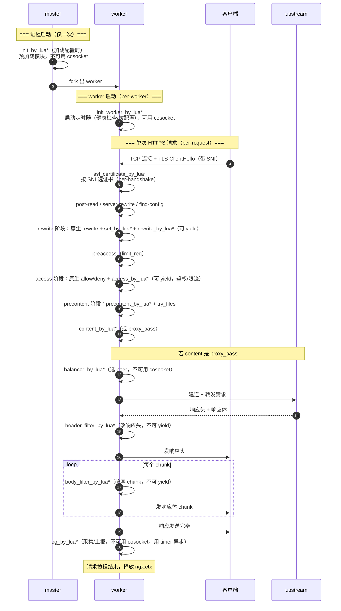

# 23 - Lua 执行阶段详解

> 版本基线：OpenResty 1.29.2.1（内含 Nginx 1.29.x + lua-nginx-module v0.10.29 + LuaJIT 2.1）| 创建日期：2026-08-05
> 受众：后端开发熟手，熟悉 Lua 语言，已读过阶段一/三的基础文档。

---

## 学习目标

这是阶段七最核心的文档之一。理解"阶段"，就是理解 OpenResty 的全部：**哪段 Lua 在什么时机跑、能用哪些 API、能拿到什么样的请求数据**。一旦把阶段刻进脑子，你写出的 Lua 插件就不会再出现"API 不可用报错""数据拿不到""逻辑跑到一半被打断"这类问题。

学完本篇，你应当能够：

- 复述 OpenResty 在 Nginx 11 个处理阶段中插入的 **12 类 Lua 执行指令**，并说出每个指令的触发时机与典型用途。
- 准确画出从 master 启动到单次请求完成的 **完整执行时序**，分清哪些阶段是 per-master、per-worker、per-request、per-TLS-handshake。
- 牢记"**阶段决定可用 API 子集**"这条铁律——知道 cosocket、子请求（`ngx.location.capture`）、`ngx.sleep`、`ngx.exit` 等分别能在哪些阶段调用，以及**为什么**在某些阶段不可用。
- 在同一个 location 中**叠加多个阶段指令**，并用 `ngx.ctx` 在阶段之间安全传递数据。
- 区分 `_block` / `_file` / 旧式 `_lua '字符串'` 三种写法的差异，知道生产环境为什么推荐 `_file`。
- 理解 `rewrite_by_lua`/`access_by_lua` 与原生 `rewrite`/`allow`/`deny` 的**相对执行顺序**，避免混用踩坑。
- 用 Lua 替代 `if is evil`（踩坑 `#1.7`）的写法，写出可预测、可热更新的网关插件。

> **前置知识**：阅读本篇前，请确保已读完：
> - [06-请求处理流程详解](../03-核心机制/06-请求处理流程详解.md)——尤其是其中的"Nginx 11 个处理阶段"。
> - [22-OpenResty入门与架构.md](22-OpenResty入门与架构.md)——OpenResty 与 Nginx 的关系、LuaJIT、组件清单。
>
> 本篇只讲"阶段"本身，具体的 `ngx.*` API 细节留到 [24-OpenResty核心API](24-OpenResty核心API.md)，`lua-resty-*` 库留到 [25-lua-resty库生态](25-lua-resty库生态.md)。

---

## 核心知识点

### 知识点一：Nginx 请求处理阶段回顾

在 [06-请求处理流程详解](../03-核心机制/06-请求处理流程详解.md) 中我们讲过，Nginx 把一次 HTTP 请求的处理流程拆成 **11 个有序阶段**，每个阶段挂载若干模块的 handler，按阶段顺序依次执行。这是 Nginx 模块化的精髓——模块之间不需要互相调用，只需要"注册"到对应阶段，Nginx 引擎会按顺序调度。

这里先做个一句话回顾（详细解释见 06 文档）：

| 序号 | 阶段 | 职责一句话 | 典型原生模块 |
|------|------|-----------|--------------|
| 1 | post-read | 读完请求头后的初始化 | realip |
| 2 | server-rewrite | location 匹配前的 server 级 rewrite | rewrite |
| 3 | find-config | 根据 `$uri` 匹配 location | 内核（不可注册） |
| 4 | rewrite | location 级 rewrite | rewrite |
| 5 | post-rewrite | 检测是否需要重做 location 匹配 | 内核（不可注册） |
| 6 | preaccess | access 前的预处理（限流等） | limit_req / limit_conn |
| 7 | access | 访问控制 / 权限校验 | allow/deny / auth_basic |
| 8 | post-access | access 后处理 / satisfy 汇总 | 内核（不可注册） |
| 9 | precontent | content 前预处理 | try_files / index |
| 10 | content | 内容生成 | static / proxy / fastcgi |
| 11 | log | 日志记录 | access_log |

#### OpenResty 如何"插入" Lua 执行点

OpenResty（即 `lua-nginx-module`，下文简称 ngx_lua）做的事情，本质上就是**在这 11 个阶段的缝隙里，注册 Lua 回调**。原生模块用 C 写 handler，ngx_lua 用 Lua 写 handler，二者对 Nginx 引擎而言没有区别——都是"某个阶段挂载的一个 handler"。

但有几点关键差异：

1. **不是每个阶段都有对应的 Lua 指令。** 例如 find-config / post-rewrite / post-access 这三个由内核独占的阶段，ngx_lua 没有对应的 `*_by_lua` 指令（你无法用 Lua 去干预 location 匹配本身）。
2. **ngx_lua 多出了两个 Nginx 原生 HTTP 阶段里没有的执行点**：
   - `init_by_lua*`：在 master 进程加载配置时执行一次，**早于任何请求阶段**。
   - `init_worker_by_lua*`：在每个 worker 进程启动时执行一次，**早于该 worker 处理任何请求**。
   - 这两个不属于"11 个请求阶段"，而是**进程生命周期阶段**。
3. **`balancer_by_lua*` 挂在 upstream 模块的负载均衡回调上**，严格说它运行在 content 阶段内部（proxy_pass 把请求转发出去之前/重试时），是 content 的"子阶段"。
4. **`ssl_certificate_by_lua*` 挂在 TLS 握手阶段**，发生在 HTTP 请求解析**之前**——此时连 `$uri` 都还没有。

所以完整的 ngx_lua 执行指令有 **12 类**：`init`、`init_worker`、`ssl_certificate`、`set`、`rewrite`、`access`、`precontent`、`content`、`balancer`、`header_filter`、`body_filter`、`log`。

> **特例**：`precontent_by_lua*` 是较新的指令（lua-nginx-module 在 2026 年初正式加入 `precontent_by_lua` directives），OpenResty 1.29.2.1 已内置。在更老的 OpenResty 版本上没有这个指令，需要用 `content_by_lua*` 配合 `ngx.exec` 模拟。

#### Nginx 阶段 + Lua 阶段映射图

下面的 Mermaid 图把"Nginx 原生 11 阶段"和"ngx_lua 的 12 类指令"画在一条时间线上，绿底是内核独占、蓝底是 Lua 执行点、灰底是原生模块执行点：

```mermaid
flowchart TD
    subgraph MASTER["进程生命周期（per-master / per-worker）"]
        M0["master 加载配置"] --> M1["init_by_lua*<br/>预加载模块/初始化全局表"]
        M1 --> M2["master fork 出 N 个 worker"]
        M2 --> M3["init_worker_by_lua*<br/>每个 worker 启动定时任务（per-worker）"]
    end

    M3 --> REQ

    subgraph REQ["单次 HTTPS 请求处理（per-request）"]
        direction TB
        R0["客户端 TCP/TLS 连接进入"] --> S0["ssl_certificate_by_lua*<br/>TLS 握手阶段：按 SNI 选证书<br/>（per-TLS-handshake）"]
        S0 --> R1["① post-read<br/>realip 改写 remote_addr"]
        R1 --> R2["② server-rewrite<br/>原生 rewrite @server"]
        R2 --> R3{"③ find-config<br/>匹配 location（内核）"}
        R3 --> R4["④ rewrite 阶段<br/>原生 rewrite @location<br/>+ set_by_lua*<br/>+ rewrite_by_lua*"]
        R4 --> R5["⑤ post-rewrite（内核）"]
        R5 --> R6["⑥ preaccess<br/>limit_req / limit_conn"]
        R6 --> R7["⑦ access 阶段<br/>allow/deny / auth_basic<br/>+ access_by_lua*"]
        R7 --> R8["⑧ post-access（内核）"]
        R8 --> R9["⑨ precontent 阶段<br/>try_files / index<br/>+ precontent_by_lua*"]
        R9 --> R10["⑩ content 阶段<br/>static / proxy / fastcgi<br/>+ content_by_lua*"]
        R10 --> R10B["balancer_by_lua*<br/>（proxy 时选 upstream peer）"]
        R10B --> R11["响应回写：header_filter_by_lua*<br/>+ body_filter_by_lua*（逐 chunk）"]
        R11 --> R12["⑪ log 阶段<br/>access_log + log_by_lua*"]
    end

    style M1 fill:#bbdefb
    style M3 fill:#bbdefb
    style S0 fill:#bbdefb
    style R4 fill:#bbdefb
    style R7 fill:#bbdefb
    style R9 fill:#bbdefb
    style R10 fill:#bbdefb
    style R10B fill:#bbdefb
    style R11 fill:#bbdefb
    style R12 fill:#bbdefb
    style R3 fill:#e8f5e9
    style R5 fill:#e8f5e9
    style R8 fill:#e8f5e9
```



> **看图要点**：蓝色（Lua 执行点）几乎覆盖了每一个"可被模块注册"的阶段。也就是说，**OpenResty 让你能用 Lua 在请求生命周期的几乎每一个环节插手**——这正是它被称为"可编程网关"的根本原因。绿色三个内核独占阶段（find-config / post-rewrite / post-access）无法用 Lua 直接干预，但你可以通过 `rewrite_by_lua` 改写 `$uri` 间接影响 find-config。

---

### 知识点二：各阶段指令详解（核心）

这是本篇的重头戏。下面逐个讲解 12 类 `*_by_lua*` 指令。每个指令统一按 **触发时机 → 典型用途 → 可用 API 限制 → 代码示例（逐行注释）→ 特例说明** 的结构展开。

> **命名约定**：每类指令都有三种写法——`xxx_by_lua '代码字符串'`（旧式，已不推荐）、`xxx_by_lua_block { 代码 }`（内联块，推荐）、`xxx_by_lua_file /path/to.lua`（外部文件，生产推荐）。三者行为一致，知识点八会专门对比。本节示例统一用可读性最好的 `*_block` 形式。

---

#### 2.1 `init_by_lua*`

**触发时机**：master 进程在**加载解析 Nginx 配置**时执行，**每个 master 生命周期只执行一次**（启动或 `nginx -s reload` 时）。发生在 fork worker 之前、任何 worker 启动之前。

**典型用途**：
- 预加载（`require`）所有 Lua 模块，让它们常驻 worker 内存，避免首个请求冷启动 JIT 编译开销。
- 初始化**全 worker 共享**的全局数据（注意：Lua 全局变量并不跨 worker 共享，跨 worker 共享要用 `ngx.shared.DICT`；这里初始化的是"模板/默认值"）。
- 加载静态配置文件（如本地的路由表、黑白名单 JSON），存进模块级 local table，后续 worker fork 时通过 copy-on-write 继承。

**可用 API 限制**（关键）：
- **不能使用 cosocket**（`ngx.socket.tcp/udp`、`ngx.req.socket`）。原因：此时 Nginx 事件循环（epoll/kqueue）**尚未启动**，没有事件驱动机制支撑非阻塞 I/O，cosocket 依赖事件循环才能 yield/resume。
- 不能使用 `ngx.timer.at`（同理，定时器也依赖事件循环）。
- 不能使用 `ngx.location.capture`（子请求）、`ngx.sleep`、`ngx.var.*`、`ngx.req.*`——此刻根本还没有"请求"。
- **能使用**：`require` 加载模块、`ngx.shared.DICT`（共享字典，初始化其内容）、`ngx.config.*`、纯 Lua 标准库（`os`/`io` 有限、`string`/`table`/`math`/`cjson` 等）。
- 可以用 `ngx.log` 写 error.log（但写的是 master 的日志上下文）。

**代码示例**：

```nginx
http {
    # 声明一个全 worker 共享的内存字典（10MB）
    lua_shared_dict config_cache 10m;

    # master 启动/reload 时执行一次
    init_by_lua_block {
        -- 1. 预加载常用模块，触发 LuaJIT 提前编译，减少首请求延迟
        local cjson      = require "cjson.safe"   -- JSON 编解码
        local resty_lruc = require "resty.lrucache" -- 进程内 LRU 缓存
        local my_router  = require "my.router"     -- 自定义路由模块

        -- 2. 从磁盘读取静态配置（init 阶段可以同步读文件，因为还没进入事件循环，阻塞无所谓）
        local f = io.open("/etc/nginx/lua/config/routes.json", "r")
        local routes_text = f:read("*a")           -- 读取整个文件
        f:close()
        local routes = cjson.decode(routes_text)   -- 解析 JSON 路由表

        -- 3. 把路由表存进"模块级 local 变量"——worker fork 后通过 COW 继承，所有 worker 看到同一份
        my_router.set_routes(routes)               -- 自定义 API：注入路由

        -- 4. 同时写入共享字典，供运行时热更新对比（共享字典跨 worker 共享）
        local dict = ngx.shared.config_cache
        dict:set("routes_version", "v1")           -- 标记当前版本

        ngx.log(ngx.NOTICE, "init_by_lua: loaded ", #routes, " routes")
    }

    # ...server / location...
}
```

**特例说明**：
- 如果你在 `init_by_lua` 里尝试 `ngx.socket.tcp():connect(...)`，会直接抛错 `API disabled in the current context`。
- `init_by_lua` 里加载的模块，**对所有 worker 都生效**（因为 worker 是 master fork 出来的，内存通过 copy-on-write 共享只读页）。这是 OpenResty"零拷贝预热"的关键。
- `nginx -s reload` 时，master 会重新加载配置，`init_by_lua` **会重新执行**。因此热更新 Lua 模块的方式之一就是 reload（但更平滑的方式是用 `ngx.shared.DICT` + 版本号，见知识点七）。

---

#### 2.2 `init_worker_by_lua*`

**触发时机**：每个 worker 进程**启动时**执行一次（`nginx -s reload` 后新 worker 起来也会执行）。发生在 `init_by_lua` 之后、worker 开始处理请求之前。**per-worker**，即 N 个 worker 就执行 N 次。

**典型用途**：
- 启动**后台定时任务**（`ngx.timer.at`）：心跳上报、后端健康检查、周期性从配置中心拉取配置、清理过期缓存等。
- 执行一次性的 worker 级初始化（如建立到 Redis 的预热连接池——注意是连接池预热，不是单个长连接）。
- 在多 worker 环境下做"主 worker 选举"：让 `worker_id == 0` 的 worker 跑全局唯一的定时任务，其余 worker 不跑（避免 N 个 worker 重复拉配置）。

**可用 API 限制**：
- **可以使用 cosocket**！因为此刻 worker 的事件循环已经启动，cosocket 可以正常 yield/resume。这是它与 `init_by_lua` 最大的区别。
- 可以使用 `ngx.timer.at` / `ngx.timer.every` 启动定时器。
- 可以使用 `ngx.shared.DICT`、`ngx.worker.*`（`ngx.worker.id()`、`ngx.worker.count()`、`ngx.worker.pid()`）。
- 可以使用 `ngx.socket.*`、`resty.redis`/`resty.http` 等网络库。
- **不能**直接处理请求级 API（`ngx.var`/`ngx.req`/`ngx.location.capture`）——此刻没有请求上下文。

**代码示例**：

```nginx
http {
    lua_shared_dict health 10m;       # 健康状态共享字典

    init_worker_by_lua_block {
        local worker_id = ngx.worker.id()   -- 当前 worker 编号，0 ~ N-1；master 时返回 -1
        local resty_http = require "resty.http"
        local health_dict = ngx.shared.health

        -- 健康检查定时器：每 5 秒探活一次后端
        local function health_check(premature)
            -- premature=true 表示 worker 正在退出，应尽快收尾，不要再发请求
            if premature then
                ngx.log(ngx.NOTICE, "worker ", worker_id, " exiting, skip health check")
                return
            end

            local httpc = resty_http.new()
            -- 3 秒超时，连接后端 /healthz
            local res, err = httpc:request_uri("http://127.0.0.1:8081/healthz", {
                timeout = 3000,
            })
            if not res or res.status ~= 200 then
                -- 探活失败，在共享字典里标记后端为 down
                health_dict:set("backend_status", "down")
                ngx.log(ngx.ERR, "backend down: ", err or res and res.status)
            else
                health_dict:set("backend_status", "up")
            end

            -- 递归注册下一次定时器（ngx.timer.at 是一次性的）
            local ok, err = ngx.timer.at(5, health_check)
            if not ok then
                ngx.log(ngx.ERR, "failed to reschedule timer: ", err)
            end
        end

        -- 选举：只让 0 号 worker 跑全局唯一的配置拉取任务
        if worker_id == 0 then
            ngx.timer.every(10, function(premature)
                -- 每 10 秒拉取一次动态路由配置（伪代码，实际用 resty.http 调配置中心）
                ngx.log(ngx.INFO, "worker 0 pulling config...")
            end)
        end

        -- 所有 worker 都跑健康检查（每个 worker 各自维护探活，避免单点）
        ngx.timer.at(0, health_check)   -- at(0) 表示立即触发一次
    }

    # ...server / location...
}
```

**特例说明**：
- `ngx.timer.at` 创建的定时器**也是 per-worker** 的，回调在 worker 的事件循环里跑。N 个 worker 各自独立计时，存在轻微偏差。
- 定时器回调里可以用 cosocket、可以 `ngx.sleep`、可以用 `ngx.shared.DICT`，但**不能用 `ngx.var`/`ngx.req`**（没有请求）。可以拿到第一个参数 `premature` 判断 worker 是否在退出。
- `init_worker_by_lua` 如果抛出未捕获异常，**该 worker 不会退出**，但定时任务可能没启动——务必 `pcall` 包裹关键逻辑。
- master 模式（`master_process off;`，仅调试用）下 `ngx.worker.id()` 返回 -1，选举逻辑要兼容这种情况。

---

#### 2.3 `ssl_certificate_by_lua*`

**触发时机**：在 **TLS 握手期间**、Nginx 即将选择证书时执行。此时 HTTP 请求行/请求头**尚未解析**，`$uri`、`$args`、`$host`（来自 Host 头）都还不存在。唯一可用的"身份信息"是 **SNI（Server Name Indication）**——客户端在 ClientHello 里明文带上的目标域名。

**典型用途**：
- 按 SNI **动态选择证书**：一个端口服务成百上千个域名，证书存在 Redis/磁盘/共享字典里，按需加载，避免在配置里写几千个 `server` 块。
- 动态设置 TLS 协议版本、加密套件（通过 `ngx.ssl` 提供的 API）。
- 实现基于证书的客户端认证策略（不同域名要求不同 CA）。

**可用 API 限制**：
- 可用 `ngx.ssl.*` 系列 API：`ngx.ssl.clear_certs()`、`ngx.ssl.set_cert()`、`ngx.ssl.set_priv_key()`、`ngx.ssl.set_der_cert()`、`ngx.ssl.set_der_key()` 等（来自 `lua-resty-core` 的 `ngx.ssl` 模块）。
- 可用 `ngx.ssl.server_name()` 获取 SNI 域名。
- 可用 cosocket（去 Redis/配置中心取证书）。但**强烈建议**把证书预加载到 `ngx.shared.DICT` 或 `init_by_lua`/`init_worker_by_lua` 里，避免每次握手都走网络。
- **不能**用 `ngx.var.*`（请求变量还没就绪）、`ngx.req.*`、`ngx.location.capture`、`ngx.say/print`（没有 HTTP 响应可写）。
- 出错时用 `ngx.exit(ngx.ERROR)` 或返回错误码，不能用 `ngx.exit(ngx.HTTP_...)`（这不是 HTTP 阶段）。

**代码示例**：

```nginx
server {
    listen 443 ssl;
    # 不写固定的 ssl_certificate，改由 Lua 动态设置
    # （仍需占位证书满足 Nginx 配置校验，见特例）
    ssl_certificate     /etc/nginx/ssl/default.crt;
    ssl_certificate_key /etc/nginx/ssl/default.key;

    ssl_certificate_by_lua_block {
        local ssl = require "ngx.ssl"          -- lua-resty-core 提供的 ssl API
        local dict = ngx.shared.certs          # 证书缓存字典

        -- 1. 取出客户端 SNI 域名（ClientHello 里带的）
        local host, err = ssl.server_name()
        if not host then
            -- 没带 SNI（老客户端），用默认证书，直接返回
            return
        end

        -- 2. 从共享字典取该域名的证书 DER（预加载好的）
        local der_cert = dict:get(host .. ":cert")
        local der_key  = dict:get(host .. ":key")
        if not der_cert or not der_key then
            ngx.log(ngx.WARN, "no cert for SNI: ", host, ", fallback to default")
            return                              -- 用占位的 default 证书
        end

        -- 3. 清掉默认占位证书，设置真实证书
        ssl.clear_certs()
        local ok, err = ssl.set_der_cert(der_cert)
        if not ok then
            ngx.log(ngx.ERR, "failed to set cert: ", err)
            return
        end
        local ok, err = ssl.set_der_key(der_key)
        if not ok then
            ngx.log(ngx.ERR, "failed to set key: ", err)
            return
        end
        -- 到此握手会继续用新证书完成
    }

    location / {
        content_by_lua_block { ngx.say("hello over TLS for ", ngx.var.host) }
    }
}
```

**特例说明**：
- 即使要动态设证书，`server` 块里**仍然必须**配置一份占位的 `ssl_certificate`/`ssl_certificate_key`，否则 Nginx 配置解析阶段就报错（"no ssl_certificate"）。占位证书可以是自签的任意证书。
- SNI 是客户端**明文**发送的，在 TLS 加密之前——这意味着它能被中间人看到。不要把 SNI 当成机密信息。
- 一个 TLS 连接可能承载多个 HTTP 请求（HTTP keep-alive / HTTP2 多路复用），但 `ssl_certificate_by_lua` **只在握手时执行一次**，不是每个请求都跑。

---

#### 2.4 `set_by_lua*`

**触发时机**：rewrite 阶段，**与原生 `set`/`rewrite` 指令交织执行**——它出现在配置里的什么位置，就在那个位置执行。每个 `set_by_lua` 执行完会**返回一个值，赋给一个 Nginx 变量**。

**典型用途**：
- 用 Lua 计算 Nginx 变量的值（比 `map` 更灵活，能写复杂逻辑）。
- 拼接、哈希、解码等一次性运算，结果供后续阶段（rewrite/access/content）使用。

**可用 API 限制**（最严格的阶段之一）：
- **几乎是只读 + 纯计算**。明确**不可用**：cosocket、`ngx.location.capture`、`ngx.req.read_body` 等 body 相关、`ngx.exit`、`ngx.redirect`、`ngx.exec`、`ngx.send_headers`、`ngx.print`/`ngx.say`/`ngx.flush`、`ngx.sleep`、`ngx.timer.at`、`ngx.shared.DICT` 的部分方法。
- 可用：`ngx.var.*`（读）、`ngx.req.get_headers()`（读请求头）、`ngx.time`/`ngx.now`、`ngx.md5`/`ngx.sha1_bin`、`ngx.re.*`（正则）、纯 Lua 库。
- **不能 yield**：这意味着不能有任何"挂起等待"的操作。设计上就是"快进快出"的同步计算。

> **为什么这么严？** `set_by_lua` 设计目标是替代 `map`/`set` 这类轻量变量计算，挂在 rewrite 模块的处理流里。rewrite 阶段的指令是"指令式串行"的，不允许 yield（否则会破坏 rewrite 模块的执行模型）。所以它被刻意限制成纯同步、无 I/O。

**代码示例**：

```nginx
location / {
    # 用 Lua 算一个签名变量，供下游 proxy_set_header 使用
    set_by_lua_block $signature {
        -- ngx.var 可读：取出时间戳和 token
        local ts    = ngx.var.arg_ts          -- 从查询参数取 ts
        local token = ngx.var.arg_token       -- 从查询参数取 token
        if not ts or not token then
            return ""                          -- 缺参返回空串
        end
        -- 拼接 + md5：签名 = md5(ts .. ":" .. token .. ":salt")
        return ngx.md5(ts .. ":" .. token .. ":salt")
    }

    # 之后 $signature 就是个普通 Nginx 变量，可在任意阶段引用
    proxy_set_header X-Signature $signature;
    proxy_pass http://backend;
}
```

**特例说明**：
- `set_by_lua` 只能返回**一个值**给**一个变量**（旧式 `set_by_lua $var '代码'` 也是单返回值）。要设置多个变量得写多个 `set_by_lua`，或改用 `rewrite_by_lua` 里 `ngx.var.x = ...`。
- **不要在 `set_by_lua` 里写重逻辑**。它每次请求都跑、且不能 yield，一旦你塞进网络 I/O 会直接报错。需要重逻辑就用 `rewrite_by_lua`/`access_by_lua`。
- 性能上它比 `rewrite_by_lua` 略快（少了协程切换开销），但能力也弱得多。

---

#### 2.5 `rewrite_by_lua*`

**触发时机**：rewrite 阶段，但在**原生 rewrite 模块的所有指令（`rewrite`/`set`/`if`/`set_by_lua`）执行完之后**才执行（除非用 `rewrite_by_lua_no_cache` 等改顺序，默认是 rewrite 阶段尾部）。

**典型用途**：
- 复杂的 URL 重写 / 重定向 / 内部跳转（`ngx.redirect`、`ngx.exec`）。
- 按请求特征做**分发**（灰度路由、A/B 测试、按 header 转发到不同 upstream）。
- 改写 `$uri`、`$args`（用 `ngx.req.set_uri`、`ngx.req.set_uri_args`）。
- 设置后续阶段要用的 Nginx 变量（`ngx.var.xxx = ...`）。

**可用 API 限制**：
- 可以 yield，所以 cosocket、`ngx.location.capture`、`ngx.sleep` 都可用。
- 可用 `ngx.req.set_uri` / `ngx.req.set_uri_args` 改写请求（等价原生 `rewrite`）。
- 可用 `ngx.var.*` 读写、`ngx.redirect`、`ngx.exec`（内部跳转）。
- 可用 `ngx.exit` 终止请求。
- **注意**：`rewrite_by_lua` 里 `ngx.exec` 跳转后，**当前 Lua 之后的代码不再执行**，请求重新进入 find-config。

**代码示例**：

```nginx
location / {
    rewrite_by_lua_block {
        -- 示例：按查询参数 version 做灰度分流
        local version = ngx.var.arg_version    -- 取 ?version=v2
        local uri = ngx.var.uri

        if version == "v2" then
            -- 用 ngx.req.set_uri 改写 URI，等价于 rewrite ^ /v2$uri break
            ngx.req.set_uri("/v2" .. uri)
            -- 改写后不会触发重新匹配 location（等同 break 语义）
            -- 若要重新匹配，用 ngx.exec("/v2" .. uri) 走内部重定向
        end

        -- 非法路径直接 403
        if uri:match("%.%.") then               -- 防目录穿越
            return ngx.exit(ngx.HTTP_FORBIDDEN)
        end
    }

    proxy_pass http://backend;
}
```

**特例说明**：
- `rewrite_by_lua` 默认在原生 `rewrite` 指令**之后**跑。如果你希望它先跑，可用 `lua_rewrite_nesting_level`/配置调整，但通常不需要——遵循"原生 rewrite 先、Lua 后"即可（见知识点八）。
- `ngx.req.set_uri(uri, true)` 第二个参数为 `true` 时会触发 `rewrite ... last` 语义（重新匹配 location），为 `false`/省略时是 `break` 语义。
- 如果 location 里有 `proxy_pass`，且 `rewrite_by_lua` 没有改写 URI，请求会原样转发——`rewrite_by_lua` 不影响 `proxy_pass` 的 content handler 身份。

---

#### 2.6 `access_by_lua*`

**触发时机**：access 阶段，在原生 access 模块（`allow`/`deny`、`auth_basic`、`auth_request`）**执行完之后**执行（access 阶段尾部）。

**典型用途**（OpenResty 网关最常用的阶段）：
- 鉴权：校验 JWT/Token/Session，调用 `resty.jwt` 或远程鉴权服务。
- 访问控制：IP 黑白名单（比 `allow/deny` 灵活，能查 Redis 动态名单）、设备指纹校验。
- 限流准入（配合 `ngx.shared.DICT` + 滑动窗口/令牌桶）——注意原生 `limit_req` 在 preaccess 阶段，比 access_by_lua 更早。
- 请求改写前的"准入闸门"：校验通过才允许进入 content。

**可用 API 限制**：
- 可以 yield：cosocket（查 Redis/调鉴权接口）、`ngx.location.capture`、`ngx.sleep` 均可用。
- 可用 `ngx.var.*`、`ngx.req.*`（含 `get_headers`、`read_body`）、`ngx.exit`、`ngx.redirect`。
- 可用 `ngx.shared.DICT`（限流计数）。
- **不能**用 `ngx.say`/`ngx.print`/`ngx.send_headers` 输出响应体——这些是 content 阶段的事。要中止请求用 `ngx.exit(status)`（可先 `ngx.header.xxx=...` 设头）。

**代码示例**：

```nginx
location /api/ {
    access_by_lua_block {
        -- 1. 取 Authorization 头
        local auth = ngx.var.http_authorization
        if not auth or not auth:find("Bearer ") then
            ngx.header["WWW-Authenticate"] = 'Bearer realm="api"'
            return ngx.exit(ngx.HTTP_UNAUTHORIZED)   -- 401
        end

        -- 2. 校验 JWT（用 resty.jwt，纯本地验签，不阻塞）
        local jwt = require "resty.jwt"
        local token = auth:sub(8)                     -- 去掉 "Bearer " 前缀
        local verified = jwt:verify("my-secret", token)
        if not verified.verified then
            return ngx.exit(ngx.HTTP_FORBIDDEN)       -- 403
        end

        -- 3. 把用户信息塞进 ngx.ctx，供 content 阶段使用（见知识点六）
        ngx.ctx.user_id = verified.payload.sub

        -- 4. 简单限流：每秒每用户 10 次（共享字典 + 滑动窗口，伪代码）
        local limit = ngx.shared.limit_dict
        local key = "u:" .. verified.payload.sub
        local count, err = limit:incr(key, 1, 0, 1)   -- 1 秒过期
        if count and count > 10 then
            return ngx.exit(429)                       -- Too Many Requests
        end
    }

    proxy_pass http://backend;
}
```

**特例说明**：
- `access_by_lua` 在 `allow`/`deny`/`auth_basic` **之后**跑。所以原生 `deny all` 已经拒绝的请求，根本到不了 `access_by_lua`。反之，`access_by_lua` 里 `ngx.exit(403)` 也能阻止请求进入 content（见知识点九）。
- 如果 `access_by_lua` 里 `ngx.exit` 了，**content handler 不会执行**。这是鉴权闸门的核心原理。
- `access_by_lua` 里做远程鉴权（cosocket）会**增加请求延迟**，务必设合理超时，并考虑用 `ngx.shared.DICT` 缓存鉴权结果（如缓存 5 秒）。

---

#### 2.7 `precontent_by_lua*`

**触发时机**：precontent 阶段（第 9 阶段），在 `try_files`/`index`/`autoindex` 等原生 precontent 模块**之前**执行。这是较新的指令（2026 年加入），填补了 access 与 content 之间的空白。

**典型用途**：
- 在 content 生成前做一次"预处理"，决定要不要走 `try_files`、要不要直接 `ngx.exec` 跳转。
- 配合 `try_files` 做条件化回退：Lua 先判断，决定回退目标。
- 替代旧的"用 `content_by_lua` 模拟 precontent"的 hack 写法。

**可用 API 限制**：
- 可 yield：cosocket、`ngx.location.capture`、`ngx.sleep` 可用。
- 可用 `ngx.exec`（内部重定向）、`ngx.exit`。
- 可用 `ngx.var.*`、`ngx.req.*`、`ngx.shared.DICT`。
- 注意：如果在此阶段 `ngx.exec` 跳转了，后续的 `try_files`/content 都不再执行。

**代码示例**：

```nginx
location / {
    root /var/www;

    # precontent 阶段：先做 Lua 预处理
    precontent_by_lua_block {
        -- 示例：登录态校验后决定回退到 SPA index 还是 API
        local cookie = ngx.var.cookie_session
        if not cookie then
            -- 未登录且访问的是 /admin 开头，内部跳转到登录页
            if ngx.var.uri:match("^/admin") then
                ngx.exec("/login")          -- 内部重定向到 /login location
            end
        end
        -- 否则放行，继续走下面的 try_files
    }

    # Lua 没有跳转时，执行原生 try_files
    try_files $uri $uri/ /index.html;
}
```

**特例说明**：
- 在没有 `precontent_by_lua` 的老版本 OpenResty 上，常见替代方案是把这些逻辑放进 `access_by_lua`（能力近似，但语义上 access 偏"鉴权"，precontent 偏"内容分发"）。
- `precontent_by_lua` 和 `content_by_lua` **不能同时**在同一个 location 生效——content 阶段只能有一个"主 handler"。若都配了，`content_by_lua` 优先；要让 precontent 的跳转生效，需在 precontent 里 `ngx.exec` 到另一个 location。

---

#### 2.8 `content_by_lua*`

**触发时机**：content 阶段（第 10 阶段），**作为该 location 的 content handler** 产生响应。这是最像"写一个 Servlet / Controller"的阶段。

**典型用途**：
- 直接用 Lua 生成 HTTP 响应（API 聚合、动态内容、健康检查端点）。
- 配合 cosocket 调多个后端，聚合结果返回。
- 实现"Lua 应用服务器"：在 Nginx 里直接写业务逻辑。

**可用 API 限制**：
- 可 yield：cosocket、`ngx.location.capture`、`ngx.sleep` 全部可用。
- 可用全套输出 API：`ngx.say`/`ngx.print`/`ngx.flush`/`ngx.eof`/`ngx.send_headers`/`ngx.header.*`。
- 可用 `ngx.exit`、`ngx.exec`、`ngx.redirect`。
- 可用 `ngx.var.*`、`ngx.req.*`、`ngx.shared.DICT`、`ngx.timer.at`。
- **互斥**：一个 location 里 `content_by_lua` 与 `proxy_pass`/`fastcgi_pass`/`static`/`return` 等 content handler **不能同时生效**——只有最先注册的胜出。要让 Lua 配合 proxy，应把 Lua 放在 `rewrite_by_lua`/`access_by_lua`，content 留给 `proxy_pass`。

**代码示例**：

```nginx
location = /profile {
    content_by_lua_block {
        -- 1. 设响应头
        ngx.header["Content-Type"] = "application/json"

        -- 2. 并行发起两个子请求，聚合用户信息和订单
        local res1, res2 = ngx.location.capture_multi{
            { "/internal/user" },        -- 子请求 1（见 06 文档子请求）
            { "/internal/orders" }       -- 子请求 2
        }

        -- 3. 任一子请求失败就返回 502
        if res1.status ~= 200 or res2.status ~= 200 then
            ngx.status = 502
            ngx.say('{"err":"upstream error"}')
            return ngx.exit(ngx.HTTP_BAD_GATEWAY)
        end

        -- 4. 合并返回
        ngx.say('{"user":' .. res1.body .. ',"orders":' .. res2.body .. '}')
    }
}

# 子请求目标（internal，外部不可直接访问）
location = /internal/user   { internal; proxy_pass http://user-svc/; }
location = /internal/orders { internal; proxy_pass http://order-svc/; }
```

**特例说明**：
- `content_by_lua` 执行后**必须**主动产出响应（`ngx.say`/`ngx.exit`/`ngx.exec` 等）。如果 Lua 跑完啥也没输出，Nginx 会认为 content handler 未处理，可能返回空响应或 404。
- 不要在 `content_by_lua` 里再配 `proxy_pass`——会被忽略或报 "content handler conflict"。
- 大响应体建议用 `ngx.print` + `ngx.flush` 流式输出，避免一次性占用过多内存。

---

#### 2.9 `balancer_by_lua*`

**触发时机**：upstream 负载均衡阶段。当 content handler 是 `proxy_pass`/`fastcgi_pass` 等、Nginx 需要挑选一个 upstream peer 时调用。**每次尝试一个 peer（包括重试）都会调用**。

**典型用途**：
- 动态负载均衡：不依赖静态 `upstream` 块，按运行时状态（权重、延迟、健康状态）选 peer。
- 粘性会话（session sticky）：按 cookie/header 哈希到固定后端。
- 灰度发布：按用户特征把流量导到灰度实例。
- 主动健康检查联动：结合 `init_worker_by_lua` 探活结果，跳过 down 的 peer。

**可用 API 限制**（特殊，最受限之一）：
- **不能使用 cosocket**（官方"Cosockets Not Available Everywhere"明确列入）。原因：balancer 回调在 upstream 连接建立的关键路径上，不能 yield。
- **不能使用** `ngx.location.capture`、`ngx.sleep`、`ngx.req.read_body`、`ngx.print/say` 等。
- **能使用**：`ngx.balancer.*` 系列 API（`ngx.balancer.new_peer`、`ngx.balancer.rebind`、`ngx.balancer.set_current_peer`、`ngx.balancer.set_timeouts`、`ngx.balancer.set_more_tries`、`ngx.balancer.get_last_failure`）。
- 可用 `ngx.var.*`、`ngx.shared.DICT`、`ngx.ctx`（读取在 access/rewrite 阶段存好的数据）。

**代码示例**：

```nginx
upstream dynamic_backend {
    # 占位的 server，真实 peer 由 Lua 动态指定
    server 0.0.0.0:1;    # 占位，balancer_by_lua 会覆盖

    balancer_by_lua_block {
        -- 1. 从共享字典取当前可用的 peer 列表（init_worker 定时探活维护）
        local peers = ngx.shared.upstream_peers
        local list = peers:get("live_peers")    -- 形如 "10.0.0.1:8080,10.0.0.2:8080"

        -- 2. 简单轮询（生产用一致性哈希/加权，这里演示原理）
        local idx = (ngx.ctx.peer_idx or 0) + 1
        local peers_arr = {}
        for p in string.gmatch(list, "[^,]+") do
            peers_arr[#peers_arr + 1] = p
        end
        local chosen = peers_arr[((idx - 1) % #peers_arr) + 1]

        -- 3. 把 host:port 拆开，告诉 Nginx 连这个 peer
        local host, port = string.match(chosen, "^(.-):(%d+)$")
        local ok, err = ngx.balancer.set_current_peer(host, tonumber(port))
        if not ok then
            ngx.log(ngx.ERR, "set peer failed: ", err)
            return ngx.exit(500)
        end

        ngx.ctx.peer_idx = idx    -- 记录已用序号，供重试时换下一个
    }
}

server {
    location / {
        proxy_pass http://dynamic_backend;
    }
}
```

**特例说明**：
- `balancer_by_lua` 里**绝不能**做网络 I/O——所有"决策数据"（健康状态、权重）必须在 `init_worker_by_lua` 的定时器里预先算好，存进 `ngx.shared.DICT`，balancer 阶段只读字典、快速决策。
- 配合重试：当 peer 连接失败，Nginx 会再次进入 `balancer_by_lua`（如果 `proxy_next_upstream` 允许）。可用 `ngx.balancer.get_last_failure()` 拿到上次失败原因，换下一个 peer。
- upstream 块里仍需写至少一个占位 `server`，否则配置校验失败。

---

#### 2.10 `header_filter_by_lua*`

**触发时机**：响应头过滤阶段，在 Nginx 即将把响应头发给客户端**之前**执行。此时响应体还没发（或刚开始发）。

**典型用途**：
- 修改 / 增 / 删响应头：加 `X-Response-Time`、隐藏 `Server`、统一 `Cache-Control`、注入 `Set-Cookie`。
- 按请求特征动态设置安全头（CSP、HSTS）。
- 跨域 CORS 头处理。

**可用 API 限制**：
- **不能使用 cosocket**（不可 yield，filter 阶段是同步的）。
- **不能** `ngx.location.capture`、`ngx.sleep`、`ngx.say/print`、`ngx.flush`。
- **能使用**：`ngx.header.*`（读写响应头）、`ngx.var.*`、`ngx.status`（改状态码）、`ngx.req.*`（只读）、`ngx.shared.DICT`。
- 可用 `ngx.exit`（但一般不需要，filter 阶段直接 return 即可）。

**代码示例**：

```nginx
header_filter_by_lua_block {
    -- 1. 注入统一的响应头
    ngx.header["X-Backend"] = ngx.var.upstream_addr or "self"   -- 标记由哪个后端服务
    ngx.header["X-Request-Id"] = ngx.var.request_id             -- 透传请求 ID

    -- 2. 隐藏 Server 头（安全加固，替代 server_tokens off 的补充）
    ngx.header["Server"] = nil                                  -- 设为 nil 即删除该头

    -- 3. 仅对 /api/ 开头的路径加 CORS 头
    if ngx.var.uri:match("^/api/") then
        ngx.header["Access-Control-Allow-Origin"]  = "*"
        ngx.header["Access-Control-Allow-Methods"] = "GET, POST, OPTIONS"
    end
}
```

**特例说明**：
- `ngx.header.X = nil` 是**删除**响应头的标准写法（设为 nil）。
- `header_filter_by_lua` **每个请求执行一次**（不像 body_filter 可能多次）。
- 改 `ngx.status` 要在响应头正式发出之前；一旦 `ngx.send_headers` 后再改无效。
- 原生 `add_header` 指令也在 header filter 阶段，与 Lua 的执行顺序由配置位置决定——一般原生 `add_header` 先于 `header_filter_by_lua`。混用时建议统一用 Lua 管理，避免顺序歧义。

---

#### 2.11 `body_filter_by_lua*`

**触发时机**：响应体过滤阶段，对响应体的**每一个 chunk**调用一次。一个响应可能被分成多个 chunk（尤其大文件、流式代理），所以 `body_filter_by_lua` **可能被多次调用**。

**典型用途**：
- 逐 chunk 改写响应体（脱敏、注入水印、压缩/加密、HTML 改写）。
- 统计响应体大小（累加每个 chunk 长度）。
- 在响应体末尾追加内容。

**可用 API 限制**：
- **不能使用 cosocket**（不可 yield）。
- **不能** `ngx.location.capture`、`ngx.sleep`、`ngx.say/print`（不能在 filter 里再产生输出）、`ngx.send_headers`。
- **能使用**：`ngx.arg[1]`（当前 chunk 的数据，string）、`ngx.arg[2]`（布尔，是否是最后一个 chunk / "eof" 信号）、`ngx.header.*`（只读改头有限）、`ngx.ctx`。
- 通过**修改 `ngx.arg[1]`** 来改写 chunk 内容；通过 `ngx.arg[2] = true` 提前结束，或设 `ngx.arg[1] = nil` 丢弃当前 chunk。

**代码示例**：

```nginx
body_filter_by_lua_block {
    -- ngx.arg[1] 是当前 chunk 的字节串，ngx.arg[2] 为 true 表示这是最后一块

    -- 1. 统计响应体大小，累加到 ngx.ctx
    local chunk = ngx.arg[1]
    if chunk then
        ngx.ctx.bytes = (ngx.ctx.bytes or 0) + #chunk
    end

    -- 2. 示例：把响应体里的 "secret" 替换成 "******"（简单字符串替换）
    if chunk then
        ngx.arg[1] = chunk:gsub("secret", "******")
    end

    -- 3. 最后一块时，记录总大小（可写日志或上报）
    if ngx.arg[2] then
        ngx.log(ngx.INFO, "response body size: ", ngx.ctx.bytes or 0)
    end
}
```

**特例说明**：
- `body_filter_by_lua` 对 chunk 的改写**不能跨 chunk**——如果你想替换的字符串正好被切在两个 chunk 中间，简单 `gsub` 会漏替换。处理跨 chunk 场景需要自己维护缓冲区（用 `ngx.ctx.buf` 暂存），较复杂。生产中尽量用 `lua-resty-string` 或专门的 body 改写库。
- 与 `gzip` 等过滤模块的**顺序**很关键：若 `gzip` 在 Lua 之前，Lua 拿到的是已压缩字节，改写无意义。一般把 `body_filter_by_lua` 放在 `gzip` 之前（改明文，再压缩）。
- 每次调用都创建新协程有开销，chunk 很多时注意性能；避免在 body_filter 里做重计算。

---

#### 2.12 `log_by_lua*`

**触发时机**：log 阶段（第 11 阶段），在**响应已经发给客户端之后**执行。此时请求处理已基本结束，log 阶段是"收尾"。

**典型用途**：
- 记录结构化访问日志（比 `log_format` 灵活，能写 JSON）。
- 异步上报监控指标（请求量、延迟、状态码分布）到统计系统。
- 请求级别的埋点采集（用户行为、链路追踪 span 上报）。

**可用 API 限制**：
- **不能使用 cosocket**（官方"Cosockets Not Available Everywhere"明确列入 log_by_lua*）。原因：响应已发完，请求上下文正在被销毁，cosocket 依赖的请求级资源已不稳定。
- **不能** `ngx.location.capture`、`ngx.say/print`、`ngx.sleep`、`ngx.send_headers`。
- **能使用**：`ngx.var.*`（读最终值）、`ngx.req.*`（只读）、`ngx.shared.DICT`、`ngx.timer.at`（**关键**：要发网络请求上报，用定时器异步做）、`ngx.now`/`ngx.localtime`、`ngx.header.*`（只读）。
- `ngx.exit` 一般不用（log 是最后一步）。

**代码示例**：

```nginx
log_by_lua_block {
    -- 1. 采集请求指标
    local metric = {
        uri      = ngx.var.uri,
        method   = ngx.var.request_method,
        status   = ngx.status,
        cost     = ngx.now() - ngx.req.start_time(),   -- 请求耗时（秒）
        upstream = ngx.var.upstream_addr or "",
        client   = ngx.var.remote_addr,
    }

    -- 2. 累加到共享字典（按状态码分桶统计 QPS）
    local stats = ngx.shared.req_stats
    stats:incr("status:" .. metric.status, 1, 0)
    stats:incr("total", 1, 0)

    -- 3. 异步上报到外部监控（不能用 cosocket，用 ngx.timer.at 包一层）
    local cjson = require "cjson.safe"
    local payload = cjson.encode(metric)
    ngx.timer.at(0, function(premature)
        if premature then return end
        -- 在 timer 回调里可以用 cosocket 发往监控服务
        local http = require "resty.http"
        local httpc = http.new()
        httpc:request_uri("http://127.0.0.1:9200/metrics", {
            method = "POST", body = payload, timeout = 2000,
        })
    end)
}
```

**特例说明**：
- **不要在 `log_by_lua` 里直接用 cosocket**——会报错。要发网络请求，统一用 `ngx.timer.at(0, function ...)` 异步派发（timer 回调里可以用 cosocket）。这是社区（如 `lua-resty-logger-socket`）的标准做法。
- `log_by_lua` 出错**不影响已返回的响应**（响应早就发给客户端了），但会让本次日志丢失，所以要 `pcall` 包裹关键逻辑。
- `ngx.var.upstream_response_time` 等变量在 log 阶段才最终确定，适合在此采集。

---

### 知识点三：阶段执行顺序

把 12 类指令串起来，完整的执行顺序是：

```
init_by_lua*  →  init_worker_by_lua*
        │              │
        └─ per-master ─┴─ per-worker ─┐
                                        │ （worker 就绪，开始处理请求）
                                        ▼
        ┌─── per-request（每个请求都走一遍）───────────────────────────┐
        │                                                                │
        │  ssl_certificate_by_lua*  （HTTPS 才有，per-TLS-handshake）   │
        │        ↓                                                       │
        │  set_by_lua* / rewrite_by_lua*  （rewrite 阶段，原生 rewrite 之后）│
        │        ↓                                                       │
        │  access_by_lua*  （access 阶段，原生 allow/deny 之后）          │
        │        ↓                                                       │
        │  precontent_by_lua*  （precontent 阶段，try_files 之前）        │
        │        ↓                                                       │
        │  content_by_lua*  （content 阶段，产生响应）                    │
        │        ↓  （若 content 是 proxy_pass）                          │
        │  balancer_by_lua*  （选 upstream peer，可能因重试多次）          │
        │        ↓                                                       │
        │  header_filter_by_lua*  （发响应头前）                          │
        │        ↓                                                       │
        │  body_filter_by_lua*  （逐 chunk 发响应体，多次调用）           │
        │        ↓                                                       │
        │  log_by_lua*  （响应发完后，收尾）                               │
        └────────────────────────────────────────────────────────────────┘
```

#### 单请求完整时序图

下面用一个 Mermaid 时序图展示"一个 HTTPS 请求从握手到日志"的完整阶段流转，标注了每个阶段的执行主体（master/worker/请求协程）和能否 yield：



#### per-master / per-worker / per-request / per-handshake 分类

这是理解性能与并发模型的关键。把 12 类指令按"执行频次"分类：

| 频次级别 | 执行主体 | 指令 | 执行次数 |
|----------|----------|------|----------|
| **per-master** | master 进程 | `init_by_lua*` | 每个 master 生命周期 1 次（启动/reload） |
| **per-worker** | 每个 worker | `init_worker_by_lua*` | 每个 worker 启动 1 次（N worker 则 N 次） |
| **per-TLS-handshake** | worker 的连接协程 | `ssl_certificate_by_lua*` | 每次 TLS 握手 1 次（非每请求） |
| **per-request** | worker 的请求协程 | `set` / `rewrite` / `access` / `precontent` / `content` / `header_filter` / `body_filter` / `log` | 每个请求各 1 次（body_filter 可能多次） |
| **per-upstream-attempt** | worker 的请求协程 | `balancer_by_lua*` | 每次挑选/重试 peer 1 次 |

> **心智模型**：master 和 worker 阶段是"全局/进程级"的，跑的代码所有请求共享（通过 `ngx.shared.DICT` 和模块级 local）。per-request 阶段是"请求级"的，每个请求在自己的 Lua 协程里独立跑，互不阻塞（只要用了非阻塞 API）。理解了"这段代码多久跑一次"，就能判断它该做轻量还是重量级的事——`init_worker` 里可以放心起定时器做网络探活，而 `set_by_lua` 里连 sleep 都不行。

---

### 知识点四：阶段与可用 API 的关系（关键约束）

这是 OpenResty 最容易被踩的坑：**同一段 Lua 代码，放在不同阶段，能调用的 API 子集不同**。在你写插件时，"这个 API 能不能在这里用"是必须时刻默念的问题。

#### 核心结论

1. **能否 yield 是分水岭。** 凡是"可 yield"的阶段（rewrite/access/precontent/content/init_worker/ssl），就能用 cosocket、子请求、`ngx.sleep`——也就是能做非阻塞网络 I/O。凡是"不可 yield"的阶段（set/header_filter/body_filter/balancer），就只能做同步、纯计算、本地字典读写。
2. **请求上下文是否存在是另一道闸。** `init_by_lua`/`init_worker_by_lua` 没有"请求"，所以 `ngx.var`/`ngx.req`/`ngx.location.capture` 全不可用。`ssl_certificate_by_lua` 有连接但没 HTTP 请求，所以也用不了请求级 API。
3. **log_by_lua 虽然在请求内，但请求正在收尾**，cosocket 不可用——要发网络请求上报，用 `ngx.timer.at` 异步派发。

#### 各阶段可用关键 API 速查表

下表汇总每个阶段的关键 API 可用性（基于 lua-nginx-module v0.10.29 官方文档）：

| 阶段指令 | cosocket | 子请求 capture | ngx.sleep | 输出 say/print | ngx.var 读写 | ngx.req.* | ngx.exit | ngx.shared.DICT | ngx.timer.at |
|----------|:--------:|:--------------:|:---------:|:--------------:|:------------:|:----------:|:--------:|:---------------:|:------------:|
| `init_by_lua*` | ❌ | ❌ | ❌ | ❌ | ❌ | ❌ | ❌ | ✅ | ❌ |
| `init_worker_by_lua*` | ✅ | ❌ | ✅ | ❌ | ❌ | ❌ | ⚠️ | ✅ | ✅ |
| `ssl_certificate_by_lua*` | ✅ | ❌ | ✅ | ❌ | ❌ | ❌ | ⚠️ | ✅ | ❌ |
| `set_by_lua*` | ❌ | ❌ | ❌ | ❌ | 读✅/写❌ | 只读 | ❌ | ❌ | ❌ |
| `rewrite_by_lua*` | ✅ | ✅ | ✅ | ❌ | ✅ | ✅ | ✅ | ✅ | ✅ |
| `access_by_lua*` | ✅ | ✅ | ✅ | ❌ | ✅ | ✅ | ✅ | ✅ | ✅ |
| `precontent_by_lua*` | ✅ | ✅ | ✅ | ❌ | ✅ | ✅ | ✅ | ✅ | ✅ |
| `content_by_lua*` | ✅ | ✅ | ✅ | ✅ | ✅ | ✅ | ✅ | ✅ | ✅ |
| `balancer_by_lua*` | ❌ | ❌ | ❌ | ❌ | ✅ | ❌ | ⚠️ | ✅ | ❌ |
| `header_filter_by_lua*` | ❌ | ❌ | ❌ | ❌ | ✅ | 只读 | ⚠️ | ✅ | ✅ |
| `body_filter_by_lua*` | ❌ | ❌ | ❌ | ❌ | ✅ | 只读 | ⚠️ | ✅ | ✅ |
| `log_by_lua*` | ❌ | ❌ | ❌ | ❌ | ✅ | 只读 | ⚠️ | ✅ | ✅ |

> 图例：✅ 可用 | ❌ 不可用（调用会抛错 `API disabled in the current context`）| ⚠️ 受限（可用但语义受限，如 `ngx.exit` 在无请求上下文或非 HTTP 阶段意义有限）| "只读" 表示可读取但不能改变请求行为。

#### 特例深入：为什么 `init_by_lua` 不能用 cosocket？

cosocket 的底层实现依赖 **Nginx 的事件循环**（epoll/kqueue）来驱动非阻塞 I/O：当 cosocket 发起 `connect`/`receive` 需要等待时，Lua 协程会 **yield**（挂起），把控制权交还给 Nginx 事件循环；事件循环在 socket 可读/可写时再 **resume** 协程继续执行。

而 `init_by_lua` 运行在 **master 进程加载配置的阶段**，此时：

- master 还没有进入事件循环（master 不处理请求，事件循环在 worker 里）。
- 没有"请求"作为 cosocket 的归属对象（cosocket 必须挂在一个请求或 timer 上下文上，生命周期跟随它）。
- Lua 协程没有可交还的"宿主"。

所以 cosocket 在 `init_by_lua` 里"无处可 yield"——强行调用会直接报错。这也是为什么 OpenResty 要求"加载阶段的网络初始化"挪到 `init_worker_by_lua`（worker 有事件循环）或 `ngx.timer.at`（timer 有自己的协程宿主）里做。

> **推论**：判断一个阶段能否用 cosocket，看两件事——①有没有事件循环在跑；②协程 yield 后有没有宿主能 resume。`init_by_lua` 两条都不满足；`set/header/body/balancer` 满足①但"指令式串行"模型不允许 yield（会破坏阶段处理流的原子性）；`log_by_lua` 满足①但请求正在销毁，②不稳定。只有 rewrite/access/precontent/content/init_worker/ssl 这几个阶段两条都满足。

---

### 知识点五：同一 location 叠加多个阶段

一个常见的误解是"一个 location 只能配一个 `*_by_lua`"。事实是：**同一个 location 可以同时使用多个不同阶段的 Lua 指令**，它们会按阶段顺序依次执行。这正是 OpenResty 网关插件的标准写法——把不同关注点拆到不同阶段。

可以叠加的典型组合：

- `rewrite_by_lua` + `access_by_lua` + `content_by_lua`：rewrite 改写、access 鉴权、content 生成，各司其职。
- `access_by_lua` + `header_filter_by_lua` + `log_by_lua`：access 鉴权、header_filter 改响应头、log 采集。
- `rewrite_by_lua` + `balancer_by_lua`：rewrite 决定灰度标志、balancer 按标志选 peer。

**不能叠加的约束**：同一个阶段只能有一个生效——例如 `content_by_lua` 与 `proxy_pass` 互斥（都是 content handler），`content_by_lua_block` 和 `content_by_lua_file` 不能并存。不同阶段之间则无冲突。

#### 用 ngx.ctx 在阶段间传递数据

多个阶段叠加时，前一个阶段算出的结果（如鉴权后的用户 ID、灰度标志）需要传给后面的阶段。Nginx 变量（`ngx.var.xxx`）可以传递，但开销较大（每次读写都经过 Nginx 变量哈希）。更推荐用 `ngx.ctx`——它是请求级 Lua table，读写是普通 Lua 表操作，零额外开销。

```nginx
location /api/ {
    # ① rewrite 阶段：解析路由，决定灰度标志
    rewrite_by_lua_block {
        local uid = ngx.var.arg_uid
        ngx.ctx.uid = uid                       -- 存进 ctx，后续阶段可直接读
        ngx.ctx.gray = (tonumber(uid) % 10 == 0) -- 10% 用户走灰度
    }

    # ② access 阶段：鉴权（用 ctx.uid 免重复解析）
    access_by_lua_block {
        if not ngx.ctx.uid then
            return ngx.exit(ngx.HTTP_UNAUTHORIZED)
        end
        ngx.ctx.authed = true                   -- 标记已鉴权
    }

    # ③ content 阶段：按灰度标志选不同后端
    content_by_lua_block {
        if not ngx.ctx.authed then              -- 防御性检查
            return ngx.exit(ngx.HTTP_FORBIDDEN)
        end
        if ngx.ctx.gray then
            ngx.exec("@gray_backend")           -- 内部跳转到灰度 location
        else
            ngx.exec("@stable_backend")         -- 跳转到稳定 location
        end
    }
}

location @gray_backend    { proxy_pass http://gray; }
location @stable_backend  { proxy_pass http://stable; }
```

> **特例**：`ngx.exec` 跳转后，目标 location 会**重新走一遍 rewrite/access/content**。原 location 的 `ngx.ctx` **不会**带到新 location（`ngx.exec` 内部重定向会重建请求上下文）。所以跨 `ngx.exec` 传数据要用 `ngx.shared.DICT` 或 Nginx 变量，不能用 `ngx.ctx`。上面例子里 `content_by_lua` 是同一请求内读 `ngx.ctx`，没跨 `exec` 边界，所以没问题。

---

### 知识点六：ngx.ctx 请求级数据传递

`ngx.ctx` 是 OpenResty 提供的**请求级 Lua table**。它的生命周期、作用域和坑点需要彻底搞清。

#### 核心特性

1. **生命周期 = 单个请求**：请求开始时创建（首次访问 `ngx.ctx` 时惰性创建），请求结束时（log 阶段后）被 GC。不会泄露到下一个请求。
2. **跨阶段共享**：同一个请求内，`rewrite_by_lua` 写入的值，`access_by_lua`/`content_by_lua`/`header_filter_by_lua` 都能读到（只要没跨 `ngx.exec`）。
3. **per-request 隔离**：每个请求有自己的 `ngx.ctx`，并发请求互不干扰（因为每个请求跑在独立协程）。
4. **子请求有独立 ctx**：子请求（`ngx.location.capture` 派生的）**不共享**父请求的 `ngx.ctx`——它有自己的空 ctx。
5. **`ngx.exec` 会重置 ctx**：内部重定向后，新 location 看到的是新的空 ctx。

#### 代码示例（逐行说明）

```nginx
location /parent {
    content_by_lua_block {
        -- 1. 父请求里设置 ctx
        ngx.ctx.trace_id = "abc-123"            -- 父请求的 ctx.trace_id

        -- 2. 发起一个子请求到 /child
        local res = ngx.location.capture("/child")
        ngx.say("child saw trace_id: ", res.body)
        -- ⚠️ 子请求读不到父请求的 ngx.ctx.trace_id，res.body 会是 "nil"
    }
}

location /child {
    content_by_lua_block {
        -- 3. 子请求的 ctx 是独立的，trace_id 不存在
        ngx.print(tostring(ngx.ctx.trace_id))   -- 打印 "nil"
    }
}

location /forward {
    content_by_lua_block {
        ngx.ctx.token = "secret"                -- 设值
        -- 4. 内部重定向到 /target，ctx 会被重置
        ngx.exec("/target")
    }
}

location /target {
    content_by_lua_block {
        -- 5. 这里是新的 ctx，token 读不到
        ngx.say("token: ", ngx.ctx.token)       -- 打印 "token: nil"
    }
}
```

> **特例与对策**：
> - 跨子请求传数据：父请求通过 `ngx.location.capture` 的 `args` 或 `ctx` 参数传递——`ngx.location.capture(uri, { ctx = { trace_id = "abc" } })` 可以把一个 ctx 表传给子请求作为它的**初始 ctx**。这是子请求拿到父数据的官方方式。
> - 跨 `ngx.exec` 传数据：用 `ngx.var.xxx`（Nginx 变量跨内部重定向保留）或 `ngx.shared.DICT`（按 trace_id 做 key 临时存，目标 location 再取）。
> - **不要用 `ngx.ctx` 跨请求传数据**——它请求结束就没了。跨请求数据用 `ngx.shared.DICT` 或模块级 local（worker 内共享）。
> - `ngx.ctx` 的惰性创建意味着：如果一个请求从未访问 `ngx.ctx`，就不会为它分配 table，零开销。只有真正读写了才有成本。

---

### 知识点七：指令的 _block 和 _file 两种形式

每类 `*_by_lua` 指令都有三种写法，理解差异对工程化很重要。

#### 三种写法对比

```nginx
# 写法 A：旧式字符串（不推荐）
content_by_lua '
    ngx.say("hello")
';

# 写法 B：内联块（_block，推荐用于短代码）
content_by_lua_block {
    ngx.say("hello")
}

# 写法 C：外部文件（_file，生产推荐）
content_by_lua_file /etc/nginx/lua/app.lua;
```

| 维度 | `_lua '字符串'`（旧式） | `_lua_block { }` | `_lua_file /path` |
|------|------------------------|-------------------|---------------------|
| 代码位置 | 写在 nginx.conf 字符串里 | 写在 nginx.conf 块里 | 写在外部 .lua 文件 |
| 可读性 | 差（转义、无高亮） | 好（Nginx 配置内联） | 最好（独立 Lua 文件，编辑器支持） |
| 热更新 | 需 reload nginx.conf | 需 reload nginx.conf | **改文件即生效**（配合 `lua_code_cache`） |
| 复用性 | 差 | 差 | 好（可被多个 location 引用） |
| 代码缓存 | 总是缓存 | 总是缓存 | 默认缓存；`lua_code_cache off` 时每次重读（仅开发用） |
| 适用场景 | 已废弃，不要用 | 短小逻辑、demo | 生产业务代码 |

#### 生产环境为什么推荐 _file

1. **热更新无需 reload**：`content_by_lua_file` 指向的 `.lua` 文件，在 `lua_code_cache on`（默认）下首次加载后编译缓存；**修改文件内容后，下次请求自动加载新版本**（ngx_lua 通过文件 mtime 判断是否需要重新编译），不需要 `nginx -s reload`。这对线上灰度发布、紧急修 bug 极其重要。
2. **关注点分离**：业务 Lua 与 Nginx 配置解耦，Lua 代码可独立 lint/测试/版本管理。
3. **可复用**：同一个 `.lua` 文件可被多个 location 引用，甚至传不同参数（通过 `set $xxx` + 文件内读 `ngx.var.xxx`）。

> **特例**：
> - `lua_code_cache off` 会让每次请求都重新加载并编译所有 Lua 文件/块，**严重拖慢性能**，仅用于开发调试，**绝不能用于生产**。
> - `_file` 路径支持 Nginx 变量：`content_by_lua_file /path/$app.lua;`——但要**极度小心**，变量值来自用户输入会有任意文件读取风险（SSRF/路径穿越）。务必白名单校验。
> - `_block` 和 `_file` 在同一阶段**不能同时**配（都是该阶段的 handler）。

---

### 知识点八：rewrite_by_lua 与原生 rewrite 的关系

`rewrite_by_lua` 和原生 `rewrite`/`set` 指令**同处 rewrite 阶段**，但执行顺序固定：

**原生 rewrite 模块指令（`rewrite`/`set`/`if`/`set_by_lua`）先执行 → `rewrite_by_lua*` 后执行。**

这是因为 `rewrite_by_lua` 被注册为 rewrite 阶段的**尾部 handler**（phase tail），保证它在所有原生 rewrite 指令之后跑。这样设计的好处是：Lua 能看到"原生 rewrite 之后"的最终 `$uri`/变量状态。

#### 用 ngx.req.set_uri 替代 rewrite 指令

```nginx
location /old {
    # 原生写法：rewrite ^/old/(.*)$ /new/$1 break;
    # Lua 等价写法：
    rewrite_by_lua_block {
        local uri = ngx.var.uri
        local new_uri, n, err = ngx.re.sub(uri, "^/old/(.*)$", "/new/$1")
        -- ngx.re.sub 是正则替换；返回新串、替换次数、错误
        if new_uri and not err then
            ngx.req.set_uri(new_uri, false)  -- false=break 语义（不重新匹配 location）
            -- 若要 last 语义（重新匹配 location），用 ngx.req.set_uri(new_uri, true)
        end
    }

    proxy_pass http://backend;
}
```

#### 原生 rewrite 与 Lua 混用示例

```nginx
location /mix {
    # ① 原生 set 先执行
    set $flag "default";

    # ② 原生 rewrite 先执行
    rewrite ^/mix/api/(.*)$ /api/$1 break;

    # ③ rewrite_by_lua 最后执行（能看到 $flag=/api 后的 uri）
    rewrite_by_lua_block {
        ngx.log(ngx.INFO, "uri after native rewrite: ", ngx.var.uri)  -- 已是 /api/xxx
        if ngx.var.arg_debug == "1" then
            ngx.var.flag = "debug"     -- Lua 里改 Nginx 变量，供后续阶段用
        end
    }

    proxy_pass http://backend;
}
```

> **特例**：
> - 不要在 `rewrite_by_lua` 里再写原生 `rewrite` 指令（语法上不允许，Lua 块里只能写 Lua）。
> - `ngx.req.set_uri(uri, true)` 的 `true` 等价 `rewrite ... last`（触发内部重定向、重新匹配 location）；省略或 `false` 等价 `rewrite ... break`（停在当前 location）。
> - 如果原生 `rewrite` 用了 `last`，会触发 post-rewrite 回到 find-config，**`rewrite_by_lua` 不会执行**（请求已跳走）。要让 Lua 生效，原生 rewrite 用 `break`，或把重写逻辑整体搬进 `rewrite_by_lua`。

---

### 知识点九：access_by_lua 与原生 access 指令的关系

`access_by_lua` 与原生 access 模块（`allow`/`deny`、`auth_basic`、`auth_request`）**同处 access 阶段**，执行顺序固定：

**原生 access 模块（allow/deny → auth_basic → auth_request）先执行 → `access_by_lua*` 后执行。**

`access_by_lua` 同样注册为 access 阶段的尾部 handler。这意味着：

- 原生 `deny` 已经拒绝的请求，**到不了** `access_by_lua`。
- `auth_basic` 认证失败的请求，也**到不了** `access_by_lua`。
- 只有原生 access 全部放行的请求，才会进入 `access_by_lua` 做"更复杂的 Lua 鉴权"。

#### 代码示例：原生 access + Lua 鉴权叠加

```nginx
location /admin/ {
    # ① 原生 IP 白名单先执行（快速拒绝非法 IP）
    allow 10.0.0.0/8;
    allow 192.168.0.0/16;
    deny all;

    # ② 原生 auth_basic 再执行（要求 HTTP 基础认证）
    auth_basic "Admin";
    auth_basic_user_file /etc/nginx/.htpasswd;

    # ③ access_by_lua 最后执行（在 IP + 基础认证都通过后，做业务级鉴权）
    access_by_lua_block {
        -- 此时已确认：来源 IP 合法 + 已通过 Basic 认证
        -- 这里做更细的权限校验：查 Redis 看该用户是否有 admin 角色
        local redis = require "resty.redis"
        local red = redis:new()
        red:set_timeout(100)                       -- 100ms 超时
        local ok, err = red:connect("127.0.0.1", 6379)
        if not ok then
            ngx.log(ngx.ERR, "redis connect failed: ", err)
            return ngx.exit(ngx.HTTP_INTERNAL_SERVER_ERROR)  -- 依赖挂了，拒绝（fail-closed）
        end
        local remote_user = ngx.var.remote_user    -- auth_basic 通过后此变量有值
        local role = red:get("role:" .. remote_user)
        if role ~= "admin" then
            return ngx.exit(ngx.HTTP_FORBIDDEN)    -- 403
        end
        -- 放行，进入 content
    }

    proxy_pass http://admin_backend;
}
```

> **特例**：
> - 顺序很关键：把"快、粗"的过滤（IP 黑名单）交给原生 `allow/deny`（C 实现，极快），把"慢、细"的校验（查 Redis 角色）交给 `access_by_lua`。这样非法流量在原生阶段就被挡掉，不会消耗 Redis 连接。
> - `access_by_lua` 里 `ngx.exit(403)` 会让请求**不进入 content**，content handler（`proxy_pass`）不执行。
> - 如果想"原生 access 失败也走一段 Lua 记日志"，做不到——失败请求根本进不了 `access_by_lua`。要记录被拒请求，用 `log_by_lua`（所有请求，包括被拒的，都会过 log 阶段）或 `error_page`。
> - `satisfy any` 会改变语义为"任一通过即可"，此时 `access_by_lua` 仍作为 access 阶段的一部分参与判断，但行为更微妙，生产中建议 `satisfy all`（默认）+ 把所有判断集中在一处。

---

## 最佳实践

### 1. 按阶段职责选指令，不要把所有逻辑塞进一个阶段

每个阶段都有它的"天然职责"，违反职责会让代码难维护、还可能踩 API 不可用的坑：

| 关注点 | 推荐阶段 | 理由 |
|--------|----------|------|
| 模块预加载、静态配置加载 | `init_by_lua` | 一次执行、全 worker 共享、零请求开销 |
| 后台探活、定时拉配置 | `init_worker_by_lua` + `ngx.timer.at` | 有事件循环、可用 cosocket |
| 动态 TLS 证书 | `ssl_certificate_by_lua` | 唯一能拿 SNI 的时机 |
| 简单变量计算 | `set_by_lua` | 快、纯同步 |
| URL 重写 / 灰度分流 | `rewrite_by_lua` | 可改 `$uri`、可 `ngx.exec` |
| 鉴权 / 限流准入 | `access_by_lua` | 鉴权闸门，挡在 content 前 |
| 内容生成 / 接口聚合 | `content_by_lua` | 唯一能 `ngx.say` 输出响应体的阶段 |
| 动态选后端 | `balancer_by_lua` | upstream 选 peer 的唯一钩子 |
| 改响应头 | `header_filter_by_lua` | 唯一能改响应头的阶段 |
| 改响应体 / 统计大小 | `body_filter_by_lua` | 逐 chunk 处理 |
| 采集 / 异步上报 | `log_by_lua` + `ngx.timer.at` | 响应已发完，不影响用户 |

### 2. 把"全局数据"和"请求数据"分清存储位置

```nginx
http {
    lua_shared_dict global_cache 10m;   # 跨 worker 共享：配置、健康状态、限流计数

    init_by_lua_block {
        local my_conf = require "my.conf"   # 模块级 local：worker 内共享、只读模板
        my_conf.load()
    }

    server {
        location / {
            access_by_lua_block {
                -- 请求级数据用 ngx.ctx，请求结束自动释放
                ngx.ctx.uid = parse_uid()
                -- 跨请求的全局数据用 shared.DICT
                ngx.shared.global_cache:incr("qps", 1, 0)
            }
        }
    }
}
```

- 跨 worker 共享 → `ngx.shared.DICT`
- worker 内共享（只读）→ 模块级 local（`init_by_lua` 加载）
- 单请求内跨阶段 → `ngx.ctx`
- 跨子请求 → `ngx.location.capture` 的 `ctx` 参数
- 跨 `ngx.exec` → `ngx.var` 或 `ngx.shared.DICT`

### 3. log_by_lua 做网络上报，一律用 ngx.timer.at 异步

```nginx
log_by_lua_block {
    local metric = build_metric()           -- 同步构造数据
    ngx.timer.at(0, function(premature)     -- 异步派发
        if premature then return end
        local http = require "resty.http"
        local httpc = http.new()
        httpc:set_timeout(1000)
        httpc:request_uri("http://collector/m", { method = "POST", body = metric })
    end)
}
```

绝不在 `log_by_lua` 里直接 `ngx.socket`——会报错。也绝不在 `header_filter`/`body_filter` 里做网络 I/O。

### 4. balancer_by_lua 的决策数据必须预先算好

`balancer_by_lua` 不能用 cosocket、不能 sleep，所有健康状态、权重都要在 `init_worker_by_lua` 的定时器里算好写进 `ngx.shared.DICT`，balancer 阶段只读字典、毫秒级返回。

### 5. 生产用 _file，并配合 lua_code_cache on

业务 Lua 一律放外部 `.lua` 文件，用 `*_by_lua_file` 引用。修改文件后下次请求自动生效，无需 reload。`lua_code_cache` 保持 `on`（默认），`off` 只在开发机用。

### 6. 给所有外部调用设超时，并 fail-closed

`access_by_lua` 里调 Redis/鉴权服务，务必 `set_timeout`，且依赖挂掉时按安全策略处理（鉴权类 fail-closed 返回 500/403，限流类 fail-open 放行）。

### 7. 用 Lua 替代 if is evil 的写法（见踩坑 #1.7）

需要条件分支时，不要在 location 里用原生 `if`，改用 `access_by_lua`/`rewrite_by_lua` 写清晰逻辑：

```nginx
# ❌ if is evil：行为不可预测
location / {
    if ($http_user_agent ~* "bot") {
        proxy_pass http://bot_backend;
    }
    proxy_pass http://normal_backend;
}

# ✅ 用 access_by_lua 替代，逻辑清晰可预测
location / {
    access_by_lua_block {
        if ngx.var.http_user_agent and ngx.var.http_user_agent:match("[Bb]ot") then
            ngx.var.upstream = "bot_backend"
        else
            ngx.var.upstream = "normal_backend"
        end
    }
    set $upstream "";          -- 占位声明（access 阶段已赋值）
    proxy_pass http://$upstream;
}
```

详见踩坑 `#1.7`。

---

## 常见踩坑引用

本篇涉及以下踩坑条目，详细的现象、原因和解决方案见 [99-踩坑记录与解决方案](../99-踩坑记录与解决方案.md)：

| 编号 | 坑点 | 与本篇的关联 |
|------|------|-------------|
| **#1.7** | [if is evil（在 location 中滥用 if）](../99-踩坑记录与解决方案.md#17-if-is-evil在-location-中滥用-if) | `if` 属于 rewrite 模块，在 location 内与 content 指令混合行为不可预测。OpenResty 的正确做法是用 `rewrite_by_lua`/`access_by_lua` 替代 `if`，逻辑清晰且可热更新 |

此外，以下踩坑与本篇的后续学习相关，可提前了解：

| 编号 | 坑点 | 关联阶段 |
|------|------|---------|
| #1.6 | $uri 在内部跳转后被改写 | `ngx.exec`/`rewrite_by_lua` 内部重定向后 `$uri` 变化，`$request_uri` 不变 |
| #1.5 | rewrite 的 last 与 break 区别 | `rewrite_by_lua` 里 `ngx.req.set_uri` 的第二参数对应 last/break 语义 |
| #2.3 | 未启用 upstream keepalive | `balancer_by_lua` 与 upstream keepalive 配合时的连接复用 |

---

## 小结

本篇是阶段七的"骨架"篇。理解了阶段，就理解了 OpenResty 的全部运行机制。核心要点回顾：

1. **12 类 Lua 指令映射到 Nginx 阶段**：`init`/`init_worker` 是进程生命周期阶段（per-master/per-worker）；`ssl_certificate` 是 TLS 握手阶段；`set`/`rewrite`/`access`/`precontent`/`content`/`header_filter`/`body_filter`/`log` 是 per-request 阶段；`balancer` 是 per-upstream-attempt。OpenResty 在 Nginx 11 个处理阶段的几乎所有"可注册缝隙"里都插入了 Lua 执行点。

2. **阶段决定可用 API 子集**——这是铁律。能否 yield 是分水岭：可 yield 的阶段（rewrite/access/precontent/content/init_worker/ssl）能用 cosocket、子请求、`ngx.sleep`；不可 yield 的阶段（set/header_filter/body_filter/balancer）只能做同步纯计算。`init_by_lua` 因事件循环未启动、`log_by_lua` 因请求正在销毁，也不能用 cosocket（要发网络请求用 `ngx.timer.at`）。

3. **执行顺序固定**：`init → init_worker → (per-request) ssl_certificate → set → rewrite → access → precontent → content → balancer → header_filter → body_filter → log`。`rewrite_by_lua`/`access_by_lua` 都注册为各自阶段的**尾部 handler**，即在原生 `rewrite`/`allow`/`deny`/`auth_basic` **之后**执行。

4. **同 location 可叠加多阶段**：把不同关注点拆到不同阶段（rewrite 改写、access 鉴权、content 生成、log 采集），用 `ngx.ctx` 在阶段间传请求级数据。但同一阶段只能有一个 handler（`content_by_lua` 与 `proxy_pass` 互斥）。

5. **`ngx.ctx` 是请求级 table**：惰性创建、请求结束释放、跨阶段共享、per-request 隔离。但子请求有独立 ctx、`ngx.exec` 会重置 ctx——跨这两个边界传数据要用 `ngx.var` 或 `ngx.shared.DICT`。

6. **`_file` > `_block` > 旧式字符串**：生产用 `*_by_lua_file` 指向外部 `.lua` 文件，可热更新（改文件即生效，无需 reload）、可复用、可独立维护。`lua_code_cache` 保持 `on`。

7. **用 Lua 替代 `if is evil`**（踩坑 `#1.7`）：条件分支逻辑一律写进 `access_by_lua`/`rewrite_by_lua`，而不是在 location 里用原生 `if` 与 `proxy_pass` 混合。

> **下一篇**：[24-OpenResty核心API](24-OpenResty核心API.md) 将深入每个 `ngx.*` API 的细节——`ngx.var`/`ngx.req` 的读写、`ngx.location.capture` 子请求、`ngx.shared.DICT` 共享字典、cosocket 全套用法、`ngx.timer` 定时器。本篇讲清了"在哪个阶段能用哪些 API"，下一篇讲清"这些 API 具体怎么用"。

> **再后续**：[25-lua-resty库生态](25-lua-resty库生态.md) 讲 `lua-resty-redis`/`mysql`/`http`/`dns`/`lock`/`limit-traffic` 等成熟库；[26-Lua插件实战](26-Lua插件实战.md) 把本篇的阶段理论和下一篇的 API 组合成鉴权/限流/WAF/动态路由等真实网关插件。
