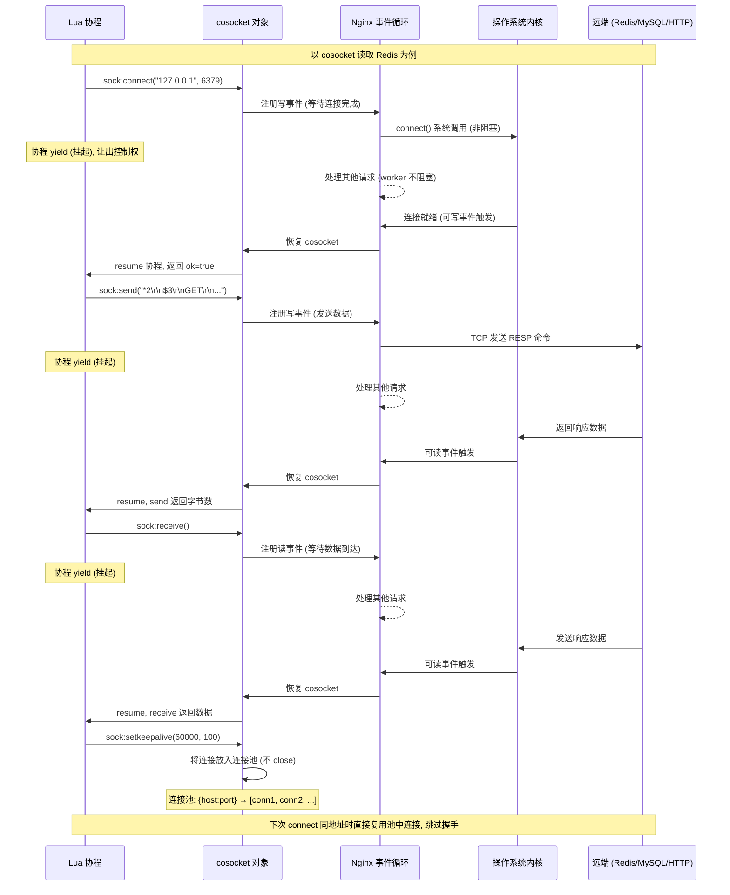
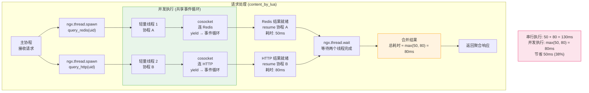

# 24 - OpenResty 核心 API

> **版本基线**：OpenResty 1.29.2.1（基于 Nginx 1.29.2 + LuaJIT 2.1 + lua-nginx-module） | 创建日期：2026-08-05
> **受众**：后端开发熟手，熟悉 Lua 语言。本篇把 OpenResty 提供的核心 API 从原理到实战一次讲透——这些 API 是所有 `lua-resty-*` 库的基石，也是编写高性能 Nginx 业务逻辑的全部武器。

---

## 目录

- [1. 学习目标](#1-学习目标)
- [2. 核心知识点](#2-核心知识点)
  - [2.1 知识点一：ngx.var（Nginx 变量读写）](#21-知识点一ngxvarnginx-变量读写)
  - [2.2 知识点二：ngx.req（请求对象操作）](#22-知识点二ngxreq请求对象操作)
  - [2.3 知识点三：ngx.location.capture（子请求）](#23-知识点三ngxlocationcapture子请求)
  - [2.4 知识点四：ngx.shared.DICT（共享内存字典）](#24-知识点四ngxshareddict共享内存字典)
  - [2.5 知识点五：ngx.timer（定时器/后台任务）](#25-知识点五ngxtimer定时器后台任务)
  - [2.6 知识点六：cosocket（协程套接字，核心中的核心）](#26-知识点六cosocket协程套接字核心中的核心)
  - [2.7 知识点七：ngx.thread（轻量线程/并发编排）](#27-知识点七ngxthread轻量线程并发编排)
  - [2.8 知识点八：输出与响应控制](#28-知识点八输出与响应控制)
  - [2.9 知识点九：正则与编码工具](#29-知识点九正则与编码工具)
  - [2.10 知识点十：时间与工具函数](#210-知识点十时间与工具函数)
  - [2.11 知识点十一：ngx.exit 与错误处理](#211-知识点十一ngxexit-与错误处理)
- [3. Mermaid 图](#3-mermaid-图)
  - [3.1 cosocket 与事件循环交互图](#31-cosocket-与事件循环交互图)
  - [3.2 ngx.thread 并发编排图](#32-ngxthread-并发编排图)
- [4. 最佳实践](#4-最佳实践)
- [5. 常见踩坑引用](#5-常见踩坑引用)
- [6. 小结](#6-小结)

---

## 1. 学习目标

学完本篇，你应当能够：

- 理解 OpenResty 核心 API 的整体分类（变量、请求、子请求、共享内存、定时器、网络、并发、输出、工具），知道每类 API 解决什么问题。
- 掌握 `ngx.var` 读写 Nginx 内置变量的方式，理解其开销并知道何时该换用 `ngx.req` API。
- 掌握 `ngx.req` 系列方法（读 body、取头部、取 URI 参数、改写 URI/method），清楚 `read_body` 的阶段限制。
- 掌握 `ngx.location.capture` / `capture_multi` 发起内部子请求的用法，理解子请求与 cosocket 的内存差异。
- 掌握 `ngx.shared.DICT` 共享内存字典的全部原子操作，能用于限流计数、缓存、配置存储。
- 掌握 `ngx.timer.at` / `ngx.timer.every` 创建后台定时任务，理解 timer 的生命周期与 worker 退出的关系。
- **深入掌握 cosocket**（`ngx.socket.tcp`），理解连接池复用机制，能用裸 cosocket 手写 Redis 通信，并知道哪些阶段禁止使用 cosocket。
- 掌握 `ngx.thread.spawn` / `wait` / `kill` 进行并发 I/O 编排（如同时查 Redis + HTTP）。
- 掌握 `ngx.say` / `ngx.print` / `ngx.flush` / `ngx.eof` / `ngx.exit` / `ngx.redirect` / `ngx.header` 等输出与响应控制 API。
- 掌握 `ngx.re` 正则、`ngx.encode_base64` / `ngx.md5` / `ngx.hmac_sha1` 等编码与摘要工具。
- 掌握 `ngx.now` / `ngx.time` / `ngx.worker.id` 等时间与运行时信息函数。
- 掌握 `ngx.exit` + HTTP 常量 + `pcall` / `error` 的错误处理范式。
- 避开踩坑 `#1.7`（if is evil），理解为何在 OpenResty 中用 Lua 原生 `if` 替代 Nginx 配置级 `if`。

> **前置知识**：建议先完成 [04-配置文件结构与指令体系](../02-配置基础/04-配置文件结构与指令体系.md) 和 [21-动态模块与扩展](../06-高级与优化/21-动态模块与扩展.md)。本篇假设你已经熟悉 Lua 语法（table、闭包、协程、元表）和 Nginx 请求处理阶段（access / content / rewrite 等）。

> **约定**：本篇所有 Lua 代码示例默认运行在 `content_by_lua_block` 或 `access_by_lua_block` 中（除非另行说明）。OpenResty 的 `lua-nginx-module` 将 Nginx 的事件循环与 LuaJIT 的协程绑定，所有带 I/O 的 API 在底层都会 yield 当前协程、交还控制权给 Nginx 事件循环，待数据就绪后恢复——这就是"非阻塞"的本质。

---

## 2. 核心知识点

### 2.1 知识点一：ngx.var（Nginx 变量读写）

#### 什么是 ngx.var

`ngx.var` 是一个特殊的"魔法表"（metatable 驱动），它桥接了 Lua 世界与 Nginx 内部的变量系统。你在 `nginx.conf` 里用 `$uri`、`$host`、`$remote_addr` 等表示的变量，在 Lua 中全部通过 `ngx.var.xxx` 访问。

```lua
-- 读取 Nginx 内置变量（同步非阻塞，因为变量值已在内存中）
local uri         = ngx.var.uri          -- 当前请求的 URI 路径（不含参数），如 "/api/users"
local host        = ngx.var.host         -- 请求的 Host 头值，如 "example.com"
local remote_addr = ngx.var.remote_addr  -- 客户端直连 IP，如 "192.168.1.100"
local args        = ngx.var.args         -- 原始查询字符串，如 "page=1&size=20"
local arg_page    = ngx.var.arg_page     -- 单个查询参数 arg_<name>，如 "1"（不存在则返回 nil）
local scheme      = ngx.var.scheme       -- 协议："http" 或 "https"
local request_uri = ngx.var.request_uri  -- 原始完整 URI（含参数），如 "/api/users?page=1"
```

> **关键点**：`ngx.var.arg_xxx` 是 Nginx 的 `$arg_` 前缀变量族的 Lua 形式。如果 URL 参数名是 `page`，就用 `ngx.var.arg_page`。它只返回第一个同名参数值，多值场景请用 `ngx.req.get_uri_args()`。

#### 写入变量

`ngx.var` 不仅能读，还能写——前提是该变量是**可写的**（通过 `set` 指令声明的用户变量，或部分可写内置变量）。

```lua
-- 先在 nginx.conf 中用 set 声明一个用户变量（否则写入会报错）
-- location /test { set $my_var ""; content_by_lua_block { ... } }

ngx.var.my_var = "hello"  -- 将 $my_var 设为 "hello"，后续 Nginx 配置中 $my_var 即为此值
ngx.var.my_var = nil      -- 设为 nil 等于清空（变量变为空字符串）
```

#### 特例说明：ngx.var 读写有开销

`ngx.var` 的每次读写都经过 metatable 的 `__index` / `__newindex` 元方法，内部会做字符串查找（变量名 → Nginx 变量索引）、内存分配（返回的 Lua 字符串是从 Nginx 内存池新建的字符串副本）等操作。在**高频路径**（如循环里）使用 `ngx.var` 会产生可观的性能开销。

**最佳实践**：在处理开始时把需要的变量一次性读到局部变量中，后续用局部变量操作；高频访问请求信息时直接用 `ngx.req.*` API（它们更轻量、更直接）。

```lua
-- ❌ 不推荐：循环中反复访问 ngx.var
for i = 1, 1000 do
    -- 每次都走 metatable + 字符串查找，1000 次开销叠加
    if ngx.var.arg_token == "secret" then
        -- ...
    end
end

-- ✅ 推荐：一次性读取到局部变量
local token = ngx.var.arg_token  -- 只查一次
for i = 1, 1000 do
    if token == "secret" then    -- 纯 Lua 局部变量比较，零额外开销
        -- ...
    end
end
```

#### 代码示例

```nginx
# nginx.conf
location /var_demo {
    set $my_var "";  # 声明用户变量（必须先 set，Lua 才能写入）
    content_by_lua_block {
        -- ===== 读取 =====
        local uri = ngx.var.uri              -- 如 "/var_demo"
        local host = ngx.var.host            -- 如 "localhost"
        local remote_addr = ngx.var.remote_addr  -- 如 "127.0.0.1"
        local args = ngx.var.args            -- 如 "a=1&b=2"，无参数时为 nil
        local arg_a = ngx.var.arg_a          -- 如 "1"，参数不存在时为 nil

        -- ===== 写入 =====
        ngx.var.my_var = "set_by_lua_" .. remote_addr  -- 写入用户变量

        -- ===== 输出 =====
        ngx.say("uri = ", uri)
        ngx.say("host = ", host)
        ngx.say("remote_addr = ", remote_addr)
        ngx.say("args = ", args)
        ngx.say("arg_a = ", arg_a)
        ngx.say("my_var = ", ngx.var.my_var)  -- 读回刚写入的值
    }
}
```

---

### 2.2 知识点二：ngx.req（请求对象操作）

#### 概述

`ngx.req` 是 OpenResty 提供的**请求对象 API 集合**，比 `ngx.var` 更高效、功能更完整。它覆盖了请求体读取、请求头操作、URI 参数解析、URI 改写、HTTP 方法获取等场景。几乎所有"读请求信息"的高频操作都应该优先用 `ngx.req.*` 而非 `ngx.var.*`。

#### 请求体（Body）操作

Nginx 默认**不读取**请求体（出于性能考虑），需要你显式调用 `ngx.req.read_body()` 后才能获取。

```lua
-- 读取请求体（必须在 content / access / rewrite_by_lua 阶段调用）
ngx.req.read_body()  -- 触发异步读取请求体，非阻塞；读完后内部状态标记为"已读"

-- 方式一：获取请求体数据（在内存中）
local body_data = ngx.req.get_body_data()  -- 返回请求体字符串，如 '{"name":"alice"}'
-- 如果请求体超过 client_body_buffer_size，会被写入临时文件，此时返回 nil

-- 方式二：获取请求体临时文件路径（当 body 过大落盘时）
local body_file = ngx.req.get_body_file()  -- 返回临时文件路径，如 "/tmp/000000001"
-- 没有落盘则返回 nil；需要自己用 io.open 读取（或用 ngx.req.get_body_data 先尝试）

-- 实际开发中的标准写法：先尝试内存，再回退文件
local function get_full_body()
    ngx.req.read_body()                       -- 先读
    local data = ngx.req.get_body_data()      -- 尝试从内存取
    if data then
        return data                            -- 内存中有，直接返回
    end
    local file = ngx.req.get_body_file()      -- 内存没有，看是否落盘
    if file then
        local f = io.open(file, "r")          -- 打开临时文件
        if f then
            local content = f:read("*a")       -- 读取全部内容
            f:close()
            return content
        end
    end
    return ""                                  -- 都没有，返回空串
end
```

> **特例说明**：`ngx.req.read_body()` 必须在 **content / access / rewrite_by_lua** 阶段调用。不能在 `init_by_lua`、`set_by_lua`、`log_by_lua` 等阶段调用——这些阶段没有请求上下文或时机不对，调用会抛出异常。如果需要跳过 body 读取（如大文件上传直接透传），可用 `ngx.req.discard_body()`。

#### 请求头（Headers）操作

```lua
-- 获取所有请求头（返回一个 table，键为小写头名）
local headers = ngx.req.get_headers()  -- 如 { ["content-type"] = "application/json", ["host"] = "example.com", ... }
local ct = headers["content-type"]      -- 取单个头，注意键是小写
local auth = headers["authorization"]   -- 取 Authorization 头

-- get_headers 的可选参数：max_headers（默认 100，限制解析数量，防止头部炸弹攻击）
local h = ngx.req.get_headers(200)      -- 最多解析 200 个头

-- 设置请求头（影响后续 content 阶段和 proxy_pass 转发给后端时的头）
ngx.req.set_header("X-Request-Id", "abc-123")      -- 新增/覆盖请求头
ngx.req.set_header("X-Forwarded-For", "10.0.0.1")  -- 常用于在代理前注入头
-- 清除请求头
ngx.req.clear_header("X-Debug")                    -- 删除指定头
```

> **注意**：`ngx.req.get_headers()` 返回的键**一律小写**（HTTP 头名不区分大小写，OpenResty 统一转为小写）。用大写键名 `headers["Content-Type"]` 会得到 `nil`，必须用 `headers["content-type"]`。

#### URI 参数操作

```lua
-- 解析查询字符串为 table（默认最多解析 100 个参数）
local args_table = ngx.req.get_uri_args()  -- 如 URL ?page=1&size=20&tag=a&tag=b
-- 返回 { page = "1", size = "20", tag = { "a", "b" } }
-- 注意：同名多值参数会变成数组（如 tag 出现两次则 tag = {"a", "b"}）

local page = args_table.page  -- "1"
local tags = args_table.tag   -- {"a", "b"}（多值时是数组）

-- 可选参数：max_args（默认 100，防参数炸弹）
local args = ngx.req.get_uri_args(500)  -- 最多解析 500 个参数

-- 设置 URI 参数（修改查询字符串）
ngx.req.set_uri_args("page=2&size=50")  -- 直接用字符串设置
ngx.req.set_uri_args({ page = 2, size = 50 })  -- 也可以用 table 设置（会自动编码）
```

#### URI 与方法操作

```lua
-- 获取 HTTP 方法（返回大写字符串）
local method = ngx.req.get_method()  -- 如 "GET", "POST", "PUT", "DELETE"

-- 获取请求路径（不含参数）
local path = ngx.req.get_path()  -- 如 "/api/users"（URL /api/users?page=1 → path 为 /api/users）

-- 改写 URI（内部重写，不会触发外部重定向）
ngx.req.set_uri("/new/path")  -- 将当前请求的 URI 改为 /new/path
-- 常配合 set_uri_args 一起做内部路由重写

-- 获取原始请求行（调试用）
local request_line = ngx.req.raw_header()  -- 返回原始 HTTP 请求头文本
```

#### 代码示例：一个完整的请求解析 handler

```lua
-- content_by_lua_block 中完整解析请求
local method = ngx.req.get_method()         -- "POST"
ngx.req.read_body()                          -- 先读 body（必须！）
local body = ngx.req.get_body_data()         -- 取 body 内容
local headers = ngx.req.get_headers()        -- 取所有头
local uri_args = ngx.req.get_uri_args()      -- 解析查询参数

-- 根据方法和内容类型做不同处理
if method == "POST" and headers["content-type"] == "application/json" then
    -- 假设 body 是 JSON，用 lua-cjson 解析
    local cjson = require "cjson"
    local ok, data = pcall(cjson.decode, body)  -- pcall 防止 JSON 格式错误导致异常
    if not ok then
        ngx.exit(ngx.HTTP_BAD_REQUEST)          -- JSON 解析失败，返回 400
    end
    ngx.say("received JSON, name = ", data.name)
else
    -- 非 JSON POST，直接输出
    ngx.say("method = ", method)
    ngx.say("body = ", body)
end

-- 输出查询参数
for k, v in pairs(uri_args) do
    ngx.say("param ", k, " = ", v)
end
```

#### 特例说明汇总

| 限制 | 说明 |
|------|------|
| `read_body` 阶段 | 只能在 rewrite / access / content 阶段调用 |
| `get_headers` 键名 | 返回的 table 键名一律**小写** |
| `get_uri_args` 多值 | 同名参数出现多次时，值为**数组**（table），单次时为字符串——遍历时要注意判断类型 |
| body 落盘 | 请求体超过 `client_body_buffer_size`（默认 8k/16k）会写临时文件，`get_body_data()` 返回 `nil`，需用 `get_body_file()` |

---

### 2.3 知识点三：ngx.location.capture（子请求）

#### 什么是子请求

`ngx.location.capture` 用于在当前请求处理过程中，向 Nginx **内部**发起一个子请求（subrequest）。子请求不是真正的网络请求，而是 Nginx 内部的虚拟请求——它会走一遍 location 匹配、rewrite、access、content 等阶段，就像一个真实的 HTTP 请求一样，但完全不经过网络层。

**核心特征**：
- **非阻塞**：子请求在等待后端响应时会 yield 当前协程，交还事件循环，不阻塞 worker。
- **内部发起**：不产生对外网络流量（除非子请求的 location 里配了 `proxy_pass`）。
- **同步等待结果**：`capture` 会阻塞当前 Lua 协程直到子请求完成，返回结果 table。

#### 基本用法

```lua
-- 发起一个 GET 子请求，访问 /internal_api
local res = ngx.location.capture("/internal_api")
-- res 是一个 table，包含以下字段：
-- res.status    : 子请求的 HTTP 状态码，如 200
-- res.header    : 子请求的响应头 table（键名小写）
-- res.body      : 子请求的响应体字符串
-- res.truncated : 布尔值，响应体是否因超过限制被截断

if res.status == 200 then
    ngx.say("subrequest body: ", res.body)
else
    ngx.say("subrequest failed with status: ", res.status)
end
```

#### options 详解

```lua
local res = ngx.location.capture("/internal_api", {
    -- method：HTTP 方法（使用 ngx.HTTP_* 常量）
    method = ngx.HTTP_POST,                    -- 指定为 POST 请求

    -- args：查询参数
    args = "page=1&size=20",                   -- 字符串形式
    -- args = { page = 1, size = 20 },         -- 或 table 形式（自动编码）

    -- body：请求体（用于 POST/PUT）
    body = '{"name":"alice"}',                 -- 发送给子请求的 body

    -- ctx：传递给子请求的自定义上下文（table）
    ctx = { request_id = "abc-123" },          -- 子请求中可通过 ngx.ctx 读取

    -- vars：传递 Nginx 变量给子请求
    vars = { custom_var = "value" },           -- 子请求中 $custom_var 为 "value"

    -- copy_all_vars：是否拷贝所有当前请求的变量到子请求
    copy_all_vars = true,                      -- 子请求获得当前请求所有变量的副本

    -- share_all_vars：是否共享所有变量（子请求修改变量会影响父请求）
    share_all_vars = false,                    -- 默认 false，建议保持（共享有副作用风险）
})
```

| 选项 | 类型 | 说明 |
|------|------|------|
| `method` | 常量 | `ngx.HTTP_GET`(默认) / `ngx.HTTP_POST` / `ngx.HTTP_PUT` / `ngx.HTTP_DELETE` 等 |
| `args` | string/table | 子请求的查询参数 |
| `body` | string | 子请求的请求体 |
| `ctx` | table | 传递给子请求的 Lua 上下文（子请求的 `ngx.ctx` 会继承） |
| `vars` | table | 传递 Nginx 变量给子请求 |
| `copy_all_vars` | boolean | 拷贝（非共享）当前请求所有 Nginx 变量到子请求 |
| `share_all_vars` | boolean | 共享所有 Nginx 变量（子请求修改会反映到父请求，慎用） |

#### ngx.location.capture_multi（并发多子请求）

当需要同时发起多个子请求时，用 `capture_multi` 可以**并发**执行，而不是串行——总耗时约等于最慢的那个子请求，而非所有子请求之和。

```lua
-- 并发发起 3 个子请求
local res1, res2, res3 = ngx.location.capture_multi{
    { "/api/user_info",  { args = "uid=100" } },   -- 第一个子请求
    { "/api/user_orders", { args = "uid=100" } },  -- 第二个子请求
    { "/api/user_points", { args = "uid=100" } },  -- 第三个子请求
}
-- 三个子请求并发执行，res1/res2/res3 分别是各自的返回 table

if res1.status == 200 and res2.status == 200 and res3.status == 200 then
    -- 三个都成功，组装聚合响应
    local cjson = require "cjson"
    local result = {
        info   = cjson.decode(res1.body),
        orders = cjson.decode(res2.body),
        points = cjson.decode(res3.body),
    }
    ngx.say(cjson.encode(result))
else
    ngx.exit(ngx.HTTP_INTERNAL_SERVER_ERROR)  -- 502
end
```

> **性能对比**：假设每个子请求耗时 100ms。用串行 `capture` 三次 = 300ms；用 `capture_multi` 并发 = 100ms。

#### 代码示例：聚合多后端数据

```nginx
# nginx.conf —— 定义内部 location（仅供子请求调用，不对外暴露）
location /internal/user {
    internal;                        # internal 指令：禁止外部直接访问
    proxy_pass http://user_service;  # 转发到用户服务
}

location /internal/order {
    internal;
    proxy_pass http://order_service;
}

# 对外的聚合接口
location /api/user_dashboard {
    content_by_lua_block {
        -- 并发获取用户信息和订单信息
        local res1, res2 = ngx.location.capture_multi{
            { "/internal/user",  { args = "uid=" .. ngx.var.arg_uid } },
            { "/internal/order", { args = "uid=" .. ngx.var.arg_uid } },
        }

        -- 检查两个子请求是否都成功
        if res1.status ~= 200 or res2.status ~= 200 then
            ngx.status = ngx.HTTP_BAD_GATEWAY     -- 设置响应状态码 502
            ngx.say("upstream error")             -- 输出错误信息
            ngx.exit(ngx.HTTP_BAD_GATEWAY)        -- 退出
        end

        -- 合并结果返回给客户端
        local cjson = require "cjson"
        local dashboard = {
            user   = cjson.decode(res1.body),     -- 解析用户信息 JSON
            orders = cjson.decode(res2.body),     -- 解析订单信息 JSON
        }
        ngx.header.content_type = "application/json"  -- 设置响应头
        ngx.say(cjson.encode(dashboard))              -- 输出聚合 JSON
    }
}
```

#### 特例说明

1. **子请求会复制响应体到内存**：`capture` 返回的 `res.body` 是完整的响应体字符串，存储在 Lua 堆内存中。如果子请求返回的数据量很大（如几十 MB 的文件），会导致内存暴涨。大数据场景应直接用 cosocket 或 `proxy_pass` 流式传输，而非 `capture`。

2. **子请求有独立的 ngx.ctx**：每个子请求拥有自己独立的 `ngx.ctx`，父请求的 `ngx.ctx` 不会自动传递给子请求（除非通过 `options.ctx` 显式传递）。子请求中修改 `ngx.ctx` 不会影响父请求。

3. **子请求默认不继承父请求的请求头**：子请求是独立的虚拟请求，如需传递请求头需通过 `ctx` 或 `vars` 间接传递。

4. **并发数量限制**：`capture_multi` 的并发子请求数受 `lua_package_cpath` 无关，但实践中不宜过多（数十个以内），过多会占用大量协程和内存。

5. **不能递归子请求自身**：子请求的 location 中如果再 `capture` 回自身路径，会造成无限递归。

---

### 2.4 知识点四：ngx.shared.DICT（共享内存字典）

#### 什么是共享内存字典

`ngx.shared.DICT` 是 OpenResty 提供的**跨 worker 共享内存**机制。Nginx 是多 worker 进程架构，每个 worker 有独立的内存空间，普通的 Lua 全局变量只在单个 worker 内可见。`shared.dict` 通过 Nginx 的共享内存zone（shm zone）实现 worker 间的数据共享，且所有操作都是**原子**的（内部用自旋锁保护），无需自己加锁。

#### 声明共享内存

在 `nginx.conf` 的 `http` 块中用 `lua_shared_dict` 声明：

```nginx
http {
    # 声明一个名为 my_cache 的共享字典，分配 10MB 内存
    lua_shared_dict my_cache 10m;

    # 可以声明多个不同用途的共享字典
    lua_shared_dict limit_counter 5m;   # 限流计数器
    lua_shared_dict config_store 2m;    # 配置存储
}
```

> **内存大小**：`lua_shared_dict` 的大小一旦声明就固定，不能动态扩容。超容量时 `set` 不会报错但会根据 LRU 策略淘汰旧数据（`set`/`replace` 会强制写入，`add` 会失败）。大小必须是 Nginx 支持的内存对齐单位（k/m/g）。

#### 使用共享字典

```lua
-- 获取共享字典对象（字典名对应 nginx.conf 中 lua_shared_dict 的名字）
local dict = ngx.shared.my_cache
```

#### 核心 API

```lua
local dict = ngx.shared.my_cache

-- ===== 基本读写 =====
dict:set("key1", "value1")              -- 设置键值（覆盖已有值）
dict:set("key2", "value2", 60)          -- 设置键值，60 秒后过期（TTL 单位：秒）
dict:set("key3", "value3", 0.5)         -- 0.5 秒过期（支持小数，毫秒级精度）

local val = dict:get("key1")            -- 读取值，返回 "value1"；不存在返回 nil
-- 注意：get 返回的是值（string 或 number），不返回标记位

local val, flags = dict:get_stale("key1")  -- 读取值（可能返回已过期但未淘汰的数据）
-- get_stale 返回两个值：val 和 flags（flags 见下文 set 的第四参数）

-- ===== add / replace（条件写入）=====
dict:add("key4", "value4")              -- 仅当 key 不存在时写入；已存在则返回 false, "exists"
dict:add("key4", "value4", 30)          -- add + TTL
local ok, err = dict:add("key4", "x")   -- ok=false, err="exists"（key4 已存在）

dict:replace("key4", "new_value")       -- 仅当 key 已存在时覆盖；不存在返回 false, "not found"
local ok, err = dict:replace("key5", "x")  -- ok=false, err="not found"（key5 不存在）

-- ===== incr（原子递增/递减）=====
local new_val, err = dict:incr("counter", 1)    -- 原子递增 1，返回递增后的值
-- 如果 key 不存在，返回 nil, err="not found"
-- 可先初始化再 incr：
dict:add("counter", 0)                          -- 初始化为 0（add 保证只初始化一次）
local new_val = dict:incr("counter", 1)         -- 原子 +1，返回 1
local new_val = dict:incr("counter", 5)         -- 原子 +5，返回 6
local new_val = dict:incr("counter", -2)        -- 原子 -2，返回 4（传负数即递减）
-- incr 也可指定初始化值（key 不存在时自动初始化）：
local val, err = dict:incr("counter", 1, 0)     -- key 不存在时初始化为 0 再 +1

-- ===== delete =====
dict:delete("key1")                     -- 删除键值

-- ===== flags（附加标记位）=====
-- set/get 的 flags 参数：一个整数（0-2^32），可用来存储元信息（如值类型标记）
dict:set("key", "value", 0, 100)        -- 第 4 参数 flags=100
local val, flags = dict:get_stale("key")  -- flags=100
-- 注意：get 不返回 flags，get_stale 才返回 flags

-- ===== 列表操作（队列）=====
dict:lpush("queue", "item1")            -- 左端入队（头部插入）
dict:lpush("queue", "item2")            -- 队列现为 ["item2", "item1"]
local item, err = dict:rpop("queue")    -- 右端出队（尾部弹出），返回 "item1"
-- 可实现 FIFO 队列：lpush 入队 + rpop 出队
-- 也可实现栈：lpush 入栈 + lpop 出栈
local len = dict:llen("queue")          -- 返回队列长度

-- ===== 遍历 / 清理 =====
local keys = dict:get_keys(100)         -- 获取最多 100 个键，返回 table
-- 不传参数或传 0 表示获取全部键（数据量大时有性能风险）
for _, key in ipairs(keys) do
    local val = dict:get(key)
    ngx.say(key, " = ", val)
end

dict:flush_all()                        -- 清空所有键值（标记为过期，不立即释放内存）
dict:flush_expired()                    -- 真正清除已过期的键值，释放内存
-- 实际清理：先 flush_all 再 flush_expired，或定期调 flush_expired 回收过期内存

-- ===== 容量信息 =====
local capacity = dict:capacity()        -- 返回共享字典总容量（字节）
local free_space = dict:free_space()    -- 返回剩余可用空间（字节）
```

#### 代码示例：用共享字典实现请求限流计数

```nginx
http {
    lua_shared_dict rate_limit 10m;     # 声明限流计数共享字典

    server {
        location /api/ {
            access_by_lua_block {
                local limit_dict = ngx.shared.rate_limit       -- 获取共享字典
                local client_ip = ngx.var.remote_addr          -- 客户端 IP
                local key = "rate:" .. client_ip               -- 限流 key：rate:<IP>
                local window = 1                               -- 时间窗口 1 秒
                local threshold = 100                          -- 阈值 100 次/秒

                -- 原子递增计数，key 不存在时初始化为 0 再 +1
                local count, err = limit_dict:incr(key, 1, 0)
                if count == 1 then
                    -- 第一次访问，设置 key 过期时间 = 时间窗口
                    limit_dict:expire(key, window)             -- 设置 1 秒后过期
                end

                if count > threshold then
                    -- 超过阈值，返回 429 Too Many Requests
                    ngx.exit(429)
                end
            }
            proxy_pass http://backend;
        }
    }
}
```

#### 适用场景

| 场景 | 用法 | 优势 |
|------|------|------|
| **限流计数** | `incr` 原子递增 + TTL 过期 | 跨 worker 统一计数，无需 Redis |
| **缓存** | `set`/`get` + TTL | 热数据缓存，减少后端压力 |
| **配置存储** | `set` 存配置 + `get` 读配置 | 配置热更新，所有 worker 立即可见 |
| **全局状态** | `incr` 统计总请求数等 | 所有 worker 共享的运行时指标 |
| **分布式锁** | `add` 实现简易锁（add 语义 = setnx） | 轻量级互斥，无需引入额外依赖 |

> **特例说明**：`ngx.shared.DICT` 的操作虽然是原子的，但**不是事务**。多个操作之间没有原子性保证。例如先 `get` 再 `set` 的"读-改-写"序列中间可能被其他 worker 插入。需要严格原子操作时用 `incr`、`add`、`replace` 等单步原子 API。

---

### 2.5 知识点五：ngx.timer（定时器/后台任务）

#### 什么是 ngx.timer

`ngx.timer` 允许你在请求处理之外创建**后台定时任务**。它不绑定于任何具体请求，而是运行在 worker 进程的上下文中。这是 OpenResty 实现"周期性任务"（如健康检查、配置热更、数据清理）的核心机制。

#### ngx.timer.at（延迟执行）

```lua
-- 延迟 5 秒后执行一次回调
local handler
handler = function(premature)
    -- premature：布尔值，表示 Nginx 是否正在关闭（worker 退出中）
    -- 当 premature=true 时，应尽快结束，不要再发起新的 I/O
    if premature then
        ngx.log(ngx.WARN, "worker is shutting down, skip timer task")
        return
    end

    -- 在 timer 回调中可以使用 cosocket（这是 init 阶段做不到的！）
    local http = require "resty.http"
    local httpc = http.new()
    local res, err = httpc:request_uri("http://backend/health", {
        method = "GET",
    })

    if res and res.status == 200 then
        ngx.log(ngx.INFO, "health check passed")
    else
        ngx.log(ngx.ERR, "health check failed: ", err)
    end
end

local ok, err = ngx.timer.at(5, handler)  -- 5 秒后执行 handler
-- 返回值：成功返回 timer 对象（true），失败返回 nil + err
if not ok then
    ngx.log(ngx.ERR, "failed to create timer: ", err)
end
```

#### ngx.timer.every（周期执行）

```lua
-- 每 10 秒执行一次（周期性定时器）
local periodic_handler
periodic_handler = function(premature)
    if premature then
        return  -- worker 退出，停止周期任务
    end

    -- 定期清理共享字典中的过期键
    local dict = ngx.shared.my_cache
    local freed = dict:flush_expired()             -- 清理过期数据
    ngx.log(ngx.INFO, "flushed expired keys, freed count: ", freed)

    -- 注意：every 模式下不需要手动再次注册，框架会自动按周期调用
end

local ok, err = ngx.timer.every(10, periodic_handler)  -- 每 10 秒执行一次
if not ok then
    ngx.log(ngx.ERR, "failed to create periodic timer: ", err)
end
```

> **区别**：`ngx.timer.at` 是一次性定时器（延迟 N 秒执行一次就结束）；`ngx.timer.every` 是周期性定时器（每隔 N 秒重复执行）。如果用 `at` 实现周期任务，需要在回调末尾再次调用 `ngx.timer.at` 重新注册自己（递归注册）。

#### timer 的运行计数

```lua
-- 获取当前正在运行的 timer 数量
local running = ngx.timer.running_count()   -- 正在执行中的 timer 数
-- 获取当前等待中的 timer 数量
local pending = ngx.timer.pending_count()   -- 已注册但还没到时间执行的 timer 数

ngx.log(ngx.INFO, "running timers: ", running, ", pending timers: ", pending)
```

#### 代码示例：配置热更新

```nginx
http {
    lua_shared_dict config_store 2m;     # 配置存储共享字典

    init_worker_by_lua_block {
        -- 在 worker 启动时注册周期定时器，每 30 秒拉取最新配置
        local function refresh_config(premature)
            if premature then return end                -- worker 退出，终止

            local sock = ngx.socket.tcp()               -- 在 timer 中使用 cosocket
            sock:settimeout(3000)                        -- 3 秒超时
            local ok, err = sock:connect("127.0.0.1", 8080)
            if not ok then
                ngx.log(ngx.ERR, "connect config server failed: ", err)
                return                                   -- 本轮失败，下一周期重试
            end

            -- 发送 HTTP 请求获取最新配置
            local req = "GET /config/latest HTTP/1.0\r\nHost: localhost\r\n\r\n"
            sock:send(req)
            local data = sock:receive("*a")              -- 读取全部响应
            sock:setkeepalive(60000, 100)                -- 放回连接池

            -- 解析并写入共享字典（所有 worker 立即可见）
            local cjson = require "cjson"
            local body = data:match("\r\n\r\n(.*)")      -- 粗略提取 body
            local config = cjson.decode(body)
            local dict = ngx.shared.config_store
            for k, v in pairs(config) do
                dict:set("cfg:" .. k, cjson.encode(v))   -- 逐项写入配置
            end
            ngx.log(ngx.INFO, "config refreshed")
        end

        -- 立即执行一次（不等 30 秒）
        ngx.timer.at(0, refresh_config)
        -- 然后每 30 秒周期执行
        ngx.timer.every(30, refresh_config)
    }
}
```

#### 适用场景

| 场景 | 定时器类型 | 说明 |
|------|-----------|------|
| **健康检查** | `every` | 定期探测后端存活状态，更新 upstream |
| **配置热更** | `every` | 定期拉取最新配置写入 shared.dict |
| **数据清理** | `every` | 定期清理过期缓存、日志归档 |
| **延迟任务** | `at` | 请求处理完后延迟执行的重计算/通知 |
| **熔断恢复** | `at` | 熔断后延迟 N 秒尝试半开探测 |

#### 特例说明

1. **timer 在 worker 中运行**：每个 worker 独立运行自己的 timer。如果你用 `ngx.timer.every(10, ...)` 注册了一个周期任务，有 4 个 worker 就会有 4 个实例同时运行。如需全局唯一（只在一个 worker 执行），需要配合 `ngx.worker.id()` 做选主：

```lua
-- 只在 0 号 worker 中执行（单 worker 选主）
if ngx.worker.id() == 0 then
    ngx.timer.every(30, health_check_handler)
end
```

2. **worker 退出时 timer 会被取消**：当 Nginx 执行 reload 或 stop 时，worker 进入优雅退出流程，所有 pending 的 timer 会被取消，正在运行的 timer 回调会收到 `premature=true` 参数。回调中必须检查此参数并及时退出，避免在退出过程中发起不可完成的 I/O。

3. **timer 回调中可以使用 cosocket**：这是 `init_by_lua` 阶段做不到的——`init_by_lua` 在 Nginx 启动早期运行，此时事件循环尚未就绪，不能用 cosocket。而 `timer` 在 worker 启动后运行，事件循环已就绪，可以自由使用 cosocket。

4. **timer 数量限制**：`lua_max_pending_timers`（默认 1024）限制 pending timer 数量；`lua_max_running_timers`（默认 256）限制同时运行的 timer 数量。超限会被拒绝创建并报错。

---

### 2.6 知识点六：cosocket（协程套接字，核心中的核心）

#### 为什么说 cosocket 是"核心中的核心"

OpenResty 生态中所有网络相关的 `lua-resty-*` 库——`lua-resty-redis`、`lua-resty-mysql`、`lua-resty-http`、`lua-resty-memcached`——全部构建在 cosocket 之上。cosocket 是这些库的底层基石。理解了 cosocket，你就理解了 OpenResty 网络编程的本质。

**cosocket = Coroutine + Socket**。它把 Nginx 的事件驱动 I/O 与 LuaJIT 的协程完美结合：
- 每个 cosocket 操作（connect / send / receive）在等待 I/O 时会 yield 当前协程。
- yield 后控制权交还给 Nginx 事件循环，worker 可以处理其他请求。
- I/O 就绪后，事件循环恢复被挂起的协程，继续执行。

这就是 cosocket **100% 非阻塞**的秘密——它不是真"阻塞等待"，而是协程挂起 + 事件通知恢复。

#### cosocket API 全览

```lua
-- 创建 TCP cosocket
local sock = ngx.socket.tcp()

-- 创建 UDP cosocket
local udp_sock = ngx.socket.udp()
```

TCP cosocket 的完整方法链：

| 方法 | 说明 |
|------|------|
| `sock:settimeout(ms)` | 设置超时（毫秒），影响后续 connect/send/receive |
| `sock:connect(host, port)` | 连接远端，返回 ok, err |
| `sock:send(data)` | 发送数据，返回 bytes_sent, err |
| `sock:receive()` | 接收一行（以 \n 结尾），返回 line, err |
| `sock:receive(size)` | 接收指定字节数，返回 data, err |
| `sock:receive("*a")` | 接收全部数据（直到连接关闭），返回 data, err |
| `sock:receiveuntil(pattern)` | 返回迭代器，读取直到遇到 pattern |
| `sock:setkeepalive(max_idle, pool_size)` | 将连接放回连接池（关键！） |
| `sock:getreusedtimes()` | 获取此连接被复用的次数（0 表示新连接） |
| `sock:close()` | 关闭连接（不放回池） |
| `sock:setoption(option, value)` | 设置 socket 选项（如 reuseaddr） |

#### 连接池复用（setkeepalive 是关键）

cosocket 的连接池是 OpenResty 高性能的核心机制之一。每个 `{host, port, pool}` 组合维护一个连接池，`setkeepalive` 将用完的连接放回池中，下次 `connect` 同一地址时直接复用池中连接，省去 TCP 三次握手开销。

```lua
-- setkeepalive 参数
sock:setkeepalive(60000, 100)
-- 第 1 参数 max_idle_timeout：连接在池中最长空闲时间（毫秒），超时自动关闭。60000 = 60 秒
-- 第 2 参数 pool_size：连接池最大容量。100 = 最多缓存 100 个空闲连接
-- 两个参数都可以省略，使用 lua_socket_keepalive_timeout 和 lua_socket_pool_size 默认值
```

#### 代码示例：用 cosocket 连接 Redis

```lua
-- ===== 用裸 cosocket 与 Redis 通信（展示底层原理）=====
local sock = ngx.socket.tcp()            -- 创建 TCP cosocket 对象
sock:settimeout(1000)                    -- 设置超时 1 秒（1000 毫秒）
                                         -- 影响 connect / send / receive

local ok, err = sock:connect("127.0.0.1", 6379)  -- 连接 Redis，返回 true 或 nil+err
if not ok then
    ngx.log(ngx.ERR, "failed to connect redis: ", err)
    ngx.exit(ngx.HTTP_INTERNAL_SERVER_ERROR)     -- 连接失败，返回 500
end

-- 检查连接是否来自连接池（复用）
local reuse_count = sock:getreusedtimes()        -- 返回此连接已被复用的次数
ngx.log(ngx.INFO, "redis connection reused times: ", reuse_count)
-- 0 = 新建连接，>0 = 从池中复用

-- 发送 Redis RESP 协议命令（GET mykey）
-- Redis 协议格式：*1\r\n$3\r\nGET\r\n$5\r\nmykey\r\n
local bytes, err = sock:send("*2\r\n$3\r\nGET\r\n$5\r\nmykey\r\n")
-- 返回成功发送的字节数
if not bytes then
    ngx.log(ngx.ERR, "failed to send: ", err)
    sock:close()                                  -- 出错时关闭连接（不放回池）
    ngx.exit(ngx.HTTP_INTERNAL_SERVER_ERROR)
end

-- 接收 Redis 响应（一行）
local line, err = sock:receive()                   -- 接收一行（以 \n 结尾）
-- Redis 对 GET 的响应：
--   找到值：$<长度>\r\n<值>\r\n，如 "$5\r\nhello\r\n"
--   未找到：$-1\r\n（nil）
if not line then
    ngx.log(ngx.ERR, "failed to receive: ", err)
    sock:close()
    ngx.exit(ngx.HTTP_INTERNAL_SERVER_ERROR)
end

-- 如果第一行是 $-1 表示 key 不存在
if line == "$-1" then
    ngx.say("key mykey not found")
else
    -- 否则 line 形如 "$5"，表示后续有 5 字节数据
    local len = tonumber(string.sub(line, 2))      -- 解析长度（去掉 $ 前缀）
    local data = sock:receive(len)                  -- 读取指定长度数据
    sock:receive(2)                                 -- 读取尾部 \r\n（2 字节）
    ngx.say("mykey = ", data)
end

-- ★ 关键：用完连接放回连接池（而不是 close）
local ok, err = sock:setkeepalive(60000, 100)      -- 放回池，空闲 60 秒后自动关闭
                                                   -- 池最大容量 100
if not ok then
    ngx.log(ngx.WARN, "failed to set keepalive: ", err)
    sock:close()                                    -- 放回池失败则关闭
end
-- 下次再 connect("127.0.0.1", 6379) 时，直接从池中取出此连接，省去握手
```

> **说明**：实际开发中不会手写 Redis RESP 协议，而是用 `lua-resty-redis` 库（它封装了上述全部逻辑）。但理解这个裸 cosocket 示例，你就理解了 `lua-resty-redis` 内部在做什么。

#### receiveuntil 用法

```lua
-- 读取直到遇到指定的分隔符
local reader = sock:receiveuntil("\r\n")  -- 返回一个迭代器函数
-- 每次调用 reader() 读取一段数据直到 \r\n

local line, err, partial = reader()       -- 读取第一段（到 \r\n 之前）
-- 也可指定每次最多读多少字节：
local chunk = reader(1024)                 -- 每次最多读 1024 字节
```

#### 这是所有 lua-resty-* 库的底层基石

```
lua-resty-redis    ─┐
lua-resty-mysql    ─┤    全部基于
lua-resty-http     ─┼──► ngx.socket.tcp() (cosocket)
lua-resty-memcached─┤
lua-resty-dns      ─┘
```

掌握 cosocket 后，阅读任何 `lua-resty-*` 库的源码都会变得轻松——它们本质上都是 cosocket + 协议解析的组合。

#### 特例说明

1. **不能在 init_by_lua / set_by_lua / log_by_lua 使用 cosocket**：

| 阶段 | 能否用 cosocket | 原因 |
|------|:---:|------|
| `init_by_lua` | ❌ | Nginx 启动早期，事件循环未就绪 |
| `init_worker_by_lua` | ✅ | worker 已启动，事件循环就绪 |
| `set_by_lua` | ❌ | 执行频率极高且不可 yield |
| `rewrite_by_lua` | ✅ | |
| `access_by_lua` | ✅ | |
| `content_by_lua` | ✅ | |
| `header_filter_by_lua` | ❌ | 不能 yield（过滤器阶段同步执行） |
| `body_filter_by_lua` | ❌ | 不能 yield |
| `log_by_lua` | ❌ | 请求已结束，不能发起新 I/O |
| `ngx.timer.*` | ✅ | timer 回调中可以自由使用 cosocket |

在禁止阶段调用 cosocket 会抛出异常：`API disabled in the current context`。

2. **连接池是 per-worker 的**：每个 worker 有自己独立的 cosocket 连接池，worker 间不共享。如果 4 个 worker 各保持 100 个 Redis 连接，总计 400 个连接——要考虑后端的连接数承受能力。

3. **connect 时可以指定连接池名**：

```lua
-- 默认按 host:port 自动分组池
sock:connect("127.0.0.1", 6379)

-- 也可以手动指定 pool 名（如区分不同业务共用同一 Redis）
sock:connect("127.0.0.1", 6379, { pool = "my_redis_pool" })
-- 同 pool 名的连接复用同一个连接池
```

4. **超时三段制**：可以分别设置 connect / send / read 超时：

```lua
sock:settimeout(1000)         -- 统一设 1 秒（影响所有阶段）
-- 或分别设置：
sock:settimeouts(1000, 2000, 5000)  -- connect=1s, send=2s, read=5s
```

---

### 2.7 知识点七：ngx.thread（轻量线程/并发编排）

#### 什么是 ngx.thread

`ngx.thread` 是 OpenResty 的**轻量级线程**（light thread）机制。注意它不是操作系统线程，而是基于 Lua 协程的"协作式并发单元"。每个轻量线程运行在自己的协程中，但共享同一个 Nginx worker 的事件循环。

`ngx.thread` 的核心价值在于**并发编排**：当你需要同时发起多路 I/O（如同时查 Redis + 查 HTTP 接口），用 `ngx.thread.spawn` 创建多个轻量线程并行执行，用 `ngx.thread.wait` 等待它们完成，总耗时约等于最慢的那一路，而非各路之和。

#### 三个核心 API

```lua
-- spawn：创建并启动一个轻量线程
local thread = ngx.thread.spawn(func, arg1, arg2, ...)
-- func：线程入口函数；arg1, arg2...：传给 func 的参数
-- 返回一个 thread 对象（不是操作系统线程，是 Lua 协程的封装）

-- wait：等待一个或多个轻量线程完成
local ok, res1, res2, ... = ngx.thread.wait(thread1, thread2, ...)
-- 返回第一个完成的线程的结果
-- ok=true 表示线程正常返回，ok=false 表示线程抛出了错误

-- kill：杀死一个正在运行的轻量线程
local ok, err = ngx.thread.kill(thread)
-- 终止指定线程；已完成的线程不能 kill
```

#### 代码示例：并发查 Redis + HTTP

```lua
-- 场景：同时从 Redis 获取用户缓存、从 HTTP 接口获取用户画像，合并返回

-- 定义两个任务函数
local function query_redis(uid)
    -- 查询 Redis（用 lua-resty-redis 封装，底层是 cosocket）
    local redis = require "resty.redis"
    local red = redis:new()
    red:set_timeout(1000)                           -- 1 秒超时
    local ok, err = red:connect("127.0.0.1", 6379)
    if not ok then
        return nil, err                              -- 连接失败返回错误
    end
    local data, err = red:get("user:" .. uid)       -- 查询用户缓存
    red:set_keepalive(60000, 100)                    -- 放回连接池
    return data, err                                 -- 返回结果
end

local function query_http(uid)
    -- 查询 HTTP 接口（用 lua-resty-http 封装，底层也是 cosocket）
    local http = require "resty.http"
    local httpc = http.new()
    local res, err = httpc:request_uri("http://profile-service/users/" .. uid, {
        method = "GET",
    })
    if not res then
        return nil, err
    end
    return res.body, err                             -- 返回响应体
end

-- ===== 并发执行两个查询 =====
local uid = ngx.var.arg_uid                          -- 从请求参数取 uid

-- spawn 两个轻量线程（立即开始执行，不阻塞当前协程）
local t_redis = ngx.thread.spawn(query_redis, uid)   -- 线程 1：查 Redis
local t_http  = ngx.thread.spawn(query_http, uid)    -- 线程 2：查 HTTP

-- wait 等待两个线程都完成
local ok1, redis_data, redis_err = ngx.thread.wait(t_redis)  -- 等 Redis 线程
local ok2, http_data,  http_err  = ngx.thread.wait(t_http)   -- 等 HTTP 线程

-- 两个查询并发执行，总耗时 ≈ max(redis耗时, http耗时)
-- 如果串行执行，总耗时 = redis耗时 + http耗时

-- 处理结果
local cjson = require "cjson"
local result = {}
result.redis = redis_data or cjson.null              -- Redis 结果
result.profile = http_data or cjson.null             -- HTTP 结果

ngx.header.content_type = "application/json"
ngx.say(cjson.encode(result))
```

#### "取最快"模式（竞速）

`ngx.thread.wait` 可以同时等待多个线程，**谁先完成就返回谁的结果**。利用这个特性可以实现"竞速"模式——同时向多个后端发请求，用最快返回的那个结果：

```lua
-- 向两个后端同时发请求，用先返回的结果
local t1 = ngx.thread.spawn(function()
    -- 查后端 A
    return fetch_from_backend_a()
end)

local t2 = ngx.thread.spawn(function()
    -- 查后端 B
    return fetch_from_backend_b()
end)

-- wait 同时等待两个，返回先完成的那个
local ok, res = ngx.thread.wait(t1, t2)

-- 杀掉还没完成的另一个线程（不需要它的结果了）
ngx.thread.kill(t1)  -- 如果 t1 没完成就杀掉（已完成的 kill 会返回错误，可忽略）
ngx.thread.kill(t2)

ngx.say(res)  -- 用先返回的结果
```

#### 特例说明

1. **轻量线程不是真线程**：它们运行在同一个 OS 线程（worker）中，靠协程协作调度。一个线程在 I/O 等待时让出 CPU，另一个线程才能运行。不存在抢占式调度，也不会有真线程的数据竞争问题。

2. **必须 wait 或 kill 所有 spawn 的线程**：如果你 spawn 了一个线程但既不 wait 也不 kill，在当前请求结束时 OpenResty 会自动清理未完成的线程（强制 kill），但这可能导致资源泄漏（如连接未放回池）。最佳实践是确保每个 spawn 的线程都有明确的 wait 或 kill。

3. **wait 返回的是第一个完成的线程**：`ngx.thread.wait(t1, t2, t3)` 会阻塞直到**任一**线程完成，返回该线程的结果。要等**所有**线程完成，需要对每个线程分别 wait（如示例中先 wait t1 再 wait t2）。

4. **轻量线程间共享数据**：多个轻量线程可以通过闭包变量或 upvalue 共享数据，但因为是非抢占式协程，不存在并发读写冲突（同一时刻只有一个线程在运行）。但要注意：如果两个线程操作同一个 cosocket 或 shared.dict，逻辑上可能交错（一个线程 yield 后另一个线程运行）。

---

### 2.8 知识点八：输出与响应控制

#### 输出响应体

```lua
-- ngx.say：输出内容并追加一个换行符 \n
ngx.say("hello", " world")  -- 输出 "hello world\n"
ngx.say("line 2")           -- 输出 "line 2\n"
-- say 可以接受多个参数，自动拼接（类似 print）

-- ngx.print：输出内容，不追加换行符
ngx.print("hello")          -- 输出 "hello"（无换行）
ngx.print(" world")         -- 输出 " world"（追加到上一行）
ngx.print("\n")             -- 手动加换行

-- 两者都支持多种类型参数：string, number, nil, boolean, table（会被序列化）
ngx.say(123, true, nil)     -- 输出 "123true"（nil 不输出）
```

> **缓冲机制**：`ngx.say` / `ngx.print` 的输出先进入 Nginx 的输出缓冲区，不一定立即发送给客户端。需要立即发送时用 `ngx.flush`。

#### 刷新缓冲与标记结束

```lua
-- ngx.flush：将缓冲区中的数据立即发送给客户端
ngx.say("first chunk")
ngx.flush()                 -- 立即发送 "first chunk\n"（不等后续数据）
ngx.say("second chunk")
ngx.flush(true)             -- 参数 true 表示刷新并等待客户端确认（流式场景）

-- ngx.eof：标记响应体结束（之后不能再输出）
ngx.say("last line")
ngx.eof()                   -- 告诉客户端响应体已结束
-- eof 之后调用 ngx.say/ngx.print 会报错

-- 配合 flush 实现流式响应（Server-Sent Events / 分块传输）
ngx.header.content_type = "text/event-stream"
for i = 1, 5 do
    ngx.say("data: message ", i, "\n")  -- SSE 格式
    ngx.flush()                          -- 每条消息立即推送
    ngx.sleep(1)                         -- 间隔 1 秒（模拟实时数据）
end
ngx.eof()                                -- 结束流
```

#### 退出与重定向

```lua
-- ngx.exit(code)：立即结束当前请求处理
ngx.exit(ngx.HTTP_OK)             -- 200，正常结束（退出前需已输出响应体）
ngx.exit(ngx.HTTP_FORBIDDEN)      -- 403，禁止访问（直接返回 403 状态码）
ngx.exit(ngx.HTTP_INTERNAL_SERVER_ERROR)  -- 500

-- exit 的特殊用法：传 ngx.OK 或 ngx.ERROR
ngx.exit(ngx.OK)                  -- 在 access 阶段表示"放行"（继续后续阶段）
ngx.exit(ngx.ERROR)               -- 表示"出错"（关闭连接）

-- 传状态码时，如果 >= 300 会自动发送对应的响应（无需手动 say）
-- 传 0 或 ngx.OK 则不发送响应体

-- ngx.redirect(uri, status)：发送 HTTP 重定向
ngx.redirect("/new-location")            -- 默认 302 临时重定向
ngx.redirect("/new-location", 301)       -- 301 永久重定向
ngx.redirect("https://example.com" .. ngx.var.request_uri, 301)  -- HTTP→HTTPS 跳转
-- redirect 调用后应立即 return（虽然内部会 exit，但显式 return 更清晰）
```

#### 设置响应头

```lua
-- ngx.header：设置响应头（table 形式，键名不区分大小写但建议用标准写法）
ngx.header.content_type = "application/json; charset=utf-8"  -- 设置 Content-Type
ngx.header.x_custom_header = "my-value"                       -- 自定义响应头
ngx.header.cache_control = "no-cache, no-store, must-revalidate"  -- Cache-Control

-- 设置多个同名头（数组形式）
ngx.header.set_cookie = {"session=abc; Path=/", "tracking=xyz; Path=/"}

-- 删除响应头（设为 nil）
ngx.header.x_custom_header = nil    -- 清除自定义头

-- 读取已设置的响应头
local ct = ngx.header.content_type  -- 获取当前 Content-Type

-- 必须在任何 ngx.say/print 之前设置 header
-- 因为一旦开始输出响应体，HTTP 响应头已经发送，再改 header 无效
```

#### 代码示例：完整的响应控制

```lua
-- content_by_lua_block
ngx.status = 200                                    -- 设置响应状态码
ngx.header.content_type = "application/json"        -- 设置响应头
ngx.header.x_request_id = ngx.var.request_id or "n/a"  -- 自定义头

local cjson = require "cjson"
local response = { code = 0, msg = "ok", data = { name = "alice" } }

-- 输出 JSON 响应体
ngx.say(cjson.encode(response))
-- say 自动追加换行符，响应体为 '{"code":0,"msg":"ok","data":{"name":"alice"}}\n'

-- 不需要显式 exit，handler 结束即自动完成响应
-- 但如果后续还有不需要执行的代码，可以显式 exit：
-- ngx.exit(ngx.HTTP_OK)
```

#### 特例说明

1. **header 必须在输出响应体之前设置**：HTTP 协议中响应头在响应体之前发送。一旦调用了 `ngx.say` / `ngx.print`（触发了响应头发送），再修改 `ngx.header` 就无效了。

2. **ngx.exit 后应 return**：`ngx.exit` 内部会做 `error()` 跳出当前执行流，但为了代码清晰和避免后续代码意外执行，建议在 `ngx.exit` 后紧跟 `return`（在 Lua 中 `ngx.exit(ngx.HTTP_OK)` 后面如果不写 return，理论上不会执行，但 pcall 等场景下可能有意外）。

3. **ngx.say 默认是缓冲的**：在 `content_by_lua_block` 中，`ngx.say` 的输出可能等到 handler 结束才一次性发送。需要流式输出（如 SSE）必须配合 `ngx.flush()`。

---

### 2.9 知识点九：正则与编码工具

#### ngx.re（PCRE 正则）

OpenResty 的 `ngx.re` 模块提供 PCRE 正则支持。与 Lua 标准库的 `string.match` / `string.gmatch` 相比，`ngx.re` 支持 PCRE 的完整特性（ lookahead、backreference、命名捕获等），且经过 `lua-resty-core` 的 FFI 加速，性能更好。

```lua
-- ngx.re.match：匹配，返回捕获组
local m, err = ngx.re.match("hello 123 world", "(\\d+)")
-- m = { "123", "123" }（第一个是整体匹配，第二个是第 1 个捕获组）
if m then
    ngx.say("matched: ", m[1])   -- "123"
end

-- 命名捕获
local m, err = ngx.re.match("2026-08-05", "(?<year>\\d+)-(?<month>\\d+)-(?<day>\\d+)")
-- m = { "2026-08-05", year = "2026", month = "08", day = "05" }
ngx.say(m.year, "-", m.month, "-", m.day)  -- "2026-08-05"

-- 修饰符：i(忽略大小写) j(PCRE JIT) o(编译一次) m(多行) s(单行 . 匹配换行)
local m = ngx.re.match("Hello World", "hello", "i")  -- i = 忽略大小写，匹配成功

-- ngx.re.gsub：全局替换
local new_str, n = ngx.re.gsub("hello world hello", "hello", "HI", "i")
-- new_str = "HI world HI"，n = 2（替换了 2 处）

-- 使用函数作为替换值
local new_str, n = ngx.re.gsub("a1b2c3", "\\d", function(m)
    return tonumber(m[0]) * 2  -- 每个数字乘以 2
end)
-- new_str = "a2b4c6"

-- ngx.re.find：返回匹配的起止位置（不创建捕获 table，性能最优）
local from, to, err = ngx.re.find("hello world", "world")
-- from = 7, to = 11（world 的位置）
-- find 比 match 快，因为不分配捕获 table，只返回位置

-- ngx.re.gmatch：全局迭代匹配
local iterator = ngx.re.gmatch("a1 b2 c3", "(\\w)(\\d)")
local m = iterator()  -- { "a1", "a", "1" }
local m = iterator()  -- { "b2", "b", "2" }
local m = iterator()  -- { "c3", "c", "3" }
local m = iterator()  -- nil（无更多匹配）
```

> **性能提示**：`ngx.re` 操作在 `lua-resty-core` 下使用 FFI 直接调用 Nginx 内嵌的 PCRE 库，性能远优于纯 Lua 的 `string` 库正则。对于高频正则匹配，务必确认 `lua-resty-core` 已加载（OpenResty 默认在 `init_by_lua` 中 `require 'resty.core'`）。

#### Base64 编码

```lua
-- 编码
local encoded = ngx.encode_base64("hello world")
-- encoded = "aGVsbG8gd29ybGQ="

-- 解码
local decoded = ngx.decode_base64("aGVsbG8gd29ybGQ=")
-- decoded = "hello world"

-- 编码时去掉填充符（用于 URL 安全场景）
local encoded_no_pad = ngx.encode_base64("hello", true)
-- 第二参数 true = 不加 = 填充符
```

#### MD5 / HMAC-SHA1 / CRC32

```lua
-- MD5 摘要（返回 32 字符十六进制字符串）
local md5_str = ngx.md5("hello")
-- md5_str = "5d41402abc4b2a76b9719d911017c592"

-- MD5 二进制（16 字节原始二进制）
local md5_bin = ngx.md5_bin("hello")
-- 用于需要原始二进制的场景（如作为 HMAC 的输入）

-- HMAC-SHA1 签名（返回 40 字符十六进制字符串）
local hmac = ngx.hmac_sha1("secret_key", "hello world")
-- hmac = "..."（40 字符十六进制）
-- 常用于 API 签名验证、Webhook 校验

-- CRC32 校验（返回整数）
local crc = ngx.crc32_long("hello world")
-- crc = 2346098258（一个数字）
-- crc32_short 用于短字符串（< 60 字节），性能略优
local crc_short = ngx.crc32_short("hi")
```

#### 代码示例：API 签名验证

```lua
-- access_by_lua_block：验证客户端 API 签名
-- 签名规则：HMAC-SHA1(secret_key, method + uri + timestamp + nonce)

local secret_key = "my_secret_key_2026"
local method = ngx.req.get_method()                    -- "GET"
local uri = ngx.var.uri                                -- "/api/data"
local timestamp = ngx.var.arg_timestamp               -- 客户端传的时间戳
local nonce = ngx.var.arg_nonce                       -- 随机数
local client_sign = ngx.var.arg_sign                  -- 客户端传的签名

-- 检查必要参数
if not timestamp or not nonce or not client_sign then
    ngx.exit(ngx.HTTP_UNAUTHORIZED)                    -- 401
end

-- 检查时间戳防重放（超过 5 分钟的请求拒绝）
local now = ngx.time()
if math.abs(now - tonumber(timestamp)) > 300 then
    ngx.exit(ngx.HTTP_FORBIDDEN)                       -- 403，时间过期
end

-- 服务端计算签名
local sign_str = method .. uri .. timestamp .. nonce
local server_sign = ngx.hmac_sha1(secret_key, sign_str)

-- 比较签名（用恒定时间比较防止时序攻击）
if server_sign ~= client_sign then
    ngx.log(ngx.WARN, "signature mismatch")
    ngx.exit(ngx.HTTP_FORBIDDEN)                       -- 403，签名错误
end

-- 签名验证通过，继续处理
```

---

### 2.10 知识点十：时间与工具函数

#### 时间函数

```lua
-- ngx.now()：返回当前时间戳（浮点数，含毫秒精度）
-- 注意：返回的是 Nginx 缓存的时间，不是实时系统时间
local now = ngx.now()    -- 如 1722823456.123（秒.毫秒）

-- ngx.time()：返回当前时间戳（整数秒）
local t = ngx.time()     -- 如 1722823456

-- ngx.update_time()：强制刷新 Nginx 时间缓存
-- Nginx 默认在每个事件循环迭代时更新时间缓存
-- 高精度计时场景下调用此函数获取更精确的当前时间
ngx.update_time()
local precise = ngx.now()  -- 刷新后获取更精确的时间

-- 日期时间字符串
local today    = ngx.today()      -- 如 "2026-08-05"（本地日期）
local localstr = ngx.localtime()  -- 如 "2026-08-05 14:30:56"（本地时间）
local utcstr   = ngx.utctime()    -- 如 "2026-08-05 06:30:56"（UTC 时间）
local cookie   = ngx.cookie_time(ngx.time())  -- 如 "Tue, 05-Aug-26 14:30:56 GMT"（Cookie 格式）
local httptime = ngx.http_time(ngx.time())     -- 如 "Tue, 05 Aug 2026 14:30:56 GMT"（HTTP 头格式）
```

> **性能提示**：`ngx.now()` / `ngx.time()` 读取的是 Nginx 缓存的时间（每次事件循环更新一次），不调用系统 `gettimeofday()`，因此开销极小，可以在高频路径中放心使用。需要最高精度时先 `ngx.update_time()` 再 `ngx.now()`。

#### 配置信息

```lua
-- ngx.config 子表：OpenResty / Nginx / LuaJIT 版本信息

local ngx_version = ngx.config.ngx_version
-- Nginx 版本号（整数），如 1029002 表示 1.29.2

local ngx_ver_str = ngx.config.ngx_version_string  -- 注意：没有这个字段，用下面方式
-- 实际获取版本字符串：
local ver_str = ngx.config.ngx_lua_version   -- lua-nginx-module 版本号（整数）

-- 判断当前运行环境
local is_openresty = ngx.config.ngx_lua_version  -- 存在即说明是 OpenResty 环境

-- 获取编译时的 Nginx 配置参数
local nginx_configure = ngx.config.nginx_configure  -- 编译时的 ./configure 参数字符串
```

> **说明**：`ngx.config.ngx_version` 是 Nginx 主版本号（如 1029002 = 1.29.2）；`ngx.config.ngx_lua_version` 是 lua-nginx-module 的版本号。两者不同。OpenResty 1.29.2.1 基于 Nginx 1.29.2。

#### Worker 信息

```lua
-- ngx.worker 子表：当前 worker 进程信息

local worker_id = ngx.worker.id()
-- 当前 worker 的 ID（从 0 开始的整数），如 0, 1, 2, 3
-- 可用于"选主"：只在 0 号 worker 执行某些全局唯一任务

local worker_count = ngx.worker.count()
-- worker 进程总数（对应 nginx.conf 中 worker_processes 的值），如 4

local worker_pid = ngx.worker.pid()
-- 当前 worker 的操作系统 PID，如 12345

-- 判断当前 worker 是否正在退出
local exiting = ngx.worker.exiting()
-- Nginx reload/stop 时，正在优雅退出的 worker 返回 true
-- 常用于 timer 中判断是否应该停止周期任务
```

#### 代码示例：选主 + 耗时统计

```lua
-- init_worker_by_lua_block：只在 0 号 worker 运行全局定时任务
if ngx.worker.id() == 0 then
    ngx.log(ngx.INFO, "i am worker 0 (pid=", ngx.worker.pid(),
            "), starting global health check timer")
    ngx.timer.every(10, function(premature)
        if premature or ngx.worker.exiting() then
            return  -- worker 退出，停止任务
        end
        -- 执行全局唯一的健康检查...
    end)
end

-- content_by_lua_block：统计请求处理耗时
ngx.update_time()                    -- 刷新时间缓存
local start = ngx.now()              -- 记录开始时间

-- ... 执行业务逻辑（查询 Redis、调用后端等）...
ngx.sleep(0.001)                     -- 模拟耗时操作

ngx.update_time()                    -- 再次刷新
local cost = ngx.now() - start       -- 计算耗时（秒，含毫秒精度）
ngx.header.x_process_time = string.format("%.3f", cost)  -- 响应头中返回处理耗时
ngx.say("processed in ", cost * 1000, " ms")
```

#### 其他常用工具函数

```lua
-- ngx.sleep(seconds)：非阻塞睡眠（不会阻塞 worker，会 yield 让出 CPU）
ngx.sleep(0.1)    -- 睡眠 100 毫秒（0.1 秒）
ngx.sleep(1)      -- 睡眠 1 秒
-- sleep 期间 worker 可以处理其他请求，这是与 os.sleep 的关键区别

-- ngx.escape_uri / ngx.unescape_uri：URL 编码解码
local encoded = ngx.escape_uri("hello world&foo=bar")
-- encoded = "hello%20world%26foo%3Dbar"
local decoded = ngx.unescape_uri("hello%20world")
-- decoded = "hello world"

-- ngx.quote_sql_str：SQL 字符串转义（防 SQL 注入）
local safe_str = ngx.quote_sql_str("it's a test")
-- safe_str = "'it\\'s a test'"（已加引号并转义单引号）

-- ngx.re：正则（见知识点九）

-- ngx.log：日志输出
ngx.log(ngx.ERR, "error message: ", err)      -- 错误级别日志
ngx.log(ngx.WARN, "warning: ", something)      -- 警告级别
ngx.log(ngx.INFO, "info: request processed")   -- 信息级别
-- 日志级别常量：ngx.STDERR, ngx.EMERG, ngx.ALERT, ngx.CRIT,
--              ngx.ERR, ngx.WARN, ngx.NOTICE, ngx.INFO, ngx.DEBUG
```

---

### 2.11 知识点十一：ngx.exit 与错误处理

#### ngx.exit 详解

`ngx.exit` 是 OpenResty 中结束请求处理的核心函数。它接受一个状态码参数，根据状态码的不同行为也不同：

```lua
-- 1. 正常结束（2xx）
ngx.exit(ngx.HTTP_OK)                    -- 200，正常完成
-- 使用前通常已通过 ngx.say 输出了响应体

-- 2. 客户端错误（4xx）—— 会自动生成对应的状态码响应
ngx.exit(ngx.HTTP_BAD_REQUEST)           -- 400，请求参数错误
ngx.exit(ngx.HTTP_UNAUTHORIZED)          -- 401，未认证
ngx.exit(ngx.HTTP_FORBIDDEN)             -- 403，禁止访问
ngx.exit(ngx.HTTP_NOT_FOUND)             -- 404，资源不存在
ngx.exit(429)                             -- 429，请求过多（限流）

-- 3. 服务端错误（5xx）
ngx.exit(ngx.HTTP_INTERNAL_SERVER_ERROR) -- 500，服务器内部错误
ngx.exit(ngx.HTTP_BAD_GATEWAY)           -- 502，上游错误
ngx.exit(ngx.HTTP_SERVICE_UNAVAILABLE)   -- 503，服务不可用
ngx.exit(ngx.HTTP_GATEWAY_TIME_OUT)      -- 504，网关超时

-- 4. 特殊值
ngx.exit(ngx.OK)     -- 在 access/rewrite 阶段表示"放行"，继续后续处理阶段
ngx.exit(ngx.DECLINED) -- 表示"放弃处理"，交给下一个模块
ngx.exit(ngx.ERROR)  -- 表示出错，关闭连接
```

#### HTTP 常量速查表

| 常量 | 值 | 含义 |
|------|:---:|------|
| `ngx.HTTP_OK` | 200 | 请求成功 |
| `ngx.HTTP_CREATED` | 201 | 资源创建成功 |
| `ngx.HTTP_MOVED_PERMANENTLY` | 301 | 永久重定向 |
| `ngx.HTTP_MOVED_TEMPORARILY` | 302 | 临时重定向 |
| `ngx.HTTP_NOT_MODIFIED` | 304 | 资源未修改 |
| `ngx.HTTP_BAD_REQUEST` | 400 | 请求语法错误 |
| `ngx.HTTP_UNAUTHORIZED` | 401 | 未认证 |
| `ngx.HTTP_FORBIDDEN` | 403 | 禁止访问 |
| `ngx.HTTP_NOT_FOUND` | 404 | 资源不存在 |
| `ngx.HTTP_NOT_ALLOWED` | 405 | 方法不允许 |
| `ngx.HTTP_REQUEST_TIMEOUT` | 408 | 请求超时 |
| `ngx.HTTP_CONFLICT` | 409 | 冲突 |
| `ngx.HTTP_GONE` | 410 | 资源已永久消失 |
| `ngx.HTTP_INTERNAL_SERVER_ERROR` | 500 | 服务器内部错误 |
| `ngx.HTTP_NOT_IMPLEMENTED` | 501 | 未实现 |
| `ngx.HTTP_BAD_GATEWAY` | 502 | 网关错误 |
| `ngx.HTTP_SERVICE_UNAVAILABLE` | 503 | 服务不可用 |
| `ngx.HTTP_GATEWAY_TIME_OUT` | 504 | 网关超时 |

#### pcall + error 的 Lua 错误处理模式

OpenResty 中的 Lua 代码运行在 Nginx 的保护环境下，如果一个请求处理中发生未捕获的 Lua 错误（如访问 nil 值的字段、JSON 解析失败等），lua-nginx-module 会捕获错误并返回 500，同时记录 error 日志。但这会导致不友好的用户体验。生产代码中应使用 `pcall`（protected call）主动捕获错误：

```lua
-- pcall：以保护模式调用函数，捕获错误而不中断请求
local ok, result_or_err = pcall(function()
    -- 可能出错的代码
    local cjson = require "cjson"
    local data = cjson.decode(ngx.req.get_body_data())  -- body 不是合法 JSON 会抛错
    return data
end)

if ok then
    -- 正常返回，result_or_err 是函数返回值
    ngx.say("parsed: ", result_or_err.name)
else
    -- 出错了，result_or_err 是错误信息（字符串）
    ngx.log(ngx.ERR, "json parse failed: ", result_or_err)
    ngx.status = 400
    ngx.say('{"code": -1, "msg": "invalid JSON body"}')
    ngx.exit(400)
end
```

#### 完整的错误处理范式

```lua
-- 封装一个安全的执行包装器
local function safe_call(fn, ...)
    local ok, result = pcall(fn, ...)
    if not ok then
        ngx.log(ngx.ERR, "safe_call error: ", result)  -- 记录错误日志
        return nil, result                              -- 返回 nil + 错误信息
    end
    return result                                       -- 正常返回结果
end

-- 业务代码使用
local function handle_request()
    ngx.req.read_body()
    local body = ngx.req.get_body_data()

    -- 安全解析 JSON
    local cjson = require "cjson"
    local data, err = safe_call(cjson.decode, body)
    if not data then
        ngx.status = ngx.HTTP_BAD_REQUEST
        ngx.header.content_type = "application/json"
        ngx.say('{"code": -1, "msg": "invalid JSON"}')
        return ngx.exit(ngx.HTTP_BAD_REQUEST)
    end

    -- 安全查询 Redis
    local redis = require "resty.redis"
    local red = redis:new()
    red:set_timeout(1000)
    local ok, conn_err = red:connect("127.0.0.1", 6379)
    if not ok then
        ngx.log(ngx.ERR, "redis connect failed: ", conn_err)
        ngx.status = ngx.HTTP_INTERNAL_SERVER_ERROR
        ngx.say('{"code": -1, "msg": "service unavailable"}')
        return ngx.exit(ngx.HTTP_INTERNAL_SERVER_ERROR)
    end

    local val, get_err = red:get("key:" .. data.id)
    red:set_keepalive(60000, 100)

    -- 统一返回
    ngx.header.content_type = "application/json"
    ngx.say(cjson.encode({ code = 0, data = val }))
end

-- 用 pcall 包裹整个 handler，防止任何遗漏的错误导致 500
local ok, err = pcall(handle_request)
if not ok then
    ngx.log(ngx.ERR, "unhandled error: ", err)
    ngx.status = ngx.HTTP_INTERNAL_SERVER_ERROR
    ngx.header.content_type = "application/json"
    -- 确保即使出错也能返回友好的 JSON（而非 Nginx 默认的 HTML 错误页）
    if not ngx.headers_sent then
        ngx.say('{"code": -1, "msg": "internal error"}')
    end
    ngx.exit(ngx.HTTP_INTERNAL_SERVER_ERROR)
end
```

#### 特例说明

1. **ngx.exit 会抛出 error**：`ngx.exit` 的底层实现是通过 Lua 的 `error()` 跳出当前执行流的。这意味着 `ngx.exit` 之后的代码不会执行。如果在 `pcall` 内部调用 `ngx.exit`，`error` 会被 `pcall` 捕获，导致 `exit` 不生效——这是一个经典陷阱。

```lua
-- ❌ 错误：在 pcall 内调用 ngx.exit 会被 pcall 捕获
local ok, err = pcall(function()
    ngx.exit(ngx.HTTP_FORBIDDEN)  -- 这个 exit 会被 pcall 捕获，不会真正退出！
end)
-- 结果：ok=false, err 是 ngx.exit 抛出的特殊 error 对象

-- ✅ 正确：在 pcall 外部调用 exit
local ok, result = pcall(function()
    -- 只做计算，不 exit
    return do_something()
end)
if not ok then
    ngx.exit(ngx.HTTP_INTERNAL_SERVER_ERROR)  -- 在 pcall 外部 exit
end
```

2. **headers_sent 判断**：在错误处理时，可能响应头已经发送（如已经 ngx.say 了部分内容），此时不能修改状态码和头部。用 `ngx.headers_sent` 判断：

```lua
if not ngx.headers_sent then
    ngx.status = 500
    ngx.header.content_type = "application/json"
    ngx.say('{"code": -1, "msg": "error"}')
end
ngx.exit(500)
```

---

## 3. Mermaid 图

### 3.1 cosocket 与事件循环交互图



**图解要点**：
- 每次 I/O 操作（connect/send/receive）都会让 Lua 协程 **yield**（挂起），控制权交还给 Nginx 事件循环。
- worker 在协程挂起期间**不闲着**——它会去处理其他请求。
- I/O 就绪后，事件循环 **resume**（恢复）协程，继续执行。
- `setkeepalive` 将连接放回池，下次 `connect` 直接复用，省去 TCP 握手。

### 3.2 ngx.thread 并发编排图



**图解要点**：
- `ngx.thread.spawn` 创建轻量线程后**立即开始执行**，不等主协程。
- 两个轻量线程共享同一个 Nginx 事件循环，一个 yield 时另一个可以运行。
- `ngx.thread.wait` 等待线程完成，收集结果。
- 并发模式的总耗时 ≈ 最慢的那一路，而非各路之和。

---

## 4. 最佳实践

### 4.1 变量访问：优先 ngx.req，缓存到局部变量

```lua
-- ❌ 避免：热路径中反复访问 ngx.var
for i = 1, #items do
    if ngx.var.arg_token == items[i].token then  -- 每次都走 metatable 查找
        -- ...
    end
end

-- ✅ 推荐：一次性读取局部变量
local token = ngx.var.arg_token  -- 或更好的 ngx.req.get_uri_args().token
for i = 1, #items do
    if token == items[i].token then  -- 纯 Lua 比较，零开销
        -- ...
    end
end
```

### 4.2 cosocket：始终用 setkeepalive，永不忘记

```lua
-- ❌ 危险：忘记 setkeepalive 或 close，连接泄漏
local sock = ngx.socket.tcp()
sock:connect("127.0.0.1", 6379)
sock:send("GET key\r\n")
local data = sock:receive()
-- 没有 setkeepalive 也没有 close！连接泄漏直到 GC

-- ✅ 正确：用完放回连接池
local sock = ngx.socket.tcp()
sock:settimeout(1000)
local ok, err = sock:connect("127.0.0.1", 6379)
if not ok then return nil, err end

-- 用 pcall + finally 模式确保异常时也能放回池
local ok, err = pcall(function()
    sock:send("GET key\r\n")
    return sock:receive()
end)
if ok then
    sock:setkeepalive(60000, 100)  -- 正常：放回池
else
    sock:close()                    -- 异常：关闭（不放回池，避免脏连接）
end
```

### 4.3 shared.dict：用原子操作，避免读-改-写竞态

```lua
-- ❌ 错误：非原子的读-改-写（多 worker 下会丢失更新）
local val = dict:get("counter")     -- 读
val = (val or 0) + 1                -- 改
dict:set("counter", val)            -- 写
-- 两个 worker 可能同时读到 5，都写 6，结果丢失一次计数

-- ✅ 正确：用原子 incr
local new_val = dict:incr("counter", 1, 0)  -- 原子 +1，不存在则初始化 0
```

### 4.4 timer：选主 + 检查 premature

```lua
-- 全局唯一任务只在 0 号 worker 运行
if ngx.worker.id() == 0 then
    ngx.timer.every(30, function(premature)
        if premature or ngx.worker.exiting() then
            return  -- worker 退出时及时停止
        end
        do_health_check()
    end)
end
```

### 4.5 错误处理：pcall 包裹 + 友好错误响应

```lua
-- 统一错误响应格式，避免裸 500
local ok, err = pcall(handle_business_logic)
if not ok then
    ngx.log(ngx.ERR, "unhandled: ", err)
    if not ngx.headers_sent then
        ngx.status = 500
        ngx.header.content_type = "application/json"
        ngx.say('{"code":-1,"msg":"internal error"}')
    end
    return ngx.exit(500)
end
```

### 4.6 子请求：大数据用 cosocket，小聚合用 capture

```lua
-- 小数据聚合（KB 级）：用 capture_multi
local r1, r2 = ngx.location.capture_multi{
    { "/internal/user" },
    { "/internal/order" },
}

-- 大数据传输（MB 级）：直接用 cosocket 流式读取，避免内存暴涨
-- local http = require "resty.http"
-- local res, err = httpc:request({ path = "/big_data", sink = file_handle })
```

### 4.7 连接池大小：评估后端承受能力

```lua
-- 连接池大小 = per_worker_pool_size × worker_count
-- 如 pool_size=100, worker=4 → 最多 400 个连接到同一后端
-- 需确认后端（如 Redis maxclients、MySQL max_connections）能承受
sock:setkeepalive(60000, 100)  -- 60 秒空闲超时，池大小 100
```

### 4.8 HTTP 常量优先于魔法数字

```lua
-- ✅ 用常量，可读性好
ngx.exit(ngx.HTTP_NOT_FOUND)

-- ❌ 避免魔法数字
ngx.exit(404)  -- 能用但不直观，且容易写错
```

---

## 5. 常见踩坑引用

### #1.7 if is evil（在 location 中滥用 if）—— Lua 替代 if

> **踩坑文档**：[99-踩坑记录与解决方案.md #1.7](../99-踩坑记录与解决方案.md#17-if-is-evil在-location-中滥用-if)

在纯 Nginx 配置中，`if` 指令"是邪恶的"（If Is Evil）——它在 location 上下文中的行为不可预测，只能安全地使用 `return` 和 `rewrite ... last`，其他指令会导致 add_header 只生效一个、proxy_pass URI 没改写、try_files 失效，甚至段错误。

**OpenResty 的解决方案**：当业务逻辑需要复杂的条件判断时，不要在 Nginx 配置里用 `if`，而是把逻辑移到 Lua 代码中。Lua 的 `if` 是真正的编程语言条件分支，语义明确、行为可预测，完全不存在 Nginx 配置级 `if` 的问题。

```nginx
# ❌ 危险：Nginx 配置级 if，行为不可预测
location / {
    if ($http_user_agent ~* "bot") {
        proxy_pass http://bot_backend;      # 不可预测！
    }
    if ($arg_debug = "1") {
        add_header X-Debug "on";            # 可能不生效！
    }
    proxy_pass http://normal_backend;
}

# ✅ 正确：用 Lua 的 if 替代 Nginx 的 if
location / {
    access_by_lua_block {
        -- Lua 的 if 是真正的条件分支，行为完全可预测
        local ua = ngx.var.http_user_agent or ""
        local debug_flag = ngx.var.arg_debug

        if ua:find("bot", 1, true) then
            -- 爬虫请求：改写上游到 bot_backend
            ngx.var.upstream = "bot_backend"
        else
            -- 正常请求
            ngx.var.upstream = "normal_backend"
        end

        if debug_flag == "1" then
            ngx.header.x_debug = "on"       -- 一定会生效
        end
    }
    proxy_pass http://$upstream;
}
```

**对比例子：多条件路由**

```nginx
# ❌ 嵌套 if，灾难级别
location /api {
    if ($request_method = POST) {
        if ($http_content_type ~* "json") {
            if ($arg_v = "2") {
                proxy_pass http://v2_json_backend;
            }
            proxy_pass http://v1_json_backend;
        }
        proxy_pass http://v1_form_backend;
    }
    proxy_pass http://default_backend;
}

# ✅ 用 Lua 清晰表达
location /api {
    content_by_lua_block {
        local method = ngx.req.get_method()
        local ct = ngx.var.http_content_type or ""
        local v = ngx.var.arg_v

        -- Lua 的 if/elseif 逻辑清晰，没有 Nginx if 的坑
        if method == "POST" and ct:find("json", 1, true) then
            if v == "2" then
                ngx.exec("@v2_json")       -- 内部跳转到命名 location
            else
                ngx.exec("@v1_json")
            end
        elseif method == "POST" then
            ngx.exec("@v1_form")
        else
            ngx.exec("@default")
        end
    end
}

location @v2_json { proxy_pass http://v2_json_backend; }
location @v1_json { proxy_pass http://v1_json_backend; }
location @v1_form { proxy_pass http://v1_form_backend; }
location @default { proxy_pass http://default_backend; }
```

> **核心原则**：Nginx 配置级 `if` 只用于 `return` 和 `rewrite ... last`；一切复杂条件判断都应该用 Lua 的 `if` / `elseif` / `else` 实现。这也是从 Nginx 配置向 OpenResty 迁移的首要动机之一——把"邪恶的 if"变成"正常的 if"。

---

## 6. 小结

本篇系统梳理了 OpenResty 的 11 类核心 API，它们构成了 OpenResty 开发的全部武器库。回顾要点：

| API 类别 | 核心 API | 一句话总结 |
|----------|----------|-----------|
| **变量读写** | `ngx.var.*` | 桥接 Nginx 变量系统，有开销，高频用 `ngx.req` |
| **请求操作** | `ngx.req.read_body` / `get_headers` / `get_uri_args` | 高效的请求信息读取，注意 body 阶段限制 |
| **子请求** | `ngx.location.capture` / `capture_multi` | 内部虚拟请求，`capture_multi` 并发聚合 |
| **共享内存** | `ngx.shared.DICT` | 跨 worker 原子共享，限流/缓存/配置 |
| **定时器** | `ngx.timer.at` / `every` | 后台任务，可用 cosocket，注意 worker 退出 |
| **cosocket** | `ngx.socket.tcp` | **核心中的核心**，所有 resty 库的基石，非阻塞 + 连接池 |
| **轻量线程** | `ngx.thread.spawn` / `wait` / `kill` | 并发 I/O 编排，总耗时 = max(各路) |
| **输出控制** | `ngx.say` / `flush` / `eof` / `exit` / `redirect` / `header` | 响应体输出与流式控制 |
| **正则编码** | `ngx.re.*` / `encode_base64` / `md5` / `hmac_sha1` | PCRE 正则 + 编码摘要工具 |
| **时间工具** | `ngx.now` / `time` / `worker.id` | 高效时间读取 + 运行时信息 |
| **错误处理** | `ngx.exit` + `pcall` | HTTP 常量退出 + pcall 安全捕获 |

**三条贯穿全篇的主线**：

1. **非阻塞是灵魂**：cosocket 的 yield/resume 机制、`ngx.req.read_body` 的异步读取、`ngx.location.capture` 的等待、`ngx.sleep` 的让出——所有 I/O 操作都不阻塞 worker，这是 OpenResty 高并发的根本原因。

2. **连接池是性能关键**：`setkeepalive` 将用完的连接放回池，下次 `connect` 直接复用，省去 TCP 握手。所有 `lua-resty-*` 库的 `set_keepalive` 方法底层都是这个机制。忘记 `setkeepalive` 是最常见的性能陷阱。

3. **Lua 替代配置**：OpenResty 的核心价值在于用 Lua 的完整编程能力替代 Nginx 配置的有限表达力——条件判断用 Lua `if` 而非 Nginx `if`（避开 #1.7 if is evil），循环、闭包、错误处理、并发编排全部在 Lua 层完成，Nginx 配置只负责路由和基础配置。

> **下一步**：掌握了核心 API 后，建议阅读 [25-lua-resty库生态](./25-lua-resty库生态.md) 学习 `lua-resty-redis`、`lua-resty-mysql`、`lua-resty-http` 等基于 cosocket 的高层库，它们是核心 API 的工程化封装。
