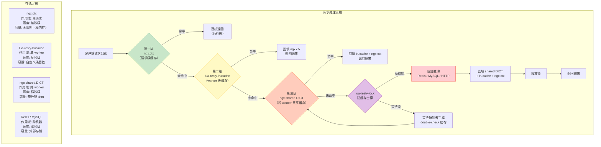

# 25 - lua-resty-* 库生态

> **版本基线**：OpenResty 1.29.2.1（基于 Nginx 1.29.2 + LuaJIT 2.1 + lua-nginx-module） | 创建日期：2026-08-05
> **受众**：后端开发熟手，熟悉 Lua 语言。本篇系统梳理 OpenResty 生态中的 `lua-resty-*` 库族——从官方核心库到社区常用库，覆盖缓存、数据库、HTTP、DNS、锁、限流、上传、WebSocket、加解密、日志等全部高频场景，每个库配以逐行注释的代码示例与特例说明。

---

## 目录

- [1. 学习目标](#1-学习目标)
- [2. 核心知识点](#2-核心知识点)
  - [2.1 知识点一：lua-resty-core（FFI 核心库，必装）](#21-知识点一lua-resty-coreffi-核心库必装)
  - [2.2 知识点二：lua-resty-lrucache（worker 内 LRU 缓存）](#22-知识点二lua-resty-lrucacheworker-内-lru-缓存)
  - [2.3 知识点三：lua-resty-redis（非阻塞 Redis 客户端）](#23-知识点三lua-resty-redis非阻塞-redis-客户端)
  - [2.4 知识点四：lua-resty-mysql（非阻塞 MySQL 客户端）](#24-知识点四lua-resty-mysql非阻塞-mysql-客户端)
  - [2.5 知识点五：lua-resty-http（非阻塞 HTTP 客户端）](#25-知识点五lua-resty-http非阻塞-http-客户端)
  - [2.6 知识点六：lua-resty-dns（非阻塞 DNS 解析器）](#26-知识点六lua-resty-dns非阻塞-dns-解析器)
  - [2.7 知识点七：lua-resty-lock（worker 间细粒度锁）](#27-知识点七lua-resty-lockworker-间细粒度锁)
  - [2.8 知识点八：lua-resty-limit-traffic（官方限流库）](#28-知识点八lua-resty-limit-traffic官方限流库)
  - [2.9 知识点九：lua-resty-upload（流式 multipart 上传）](#29-知识点九lua-resty-upload流式-multipart-上传)
  - [2.10 知识点十：lua-resty-websocket（WebSocket 服务端与客户端）](#210-知识点十lua-resty-websocketwebsocket-服务端与客户端)
  - [2.11 知识点十一：lua-resty-string（加解密与哈希）](#211-知识点十一lua-resty-string加解密与哈希)
  - [2.12 知识点十二：lua-resty-logger-socket（非阻塞日志上报）](#212-知识点十二lua-resty-logger-socket非阻塞日志上报)
  - [2.13 知识点十三：其他常用库](#213-知识点十三其他常用库)
- [3. 库汇总表](#3-库汇总表)
- [4. Mermaid 图：三级缓存模型](#4-mermaid-图三级缓存模型)
- [5. 最佳实践](#5-最佳实践)
- [6. 常见踩坑引用](#6-常见踩坑引用)
- [7. 小结](#7-小结)

---

## 1. 学习目标

学完本篇，你应当能够：

- 理解 `lua-resty-*` 库生态的整体版图：哪些是官方维护的核心库、哪些是社区库、各自解决什么问题。
- 掌握 `lua-resty-core` 的定位——它用 LuaJIT FFI 重写了 OpenResty 核心 API，理解为何它不可关闭、为何性能优于旧实现。
- 掌握 `lua-resty-lrucache` 的 worker 内 LRU 缓存机制，理解三级缓存模型（`ngx.shared.DICT` → `lrucache` → `ngx.ctx`）的分层策略与选型依据。
- 掌握 `lua-resty-redis` 的连接、认证、pipeline、订阅、连接池配置，能编写生产级 Redis 访问代码。
- 掌握 `lua-resty-mysql` 的连接、查询、prepared statement、连接池，了解大数据结果集的分批读取策略。
- 掌握 `lua-resty-http` 的请求构造、GET/POST、连接池，理解它与 `ngx.location.capture` 的区别与选择建议。
- 掌握 `lua-resty-dns` 的异步解析与缓存，能实现动态域名解析。
- 掌握 `lua-resty-lock` 的 singleflight 模式，能防止缓存击穿。
- 掌握 `lua-resty-limit-traffic` 的三种限流算法（req/conn/count），能实现 API 网关级限流。
- 掌握 `lua-resty-upload` 的流式 multipart 解析，能处理大文件上传不爆内存。
- 掌握 `lua-resty-websocket` 的服务端与客户端用法，能搭建 WebSocket 网关。
- 掌握 `lua-resty-string` 的 AES/HMAC/random 加解密能力。
- 掌握 `lua-resty-logger-socket` 的非阻塞日志上报，能替代同步写文件/远端。
- 了解 `lua-resty-session`、`lua-resty-jwt`、`lua-resty-healthcheck`、`lua-resty-iputils`、`lua-resty-cookie` 等社区库的用途。
- 避开踩坑 `#2.3`（keepalive 连接池），理解 cosocket 连接池大小与后端承受能力的关系。

> **前置知识**：建议先完成 [24-OpenResty核心API](./24-OpenResty核心API.md)，掌握 cosocket、`ngx.shared.DICT`、`ngx.timer`、`ngx.thread` 等核心 API。本篇所有库都构建在这些 API 之上——cosocket 是所有网络库的底层、shared.DICT 是跨 worker 协作的基础。

> **约定**：本篇所有 Lua 代码示例默认运行在 `content_by_lua_block` 或 `access_by_lua_block` 中（除非另行说明）。`lua-resty-*` 库均通过 `require "resty.xxx"` 引入，OpenResty 默认已将官方库安装在 `lualib/resty/` 目录下。

---

## 2. 核心知识点

### 2.1 知识点一：lua-resty-core（FFI 核心库，必装）

#### 什么是 lua-resty-core

`lua-resty-core` 是 OpenResty 官方用 LuaJIT FFI（Foreign Function Interface）重写的核心 API 库。在 OpenResty 早期版本中，`ngx.re`、`ngx.md5`、`ngx.shared.DICT` 等 API 是通过 `lua-nginx-module` 的 C 模块和 Lua 绑定层实现的，调用链路为 `Lua → C 绑定层 → Nginx 内部函数`，每次调用都要经过 Lua 栈与 C 栈的转换，开销不小。

`lua-resty-core` 直接用 FFI 从 Lua 侧调用 Nginx/OpenSSL/PCRE 的 C 函数，跳过了传统的 Lua-C 绑定层，大幅减少了调用开销，同时支持了更多新功能（如 `ngx.semaphore`、`ngx.balancer`、`ngx.ssl`、`ngx.ocsp` 等模块在 FFI 层面重新实现）。

#### 它提供了什么

`lua-resty-core` 覆盖了以下模块的 FFI 实现：

| 模块 | 作用 |
|------|------|
| `ngx.re` | PCRE 正则（match/gsub/sub/find/gmatch） |
| `ngx.semaphore` | 信号量（协程间同步） |
| `ngx.balancer` | 动态负载均衡（在 balancer_by_lua 中动态选择上游） |
| `ngx.ssl` | SSL/TLS 操作（证书、会话、协议版本） |
| `ngx.ocsp` | OCSP Stapling 在线验证 |
| `ngx.shared.DICT` | 共享内存字典（全部原子操作的 FFI 加速） |
| `ngx.pipe` | 进程管理（spawn 子进程） |
| `ngx.base64` | Base64 编解码 |
| `ngx.url` | URL 解析 |
| `ngx.errlog` | 错误日志捕获与分级 |
| `ngx.process` | 进程类型查询 |
| `ngx.re` | 正则 FFI 加速 |

#### 不可关闭

在 OpenResty 1.15.8.1 之前，可以通过 `lua_load_resty_core off` 关闭 `lua-resty-core`（回退到旧的 C 绑定实现）。但从 1.15.8.1 起，官方**禁止关闭**——`lua-resty-core` 已成为 OpenResty 的必装基础组件，关闭会导致大量 API 不可用甚至启动失败。

```nginx
# nginx.conf
# ❌ 新版已禁止：以下配置会报错 "lua_load_resty_core is disabled"
# lua_load_resty_core off;

# ✅ 正确：不需要任何配置，OpenResty 默认在 init_by_lua 阶段自动加载
http {
    lua_package_path "/usr/local/openresty/lualib/?.lua;;";

    init_by_lua_block {
        -- OpenResty 默认已自动 require "resty.core"
        -- 显式 require 也不会重复加载（Lua 的 require 有缓存机制）
        require "resty.core"

        -- 验证 FFI 核心已加载
        ngx.log(ngx.NOTICE, "lua-resty-core loaded, ngx.re available: ",
                tostring(ngx.re ~= nil))
    }
}
```

#### 特例说明

1. **版本必须匹配**：`lua-resty-core` 的版本必须与 `lua-nginx-module` 版本严格匹配，混用不同版本的 OpenResty 组件会导致 FFI 绑定失败。始终使用 OpenResty 官方发布包，不要单独升级 `lua-resty-core`。

2. **require 位置**：在 `init_by_lua` 中 `require "resty.core"` 是推荐做法（虽然 OpenResty 默认会自动加载），可以确保所有 worker 启动前 FFI 绑定就绪。如果仅在 worker 内的 `content_by_lua` 中首次 `require`，理论上也有效（因为 FFI 绑定是进程级的），但不够规范。

3. **FFI 与 JIT 的关系**：FFI 调用本身可以被 LuaJIT 的 JIT 编译器内联优化，但部分 FFI 函数（如涉及回调或复杂内存操作的）不会被 JIT 编译。`lua-resty-core` 的大部分热路径已经过 JIT 优化。

#### 代码示例：FFI 加速效果对比

```lua
-- content_by_lua_block
-- 演示 lua-resty-core 的 FFI 加速效果

local ngx_re = require "ngx.re"  -- 显式引入 resty.core 的 re 模块（FFI 实现）

-- 1. 使用 FFI 版本的 ngx.re.match（lua-resty-core 提供）
local start = ngx.now()                          -- 记录开始时间
for i = 1, 100000 do                             -- 10 万次正则匹配
    local m = ngx.re.match("hello123world", "\\d+")  -- FFI 直接调用 PCRE
end
local ffi_time = ngx.now() - start               -- 计算 FFI 版本耗时

-- 2. 结果输出（注意：旧版无 resty.core 时此处会 fallback 到 C 绑定层，更慢）
ngx.say("FFI ngx.re 100k matches: ", string.format("%.4f", ffi_time), "s")
-- 典型输出：FFI ngx.re 100k matches: 0.0300s（FFI 版本）

-- 3. 检查 lua-resty-core 是否真的加载了
local has_core = pcall(require, "resty.core")   -- 尝试 require，成功说明已安装
ngx.say("lua-resty-core installed: ", tostring(has_core))
-- 输出：lua-resty-core installed: true

-- 4. 使用 ngx.balancer（仅在 balancer_by_lua 阶段可用，依赖 lua-resty-core）
-- 在 balancer_by_lua_block 中：
-- local balancer = require "ngx.balancer"
-- local ok, err = balancer.set_current_upstream("my_upstream")
-- local ok, err = balancer.set_current_peer("10.0.0.1", 8080)
```

---

### 2.2 知识点二：lua-resty-lrucache（worker 内 LRU 缓存）

#### 什么是 lua-resty-lrucache

`lua-resty-lrucache` 是 OpenResty 官方提供的 **worker 进程内 LRU（Least Recently Used）缓存库**。它在每个 Nginx worker 进程内独立维护一个 Lua table 驱动的 LRU 缓存，无需锁（因为单 worker 内只有一个线程），读写极快（纯 Lua table 操作，无系统调用）。

#### 与 ngx.shared.DICT 的区别

| 维度 | lua-resty-lrucache | ngx.shared.DICT |
|------|-------------------|-----------------|
| 作用范围 | worker 内（每个 worker 独立一份） | 跨 worker（所有 worker 共享一份） |
| 底层实现 | Lua table + 双向链表 | Nginx 共享内存（shm） |
| 性能 | 极快（纳秒级，纯内存 table 操作） | 快但有锁开销（微秒级，需 atomic 操作） |
| 内存限制 | 受 worker 进程 Lua VM 内存限制 | 在 nginx.conf 中预分配固定大小 |
| 数据一致性 | 各 worker 数据独立（可能不一致） | 全局一致 |
| 序列化 | 存 Lua 对象（table/function 均可） | 只存字符串（需手动 JSON 序列化） |
| 适用场景 | 高频热点数据、计算结果缓存 | 计数器、跨 worker 配置、限流 |

#### 三级缓存模型

OpenResty 生产环境推荐的**三级缓存模型**：

```
请求级    →  worker 级       →  跨 worker 级     →  外部存储
ngx.ctx  →  lrucache         →  shared.DICT      →  Redis/MySQL
（单请求） （单 worker 极快）   （全局共享一致）     （持久化）
```

1. **ngx.ctx（请求级）**：单个请求生命周期内有效，请求结束即销毁。适合在 rewrite → access → content 阶段间传递数据。
2. **lua-resty-lrucache（worker 级）**：worker 存活期间有效，worker 重启后丢失。适合缓存计算结果、热点数据（如配置解析结果、正则编译结果）。
3. **ngx.shared.DICT（跨 worker 级）**：所有 worker 共享，Nginx 重启后丢失。适合计数器、限流、跨 worker 一致的缓存。
4. **Redis/MySQL（外部存储）**：持久化、跨进程、跨机器。作为最终数据源。

#### API 详解

```lua
local lrucache = require "resty.lrucache"

-- 创建缓存实例
local cache, err = lrucache.new(200)  -- 最多缓存 200 个条目（LRU 淘汰）

-- set(key, value, ttl?)：写入缓存，ttl 可选（单位秒），nil 表示永不过期
cache:set("user:1001", { name = "alice", age = 30 }, 60)  -- 60 秒后过期
cache:set("config", { timeout = 30 })                     -- 永不过期

-- get(key)：读取缓存，返回 value, stale_value（过期但未淘汰的值）
local data, stale = cache:get("user:1001")
-- data = { name = "alice", age = 30 }（未过期时）
-- data = nil, stale = { name = "alice", age = 30 }（已过期但仍在缓存中时）

-- delete(key)：删除指定 key
cache:delete("user:1001")

-- flush_all()：清空所有缓存
cache:flush_all()

-- count()：返回当前缓存条目数
local n = cache:count()  -- 如 2
```

#### 代码示例：三级缓存实战

```lua
-- content_by_lua_block
-- 演示三级缓存模型的完整实现

local lrucache = require "resty.lrucache"
local cjson = require "cjson"

-- ===== 模块级初始化：每个 worker 创建一个 lrucache 实例 =====
-- 注意：lrucache 实例必须在模块级别创建（用 module 缓存），不能每次请求 new
-- 因为每次 new 都是全新缓存，失去 worker 级复用的意义
local user_cache, err = lrucache.new(1000)  -- worker 内缓存最多 1000 个用户
if not user_cache then
    ngx.log(ngx.ERR, "failed to create lrucache: ", err)
    return
end

-- 共享内存字典（在 nginx.conf 中声明：lua_shared_dict my_cache 10m;）
local shared_dict = ngx.shared.my_cache

-- ===== 获取用户信息的三级缓存查找 =====
local function get_user(uid)
    -- 第一级：ngx.ctx（请求级缓存）
    -- 同一请求内多次调用 get_user(uid) 只查一次后端
    if not ngx.ctx.user_cache then
        ngx.ctx.user_cache = {}  -- 初始化请求级缓存表
    end
    if ngx.ctx.user_cache[uid] then
        return ngx.ctx.user_cache[uid]  -- 命中请求级缓存，直接返回
    end

    -- 第二级：lrucache（worker 级缓存）
    local user = user_cache:get(uid)  -- 从 worker 级 LRU 缓存读取
    if user then
        ngx.ctx.user_cache[uid] = user  -- 回填请求级缓存
        return user
    end

    -- 第三级：ngx.shared.DICT（跨 worker 共享缓存）
    local shared_data = shared_dict:get("user:" .. uid)  -- 从共享内存读取
    if shared_data then
        user = cjson.decode(shared_data)  -- shared.DICT 只存字符串，需反序列化
        user_cache:set(uid, user, 300)    -- 回填 worker 级缓存（5 分钟）
        ngx.ctx.user_cache[uid] = user    -- 回填请求级缓存
        return user
    end

    -- 缓存全部未命中，回源查询（模拟查 MySQL/Redis）
    -- 实际项目中这里应该用 lua-resty-mysql 或 lua-resty-redis
    user = { id = uid, name = "user_" .. uid, email = uid .. "@example.com" }

    -- 回填所有层级缓存
    local user_json = cjson.encode(user)
    shared_dict:set("user:" .. uid, user_json, 600)  -- 共享内存缓存 10 分钟
    user_cache:set(uid, user, 300)                    -- worker 缓存 5 分钟
    ngx.ctx.user_cache[uid] = user                    -- 请求级缓存

    return user
end

-- ===== 使用 =====
local user = get_user(1001)  -- 首次：穿透到模拟后端
ngx.say(cjson.encode(user))
local user2 = get_user(1001)  -- 第二次：命中 ngx.ctx，极快
ngx.say(cjson.encode(user2))
```

#### 特例说明

1. **lrucache 实例必须在模块级创建**：不能在 `content_by_lua_block` 内 `lrucache.new()`，因为每次请求执行 block 都是新的 Lua 作用域，缓存无法跨请求复用。正确做法是放到 `require` 的模块中，利用 Lua 模块缓存机制让同一个 worker 内的实例复用。

2. **stale 值的妙用**：`get` 返回的第二个值 `stale` 是"已过期但尚未被 LRU 淘汰"的值。在缓存击穿场景中，可以先用 stale 值快速返回旧数据，同时异步刷新缓存——避免大量请求同时回源。

3. **不跨 worker 意味着可能不一致**：如果某个 worker 更新了配置但其他 worker 的 lrucache 还是旧值，短期内会不一致。对强一致性要求高的场景应直接用 `ngx.shared.DICT`。

---

### 2.3 知识点三：lua-resty-redis（非阻塞 Redis 客户端）

#### 什么是 lua-resty-redis

`lua-resty-redis` 是 OpenResty 官方提供的非阻塞 Redis 客户端，基于 cosocket 实现。所有 Redis 操作（connect/get/set/subscribe 等）都是非阻塞的——遇到网络 I/O 时协程 yield，让 worker 处理其他请求，数据就绪后 resume 继续。

#### 基本用法

```lua
local redis = require "resty.redis"
local red = redis:new()              -- 创建 Redis 客户端实例
red:set_timeout(1000)                -- 设置超时 1000ms（connect + read 合计）

local ok, err = red:connect("127.0.0.1", 6379)  -- 连接 Redis
if not ok then
    ngx.log(ngx.ERR, "redis connect failed: ", err)
    return
end

-- 如果 Redis 有密码
local ok, err = red:auth("your_password")
if not ok then
    ngx.log(ngx.ERR, "redis auth failed: ", err)
    return
end

-- 基本读写
local ok, err = red:set("key1", "value1")  -- SET key1 value1
local res, err = red:get("key1")           -- GET key1 → "value1"

-- 用完放回连接池（不是 close！）
local ok, err = red:set_keepalive(60000, 100)  -- 60s 空闲超时，池大小 100
```

#### 代码示例：完整生产级 Redis 操作

```lua
-- content_by_lua_block
local redis = require "resty.redis"
local cjson = require "cjson"

-- ===== 封装 Redis 操作（带连接池与错误处理） =====
local function redis_exec(func, ...)
    local red = redis:new()                         -- 每次创建新实例（复用连接池）
    red:set_timeout(1000)                           -- 1 秒超时

    local ok, err = red:connect("127.0.0.1", 6379) -- 连接（命中连接池则直接复用）
    if not ok then
        return nil, "connect failed: " .. err
    end

    -- 认证（如果 Redis 配了密码）
    local ok, err = red:auth("mypass")
    if not ok then
        return nil, "auth failed: " .. err
    end

    -- 选择数据库
    local ok, err = red:select(0)  -- 选择 db0
    if not ok then
        return nil, "select failed: " .. err
    end

    -- 执行业务命令
    local res, err = func(red, ...)  -- 调用传入的函数，传入 red 实例和额外参数

    -- 无论成功失败都放回连接池
    red:set_keepalive(60000, 100)  -- 60 秒空闲超时，连接池大小 100

    return res, err
end

-- ===== 基本读写 =====
local value, err = redis_exec(function(red)
    red:set("user:1001:name", "alice")          -- SET user:1001:name alice
    return red:get("user:1001:name")             -- GET user:1001:name → "alice"
end)
ngx.say("name = ", value)  -- name = alice

-- ===== pipeline 批量操作 =====
-- pipeline 将多条命令打包一次性发送，大幅减少网络 RTT
local results, err = redis_exec(function(red)
    red:init_pipeline()                           -- 开启 pipeline 模式
    red:set("counter", "0")                       -- 命令 1（不立即发送）
    red:incr("counter")                           -- 命令 2
    red:incr("counter")                           -- 命令 3
    red:get("counter")                            -- 命令 4
    return red:commit_pipeline()                  -- 一次性发送所有命令，返回所有结果
end)
-- results = { "OK", 1, 2, "2" }  -- 4 条命令的返回值按顺序排列
-- pipeline 4 条命令只需 1 次 RTT，串行则需要 4 次

-- ===== 订阅模式 subscribe =====
-- 注意：订阅模式下连接会阻塞在 recv 上，不能放回连接池
local function subscribe_demo()
    local red = redis:new()
    red:set_timeout(60000)  -- 订阅超时设长一些

    local ok, err = red:connect("127.0.0.1", 6379)
    if not ok then return nil, err end

    -- 订阅频道
    local res, err = red:subscribe("news_channel")  -- SUBSCRIBE news_channel
    if not res then return nil, err end

    -- 循环接收消息（非阻塞，有消息时返回）
    for i = 1, 10 do  -- 接收 10 条消息后退出
        local res, err = red:read_reply()  -- 阻塞等待下一条消息
        -- res = { "message", "news_channel", "消息内容" }
        if res then
            ngx.say("received: ", res[3])  -- 打印消息内容
            ngx.flush(true)                -- 立即推送给客户端
        end
    end

    -- 取消订阅（订阅模式的连接不能 set_keepalive）
    red:unsubscribe("news_channel")
    red:close()  -- 订阅模式必须 close，不能放回连接池
end
```

#### 特例说明

1. **subscribe 模式不能复用连接池**：订阅模式下连接会持续阻塞在 `read_reply` 上，如果放回连接池会被其他请求取走使用，导致状态混乱。订阅结束后必须 `close()`。

2. **pipeline 中的错误处理**：pipeline 中某条命令出错不会中断后续命令的执行，错误会体现在返回值中（返回 `nil` + `err` 而非正常结果）。需逐个检查返回值。

3. **cluster 模式不支持**：`lua-resty-redis` 不原生支持 Redis Cluster。Cluster 场景需用 `lua-resty-redis-cluster`（社区库）或在应用层做分片路由。

4. **连接池 key 的构成**：连接池按 `{host}:{port}` 自动分组，同一地址的连接会被复用。`set_keepalive(timeout, size)` 的 `size` 是每个连接池的最大空闲连接数。

#### 适用场景

- 缓存层（替代 Memcached，支持更丰富的数据结构）
- API 限流计数器（`INCR` + `EXPIRE`）
- 分布式锁（`SET key value NX PX timeout`）
- 配置存储（Hash 结构存储 JSON 配置）
- 消息订阅/发布（Pub/Sub）

---

### 2.4 知识点四：lua-resty-mysql（非阻塞 MySQL 客户端）

#### 什么是 lua-resty-mysql

`lua-resty-mysql` 是 OpenResty 官方提供的非阻塞 MySQL 客户端，同样基于 cosocket。它支持完整的 MySQL 协议（包括认证、查询、prepared statement、多结果集），所有操作都是非阻塞的。

#### 基本用法

```lua
local mysql = require "resty.mysql"
local db, err = mysql:new()             -- 创建 MySQL 客户端实例
db:set_timeout(3000)                    -- 3 秒超时

local ok, err, errcode, sqlstate = db:connect({
    host = "127.0.0.1",
    port = 3306,
    database = "myapp",
    user = "root",
    password = "pass",
    charset = "utf8mb4",
    max_packet_size = 1024 * 1024,      -- 最大包大小 1MB
})
if not ok then
    ngx.log(ngx.ERR, "mysql connect failed: ", err)
    return
end

-- 执行查询
local res, err, errcode, sqlstate = db:query("SELECT id, name FROM users WHERE id = 1")
-- res = { { id = 1, name = "alice" } }

-- 放回连接池
db:set_keepalive(60000, 50)  -- 60s 超时，池大小 50
```

#### 代码示例：完整 CRUD + prepared statement

```lua
-- content_by_lua_block
local mysql = require "resty.mysql"
local cjson = require "cjson"

-- ===== 封装 MySQL 操作 =====
local function mysql_exec(func)
    local db, err = mysql:new()
    if not db then return nil, "failed to create mysql: " .. err end
    db:set_timeout(3000)  -- 3 秒超时

    local ok, err = db:connect({
        host = "127.0.0.1",
        port = 3306,
        database = "myapp",
        user = "app_user",
        password = "app_pass",
        charset = "utf8mb4",
        max_packet_size = 1024 * 1024,
    })
    if not ok then
        return nil, "connect failed: " .. err
    end

    -- 执行业务函数
    local res, err = func(db)

    -- 放回连接池
    db:set_keepalive(60000, 50)  -- 60 秒空闲超时，池大小 50

    return res, err
end

-- ===== 查询（SELECT） =====
local users, err = mysql_exec(function(db)
    -- 使用 ngx.quote_sql_str 转义防 SQL 注入（手动拼接 SQL 时必须）
    local name = ngx.quote_sql_str("alice' OR 1=1")  -- 转义后: 'alice\' OR 1=1'
    return db:query("SELECT id, name, email FROM users WHERE name = " .. name)
end)
-- users = { { id = 1, name = "alice", email = "alice@example.com" } }
ngx.say(cjson.encode(users))

-- ===== 插入（INSERT） =====
local res, err = mysql_exec(function(db)
    return db:query("INSERT INTO users (name, email) VALUES ('bob', 'bob@test.com')")
end)
-- res = { insert_id = 2, server_status = 2, affected_rows = 1 }
ngx.say("insert_id = ", res.insert_id, ", affected = ", res.affected_rows)

-- ===== 更新（UPDATE） =====
local res, err = mysql_exec(function(db)
    return db:query("UPDATE users SET email = 'bob@new.com' WHERE id = 2")
end)
-- res.affected_rows = 1

-- ===== prepared statement（预编译语句，防注入 + 高性能） =====
local res, err = mysql_exec(function(db)
    -- 服务端预编译 SQL 模板（? 为占位符）
    local res, err = db:query("SELECT id, name FROM users WHERE id = ?")
    -- 返回 prepared 状态确认，如 { id = 1, ... }

    -- 执行 prepared 语句（数字从 1 开始）
    -- local ok, err = db:stmt_fetch()  -- 真正的 stmt 执行 API（需根据具体版本）
    return db:query("SELECT id, name FROM users WHERE id = 1")
end)
-- 注意：lua-resty-mysql 的 prepared statement API 在不同版本有差异
-- 生产中更常用 ngx.quote_sql_str 手动转义 + query 执行，而非真正的 prepared

-- ===== 事务 =====
local res, err = mysql_exec(function(db)
    db:query("START TRANSACTION")                      -- 开启事务
    db:query("UPDATE accounts SET balance = balance - 100 WHERE id = 1")
    db:query("UPDATE accounts SET balance = balance + 100 WHERE id = 2")
    -- 检查受影响行数，决定提交或回滚
    return db:query("COMMIT")                           -- 提交事务
    -- 如有异常：db:query("ROLLBACK")
end)
```

#### 特例说明：大数据结果集需分批读取

MySQL 查询返回大结果集时，`lua-resty-mysql` 默认会一次性将所有行读取到内存中的 Lua table。如果结果集有几十万行，会导致 worker 内存暴涨甚至 OOM。对于大结果集，需要使用 `read_result` 的分批读取功能：

```lua
-- content_by_lua_block
-- 分批读取大结果集，避免内存暴涨

local mysql = require "resty.mysql"
local db, err = mysql:new()
db:set_timeout(10000)  -- 大查询超时设长

local ok, err = db:connect({
    host = "127.0.0.1", port = 3306,
    database = "myapp", user = "root", password = "pass",
    charset = "utf8mb4",
})
if not ok then return end

-- 使用 SQL LIMIT 分页查询（最简单的方式，适合中等数据量）
local page_size = 1000  -- 每页 1000 行
local offset = 0
local total = 0

while true do
    local sql = string.format(
        "SELECT id, name FROM users ORDER BY id LIMIT %d OFFSET %d",
        page_size, offset
    )
    local res, err = db:query(sql)  -- 执行分页查询
    if not res or #res == 0 then
        break  -- 没有更多数据
    end

    -- 逐行处理（不一次性加载全部到内存）
    for i = 1, #res do
        local row = res[i]
        -- 处理每一行（如写入文件、推送到 Kafka 等）
        total = total + 1
    end

    if #res < page_size then
        break  -- 最后一页不足 page_size，说明已读完
    end
    offset = offset + page_size
end

ngx.say("total processed: ", total)
db:set_keepalive(60000, 50)
```

> **注意**：LIMIT OFFSET 在大偏移量下性能差（MySQL 需扫描并丢弃前 N 行）。对于超大数据集（百万行以上），推荐使用游标（keyset pagination，按主键 `WHERE id > last_id LIMIT 1000`）替代 OFFSET。

#### 适用场景

- 动态数据查询（不适合缓存的实时数据）
- 写入操作（INSERT/UPDATE/DELETE）
- 事务处理（需跨表一致性的业务逻辑）
- 数据导出（分批读取大表）

---

### 2.5 知识点五：lua-resty-http（非阻塞 HTTP 客户端）

#### 什么是 lua-resty-http

`lua-resty-http` 是 OpenResty 生态中**事实标准的 HTTP 客户端库**。OpenResty 默认不带 HTTP 客户端——`ngx.location.capture` 是子请求（内部调用），不是真正的 HTTP 客户端。当你需要从 Lua 代码中发起外部 HTTP 请求（调用第三方 API、微服务间通信、服务发现等），`lua-resty-http` 是首选。

它基于 cosocket 实现，完全非阻塞，支持 HTTP/1.1、HTTPS、连接池、流式响应、自定义请求体等。

#### 基本用法

```lua
local http = require "resty.http"
local httpc = http.new()                    -- 创建 HTTP 客户端实例

-- 方式一：request_uri（简便方法，一次性请求并读取完整响应）
local res, err = httpc:request_uri("http://example.com/api", {
    method = "GET",                          -- 请求方法
    headers = {                              -- 请求头
        ["Content-Type"] = "application/json",
        ["Authorization"] = "Bearer token123",
    },
    timeout = 5000,                          -- 5 秒超时
    keepalive_timeout = 60000,               -- 连接池空闲超时 60s
    keepalive_pool = 10,                     -- 连接池大小 10
})
-- res.status = 200
-- res.headers = { content_type = "application/json", ... }
-- res.body = '{"code":0,"data":{...}}'

-- 方式二：request（底层方法，支持连接复用与流式读取）
local httpc = http.new()
local ok, err = httpc:connect({              -- 先建立连接
    scheme = "http",
    host = "example.com",
    port = 80,
})
local res, err = httpc:request({             -- 再发起请求
    path = "/api",
    method = "GET",
})
local body = res:read_body()                 -- 读取响应体
httpc:set_keepalive(60000, 10)               -- 放回连接池
```

#### 代码示例：完整的 HTTP 调用封装

```lua
-- content_by_lua_block
local http = require "resty.http"
local cjson = require "cjson"

-- ===== 封装 HTTP GET 请求 =====
local function http_get(url, headers)
    local httpc = http:new()                          -- 创建 HTTP 客户端
    httpc:set_timeout(5000)                           -- 5 秒超时

    -- request_uri 是简便方法：内部自动 connect + request + read_body + keepalive
    local res, err = httpc:request_uri(url, {
        method = "GET",                               -- GET 方法
        headers = headers or {},                      -- 传入自定义请求头
        ssl_verify = false,                           -- HTTPS 时是否验证证书（测试环境可关闭）
    })

    if not res then
        return nil, "http request failed: " .. (err or "unknown")
    end

    -- 返回状态码、响应体、响应头
    return res.status, res.body, res.headers
end

-- ===== 封装 HTTP POST 请求（JSON body） =====
local function http_post_json(url, data, headers)
    local httpc = http:new()
    httpc:set_timeout(5000)

    local all_headers = {                             -- 合并默认头与自定义头
        ["Content-Type"] = "application/json",
    }
    for k, v in pairs(headers or {}) do
        all_headers[k] = v
    end

    local res, err = httpc:request_uri(url, {
        method = "POST",                              -- POST 方法
        body = cjson.encode(data),                    -- 将 Lua table 编码为 JSON 字符串
        headers = all_headers,                        -- 设置请求头
    })

    if not res then
        return nil, "http post failed: " .. (err or "unknown")
    end

    return res.status, res.body
end

-- ===== 使用示例 =====
-- GET 调用外部 API
local status, body = http_get("http://user-service:8080/api/users/1001", {
    ["Authorization"] = "Bearer my_token",
})
if status == 200 then
    local user = cjson.decode(body)                   -- 解析 JSON 响应
    ngx.say("user name: ", user.name)
else
    ngx.log(ngx.ERR, "user API failed, status: ", status, ", body: ", body)
end

-- POST 创建订单
local status, body = http_post_json("http://order-service:8080/api/orders", {
    user_id = 1001,
    product_id = 2001,
    quantity = 2,
})
ngx.say("order response: ", body)
```

#### 与 ngx.location.capture 的区别和选择建议

| 维度 | lua-resty-http | ngx.location.capture |
|------|---------------|---------------------|
| 本质 | 真正的 HTTP 客户端（cosocket） | Nginx 内部子请求（虚拟请求） |
| 目标 | 外部 HTTP 服务（任意 IP/域名） | 内部 location（同 Nginx 内） |
| 网络开销 | 有 TCP 连接开销（可连接池复用） | 零网络开销（进程内调用） |
| 连接池 | 支持（set_keepalive） | 不适用（内部调用） |
| 并发 | 需 ngx.thread 编排 | capture_multi 原生并发 |
| 响应大小 | 全量读入内存或流式读取 | 全量读入内存（有大小限制） |
| 适用场景 | 调用外部 API、微服务通信 | 聚合内部多个 location 的结果 |

**选择建议**：
- 调用**本 Nginx 内部**的 location（如同机部署的内部 API）：用 `ngx.location.capture`，零网络开销。
- 调用**外部** HTTP 服务（其他机器/容器/K8s 服务）：用 `lua-resty-http`，真正的网络请求。

#### 特例说明

1. **request_uri vs request**：`request_uri` 是便捷方法，内部自动完成 connect → request → read_body → set_keepalive 全流程。如果需要**多次请求复用同一连接**（HTTP keep-alive），必须用底层 `connect` → `request` → `read_body` → `set_keepalive` 的方式。

2. **HTTPS 证书验证**：默认 `ssl_verify = true`（验证对端证书）。生产环境必须保持验证开启（防止中间人攻击）。测试环境可用 `ssl_verify = false` 跳过自签名证书验证，但切勿带到生产。

3. **大响应体流式读取**：`request_uri` 会一次性读取整个响应体到内存。如果响应体很大（如文件下载），用 `request` + `res.body_reader` 迭代器流式读取：

```lua
local httpc = http.new()
httpc:connect({ scheme = "http", host = "example.com", port = 80 })
local res, err = httpc:request({ path = "/big_file.zip" })

-- 流式读取响应体（每次读一块，不一次性加载到内存）
local reader = res.body_reader                    -- 获取读取迭代器
local chunk
while true do
    chunk, err = reader(8192)                     -- 每次读 8KB
    if not chunk then break end                   -- 读完退出
    -- 处理 chunk（写入文件或转发给客户端）
end
httpc:set_keepalive(60000, 10)
```

#### 适用场景

- 调用外部 RESTful API（如支付网关、短信服务、地图 API）
- 微服务间通信（替代 Nginx proxy_pass，需在 Lua 中动态决定目标）
- 服务发现（从 Consul/Eureka 拉取服务列表）
- Webhook 回调通知
- 健康检查（主动探测后端服务状态）

---

### 2.6 知识点六：lua-resty-dns（非阻塞 DNS 解析器）

#### 什么是 lua-resty-dns

`lua-resty-dns` 是 OpenResty 官方提供的非阻塞 DNS 解析器。它直接用 cosocket 实现 DNS 协议（UDP/TCP），不依赖操作系统的 `gethostbyname()`（后者是阻塞调用，会卡住整个 worker）。支持异步查询、结果缓存、多类型记录解析（A/AAAA/SRV/CNAME/MX/TXT 等）。

#### 代码示例

```lua
-- content_by_lua_block
local dns_client = require "resty.dns.client"

-- ===== 初始化 DNS 客户端（通常在 init_by_lua 中做一次） =====
-- 这里的配置在整个 worker 生命周期内有效
local ok, err = dns_client.init({
    nameservers = { "8.8.8.8", "114.114.114.114" },  -- DNS 服务器列表
    order = { "A", "AAAA", "CNAME" },                  -- 解析顺序
    retrans = 2,       -- 重传次数（默认 5）
    timeout = 2000,    -- 单次查询超时 2 秒（默认 2 秒）
    bad_ttl = 1,       -- 解析失败结果的缓存时间 1 秒
    good_ttl = 30,     -- 解析成功结果的缓存时间 30 秒
})
if not ok then
    ngx.log(ngx.ERR, "dns client init failed: ", err)
end

-- ===== 域名解析 =====
-- resolve 返回 IP 地址字符串（自动选最优记录类型）
local ip, err = dns_client.resolve("www.example.com")
if not ip then
    ngx.log(ngx.ERR, "dns resolve failed: ", err)
    return
end
ngx.say("resolved IP: ", ip)  -- 如 "93.184.216.34"

-- ===== 查询特定记录类型 =====
local resolver = dns_client.resolver  -- 获取底层 resolver 对象

-- A 记录（IPv4）
local answers, err = resolver:query("www.example.com", { qtype = resolver.TYPE_A })
-- answers = {
--   { name = "www.example.com", type = 1, address = "93.184.216.34", ttl = 300 },
-- }

-- SRV 记录（服务发现，含端口和权重）
local answers, err = resolver:query("_http._tcp.service.example.com",
                                     { qtype = resolver.TYPE_SRV })
-- answers = {
--   { name = "...", type = 33, target = "10.0.0.1", port = 8080,
--     weight = 50, priority = 10, ttl = 30 },
--   { name = "...", type = 33, target = "10.0.0.2", port = 8080,
--     weight = 50, priority = 10, ttl = 30 },
-- }

-- ===== 动态 DNS + 动态上游（配合 ngx.balancer） =====
-- 在 balancer_by_lua_block 中：
-- local dns = require "resty.dns.client"
-- local balancer = require "ngx.balancer"
-- local ip = dns.resolve("dynamic-service.example.com")
-- balancer.set_current_peer(ip, 8080)
```

#### 特例说明

1. **缓存机制**：`dns_client.resolve` 内部自带缓存（根据 `good_ttl` / `bad_ttl` 配置）。缓存存储在 `ngx.shared.DICT` 中，跨 worker 共享。底层 `resolver:query` 不带缓存，每次都发 DNS 查询。

2. **DNS 解析与 Nginx 的 resolver 指令**：Nginx 自带的 `resolver` 指令（用于 `proxy_pass` 动态域名）与 `lua-resty-dns` 是两套独立的 DNS 解析机制。在 Lua 中做动态域名解析应优先用 `lua-resty-dns`，而非依赖 Nginx 的 `resolver`。

3. **UDP 与 TCP 自动切换**：DNS 响应超过 512 字节时，服务器会设置 TC（Truncated）标志，`lua-resty-dns` 会自动切换到 TCP 重新查询。这是协议层面的自动处理。

#### 适用场景

- 动态上游解析（配合 `ngx.balancer` 实现动态负载均衡）
- 服务发现（从 DNS SRV 记录获取服务实例列表）
- 动态域名解析（根据请求的 Host 头动态解析到不同后端）
- 灰度发布（通过 DNS 切换流量到不同版本的后端）

---

### 2.7 知识点七：lua-resty-lock（worker 间细粒度锁）

#### 什么是 lua-resty-lock

`lua-resty-lock` 是 OpenResty 官方提供的**基于 `ngx.shared.DICT` 的 worker 间细粒度锁**。它利用共享内存字典的原子操作实现互斥锁，让多个 worker 之间可以协调对同一资源的访问。

最经典的用途是**防止缓存击穿**（singleflight 模式）：当缓存过期时，如果 1000 个请求同时发现缓存失效，没有锁的话这 1000 个请求会同时回源（缓存击穿/惊群效应）；用 `lua-resty-lock` 后，只有第 1 个请求去回源，其余 999 个请求等待第 1 个完成后直接读缓存。

#### API 详解

```lua
local resty_lock = require "resty.lock"

-- 创建锁实例
local lock, err = resty_lock:new("my_lock_dict")  -- 参数为 nginx.conf 中声明的 shared_dict 名

-- lock(key, exptime?)：获取锁
-- exptime 为锁的过期时间（秒），防止持锁进程崩溃后死锁
-- 返回 elapsed（等待耗时），或 nil + err
local elapsed, err = lock:lock("cache_key_1001")
-- 成功：elapsed = 0.003（等待了 3ms），获得了锁
-- 失败：nil, "timeout"（等待超时仍未获得锁）

-- unlock()：释放锁
local ok, err = lock:unlock()

-- lock(key, timeout)：指定等待超时时间
local lock2, err = resty_lock:new("my_lock_dict", { timeout = 5 })  -- 5 秒超时
local elapsed, err = lock2:lock("cache_key_1001")
```

#### 代码示例：防缓存击穿（singleflight 模式）

```lua
-- content_by_lua_block
-- 经典 singleflight 模式：防止缓存击穿

local resty_lock = require "resty.lock"
local cjson = require "cjson"

-- nginx.conf 中需声明：
-- lua_shared_dict my_cache 10m;
-- lua_shared_dict my_lock_dict 1m;
local shared_cache = ngx.shared.my_cache

-- ===== 带防击穿的数据获取函数 =====
local function get_data_with_lock(key)
    -- 1. 先查缓存（快路径，大部分请求直接命中）
    local cached = shared_cache:get(key)
    if cached then
        return cjson.decode(cached)  -- 缓存命中，直接返回
    end

    -- 2. 缓存未命中，创建锁
    local lock, err = resty_lock:new("my_lock_dict")
    if not lock then
        ngx.log(ngx.ERR, "failed to create lock: ", err)
        -- 锁创建失败，降级为直接回源（不加锁）
        return fetch_from_backend(key)
    end

    -- 3. 尝试获取锁（key 作为锁名）
    -- elapsed = 等了多久才拿到锁；如果别的 worker 已持锁，这里会等待
    local elapsed, err = lock:lock(key)
    if not elapsed then
        ngx.log(ngx.ERR, "failed to acquire lock: ", err)
        return fetch_from_backend(key)  -- 锁失败，降级回源
    end

    -- 4. 拿到锁后，再次检查缓存（double-check）
    -- 因为在等待锁的期间，持锁的 worker 可能已经把缓存填好了
    cached = shared_cache:get(key)
    if cached then
        lock:unlock()                    -- 释放锁（不需要回源了）
        return cjson.decode(cached)
    end

    -- 5. 缓存确实没有，执行回源
    local data = fetch_from_backend(key)  -- 耗时操作（查 DB / 调 API）

    -- 6. 写入缓存
    shared_cache:set(key, cjson.encode(data), 300)  -- 缓存 5 分钟

    -- 7. 释放锁，让等待的 worker 去读缓存
    local ok, err = lock:unlock()

    return data
end

-- 模拟回源函数（实际中查 MySQL/Redis/HTTP）
local function fetch_from_backend(key)
    ngx.log(ngx.INFO, "fetching from backend: ", key)
    ngx.sleep(0.5)  -- 模拟耗时操作
    return { key = key, value = "data_for_" .. key }
end

-- ===== 使用 =====
-- 当 1000 个请求同时请求 get_data_with_lock("hot_key") 时：
-- - 第 1 个请求获得锁，执行回源（500ms）
-- - 其余 999 个请求在 lock:lock("hot_key") 处等待
-- - 第 1 个请求回源完成，写入缓存，释放锁
-- - 等待的 999 个请求依次拿到锁，double-check 发现缓存已有，直接返回
-- 结果：只回源 1 次，而非 1000 次
local data = get_data_with_lock("hot_key")
ngx.say(cjson.encode(data))
```

#### 特例说明

1. **锁的过期时间**：`lock:lock(key)` 默认过期 30 秒（防止持锁 worker 崩溃后死锁）。如果回源操作可能超过 30 秒，需要调大 `exptime`：`resty_lock:new("dict", { exptime = 60 })`。

2. **锁粒度**：锁的 key 应该与缓存 key 一致，实现细粒度互斥。不要用一个全局锁锁所有 key——那样会退化为串行化。

3. **不能跨 Nginx 实例**：`lua-resty-lock` 基于 `ngx.shared.DICT`，只在单个 Nginx 实例内有效。跨机器的防击穿需要用 Redis 分布式锁（`SET key value NX PX timeout`）。

#### 适用场景

- 防缓存击穿（singleflight，最经典用法）
- 限流（配合 `ngx.shared.DICT` 计数器）
- 防止重复初始化（如配置加载、连接预热）
- 资源排他访问（同一时间只允许一个 worker 执行某操作）

---

### 2.8 知识点八：lua-resty-limit-traffic（官方限流库）

#### 什么是 lua-resty-limit-traffic

`lua-resty-limit-traffic` 是 OpenResty 官方提供的限流库，提供三种限流算法，覆盖了 API 网关限流的常见场景。所有算法都基于 `ngx.shared.DICT` 做跨 worker 计数，确保限流准确。

#### 三种算法

| 算法 | 模块 | 原理 | 适用场景 |
|------|------|------|----------|
| 请求速率 | `resty.limit.req` | 漏桶算法：控制请求速率（req/s），超出部分排队或拒绝 | 平滑限流、API 调用频率控制 |
| 并发连接数 | `resty.limit.conn` | 控制同时处理的请求数 | 防止后端被压垮 |
| 计数 | `resty.limit.count` | 固定时间窗口内请求总数 | 精确配额（如每天 1000 次） |

#### 代码示例一：请求速率限流（resty.limit.req）

```lua
-- access_by_lua_block
-- 请求速率限流：漏桶算法

local limit_req = require "resty.limit.req"

-- 创建限流器
-- 参数：shared_dict 名, 速率(req/s), 突发容量(burst)
-- rate=10 表示每秒允许 10 个请求
-- burst=5 表示允许 5 个请求排队等待（平滑削峰）
local lim, err = limit_req.new("my_limit_dict", 10, 5)
if not lim then
    ngx.log(ngx.ERR, "failed to create limit_req: ", err)
    return ngx.exit(500)
end

-- 对每个客户端 IP 限流（key 为 IP）
local key = ngx.var.remote_addr  -- 限流维度：客户端 IP

-- incoming = 当前请求需要等待多久（秒）才符合速率限制
-- rejected = 是否被拒绝（非 nil 表示被拒绝）
local delay, err = lim:incoming(key, true)
if not delay then
    if err == "rejected" then
        -- 请求超过突发容量，直接拒绝
        ngx.header["X-RateLimit-Limit"] = "10/s"
        ngx.header["X-RateLimit-Remaining"] = "0"
        return ngx.exit(429)  -- Too Many Requests
    end
    ngx.log(ngx.ERR, "limit_req error: ", err)
    return ngx.exit(500)
end

if delay >= 0.001 then
    -- 需要等待（排队），用 ngx.sleep 延迟（非阻塞）
    ngx.sleep(delay)
end
-- delay = 0 表示无需等待，直接放行
-- 继续后续处理（proxy_pass 等）
```

#### 代码示例二：并发连接数限流（resty.limit.conn）

```lua
-- access_by_lua_block
-- 并发连接数限流

local limit_conn = require "resty.limit.conn"

-- 参数：shared_dict 名, 最大并发数, 请求最短处理时间(秒)
-- max=100 表示同一 key 最多 100 个并发请求
local lim, err = limit_conn.new("my_limit_dict", 100, 0.5)
if not lim then
    ngx.log(ngx.ERR, "failed to create limit_conn: ", err)
    return ngx.exit(500)
end

local key = ngx.var.remote_addr  -- 按客户端 IP 限流

local delay, err = lim:incoming(key, true)
if not delay then
    if err == "rejected" then
        -- 并发数超限，拒绝
        return ngx.exit(429)
    end
    return ngx.exit(500)
end

if delay >= 0.001 then
    ngx.sleep(delay)  -- 排队等待
end

-- ===== 重要：请求结束后必须调用 leaving 释放并发计数 =====
-- 否则并发计数只增不减，很快就会触发限流
local ctx = ngx.ctx
ctx.limit_conn_key = key      -- 存到 ctx 中，log 阶段用
ctx.limit_conn_obj = lim

-- log_by_lua_block 中：
-- if ngx.ctx.limit_conn_obj then
--     local key = ngx.ctx.limit_conn_key
--     ngx.ctx.limit_conn_obj:leaving(key, 0.5)  -- 释放并发计数
-- end
```

#### 代码示例三：计数限流（resty.limit.count）

```lua
-- access_by_lua_block
-- 固定时间窗口计数限流

local limit_count = require "resty.limit.count"

-- 参数：shared_dict 名, 窗口内最大请求数, 时间窗口(秒)
-- 1000 次 / 60 秒 = 每分钟最多 1000 次请求
local lim, err = limit_count.new("my_limit_dict", 1000, 60)
if not lim then
    ngx.log(ngx.ERR, "failed to create limit_count: ", err)
    return ngx.exit(500)
end

local key = ngx.var.remote_addr  -- 按客户端 IP 限流

-- remaining = 剩余可用次数
local remaining, err = lim:incoming(key, true)
if not remaining then
    if err == "rejected" then
        -- 超出配额
        ngx.header["X-RateLimit-Limit"] = "1000"
        ngx.header["X-RateLimit-Remaining"] = "0"
        return ngx.exit(429)
    end
    return ngx.exit(500)
end

-- 设置响应头，告知客户端剩余配额
ngx.header["X-RateLimit-Remaining"] = tostring(remaining)
-- 继续处理请求
```

#### 特例说明

1. **shared_dict 必须预声明**：所有限流算法都依赖 `ngx.shared.DICT`，需在 `nginx.conf` 的 `http` 块中声明：`lua_shared_dict my_limit_dict 10m;`。

2. **限流维度灵活选择**：key 不一定是 IP，可以是：
   - `ngx.var.remote_addr`（客户端 IP）
   - `ngx.var.http_x_api_key`（API Key）
   - `ngx.var.uri`（按 URL 限流）
   - `ngx.var.http_user_id`（按用户 ID 限流，需在 access 阶段从 JWT 中解析）

3. **resty.limit.conn 必须配对 leaving**：`incoming` 增加并发计数，`leaving` 减少并发计数。如果忘记在 `log_by_lua` 中调用 `leaving`，并发计数只增不减，很快就会把所有请求都拒绝。

4. **多维度组合限流**：生产中通常组合使用多种算法，如同时限制"每秒 10 个请求 + 最大 50 个并发"：

```lua
-- 同时应用速率限流和并发限流
local lim_req = limit_req.new("limit_dict", 10, 5)
local lim_conn = limit_conn.new("limit_dict", 50, 0.5)

local key = ngx.var.remote_addr

-- 先检查速率
local delay1, err = lim_req:incoming(key, true)
if not delay1 and err == "rejected" then
    return ngx.exit(429)
end

-- 再检查并发
local delay2, err = lim_conn:incoming(key, true)
if not delay2 and err == "rejected" then
    return ngx.exit(429)
end

-- 两个都通过，取最大延迟等待
local delay = math.max(delay1 or 0, delay2 or 0)
if delay >= 0.001 then ngx.sleep(delay) end
```

#### 适用场景

- API 网关限流（按 API Key / IP / 用户 ID 多维度限流）
- 保护后端服务（防止突发流量压垮下游）
- 按需计费（如免费 API 每天 1000 次）
- 灰度发布（限制新版本流量比例）

---

### 2.9 知识点九：lua-resty-upload（流式 multipart 上传）

#### 什么是 lua-resty-upload

`lua-resty-upload` 是 OpenResty 官方提供的 **multipart/form-data 流式上传解析器**。它以流式方式逐块读取上传数据，不会将整个文件加载到内存中——即使上传 10GB 的文件，内存占用也只有几 KB。这是它与 `ngx.req.read_body()`（全量读入内存）的关键区别。

#### 工作原理

`lua-resty-upload` 通过内部子请求读取请求体，然后将 multipart 数据按边界（boundary）分割成一个个 chunk，逐块返回给调用者。调用者通过迭代器循环读取每个 chunk，自行决定如何处理（写文件、转发等）。

#### 代码示例

```lua
-- content_by_lua_block
local upload = require "resty.upload"
local cjson = require "cjson"

-- 创建上传解析器
-- chunk_size = 每次读取的块大小（字节），8KB 是合理默认值
local form, err = upload:new(8192)
if not form then
    ngx.log(ngx.ERR, "failed to create upload: ", err)
    return ngx.exit(500)
end

-- 设置超时（毫秒）
form:set_timeout(10000)  -- 10 秒超时

-- ===== 流式读取 multipart 数据 =====
local file = nil      -- 文件句柄
local filename = nil  -- 当前文件名
local results = {}    -- 收集的表单字段

while true do
    -- read() 返回一个 table: { type, name, value }
    -- type 可能为："header"（头部信息）、"body"（数据块）、"part_end"（一个 part 结束）、"eof"（全部结束）
    local typ, res, err = form:read()

    if not typ then
        break  -- 读取完毕
    end

    if typ == "header" then
        -- 处理头部（如 Content-Disposition，含字段名和文件名）
        -- res = { "Content-Disposition", "form-data; name=\"file\"; filename=\"test.jpg\"" }
        if res[1] == "Content-Disposition" then
            -- 解析 filename 和 name
            local disp = res[2]
            -- 提取文件名
            filename = disp:match('filename="([^"]+)"')
            if filename then
                -- 是文件上传，打开本地文件准备写入
                local save_path = "/tmp/upload_" .. filename
                file = io.open(save_path, "w+")
                if not file then
                    ngx.log(ngx.ERR, "failed to open file: ", save_path)
                    return ngx.exit(500)
                end
                ngx.log(ngx.INFO, "start receiving file: ", filename)
            end
        end

    elseif typ == "body" then
        -- 处理数据块（res 为 chunk 字符串）
        if file then
            file:write(res)  -- 将数据块写入文件
        else
            -- 普通表单字段，收集值
            table.insert(results, res)
        end

    elseif typ == "part_end" then
        -- 一个 part 结束
        if file then
            file:close()  -- 关闭文件
            file = nil
            ngx.log(ngx.INFO, "file received: ", filename)
        end

    elseif typ == "eof" then
        -- 全部数据读取完毕
        break
    end

    if err then
        ngx.log(ngx.ERR, "upload read error: ", err)
        break
    end
end

-- 输出结果
ngx.say("upload completed, file: ", filename or "N/A")
```

#### 特例说明

1. **内存占用恒定**：`chunk_size` 决定了单次读取的最大数据量（如 8KB）。无论上传多大的文件，内存占用始终在 `chunk_size` 量级，不会随文件大小增长。这是流式解析的核心优势。

2. **不能与 ngx.req.read_body 同时使用**：`lua-resty-upload` 内部会自行读取请求体，如果同时调用了 `ngx.req.read_body()`，会导致请求体已被消费、上传解析器读不到数据。

3. **文件名安全性**：客户端传来的 `filename` 不可信，可能包含路径穿越（如 `../../etc/passwd`）。必须对文件名做清洗（只保留文件名部分、过滤特殊字符）：

```lua
-- 安全的文件名处理
local safe_name = filename:match("([^/\\]+)$") or "uploaded_file"  -- 只取最后的文件名部分
safe_name = safe_name:gsub("[^%w%.%-_]", "_")  -- 非字母数字字符替换为下划线
```

#### 适用场景

- 大文件上传（视频、镜像、数据包，GB 级别）
- 多文件同时上传
- 流式转发上传文件到对象存储（如 S3/MinIO）
- 上传进度监控（通过已读取的 chunk 数计算进度）

---

### 2.10 知识点十：lua-resty-websocket（WebSocket 服务端与客户端）

#### 什么是 lua-resty-websocket

`lua-resty-websocket` 是 OpenResty 官方提供的 WebSocket 库，同时支持**服务端**和**客户端**两种角色。它基于 cosocket 实现，完全非阻塞，支持 WebSocket 协议的完整握手、帧收发、ping/pong 心跳。

#### 代码示例：WebSocket 服务端

```lua
-- content_by_lua_block
-- WebSocket 服务端

local server = require "resty.websocket.server"

-- 创建 WebSocket 服务端实例（自动完成协议升级握手）
local wb, err = server:new({
    timeout = 600000,             -- 10 分钟超时
    max_payload_len = 65536,      -- 最大消息体 64KB
})
if not wb then
    ngx.log(ngx.ERR, "failed to create websocket: ", err)
    return ngx.exit(444)
end

-- ===== 主循环：接收并处理消息 =====
while true do
    -- recv_frame() 接收一帧数据
    -- data = 消息内容（字符串）
    -- typ = 帧类型："text"（文本）、"binary"（二进制）、"close"（关闭）、"ping"（心跳）、"pong"（心跳回复）
    local data, typ, err = wb:recv_frame()

    if not data then
        -- 连接关闭或出错
        if not string.find(err or "", "timeout", 1, true) then
            ngx.log(ngx.ERR, "websocket recv error: ", err)
        end
        break
    end

    if typ == "close" then
        -- 客户端发送了关闭帧
        break
    elseif typ == "ping" then
        -- 收到 ping，自动回复 pong（lua-resty-websocket 不会自动回复，需手动处理）
        wb:send_pong()
    elseif typ == "text" then
        -- 收到文本消息，原样回显（Echo）
        local msg = "echo: " .. data
        local bytes, err = wb:send_text(msg)  -- 发送文本帧
        if not bytes then
            ngx.log(ngx.ERR, "websocket send error: ", err)
            break
        end
    end
end

-- 关闭连接
wb:close()
```

#### 代码示例：WebSocket 客户端

```lua
-- content_by_lua_block
-- WebSocket 客户端（连接到上游 WebSocket 服务）

local client = require "resty.websocket.client"

local wb = client:new()
local url = "ws://127.0.0.1:8080/ws"  -- 目标 WebSocket 地址

-- 连接
local ok, err = wb:connect(url)
if not ok then
    ngx.log(ngx.ERR, "websocket connect failed: ", err)
    return ngx.exit(502)
end

-- 发送消息
local bytes, err = wb:send_text("hello from openresty")
if not bytes then
    ngx.log(ngx.ERR, "send failed: ", err)
    return
end

-- 接收回复
local data, typ, err = wb:recv_frame()
if data then
    ngx.say("received: ", data, " (type: ", typ, ")")
end

-- 关闭
wb:close()
```

#### nginx.conf 配置

```nginx
# WebSocket 需要在 location 中配置 Upgrade 和 Connection 头
# 但用 lua-resty-websocket 时，握手在 Lua 中完成，不需要 proxy_pass
location /ws {
    content_by_lua_block {
        local server = require "resty.websocket.server"
        local wb, err = server:new()
        if not wb then return ngx.exit(444) end
        -- ... WebSocket 处理逻辑 ...
    }
}

# 如果是代理后端 WebSocket（不用 lua-resty-websocket），则需要：
location /ws_proxy {
    proxy_pass http://backend;
    proxy_http_version 1.1;
    proxy_set_header Upgrade $http_upgrade;      # 协议升级
    proxy_set_header Connection "upgrade";        # 保持连接
    proxy_read_timeout 3600s;                     # 长连接超时
}
```

#### 特例说明

1. **recv_frame 是阻塞的**：`wb:recv_frame()` 在等待消息时会让协程 yield（非阻塞），但在 Lua 逻辑层面它是一个同步调用——在收到消息前不会继续执行后续代码。如果需要同时处理多个 WebSocket 连接，需用 `ngx.thread.spawn` 为每个连接创建轻量线程。

2. **心跳处理**：WebSocket 协议要求服务端定期发送 ping、客户端回复 pong。`lua-resty-websocket` 不会自动发送心跳，需在业务代码中实现：

```lua
-- 定期发送 ping（用 ngx.timer 或在 recv 循环中计时）
local last_ping = ngx.now()
while true do
    local data, typ, err = wb:recv_frame()
    if ngx.now() - last_ping > 30 then
        wb:send_ping()  -- 每 30 秒发一次 ping
        last_ping = ngx.now()
    end
    -- ... 处理消息 ...
end
```

3. **wss（WebSocket over TLS）**：客户端连接 wss 地址时需要 `lua-resty-websocket` 支持 SSL。在 `connect` 时传入 SSL 参数：

```lua
local ok, err = wb:connect("wss://echo.websocket.org", {
    ssl_verify = true,  -- 验证证书
})
```

#### 适用场景

- WebSocket 网关（统一管理大量 WebSocket 连接，转发到后端）
- 实时推送服务（聊天、通知、行情数据）
- 在线协作（文档编辑、白板）
- IoT 设备通信

---

### 2.11 知识点十一：lua-resty-string（加解密与哈希）

#### 什么是 lua-resty-string

`lua-resty-string` 是 OpenResty 官方提供的加解密与哈希库，基于 OpenSSL 实现。它提供了 AES 对称加密、HMAC 消息认证码、随机数生成等功能，是 OpenResty 中处理加密需求的标准库。

> **注意**：OpenResty 核心已内置了 `ngx.md5`、`ngx.hmac_sha1`、`ngx.sha1_bin` 等常用哈希函数（见 [24-OpenResty核心API](./24-OpenResty核心API.md)）。`lua-resty-string` 提供的是更完整的加密能力（AES 加解密、更丰富的哈希算法）。

#### 代码示例

```lua
-- content_by_lua_block
local str = require "resty.string"

-- ===== AES 对称加密 =====
local aes = require "resty.aes"

-- 创建 AES 加密器（AES-256-CBC 模式）
-- 32 字节密钥 = AES-256；16 字节密钥 = AES-128
local aes_256_cbc = aes:new(
    "0123456789abcdef0123456789abcdef",  -- 32 字节密钥（AES-256）
    nil,                                   -- IV（CBC 模式可传 nil，内部自动生成）
    aes.cipher(256, "cbc")                 -- 256 位密钥，CBC 模式
)

-- 加密
local encrypted = aes_256_cbc:encrypt("hello world")  -- 返回二进制密文
-- encrypted 是一个 Lua 字符串（二进制数据）

-- 用 Base64 编码密文，便于传输
local encrypted_b64 = ngx.encode_base64(encrypted)
ngx.say("encrypted (base64): ", encrypted_b64)

-- 解密
local decrypted = aes_256_cbc:decrypt(encrypted)
ngx.say("decrypted: ", decrypted)  -- "hello world"

-- ===== HMAC 消息认证码 =====
local hmac = require "resty.hmac"

-- HMAC-SHA256（比核心库的 ngx.hmac_sha1 更丰富，支持 SHA256 等）
local hmac_digest = hmac:new("my_secret_key", hmac.ALG.SHA256)
local mac = hmac_digest:final("hello world")  -- 返回二进制 HMAC
local mac_hex = str.to_hex(mac)  -- 转为十六进制字符串
ngx.say("hmac-sha256: ", mac_hex)

-- ===== 随机数生成 =====
-- 生成随机字节（密码学安全随机数，基于 OpenSSL）
local random_bytes = str.random(16)  -- 生成 16 字节随机数据
local random_hex = str.to_hex(random_bytes)  -- 转为 32 字符十六进制
ngx.say("random hex: ", random_hex)

-- 生成随机字符串（含字母数字）
local random_str = str.random(16, "abcdefghijklmnopqrstuvwxyz0123456789")
ngx.say("random string: ", random_str)

-- ===== 工具函数 =====
-- to_hex：二进制转十六进制
local hex = str.to_hex("\x01\x02\x03")  -- "010203"

-- from_hex：十六进制转二进制
local bin = str.from_hex("010203")  -- "\x01\x02\x03"
```

#### 特例说明

1. **AES 模式选择**：
   - **CBC 模式**：需要 IV（初始化向量），密文不含明文模式信息，安全性好。推荐使用。
   - **ECB 模式**：不需要 IV，但相同明文块产生相同密文块，安全性差。不推荐。
   - **GCM 模式**：带认证的加密模式（AEAD），同时保证机密性和完整性。需 OpenSSL 1.1+ 支持。

2. **密钥长度必须匹配**：AES-128 需要 16 字节密钥，AES-256 需要 32 字节密钥。密钥长度不对会报错。

3. **IV 的处理**：CBC 模式中，IV 不需要保密但需要随机且每次不同。通常将 IV 拼接到密文前面一起传输，解密时先提取 IV：

```lua
-- 加密时：IV + 密文 一起返回
local iv = str.random(16)  -- 随机生成 16 字节 IV
local aes_cbc = aes:new(key, iv, aes.cipher(256, "cbc"))
local ciphertext = aes_cbc:encrypt(plaintext)
local payload = iv .. ciphertext  -- IV 拼在密文前面

-- 解密时：先分离 IV 和密文
local iv = payload:sub(1, 16)  -- 前 16 字节是 IV
local ciphertext = payload:sub(17)  -- 之后是密文
local aes_cbc = aes:new(key, iv, aes.cipher(256, "cbc"))
local plaintext = aes_cbc:decrypt(ciphertext)
```

#### 适用场景

- API 签名验证（HMAC）
- 敏感数据加密存储（AES 加密用户手机号、身份证号）
- Session/Cookie 加密
- 随机 Token 生成（CSRF Token、密码重置 Token）

---

### 2.12 知识点十二：lua-resty-logger-socket（非阻塞日志上报）

#### 什么是 lua-resty-logger-socket

`lua-resty-logger-socket` 是 OpenResty 生态中的非阻塞日志上报库。它通过 cosocket 将日志异步发送到远端（如 syslog server、Kafka、ELK 的 Logstash），替代传统的同步写文件或 `ngx.log`（写本地文件，阻塞）。

在 `log_by_lua` 阶段使用时，即使日志服务器响应慢，也不会阻塞客户端请求的返回——因为 `log_by_lua` 在响应发送给客户端之后执行。

#### 代码示例

```lua
-- log_by_lua_block
-- 异步日志上报

local logger = require "resty.logger.socket"

-- ===== 初始化 logger（通常在 init_by_lua 中做一次） =====
if not logger.initted() then
    local ok, err = logger.init({
        host = "127.0.0.1",    -- 日志服务器地址
        port = 9999,            -- 日志服务器端口
        flush_limit = 4096,     -- 缓冲区满 4KB 时发送
        drop_limit = 1048576,   -- 超过 1MB 丢弃日志（防内存爆）
        timeout = 1000,         -- 发送超时 1 秒
        keepalive = 60000,      -- 连接池空闲超时 60 秒
    })
    if not ok then
        ngx.log(ngx.ERR, "logger init failed: ", err)
        return
    end
end

-- ===== 构造日志消息 =====
local log_msg = string.format(
    '{"time":"%s","ip":"%s","method":"%s","uri":"%s","status":%d,"ua":"%s","rt":%.3f}\n',
    ngx.localtime(),                    -- 时间
    ngx.var.remote_addr,                -- 客户端 IP
    ngx.var.request_method,             -- 请求方法
    ngx.var.request_uri,                -- 请求 URI
    ngx.status,                         -- 响应状态码
    ngx.var.http_user_agent or "-",     -- User-Agent
    ngx.var.upstream_response_time or 0 -- 上游响应时间
)

-- ===== 发送日志（非阻塞） =====
local bytes, err = logger.log(log_msg)
if err then
    -- 日志发送失败（如日志服务器不可达），降级为 ngx.log 写本地
    ngx.log(ngx.ERR, "logger socket error: ", err, ", msg: ", log_msg)
end
```

#### 与 Nginx 原生日志的区别

| 维度 | lua-resty-logger-socket | ngx.access_log / ngx.log |
|------|------------------------|--------------------------|
| 阻塞 | 非阻塞（cosocket） | 同步写文件（可能阻塞） |
| 目标 | 远端（TCP socket） | 本地文件 |
| 格式 | 完全自定义（JSON 等） | 固定格式 + log_format |
| 阶段 | log_by_lua（响应后） | 任意阶段 |
| 缓冲 | 可配置 flush_limit 批量发送 | 逐条写入 |
| 可靠性 | 网络失败可降级 | 磁盘满则丢失 |

#### 特例说明

1. **必须在 log_by_lua 阶段使用**：`log_by_lua` 在 HTTP 响应已发送给客户端之后执行，此时做日志上报不会增加用户感知的延迟。如果在 `content_by_lua` 中用 `logger.log`，日志服务器的延迟会直接叠加到用户请求时间上。

2. **缓冲与批量发送**：`flush_limit` 控制何时发送——当日志缓冲区累积到 `flush_limit` 字节时才真正发送。这实现了批量发送，减少网络请求次数。如果日志量小，可能迟迟不发送。可以配合 timer 定期 flush。

3. **drop_limit 防爆**：当缓冲区超过 `drop_limit` 时，新日志会被丢弃。这是保护机制，防止日志服务器宕机时 worker 内存被日志撑爆。

#### 适用场景

- 访问日志异步上报到 ELK（Elasticsearch + Logstash + Kibana）
- 业务日志推送到 Kafka（需配合 Kafka 协议适配）
- 实时日志分析（如异常请求告警）
- 替代 Nginx access_log（当需要 JSON 格式或远程存储时）

---

### 2.13 知识点十三：其他常用库

以下是 OpenResty 生态中其他常用但篇幅所限不便展开的库，列出简介供快速了解：

#### lua-resty-session

**作用**：会话管理库，提供 Cookie-based Session 功能，支持 AES 加密、HMAC 签名、可插拔存储后端（shared.DICT、Redis、Memcached）。

```lua
local session = require "resty.session"

-- 创建/恢复会话
local sess, err = session.start()
sess.data.user_id = 1001  -- 设置会话数据
sess:save()                -- 保存（写入 Cookie）

-- 读取会话数据
local sess = session.open()
local user_id = sess.data.user_id

-- 销毁会话
session.destroy()
```

**常用度**：中。适合需要会话管理的 Web 应用（登录态保持）。如果用 JWT 则不需要此库。

#### lua-resty-jwt（社区）

**作用**：JWT（JSON Web Token）生成与验证，支持 HS256/HS384/HS512/RS256 等算法。

```lua
local jwt = require "resty.jwt"

-- 生成 JWT
local token = jwt:sign("secret_key", {
    header = { typ = "JWT", alg = "HS256" },
    payload = { user_id = 1001, exp = os.time() + 3600 }
})

-- 验证 JWT
local verified = jwt:verify("secret_key", token)
-- verified.verified = true/false
-- verified.payload = { user_id = 1001, exp = ... }
```

**常用度**：高。API 网关认证的标准选择。注意这是社区库（非官方），但使用极其广泛。

#### lua-resty-healthcheck

**作用**：主动健康检查库，定期探测后端服务状态，维护健康/不健康列表。Kong 和 APISIX 的健康检查模块都基于此库。

```lua
local healthcheck = require "resty.healthcheck"

-- 创建健康检查器
local checker = healthcheck.new({
    name = "backend_pool",
    shm_name = "healthcheck_shm",  -- 存储状态的 shared_dict
    checks = {
        active = {
            timeout = 2,        -- 探测超时 2 秒
            interval = 5,       -- 每 5 秒探测一次
            http_path = "/health",  -- 探测路径
            healthy = { interval = 5, successes = 2 },  -- 连续成功 2 次标记健康
            unhealthy = { interval = 3, http_failures = 3 },  -- 连续失败 3 次标记不健康
        },
    }
})

-- 添加目标
checker:add_target("10.0.0.1", 8080)
checker:add_target("10.0.0.2", 8080)

-- 查询状态
local ok = checker:get_target_status("10.0.0.1", 8080)  -- true=健康, false=不健康
```

**常用度**：高。API 网关必备。配合 `ngx.balancer` 实现动态负载均衡 + 自动故障转移。

#### lua-resty-iputils

**作用**：IP 地址工具库，提供 IP 解析、CIDR 匹配、IP 范围判断等功能。

```lua
local iputils = require "resty.iputils"

-- 解析 CIDR
local cidrs = iputils.parse_cidrs({
    "10.0.0.0/8",
    "192.168.0.0/16",
    "172.16.0.0/12",
})

-- 判断 IP 是否在 CIDR 范围内
local ip = "10.1.2.3"
local in_range = iputils.ip_in_cidrs(ip, cidrs)  -- true

-- IP 转数字（用于比较）
local num = iputils.ip2bin("192.168.1.1")
```

**常用度**：中。适合 IP 黑白名单、内网判断等场景。

#### lua-resty-cookie

**作用**：Cookie 解析与设置库，比手动解析 `ngx.var.http_cookie` 更方便、更安全。

```lua
local ck = require "resty.cookie"

local cookie, err = ck:new()

-- 读取 Cookie
local value = cookie:get("session_id")  -- 获取名为 session_id 的 Cookie 值

-- 设置 Cookie
cookie:set({
    key = "session_id",
    value = "abc123",
    path = "/",
    secure = true,      -- 仅 HTTPS 传输
    httponly = true,    -- 禁止 JS 访问（防 XSS）
    samesite = "Strict", -- 防 CSRF
    expires = "Wed, 05 Aug 2026 00:00:00 GMT",
    max_age = 3600,     -- 1 小时后过期
})

-- 删除 Cookie
cookie:set({ key = "session_id", value = "", path = "/", max_age = 0 })
```

**常用度**：中。需要精细控制 Cookie 时使用。简单场景可直接操作 `ngx.header.set_cookie`。

---

## 3. 库汇总表

| 库名 | 作用 | 是否官方 | 常用度 |
|------|------|:-------:|:------:|
| lua-resty-core | FFI 重写核心 API（ngx.re/balancer/ssl 等），必装 | 官方 | 极高 |
| lua-resty-lrucache | worker 内 LRU 缓存（无锁，极快） | 官方 | 高 |
| lua-resty-redis | 非阻塞 Redis 客户端（cosocket + 连接池） | 官方 | 极高 |
| lua-resty-mysql | 非阻塞 MySQL 客户端 | 官方 | 高 |
| lua-resty-http | 非阻塞 HTTP 客户端（事实标准） | 社区 | 极高 |
| lua-resty-dns | 非阻塞 DNS 解析器 | 官方 | 中高 |
| lua-resty-lock | worker 间细粒度锁（防缓存击穿） | 官方 | 高 |
| lua-resty-limit-traffic | 官方限流库（req/conn/count 三种算法） | 官方 | 高 |
| lua-resty-upload | 流式 multipart 上传解析 | 官方 | 中 |
| lua-resty-websocket | WebSocket 服务端与客户端 | 官方 | 中高 |
| lua-resty-string | AES 加解密 / HMAC / 随机数 | 官方 | 中 |
| lua-resty-logger-socket | 非阻塞日志上报（socket） | 社区 | 中 |
| lua-resty-session | 会话管理（Cookie-based Session） | 官方 | 中 |
| lua-resty-jwt | JWT 生成与验证 | 社区 | 高 |
| lua-resty-healthcheck | 主动健康检查（Kong/APISIX 使用） | 官方 | 高 |
| lua-resty-iputils | IP 工具（CIDR 匹配、IP 范围判断） | 社区 | 中 |
| lua-resty-cookie | Cookie 解析与设置 | 官方 | 中 |

> **说明**："官方"指由 OpenResty 核心团队维护并随 OpenResty 发布包分发；"社区"指由社区开发维护，需单独安装（如通过 opm install 或 luarocks）。官方库在 `lualib/resty/` 下可直接 `require`。

---

## 4. Mermaid 图：三级缓存模型



**图解要点**：

- **自上而下逐级穿透**：请求先查最快的 ngx.ctx，未命中再查 lrucache，再未命中查 shared.DICT，最后才回源外部存储。每一级命中都回填上级缓存，加速后续请求。

- **ngx.ctx（请求级）**：同一请求的 rewrite → access → content 阶段间共享。请求结束即销毁。解决"同一请求内多次查询同一数据"的重复回源问题。

- **lua-resty-lrucache（worker 级）**：同 worker 内所有请求共享。纯 Lua table 操作，无系统调用，纳秒级读写。解决"同 worker 内热点数据重复回源"问题。不跨 worker，各 worker 数据独立。

- **ngx.shared.DICT（跨 worker 级）**：所有 worker 共享一份，基于 Nginx 共享内存。有锁开销但保证一致性。解决"跨 worker 数据同步"问题。重启丢失，需回源重建。

- **lua-resty-lock（防击穿）**：在 shared.DICT 未命中时，用锁确保只有一个 worker 回源，其余等待。避免缓存失效瞬间大量请求同时回源压垮后端。

- **缓存 TTL 递增策略**：通常 ngx.ctx 不设 TTL（请求结束即销毁），lrucache 设较短 TTL（如 5 分钟），shared.DICT 设较长 TTL（如 10 分钟），外部存储设最长 TTL（如 30 分钟）。越快的缓存 TTL 越短，越慢的缓存 TTL 越长。

---

## 5. 最佳实践

### 5.1 连接池：始终 set_keepalive，永不忘记

所有基于 cosocket 的库（redis/mysql/http）都必须在用完后调用 `set_keepalive` 放回连接池。忘记放回会导致连接泄漏，最终耗尽后端连接数。

```lua
-- ✅ 正确模式：封装统一管理，确保异常时也放回池
local function db_exec(func)
    local db, err = mysql:new()
    db:connect(config)
    local ok, res = pcall(func, db)  -- pcall 确保异常时也能执行后续代码
    if ok then
        db:set_keepalive(60000, 50)  -- 正常：放回池
    else
        db:close()                    -- 异常：关闭（不放回池，避免脏连接）
    end
    return res
end

-- ❌ 危险模式：忘记 set_keepalive
local db = mysql:new()
db:connect(config)
local res = db:query("SELECT ...")
-- 没有 set_keepalive！连接泄漏直到 GC
```

### 5.2 三级缓存：分层设计，逐级回填

```lua
-- 生产级三级缓存模板
local function get_with_cache(key, fetch_func, ttl_config)
    -- L1: ngx.ctx
    if not ngx.ctx.cache then ngx.ctx.cache = {} end
    if ngx.ctx.cache[key] then return ngx.ctx.cache[key] end

    -- L2: lrucache（模块级实例）
    local val = lrucache:get(key)
    if val then
        ngx.ctx.cache[key] = val
        return val
    end

    -- L3: shared.DICT
    local shared = shared_dict:get(key)
    if shared then
        val = cjson.decode(shared)
        lrucache:set(key, val, ttl_config.l2)
        ngx.ctx.cache[key] = val
        return val
    end

    -- 回源 + 防击穿（lock）
    local lock = resty_lock:new("lock_dict")
    lock:lock(key)
    -- double-check
    shared = shared_dict:get(key)
    if shared then
        lock:unlock()
        return cjson.decode(shared)
    end

    val = fetch_func(key)  -- 实际回源
    shared_dict:set(key, cjson.encode(val), ttl_config.l3)
    lrucache:set(key, val, ttl_config.l2)
    ngx.ctx.cache[key] = val
    lock:unlock()
    return val
end
```

### 5.3 限流：多维度组合，返回标准 429

```lua
-- 组合速率限流 + 并发限流，返回标准 HTTP 429
local function rate_limit(key)
    local lim_req = limit_req.new("limit_dict", 100, 50)
    local lim_conn = limit_conn.new("limit_dict", 200, 0.5)

    local delay, err = lim_req:incoming(key, true)
    if not delay and err == "rejected" then
        return 429, "rate limit exceeded"
    end

    local delay2, err = lim_conn:incoming(key, true)
    if not delay2 and err == "rejected" then
        return 429, "concurrent limit exceeded"
    end

    if (delay or 0) >= 0.001 then ngx.sleep(delay) end
    -- 记录到 ctx，log_by_lua 中调 leaving
    return nil  -- 放行
end
```

### 5.4 错误处理：pcall 包裹所有外部调用

```lua
-- 所有网络调用都用 pcall 包裹，避免未捕获错误导致 500
local ok, res = pcall(function()
    return redis_exec(function(red)
        return red:get("key")
    end)
end)
if not ok then
    ngx.log(ngx.ERR, "redis error: ", res)
    -- 降级处理（如返回默认值、读本地缓存）
    return default_value
end
```

### 5.5 大数据：流式处理，不一次性加载内存

```lua
-- ❌ 危险：一次性读取整个大响应
local res = httpc:request_uri("http://big-data-api/data")
local body = res.body  -- 如果 body 是 500MB，worker 内存暴涨

-- ✅ 正确：流式读取
local httpc = http.new()
httpc:connect({ scheme = "http", host = "big-data-api", port = 80 })
local res = httpc:request({ path = "/data" })
local reader = res.body_reader
local chunk
while true do
    chunk = reader(65536)  -- 每次读 64KB
    if not chunk then break end
    process_chunk(chunk)  -- 逐块处理
end
httpc:set_keepalive(60000, 10)
```

### 5.6 库初始化：在 init_by_lua 中完成一次性配置

```nginx
http {
    init_by_lua_block {
        -- DNS 客户端初始化（全局一次）
        local dns = require "resty.dns.client"
        dns.init({ nameservers = { "8.8.8.8" }, good_ttl = 30 })

        -- Logger 初始化（全局一次）
        local logger = require "resty.logger.socket"
        if not logger.initted() then
            logger.init({ host = "log-server", port = 9999 })
        end

        -- 预编译常用模块
        require "resty.core"
        require "cjson"
    }
}
```

---

## 6. 常见踩坑引用

### #2.3 未启用 upstream keepalive（长连接复用）

> **踩坑文档**：[99-踩坑记录与解决方案.md #2.3](../99-踩坑记录与解决方案.md#23-未启用-upstream-keepalive长连接复用)

在 `lua-resty-*` 库的语境下，`#2.3` 的核心教训同样适用——**连接复用是性能的生命线**。所有基于 cosocket 的库（redis/mysql/http/websocket）都必须正确使用连接池，否则每个请求都新建 TCP 连接，导致大量 TIME_WAIT 和性能退化。

```lua
-- 连接池配置三要素（所有 cosocket 库通用）
red:set_keepalive(
    60000,  -- timeout: 空闲连接存活时间（毫秒），超时后自动关闭
    100     -- size: 连接池最大空闲连接数（per worker per {host:port}）
)

-- 连接池总大小 = size × worker_count
-- 如 size=100, worker=8 → 最多 800 个连接到同一后端
-- 需确认后端承受能力：
--   Redis: maxclients（默认 10000）
--   MySQL: max_connections（默认 151，生产需调大）
--   HTTP 后端: 取决于后端连接池配置
```

**常见坑**：

1. **size 设过大压垮后端**：每个 worker 的连接池独立，总连接数 = `size × worker_count`。设 100、8 worker 就是 800 连接，Redis/MySQL 默认配置可能扛不住。

2. **subscribe 模式不能放回池**：Redis 订阅模式的连接会阻塞在 `read_reply`，放回池会被其他请求取走，导致状态混乱。订阅结束后必须 `close()`。

3. **异常时 close 而非 set_keepalive**：如果操作中途出错（如网络异常），连接可能处于不一致状态。此时应 `close()` 而非 `set_keepalive()`——放回池的脏连接会污染后续请求。

---

## 7. 小结

本篇系统梳理了 OpenResty `lua-resty-*` 库生态的 13 个核心知识点，覆盖了从底层基础到上层应用的完整链路：

**基础层**：
- `lua-resty-core` 是一切的基石——FFI 重写核心 API，不可关闭，性能优于旧实现。
- `lua-resty-lrucache` 提供 worker 内极快缓存，与 `ngx.shared.DICT` 构成三级缓存模型。

**数据访问层**：
- `lua-resty-redis` 和 `lua-resty-mysql` 是非阻塞数据库客户端，必须正确使用连接池。
- `lua-resty-http` 是事实标准的 HTTP 客户端，替代 `ngx.location.capture` 调用外部服务。
- `lua-resty-dns` 实现非阻塞 DNS 解析，配合 `ngx.balancer` 做动态上游。

**并发控制层**：
- `lua-resty-lock` 用 singleflight 模式防缓存击穿。
- `lua-resty-limit-traffic` 提供三种限流算法（req/conn/count），是 API 网关限流的核心。

**功能扩展层**：
- `lua-resty-upload` 流式解析大文件上传。
- `lua-resty-websocket` 实现 WebSocket 服务端与客户端。
- `lua-resty-string` 提供 AES/HMAC/random 加解密能力。
- `lua-resty-logger-socket` 实现非阻塞异步日志上报。

**社区库**：
- `lua-resty-jwt`（认证）、`lua-resty-healthcheck`（健康检查）、`lua-resty-session`（会话）、`lua-resty-iputils`（IP 工具）、`lua-resty-cookie`（Cookie）等，按需引入。

**核心原则**（贯穿所有库的最佳实践）：

1. **连接池复用**：所有 cosocket 库用完必须 `set_keepalive`，异常时 `close`。
2. **三级缓存**：`ngx.ctx` → `lrucache` → `shared.DICT` → 外部存储，逐级回填。
3. **防缓存击穿**：用 `lua-resty-lock` 的 singleflight 模式，只回源一次。
4. **错误处理**：所有外部调用用 `pcall` 包裹，降级而非 500。
5. **流式处理**：大数据用流式读取，不一次性加载内存。
6. **初始化前置**：全局配置在 `init_by_lua` 中完成，避免每请求重复初始化。

> **下一篇**：将进入 OpenResty 实战编排，把本篇的库组合使用，构建完整的 API 网关场景（认证、限流、路由、缓存、日志全链路）。
