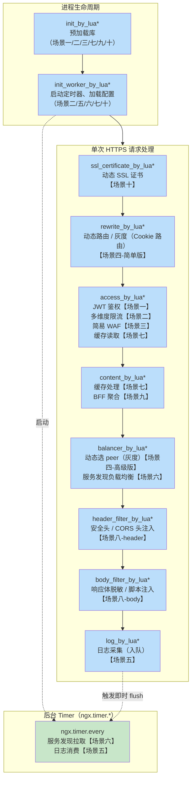

# 26 - Lua 插件实战

> **版本基线**：OpenResty 1.29.2.1（基于 Nginx 1.29.2 + LuaJIT 2.1 + lua-nginx-module v0.10.29） | 创建日期：2026-08-05
> **受众**：后端开发熟手，熟悉 Lua 语言，已读完阶段七前三篇文档（22-24）。
> **本篇定位**：阶段七的实战落地文档。前面三篇讲了"阶段""API""核心库"，本篇把这三种知识组装成 **10 个生产级网关插件场景**——每个场景都有完整的 Nginx 配置 + 可运行的 Lua 代码 + 逐行注释 + 特例说明。读完本篇，你应当具备独立设计 OpenResty 网关插件体系的能力。

---

## 目录

- [1. 学习目标](#1-学习目标)
- [2. 核心知识点 / 实战场景](#2-核心知识点--实战场景)
  - [场景一：JWT 网关鉴权](#场景一jwt-网关鉴权)
  - [场景二：多维度限流](#场景二多维度限流)
  - [场景三：简易 WAF](#场景三简易-waf)
  - [场景四：动态路由 / 灰度发布](#场景四动态路由--灰度发布)
  - [场景五：日志异步采集](#场景五日志异步采集)
  - [场景六：服务发现](#场景六服务发现)
  - [场景七：缓存层](#场景七缓存层)
  - [场景八：响应改写](#场景八响应改写)
  - [场景九：BFF 聚合](#场景九bff-聚合)
  - [场景十：动态 SSL 证书](#场景十动态-ssl-证书)
- [3. Mermaid 图：网关插件在各阶段的分布图](#3-mermaid-图网关插件在各阶段的分布图)
- [4. 最佳实践](#4-最佳实践)
- [5. 常见踩坑引用](#5-常见踩坑引用)
- [6. 小结](#6-小结)

---

## 1. 学习目标

本篇是阶段七的收官实战。前面三篇分别解决了"什么时候执行"（[23-执行阶段](23-Lua执行阶段详解.md)）、"用什么 API"（[24-核心API](24-OpenResty核心API.md)）、"生态里有哪些轮子"（lua-resty-\* 库生态）三个问题。本篇把三者组装起来，用 **10 个真实生产场景** 演示如何从零编写一个 OpenResty 网关插件。

学完本篇，你应当能够：

- 在 `access_by_lua` 阶段实现 **JWT 鉴权**，用 `ngx.shared.DICT` 缓存已校验的 token 以降低解析开销，并能正确处理 token 过期。
- 用 `lua-resty-limit-traffic` 实现 **IP 速率限流 + 并发连接限流** 的组合策略，支持白名单豁免。
- 在 `access` 阶段实现 **简易 WAF**，用 `ngx.re.*` 做 SQL 注入 / XSS / 恶意 UA 检测，规则文件支持热更新。
- 在 `rewrite_by_lua` 和 `balancer_by_lua` 阶段实现 **动态路由 / 灰度发布**，理解蓝绿发布与金丝雀发布的区别。
- 在 `log_by_lua` 阶段用 `ngx.timer.at` 实现 **日志异步采集**，理解"log 阶段不能用 cosocket 直接发"的限制。
- 用 `ngx.timer.every` + `ngx.shared.DICT` 实现 **服务发现**，周期拉取 Consul/Nacos 后端列表供 balancer 使用。
- 用 `ngx.shared.DICT` + `lua-resty-lrucache` + `lua-resty-lock` 实现 **二级缓存 + 防击穿**，覆盖穿透/击穿/雪崩三种防护。
- 在 `header_filter_by_lua` / `body_filter_by_lua` 阶段实现 **响应改写**（安全头注入、响应体脱敏），理解 body_filter 逐 chunk 调用特性。
- 在 `content_by_lua` 阶段用 `ngx.thread` + `lua-resty-http` 实现 **BFF 聚合**，并发调用多个后端并合并响应。
- 在 `ssl_certificate_by_lua` 阶段按 SNI 实现 **动态 SSL 证书加载**，支撑多域名 HTTPS 网关。
- 避开踩坑 `#1.7`（if is evil → 用 Lua 替代）、`#5.4`（后端获取真实 IP）、`#3.4`（SSRF 防护）。

> **前置知识**：阅读本篇前，请确保已读完 [23-Lua执行阶段详解](23-Lua执行阶段详解.md) 和 [24-OpenResty核心API](24-OpenResty核心API.md)。本篇不再重复解释阶段机制和基础 API，直接进入实战编码。
>
> **代码约定**：本篇所有 Lua 文件放在 `/usr/local/openresty/lualib/plugins/` 目录下（对应 `lua_package_path`），Nginx 配置中的 `_by_lua_file` 指令引用相对路径。所有代码均基于 OpenResty 1.29.2.1 内置的库版本，无需额外安装-opm 包（除非文中注明）。

---

## 2. 核心知识点 / 实战场景

下面 10 个场景按"请求生命周期"的自然顺序排列：从 TLS 握手（场景十的概念铺垫）到 access 鉴权限流（场景一/二/三），到 rewrite/content 路由与聚合（场景四/九），再到 filter 响应改写（场景八）和 log 日志采集（场景五），最后是基础设施层的缓存（场景七）和服务发现（场景六）。每个场景独立可运行，也可以组合使用。

### 场景一：JWT 网关鉴权

#### 场景说明

JWT（JSON Web Token）是微服务网关最常用的无状态鉴权方案。本场景在 `access_by_lua` 阶段拦截请求，从 `Authorization` 头中提取 Bearer token，用 `lua-resty-jwt` 校验签名和过期时间，并把已校验的 token 缓存到 `ngx.shared.DICT` 中——同一个 token 在缓存有效期内不重复解析，大幅降低 CPU 开销（JWT 的 HMAC-SHA256 验签是 CPU 密集型操作）。

校验失败时返回 `401 Unauthorized`，校验通过后把 JWT payload 中的用户信息注入到请求头（如 `X-User-Id`），供后端服务直接使用。

#### Nginx 配置

```nginx
# nginx.conf（http 块内的全局配置）
http {
    # -- lua 包搜索路径 --
    lua_package_path "/usr/local/openresty/lualib/?.lua;/usr/local/openresty/lualib/plugins/?.lua;;";

    # -- 共享内存字典：缓存已校验的 JWT --
    # keys_zone 名称 = jwt_cache，10MB 空间
    lua_shared_dict jwt_cache 10m;

    # -- 初始化阶段：预加载 JWT 库，减少首次请求延迟 --
    init_by_lua_block {
        -- require 的副作用是加载并缓存模块到 package.loaded
        -- 在 init_by_lua 中 require 后，所有 worker fork 时直接继承
        require "resty.jwt"
        require "resty.aes"  -- 如需加密 payload 可用
    }

    server {
        listen 80;
        server_name api.example.com;

        # -- 所有 /api/ 路径都走 JWT 鉴权 --
        location /api/ {
            access_by_lua_file plugins/jwt_auth.lua;

            # 鉴权通过后代理到后端
            proxy_pass http://backend;
            proxy_set_header Host $host;
            # 把 Lua 注入的用户信息透传给后端
            proxy_set_header X-User-Id $http_x_user_id;
            proxy_set_header X-User-Role $http_x_user_role;
        }

        # -- 不需要鉴权的公开接口 --
        location /public/ {
            proxy_pass http://backend;
        }
    }

    upstream backend {
        server 127.0.0.1:8080;
        keepalive 32;
    }
}
```

#### Lua 代码：`plugins/jwt_auth.lua`

```lua
-- ============================================================
-- JWT 网关鉴权插件
-- 阶段：access_by_lua
-- 功能：校验 Bearer JWT，缓存校验结果，注入用户信息到请求头
-- 依赖：lua-resty-jwt（OpenResty 内置）
-- ============================================================

-- 引入 JWT 库（已在 init_by_lua 中预加载，此处从 package.loaded 取，无开销）
local jwt = require "resty.jwt"

-- 获取共享内存字典实例（全局只创建一次，每次 require 拿到同一个引用）
local jwt_cache = ngx.shared.jwt_cache

-- 密钥：生产环境应从外部 KMS 或环境变量读取，不要硬编码
-- 这里用 ngx.var 或 os.getenv 演示
local secret = os.getenv("JWT_SECRET") or "my-default-secret-key"

-- 缓存 TTL：token 的剩余有效期与固定上限取较小值
-- 即便 token 本身有效期很长，缓存也不会超过此值（安全考虑）
local CACHE_TTL_MAX = 300  -- 5 分钟

-- ============================================================
-- 主逻辑
-- ============================================================

-- 1. 从 Authorization 头提取 token
local auth_header = ngx.var.http_authorization
if not auth_header then
    -- 没有 Authorization 头，直接 401
    ngx.status = ngx.HTTP_UNAUTHORIZED
    ngx.header["Content-Type"] = "application/json"
    ngx.say('{"code":401,"message":"Missing Authorization header"}')
    -- ngx.exit 会中断当前请求处理，不再执行后续阶段
    return ngx.exit(ngx.HTTP_UNAUTHORIZED)
end

-- 2. 解析 "Bearer <token>" 格式
-- string.match 是 Lua 原生字符串匹配，不走 PCRE，无额外开销
local token = string.match(auth_header, "^%s*[Bb]earer%s+(.+)%s*$")
if not token then
    ngx.status = ngx.HTTP_UNAUTHORIZED
    ngx.header["Content-Type"] = "application/json"
    ngx.say('{"code":401,"message":"Invalid Authorization format, expected Bearer token"}')
    return ngx.exit(ngx.HTTP_UNAUTHORIZED)
end

-- 3. 查缓存：用 token 的 MD5 摘要作为缓存 key（避免长 token 占用过多共享内存）
local cache_key = "jwt:" .. ngx.md5(token)
local cached_payload = jwt_cache:get(cache_key)
if cached_payload then
    -- 缓存命中：直接注入用户信息，跳过验签
    -- cached_payload 是 JSON 字符串，解码后取字段
    local cjson = require "cjson.safe"
    local payload = cjson.decode(cached_payload)
    if payload then
        -- 注入用户信息到请求头，后端通过 X-User-Id 等头获取
        ngx.req.set_header("X-User-Id", tostring(payload.sub or ""))
        ngx.req.set_header("X-User-Role", tostring(payload.role or ""))
    end
    -- 缓存命中，直接放行，不执行后续验签逻辑
    return
end

-- 4. 缓存未命中：用 lua-resty-jwt 验证签名 + 过期时间
-- jwt:verify 返回一个 table，包含 verified 布尔值和 payload/reason
local jwt_obj = jwt:verify(secret, token)

if not jwt_obj.verified then
    -- 验签失败或 token 过期
    ngx.status = ngx.HTTP_UNAUTHORIZED
    ngx.header["Content-Type"] = "application/json"
    -- jwt_obj.reason 包含失败原因（如 "expired at: ..." 或 "signature mismatch"）
    local reason = jwt_obj.reason or "unknown"
    ngx.say('{"code":401,"message":"Token invalid: ' .. reason .. '"}')
    return ngx.exit(ngx.HTTP_UNAUTHORIZED)
end

-- 5. 验签通过：提取 payload
local payload = jwt_obj.payload
if not payload then
    ngx.status = ngx.HTTP_UNAUTHORIZED
    ngx.header["Content-Type"] = "application/json"
    ngx.say('{"code":401,"message":"Token payload missing"}')
    return ngx.exit(ngx.HTTP_UNAUTHORIZED)
end

-- 6. 注入用户信息到请求头
ngx.req.set_header("X-User-Id", tostring(payload.sub or ""))
ngx.req.set_header("X-User-Role", tostring(payload.role or ""))

-- 7. 写缓存：把 payload 序列化后存入 shared.DICT
-- 缓存 TTL = min(token 剩余有效期, CACHE_TTL_MAX)
local cjson = require "cjson.safe"
local payload_str = cjson.encode(payload)

local cache_ttl = CACHE_TTL_MAX
-- payload.exp 是 Unix 时间戳（秒）
if payload.exp then
    local now = ngx.time()
    local remaining = payload.exp - now
    -- 剩余有效期大于 0 才缓存；否则不缓存（token 已过期，但验签居然通过了？理论上不会发生）
    if remaining > 0 then
        cache_ttl = math.min(remaining, CACHE_TTL_MAX)
    else
        -- 理论上 jwt:verify 已经过滤了过期 token，这里是防御性编程
        ngx.status = ngx.HTTP_UNAUTHORIZED
        ngx.header["Content-Type"] = "application/json"
        ngx.say('{"code":401,"message":"Token expired"}')
        return ngx.exit(ngx.HTTP_UNAUTHORIZED)
    end
end

-- set(key, value, ttl) 是原子操作
-- flags 参数可选，这里不用
local ok, err = jwt_cache:set(cache_key, payload_str, cache_ttl)
if not ok then
    -- 缓存写入失败不影响请求处理，只记录日志
    ngx.log(ngx.WARN, "failed to cache JWT: ", err)
end

-- 8. 鉴权通过，access 阶段正常结束，Nginx 继续执行后续阶段（proxy_pass）
```

#### 特例说明：JWT 过期时间的处理

JWT 的过期时间（`exp` claim）有几个关键点需要注意：

1. **`lua-resty-jwt` 的 `verify` 方法默认会校验 `exp`**：如果 token 已过期，`jwt_obj.verified` 为 `false`，`jwt_obj.reason` 会包含 `"expired at: <timestamp>"`。无需手动比较时间。

2. **时钟偏移（clock skew）**：分布式系统中各机器时钟可能有几秒偏差，导致 token "提前过期"或"延迟过期"。`lua-resty-jwt` 支持 `jwt:verify(secret, token, {leeway=30})` 参数，允许 30 秒的容差。但使用 leeway 意味着过期 token 在 30 秒内仍有效——安全要求高的场景慎用。

3. **缓存 TTL 与 token 过期的关系**：缓存 TTL 取 `min(剩余有效期, CACHE_TTL_MAX)`。如果 token 还有 2 小时才过期，缓存 5 分钟后失效，下次请求重新验签——这是安全与性能的平衡。如果 token 只剩 30 秒过期，缓存也只存 30 秒，避免缓存了已过期 token。

4. **主动失效（token 吊销）**：JWT 是无状态的，正常情况下无法主动吊销。如果需要支持"退出登录"功能，可以在 `ngx.shared.DICT` 中维护一个黑名单：用户退出时把 token 的 `jti`（JWT ID）写入黑名单，鉴权时先查黑名单。黑名单 TTL 与 token 剩余有效期一致。

5. **Refresh Token**：网关层通常只校验 Access Token。Refresh Token 的换发逻辑应在专门的认证服务中实现，不在网关层处理。

---

### 场景二：多维度限流

#### 场景说明

限流是网关的核心防护能力。单一维度的限流往往不够——例如纯速率限流无法防御突发并发攻击，纯并发限流无法阻止慢速攻击（长时间占用连接但 QPS 不高）。本场景用 `lua-resty-limit-traffic` 库实现 **IP 速率限流（令牌桶）+ 并发连接限流** 的组合策略：

- **速率限流**：每秒每个 IP 最多 10 个请求（允许突发 20 个）。
- **并发限流**：每个 IP 同时最多 5 个活跃请求。
- 任一维度超限即返回 `429 Too Many Requests`。

`lua-resty-limit-traffic` 是 OpenResty 官方维护的限流库，内置三种算法：`limit_req`（令牌桶/漏桶）、`limit_conn`（并发连接数）、`limit_count`（固定窗口计数）。它把限流计数器存储在 `ngx.shared.DICT` 中，所有 worker 共享同一份计数。

#### Nginx 配置

```nginx
http {
    lua_package_path "/usr/local/openresty/lualib/?.lua;/usr/local/openresty/lualib/plugins/?.lua;;";

    # -- 限流计数器共享内存 --
    # req_zone 存速率限流计数，conn_zone 存并发连接计数
    lua_shared_dict req_zone 10m;
    lua_shared_dict conn_zone 10m;

    # -- 白名单 IP 列表共享内存 --
    # init_worker 阶段写入，access 阶段读取
    lua_shared_dict whitelist 1m;

    init_by_lua_block {
        -- 预加载限流库
        require "resty.limit.req"
        require "resty.limit.conn"
    }

    init_worker_by_lua_file plugins/limit_init.lua;

    server {
        listen 80;
        server_name api.example.com;

        location /api/ {
            access_by_lua_file plugins/limit_traffic.lua;
            proxy_pass http://backend;
        }
    }
}
```

#### Lua 代码：`plugins/limit_init.lua`

```lua
-- ============================================================
-- 限流初始化：加载白名单 IP 到共享内存
-- 阶段：init_worker_by_lua
-- ============================================================

local whitelist = ngx.shared.whitelist

-- 白名单 IP 列表（生产环境可从 Consul/配置中心拉取）
local whitelist_ips = {
    "10.0.0.1",
    "10.0.0.2",
    "127.0.0.1",
    "192.168.1.100",
}

-- 清空旧白名单（防止 reload 后残留过期数据）
whitelist:flush_all()

-- 写入白名单
for _, ip in ipairs(whitelist_ips) do
    -- 用 IP 作为 key，值为 1，TTL 0 表示永不过期
    whitelist:set(ip, 1)
end

ngx.log(ngx.INFO, "whitelist loaded: ", #whitelist_ips, " IPs")
```

#### Lua 代码：`plugins/limit_traffic.lua`

```lua
-- ============================================================
-- 多维度限流插件
-- 阶段：access_by_lua
-- 功能：IP 速率限流 + 并发连接限流 组合，白名单豁免
-- 依赖：lua-resty-limit-traffic（OpenResty 内置）
-- ============================================================

local limit_req = require "resty.limit.req"   -- 速率限流
local limit_conn = require "resty.limit.conn"  -- 并发限流

-- 获取共享内存字典
local req_zone = ngx.shared.req_zone
local conn_zone = ngx.shared.conn_zone
local whitelist = ngx.shared.whitelist

-- ============================================================
-- 1. 获取客户端真实 IP
-- ============================================================
-- 优先从 X-Real-IP / X-Forwarded-For 取（经过代理的场景）
-- 如果直接暴露，用 ngx.var.remote_addr
local client_ip = ngx.var.http_x_real_ip
if not client_ip then
    local xff = ngx.var.http_x_forwarded_for
    if xff then
        -- XFF 格式：client, proxy1, proxy2，取第一个（最原始的客户端 IP）
        -- 注意：XFF 可被伪造，生产环境应配置 trusted proxy 白名单
        client_ip = string.match(xff, "^([^,%s]+)")
    end
end
client_ip = client_ip or ngx.var.remote_addr

-- ============================================================
-- 2. 白名单检查：白名单 IP 直接放行，不限流
-- ============================================================
if whitelist:get(client_ip) then
    -- 白名单命中，跳过限流
    return
end

-- ============================================================
-- 3. 速率限流（令牌桶算法）
-- ============================================================
-- 参数：rate=10（每秒 10 个请求），burst=20（允许突发 20 个）
-- 即每秒稳定 10 rps，突发最多额外 20 个（共 30 个）
local lim_req, err = limit_req.new("req_zone", 10, 20)
if not lim_req then
    -- 限流器初始化失败（通常是无共享内存），记录日志并放行
    ngx.log(ngx.ERR, "failed to init limit_req: ", err)
    return
end

-- incoming() 返回三个值：
--   delay: 延迟秒数（>=0 表示需要等待，nil 表示拒绝）
--   err: 错误信息
-- key 用 client_ip 做维度
local delay, err = lim_req:incoming(client_ip, true)
if not delay then
    if err == "rejected" then
        -- 速率超限，返回 429
        ngx.status = 429
        ngx.header["Content-Type"] = "application/json"
        -- Retry-After 头告知客户端多久后重试
        ngx.header["Retry-After"] = "1"
        ngx.say('{"code":429,"message":"Rate limit exceeded"}')
        return ngx.exit(429)
    end
    -- 其他错误（如共享内存异常），记录日志并放行
    ngx.log(ngx.ERR, "limit_req error: ", err)
    return
end

-- 如果 delay > 0，表示请求被令牌桶延迟（突发流量排队）
-- 第二个参数 true 表示接受延迟，ngx.sleep 会 yield 让出事件循环
if delay > 0 then
    -- 延迟等待，不阻塞 worker（yield 给 Nginx 事件循环处理其他请求）
    ngx.sleep(delay)
end

-- ============================================================
-- 4. 并发连接限流
-- ============================================================
-- 参数：conn=5（每个 IP 最多 5 个并发），delay=0.5（额外请求延迟 0.5s 做削峰）
local lim_conn, err = limit_conn.new("conn_zone", 5, 0.5, 1)
if not lim_conn then
    ngx.log(ngx.ERR, "failed to init limit_conn: ", err)
    return
end

-- incoming() 返回 (delay, err)
-- delay > 0 表示当前并发已超过阈值，需延迟（削峰）
-- nil + "rejected" 表示并发超限
local delay2, err = lim_conn:incoming(client_ip, true)
if not delay2 then
    if err == "rejected" then
        -- 并发超限
        ngx.status = 429
        ngx.header["Content-Type"] = "application/json"
        ngx.header["Retry-After"] = "2"
        ngx.say('{"code":429,"message":"Too many concurrent connections"}')
        return ngx.exit(429)
    end
    ngx.log(ngx.ERR, "limit_conn error: ", err)
    return
end

if delay2 > 0 then
    ngx.sleep(delay2)
end

-- ============================================================
-- 5. 注册 log 阶段回调：请求结束时扣减并发计数
-- ============================================================
-- limit_conn 需要在请求结束时调用 leave() 释放并发计数
-- 否则计数器只增不减，最终所有 IP 都会被限流
-- 用 ngx.ctx 暴露 leave 函数，在 log_by_lua 中调用
ngx.ctx.limit_conn_leave = function()
    local ok, err = lim_conn:leaving(client_ip)
    if not ok then
        ngx.log(ngx.WARN, "limit_conn leave failed: ", err)
    end
end
```

#### 配套 log 阶段配置

```nginx
# 在 location 中增加 log_by_lua_file 来释放并发计数
location /api/ {
    access_by_lua_file plugins/limit_traffic.lua;
    proxy_pass http://backend;

    # -- log 阶段释放并发连接计数 --
    log_by_lua_block {
        -- 调用 access 阶段注册的 leave 回调
        if ngx.ctx.limit_conn_leave then
            ngx.ctx.limit_conn_leave()
        end
    }
}
```

#### 特例说明：白名单 IP 豁免

1. **白名单来源**：示例中白名单硬编码在 `limit_init.lua` 中。生产环境应从配置中心（Consul KV / Nacos / etcd）拉取，并配合 `ngx.timer.every` 定期刷新。

2. **XFF 伪造问题**：代码中从 `X-Forwarded-For` 取客户端 IP 存在安全风险——攻击者可以伪造 XFF 头绕过基于 IP 的限流。解决方案是配置 **trusted proxy** 白名单：只有来自可信代理 IP 的请求才信任 XFF，否则用 `ngx.var.remote_addr`。详见踩坑 [#5.4 后端拿不到真实客户端 IP](../99-踩坑记录与解决方案.md#54-后端拿不到真实客户端-ip)。

3. **`leaving` 必须调用**：`limit_conn` 的计数器是累加的——`incoming` +1，`leaving` -1。如果请求异常退出（如 worker 被杀），计数不会递减，导致"连接泄漏"。虽然 `lua-resty-limit-traffic` 内部有 TTL 过期机制（默认 60 秒后自动清理），但仍建议在 `log_by_lua` 中显式调用 `leaving`。

4. **多维度组合顺序**：先做速率限流，再做并发限流。如果并发限流在前，被拒绝的请求也会占用"延迟"时间。先速率后并发可以让被速率拒绝的请求尽早返回，减少无效计算。

5. **burst 参数的意义**：`burst=20` 意味着允许短时间内 20 个额外请求（超出 rate 的部分），这些请求会被延迟处理而非直接拒绝。如果 `burst=0`，超出 rate 的请求直接被拒绝——适合对延迟敏感的 API。

---

### 场景三：简易 WAF

#### 场景说明

WAF（Web Application Firewall）在请求到达后端之前拦截恶意流量。本场景实现一个轻量级 WAF，在 `access_by_lua` 阶段检测三类攻击：

1. **SQL 注入**：检测 `' OR 1=1`、`UNION SELECT`、`--` 注释符等特征。
2. **XSS（跨站脚本）**：检测 `<script>`、`onerror=`、`javascript:` 等特征。
3. **恶意 User-Agent**：检测 `sqlmap`、`nikto`、`nmap` 等扫描器特征。

规则存储在独立的 Lua 文件中，通过 `require` 加载。修改规则文件后执行 `nginx -s reload` 即可热更新（`require` 会重新加载模块）。用 `ngx.re.*`（基于 PCRE 的 FFI 正则）做匹配，性能远高于 Lua 原生 `string.find`。

匹配到攻击规则时返回 `403 Forbidden`，并记录告警日志。

#### Nginx 配置

```nginx
http {
    lua_package_path "/usr/local/openresty/lualib/?.lua;/usr/local/openresty/lualib/plugins/?.lua;;";

    # -- WAF 拦截计数（用于监控/告警） --
    lua_shared_dict waf_stats 1m;

    # -- 加载 lua-resty-core 以启用 ngx.re FFI --
    # OpenResty 1.29 默认已自动加载，但显式 require 更保险
    init_by_lua_block {
        require "resty.core.regex"
    }

    server {
        listen 80;
        server_name api.example.com;

        location / {
            access_by_lua_file plugins/waf.lua;
            proxy_pass http://backend;
        }
    }
}
```

#### Lua 代码：`plugins/waf_rules.lua`

```lua
-- ============================================================
-- WAF 规则定义文件
-- 修改此文件后 nginx -s reload 即可热更新
-- 规则使用 PCRE 正则（ngx.re.* 引擎），需注意转义
-- ============================================================

local _M = {}

-- ============================================================
-- SQL 注入规则
-- ============================================================
_M.sql_injection = {
    -- 经典 ' OR 1=1 注入
    [[(?i)\bunion\b.+\bselect\b]],           -- UNION SELECT 注入
    [[(?i)'\s*or\s*\d+\s*=\s*\d+]],          -- ' OR 1=1
    [[(?i)'\s*or\s*'\w*'\s*=\s*'\w*']],      -- ' OR 'a'='a
    [[(?i);\s*(drop|alter|create|insert|update|delete)\b]], -- 分号后跟 DDL/DML
    [[(?i)--|/\*|\*/]],                       -- SQL 注释符
    [[(?i)\bexec\b\s*\(|\bxp_cmdshell\b]],   -- 存储过程调用
    [[(?i)\bwaitfor\b\s+delay\b]],            -- 时间盲注 WAITFOR DELAY
    [[(?i)\bbenchmark\b\s*\(|\bsleep\b\s*\(|]], -- 时间盲注 BENCHMARK/SLEEP
}

-- ============================================================
-- XSS 规则
-- ============================================================
_M.xss = {
    [[(?i)<script[^>]*>.*?</script>]],        -- <script> 标签
    [[(?i)<script\b]],                        -- 任意 script 标签开始
    [[(?i)</script>]],                        -- script 标签结束
    [[(?i)javascript:]],                      -- javascript: 协议
    [[(?i)on(error|load|click|mouseover|submit|focus|blur)\s*=]], -- onXxx 事件
    [[(?i)<iframe\b]],                        -- iframe 标签
    [[(?i)]+\bon\w+\s*=]],           -- img 标签带事件
    [[(?i)<svg\b[^>]+\bon\w+\s*=]],           -- svg 标签带事件
    [[(?i)eval\s*\(|alert\s*\(|prompt\s*\(|]], -- JS 危险函数
    [[(?i)document\.cookie]],                 -- 读取 cookie
}

-- ============================================================
-- 恶意 User-Agent 规则
-- ============================================================
_M.malicious_ua = {
    [[(?i)sqlmap]],         -- sqlmap 注入工具
    [[(?i)nikto]],          -- nikto 扫描器
    [[(?i)nmap]],           -- nmap 端口扫描
    [[(?i)masscan]],        -- masscan 扫描器
    [[(?i)dirbuster]],      -- 目录爆破工具
    [[(?i)wpscan]],         -- WordPress 扫描器
    [[(?i)acunetix]],       -- Acunetix 漏洞扫描
    [[(?i)nessus]],         -- Nessus 漏洞扫描
    [[(?i)hydra]],          -- hydra 暴力破解
    [[(?i)metasploit]],     -- Metasploit 框架
    [[(?i)\bbot\b]],        -- 通用爬虫（视业务需求可移除）
}

return _M
```

#### Lua 代码：`plugins/waf.lua`

```lua
-- ============================================================
-- 简易 WAF 插件
-- 阶段：access_by_lua
-- 功能：SQL 注入 / XSS / 恶意 UA 检测，匹配返回 403
-- 依赖：lua-resty-core（ngx.re FFI 正则）
-- ============================================================

local _M = {}

-- 加载规则文件（require 有缓存，多次 require 只加载一次）
-- 修改 waf_rules.lua 后需要 reload nginx 才能生效
local rules = require "plugins.waf_rules"

local waf_stats = ngx.shared.waf_stats

-- ============================================================
-- 辅助函数：对单个字符串执行一组正则规则
-- ============================================================
-- @param input  待检测的字符串
-- @param rule_set  规则数组
-- @param rule_type  规则类型名称（用于日志/统计）
-- @return 命中的规则字符串，未命中返回 nil
local function check_rules(input, rule_set, rule_type)
    if not input or input == "" then
        return nil
    end

    for _, pattern in ipairs(rule_set) do
        -- ngx.re.find 是 FFI 正则匹配，底层用 PCRE
        -- 比 string.find 快 5-10 倍，且支持 (?i) 等修饰符
        -- 参数：subject, pattern, options
        -- "ijo" = case-insensitive + anchored=false + UTF-8
        local from, to, err = ngx.re.find(input, pattern, "ijo")
        if err then
            -- 正则编译/匹配错误，记录日志（规则写错了）
            ngx.log(ngx.ERR, "regex error in WAF rule [", rule_type, "]: ", pattern, " err: ", err)
        elseif from then
            -- 命中规则，返回匹配到的 pattern
            return pattern
        end
    end

    return nil
end

-- ============================================================
-- 主逻辑
-- ============================================================

-- 1. 检测 User-Agent
local ua = ngx.var.http_user_agent or ""
local matched = check_rules(ua, rules.malicious_ua, "malicious_ua")
if matched then
    -- 命中恶意 UA，记录并拦截
    ngx.log(ngx.WARN, "WAF blocked [malicious_ua] IP=", ngx.var.remote_addr,
            " UA=", ua, " rule=", matched)
    -- 统计计数 +1（用于监控告警）
    waf_stats:incr("blocked_total", 1, 0)
    waf_stats:incr("blocked_ua", 1, 0)

    ngx.status = ngx.HTTP_FORBIDDEN
    ngx.header["Content-Type"] = "application/json"
    ngx.say('{"code":403,"message":"Request blocked by WAF"}')
    return ngx.exit(ngx.HTTP_FORBIDDEN)
end

-- 2. 检测 URI（含路径和查询参数）
local uri = ngx.var.request_uri or ""
matched = check_rules(uri, rules.sql_injection, "sql_injection")
if matched then
    ngx.log(ngx.WARN, "WAF blocked [sql_injection] IP=", ngx.var.remote_addr,
            " URI=", uri, " rule=", matched)
    waf_stats:incr("blocked_total", 1, 0)
    waf_stats:incr("blocked_sqli", 1, 0)

    ngx.status = ngx.HTTP_FORBIDDEN
    ngx.header["Content-Type"] = "application/json"
    ngx.say('{"code":403,"message":"Request blocked by WAF"}')
    return ngx.exit(ngx.HTTP_FORBIDDEN)
end

matched = check_rules(uri, rules.xss, "xss")
if matched then
    ngx.log(ngx.WARN, "WAF blocked [xss] IP=", ngx.var.remote_addr,
            " URI=", uri, " rule=", matched)
    waf_stats:incr("blocked_total", 1, 0)
    waf_stats:incr("blocked_xss", 1, 0)

    ngx.status = ngx.HTTP_FORBIDDEN
    ngx.header["Content-Type"] = "application/json"
    ngx.say('{"code":403,"message":"Request blocked by WAF"}')
    return ngx.exit(ngx.HTTP_FORBIDDEN)
end

-- 3. 检测 POST 请求体（仅检测 application/x-www-form-urlencoded 和 text/plain）
local method = ngx.var.request_method
if method == "POST" or method == "PUT" or method == "PATCH" then
    local content_type = ngx.var.content_type or ""
    -- 只检测表单和文本类型，跳过 multipart（文件上传）和 JSON（单独处理）
    -- 因为读取 body 需要调用 ngx.req.read_body()，有内存开销
    if content_type and (
        string.find(content_type, "application/x%-www%-form%-urlencoded") or
        string.find(content_type, "text/plain")
    ) then
        -- 读取请求体（在 access 阶段可用）
        -- 注意：read_body 会 yield，但不会阻塞其他请求
        ngx.req.read_body()
        local body = ngx.req.get_body_data()
        if body then
            -- 截断超大 body（防止正则回溯攻击 ReDoS）
            -- 只检测前 8KB
            if #body > 8192 then
                body = string.sub(body, 1, 8192)
            end

            matched = check_rules(body, rules.sql_injection, "sql_injection_body")
            if matched then
                ngx.log(ngx.WARN, "WAF blocked [sql_injection_body] IP=", ngx.var.remote_addr,
                        " rule=", matched)
                waf_stats:incr("blocked_total", 1, 0)
                waf_stats:incr("blocked_sqli", 1, 0)
                ngx.status = ngx.HTTP_FORBIDDEN
                ngx.header["Content-Type"] = "application/json"
                ngx.say('{"code":403,"message":"Request blocked by WAF"}')
                return ngx.exit(ngx.HTTP_FORBIDDEN)
            end

            matched = check_rules(body, rules.xss, "xss_body")
            if matched then
                ngx.log(ngx.WARN, "WAF blocked [xss_body] IP=", ngx.var.remote_addr,
                        " rule=", matched)
                waf_stats:incr("blocked_total", 1, 0)
                waf_stats:incr("blocked_xss", 1, 0)
                ngx.status = ngx.HTTP_FORBIDDEN
                ngx.header["Content-Type"] = "application/json"
                ngx.say('{"code":403,"message":"Request blocked by WAF"}')
                return ngx.exit(ngx.HTTP_FORBIDDEN)
            end
        end
    end
end

-- 4. 检测 Cookie
local cookie = ngx.var.http_cookie or ""
if cookie ~= "" then
    matched = check_rules(cookie, rules.sql_injection, "sql_injection_cookie")
    if matched then
        ngx.log(ngx.WARN, "WAF blocked [sql_injection_cookie] IP=", ngx.var.remote_addr,
                " rule=", matched)
        waf_stats:incr("blocked_total", 1, 0)
        waf_stats:incr("blocked_sqli", 1, 0)
        ngx.status = ngx.HTTP_FORBIDDEN
        ngx.header["Content-Type"] = "application/json"
        ngx.say('{"code":403,"message":"Request blocked by WAF"}')
        return ngx.exit(ngx.HTTP_FORBIDDEN)
    end
end

-- 5. 全部检测通过，放行
```

#### 特例说明

1. **规则热更新**：`require "plugins.waf_rules"` 有模块缓存——同一个 worker 中只加载一次。修改规则文件后需要执行 `nginx -s reload`（触发 worker 重启）才能生效。如果需要不 reload 就热更新，可以用 `package.loaded["plugins.waf_rules"] = nil` 清除缓存后重新 require，但需配合定时器轮询文件修改时间。

2. **ReDoS 防护**：正则匹配存在"回溯爆炸"风险——恶意构造的超长字符串可能让 PCRE 引擎指数级回溯，导致 CPU 100%。防护措施：(a) 限制检测长度（如代码中对 body 截断到 8KB）；(b) 在 `nginx.conf` 中设置 `pcre.backtrack_limit` 限制回溯次数；(c) 规则尽量用原子组 `(?>...)` 减少回溯。

3. **误报处理**：WAF 规则不可能完美，某些合法请求可能被误拦。建议初期以"观察模式"运行：匹配到规则只记录日志不拦截，运行一段时间分析日志确认误报率后再开启拦截。可以用 `ngx.shared.waf_stats` 统计误报/拦截比例。

4. **JSON 请求体检测**：代码中跳过了 `application/json` 类型。如果需要检测 JSON body 中的注入，可以用 `cjson.decode` 解析后递归遍历每个字段值。但注意 JSON 解析有性能开销，且大 JSON body 可能超出内存限制。

5. **与 Nginx 原生 `if` 的对比**：传统 Nginx 配置中有人用 `if $http_user_agent ~* sqlmap { return 403; }` 实现 WAF，但 `if` 在 location 中有各种坑（详见踩坑 [#1.7 if is evil](../99-踩坑记录与解决方案.md#17-if-is-evil在-location-中滥用-if)）。用 Lua 的 `if` 是普通语言控制流，不存在 Nginx 配置级 `if` 的重写、上下文隔离等问题。

---

### 场景四：动态路由 / 灰度发布

#### 场景说明

灰度发布（又称金丝雀发布）是微服务网关的核心能力：在不修改后端代码的前提下，通过网关层的路由策略，让部分流量打到新版本，其余流量打到旧版本。

本场景提供两种实现方式：

- **简单版（Cookie 路由）**：在 `rewrite_by_lua` 阶段读取 Cookie 中的 `version` 字段，通过 `ngx.var.upstream_url` 或 `proxy_pass` 变量把请求路由到不同 upstream。适合按用户维度灰度。
- **高级版（balancer 动态选 peer）**：用 `balancer_by_lua` 在负载均衡阶段动态选择后端 peer，结合权重/比例实现百分比灰度。适合按流量比例灰度。

#### 蓝绿发布 vs 金丝雀发布

| 维度 | 蓝绿发布 | 金丝雀发布 |
|------|----------|------------|
| 流量切换 | 整体切换（100% A → 100% B） | 渐进切换（5% B → 25% B → 50% B → 100% B） |
| 回滚速度 | 快（切回 A 即可） | 需逐步缩量 |
| 适用场景 | 版本差异小、可接受短暂中断 | 版本差异大、需要观察 |
| 网关实现 | upstream 整体替换 | 按比例/维度分流 |

#### Nginx 配置

```nginx
http {
    lua_package_path "/usr/local/openresty/lualib/?.lua;/usr/local/openresty/lualib/plugins/?.lua;;";

    upstream backend_v1 {
        server 127.0.0.1:8081;
        keepalive 32;
    }

    upstream backend_v2 {
        server 127.0.0.1:8082;
        keepalive 32;
    }

    # -- 高级版：单个 upstream，用 balancer_by_lua 动态选 peer --
    upstream backend_dynamic {
        # 占位 server，实际由 balancer_by_lua 选择
        server 0.0.0.1;
        balancer_by_lua_file plugins/balancer_dynamic.lua;
        keepalive 32;
    }

    server {
        listen 80;

        # -- 简单版：Cookie 路由 --
        location /api/simple/ {
            rewrite_by_lua_file plugins/canary_cookie.lua;
            proxy_pass http://backend_v1;  # 默认 v1，Lua 可能改写
        }

        # -- 高级版：balancer 动态选 peer --
        location /api/dynamic/ {
            proxy_pass http://backend_dynamic;
        }
    }
}
```

#### Lua 代码（简单版）：`plugins/canary_cookie.lua`

```lua
-- ============================================================
-- 灰度发布 - Cookie 路由（简单版）
-- 阶段：rewrite_by_lua
-- 功能：按 Cookie 中的 version 字段决定路由到 v1 还是 v2
-- ============================================================

-- 1. 解析 Cookie
-- ngx.var.http_cookie 返回原始 cookie 字符串：name=value; version=v2; ...
local cookie_header = ngx.var.http_cookie or ""

-- 从 cookie 中提取 version 字段的值
-- string.match 用 Lua 原生模式匹配（非 PCRE）
local version = string.match(cookie_header, "version=([^;]+)")
-- 去除可能的空格
if version then
    version = string.gsub(version, "^%s+", "")
    version = string.gsub(version, "%s+$", "")
end

-- 2. 根据版本设置 upstream
-- 方式一：用 ngx.var.upstream_url 改写 proxy_pass 目标
-- 注意：upstream_url 变量需要在 proxy_pass 中配合使用
if version == "v2" then
    -- 设置 ngx.var.upstream_url 为 v2 的地址
    -- 这要求 proxy_pass 配置为：proxy_pass $upstream_url;
    -- 但更常见的做法是用 ngx.exec 做内部跳转

    -- 方式二：设置一个自定义变量，proxy_pass 引用该变量
    -- 这种方式更灵活，但需要 proxy_pass 使用变量形式
    ngx.var.target_upstream = "backend_v2"
else
    -- 默认路由到 v1（包括没有 cookie 的情况）
    ngx.var.target_upstream = "backend_v1"
end

-- 3. 记录路由决策（可选，用于灰度效果分析）
ngx.log(ngx.INFO, "canary route: version=", version or "none",
        " -> ", ngx.var.target_upstream)
```

> **注意**：简单版需要在 Nginx 配置中使用变量形式的 `proxy_pass`：
> ```nginx
> location /api/simple/ {
>     set $target_upstream "backend_v1";
>     rewrite_by_lua_file plugins/canary_cookie.lua;
>     proxy_pass http://$target_upstream;
> }
> ```
> 但 `proxy_pass` 使用变量时，**不会走 upstream 的 keepalive**（因为变量解析和 upstream 查找走不同代码路径）。如果对长连接有要求，建议用高级版的 `balancer_by_lua`。

#### Lua 代码（高级版）：`plugins/balancer_dynamic.lua`

```lua
-- ============================================================
-- 灰度发布 - Balancer 动态选 peer（高级版）
-- 阶段：balancer_by_lua
-- 功能：按百分比比例在 v1/v2 之间动态分流
-- 依赖：lua-resty-balancer（OpenResty 内置）
-- ============================================================

local balancer = require "ngx.balancer"

-- 后端 peer 列表（可从 ngx.shared.DICT 动态读取，配合服务发现）
-- 实际生产中这里应该从 shared.DICT 读取
local peers = {
    { addr = "127.0.0.1:8081", weight = 90 },  -- v1: 90% 流量
    { addr = "127.0.0.1:8082", weight = 10 },  -- v2: 10% 流量
}

-- ============================================================
-- 加权随机选择算法
-- ============================================================
local function weighted_random(peers_list)
    -- 计算总权重
    local total = 0
    for _, p in ipairs(peers_list) do
        total = total + p.weight
    end

    -- 生成 [0, total) 范围内的随机数
    -- math.random 在 OpenResty 中是伪随机，种子已在 init_worker 中设置
    local r = math.random(1, total)

    -- 遍历，找到对应的 peer
    local cumulative = 0
    for _, p in ipairs(peers_list) do
        cumulative = cumulative + p.weight
        if r <= cumulative then
            return p
        end
    end

    -- 理论上不会走到这里，返回第一个作为兜底
    return peers_list[1]
end

-- ============================================================
-- 主逻辑
-- ============================================================

-- 也可以按 header/cookie 维度选择（而不是纯比例）
-- 示例：X-Canary 头为 "true" 时强制走 v2
local canary_header = ngx.var.http_x_canary
if canary_header == "true" then
    -- 强制走 v2
    local ok, err = balancer.set_current_peer("127.0.0.1", 8082)
    if not ok then
        ngx.log(ngx.ERR, "failed to set peer: ", err)
        return ngx.exit(500)
    end
    return
end

-- 按比例随机选择
local selected = weighted_random(peers)

-- 解析地址（host:port 格式）
local host, port = string.match(selected.addr, "^([^:]+):(%d+)$")
port = tonumber(port) or 80

-- 设置当前请求的 upstream peer
local ok, err = balancer.set_current_peer(host, port)
if not ok then
    ngx.log(ngx.ERR, "failed to set peer: ", err)
    -- 选 peer 失败，让 Nginx 走默认 upstream 配置（可能 502）
    return ngx.exit(502)
end

-- （可选）设置重试策略
-- 当当前 peer 失败时，尝试下一个 peer
-- balancer.set_more_tries(2)  -- 允许 2 次重试

ngx.log(ngx.INFO, "balancer selected: ", selected.addr)
```

#### 特例说明

1. **`balancer_by_lua` 中不可用的 API**：在 balancer 阶段，不能使用 `ngx.req.*`（读 body）、`ngx.location.capture`、`ngx.socket.*`（cosocket）等 API——因为此时请求体可能尚未读取，且 balancer 回调在 upstream 连接上下文中执行。只能用 `balancer.*` 和 `ngx.var.*` 等无 I/O 的 API。

2. **加权随机的均匀性**：`math.random` 在 LuaJIT 中默认种子固定，导致每次 worker 重启后随机序列相同。应在 `init_worker_by_lua` 中设置随机种子：`math.randomseed(ngx.time() + ngx.worker.pid())`。

3. **session 粘性（sticky session）**：灰度发布时，同一用户的请求应始终路由到同一版本，避免体验不一致。可以在 Cookie 中写入版本标识（如场景简单版），或用 `balancer.get_last_failure()` + 一致性哈希实现。

4. **蓝绿发布的实现**：蓝绿发布更简单——整体切换 upstream。可以在 `ngx.shared.DICT` 中存储当前激活的环境（"blue" 或 "green"），`balancer_by_lua` 读取后选择对应 upstream。切换环境时只需修改 shared.DICT 中的值，无需 reload nginx。

5. **灰度比例动态调整**：把 peers 列表和权重存储在 `ngx.shared.DICT` 中，通过外部 API（如 Admin 接口）动态修改，实现不 reload 调整灰度比例。每次 balancer 回调时从 shared.DICT 读取最新配置。

---

### 场景五：日志异步采集

#### 场景说明

Nginx 原生的 `access_log` 只能写本地文件，且格式固定。生产环境中通常需要把访问日志发送到 Kafka / ELK / Loki 等集中式日志系统。本场景在 `log_by_lua` 阶段异步采集访问日志，通过 `ngx.timer.at` 延迟执行网络上报——**不阻塞响应返回**。

关键限制：`log_by_lua` 阶段**不能直接使用 cosocket**（`ngx.socket.tcp`），因为此时请求生命周期已接近尾声，Nginx 事件循环已开始清理资源。必须用 `ngx.timer.at` 创建一个独立的 timer，在 timer 回调中使用 cosocket 发送日志。

#### Nginx 配置

```nginx
http {
    lua_package_path "/usr/local/openresty/lualib/?.lua;/usr/local/openresty/lualib/plugins/?.lua;;";

    # -- 日志缓冲队列（shared.DICT） --
    # log_by_lua 把日志写入队列，timer 批量消费
    lua_shared_dict log_queue 10m;

    init_worker_by_lua_file plugins/log_init.lua;

    server {
        listen 80;

        location /api/ {
            proxy_pass http://backend;

            # -- log 阶段采集日志 --
            log_by_lua_file plugins/log_collector.lua;
        }
    }
}
```

#### Lua 代码：`plugins/log_init.lua`

```lua
-- ============================================================
-- 日志采集初始化
-- 阶段：init_worker_by_lua
-- 功能：启动后台 timer 定期消费日志队列
-- ============================================================

-- 只在第一个 worker 启动消费者（避免多 worker 重复发送）
-- 也可以每个 worker 各跑一个消费者，只要日志不重复入队
if ngx.worker.id() ~= 0 then
    return
end

-- 引入日志发送模块
local log_sender = require "plugins.log_sender"

-- 启动周期 timer：每 2 秒消费一次日志队列
-- ngx.timer.every 返回 timer handle
local ok, err = ngx.timer.every(2, function(premature)
    if premature then
        -- worker 正在退出，不再处理
        return
    end
    -- 调用发送模块批量消费队列
    log_sender.flush()
end)

if not ok then
    ngx.log(ngx.ERR, "failed to start log timer: ", err)
end
```

#### Lua 代码：`plugins/log_collector.lua`

```lua
-- ============================================================
-- 日志采集插件
-- 阶段：log_by_lua
-- 功能：采集访问日志，写入 shared.DICT 队列（不阻塞响应）
-- 限制：log 阶段不能用 cosocket，只能用 timer 延迟发送
-- ============================================================

local cjson = require "cjson.safe"
local log_queue = ngx.shared.log_queue

-- ============================================================
-- 1. 组装日志条目
-- ============================================================
local log_entry = {
    -- 时间戳（毫秒精度）
    timestamp = ngx.now() * 1000,

    -- 客户端信息
    remote_addr = ngx.var.remote_addr,
    method = ngx.var.request_method,
    uri = ngx.var.request_uri,
    host = ngx.var.host,

    -- 响应信息
    status = ngx.status,
    bytes_sent = ngx.var.bytes_sent,
    request_time = ngx.var.request_time,       -- 总耗时（秒）
    upstream_response_time = ngx.var.upstream_response_time,

    -- 客户端信息
    user_agent = ngx.var.http_user_agent,
    referer = ngx.var.http_referer,

    -- 自定义字段（如从 access 阶段透传的用户 ID）
    -- ngx.ctx 在同一个请求的各阶段间共享
    user_id = ngx.ctx.user_id or "",
}

-- 2. 序列化为 JSON
local json_str = cjson.encode(log_entry)
if not json_str then
    -- 序列化失败（极少见），跳过
    ngx.log(ngx.WARN, "failed to encode log entry")
    return
end

-- 3. 写入 shared.DICT 队列
-- 用 lpush/rpush 入队，消费者用 rpop/lpop 出队（FIFO）
-- 这里用 lpush + rpop 实现 FIFO 队列
local ok, err = log_queue:lpush("log_entries", json_str)
if not ok then
    -- 队列满（shared.DICT 空间不足），丢弃并告警
    ngx.log(ngx.WARN, "log queue full, dropping entry: ", err)
    return
end

-- 4. 如果队列积压过多，触发即时 flush（不等定时器）
-- 队列长度超过阈值时，立即启动一次性 timer 消费
local queue_len = log_queue:llen("log_entries")
if queue_len > 500 then
    -- 启动一次性 timer 立即消费
    -- ngx.timer.at(0, ...) 会尽快执行
    local log_sender = require "plugins.log_sender"
    local ok, err = ngx.timer.at(0, function(premature)
        if not premature then
            log_sender.flush()
        end
    end)
    if not ok then
        ngx.log(ngx.WARN, "failed to create immediate flush timer: ", err)
    end
end
```

#### Lua 代码：`plugins/log_sender.lua`

```lua
-- ============================================================
-- 日志发送模块
-- 运行在：ngx.timer.at 回调中（非请求阶段）
-- 功能：从 shared.DICT 队列批量读取日志，用 cosocket 发送到后端
-- ============================================================

local _M = {}

local cjson = require "cjson.safe"
local log_queue = ngx.shared.log_queue

-- 日志服务器地址（Kafka HTTP 代理 / Logstash / Fluentd）
local LOG_SERVER = "127.0.0.1"
local LOG_PORT = 9200
local LOG_PATH = "/_bulk"

-- 每次最多发送的日志条数
local BATCH_SIZE = 200

-- ============================================================
-- 批量消费队列并发送
-- ============================================================
function _M.flush()
    -- 1. 从队列批量弹出日志
    local entries = {}
    for i = 1, BATCH_SIZE do
        local item = log_queue:rpop("log_entries")
        if not item then
            break  -- 队列为空
        end
        entries[#entries + 1] = item
    end

    if #entries == 0 then
        return  -- 无日志可发
    end

    -- 2. 拼接成批量 JSON
    -- NDJSON 格式（每行一个 JSON），适合 ELK bulk API
    local body = table.concat(entries, "\n")

    -- 3. 用 cosocket 发送到日志服务器
    -- 注意：这里在 timer 回调中，可以使用 cosocket
    -- timer 回调拥有独立的"伪请求"上下文
    local sock = ngx.socket.tcp()
    -- 设置超时：连接 1s，发送 1s，读取 2s
    sock:settimeout(1000, 1000, 2000)

    local ok, err = sock:connect(LOG_SERVER, LOG_PORT)
    if not ok then
        ngx.log(ngx.WARN, "failed to connect to log server: ", err,
                " dropping ", #entries, " entries")
        -- 连接失败：日志丢失（生产环境可考虑写本地文件兜底）
        return
    end

    -- 4. 发送 HTTP POST 请求
    local request = "POST " .. LOG_PATH .. " HTTP/1.1\r\n"
                  .. "Host: " .. LOG_SERVER .. "\r\n"
                  .. "Content-Type: application/x-ndjson\r\n"
                  .. "Content-Length: " .. #body .. "\r\n"
                  .. "Connection: keep-alive\r\n"
                  .. "\r\n"
                  .. body

    local bytes, err = sock:send(request)
    if not bytes then
        ngx.log(ngx.WARN, "failed to send logs: ", err)
        sock:close()
        return
    end

    -- 5. 读取响应（可选，确认服务端已接收）
    local line, err = sock:receive("*l")
    if not line then
        ngx.log(ngx.WARN, "failed to receive log server response: ", err)
    else
        -- 检查 HTTP 状态码
        local status = string.match(line, "HTTP/%d%.%d%s+(%d+)")
        if status and tonumber(status) >= 400 then
            ngx.log(ngx.WARN, "log server returned error: ", status)
        end
    end

    -- 6. 关闭连接（或用 setkeepalive 放入连接池复用）
    -- setkeepalive 会让 cosocket 连接进入连接池，下次 connect 同地址时复用
    local ok, err = sock:setkeepalive(60000, 100)
    if not ok then
        sock:close()
    end
end

return _M
```

#### 特例说明：log 阶段不能用 cosocket 直接发

1. **为什么 log 阶段不能用 cosocket**：`log_by_lua` 运行在请求生命周期的最后阶段（HTTP 11 阶段的第 11 阶段），此时 Nginx 已经开始释放请求相关的资源（如连接池上下文）。cosocket 依赖请求上下文来管理协程 yield/resume，在 log 阶段调用 cosocket 会报错 `API disabled in the context of log_by_lua*`。

2. **ngx.timer.at 的"伪请求"上下文**：`ngx.timer.at` 的回调函数运行在一个特殊的"伪请求"上下文中——它不属于任何真实 HTTP 请求，但拥有完整的 cosocket 能力。这就是为什么"log 阶段不能用 cosocket，但 timer 回调中可以用"的根本原因。

3. **多 worker 一致性**：示例中只在 worker 0 启动消费者。但日志是各 worker 各自入队的——如果只让一个 worker 消费，其他 worker 队列中的日志不会被消费。实际上 shared.DICT 是跨 worker 共享的，所以 worker 0 可以消费所有 worker 入队的日志。但如果 worker 0 意外退出（如被 master kill），日志消费会中断。更稳健的做法是**每个 worker 都启动消费者**，消费时用 `rpop`（原子操作）避免重复消费。

4. **日志可靠性**：本方案中日志先写入 shared.DICT，再异步发送。如果 Nginx 进程崩溃，shared.DICT 中的未发送日志会丢失。对可靠性要求极高的场景，可以在 log_by_lua 阶段同时写本地文件（用 `io.open`，虽然不是非阻塞，但 log 阶段允许），作为兜底。

5. **lua-resty-logger-socket**：如果不想手写 cosocket 逻辑，可以用 `lua-resty-logger-socket` 库——它封装了 timer + cosocket + 批量发送的完整逻辑，API 更简洁。但其底层原理与本场景相同。

---

### 场景六：服务发现

#### 场景说明

在微服务架构中，后端服务实例会动态扩缩容（如 Kubernetes Pod 创建/销毁），Nginx 原生的 `upstream` 配置需要手动修改并 reload。本场景用 OpenResty 实现**动态服务发现**：

1. 用 `ngx.timer.every` 在后台周期性拉取服务注册中心（Consul / Nacos / Eureka）的实例列表。
2. 把实例列表写入 `ngx.shared.DICT`，所有 worker 共享。
3. `balancer_by_lua` 在负载均衡阶段从 shared.DICT 读取最新实例列表，动态选择 peer。

这样后端实例变更后，网关在下一个拉取周期（通常 5-10 秒）自动感知，无需 reload。

#### Nginx 配置

```nginx
http {
    lua_package_path "/usr/local/openresty/lualib/?.lua;/usr/local/openresty/lualib/plugins/?.lua;;";

    # -- 服务发现实例列表共享内存 --
    lua_shared_dict service_discovery 5m;

    # -- init_worker 阶段启动定时拉取 --
    init_worker_by_lua_file plugins/discovery_init.lua;

    server {
        listen 80;

        location /api/ {
            # 使用动态 balancer
            proxy_pass http://backend_dynamic;

            # 透传 Host
            proxy_set_header Host $host;
        }
    }

    upstream backend_dynamic {
        server 0.0.0.1;  # 占位，实际由 balancer_by_lua 选择
        balancer_by_lua_file plugins/balancer_discovery.lua;
        keepalive 32;
    }
}
```

#### Lua 代码：`plugins/discovery_init.lua`

```lua
-- ============================================================
-- 服务发现初始化
-- 阶段：init_worker_by_lua
-- 功能：启动周期 timer，定期从 Consul 拉取后端实例列表
-- ============================================================

local discovery = require "plugins.discovery"

-- 立即执行一次拉取（不等第一个周期）
-- 避免启动后 5 秒内 balancer 没有可用 peer
local ok, err = discovery.sync()
if not ok then
    ngx.log(ngx.WARN, "initial discovery sync failed: ", err)
end

-- 启动周期 timer：每 5 秒同步一次
local ok, err = ngx.timer.every(5, function(premature)
    if premature then
        -- worker 正在退出
        return
    end

    local ok, err = discovery.sync()
    if not ok then
        ngx.log(ngx.WARN, "discovery sync failed: ", err)
    end
end)

if not ok then
    ngx.log(ngx.ERR, "failed to start discovery timer: ", err)
end
```

#### Lua 代码：`plugins/discovery.lua`

```lua
-- ============================================================
-- 服务发现模块
-- 功能：从 Consul HTTP API 拉取健康实例列表，写入 shared.DICT
-- ============================================================

local _M = {}

local cjson = require "cjson.safe"
local sd = ngx.shared.service_discovery

-- Consul 配置
local CONSUL_HOST = "127.0.0.1"
local CONSUL_PORT = 8500
-- 拉取健康实例的 API 路径
-- /v1/health/service/<service_name>?passing=true 只返回健康实例
local CONSUL_PATH = "/v1/health/service/myapp?passing=true"

-- 缓存的 key（一个 shared.DICT 可以存储多个服务的实例列表）
local CACHE_KEY = "instances:myapp"

-- ============================================================
-- 同步函数：从 Consul 拉取并更新实例列表
-- ============================================================
function _M.sync()
    -- 1. 用 cosocket 连接 Consul
    local sock = ngx.socket.tcp()
    sock:settimeout(1000, 1000, 3000)  -- connect 1s, send 1s, read 3s

    local ok, err = sock:connect(CONSUL_HOST, CONSUL_PORT)
    if not ok then
        return false, "connect consul failed: " .. err
    end

    -- 2. 发送 HTTP GET 请求
    local request = "GET " .. CONSUL_PATH .. " HTTP/1.1\r\n"
                  .. "Host: " .. CONSUL_HOST .. "\r\n"
                  .. "Connection: close\r\n"
                  .. "\r\n"

    local bytes, err = sock:send(request)
    if not bytes then
        sock:close()
        return false, "send request failed: " .. err
    end

    -- 3. 读取响应
    -- 先读状态行
    local line, err = sock:receive("*l")
    if not line then
        sock:close()
        return false, "read status line failed: " .. err
    end

    -- 检查 HTTP 状态码
    local status = tonumber(string.match(line, "HTTP/%d%.%d%s+(%d+)"))
    if not status or status ~= 200 then
        sock:close()
        return false, "consul returned status: " .. (status or "nil")
    end

    -- 读取响应头（直到空行）
    local content_length
    while true do
        line, err = sock:receive("*l")
        if not line or line == "" then
            break
        end
        -- 提取 Content-Length
        if string.match(line:lower(), "^content%-length:") then
            content_length = tonumber(string.match(line, ":%s*(%d+)"))
        end
    end

    -- 读取响应体
    local body
    if content_length then
        body, err = sock:receive(content_length)
    else
        -- 没有 Content-Length，用 *a 读取到连接关闭
        body, err = sock:receive("*a")
    end

    sock:close()

    if not body then
        return false, "read body failed: " .. err
    end

    -- 4. 解析 Consul 响应（JSON 数组）
    local instances_raw = cjson.decode(body)
    if not instances_raw or type(instances_raw) ~= "table" then
        return false, "invalid consul response"
    end

    -- 5. 提取实例地址和端口
    -- Consul 响应格式：[{ "Service": { "Address": "10.0.0.1", "Port": 8080 }, ... }, ...]
    local instances = {}
    for _, item in ipairs(instances_raw) do
        local svc = item.Service or {}
        local addr = svc.Address
        local port = svc.Port
        if addr and port then
            instances[#instances + 1] = {
                addr = addr,
                port = port,
            }
        end
    end

    -- 6. 写入 shared.DICT（JSON 序列化）
    local instances_json = cjson.encode(instances)
    local ok, err = sd:set(CACHE_KEY, instances_json)
    if not ok then
        return false, "failed to write shared dict: " .. err
    end

    -- 7. 同时记录更新时间戳（用于监控同步延迟）
    sd:set(CACHE_KEY .. ":updated_at", ngx.now())

    ngx.log(ngx.INFO, "discovery sync complete: ", #instances, " instances")

    return true
end

-- ============================================================
-- 获取实例列表（供 balancer 调用）
-- ============================================================
function _M.get_instances()
    local raw = sd:get(CACHE_KEY)
    if not raw then
        return nil
    end
    return cjson.decode(raw)
end

return _M
```

#### Lua 代码：`plugins/balancer_discovery.lua`

```lua
-- ============================================================
-- 服务发现 Balancer
-- 阶段：balancer_by_lua
-- 功能：从 shared.DICT 读取实例列表，轮询选择 peer
-- ============================================================

local balancer = require "ngx.balancer"
local discovery = require "plugins.discovery"

-- 1. 从 shared.DICT 获取实例列表
local instances = discovery.get_instances()
if not instances or #instances == 0 then
    -- 没有可用实例，返回 502
    ngx.log(ngx.ERR, "no available instances from discovery")
    return ngx.exit(502)
end

-- 2. 轮询选择（Round Robin）
-- 用 shared.DICT 的 incr 做原子计数器，实现跨 worker 的轮询
local sd = ngx.shared.service_discovery
local idx, err = sd:incr("rr_counter", 1, 0)
if not idx then
    -- 计数器初始化失败，用第一个实例兜底
    idx = 1
end

-- 取模得到实例索引（Lua 数组从 1 开始，所以 +1）
local target_idx = (idx % #instances) + 1
local selected = instances[target_idx]

-- 3. 设置 upstream peer
local ok, err = balancer.set_current_peer(selected.addr, selected.port)
if not ok then
    ngx.log(ngx.ERR, "failed to set peer: ", err)
    return ngx.exit(502)
end

-- 4. 设置重试：允许失败时切换到其他 peer
local ok, err = balancer.set_more_tries(2)
if not ok then
    ngx.log(ngx.WARN, "failed to set more tries: ", err)
end

ngx.log(ngx.DEBUG, "balancer selected: ", selected.addr, ":", selected.port)
```

#### 特例说明：多个 worker 各自拉取的一致性问题

1. **多 worker 重复拉取**：`init_worker_by_lua` 在每个 worker 中都执行一次。如果有 4 个 worker，每 5 秒会有 4 次对 Consul 的请求。虽然 shared.DICT 是跨 worker 共享的（写一次所有 worker 可见），但 4 次重复请求浪费带宽和 Consul 连接。解决方案：(a) 只在 worker 0 拉取（如示例代码）；(b) 用 shared.DICT 的 `add` 方法做分布式锁——第一个抢到锁的 worker 拉取，其他跳过。

2. **数据一致性**：shared.DICT 的 `set` 是原子的，但"读-改-写"不是。如果 balancer 在拉取写入过程中读取，可能读到不完整数据。示例中用 `set` 一次性写入完整 JSON 字符串，避免了部分写入问题——`set` 要么写入完整值，要么不写入（原子性保证）。

3. **实例下线延迟**：周期拉取有窗口期——实例已下线但网关还没拉取到最新列表，仍会向已下线实例发请求。可以通过 `balancer.get_last_failure()` 检测失败，临时跳过故障实例。更完善的方案是配合健康检查（主动 TCP 探测或被动失败计数）。

4. **Nacos / Eureka 适配**：只需修改 `discovery.lua` 中的 API 路径和响应解析逻辑。Nacos 的 API 是 `/v1/ns/instance/list?serviceName=xxx`，Eureka 是 `/eureka/apps/xxx`。核心逻辑（拉取 → 解析 → 写 shared.DICT → balancer 读取）完全相同。

5. **长连接与动态 upstream**：`keepalive` 指令在 `balancer_by_lua` 动态选 peer 时仍然有效——Nginx 会按 `(host, port)` 维度维护连接池。但如果实例频繁变更，连接池中会积累大量到已下线实例的空闲连接。可以适当调低 `keepalive` 的空闲超时。

---

### 场景七：缓存层

#### 场景说明

网关层缓存是降低后端压力的有效手段。本场景实现一个 **二级缓存 + 防击穿** 体系：

- **L1 缓存（worker 本地）**：用 `lua-resty-lrucache` 实现。每个 worker 各自维护一份内存缓存，读速度快（纯内存 hash 表），但数据不跨 worker 共享。容量小，命中率高时效果显著。
- **L2 缓存（跨 worker 共享）**：用 `ngx.shared.DICT` 实现。所有 worker 共享同一份缓存数据，命中率更高但读写需要自旋锁（比 L1 慢）。容量大。
- **防击穿（singleflight）**：用 `lua-resty-lock` 实现。当缓存未命中时，只允许一个请求去后端取数据，其他请求等待结果——避免缓存过期瞬间大量请求同时打到后端。

防护策略覆盖三种典型问题：

| 问题 | 描述 | 防护方案 |
|------|------|----------|
| 缓存穿透 | 查询不存在的 key，每次都打到后端 | 缓存空结果（null 值），设短 TTL |
| 缓存击穿 | 热点 key 过期瞬间，大量请求打到后端 | lua-resty-lock singleflight |
| 缓存雪崩 | 大量 key 同时过期 | TTL 加随机偏移 |

#### Nginx 配置

```nginx
http {
    lua_package_path "/usr/local/openresty/lualib/?.lua;/usr/local/openresty/lualib/plugins/?.lua;;";

    # -- L2 缓存共享内存 --
    lua_shared_dict cache_dict 50m;

    # -- 锁共享内存（防击穿） --
    lua_shared_dict cache_locks 5m;

    init_by_lua_block {
        -- 预加载缓存库
        require "resty.lrucache"
        require "resty.lock"
    }

    server {
        listen 80;

        location /api/data/ {
            # 在 access 阶段尝试从缓存读取
            # 如果缓存命中，直接返回缓存内容（不再走 proxy_pass）
            # 如果未命中，走 proxy_pass 取后端数据，log 阶段写缓存
            access_by_lua_file plugins/cache_read.lua;
            proxy_pass http://backend;
        }

        # 或者用 content_by_lua 完全自控（不经过 proxy_pass）
        location /api/cached/ {
            content_by_lua_file plugins/cache_handler.lua;
        }
    }
}
```

#### Lua 代码：`plugins/cache_handler.lua`

```lua
-- ============================================================
-- 缓存层插件（content_by_lua 完整版）
-- 阶段：content_by_lua
-- 功能：L1/L2 二级缓存 + singleflight 防击穿
-- 依赖：lua-resty-lrucache, lua-resty-lock（OpenResty 内置）
-- ============================================================

local lrucache = require "resty.lrucache"
local lock = require "resty.lock"
local http = require "resty.http"
local cjson = require "cjson.safe"

-- L2 共享缓存
local cache_dict = ngx.shared.cache_dict

-- ============================================================
-- L1 缓存初始化（per-worker）
-- ============================================================
-- lrucache.new(size) 在每个 worker 中创建一个独立的 LRU 缓存
-- size = 1000 表示最多缓存 1000 个条目
-- 这里用模块级变量 + 一次性初始化模式
local l1_cache, err = lrucache.new(1000)
if not l1_cache then
    ngx.log(ngx.ERR, "failed to create L1 cache: ", err)
    -- 降级：不使用 L1 缓存
end

-- ============================================================
-- 缓存常量
-- ============================================================
local CACHE_TTL = 60          -- 正常缓存 TTL（秒）
local CACHE_NULL_TTL = 10     -- 空结果缓存 TTL（防穿透）
local LOCK_TIMEOUT = 5        -- 锁等待超时（秒）

-- ============================================================
-- 从后端获取数据
-- ============================================================
local function fetch_from_backend(key)
    -- 用 lua-resty-http 调用后端 API
    local httpc = http.new()
    -- 连接后端（连接池自动复用）
    local res, err = httpc:request({
        url = "http://127.0.0.1:8080/api/data/" .. key,
        method = "GET",
        timeout = 3000,
        headers = {
            ["Host"] = "backend",
        },
    })

    if not res then
        return nil, "backend request failed: " .. err
    end

    if res.status ~= 200 then
        return nil, "backend returned status: " .. res.status
    end

    -- 读取响应体
    local body, err = res:read_body()
    if not body then
        return nil, "read body failed: " .. err
    end

    return body
end

-- ============================================================
-- 主逻辑
-- ============================================================

-- 1. 构造缓存 key（基于请求 URI）
local cache_key = "data:" .. ngx.var.uri

-- 2. 查 L1 缓存（最快，纯内存，无锁）
if l1_cache then
    local l1_value, l1_flags, l1_stale = l1_cache:get(cache_key)
    if l1_value then
        -- L1 命中，直接返回
        ngx.header["Content-Type"] = "application/json"
        ngx.header["X-Cache"] = "L1-HIT"
        ngx.say(l1_value)
        return
    end
end

-- 3. 查 L2 缓存（跨 worker 共享，需自旋锁）
local l2_value, l2_flags = cache_dict:get(cache_key)
if l2_value then
    -- L2 命中：回填 L1 缓存（下次直接走 L1）
    if l1_cache then
        l1_cache:set(cache_key, l2_value, CACHE_TTL)
    end
    ngx.header["Content-Type"] = "application/json"
    ngx.header["X-Cache"] = "L2-HIT"
    ngx.say(l2_value)
    return
end

-- 4. L1/L2 都未命中：加锁防击穿（singleflight）
-- lua-resty-lock 会创建一个基于 shared.DICT 的互斥锁
-- 多个请求同时未命中时，只有第一个能拿到锁去后端取数据
-- 其他请求阻塞等待（带超时）
local lock_instance, err = lock:new("cache_locks", {
    timeout = LOCK_TIMEOUT,
    exptime = LOCK_TIMEOUT + 1,  -- 锁过期时间略大于超时，防死锁
})

if not lock_instance then
    -- 加锁失败：直接去后端取（降级，无 singleflight 保护）
    ngx.log(ngx.WARN, "failed to create lock: ", err)
else
    -- 尝试获取锁
    -- 第二个参数是等待锁的超时（0 = 不等待，立即返回）
    local elapsed, err = lock_instance:lock(cache_key)
    if not elapsed then
        -- 没拿到锁（说明其他请求正在获取数据）
        -- 等待一段时间后重试 L2 缓存
        ngx.sleep(0.1)
        l2_value = cache_dict:get(cache_key)
        if l2_value then
            if l1_cache then
                l1_cache:set(cache_key, l2_value, CACHE_TTL)
            end
            ngx.header["Content-Type"] = "application/json"
            ngx.header["X-Cache"] = "L2-HIT-LOCKED-WAIT"
            ngx.say(l2_value)
            return
        end
        -- 等待后仍然没有缓存，继续走后端获取（降级）
        ngx.log(ngx.WARN, "lock wait failed, proceeding without cache: ", err)
    else
        -- 拿到锁了！双重检查（可能在等锁期间其他请求已经写入缓存）
        l2_value = cache_dict:get(cache_key)
        if l2_value then
            -- 双重检查命中：其他请求已经更新了缓存
            lock_instance:unlock()
            if l1_cache then
                l1_cache:set(cache_key, l2_value, CACHE_TTL)
            end
            ngx.header["Content-Type"] = "application/json"
            ngx.header["X-Cache"] = "L2-HIT-DOUBLE-CHECK"
            ngx.say(l2_value)
            return
        end
        -- 确实需要去后端取数据，继续往下
    end
end

-- 5. 从后端获取数据
local data, err = fetch_from_backend(ngx.var.uri)
if not data then
    -- 后端获取失败
    if lock_instance then
        lock_instance:unlock()
    end
    ngx.log(ngx.ERR, "fetch from backend failed: ", err)
    ngx.status = 502
    ngx.header["Content-Type"] = "application/json"
    ngx.say('{"code":502,"message":"Backend unavailable"}')
    return ngx.exit(502)
end

-- 6. 释放锁
if lock_instance then
    local ok, err = lock_instance:unlock()
    if not ok then
        ngx.log(ngx.WARN, "failed to unlock: ", err)
    end
end

-- 7. 写入缓存
-- TTL 加随机偏移（防雪崩）：多个 key 不会同时过期
-- random(0, 10) 产生 0-10 秒的偏移
local ttl = CACHE_TTL + math.random(0, 10)
cache_dict:set(cache_key, data, ttl)
if l1_cache then
    l1_cache:set(cache_key, data, ttl)
end

-- 8. 返回响应
ngx.header["Content-Type"] = "application/json"
ngx.header["X-Cache"] = "MISS"
ngx.say(data)
```

#### 特例说明：缓存穿透 / 击穿 / 雪崩的防护策略

1. **缓存穿透**：恶意请求查询不存在的 key（如 ID = -1 或不存在的用户），每次都打到后端。防护：在步骤 5 中，如果后端返回 404 或空结果，把空值也缓存起来（TTL 设短，如 10 秒）。示例代码中可增加：
   ```lua
   if data == "" or data == "null" then
       -- 缓存空结果，短 TTL
       cache_dict:set(cache_key, "", CACHE_NULL_TTL)
       return
   end
   ```

2. **缓存击穿**：热点 key 过期的瞬间，大量请求同时未命中。防护：`lua-resty-lock` 的 singleflight 机制——只有第一个请求去后端取数据，其他请求等待。代码中步骤 4 的加锁逻辑实现了这一点。

3. **缓存雪崩**：大量 key 在同一时间过期，导致后端瞬时压力骤增。防护：TTL 加随机偏移（`CACHE_TTL + math.random(0, 10)`），让 key 的过期时间分散开。代码中步骤 7 已实现。

4. **L1/L2 一致性**：L1 缓存是 per-worker 的，数据更新时只有当前 worker 的 L1 会更新，其他 worker 的 L1 仍然是旧值。这意味着 L1 缓存有"短暂不一致"窗口——最多 CACHE_TTL 秒后 L1 过期，重新从 L2 读取。如果对一致性要求高，可以缩短 L1 的 TTL，或通过 shared.DICT 发布"失效通知"让所有 worker 清除 L1。

5. **lua-resty-lock 的工作原理**：`lock:new` 创建一个锁对象，`lock:lock(key)` 尝试获取锁——用 `shared.DICT:add`（原子操作）实现。如果 key 已存在（锁被其他请求持有），当前请求会 `ngx.sleep` 短暂等待后重试，直到拿到锁或超时。这种"自旋+退让"模式不会阻塞 worker 事件循环。

---

### 场景八：响应改写

#### 场景说明

网关不仅要处理请求，还要能改写响应。本场景在 `header_filter_by_lua` 和 `body_filter_by_lua` 两个阶段做响应改写：

- **header_filter 阶段**：修改响应头——添加安全头（`X-Content-Type-Options`、`X-Frame-Options`）、CORS 头（`Access-Control-Allow-Origin`）、移除后端版本信息（`Server` 头）。
- **body_filter 阶段**：改写响应体——敏感信息脱敏（手机号、身份证号替换为 `***`）、注入前端脚本。

关键点：`body_filter_by_lua` 是 **逐 chunk 调用的**——Nginx 把响应体分成多个 chunk 传递给 body_filter，每个 chunk 调用一次。如果要做字符串替换，必须先把所有 chunk 拼接起来再处理，否则跨 chunk 边界的匹配会失败。

#### Nginx 配置

```nginx
http {
    lua_package_path "/usr/local/openresty/lualib/?.lua;/usr/local/openresty/lualib/plugins/?.lua;;";

    server {
        listen 80;

        location /api/ {
            proxy_pass http://backend;

            # -- 响应头改写 --
            header_filter_by_lua_file plugins/header_rewrite.lua;

            # -- 响应体改写 --
            body_filter_by_lua_file plugins/body_rewrite.lua;
        }
    }
}
```

#### Lua 代码：`plugins/header_rewrite.lua`

```lua
-- ============================================================
-- 响应头改写插件
-- 阶段：header_filter_by_lua
-- 功能：添加安全头、CORS 头、移除敏感信息
-- ============================================================

-- ============================================================
-- 1. 添加安全响应头
-- ============================================================
-- X-Content-Type-Options: 阻止 MIME 类型嗅探
ngx.header["X-Content-Type-Options"] = "nosniff"

-- X-Frame-Options: 防止点击劫持（禁止被 iframe 嵌入）
ngx.header["X-Frame-Options"] = "DENY"

-- X-XSS-Protection: 启用浏览器 XSS 过滤器（旧版浏览器）
ngx.header["X-XSS-Protection"] = "1; mode=block"

-- Strict-Transport-Security: HSTS（强制 HTTPS）
-- 仅在 HTTPS 响应中添加
if ngx.var.scheme == "https" then
    -- max-age=31536000（1年），includeSubDomains（包含子域名）
    ngx.header["Strict-Transport-Security"] = "max-age=31536000; includeSubDomains"
end

-- Content-Security-Policy: CSP 策略（按业务需求配置）
-- ngx.header["Content-Security-Policy"] = "default-src 'self'"

-- ============================================================
-- 2. 添加 CORS 头
-- ============================================================
-- 读取请求的 Origin 头
local origin = ngx.var.http_origin
if origin then
    -- 允许的 Origin 列表（生产环境应配置白名单，不要用 *）
    local allowed_origins = {
        ["https://www.example.com"] = true,
        ["https://app.example.com"] = true,
        ["http://localhost:3000"] = true,  -- 开发环境
    }

    if allowed_origins[origin] then
        -- 设置 CORS 头
        ngx.header["Access-Control-Allow-Origin"] = origin
        ngx.header["Access-Control-Allow-Methods"] = "GET, POST, PUT, DELETE, OPTIONS"
        ngx.header["Access-Control-Allow-Headers"] = "Content-Type, Authorization, X-User-Id"
        ngx.header["Access-Control-Allow-Credentials"] = "true"
        -- 预检请求缓存时间（秒）
        ngx.header["Access-Control-Max-Age"] = "3600"
    end
end

-- ============================================================
-- 3. 移除敏感响应头
-- ============================================================
-- 移除后端的 Server 头（隐藏服务器信息）
ngx.header["Server"] = nil

-- 移除 X-Powered-By（隐藏后端框架信息）
ngx.header["X-Powered-By"] = nil

-- 移除 X-AspNet-Version（隐藏 .NET 版本）
ngx.header["X-AspNet-Version"] = nil

-- ============================================================
-- 4. OPTIONS 预检请求直接返回 204
-- ============================================================
if ngx.var.request_method == "OPTIONS" then
    -- 预检请求不需要 body，直接返回 204
    ngx.status = 204
    -- header_filter 设置完头后，body_filter 不会执行（因为 204 没有 body）
end
```

#### Lua 代码：`plugins/body_rewrite.lua`

```lua
-- ============================================================
-- 响应体改写插件
-- 阶段：body_filter_by_lua
-- 功能：敏感信息脱敏 + 脚本注入
-- 注意：body_filter 是逐 chunk 调用的，需要拼接完整 body 后处理
-- ============================================================

local ngx = ngx
local string = string

-- ============================================================
-- 判断是否需要处理 body
-- ============================================================
-- 只处理 JSON 响应和 HTML 响应
local content_type = ngx.header.content_type
if not content_type then
    return  -- 没有 Content-Type，跳过
end

-- 跳过非文本类型（图片、视频、二进制等）
local should_process = false
if string.find(content_type, "application/json") or
   string.find(content_type, "text/html") or
   string.find(content_type, "text/plain") then
    should_process = true
end

if not should_process then
    return
end

-- ============================================================
-- 获取当前 chunk
-- ============================================================
-- ngx.arg[1] 是当前 chunk 的数据（字符串）
-- ngx.arg[2] 是是否为最后一个 chunk 的标志（布尔值）
local chunk = ngx.arg[1]
local eof = ngx.arg[2]

-- ============================================================
-- 方式一：逐 chunk 处理（不跨 chunk 的简单替换）
-- ============================================================
-- 如果替换内容不会跨 chunk 边界，可以直接在 chunk 上操作
-- 但如果 body 被切分在 chunk 边界上，会漏替换
-- 以下演示逐 chunk 处理（简单场景）

if chunk and chunk ~= "" then
    -- 敏感信息脱敏：手机号中间 4 位替换为 ****
    -- ngx.re.gsub 是 FFI 正则替换，支持 PCRE 语法
    -- 替换 11 位手机号，保留前 3 后 4
    local new_chunk, n, err = ngx.re.gsub(chunk, [[(\d{3})\d{4}(\d{4})]], "$1****$2", "o")
    if new_chunk then
        chunk = new_chunk
    end

    -- 身份证号脱敏：保留前 6 后 4
    -- 18 位身份证号
    new_chunk, n, err = ngx.re.gsub(chunk, [[(\d{6})\d{8}(\d{4})]], "$1********$2", "o")
    if new_chunk then
        chunk = new_chunk
    end

    -- 邮箱脱敏：保留首字母和域名
    -- user@example.com -> u***@example.com
    new_chunk, n, err = ngx.re.gsub(chunk, [[(\w)\w+@(\w+\.\w+)]], "$1***@$2", "o")
    if new_chunk then
        chunk = new_chunk
    end
end

-- 写回修改后的 chunk
ngx.arg[1] = chunk

-- ============================================================
-- 方式二：完整 body 拼接后处理（处理跨 chunk 边界的情况）
-- ============================================================
-- 如果需要在完整 body 上做替换（如注入脚本需要知道 body 长度），
-- 需要把所有 chunk 拼接起来，在最后一个 chunk（eof=true）时处理

-- 以下代码演示 HTML body 末尾注入脚本（适用于 content_by_lua 输出的页面）

if content_type and string.find(content_type, "text/html") then
    -- 用 ngx.ctx 在多次 body_filter 调用间累积 body
    if not ngx.ctx.body_buffer then
        ngx.ctx.body_buffer = {}
    end

    if chunk and chunk ~= "" then
        -- 累积当前 chunk
        table.insert(ngx.ctx.body_buffer, chunk)
    end

    if eof then
        -- 最后一个 chunk：拼接完整 body
        local full_body = table.concat(ngx.ctx.body_buffer)

        -- 在 </body> 前注入脚本
        local inject_script = '<script>console.log("injected by gateway");</script>'
        -- 只在包含 </body> 的 HTML 中注入
        local new_body, n = ngx.re.gsub(full_body, [[</body>]], inject_script .. "</body>", "io")

        if new_body and n > 0 then
            -- 替换成功：输出修改后的完整 body
            ngx.arg[1] = new_body
        else
            -- 没有 </body> 标签，直接输出原 body
            ngx.arg[1] = full_body
        end

        -- 清空 buffer
        ngx.ctx.body_buffer = nil
    else
        -- 非最后一个 chunk：不输出（等 eof 时统一输出）
        -- 注意：这会增加内存占用（整个 body 在内存中）
        -- 对于大文件（如视频），不应该用这种方式
        ngx.arg[1] = nil
    end
end

-- 如果 eof 为 true，body_filter 处理结束
-- 不需要额外操作，ngx.arg[2] 保持不变
```

#### 特例说明：body_filter 逐 chunk 调用特性

1. **`ngx.arg[1]` 和 `ngx.arg[2]`**：`body_filter_by_lua` 通过 `ngx.arg` 与 Nginx 交互。`ngx.arg[1]` 是输入输出参数——读时拿到当前 chunk 数据，写时把修改后的数据写回。`ngx.arg[2]` 是只读的布尔值，`true` 表示这是最后一个 chunk（EOF）。

2. **跨 chunk 替换问题**：假设 body 是 `{"phone":"1381234` | `5678"}`（被分成两个 chunk），在第一个 chunk 上做手机号替换无法匹配完整的 11 位号码。解决方案如代码方式二：把所有 chunk 拼接起来在 EOF 时统一处理。但这会增加内存占用——整个 body 需要缓存在 `ngx.ctx` 中。

3. **Content-Length 头更新**：如果修改了 body 长度（如脱敏后字符数变化），需要同步更新 `Content-Length` 响应头。在 `header_filter_by_lua` 中设置 `ngx.header.content_length = nil`（让 Nginx 使用 chunked transfer encoding），或者在 body_filter 中计算新长度后回写。最简单的做法是设 `nil`（自动 chunked）。

4. **gzip 压缩**：如果后端返回的 body 是 gzip 压缩的，body_filter 拿到的是压缩后的二进制数据，无法直接做字符串替换。需要先在 header_filter 中移除 `Content-Encoding: gzip`（让 Nginx 自动解压），或者在 proxy 配置中用 `proxy_set_header Accept-Encoding ""` 让后端不压缩。

5. **大文件处理**：对于大文件下载（如视频、安装包），body_filter 会被调用很多次，每次处理一个 chunk。不要在 body_filter 中做完整 body 拼接（会 OOM）。只做逐 chunk 的简单处理，或直接跳过（`return` 不修改 `ngx.arg[1]`）。

---

### 场景九：BFF 聚合

#### 场景说明

BFF（Backend for Frontend）模式：为前端提供一个聚合 API，一次请求返回多个后端服务的合并结果。移动端 APP 首页通常需要同时展示用户信息、消息列表、推荐内容等——如果前端分别请求 3 个 API，会有 3 次 RTT。用 BFF 在网关层并发调用 3 个后端，合并后一次返回，只需 1 次 RTT（取最慢的那个后端的耗时）。

本场景在 `content_by_lua` 阶段用 `ngx.thread.spawn` + `lua-resty-http` 并发调用多个后端 API，用 `ngx.thread.wait` 等待全部完成，然后合并结果返回。

#### Nginx 配置

```nginx
http {
    lua_package_path "/usr/local/openresty/lualib/?.lua;/usr/local/openresty/lualib/plugins/?.lua;;";

    init_by_lua_block {
        require "resty.http"
    }

    server {
        listen 80;

        # 移动端首页聚合 API
        location /api/mobile/home {
            content_by_lua_file plugins/bff_aggregator.lua;
        }
    }
}
```

#### Lua 代码：`plugins/bff_aggregator.lua`

```lua
-- ============================================================
-- BFF 聚合插件
-- 阶段：content_by_lua
-- 功能：并发调用多个后端 API，聚合结果返回
-- 依赖：lua-resty-http（OpenResty 内置）
-- ============================================================

local http = require "resty.http"
local cjson = require "cjson.safe"

-- ============================================================
-- 后端 API 定义
-- ============================================================
-- 每个后端 API 定义为一个函数，返回 (key, data) 或 (key, nil, error)
local api_configs = {
    {
        name = "user_info",
        url = "http://127.0.0.1:8081/api/user/info",
        timeout = 2000,  -- 2 秒超时
    },
    {
        name = "messages",
        url = "http://127.0.0.1:8082/api/messages/unread",
        timeout = 2000,
    },
    {
        name = "recommendations",
        url = "http://127.0.0.1:8083/api/recommendations",
        timeout = 3000,  -- 推荐接口可能较慢，给 3 秒
    },
}

-- ============================================================
-- 单个后端调用函数（在独立 thread 中执行）
-- ============================================================
local function fetch_one(api_config, user_token)
    -- 创建 HTTP 客户端实例
    -- 每个 thread 有自己的 httpc 实例，互不干扰
    local httpc = http.new()

    -- 设置超时
    httpc:set_timeout(api_config.timeout)

    -- 发起请求
    -- 传入用户 token 透传鉴权信息
    local res, err = httpc:request_uri(api_config.url, {
        method = "GET",
        headers = {
            ["Authorization"] = "Bearer " .. user_token,
            ["Host"] = "backend",
            ["X-Request-Source"] = "bff-gateway",
        },
    })

    if not res then
        -- 请求失败（连接超时、连接拒绝等）
        return api_config.name, nil, "request failed: " .. (err or "unknown")
    end

    if res.status ~= 200 then
        -- 后端返回非 200
        return api_config.name, nil, "backend returned status: " .. res.status
    end

    -- 解析 JSON 响应
    local data = cjson.decode(res.body)
    if not data then
        return api_config.name, nil, "invalid JSON response"
    end

    -- 返回成功结果
    return api_config.name, data
end

-- ============================================================
-- 主逻辑
-- ============================================================

-- 1. 从请求头获取用户 token（已在 access 阶段校验过 JWT）
local user_token = ngx.var.http_authorization
if not user_token then
    -- 没有 token，返回 401
    ngx.status = ngx.HTTP_UNAUTHORIZED
    ngx.header["Content-Type"] = "application/json"
    ngx.say('{"code":401,"message":"Missing token"}')
    return ngx.exit(ngx.HTTP_UNAUTHORIZED)
end

-- 去掉 "Bearer " 前缀
local token = string.match(user_token, "^%s*[Bb]earer%s+(.+)%s*$")
if not token then
    ngx.status = ngx.HTTP_UNAUTHORIZED
    ngx.header["Content-Type"] = "application/json"
    ngx.say('{"code":401,"message":"Invalid token format"}')
    return ngx.exit(ngx.HTTP_UNAUTHORIZED)
end

-- 2. 并发发起所有后端请求
-- ngx.thread.spawn 创建一个"轻量线程"（实际是协程）
-- 立即返回 thread 对象，不等待执行完成
local threads = {}
for _, api_config in ipairs(api_configs) do
    local co, err = ngx.thread.spawn(fetch_one, api_config, token)
    if not co then
        -- 线程创建失败（极少见，通常是 worker 连接数达上限）
        ngx.log(ngx.ERR, "failed to spawn thread for ", api_config.name, ": ", err)
        -- 用占位数据填充
        table.insert(threads, {
            name = api_config.name,
            data = nil,
            error = "thread spawn failed",
        })
    else
        table.insert(threads, co)
    end
end

-- 3. 等待所有线程完成
local results = {}
local errors = {}

-- ngx.thread.wait 可以同时等待多个 thread
-- 返回 ok, res1, res2, ...
-- 也可以逐个等待
for i, co in ipairs(threads) do
    -- 如果 co 是 table（spawn 失败的占位），直接使用
    if type(co) == "table" then
        results[co.name] = co.data
        if co.error then
            errors[co.name] = co.error
        end
    else
        -- 等待 thread 完成
        -- wait 会 yield，让出事件循环给其他请求
        local ok, name, data, err = ngx.thread.wait(co)
        if ok then
            -- 正常完成
            results[name] = data
            if err then
                errors[name] = err
            end
        else
            -- thread 异常退出（如超时被 kill）
            local api_name = api_configs[i].name
            results[api_name] = nil
            errors[api_name] = "thread failed: " .. (data or "unknown")
        end
    end
end

-- 4. 组装聚合响应
local response = {
    code = 200,
    message = "success",
    data = {
        user_info = results["user_info"],
        messages = results["messages"],
        recommendations = results["recommendations"],
    },
    -- 包含错误信息（部分失败时前端可降级处理）
    errors = next(errors) and errors or nil,
}

-- 5. 返回聚合结果
ngx.status = 200
ngx.header["Content-Type"] = "application/json"
-- 确保前端能正确解析
ngx.header["X-Aggregated-By"] = "bff-gateway"

local body = cjson.encode(response)
ngx.say(body)
```

#### 特例说明

1. **ngx.thread 的本质**：`ngx.thread.spawn` 创建的不是操作系统线程，而是 LuaJIT 协程——和 `ngx.thread.wait` 配合实现"并发 I/O"。当一个 thread 在 `httpc:request_uri` 中 yield 等待网络响应时，其他 thread 可以继续执行。所有 thread 共享同一个 worker 的事件循环，不会有线程切换开销。

2. **部分失败处理**：BFF 聚合应容忍部分后端失败——如果"推荐"接口挂了，不应影响"用户信息"和"消息"的返回。代码中把每个后端的错误单独存入 `errors` 表，前端可以按字段降级处理（如推荐区域显示"加载失败"）。

3. **超时控制**：每个后端调用有独立的超时。如果某个后端响应慢，不会拖累整体——`ngx.thread.wait` 会等所有 thread 完成（包括超时失败），但总耗时不超过最慢的那个后端的超时时间。如果需要对总耗时做限制（如最多等 2 秒，超时的后端跳过），可以在 `wait` 外层加 `ngx.sleep` + `ngx.thread.kill`。

4. **连接池复用**：`lua-resty-http` 底层用 cosocket，支持连接池。在 `request_uri` 调用后，连接自动归还到连接池。下次对同一 host:port 的请求会复用连接，避免 TCP 握手开销。确保 `httpc` 不手动 `close()`，而是让它自然 GC 或调用 `set_keepalive`。

5. **适用场景**：BFF 适合"读多写少"的聚合场景（如首页、个人中心）。对于写操作（如下单+扣库存+发消息），不应在网关层聚合——应使用后端的事务/消息队列保证一致性。BFF 是 AP（可用性+分区容错）导向的，不是 CP（一致性+分区容错）。

---

### 场景十：动态 SSL 证书

#### 场景说明

多域名 HTTPS 网关需要为每个域名配置不同的 SSL 证书。传统方式是在 Nginx 配置中为每个域名写一个 `server` 块 + `ssl_certificate`，域名多时配置冗长且需要 reload。本场景在 `ssl_certificate_by_lua` 阶段按 SNI（Server Name Indication）动态选择证书——只需一个 `server` 块，支持任意数量的域名。

`ssl_certificate_by_lua` 运行在 **TLS 握手阶段**，发生在 HTTP 请求解析之前。此时可以通过 `ssl.server_name()` 获取客户端请求的 SNI 域名，然后动态加载对应证书。证书可以存在文件系统或 `ngx.shared.DICT`（Base64 编码）中。

#### Nginx 配置

```nginx
http {
    lua_package_path "/usr/local/openresty/lualib/?.lua;/usr/local/openresty/lualib/plugins/?.lua;;";

    # -- 证书缓存共享内存 --
    lua_shared_dict ssl_cert_cache 10m;

    init_by_lua_block {
        require "resty.core.ssl"  -- 启用 SSL FFI API
    }

    init_worker_by_lua_file plugins/ssl_cert_init.lua;

    server {
        listen 443 ssl;
        # 不需要写 server_name，所有域名都走这个 server
        # http2 on;

        # -- 占位证书（必须配置一个，否则 Nginx 启动报错） --
        # 可以用自签证书，实际握手时会被 Lua 覆盖
        ssl_certificate /usr/local/openresty/conf/placeholder.crt;
        ssl_certificate_key /usr/local/openresty/conf/placeholder.key;

        # -- TLS 握手阶段动态加载证书 --
        ssl_certificate_by_lua_file plugins/ssl_cert_loader.lua;

        location / {
            proxy_pass http://backend;
        }
    }
}
```

#### Lua 代码：`plugins/ssl_cert_init.lua`

```lua
-- ============================================================
-- SSL 证书初始化
-- 阶段：init_worker_by_lua
-- 功能：把证书文件预加载到 shared.DICT（避免每次握手读文件）
-- ============================================================

local ssl_cert_cache = ngx.shared.ssl_cert_cache

-- 域名 -> 证书文件路径 映射
local cert_map = {
    ["www.example.com"] = {
        cert = "/usr/local/openresty/certs/www.example.com.crt",
        key  = "/usr/local/openresty/certs/www.example.com.key",
    },
    ["api.example.com"] = {
        cert = "/usr/local/openresty/certs/api.example.com.crt",
        key  = "/usr/local/openresty/certs/api.example.com.key",
    },
    ["app.example.com"] = {
        cert = "/usr/local/openresty/certs/app.example.com.crt",
        key  = "/usr/local/openresty/certs/app.example.com.key",
    },
}

-- ============================================================
-- 读取文件内容到 shared.DICT
-- ============================================================
local function read_file(path)
    local f = io.open(path, "r")
    if not f then
        return nil, "cannot open file: " .. path
    end
    local content = f:read("*a")
    f:close()
    return content
end

for domain, paths in pairs(cert_map) do
    -- 读取证书
    local cert_pem, err = read_file(paths.cert)
    if not cert_pem then
        ngx.log(ngx.ERR, "failed to read cert for ", domain, ": ", err)
        goto continue
    end

    -- 读取私钥
    local key_pem, err = read_file(paths.key)
    if not key_pem then
        ngx.log(ngx.ERR, "failed to read key for ", domain, ": ", err)
        goto continue
    end

    -- 写入 shared.DICT
    -- cert 和 key 分别存储，key 名加前缀区分
    ssl_cert_cache:set(domain .. ":cert", cert_pem)
    ssl_cert_cache:set(domain .. ":key", key_pem)

    ngx.log(ngx.INFO, "SSL cert loaded for domain: ", domain)

    ::continue::
end
```

#### Lua 代码：`plugins/ssl_cert_loader.lua`

```lua
-- ============================================================
-- 动态 SSL 证书加载
-- 阶段：ssl_certificate_by_lua
-- 功能：按 SNI 域名动态选择并设置证书
-- 依赖：lua-resty-core（ssl FFI）
-- ============================================================

local ssl = require "ngx.ssl"

-- ============================================================
-- 1. 获取 SNI 域名
-- ============================================================
-- ssl.server_name() 返回客户端在 TLS ClientHello 中携带的 SNI
local server_name, err = ssl.server_name()
if not server_name then
    -- 客户端没有发送 SNI（老客户端或 IP 直连）
    -- 使用默认证书（占位证书）
    ngx.log(ngx.WARN, "no SNI from client: ", err)
    return
end

-- 转为小写统一处理
server_name = string.lower(server_name)

-- ============================================================
-- 2. 从 shared.DICT 获取证书和私钥
-- ============================================================
local ssl_cert_cache = ngx.shared.ssl_cert_cache

local cert_pem = ssl_cert_cache:get(server_name .. ":cert")
local key_pem = ssl_cert_cache:get(server_name .. ":key")

if not cert_pem or not key_pem then
    -- 没有该域名的证书
    ngx.log(ngx.WARN, "no certificate found for SNI: ", server_name)
    -- 返回使用默认占位证书（客户端会看到证书不匹配警告）
    return
end

-- ============================================================
-- 3. 解析 PEM 格式证书为 DER 格式
-- ============================================================
-- ssl API 需要 DER 格式（二进制），shared.DICT 中存的是 PEM 格式（文本）
local cert_der, err = ssl.cert_pem_to_der(cert_pem)
if not cert_der then
    ngx.log(ngx.ERR, "failed to parse cert PEM for ", server_name, ": ", err)
    return
end

local key_der, err = ssl.priv_key_pem_to_der(key_pem)
if not key_der then
    ngx.log(ngx.ERR, "failed to parse key PEM for ", server_name, ": ", err)
    return
end

-- ============================================================
-- 4. 清除默认证书，设置新证书
-- ============================================================
-- ssl.clear_certs() 清除 Nginx 配置中的占位证书
local ok, err = ssl.clear_certs()
if not ok then
    ngx.log(ngx.ERR, "failed to clear certs: ", err)
    return
end

-- 设置证书
local ok, err = ssl.set_cert(cert_der)
if not ok then
    ngx.log(ngx.ERR, "failed to set cert: ", err)
    return
end

-- 设置私钥
local ok, err = ssl.set_priv_key(key_der)
if not ok then
    ngx.log(ngx.ERR, "failed to set priv key: ", err)
    return
end

-- ============================================================
-- 5. （可选）设置 OCSP Stapling 响应
-- ============================================================
-- 如果有 OCSP 响应缓存，可以在此设置
-- local ok, err = ssl.set_ocsp_status_resp(ocsp_resp)
-- if not ok then
--     ngx.log(ngx.WARN, "failed to set OCSP: ", err)
-- end

ngx.log(ngx.DEBUG, "SSL cert set for SNI: ", server_name)
```

#### 特例说明

1. **ssl_certificate_by_lua 的执行时机**：此阶段在 TLS 握手的 `ClientHello` 之后、`Certificate` 之前执行。此时客户端已发送 SNI（如果支持），但 HTTP 请求头还未解析——所以 `ngx.var.*` 和 `ngx.req.*` 都不可用，只有 `ssl.*` API 可用。

2. **PEM vs DER**：Nginx 配置中的 `ssl_certificate` 指令接受 PEM 格式（Base64 文本），但 `ssl.set_cert()` FFI API 需要 DER 格式（二进制）。所以需要 `ssl.cert_pem_to_der()` 转换。转换可以在 `init_worker` 阶段预做（把 DER 存入 shared.DICT），避免每次握手都转换。

3. **通配符证书**：如果用 `*.example.com` 通配符证书，一个证书可以覆盖所有子域名。此时不需要动态加载——直接在 Nginx 配置中写通配符证书即可。动态证书适合**不同根域名**的场景（如 `example.com` + `example.cn` + `example.org`）。

4. **证书热更新**：证书存在 shared.DICT 中，更新证书时只需更新 shared.DICT（通过 Admin API 或定时器拉取最新证书），无需 reload nginx。下一次 TLS 握手就会用新证书。这是动态 SSL 相比静态 `ssl_certificate` 的最大优势。

5. **性能开销**：每次 TLS 握手都要从 shared.DICT 读取证书 + PEM→DER 转换。对于高并发场景，可以在 `init_worker` 阶段预转换为 DER 格式存储，握手时直接读取 DER。shared.DICT 读取是 O(1) 查找，PEM→DER 转换在 init_worker 做一次即可。

6. **与 Let's Encrypt 集成**：可以配合 `ngx.timer.every` 周期检查证书过期时间，在证书即将过期时自动调用 Let's Encrypt ACME API 续签，续签后更新 shared.DICT。实现全自动的证书管理。

---

## 3. Mermaid 图：网关插件在各阶段的分布图

下图把本篇 10 个场景标注在 OpenResty 的请求处理时间线上，直观展示每个插件"挂在哪个阶段"。蓝底是 Lua 执行点，括号内是对应的场景编号。



> **看图要点**：
> - **access 阶段最拥挤**——JWT 鉴权、限流、WAF 都挂在这里。如果多个插件同时启用，注意执行顺序（同一阶段的多个 `access_by_lua` 按配置顺序执行）。建议把轻量级检查（如 WAF）放在前面，重量级检查（如 JWT 验签）放在后面——先拦截掉恶意请求再做验签。
> - **log 阶段不能直接做网络 I/O**——日志采集（场景五）通过 `ngx.timer.at` 把网络发送推迟到后台。
> - **balancer 阶段限制最多**——不能用 cosocket、不能读 body，只能选 peer。灰度发布和服务发现都需要配合 `ngx.shared.DICT` 做数据传递。
> - **Timer 是"第二执行流"**——服务发现的周期拉取、日志的批量发送都在 timer 中运行，与请求处理并行。

---

## 4. 最佳实践

### 4.1 插件分层与组合

生产网关通常需要同时启用多个插件。推荐按以下顺序组织 `access_by_lua` 阶段的插件：

```
WAF → 限流 → 鉴权（JWT）→ 业务逻辑（缓存/路由）
```

理由：WAF 成本最低（正则匹配），先拦截掉恶意请求；限流次之（shared.DICT 计数）；鉴权最重（JWT 验签），放在最后只对合法请求执行。

```nginx
location /api/ {
    # 按顺序执行多个 access 阶段插件
    access_by_lua_file plugins/waf.lua;
    access_by_lua_file plugins/limit_traffic.lua;
    access_by_lua_file plugins/jwt_auth.lua;

    proxy_pass http://backend;
}
```

> **注意**：多个 `access_by_lua_file` 按配置中出现顺序依次执行。如果前一个调用了 `ngx.exit()`，后续的不会执行。

### 4.2 共享内存规划

`ngx.shared.DICT` 的总空间在 `lua_shared_dict` 指令中声明，各 dict 之间空间独立。规划原则：

| 用途 | 建议大小 | 说明 |
|------|----------|------|
| JWT 缓存 | 10m | 每个 payload 约 500B，10MB 可存约 2 万条 |
| 限流计数 | 10m/dim | 每个 IP 计数约 100B，10MB 可存约 10 万 IP |
| 日志队列 | 10-50m | 按日志量和消费速度调整 |
| 服务发现 | 5m | 实例列表通常很小 |
| 缓存数据 | 50-500m | 按业务数据量调整 |

总共享内存不超过物理内存的 50%（剩余给 worker 进程和连接池）。

### 4.3 全局变量与模块化

- **禁止在请求阶段使用全局变量赋值**：OpenResty 中所有 worker 共享同一份 Lua 全局环境（`_G` 表）。在请求处理中写全局变量会导致数据竞争（多协程同时写）。所有请求级数据用 `ngx.ctx` 传递。
- **模块级变量是安全的**：`require` 返回的模块 table 在所有请求间共享，但只读使用是安全的。如果要缓存可变数据，用 `ngx.shared.DICT` 而非模块级 table。
- **`require` 的缓存机制**：`require` 只在首次调用时执行模块代码，后续调用直接返回 `package.loaded` 中的缓存。利用这个特性做一次性初始化（如创建 LRU 缓存实例）。

### 4.4 错误处理与降级

每个插件都应有降级逻辑——核心功能失败时不应导致请求失败：

```lua
-- 典型的降级模式
local ok, result = pcall(some_function, args)
if not ok then
    -- 记录错误日志
    ngx.log(ngx.WARN, "plugin failed: ", result)
    -- 降级：跳过该插件逻辑，继续处理请求
    return
end
```

- **WAF 失败**：放行（宁可漏拦不可误拦）
- **限流失败**：放行（不因限流系统故障导致全站不可用）
- **鉴权失败**：拒绝（安全优先）
- **缓存失败**：透传到后端
- **服务发现失败**：使用上次的缓存实例列表

### 4.5 性能监控

用 `ngx.shared.DICT` 收集插件运行指标，通过 `/metrics` 端点暴露给 Prometheus：

```lua
-- 在每个插件中埋点
local stats = ngx.shared.plugin_stats
stats:incr("jwt_cache_hit", 1, 0)
stats:incr("waf_blocked", 1, 0)
stats:incr("limit_rejected", 1, 0)
```

关键监控指标：
- 缓存命中率（L1/L2 分别统计）
- 限流拒绝率
- WAF 拦截率
- 后端响应延迟（P50/P95/P99）
- Lua 执行耗时（`ngx.var.request_time` - `ngx.var.upstream_response_time`）

---

## 5. 常见踩坑引用

### #1.7 if is evil（在 location 中滥用 if）

传统 Nginx 配置中，在 `location` 块里用 `if` 做条件判断会导致各种诡异行为：`add_header` 只生效一个、`proxy_pass` URI 没改写、`try_files` 失效，甚至段错误。

**OpenResty 的解决方案**：用 Lua 的 `if` 替代 Nginx 配置级 `if`。Lua 的 `if` 是普通语言控制流，在 `access_by_lua` / `rewrite_by_lua` 中执行，不存在 Nginx 配置级 `if` 的"指令重写阶段"问题。

本篇所有场景（WAF 的规则匹配、灰度发布的版本判断、CORS 的 Origin 白名单等）都用 Lua 的 `if` 实现条件逻辑，彻底避开了 `if is evil`。

详见：[99-踩坑记录 #1.7](../99-踩坑记录与解决方案.md#17-if-is-evil在-location-中滥用-if)

### #5.4 后端拿不到真实客户端 IP

当 Nginx 作为反向代理时，后端看到的 `$remote_addr` 是 Nginx 的 IP，而非真实客户端 IP。本篇场景二（限流）和场景五（日志采集）都涉及客户端 IP 获取。

**关键点**：
- `ngx.var.remote_addr` 是 TCP 连接的对端地址——如果前面有代理，这是代理的 IP。
- `X-Forwarded-For` 可被伪造，不能直接信任第一个值。必须配置 trusted proxy 白名单。
- 推荐用 `ngx_realip` 模块（`set_real_ip_from` + `real_ip_header`）在 `post-read` 阶段把 `$remote_addr` 改写为真实 IP，后续所有阶段（包括 Lua）直接用 `ngx.var.remote_addr` 即可拿到真实 IP。

详见：[99-踩坑记录 #5.4](../99-踩坑记录与解决方案.md#54-后端拿不到真实客户端-ip)

### #3.4 SSRF / proxy_pass 可被用户控制的变量影响

当 `proxy_pass` 或 Lua 中的 HTTP 请求地址使用用户可控的变量时，可能导致 SSRF（服务端请求伪造）——攻击者通过构造 URL 让网关去访问内网服务。

本篇场景七（缓存层，`fetch_from_backend`）和场景九（BFF 聚合，`httpc:request_uri`）都涉及从网关向后端发起 HTTP 请求。**必须确保请求目标地址不被用户输入控制**——后端地址应硬编码或从可信配置源（shared.DICT / 配置中心）读取，绝不能从 `$arg_*` 或请求体中拼接。

如果业务需要"用户指定 URL"的场景（如代理服务），必须做 URL 白名单校验：只允许特定的 host 和 port，禁止 `127.0.0.1`、`10.*`、`172.16-31.*`、`192.168.*` 等内网地址。

详见：[99-踩坑记录 #3.4](../99-踩坑记录与解决方案.md#34-ssrf--proxy_pass-可被用户控制的变量影响)

---

## 6. 小结

本篇是阶段七的收官实战，把前三篇的"阶段理论""API 细节""库生态"组装成了 **10 个生产级网关插件场景**。回顾一下每个场景的核心要点：

| 场景 | 阶段 | 核心库 | 一句话总结 |
|------|------|--------|------------|
| JWT 鉴权 | access | lua-resty-jwt | 验签 + shared.DICT 缓存，避免重复解析 |
| 多维度限流 | access | lua-resty-limit-traffic | 速率 + 并发组合，白名单豁免 |
| 简易 WAF | access | ngx.re.* (FFI 正则) | 规则文件热更新，ReDoS 防护 |
| 动态路由 | rewrite + balancer | ngx.balancer | Cookie 路由 + 加权随机选 peer |
| 日志采集 | log | ngx.timer + cosocket | 入队 + timer 批量发送，不阻塞响应 |
| 服务发现 | init_worker + balancer | ngx.timer.every + cosocket | 周期拉取 Consul，shared.DICT 传递 |
| 缓存层 | content | lrucache + shared.DICT + lock | 二级缓存 + singleflight 防击穿 |
| 响应改写 | header_filter + body_filter | ngx.header + ngx.arg | 安全头注入 + body 脱敏 |
| BFF 聚合 | content | ngx.thread + lua-resty-http | 并发调用多后端，合并响应 |
| 动态 SSL | ssl_certificate | ngx.ssl (FFI) | 按 SNI 动态选证书，热更新 |

**贯穿所有场景的三条原则**：

1. **阶段决定能力边界**——每个阶段能用的 API 是固定的。log 阶段不能发 cosocket，balancer 阶段不能读 body，ssl 阶段拿不到 `$uri`。写插件前先确认"这个逻辑能在哪个阶段执行"。

2. **shared.DICT 是跨 worker 共享的桥梁**——限流计数、服务发现实例列表、JWT 缓存、日志队列、SSL 证书、灰度配置，都通过 shared.DICT 在 worker 间共享。规划好命名空间和容量是运维关键。

3. **降级优先**——网关是基础设施，任何插件故障不应导致全站不可用。WAF 挂了放行，限流挂了放行，缓存挂了透传。用 `pcall` 包裹可能失败的逻辑，失败时记录日志并降级。

> **下一步学习**：本篇覆盖了 OpenResty 网关插件开发的核心场景。在实际项目中，建议结合 [00-环境准备与实验搭建](../01-基础认知/00-环境准备与实验搭建.md) 搭建实验环境，逐个场景动手实验。更深进阶可研究 API Gateway 生态（如 APISIX / Kong，它们都是基于 OpenResty 的开源网关，本篇的插件场景在它们中都有对应实现）。

