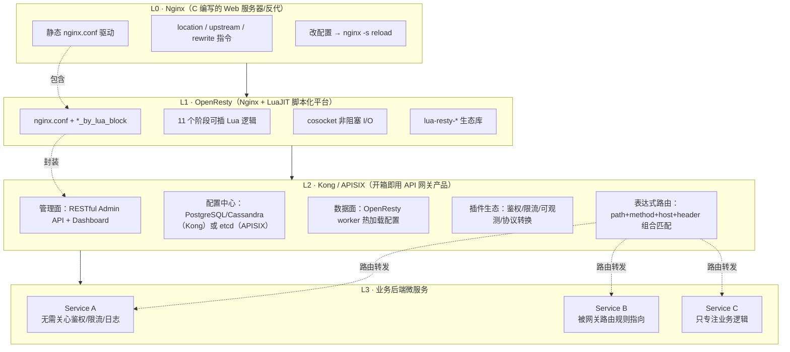
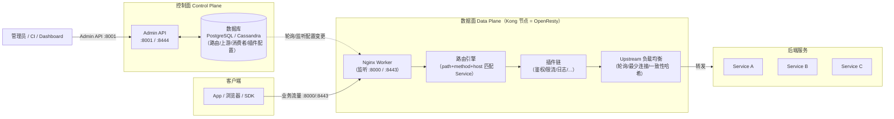
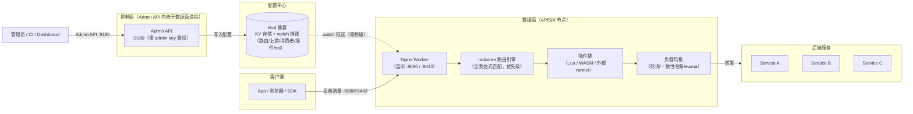
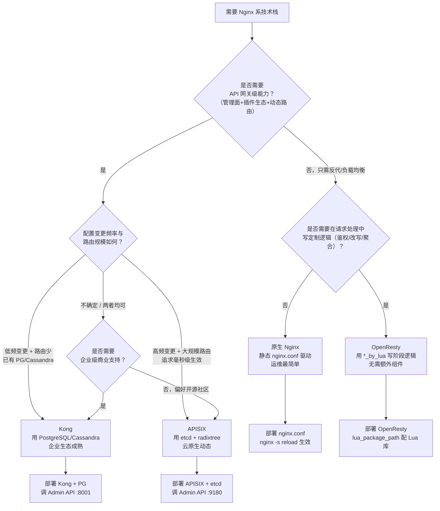
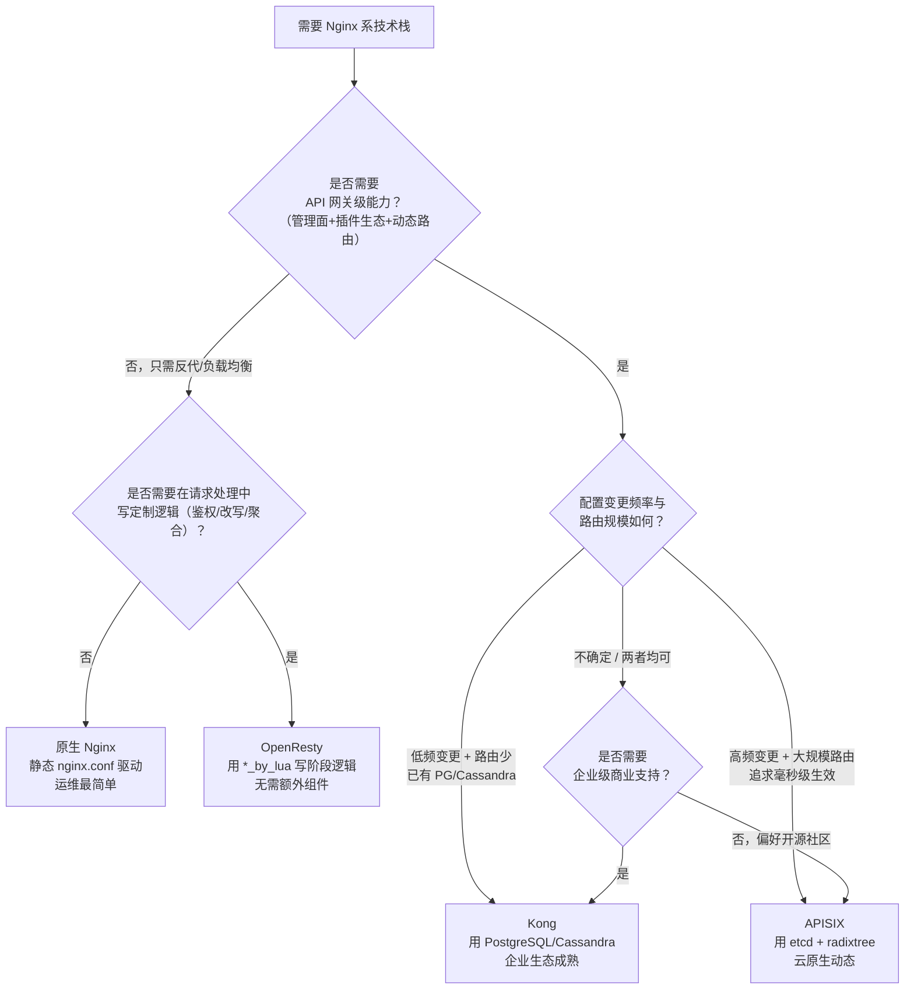

# 27 - 网关生态 Kong 与 APISIX

> **版本基线**：OpenResty 1.29.2.1（基于 Nginx 1.29.x + LuaJIT 2.1 + lua-nginx-module） | 创建日期：2026-08-05
> **受众**：后端开发熟手，熟悉 Lua 语言。本篇承接阶段七前序文档，从"自己写 OpenResty 插件"跃迁到"用现成的 API 网关产品"，把 Kong 与 APISIX 的架构、插件机制、选型差异一次讲透。

---

## 目录

- [1. 学习目标](#1-学习目标)
- [2. 核心知识点](#2-核心知识点)
  - [2.1 知识点一：从 Nginx 到 API 网关的演进](#21-知识点一从-nginx-到-api-网关的演进)
  - [2.2 知识点二：Kong 概述](#22-知识点二kong-概述)
  - [2.3 知识点三：Kong 插件机制](#23-知识点三kong-插件机制)
  - [2.4 知识点四：APISIX 概述](#24-知识点四apisix-概述)
  - [2.5 知识点五：APISIX 插件机制](#25-知识点五apisix-插件机制)
  - [2.6 知识点六：Kong vs APISIX 对比](#26-知识点六kong-vs-apisix-对比)
  - [2.7 知识点七：Nginx / OpenResty / Kong / APISIX 四者关系总结](#27-知识点七nginx--openresty--kong--apisix-四者关系总结)
  - [2.8 知识点八：其他基于 Nginx/OpenResty 的网关](#28-知识点八其他基于-nginxopenresty-的网关)
  - [2.9 知识点九：选型决策树](#29-知识点九选型决策树)
- [3. Mermaid 图汇总](#3-mermaid-图汇总)
- [4. 最佳实践](#4-最佳实践)
- [5. 常见踩坑引用](#5-常见踩坑引用)
- [6. 小结](#6-小结)

---

## 1. 学习目标

学完本篇，你应当能够：

- 用一句话说清 **Nginx → OpenResty → Kong/APISIX** 的递进包装关系，明白"网关产品"与"Web 服务器/脚本平台"的本质差异是**管理面 + 插件生态 + 开箱即用**。
- 画出 Kong 的**数据面 + 控制面**架构，说出 Kong 为什么用 PostgreSQL/Cassandra 做配置存储、它的 RESTful Admin API 如何驱动配置变更。
- 画出 APISIX 的架构，说出它用 **etcd 做配置中心**带来的"全动态、无重启"优势，以及它对 WASM/外部 plugin runner 的支持。
- 写出一个 **Kong 自定义插件骨架**（`schema.lua` + `handler.lua`，含 `PRIORITY`/`VERSION` 元表与 `access`/`header_filter`/`log` 阶段方法），并逐行解释。
- 写出一个 **APISIX 自定义插件骨架**（`schema.lua` + `handler.lua`，通过 Admin API 动态挂载到路由），理解它与 Kong 插件结构的高度相似性。
- 用对比表格从**架构、数据存储、路由方式、性能、插件语言、社区活跃度、学习曲线**七个维度区分 Kong 与 APISIX，并给出各自的适用场景。
- 理解一条核心结论：**网关的鉴权 / 限流 / 可观测性 / 协议转换等功能，本质上都是挂在 ngx_lua 各阶段的 Lua 插件实现**——掌握 OpenResty 阶段模型即可理解 Kong/APISIX 插件机制。
- 用一棵决策树判断"什么时候用原生 Nginx / 什么时候用 OpenResty / 什么时候用 Kong 或 APISIX"。

> **前置知识**：阅读本篇前，请确保已读完：
> - [22-OpenResty入门与架构](22-OpenResty入门与架构.md)——OpenResty 是什么、核心组件、cosocket 原理。
> - [23-Lua执行阶段详解](23-Lua执行阶段详解.md)——ngx_lua 的 12 类执行指令、阶段决定可用 API 子集。
> - [24-OpenResty核心API](24-OpenResty核心API.md)——`ngx.var` / `ngx.req` / `ngx.shared.DICT` / cosocket 等。
>
> 本篇不会重复讲解 OpenResty 的阶段模型与核心 API，而是在其上叠加"网关产品层"的认知。

---

## 2. 核心知识点

### 2.1 知识点一：从 Nginx 到 API 网关的演进

#### 演进的四层

一个常见的困惑是：既然 Kong 和 APISIX 都"基于 OpenResty"，那它们和 OpenResty 到底差在哪？为什么不直接用 OpenResty 写网关？答案藏在下面这条演进链里——每一层都在前一层之上**叠加了一层抽象**：

| 层级 | 产物 | 核心定位 | 配置方式 | 典型用户动作 |
|------|------|----------|----------|--------------|
| L0 | **Nginx** | 高性能 Web 服务器 / 反向代理 | 静态 `nginx.conf`，改完要 `nginx -s reload` | 写 location / upstream，手改配置文件 |
| L1 | **OpenResty** | 可被 Lua 脚本化的 Nginx 平台 | `nginx.conf` + Lua 代码（`*_by_lua_block`） | 用 Lua 写阶段逻辑，仍需 reload 生效新代码（`lua_code_cache on`） |
| L2 | **Kong / APISIX** | 开箱即用的 API 网关产品 | 管理面（Admin API / Dashboard），配置存数据库/etcd | HTTP 调 Admin API 增删路由与插件，**无需 reload** |
| L3 | **业务系统** | 你的后端服务 | 被 L2 的路由规则指向 | 正常写业务，不用关心网关细节 |

逐层解释：

1. **L0 Nginx**——纯粹的 C 写的 Web 服务器。它的一切行为由 `nginx.conf` 驱动，配置是**静态**的：新增一个 upstream、改一个 location 的 rewrite 规则，都要改文件并 `nginx -s reload`。它没有"管理面"概念，所有管理靠人工编辑文件 + 命令行信号。

2. **L1 OpenResty**——在 Nginx 上加 LuaJIT，让你能在请求处理各阶段写 Lua 逻辑。你获得了**可编程性**，但配置仍然是 `nginx.conf` 驱动：路由表、upstream 列表还是写死在配置文件里。OpenResty 给你的是"写网关的积木"，而不是"装好就能用的网关"。如果你要做一个动态路由网关，得自己写 Lua 去读数据库、自己设计 Admin API、自己管理配置变更——这正是 Kong/APISIX 帮你做好的事。

3. **L2 Kong / APISIX**——把 OpenResty 封装成一个**产品**。它们提供：
   - **管理面（Control Plane）**：一套 RESTful Admin API + 可选的 Dashboard，让你用 HTTP 请求增删路由、上游、消费者、插件，配置变更**不需要 reload Nginx**。
   - **数据面（Data Plane）**：运行中的 OpenResty/Nginx worker，监听配置中心（Kong 用 PostgreSQL/Cassandra，APISIX 用 etcd），配置一变就热加载到内存。
   - **插件生态**：鉴权（JWT/OAuth2/KeyAuth）、限流（rate-limiting）、可观测性（Prometheus/Zipkin/Opentelemetry）、协议转换（gRPC↔HTTP、SOAP↔REST）、日志（Kafka/HTTP/File）等几十个官方插件开箱即用。
   - **路由模型**：不再用 Nginx 的 `location` 前缀/正则匹配，而是用"路径 + 方法 + Host + Header"组合的**表达式路由**，支持优先级与动态权重。

4. **L3 业务系统**——你的后端微服务。它们不再需要各自实现鉴权、限流、日志、协议转换——这些横切关注点被上移到网关层统一处理。

#### Mermaid 图：Nginx → OpenResty → Kong/APISIX → 业务 四层关系



> **图解要点**：虚线箭头表示"包含/封装"关系，实线箭头表示数据/请求流向。从 L0 到 L2，每一层都在前一层之上叠加抽象，但**底层运行时始终是同一个 Nginx + LuaJIT**。你在 Kong/APISIX 里写的插件，最终跑在 OpenResty 的某个 `*_by_lua` 阶段里。

#### 特例说明

1. **Kong 3.x 起支持"无数据库模式"（DB-less mode）**：用声明式 YAML 文件替代数据库，配置变更需 reload。这适合"配置不怎么变、追求极简部署"的场景，但牺牲了动态性。APISIX 也有类似的 standalone 模式（配置写 YAML 文件），但主推的仍是 etcd 动态模式。

2. **APISIX 从 3.x 起底层不一定是"OpenResty 发行版"**：APISIX 可以直接基于 Nginx + lua-nginx-module + LuaJIT 编译（所谓 "apisix-base"），而非使用 OpenResty 官方发行版。但对外暴露的 Lua 编程模型与 OpenResty 完全一致，所以业界仍把它归为"OpenResty 生态"。

3. **并非所有 API 网关都基于 OpenResty**：Envoy（C++）、Tyk（Go）、KrakenD（Go）都不是 Nginx/OpenResty 系。本篇聚焦的是 OpenResty 系的 Kong 与 APISIX。

---

### 2.2 知识点二：Kong 概述

#### 定义

**Kong** 是 Kong Inc.（前身 Mashape）开源的高可用、可扩展 API Gateway，用 Lua 写在 OpenResty 之上。它的核心价值是把"做网关需要的那一堆事"——路由、鉴权、限流、日志、协议转换、健康检查、服务发现——做成**产品级开箱即用**的能力，并通过统一的 RESTful Admin API 暴露管理面。

#### 架构分层：数据面 + 控制面

Kong 的架构遵循经典的"数据面 / 控制面"分离：

| 平面 | 职责 | 组件 |
|------|------|------|
| **数据面（Data Plane）** | 处理真实业务流量：路由匹配、插件执行、上游转发 | OpenResty/Nginx worker 进程（Kong 节点） |
| **控制面（Control Plane）** | 接收管理请求、持久化配置、把配置分发给数据面 | Kong Admin API + 数据库（PostgreSQL 或 Cassandra） |
| **存储层** | 持久化路由/上游/消费者/插件配置 | PostgreSQL（默认，单机/集群）或 Cassandra（多机房） |

工作流程：

1. 管理员通过 `curl http://kong-admin:8001/services` 这样的 HTTP 请求调 Admin API，新增一条路由规则。
2. Kong 的 Admin API 把配置写入数据库（PostgreSQL/Cassandra）。
3. 数据面的 Kong 节点**轮询**数据库（PostgreSQL 模式）或**监听**数据库变更（Cassandra 模式），把新配置拉到内存。
4. 后续业务请求到达数据面节点时，按新配置路由并执行插件。
5. 全程**不重启 Nginx、不 reload**。

> **关键认知**：Kong 的数据面节点本身就是 OpenResty。你可以 `kong start` 后看到 Nginx worker 进程——那和直接跑 OpenResty 是同一套运行时，只是 Kong 往里注入了自己的 Lua 模块（路由引擎、插件加载器、DB 访问层）和配置。

#### Kong 的核心对象模型

Kong 用一组"对象"来组织配置，每个对象对应 Admin API 的一类资源：

| 对象 | 说明 | Admin API 路径 |
|------|------|----------------|
| **Service** | 一个上游后端服务（含 URL/scheme/host/port/protocol） | `/services` |
| **Route** | 一条路由规则，把入站请求匹配到某个 Service | `/services/{id}/routes` 或 `/routes` |
| **Consumer** | 一个 API 消费者（用户/应用），可挂凭证 | `/consumers` |
| **Plugin** | 插件配置实例，可挂在 Service/Route/Consumer/全局 | `/plugins` |
| **Upstream** | 负载均衡的 upstream 池（含多个 Target） | `/upstreams` |
| **Target** | upstream 里的一个后端实例（host:port + 权重） | `/upstreams/{id}/targets` |
| **Certificate** | TLS 证书（SNI 绑定） | `/certificates` |
| **Vault** | 3.x 引入的密钥/凭证后端抽象 | `/vaults` |

一个典型的"路由 + 鉴权 + 限流"配置链路：

```bash
# 1. 创建上游 Service（指向后端用户服务）
curl -s -X POST http://localhost:8001/services \
  -d "name=user-service" \
  -d "url=http://user-backend:8080"
# → 返回 {"id":"a1b2c3...","name":"user-service",...}

# 2. 创建 Route，把 /api/users/* 路径匹配到该 Service
curl -s -X POST http://localhost:8001/services/a1b2c3/routes \
  -d "name=users-route" \
  -d "paths[]=/api/users" \
  -d "methods[]=GET" \
  -d "methods[]=POST"
# → 返回 {"id":"r4d5e6...","paths":["/api/users"],...}

# 3. 给该 Route 挂一个 JWT 鉴权插件
curl -s -X POST http://localhost:8001/routes/r4d5e6/plugins \
  -d "name=jwt" \
  -d "config.claims_to_verify=exp"
# → 返回 {"id":"p7f8g9...","name":"jwt",...}

# 4. 给该 Route 挂一个 rate-limiting 限流插件（每分钟 100 次）
curl -s -X POST http://localhost:8001/routes/r4d5e6/plugins \
  -d "name=rate-limiting" \
  -d "config.minute=100"
# → 返回 {"id":"p0h1i2...","name":"rate-limiting","config":{"minute":100},...}

# 5. 创建 Consumer 并发 JWT 凭证
curl -s -X POST http://localhost:8001/consumers \
  -d "username=alice"
curl -s -X POST http://localhost:8001/consumers/alice/jwt \
  -d "key=alice-key" \
  -d "secret=alice-secret"
```

之后任何 `GET/POST /api/users/*` 请求到达 Kong，都要先过 JWT 鉴权、再受每分钟 100 次限流，通过后才转发到 `user-backend:8080`。

#### Mermaid 图：Kong 架构



> **图解要点**：左侧管理员通过 Admin API 写配置进数据库；数据面的 Kong 节点从数据库拉配置并热加载；客户端流量走数据面的 `:8000`（HTTP）/`:8443`（HTTPS），经路由 → 插件链 → 负载均衡后转发到后端。控制面与数据面通过数据库解耦，可以独立扩缩。

#### 特例说明

1. **Kong 的"数据库轮询"并非真轮询**：在 PostgreSQL 模式下，数据面节点默认每秒查一次 DB 的配置变更（可调 `db_update_frequency`）；在 Cassandra 模式下用的是 Cassandra 的原生变更通知。频繁写入配置时要注意 DB 压力。

2. **Kong 有"Kong Manager"和"Konnect"两种管理 UI**：开源版只有 Admin API + 基础 Dashboard；企业版（Kong Enterprise）有完整的 Kong Manager GUI；Konnect 是 Kong 的 SaaS 托管控制面，可统一管理多个数据面集群。

3. **Kong 3.x 引入了"表达式路由"（Expression Router）**：旧版 Kong 用 `paths[]`/`methods[]`/`hosts[]` 这种字段式匹配；3.x 起支持类似 APISIX 的表达式路由（`router_flavor=expressions`），能用更复杂的布尔表达式组合匹配条件。详见知识点八。

---

### 2.3 知识点三：Kong 插件机制

#### 插件 = Lua 模块，挂载在 ngx_lua 各阶段

这是理解 Kong（以及 APISIX）插件机制的**最核心一句话**。回顾 [23-Lua执行阶段详解](23-Lua执行阶段详解.md)：OpenResty 在 Nginx 的 11 个请求处理阶段里插入了 `rewrite_by_lua`、`access_by_lua`、`header_filter_by_lua`、`body_filter_by_lua`、`log_by_lua` 等 Lua 执行点。Kong 做的事情就是：

- **在 Nginx 配置里统一挂一个 Kong 的入口 Lua 脚本**（实际是 `kong.nginx.serve` 这套 C + Lua 入口），这个脚本在每个阶段会**遍历当前请求命中的所有插件的对应阶段方法**并依次执行。
- 一个 Kong 插件就是一个返回 table 的 Lua 模块，table 里有 `PRIORITY`、`VERSION` 元字段，以及可选的阶段方法 `access`、`rewrite`、`header_filter`、`body_filter`、`log` 等。
- 插件的执行顺序由 `PRIORITY` 决定（数字大的先执行），同优先级按插件名字字典序。

#### 插件的生命周期阶段

Kong 插件能挂的阶段与 ngx_lua 阶段一一对应：

| Kong 插件方法 | 对应 ngx_lua 阶段 | 典型用途 | 能否改写请求/响应 |
|--------------|------------------|----------|-------------------|
| `:init_worker()` | `init_worker_by_lua` | worker 启动时初始化（连外部服务、预热缓存） | 否（无请求上下文） |
| `:rewrite()` | `rewrite_by_lua` | 改写 URI / Host | 改请求 |
| `:access()` | `access_by_lua` | **鉴权、限流、请求改写**（最常用） | 改请求 |
| `:header_filter()` | `header_filter_by_lua` | 改响应头（加 trace-id、删 Server 头） | 改响应头 |
| `:body_filter()` | `body_filter_by_lua` | 改响应体（脱敏、注入脚本） | 改响应体 |
| `:log()` | `log_by_lua` | 上报日志（写 Kafka、发 metrics） | 否（响应已发出） |

> **与 OpenResty 阶段的对应关系**：你在 OpenResty 里写的 `access_by_lua_block { ... }`，等价于在 Kong 插件里写 `function MyPlugin:access(conf) ... end`。Kong 只是把"在 location 里写一段 Lua"换成了"在一个独立 Lua 模块里写阶段方法，再由 Kong 框架按插件配置动态加载执行"。底层执行机制完全一致——都是同一个 ngx_lua 阶段入口。

#### 自定义插件的结构：schema + handler

一个完整的 Kong 插件由两个 Lua 文件组成：

```
kong/plugins/my-plugin/
├── schema.lua      -- 插件配置的 schema 定义（字段名、类型、校验）
├── handler.lua     -- 插件逻辑（各阶段方法）
└── migrations/      -- （可选）数据库迁移，仅当插件需要存自己的表
    ├── 000_base_my_plugin.lua
    └── ...
```

- **`schema.lua`**：声明插件接受哪些配置字段，用 Lua table 描述字段名、类型、是否必填、默认值、校验函数。Kong 在 Admin API 收到 `/plugins` 请求时会用这个 schema 校验配置合法性。
- **`handler.lua`**：返回一个 table，里面是阶段方法。Kong 框架在请求命中该插件时，按阶段调用对应方法，并把当前插件的配置 `conf` 作为参数传进去。

#### 代码示例：Kong 插件骨架（含逐行注释）

**`schema.lua`**——定义插件配置：

```lua
-- 文件：kong/plugins/my-plugin/schema.lua
-- 作用：声明 my-plugin 插件接受哪些配置字段及其校验规则

-- 返回一个 table，描述配置 schema
return {
  -- name 必须与插件目录名一致（kong/plugins/<name>/）
  name = "my-plugin",

  -- fields：每个配置字段的定义
  fields = {
    -- 字段 1：enable_logging（是否开启日志）
    {
      enable_logging = {
        type = "boolean",       -- 类型：布尔
        required = false,       -- 非必填
        default = true,         -- 默认 true
      },
    },
    -- 字段 2：max_body_size（允许的最大请求体字节数）
    {
      max_body_size = {
        type = "number",        -- 类型：数字
        required = false,
        default = 1048576,      -- 默认 1MB
        -- 自定义校验函数：值必须 > 0
        validate = function(value)
          if value <= 0 then
            return nil, "max_body_size must be positive"
          end
          return true
        end,
      },
    },
    -- 字段 3：blocked_paths（被禁止的路径前缀列表）
    {
      blocked_paths = {
        type = "array",         -- 类型：数组
        required = false,
        default = {},
        -- 数组元素必须是字符串
        elements = { type = "string" },
      },
    },
  },
}
```

**`handler.lua`**——插件阶段逻辑：

```lua
-- 文件：kong/plugins/my-plugin/handler.lua
-- 作用：定义插件在各请求阶段的执行逻辑

-- 引入 Kong 提供的工具库（kong.* 命名空间在插件运行时由框架注入）
local kong = kong                                -- 全局 kong 表，提供 kong.request / kong.response / kong.service 等 API

-- 定义插件 table
local MyPlugin = {
  PRIORITY = 1000,       -- 优先级：数字越大越先执行（rate-limiting 默认 910，jwt 默认 1450）
  VERSION = "1.0.0",     -- 插件版本号
}

-- access 阶段：请求被转发到上游之前
-- 这是最常用的阶段，做鉴权、限流、请求改写
function MyPlugin:access(conf)
  -- conf 是该插件实例的配置（来自 schema.lua 定义的字段）

  -- 1. 检查请求路径是否在黑名单中
  local uri = kong.request.get_path()           -- 获取当前请求路径，如 "/api/users/123"
  if conf.blocked_paths then
    for _, prefix in ipairs(conf.blocked_paths) do
      -- 若 uri 以某个被禁前缀开头，直接返回 403
      if uri:sub(1, #prefix) == prefix then
        return kong.response.error(403, "Path is blocked by my-plugin")
      end
    end
  end

  -- 2. 检查请求体大小
  local content_length = tonumber(kong.request.get_header("Content-Length") or 0)
  if content_length and content_length > conf.max_body_size then
    return kong.response.error(413, "Request body too large")
  end

  -- 3. 注入一个自定义请求头，供上游服务读取
  kong.service.request.set_header("X-My-Plugin", "applied")
end

-- header_filter 阶段：上游响应头返回后、发给客户端之前
-- 用于改写响应头（加 trace-id、隐藏内部头）
function MyPlugin:header_filter(conf)
  if conf.enable_logging then
    -- 给响应加一个自定义头，标识经过了本插件
    kong.response.set_header("X-My-Plugin-Version", MyPlugin.VERSION)
  end
  -- 删除暴露上游实现细节的 Server 头
  kong.response.clear_header("Server")
end

-- log 阶段：响应已发回客户端后
-- 用于异步上报日志/指标，不影响响应延迟
function MyPlugin:log(conf)
  if not conf.enable_logging then
    return
  end
  -- 取请求耗时（Kong 内置计时）
  local latency = kong.log.get_latency()        -- 单位毫秒
  -- 输出到 Nginx error.log（生产应换成发到 Kafka/Prometheus）
  kong.log.debug("uri=", kong.request.get_path(), " latency=", latency, "ms")
end

-- 返回插件 table，Kong 框架据此注册到各阶段
return MyPlugin
```

> **逐行要点**：
> - `PRIORITY` 决定多个插件同时命中时的执行顺序。常用插件优先级参考：`correlation-id`(1)、`rate-limiting`(910)、`key-auth`(1250)、`jwt`(1450)、`acl`(950)。自定义插件设 1000 表示"比限流晚、比 jwt 早"。
> - `kong.request` / `kong.response` / `kong.service.request` 是 Kong 封装的请求/响应 API，比裸 `ngx.req` / `ngx.header` 更安全（自动处理阶段可用性）。
> - `access` 阶段里 `return kong.response.error(...)` 会**短路**后续插件与上游转发，直接返回错误响应。
> - `log` 阶段里**绝对不能**做阻塞 I/O（如同步写文件），否则会拖慢响应——Kong 的 `log` 阶段在响应发出后异步执行，但仍跑在 worker 协程里。

#### 启用自定义插件

写好插件后，在 `kong.conf` 里声明并重启：

```ini
# /etc/kong/kong.conf
plugins = bundled, my-plugin      # bundled 是官方插件包，逗号分隔追加自定义插件名
```

然后通过 Admin API 把它挂到某个 Route/Service 上：

```bash
curl -X POST http://localhost:8001/routes/{route-id}/plugins \
  -d "name=my-plugin" \
  -d "config.enable_logging=true" \
  -d "config.max_body_size=2097152" \
  -d "config.blocked_paths[]=/internal"
```

#### 特例说明

1. **`PRIORITY` 仅决定同阶段内插件顺序**：插件 A 的 `access` 与插件 B 的 `header_filter` 之间没有顺序关系——它们跑在不同阶段。优先级只在"同一阶段内多个插件"时生效。

2. **不是所有插件都要实现全部阶段**：很多插件只实现 `access`（如纯鉴权插件）或只实现 `log`（如纯日志上报插件）。未实现的方法 Kong 会跳过。

3. **Kong 3.x 起推荐用 `kong.*` PDK（Plugin Development Kit）**：旧版用 `ngx.*` 直接操作，新版统一用 `kong.request`/`kong.response`/`kong.service`/`kong.log` 等 PDK API，它们在阶段可用性、类型安全上做得更好。`ngx.*` 仍可用，但 PDK 是首选。

---

### 2.4 知识点四：APISIX 概述

#### 定义

**Apache APISIX** 是 Apache 软件基金会孵化的云原生 API 网关，同样基于 Nginx/OpenResty 与 lua-nginx-module。它与 Kong 的核心差异在**配置中心选型**：APISIX 用 **etcd** 做"单一事实源"，所有路由/上游/消费者/插件配置存在 etcd，数据面节点通过 etcd 的 **watch 机制**实时感知变更，做到了真正的**全动态、零重启**。

#### 核心特性

| 特性 | 说明 |
|------|------|
| **动态路由** | 路由通过 Admin API 写入 etcd，毫秒级生效，无需 reload |
| **热插拔插件** | 插件可动态启用/停用/改配置，不改 Nginx 配置 |
| **etcd 配置中心** | 用 etcd 的 KV + watch，天然支持多节点一致性 |
| **多语言插件** | 原生 Lua 插件 + WASM 插件（wasm-plugin）+ 外部 plugin runner（Go/Python/Java，通过 RPC） |
| **协议支持** | HTTP/HTTPS/HTTP2、gRPC、WebSocket、TCP/UDP（stream 代理）、Dubbo、Kafka、MQTT |
| **可观测性** | 内置 Prometheus、SkyWalking、Zipkin、Datadog、Opentelemetry 接入 |
| **Serverless** | 支持 AWS Lambda、Azure Function、Apache OpenWhisk 作为上游 |

#### 架构分层：数据面 + 控制面 + etcd

| 平面 | 职责 | 组件 |
|------|------|------|
| **数据面** | 处理业务流量 | APISIX 节点（基于 OpenResty / apisix-base 编译的 Nginx + Lua） |
| **控制面** | 接收 Admin API 请求、写入 etcd | APISIX Admin API（内嵌于数据面进程，监听 `:9180`） |
| **配置中心** | 持久化配置 + 变更通知 | etcd 集群 |

与 Kong 的关键差异：

- **Kong 的 Admin API 是独立进程**（与数据面同机但逻辑分离），配置写数据库；**APISIX 的 Admin API 内嵌于数据面进程**，配置直接写 etcd。
- **Kong 数据面"轮询"数据库**（PostgreSQL 模式秒级延迟）；**APISIX 数据面"watch" etcd**（毫秒级延迟）。
- etcd 的 watch 是**推送式**，配置变更几乎实时到达所有数据面节点；PostgreSQL 模式的轮询有 `db_update_frequency`（默认 1s）的延迟窗口。

#### Mermaid 图：APISIX 架构



> **图解要点**：Admin API 把配置写入 etcd；数据面节点通过 etcd watch 实时获取变更并热加载到内存；客户端流量走数据面 `:9080`/`:9443`，经 radixtree 路由 → 插件链 → 负载均衡后转发。对比 Kong 的"轮询数据库"，APISIX 的"watch etcd"延迟更低、扩展性更好。

#### APISIX 的核心对象模型

APISIX 的对象模型与 Kong 类似但有差异：

| 对象 | 说明 | Admin API 路径 |
|------|------|----------------|
| **Route** | 路由规则（uri + method + host + 插件 + 上游） | `/apisix/admin/routes/{id}` |
| **Upstream** | 负载均衡池（节点列表 + 算法 + 健康检查） | `/apisix/admin/upstreams/{id}` |
| **Service** | 一组路由的抽象（可复用插件配置） | `/apisix/admin/services/{id}` |
| **Consumer** | 消费者（挂凭证/插件） | `/apisix/admin/consumers/{username}` |
| **Plugin** | 插件配置（挂在 Route/Service/Consumer 上） | 随 Route/Service 一起配置 |
| **Plugin Config** | 插件配置组（可被多个 Route 复用） | `/apisix/admin/plugin_configs/{id}` |
| **Global Rule** | 全局路由规则（对所有请求生效） | `/apisix/admin/global_rules/{id}` |
| **SSL** | TLS 证书（SNI 绑定） | `/apisix/admin/ssl/{id}` |

一个 APISIX 路由配置示例（直接用 etcd 的 JSON 格式）：

```bash
# 创建一条路由：/api/users/* → user-backend:8080，带 jwt 鉴权 + 限流
curl -i http://127.0.0.1:9180/apisix/admin/routes/1 \
  -H 'X-API-KEY: edd1c9f03434132e5f29d0b8c1d05d1a' \
  -X PUT -d '
{
  "uri": "/api/users/*",
  "methods": ["GET", "POST"],
  "plugins": {
    "jwt-auth": {},
    "limit-count": {
      "count": 100,
      "time_window": 60,
      "rejected_code": 429,
      "key_type": "var",
      "key": "consumer_name"
    }
  },
  "upstream": {
    "type": "roundrobin",
    "nodes": {
      "user-backend:8080": 1
    }
  }
}'
```

这条配置写入 etcd 后，所有 APISIX 数据面节点在毫秒级内生效。

#### 特例说明

1. **APISIX 的路由匹配用 radixtree**：APISIX 用 C 实现的基数树（radixtree）做路由匹配，比 Kong 旧版逐条遍历路由的方式快。APISIX 支持 `uri` 精确/前缀/正则三种匹配，以及 `vars`（Nginx 变量条件）组合表达式。

2. **APISIX 3.x 起插件配置有"插件级"的 enable/disable**：可通过 `/_/upstreams`、`/_/routes` 这种内部 API 动态启停插件而不删配置，方便灰度。

3. **APISIX Standalone 模式**：若不想部署 etcd，可用 standalone 模式，配置写 YAML 文件（`apisix.yaml`），APISIX 监听文件变更自动 reload。适合配置基本不变的边缘部署。

---

### 2.5 知识点五：APISIX 插件机制

#### 插件结构（与 Kong 高度相似）

APISIX 的自定义插件同样是 `schema.lua` + `handler.lua` 两文件，目录结构：

```
apisix/plugins/my-plugin/
├── schema.lua      -- 配置 schema（用 jsonschema 风格描述）
└── handler.lua     -- 阶段逻辑（与 Kong 同名阶段方法）
```

#### APISIX 与 Kong 插件写法的差异

| 维度 | Kong | APISIX |
|------|------|--------|
| **元表字段** | `PRIORITY` / `VERSION` | `priority` / `version` / `name` |
| **schema 风格** | Lua table + 自定义 validate | jsonschema 风格（APISIX 用 `jsonschema` 库校验） |
| **请求/响应 API** | `kong.request` / `kong.response` PDK | `core.request` / `core.response`（APISIX core 库） |
| **阶段方法名** | `access` / `rewrite` / `header_filter` / `body_filter` / `log` | 同名（`access` / `rewrite` / `header_filter` / `body_filter` / `log`） |
| **配置获取** | 方法第一个参数 `conf` | 方法第一个参数 `conf`，可用 `plugin_conf` 拿插件级配置 |

#### 代码示例：APISIX 插件骨架（含逐行注释）

**`schema.lua`**：

```lua
-- 文件：apisix/plugins/my-plugin/schema.lua
-- 作用：定义 my-plugin 的配置 schema（jsonschema 风格）

local schema = {
  type = "object",
  properties = {
    -- 字段 1：是否开启日志
    enable_logging = {
      type = "boolean",
      default = true,
    },
    -- 字段 2：最大请求体字节数
    max_body_size = {
      type = "integer",
      minimum = 1,
      default = 1048576,            -- 默认 1MB
    },
    -- 字段 3：被禁路径前缀数组
    blocked_paths = {
      type = "array",
      items = { type = "string" },
      default = {},
    },
  },
}

return schema
```

**`handler.lua`**：

```lua
-- 文件：apisix/plugins/my-plugin/handler.lua
-- 作用：定义插件在各阶段的执行逻辑

local plugin_name = "my-plugin"

-- 引入 APISIX core 库（APISIX 运行时注入 _M.pkgpath 路径）
local core = require("apisix.core")             -- 提供 core.request / core.response / core.log 等

-- 定义插件 table
local _M = {
  version = "1.0.0",                            -- 插件版本
  priority = 1000,                              -- 优先级：数字大的先执行
  name = plugin_name,                           -- 插件名（与目录名一致）
}

-- schema 暴露给框架
local schema = require("apisix.plugins.my-plugin.schema")
_M.schema = schema

-- access 阶段：请求转发到上游之前
function _M.access(conf, ctx)
  -- conf：该插件实例配置
  -- ctx：请求级上下文 table，可在阶段间传递数据

  -- 1. 检查路径黑名单
  local uri = core.request.get_uri(ctx)         -- 取当前请求 URI
  if conf.blocked_paths then
    for _, prefix in ipairs(conf.blocked_paths) do
      if core.string.has_prefix(uri, prefix) then
        -- 返回 403，直接终止请求
        return 403, { message = "Path is blocked by my-plugin" }
      end
    end
  end

  -- 2. 检查请求体大小
  local content_length = tonumber(core.request.header(ctx, "Content-Length") or 0)
  if content_length and content_length > conf.max_body_size then
    return 413, { message = "Request body too large" }
  end

  -- 3. 注入自定义请求头给上游
  core.request.set_header(ctx, "X-My-Plugin", "applied")

  -- 4. 在 ctx 存一个值，供 log 阶段使用
  ctx.my_plugin_start_time = ngx.now()
end

-- header_filter 阶段：上游响应头返回后
function _M.header_filter(conf, ctx)
  if conf.enable_logging then
    core.response.set_header("X-My-Plugin-Version", _M.version)
  end
end

-- log 阶段：响应已发回客户端
function _M.log(conf, ctx)
  if not conf.enable_logging then
    return
  end
  -- 计算本插件记录的耗时
  local elapsed = ngx.now() - (ctx.my_plugin_start_time or ngx.now())
  core.log.warn("uri=", core.request.get_uri(ctx), " plugin_elapsed=", elapsed * 1000, "ms")
end

return _M
```

> **逐行要点**：
> - APISIX 用 `local _M = { ... }` 而非 Kong 的 `local MyPlugin = { ... }`，命名约定是 `_M`。
> - `require("apisix.core")` 引入 APISIX 的核心库，提供 `core.request`/`core.response`/`core.log`/`core.string` 等工具，等价于 Kong 的 `kong.*` PDK。
> - `access` 方法签名是 `function _M.access(conf, ctx)`，第二个参数 `ctx` 是请求级上下文，可在阶段间传递数据（Kong 用 `kong.ctx.shared`）。
> - `access` 里 `return 403, { message = "..." }` 表示直接返回该状态码和 JSON body，终止请求。

#### 启用自定义插件

在 `config.yaml` 里声明插件：

```yaml
# /usr/local/apisix/conf/config.yaml
apisix:
  admin_key:
    - name: admin
      key: edd1c9f03434132e5f29d0b8c1d05d1a
      role: admin
plugins:                          # 启用的插件列表
  - my-plugin                    # 自定义插件
  - jwt-auth
  - limit-count
```

重启 APISIX 后，通过 Admin API 动态挂到路由：

```bash
curl http://127.0.0.1:9180/apisix/admin/routes/1 \
  -H 'X-API-KEY: edd1c9f03434132e5f29d0b8c1d05d1a' \
  -X PUT -d '
{
  "uri": "/api/*",
  "plugins": {
    "my-plugin": {
      "enable_logging": true,
      "max_body_size": 2097152,
      "blocked_paths": ["/internal"]
    }
  },
  "upstream": { "type": "roundrobin", "nodes": { "backend:8080": 1 } }
}'
```

#### 特例说明

1. **APISIX 插件的 `ctx` 参数是 per-request 的**：每个请求都会新建一个 `ctx` table，阶段方法间通过它传值。这与 Kong 的 `kong.ctx.shared` 不同——Kong 把上下文分成 `kong.ctx.shared`（请求级，插件间共享）和 `ngx.ctx`（原生 OpenResty 上下文）。

2. **APISIX 支持插件级配置 `plugin_conf`**：除了每路由的 `conf`，还有全局插件配置 `plugin_conf`，用于配置插件本身的行为（如 `jwt-auth` 的全局签名算法）。这与 Kong 的"全局插件"（挂在 `/plugins` 不绑定 Route/Service）类似。

3. **APISIX 的 WASM 插件**：从 2.15 起支持用 WASM 写插件（通过 `wasm-plugin` 机制），可用 Rust/Go/AssemblyScript 编译成 `.wasm` 后加载。WASM 插件运行在独立沙箱，不直接访问 Lua API，通过宿主提供的 host functions 交互。性能略低于原生 Lua，但隔离性更好、语言选择更广。

---

### 2.6 知识点六：Kong vs APISIX 对比

#### 对比表格

| 维度 | Kong | APISIX |
|------|------|--------|
| **底层运行时** | OpenResty（Nginx + LuaJIT + lua-nginx-module） | Nginx + lua-nginx-module + LuaJIT（apisix-base，可选 OpenResty） |
| **配置存储** | PostgreSQL（默认）/ Cassandra / DB-less（YAML） | etcd（默认）/ Standalone（YAML） |
| **配置同步机制** | 数据库轮询（PostgreSQL，默认 1s）/ Cassandra 变更通知 | etcd watch（推送式，毫秒级） |
| **路由引擎** | 传统字段式匹配（paths/methods/hosts）+ 3.x 表达式路由 | radixtree（C 实现，全表达式匹配） |
| **路由匹配性能** | 路由数多时线性扫描（3.x 表达式路由改善） | radixtree O(路径长度)，大规模路由更优 |
| **Admin API 端口** | 8001（HTTP）/ 8444（HTTPS） | 9180（HTTP，需 admin key） |
| **数据面端口** | 8000 / 8443 | 9080 / 9443 |
| **插件语言** | Lua（原生）+ Go（外部 plugin runner，go-pluginserver） | Lua（原生）+ WASM + 外部 plugin runner（Go/Python/Java） |
| **插件数量（官方）** | 50+（社区版）/ 100+（企业版） | 80+（社区版，含协议、可观测、Serverless） |
| **协议支持** | HTTP/HTTPS、gRPC、WebSocket、TCP/UDP（stream） | HTTP/HTTPS/HTTP2、gRPC、WebSocket、TCP/UDP、Dubbo、Kafka、MQTT |
| **管理 UI** | Kong Manager（企业版）/ 开源版仅基础 Dashboard | APISIX Dashboard（独立项目，Apache）+ APISIX Ingress Controller |
| **云原生集成** | Kong Ingress Controller（K8s） | APISIX Ingress Controller（K8s，功能更全） |
| **社区活跃度** | Kong Inc. 主导，企业驱动，生态成熟 | Apache 基金会孵化，社区驱动，国内贡献者多 |
| **学习曲线** | 文档完善，PDK 设计清晰，上手平缓 | 文档中英文齐全，配置偏 JSON 风格，需熟悉 etcd |
| **性能（开源基准）** | 高（OpenResty 基底） | 略高于 Kong（radixtree + etcd watch 架构开销低） |
| **许可证** | Apache 2.0（社区版） | Apache 2.0 |

#### 各自的适用场景

**选 Kong 的场景**：
- 已有 PostgreSQL/Cassandra 基础设施，不想引入 etcd。
- 需要成熟的企业级支持（Kong Enterprise 有 Kong Manager、OIDC、Vault 等企业特性）。
- 团队偏好"字段式路由配置"的直观性，路由规则不极端多。
- 有大量 Kong 生态的历史积累（已有 Kong 插件、已有运维经验）。
- 需要与 Konnect（SaaS 控制面）做多集群统一管理。

**选 APISIX 的场景**：
- 追求配置变更的极致低延迟（毫秒级生效）。
- 路由规模大（数万条），需要 radixtree 的高效匹配。
- 需要 gRPC/Dubbo/Kafka/MQTT 等多元协议网关。
- 偏好 Apache 基金会治理的开源项目，避免厂商锁定。
- 想用 WASM 或多语言写插件。
- Kubernetes 生态深度集成（APISIX Ingress Controller 功能丰富）。
- 国内团队，社区文档和响应更友好。

#### 选型建议

1. **中小规模 + 简单网关需求**：两者都行，看团队对 etcd 的接受度。若已有 PG，选 Kong 省一个组件；若追求动态性，选 APISIX。

2. **大规模 + 高频配置变更**：APISIX 更优。etcd watch 的毫秒级同步和 radixtree 的高效匹配在大规模场景优势明显。

3. **企业级 + 需要商业支持**：Kong Enterprise 更成熟，有 OIDC/双向 TLS/数据平面联邦等企业特性。

4. **云原生 + K8s 优先**：APISIX Ingress Controller 与 K8s CRD 集成更深，APISIX 在云原生场景更活跃。

5. **多语言插件需求**：APISIX 的 WASM 支持更成熟；Kong 的 go-pluginserver 也可用但生态较小。

> **一句话**：Kong 更"企业稳重"，APISIX 更"云原生敏捷"。两者底层都是 OpenResty，技术栈相通，掌握其一可较快切换。

---

### 2.7 知识点七：Nginx / OpenResty / Kong / APISIX 四者关系总结

#### 递进包装关系

这四者不是"替代"关系，而是"递进包装"关系——每一层都在前一层之上叠加抽象，但底层运行时始终是同一个 Nginx + LuaJIT：

```
┌─────────────────────────────────────────────────────┐
│  Kong / APISIX  ← 产品级网关（管理面+插件生态+动态路由）│
│  ┌───────────────────────────────────────────────┐  │
│  │  OpenResty  ← 可脚本化平台（LuaJIT+cosocket）  │  │
│  │  ┌─────────────────────────────────────────┐  │  │
│  │  │  Nginx  ← 高性能 Web 服务器/反代（C）     │  │  │
│  │  └─────────────────────────────────────────┘  │  │
│  └───────────────────────────────────────────────┘  │
└─────────────────────────────────────────────────────┘
```

- 你在 Kong/APISIX 里写的插件，最终跑在 OpenResty 的 `access_by_lua` / `header_filter_by_lua` 等阶段里。
- OpenResty 的 Lua 代码，最终由 Nginx worker 进程里的 LuaJIT 虚拟机执行。
- Nginx 的事件循环（epoll/kqueue）是这一切的基石——Lua 协程让出后，Nginx 继续处理其他连接。

#### 核心结论

> **网关的鉴权 / 限流 / 可观测性 / 协议转换等功能，本质上都是挂在 ngx_lua 各阶段的 Lua 插件实现。**

具体映射：

| 网关功能 | 本质 | 对应 ngx_lua 阶段 |
|----------|------|-------------------|
| 鉴权（JWT/OAuth2/KeyAuth） | 读请求头/参数 → 校验签名/查凭证 → 不通过则 `ngx.exit(401)` | `access_by_lua` |
| 限流（rate-limiting） | 用 `ngx.shared.DICT` 做计数 → 超限则 `ngx.exit(429)` | `access_by_lua` |
| 请求改写（重写 URI/Header） | `ngx.req.set_uri` / `ngx.req.set_header` | `rewrite_by_lua` |
| 响应改写（加 trace-id/删头） | `ngx.header.xxx = ...` | `header_filter_by_lua` |
| 日志上报（Kafka/Prometheus） | `ngx.log` + cosocket 异步发到后端 | `log_by_lua` |
| 协议转换（gRPC↔HTTP） | 读 gRPC → 用 `ngx.location.capture` 或 cosocket 调 HTTP | `access_by_lua` + `content_by_lua` |
| 健康检查 | `ngx.timer.every` 定时探活 + 写 `ngx.shared.DICT` | `init_worker_by_lua`（timer） |
| 动态负载均衡 | `balancer_by_lua` 读共享内存里的节点列表选 peer | `balancer_by_lua` |

这意味着：**掌握 OpenResty 阶段模型与核心 API，即可理解 Kong/APISIX 的全部插件机制**。Kong/APISIX 做的是"产品化封装"——把"你要自己写 Lua 做的事"封装成"调 Admin API 配置插件"，但底层执行机制完全一致。

#### 四者定位总结表

| 维度 | Nginx | OpenResty | Kong | APISIX |
|------|-------|-----------|------|--------|
| **定位** | Web 服务器/反代 | 可脚本化 Web 平台 | API 网关产品 | API 网关产品 |
| **配置方式** | 静态 nginx.conf | nginx.conf + Lua | Admin API + DB | Admin API + etcd |
| **可编程性** | 无（仅指令） | Lua 全阶段可写 | Lua 插件（PDK） | Lua/WASM/外部 runner 插件 |
| **动态性** | 需 reload | 需 reload（代码） | 动态配置（轮询 DB） | 动态配置（watch etcd） |
| **管理面** | 无 | 无 | Admin API + Dashboard | Admin API + Dashboard |
| **插件生态** | 无（仅 C 模块） | lua-resty-* 库 | 50+ 官方插件 | 80+ 官方插件 |
| **适用场景** | 简单反代/负载均衡 | 需要定制 Lua 逻辑 | 企业级 API 网关 | 云原生动态 API 网关 |
| **学习曲线** | 平缓 | 中等（需懂 Lua+阶段） | 中等（懂 OpenResty 后易上手） | 中等（懂 OpenResty 后易上手） |
| **运维复杂度** | 低 | 低 | 中（需 DB） | 中（需 etcd） |

#### 特例说明

1. **"掌握 OpenResty 即可理解 Kong/APISIX 插件"不等于"会写 OpenResty 就会运维 Kong/APISIX"**：理解插件机制是开发视角；运维 Kong/APISIX 还要懂数据库/etcd 运维、Admin API 鉴权、Ingress Controller 部署、多集群联邦等产品级知识。

2. **Kong/APISIX 的插件不仅是 Lua**：Kong 有 go-pluginserver，APISIX 有 WASM。但无论用什么语言写，最终都通过"宿主（OpenResty）+ 阶段回调"的方式接入——底层阶段模型不变。

---

### 2.8 知识点八：其他基于 Nginx/OpenResty 的网关

#### APISIX 的 WASM 插件支持

APISIX 从 2.15 版本起支持用 WebAssembly（WASM）编写插件，底层基于 `wasm-nginx-module`（APISIX 团队贡献）。机制如下：

- 插件用 Rust/Go/AssemblyScript 等语言编写，编译成 `.wasm` 文件。
- APISIX 通过 `wasm-plugin` 配置加载 `.wasm`，在 Wasmtime/WasmEdge 运行时里执行。
- WASM 插件通过宿主提供的 host functions 与 APISIX 交互（读请求头、写响应、记日志），运行在沙箱里，不直接访问 Lua API。

优势：
- 语言无关（不限于 Lua）。
- 沙箱隔离，插件崩溃不影响数据面进程。
- 可移植（同一 `.wasm` 可在支持 WASM 的其他网关运行）。

劣势：
- 性能略低于原生 Lua（有沙箱开销）。
- 生态较新，可用 host functions 仍在完善。

配置示例：

```yaml
# config.yaml
wasm:
  plugins:
    - name: my-wasm-plugin
      priority: 799
      file: /path/to/my_plugin.wasm
```

```bash
# 通过 Admin API 挂到路由
curl http://127.0.0.1:9180/apisix/admin/routes/1 \
  -H 'X-API-KEY: edd1c9f03434132e5f29d0b8c1d05d1a' \
  -X PUT -d '
{
  "uri": "/api/*",
  "plugins": {
    "my-wasm-plugin": { "greeting": "hello" }
  },
  "upstream": { "type": "roundrobin", "nodes": { "backend:8080": 1 } }
}'
```

#### Kong 的表达式路由

Kong 3.x 引入了 **Expression Router**（表达式路由），通过 `router_flavor=expressions` 配置启用。它不再是 `paths[]`/`methods[]`/`hosts[]` 这种字段式匹配，而是用一个类 CEL（Common Expression Language）的布尔表达式描述匹配条件：

```bash
# 启用表达式路由（kong.conf）
router_flavor = expressions

# 通过 Admin API 创建一条表达式路由
curl -X POST http://localhost:8001/routes \
  -d "name=expr-route" \
  -d "expression=http.path == \"/api/v1/users\" && http.method == \"GET\" && http.headers.host == \"api.example.com\""
```

表达式路由的优势：
- 能用 `&&` / `||` 组合任意条件，比字段式灵活。
- 路由匹配用优化后的表达式引擎，大规模路由性能更好。
- 与 APISIX 的 `vars` 表达式路由能力对齐。

劣势：
- 旧配置（字段式）需迁移到表达式格式。
- 表达式语法有学习成本。

#### 其他 OpenResty 系网关/产品

- **3scale APIcast**：Red Hat 3scale 的网关组件，基于 OpenResty，与 Kong 类似的插件模型，但生态较小。
- **APISIX Dashboard / APISIX Ingress Controller**：APISIX 的配套管理面与 K8s 集成组件，本身不是独立网关。
- **Kong Mesh / Kong Ingress Controller**：Kong 的服务网格与 K8s Ingress 实现，底层仍是 Kong 网关。
- **Apache APISIX Standalone**：APISIX 的无 etcd 模式，配置写 YAML，适合边缘/轻量部署。

> 本知识点仅做概览，不深入。如需实践 WASM 插件或表达式路由，请查阅对应官方文档。

---

### 2.9 知识点九：选型决策树

#### 决策原则

选择"用哪一层"的核心问题是：**你需要多少动态性、多少产品化封装、多少运维复杂度**。原则是**用能满足需求的最简单那一层**——不要为了"显得先进"而用网关产品去解决一个 `nginx.conf` 就能搞定的问题。

| 你的需求 | 推荐选择 | 理由 |
|----------|----------|------|
| 简单反向代理 / 静态资源 / 基础负载均衡 | **原生 Nginx** | 配置即代码，运维简单，无需 Lua |
| 需要定制鉴权/限流逻辑，但路由规则少且稳定 | **OpenResty** | 用 Lua 写阶段逻辑，省去 DB/etcd 运维 |
| 需要完整 API 网关功能（管理面+插件生态+动态路由） | **Kong 或 APISIX** | 开箱即用，省去自研网关的工程量 |
| 已有 PG/Cassandra，偏好企业支持 | **Kong** | 复用现有 DB 基础设施 |
| 追求毫秒级配置生效、大规模路由、云原生 | **APISIX** | etcd watch + radixtree 优势 |

#### Mermaid 决策流程图



> **图解要点**：第一个分叉是"是否需要网关级能力"——这决定了是用 L0/L1（Nginx/OpenResty）还是 L2（Kong/APISIX）。第二个分叉是"是否需要定制 Lua 逻辑"——决定了用原生 Nginx 还是 OpenResty。第三个分叉是网关内部的 Kong/APISIX 选型，核心判据是配置动态性与路由规模。

#### 特例说明

1. **"用最简单那一层"不绝对**：有些团队即便需求简单也选 Kong/APISIX，是为了未来扩展性（先上网关，后加插件）。但要权衡运维复杂度——引入 Kong 就要运维 PG，引入 APISIX 就要运维 etcd。

2. **混合使用是常态**：很多架构是"边缘用原生 Nginx 做 TLS 终止 + 静态资源，内部用 APISIX 做 API 网关，某些微服务侧边用 OpenResty 做定制逻辑"。不必非此即彼。

3. **Ingress 场景的特殊性**：在 Kubernetes 里，APISIX Ingress Controller 和 Kong Ingress Controller 都把 K8s CRD 转成网关配置，选型更多看 CRD 生态与团队 K8s 熟练度，而非纯网关能力。

---

## 3. Mermaid 图汇总

本篇共 4 张关键 Mermaid 图，集中展示如下（内容与上文一致，便于快速查阅）。

### 3.1 Nginx → OpenResty → Kong/APISIX → 业务 四层关系图


### 3.2 Kong 架构图


### 3.3 APISIX 架构图


### 3.4 选型决策树



---

## 4. 最佳实践

### 4.1 插件优先级规划

多个插件同时命中一条路由时，执行顺序由 `PRIORITY` 决定。建议按"功能类别"规划优先级区间，避免插件互相踩踏：

| 优先级区间 | 功能类别 | 示例 |
|-----------|----------|------|
| 2000+ | 追踪/上下文注入 | correlation-id、trace-id 生成 |
| 1400-1900 | 鉴权 | jwt-auth、key-auth、oauth2 |
| 900-1300 | 访问控制 | acl、ip-restriction |
| 700-899 | 限流/熔断 | rate-limiting、proxy-cache |
| 500-699 | 请求/响应改写 | request-transformer、response-transformer |
| 100-499 | 协议转换 | grpc-gateway、grpc-web |
| 1-99 | 日志/可观测性 | prometheus、zipkin、http-log（log 阶段，顺序影响小） |

> **原则**：追踪/鉴权类要先跑（没通过鉴权的请求不应消耗限流配额）；日志类放最后（log 阶段不参与请求转发，顺序影响小）。

### 4.2 配置变更走 Admin API，不走数据库直改

无论是 Kong 还是 APISIX，配置变更都应通过 Admin API，而非直接写数据库/etcd。原因：
- Admin API 会做 schema 校验，直写 DB/etcd 可能写入非法配置导致数据面加载失败。
- Admin API 会触发配置版本号更新，确保所有数据面节点感知变更。
- 审计日志走 Admin API 才能记录"谁在什么时候改了什么"。

### 4.3 插件里避免阻塞 I/O

Kong/APISIX 插件跑在 OpenResty 的 ngx_lua 阶段，**绝对不能使用阻塞 I/O**（标准 Lua 的 `io.open`、`luasocket`、通过 FFI 调阻塞 C 库）。所有网络操作必须用 cosocket（`ngx.socket.tcp`）或框架封装的 PDK API（`kong.log` / `core.log` 内部走 cosocket）。阻塞 I/O 会让整个 worker 卡住，影响该 worker 上所有请求。

### 4.4 共享状态用 shared dict，不用全局变量

插件要在请求间共享数据（如限流计数、配置缓存），用 `ngx.shared.DICT`（Kong/APISIX 都预定义了若干 shared dict）。不要用 Lua 全局变量——全局变量在 worker 间不共享（每个 worker 有独立 Lua State），且 `lua_code_cache on` 时全局变量在 reload 后才更新，容易导致状态不一致。

### 4.5 路由配置加版本与灰度

生产环境路由变更应走灰度：
- 用 APISIX 的 `Plugin Config` 或 Kong 的全局插件做灰度开关。
- 新路由先挂低权重（如 1%），观察 metrics 无异常后调到 100%。
- 配置变更走 CI/CD（Terraform / declarative config），留存版本历史，支持回滚。

### 4.6 监控数据面与控制面分离告警

Kong/APISIX 的故障有两类：
- **数据面故障**：worker 崩溃、连接打满、上游不可达 → 监控 Nginx 指标（active connections、request rate、upstream 5xx）。
- **控制面故障**：数据库/etcd 不可达、Admin API 超时、配置同步延迟 → 监控 DB/etcd 健康、配置同步 lag。

两类故障的处置方式不同，告警应分开，避免数据面正常但控制面故障时误判。

---

## 5. 常见踩坑引用

本篇无直接关联的专属踩坑，引用通用踩坑记录（见 [99-踩坑记录与解决方案](../99-踩坑记录与解决方案.md)）：

- **踩坑 `#1.7` if is evil**：Kong/APISIX 插件里用 Lua 原生 `if` 替代 Nginx 配置级 `if`，避免 `if` 嵌套导致的不可预测行为。在 OpenResty 系网关里，所有条件逻辑都应在 Lua 代码里写，不要在 `nginx.conf` 用 `if`。
- **阻塞 I/O 拖垮 worker**：插件里误用 `io.open` / `luasocket` / 阻塞 FFI 调用，导致 worker 卡死。所有网络/文件操作必须用 cosocket 或框架 PDK。
- **shared dict 容量打满**：限流计数或缓存写满 `ngx.shared.DICT` 的 `lru_state`，导致计数丢失。需根据 QPS 与 TTL 合理设置 shared dict 的 `size`。
- **插件 PRIORITY 冲突**：自定义插件与官方插件 PRIORITY 相同导致顺序不确定（同优先级按名字字典序，但易被忽略）。规划优先级区间见 4.1。
- **配置同步延迟误判故障**：Kong 的 PostgreSQL 模式有 1s 轮询延迟，紧急改配置后以为"已生效"但实际还在传播，导致误判。APISIX 的 etcd watch 虽快，但跨机房 etcd 同步仍有延迟。

---

## 6. 小结

本篇把 Nginx 系技术栈从"Web 服务器"到"API 网关产品"的演进一次讲透：

1. **四层递进**：Nginx（静态 Web 服务器）→ OpenResty（可脚本化平台）→ Kong/APISIX（开箱即用网关产品）→ 业务后端。每一层在前一层之上叠加抽象，底层运行时始终是 Nginx + LuaJIT。

2. **Kong 的核心**：基于 OpenResty，用 PostgreSQL/Cassandra 做配置存储，Admin API 驱动配置变更，数据面节点轮询数据库热加载。插件是 Lua 模块，挂 ngx_lua 各阶段，用 `schema.lua` + `handler.lua` 两文件组织。

3. **APISIX 的核心**：同样基于 OpenResty，但用 etcd 做配置中心，通过 watch 机制实现毫秒级配置生效；路由用 radixtree 高效匹配；插件支持 Lua/WASM/外部 runner 多语言。

4. **选型核心判据**：简单反代用原生 Nginx；需要定制 Lua 逻辑用 OpenResty；需要完整网关能力（管理面+插件生态+动态路由）用 Kong 或 APISIX；Kong 偏企业稳重（PG 基础设施、商业支持），APISIX 偏云原生敏捷（etcd 动态、radixtree 高效、WASM 多语言）。

5. **一条贯穿全篇的结论**：**网关的鉴权/限流/可观测性/协议转换等功能，本质上都是挂在 ngx_lua 各阶段的 Lua 插件实现**。掌握 OpenResty 的阶段模型与核心 API（见 [23-Lua执行阶段详解](23-Lua执行阶段详解.md)、[24-OpenResty核心API](24-OpenResty核心API.md)），即可理解 Kong/APISIX 的全部插件机制——它们只是把"自己写 Lua"封装成了"调 Admin API 配置插件"，底层执行机制完全一致。

至此，阶段七"OpenResty 与 Lua 插件"从"会用 OpenResty"到"看懂网关产品"的链路闭合。下一篇将进入实战，讲解如何在 OpenResty/Kong/APISIX 上从零编写一个生产级限流插件。
