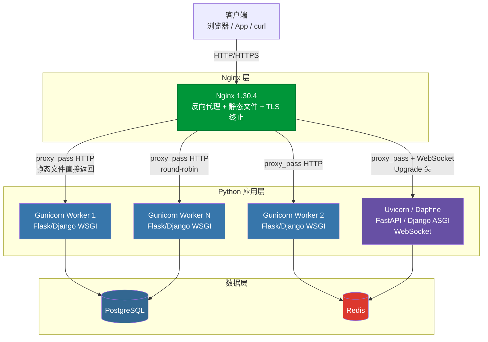
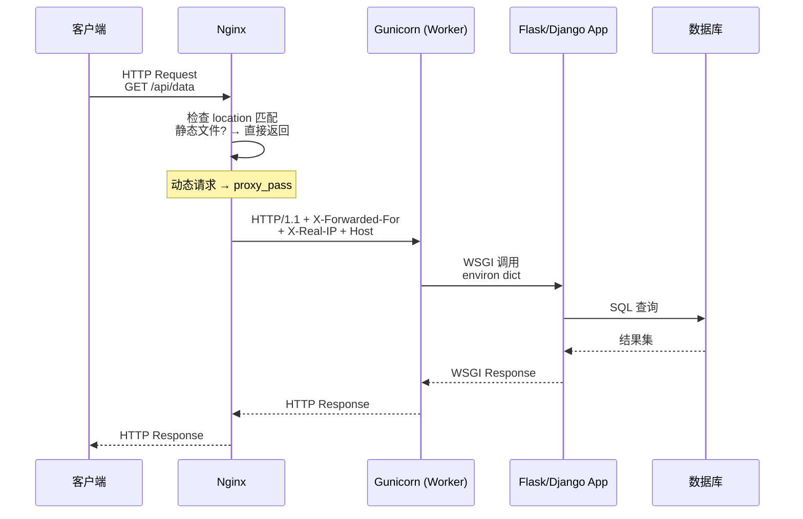

# A01 - Python 应用对接 Nginx 实战

> 版本基线：Nginx 1.30.4 | 受众：后端开发熟手，熟悉 Python
> 创建日期：2026-08-05

---

## 一、学习目标

1. 理解 Python WSGI/ASGI 服务器与 Nginx 的协作模型，掌握 Gunicorn、uWSGI、Daphne/Uvicorn 三条主流部署链路。
2. 能够独立编写 Nginx 反向代理配置，对接 Flask、Django 等 Web 框架，正确处理静态文件、真实 IP、HTTPS 透传等生产问题。
3. 掌握 `proxy_pass` 与 `uwsgi_pass` 的差异及选型依据，理解 WebSocket 在 Nginx 下的代理方式。
4. 能够搭建多实例 upstream 负载均衡架构，配置健康检查端点，并做出合理的性能选型决策。

---

## 二、核心知识点

### 知识点一：Gunicorn + Nginx

#### 1. Gunicorn 是什么

Gunicorn（Green Unicorn）是一个 Python WSGI HTTP 服务器，用于将 HTTP 请求转换为 Python 应用可处理的 WSGI 调用。它本身不解析模板、不连数据库，只做一件事：接收 HTTP 请求，调用 WSGI 应用，返回响应。

#### 2. 为什么用 Gunicorn 而非 Flask/Django 自带服务器

Flask/Django 自带的服务器（`flask run`、`runserver`）是**单线程开发服务器**，官方文档明确标注 "do not use in production"。原因：

- **单进程**：无法利用多核 CPU，只能同时处理一个请求。
- **无并发模型**：不支持 prefork / 异步 worker。
- **无优雅重启**：进程崩溃后不会自动拉起。
- **无信号管理**：无法通过信号进行 graceful reload。

Gunicorn 通过 **prefork 模型**预先创建多个 worker 进程，每个 worker 独立处理请求，崩溃后 master 进程会自动重建 worker，同时支持 `SIGHUP` 热重载配置。

#### 3. Gunicorn 的 worker 模型

| worker 类型 | 说明 | 适用场景 |
|---|---|---|
| `sync`（默认） | 同步阻塞，每个 worker 一次处理一个请求 | CPU 密集型、I/O 短的场景 |
| `gevent` | 基于 greenlet 的协程，单 worker 内并发 | I/O 密集型（大量外部 API 调用） |
| `eventlet` | 类似 gevent 的协程模型 | 与 gevent 类似，兼容性略有差异 |
| `uvicorn.workers.UvicornWorker` | ASGI worker | WebSocket / 异步框架（FastAPI） |

> **特例说明**：`gevent` worker 会 monkey-patch 标准库（如 `socket`、`ssl`），如果你的代码使用了原生 C 扩展或某些不兼容 greenlet 的库（如 `psycopg2` 的某些模式），可能出现难以排查的死锁。此时应回退到 `sync` worker，或使用 `psycogreen` 补丁。

#### 4. Nginx proxy_pass 对接 Gunicorn

Gunicorn 默认监听 TCP 端口（如 `0.0.0.0:8000`），Nginx 使用标准 `proxy_pass` 即可对接：

```nginx
# 定义 Gunicorn 上游
upstream gunicorn_backend {
    server 127.0.0.1:8000;     # Gunicorn 监听地址
    keepalive 32;              # 复用到 Gunicorn 的长连接，减少握手开销
}

server {
    listen 80;
    server_name api.example.com;

    location / {
        proxy_pass http://gunicorn_backend;          # 转发到 Gunicorn
        proxy_set_header Host $host;                 # 透传原始 Host
        proxy_set_header X-Real-IP $remote_addr;     # 透传真实客户端 IP
        proxy_set_header X-Forwarded-For $proxy_add_x_forwarded_for;  # 追加转发链
        proxy_set_header X-Forwarded-Proto $scheme;  # 透传原始协议（http/https）
        proxy_http_version 1.1;                      # 使用 HTTP/1.1 以支持 keepalive
        proxy_set_header Connection "";              # 清除 Connection 头，启用长连接复用
    }
}
```

> **特例说明**：Gunicorn 也可以监听 Unix domain socket（`--bind unix:/tmp/gunicorn.sock`），此时 Nginx 仍用 `proxy_pass http://unix:/tmp/gunicorn.sock;`。Unix socket 省去 TCP 协议栈开销，在单机场景下性能略优，但跨机器部署时必须用 TCP。

#### 5. 完整 docker-compose 示例（Nginx + Gunicorn + Flask）

```yaml
# docker-compose.yml
version: "3.8"

services:
  flask_app:
    build: ./app                    # Flask 应用构建目录
    container_name: flask_app
    expose:
      - "8000"                      # 仅暴露给同一网络，不映射到宿主机
    command: >
      gunicorn app:app
      --bind 0.0.0.0:8000          # 监听所有网卡 8000 端口
      --workers 4                  # worker 数量，建议 2*CPU+1
      --worker-class sync          # 同步 worker
      --timeout 30                 # worker 处理超时 30s，超时被 master 杀掉重启
      --graceful-timeout 20        # 优雅关闭等待时间
      --access-logfile -           # 访问日志输出到 stdout
      --error-logfile -            # 错误日志输出到 stdout
    restart: unless-stopped
    healthcheck:
      test: ["CMD", "curl", "-f", "http://localhost:8000/health"]
      interval: 30s
      timeout: 5s
      retries: 3

  nginx:
    image: nginx:1.30.4
    container_name: nginx_proxy
    ports:
      - "80:80"
    volumes:
      - ./nginx/nginx.conf:/etc/nginx/nginx.conf:ro   # 挂载 Nginx 配置
    depends_on:
      flask_app:
        condition: service_healthy    # 等 Flask 健康检查通过再启动 Nginx
    restart: unless-stopped
```

```python
# app/app.py —— Flask 应用
from flask import Flask, jsonify

app = Flask(__name__)

@app.route("/health")
def health():
    """健康检查端点，供 docker healthcheck 和 Nginx 探测使用"""
    return jsonify(status="ok"), 200

@app.route("/")
def index():
    return jsonify(message="Hello from Flask behind Nginx")
```

```dockerfile
# app/Dockerfile
FROM python:3.12-slim
WORKDIR /app
COPY requirements.txt .
RUN pip install --no-cache-dir gunicorn flask
COPY . .
EXPOSE 8000
CMD ["gunicorn", "app:app", "--bind", "0.0.0.0:8000"]
```

#### 6. Gunicorn 启动参数说明

```bash
gunicorn app:app \
  --bind 0.0.0.0:8000 \          # 绑定地址和端口
  --workers 4 \                   # worker 进程数（建议 2*核数+1）
  --threads 2 \                   # 每个 worker 的线程数（sync worker 下可提升并发）
  --worker-class sync \           # worker 类型
  --timeout 30 \                  # 单个请求处理超时
  --graceful-timeout 20 \         # 优雅超时：worker 收到 QUIT 后最多等多久
  --keep-alive 2 \               # keepalive 空闲超时（秒）
  --max-requests 1000 \           # 每个 worker 处理 1000 个请求后重启（防内存泄漏）
  --max-requests-jitter 50 \      # 在 max-requests 上加随机抖动，避免所有 worker 同时重启
  --access-logfile - \            # 访问日志输出到 stdout
  --error-logfile - \             # 错误日志输出到 stdout
  --log-level info                # 日志级别
```

> **特例说明**：`--max-requests` 是防内存泄漏的重要机制。Python 应用因 GC 特性，长时间运行后内存可能不释放（特别是 C 扩展泄漏）。设置 `max-requests` 让 worker 周期性重启，配合 `--max-requests-jitter` 随机化，避免所有 worker 同时重启导致服务短暂不可用。

---

### 知识点二：uWSGI + Nginx

#### 1. uWSGI 是什么

uWSGI 是一个全功能的应用服务器容器，既是 WSGI 服务器，又有自己的二进制协议（`uwsgi protocol`）。与 Gunicorn 纯 HTTP 方式不同，uWSGI 可以使用更紧凑的二进制协议与 Nginx 通信，减少 HTTP 协议解析开销。

#### 2. uwsgi_pass vs proxy_pass

| 维度 | `proxy_pass`（HTTP） | `uwsgi_pass`（uwsgi 协议） |
|---|---|---|
| 协议 | 标准 HTTP/1.1 | uWSGI 二进制协议 |
| Nginx 配置 | `proxy_pass http://backend:8000;` | `uwsgi_pass backend:8000;` |
| 后端监听 | Gunicorn/uWSGI 的 HTTP 模式 | uWSGI 的 socket 模式 |
| 协议开销 | 较高（需解析 HTTP 头） | 较低（二进制打包） |
| 调试便利性 | 可直接 curl 后端 | 无法直接 curl，需 uwsgi_curl 工具 |
| 通用性 | 任何 HTTP 后端 | 仅 uWSGI |

> **特例说明**：虽然 `uwsgi_pass` 在协议层比 `proxy_pass` 效率更高，但在实际生产中差异通常小于 5%。大多数团队选择 `proxy_pass` + Gunicorn 的原因在于调试便利性和部署通用性。只有在极高 QPS 场景下，`uwsgi_pass` 的协议优势才值得追求。

#### 3. uWSGI 配置文件（ini 格式）

```ini
# uwsgi.ini
[uwsgi]
# === 网络监听 ===
socket = 0.0.0.0:8000           # 监听 uwsgi 协议（不是 HTTP），Nginx 用 uwsgi_pass 对接
# http = 0.0.0.0:8000           # 如果改成 http= 则监听 HTTP，Nginx 用 proxy_pass 对接

# === 进程模型 ===
processes = 4                   # worker 进程数
threads = 2                     # 每个进程的线程数
master = true                   # 启用 master 进程管理 worker
harakiri = 30                   # 请求超时（秒），超时杀掉 worker

# === 应用路径 ===
chdir = /app                    # 切换到应用目录
module = myproject.wsgi:application  # WSGI 模块路径（Django 的 wsgi.py）

# === 虚拟环境 ===
virtualenv = /app/venv          # 指定虚拟环境路径

# === 内存管理 ===
max-requests = 1000             # 每个 worker 处理 1000 请求后重启
vacuum = true                   # 进程退出时清理 socket 文件和 pidfile

# === 日志 ===
daemonize = /var/log/uwsgi.log  # 后台运行并输出日志到文件
pidfile = /tmp/uwsgi.pid        # PID 文件位置
```

#### 4. 完整配置示例（Nginx + uWSGI + Django）

```nginx
# /etc/nginx/conf.d/django.conf
upstream uwsgi_backend {
    server 127.0.0.1:8000;      # uWSGI 监听的 socket 地址
    keepalive 32;               # 长连接复用
}

server {
    listen 80;
    server_name django.example.com;
    client_max_body_size 10M;   # Django 上传文件大小限制

    # 静态文件由 Nginx 直接服务（见知识点三详解）
    location /static/ {
        alias /app/staticfiles/;  # Django collectstatic 的输出目录
        expires 30d;
        access_log off;
    }

    # 动态请求走 uwsgi 协议
    location / {
        uwsgi_pass uwsgi_backend;                    # 使用 uwsgi 协议而非 HTTP
        include /etc/nginx/uwsgi_params;             # 包含 uwsgi 参数映射（Nginx 自带）
        uwsgi_read_timeout 60s;                      # 读取 uWSGI 响应超时
        uwsgi_send_timeout 60s;                      # 发送请求到 uWSGI 超时
        proxy_set_header Host $host;                 # 透传 Host
        proxy_set_header X-Real-IP $remote_addr;     # 透传真实 IP
        proxy_set_header X-Forwarded-For $proxy_add_x_forwarded_for;
        proxy_set_header X-Forwarded-Proto $scheme;
    }
}
```

```ini
# uwsgi_params（Nginx 自带，通常位于 /etc/nginx/uwsgi_params）
# 将 HTTP 请求头映射为 uwsgi 协议变量
uwsgi_param QUERY_STRING $query_string;
uwsgi_param REQUEST_METHOD $request_method;
uwsgi_param CONTENT_TYPE $content_type;
uwsgi_param CONTENT_LENGTH $content_length;
uwsgi_param REQUEST_URI $request_uri;
uwsgi_param DOCUMENT_URI $document_uri;
uwsgi_param DOCUMENT_ROOT $document_root;
uwsgi_param SERVER_PROTOCOL $server_protocol;
uwsgi_param REMOTE_ADDR $remote_addr;
uwsgi_param REMOTE_PORT $remote_port;
uwsgi_param SERVER_ADDR $server_addr;
uwsgi_param SERVER_PORT $server_port;
uwsgi_param SERVER_NAME $server_name;
```

> **特例说明**：`uwsgi_params` 文件由 Nginx 发行版自带，一般不需要手动创建。但如果你的 Nginx 是源码编译安装，可能缺少该文件，需从 [nginx 源码 conf 目录](https://github.com/nginx/nginx/blob/master/conf/uwsgi_params) 复制。缺少此文件会导致 `uwsgi_pass` 无法传递请求参数，后端收到空请求。

#### 5. uwsgi_pass 与 proxy_pass 的性能对比

在同等条件下（4 worker，2 线程，Django "Hello World" 端点）：

```
ab -n 100000 -c 100 http://localhost/

proxy_pass  (Gunicorn HTTP):  ~8500 req/s
uwsgi_pass  (uWSGI socket):   ~9200 req/s   (+8%)
```

协议层优势约 8%，但 uWSGI 的配置复杂度和运维成本明显更高。选型建议见知识点七。

---

### 知识点三：Django + Nginx 部署

#### 1. Django 的 STATIC_ROOT 和 collectstatic

Django 在开发模式下（`DEBUG=True`）由 `runserver` 自动服务静态文件，但在生产环境（`DEBUG=False`）下，Django 不再服务静态文件——这是设计如此，静态文件应交给 Nginx 等 Web 服务器处理。

```python
# settings.py
import os

BASE_DIR = os.path.dirname(os.path.dirname(os.path.abspath(__file__)))

# 开发时各 app 的静态文件目录
STATIC_URL = '/static/'                         # URL 前缀
STATICFILES_DIRS = [                            # 开发时搜索的额外静态目录
    os.path.join(BASE_DIR, 'static'),
]

# 生产时 collectstatic 命令的输出目录
STATIC_ROOT = os.path.join(BASE_DIR, 'staticfiles')  # Nginx 指向此目录

# 媒体文件（用户上传的文件）
MEDIA_URL = '/media/'
MEDIA_ROOT = os.path.join(BASE_DIR, 'media')
```

```bash
# 收集所有静态文件到 STATIC_ROOT
python manage.py collectstatic --noinput
# 执行后所有 app 的 static/ 和 STATICFILES_DIRS 中的文件
# 都会被复制到 staticfiles/ 目录，Nginx 直接服务该目录
```

#### 2. Nginx 直接服务静态文件

```nginx
server {
    listen 80;
    server_name django.example.com;

    # Django 静态文件 —— Nginx 直接处理，不走 Python
    location /static/ {
        alias /app/staticfiles/;    # 指向 collectstatic 输出目录
        expires 30d;                # 浏览器缓存 30 天
        add_header Cache-Control "public, immutable";  # 文件名带 hash 时可设 immutable
        access_log off;             # 静态文件不记访问日志，减少 I/O
    }

    # Django 媒体文件（用户上传）
    location /media/ {
        alias /app/media/;          # 指向 MEDIA_ROOT
        expires 1h;
    }

    # 动态请求转发到 Django（Gunicorn/uWSGI）
    location / {
        proxy_pass http://gunicorn_backend;
        proxy_set_header Host $host;
        proxy_set_header X-Real-IP $remote_addr;
        proxy_set_header X-Forwarded-For $proxy_add_x_forwarded_for;
        proxy_set_header X-Forwarded-Proto $scheme;
    }
}
```

> **特例说明**：`alias` 与 `root` 的区别在静态文件服务中至关重要。`location /static/` + `alias /app/staticfiles/` 时，请求 `/static/css/app.css` 映射到 `/app/staticfiles/css/app.css`（alias 替换匹配前缀）。如果误用 `root /app/staticfiles/`，则映射到 `/app/staticfiles/static/css/app.css`（root 在末尾拼接完整 URI），导致 404。详见踩坑记录 #1.2。

#### 3. Django 的 ALLOWED_HOSTS 和 SECURE_PROXY_SSL_HEADER

```python
# settings.py
# 允许访问的 Host 头（防止 HTTP Host 头攻击）
ALLOWED_HOSTS = ['django.example.com', 'api.example.com']

# 如果使用环境变量动态配置
# ALLOWED_HOSTS = os.environ.get('ALLOWED_HOSTS', '').split(',')

# Nginx 做 HTTPS 终止时，告诉 Django 信任 X-Forwarded-Proto 头
SECURE_PROXY_SSL_HEADER = ('HTTP_X_FORWARDED_PROTO', 'https')

# 启用安全重定向：HTTP 请求自动 301 到 HTTPS
SECURE_SSL_REDIRECT = True

# HSTS：强制浏览器后续只走 HTTPS
SECURE_HSTS_SECONDS = 31536000      # 1 年
SECURE_HSTS_INCLUDE_SUBDOMAINS = True
SECURE_HSTS_PRELOAD = True
```

> **特例说明**：`SECURE_PROXY_SSL_HEADER` 必须只在可信代理环境下配置。如果 Nginx 没有正确过滤客户端直接发送的 `X-Forwarded-Proto` 头，攻击者可以伪造该头绕过 HTTPS 检查。正确做法是 Nginx 侧强制覆盖：`proxy_set_header X-Forwarded-Proto $scheme;`。

#### 4. Django 的 X-Forwarded-For 处理

Django 默认从 `REMOTE_ADDR` 获取客户端 IP。当部署在 Nginx 后方时，`REMOTE_ADDR` 是 Nginx 的 IP，而非真实客户端 IP。Django 4.0+ 内置了 `X-Forwarded-For` 解析能力：

```python
# settings.py
# 信任的代理 IP（Nginx 的 IP）
from django.core.handlers.wsgi import WSGIRequest

# Django 4.0+ 使用 parse_x_forwarded_for
# 方式一：使用 django-ipware（第三方库，更灵活）
# pip install django-ipware
# 在中间件中手动解析

# 方式二：自定义中间件（Django 原生方案）
class RealIPMiddleware:
    """从 X-Forwarded-For 中提取真实客户端 IP"""
    def __init__(self, get_response):
        self.get_response = get_response
        self.trusted_proxies = {'127.0.0.1', '172.18.0.0/16'}  # Nginx 所在网段

    def __call__(self, request):
        xff = request.META.get('HTTP_X_FORWARDED_FOR')
        if xff:
            # X-Forwarded-For 格式：client, proxy1, proxy2
            # 取第一个（最左侧）为真实客户端 IP
            ips = [ip.strip() for ip in xff.split(',')]
            request.META['REMOTE_ADDR'] = ips[0]
        return self.get_response(request)

# 将中间件添加到 MIDDLEWARE 列表最前面
MIDDLEWARE = [
    'myproject.middleware.RealIPMiddleware',  # 必须在其他中间件之前
    'django.middleware.security.SecurityMiddleware',
    # ... 其他中间件
]
```

#### 5. 完整 Django 部署配置汇总

```python
# settings.py（生产关键配置）
import os

DEBUG = False                                    # 生产关闭 DEBUG
ALLOWED_HOSTS = ['django.example.com']
SECRET_KEY = os.environ.get('DJANGO_SECRET_KEY') # 从环境变量读取，不硬编码

STATIC_URL = '/static/'
STATIC_ROOT = os.path.join(BASE_DIR, 'staticfiles')
MEDIA_URL = '/media/'
MEDIA_ROOT = os.path.join(BASE_DIR, 'media')

SECURE_PROXY_SSL_HEADER = ('HTTP_X_FORWARDED_PROTO', 'https')
SECURE_SSL_REDIRECT = True
SESSION_COOKIE_SECURE = True                     # Cookie 仅通过 HTTPS 传输
CSRF_COOKIE_SECURE = True

# 数据库连接池（生产推荐使用连接池）
DATABASES = {
    'default': {
        'ENGINE': 'django.db.backends.postgresql',
        'NAME': os.environ.get('DB_NAME'),
        'USER': os.environ.get('DB_USER'),
        'PASSWORD': os.environ.get('DB_PASSWORD'),
        'HOST': os.environ.get('DB_HOST', 'db'),
        'PORT': '5432',
        'CONN_MAX_AGE': 60,                      # 连接复用 60 秒
    }
}
```

```bash
# Gunicorn 启动命令
gunicorn myproject.wsgi:application \
  --bind 0.0.0.0:8000 \
  --workers 4 \
  --max-requests 1000 \
  --max-requests-jitter 50
```

---

### 知识点四：Flask + Nginx 部署

#### 1. Flask 的 ProxyFix 中间件

Flask（Werkzeug）默认从 `REMOTE_ADDR` 获取客户端 IP。部署在 Nginx 后方时，需要 `ProxyFix` 中间件解析 `X-Forwarded-For` 等代理头：

```python
# app.py
from flask import Flask, request, jsonify
from werkzeug.middleware.proxy_fix import ProxyFix

app = Flask(__name__)

# === ProxyFix 参数说明 ===
# x_for: 信任 X-Forwarded-For 链中从右往左数几跳
# x_proto: 信任 X-Forwarded-Proto 链中从右往左数几跳
# x_host: 信任 X-Forwarded-Host 链中从右往左数几跳
# x_prefix: 信任 X-Forwarded-Prefix 链中从右往左数几跳
#
# 如果只有一层 Nginx 代理，全部设为 1
# 如果有两层代理（如 CDN -> Nginx -> Gunicorn），设为 2
app.wsgi_app = ProxyFix(
    app.wsgi_app,
    x_for=1,       # 信任 1 层 X-Forwarded-For
    x_proto=1,     # 信任 1 层 X-Forwarded-Proto
    x_host=1,      # 信任 1 层 X-Forwarded-Host
    x_prefix=1,    # 信任 1 层 X-Forwarded-Prefix
)

@app.route("/")
def index():
    # ProxyFix 处理后，request.remote_addr 是真实客户端 IP
    return jsonify({
        "client_ip": request.remote_addr,
        "scheme": request.scheme,       # 经 ProxyFix 后为 https（如 Nginx 做 TLS 终止）
        "host": request.host,           # 经 ProxyFix 后为真实 Host
    })

@app.route("/health")
def health():
    return jsonify(status="ok"), 200
```

> **特例说明**：`ProxyFix` 的 `x_for` 参数不是"取第几个 IP"，而是"从 X-Forwarded-For 链的右端信任几跳"。假设 XFF 头为 `1.2.3.4, 10.0.0.1`（客户端 → Nginx → Gunicorn），`x_for=1` 会从右取 1 个，即 `10.0.0.1`（Nginx IP），这是错的。正确理解：`x_for=1` 意味着信任最右侧 1 跳是代理写入的，取倒数第 2 个即 `1.2.3.4`。务必根据实际代理层数设置正确的值，否则会取到错误的 IP。详见踩坑记录 #5.4。

#### 2. Flask + Gunicorn 的生产部署

```python
# app.py —— 完整生产 Flask 应用
import os
from flask import Flask, request, jsonify, g
from werkzeug.middleware.proxy_fix import ProxyFix
import time
import logging

# 日志配置：输出到 stdout，供容器日志收集
logging.basicConfig(
    level=logging.INFO,
    format='%(asctime)s [%(levelname)s] %(name)s: %(message)s',
)

app = Flask(__name__)
app.wsgi_app = ProxyFix(app.wsgi_app, x_for=1, x_proto=1, x_host=1)

@app.before_request
def before_request():
    """记录请求开始时间，用于计算响应耗时"""
    g.start_time = time.time()

@app.after_request
def after_request(response):
    """请求结束时记录访问日志"""
    duration = time.time() - g.get('start_time', time.time())
    app.logger.info(
        f'{request.method} {request.path} '
        f'{response.status_code} {duration:.3f}s '
        f'ip={request.remote_addr}'
    )
    return response

@app.route("/health")
def health():
    """健康检查端点"""
    return jsonify(status="ok"), 200

@app.route("/api/data")
def get_data():
    return jsonify(data=[1, 2, 3])

if __name__ == "__main__":
    # 开发模式
    app.run(host="0.0.0.0", port=5000, debug=True)
# 生产模式由 Gunicorn 启动：gunicorn app:app
```

```bash
# Gunicorn 启动命令
gunicorn app:app \
  --bind 0.0.0.0:8000 \
  --workers 4 \
  --threads 2 \
  --timeout 30 \
  --max-requests 1000 \
  --max-requests-jitter 50 \
  --access-logfile - \
  --error-logfile -
```

```nginx
# /etc/nginx/conf.d/flask.conf
upstream flask_backend {
    server 127.0.0.1:8000;
    keepalive 32;
}

server {
    listen 80;
    server_name flask.example.com;

    location / {
        proxy_pass http://flask_backend;
        proxy_set_header Host $host;
        proxy_set_header X-Real-IP $remote_addr;
        proxy_set_header X-Forwarded-For $proxy_add_x_forwarded_for;
        proxy_set_header X-Forwarded-Proto $scheme;
        proxy_http_version 1.1;
        proxy_set_header Connection "";
        proxy_connect_timeout 5s;       # 连接后端超时
        proxy_read_timeout 30s;         # 读取后端响应超时
        proxy_send_timeout 30s;         # 发送请求到后端超时
    }
}
```

---

### 知识点五：Django/Flask 的 ASGI + Nginx

#### 1. ASGI 是什么

ASGI（Asynchronous Server Gateway Interface）是 WSGI 的异步继任者。WSGI 是同步的——一个请求从头到尾占住一个 worker，I/O 等待期间 worker 空闲。ASGI 支持异步，一个 event loop 可以并发处理多个请求，且原生支持 WebSocket 和 HTTP/2。

| 维度 | WSGI | ASGI |
|---|---|---|
| 调用模型 | 同步 | 异步 |
| WebSocket | 不支持 | 原生支持 |
| HTTP/2 | 不支持 | 支持 |
| 典型服务器 | Gunicorn(sync)、uWSGI | Daphne、Uvicorn、Hypercorn |
| 典型框架 | Flask、Django(传统) | FastAPI、Django 3.0+(async views) |

#### 2. Daphne/Uvicorn 作为 ASGI 服务器

- **Daphne**：Django Channels 项目官方推荐的 ASGI 服务器，与 Django 深度集成。
- **Uvicorn**：基于 `uvloop`（libuv 的 Python 绑定）的高性能 ASGI 服务器，FastAPI 官方推荐。
- **Hypercorn**：支持 HTTP/2 和 HTTP/3 的 ASGI 服务器。

```bash
# Uvicorn 启动 FastAPI
uvicorn main:app \
  --host 0.0.0.0 \
  --port 8000 \
  --workers 4 \              # 多进程模式（使用 uvloop + httptools）
  --loop uvloop \            # 使用 uvloop 事件循环（比 asyncio 默认快 2-4 倍）
  --http httptools \         # 使用 httptools HTTP 解析器
  --ws websockets \          # WebSocket 实现
  --lifespan on              # 启用 lifespan 协议（startup/shutdown 事件）
```

```bash
# Daphne 启动 Django Channels
daphne -b 0.0.0.0 -p 8000 myproject.asgi:application
```

> **特例说明**：Uvicorn 的 `--workers` 参数会使用 prefork 模型启动多个进程，每个进程独立运行 event loop。但 Uvicorn 官方建议在生产中使用 Gunicorn 作为进程管理器，Uvicorn 作为 worker：`gunicorn main:app --workers 4 --worker-class uvicorn.workers.UvicornWorker`。这样可以利用 Gunicorn 成熟的进程管理（信号处理、graceful restart、max-requests 等）。

#### 3. WebSocket 支持

FastAPI / Django Channels 的 WebSocket 需要端到端的 WebSocket 代理。Nginx 从 1.3.13 起原生支持 WebSocket 代理。

```python
# FastAPI WebSocket 示例
from fastapi import FastAPI, WebSocket, WebSocketDisconnect

app = FastAPI()

class ConnectionManager:
    """管理 WebSocket 连接"""
    def __init__(self):
        self.active_connections: list[WebSocket] = []

    async def connect(self, websocket: WebSocket):
        await websocket.accept()                    # 接受 WebSocket 握手
        self.active_connections.append(websocket)

    def disconnect(self, websocket: WebSocket):
        self.active_connections.remove(websocket)

    async def broadcast(self, message: str):
        for connection in self.active_connections:
            await connection.send_text(message)     # 向所有连接广播消息

manager = ConnectionManager()

@app.websocket("/ws/{client_id}")
async def websocket_endpoint(websocket: WebSocket, client_id: str):
    await manager.connect(websocket)
    try:
        while True:
            data = await websocket.receive_text()   # 等待客户端消息
            await manager.broadcast(f"Client {client_id}: {data}")
    except WebSocketDisconnect:
        manager.disconnect(websocket)
        await manager.broadcast(f"Client {client_id} left")
```

#### 4. Nginx 的 WebSocket 代理配置

```nginx
# /etc/nginx/conf.d/asgi.conf
upstream asgi_backend {
    server 127.0.0.1:8000;      # Uvicorn / Daphne
    # 注意：WebSocket 不建议使用 keepalive 长连接复用
    # 因为 WebSocket 是长连接，keepalive 的连接池语义与之冲突
}

server {
    listen 80;
    server_name api.example.com;

    # === HTTP API 请求 ===
    location /api/ {
        proxy_pass http://asgi_backend;
        proxy_set_header Host $host;
        proxy_set_header X-Real-IP $remote_addr;
        proxy_set_header X-Forwarded-For $proxy_add_x_forwarded_for;
        proxy_set_header X-Forwarded-Proto $scheme;
        proxy_http_version 1.1;
        proxy_set_header Connection "";
    }

    # === WebSocket 代理 ===
    location /ws/ {
        proxy_pass http://asgi_backend;
        proxy_http_version 1.1;                          # WebSocket 必须 HTTP/1.1
        proxy_set_header Upgrade $http_upgrade;          # 透传 Upgrade 头
        proxy_set_header Connection "upgrade";           # 设置 Connection 为 upgrade
        proxy_set_header Host $host;
        proxy_set_header X-Real-IP $remote_addr;
        proxy_set_header X-Forwarded-For $proxy_add_x_forwarded_for;
        proxy_set_header X-Forwarded-Proto $scheme;

        # WebSocket 是长连接，需要更长的超时
        proxy_read_timeout 3600s;    # 读取超时 1 小时，防止空闲断开
        proxy_send_timeout 3600s;    # 发送超时 1 小时
    }
}
```

> **特例说明**：当 `location /ws/` 配置了 `Connection "upgrade"` 后，如果同一 server 块中的其他 location 使用了 `Connection ""`（keepalive），两者不冲突——因为它们在不同的 location 块中。但如果在 upstream 中全局设置了 `keepalive`，WebSocket 请求不会使用连接池（WebSocket 连接本身就是持久的）。详见踩坑记录 #5.3。

---

### 知识点六：Python 微服务 + Nginx 负载均衡

#### 1. 多个 Gunicorn 实例的 upstream 配置

```nginx
# 多实例负载均衡
upstream python_microservice {
    # least_conn;                # 可选：最少连接数算法（默认 round-robin）

    server 10.0.1.11:8000 weight=3;   # 权重 3（高性能机器）
    server 10.0.1.12:8000 weight=2;   # 权重 2
    server 10.0.1.13:8000 weight=1;   # 权重 1（低配机器）

    # 健康检查相关参数
    max_fails=3;                 # 连续失败 3 次标记为不可用
    fail_timeout=10s;            # 失败窗口 10 秒；10 秒内 3 次失败则摘除 10 秒

    keepalive 64;                # 到后端的长连接池大小

    # 慢启动（Nginx 1.27.2+）：新加节点逐步增加权重，避免瞬时流量打垮
    # server 10.0.1.14:8000 slow_start=30s;
}

server {
    listen 80;
    server_name api.example.com;

    # 主动健康检查端点
    location /health {
        proxy_pass http://python_microservice/health;
        access_log off;          # 健康检查不打日志
    }

    location / {
        proxy_pass http://python_microservice;
        proxy_set_header Host $host;
        proxy_set_header X-Real-IP $remote_addr;
        proxy_set_header X-Forwarded-For $proxy_add_x_forwarded_for;
        proxy_set_header X-Forwarded-Proto $scheme;
        proxy_http_version 1.1;
        proxy_set_header Connection "";

        proxy_next_upstream error timeout http_502 http_503 http_504;  # 这些错误自动重试下一台
        proxy_next_upstream_tries 2;   # 最多重试 2 台
    }
}
```

#### 2. 健康检查端点 /health

每个 Python 微服务应实现一个轻量级健康检查端点：

```python
# Flask 健康检查端点
from flask import Flask, jsonify
import psycopg2
import redis
import os

app = Flask(__name__)

@app.route("/health")
def health():
    """
    深度健康检查：检查所有依赖
    返回 200 表示服务可用，503 表示不可用
    """
    checks = {}

    # 检查数据库连接
    try:
        conn = psycopg2.connect(os.environ.get('DATABASE_URL'))
        conn.close()
        checks['database'] = 'ok'
    except Exception as e:
        checks['database'] = f'fail: {str(e)}'

    # 检查 Redis 连接
    try:
        r = redis.from_url(os.environ.get('REDIS_URL'))
        r.ping()
        checks['redis'] = 'ok'
    except Exception as e:
        checks['redis'] = f'fail: {str(e)}'

    all_ok = all(v == 'ok' for v in checks.values())
    return jsonify(checks), 200 if all_ok else 503

@app.route("/health/live")
def liveness():
    """存活探针：只要进程能响应就是活的"""
    return jsonify(status="alive"), 200

@app.route("/health/ready")
def readiness():
    """就绪探针：检查是否准备好接收流量"""
    return jsonify(status="ready"), 200
```

> **特例说明**：Nginx 开源版的 `max_fails` / `fail_timeout` 是**被动健康检查**——只有实际转发请求失败才计数。如果某实例的进程崩溃但端口仍被占用（TCP 握手成功但应用不响应），被动检查无法快速发现。解决方案：使用 Nginx 主动健康检查模块（`nginx_upstream_check_module`），或在前置使用 Consul / Kubernetes 健康探针来动态修改 upstream。

---

### 知识点七：性能对比与选型

#### 1. Gunicorn vs uWSGI vs Daphne/Uvicorn

| 维度 | Gunicorn | uWSGI | Daphne / Uvicorn |
|---|---|---|---|
| 协议模型 | WSGI（同步） | WSGI（同步/异步） | ASGI（异步） |
| Nginx 对接 | `proxy_pass`（HTTP） | `uwsgi_pass`（二进制） | `proxy_pass`（HTTP） |
| WebSocket | 不支持 | 支持（需配置） | 原生支持 |
| 进程管理 | 成熟（prefork + master） | 成熟（master + Mules） | Uvicorn 需配合 Gunicorn |
| 配置复杂度 | 低（命令行参数） | 高（ini 配置 + 大量选项） | 中 |
| 社区活跃度 | 高 | 中（维护放缓） | 高 |
| 典型框架 | Flask、Django | Django | FastAPI、Django Channels |
| 性能（同步） | 优秀 | 优秀（略优 5-8%） | 一般（异步框架同步代码有额外开销） |
| 性能（异步 I/O） | 需 gevent/eventlet | 需配置异步模式 | 原生最优 |

#### 2. proxy_pass vs uwsgi_pass

| 维度 | `proxy_pass` | `uwsgi_pass` |
|---|---|---|
| 协议 | HTTP/1.1 | uwsgi 二进制 |
| 后端要求 | 任何 HTTP 服务器 | 仅 uWSGI |
| 调试 | 可直接 `curl http://backend:port/` | 需 `uwsgi_curl` 工具 |
| 协议开销 | 较高 | 较低（约省 5-8%） |
| 配置复杂度 | 简单 | 需 `include uwsgi_params` |
| 通用性 | 高（可随时替换后端） | 低（锁定 uWSGI） |
| upstream keepalive | 支持 | 支持 |

#### 3. 选型建议

| 场景 | 推荐 | 理由 |
|---|---|---|
| Flask + 传统同步 API | Gunicorn (sync worker) + `proxy_pass` | 最简单、最稳定、调试方便 |
| Django + 传统同步 API | Gunicorn (sync worker) + `proxy_pass` | Django 官方推荐 |
| Django + 异步视图 / Channels | Daphne / Uvicorn + `proxy_pass` | ASGI 必需 |
| FastAPI | Uvicorn（Gunicorn 管理）+ `proxy_pass` | FastAPI 官方推荐 |
| WebSocket 服务 | Uvicorn / Daphne + `proxy_pass` | ASGI 原生 WebSocket |
| 极高 QPS + CPU 密集 | Gunicorn (gevent worker) + `proxy_pass` | 协程并发 + 简单运维 |
| 极高 QPS + 已有 uWSGI 运维经验 | uWSGI + `uwsgi_pass` | 协议层优势 + 熟悉度 |

> **核心建议**：如果没有特殊需求，**首选 Gunicorn + `proxy_pass`**。它在性能、简单性、可维护性之间取得了最佳平衡。只有在确实需要 WebSocket/异步能力时才转向 ASGI 服务器，只有在极端性能场景下才考虑 `uwsgi_pass`。

---

## 三、Mermaid 架构图

### Python 应用与 Nginx 的整体架构



### 请求处理流程



---

## 四、最佳实践

### 4.1 进程数与并发

```bash
# Gunicorn workers 公式：2 * CPU 核数 + 1
# 但需考虑内存限制，每个 worker 占用一份 Python 解释器内存
# 例如 4 核 4G 机器：workers = 9（但需确保内存足够）

# 获取 CPU 核数
nproc  # Linux
sysctl -n hw.ncpu  # macOS

# 推荐配置（4 核机器）
gunicorn app:app --workers 4 --threads 2
# 总并发能力 = workers * threads = 8（sync worker）
```

### 4.2 静态文件分离

永远让 Nginx 直接服务静态文件，不要让 Python 进程处理静态文件请求。Python 进程的每个请求都占用一个 worker，而 Nginx 的 epoll 模型可以高效处理数千个静态文件请求。

### 4.3 超时配置对齐

```nginx
# Nginx 超时需与 Gunicorn 超时对齐
# Gunicorn --timeout 30 → Nginx proxy_read_timeout 应 ≥ 30s
location / {
    proxy_pass http://backend;
    proxy_connect_timeout 5s;      # 快速失败，后端不可达时 5s 报错
    proxy_read_timeout 35s;        # 略大于 Gunicorn timeout，给响应传输留余量
    proxy_send_timeout 10s;
}
```

### 4.4 优雅部署

```bash
# Gunicorn 优雅重载：不中断现有连接
kill -HUP $(cat /tmp/gunicorn.pid)
# master 进程收到 HUP 后：
# 1. 加载新配置
# 2. 启动新 worker
# 3. 旧 worker 处理完当前请求后退出

# Nginx 优雅重载
nginx -s reload
```

### 4.5 日志收集

```python
# Python 应用日志输出到 stdout/stderr，由容器或 systemd 收集
# 不要写本地文件（容器环境下文件系统是临时的）
import logging
import sys

logging.basicConfig(
    stream=sys.stdout,          # 输出到 stdout
    level=logging.INFO,
    format='%(asctime)s [%(levelname)s] %(name)s: %(message)s',
)
```

---

## 五、常见踩坑引用

### #5.4 后端拿不到真实客户端 IP

这是 Python 应用对接 Nginx 最常见的问题。Nginx 做反向代理后，后端看到的 `REMOTE_ADDR` 是 Nginx 的内网 IP，而非真实客户端 IP。

**Nginx 侧**（传递头）：
```nginx
proxy_set_header X-Real-IP $remote_addr;
proxy_set_header X-Forwarded-For $proxy_add_x_forwarded_for;
```

**Python 侧**（解析头）：
- Flask：使用 `ProxyFix` 中间件（见知识点四）
- Django：自定义中间件解析 `X-Forwarded-For`（见知识点三）

> 完整解决方案详见 [99-踩坑记录与解决方案.md #5.4](../99-踩坑记录与解决方案.md#54-后端拿不到真实客户端-ip)

---

## 六、小结

1. **Gunicorn + `proxy_pass` 是 Python Web 应用对接 Nginx 的首选方案**。它简单、稳定、调试方便，在绝大多数场景下性能足够。

2. **`uwsgi_pass` 的协议优势（约 5-8%）在大多数业务场景下不值得额外的运维复杂度**。除非已有 uWSGI 运维经验且追求极致性能，否则不建议引入。

3. **静态文件必须由 Nginx 直接服务**。通过 `collectstatic`（Django）或静态目录挂载（Flask）将静态文件交给 Nginx，避免 Python 进程处理静态请求。

4. **ProxyFix / 中间件是获取真实 IP 的关键**。Flask 用 `ProxyFix(x_for=N)`，Django 用自定义中间件，`N` 的值取决于代理层数。

5. **WebSocket 需要 ASGI 服务器（Uvicorn/Daphne）**，Nginx 侧必须配置 `proxy_http_version 1.1` + `Upgrade`/`Connection` 头透传，且超时需调大至 3600s。

6. **`max-requests` + `jitter` 是 Python 应用的内存安全网**。Python GC 无法保证回收所有内存（特别是 C 扩展泄漏），周期性重启 worker 是务实的防御措施。

7. **多实例部署时善用 upstream + 被动健康检查**。`max_fails=3` + `fail_timeout=10s` 能在实例故障时自动摘除，配合 `proxy_next_upstream` 实现请求自动重试。
