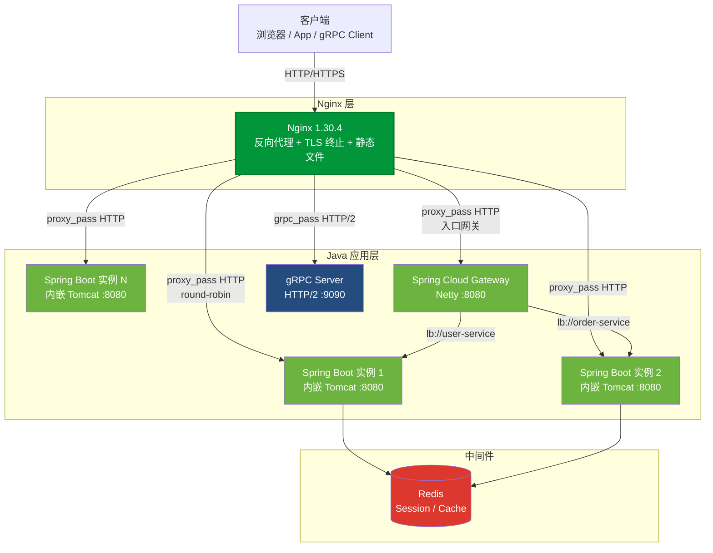
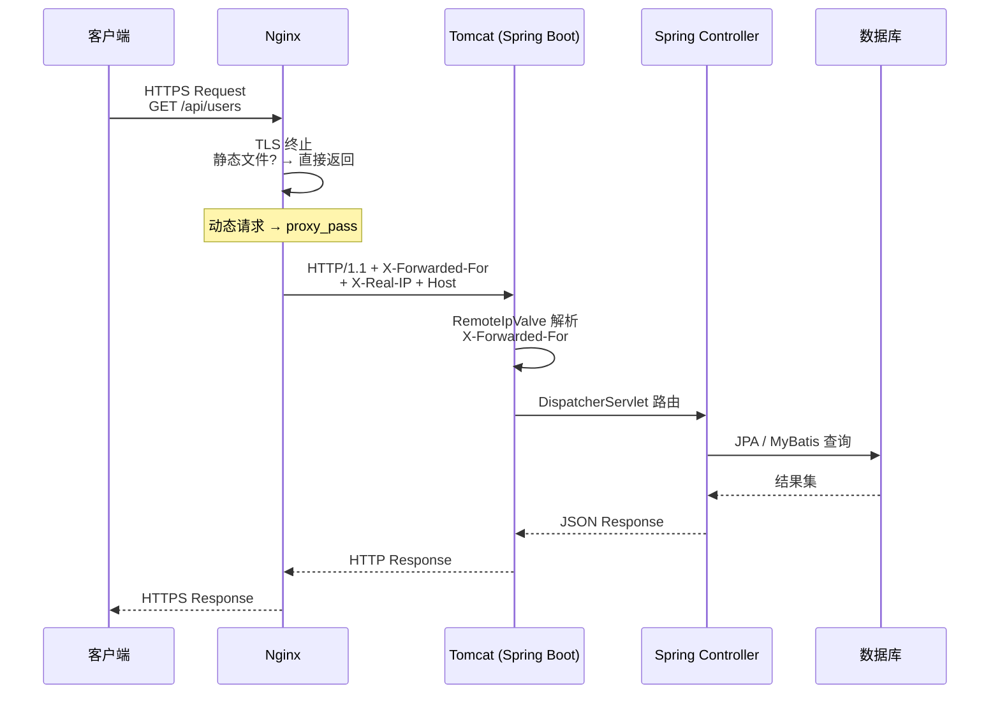
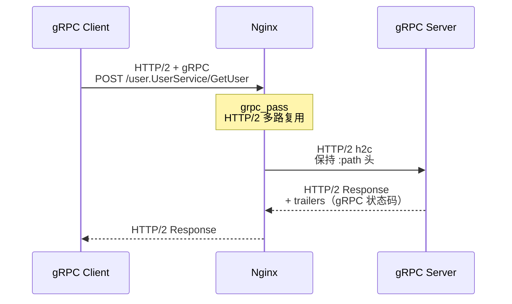

# A02 - Java 应用对接 Nginx 实战

> 版本基线：Nginx 1.30.4 | 受众：后端开发熟手，熟悉 Java
> 创建日期：2026-08-05

---

## 一、学习目标

1. 理解 Java Servlet 容器（Tomcat）与 Nginx 的协作模型，掌握 Spring Boot 内嵌 Tomcat 对接 Nginx 的完整链路。
2. 能够独立编写 Nginx 反向代理配置，对接 Spring Boot / gRPC 服务，正确处理 `X-Forwarded-For`、HTTPS 透传、WebSocket 等生产问题。
3. 掌握 `grpc_pass` 与 `proxy_pass` 的差异，理解 gRPC over HTTP/2 在 Nginx 下的代理方式。
4. 理解 Spring Cloud Gateway 与 Nginx 的定位差异，能够做出合理的网关选型与组合架构决策。
5. 掌握 Java 微服务的会话管理策略（ip_hash / Spring Session / JWT），并做出合理的负载均衡选型。

---

## 二、核心知识点

### 知识点一：Tomcat + Nginx

#### 1. Tomcat 是什么

Apache Tomcat 是 Java Servlet/JSP 规范的参考实现，是一个 Java Servlet 容器（Web 容器）。它负责：

- 接收 HTTP 请求，解析为 `HttpServletRequest` / `HttpServletResponse` 对象。
- 管理 Servlet 生命周期，将请求分发给对应的 Servlet 处理。
- 管理 Session、Filter、Listener 等 Web 组件。

Tomcat 本身也是一个完整的 HTTP 服务器，可以直接对外提供服务。但在生产环境中，通常在 Tomcat 前方放置 Nginx，原因见知识点七的详细对比。

#### 2. Nginx proxy_pass 对接 Tomcat

Tomcat 默认监听 8080 端口，Nginx 使用 `proxy_pass` 对接：

```nginx
# 定义 Tomcat 上游
upstream tomcat_backend {
    server 127.0.0.1:8080;       # Tomcat 默认 HTTP 端口
    keepalive 32;                # 到 Tomcat 的长连接复用
}

server {
    listen 80;
    server_name app.example.com;

    # 客户端请求体大小限制（Tomcat 的 maxPostSize 需同步调整）
    client_max_body_size 50M;

    location / {
        proxy_pass http://tomcat_backend;             # 转发到 Tomcat
        proxy_set_header Host $host;                  # 透传原始 Host
        proxy_set_header X-Real-IP $remote_addr;      # 透传真实客户端 IP
        proxy_set_header X-Forwarded-For $proxy_add_x_forwarded_for;
        proxy_set_header X-Forwarded-Proto $scheme;   # 透传原始协议
        proxy_http_version 1.1;                       # HTTP/1.1 支持长连接
        proxy_set_header Connection "";               # 清除 Connection 头，启用连接复用
    }
}
```

#### 3. Tomcat 的 RemoteIpValve（处理 X-Forwarded-For）

Tomcat 内置 `RemoteIpValve`，用于解析 `X-Forwarded-For` 和 `X-Forwarded-Proto` 头，将真实客户端 IP 写入 `request.getRemoteAddr()`，将真实协议写入 `request.getScheme()`。

```xml
<!-- server.xml 或 context.xml 中配置 -->
<!-- RemoteIpValve 配置在 Tomcat 的 Valve 链中 -->
<Valve className="org.apache.catalina.valves.RemoteIpValve"
       remoteIpHeader="X-Forwarded-For"              <!-- 从哪个头读取客户端 IP 链 -->
       remoteIpProxiesHeader="X-Forwarded-By"        <!-- 信任的代理 IP 写入此头 -->
       protocolHeader="X-Forwarded-Proto"             <!-- 从哪个头读取原始协议 -->
       internalProxies="127\.0\.0\.1|10\.\d+\.\d+\.\d+|172\.(1[6-9]|2[0-9]|3[01])\.\d+\.\d+"  <!-- 信任的代理 IP 正则 -->
       trustedProxies=""                              <!-- 信任的外部代理 IP -->
       proxiesHeader="X-Forwarded-By"                 <!-- 受信任代理写入此头 -->
/>
```

**参数逐行说明**：

- `remoteIpHeader`：指定从哪个 HTTP 头读取转发链，默认 `X-Forwarded-For`。
- `protocolHeader`：指定从哪个 HTTP 头读取原始协议（http/https），默认 `X-Forwarded-Proto`。当该头值为 `https` 时，`request.getScheme()` 返回 `https`，`request.isSecure()` 返回 `true`。
- `internalProxies`：正则表达式，匹配 Nginx 所在机器的 IP。只有来自这些 IP 的请求才会被解析 `X-Forwarded-For`，防止客户端伪造。
- `trustedProxies`：信任的外部代理 IP（如 CDN 的 IP），这些代理写入的 `X-Forwarded-For` 也会被解析。

> **特例说明**：如果不配置 `internalProxies`，Tomcat 的默认值只信任 `127.0.0.1`。如果 Nginx 与 Tomcat 不在同一台机器（如 Docker 容器间通过网桥通信），Nginx 的 IP 是 Docker 网桥 IP（如 `172.17.0.1`），不在默认信任范围内，`RemoteIpValve` 会跳过解析。必须将 Docker 网段加入 `internalProxies`，否则 `request.getRemoteAddr()` 仍然返回 Nginx 的 IP。详见踩坑记录 #5.4。

#### 4. Tomcat 的 server.xml 配置

```xml
<!-- server.xml —— Tomcat 核心配置 -->
<Server port="8005" shutdown="SHUTDOWN">          <!-- 管理端口，shutdown 命令 -->

  <Service name="Catalina">

    <!-- HTTP 连接器：接收 Nginx 转发的请求 -->
    <Connector port="8080"
               protocol="org.apache.coyote.http11.Http11NioProtocol"
               connectionTimeout="20000"           <!-- 连接超时 20 秒 -->
               maxThreads="200"                    <!-- 最大工作线程数（并发请求上限） -->
               minSpareThreads="10"                <!-- 最小空闲线程数 -->
               acceptCount="100"                   <!-- 线程满时的等待队列长度 -->
               maxConnections="10000"              <!-- 最大连接数（NIO 模式） -->
               enableLookups="false"               <!-- 关闭 DNS 反查（性能优化） -->
               URIEncoding="UTF-8"                 <!-- URI 编码 -->
               redirectPort="8443"                 <!-- HTTPS 重定向端口 -->
               compression="on"                    <!-- 开启 gzip 压缩（通常由 Nginx 做，此处可关） -->
               compressibleMimeTypes="text/html,text/xml,text/plain,text/css,application/json"
    />

    <!-- AJP 连接器：如果使用 Nginx 不需要 AJP，可注释掉 -->
    <!-- <Connector port="8009" protocol="AJP/1.3" redirectPort="8443" /> -->

    <Engine name="Catalina" defaultHost="localhost">

      <!-- RemoteIpValve：处理 X-Forwarded-For -->
      <Valve className="org.apache.catalina.valves.RemoteIpValve"
             remoteIpHeader="X-Forwarded-For"
             protocolHeader="X-Forwarded-Proto"
             internalProxies="127\.0\.0\.1|172\.\d+\.\d+\.\d+"
      />

      <Host name="localhost"
            appBase="webapps"
            unpackWARs="true"                     <!-- 自动解压 WAR 包 -->
            autoDeploy="false">                   <!-- 生产关闭热部署 -->

        <!-- 访问日志 -->
        <Valve className="org.apache.catalina.valves.AccessLogValve"
               directory="logs"
               prefix="localhost_access_log"
               suffix=".txt"
               pattern="%h %l %u %t &quot;%r&quot; %s %b"
               requestAttributesEnabled="true"     <!-- 让 %h 显示 RemoteIpValve 处理后的 IP -->
        />
      </Host>
    </Engine>
  </Service>
</Server>
```

> **特例说明**：`access log` 的 `%h` 默认显示 TCP 连接的对端 IP（即 Nginx IP）。设置 `requestAttributesEnabled="true"` 后，`%h` 会显示 `RemoteIpValve` 处理后的真实客户端 IP。这是常被忽略的配置——如果不加此属性，即使 `RemoteIpValve` 正确解析了 IP，访问日志中仍然记录的是 Nginx IP。

#### 5. 完整配置示例汇总

```
项目结构：
.
├── docker-compose.yml
├── nginx/
│   └── nginx.conf
└── tomcat/
    ├── server.xml
    └── webapps/
        └── myapp.war
```

```yaml
# docker-compose.yml
version: "3.8"
services:
  tomcat:
    image: tomcat:10.1-jdk17
    container_name: tomcat_app
    expose:
      - "8080"
    volumes:
      - ./tomcat/server.xml:/usr/local/tomcat/conf/server.xml:ro
      - ./tomcat/webapps:/usr/local/tomcat/webapps:ro
    environment:
      JAVA_OPTS: >
        -Xms512m
        -Xmx1024m
        -XX:MaxMetaspaceSize=256m          # Metaspace 上限，防止类加载泄漏
        -Djava.security.egd=file:/dev/./urandom  # 加速 SecureRandom 初始化
    restart: unless-stopped

  nginx:
    image: nginx:1.30.4
    container_name: nginx_proxy
    ports:
      - "80:80"
    volumes:
      - ./nginx/nginx.conf:/etc/nginx/nginx.conf:ro
    depends_on:
      - tomcat
    restart: unless-stopped
```

---

### 知识点二：Spring Boot + Nginx

#### 1. Spring Boot 内嵌 Tomcat

Spring Boot 默认内嵌 Tomcat，打包为可执行 JAR 后直接运行即可对外提供服务。无需单独安装 Tomcat，也不需要 WAR 包部署。

```xml
<!-- pom.xml —— Spring Boot Web Starter 自带内嵌 Tomcat -->
<dependency>
    <groupId>org.springframework.boot</groupId>
    <artifactId>spring-boot-starter-web</artifactId>
    <!-- 传递依赖 spring-boot-starter-tomcat -->
</dependency>
```

```bash
# 打包并运行
mvn clean package -DskipTests
java -jar target/myapp.jar
# 默认监听 8080 端口
```

#### 2. server.forward-headers-strategy=NATIVE

Spring Boot 提供了两种处理代理头的策略，通过 `server.forward-headers-strategy` 配置：

```yaml
# application.yml
server:
  port: 8080                              # 内嵌 Tomcat 端口
  forward-headers-strategy: NATIVE        # 使用 Tomcat 原生 RemoteIpValve
  
  # forward-headers-strategy 可选值：
  # NATIVE  - 依赖内嵌容器的原生机制（Tomcat 的 RemoteIpValve）
  # FRAMEWORK - 使用 Spring 的 ForwardedHeaderFilter（与容器无关）
  # (不设置) - 不处理代理头
```

**NATIVE 策略**：Spring Boot 自动注册 Tomcat 的 `RemoteIpValve`，解析 `X-Forwarded-For` 和 `X-Forwarded-Proto`。这是推荐方式——使用容器原生能力，性能最优。

**FRAMEWORK 策略**：使用 Spring 的 `ForwardedHeaderFilter`，与具体容器无关（适用于 Jetty、Undertow 等）。但它是 Servlet Filter 层面处理，性能略低于 Valve（Valve 在 Filter 之前执行）。

> **特例说明**：当 Spring Boot 运行在 Kubernetes / Cloud Foundry 等云平台时，平台可能注入自己的路由层。此时 `X-Forwarded-For` 链可能有多跳，需要额外配置信任的代理层数。NATIVE 策略下通过 `server.tomcat.remoteip.remote-ip-header` 等属性调整，FRAMEWORK 策略下通过 `server.forward-headers-strategy=FRAMEWORK` + 自定义 `ForwardedHeaderFilter` Bean 调整。

#### 3. server.tomcat.remoteip.* 配置

```yaml
# application.yml —— Tomcat RemoteIpValve 细粒度配置
server:
  tomcat:
    remoteip:
      remote-ip-header: X-Forwarded-For          # 从哪个头读取 IP 链
      protocol-header: X-Forwarded-Proto          # 从哪个头读取协议
      # 信任的代理 IP 正则（Nginx 所在机器的 IP）
      internal-proxies: '127\.0\.0\.1|10\.\d+\.\d+\.\d+|172\.(1[6-9]|2[0-9]|3[01])\.\d+\.\d+|192\.168\.\d+\.\d+'
      # trusted-proxies: ''                       # 信任的外部代理（如 CDN）
    
    threads:
      max: 200                                     # 最大工作线程数（默认 200）
      min-spare: 10                               # 最小空闲线程数
    
    max-connections: 8192                          # 最大连接数
    accept-count: 100                              # 等待队列长度
    connection-timeout: 20s                        # 连接超时
```

#### 4. Spring Boot 的 actuator/health 健康检查

```xml
<!-- pom.xml —— 引入 Spring Boot Actuator -->
<dependency>
    <groupId>org.springframework.boot</groupId>
    <artifactId>spring-boot-starter-actuator</artifactId>
</dependency>
```

```yaml
# application.yml —— Actuator 配置
management:
  endpoints:
    web:
      exposure:
        include: health,info,metrics,prometheus   # 暴露的端点
  endpoint:
    health:
      show-details: always                         # 显示健康检查详情（各组件状态）
      probes:
        enabled: true                              # 启用 Kubernetes 探针端点
  health:
    livenessstate:
      enabled: true                                # 存活探针 /actuator/health/liveness
    readinessstate:
      enabled: true                                # 就绪探针 /actuator/health/readiness
```

```java
// 自定义健康检查组件
import org.springframework.boot.actuate.health.Health;
import org.springframework.boot.actuate.health.HealthIndicator;
import org.springframework.stereotype.Component;

@Component("databaseConnection")
public class DatabaseHealthIndicator implements HealthIndicator {

    private final DataSource dataSource;

    public DatabaseHealthIndicator(DataSource dataSource) {
        this.dataSource = dataSource;              // 注入数据源
    }

    @Override
    public Health health() {
        try (Connection conn = dataSource.getConnection()) {
            // 尝试执行简单查询验证数据库连接
            try (Statement stmt = conn.createStatement()) {
                stmt.execute("SELECT 1");          // 执行 SELECT 1
                return Health.up()
                        .withDetail("database", "ok")
                        .withDetail("driver", conn.getMetaData().getDriverName())
                        .build();
            }
        } catch (Exception e) {
            // 数据库不可用时返回 DOWN，Actuator 聚合健康状态为 DOWN
            return Health.down()
                    .withDetail("error", e.getMessage())
                    .build();
        }
    }
}
// 访问 /actuator/health 会聚合所有 HealthIndicator 的状态
// 任一为 DOWN 则整体为 DOWN，HTTP 状态码 503
```

> **特例说明**：`/actuator/health` 默认返回聚合状态。如果数据库慢查询导致 `SELECT 1` 超时，健康检查会阻塞。建议为健康检查设置超时（`management.endpoint.health.cache.time-to-live=5000`），或使用异步健康检查。Nginx 的 `proxy_read_timeout` 也应小于 `healthcheck` 间隔，避免误判。

#### 5. 完整 Spring Boot 部署配置

```yaml
# application.yml（生产配置）
server:
  port: 8080
  forward-headers-strategy: NATIVE                # 处理代理头
  tomcat:
    remoteip:
      internal-proxies: '127\.0\.0\.1|10\.\d+\.\d+\.\d+|172\.\d+\.\d+\.\d+'
    threads:
      max: 200
      min-spare: 10
    max-connections: 8192
    accept-count: 100
  servlet:
    context-path: /                               # 上下文路径（根路径）
  compression:
    enabled: true                                  # 开启 gzip（通常 Nginx 已做，此处可关）
    mime-types: application/json,text/html,text/css

spring:
  application:
    name: my-java-service

management:
  endpoints:
    web:
      exposure:
        include: health,info,metrics
  endpoint:
    health:
      show-details: when-authorized               # 生产环境限制详情访问
```

```nginx
# /etc/nginx/conf.d/springboot.conf
upstream springboot_backend {
    server 127.0.0.1:8080;
    keepalive 32;
}

server {
    listen 80;
    server_name api.example.com;
    client_max_body_size 50M;

    # 健康检查端点（可限速，防止频繁探测影响服务）
    location = /actuator/health {
        proxy_pass http://springboot_backend;
        access_log off;                            # 健康检查不打日志
        proxy_read_timeout 5s;                     # 健康检查超时 5 秒
    }

    location / {
        proxy_pass http://springboot_backend;
        proxy_set_header Host $host;
        proxy_set_header X-Real-IP $remote_addr;
        proxy_set_header X-Forwarded-For $proxy_add_x_forwarded_for;
        proxy_set_header X-Forwarded-Proto $scheme;
        proxy_http_version 1.1;
        proxy_set_header Connection "";

        proxy_connect_timeout 5s;
        proxy_read_timeout 60s;
        proxy_send_timeout 30s;

        # 后端错误时显示友好页面或重试
        proxy_next_upstream error timeout http_502 http_503 http_504;
        proxy_intercept_errors on;                 # 拦截后端错误码，由 Nginx 返回自定义页面
        error_page 502 503 504 /50x.html;
    }

    location = /50x.html {
        root /usr/share/nginx/html;
        internal;                                  # 仅内部跳转可访问
    }
}
```

---

### 知识点三：gRPC + Nginx

#### 1. gRPC Java 服务

gRPC 是 Google 开源的高性能 RPC 框架，基于 HTTP/2 和 Protocol Buffers。与传统 HTTP REST 不同，gRPC 使用二进制协议，多路复用，更适合微服务间通信。

```java
// gRPC 服务端示例（Java）
import io.grpc.Server;
import io.grpc.ServerBuilder;
import io.grpc.stub.StreamObserver;

public class GrpcServer {
    public static void main(String[] args) throws Exception {
        Server server = ServerBuilder.forPort(9090)   // 监听 9090 端口
                .addService(new UserServiceImpl())     // 注册服务实现
                .build()
                .start();

        System.out.println("gRPC Server started on port 9090");

        // 优雅关闭：JVM 收到 SIGTERM 时先关闭 gRPC Server
        Runtime.getRuntime().addShutdownHook(new Thread(() -> {
            System.out.println("Shutting down gRPC server...");
            server.shutdown();                        // 停止接收新请求
            // 等待在途请求处理完成
        }));

        server.awaitTermination();                    // 阻塞等待
    }
}

// 服务实现
class UserServiceImpl extends UserServiceGrpc.UserServiceImplBase {
    @Override
    public void getUser(UserRequest request, StreamObserver<UserResponse> responseObserver) {
        // 构建响应
        UserResponse response = UserResponse.newBuilder()
                .setId(request.getId())
                .setName("User " + request.getId())
                .setEmail("user@example.com")
                .build();
        responseObserver.onNext(response);            // 发送响应
        responseObserver.onCompleted();               // 标记完成
    }
}
```

#### 2. grpc_pass 配置

Nginx 从 1.13.10 起原生支持 gRPC 代理，使用 `grpc_pass` 指令：

```nginx
# gRPC 代理配置
upstream grpc_backend {
    server 127.0.0.1:9090;       # gRPC 服务端地址
    keepalive 32;                # HTTP/2 长连接复用
}

server {
    listen 80;
    server_name grpc.example.com;

    # HTTP/2 是 gRPC 的前提
    http2 on;                    # Nginx 1.25.1+ 的新指令（替代 listen ... http2）

    location / {
        grpc_pass grpc://grpc_backend;          # 使用 grpc:// 前缀（明文 h2c）
        
        # 透传客户端信息
        grpc_set_header Host $host;
        grpc_set_header X-Real-IP $remote_addr;
        grpc_set_header X-Forwarded-For $proxy_add_x_forwarded_for;
        
        # gRPC 超时配置
        grpc_read_timeout 300s;                  # 读取超时（gRPC 流式调用需设置较长）
        grpc_send_timeout 300s;                  # 发送超时
        grpc_connect_timeout 5s;                 # 连接超时
        
        # gRPC 连接保持
        grpc_socket_keepalive on;               # TCP keepalive
    }
}
```

#### 3. gRPC 需要 HTTP/2

gRPC 强制要求 HTTP/2——这是 gRPC 多路复用、流式调用的基础。Nginx 代理 gRPC 时，前端（客户端到 Nginx）和后端（Nginx 到 gRPC 服务）都使用 HTTP/2。

```nginx
# 完整的 gRPC over TLS 配置（生产推荐）
server {
    listen 443 ssl;
    server_name grpc.example.com;
    http2 on;                                    # 启用 HTTP/2

    # TLS 证书
    ssl_certificate     /etc/nginx/ssl/server.crt;
    ssl_certificate_key /etc/nginx/ssl/server.key;
    ssl_protocols       TLSv1.2 TLSv1.3;        # 仅允许 TLS 1.2+
    ssl_ciphers         HIGH:!aNULL:!MD5;

    location / {
        grpc_pass grpc://grpc_backend;          # 后端使用明文 h2c（gRPC 服务不配 TLS）
        
        grpc_set_header Host $host;
        grpc_set_header X-Real-IP $remote_addr;
        grpc_set_header X-Forwarded-For $proxy_add_x_forwarded_for;
        
        grpc_read_timeout 300s;
        grpc_send_timeout 300s;
    }
}
```

#### 4. 完整配置示例配逐行说明

```nginx
# /etc/nginx/conf.d/grpc.conf
upstream grpc_servers {
    # 多个 gRPC 实例负载均衡
    server 10.0.1.11:9090 max_fails=3 fail_timeout=10s;  # gRPC 实例 1
    server 10.0.1.12:9090 max_fails=3 fail_timeout=10s;  # gRPC 实例 2
    keepalive 32;                                          # 长连接池
}

# 明文 gRPC 代理（内部网络，不需要 TLS）
server {
    listen 80;
    server_name grpc.internal.example.com;
    http2 on;                                # 必须启用 HTTP/2

    location /user.UserService/GetUser {    # 精确路由到特定 gRPC 方法
        grpc_pass grpc://grpc_servers;       # 转发到 upstream
        grpc_set_header X-Real-IP $remote_addr;
        grpc_set_header X-Forwarded-For $proxy_add_x_forwarded_for;
    }

    location / {                             # 其他 gRPC 方法
        grpc_pass grpc://grpc_servers;
        grpc_set_header Host $host;
        grpc_read_timeout 300s;
        grpc_send_timeout 300s;
    }
}

# TLS gRPC 代理（对外暴露，需要 TLS）
server {
    listen 443 ssl;
    server_name grpc.example.com;
    http2 on;

    ssl_certificate     /etc/nginx/ssl/server.crt;
    ssl_certificate_key /etc/nginx/ssl/server.key;
    ssl_protocols       TLSv1.2 TLSv1.3;

    location / {
        # 后端使用 grpcs:// 表示后端也启用 TLS（端到端加密）
        # grpc:// 表示后端明文 h2c（Nginx 做 TLS 终止）
        grpc_pass grpc://grpc_servers;       # TLS 终止模式：Nginx 解密，后端明文
        
        grpc_set_header Host $host;
        grpc_set_header X-Real-IP $remote_addr;
        grpc_set_header X-Forwarded-For $proxy_add_x_forwarded_for;
        grpc_read_timeout 300s;
    }
}
```

#### 5. 特例说明：gRPC over h2c vs TLS

| 模式 | 前端协议 | 后端协议 | Nginx 配置 | 说明 |
|---|---|---|---|---|
| h2c（明文 HTTP/2） | HTTP/2 明文 | HTTP/2 明文 | `grpc_pass grpc://backend` | 内部网络，性能最优 |
| TLS 终止 | HTTPS（HTTP/2 over TLS） | HTTP/2 明文 | `grpc_pass grpc://backend` | Nginx 解密，后端明文 |
| 端到端 TLS | HTTPS | HTTPS | `grpc_pass grpcs://backend` | 全链路加密，后端也需配 TLS |

> **特例说明**：gRPC 的 `grpc_pass` 不支持像 `proxy_pass` 那样的 URI 改写。`grpc_pass grpc://backend` 后面不能加路径（如 `grpc://backend/api`），gRPC 的路由信息编码在 HTTP/2 的 `:path` 头中（格式为 `/{package}.{Service}/{Method}`），Nginx 透传该头。如果需要路由到不同后端，使用不同的 `location` 匹配 `:path`。

> **特例说明**：gRPC 使用 HTTP/2 的 `trailers`（尾部头）传递状态码。某些旧版 Nginx 或配置了 `proxy_buffering on` 时可能截断 trailers，导致 gRPC 客户端收到错误的状态码。gRPC 代理应确保 `grpc_buffering off`（默认即 off）。

---

### 知识点四：Spring Cloud Gateway vs Nginx

#### 1. Spring Cloud Gateway 是什么

Spring Cloud Gateway（SCG）是 Spring 官方的 API 网关，基于 Spring WebFlux（Reactor + Netty），提供：

- **路由转发**：基于 Path、Host、Header 等条件的动态路由。
- **过滤器**：请求/响应修改、鉴权、限流、日志等。
- **服务发现集成**：与 Eureka / Nacos / Consul 集成，自动维护后端实例列表。
- **断路器集成**：与 Resilience4j / Hystrix 集成，实现熔断降级。

```java
// Spring Cloud Gateway 配置示例（Java DSL）
import org.springframework.cloud.gateway.route.RouteLocator;
import org.springframework.cloud.gateway.route.builder.RouteLocatorBuilder;
import org.springframework.context.annotation.Bean;
import org.springframework.context.annotation.Configuration;

@Configuration
public class GatewayConfig {

    @Bean
    public RouteLocator customRouteLocator(RouteLocatorBuilder builder) {
        return builder.routes()
                // 用户服务路由
                .route("user-service", r -> r
                        .path("/api/users/**")                    // 匹配路径
                        .filters(f -> f
                                .stripPrefix(1)                    // 去掉 /api 前缀
                                .addRequestHeader("X-Gateway", "scg")  // 添加请求头
                                .filter(rateLimiterFilter()))       // 自定义限流过滤器
                        .uri("lb://user-service"))                 // 负载均衡到 user-service（服务发现）

                // 订单服务路由
                .route("order-service", r -> r
                        .path("/api/orders/**")
                        .filters(f -> f.stripPrefix(1))
                        .uri("lb://order-service"))

                .build();
    }

    private RateLimiterFilter rateLimiterFilter() {
        return new RateLimiterFilter();                             // 自定义限流逻辑
    }
}
```

#### 2. 与 Nginx 的定位区别

| 维度 | Nginx | Spring Cloud Gateway |
|---|---|---|
| 语言 | C | Java（Reactor + Netty） |
| 定位 | 通用反向代理 / Web 服务器 / 负载均衡器 | 微服务 API 网关 |
| 性能 | 极高（C + epoll，单机数万 QPS） | 较高（Java + Netty，单机数千~万 QPS） |
| 配置方式 | 静态配置文件（nginx.conf） | Java DSL / YAML 配置 |
| 动态路由 | 需 reload 或 Consul Template / OpenResty Lua | 原生支持动态路由（不需重启） |
| 服务发现 | 需第三方模块或 consul-template | 原生集成 Eureka / Nacos / Consul |
| 过滤器 | Lua（OpenResty）或 C 模块 | Java Filter（易编写，生态丰富） |
| 协议支持 | HTTP/1.1、HTTP/2、gRPC、WebSocket、TCP/UDP | HTTP/1.1、HTTP/2、WebSocket |
| TLS 终止 | 原生支持 | 原生支持 |
| 运维门槛 | 低（独立部署，资源占用少） | 中（需 JVM，资源占用较大） |

#### 3. 何时用 Nginx，何时用 SCG

- **用 Nginx**：入口流量管理、TLS 终止、静态资源服务、简单路由转发、极高 QPS 场景。
- **用 SCG**：微服务内部路由、需要与 Spring 服务发现深度集成、需要 Java 生态的复杂过滤逻辑（如自定义鉴权）、需要动态路由不重启。
- **组合使用**：Nginx 做最前方的流量入口和 TLS 终止，SCG 做内部微服务网关。

#### 4. 组合使用：Nginx 前置 + SCG 内部

```nginx
# Nginx 前置：TLS 终止 + 流量入口
upstream scg_gateway {
    server 10.0.1.20:8080;       # Spring Cloud Gateway 实例 1
    server 10.0.1.21:8080;       # Spring Cloud Gateway 实例 2
    keepalive 32;
}

server {
    listen 443 ssl;
    server_name api.example.com;
    http2 on;

    ssl_certificate     /etc/nginx/ssl/server.crt;
    ssl_certificate_key /etc/nginx/ssl/server.key;

    # 静态资源由 Nginx 直接处理（不经过 SCG）
    location /static/ {
        alias /var/www/static/;
        expires 30d;
        access_log off;
    }

    # API 请求转发给 SCG
    location /api/ {
        proxy_pass http://scg_gateway;
        proxy_set_header Host $host;
        proxy_set_header X-Real-IP $remote_addr;
        proxy_set_header X-Forwarded-For $proxy_add_x_forwarded_for;
        proxy_set_header X-Forwarded-Proto $scheme;
        proxy_http_version 1.1;
        proxy_set_header Connection "";

        # WebSocket 支持（如 SCG 后方有 WebSocket 服务）
        proxy_set_header Upgrade $http_upgrade;
        # 注意：这里不能用 Connection ""，需根据 Upgrade 头动态设置
        proxy_set_header Connection $connection_upgrade;
    }
}

# 在 http 块中定义 $connection_upgrade 变量映射
# map $http_upgrade $connection_upgrade {
#     default upgrade;
#     ''      close;
# }
```

> **特例说明**：在 Nginx + SCG 组合架构中，Nginx 和 SCG 都可能配置限流。如果不协调好，可能导致限流叠加（Nginx 限流 1000 QPS + SCG 限流 800 QPS = 实际只有 800 QPS）。建议只在 Nginx 做粗粒度的全局限流（防 DDoS），在 SCG 做细粒度的按路由/按用户限流。

---

### 知识点五：Java 微服务 + Nginx 负载均衡

#### 1. 多个 Spring Boot 实例的 upstream

```nginx
# 多实例负载均衡
upstream java_microservice {
    # ip_hash;                   # 可选：会话粘性（见知识点六）

    server 10.0.1.11:8080 weight=3 max_fails=3 fail_timeout=10s;
    server 10.0.1.12:8080 weight=2 max_fails=3 fail_timeout=10s;
    server 10.0.1.13:8080 weight=1 max_fails=3 fail_timeout=10s;

    # 备用服务器：主服务器全部不可用时才启用
    server 10.0.1.20:8080 backup;

    keepalive 64;
}

server {
    listen 80;
    server_name api.example.com;

    # 健康检查端点
    location = /actuator/health {
        proxy_pass http://java_microservice;
        access_log off;
        proxy_read_timeout 5s;
        proxy_connect_timeout 2s;
    }

    # 应用接口
    location / {
        proxy_pass http://java_microservice;
        proxy_set_header Host $host;
        proxy_set_header X-Real-IP $remote_addr;
        proxy_set_header X-Forwarded-For $proxy_add_x_forwarded_for;
        proxy_set_header X-Forwarded-Proto $scheme;
        proxy_http_version 1.1;
        proxy_set_header Connection "";

        # 后端错误自动重试
        proxy_next_upstream error timeout http_502 http_503 http_504;
        proxy_next_upstream_tries 2;
        proxy_next_upstream_timeout 10s;

        # 非 GET 请求不重试（防止重复提交）
        # 通过 map 实现：map $request_method $non_idempotent { PUT 1; POST 1; PATCH 1; DELETE 1; }
        # 然后在 proxy_next_upstream 中排除非幂等请求
    }
}
```

#### 2. 健康检查端点 /actuator/health

```java
// Spring Boot Actuator 健康检查自动配置
// 默认端点：GET /actuator/health
// 返回示例：
// {
//   "status": "UP",
//   "components": {
//     "db": { "status": "UP", "details": { "database": "MySQL", "validationQuery": "SELECT 1" }},
//     "redis": { "status": "UP" },
//     "diskSpace": { "status": "UP", "details": { "total": ..., "free": ... }}
//   }
// }

// 自定义就绪探针逻辑（Kubernetes 场景）
@Component
public class ReadinessProbe implements ApplicationListener<ApplicationReadyEvent> {

    private volatile boolean ready = false;      // 就绪标志

    @Override
    public void onApplicationEvent(ApplicationReadyEvent event) {
        // Spring Boot 完全启动后才标记为就绪
        this.ready = true;
    }

    public boolean isReady() {
        return ready;
    }
}

// 自定义健康指示器，关联就绪状态
@Component
public class ReadinessHealthIndicator extends AbstractHealthIndicator {

    private final ReadinessProbe readinessProbe;

    public ReadinessHealthIndicator(ReadinessProbe readinessProbe) {
        this.readinessProbe = readinessProbe;
    }

    @Override
    protected void doHealthCheck(Health.Builder builder) throws Exception {
        if (readinessProbe.isReady()) {
            builder.up().withDetail("ready", true);
        } else {
            builder.down().withDetail("ready", false);  // 启动中返回 503
        }
    }
}
```

> **特例说明**：Spring Boot 应用启动时，`/actuator/health` 可能短暂返回 `DOWN`（组件尚未就绪）。如果 Nginx 在应用启动阶段就转发请求，会返回 503。解决方案：在容器编排层（如 Kubernetes）配置 `readinessProbe` 指向 `/actuator/health/readiness`，只有就绪后才加入 Service 的 endpoints。在 Nginx 层面，可配置 `proxy_next_upstream` 让请求自动重试到其他就绪实例。

---

### 知识点六：Nginx + Java 的会话管理

Java Web 应用的 Session 默认存储在本地内存（Tomcat 的 `StandardManager`）。在多实例部署时，如果请求被分发到不同实例，Session 不共享会导致用户登录状态丢失。三种解决方案：

#### 方案一：Session 粘性（ip_hash）

```nginx
upstream java_backend {
    ip_hash;                      # 基于客户端 IP 哈希，同一 IP 总是路由到同一后端
    
    server 10.0.1.11:8080;       # 实例 1
    server 10.0.1.12:8080;       # 实例 2
    server 10.0.1.13:8080;       # 实例 3
}
```

**原理**：Nginx 对客户端 IP 做哈希运算，将哈希值映射到固定的后端实例。同一客户端的请求总是路由到同一后端，Session 自然保持一致。

**优点**：配置简单，无需修改应用代码，无需额外组件。
**缺点**：
- 后端实例增减时，哈希重新分布，大量 Session 失效。
- 客户端 IP 变化（如手机切换 WiFi/4G）会导致 Session 丢失。
- 负载可能不均匀（大量用户来自同一 NAT IP 时集中到一台）。

> **特例说明**：`ip_hash` 使用 IPv4 的前 3 段做哈希（如 `192.168.1.100` 只用 `192.168.1`）。这意味着同一 `/24` 子网的所有客户端会路由到同一后端。在 CDN 或企业内网场景下，所有用户可能来自同一子网，导致负载严重不均。

#### 方案二：Spring Session + Redis

```xml
<!-- pom.xml -->
<dependency>
    <groupId>org.springframework.session</groupId>
    <artifactId>spring-session-data-redis</artifactId>
</dependency>
```

```java
// 配置类
import org.springframework.session.data.redis.config.annotation.web.http.EnableRedisHttpSession;

@Configuration
@EnableRedisHttpSession(maxInactiveIntervalInSeconds = 1800)  // Session 超时 30 分钟
public class SessionConfig {
    // @EnableRedisHttpSession 自动配置 Redis-backed Session
    // Session 数据自动序列化到 Redis，所有实例共享
}
```

```yaml
# application.yml
spring:
  data:
    redis:
      host: redis.example.com
      port: 6379
      password: ${REDIS_PASSWORD}
      lettuce:
        pool:
          max-active: 16
          max-idle: 8
          min-idle: 2
```

```java
// 使用 Session（与普通 HttpSession 完全一致）
@RestController
@RequestMapping("/api")
public class LoginController {

    @PostMapping("/login")
    public ResponseEntity<?> login(@RequestBody LoginRequest req, HttpSession session) {
        // session 是 Spring Session 的代理对象，数据自动存入 Redis
        if (authenticate(req.getUsername(), req.getPassword())) {
            session.setAttribute("userId", req.getUsername());  // 存入 Redis
            session.setAttribute("loginTime", System.currentTimeMillis());
            return ResponseEntity.ok().body(Map.of("status", "ok"));
        }
        return ResponseEntity.status(401).body(Map.of("error", "invalid credentials"));
    }

    @GetMapping("/profile")
    public ResponseEntity<?> profile(HttpSession session) {
        // 任意实例都能读取到 Session（从 Redis 加载）
        String userId = (String) session.getAttribute("userId");
        if (userId == null) {
            return ResponseEntity.status(401).body(Map.of("error", "not logged in"));
        }
        return ResponseEntity.ok().body(Map.of("userId", userId));
    }
}
```

```nginx
# Nginx 配置：无需 ip_hash，使用标准 round-robin
upstream java_backend {
    server 10.0.1.11:8080;       # 实例 1
    server 10.0.1.12:8080;       # 实例 2
    server 10.0.1.13:8080;       # 实例 3
    keepalive 32;
}
# 任何请求可以路由到任意实例，Session 从 Redis 加载
```

**优点**：实例可自由增缩，Session 不丢失；支持水平扩展。
**缺点**：需要 Redis；每次请求需从 Redis 加载 Session（增加约 1-2ms 延迟）。

#### 方案三：JWT 无状态

```java
// JWT 工具类
import io.jsonwebtoken.Jwts;
import io.jsonwebtoken.SignatureAlgorithm;
import io.jsonwebtoken.security.Keys;
import javax.crypto.SecretKey;
import java.util.Date;

@Component
public class JwtUtil {
    private final SecretKey key = Keys.secretKeyFor(SignatureAlgorithm.HS256);  // 生成密钥

    // 生成 JWT Token
    public String generateToken(String userId) {
        return Jwts.builder()
                .setSubject(userId)                          // 主体（用户 ID）
                .setIssuedAt(new Date())                     // 签发时间
                .setExpiration(new Date(System.currentTimeMillis() + 3600_000))  // 1 小时过期
                .signWith(key)                                // 签名
                .compact();
    }

    // 验证并解析 JWT Token
    public String validateToken(String token) {
        try {
            return Jwts.parserBuilder()
                    .setSigningKey(key)
                    .build()
                    .parseClaimsJws(token)                    // 验证签名和过期时间
                    .getBody()
                    .getSubject();                            // 返回用户 ID
        } catch (Exception e) {
            return null;                                      // 验证失败返回 null
        }
    }
}
```

```java
// JWT 过滤器
import org.springframework.web.filter.OncePerRequestFilter;

@Component
public class JwtAuthFilter extends OncePerRequestFilter {

    private final JwtUtil jwtUtil;

    public JwtAuthFilter(JwtUtil jwtUtil) {
        this.jwtUtil = jwtUtil;
    }

    @Override
    protected void doFilterInternal(HttpServletRequest request,
                                    HttpServletResponse response,
                                    FilterChain chain) throws ServletException, IOException {
        String header = request.getHeader("Authorization");   // 获取 Authorization 头
        if (header != null && header.startsWith("Bearer ")) {
            String token = header.substring(7);               // 去掉 "Bearer " 前缀
            String userId = jwtUtil.validateToken(token);     // 验证 Token
            if (userId != null) {
                // 设置认证信息到 SecurityContext
                var auth = new UsernamePasswordAuthenticationToken(userId, null, List.of());
                SecurityContextHolder.getContext().setAuthentication(auth);
            }
        }
        chain.doFilter(request, response);                     // 继续过滤器链
    }
}
```

```nginx
# Nginx 配置：完全无状态，标准负载均衡
upstream java_backend {
    server 10.0.1.11:8080;
    server 10.0.1.12:8080;
    server 10.0.1.13:8080;
    keepalive 32;
}
# 请求携带 JWT，任意实例可独立验证，无需共享状态
```

#### 三种方案对比

| 维度 | ip_hash | Spring Session + Redis | JWT |
|---|---|---|---|
| 状态 | 有状态（本地内存） | 有状态（Redis） | 无状态 |
| 代码改动 | 无 | 小（加注解） | 中（加 Filter） |
| 扩缩容 | 困难（哈希重分布） | 容易 | 容易 |
| 额外组件 | 无 | Redis | 无 |
| Session 失效 | 实例宕机即丢失 | Redis 持久化不丢 | Token 到期才失效 |
| 安全性 | 中（可被劫持） | 中（可主动注销） | 中（Token 泄露即被冒用，需配合刷新机制） |
| 延迟 | 最低 | 中（Redis RT） | 低（本地验签） |

> **特例说明**：JWT 的"无状态"是一把双刃剑——无法主动注销 Token（因为服务端不存储状态）。如果要实现"修改密码后旧 Token 失效"、"管理员踢人下线"等功能，需要引入 Token 黑名单（存在 Redis 中），此时又变成了有状态。纯无状态的 JWT 适合 Token 生命周期短（如 15 分钟）配合 Refresh Token 的场景。

---

### 知识点七：性能对比与选型

#### 1. Tomcat 直连 vs Nginx 代理

| 维度 | Tomcat 直连（暴露 8080） | Nginx 代理 + Tomcat |
|---|---|---|
| 静态文件性能 | 差（Servlet 容器不擅长静态文件） | 优秀（Nginx 的 sendfile + epoll） |
| TLS 性能 | 一般（Java TLS 实现） | 优秀（Nginx 的硬件加速 + session cache） |
| 并发连接 | 受 Tomcat maxThreads 限制 | Nginx 可承载数万并发，按需转发 |
| 安全 | Tomcat 直接暴露，攻击面大 | Nginx 做防护层，Tomcat 隐藏在内网 |
| 压缩 | Tomcat gzip（CPU 消耗在 JVM） | Nginx gzip（CPU 消耗在 Nginx，不影响 JVM） |
| 负载均衡 | 需额外组件 | Nginx 原生 upstream |
| 运维复杂度 | 低（少一层） | 中（多维护 Nginx） |

#### 2. 何时需要 Nginx

**需要 Nginx 的场景**：
- 需要负载均衡多实例。
- 需要 TLS 终止（HTTPS）。
- 需要直接服务静态文件（前端资源、上传文件）。
- 需要 DDoS 防护、限流、IP 黑白名单。
- 需要 WebSocket / gRPC 代理。
- 需要请求缓存。

**可以不用 Nginx 的场景**：
- 单实例小流量内部服务（Spring Boot 直接暴露即可）。
- 已有云厂商的负载均衡器（如 AWS ALB）。
- 微服务架构中已有 API 网关（如 SCG / Kong）处理入口流量。

#### 3. 综合选型建议

| 场景 | 推荐架构 | 理由 |
|---|---|---|
| 单体 Spring Boot 应用 | Nginx + Spring Boot | Nginx 做 TLS + 静态文件，Spring Boot 做 API |
| 微服务（Spring Cloud） | Nginx → SCG → 微服务 | Nginx 做入口，SCG 做内部路由 |
| gRPC 微服务 | Nginx (grpc_pass) → gRPC 服务 | Nginx 做 TLS 终止 + 负载均衡 |
| 传统 WAR 部署 | Nginx + Tomcat | Nginx 做代理，Tomcat 做 Servlet 容器 |
| 高并发 + WebSocket | Nginx + Spring WebFlux (Netty) | Nginx 做 WebSocket 代理，WebFlux 做异步 |
| 内网小流量服务 | Spring Boot 直连 | 省去 Nginx 运维成本 |

---

## 三、Mermaid 架构图

### Java 应用与 Nginx 的整体架构



### 请求处理流程（HTTP 请求）



### gRPC 请求处理流程



---

## 四、最佳实践

### 4.1 JVM 参数与 Nginx 超时对齐

```bash
# Spring Boot 启动参数
java \
  -Xms1g -Xmx1g \                              # 堆内存初始/最大值（建议相同，避免动态扩容）
  -XX:MaxMetaspaceSize=256m \                   # Metaspace 上限
  -XX:+UseG1GC \                                 # 使用 G1 垃圾回收器
  -XX:MaxGCPauseMillis=200 \                     # GC 暂停目标 200ms
  -XX:+HeapDumpOnOutOfMemoryError \             # OOM 时自动 dump
  -XX:HeapDumpPath=/tmp/heapdump.hprof \         # dump 文件路径
  -Dserver.port=8080 \                           # 服务端口
  -jar myapp.jar
```

```nginx
# Nginx 超时需考虑 GC 暂停时间
# 如果 G1 GC 暂停可达 200ms，大量 GC 可能导致请求延迟
# proxy_read_timeout 应大于正常响应时间 + GC 暂停余量
location / {
    proxy_read_timeout 30s;       # 常规 API
    proxy_connect_timeout 5s;
}
```

### 4.2 优雅停机

```yaml
# application.yml —— Spring Boot 优雅停机
server:
  shutdown: graceful                            # 启用优雅停机（等待在途请求完成）

spring:
  lifecycle:
    timeout-per-shutdown-phase: 30s             # 优雅停机最大等待时间
```

```nginx
# Nginx 侧：在后端实例下线时自动排除
upstream java_backend {
    server 10.0.1.11:8080 max_fails=2 fail_timeout=5s;   # 快速检测，5 秒内 2 次失败即摘除
    server 10.0.1.12:8080 max_fails=2 fail_timeout=5s;
    keepalive 32;
}
```

> **特例说明**：Spring Boot 优雅停机时，应用收到 SIGTERM 后停止接收新请求，等待在途请求完成。但 Nginx 在此期间仍可能向该实例转发新请求（因为 TCP 连接还活着）。解决方案：在应用收到 SIGTERM 后先返回 503（让 Nginx 通过 `proxy_next_upstream` 重试到其他实例），等待 Nginx 摘除后再执行优雅停机。或使用服务注册中心（如 Nacos）先注销实例。

### 4.3 日志格式统一

```nginx
# 统一 Nginx 日志格式，包含后端响应时间
log_format upstream_log '$remote_addr - $remote_user [$time_local] '
                        '"$request" $status $body_bytes_sent '
                        '"$http_referer" "$http_user_agent" '
                        'upstream=$upstream_addr '              # 后端实例地址
                        'upstream_status=$upstream_status '     # 后端响应码
                        'upstream_time=$upstream_response_time ' # 后端响应时间
                        'request_time=$request_time';           # 总请求时间

access_log /var/log/nginx/access.log upstream_log;
```

### 4.4 静态资源由 Nginx 服务

```nginx
# Spring Boot 打包的静态资源也建议由 Nginx 直接服务
# 前端构建产物放在 Nginx，API 请求代理到 Spring Boot
location / {
    root /var/www/frontend;                      # 前端 SPA 静态文件
    try_files $uri $uri/ /index.html;            # SPA 路由回退到 index.html
}

location /api/ {
    proxy_pass http://java_backend;
    proxy_set_header Host $host;
    proxy_set_header X-Real-IP $remote_addr;
    proxy_set_header X-Forwarded-For $proxy_add_x_forwarded_for;
    proxy_set_header X-Forwarded-Proto $scheme;
}
```

---

## 五、常见踩坑引用

### #5.4 后端拿不到真实客户端 IP

这是 Java 应用对接 Nginx 最常见的问题。Nginx 做反向代理后，`request.getRemoteAddr()` 返回的是 Nginx 的 IP，而非真实客户端 IP。

**Nginx 侧**（传递头）：
```nginx
proxy_set_header X-Real-IP $remote_addr;
proxy_set_header X-Forwarded-For $proxy_add_x_forwarded_for;
```

**Java 侧**（解析头）：
- Spring Boot：`server.forward-headers-strategy=NATIVE`（见知识点二）
- Tomcat：配置 `RemoteIpValve`（见知识点一）
- 关键点：`internalProxies` 必须包含 Nginx 的 IP，否则 Tomcat 不信任代理头

> 完整解决方案详见 [99-踩坑记录与解决方案.md #5.4](../99-踩坑记录与解决方案.md#54-后端拿不到真实客户端-ip)

### #5.3 WebSocket 代理未升级协议头

Spring Boot 的 WebSocket（如 STOMP）通过 Nginx 代理时，必须升级 HTTP 协议头。否则 WebSocket 握手的 `101 Switching Protocols` 响应无法返回客户端，连接立即断开。

```nginx
location /ws/ {
    proxy_pass http://java_backend;
    proxy_http_version 1.1;                      # 必须 HTTP/1.1
    proxy_set_header Upgrade $http_upgrade;       # 透传 Upgrade 头
    proxy_set_header Connection "upgrade";        # 设置 Connection 为 upgrade
    proxy_set_header Host $host;
    proxy_read_timeout 3600s;                     # WebSocket 长连接超时
}
```

> 完整解决方案详见 [99-踩坑记录与解决方案.md #5.3](../99-踩坑记录与解决方案.md#53-websocket-代理未升级协议头)

---

## 六、小结

1. **Spring Boot 内嵌 Tomcat + Nginx `proxy_pass` 是 Java Web 应用对接 Nginx 的首选方案**。Nginx 负责 TLS 终止、静态文件、负载均衡，Spring Boot 负责业务逻辑。

2. **`server.forward-headers-strategy=NATIVE` 是获取真实 IP 的关键配置**。它利用 Tomcat 原生的 `RemoteIpValve` 解析 `X-Forwarded-For`，无需额外代码。但必须确保 `internalProxies` 包含 Nginx 的 IP。

3. **gRPC 代理使用 `grpc_pass` 而非 `proxy_pass`**，且必须启用 `http2 on`。gRPC 基于 HTTP/2 的多路复用和 trailers 机制，标准 `proxy_pass` 无法正确处理。`grpc_pass` 支持 h2c（明文）和 grpcs（TLS）两种后端模式。

4. **Spring Cloud Gateway 与 Nginx 是互补而非竞争关系**。Nginx 做最前方的流量入口（TLS 终止 + 静态文件 + 粗粒度限流），SCG 做内部微服务网关（动态路由 + 服务发现 + 细粒度过滤）。组合使用是微服务架构的推荐实践。

5. **会话管理的三种策略各有适用场景**：`ip_hash` 最简单但扩展性差；Spring Session + Redis 是传统有状态应用的标准方案；JWT 无状态最适合 RESTful API 和微服务架构，但需注意无法主动注销的限制。

6. **健康检查端点 `/actuator/health` 是多实例部署的基石**。Nginx 的 `max_fails` / `fail_timeout` 依赖后端返回的错误状态码来判断实例健康状态。Spring Boot Actuator 提供了开箱即用的健康检查能力，支持自定义健康指示器。

7. **优雅停机需要应用与 Nginx 配合**。Spring Boot 的 `server.shutdown=graceful` 让应用等待在途请求完成，Nginx 的 `max_fails` 快速摘除故障实例。在容器环境下，应先从服务注册中心注销实例，等待 Nginx 摘除后再发送 SIGTERM。
