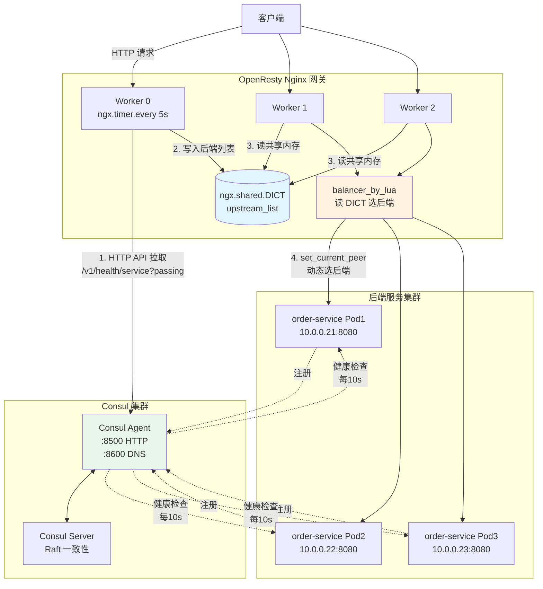

# A03 - Nginx 与 Consul 服务发现集成

> **版本基线**：Nginx 1.30.4 | Consul 1.18 | consul-template 0.37 | OpenResty 1.29.2.1
> **受众**：后端开发熟手，已通读阶段四（反向代理与负载均衡）和阶段七（OpenResty 与 Lua）。
> **本篇定位**：08-专题补充文档。解决一个核心问题——当后端节点动态扩缩容时，Nginx 的 `upstream` 配置如何自动更新而不需要人工 `vi nginx.conf`。本篇对比三种主流方案（consul-template、OpenResty + Lua、Nginx Plus DNS），给出完整可运行示例与逐行说明。

---

## 目录

- [1. 学习目标](#1-学习目标)
- [2. 核心知识点](#2-核心知识点)
  - [2.1 服务发现的概念：为什么需要](#21-服务发现的概念为什么需要)
  - [2.2 Consul 是什么](#22-consul-是什么)
  - [2.3 方案一：consul-template + Nginx（经典方案）](#23-方案一consul-template--nginx经典方案)
  - [2.4 方案二：OpenResty + lua-resty-http + Consul HTTP API](#24-方案二openresty--lua-resty-http--consul-http-api)
  - [2.5 方案三：Nginx Plus 的 DNS 服务发现](#25-方案三nginx-plus-的-dns-服务发现)
  - [2.6 方案对比表格](#26-方案对比表格)
  - [2.7 Mermaid 图：Consul + Nginx 架构图](#27-mermaid-图consul--nginx-架构图)
- [3. 最佳实践](#3-最佳实践)
- [4. 小结](#4-小结)

---

## 1. 学习目标

本篇聚焦"动态 upstream"这一微服务架构下的高频需求。原生 Nginx 的 `upstream` 块是静态的——写在配置文件里，改了之后必须 `nginx -s reload` 才能生效。这在节点固定的传统部署里没问题，但在容器化/弹性伸缩场景下就成了瓶颈：新扩出来的 Pod 还没注册到 Nginx，缩容的节点还留在 upstream 里继续被转发请求导致 502。

学完本篇，你应当能够：

- 说清"服务发现"要解决的问题：动态扩缩容时 Nginx upstream 列表需自动更新，避免人工 reload 与请求打到已下线节点。
- 理解 Consul 的三大能力：服务注册与发现、KV 存储、健康检查，并知道它们如何配合 Nginx。
- 用 **consul-template** 方案落地：编写模板生成 `nginx.conf` 的 upstream 段，监听 Consul 变更并自动 reload Nginx。
- 用 **OpenResty + Lua** 方案落地：`ngx.timer.every` 周期拉取 Consul HTTP API，写入 `ngx.shared.DICT`，在 `balancer_by_lua` 中读取并动态选后端——全程零 reload。
- 了解 **Nginx Plus** 商业版的 `resolve` 参数方案：upstream 里写域名，Nginx 自己定期 DNS 解析。
- 根据团队技术栈选择合适方案（运维驱动选 consul-template，网关团队选 OpenResty，有钱选 Nginx Plus）。

> **前置知识**：阅读本篇前，请确保已读完 [10-upstream负载均衡算法](../04-反向代理与负载均衡/10-upstream负载均衡算法.md)（理解 upstream 配置与负载均衡算法）和 [24-OpenResty核心API](../07-OpenResty与Lua插件/24-OpenResty核心API.md)（理解 `ngx.shared.DICT`、`balancer_by_lua`）。

---

## 2. 核心知识点

### 2.1 服务发现的概念：为什么需要

先看一个真实的故障场景：

```
凌晨 3 点，业务流量上涨，HPA 自动扩容 order-service 从 3 个 Pod 到 8 个 Pod。
新 Pod 启动后，注册到了 Consul/etcd，但 Nginx 的 upstream 里还只有原来的 3 个 IP。
结果：Nginx 把所有流量打到 3 个旧 Pod，新 Pod 闲置，旧 Pod 被压垮，响应时间飙升，触发告警。
运维被叫醒，手动 vi nginx.conf，加 5 个 server，nginx -s reload，问题缓解。
```

这就是"静态 upstream"在弹性伸缩场景下的典型问题。**服务发现**要解决的就是：让 Nginx 能自动感知后端节点列表的变化，无需人工干预。

服务发现的核心流程（三步）：

1. **注册**：服务启动时把自己的地址（IP:Port）注册到注册中心（Consul/etcd/Nacos/Zookeeper）。
2. **发现**：消费方（Nginx）从注册中心拉取服务地址列表。
3. **健康检查**：注册中心定期检查服务健康状态，摘除不健康节点，消费方感知到摘除。

关键矛盾在于第 2 步的"感知方式"——Nginx 原生没有"主动拉取注册中心"的能力，所以需要外挂方案。本篇讲的三种方案本质都是解决"Nginx 如何拿到最新的后端列表"。

| 维度 | 静态 upstream | 服务发现 |
|------|--------------|---------|
| 节点变更生效 | 人工编辑 + reload | 自动更新 |
| 适用场景 | 节点固定 | 弹性伸缩 / 容器化 |
| 故障恢复 | 依赖人工 | 自动摘除不健康节点 |
| 配置成本 | 低 | 高（需部署注册中心 + 集成组件） |

### 2.2 Consul 是什么

Consul 是 HashiCorp 出品的分布式服务网格工具，核心能力有三个：

1. **服务注册与发现**：服务通过 HTTP API 或配置文件注册到 Consul，消费方通过 HTTP API 或 DNS 查询服务对应的节点列表。Consul 集群本身用 Raft 协议保证一致性。
2. **KV 存储**：提供层次化的 Key-Value 存储（类似 etcd），可用于配置分发、leader 选举、特性开关。本篇主要用服务发现能力，KV 存储在 consul-template 里也能作为数据源。
3. **健康检查**：Consul agent 会对注册的服务做健康检查（HTTP/TCP/Script/Docker），检查失败则标记节点为 critical，查询时默认只返回 passing 状态的节点——这正是服务发现"自动摘除不健康节点"的关键。

一个典型的服务注册（HTTP API 方式）：

```bash
# 服务启动后向本地 Consul agent 注册
curl -X PUT http://127.0.0.1:8500/v1/agent/service/register -d '{
  "ID": "order-service-10.0.0.21-8080",
  "Name": "order-service",
  "Address": "10.0.0.21",
  "Port": 8080,
  "Check": {
    "HTTP": "http://10.0.0.21:8080/health",
    "Interval": "10s",
    "Timeout": "2s",
    "DeregisterCriticalServiceAfter": "30s"
  }
}'
```

逐行说明：
- `ID`：服务实例的唯一标识，一般用 `服务名-IP-端口` 拼接，便于排查。
- `Name`：服务逻辑名，**发现时按 Name 查询**，返回该 Name 下所有健康实例。这是关键——多个 Pod 注册同一个 Name，查询时一次拿到全部。
- `Address` / `Port`：实例地址。
- `Check.HTTP`：健康检查的 HTTP 端点，每 `Interval` 检查一次。
- `DeregisterCriticalServiceAfter`：节点持续 critical 超过此时间后自动反注册，避免僵尸实例。

查询健康实例的 HTTP API：

```bash
# 查询 order-service 的健康实例（默认只返回 passing 状态）
curl http://127.0.0.1:8500/v1/health/service/order-service?passing
```

返回 JSON 数组，每个元素包含节点地址、端口、健康状态等。本篇三种方案都基于这个 API 或 Consul 的 DNS 接口。

### 2.3 方案一：consul-template + Nginx（经典方案）

这是社区最早、应用最广的方案。核心思路：用一个叫 `consul-template` 的守护进程订阅 Consul 的数据变更，根据模板文件生成 `nginx.conf` 的 upstream 段，并在数据变化时执行 `nginx -s reload`。

#### consul-template 的工作原理

```
Consul 集群  --(watch 数据变更)-->  consul-template 进程
                                      |
                                      |--- 读模板文件 nginx.tmpl
                                      |--- 渲染生成 nginx upstream.conf
                                      |--- 执行 command（nginx -s reload）
```

- consul-template 启动后通过长轮询（long poll）监听 Consul，Consul 数据变更会立即推送。
- 收到变更后，consul-template 读取 `.tmpl` 模板，用 Consul 数据填充模板变量，生成新的配置文件。
- 生成成功后执行配置的 `command`（通常是 `nginx -s reload`）。
- 如果渲染失败（比如模板语法错误），不会执行 command，避免把错误配置 reload 进去导致 Nginx 挂掉。

#### 模板语法

consul-template 用 Go template 语法，常用函数：

| 函数 | 作用 | 示例 |
|------|------|------|
| `service` | 查询健康服务实例 | `{{ service "order-service" }}` |
| `key` | 查询 KV 存储的值 | `{{ key "nginx/worker_processes" }}` |
| `range` | 遍历列表 | `{{ range service "order-service" }}...{{ end }}` |
| `.Address` | 实例地址 | `{{ .Address }}` |
| `.Port` | 实例端口 | `{{ .Port }}` |

#### 生成 nginx upstream 配置

模板文件 `nginx-upstream.tmpl`：

```
# 由 consul-template 自动生成，请勿手动编辑
upstream order_service {
    {{ range service "order-service" }}
    server {{ .Address }}:{{ .Port }}; # {{ .Name }}
    {{ end }}
}
```

渲染结果（假设 Consul 里有 3 个健康实例）：

```nginx
upstream order_service {
    server 10.0.0.21:8080; # order-service-10.0.0.21-8080
    server 10.0.0.22:8080; # order-service-10.0.0.22-8080
    server 10.0.0.23:8080; # order-service-10.0.0.23-8080
}
```

#### 自动 reload Nginx

consul-template 的配置文件 `consul-template.hcl`：

```hcl
# consul-template 配置文件（HCL 格式）
# 指定 Consul 地址
consul {
  address = "127.0.0.1:8500"
  # 重试次数
  retry {
    enabled = true
    attempts = 12
    backoff = "250ms"
  }
}

# 模板定义：可以多个
template {
  # 源模板
  source      = "/etc/consul-template/templates/nginx-upstream.tmpl"
  # 生成目标
  destination = "/etc/nginx/conf.d/upstream.conf"
  # 生成后执行的命令：reload Nginx
  # nginx -t 先校验配置语法，通过才 reload，避免坏配置
  command     = "if nginx -t 2>/dev/null; then nginx -s reload; fi"
  # command 执行的超时
  command_timeout = "30s"
  # 渲染失败时保留旧文件（默认 true，建议保持）
  perms = 0644
  # 防抖：数据变化后等待此时间再渲染，避免频繁 reload
  wait {
    min = "5s"
    max = "30s"
  }
}

# 日志级别
log_level = "info"
# PID 文件
pid_file = "/var/run/consul-template.pid"
```

逐行说明：
- `consul.address`：Consul agent 地址，本篇假设 Nginx 与 Consul agent 部署在一起或网络可达。
- `retry`：Consul 连接失败时的重试策略，退避机制避免雪崩。
- `template.source` / `destination`：模板源与生成目标。注意 destination 必须被 `nginx.conf` 的 `include` 引用。
- `command`：**关键**——生成后执行的命令。这里用 `nginx -t` 先校验，通过才 reload，防止模板渲染出语法错误的配置把 Nginx 搞挂。这是生产必须加的保护。
- `wait.min` / `wait.max`：防抖窗口。Consul 数据可能在短时间内频繁变化（比如一批 Pod 同时注册），wait 让 consul-template 攒一波再渲染，避免 1 秒内 reload 多次。

#### 完整配置示例配逐行说明

主 `nginx.conf`（关键片段）：

```nginx
# /etc/nginx/nginx.conf
user nginx;
worker_processes auto;

events {
    worker_connections 10240;
}

http {
    include       /etc/nginx/mime.types;
    default_type  application/octet-stream;

    # -- 关键：include 由 consul-template 生成的 upstream 文件 --
    # upstream.conf 由 consul-template 渲染 nginx-upstream.tmpl 生成
    include /etc/nginx/conf.d/upstream.conf;

    # -- 长连接优化：upstream 开启 keepalive，配合下面的 proxy_http_version 1.1 --
    # 注意：keepalive 写在 upstream 块里（见 upstream.conf 模板）

    server {
        listen 80;
        server_name api.example.com;

        location /order/ {
            proxy_pass http://order_service;
            proxy_set_header Host $host;
            proxy_set_header X-Real-IP $remote_addr;
            proxy_set_header X-Forwarded-For $proxy_add_x_forwarded_for;

            # -- 长连接到后端：必须设置 http 版本 1.1 并清空 Connection 头 --
            proxy_http_version 1.1;
            proxy_set_header Connection "";

            # -- 主动健康检查（被动）：后端失败时快速摘除 --
            # nginx 开源版只有被动健康检查（max_fails + fail_timeout）
            proxy_next_upstream error timeout http_502 http_503 http_504;
            proxy_connect_timeout 2s;
            proxy_read_timeout 30s;
        }
    }
}
```

对应的 upstream 模板需要加上 keepalive 和负载均衡参数：

```
# /etc/consul-template/templates/nginx-upstream.tmpl
# 由 consul-template 自动生成，请勿手动编辑
upstream order_service {
    # 最小连接数算法：适合后端处理能力不均的场景
    least_conn;
    # 长连接池：到每个后端保持 32 条复用连接
    keepalive 32;
    {{ range service "order-service" }}
    # .Node 是 Consul 节点名，.Address/.Port 是实例地址
    server {{ .Address }}:{{ .Port }} max_fails=3 fail_timeout=10s; # {{ .Node }}
    {{ end }}
}
```

逐行说明：
- `least_conn`：最少连接数算法，避免新加的 Pod 瞬间承接过多请求（轮询会平均分配）。
- `keepalive 32`：到 upstream 的长连接池大小，配合 `proxy_http_version 1.1` 才生效。
- `range service "order-service"`：遍历 Consul 中名为 `order-service` 的健康实例。
- `max_fails=3 fail_timeout=10s`：被动健康检查——10 秒内失败 3 次则标记为不可用，10 秒后重试。这是 Nginx 开源版唯一的健康检查方式（主动健康检查要 Nginx Plus 或第三方模块）。

启动 consul-template：

```bash
consul-template -config /etc/consul-template/consul-template.hcl
```

通常用 systemd 托管，开机自启。验证：当 Consul 中 order-service 的实例数变化时，`/etc/nginx/conf.d/upstream.conf` 会自动更新并触发 reload。

### 2.4 方案二：OpenResty + lua-resty-http + Consul HTTP API

方案一的缺点是每次变更都要 `nginx -s reload`，reload 会重新读配置、fork 新 worker、老 worker 处理完存量请求后退出——虽然 Nginx reload 是"优雅"的，但在高频变更场景（如 K8s 滚动更新）会有抖动，且 reload 有一定开销。

方案二用 OpenResty 的 Lua 能力实现**零 reload 的动态 upstream**：后台定时器周期拉取 Consul，把后端列表存到共享内存，`balancer_by_lua` 阶段从共享内存读列表并选一个后端。整个过程不碰 nginx.conf。

#### ngx.timer.every 周期拉取

OpenResty 的 `ngx.timer.every` 在 worker 进程里启动一个周期定时器，每隔 N 秒执行一次回调。回调里用 `lua-resty-http` 调 Consul HTTP API，拿到后端列表。

注意：定时器是每个 worker 各自跑一份，所以要用 `ngx.shared.DICT` 做共享存储——所有 worker 读写同一份后端列表。但为了防止所有 worker 同时拉取造成对 Consul 的脉冲式压力，通常用 worker ID 做哈希，只让一个 worker 真正拉取（leader 选举）。

#### 写入 ngx.shared.DICT

拉到列表后，序列化成 JSON 存入 `ngx.shared.DICT`。`ngx.shared.DICT` 是所有 worker 共享的内存区域，worker 间通信靠它。

#### balancer_by_lua 读取

`balancer_by_lua` 是 Nginx 选定 upstream server 的阶段（在 `proxy_pass` 之后、真正建立连接之前）。在这个阶段用 Lua 读取共享内存里的后端列表，自己实现负载均衡算法（轮询/随机/最少连接），然后用 `balancer.balance` 指定本次请求发往哪个后端。

#### 完整 Lua 代码示例配逐行说明

Nginx 配置：

```nginx
# nginx.conf
http {
    lua_package_path "/usr/local/openresty/lualib/?.lua;/usr/local/openresty/lualib/plugins/?.lua;;";

    # -- 共享内存：存后端列表 --
    lua_shared_dict upstream_list 1m;
    # -- 共享内存：存轮询游标（负载均衡用） --
    lua_shared_dict upstream_state 1m;

    # -- init_worker 阶段启动定时器 --
    init_worker_by_lua_file plugins/sd_init.lua;

    upstream order_service {
        # 占位 server，实际由 balancer_by_lua 决定
        # 必须有一个 server，否则 Nginx 启动报错；0.0.0.1 是不可路由地址，防止误连
        server 0.0.0.1:80;
        # 声明用 Lua 做负载均衡
        balancer_by_lua_file plugins/sd_balancer.lua;
        keepalive 32;
    }

    server {
        listen 80;
        server_name api.example.com;

        location /order/ {
            proxy_pass http://order_service;
            proxy_http_version 1.1;
            proxy_set_header Connection "";
            proxy_set_header Host $host;
        }
    }
}
```

逐行说明：
- `lua_shared_dict upstream_list 1m`：1MB 足够存几百个后端节点的 JSON。共享内存大小要在 nginx 启动前定好，运行时不能改。
- `server 0.0.0.1:80`：**必须**有一个占位 server，否则 `upstream` 块为空，Nginx 启动会报 `no servers are inside upstream`。`0.0.0.1` 是不可路由地址，即使 balancer 失效也不会误连。
- `balancer_by_lua_file`：每次请求都进这个 Lua 文件选后端。

定时器初始化文件 `plugins/sd_init.lua`：

```lua
-- ============================================================
-- 服务发现：定时拉取 Consul 后端列表
-- 阶段：init_worker_by_lua
-- 功能：每个 worker 启动定时器，周期拉取 Consul 写入 shared.DICT
-- 依赖：lua-resty-http（opm install auto / lua-resty-http）
-- ============================================================

local http = require "resty.http"
local cjson = require "cjson.safe"

-- 共享内存
local upstream_list = ngx.shared.upstream_list
local upstream_state = ngx.shared.upstream_state

-- Consul 配置
local CONSUL_BASE = "http://127.0.0.1:8500"
local SERVICE_NAME = "order-service"
local SYNC_INTERVAL = 5  -- 拉取间隔（秒）

-- ============================================================
-- 拉取 Consul 并更新共享内存
-- ============================================================
local function sync_upstreams()
    -- 1. 创建 HTTP 客户端（cosocket，只能在 timer/某些阶段用，init_worker 的 timer 里可以用）
    local httpc = http.new()
    -- 2. 请求 Consul 健康实例 API，?passing 只返回健康节点
    local res, err = httpc:request_uri(CONSUL_BASE .. "/v1/health/service/" .. SERVICE_NAME .. "?passing", {
        method = "GET",
        timeout = 3000,  -- 3 秒超时，防止 Consul 卡住定时器
    })

    if not res then
        ngx.log(ngx.ERR, "failed to fetch from consul: ", err)
        return
    end

    if res.status ~= 200 then
        ngx.log(ngx.ERR, "consul returned status ", res.status, ": ", res.body)
        return
    end

    -- 3. 解析 Consul 返回的 JSON
    -- 格式：[{ "Service": { "Address": "10.0.0.21", "Port": 8080 }, ... }, ...]
    local instances = cjson.decode(res.body)
    if not instances or #instances == 0 then
        ngx.log(ngx.WARN, "no healthy instances for ", SERVICE_NAME)
        -- 注意：这里不删旧列表，保留上次的结果，避免 Consul 抖动导致后端清空
        -- 只有持续为空才考虑清空（可加计数器逻辑）
        return
    end

    -- 4. 提取 Address:Port，组装成简洁列表
    local servers = {}
    for i, inst in ipairs(instances) do
        -- Service.Address 优先，没有则用 Node.Address
        local addr = inst.Service.Address
        if not addr or addr == "" then
            addr = inst.Node.Address
        end
        servers[i] = { addr = addr, port = inst.Service.Port }
    end

    -- 5. 写入共享内存（覆盖式写入）
    -- 用 add+replace 模式或直接 set；这里用 set，简单覆盖
    local data = cjson.encode(servers)
    local ok, err = upstream_list:set("servers", data)
    if not ok then
        ngx.log(ngx.ERR, "failed to set upstream_list: ", err)
        return
    end

    ngx.log(ngx.INFO, "synced ", #servers, " upstreams for ", SERVICE_NAME)
end

-- ============================================================
-- 启动周期定时器
-- ============================================================
-- ngx.timer.every 返回一个 timer 对象，周期执行回调
-- 注意：定时器在每个 worker 各自跑一份，为避免所有 worker 同时拉取 Consul
-- 可以用 ngx.worker.id() 做哈希，只让 worker 0 拉取（leader 模式）
-- 这里简化：所有 worker 都拉，但 Consul 压力不大时可接受
local handler
handler = function(premature)
    if premature then
        -- premature=true 表示 Nginx 正在退出，不再拉取
        return
    end

    sync_upstreams()

    -- 用 ngx.timer.every 等价于下面这种递归 ngx.timer.at
    -- 这里展示 at 的写法，便于控制下次间隔（如失败时退避）
    local ok, err = ngx.timer.at(SYNC_INTERVAL, handler)
    if not ok then
        ngx.log(ngx.ERR, "failed to create timer: ", err)
    end
end

-- 只有 worker 0 启动拉取，避免多 worker 重复拉取（leader 选举的简易版）
if ngx.worker.id() == 0 then
    local ok, err = ngx.timer.at(0, handler)
    if not ok then
        ngx.log(ngx.ERR, "failed to start sync timer: ", err)
        return
    end
    ngx.log(ngx.INFO, "upstream sync timer started on worker 0")
end
```

逐行说明：
- `httpc:request_uri`：`lua-resty-http` 的同步请求 API（底层是 cosocket）。在 `ngx.timer` 里可以用 cosocket——这是 OpenResty 的关键能力，原生 Nginx 在 init 阶段无法发 HTTP。
- `?passing`：Consul API 参数，只返回健康实例， Consul 健康检查的结果直接体现在这里。
- `instances[i] = { addr, port }`：简化结构，只存必要字段，省内存。
- `upstream_list:set("servers", data)`：覆盖式写入。注意如果 Consul 返回空，这里不 set——保留旧值，避免后端列表突然清空导致全部 502（Consul 抖动时的保护）。
- `ngx.worker.id() == 0`：**leader 选举的简易版**——只有 worker 0 拉取，其他 worker 通过共享内存读结果。这避免了 N 个 worker 同时打 Consul。代价是 worker 0 挂了其他 worker 不接力（生产可用 worker ID 哈希 + 分布式锁做更健壮的选举，或用 `resty.lock`）。
- `ngx.timer.at(0, handler)`：`at(0)` 表示立即执行一次，然后回调里再 `at(SYNC_INTERVAL, ...)` 递归——这样可以在失败时调整间隔（退避），比 `every` 灵活。

负载均衡文件 `plugins/sd_balancer.lua`：

```lua
-- ============================================================
-- 服务发现：动态负载均衡
-- 阶段：balancer_by_lua
-- 功能：从共享内存读后端列表，轮询选一个后端
-- ============================================================

local cjson = require "cjson.safe"
local balancer = require "ngx.balancer"
local upstream_list = ngx.shared.upstream_list
local upstream_state = ngx.shared.upstream_state

-- 1. 从共享内存读后端列表
local data = upstream_list:get("servers")
if not data then
    -- 共享内存没有数据（启动初期 Consul 还没拉到）
    -- 返回 502，让客户端重试；也可以 fallback 到配置里的静态 server
    ngx.log(ngx.ERR, "no upstream data in shared dict")
    return 502
end

local servers = cjson.decode(data)
if not servers or #servers == 0 then
    ngx.log(ngx.ERR, "upstream list is empty")
    return 502
end

-- 2. 轮询选后端：用共享内存的原子 incr 做游标
-- incr 是原子的，多 worker 并发安全
local idx, _ = upstream_state:incr("cursor", 1, 0)
-- 取模得到数组下标（Lua 数组从 1 开始）
local target = servers[(idx % #servers) + 1]

-- 3. 调用 balancer API 指定本次请求的后端
local ok, err = balancer.set_current_peer(target.addr, target.port)
if not ok then
    ngx.log(ngx.ERR, "failed to set current peer: ", err)
    return 502
end

-- 4. 可选：设置重试到下一个后端（Nginx 的 proxy_next_upstream 机制）
-- set_more_tries 设置额外重试次数，失败时会重试其他后端
local tries = balancer.get_last_failure()
if not tries then
    -- 本次是第一次尝试，设置最多重试到其他 server
    balancer.set_more_tries(2)
end

-- set_current_peer 后不需要 return，Nginx 会用这个 peer 建立连接
```

逐行说明：
- `balancer.set_current_peer(addr, port)`：**核心 API**——告诉 Nginx 本次请求发往哪个后端。这是 OpenResty 动态负载均衡的关键，原生 Nginx 没有这个能力。
- `upstream_state:incr("cursor", 1, 0)`：原子自增，做轮询游标。`incr` 是共享内存的原子操作，多 worker 并发安全。第三个参数 0 是初始值。
- `(idx % #servers) + 1`：取模映射到数组下标。Lua 数组从 1 开始，所以 +1。
- `balancer.set_more_tries(2)`：设置额外重试次数。配合 `proxy_next_upstream`，当前 peer 失败时会自动重试到其他 server——这是动态 upstream 下保证可用性的关键（拉取到的某个后端恰好挂了）。
- `balancer.get_last_failure()`：判断本次是不是重试。如果是重试（说明上一个 peer 失败了），可以跳过失败的 peer 选下一个。

方案二相比方案一的优势：零 reload，变更对在线请求完全无感；缺点是 Lua 代码维护成本高，负载均衡算法要自己实现（轮询简单，最少连接/一致性哈希要自己写）。

### 2.5 方案三：Nginx Plus 的 DNS 服务发现

Nginx Plus（商业版）原生支持 DNS 服务发现，不需要 consul-template 也不需要 Lua。核心是用 `resolve` 参数让 Nginx 自己定期解析 upstream 里的域名。

```nginx
http {
    # -- resolver 指定 DNS 服务器（这里是 Consul 的 DNS 接口，端口 8600） --
    # valid=10s 表示解析结果缓存 10 秒，过期后重新解析
    resolver 127.0.0.1:8600 valid=10s ipv6=off;

    upstream order_service {
        # -- 关键：server 用域名，加 resolve 参数 --
        # Consul DNS 接口：<service-name>.service.consul 返回该服务的健康实例 IP
        # resolve 参数让 Nginx Plus 定期重新解析这个域名，感知 IP 变化
        server order-service.service.consul:8080 resolve;

        # 商业版还有主动健康检查
        health_check interval=5s fails=3 passes=2;
    }

    server {
        listen 80;
        location /order/ {
            proxy_pass http://order_service;
        }
    }
}
```

逐行说明：
- `resolver 127.0.0.1:8600`：DNS 服务器地址。这里指向 Consul agent 的 DNS 接口（Consul 默认在 8600 端口提供 DNS 服务）。也可以是 CoreDNS、kube-dns 等。
- `valid=10s`：解析结果缓存有效期。过期后 Nginx 主动重新解析，这是"动态发现"的关键——开源版 Nginx 只在启动/reload 时解析一次，Plus 版会周期解析。
- `server order-service.service.consul:8080 resolve`：`order-service.service.consul` 是 Consul 的 DNS 查询格式，返回所有健康实例的 IP。`resolve` 参数启用周期重解析。**注意：开源版 Nginx 不支持 `resolve` 参数**，这是 Plus 独有特性。
- `health_check`：Nginx Plus 的**主动健康检查**——定期主动探测后端，失败自动摘除，恢复自动加回。开源版只有被动健康检查（max_fails/fail_timeout）。

方案三的优势：零代码、原生支持、有主动健康检查；劣势：要花钱买 Nginx Plus 授权。适合预算充足、不想引入额外组件（consul-template/OpenResty）的团队。

> **开源版 Nginx 的 DNS 小技巧**：开源版虽然不支持 upstream 里的 `resolve`，但可以在 `proxy_pass` 里直接用域名 + `resolver`：
> ```nginx
> location /order/ {
>     resolver 127.0.0.1:8600 valid=10s;
>     # proxy_pass 里用变量时，Nginx 会在运行时解析（走 resolver），而不是启动时解析
>     set $backend "order-service.service.consul";
>     proxy_pass http://$backend:8080;
> }
> ```
> 这是一种"穷人版 DNS 服务发现"，但缺点是失去 upstream 的负载均衡算法和 keepalive 长连接池，每个请求都重新解析（有 valid 缓存兜底，开销可控）。仅适合简单场景。

### 2.6 方案对比表格

| 维度 | 方案一：consul-template | 方案二：OpenResty + Lua | 方案三：Nginx Plus DNS |
|------|------------------------|------------------------|----------------------|
| 是否需要 reload | 需要（自动 reload） | 不需要（零 reload） | 不需要（内部重解析） |
| 健康检查 | 被动（max_fails） | 自实现（依赖 Consul） | 主动（health_check） |
| 负载均衡算法 | Nginx 原生（全部支持） | 自实现（轮询/随机/最少连接） | Nginx 原生（全部支持） |
| 变更生效延迟 | 秒级（防抖 wait + reload） | 拉取间隔（默认 5s） | valid 缓存（默认 10s） |
| 代码维护成本 | 低（模板语法） | 高（Lua 代码） | 无（纯配置） |
| 额外组件 | consul-template 进程 | OpenResty + lua-resty-http | Nginx Plus 授权 |
| 费用 | 免费开源 | 免费开源 | 商业收费 |
| 适用场景 | 运维驱动、传统部署 | 网关团队、高频变更 | 预算充足、追求简单 |

选型建议：
- **中小团队 / 变更不频繁**：方案一（consul-template），社区成熟、文档多、出问题好排查。
- **有 OpenResty 网关团队 / K8s 高频滚动更新**：方案二（OpenResty + Lua），零 reload 无抖动，且能和现有网关插件（鉴权/限流）统一在 Lua 层管理。
- **预算充足 / 不想引入额外组件**：方案三（Nginx Plus），最省心，还有主动健康检查。

### 2.7 Mermaid 图：Consul + Nginx 架构图

以方案二（OpenResty + Lua）为例的完整架构：



图解：
- 后端 Pod 启动时向 Consul Agent 注册，Agent 定期对 Pod 做健康检查（HTTP/TCP），不健康的 Pod 被标记 critical。
- Worker 0 的定时器每 5 秒拉取一次 Consul 的 `/v1/health/service?passing`（只拿健康实例），写入共享内存 `ngx.shared.DICT`。只有 worker 0 拉取（leader 模式），其他 worker 共享结果。
- 请求进来时，任意 worker 的 `balancer_by_lua` 从共享内存读后端列表，用轮询/随机算法选一个，调用 `balancer.set_current_peer` 指定后端。
- 全程不碰 nginx.conf，不 reload，Pod 扩缩容对在线请求无感。

---

## 3. 最佳实践

1. **永远先 `nginx -t` 再 reload**（方案一）。consul-template 的 `command` 必须是 `if nginx -t; then nginx -s reload; fi`，防止模板渲染出语法错误的配置把 Nginx 搞挂。这是血泪教训——没加这个保护，一个模板笔误就能让整个网关下线。

2. **拉取失败时保留旧的后端列表**（方案二）。Consul 抖动或网络故障导致拉取失败时，不要清空共享内存——保留上一次成功的列表，让网关继续用旧列表服务。只有持续失败 N 次才考虑清空或告警。代码里 `sync_upstreams` 在 `instances` 为空时直接 return 不 set，就是这个目的。

3. **拉取间隔与 Consul 健康检查间隔要协调**。Consul 健康检查 `Interval=10s`，Nginx 拉取间隔 `SYNC_INTERVAL=5s`——拉取比检查频繁，保证摘除的节点能被及时发现。如果拉取间隔大于健康检查间隔，摘除的节点会在 Nginx 里多停留一个拉取周期。

4. **用 leader 选举避免多 worker 重复拉取**（方案二）。`ngx.timer.every` 在每个 worker 都跑一份，N 个 worker 同时拉 Consul 会造成 N 倍压力。用 `ngx.worker.id() == 0` 只让一个 worker 拉取，其他 worker 共享结果。更健壮的做法是用 `resty.lock` 或基于 KV 的分布式锁，worker 0 挂了其他 worker 能接管。

5. **占位 server 用不可路由地址**（方案二）。`upstream` 块里必须有至少一个 `server`，否则 Nginx 启动报错。用 `server 0.0.0.1:80` 占位——`0.0.0.1` 是不可路由地址，即使 balancer 失效也不会误连到真实服务。千万别用 `127.0.0.1` 占位，可能误连本机其他服务。

6. **设置重试次数兜底**（方案二）。`balancer.set_more_tries(2)` 让当前 peer 失败时自动重试其他后端。动态拉取的列表里某个后端可能恰好挂了（拉取后到请求前的时间窗口），重试机制能保证可用性。

7. **监控 Consul 连接状态**。三种方案都依赖 Consul 可达，Consul 集群挂了服务发现就停摆。要监控：consul-template 的拉取成功率、OpenResty 定时器的错误日志、Consul 集群本身的健康状态。Consul 故障时 Nginx 用旧列表继续服务，但要尽快恢复。

8. **滚动更新时注意优雅下线**。Pod 缩容时，先从 Consul 反注册（或停止健康检查让它变 critical），等 Nginx 拉取到新列表后再杀 Pod。否则 Pod 被杀但 Nginx 还在转发，导致 502。K8s 的 preStop hook + `terminationGracePeriodSeconds` 配合可以实现这个流程。

9. **方案混用要避免冲突**。如果同时用 consul-template 生成静态 upstream 文件，又在 Nginx 里用 OpenResty Lua 动态负载，两套机制会打架。一个 upstream 要么走 consul-template（静态生成），要么走 Lua（动态 balancer），不要混用。

10. **灰度发布用权重而非地址切换**。动态 upstream 改的是"有哪些后端"，灰度发布要控制"流量比例"。方案二里在 `balancer_by_lua` 按权重随机选后端（新版 Pod 权重 10%，旧版 90%），方案一/三则用 Nginx 的 `weight` 参数。详见 [A04 灰度发布](A04-Nginx作为K8s-Ingress控制器.md)。

---

## 4. 小结

本篇解决了"Nginx upstream 动态更新"这一微服务架构下的核心痛点。三种方案本质都是在回答同一个问题——"Nginx 怎么拿到最新的后端列表"：

- **consul-template**：外挂进程订阅 Consul，生成 nginx.conf 后 reload。经典方案，社区成熟，适合运维驱动。缺点是要 reload。
- **OpenResty + Lua**：定时器拉 Consul 写共享内存，balancer_by_lua 动态选后端。零 reload，适合高频变更和网关团队统一管理。缺点是 Lua 代码维护成本高。
- **Nginx Plus DNS**：upstream 用域名 + resolve，Nginx 自己定期解析。零代码，有主动健康检查。缺点是收费。

核心 takeaway：

1. 服务发现三步走——注册、发现、健康检查，Consul 三件事都能做。
2. `balancer_by_lua` + `ngx.shared.DICT` 是 OpenResty 动态负载均衡的基石，理解了它就能理解 Kong/APISIX 的 upstream 机制。
3. **reload 不是免费的**——高频变更场景下 reload 的抖动和开销会累积，这是方案二存在的根本理由。
4. 拉取失败要保留旧列表、占位 server 用 0.0.0.1、设置重试兜底——这三个细节是生产稳定的护城河。

下一篇 [A04 - Nginx 作为 K8s Ingress 控制器](A04-Nginx作为K8s-Ingress控制器.md) 把场景推进到 Kubernetes——Ingress Controller 本质上就是"K8s 原生的服务发现 + 动态 Nginx 配置"，理解了本篇的 consul-template 思路，再看 Ingress Controller 会非常自然。
