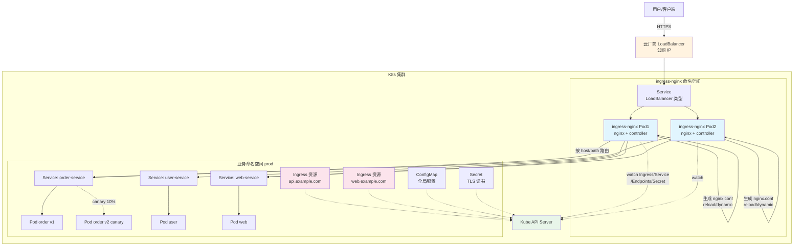

# A04 - Nginx 作为 K8s Ingress 控制器

> **版本基线**：Nginx 1.30.4 | Kubernetes 1.30 | ingress-nginx v1.11 | Helm 3.15
> **受众**：后端开发熟手，了解 K8s 基本概念（Pod/Service/Deployment），已通读阶段四（反向代理与负载均衡）。
> **本篇定位**：08-专题补充文档。把 Nginx 的应用场景从"独立部署的反向代理"推进到"K8s 集群入口"。本篇讲清 Ingress 与 Ingress Controller 的关系，对比社区 ingress-nginx 与 NGINX Inc 的实现，并覆盖域名/路径路由、TLS 终止、限流、灰度发布等六大常用场景。

---

## 目录

- [1. 学习目标](#1-学习目标)
- [2. 核心知识点](#2-核心知识点)
  - [2.1 Kubernetes Ingress 是什么](#21-kubernetes-ingress-是什么)
  - [2.2 Ingress Controller 是什么](#22-ingress-controller-是什么)
  - [2.3 Ingress-Nginx（community ingress-nginx）](#23-ingress-nginxcommunity-ingress-nginx)
  - [2.4 NGINX Inc 的 Ingress Controller](#24-nginx-inc-的-ingress-controller)
  - [2.5 常用 Ingress 配置场景](#25-常用-ingress-配置场景)
  - [2.6 Mermaid 图：Ingress 架构图](#26-mermaid-图ingress-架构图)
- [3. 最佳实践](#3-最佳实践)
- [4. 小结](#4-小结)

---

## 1. 学习目标

在 Kubernetes 里，Service（ClusterIP/NodePort）只能做四层负载均衡，无法按域名/路径做七层路由。要把外部流量按 `host` 和 `path` 路由到不同 Service，就需要 Ingress。而 Ingress 只是一份"路由规则的声明"（YAML 资源），真正执行路由的是 Ingress Controller——大多数团队选的就是基于 Nginx 的实现。

学完本篇，你应当能够：

- 说清 Ingress（资源）与 Ingress Controller（控制器）的区别：前者是声明式路由规则，后者把规则翻译成实际配置（如 nginx.conf）。
- 理解 community ingress-nginx 与原生 Nginx 的区别：它内置 Lua 扩展、支持动态配置（部分场景零 reload）、用 ConfigMap + 注解暴露功能。
- 画出 ingress-nginx 的架构：Controller Pod 监听 API Server → 生成 nginx.conf → reload Nginx。
- 用 Helm 安装 ingress-nginx，编写 Ingress 资源 YAML，并通过注解配置高级特性。
- 用注解实现：基于域名路由、基于路径路由、TLS 终止、负载均衡算法、限流、灰度发布（Canary）。
- 区分 community ingress-nginx 与 NGINX Inc 的 Ingress Controller，知道何时选哪个。
- 避开踩坑：注解写错不生效、TLS 证书管理、Canary 权重不准、长连接与 LB 健康检查冲突等。

> **前置知识**：阅读本篇前，请确保已读完 [08-虚拟主机](../03-核心机制/08-虚拟主机.md)（理解基于域名/路径的路由）和 [09-反向代理proxy_pass](../04-反向代理与负载均衡/09-反向代理proxy_pass.md)。K8s 基础概念（Pod/Service/Deployment）不展开讲，如不熟悉建议先看 K8s 入门资料。

---

## 2. 核心知识点

### 2.1 Kubernetes Ingress 是什么

Ingress 是 Kubernetes 的一种 API 资源（`kind: Ingress`），本质是一份**七层路由规则的声明**：把外部 HTTP/HTTPS 流量按域名和路径路由到集群内的 Service。

为什么需要 Ingress 而不是直接用 Service：

| 方案 | 能力 | 局限 |
|------|------|------|
| ClusterIP Service | 集群内四层负载均衡 | 集群外不可达 |
| NodePort Service | 暴露端口到节点 | 端口范围有限（30000-32767）、无法按域名路由、暴露节点 IP |
| LoadBalancer Service | 云厂商提供公网 LB | 每个 Service 一个 LB，贵且浪费；仍无法按域名/路径路由 |
| **Ingress** | **七层路由，按 host/path 分发到多个 Service** | 需要一个 Ingress Controller 执行规则 |

Ingress 的价值：一个公网入口（LoadBalancer Service 指向 Ingress Controller）+ 多个域名/路径路由到不同 Service，省 LB、能做七层路由。

一个最简 Ingress 资源示例：

```yaml
apiVersion: networking.k8s.io/v1
kind: Ingress
metadata:
  name: example-ingress
  namespace: default
spec:
  ingressClassName: nginx  # 指定用哪个 Ingress Controller 处理
  rules:
  - host: api.example.com  # 按域名路由
    http:
      paths:
      - path: /order        # 按 path 路由
        pathType: Prefix    # 前缀匹配
        backend:
          service:
            name: order-service  # 转发到这个 Service
            port:
              number: 8080
      - path: /user
        pathType: Prefix
        backend:
          service:
            name: user-service
            port:
              number: 8080
```

逐行说明：
- `ingressClassName: nginx`：指定由哪个 IngressClass 处理。一个集群可以装多个 Ingress Controller（如 nginx + traefik），用 IngressClass 区分。
- `host: api.example.com`：基于域名的虚拟主机。请求的 `Host` 头匹配这个域名才走这套规则。
- `pathType: Prefix`：路径匹配类型。`Prefix` 是前缀匹配（`/order` 匹配 `/order`、`/order/123`），`Exact` 是精确匹配，`ImplementationSpecific` 由 Controller 决定。
- `backend.service`：路由目标——集群内的 Service。注意 Ingress 不直接连 Pod，而是连 Service，Service 再做四层负载到 Pod。

这份 YAML 只是"声明"，本身不产生任何路由效果——必须有 Ingress Controller 监听这份资源并把它翻译成实际配置（如 nginx.conf 的 server/location 块）。

### 2.2 Ingress Controller 是什么

Ingress Controller 是一个运行在集群里的**控制器**（本质是一个 Deployment 的 Pod），它做两件事：

1. **监听 Ingress 资源**：通过 K8s Informer 机制 watch API Server，一旦 Ingress/Service/Endpoints/Secret 等相关资源变化，立即感知。
2. **生成并应用配置**：把 Ingress 规则翻译成自己底层负载均衡器的配置（Nginx 对应 nginx.conf），然后 reload 或动态更新。

为什么需要 Ingress Controller 而不是 K8s 自带？因为 Ingress 资源只是数据结构（API 定义），K8s 本身不知道怎么执行这些规则——执行逻辑由具体 Controller 实现。这体现了 K8s 的"控制面与数据面分离"设计：API Server 存储声明，Controller 负责把声明变成现实。

常见的 Ingress Controller：

| Controller | 底层 | 特点 |
|-----------|------|------|
| **ingress-nginx** | Nginx + Lua | 社区最流行，本篇主角 |
| **NGINX Inc Ingress** | Nginx/Nginx Plus | NGINX 官方出品，配置方式不同 |
| traefik | 自研 Go 反向代理 | 动态配置、无 reload、Let's Encrypt 集成好 |
| HAProxy Ingress | HAProxy | 老牌 LB，性能强 |
| Envoy Gateway | Envoy | 基于 Envoy，云原生新秀 |
| Contour | Envoy | CNCF 项目，配置与路由分离 |

本篇聚焦前两个（基于 Nginx 的实现）。

### 2.3 Ingress-Nginx（community ingress-nginx）

ingress-nginx 是 Kubernetes 社区维护的、基于 Nginx 的 Ingress Controller，也是装机量最大的实现。GitHub 仓库 `kubernetes/ingress-nginx`。

#### 与原生 Nginx 的区别

ingress-nginx 不是原封不动的 Nginx，它在原生 Nginx 基础上做了扩展：

1. **内置 Lua 扩展**：编译了 `lua-nginx-module`，在 Nginx 里嵌入 Lua，用于动态配置（如无需 reload 就能更新 upstream 列表）、认证、限流等。原生 Nginx 没有 Lua。
2. **动态 upstream**：通过 Lua + 共享内存实现 Endpoints 的动态更新。K8s 的 Pod 频繁扩缩容时，ingress-nginx 不需要每次都 reload Nginx，而是通过 Lua 动态选 Pod——这和 [A03 方案二](A03-Nginx与Consul服务发现集成.md) 的思路一致。
3. **配置模板化**：用 Go template 生成 nginx.conf，配置项通过 ConfigMap 和 Ingress 注解暴露，用户不需要直接写 nginx.conf。
4. **注解驱动**：大量功能通过 Ingress 资源的 `annotations` 控制（限流、超时、重写、灰度等），不用改全局配置。

对比表格：

| 维度 | 原生 Nginx | ingress-nginx |
|------|-----------|--------------|
| 配置方式 | 手写 nginx.conf | ConfigMap + Ingress 注解 + Go 模板 |
| upstream 更新 | 静态，需 reload | 动态（Lua），部分场景零 reload |
| 健康检查 | 被动（max_fails） | 主动（lua-resty-healthcheck）+ 被动 |
| 功能扩展 | 手动加模块/写 Lua | 注解即功能（限流、灰度、重写等开箱即用） |
| 服务发现 | 需外挂（consul-template 等） | 内置（watch K8s Endpoints） |

#### 架构图（Ingress Controller Pod 监听 API Server → 生成 nginx.conf → reload）

ingress-nginx 的 Pod 里跑两个容器（其实是一个进程 + 一个 sidecar 模式）：

```
┌─────────────────────────────────────────────┐
│           ingress-nginx Pod                  │
│                                              │
│  ┌────────────────┐    ┌─────────────────┐   │
│  │  nginx 容器     │    │  controller 容器 │   │
│  │  (数据面)       │    │  (控制面)        │   │
│  │                │    │                  │   │
│  │  - worker      │    │  - watch API     │   │
│  │  - master      │<-─-│    Server        │   │
│  │  - Lua 扩展    │    │  - 生成 nginx.conf│   │
│  │                │    │  - nginx -s      │   │
│  │                │    │    reload        │   │
│  └────────────────┘    └─────────────────┘   │
│         ^                                    │
│         | 共享 volume（nginx.conf 模板+生成）  │
└─────────┼────────────────────────────────────┘
          |
   LoadBalancer Service (公网入口)
```

实际上 ingress-nginx 用单容器双进程模式（一个镜像里同时跑 nginx 和 controller 进程），但逻辑上可以这样理解：

- **controller 进程**：Go 写的控制器，通过 Informer watch K8s API Server 的 Ingress/Service/Endpoints/Secret/ConfigMap 资源。资源变化时，用 Go template 渲染 `nginx.conf`，写到共享 volume，然后执行 `nginx -s reload`（动态配置走 Lua 不 reload）。
- **nginx 进程**：数据面，接收外部流量，按生成的 nginx.conf 路由。Lua 扩展处理动态 upstream、限流等。

#### 安装：helm install

用 Helm 安装 ingress-nginx 最简单：

```bash
# 1. 添加 ingress-nginx 官方 Helm 仓库
helm repo add ingress-nginx https://kubernetes.github.io/ingress-nginx
helm repo update

# 2. 安装（命名空间 ingress-nginx）
helm install ingress-nginx ingress-nginx/ingress-nginx \
  --namespace ingress-nginx \
  --create-namespace \
  --set controller.service.type=LoadBalancer \
  --set controller.replicaCount=2 \
  --set controller.config.allow-snippet-annotations=true
```

逐行说明：
- `--namespace ingress-nginx --create-namespace`：安装在独立命名空间，与业务隔离。
- `controller.service.type=LoadBalancer`：ingress-nginx 自带的 Service 类型。云上会自动创建公网 LB；裸机集群用 `NodePort` 或配 MetalB。
- `controller.replicaCount=2`：Controller 副本数，生产建议 >=2 保证高可用。注意：两个副本都跑 nginx，前面 LB 会负载到任一副本。
- `controller.config.*`：对应 ConfigMap，配置全局 nginx 参数（如 `allow-snippet-annotations` 允许在注解里写 nginx 配置片段）。

安装后验证：

```bash
# 查看 ingress-nginx Pod
kubectl get pods -n ingress-nginx
# 查看 Service（拿到公网 IP）
kubectl get svc -n ingress-nginx
# 查看 IngressClass
kubectl get ingressclass
```

#### Ingress 资源示例（YAML）

一个更完整的 Ingress 示例（带注解）：

```yaml
apiVersion: networking.k8s.io/v1
kind: Ingress
metadata:
  name: api-ingress
  namespace: prod
  annotations:
    # 注解：控制 ingress-nginx 的行为
    nginx.ingress.kubernetes.io/rewrite-target: /$1
    nginx.ingress.kubernetes.io/ssl-redirect: "true"
    nginx.ingress.kubernetes.io/proxy-body-size: "10m"
    nginx.ingress.kubernetes.io/proxy-read-timeout: "60"
spec:
  ingressClassName: nginx
  tls:
  - hosts:
    - api.example.com
    secretName: api-tls-secret  # TLS 证书存在 K8s Secret
  rules:
  - host: api.example.com
    http:
      paths:
      - path: /order/(.*)
        pathType: ImplementationSpecific
        backend:
          service:
            name: order-service
            port:
              number: 8080
```

逐行说明：
- `annotations`：ingress-nginx 的核心配置方式。`nginx.ingress.kubernetes.io/*` 前缀的注解会被 controller 读取并翻译成 nginx.conf 指令。这里配了重写、SSL 强制跳转、请求体大小、读超时。
- `tls`：TLS 终止配置。`secretName` 指向一个 `kubernetes.io/tls` 类型的 Secret，里面存证书和私钥。ingress-nginx 把它挂到 nginx 的 `ssl_certificate`。
- `path: /order/(.*)` + `rewrite-target: /$1`：正则捕获 + 重写。请求 `/order/v1/list` 会被重写为 `/v1/list` 转发给后端（去掉 `/order` 前缀）。`pathType` 必须是 `ImplementationSpecific` 才能走正则。

#### 注解（annotations）配置：nginx.ingress.kubernetes.io/*

ingress-nginx 有上百个注解，下面列最常用的：

| 注解 | 作用 | 示例值 |
|------|------|--------|
| `rewrite-target` | 路径重写 | `/$1` |
| `ssl-redirect` | HTTP 强制跳 HTTPS | `"true"` |
| `proxy-body-size` | 请求体大小上限 | `"10m"` |
| `proxy-read-timeout` | 读超时 | `"60"` |
| `proxy-connect-timeout` | 连接超时 | `"5"` |
| `limit-rps` | 每秒请求数限流 | `"100"` |
| `limit-connections` | 并发连接限流 | `"50"` |
| `limit-whitelist` | 限流白名单（CIDR） | `"10.0.0.0/8"` |
| `load-balance` | 负载均衡算法 | `round_robin` / `least_conn` / `ip_hash` |
| `canary` | 启用金丝雀发布 | `"true"` |
| `canary-weight` | 金丝雀流量权重 | `"10"` |
| `canary-by-header` | 按请求头路由金丝雀 | `"X-Canary"` |
| `configuration-snippet` | 注入自定义 nginx 配置 | `proxy_set_header X-Real-IP $remote_addr;` |
| `affinity` | 会话保持 | `cookie` |
| `cors-allow-origin` | CORS 允许来源 | `https://app.example.com` |
| `auth-url` | 外部认证 | `https://auth.example.com/check` |
| `backend-protocol` | 后端协议 | `HTTPS` / `GRPC` |
| `proxy-buffering` | 是否缓冲后端响应 | `"off"` |
| `upstream-hash-by` | 一致性哈希 key | `$request_uri` |

#### 代码示例配逐行说明

下面演示一个带限流 + 会话保持的 Ingress：

```yaml
apiVersion: networking.k8s.io/v1
kind: Ingress
metadata:
  name: web-ingress
  namespace: prod
  annotations:
    # 限流：每秒 50 请求，突发允许 100（令牌桶）
    nginx.ingress.kubernetes.io/limit-rps: "50"
    nginx.ingress.kubernetes.io/limit-burst: "100"
    # 限流白名单：内网不限流
    nginx.ingress.kubernetes.io/limit-whitelist: "10.0.0.0/8,192.168.0.0/16"
    # 会话保持：基于 cookie，同一客户端固定到同一 Pod
    nginx.ingress.kubernetes.io/affinity: "cookie"
    nginx.ingress.kubernetes.io/session-cookie-name: "SERVERID"
    nginx.ingress.kubernetes.io/session-cookie-hash: "sha1"
    # 负载均衡算法：最少连接
    nginx.ingress.kubernetes.io/load-balance: "least_conn"
    # 自定义配置片段：注入安全头
    nginx.ingress.kubernetes.io/configuration-snippet: |
      more_set_headers "X-Frame-Options: DENY";
      more_set_headers "X-Content-Type-Options: nosniff";
spec:
  ingressClassName: nginx
  rules:
  - host: web.example.com
    http:
      paths:
      - path: /
        pathType: Prefix
        backend:
          service:
            name: web-service
            port:
              number: 80
```

逐行说明：
- `limit-rps: "50"`：每秒允许 50 个请求，对应 nginx 的 `limit_req zone=req_zone burst=100`。超出的请求返回 503。
- `limit-burst: "100"`：突发桶大小，允许短时间超过 50 rps 到 100，平滑限流。
- `limit-whitelist`：白名单 CIDR 不受限流约束，常用于内网监控/压测。
- `affinity: "cookie"`：会话保持。ingress-nginx 给响应注入一个 `SERVERID` cookie，后续请求带这个 cookie 就路由到同一 Pod。适合有状态服务（如 websocket、session 存本地）。
- `session-cookie-hash: "sha1"`：cookie 值用 sha1 哈希后端地址，避免泄露内部 IP。
- `load-balance: "least_conn"`：改 upstream 负载均衡算法为最少连接。注意这个注解是全局生效（一个 Ingress 改了，所有共享该 upstream 的都变），实际作用域取决于 ingress-nginx 版本。
- `configuration-snippet`：注入任意 nginx 配置。`more_set_headers` 来自 headers-more 模块（ingress-nginx 内置），比 `add_header` 更强力（能覆盖默认头）。注意 `allow-snippet-annotations=true`（ConfigMap）才能用，新版本默认关闭防注入风险。

### 2.4 NGINX Inc 的 Ingress Controller

除了社区的 ingress-nginx，NGINX 官方（NGINX Inc，现属 F5）也出了一个 Ingress Controller，叫 `nginx-ingress`（注意命名容易混淆）。它有两个版本：

- **NGINX 开源版 Ingress Controller**：基于开源 Nginx，免费。
- **NGINX Plus Ingress Controller**：基于 Nginx Plus，商业版，有主动健康检查、动态 reconfiguration（零 reload）、JWT 认证等高级特性。

#### 与 community ingress-nginx 的区别

| 维度 | community ingress-nginx | NGINX Inc Ingress |
|------|------------------------|-------------------|
| 维护方 | Kubernetes 社区 | NGINX/F5 官方 |
| 配置方式 | ConfigMap + 注解 | ConfigMap + 注解（语法不同）+ 自定义资源 VirtualServer |
| 底层 | Nginx + 大量 Lua 扩展 | 原生 Nginx / Nginx Plus，少 Lua |
| upstream 更新 | Lua 动态（部分场景零 reload） | 开源版需 reload；Plus 版 API 动态更新（零 reload） |
| 健康检查 | Lua 主动 + 被动 | 开源版被动；Plus 版主动健康检查 |
| 高级特性 | 注解丰富但较杂 | Plus 版有 JWT 认证、API 网关、mTLS 等 |
| 注解前缀 | `nginx.ingress.kubernetes.io/*` | `nginx.org/*` |
| 自定义资源 | 无（纯 Ingress） | VirtualServer/VirtualServerRoute（更灵活） |

简要说明：
- NGINX Inc 的实现更"正统"——配置更接近原生 Nginx 语法，对 Nginx 老用户友好。
- `VirtualServer` 自定义资源比原生 Ingress 表达力更强（支持流量分割、匹配条件等），适合复杂路由。
- 商业版（Plus）的零 reload 和主动健康检查是社区版用 Lua 绕路实现的，Plus 是原生支持，更稳定。
- 选型：已用 Nginx Plus / 需要官方商业支持 / 路由复杂度高于普通 Ingress → 选 NGINX Inc；社区生态 / 免费 / 注解丰富 → 选 community ingress-nginx。本篇后续场景以 community ingress-nginx 为主。

### 2.5 常用 Ingress 配置场景

#### 场景一：基于域名的路由

最基础场景——不同域名路由到不同 Service。

```yaml
apiVersion: networking.k8s.io/v1
kind: Ingress
metadata:
  name: domain-routing
spec:
  ingressClassName: nginx
  rules:
  - host: api.example.com
    http:
      paths:
      - path: /
        pathType: Prefix
        backend:
          service: { name: api-service, port: { number: 80 } }
  - host: console.example.com
    http:
      paths:
      - path: /
        pathType: Prefix
        backend:
          service: { name: console-service, port: { number: 80 } }
```

ingress-nginx 会生成两个 `server` 块（对应两个 `server_name`），原生 Nginx 的虚拟主机机制。详见 [08-虚拟主机](../03-核心机制/08-虚拟主机.md)。

#### 场景二：基于路径的路由

同一域名下，不同路径路由到不同 Service（微服务网关常见）。

```yaml
apiVersion: networking.k8s.io/v1
kind: Ingress
metadata:
  name: path-routing
spec:
  ingressClassName: nginx
  rules:
  - host: api.example.com
    http:
      paths:
      - path: /order
        pathType: Prefix
        backend:
          service: { name: order-service, port: { number: 8080 } }
      - path: /user
        pathType: Prefix
        backend:
          service: { name: user-service, port: { number: 8080 } }
      - path: /pay
        pathType: Prefix
        backend:
          service: { name: pay-service, port: { number: 8080 } }
```

生成一个 `server` 块，里面三个 `location`。注意 `pathType: Prefix` 的匹配是最长前缀优先（和 Nginx location 的前缀匹配规则一致）。详见 [07-location匹配规则](../03-核心机制/07-location匹配规则.md)。

#### 场景三：TLS 终止

在 Ingress 层做 HTTPS 卸载，后端用 HTTP，省去每个 Pod 配证书。

```yaml
apiVersion: networking.k8s.io/v1
kind: Ingress
metadata:
  name: tls-ingress
  annotations:
    # HTTP 强制跳转 HTTPS
    nginx.ingress.kubernetes.io/ssl-redirect: "true"
    # 使用 HTTP/2
    nginx.ingress.kubernetes.io/use-http2: "true"
spec:
  ingressClassName: nginx
  tls:
  - hosts:
    - api.example.com
    secretName: api-tls-secret
  rules:
  - host: api.example.com
    http:
      paths:
      - path: /
        pathType: Prefix
        backend:
          service: { name: api-service, port: { number: 80 } }
```

TLS 证书通过 Secret 提供：

```bash
# 用 kubectl 创建 TLS Secret（证书文件 cert.pem + 私钥 key.pem）
kubectl create secret tls api-tls-secret \
  --cert=cert.pem \
  --key=key.pem \
  -n prod
```

生产推荐用 **cert-manager** 自动签发和续期 Let's Encrypt 证书，不用手动维护。`ssl-redirect: "true"` 让所有 HTTP 请求 301 跳 HTTPS。

#### 场景四：负载均衡算法（通过注解）

通过注解切换 upstream 的负载均衡算法：

```yaml
apiVersion: networking.k8s.io/v1
kind: Ingress
metadata:
  name: lb-ingress
  annotations:
    # 可选：round_robin（默认）/ least_conn / ip_hash / ewma（指数加权移动平均，ingress-nginx 特有）
    nginx.ingress.kubernetes.io/load-balance: "ewma"
    # 一致性哈希（需配合 upstream-hash-by）
    # nginx.ingress.kubernetes.io/upstream-hash-by: "$request_uri"
spec:
  ingressClassName: nginx
  rules:
  - host: api.example.com
    http:
      paths:
      - path: /
        pathType: Prefix
        backend:
          service: { name: api-service, port: { number: 80 } }
```

说明：
- `round_robin`：默认轮询。
- `least_conn`：最少连接，适合后端处理能力不均。
- `ip_hash`：按客户端 IP 哈希，会话保持（但不如 cookie 灵活，IP 变了就失效）。
- `ewma`：ingress-nginx 特有的平滑加权轮询，根据后端延迟动态调整权重，慢的少分——这是 ingress-nginx 默认算法，比纯轮询更智能。
- `upstream-hash-by`：一致性哈希，key 可以是 `$request_uri`、`$http_x_user_id` 等，适合缓存场景。

#### 场景五：限流（通过注解）

见 2.3 节的代码示例，这里补充多维度限流组合：

```yaml
apiVersion: networking.k8s.io/v1
kind: Ingress
metadata:
  name: limit-ingress
  annotations:
    # 维度一：每秒请求数（令牌桶）
    nginx.ingress.kubernetes.io/limit-rps: "100"
    nginx.ingress.kubernetes.io/limit-burst: "200"
    # 维度二：并发连接数
    nginx.ingress.kubernetes.io/limit-connections: "50"
    # 维度三：每分钟请求数（与 rps 独立，取更严的）
    nginx.ingress.kubernetes.io/limit-req-zone-key: "$binary_remote_addr"
    # 限流后返回的状态码（默认 503）
    nginx.ingress.kubernetes.io/limit-status-code: "429"
    # 白名单
    nginx.ingress.kubernetes.io/limit-whitelist: "10.0.0.0/8"
spec:
  ingressClassName: nginx
  rules:
  - host: api.example.com
    http:
      paths:
      - path: /
        pathType: Prefix
        backend:
          service: { name: api-service, port: { number: 80 } }
```

底层是 Nginx 的 `limit_req` 和 `limit_conn` 模块。`limit-status-code: "429"` 是推荐做法——429（Too Many Requests）比 503 更语义化，客户端能区分"限流"和"服务异常"。详见 [17-限流防护](../05-安全与传输/17-限流防护.md)。

#### 场景六：灰度发布（Canary）

ingress-nginx 通过 Canary 注解实现金丝雀发布，把少量流量导入新版本。

```yaml
# 主 Ingress：指向稳定版
apiVersion: networking.k8s.io/v1
kind: Ingress
metadata:
  name: api-stable
spec:
  ingressClassName: nginx
  rules:
  - host: api.example.com
    http:
      paths:
      - path: /
        pathType: Prefix
        backend:
          service: { name: api-service-stable, port: { number: 80 } }
---
# Canary Ingress：指向新版本，按权重导入流量
apiVersion: networking.k8s.io/v1
kind: Ingress
metadata:
  name: api-canary
  annotations:
    # 启用 canary
    nginx.ingress.kubernetes.io/canary: "true"
    # 方式一：按权重，10% 流量到新版本
    nginx.ingress.kubernetes.io/canary-weight: "10"
    # 方式二：按请求头（与权重二选一或组合）
    # nginx.ingress.kubernetes.io/canary-by-header: "X-Canary"
    # nginx.ingress.kubernetes.io/canary-by-header-value: "true"
    # 方式三：按 cookie
    # nginx.ingress.kubernetes.io/canary-by-cookie: "canary"
spec:
  ingressClassName: nginx
  rules:
  - host: api.example.com
    http:
      paths:
      - path: /
        pathType: Prefix
        backend:
          service: { name: api-service-canary, port: { number: 80 } }
```

逐行说明：
- **关键**：Canary Ingress 和主 Ingress 的 `host` + `path` 必须完全一致，ingress-nginx 通过 `canary: "true"` 注解识别这是金丝雀规则，把它叠加到主规则上。
- `canary-weight: "10"`：10% 流量到 canary Service，90% 到 stable Service。底层是 Nginx 的 `split_clients` 模块按 `$request_id` 哈希分配，保证同一请求始终走同一版本（避免会话错乱）。
- `canary-by-header`：按请求头路由。带 `X-Canary: true` 的请求走 canary，否则走 stable。适合主动测试——测试人员加 header 就能访问新版本。
- `canary-by-cookie`：按 cookie 路由，比 header 更适合灰度给特定用户。
- 三种方式可组合：权重 + header，带 header 的必走 canary，其余按权重分。

灰度发布流程：先 `canary-weight: 10` 观察，无异常逐步调到 30 → 50 → 100，最后删掉 stable Ingress，canary 转正。

### 2.6 Mermaid 图：Ingress 架构图



图解：
- 用户请求打到云厂商 LB，LB 转发到 ingress-nginx 的 Service（LoadBalancer 类型），Service 再负载到后端 ingress-nginx Pod。
- ingress-nginx Pod 里的 controller 进程通过 watch API Server 监听 Ingress/Service/Endpoints/Secret/ConfigMap 变化，生成 nginx.conf 并 reload（或走 Lua 动态更新）。
- nginx 进程按生成的配置，根据 `Host` 头和 `path` 把请求路由到对应的业务 Service，Service 再负载到具体 Pod。
- canary 场景下，ingress-nginx 通过 `split_clients` 把 10% 流量分到 canary Pod，90% 到 stable Pod。

---

## 3. 最佳实践

1. **生产至少 2 个 ingress-nginx 副本**。单副本是单点故障，Pod 重启时整个集群入口不可用。设置 `controller.replicaCount=2` 起步，高流量场景按需扩。配合 Pod 反亲和（anti-affinity）让副本分散到不同节点，避免节点故障导致全部副本挂掉。Helm values 里配 `controller.affinity`。

2. **用 cert-manager 自动管理 TLS 证书**。手动创建 TLS Secret 不可持续——证书过期了没人发现，导致线上 HTTPS 报错。装 cert-manager + 配置 Let's Encrypt Issuer，证书自动签发、自动续期、自动更新 Secret，ingress-nginx 自动感知并 reload。详见 cert-manager 官方文档。

3. **注解 `configuration-snippet` 慎用**。它允许注入任意 nginx 配置，灵活但有注入风险（如果注解值来自用户输入）。新版本 ingress-nginx 默认关闭 snippet，需要 ConfigMap 里 `allow-snippet-annotations: "true"` 才能用。能用原生注解解决的就不要用 snippet，必须用时确保注解值不被外部控制。

4. **Canary 权重不是精确的**。`canary-weight` 基于请求 ID 哈希分配，流量少时统计偏差大（100 个请求里可能有 15 个进 canary）。要精确控制流量比例，用 service mesh（Istio VirtualService）或后端网关层做。Canary 适合"小流量验证"而非"精确分流"。

5. **`use-regex` 与 `pathType` 要匹配**。正则路径必须 `pathType: ImplementationSpecific` 且在路径里用 `/(.*)` 这种正则语法，否则匹配不上。常见坑：写了正则但 `pathType: Prefix`，结果按前缀匹配，正则符号当字面量。

6. **长连接（WebSocket/gRPC）要配 `backend-protocol` 和超时**。WebSocket 默认会被 proxy 的读超时（60s）断开，要调大 `proxy-read-timeout` 并确保 `Connection` 头升级。gRPC 要 `nginx.ingress.kubernetes.io/backend-protocol: "GRPC"`。详见 [12-WebSocket代理](../04-反向代理与负载均衡/12-WebSocket代理.md)。

7. **关注 ingress-nginx 的 reload 频率**。虽然 ingress-nginx 有 Lua 动态 upstream，但配置变更（加/删 Ingress、改注解）仍会 reload。高频变更（如频繁扩缩容）时观察 reload 次数，过多会导致请求抖动。`controller.metrics` 暴露 reload 计数，配合 Prometheus 监控。详见 [A05 监控](A05-Nginx与Prometheus-Grafana监控.md)。

8. **LB 健康检查与 ingress 健康检查要对齐**。云厂商 LB 探测 ingress-nginx 的健康检查路径（默认 `/healthz`），要确保 ingress-nginx 配了对应的 health check 路径且返回 200。否则 LB 认为后端不健康，把流量切走，导致 503。Helm values 里 `controller.healthCheckPath` 可配。

9. **Ingress 资源用 namespace 隔离**。每个业务团队在自己的 namespace 里管自己的 Ingress，避免一个团队改错影响全局。但要注意 `ingressClassName` 一致，且 TLS Secret 要和 Ingress 在同一 namespace。

10. **配置兜底默认后端**。ingress-nginx 有一个默认后端（`default-backend`），请求没匹配任何 Ingress 规则时返回 404。生产建议自定义默认后端，返回友好的 404 页面或 JSON，而不是 ingress-nginx 默认的 "404 Not Found" 字符串。Helm values 里 `defaultBackend.enabled=true` 并自定义镜像。

---

## 4. 小结

本篇把 Nginx 的应用场景从"独立反向代理"推进到"K8s 集群入口"。核心概念：

- **Ingress 是声明**（YAML 资源），**Ingress Controller 是执行**（把声明翻译成 nginx.conf）。这是 K8s 控制面/数据面分离思想的体现。
- **ingress-nginx ≠ 原生 Nginx**：它在 Nginx 基础上加了 Lua 扩展（动态 upstream）、Go 模板（配置生成）、注解体系（功能开关），把 Nginx 改造成了 K8s 原生的七层路由器。
- **注解是 ingress-nginx 的灵魂**：限流、灰度、重写、会话保持、CORS、认证……几乎所有高级功能都通过 `nginx.ingress.kubernetes.io/*` 注解配置，不用写 nginx.conf。

六大场景串起来就是一套完整的 API 网关能力：
1. 域名路由（多租户/多产品线）
2. 路径路由（微服务拆分）
3. TLS 终止（HTTPS 卸载）
4. 负载均衡算法（ewma 默认就比轮询智能）
5. 限流（保护后端）
6. 灰度发布（Canary 权重/Header/Cookie）

核心 takeaway：

1. ingress-nginx 的动态 upstream 和 [A03 方案二](A03-Nginx与Consul服务发现集成.md) 的 OpenResty + Lua 思路一致——都是用 Lua + 共享内存避免 reload。理解了 A03，ingress-nginx 的 upstream 机制就通透了。
2. Ingress 资源只是"规则声明"，出问题先查 controller 是否正确生成 nginx.conf（`kubectl exec` 进 Pod 看 `/etc/nginx/nginx.conf`），再看 nginx 是否 reload 成功（controller 日志）。
3. 灰度发布的权重是近似的，精确分流要上 service mesh。Canary 适合验证，不适合 A/B 测试。
4. cert-manager 是 TLS 证书管理的标配，手动维护 Secret 在生产环境不可持续。

下一篇 [A05 - Nginx 与 Prometheus/Grafana 监控](A05-Nginx与Prometheus-Grafana监控.md) 解决"怎么看 Nginx 跑得怎么样"的问题——无论是独立 Nginx 还是 ingress-nginx，都要把指标接到 Prometheus，用 Grafana 看板和告警盯着。
