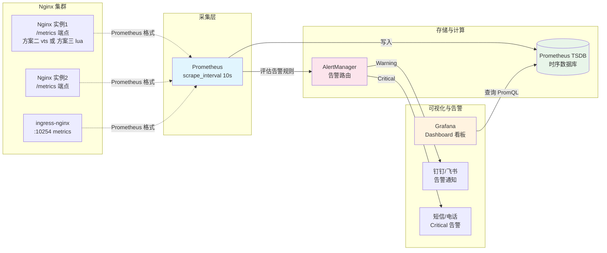

# A05 - Nginx 与 Prometheus/Grafana 监控

> **版本基线**：Nginx 1.30.4 | Prometheus 2.54 | Grafana 11.2 | OpenResty 1.29.2.1
> **受众**：后端开发熟手，已通读阶段六（高级与优化）的 [20-日志与监控](../06-高级与优化/20-日志与监控.md)。
> **本篇定位**：08-专题补充文档。把 Nginx 监控从"看 access log + stub_status"升级到"Prometheus 指标采集 + Grafana 可视化 + 告警"。本篇对比四种指标暴露方案（nginx-prometheus-exporter、nginx-vts-module、lua-resty-prometheus、nginx-exporter by prometheus），给出完整配置示例，并梳理六大关键监控指标。

---

## 目录

- [1. 学习目标](#1-学习目标)
- [2. 核心知识点](#2-核心知识点)
  - [2.1 监控的目标：可用性、性能、容量、错误率](#21-监控的目标可用性性能容量错误率)
  - [2.2 方案一：nginx-prometheus-exporter（NGINX Plus 的 /metrics API）](#22-方案一nginx-prometheus-exporternginx-plus-的-metrics-api)
  - [2.3 方案二：nginx-vts-module（开源 VTS 模块）](#23-方案二nginx-vts-module开源-vts-模块)
  - [2.4 方案三：lua-resty-prometheus（OpenResty 方案）](#24-方案三lua-resty-prometheusopenresty-方案)
  - [2.5 方案四：nginx-exporter by prometheus（基于 stub_status）](#25-方案四nginx-exporter-by-prometheus基于-stub_status)
  - [2.6 Prometheus 配置](#26-prometheus-配置)
  - [2.7 Grafana 仪表盘](#27-grafana-仪表盘)
  - [2.8 关键监控指标说明](#28-关键监控指标说明)
  - [2.9 方案对比表格](#29-方案对比表格)
  - [2.10 Mermaid 图：监控架构图](#210-mermaid-图监控架构图)
- [3. 最佳实践](#3-最佳实践)
- [4. 小结](#4-小结)

---

## 1. 学习目标

Nginx 跑在生产环境，只看 access log 是不够的——日志是事后追溯，监控是实时感知。一个完善的 Nginx 监控体系要能回答四个问题：网关还活着吗（可用性）、响应快不快（性能）、扛得住吗（容量）、出错了吗（错误率）。Prometheus + Grafana 是云原生时代监控的事实标准，本篇讲怎么把 Nginx 接进去。

学完本篇，你应当能够：

- 说清监控的四大目标：可用性、性能、容量、错误率，并知道每个目标对应哪些指标。
- 区分四种指标暴露方案：nginx-prometheus-exporter（Plus 专用）、nginx-vts-module（开源模块）、lua-resty-prometheus（OpenResty）、nginx-exporter by prometheus（基于 stub_status）。
- 用 nginx-vts-module 给开源 Nginx 加上细粒度指标暴露，编译安装、配置 vts_status、理解 vts 暴露的指标。
- 用 lua-resty-prometheus 在 OpenResty 里暴露 `/metrics` 端点，并自定义业务指标（如按路由维度的 QPS）。
- 配置 Prometheus 的 `scrape_configs` 采集 Nginx 指标。
- 在 Grafana 导入现成 Nginx Dashboard，配置关键指标面板和告警规则。
- 解读六大关键指标：active_connections、requests_per_second、request_time 分位、upstream_response_time、4xx/5xx 错误率、缓存命中率。
- 根据环境选方案：开源 Nginx 选 vts 或 lua，Nginx Plus 选官方 exporter，ingress-nginx 用内置 metrics。

> **前置知识**：阅读本篇前，请确保已读完 [20-日志与监控](../06-高级与优化/20-日志与监控.md)（理解 stub_status、access log 格式）和 [18-缓存机制](../06-高级与优化/18-缓存机制.md)（理解缓存命中率）。Prometheus/Grafana 基础不展开，如不熟悉建议先看 Prometheus 官方文档。

---

## 2. 核心知识点

### 2.1 监控的目标：可用性、性能、容量、错误率

监控不是为了"有图表看"，而是为了在故障前发现问题。Nginx 监控围绕四个目标：

| 目标 | 回答的问题 | 关键指标 | 告警阈值示例 |
|------|-----------|---------|-------------|
| **可用性** | 网关还活着吗？能接请求吗？ | active_connections、nginx_up、worker 进程数 | nginx_up == 0 持续 1 分钟 |
| **性能** | 响应快不快？有没有变慢？ | request_time p50/p90/p99、upstream_response_time | p99 > 1s 持续 5 分钟 |
| **容量** | 扛得住吗？到瓶颈了吗？ | connections 饱和度、带宽、worker CPU | active_connections > 8000 |
| **错误率** | 出错了吗？哪里错？ | 4xx 率、5xx 率、upstream 失败率 | 5xx 率 > 1% 持续 2 分钟 |

四个目标对应"黄金信号"（Google SRE 四大信号）的变形：延迟（性能）、流量（容量）、错误（错误率）、饱和度（容量）。监控体系要覆盖全部四个，缺一不可。

原生 Nginx 通过 `stub_status` 只能提供最基础的连接数指标，性能和错误率指标要从 access log 里算（log 解析方案延迟高、开销大）。本篇四种方案都是为了更细粒度、更低延迟地拿到这些指标。

### 2.2 方案一：nginx-prometheus-exporter（NGINX Plus 的 /metrics API）

NGINX Plus（商业版）内置了一个 `/metrics` 端点，直接暴露 Prometheus 格式的指标，不需要额外模块。`nginx-prometheus-exporter` 是 NGINX 官方提供的 exporter（其实是把 Plus 的 API 转成 Prometheus 格式，或者直接代理 Plus 的状态 API）。

```nginx
# Nginx Plus 配置：开启 /metrics 端点
server {
    listen 8080;
    location /metrics {
        # NGINX Plus 专有指令，暴露 Prometheus 格式指标
        status;
        # 允许的来源（Prometheus 的 IP）
        allow 10.0.0.0/8;
        deny all;
    }
}
```

`nginx-prometheus-exporter` 的启动：

```bash
# nginx-prometheus-exporter 监听 9113，从 Nginx Plus 的 API 拉指标
nginx-prometheus-exporter \
  --nginx.plus-uri=http://127.0.0.1:8080/api \
  --web.listen-address=:9113 \
  --nginx.retries=10
```

暴露的指标非常丰富（Plus 的优势）：

| 指标 | 说明 |
|------|------|
| `nginx_up` | Nginx 是否存活 |
| `nginx_connections_active` | 活跃连接数 |
| `nginx_connections_reading/writing/waiting` | 连接状态分布 |
| `nginx_http_requests_total` | 总请求数（counter） |
| `nginx_http_requests_current` | 当前处理中的请求数 |
| `nginx_upstream_peers_state` | upstream 各后端状态（up/down） |
| `nginx_upstream_peers_health_checks_fails` | 主动健康检查失败次数 |
| `nginx_upstream_peers_responses{code="200"}` | upstream 各后端的响应码分布 |
| `nginx_upstream_peers_response_time` | upstream 各后端的响应时间 |
| `nginx_ssl_handshakes_total` | SSL 握手次数 |
| `nginx_ssl_handshakes_failed_total` | SSL 握手失败次数 |
| `nginx_cache_state` | 缓存状态 |
| `nginx_cache_responses{status="HIT"}` | 缓存命中数 |

方案一的优势：指标最全（尤其 upstream 维度和缓存维度）、原生支持无需编译、有主动健康检查指标。劣势：**只能用于 NGINX Plus**，开源版用不了。开源版看下面的方案二/三/四。

### 2.3 方案二：nginx-vts-module（开源 VTS 模块）

`nginx-vts-module`（Virtual Host Traffic Status）是开源的第三方 Nginx 模块，给开源 Nginx 提供接近 Plus 的细粒度指标，包括按 server/location/upstream 维度的流量、响应码、缓存统计。

#### 编译安装 vts 模块

vts 是第三方模块，需要编译进 Nginx（动态模块也支持，但编译更通用）：

```bash
# 1. 下载 vts 模块源码
git clone https://github.com/vozlt/nginx-module-vts.git /usr/src/nginx-module-vts

# 2. 下载 Nginx 源码（与运行版本一致）
wget http://nginx.org/download/nginx-1.30.4.tar.gz
tar xzf nginx-1.30.4.tar.gz
cd nginx-1.30.4

# 3. 编译（--add-module 静态编译进去；动态模块用 --add-dynamic-module）
./configure \
    --prefix=/usr/local/nginx \
    --with-http_ssl_module \
    --with-http_v2_module \
    --add-module=/usr/src/nginx-module-vts    # 关键：加 vts 模块
make -j$(nproc)
make install

# 4. 验证模块加载
/usr/local/nginx/sbin/nginx -V 2>&1 | grep vts
# 输出应含 --add-module=...nginx-module-vts
```

逐行说明：
- `--add-module`：静态编译，模块直接打进 Nginx 二进制。优点是部署简单（一个二进制），缺点是换模块要重新编译。
- `--add-dynamic-module`：编译成 .so 动态模块，用 `load_module` 加载。优点是模块可插拔，缺点是版本兼容性敏感。
- 编译前务必确认 Nginx 源码版本和运行版本一致，否则可能 ABI 不兼容。

#### 配置 vts_status

在 nginx.conf 里开启 vts 状态页：

```nginx
http {
    # -- 开启 vts，按 server 维度统计 --
    vhost_traffic_status_zone;

    # -- 可选：过滤掉 /metrics 自身的统计，避免自引用 --
    vhost_traffic_status_filter_by_host on;

    server {
        listen 8080;

        location /metrics {
            # vts 状态页，支持 JSON 和 Prometheus 格式
            vhost_traffic_status_display;
            vhost_traffic_status_display_format prometheus;  # 输出 Prometheus 格式

            # 允许 Prometheus 抓取
            allow 10.0.0.0/8;
            deny all;
        }
    }

    # -- 业务 server --
    server {
        listen 80;
        server_name api.example.com;

        # 开启此 server 的 vts 统计（vhost_traffic_status_zone 已全局开启，这里可选控制）
        location / {
            proxy_pass http://backend;
        }
    }
}
```

逐行说明：
- `vhost_traffic_status_zone`：**必须**在 http 块开启，初始化共享内存区域存统计。不加这行，vts 不工作。
- `vhost_traffic_status_filter_by_host on`：按 host 过滤统计，避免不同域名的流量混在一起。
- `vhost_traffic_status_display`：暴露状态页。
- `vhost_traffic_status_display_format prometheus`：**关键**——输出 Prometheus 格式（而非默认 JSON），这样 Prometheus 可以直接 scrape，不需要额外 exporter。这是 vts 相比 stub_status 的优势——自带 Prometheus 格式输出。

#### vts 暴露的指标

访问 `http://nginx:8080/metrics` 得到的指标（节选）：

| 指标 | 类型 | 说明 |
|------|------|------|
| `nginx_vts_server_requests_total{host,code}` | counter | 按 host 和状态码的请求总数 |
| `nginx_vts_server_requests_rate{host}` | gauge | 按 host 的请求速率（rps） |
| `nginx_vts_server_bytes_total{host,direction}` | counter | 按 host 的进出流量（in/out） |
| `nginx_vts_server_response_time{host}` | gauge | 按 host 的平均响应时间 |
| `nginx_vts_upstream_requests_total{upstream,code}` | counter | 按 upstream 和状态码的请求总数 |
| `nginx_vts_upstream_response_time{upstream}` | gauge | 按 upstream 的平均响应时间 |
| `nginx_vts_upstream_response_length{upstream}` | gauge | 按 upstream 的响应大小 |
| `nginx_vts_cache_requests_total{host,status}` | counter | 缓存命中统计（HIT/MISS/EXPIRED 等） |
| `nginx_vts_main_connections{status}` | gauge | 连接状态分布（active/reading/writing/waiting） |

vts 的优势是按 host/upstream 维度分标签，能做细粒度下钻（比如看某个域名的 5xx 率、某个 upstream 的响应时间）。stub_status 只能看全局连接数，没有维度。

#### 代码示例

完整的 vts 监控配置（含 upstream 和缓存）：

```nginx
http {
    vhost_traffic_status_zone;
    vhost_traffic_status_filter_by_host on;

    # upstream 统计
    upstream backend {
        server 10.0.0.21:8080;
        server 10.0.0.22:8080;
        keepalive 32;
    }

    # proxy 缓存（vts 能统计命中率）
    proxy_cache_path /var/cache/nginx levels=1:2 keys_zone=api_cache:10m max_size=1g inactive=10m;

    server {
        listen 8080;
        location /metrics {
            vhost_traffic_status_display;
            vhost_traffic_status_display_format prometheus;
            allow 10.0.0.0/8;
            deny all;
        }
    }

    server {
        listen 80;
        server_name api.example.com;

        location / {
            proxy_pass http://backend;
            proxy_cache api_cache;
            proxy_cache_valid 200 10m;
            proxy_cache_key $scheme$proxy_host$request_uri;
            # 加响应头看缓存状态（HIT/MISS），也便于调试
            add_header X-Cache-Status $upstream_cache_status;
        }
    }
}
```

`nginx_vts_cache_requests_total{status="HIT"}` 和 `{status="MISS"}` 的比值就是缓存命中率，能在 Grafana 里算出来。

### 2.4 方案三：lua-resty-prometheus（OpenResty 方案）

如果已经在用 OpenResty（或 ingress-nginx），最灵活的方案是 `lua-resty-prometheus`——用 Lua 在 Nginx 内部维护 Prometheus 指标，暴露 `/metrics` 端点。优势是可以**自定义业务指标**（如按路由维度的 QPS、按用户类型的延迟分布），这是 vts 和 exporter 做不到的。

#### 安装 lua-resty-prometheus

```bash
# 用 opm 安装（OpenResty 包管理器）
opm install kny/lua-resty-prometheus
```

或手动放到 lualib 目录。OpenResty 1.29 起也内置了部分 prometheus 库支持。

#### 在 Nginx 中暴露 /metrics 端点

```nginx
http {
    lua_package_path "/usr/local/openresty/lualib/?.lua;;";

    # 共享内存：存 prometheus 指标（所有 worker 共享）
    lua_shared_dict prometheus_metrics 10m;

    # init 阶段初始化指标
    init_by_lua_block {
        prometheus = require("prometheus").init("prometheus_metrics")
        -- 定义指标（全局变量，所有阶段可用）
        metric_requests = prometheus:counter("nginx_http_requests_total", "Total HTTP requests", {"host", "status"})
        metric_latency = prometheus:histogram("nginx_http_request_duration_seconds", "HTTP request duration", {"host"}, {0.01, 0.05, 0.1, 0.5, 1, 5})
        metric_connections = prometheus:gauge("nginx_connections_active", "Active connections")
    }

    # log 阶段记录指标（请求结束时触发）
    log_by_lua_block {
        metric_requests:inc(1, {ngx.var.server_name, ngx.var.status})
        metric_latency:observe(ngx.var.request_time, {ngx.var.server_name})
    }

    server {
        listen 8080;
        location /metrics {
            content_by_lua_block {
                -- 采集连接数（gauge）
                metric_connections:set(ngx.var.connections_active)
                -- 输出所有指标
                prometheus:collect()
            }
            allow 10.0.0.0/8;
            deny all;
        }
    }

    server {
        listen 80;
        server_name api.example.com;
        location / {
            proxy_pass http://backend;
        }
    }
}
```

逐行说明：
- `prometheus.init("prometheus_metrics")`：初始化 prometheus 库，指定用哪个共享内存字典存指标。所有指标存在共享内存里，所有 worker 共享。
- `prometheus:counter(...)`：定义 Counter 类型指标（只增不减，如请求总数）。第三个参数是标签列表——`{"host","status"}` 表示按 host 和 HTTP 状态码分维度，能查"某个域名的 5xx 数"。
- `prometheus:histogram(...)`：定义 Histogram 类型指标（分布统计，如延迟）。最后是桶边界 `{0.01,0.05,...}`，用于计算 p50/p90/p99。
- `prometheus:gauge(...)`：定义 Gauge 类型指标（可增可减，如当前连接数）。
- `log_by_lua_block`：在 log 阶段记录每个请求的指标。`ngx.var.request_time` 是 Nginx 内置变量（请求总耗时秒），`ngx.var.status` 是响应状态码。log 阶段在响应发给客户端后触发，不影响请求延迟。
- `prometheus:collect()`：在 `/metrics` 端点输出所有指标的 Prometheus 文本格式。Prometheus scrape 这个端点即可。

#### 自定义指标

lua-resty-prometheus 最强大的能力是自定义业务指标。例如按路由维度统计、按上游维度统计：

```lua
-- init_by_lua_block 里定义更多指标
metric_upstream_latency = prometheus:histogram(
    "nginx_upstream_response_time_seconds",
    "Upstream response time",
    {"upstream"},  -- 按 upstream 名分维度
    {0.01, 0.05, 0.1, 0.5, 1, 5}
)

metric_cache_hit = prometheus:counter(
    "nginx_cache_hits_total",
    "Cache hits",
    {"status"}  -- HIT / MISS / EXPIRED
)

-- log_by_lua_block 里记录
metric_upstream_latency:observe(ngx.var.upstream_response_time, {"backend_pool"})
metric_cache_hit:inc(1, {ngx.var.upstream_cache_status or "BYPASS"})
```

这样能直接监控到"backend_pool 的 p99 延迟""缓存命中率"，而不需要 vts 模块。OpenResty 方案的灵活性是最大的——任何 `ngx.var.*` 变量都能变成指标。

#### 完整 Lua + Nginx 配置示例配逐行说明

一个生产可用的完整配置：

```nginx
# nginx.conf
http {
    lua_package_path "/usr/local/openresty/lualib/?.lua;;";

    lua_shared_dict prometheus_metrics 10m;

    init_by_lua_block {
        -- 引入 prometheus 库，绑定到共享内存字典
        prometheus = require("prometheus").init("prometheus_metrics", 1.5)
        -- 参数 1.5 是过期时间，超过 1.5 倍 scrape 间隔未更新的指标自动清理

        -- Counter：总请求数，按 host + status 维度
        metric_requests = prometheus:counter(
            "nginx_http_requests_total",
            "Total HTTP requests",
            {"host", "status"}
        )
        -- Histogram：请求延迟，按 host 维度，桶覆盖 10ms 到 5s
        metric_latency = prometheus:histogram(
            "nginx_http_request_duration_seconds",
            "HTTP request duration in seconds",
            {"host"},
            {0.01, 0.05, 0.1, 0.25, 0.5, 1, 2.5, 5}
        )
        -- Histogram：upstream 响应时间，按 upstream 名维度
        metric_upstream_latency = prometheus:histogram(
            "nginx_upstream_response_time_seconds",
            "Upstream response time",
            {"upstream"},
            {0.01, 0.05, 0.1, 0.5, 1, 5}
        )
        -- Counter：upstream 请求总数，按 upstream + status 维度
        metric_upstream_requests = prometheus:counter(
            "nginx_upstream_requests_total",
            "Total upstream requests",
            {"upstream", "status"}
        )
        -- Gauge：当前活跃连接数
        metric_connections = prometheus:gauge(
            "nginx_connections_active",
            "Active connections"
        )
        -- Counter：缓存命中，按 status 维度
        metric_cache = prometheus:counter(
            "nginx_cache_total",
            "Cache statistics",
            {"status"}
        )
    }

    log_by_lua_block {
        -- 记录请求级指标（每个请求结束时触发）
        local host = ngx.var.server_name or "unknown"
        metric_requests:inc(1, {host, ngx.var.status})
        metric_latency:observe(tonumber(ngx.var.request_time) or 0, {host})

        -- upstream 指标（仅当请求转发到 upstream 时有值）
        if ngx.var.upstream_addr then
            -- upstream_response_time 可能是多个值（重试），取第一个
            local upt = ngx.var.upstream_response_time
            local first_upt = tonumber(upt:match("^[^,]+")) if upt else 0
            metric_upstream_latency:observe(first_upt or 0, {"default"})
            metric_upstream_requests:inc(1, {"default", ngx.var.upstream_status})
        end

        -- 缓存指标
        metric_cache:inc(1, {ngx.var.upstream_cache_status or "BYPASS"})
    }

    server {
        listen 8080;
        location /metrics {
            content_by_lua_block {
                -- 采集连接数 gauge（stub_status 等价）
                metric_connections:set(tonumber(ngx.var.connections_active) or 0)
                prometheus:collect()
            }
            allow 10.0.0.0/8;
            deny all;
        }
    }

    upstream backend {
        server 10.0.0.21:8080;
        server 10.0.0.22:8080;
        keepalive 32;
    }

    proxy_cache_path /var/cache/nginx levels=1:2 keys_zone=api_cache:10m max_size=1g;

    server {
        listen 80;
        server_name api.example.com;
        location / {
            proxy_pass http://backend;
            proxy_cache api_cache;
            proxy_cache_valid 200 10m;
            add_header X-Cache-Status $upstream_cache_status;
        }
    }
}
```

逐行说明（重点行）：
- `require("prometheus").init("prometheus_metrics", 1.5)`：第二个参数 1.5 是指标过期时间倍数。如果一个指标超过 1.5 倍 scrape 间隔没更新，自动从输出里移除——避免僵尸指标堆积。
- `metric_latency:observe(tonumber(ngx.var.request_time), ...)`：`request_time` 是字符串，必须 `tonumber` 转 number，否则 observe 报错。这是常见踩坑点。
- `ngx.var.upstream_response_time:match("^[^,]+")`：当有重试时，`upstream_response_time` 是逗号分隔的多个值（如 "0.05, 0.08"），取第一个。正则 `^[^,]+` 匹配第一个逗号前的内容。
- `ngx.var.upstream_cache_status`：缓存状态变量（HIT/MISS/EXPIRED/BYPASS）。没有缓存时是 nil，用 `or "BYPASS"` 兜底。
- `metric_connections:set(...)`：Gauge 用 `set` 设置当前值。`connections_active` 是 stub_status 提供的变量，这里手动采集成 prometheus 指标。

方案三的优势：指标完全自定义，能监控任何 `ngx.var.*`；缺点是 Lua 代码维护成本，且 log_by_lua 对每个请求都执行，高 QPS 下有性能开销（共享内存原子操作）。

### 2.5 方案四：nginx-exporter by prometheus（基于 stub_status）

如果不想编译 vts 模块、也不用 OpenResty，最轻量的方案是用 `nginx-exporter`（Prometheus 官方维护的 `nginx_exporter`，基于 Nginx 的 `stub_status`）。它只能采集最基础的连接指标，但部署最简单。

#### 配置 stub_status

先在 Nginx 里开启 stub_status：

```nginx
server {
    listen 8080;
    location /stub_status {
        # 开源 Nginx 内置的 stub_status 模块
        stub_status;
        allow 10.0.0.0/8;
        deny all;
    }
}
```

访问 `http://nginx:8080/stub_status` 得到文本格式的连接统计：

```
Active connections: 15
server accepts handled requests
 8456 8456 32891
Reading: 0 Writing: 1 Waiting: 14
```

这些就是 stub_status 能提供的全部信息——活跃连接数、总接受/已处理/总请求数、读写等待连接数。

#### 配置 nginx_exporter

`nginx_exporter` 把 stub_status 的文本转成 Prometheus 格式：

```bash
# 启动 nginx_exporter
# --nginx.scrape-uri 指向 stub_status 端点
nginx_exporter \
  --nginx.scrape-uri=http://127.0.0.1:8080/stub_status \
  --web.listen-address=:9113
```

暴露的指标：

| 指标 | 类型 | 说明 |
|------|------|------|
| `nginx_connections_active` | gauge | 活跃连接数 |
| `nginx_connections_accepted` | counter | 总接受连接数 |
| `nginx_connections_handled` | counter | 总处理连接数 |
| `nginx_connections_reading` | gauge | 正在读请求的连接数 |
| `nginx_connections_writing` | gauge | 正在返回响应的连接数 |
| `nginx_connections_waiting` | gauge | 等待中的连接数 |
| `nginx_http_requests_total` | counter | 总请求数 |

方案四的局限：**只有全局连接指标，没有按 host/upstream 维度的请求统计、响应时间、错误率**。适合简单的存活监控和容量监控，无法做性能和错误率监控。生产环境通常配合 access log 解析（如 mtail/promtail）补齐性能指标。

> **方案四的变体**：社区有 `nginx-vts-exporter`（把 vts 的 JSON 输出转成 prometheus 格式），本质是方案二 + 额外 exporter 进程。但 vts 模块本身已支持直接输出 prometheus 格式（方案二的 `vhost_traffic_status_display_format prometheus`），不需要额外 exporter，所以 `nginx-vts-exporter` 已较少使用。

### 2.6 Prometheus 配置

无论哪种方案，Prometheus 端都要配 `scrape_configs` 采集 Nginx 指标。

#### scrape_configs

```yaml
# prometheus.yml
global:
  scrape_interval: 15s      # 默认采集间隔
  evaluation_interval: 15s   # 告警规则评估间隔

scrape_configs:
  # 采集 Nginx（方案二/三/四的 /metrics 端点）
  - job_name: 'nginx'
    scrape_interval: 10s     # Nginx 关键，10 秒采一次
    static_configs:
      - targets:
        - 'nginx-1.example.com:8080'   # vts 或 lua 的 /metrics
        - 'nginx-2.example.com:8080'
    # 如果用方案一/四的 exporter（9113 端口）：
    # - 'nginx-1.example.com:9113'
    relabel_configs:
      # 加标签区分实例角色
      - target_label: service
        replacement: nginx-gateway

  # 采集 ingress-nginx（K8s 场景，用服务发现）
  - job_name: 'ingress-nginx'
    kubernetes_sd_configs:
      - role: pod
        namespaces:
          names: ['ingress-nginx']
    relabel_configs:
      # 只采集带 metrics 端口的 Pod
      - source_labels: [__meta_kubernetes_pod_annotation_prometheus_io_scrape]
        action: keep
        regex: true
      - source_labels: [__meta_kubernetes_pod_annotation_prometheus_io_port]
        action: replace
        target_label: __address__
        regex: (.+)
        replacement: $1:10254    # ingress-nginx metrics 端口
```

逐行说明：
- `scrape_interval: 10s`：Nginx 指标建议 10-15 秒采一次，太频繁增加 Nginx 负担，太慢告警延迟大。
- `static_configs`：静态目标列表，适合少量 Nginx 实例。多实例用 Consul/DNS 服务发现。
- `kubernetes_sd_configs`：K8s 服务发现，自动发现带 `prometheus.io/scrape: "true"` 注解的 Pod。ingress-nginx 默认开 metrics，端口 10254。
- `relabel_configs`：在采集前重写标签，加 `service` 标签便于聚合查询。

#### 代码示例：告警规则

```yaml
# alert_rules.yml
groups:
- name: nginx
  rules:
    # Nginx 宕机
    - alert: NginxDown
      expr: nginx_up == 0 or absent(nginx_up)
      for: 1m
      labels:
        severity: critical
      annotations:
        summary: "Nginx is down on {{ $labels.instance }}"
        description: "Nginx has been down for more than 1 minute."

    # 5xx 错误率高
    - alert: NginxHigh5xxRate
      # 5 分钟内 5xx 占比超过 1%
      expr: |
        sum(rate(nginx_http_requests_total{status=~"5.."}[5m])) by (host)
        / sum(rate(nginx_http_requests_total[5m])) by (host)
        > 0.01
      for: 2m
      labels:
        severity: warning
      annotations:
        summary: "High 5xx rate on {{ $labels.host }}"
        description: "5xx error rate is {{ $value | humanizePercentage }} (>1%) for 2 minutes."

    # p99 延迟高
    - alert: NginxHighLatencyP99
      # 直方图 p99 计算：histogram_quantile(0.99, rate(..._bucket[5m]))
      expr: |
        histogram_quantile(0.99,
          sum(rate(nginx_http_request_duration_seconds_bucket[5m])) by (host, le)
        ) > 1
      for: 5m
      labels:
        severity: warning
      annotations:
        summary: "High p99 latency on {{ $labels.host }}"
        description: "p99 latency is {{ $value }}s (>1s) for 5 minutes."

    # 活跃连接数过高
    - alert: NginxHighConnections
      expr: nginx_connections_active > 8000
      for: 5m
      labels:
        severity: warning
      annotations:
        summary: "High active connections on {{ $labels.instance }}"
        description: "Active connections {{ $value }} (>8000) for 5 minutes."

    # upstream 后端故障
    - alert: NginxUpstreamDown
      expr: nginx_upstream_peers_state{state="down"} == 1
      for: 1m
      labels:
        severity: critical
      annotations:
        summary: "Upstream peer down: {{ $labels.upstream }}/{{ $labels.server }}"
```

逐行说明：
- `for: 1m` / `for: 5m`：持续时长门槛，避免瞬时抖动误报。
- `histogram_quantile(0.99, ...)`：从直方图桶算分位数。`rate(..._bucket[5m])` 算每秒增速，`sum by (le)` 按桶边界聚合，`histogram_quantile` 插值算 p99。这是 Prometheus 算延迟分位的标准写法。
- `absent(nginx_up)`：如果指标完全消失（Nginx 挂了连 /metrics 都不响应），`absent` 返回 1，触发告警。这覆盖了 `nginx_up == 0` 覆盖不到的场景。

### 2.7 Grafana 仪表盘

#### 导入现成的 Nginx Dashboard

Grafana 社区有大量现成的 Nginx Dashboard，不用自己从零搭。在 Grafana 里 `Import` → 输入 Dashboard ID：

| Dashboard ID | 适用方案 | 说明 |
|-------------|---------|------|
| 9614 | nginx-vts-module | VTS 指标看板，host/upstream 维度 |
| 11258 | lua-resty-prometheus | OpenResty 自定义指标 |
| 15542 | nginx-prometheus-exporter | NGINX Plus 指标 |
| 9614 / 11199 | nginx_exporter (stub_status) | 基础连接指标 |
| 9614 | ingress-nginx | 社区 ingress-nginx 看板 |

导入步骤：Grafana → Dashboards → New → Import → 输入 ID → 选数据源（Prometheus）→ Import。

#### 关键指标面板

一个完善的 Nginx Dashboard 应包含以下面板：

1. **概览行**：
   - Nginx 存活状态（`nginx_up`，单值状态灯）
   - 总 QPS（`sum(rate(nginx_http_requests_total[1m]))`，时序图）
   - 活跃连接数（`nginx_connections_active`，时序图）
   - 4xx/5xx 错误率（饼图 + 时序图）

2. **性能行**：
   - 请求延迟 p50/p90/p99（`histogram_quantile`，三条线对比）
   - upstream 响应时间 p99（按 upstream 维度）
   - 慢请求 Top 10（表格，按 host 排序）

3. **流量行**：
   - 进出带宽（`rate(nginx_vts_server_bytes_total[1m])`）
   - 按 host 的 QPS 分布（堆叠柱状图）
   - 按 upstream 的请求分布

4. **缓存行**（有缓存时）：
   - 缓存命中率（HIT / (HIT+MISS)，百分比）
   - 缓存大小（`nginx_cache_size`）
   - 各缓存状态分布（HIT/MISS/EXPIRED/BYPASS，饼图）

5. **upstream 健康行**：
   - 各后端状态（up/down，状态灯）
   - 各后端 5xx 率
   - 各后端响应时间对比

#### 告警规则示例

除了 Prometheus 的 alertmanager 告警（见 2.6），Grafana 也支持告警。Grafana Alert 的优势是能基于 Dashboard 面板直接配置，所见即所得。

关键告警规则（Grafana Alert）：

| 告警名 | 触发条件 | 严重度 |
|--------|---------|--------|
| Nginx Down | `nginx_up == 0` 持续 1m | Critical |
| 5xx Error Rate High | 5xx 占比 > 1% 持续 2m | Warning |
| P99 Latency High | p99 > 1s 持续 5m | Warning |
| P99 Latency Critical | p99 > 3s 持续 2m | Critical |
| High Connections | active > 8000 持续 5m | Warning |
| Upstream Peer Down | upstream state=down 持续 1m | Critical |
| Cache Hit Rate Low | 命中率 < 50% 持续 10m | Info |

告警要分级：Critical 立即电话/短信，Warning 发钉钉/飞书，Info 只记录。避免告警风暴——一个故障触发几十条告警会淹没真正重要的信息。

### 2.8 关键监控指标说明

#### active_connections

含义：当前活跃的客户端连接数（包括 reading/writing/waiting）。

```
nginx_connections_active = reading + writing + waiting
```

监控意义：
- 容量指标，反映 Nginx 的负载。
- 接近 `worker_connections` 上限时说明连接快耗尽，需要调大 worker_connections 或加机器。
- `waiting` 占比高（长连接空闲等待）是正常的；`reading`/`writing` 占比高说明后端慢。

告警阈值：active > `worker_connections * 80%` 持续 5 分钟。

#### requests_per_second (RPS)

含义：每秒处理的请求数。

```
sum(rate(nginx_http_requests_total[1m]))
```

监控意义：
- 流量指标，反映业务负载。
- 按 host 维度看能发现哪个域名流量异常（如被刷）。
- RPS 突然下跌可能是上游 DNS/LB 故障，或 Nginx 自己出问题。

注意：用 `rate(counter[1m])` 而不是直接看 counter 值。`rate` 算的是每秒增速，counter 本身是累计值没意义。

#### request_time (p50/p90/p99)

含义：请求总耗时（从收到第一个字节到发送完响应）的分位数。

```
histogram_quantile(0.99, sum(rate(nginx_http_request_duration_seconds_bucket[5m])) by (le))
```

监控意义：
- 性能指标，p50 反映典型体验，p90/p99 反映长尾。
- **p99 > 1s 通常意味着有慢请求**，需要查是哪个 host/upstream。
- 分位数比平均值更敏感——平均值会被大量快请求稀释，p99 直接暴露尾部问题。

注意：必须用 Histogram 类型（带桶），不能用 Gauge 存平均值。Histogram 才能在 Prometheus 端算任意分位数。

#### upstream_response_time

含义：Nginx 到后端的响应时间（不含 Nginx 自身处理时间）。

```
histogram_quantile(0.99, sum(rate(nginx_upstream_response_time_seconds_bucket[5m])) by (upstream, le))
```

监控意义：
- 区分"慢在 Nginx"还是"慢在后端"。`request_time - upstream_response_time` 是 Nginx 自身耗时，正常应该很小（<10ms）。
- 按 upstream 维度看能定位是哪个后端服务慢。
- upstream_response_time 高但 request_time 也高 → 后端慢；request_time 高但 upstream_response_time 低 → Nginx 或网络慢。

注意：有重试时 `upstream_response_time` 是多个值（逗号分隔），Lua 里取第一个，vts 会自动取平均。

#### 4xx/5xx 错误率

含义：4xx（客户端错误）和 5xx（服务端错误）占总请求的比例。

```
# 5xx 错误率
sum(rate(nginx_http_requests_total{status=~"5.."}[5m])) by (host)
/ sum(rate(nginx_http_requests_total[5m])) by (host)
```

监控意义：
- 5xx 是最关键的错误指标——后端挂了、超时、配置错误都会导致 5xx。
- 4xx 增多可能是恶意请求（扫描、刷接口），也可能是前端 bug。
- 按 host 维度看能定位是哪个服务出错。

注意：`status=~"5.."` 是正则匹配 500-599。`status=~"4.."` 匹配 400-499。错误率用比率（百分比）而非绝对值——绝对值会随流量波动。

#### 缓存命中率

含义：proxy_cache 的命中比例。

```
sum(rate(nginx_cache_total{status="HIT"}[5m]))
/ sum(rate(nginx_cache_total[5m]))
```

监控意义：
- 容量/性能指标，命中率低意味着大量请求穿透到后端，缓存没发挥作用。
- 命中率突然下跌可能是缓存过期太快（`proxy_cache_valid` 太短）或缓存被清。
- 目标命中率通常 >80%，低于 50% 要排查（key 设计不合理？缓存空间太小？）。

注意：分母是所有缓存状态（HIT+MISS+EXPIRED+BYPASS），不只是 HIT+MISS。EXPIRED（过期后回源）也算未命中。

### 2.9 方案对比表格

| 维度 | 方案一：nginx-prometheus-exporter | 方案二：nginx-vts-module | 方案三：lua-resty-prometheus | 方案四：nginx_exporter (stub_status) |
|------|--------------------------------|------------------------|----------------------------|-------------------------------------|
| 适用 Nginx | 仅 NGINX Plus | 开源 Nginx（需编译） | OpenResty / 编译 Lua 的 Nginx | 开源 Nginx（内置模块） |
| 指标丰富度 | 最全（含主动健康检查、缓存） | 丰富（host/upstream/缓存维度） | 完全自定义 | 最少（仅连接数） |
| 指标维度 | host/upstream/cache | host/upstream/cache | 任意 ngx.var | 全局 |
| 是否需额外进程 | 是（exporter） | 否（模块内置输出） | 否（Lua 内置） | 是（exporter） |
| 自定义指标 | 不支持 | 不支持 | 支持（业务指标） | 不支持 |
| 部署复杂度 | 低（Plus 自带 API） | 中（需编译模块） | 中（需 OpenResty + Lua 代码） | 低（内置 stub_status） |
| 性能开销 | 低（读 API） | 中（共享内存统计） | 中（log_by_lua 每请求执行） | 低 |
| 费用 | 商业收费 | 免费开源 | 免费开源 | 免费开源 |
| 适用场景 | 已购 Plus | 开源 Nginx 求细粒度 | OpenResty 网关 / 需业务指标 | 只需基础存活监控 |

选型建议：
- **NGINX Plus 用户**：方案一，原生支持、指标最全，没必要折腾其他。
- **开源 Nginx + 需要细粒度**：方案二（vts），host/upstream 维度够用，不用写代码。
- **OpenResty 网关 / 需要业务指标**：方案三（lua-resty-prometheus），能监控按路由/用户维度的指标，和网关插件统一。
- **ingress-nginx**：内置 metrics（10254 端口），直接 scrape，不用额外方案。
- **极简场景 / 只看存活**：方案四（stub_status + exporter），最轻量。

### 2.10 Mermaid 图：监控架构图



图解：
- Nginx 实例通过 vts 模块或 lua-resty-prometheus 暴露 `/metrics` 端点（Prometheus 文本格式）。
- Prometheus 按 `scrape_interval`（10s）主动 pull 各实例的 `/metrics`，存入 TSDB。
- Prometheus 定期评估告警规则，触发的告警发到 AlertManager。
- AlertManager 按规则路由：Warning 发钉钉/飞书，Critical 发短信/电话。
- Grafana 查询 Prometheus（PromQL），渲染 Dashboard 看板。

整个链路是 **Pull 模型**——Prometheus 主动拉取，而非 Nginx 主动推送。这是 Prometheus 的设计哲学，好处是 Prometheus 控制采集节奏，避免被大量目标压垮；坏处是目标必须暴露可抓取的端点。

---

## 3. 最佳实践

1. **监控 Nginx 自身的存活，而不只是指标**。`nginx_up == 0` 或 `absent(nginx_up)` 覆盖了 Nginx 进程挂掉的情况，但如果 Nginx 进程在但无法响应（如 worker 全卡死），指标端点也拉不到。配合外部 HTTP 探测（blackbox_exporter 探 `/` 返回 200）双保险，进程级监控 + 黑盒监控缺一不可。

2. **用 Histogram 而非 Gauge 存延迟**。Histogram 存的是桶分布，能在 Prometheus 端算任意分位数（p50/p90/p95/p99）。Gauge 存平均值会丢失分布信息——平均 100ms 可能是所有请求都 100ms，也可能是一半 1ms 一半 200ms，体验天差地别。Histogram 桶边界要覆盖业务范围：`{0.01, 0.05, 0.1, 0.25, 0.5, 1, 2.5, 5, 10}`。

3. **错误率用比率不用绝对值**。`rate(nginx_http_requests_total{status="5xx"}[5m])` 是绝对错误数，会随流量波动——流量大时错误多但不一定异常。用 `5xx数 / 总请求数` 算比率，才是稳定的告警指标。阈值设 1%（SRE 的错误预算概念）。

4. **log_by_lua 的性能要测**（方案三）。每个请求都执行 `log_by_lua`，高 QPS 下共享内存原子操作有开销。10k+ QPS 场景要压测确认开销可接受，或改用 vts（C 模块，性能更高）。lua-resty-prometheus 适合需要业务指标的中小流量网关。

5. **/metrics 端点要鉴权**。指标包含业务信息（QPS、域名、状态码分布），不能裸奔。用 `allow/deny` 限制来源 IP（只允许 Prometheus），或加 basic auth。K8s 场景用 NetworkPolicy 限制只有 Prometheus Pod 能访问 metrics 端口。

6. **scrape_interval 与告警 for 时长要协调**。scrape_interval 10s，告警 `for: 1m` 意味着至少 6 次采集都满足条件才告警，避免抖动。如果 scrape_interval 改 30s，`for: 1m` 只采 2 次，容易误报。经验：`for` 时长 >= 3 倍 scrape_interval。

7. **监控 Nginx 配置变更**。每次 reload 都是一次风险（配置可能出错）。用 `nginx_reloads_total`（vts 或 lua 自定义）监控 reload 频率，reload 突增说明配置在频繁变动，可能是自动化脚本失控。ingress-nginx 的 metrics 里有 `nginx_ingress_controller_reload_last_success` 指标，监控 reload 成功/失败。

8. **upstream 健康要单独监控**。后端 Pod 挂了但 Nginx 没挂，只看 `nginx_up` 发现不了。监控 `nginx_upstream_peers_state{state="down"}` 或 vts 的 upstream 指标，后端 down 立即告警。配合 [A03 服务发现](A03-Nginx与Consul服务发现集成.md) 的健康检查机制，能快速定位是哪个后端出了问题。

9. **缓存命中率要看趋势**。命中率 80% 看着不错，但如果昨天是 95% 今天跌到 80%，就是异常。用 Grafana 的趋势对比（和上周同比），而不是只看绝对值。命中率下跌查：缓存 key 变了？缓存空间满了？后端响应头变了导致不缓存？

10. **区分 Nginx 耗时和后端耗时**。`request_time` 是总耗时，`upstream_response_time` 是后端耗时，差值是 Nginx 自身处理时间。正常 Nginx 自身耗时 <10ms，如果差值大说明 Nginx 在慢（可能是 TLS 握手慢、log 写盘慢、Lua 逻辑慢）。这个区分是排查"慢"问题的关键。

---

## 4. 小结

本篇把 Nginx 监控从"看日志"升级到"Prometheus + Grafana 可观测体系"。核心是回答四个问题：可用性（还活着吗）、性能（快不快）、容量（扛得住吗）、错误率（出错了吗）。

四种指标暴露方案：

- **nginx-prometheus-exporter**（方案一）：NGINX Plus 专用，指标最全，有主动健康检查和缓存维度。
- **nginx-vts-module**（方案二）：开源 Nginx 的首选，编译进模块即可暴露 host/upstream/cache 维度指标，无需额外进程。
- **lua-resty-prometheus**（方案三）：OpenResty 方案，能自定义任意业务指标（按路由/用户维度），最灵活，适合网关场景。
- **nginx_exporter (stub_status)**（方案四）：最轻量，只有连接数指标，适合极简存活监控。

核心 takeaway：

1. **监控四个目标缺一不可**：可用性（nginx_up）、性能（p99 延迟）、容量（active_connections）、错误率（5xx 率）。只看连接数不叫监控，只能叫存活检查。
2. **Histogram 是延迟监控的正确姿势**——存桶分布，Prometheus 端算分位数。Gauge 存平均值是常见错误。
3. **lua-resty-prometheus 的价值在自定义指标**——能监控任何 `ngx.var.*`，这是 exporter 类方案做不到的。OpenResty 网关用方案三最合适。
4. **告警要分级 + 用比率**：Critical 电话、Warning 钉钉；错误率用 5xx/总请求 的比率，不用绝对值。
5. **Pull 模型**：Prometheus 主动拉 `/metrics`，Nginx 只需暴露端点。理解这个模型就知道为什么所有方案都在 Nginx 里开一个 `/metrics` 端点。

本系列（A03/A04/A05）构成一个完整的"Nginx 进阶三件套"：
- A03 解决"后端怎么动态发现"（服务发现）
- A04 解决"K8s 里怎么用 Nginx"（Ingress Controller）
- A05 解决"怎么知道 Nginx 跑得好不好"（监控）

三者结合，就是生产级 Nginx 网关的完整运维闭环：动态发现后端 → K8s 原生接入 → 全程指标监控。
