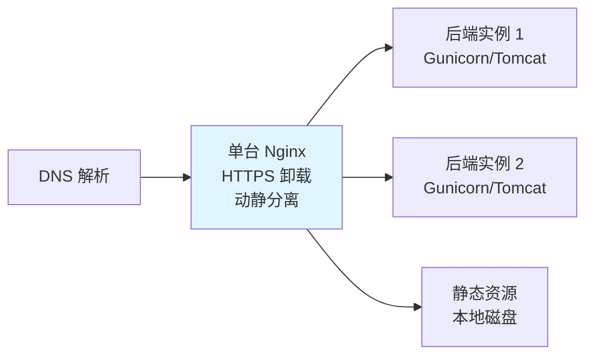
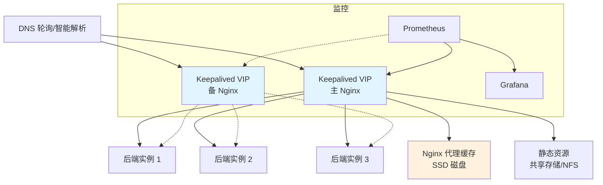
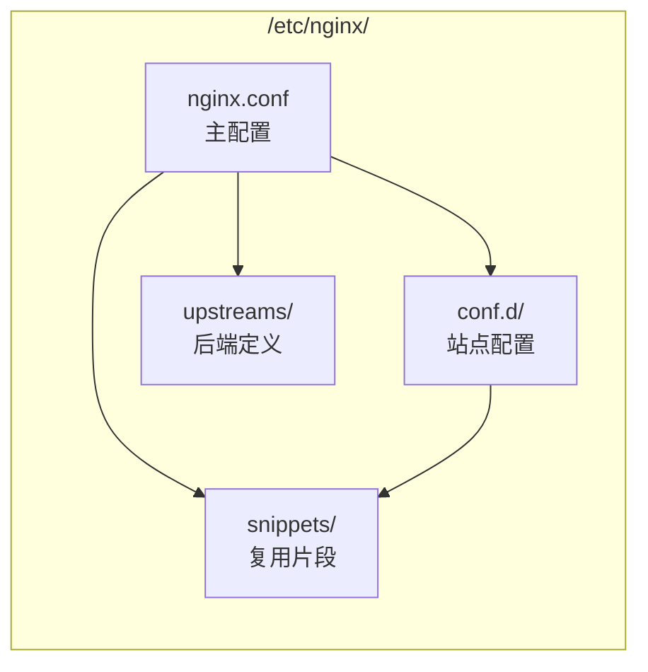
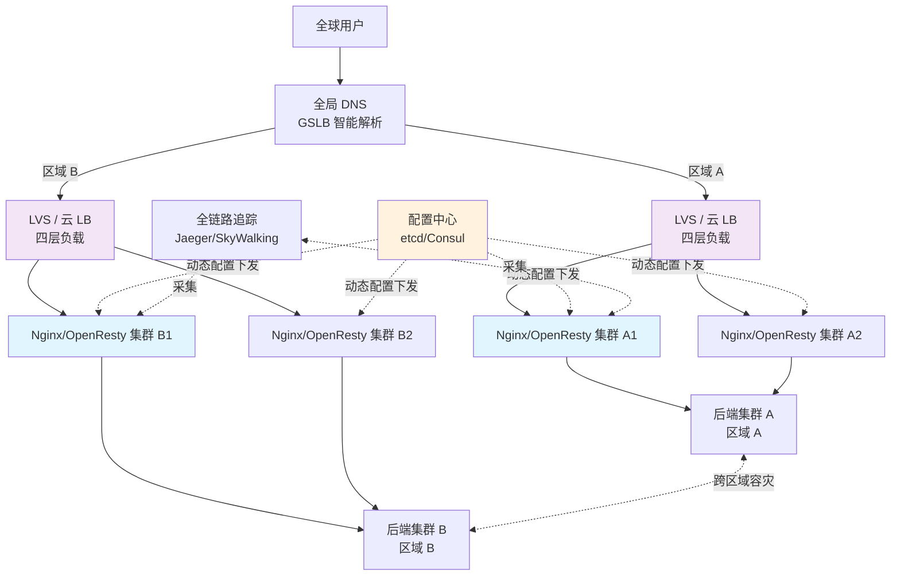

# 31 - 最佳实践统一总结

> **版本基线**：Nginx 1.30.4 (stable) / OpenResty 1.29.2.1 | 创建日期：2026-08-05
> **受众**：后端开发熟手（熟悉 Python/Java/Lua），服务器运维方面是小白。
> **本篇定位**：整个 Nginx 学习计划的**收官文档**。它不是新知识的讲解，而是把前面 30 篇文档（01-30）以及08-专题补充中散落的"最佳实践"条目，按知识点重新归类，形成一份**可对照执行的生产实践清单**，并给出小型、中型、大型三类项目的 Nginx 架构与配置选型建议。
>
> 阅读建议：第一次通读建立全局观；之后每次接手新项目时，对照"按项目规模的使用建议"一节做架构选型，再用"最佳实践汇总"逐项检查配置是否合规。

---

## 目录

- [1. 说明](#1-说明)
- [2. 最佳实践汇总](#2-最佳实践汇总)
  - [2.1 一、架构设计最佳实践](#21-一架构设计最佳实践)
  - [2.2 二、配置编写最佳实践](#22-二配置编写最佳实践)
  - [2.3 三、安全最佳实践](#23-三安全最佳实践)
  - [2.4 四、性能最佳实践](#24-四性能最佳实践)
  - [2.5 五、可靠性最佳实践](#25-五可靠性最佳实践)
  - [2.6 六、OpenResty 最佳实践](#26-六openresty-最佳实践)
- [3. 按项目规模的使用建议](#3-按项目规模的使用建议)
  - [3.1 小型项目（新公司/初创）](#31-小型项目新公司初创)
  - [3.2 中型项目](#32-中型项目)
  - [3.3 大型项目](#33-大型项目)
  - [3.4 三种规模对照表](#34-三种规模对照表)
- [4. 学习路径回顾与建议](#4-学习路径回顾与建议)
- [5. 小结](#5-小结)

---

## 1. 说明

### 1.1 本篇要解决什么问题

前 30 篇文档是按"知识点"纵向展开的：每一篇只讲一个主题（如 location 匹配、HTTPS、缓存、Lua 插件），并在文末给出该主题的"最佳实践"。这种组织方式适合**学习**，但不适合**查阅**——当你要上线一个新项目时，需要的是横跨所有主题的检查清单，而不是翻 30 篇文档拼凑。

本篇做的事情就是**横切**：把分散在各篇的最佳实践抽出来，按"架构设计 → 配置编写 → 安全 → 性能 → 可靠性 → OpenResty"六个维度重新编排，让一份文档覆盖生产落地的全部关键决策。

### 1.2 怎么用这份文档

| 场景 | 用法 |
|------|------|
| 新项目立项 | 先读 [第 3 节](#3-按项目规模的使用建议) 选定架构规模，再回 [第 2 节](#2-最佳实践汇总) 逐条核对 |
| 已有项目加固 | 直接按 [第 2 节](#2-最佳实践汇总) 的六个分类做 checklist 审计 |
| Code Review | 把第 2.2 节（配置编写）和第 2.3 节（安全）作为 PR 检查项 |
| 故障复盘 | 对照第 2.5 节（可靠性）排查是否漏配了兜底策略 |
| 面试复习 | 第 4 节的路径回顾 + 全文要点即高频考点 |

### 1.3 与其他文档的关系

- 本篇每条实践都会标注**出处**（如"详见 [09-反向代理proxy_pass](04-反向代理与负载均衡/09-反向代理proxy_pass.md)"），需要深入原理时点击跳转。
- 涉及的踩坑条目统一引用 [99-踩坑记录与解决方案](99-踩坑记录与解决方案.md)，编号格式 `#分类.序号`。
- 生产可直接套用的完整配置模板见 [28-生产配置规范与模板](28-生产配置规范与模板.md)（若已创建），本篇侧重"为什么这么做"而非"完整长什么样"。

### 1.4 一条贯穿全文的原则

> **能用最简单的配置解决的问题，就不要用复杂的配置解决。**

Nginx 的很多"最佳实践"本质上是**避免自作聪明**：不要在 location 里写 if，不要用 rewrite 做重定向，不要把 root 放在 location 里……这些"不要"背后都是前人踩过的坑。复杂配置不是能力的体现，而是风险的累积。当你发现一段配置越来越难读懂时，往往就是该用 `map`、`include` 或 Lua 拆分它的时候了。

---

## 2. 最佳实践汇总

下面六个小节按"重要性 + 通用性"排列。架构设计决定上限，配置编写决定下限，安全决定生死，性能决定体验，可靠性决定口碑，OpenResty 决定上限能抬多高。每条实践都给出**做法、原因、出处、反面案例**四要素。

### 2.1 一、架构设计最佳实践

架构层面的决策一旦定型，后续修改成本极高。以下五条是在写第一行配置之前就该想清楚的事。

#### 实践 1.1：动静分离

**做法**：静态资源（JS/CSS/图片/字体/视频）由 Nginx 直接服务，动态请求才转发给后端应用。

```nginx
server {
    listen 80;
    server_name example.com;

    root /var/www/html;          # 静态资源根目录放 server 层级

    # 静态资源：Nginx 直接返回，不经过后端
    location ~* \.(js|css|png|jpg|jpeg|gif|ico|svg|woff2?|ttf|mp4)$ {
        expires 30d;             # 浏览器缓存 30 天
        access_log off;          # 静态资源不打访问日志，减少磁盘 IO
        add_header Cache-Control "public, immutable";
    }

    # 动态请求：转发后端
    location / {
        proxy_pass http://backend;
    }
}
```

**原因**：Nginx 处理静态文件的效率（sendfile 零拷贝）比任何应用服务器（Tomcat/Gunicorn/Node）高一个数量级。把静态资源丢给后端处理，既浪费后端算力，又拉高响应延迟。

**反面案例**：所有请求都 `proxy_pass` 给后端，连 `/favicon.ico` 也要后端处理。详见踩坑 [#1.9](99-踩坑记录与解决方案.md#19-把所有请求都交给后端包括静态资源)。

**出处**：[05-静态资源服务](02-配置基础/05-静态资源服务.md)、[09-反向代理proxy_pass](04-反向代理与负载均衡/09-反向代理proxy_pass.md)。

#### 实践 1.2：SSL 终止（TLS Offloading）

**做法**：HTTPS 在 Nginx 层卸载（终止），Nginx 与后端之间用明文 HTTP（内网可信）或自签 HTTPS 通信。

```
客户端 ──HTTPS──→ Nginx（卸载 TLS）──HTTP──→ 后端
                  加解密在此完成
```

**原因**：TLS 握手是非对称加密，CPU 开销远高于对称加密。把卸载集中到 Nginx（可开 session 复用、OCSP Stapling、HTTP/2），后端专注业务逻辑，整体成本最低。Nginx 的 SSL 性能经过极致优化，单机可扛数万 TPS 的 HTTPS 握手。

**注意**：Nginx 到后端若跨不可信网络（如跨机房公网回源），仍需 HTTPS。内网同机房可用 HTTP。务必通过 `X-Forwarded-Proto` 告知后端原始协议是 https，否则后端生成的跳转链接会退化为 http。

```nginx
proxy_set_header X-Forwarded-Proto $scheme;   # 透传原始协议
```

**出处**：[14-HTTPS与TLS配置](05-安全与传输/14-HTTPS与TLS配置.md)。

#### 实践 1.3：负载均衡前置

**做法**：把 Nginx 作为统一入口，后端多实例通过 `upstream` 做负载均衡，而非让客户端直连后端。

```nginx
upstream backend {
    least_conn;                          # 最少连接数算法
    server 10.0.0.11:8080 max_fails=3 fail_timeout=30s;
    server 10.0.0.12:8080 max_fails=3 fail_timeout=30s;
    server 10.0.0.13:8080 max_fails=3 fail_timeout=30s;
    keepalive 32;                        # 复用到后端的长连接
}
```

**原因**：前置负载均衡带来三大好处——流量统一管控（限流/WAF/灰度都在一处）、后端对客户端透明（可随时扩缩容）、单点故障隔离（某台后端挂了 Nginx 自动剔除）。

**出处**：[10-upstream负载均衡算法](04-反向代理与负载均衡/10-upstream负载均衡算法.md)。

#### 实践 1.4：缓存层设计

**做法**：在读多写少的场景，在 Nginx 层部署代理缓存（`proxy_cache`），形成"浏览器缓存 → Nginx 缓存 → 后端缓存"三层防线。

```nginx
# http 块：声明缓存区
proxy_cache_path /data/nginx/cache
                 levels=1:2
                 keys_zone=api_cache:10m
                 max_size=10g
                 inactive=60m
                 use_temp_path=off;

server {
    location /api/ {
        proxy_cache api_cache;                       # 启用缓存
        proxy_cache_key "$scheme$request_method$host$request_uri";
        proxy_cache_valid 200 10m;
        proxy_cache_valid 404 1m;
        proxy_cache_use_stale error timeout updating http_500 http_502 http_503 http_504;
        proxy_cache_lock on;                         # 防缓存击穿（同一 key 并发回源只放一个）
        add_header X-Cache-Status $upstream_cache_status;  # 暴露命中状态便于排查
        proxy_pass http://backend;
    }
}
```

**原因**：缓存命中时 Nginx 直接从磁盘返回，后端 QPS 可下降一到两个数量级；配合 `proxy_cache_use_stale`，后端短暂宕机时仍可返回过期缓存实现降级。

**注意**：缓存是双刃剑。动态接口（如用户私人数据）若被缓存会导致串号，必须用精细的 `proxy_cache_key`（含用户标识）或 `proxy_no_cache` 排除。详见 [18-缓存机制](06-高级与优化/18-缓存机制.md)。

#### 实践 1.5：配置模块化（include / snippets）

**做法**：把重复的配置片段抽成独立文件，用 `include` 引入，避免复制粘贴导致的"改一处漏三处"。

```
/etc/nginx/
├── nginx.conf                 # 主配置：进程、事件、http 全局
├── conf.d/
│   ├── *.conf                 # 各 server 块（每站点一个文件）
├── snippets/
│   ├── ssl-common.conf        # 通用 SSL 参数（所有 HTTPS 站点复用）
│   ├── proxy-params.conf      # 通用 proxy_set_header
│   ├── security-headers.conf  # 通用安全响应头
│   └── gzip.conf              # 通用 gzip 配置
└── upstreams/
    └── *.conf                 # upstream 定义
```

```nginx
# nginx.conf 中
http {
    include       /etc/nginx/mime.types;
    include       /etc/nginx/snippets/gzip.conf;

    include       /etc/nginx/upstreams/*.conf;
    include       /etc/nginx/conf.d/*.conf;
}

# 某站点 server 块中复用片段
server {
    listen 443 ssl;
    http2 on;
    server_name api.example.com;

    include /etc/nginx/snippets/ssl-common.conf;       # 复用 SSL 参数
    include /etc/nginx/snippets/security-headers.conf; # 复用安全头

    location / {
        include /etc/nginx/snippets/proxy-params.conf; # 复用 proxy 头
        proxy_pass http://backend;
    }
}
```

**原因**：模块化让配置变成"积木"，新增站点只需组装片段而非重写。更重要的是，安全策略（如安全头、TLS 参数）集中维护，改一处即全网生效，杜绝遗漏。

**出处**：[28-生产配置规范与模板](28-生产配置规范与模板.md)、[04-配置文件结构与指令体系](02-配置基础/04-配置文件结构与指令体系.md)。

---

### 2.2 二、配置编写最佳实践

这一节是"写配置时的肌肉记忆"。每条都对应一个高频踩坑，记住它们能避免 80% 的配置类故障。

#### 实践 2.1：root 放 server 层级，不放 location

**做法**：`root` 指令写在 `server` 块，让所有 location 共享；只在确有必要时（如不同 location 指向不同磁盘）才在 location 内覆盖。

```nginx
# 正确：root 在 server 层级
server {
    root /var/www/html;          # 全局根目录

    location / { }
    location /images/ { }        # 自动继承 /var/www/html
    location /downloads/ {
        root /data/files;        # 仅此 location 覆盖为 /data/files/downloads
    }
}

# 错误：每个 location 都写 root，且遗漏了未匹配的 location
server {
    location /api/ {
        root /var/www/html;      # 只有 /api/ 有根目录
    }
    # location / {} 未定义 root → 403 Forbidden
}
```

**原因**：`root` 在 location 内只在命中该 location 时生效。如果某个请求命中的 location 没有定义 `root` 且 server 块也没有，Nginx 用默认 root（编译时 `--prefix` 指定），往往指向意料之外的目录，导致 403 或 404。

**反面案例**：详见踩坑 [#1.8](99-踩坑记录与解决方案.md#18-root-放在-location-内导致未匹配-location-无根目录)。

#### 实践 2.2：用 try_files 而非 if 判断文件存在

**做法**：检查静态文件是否存在时，用 `try_files`，绝不用 `if (-f ...)`。

```nginx
# 正确：try_files 依次尝试，最后兜底
location / {
    try_files $uri $uri/ /index.php?$query_string;
    # 1. 尝试 $uri 对应文件
    # 2. 尝试 $uri/ 对应目录
    # 3. 都没有则内部跳转到 /index.php（CMS/框架前端控制器模式）
}

# 错误：if is evil
location / {
    if (-f $request_filename) {          # 慢、易错、上下文受限
        break;
    }
    rewrite ^ /index.php last;
}
```

**原因**：`if` 在 location 中行为不可预测（参见 [If Is Evil](https://www.nginx.com/resources/wiki/start/topics/depth/ifisevil/)），且 `if (-f)` 每次请求都做一次磁盘 stat，性能差。`try_files` 是 Nginx 为"文件存在性判断"专门设计的指令，语义清晰、性能更优。

**反面案例**：详见踩坑 [#1.3](99-踩坑记录与解决方案.md#13-try_files-误用--用-if-判断文件存在)、[#1.7](99-踩坑记录与解决方案.md#17-if-is-evil在-location-中滥用-if)。

#### 实践 2.3：用 return 而非 rewrite 做重定向

**做法**：HTTP→HTTPS 跳转、域名跳转、强制 www 等场景，用 `return 301`，不用 `rewrite ... permanent`。

```nginx
# 正确：return 简单高效
server {
    listen 80;
    server_name example.com;
    return 301 https://$host$request_uri;   # 301 永久重定向到 HTTPS
}

# 错误：rewrite 啰嗦且容易写错标志位
server {
    listen 80;
    rewrite ^(.*)$ https://$host$1 permanent;
}
```

**原因**：`return` 直接返回状态码和新 URL，不经过 rewrite 阶段的正则匹配，更快更安全。`rewrite` 适用于需要改写 URI 路径（而非整站跳转）的场景，且要分清 `last`（重新走 location 匹配）和 `break`（停止 rewrite，留在当前 location）。

**反面案例**：详见踩坑 [#1.5](99-踩坑记录与解决方案.md#15-rewrite-的-last-与-break-区别)、[#1.10](99-踩坑记录与解决方案.md#110-rewrite-缺少-http-前缀)。

#### 实践 2.4：用 map 而非 if 做条件映射

**做法**：需要根据某个变量取不同值时，用 `map` 预先映射，不要在 location 里用 `if` 判断。

```nginx
# 正确：map 在 http 块定义映射表
map $http_host $backend_pool {
    default        api_backend;
    "~^admin\."    admin_backend;
    "~^m\."        mobile_backend;
}

server {
    location / {
        proxy_pass http://$backend_pool;   # 直接用映射结果
    }
}

# 错误：if 串联，可读性差且易踩 if is evil
server {
    location / {
        if ($http_host ~* "^admin\.") {
            proxy_pass http://admin_backend;
        }
        if ($http_host ~* "^m\.") {
            proxy_pass http://mobile_backend;
        }
        proxy_pass http://api_backend;
    }
}
```

**原因**：`map` 在请求处理的早期阶段（rewrite 阶段前）一次性计算，结果缓存复用；`if` 在 location 内每次请求都求值，且 `if` 块内可用的指令受限，行为不可预测。`map` 还能做正则捕获、默认值，是"声明式"的，远优于 `if` 的"命令式"。

**出处**：[15-rewrite重写规则](05-安全与传输/15-rewrite重写规则.md)。

#### 实践 2.5：proxy_pass 注意尾斜杠

**做法**：理解 `proxy_pass` 带 URI（含尾斜杠或路径）与不带 URI 的语义差异，按需选择。

```nginx
# 情况 A：proxy_pass 不带 URI（无尾斜杠/无路径）
# → 后端收到完整原始 URI：/api/users/123
location /api/ {
    proxy_pass http://backend;            # 注意：无尾斜杠
}

# 情况 B：proxy_pass 带 URI（含尾斜杠）
# → /api/ 被替换为 /，后端收到：/users/123
location /api/ {
    proxy_pass http://backend/;           # 注意：有尾斜杠
}

# 情况 C：带路径替换
# → /api/ 替换为 /v2/，后端收到：/v2/users/123
location /api/ {
    proxy_pass http://backend/v2/;
}
```

**原因**：这是 Nginx 最经典的踩坑之一。尾斜杠的有无直接决定后端收到的 URI 路径。规则是：`proxy_pass` 带 URI 时，location 匹配到的部分会被替换；不带 URI 时，原始 URI 原样传递。

**特例**：正则 location（`~`/`~*`）或命名 location 内的 `proxy_pass` **不能带 URI**，否则报错。此时如需改写路径，用 `rewrite ... break` 配合。

**反面案例**：详见踩坑 [#1.4](99-踩坑记录与解决方案.md#14-proxy_pass-末尾斜杠导致-uri-被改写)。

#### 实践 2.6：配置变更后先 nginx -t

**做法**：任何配置修改后，**必须**先 `nginx -t` 测试语法，通过后再 `nginx -s reload`。

```bash
# 1. 测试配置语法（不实际 reload）
sudo nginx -t
# 输出 "syntax is ok" 和 "test is successful" 才能继续

# 2. 平滑重载
sudo nginx -s reload

# 3. 查看完整生效配置（排查 include 是否正确合并）
sudo nginx -T | less

# 4. 验证特定模块是否编译进来
sudo nginx -V 2>&1 | grep -o with-http_v3_module
```

**原因**：`reload` 会尝试加载新配置，如果配置有语法错误，Nginx 会回滚到旧配置（worker 仍跑旧的），master 不会崩。但如果是**语义错误**（语法对但逻辑错，如 `proxy_pass` 指向不存在的 upstream），`nginx -t` 检测不出来，`reload` 后请求会 502。所以 `nginx -t` 是必要但不充分的——改完还要实际发请求验证。

**进阶**：生产环境建议配置变更走 CI/CD，在预发环境 `nginx -t` + 自动化请求验证后再推生产，避免人为遗漏。详见 [28-生产配置规范与模板](28-生产配置规范与模板.md)。

#### 实践 2.7：善用 include 拆分配置

**做法**：单文件配置超过 ~300 行就该拆分。按"站点 / upstream / 复用片段"三类组织（见实践 1.5 的目录结构）。

**原因**：大配置文件可读性差、易冲突（多人协作时）、review 困难。拆分后每个文件职责单一，git diff 清晰，回滚也方便（只回滚单个站点配置）。

**注意**：`include` 支持通配符（`include conf.d/*.conf`），按文件名字母序加载。如果有依赖顺序要求，用数字前缀命名（`00-base.conf`、`10-upstream.conf`、`20-server.conf`）。

**出处**：[04-配置文件结构与指令体系](02-配置基础/04-配置文件结构与指令体系.md)。

---

### 2.3 三、安全最佳实践

安全实践没有"性价比"之分——任何一条漏配都可能导致数据泄露或服务被攻破。以下九条是 Nginx 安全加固的基线，建议封装成 `snippets/security-headers.conf` 全站复用。

#### 实践 3.1：server_tokens off

**做法**：隐藏 Nginx 版本号，避免向攻击者暴露可利用的已知漏洞。

```nginx
# http 块
server_tokens off;          # 响应头 Server 只显示 "nginx"，不显示版本号
                            # 错误页也不显示版本
```

**原因**：默认 `server_tokens on` 会在 `Server` 响应头和错误页中暴露完整版本（如 `nginx/1.30.4`）。攻击者可据此查找该版本已知漏洞进行定向攻击。隐藏版本号提高攻击成本（虽非真正的安全防线，但属于"减少信息泄露"的基本操作）。

**进阶**：要完全隐藏 `Server` 头需要第三方模块（如 `headers-more-nginx-module`），开源版只能隐藏版本号。

**反面案例**：详见踩坑 [#3.1](99-踩坑记录与解决方案.md#31-暴露-nginx-版本号)。

#### 实践 3.2：SSL 仅启用 TLS 1.2 / 1.3

**做法**：禁用所有不安全的 SSL/TLS 协议版本，只保留 TLS 1.2 和 1.3。

```nginx
ssl_protocols TLSv1.2 TLSv1.3;

# TLS 1.3 加密套件（Nginx 会自动选最优，一般无需指定）
# TLS 1.2 加密套件：只保留前向安全（ECDHE）的强套件
ssl_ciphers ECDHE-ECDSA-AES128-GCM-SHA256:ECDHE-RSA-AES128-GCM-SHA256:ECDHE-ECDSA-AES256-GCM-SHA384:ECDHE-RSA-AES256-GCM-SHA384:ECDHE-ECDSA-CHACHA20-POLY1305:ECDHE-RSA-CHACHA20-POLY1305;
ssl_prefer_server_ciphers off;   # TLS 1.3 由客户端选；1.2 也建议交给客户端选（现代浏览器都支持强套件）
```

**原因**：SSL 3.0、TLS 1.0、TLS 1.1 均已被 IETF 废弃（RFC 8996），存在 POODLE、BEAST 等漏洞。TLS 1.3 强制前向安全（PFS）、握手只需 1-RTT、移除了不安全的加密算法，是当前最优选择。TLS 1.2 作为兼容兜底（老旧客户端）。

**反面案例**：详见踩坑 [#4.5](99-踩坑记录与解决方案.md#45-tls-协议与加密套件过旧)。

#### 实践 3.3：启用 HSTS（确认全站 HTTPS 后）

**做法**：全站完成 HTTPS 改造后，启用 HSTS 强制浏览器后续都走 HTTPS。

```nginx
add_header Strict-Transport-Security "max-age=31536000; includeSubDomains; preload" always;
# max-age=31536000      缓存 1 年
# includeSubDomains     子域名也强制 HTTPS（确认所有子域名都支持 HTTPS 后再加）
# preload               允许加入浏览器 HSTS 预加载列表
# always                即使是 4xx/5xx 响应也带此头
```

**原因**：HSTS 防止用户首次访问时被中间人降级到 HTTP（SSL Strip 攻击）。浏览器记住"此域名必须 HTTPS"后，即使用户输入 http:// 也会内部跳转到 https://。

**警告**：HSTS 一旦下发，浏览器会"记住" max-age 时间内强制 HTTPS。如果此时你的站点还有子域名没上 HTTPS，加 `includeSubDomains` 会导致那些子域名无法访问。**务必先确认全站 HTTPS 再启用**。`preload` 更是"单程票"——加入浏览器预加载列表后移除困难，只适合长期全站 HTTPS 的成熟站点。

**反面案例**：详见踩坑 [#4.2](99-踩坑记录与解决方案.md#42-未启用-hsts)。

#### 实践 3.4：OCSP Stapling

**做法**：启用 OCSP Stapling，让 Nginx 代替客户端去查询证书吊销状态。

```nginx
ssl_stapling on;
ssl_stapling_verify on;
ssl_trusted_certificate /etc/nginx/ssl/chain.crt;   # 完整证书链（含根证书）
resolver 8.8.8.8 8.8.4.4 valid=300s;                 # Nginx 查 OCSP 用的 DNS
resolver_timeout 5s;
```

**原因**：浏览器验证证书时需要检查是否被吊销（OCSP，Online Certificate Status Protocol）。默认由浏览器直接去 CA 的 OCSP 服务器查询，存在两个问题：(1) 暴露用户访问记录给 CA；(2) OCSP 服务器慢或不可达时拖慢握手。OCSP Stapling 让 Nginx 定期拉取并缓存 OCSP 响应，在 TLS 握手时"钉"（staple）给客户端，一举解决隐私和性能问题。

**反面案例**：详见踩坑 [#4.4](99-踩坑记录与解决方案.md#44-ocsp-stapling-未启用)。

#### 实践 3.5：限制 HTTP 方法

**做法**：只允许业务需要的 HTTP 方法，拒绝其余（如静态站点只允许 GET/HEAD）。

```nginx
# 静态资源站点：只允许 GET/HEAD
if ($request_method !~ ^(GET|HEAD)$ ) {
    return 405;
}

# 或更优雅地用 limit_except（推荐，不触发 if is evil）
location /static/ {
    limit_except GET HEAD {
        deny all;            # 其余方法（POST/PUT/DELETE 等）返回 403
    }
}
```

**原因**：限制 HTTP 方法能减少攻击面。一个纯展示站点如果允许 PUT/DELETE，攻击者可能利用上传漏洞写入恶意文件。注意 `limit_except` 比 `if` 更安全（不触发 if is evil 问题）。

#### 实践 3.6：安全响应头

**做法**：统一注入一组安全响应头，防御 XSS、点击劫持、MIME 嗅探等常见攻击。

```nginx
# 封装为 snippets/security-headers.conf，全站 include
add_header X-Frame-Options "SAMEORIGIN" always;             # 防点击劫持：只允许同源 iframe
add_header X-Content-Type-Options "nosniff" always;         # 防 MIME 嗅探
add_header X-XSS-Protection "1; mode=block" always;         # 旧浏览器 XSS 过滤（现代浏览器已内置）
add_header Referrer-Policy "strict-origin-when-cross-origin" always;  # 控制 Referer 泄露
add_header Permissions-Policy "geolocation=(), microphone=(), camera=()" always;  # 禁用敏感 API
add_header Content-Security-Policy "default-src 'self'; ..." always;  # CSP（按业务精调）
```

**原因**：这些头是浏览器层的安全防线，配合 HTTPS 构成纵深防御。`X-Frame-Options` 防点击劫持，`X-Content-Type-Options` 防内容类型嗅探，CSP 防 XSS 注入。`always` 确保错误页也带这些头。

**注意**：`add_header` 在子上下文（location）中会**覆盖**父上下文（server）的 `add_header`，不是追加。如果在 location 里又写了 `add_header`，必须把安全头也重写一遍，否则丢失。这就是为什么要封装成 snippet 用 `include` 引入。

#### 实践 3.7：限制请求体大小

**做法**：根据业务设置 `client_max_body_size`，防止超大请求体耗尽内存或磁盘。

```nginx
client_max_body_size 10m;       # 全局默认 10MB
# 普通表单 1m 足够；图片上传 10m-50m；视频上传单独 location 放大到 500m
```

**原因**：不限制时攻击者可发送超大 body 把 Nginx 内存/临时磁盘撑爆（DoS）。按业务设上限是最低成本的防护。

#### 实践 3.8：不用 root=/ 作为 document root

**做法**：`root` 永远指向具体的资源目录，绝不要用 `root /;` 或 `root /var/www;`（太宽泛）。

```nginx
# 错误：root 指向根目录，存在目录穿越/任意文件读取风险
location /static {
    alias /var/www/html/static/;   # alias 末尾斜杠与 location 末尾无斜杠不匹配 → 目录穿越
}

# 正确：明确指定目录，且 alias 与 location 的斜杠对应
location /static/ {
    alias /var/www/html/static/;   # location 有尾斜杠，alias 也有 → 安全
}
```

**原因**：`alias` 配置不当会导致目录穿越（如请求 `/static../../etc/passwd` 读到系统文件）。规则：`location` 末尾有斜杠，`alias` 末尾也要有；`location` 无斜杠，`alias` 也无。最安全的是用 `root` 替代 `alias`（root 是拼接，alias 是替换，alias 更易错）。

**反面案例**：详见踩坑 [#3.2](99-踩坑记录与解决方案.md#32-危险的-document-root目录穿越任意文件读取)、[#3.7](99-踩坑记录与解决方案.md#37-alias-目录穿越)。

#### 实践 3.9：防止目录穿越与 SSRF

**做法**：(1) 静态资源用 `root`/`alias` 时确保路径闭合；(2) `proxy_pass` 的地址**绝不能**包含用户可控变量。

```nginx
# 错误：proxy_pass URL 含用户可控变量 → SSRF（服务端请求伪造）
location /fetch/ {
    proxy_pass http://$arg_target;     # 攻击者传 ?target=169.254.169.254 读云元数据！
}

# 正确：upstream 固定，用户输入只用于参数
location /fetch/ {
    proxy_pass http://backend/fetch?url=$arg_target;   # 由后端校验 target 合法性
}
```

**原因**：SSRF 让攻击者借 Nginx 之手访问内网服务（如云厂商元数据接口、Redis、内部管理面板）。凡 `proxy_pass` 后跟变量的，都要审查变量来源是否可信。

**反面案例**：详见踩坑 [#3.4](99-踩坑记录与解决方案.md#34-ssrf--proxy_pass-可被用户控制的变量影响)、[#3.5](99-踩坑记录与解决方案.md#35-不当的-proxy_set_header--host-头问题)。

**出处**：本节综合 [14-HTTPS与TLS配置](05-安全与传输/14-HTTPS与TLS配置.md)、[16-访问控制与认证](05-安全与传输/16-访问控制与认证.md)、[17-限流防护](05-安全与传输/17-限流防护.md)。

---

### 2.4 四、性能最佳实践

性能实践的核心是"先测量再调优"。以下九条按"性价比从高到低"排列，前四条覆盖 80% 收益。

#### 实践 4.1：worker_processes auto

**做法**：worker 进程数设为 `auto`，等于 CPU 逻辑核心数。

```nginx
worker_processes auto;
worker_cpu_affinity auto;       # 1.11.5+ 自动绑核
worker_rlimit_nofile 65535;     # 提升单 worker 文件描述符上限
```

**原因**：Nginx 单线程多路复用，每个 worker 长期跑在一个核心上。worker 数 = 核心数可充分利用 CPU 且无多余上下文切换。详见踩坑 [#2.1](99-踩坑记录与解决方案.md#21-worker_processes-设置不当)。

#### 实践 4.2：worker_connections 设大 + 提升 ulimit

**做法**：单 worker 连接数设到 65535，并同步提升系统级 fd 限制。

```nginx
events {
    worker_connections 65535;
    multi_accept on;            # 批量 accept
}
```

```bash
# /etc/security/limits.conf
*  soft  nofile  65535
*  hard  nofile  65535
# 或运行时：ulimit -n 65535
```

**原因**：反向代理场景每个客户端请求占 2 条连接（入+出），理论最大并发 = worker数 × worker_connections / 2。不提 ulimit 的话，`worker_rlimit_nofile` 设再大也受系统限制。详见踩坑 [#2.2](99-踩坑记录与解决方案.md#22-worker_connections-与最大连接数计算错误)、[#2.6](99-踩坑记录与解决方案.md#26-文件描述符--sendfile-限制)。

#### 实践 4.3：use epoll

**做法**：Linux 上 Nginx 默认选 epoll，一般无需手动指定，但理解其优势。

```nginx
events {
    use epoll;                  # Linux 上 O(1) 事件模型（通常自动选择，可省略）
    worker_connections 65535;
}
```

**原因**：epoll 相比 select/poll，时间复杂度 O(1) 不随连接数增长，是万级并发的基础。现代 Linux 上 Nginx 自动选 epoll，手动指定仅用于调试。

#### 实践 4.4：开启 sendfile + tcp_nopush + tcp_nodelay

**做法**：三者同时开启，Nginx 自动在合适时机切换。

```nginx
http {
    sendfile on;                # 零拷贝：文件传输绕过用户空间
    tcp_nopush on;              # 攒包：发送大文件时合并响应头和数据
    tcp_nodelay on;             # 即时发送：长连接上的小数据不延迟
}
```

**原因**：`sendfile` 让文件传输绕过用户空间（4次拷贝→3次，4次切换→2次）；`tcp_nopush`（TCP_CORK）发送大文件时攒满 MSS 再发；`tcp_nodelay`（禁用 Nagle）让长连接上的小数据立即发送。三者看似矛盾实则互补——Nginx 在 sendfile 期间用 nopush 攒包，结束后切 nodelay 发尾巴。

#### 实践 4.5：开启 gzip（或 Brotli）

**做法**：压缩文本类响应，减少 60%-70% 传输量。

```nginx
gzip on;
gzip_comp_level 6;              # 6 是 CPU 与压缩率的平衡点
gzip_min_length 1k;             # 小于 1KB 不压缩（gzip 头开销）
gzip_types text/plain text/css text/xml text/javascript
           application/json application/javascript application/xml
           image/svg+xml;       # text/html 默认始终压缩，无需列出
gzip_vary on;                   # 加 Vary: Accept-Encoding，让 CDN 区分缓存
gzip_static on;                 # 优先发送预压缩 .gz 文件，省 CPU

# Brotli（需编译 ngx_brotli，压缩率优于 gzip，仅 HTTPS 生效）
# brotli on;
# brotli_comp_level 6;
# brotli_static on;
```

**原因**：压缩是性价比最高的优化——减少传输量直接降低延迟和带宽成本。`gzip_static` 发预压缩文件避免实时压缩 CPU 开销。Brotli 比 gzip 同级别小 15%-25%，但只在 HTTPS 下浏览器才发 `Accept-Encoding: br`。

#### 实践 4.6：开启 upstream keepalive

**做法**：Nginx 与后端之间复用长连接，避免每请求新建 TCP。

```nginx
upstream backend {
    server 10.0.0.11:8080;
    keepalive 32;                       # 每个 worker 缓存 32 个空闲长连接
    keepalive_requests 1000;
}

server {
    location / {
        proxy_pass http://backend;
        proxy_http_version 1.1;         # 必须用 HTTP/1.1（1.0 默认 close）
        proxy_set_header Connection ""; # 清空 Connection 头，阻止 close
    }
}
```

**原因**：不开 upstream keepalive 时，每个请求与后端新建 TCP，高 QPS 下后端堆积大量 TIME_WAIT，三次握手开销成瓶颈。开启后连接复用，QPS 可提升数倍。

> **版本提示**：Nginx **1.29.7** 起默认开启 upstream keepalive 并自动处理 HTTP/1.1 和 Connection 头。1.29.7 之前需手动配上述三行；之后显式配也不会出错。

**反面案例**：详见踩坑 [#2.3](99-踩坑记录与解决方案.md#23-未启用-upstream-keepalive长连接复用)、[#5.6](99-踩坑记录与解决方案.md#56-长连接复用导致后端连接数被压垮)。

#### 实践 4.7：合理配置 buffer

**做法**：根据后端响应大小调整代理缓冲，避免响应落盘或被截断。

```nginx
client_max_body_size 50m;
client_body_buffer_size 1m;

proxy_buffer_size 16k;          # 响应头缓冲（后端 header 大时调大）
proxy_buffers 8 16k;            # 响应体缓冲：8×16k=128k
proxy_busy_buffers_size 32k;    # 忙缓冲阈值，达到后开始向客户端发送

# SSE/流式响应必须关闭缓冲
location /sse/ {
    proxy_pass http://backend;
    proxy_buffering off;
    proxy_cache off;
}
```

**原因**：buffer 过小 → 响应体超 128k 部分落盘（磁盘 IO 飙升）或 header 超出报 invalid header。SSE/流式响应若开 buffering，数据被攒在内存不发出，实时性丧失。

**反面案例**：详见踩坑 [#2.5](99-踩坑记录与解决方案.md#25-proxy-buffer-过小导致落盘或响应被截断)。

#### 实践 4.8：内核参数调优

**做法**：调整 `sysctl.conf` 中与 Nginx 相关的网络参数。

```bash
# /etc/sysctl.conf
net.core.somaxconn = 65535                  # 连接队列
net.ipv4.tcp_max_syn_backlog = 65535        # SYN 队列
net.core.netdev_max_backlog = 65535         # 网卡接收队列
net.ipv4.tcp_tw_reuse = 1                   # TIME_WAIT 复用（反代场景）
net.ipv4.ip_local_port_range = 10000 65535  # 扩大本地端口范围
fs.file-max = 1000000                       # 系统 fd 上限
net.ipv4.tcp_keepalive_time = 600           # TCP 探测间隔
# 警告：tcp_tw_recycle 已在 4.12 内核移除，切勿使用（NAT 环境丢包）
```

**原因**：这些参数是 Nginx 高并发的"地基"。`somaxconn` 限制 Nginx 的 backlog 上限；`tcp_tw_reuse` 缓解反代场景的 TIME_WAIT 堆积；`fs.file-max` 是所有进程 fd 总和上限。

**出处**：[19-性能调优](06-高级与优化/19-性能调优.md)。

#### 实践 4.9：开启缓存

**做法**：读多写少场景启用 `proxy_cache`（见实践 1.4），配合 `proxy_cache_lock` 防击穿、`proxy_cache_use_stale` 兜底。

**原因**：缓存命中时 Nginx 直接从磁盘返回，后端 QPS 下降一到两个数量级，是"用磁盘换 CPU/后端"的最划算交易。详见 [18-缓存机制](06-高级与优化/18-缓存机制.md)。

---

### 2.5 五、可靠性最佳实践

可靠性实践的目标是"出问题时少出事，出了事能兜底"。以下是六条让系统更抗造的配置。

#### 实践 5.1：被动健康检查调大 max_fails

**做法**：根据后端稳定性调整 `max_fails` 和 `fail_timeout`，避免误剔除。

```nginx
upstream backend {
    server 10.0.0.11:8080 max_fails=3 fail_timeout=30s;
    # max_fails=3       30秒内失败 3 次才标记为宕机（默认 1 次太敏感）
    # fail_timeout=30s  标记宕机后 30 秒内不再往这台发请求，30 秒后重试
}
```

**原因**：默认 `max_fails=1` 太敏感——一次网络抖动就剔除后端，可能导致可用后端被误判为故障。调大到 3 给后端容错空间。但也不能太大，否则真挂了要等很久才剔除。

**特例**：单台后端时 `max_fails`/`fail_timeout` 实际失效（没有其他后端可切换），需配合 `proxy_next_upstream` 和主动健康检查。详见踩坑 [#5.1](99-踩坑记录与解决方案.md#51-upstream-被动健康检查误判)、[#5.2](99-踩坑记录与解决方案.md#52-单台后端时-max_failsfail_timeout-失效)。

#### 实践 5.2：proxy_next_upstream 对写接口禁用

**做法**：对非幂等的写接口（POST/PUT/DELETE），禁用自动重试，防止重复提交。

```nginx
# 全局：读接口允许重试
proxy_next_upstream error timeout http_502 http_503 http_504;

# 写接口：禁用重试
location /api/order/ {
    proxy_next_upstream off;                # POST 下单失败不重试，避免重复扣款
    proxy_pass http://backend;
}

# 或按方法精细控制
location /api/ {
    proxy_method $request_method;
    proxy_next_upstream error timeout;
    # 配合 map 对 POST/PUT/DELETE 关闭
}
```

**原因**：`proxy_next_upstream` 在某台后端返回错误时自动把请求转给下一台。对 GET（幂等）这是好事；对 POST/PUT/DELETE（非幂等）这是灾难——如果第一台其实处理成功但响应超时，重试到第二台会导致重复执行（重复扣款、重复发货）。写接口必须 `off`。

**反面案例**：详见踩坑 [#5.7](99-踩坑记录与解决方案.md#57-proxy_next_upstream-导致非幂等请求被重试)。

#### 实践 5.3：proxy_cache_use_stale 故障兜底

**做法**：后端故障时返回过期缓存，实现降级而非完全不可用。

```nginx
proxy_cache_use_stale error timeout updating http_500 http_502 http_503 http_504;
# 后端出错/超时/更新中/5xx 时，返回过期缓存（比 502 好得多）
```

**原因**：这是缓存最被低估的价值——不是加速，而是**容灾**。后端短暂宕机期间，用户看到的是"过期但能用"的数据，而不是满屏 502。对内容站、商品列表等容忍一定过期延迟的场景尤其重要。配合 `proxy_cache_background_update on`（1.11.10+）可在后台异步刷新缓存。

#### 实践 5.4：日志分级和轮转

**做法**：error_log 按级别区分，access_log 用 logrotate 轮转，避免日志撑爆磁盘。

```nginx
# error_log 分级：debug → info → notice → warn → error → crit → alert → emerg
error_log /var/log/nginx/error.log warn;        # 生产用 warn，排查问题时临时改 error 或 debug
# access_log 可按状态码分流
access_log /var/log/nginx/access.log main;
```

```bash
# /etc/logrotate.d/nginx —— 日志轮转
/var/log/nginx/*.log {
    daily
    rotate 30
    missingok
    compress
    delaycompress
    notifempty
    create 640 nginx adm
    sharedscripts
    postrotate
        [ -f /var/run/nginx.pid ] && kill -USR1 $(cat /var/run/nginx.pid)
        # USR1 信号让 Nginx 重新打开日志文件
    endscript
}
```

**原因**：不轮转的日志会无限增长撑爆磁盘，导致 Nginx 写日志失败进而拒绝服务。`kill -USR1` 让 Nginx 平滑重开日志文件（不中断请求）。error_log 级别过低（如 debug）会产生海量日志拖慢性能，生产用 warn 即可。

#### 实践 5.5：配置版本管理（git）

**做法**：把 `/etc/nginx/` 整个目录纳入 git 管理，所有变更走 PR。

```bash
cd /etc/nginx
git init
git add .
git commit -m "init: nginx config baseline"

# 之后每次变更
git checkout -b feat/add-pay-api
vim conf.d/pay.example.com.conf
nginx -t                    # 本地测试
git commit -m "feat: add pay api vhost"
git push                    # 触发 CI：预发 nginx -t + 回归测试 → 生产 reload
```

**原因**：配置即代码。git 管理带来三大好处：(1) 任何变更可追溯（谁、何时、改了什么）；(2) 可一键回滚（`git revert` + reload）；(3) 多人协作有 review 机制。这是从中型项目开始必须建立的规范。

#### 实践 5.6：灰度发布流程

**做法**：新后端上线时，先切小比例流量验证，再逐步放量。

```nginx
# 方式一：weight 灰度（Nginx 原生）
upstream backend {
    server 10.0.0.11:8080 weight=90;     # 老版本 90%
    server 10.0.0.14:8080 weight=10;     # 新版本 10%（先小流量观察）
}

# 方式二：split_clients 按用户灰度（同一用户始终命中同一版本）
split_clients "${remote_addr}${http_user_agent}" $backend_variant {
    10%  new_backend;       # 10% 用户走新版本
    *    old_backend;       # 其余走老版本
}
```

**原因**：直接全量切新版本，一旦有 bug 影响所有用户。灰度让风险可控——10% 流量发现问题可秒级回切。`split_clients` 比 weight 更精细（按用户维度而非请求维度，避免同一用户一会儿新一会儿老）。进阶可用 OpenResty 的 `balancer_by_lua` 实现基于用户 ID/Header 的精准灰度。详见 [26-Lua插件实战](07-OpenResty与Lua插件/26-Lua插件实战.md)。

---

### 2.6 六、OpenResty 最佳实践

OpenResty = Nginx + LuaJIT + lua-nginx-module，把 Nginx 从"配置驱动的反代"升级为"代码驱动的网关"。以下六条是写 Lua 插件的工程规范。

#### 实践 6.1：lua_code_cache on（生产）

**做法**：生产环境必须开启 `lua_code_cache`，开发环境才关闭。

```nginx
lua_code_cache on;      # 生产：缓存已编译的 Lua 字节码，每次请求直接执行（快）
# lua_code_cache off;   # 仅开发：每次请求重新加载 Lua 文件，改代码免 reload（慢）
```

**原因**：`off` 时每个请求都重新 `loadfile` + 编译 Lua，QPS 会下降一到两个数量级，绝不能上生产。开发时开 `off` 是为了改 Lua 文件后免 `nginx -s reload` 即时生效，提升调试效率。

#### 实践 6.2：连接池复用 setkeepalive

**做法**：所有 cosocket（redis/mysql/http）用完必须 `setkeepalive` 归还连接池，不要 `close`。

```lua
local redis = require "resty.redis"
local red = redis:new()
red:set_timeout(1000)                       # 1 秒超时

local ok, err = red:connect("127.0.0.1", 6379)
if not ok then return nil, err end

-- 业务操作...
local res, err = red:get("mykey")

-- 关键：归还连接池而非关闭！
local ok, err = red:set_keepalive(10000, 100)   # 空闲 10 秒后回收，池大小 100
-- 此后 red 对象不可再用（已归还）
```

**原因**：cosocket 每次新建 TCP 连接开销大（尤其 Redis/MySQL 三次握手+认证）。`set_keepalive` 把连接放入连接池供下次复用，是 OpenResty 高性能的基础。`close` 则直接断开，浪费。连接池大小要和后端容量匹配，过大压垮后端。

#### 实践 6.3：ngx.shared.DICT 跨 worker 共享

**做法**：需要在多个 worker 间共享的状态（限流计数、JWT 缓存、配置）用 `ngx.shared.DICT`，不要用 Lua 全局变量。

```nginx
# nginx.conf
lua_shared_dict limit_counter 10m;      # 10MB 共享内存，所有 worker 可见
lua_shared_dict jwt_cache 10m;
```

```lua
local limit_dict = ngx.shared.limit_counter
-- incr 原子操作，worker 间安全
local new_val, err = limit_dict:incr("req_count", 1, 0, 60)  # +1，初始0，TTL 60秒
```

**原因**：Nginx 多 worker 是独立进程，Lua 全局变量只在自己 worker 内可见。`ngx.shared.DICT` 是基于共享内存的字典，所有 worker 读写同一份数据，且操作原子。它是实现跨 worker 限流、缓存、配置热更新的标准手段。

#### 实践 6.4：用 Lua 替代 if

**做法**：Nginx 原生 `if` 难以表达的复杂逻辑，交给 `access_by_lua` / `rewrite_by_lua` 用 Lua 实现，绕开 if is evil。

```lua
-- access_by_lua：复杂的鉴权/限流/路由逻辑，用 Lua 写清晰可控
local user_role = ngx.var.http_x_user_role
local path = ngx.var.uri

-- 复杂条件分支，比 Nginx if 清晰百倍
if user_role == "admin" then
    ngx.var.backend = "admin_pool"
elseif path:match("^/api/internal/") then
    return 403                          -- 内部接口禁止外部访问
else
    ngx.var.backend = "api_pool"
end
```

**原因**：Nginx `if` 在 location 内行为不可预测（if is evil），且无法表达"多条件组合""正则捕获后判断"等复杂逻辑。Lua 是图灵完备的，逻辑可读、可测试、可调试。能用 `map` 解决的简单映射仍优先用 `map`（无 Lua 开销），复杂逻辑才上 Lua。

**反面案例**：详见踩坑 [#1.7](99-踩坑记录与解决方案.md#17-if-is-evil在-location-中滥用-if)。

#### 实践 6.5：timer 选主模式

**做法**：需要周期性执行的任务（拉取配置、健康检查）用 `ngx.timer.every`，但要处理"多 worker 都会触发"的问题，用选主保证只一个 worker 执行。

```lua
local ok, err = ngx.timer.every(10, function(premature)
    if premature then return end        -- Nginx 退出时 premature=true，跳过

    -- 选主：用 shared dict 的 add 实现分布式锁（只有一个 worker add 成功）
    local lock = ngx.shared.config_lock
    local ok, err = lock:add("leader", ngx.worker.pid(), 30)  # 30秒TTL
    if not ok then
        return                          -- 没抢到锁，说明其他 worker 是 leader，跳过
    end

    -- 只有 leader worker 执行拉取配置
    local config = fetch_config_from_consul()
    ngx.shared.config_dict:set("upstreams", config)
end)
```

**原因**：`ngx.timer.every` 在**每个 worker** 都会触发。如果直接在 timer 里拉取配置，N 台 worker 就拉 N 次，浪费且可能压垮配置中心。选主模式让只有一台 worker 真正执行，结果写入 shared.DICT 供所有 worker 读取。

#### 实践 6.6：错误处理用 pcall

**做法**：调用可能出错的外部库（redis/mysql/http）时用 `pcall` 包裹，避免异常导致请求 500。

```lua
local ok, res = pcall(function()
    return red:get("mykey")             # 可能抛异常（网络错误等）
end)
if not ok then
    ngx.log(ngx.ERR, "redis get failed: ", res)
    -- 降级逻辑：返回默认值或走本地缓存
    return default_value
end
-- res 是正常结果
```

**原因**：Lua 的异常（`error`）会中断当前请求处理，直接返回 500。生产环境必须捕获异常并降级，而非让用户看到 500。`pcall`（protected call）是 Lua 的 try-catch。关键路径（鉴权、限流）更要 pcall——不能因为 Redis 暂时不可用就放行或拒绝所有请求，要有降级策略。

**出处**：本节综合 [23-Lua执行阶段详解](07-OpenResty与Lua插件/23-Lua执行阶段详解.md)、[24-OpenResty核心API](07-OpenResty与Lua插件/24-OpenResty核心API.md)、[26-Lua插件实战](07-OpenResty与Lua插件/26-Lua插件实战.md)。

---

## 3. 按项目规模的使用建议

不同规模的项目，Nginx 的用法差异巨大。给初创公司上 Kong 网关是过度设计，给大型平台只用单机 Nginx 是定时炸弹。本节按"小型 / 中型 / 大型"三类给出架构、配置、HTTPS、负载均衡、监控、安全六个维度的选型建议。

判断你属于哪一类，主要看三个指标：**QPS 量级**、**后端实例数**、**是否有多机房/多区域**。粗略分界：

| 维度 | 小型 | 中型 | 大型 |
|------|------|------|------|
| 峰值 QPS | < 1000 | 1k - 5万 | > 5万 |
| 后端实例数 | 1-3 台 | 3-20 台 | > 20 台 / 多机房 |
| 可用性要求 | 能容忍几分钟故障 | 99.9% | 99.99%+ |
| 团队规模 | 1-3 人全栈 | 有专职运维/SRE | 专职网关团队 |

### 3.1 小型项目（新公司/初创）

#### 架构建议：单台 Nginx + 后端

小型项目追求"快上线、低成本、好维护"。一台 Nginx 足够，不要为了"高可用"上 keepalived 双机——那会让配置复杂度翻倍，而初创阶段单机宕机几分钟的代价远低于维护双机的成本。



**核心要点**：
- 一台 Nginx 同时承担 HTTPS 卸载、动静分离、负载均衡三职。
- 后端至少 2 台实例（哪怕在同一台机器开两个端口），让 Nginx 有切换余地。单台后端时 `max_fails` 失效（踩坑 [#5.2](99-踩坑记录与解决方案.md#52-单台后端时-max_failsfail_timeout-失效)）。
- 静态资源直接放 Nginx 本地磁盘，用 sendfile 零拷贝服务。

#### 配置建议：最小可用配置

小型项目的配置目标是"一份 nginx.conf 搞定一切"，不要过早模块化。等站点超过 3 个再拆 `conf.d/`。

#### HTTPS：Let's Encrypt 免费证书

用 certbot 自动签发和续期，零成本 HTTPS。

```bash
# 安装 certbot
sudo apt install certbot python3-certbot-nginx

# 自动签发证书并改写 Nginx 配置（一键完成）
sudo certbot --nginx -d example.com -d www.example.com

# 自动续期（certbot 会装 cron/systemd timer）
sudo certbot renew --dry-run    # 测试续期流程
```

#### 负载均衡：upstream + 2 台后端

```nginx
upstream backend {
    server 127.0.0.1:8000;          # 后端 1（同机不同端口，或跨机）
    server 127.0.0.1:8001;          # 后端 2
    keepalive 16;                   # 小规模 16 个长连接够用
}
```

#### 监控：stub_status + 日志

小型项目不必上 Prometheus，用 Nginx 自带的 `stub_status` + 日志告警即可。

```nginx
# 开启状态页（仅内网访问）
location /nginx_status {
    stub_status;
    allow 127.0.0.1;        # 只允许本机访问
    allow 10.0.0.0/24;      # 内网网段
    deny all;
}
# 访问 http://example.com/nginx_status 查看：
# Active connections: 15
# server accepts handled requests
# 8456 8456 32891
# Reading: 0 Writing: 1 Waiting: 14
```

配合简单的脚本监控错误率：

```bash
# 每分钟统计 5xx 数量，超阈值告警
tail -F /var/log/nginx/access.log | awk '$9 ~ /^5/ {count++} END {print count}'
```

#### 安全：基础加固

套用第 2.3 节的前四条：`server_tokens off`、TLS 1.2/1.3、基础安全头、`client_max_body_size`。限流可暂不上（流量小），但 HSTS 确认全站 HTTPS 后要加。

#### 完整配置示例

```nginx
# /etc/nginx/nginx.conf —— 小型项目最小可用生产配置

user nginx;
worker_processes auto;
worker_rlimit_nofile 65535;
error_log /var/log/nginx/error.log warn;
pid /run/nginx.pid;

events {
    worker_connections 10240;       # 小规模 1万够用
    multi_accept on;
}

http {
    include       /etc/nginx/mime.types;
    default_type  application/octet-stream;

    # --- 基础传输 ---
    sendfile on;
    tcp_nopush on;
    tcp_nodelay on;
    keepalive_timeout 65s;

    # --- 安全基线 ---
    server_tokens off;
    client_max_body_size 10m;

    # --- 压缩 ---
    gzip on;
    gzip_comp_level 6;
    gzip_min_length 1k;
    gzip_types text/plain text/css application/json application/javascript text/xml application/xml image/svg+xml;
    gzip_vary on;

    # --- 日志格式 ---
    log_format main '$remote_addr - $remote_user [$time_local] '
                    '"$request" $status $body_bytes_sent '
                    '"$http_referer" "$http_user_agent" $request_time';
    access_log /var/log/nginx/access.log main;

    # --- 后端 ---
    upstream backend {
        server 127.0.0.1:8000 max_fails=3 fail_timeout=30s;
        server 127.0.0.1:8001 max_fails=3 fail_timeout=30s;
        keepalive 16;
    }

    # --- HTTP 跳 HTTPS ---
    server {
        listen 80;
        server_name example.com www.example.com;
        return 301 https://$host$request_uri;
    }

    # --- HTTPS 主站 ---
    server {
        listen 443 ssl;
        http2 on;
        server_name example.com www.example.com;

        # 证书（certbot 自动生成）
        ssl_certificate     /etc/letsencrypt/live/example.com/fullchain.pem;
        ssl_certificate_key /etc/letsencrypt/live/example.com/privkey.pem;
        ssl_protocols TLSv1.2 TLSv1.3;
        ssl_ciphers ECDHE-ECDSA-AES128-GCM-SHA256:ECDHE-RSA-AES128-GCM-SHA256:ECDHE-ECDSA-CHACHA20-POLY1305:ECDHE-RSA-CHACHA20-POLY1305;
        ssl_session_cache shared:SSL:10m;
        ssl_session_timeout 1h;

        # 安全头
        add_header X-Frame-Options "SAMEORIGIN" always;
        add_header X-Content-Type-Options "nosniff" always;
        add_header Strict-Transport-Security "max-age=31536000" always;

        root /var/www/html;

        # 静态资源
        location ~* \.(js|css|png|jpg|jpeg|gif|ico|svg|woff2?|ttf)$ {
            expires 30d;
            access_log off;
            add_header Cache-Control "public, immutable";
        }

        # 动态请求
        location / {
            proxy_pass http://backend;
            proxy_http_version 1.1;
            proxy_set_header Connection "";
            proxy_set_header Host $host;
            proxy_set_header X-Real-IP $remote_addr;
            proxy_set_header X-Forwarded-For $proxy_add_x_forwarded_for;
            proxy_set_header X-Forwarded-Proto $scheme;
        }

        # 状态页
        location /nginx_status {
            stub_status;
            allow 127.0.0.1;
            deny all;
        }
    }
}
```

> 这份配置约 90 行，覆盖了小型项目的全部需求：HTTPS、动静分离、负载均衡、安全基线、监控。能跑就别加复杂度。

---

### 3.2 中型项目

#### 架构建议：Nginx 主备 + 多后端 + 缓存

中型项目开始有"可用性"要求。单点 Nginx 成了风险，需要主备。后端实例增多，需要更精细的负载均衡。读多写少的业务需要加缓存层。



**核心要点**：
- **keepalived 主备**：两台 Nginx 共享一个 VIP，主挂了备自动接管（VRRP 协议，秒级切换）。比 DNS 轮询更可靠（DNS 有 TTL 缓存延迟）。
- **代理缓存层**：在 Nginx 上开 `proxy_cache`，SSD 磁盘做缓存存储，扛读流量。
- **后端 3+ 实例**：让 `max_fails` 健康检查真正生效（至少 2 台才能切换）。
- **配置模块化**：站点多了，开始按 `conf.d/` + `snippets/` 拆分。

#### 配置建议：模块化配置 + upstream



```nginx
# nginx.conf 只保留全局，站点全拆到 conf.d/
http {
    include /etc/nginx/mime.types;
    include /etc/nginx/snippets/gzip.conf;
    include /etc/nginx/upstreams/*.conf;
    include /etc/nginx/conf.d/*.conf;
}
```

#### HTTPS：通配符 / SAN 证书

中型项目往往有多个子域名（api/www/admin/m）。用通配符证书（`*.example.com`）或 SAN 证书（一个证书含多个域名）比每个子域名单独签发更省事。

```nginx
# 一张通配符证书覆盖所有子域名
ssl_certificate     /etc/nginx/ssl/example.com.fullchain.pem;
ssl_certificate_key /etc/nginx/ssl/example.com.key;
```

#### 负载均衡：加权轮询 + 健康检查

```nginx
upstream backend {
    # 加权轮询：按后端机器性能分配权重
    server 10.0.0.11:8080 weight=5 max_fails=3 fail_timeout=30s;
    server 10.0.0.12:8080 weight=5 max_fails=3 fail_timeout=30s;
    server 10.0.0.13:8080 weight=3 max_fails=3 fail_timeout=30s;  # 性能较弱降权

    keepalive 32;
    keepalive_requests 1000;

    # 写接口不自动重试（在 location 里单独 proxy_next_upstream off）
}

# 被动健康检查不够时，可选 NGINX Plus 的主动健康检查，
# 或开源方案：nginx_upstream_check_module（需打补丁编译）
```

#### 监控：Prometheus + Grafana

中型项目引入指标化监控。用 `nginx-prometheus-exporter` 或 `lua-resty-prometheus`（OpenResty）暴露指标。

```nginx
# 暴露 metrics 端点（nginx-prometheus-exporter 抓取 stub_status）
location /metrics {
    stub_status;
    allow 10.0.0.0/24;       # 只允许监控网段
    deny all;
}
```

```yaml
# prometheus.yml
scrape_configs:
  - job_name: nginx
    static_configs:
      - targets: [10.0.0.10:80]  # Nginx 的 metrics 端点
    metrics_path: /metrics
```

Grafana 重点关注：QPS、延迟 P50/P95/P99、5xx 错误率、upstream 健康状态、缓存命中率。

#### 安全：限流 + WAF（可选 OpenResty）

中型项目开始有被刷的风险，要上限流。

```nginx
# http 块定义限流区
limit_req_zone $binary_remote_addr zone=api_limit:10m rate=100r/s;
limit_conn_zone $binary_remote_addr zone=conn_limit:10m;

server {
    location /api/ {
        limit_req zone=api_limit burst=200 nodelay;   # 令牌桶：100/s，突发 200
        limit_conn conn_limit 50;                      # 单 IP 最多 50 并发连接
        proxy_pass http://backend;
    }
}
```

WAF 可选方案：
- **ModSecurity + OWASP CRS**：传统 WAF，规则成熟但性能开销大。
- **OpenResty + Lua WAF**：自研轻量 WAF，灵活高效。若团队有 Lua 能力（你的背景），这是最优解。详见 [26-Lua插件实战](07-OpenResty与Lua插件/26-Lua插件实战.md)。

#### 配置要点清单

中型项目的关键配置变化（相对小型）：

| 维度 | 小型 | 中型 |
|------|------|------|
| Nginx 节点 | 单台 | keepalived 主备双机 |
| 配置组织 | 单文件 | conf.d + snippets 模块化 |
| 缓存 | 无 | proxy_cache（SSD） |
| 负载均衡算法 | 默认轮询 | 加权轮询 + max_fails 调优 |
| 监控 | stub_status | Prometheus + Grafana |
| 限流 | 无 | limit_req + limit_conn |
| HTTPS 证书 | Let's Encrypt 单域名 | 通配符/SAN 证书 |
| 日志 | 本地文件 | 本地 + 可选 ELK |
| 配置管理 | 手改 | git + CI |

---

### 3.3 大型项目

#### 架构建议：Nginx 集群 + LVS/云 LB 前置 + 多区域

大型项目的核心矛盾是"单机 Nginx 扛不住 + 单机房不可靠"。解法是**多层负载 + 多区域部署**。



**核心要点**：
- **LVS/云 LB 前置（四层）**：Nginx 是七层负载，单机连接数有上限。前面再加一层四层负载（LVS/云厂商 LB），用 DR 模式或 NAT 模式把流量分发到 Nginx 集群。四层负载不解析 HTTP，性能极高（百万级 pps），且天然高可用（LVS 自带 keepalived）。
- **Nginx 集群**：多台 Nginx 对等部署，无状态（配置相同）。任一台挂了 LVS 自动剔除。
- **多区域**：DNS 层做 GSLB（全局负载均衡），按用户地理位置路由到最近的区域。区域间数据同步保证容灾。
- **配置同步**：Nginx 集群规模大时手动 reload 不现实。用配置中心（etcd/Consul）+ Agent（如 consul-template、confd）或动态 upstream（OpenResty `balancer_by_lua` 从 etcd 读后端列表）实现配置热更新，免 reload。

#### 配置建议：OpenResty / Kong / APISIX 网关

大型项目用原生 Nginx 配置已经力不从心——动态路由、插件化、多团队协作都需要可编程能力。三个主流选择：

| 方案 | 定位 | 优势 | 劣势 |
|------|------|------|------|
| **OpenResty** | 底层平台 | 最灵活，完全可控 | 一切自研，工作量大 |
| **Kong** | API 网关 | 插件生态丰富，PostgreSQL/Declarative 配置 | 较重，依赖 PG/集群 |
| **APISIX** | 云原生网关 | etcd 动态配置，性能好，中文社区活跃 | 生态较新 |

选型建议：
- 团队有强 Lua 能力且需求高度定制 → **OpenResty 自研**。
- 需要开箱即用的网关能力（鉴权/限流/监控插件） → **Kong 或 APISIX**。
- 云原生/K8s 环境、追求动态配置 → **APISIX**。

详见 [27-网关生态Kong与APISIX](07-OpenResty与Lua插件/27-网关生态Kong与APISIX.md)。

#### HTTPS：HTTP/3 + 证书自动化管理

大型项目流量大，TLS 握手开销显著。HTTP/3（QUIC）能降低连接建立延迟（0-RTT/1-RTT），且抗丢包。

```nginx
server {
    listen 443 ssl;                # TCP（HTTP/2 回退）
    listen 443 quic reuseport;     # UDP（HTTP/3）
    http2 on;
    http3 on;
    server_name example.com;

    # Alt-Svc 头告知浏览器可升级到 HTTP/3
    add_header Alt-Svc 'h3=":443"; ma=86400' always;

    ssl_protocols TLSv1.2 TLSv1.3;
    # 证书自动化：ACME 协议 + 内部 CA
    ssl_certificate     /etc/nginx/ssl/auto/example.com.crt;
    ssl_certificate_key /etc/nginx/ssl/auto/example.com.key;
}
```

证书管理：
- 内部服务用自建 CA（如 step-ca、HashiCorp Vault PKI）签发，自动续期。
- 公网域名用 ACME（Let's Encrypt / ZeroSSL）自动化。
- 多域名用通配符证书 + SNI 动态加载（OpenResty `ssl_certificate_by_lua` 按 SNI 选证书）。

#### 负载均衡：一致性哈希 + 动态路由

大型项目需要更智能的负载均衡：

```nginx
# 一致性哈希：同一用户/请求始终落到同一后端（利用本地缓存）
upstream backend {
    hash $http_x_user_id consistent;   # 按用户 ID 哈希，consistent 减少迁移
    server 10.0.0.11:8080;
    server 10.0.0.12:8080;
    server 10.0.0.13:8080;
    keepalive 64;
}
```

动态路由用 OpenResty：

```lua
-- balancer_by_lua：从 etcd/Consul 实时读后端列表，无需 reload
local balancer = require "ngx.balancer"
local upstream_list = get_upstreams_from_etcd()  -- 动态获取
local peer = pick_peer(upstream_list, ngx.var.http_x_user_id)  -- 自定义路由逻辑
balancer.set_current_peer(peer.host, peer.port)
```

#### 监控：全链路追踪 + 实时告警

大型项目监控从"指标"升级到"链路"：

```nginx
# 注入 trace 头，串联整条调用链
# OpenResty 在 access 阶段生成/透传 trace ID
access_by_lua_block {
    local trace_id = ngx.var.http_x_trace_id or generate_trace_id()
    ngx.header["X-Trace-Id"] = trace_id
    -- 上报 span 到 Jaeger/SkyWalking
}
```

监控栈：
- **指标**：Prometheus + VictoriaMetrics（长期存储）
- **链路**：Jaeger / SkyWalking（分布式追踪）
- **日志**：Loki / ELK（日志聚合）
- **告警**：Alertmanager → 飞书/钉钉/Slack

#### 安全：多层防护 + 限流 + WAF


多层防护，每层各司其职：
- **CDN 边缘**：抗 DDoS、CC 攻击，静态内容边缘缓存。
- **LVS/云 LB**：四层防护，SYN Flood 等。
- **Nginx WAF**：七层规则防护，SQL 注入/XSS/路径遍历。
- **OpenResty 业务层**：基于业务语义的限流（如单用户 10 次/分钟）、鉴权（JWT）、风控。

#### 高可用：keepalived + 配置同步

大型项目的高可用是系统工程：

| 层级 | 高可用方案 |
|------|-----------|
| DNS | GSLB 多区域，单区域故障自动切 |
| LVS | keepalived 主备 + 健康检查 |
| Nginx 集群 | LVS 剔除故障节点，集群内对等 |
| 后端 | 多实例 + 跨区域容灾 |
| 配置 | etcd/Consul 集群，动态下发免 reload |
| 证书 | 自动续期 + 多 CA 容灾 |

#### 配置要点清单

大型项目的关键配置变化（相对中型）：

| 维度 | 中型 | 大型 |
|------|------|------|
| Nginx 节点 | keepalived 双机 | LVS + Nginx 集群（多台） |
| 网关形态 | 原生 Nginx | OpenResty/Kong/APISIX |
| 负载均衡算法 | 加权轮询 | 一致性哈希 + 动态路由 |
| 配置下发 | git + reload | etcd/Consul 动态，免 reload |
| HTTPS | 通配符证书 | HTTP/3 + 证书自动化 + SNI 动态 |
| 监控 | Prometheus 指标 | 全链路追踪 + 指标 + 日志 |
| 安全 | 限流 + 可选 WAF | CDN + LVS + WAF + 业务限流多层 |
| 多区域 | 单机房 | GSLB 多区域容灾 |
| 灰度 | weight/split_clients | 动态路由按用户/地域/版本 |

---

### 3.4 三种规模对照表

把上述三节汇总成一张总表，方便快速决策：

| 维度 | 小型 | 中型 | 大型 |
|------|------|------|------|
| **架构** | 单台 Nginx + 后端 | Nginx 主备 + 多后端 + 缓存 | Nginx 集群 + LVS + 多区域 |
| **配置组织** | 单 nginx.conf | conf.d + snippets 模块化 | OpenResty/Kong/APISIX + 动态配置 |
| **HTTPS** | Let's Encrypt 单域名 | 通配符/SAN 证书 | HTTP/3 + 证书自动化 + SNI 动态 |
| **负载均衡** | 轮询 + 2 后端 | 加权轮询 + 健康检查 | 一致性哈希 + 动态路由 |
| **监控** | stub_status + 日志 | Prometheus + Grafana | 全链路追踪 + 实时告警 |
| **安全** | 基础加固 | 限流 + 可选 WAF | CDN + LVS + WAF + 业务限流多层 |
| **高可用** | 无（容忍故障） | keepalived 主备 | GSLB + 集群 + 跨区域容灾 |
| **配置管理** | 手改 | git + CI | etcd/Consul 动态下发 |
| **灰度** | 无 | weight/split_clients | 动态路由按用户/地域/版本 |
| **团队** | 全栈兼任 | 专职运维/SRE | 专职网关团队 |

> **核心原则**：架构要匹配业务阶段。超前设计（给初创上 Kong）是浪费，滞后设计（给大平台用单机 Nginx）是事故。每次业务量级跃迁（如 QPS 翻 10 倍）时，重新审视这张表做架构演进。

---

## 4. 学习路径回顾与建议

### 4.1 各阶段重点回顾

整个学习计划分七个阶段 + 综合文档，共 31 篇。下面按阶段回顾核心收获，并标注与"最佳实践"的对应关系，方便你把知识连成线。

#### 阶段一：基础认知（01-03）

**核心收获**：理解 Nginx 的**事件驱动 + master/worker 多进程**架构，知道为什么 Nginx 能用很少的内存扛住高并发。掌握安装、目录结构、`nginx -t/-V/-T/-s` 控制命令、reload 平滑切换原理。

**对应最佳实践**：性能实践 4.1（worker_processes auto）、4.2（worker_connections）、可靠性实践 5.4（信号机制用于日志轮转的 USR1）。

**一句话**：Nginx 快的根源是"单线程多路复用 + 多进程"，理解了这点，后面的性能调优才有方向。

#### 阶段二：配置基础（04-05）

**核心收获**：搞清 `main→events→http→server→location` 的上下文层级和指令继承规则。掌握 `root` vs `alias`、`index`、`try_files`、`expires`、MIME 类型。

**对应最佳实践**：配置实践 2.1（root 放 server）、2.2（try_files）、架构实践 1.1（动静分离）。

**一句话**：上下文继承规则是 Nginx 配置的"语法"，搞不懂就会写出"为什么这个指令没生效"的玄学问题。

#### 阶段三：核心机制（06-08）

**核心收获**：理解一个 HTTP 请求从 listen/server_name 路由决策到 location 匹配再到 11 个处理阶段的完整流程。掌握 `=`/`^~`/`~`/`~*`/前缀的优先级、命名 location、虚拟主机（name-based/ip-based）、default_server。

**对应最佳实践**：配置实践 2.5（proxy_pass 尾斜杠，因为 URI 处理在 location 之后）。

**一句话**：location 匹配优先级是面试必考、生产必踩的坑。记住"精确 > 前缀^~ > 正则 > 普通前缀"。

#### 阶段四：反向代理与负载均衡（09-13）

**核心收获**：这是 Nginx 在生产中最核心的用途。掌握 `proxy_pass`（含尾斜杠语义）、`proxy_set_header` 透传、超时/buffer/next_upstream、upstream 负载均衡算法（轮询/weight/least_conn/ip_hash/一致性哈希）、健康检查、FastCGI/uWSGI/gRPC 对接、WebSocket 代理、四层 stream 代理。

**对应最佳实践**：架构实践 1.3（负载均衡前置）、可靠性实践 5.1（max_fails）、5.2（写接口禁重试）、性能实践 4.6（upstream keepalive）、4.7（buffer）。

**一句话**：反向代理 + 负载均衡是 Nginx 的"主业"，这里花的时间最值。

#### 阶段五：安全与传输（14-17）

**核心收获**：掌握 HTTPS/TLS 全套配置（证书链、协议版本、加密套件、会话复用、OCSP、HSTS、HTTP/2、HTTP/3）、rewrite/return/if/map、allow/deny/auth_basic/auth_request、limit_req/limit_conn 限流。

**对应最佳实践**：安全实践 3.1-3.9 全部、配置实践 2.3（return 替代 rewrite）、2.4（map 替代 if）。

**一句话**：安全无小事。这一阶段的每条配置都可能决定公司是否上"安全事故通报"。

#### 阶段六：高级与优化（18-21）

**核心收获**：掌握 proxy_cache 缓存机制（含 slice 分片、use_stale 兜底、防击穿）、性能调优全景（worker/events/keepalive/sendfile/gzip/buffer/内核参数/线程池）、日志与监控（log_format/stub_status/error_log debug/syslog）、动态模块（load_module/njs）。

**对应最佳实践**：架构实践 1.4（缓存层）、性能实践 4.3-4.9、可靠性实践 5.3（use_stale 兜底）、5.4（日志轮转）。

**一句话**：性能调优是"测量→调整→再测量"的循环，不是照抄配置。缓存最被低估的价值是容灾而非加速。

#### 阶段七：OpenResty 与 Lua 插件（22-27）

**核心收获**：理解 OpenResty = Nginx + LuaJIT，掌握 11 个 Lua 执行阶段指令、核心 API（ngx.var/req/shared.DICT/cosocket/timer）、lua-resty-* 库生态、10 个生产级插件实战（JWT 鉴权/限流/WAF/动态路由/日志采集/服务发现/缓存/响应改写/BFF 聚合/动态 SSL）、Kong/APISIX 网关选型。

**对应最佳实践**：OpenResty 实践 6.1-6.6、架构实践 1.5（动态配置）、可靠性实践 5.6（Lua 灰度）。

**一句话**：你有 Lua 背景，这是你的优势赛道。OpenResty 把 Nginx 从"配置工具"变成"应用平台"，是向网关/中台方向发展的关键技能。

### 4.2 进阶方向建议

学完这 31 篇，你已经具备独立运维和优化 Nginx 的能力。如果想继续深入，以下是五个推荐的进阶方向：

#### 方向一：深入内核与源码

- **Linux 网络栈**：epoll/io_uring、TCP 内核参数、eBPF 观测。理解了内核，Nginx 性能调优的"天花板"才看得清。
- **Nginx 源码**：从 `ngx_event_accept` 开始，跟一遍请求处理流程。开源模块开发（C 语言）需要这个基础。
- **推荐资源**：《深入理解 Nginx》（陶辉）、Nginx 源码 `src/` 目录。

#### 方向二：云原生与 K8s Ingress

- **Ingress-Nginx**：K8s 生态最主流的 Ingress 控制器，本质是 Nginx + configmap 动态生成配置。学会它能打通 K8s 网络。
- **Gateway API**：K8s 新一代网关标准，APISIX/Kong 都已支持。
- **推荐资源**：08-专题补充 [A04-Nginx作为K8s-Ingress控制器](08-专题补充/A04-Nginx作为K8s-Ingress控制器.md)。

#### 方向三：服务网格与 API 网关

- **Kong / APISIX 深入**：插件开发、动态路由、多租户、灰度发布体系化。
- **Istio / Linkerd**：Sidecar 模式的服务网格，与 Nginx（入口网关）形成"南北向 + 东西向"的完整流量治理。
- **envoy**：与 Nginx 同为 C++ 写的高性能代理，是 Istio 的数据面。理解 envoy 与 Nginx 的差异能拓宽视野。

#### 方向四：可观测性体系

- **Prometheus + Grafana + Loki + Jaeger**：指标/日志/链路三件套，Nginx 作为数据采集点。
- **OpenTelemetry**：统一的可观测性标准，OpenResty 可集成 OTel SDK 上报。
- **推荐资源**：08-专题补充 [A05-Nginx与Prometheus-Grafana监控](08-专题补充/A05-Nginx与Prometheus-Grafana监控.md)。

#### 方向五：WAF 与安全攻防

- **OWASP Top 10**：理解常见 Web 漏洞，用 OpenResty 实现 WAF 规则。
- **CC/DDoS 防护**：限流进阶、行为分析、人机验证。
- **零信任架构**：mTLS、SPIFFE、service identity。

### 4.3 给"服务器小白"的几句忠告

你作为后端开发熟手但服务器运维小白，走过这 31 篇后，最容易在以下三点上栽跟头，特此提醒：

1. **不要在生产环境直接改配置**。永远先 `nginx -t`，最好在预发环境验证后再上生产。配置即代码，走 git + CI 流程。
2. **不要盲目照抄"高性能配置"**。网上的"终极 Nginx 优化配置"往往基于特定场景，照搬可能适得其反（如纯反代开 aio threads）。先测量，再调优。
3. **不要忽视监控**。没有监控的 Nginx 是"盲飞"。从最小项目的 stub_status 开始，逐步建立指标化监控。出问题时，监控数据是你唯一的"黑匣子"。

---

## 5. 小结

这份文档是 Nginx 学习计划的收官之作。它做了两件事：

**第一，把散落在 30 篇文档中的最佳实践横切汇总**，按六个维度组织：

| 维度 | 核心心法 | 条目数 |
|------|----------|--------|
| 架构设计 | 动静分离、SSL 终止、负载均衡前置、缓存层、配置模块化 | 5 条 |
| 配置编写 | root 放 server、try_files 非 if、return 非 rewrite、map 非 if、proxy_pass 尾斜杠、nginx -t、include 拆分 | 7 条 |
| 安全 | server_tokens、TLS 1.2/1.3、HSTS、OCSP、限制方法、安全头、限制 body、目录穿越、SSRF | 9 条 |
| 性能 | worker_processes、worker_connections、epoll、sendfile 三件套、gzip、upstream keepalive、buffer、内核参数、缓存 | 9 条 |
| 可靠性 | max_fails 调优、写接口禁重试、use_stale 兜底、日志轮转、git 管理、灰度发布 | 6 条 |
| OpenResty | lua_code_cache、连接池、shared.DICT、Lua 替代 if、timer 选主、pcall | 6 条 |

这 42 条实践不是教条，而是前人踩坑后的经验结晶。每条背后都有对应的踩坑记录（99 篇），理解了坑，才能真正理解为什么这么做。

**第二，给出三种项目规模的架构与配置选型**：

- **小型项目**（QPS<1000）：单台 Nginx + Let's Encrypt + stub_status，一份 90 行配置搞定，能跑就别加复杂度。
- **中型项目**（QPS 1k-5万）：keepalived 主备 + 模块化配置 + 代理缓存 + Prometheus 监控 + 限流，开始追求可用性和可观测性。
- **大型项目**（QPS>5万）：LVS + Nginx 集群 + OpenResty/Kong/APISIX 网关 + 多区域 GSLB + 全链路追踪 + 多层 WAF，系统工程而非单点配置。

核心原则始终是：**架构匹配业务阶段，配置越简单越好，性能调优基于测量**。

---

回望整个学习计划，从第 01 篇"Nginx 是什么"到这第 31 篇"最佳实践总结"，我们走过了基础认知、配置基础、核心机制、反向代理、安全传输、高级优化、OpenResty 七个阶段。Nginx 的知识体系庞大，但内核始终是一个——**用事件驱动的多进程模型高效处理网络连接**。理解了这个内核，所有上层配置（location/rewrite/ssl/cache/lua）不过是它的不同切面。

最后送一句话作为收官：**Nginx 的强大不在于它能配置多少东西，而在于它用最少的配置解决了最多的问题。** 真正的高手，不是写最复杂配置的人，而是用最简单配置稳定支撑业务的人。

> 本学习计划至此完结。后续如需补充专题，参见 [00-Nginx总览](00-Nginx总览.md) 中的"08-专题补充"清单（A01-A05）。日常遇到问题，随时查阅 [29-常用命令速查表](29-常用命令速查表.md) 和 [99-踩坑记录与解决方案](99-踩坑记录与解决方案.md)。
