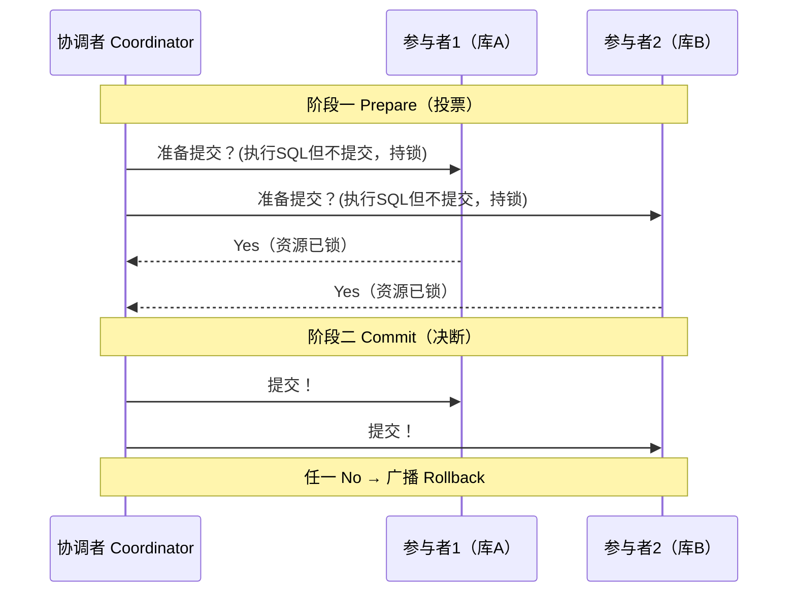

# 分布式事务详解

> 本文是分布式系列第 4 篇，把**分布式事务**一次讲透：为什么单机事务不够用、刚性事务（2PC/3PC/XA）与柔性事务（TCC/Saga/本地消息表/事务消息/最大努力通知）的原理、三大异常、对比与选型。
> **版本基线**：Seata v2.6（2026-08 查证）、RocketMQ 5.x | 创建日期：2026-08-10
> **受众**：后端开发熟手（熟悉 Java/Spring/MySQL），已懂 ACID 与 CAP/BASE 理论，准备分布式事务面试或系统复习。
> 前置知识：[00-分布式基础总览](../00-分布式基础总览.md)、[02-CAP与BASE理论详解](02-CAP与BASE理论详解.md)
> 关联笔记：[05-分布式ID与幂等设计详解](05-分布式ID与幂等设计详解.md)（事务补偿依赖幂等）、**Seata分布式事务框架详解**（见知识库）（Seata 是 **Java 生态**框架实现，归 Java 域；本文是方案原理层，与框架实现分离）

---

## 目录

- [1. 学习目标](#1-学习目标)
- [2. 前置知识](#2-前置知识)
- [3. 核心知识点](#3-核心知识点)
  - [3.1 知识点一：为什么需要分布式事务](#31-知识点一为什么需要分布式事务)
  - [3.2 知识点二：分布式事务全景——刚性 vs 柔性](#32-知识点二分布式事务全景刚性-vs-柔性)
  - [3.3 知识点三：2PC（两阶段提交）](#33-知识点三2pc两阶段提交)
  - [3.4 知识点四：TCC（Try-Confirm-Cancel）](#34-知识点四tcctry-confirm-cancel)
  - [3.5 知识点五：本地消息表（最终一致）](#35-知识点五本地消息表最终一致)
  - [3.6 知识点六：事务消息（RocketMQ 半消息）](#36-知识点六事务消息rocketmq-半消息)
  - [3.7 知识点七：Saga（长事务 / 补偿事务）](#37-知识点七saga长事务--补偿事务)
  - [3.8 知识点八：最大努力通知](#38-知识点八最大努力通知)
  - [3.9 知识点九：方案选型（结论先行）](#39-知识点九方案选型结论先行)
  - [3.10 知识点十：事务安全与一致性防护（防超卖/资金安全/隔离风险）](#310-知识点十事务安全与一致性防护)
  - [3.11 知识点十一：高级工程实践（热点/积压/死信/重试/监控）](#311-知识点十一高级工程实践)
  - [3.12 知识点十二：场景设计——电商下单跨服务一致性](#312-知识点十二场景设计电商下单跨服务一致性)
- [4. 最佳实践](#4-最佳实践)
- [5. 常见踩坑](#5-常见踩坑)
- [6. 小结](#6-小结)
- [7. 下一篇 / 关联](#7-下一篇--关联)
- [8. 参考资料](#8-参考资料)

---

## 1. 学习目标

学完本文你应当能够：

- 说清**为什么需要分布式事务**：单机 ACID 管不了跨服务/跨库，以及"跨库 join 不是分布式事务"这个误区。
- 完整复述 **2PC 两阶段提交**的流程与四个缺点，讲清 3PC 改进了什么、为什么实际很少用。
- 讲透 **TCC** 的 Try/Confirm/Cancel 语义，以及**空回滚、悬挂、幂等**三大异常的时序根因与工程解法。
- 区分**本地消息表**与 **RocketMQ 事务消息**的原理差别，知道半消息与事务回查机制。
- 理解 **Saga** 的正向执行与反向补偿，对比**编排式 vs 编舞式**的取舍。
- 知道**最大努力通知**是什么、适合什么场景、靠什么兜底。
- 掌握**事务安全四件套**：幂等防重、原子扣减防超卖、资金"长款短款"原则、对账兜底。
- 掌握**高级工程实践**：分段库存缓解热点、指数退避重试、死信队列兜底、消息积压监控。
- 面对"电商下单跨三服务"能完成**方案选型**并说出权衡与演进路径。

---

## 2. 前置知识

- [02-CAP与BASE理论详解](02-CAP与BASE理论详解.md)——强一致 vs 最终一致的理论基础（BASE 的"软状态/最终一致"是柔性事务的根基）。
- [05-分布式ID与幂等设计详解](05-分布式ID与幂等设计详解.md)——补偿、消息消费都依赖幂等，先理解幂等键与防重表。
- 需掌握：ACID、数据库事务隔离级别、微服务 RPC 调用模型。

---

## 3. 核心知识点

### 知识点一：为什么需要分布式事务

**一句话记忆**：单机事务管"一个库"的原子性，**分布式事务管"多个服务/多个库"要么全成功、要么全回滚/全补偿**。

#### ① 是什么

单体架构下，一个业务操作（下单）往往只落一个数据库，`BEGIN ... COMMIT/ROLLBACK` 就能保证原子性。微服务拆分后，一次下单要调三个服务，各写各的库：

```
Order service:  create order    ✅ 已提交
Stock service:  deduct stock    ✅ 已提交
Account service: deduct balance ❌ 失败
→ 订单建了、库存扣了、钱没扣 → 数据不一致！
```

没有任何一个服务能回滚"别人已提交的事务"，这就是分布式事务要解决的问题。

#### ② 为什么：本地事务的边界

本地事务的 ACID 只在自己连接的那个数据库实例内生效。跨库 = 跨事务管理器 = 没人能保证原子性。所谓分布式事务，本质是**在多个独立事务管理器之上，再建立一层"全局事务"的协调机制**。

#### ③ 边界：哪些场景才需要

| 场景 | 是否需要 | 理由 |
|---|---|---|
| 下单扣库存跨 2 服务 | ✅ | 两库两事务，必须协调 |
| 跨库 join 查询 | ❌ | 是**查询**问题（数据冗余/分库分表），不是写入一致性问题 |
| 单库多表写 | ❌ | 一个本地事务即可 |
| 强关联业务被拆到不同服务 | ⚠️ | 优先考虑**领域建模合并**，而不是上分布式事务 |

> 💡 **记忆锚点**：**跨库 join（读）和分布式事务（写一致性）是两回事**，面试官爱用这个考察你是否理解本质。

#### ④ 易错点

- 把"消息没发出去"当作小问题——业务成功但消息丢失，下游永远不知道，属于数据丢失。
- 认为"失败了重试就行"——重试会重复扣款，必须配**幂等**。

#### ⑤ 追问

- 面试官：不用分布式事务，怎么保证最终一致？→ 引出 BASE：允许短暂不一致 + 异步补偿/对账收敛。

---

### 知识点二：分布式事务全景——刚性 vs 柔性

**一句话记忆**：**刚性事务=强一致（2PC/3PC/XA），柔性事务=最终一致（TCC/Saga/本地消息表/事务消息）**。

#### ① 是什么

按一致性强度分两大类：

| 类别 | 方案 | 一致性 | 核心思想 |
|---|---|---|---|
| 刚性事务 | 2PC / 3PC / XA | 强一致 | 全局同步锁资源，要么全提交要么全回滚 |
| 柔性事务 | TCC | 业务可做到"较强"（Try 预留） | 资源预留在业务层，释放快 |
| 柔性事务 | Saga | 最终一致 | 长事务拆子事务 + 反向补偿 |
| 柔性事务 | 本地消息表 / 事务消息 | 最终一致 | 借 MQ 异步投递，业务与消息同事务 |
| 柔性事务 | 最大努力通知 | 最终一致（弱） | 反复通知 + 对账兜底 |

#### ② 为什么：CAP 的取舍

CAP 里 P（分区容错）不可放弃，分区时只能选 C 或 A。刚性事务倾向 C（牺牲可用性，阻塞等锁）；柔性事务倾向 A（先可用，后台补偿收敛到一致）。互联网高并发场景普遍选**柔性 + 最终一致**。

#### ③ 易错点

- 把 TCC 归为"最终一致"其实不精确：TCC 的 Try 阶段预留资源，Confirm 前对外不可见，隔离性比 Saga 好，是"尽量接近强一致"的柔性方案。面试时按"业务补偿型、性能高、侵入强"来描述更准确。

#### ④ 追问

- 为什么 2PC 在微服务里被嫌弃？→ 同步阻塞 + 协调者单点 + 全程持锁，吞吐上不去。

---

### 知识点三：2PC（两阶段提交）

**一句话记忆**：**一个协调者，两轮广播——先问"能不能提交"，全票通过才让提交**。

#### ① 是什么

引入**协调者（Coordinator）**统一指挥所有**参与者（Participant）**，分两个阶段：



| 阶段 | 动作 | 关键点 |
|---|---|---|
| Prepare（投票） | 协调者问所有参与者"能否提交" | 参与者执行事务**但不提交**，锁住资源，回复 Yes/No |
| Commit/Rollback（决断） | 全部 Yes → 令所有参与者提交；有 No → 令全部回滚 | 决断由协调者统一发出 |

#### ② 为什么：四大缺点（高频面试）

| 缺点 | 说明 |
|---|---|
| **同步阻塞** | Prepare 阶段所有参与者锁住资源等待协调者指令，长事务下吞吐极低 |
| **单点故障** | 协调者宕机，参与者收不到决断，只能一直阻塞（无法自行释放） |
| **数据不一致** | Commit 阶段网络分区，部分参与者收到提交、部分没收到 → 状态分裂 |
| **性能差** | 两阶段 RTT + 全程持锁，不适合高并发 |

> ⚠️ **易错点**：面试最爱问"2PC 能保证绝对一致吗"——**不能**！Commit 阶段网络抖动时仍有部分提交部分未提交的窗口，所以 2PC 只是"尽力强一致"。

#### ③ 3PC 改进了什么（对比）

| 维度 | 2PC | 3PC |
|---|---|---|
| 阶段数 | Prepare + Commit | CanCommit + PreCommit + DoCommit |
| 超时机制 | 无（协调者挂了全卡死） | 参与者也超时，超时默认中止/回滚，缓解阻塞 |
| 一致性 | 有 Commit 阶段不一致窗口 | 仍有 DoCommit 阶段不一致窗口 |
| 复杂度 | 中 | 高 |
| 实际使用 | 少（XA 实现） | 极少 |

3PC 把"准备"拆成"询问 + 预提交"，引入参与方超时，**缓解了 2PC 的同步阻塞**，但极端网络分区下**仍不能完全解决不一致**，且多一轮 RTT，工程上几乎没人用。

#### ④ 对比：XA 与 2PC 的关系

XA 是 **X/Open 组织定义的分布式事务规范**（接口：`xa_start/xa_end/xa_prepare/xa_commit/xa_rollback`），2PC 是它的核心流程实现。数据库厂商（MySQL InnoDB、Oracle）原生支持 XA，所以 XA = **数据库层面的 2PC**。Seata 的 XA 模式就是包了一层 XA 协议（详见 **Seata分布式事务框架详解**（见知识库））。

#### ⑤ 追问

- XA 事务为什么在微服务里少用？→ 需要每个库都支持 XA、全局锁长时间占用、协调者单点，跨服务（尤其异构数据库）部署成本高。

---

### 知识点四：TCC（Try-Confirm-Cancel）

**一句话记忆**：**TCC 把两阶段提交下沉到业务代码——Try 预留、Confirm 实扣、Cancel 释放，全 Try 成功才 Confirm，任一失败全 Cancel**。

#### ① 是什么

每个业务操作拆三个方法：

| 阶段 | 含义 | 扣款示例 |
|---|---|---|
| **Try** | 检查 + 预留资源（不真正生效） | 冻结 100 元、预扣 1 件库存 |
| **Confirm** | 确认执行，使用 Try 预留的资源 | 真正扣掉冻结的 100 元 |
| **Cancel** | 取消，释放 Try 预留的资源 | 解冻 100 元、释放预扣库存 |

```
Try 全部成功 → Confirm 全部执行（真正生效）
任一 Try 失败 → Cancel 全部执行（释放预留）
```

#### ② 为什么：性能比 2PC 好

2PC 的"准备"是数据库层面锁行锁表，时间长；TCC 的 Try 是**业务层面预留**（如余额冻结字段、库存预占），本地事务秒级提交释放连接，**不长时间锁数据库资源**。因此 TCC 适合**一致性要求高 + 并发大**的核心链路（支付、库存）。

#### ③ 特例/边界：TCC 三大异常（最高频考点！）

这三个异常本质是 **Try/Confirm/Cancel 之间因网络超时+重试产生的乱序**：

| 异常 | 定义 | 时序根因 | 解决方案 |
|---|---|---|---|
| **空回滚** | Cancel 执行了，但 Try 从未执行（Try 超时没到） | 协调者误判 Try 失败 → 发 Cancel；Cancel 却先到 | Cancel 前检查 Try 是否发生过，用**事务记录表**判断 |
| **悬挂** | Cancel 先于 Try 到达，Try 后到被忽略但资源被占 | 网络乱序：Cancel 到了，Try 还在路上 | Try 前检查是否已 Cancel，已 Cancel 则**拒绝执行 Try** |
| **幂等** | Confirm/Cancel 被重试多次执行 | 网络重试、协调者重复下发 | 每步带**唯一事务 ID**，只生效一次 |

**工程化闭环**（一张事务记录表 + 状态机，面试加分代码）：

```java
// 事务记录表: tx_record(tx_id PK, status: TRYING/CONFIRMED/CANCELLED)
// Try 前查是否已 Cancel → 防悬挂；Cancel 前查是否 Try 过 → 防空回滚；
// Confirm/Cancel 用条件更新 → 保证幂等（只生效一次）

boolean tryBegin(String txId) {
    // 防悬挂：Cancel 先到过，拒绝迟到的 Try
    if (txRecordDao.exists(txId, CANCELLED)) return false;
    return txRecordDao.insertIfAbsent(txId, TRYING) == 1; // 幂等：重复 Try 只插入一次
}

boolean cancel(String txId) {
    // 空回滚：Try 从未发生，标记 CANCELLED 直接返回（不释放任何资源）
    if (!txRecordDao.exists(txId, TRYING)) {
        txRecordDao.insertIfAbsent(txId, CANCELLED);
        return true;
    }
    // 幂等：只有 TRYING 状态才允许转为 CANCELLED
    return txRecordDao.updateStatus(txId, CANCELLED, where(TRYING)) > 0;
}

boolean confirm(String txId) {
    // 幂等：只有 TRYING 状态才允许转为 CONFIRMED
    return txRecordDao.updateStatus(txId, CONFIRMED, where(TRYING)) > 0;
}
```

> 💡 **记忆锚点**：**TCC 三大异常 = 网络乱序 + 重试，解法 = 一张事务记录表 + 状态机条件更新**。理解这套机制，就能解释"为什么 TCC 侵入性强"——每个资源都要维护这张表和三套逻辑，所以 TCC 只用在核心交易链路。

#### ④ 对比：TCC vs 2PC

| 维度 | 2PC/XA | TCC |
|---|---|---|
| 实现层面 | 数据库 | 业务代码 |
| 资源锁 | 数据库行/表锁，时间长 | 业务预留，本地事务短 |
| 一致性 | 强一致 | 业务级，接近强一致 |
| 性能 | 低 | 高 |
| 侵入性 | 低（SQL 层） | **高**（三方法 + 幂等表） |
| 适用 | 跨库、低并发、传统架构 | 核心交易、高并发、支付库存 |

#### ⑤ 追问

- 面试官："TCC 的 Cancel 比 Try 先到（悬挂），如果 Try 后到还执行了，会导致什么后果？如何彻底防止？"→ 后果：资源被预留但永远没人释放（泄漏）；防止：Try 入口查事务记录表是否存在 CANCELLED，存在即拒绝（上面 `tryBegin` 的写法）。

---

### 知识点五：本地消息表（最终一致）

**一句话记忆**：**把"业务操作"和"发消息"放进同一个本地事务——同库同事务，消息不丢；扫表投递，最终一致**。

#### ① 是什么（流程）

```
1. 本地事务里：执行业务 + 往本地 message 表插一条"待发送"记录（同一库、同一事务 → 原子）
2. 定时任务/异步 worker 扫描 message 表，把未发送的消息投递到 MQ
3. 下游消费成功 → ack → 标记消息已发送；失败 → 重试
```

#### ② 为什么：关键在"同库同事务"

业务成功但消息没发（或反之）的原因被**原子性**消灭：业务和消息写入要么一起成功，要么一起失败。消息表是"本地持久化的消息队列"，MQ 只负责投递，不承担一致性责任。

#### ③ 特例/边界

- **消费端必须幂等**：MQ 可能重复投递（投递成功后 ack 丢失会重投），下游要按业务键去重。
- **扫描任务宕机**：消息积压几天，恢复后补投 → 下游收到大量重复消息 → 幂等 + 按序处理兜底。
- **消息表膨胀**：需定期清理已发送记录（可归档）。
- **扫描轮询延迟**：消息不是即时投递，有秒级延迟，适合允许延迟的异步场景。

#### ④ 对比：本地消息表 vs 事务消息

| 维度 | 本地消息表 | 事务消息（RocketMQ） |
|---|---|---|
| 依赖 | 业务库 + 任意 MQ | MQ 原生支持（RocketMQ 等） |
| 消息表 | 自己维护 + 扫描任务 | MQ 托管，无消息表 |
| 一致性 | 最终一致 | 最终一致 |
| 通用性 | 任何 MQ 都行 | 需要 MQ 支持事务消息 |
| 运维成本 | 高（表 + 任务 + 清理） | 低（MQ 全托管） |
| 投递延迟 | 秒级（扫描间隔） | 秒级（半消息确认后立即可见） |

#### ⑤ 追问

- 业务库和 MQ 都挂了怎么办？→ 消息表在库里不丢，MQ 恢复后补投；真正怕的是"业务回滚了消息还在"——同库同事务保证不会发生。

---

### 知识点六：事务消息（RocketMQ 半消息）

**一句话记忆**：**半消息消费者看不见，本地事务成功才"转正"可见；没回复就反查事务状态——MQ 把"业务+消息"的一致性托管了**。

#### ① 是什么（流程）

```
1. Producer 发送 half message（半消息）→ 存 MQ，消费者不可见
2. MQ 确认收到 → Producer 执行本地事务
3. 本地事务成功 → commit 半消息（消费者可见）；失败 → rollback（丢弃）
4. 超时未回复 → MQ 主动反查本地事务状态（事务回查 check-back）→ 按结果 commit/rollback
```

```java
// RocketMQ 事务消息 Producer（5.x 伪代码）
TransactionMQProducer producer = new TransactionMQProducer("group");
producer.setTransactionListener(new TransactionListener() {
    @Override
    public LocalTransactionState executeLocalTransaction(Message msg, Object arg) {
        // 1. 执行本地事务（写订单）
        boolean ok = orderService.create(...);
        // 2. 返回状态给 MQ：提交 / 回滚 / 未知
        return ok ? LocalTransactionState.COMMIT_MESSAGE
                  : LocalTransactionState.ROLLBACK_MESSAGE;
    }
    @Override
    public LocalTransactionState checkLocalTransaction(MessageExt msg) {
        // 3. MQ 反查：根据业务流水查本地事务到底成没成
        return orderService.isCommitted(msg.getKeys())
               ? LocalTransactionState.COMMIT_MESSAGE
               : LocalTransactionState.ROLLBACK_MESSAGE;
    }
});
producer.sendMessageInTransaction(msg, null); // 发送半消息
```

#### ② 为什么：本质是本地消息表的"中间件托管版"

半消息机制 + 事务回查，把"本地事务"与"消息发送"的一致性交给 MQ 保证，业务不用自己建消息表、写扫描任务。**反查（check-back）是关键**：生产方宕机/超时，MQ 按约定回查，最终一致不丢。

#### ③ 特例/边界

- **回查频率与次数**：RocketMQ 按 `transactionTimeOut` 与 `transactionCheckMax` 配置重查，查不到按 rollback 处理（可配置）。
- **消费者幂等依旧必要**：半消息转正后投递仍可能重复（与普通消息一致）。
- **只能解决"消息与本地事务"一致**：跨多个服务的多资源一致性，事务消息管不了，那是 Seata/TCC 的领域。

#### ④ 易错点

- 认为"本地事务成功但没 commit 半消息"——不会发生，RocketMQ 的回查机制会兜底。
- 回查逻辑必须**幂等可重入**：反查接口可能被调多次，且要能查到事务结果。

#### ⑤ 追问

- 为什么不用"先发消息再执行事务"？→ 消息可能发出但事务回滚 → 下游收到不存在的订单。半消息机制就是为消除这个窗口。

---

### 知识点七：Saga（长事务 / 补偿事务）

**一句话记忆**：**长事务拆成一串可提交的子事务，每步配一个补偿操作；走完发现失败，就按反序把已成功的步补偿回去**。

#### ① 是什么

```
正向：T1 → T2 → T3（每个 T 都是独立提交的本地事务）
失败：T3 失败 → 执行 C2 → C1（补偿 T2、T1）
```

例子：旅行预订 = 订机票 T1 → 订酒店 T2 → 租车 T3；租车失败 → 退酒店 C2 → 退机票 C1。

#### ② 为什么：与 TCC 的本质区别

**Saga 没有资源预留**——每个子事务直接提交，失败靠**补偿**回滚。对比 TCC 的 Try 预留，Saga 实现更简单（每步只写正向 + 补偿两个方法），但**没有隔离性**：中间状态对外可见（机票已订、酒店还没退）。适合**流程长、参与方多、可容忍中间态**的业务。

#### ③ 两种实现方式（高频考点）

| 维度 | 编排式 Orchestration | 编舞式 Choreography |
|---|---|---|
| 指挥者 | 中心协调器统一编排各步骤 | 无中心，各服务监听事件自行响应 |
| 流程可见性 | 清晰、可追踪（状态机/流程图） | 分散，难追踪 |
| 单点 | 协调器是单点（需高可用+状态持久化） | 无单点 |
| 耦合 | 参与者只与协调器交互 | 服务间事件耦合 |
| 代表 | Seata Saga 状态机、Temporal | 各服务发事件链式触发 |

#### ④ 特例/边界：Saga 的补偿三兄弟（与 TCC 类似）

- **空补偿**：原服务超时（丢包）没执行，补偿却来了 → 允许空补偿：没找到业务主键就返回成功并记录。
- **防悬挂**：补偿先到，原服务后到 → 检查补偿记录，已补偿过就拒绝执行原服务。
- **幂等**：原服务与补偿都可能重试 → 按业务主键幂等。

> ⚠️ **易错点**：**Saga 没有隔离性**。极端例子：先给 A 充值、再给 B 扣款，A 的钱在事务提交前被花掉，回滚时无法补偿。应对原则——**"宁可长款，不可短款"**：先扣款后加款，短款（机构少收）追不回，长款（机构多收）可退款。

#### ⑤ 对比：Saga vs TCC

| 维度 | TCC | Saga |
|---|---|---|
| 预留 | Try 预留资源 | 无预留，直接提交 |
| 隔离性 | 较好（预留对外不可见） | 无（中间态可见） |
| 实现成本 | 高（三方法+幂等表） | 中（正向+补偿两方法） |
| 适用 | 核心交易、高并发 | 长流程、多参与方、容忍中间态 |
| 一致性 | 接近强一致 | 最终一致 |

#### ⑥ 追问

- 面试官："Saga 编排式协调器宕机，已执行的子事务怎么补偿？协调器要不要持久化状态？"→ 要！协调器必须**持久化流程状态**（当前执行到哪步），宕机恢复后从持久化状态继续/补补偿；Seata Saga 状态机把执行日志落库就是这个目的。

---

### 知识点八：最大努力通知（Best-Effort Notification）

**一句话记忆**：**反复重试通知 + 对账兜底，通知不到就靠人工/定时对账发现——"尽力而为但不保证送达"**。

#### ① 是什么（流程）

```
1. 业务成功后，通知服务反复尝试通知下游（指数退避重试，N 次）
2. 重试仍失败 → 记录失败消息，走补偿/对账流程
3. 下游主动定时拉取对账（如每日对账单）兜底
```

#### ② 为什么：它不保证一致性

最大努力通知**不承诺最终一致**（不像事务消息有半消息机制），它只承诺"我尽力通知了"。所以必须配合**对账**兜底：下游定期拉账单核对，发现差异人工/自动修正。典型场景：**支付回调通知**（支付成功 → 通知商户；通知失败重试；商户每日对账）。

#### ③ 对比：最大努力通知 vs 事务消息 vs 本地消息表

| 维度 | 最大努力通知 | 事务消息 | 本地消息表 |
|---|---|---|---|
| 一致性保证 | 弱（尽力通知） | 最终一致 | 最终一致 |
| 消息不丢保证 | 无（靠对账兜底） | 强（半消息+回查） | 强（同库同事务） |
| 实现成本 | 低 | 中（需 MQ 支持） | 中（表+扫描） |
| 适用 | 支付回调、通知类 | 订单-积分等强关联异步 | 同上，无事务消息 MQ 时 |

#### ④ 易错点

- 把最大努力通知当"最终一致方案"用——通知失败就丢，**业务上必须靠对账兜底才不算丢数据**。

#### ⑤ 追问

- 跨服务的"最大努力通知"通知失败就丢了，业务上靠什么兜底？→ 定时对账任务 + 人工介入流程（如支付场景的对账单、差错处理平台）。

---

### 知识点九：方案选型（结论先行）

**一句话记忆**：**能不用就不用（强关联合并）；必须用时，强一致核心链路 TCC，其余优先最终一致（事务消息/Saga/本地消息表），全程幂等+重试+对账兜底**。

| 方案 | 一致性 | 性能 | 侵入性 | 适用场景 |
|---|---|---|---|---|
| 2PC/XA | 强 | 低（阻塞） | 低 | 传统跨库、并发不高、数据库支持 XA |
| TCC | 强（业务级） | 高 | **高**（三方法） | 核心交易、支付、库存预扣 |
| 本地消息表 | 最终 | 高 | 中 | 异步解耦、允许秒级延迟、任意 MQ |
| 事务消息 | 最终 | 高 | 中 | 有 RocketMQ 等支持时首选 |
| Saga | 最终 | 高 | 中 | 长流程、多参与方、容忍中间态 |
| 最大努力通知 | 弱 | 高 | 低 | 支付回调、对账兜底 |

**选型口诀**：

1. **能不分布式事务就不分布式事务**——强关联操作尽量放同一服务/同一库（领域建模合并）。
2. 强一致核心链路 → **TCC**（或数据量小且低并发 → XA）。
3. 其余异步解耦 → **事务消息 / 本地消息表**。
4. 长流程编排 → **Saga**。
5. 通知类 → **最大努力通知 + 对账**。
6. 框架层面：Seata 一站提供 AT（2PC 变种+undo_log 自动补偿）、TCC、Saga、XA，按场景切换（框架细节见 **Seata分布式事务框架详解**（见知识库），Java 域）。

---

### 知识点十：事务安全与一致性防护（安全专题，对应 Nginx 安全篇的深度）

**一句话记忆**：**分布式事务方案只是"骨架"，安全落地靠四件套——幂等防重、原子扣减防超卖、资金"长款短款"原则、对账兜底**。

#### ① 是什么：事务安全包含哪些面

| 安全面 | 威胁 | 防护手段 |
|---|---|---|
| 幂等 | 重复投递/重试导致重复扣款、重复加积分 | 幂等键 + 防重表 + 状态机 |
| 超卖 | 并发扣库存，最终扣成负数 | 原子扣减 SQL、乐观锁、TCC 预扣 |
| 资金安全 | 补偿失败、脏读中间态导致账不平 | "宁可长款不可短款"、冻结/解冻流水 |
| 隔离风险 | Saga 中间态可见、AT 读未提交 | SELECT FOR UPDATE、先扣款后加款 |
| 数据丢失 | 消息投递失败、消费失败 | 重试 + 死信 + 对账 + 人工兜底 |

#### ② 幂等防护：防重表 + 唯一键 + 状态机（三件套）

```
防重表 idempotent( biz_key PK, status )
1. 请求带幂等键（如 orderId:action:seq）
2. insert ignore 防重表，影响行数=0 → 重复请求，直接返回旧结果
3. 首次成功 → 业务执行 → 更新 status=SUCCESS
4. 状态机保证只流转一次：CREATED → SUCCESS / FAILED
```

- **为什么必须**：MQ 至少一次投递（at-least-once）、TCC Confirm/Cancel 可能重试、Saga 补偿可能重试——三者都靠幂等兜底。
- **防重表要跟业务同库同事务**，否则防重本身不一致。
- 参考 [05-分布式ID与幂等设计详解](05-分布式ID与幂等设计详解.md)。

#### ③ 防超卖：扣库存的三种正确姿势

| 方式 | SQL/写法 | 说明 |
|---|---|---|
| 原子条件更新 | `update stock set count=count-1 where id=? and count>0` | 数据库行锁 + 条件判断，天然防超卖，影响行数=0 则库存不足 |
| 乐观锁（版本号） | `update stock set count=count-1, version=version+1 where id=? and version=?` | 适合读多写少，冲突重试 |
| TCC 预扣 | Try 预扣 `frozen` 字段，Confirm 实扣 | 分布式事务场景，预留 + 幂等 |

> ⚠️ **易错点**：先 `select count` 再 `update` 是典型的超卖写法——两个语句之间有并发窗口，必须用**原子条件更新**或**乐观锁**。

#### ④ 资金安全："宁可长款，不可短款"原则

资金补偿场景（Saga/TCC 回滚、对账差异）遵循：

- **长款**：机构多收了钱（客户账户少了）→ 可以退款，**损失可逆**。
- **短款**：机构少收了钱（客户多拿了）→ 追回困难，**损失不可逆**。

**设计原则**：业务流程先扣款、后加款；补偿时先退款后补扣。例：充值+消费的长流程，先扣费、后入账，回滚时优先退还已扣费用。

#### ⑤ 隔离风险防护

- **Saga 无隔离**：中间态对外可见 → 关键资源（钱）在流程中先扣后加，或用版本/状态位让中间态不可用。
- **AT 默认读未提交** → 对账/统计读用 SELECT FOR UPDATE（见 Seata 篇）。
- **脏写防护**：全局锁保证全局事务间不脏写，但**绕过框架的直改**会触发后镜像校验失败——业务侧要约定"参与全局事务的表只走框架写"。

#### ⑥ 追问

- 面试官："本地消息表的扫描任务宕机几天，下游收到大量重复消息，如何保证幂等和不丢？"→ ① 不丢：消息表在库里，恢复后补投（同库同事务保证）；② 幂等：下游按业务主键防重表去重；③ 大量重复：按时间窗/批处理合并，逐条幂等即可，不要求有序（乱序场景再按 seq 处理）。

---

### 知识点十一：高级工程实践（热点/积压/死信/重试/监控）

**一句话记忆**：**生产落地 = 热点分桶 + 重试退避 + 死信兜底 + 积压告警 + 监控看板，五件套缺一不可**。

#### ① 热点资源处理：分段库存

高并发下同一商品库存是单行热点（数据库行锁 + Seata 全局锁都打在这行）。**分段库存**：

```
stock 表按商品拆 N 段：stock_0 ~ stock_N-1（按商品ID取模分桶）
扣减：hash(productId) 路由到某段，先扣本段，不足再借邻段
释放：归还到原段
```

- 效果：单行竞争分散为 N 行，吞吐线性提升。
- 代价：库存汇总查询要聚合 N 段；借段逻辑增加复杂度——**热点解除后要能合并回收**。
- 类似思想：Redis 分片、订单号取模分库。

#### ② 重试策略：指数退避 + 抖动

| 参数 | 建议 | 说明 |
|---|---|---|
| 重试次数 | 3~5 次 | 过多拖垮下游，过少丢数据 |
| 间隔 | 指数退避 `2^n` + 随机抖动 | 避免重试风暴（所有失败请求同时重试） |
| 超时 | 单次 RPC 超时 < 全局事务超时 | 预留二阶段协调时间 |
| 熔断 | 连续失败 N 次熔断 | 保护下游，人工介入 |

#### ③ 死信队列（DLQ）：消息消费失败的最终归宿

```
消费失败 → 重试 N 次（RocketMQ 默认 16 次）→ 仍失败 → 进入死信队列
DLQ 消费者 → 告警 → 人工/定时任务处理（补偿、修复数据、重投）
```

- 死信不是终点：要配**告警 + 处理工单**，否则死信堆积=数据丢失。
- 区分"可重试失败"（下游抖动）与"不可重试失败"（业务数据错误）——后者直接进死信，别浪费重试。

#### ④ 消息积压：监控与快速扩容

- 积压指标：消费 lag（消费位点落后生产位点）、DLQ 数量。
- 处理：临时扩容消费者（RocketMQ 提高消费并发）、紧急情况跳过非关键消息、事后补偿。
- 积压 ≠ 丢数据：消息在 MQ 里持久化，关键是有**积压告警**别等到用户投诉。

#### ⑤ 监控看板：分布式事务核心指标

| 指标 | 意义 | 告警阈值参考 |
|---|---|---|
| 事务成功率 = commit / begin | 框架层健康度 | < 99% 告警 |
| 回滚率 | 补偿频繁 = 业务/依赖问题 | 突增告警 |
| 全局锁等待时间/超时次数 | 热点行竞争（Seata lock_table） | 超时次数 > 0 排查 |
| 消息消费 lag / DLQ 数量 | 最终一致收敛速度 | lag 持续增长告警 |
| 补偿任务执行时长 | 对账/补单效率 | 超过 SLA 告警 |

#### ⑥ 追问

- 面试官："事务消息/本地消息表下游消费失败就丢？"→ 不会丢：重试 + 死信 + 人工兜底三级防线；真正要防的是**死信没人处理**，所以死信必须告警且有人工流程。

---

### 知识点十二：场景设计——电商下单跨服务一致性

**一句话记忆**：**核心链路 TCC（库存预扣+余额冻结），异步下游事务消息，每日对账兜底——混用方案匹配一致性强度**。

#### ① 需求澄清（先问清再设计）

下单需扣库存、扣余额、创建订单，跨 3 个服务；要求**不超卖、最终一致、高并发**。

#### ② 方案选型

| 环节 | 方案 | 理由 |
|---|---|---|
| 库存扣减 | **TCC**（Try 预扣 / Confirm 实扣 / Cancel 释放） | 不超卖 + 高并发 + 强一致核心链路 |
| 余额扣减 | **TCC**（Try 冻结 / Confirm 实扣 / Cancel 解冻） | 资金安全，预留+流水 |
| 订单创建 | 本地事务（订单服务自己的库） | 单库操作，不需要分布式 |
| 积分/通知 | **事务消息**（RocketMQ） | 异步解耦，允许延迟，最终一致 |

#### ③ 关键设计要点

- 库存/余额服务实现 TCC 三方法，用**事务记录表**防空回滚/悬挂/幂等（见知识点四代码）。
- TCC 异常处理：Try 失败 → 全部 Cancel；Cancel 先到 → 拒绝迟到 Try（防悬挂）。
- 订单创建成功发 `OrderCreated` 半消息，积分服务消费加积分，**消费幂等**。
- 每日对账：订单 vs 库存流水 vs 余额流水，差异自动/人工修正。
- 高并发预扣热点：**分段库存**缓解（知识点十一）。

#### ④ 演进路径（量级变化时的架构演进）

```
早期量小：全用本地消息表 + 对账（简单可靠）
量级上来：核心交易升级 TCC（库存预扣+余额冻结）
再大规模：预扣独立成服务，缓存+DB 双写，异步削峰
```

#### ⑤ 追问

- 面试官："为什么混用 TCC + 事务消息，不全用 TCC？"→ 一致性强度与成本匹配：资金/库存强一致必须 TCC（侵入高、性能好），积分/通知允许最终一致用消息（零侵入、异步）。全用 TCC 开发成本爆炸，全用消息资金安全不够。

---

## 4. 最佳实践

- **幂等是底线**：消息消费、TCC Confirm/Cancel、Saga 补偿，全部按业务主键幂等（参考 [05-分布式ID与幂等设计详解](05-分布式ID与幂等设计详解.md)）。
- **重试 + 死信队列 + 人工兜底**：消息消费失败不能丢，重试 N 次进死信，死信告警人工处理。
- **对账任务兜底**：核心资金链路每日对账（订单 vs 库存 vs 余额流水），是最后一道防线。
- **能合并就别拆**：把强耦合的写操作留在同一服务同一库，是最便宜的"分布式事务"。
- **预留字段设计**：TCC 的冻结/预扣，用独立字段（frozen_amount）而非直接改余额，便于补偿与审计。

## 5. 常见踩坑

- 无脑上分布式事务——很多场景用**最终一致 + 对账**更简单可靠。
- 认为 2PC 保证绝对一致——**Commit 阶段仍可能部分失败**（网络分区）。
- 忽视消费端幂等——**MQ 会重复投递**。
- TCC 不处理空回滚、悬挂、幂等——资源泄漏或超卖。
- 认为 Saga 有隔离性——**没有**，中间态可见，注意"短款追不回"。
- 把跨库 join（查询）和分布式事务（写入一致性）混为一谈。
- 用分布式事务"解决"本应通过领域建模拆分掉的强耦合。
- 消息消费失败就丢——必须有重试 + 死信 + 人工兜底。

## 6. 小结

- 分布式事务解决**跨服务/跨库的多事务原子性**，本地事务管不了别人。
- 刚性（2PC/3PC/XA）强一致但阻塞低吞吐；柔性（TCC/Saga/消息类）最终一致但可用性高。
- TCC 三异常（空回滚/悬挂/幂等）= 网络乱序 + 重试，一张**事务记录表 + 状态机**全解。
- 事务消息 = 本地消息表托管版，半消息 + 回查保证业务与消息一致。
- 选型：强一致 TCC、长流程 Saga、异步解耦事务消息、通知对账最大努力。

## 7. 下一篇 / 关联

- 下一篇（框架落地）：**Seata分布式事务框架详解**（见知识库）（Java 域）——AT/TCC/Saga/XA 四种模式、undo_log 反向 SQL、全局锁、部署演进，重点细化。
- 上一篇：[03-分布式锁原理详解](03-分布式锁原理详解.md)——分布式协调的另一半。
- 依赖概念：[02-CAP与BASE理论详解](02-CAP与BASE理论详解.md)、[05-分布式ID与幂等设计详解](05-分布式ID与幂等设计详解.md)

---

## 8. 参考资料

- [Apache Seata 官方文档（v2.6）：Seata 是什么](https://seata.apache.org/zh-cn/docs/overview/what-is-seata/)，查询日期：2026-08-10
- [Apache Seata：AT 模式机制](https://seata.apache.org/zh-cn/docs/dev/mode/at-mode/)，查询日期：2026-08-10
- [Apache Seata：TCC 模式](https://seata.apache.org/zh-cn/docs/user/mode/tcc/)，查询日期：2026-08-10
- [Apache Seata：Saga 模式](https://seata.apache.org/zh-cn/docs/user/mode/saga/)，查询日期：2026-08-10
- [RocketMQ Docs: Transactional Message](https://rocketmq.apache.org/docs/featureBehavior/04transactionmessage/)，查询日期：2026-08-01
- [microservices.io: Saga pattern](https://microservices.io/patterns/data/saga.html)
- [Martin Fowler: Saga pattern](https://martinfowler.com/articles/patterns-of-distributed-systems/saga.html)
- 面试素材：`/Users/lub/Desktop/学习/跟AI学技术/面试笔记/后端工程师面试/分布式系统/分布式事务.md`（已吸收）
