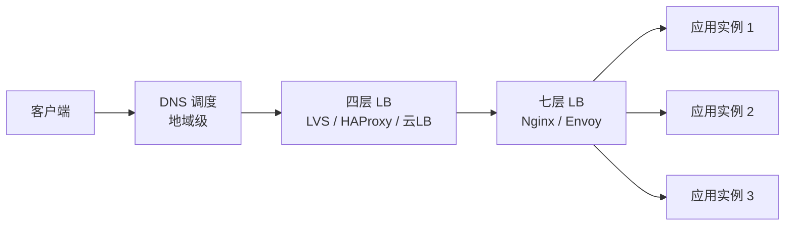

# 负载均衡详解

> 本文是分布式系列第 6 篇，以 **「四层 vs 七层」对比模型** 为主线，把主流实现 **LVS / HAProxy / Nginx / Envoy** 各收一位讲清定位，再给出调度算法、高可用与选型决策。LVS 单独深挖性价比低（需要时再看原理即可），本文以全景对比为主。
> 前置知识：[00-分布式基础总览](00-分布式基础总览.md)
> 关联笔记：[01-一致性Hash算法详解](01-一致性Hash算法详解.md)（调度算法）、[10-upstream负载均衡算法](../Nginx/04-反向代理与负载均衡/10-upstream负载均衡算法.md)（Nginx 实现）

## 版本基线

本文是通用架构原理，不依赖具体版本。示例场景：Nginx 1.2x、LVS（内核 IPVS）、HAProxy 2.x、Envoy 1.3x、阿里云 CLB。

## 受众声明

面向已了解 Web 架构、集群、反向代理基本概念的读者。假设已懂：TCP/IP 分层、HTTP 协议、服务器集群。以下术语必须讲清：四层/七层、VIP、DSR、会话保持、健康检查。

## 学习目标

学完本文你能：
1. 说清**负载均衡解决什么问题**（单点、容量、高可用）
2. 画出**四层 vs 七层模型**，说清差异与各自适用场景
3. 对比 **LVS / HAProxy / Nginx / Envoy** 四种实现，知道各自定位与现状
4. 说清 **LVS 的 DR 模式原理**与"隐形但无处不在"的现状
5. 列出常见**调度算法**，与一致性 Hash 挂钩
6. 理解**高可用**（VRRP 的 VIP 漂移）、健康检查、会话保持
7. 2026 年视角下做出**选型决策**

## 前置知识

- [00-分布式基础总览](00-分布式基础总览.md)——分布式知识域定位
- [01-一致性Hash算法详解](01-一致性Hash算法详解.md)——哈希类调度算法的底层原理
- 需掌握：TCP/IP 分层、HTTP、集群、反向代理概念

---

## 1. 负载均衡是什么

**一句话记忆**：把流量**均匀分发**到多台后端服务器，换来**容量扩展 + 单点消除 + 故障容错**。

**生活类比**：银行大堂经理——客户（请求）进来，按各窗口忙闲情况叫号分流，而不是所有人挤一个窗口；哪个窗口坏了，就暂时不给它派活。

**为什么需要**（四个理由缺一不可）：
- 单机容量有限：CPU / 内存 / 连接数都有天花板
- 单点故障：一台机器挂了，服务整体不可用
- 水平扩展：加机器就能扩容（scale out），而不是换大机器（scale up）
- 故障自愈：坏节点自动摘除，恢复自动加回

## 2. 负载均衡的分层

按处理层级从外到内分四层：

| 层级 | 代表 | 特点 |
|---|---|---|
| **DNS 层**（地理级） | 智能 DNS / CDN | 按地域就近调度，但**感知不到服务器状态**，故障切换慢 |
| **四层 L4**（传输层） | LVS、HAProxy、F5、云 LB 四层 | 只看 **IP + 端口**，不解析内容，性能高 |
| **七层 L7**（应用层） | Nginx、Envoy、APISIX、云 LB 七层 | 解析 **HTTP 内容**，可按 URL / Header / Cookie 路由 |
| **客户端层**（本地） | Ribbon、Spring Cloud LoadBalancer | 客户端自己选实例，适合微服务内部调用 |

## 3. 四层 vs 七层 对比模型 ★核心

| 维度 | 四层（L4） | 七层（L7） |
|---|---|---|
| 处理层级 | 传输层（TCP/UDP） | 应用层（HTTP/HTTPS） |
| 能看懂什么 | 仅 IP / 端口 | URL / Header / Cookie / 报文内容 |
| 转发方式 | 转发原始报文（内核态/少拷贝） | 解包 → 重封装（用户态解析，终止连接） |
| 性能 | **高**（不碰内容） | 相对低（每请求解析） |
| 功能 | 简单：转发 + 调度 | 丰富：路由 / 改写 / 限流 / 鉴权 / 压缩 |
| HTTPS 证书 | 不终止（透传） | 终止 TLS，后端走内部 http |
| 典型代表 | LVS、HAProxy、云 LB 四层 | Nginx、Envoy、APISIX、云 LB 七层 |
| 适用场景 | 海量 TCP/UDP、极致性能、非 HTTP 协议 | HTTP 服务、微服务网关、需要内容路由 |

**核心心智模型**：四层**不管内容所以快**，七层**功能多所以要解包**。生产架构常 **4 + 7 组合拳**：先用 LVS/HAProxy 扛住海量连接，再交给 Nginx 做内容路由（L4 挡流量，L7 做业务）。

## 4. 主流实现全景（各占一位）

### 4.1 LVS —— 内核态四层，「隐形霸主」

- **本质**：Linux 内核 **IPVS 模块**，转发在内核态完成，**性能天花板最高**，抗百万级并发连接
- **三种工作模式**：
  - **DR（直接路由）**：只改目标 MAC 不改 IP，响应由 RS 直接回给客户端，**最常用、性能最高**
  - **NAT**：改目的 IP，回程必经 LB，有瓶颈
  - **TUN**：IP 隧道封装，跨机房用
- **高可用**：keepalived（VRRP 协议）做 VIP 漂移
- **现状（2026）**：**国内依然大量在用，但"隐形"了**——
  - 云厂商四层 LB 底层就是它：阿里云官方架构明确"四层采用开源 LVS + Keepalived"
  - 大厂自建机房入口仍是 LVS 系（阿里 LVS 团队就是章文嵩带的）
  - 短板：配置靠 `ipvsadm` 命令行，**没有 API / 无动态发现**，与现代"基础设施即代码"格格不入，新项目不首选
- **适用**：自建机房 + 极致性能 + 存量架构；**新项目学习优先级低**

### 4.2 HAProxy —— 用户态四层首选

- 性能仅次于 LVS，但**配置现代、生态活跃**，支持四层 + 七层
- 特性：强大的健康检查、ACL 规则、会话保持、多线程、热重载
- **适用**：自建四层选型第一梯队；中小规模直接它一个搞定

### 4.3 Nginx —— 七层主力

- 反向代理 + 负载均衡：`upstream` + `proxy_pass`，算法丰富（轮询 / 加权 / ip_hash / least_conn / url_hash / 一致性 hash）
- 也支持四层（`stream` 模块），但非主力
- 生态庞大：静态资源、限流缓存、OpenResty 网关（Kong / APISIX）
- **实现细节见 [10-upstream负载均衡算法](../Nginx/04-反向代理与负载均衡/10-upstream负载均衡算法.md)**

### 4.4 Envoy —— 云原生七层

- **动态配置（xDS）**、服务发现、熔断限流、可观测（指标/追踪）全内建
- Service Mesh **数据面标准**（Istio 默认数据面）
- **适用**：K8s / 微服务网格场景；传统架构引入学习成本偏高

### 4.5 云 LB —— 最省心

- 阿里云 SLB/CLB、腾讯 CLB 等：四层 LVS 底层、七层兼容，免运维、弹性扩缩、自带监控告警
- **适用**：能用云就别自建（除非合规 / 成本 / 极致性能硬需求）

**四大实现速查表**：

| 维度 | LVS | HAProxy | Nginx | Envoy |
|---|---|---|---|---|
| 层级 | 四层（内核态） | 四层为主+七层 | 七层为主+四层 | 七层 |
| 性能 | ★★★★★ | ★★★★ | ★★★ | ★★★ |
| 功能丰富度 | ★（几乎无） | ★★★★ | ★★★★★ | ★★★★★ |
| 动态配置/API | ✗（ipvsadm） | 部分（可配 API） | 部分 | ✓（xDS 原生） |
| 云原生契合 | ✗ | 一般 | 一般 | ✓✓ |
| 学习成本 | 低（但生态老） | 中 | 中 | 高 |
| 现状定位 | 云LB底层/大厂存量 | 自建四层首选 | 七层事实标准 | 网格/新架构 |

## 5. 调度算法

| 算法 | 原理 | 特点/适用 |
|---|---|---|
| 轮询 RR | 按顺序轮流分发 | 最简单；后端性能一致时用 |
| 加权轮询 WRR | 按权重比例分发 | 机器规格不一（大机器权重高） |
| 最少连接 least_conn | 分给当前连接数最少的 | 长连接 / 请求耗时差异大时 |
| 源地址哈希 ip_hash | 同 IP 固定到同一后端 | 天然会话保持；注意热点 |
| URL 哈希 | 同 URL 固定同一后端 | 缓存类业务（命中率） |
| **一致性哈希** | 哈希环 + 虚拟节点 | **节点增减只影响少量请求**，详见 [01-一致性Hash算法详解](01-一致性Hash算法详解.md) |

> 💡 **记忆锚点**：静态算法（轮询/哈希系）不看后端状态、开销小；动态算法（least_conn）看后端状态、更均衡但多一次统计。

## 6. 高可用：VIP 与健康检查

- **VIP + VRRP**：主备两台 LB 共享一个虚拟 IP（VIP），keepalived 通过 VRRP 心跳监测，主 LB 挂掉 **VIP 自动漂移**到备机，客户端无感知
- **健康检查**：
  - TCP 探测：端口通不通
  - HTTP 探测：请求特定路径（如 `/healthz`），要求特定状态码
  - 被动探测：转发连续失败 N 次即摘除（Nginx `max_fails`）
- **会话保持（sticky）**：Cookie 插入 / ip_hash / 一致性哈希——**有状态业务**（Session、WebSocket）必需；无状态业务别配，否则拖累扩展
- 摘除与恢复：失败节点自动摘除，恢复后自动加回（LB 主动探测）

## 7. 选型决策（2026 视角）

**决策树（按顺序走）**：
1. **能用云 LB** → 直接用云 LB（免运维，四层七层都有）
2. 自建 + **极致四层性能** → LVS + keepalived（团队能维护）或 HAProxy（更现代）
3. 自建 + **七层路由** → Nginx（事实标准，生态最全）→ 云原生/网格场景用 Envoy
4. 微服务内部调用 → 客户端负载均衡（Spring Cloud LoadBalancer）+ 服务发现

**学习优先级建议**（对应"需要时再学"原则）：
1. **四层 vs 七层模型**（本文）——架构面试必考，一次建立
2. **Nginx 负载均衡实操**——Java 后端最常接触，见 [10-upstream负载均衡算法](../Nginx/04-反向代理与负载均衡/10-upstream负载均衡算法.md)
3. **云 LB 使用**——工作里直接碰
4. **LVS 内部原理**——用到再学（DR 细节、ipvsadm），现在记个定位即可

## 最佳实践

1. **四层七层分工**：L4 扛连接数，L7 做内容路由，组合使用不互斥
2. **健康检查必须配**，且探测逻辑贴近业务（探活成功 ≠ 业务可用）
3. **无状态服务不要配会话保持**——sticky 会造成热点，破坏水平扩展
4. 后端容量**留冗余**（一般 ≤ 70%），留出故障转移空间
5. 监控核心指标：LB 连接数、后端错误率、延迟 P99

## 常见踩坑

- **会话保持误配**：无状态服务配 sticky → 单点热点，扩展失效
- **探活与业务脱节**：健康检查只探端口，业务已 500 却仍在转发 → 探活路径要带业务断言
- **四层拿不到真实客户端 IP**：L4 透传不解析 HTTP，无 X-Forwarded-For；需要 PROXY protocol 才能拿到真实 IP（Nginx 侧细节见 [13-四层stream代理](../Nginx/04-反向代理与负载均衡/13-四层stream代理.md)）
- **LVS DR 模式漏配**：RS 需把 VIP 绑到 lo 并关闭 ARP 响应，否则回包异常 → 只在真正上手 LVS 时涉及
- **权重拍脑袋**：WRR 权重应与机器实际容量匹配，否则小机器先被打爆

## 小结

1. 负载均衡解决**容量、单点、容错**三个问题，按层级分 DNS / 四层 / 七层 / 客户端
2. **四层不管内容所以快，七层功能多所以要解包**——这是全文核心模型
3. 四大实现各占一位：LVS（内核四层，隐形霸主）、HAProxy（自建四层首选）、Nginx（七层事实标准）、Envoy（云原生网格）
4. 高可用靠 VIP + VRRP 漂移，健康检查与会话保持是生产必配项
5. 选型顺序：**云 LB > 自建四层（HAProxy/LVS）> 七层（Nginx/Envoy）**；LVS 内部原理用到再学

## 下一篇

- 上一篇：[05-分布式ID与幂等设计详解](05-分布式ID与幂等设计详解.md)
- 下一篇：暂无（待系列扩展，如服务发现 / 限流与熔断）

---
*创建于 2026-08-09*
