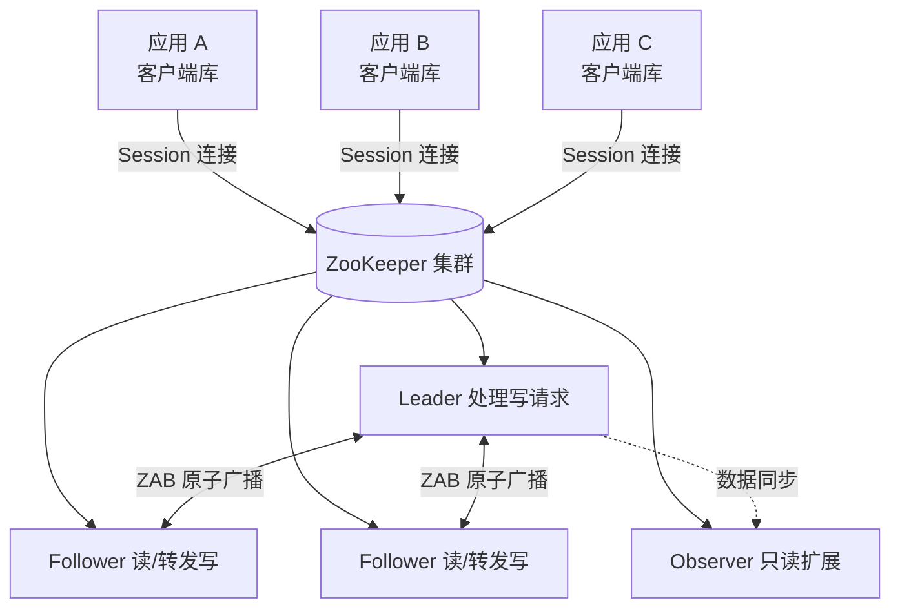
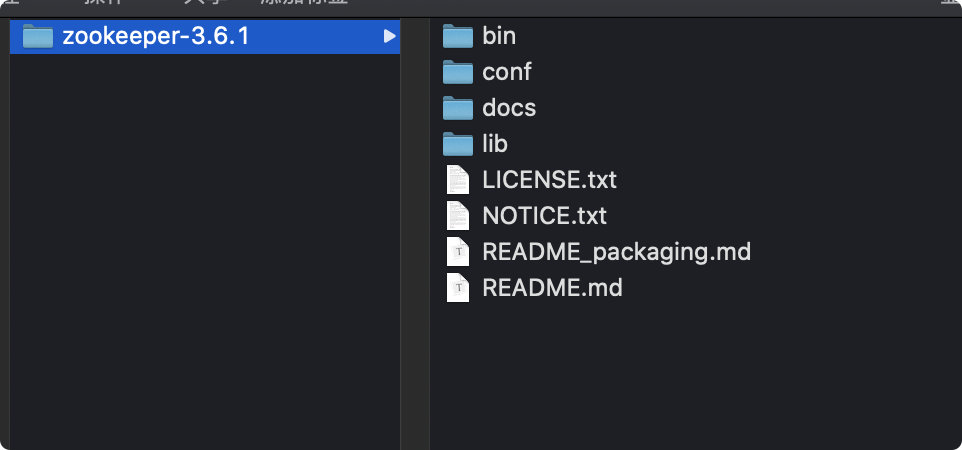
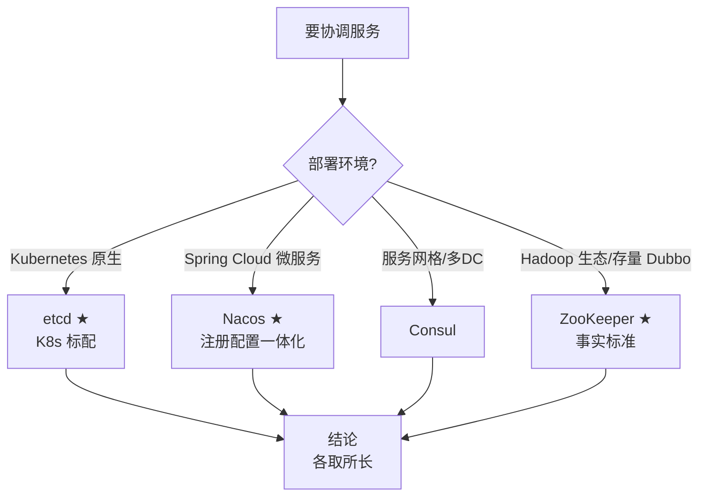
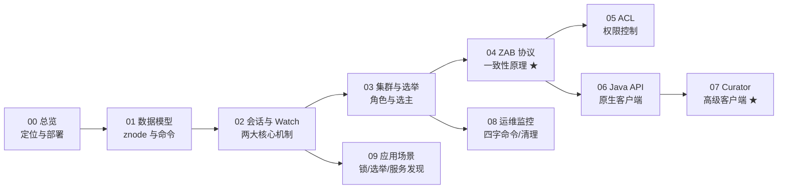

# ZooKeeper 总览

> 本文是 **ZooKeeper 系列** 的总览与入口。ZooKeeper 是分布式协调服务的经典基石（Kafka/HBase/Dubbo 的底层依赖），本系列按「基础 → 机制 → 协议 → 客户端 → 运维」组织，共 9 篇。
> 前置知识：[00-分布式基础总览](../00-分布式基础总览.md)
> 关联笔记：[03-分布式锁原理详解](../01-核心原理/03-分布式锁原理详解.md)（Redis 锁对照）、**04-Apache Dubbo详解**（见知识库）、**02-XXL-Job详解**（见知识库）（注册中心）

## 版本基线

- 当前稳定版 **3.8.6**，最新发布 **3.9.5**（2026-08 查证）
- 客户端兼容性：3.5+ 客户端与 3.8.x 服务器完全兼容；3.8.x 客户端兼容 3.5/3.6/3.7 服务器
- 本文示例以 3.6+（Watch 持久监听、动态 reconfig、多网络端口）为主

## 受众声明

面向已了解分布式基础（[00-分布式基础总览](../00-分布式基础总览.md)）、了解 Linux/Java 的读者。假设已懂：TCP/IP、Java、集群概念。以下术语必须讲清：znode、Session、Watch、Quorum（过半）、Leader/Follower/Observer。

## 学习目标

学完本系列你能：
1. 说清 **ZooKeeper 是什么**、解决什么问题、适合存什么数据
2. 独立**安装部署**单机与 Docker Compose 集群，看懂 zoo.cfg 核心配置
3. 说清 **znode 四种类型、Session、Watch** 三大基础机制
4. 理解**集群角色与 Leader 选举、ZAB 协议**如何保证数据一致性
5. 掌握 **Java API 与 Curator** 客户端，能实现分布式锁/选举等协同场景
6. 配置 **ACL 权限**、四字命令监控、日志清理等运维技能
7. 知道 **ZooKeeper 与 etcd/Consul/Nacos** 的选型差异

## 前置知识

- [00-分布式基础总览](../00-分布式基础总览.md)——一致性、CAP 等分布式基础
- [03-分布式锁原理详解](../01-核心原理/03-分布式锁原理详解.md)——分布式锁对照（ZooKeeper 锁 vs Redis 锁）
- 需掌握：Java 基础、Linux 基础命令

---

## 📋 总览

| 篇目 | 内容 | 说明 |
|---|---|---|
| 00 | 本页（总览） | 定位、安装部署、配置、选型、学习路线 |
| 01 | [01-数据模型与节点详解](01-数据模型与节点详解.md) | znode 类型/版本/属性、data tree、常用 shell 命令 |
| 02 | [02-会话与Watch机制](02-会话与Watch机制.md) | Session 状态机、Watch 原理与持久监听 ★ |
| 03 | [03-集群与Leader选举](03-集群与Leader选举.md) | 角色分工、选举算法、数据同步、启动原理 ★ |
| 04 | [04-ZAB协议与一致性](04-ZAB协议与一致性.md) | ZAB 崩溃恢复/原子广播、Paxos/Raft/2PC 对比 ★ |
| 05 | [05-ACL权限控制](05-ACL权限控制.md) | scheme/权限位、命令行与代码配置 |
| 06 | [06-Java客户端API详解](06-Java客户端API详解.md) | ZooKeeper API、Watcher、示例代码 |
| 07 | [07-Curator详解](07-Curator详解.md) | 高级客户端、分布式锁/选举/缓存 ★ |
| 08 | [08-运维与监控专题](08-运维与监控专题.md) | 四字命令、日志清理、动态配置、Jute、zkClient/Python |
| 09 | [09-应用场景与分布式协同](09-应用场景与分布式协同.md) | Master 选举、服务发现、分布式锁、ID 生成器、负载均衡 |

## 目录

- [1. ZooKeeper 是什么](#1-zookeeper-是什么)
- [2. 为什么需要它](#2-为什么需要它)
- [3. 总体架构](#3-总体架构)
- [4. 版本演进时间线](#4-版本演进时间线)
- [5. 安装部署](#5-安装部署)
- [6. 核心配置参数表（zoo.cfg）](#6-核心配置参数表zoocfg)
- [7. Docker Compose 集群](#7-docker-compose-集群)
- [8. 生产环境建议](#8-生产环境建议)
- [9. ZooKeeper vs etcd vs Consul vs Nacos 选型](#9-zookeeper-vs-etcd-vs-consul-vs-nacos-选型)
- [10. 学习路线建议](#10-学习路线建议)
- [11. 最佳实践](#11-最佳实践)
- [12. 常见踩坑](#12-常见踩坑)
- [13. 小结](#13-小结)

## 1. ZooKeeper 是什么

**一句话记忆**：ZooKeeper 是一个开源的**分布式协同服务系统**，把「复杂且易出错的分布式协同」封装成**高效可靠的原语集**，以简单接口暴露给用户。

**生活类比**：动物园管理员（ZooKeeper）——大象（应用）之间需要互相同步信息（谁是老大、谁在哪个笼子），管理员负责登记和广播，动物们不用自己喊话。

**三个关键词拆解**：

| 关键词 | 含义 | 说明 |
|---|---|---|
| 分布式 | 服务端以集群形式运行 | 多节点组成 Quorum，单点故障不影响整体 |
| 协同 | 解决节点间的协调问题 | 选主、锁、配置同步、成员管理、队列 |
| 服务系统 | 以服务形式对外提供 | 客户端通过 API 访问，不是嵌入库 |

**核心定位**（必须记住）：

> 💡 ZooKeeper 适合存储**存储和协同相关的关键数据**（几百 MB 级），**不适合大数据量存储**——所有数据常驻内存。

## 2. 为什么需要它

分布式系统的协调本质是「让每个节点的信息同步和共享」，这依赖服务进程间通信，方式只有两种：

1. **通过网络进行信息共享**——节点间直接互相发消息（如 RPC 直连、gossip）
2. **通过共享存储**——大家读写同一份数据（ZooKeeper 走的就是这条）

**为什么选共享存储**：

| 维度 | 网络直连（方式 1） | 共享存储（方式 2） |
|---|---|---|
| 实现复杂度 | 高（要自己处理节点发现、重试、顺序） | 低（读写一个中心化服务） |
| 一致性保证 | 需自研协议 | 由 ZK 的 ZAB 协议保证 |
| 故障处理 | 每个节点都要处理对端故障 | 客户端只管连接，ZK 集群自愈 |
| 典型代表 | 自研 RPC 协调 | ZooKeeper、etcd、Consul |

**典型应用场景**：配置管理、DNS 服务、组成员管理（集群管理）、各种分布式锁、Leader 选举。细节见 [09-应用场景与分布式协同](09-应用场景与分布式协同.md)。

## 3. 总体架构



此图说明：应用通过客户端库与集群交互，客户端与任一节点建立 Session；写请求统一由 Leader 处理并广播给 Follower，Observer 只同步数据不参与投票。

**架构分层**：

```text
┌─────────────────────────────────────────┐
│ 应用层：业务代码（配置中心/锁/选主等）      │
├─────────────────────────────────────────┤
│ 客户端库：会话管理、心跳、Watcher、重连     │
├─────────────────────────────────────────┤
│ 服务端：ZooKeeper 集群                    │
│   ├── standalone 模式：单节点（开发用）     │
│   └── quorum 模式：多节点（生产用）        │
│        ├── Leader：写入口 + 事务广播       │
│        ├── Follower：读 + 转发写 + 投票    │
│        └── Observer：只读扩展（可选）      │
└─────────────────────────────────────────┘
```

**客户端交互的基本流程**：

1. 客户端创建连接（`new ZooKeeper(connectString, timeout, watcher)`）
2. 客户端与集群某个节点创建 **Session**（会话），可主动关闭；节点在 timeout 内没收到客户端消息也会关闭会话
3. 客户端通过 Session 读写 znode（临时节点的生命周期绑定 Session）
4. 客户端库发现连接的节点出错，**自动与其他节点建立连接**（会话仍有效，见 [02-会话与Watch机制](02-会话与Watch机制.md)）

## 4. 版本演进时间线

| 版本 | 发布时间 | 关键特性 | 意义 |
|---|---|---|---|
| 3.4.x | 2013+ | FastLeaderElection 成为唯一选举算法；旧 UDP 算法废弃 | 3.4 是长期主流版本（Hadoop 2.x 生态标配） |
| 3.5.x | 2016+ | 动态 reconfig、容器节点、`deleteAll`、多网络端口 | 运维与数据模型增强 |
| 3.6.x | 2019 | **持久监听 addWatch**、异步发送优化、4lw 白名单完善 | Watch 机制重大改进 |
| 3.7.x | 2021 | `zookeeper.learner.asyncSending`、性能优化 | 稳定性提升 |
| 3.8.x | 2022 | 配置传播完善、监控指标增强 | 当前主流稳定版 |
| 3.9.x | 2024+ | 最新发布版（2026-08 查证） | 新特性验证期 |

> 💡 **版本选型建议**：新项目用 **3.8.x**（稳定版），避免直接上 3.9.x 等新发布版本；旧系统从 3.4 升级需注意 `electionAlg` 配置变更（见 §6）。

## 5. 安装部署

### 5.1 前置条件

- JDK 8+（3.5+ 推荐 JDK 11）
- Linux/macOS（Windows 仅测试用）
- 端口规划：2181（客户端）、2888（集群通信）、3888（选举）

### 5.2 目录结构



```text
zookeeper-3.8.6/
├── bin/              # 启动脚本（zkServer.sh / zkCli.sh）
├── conf/             # 配置文件（zoo.cfg、log4j.properties）
├── lib/              # 依赖 jar 包
├── logs/             # 运行日志（默认）
└── data/             # 数据目录（dataDir，需自建）
```

> 💡 生产环境建议把 dataDir 与 dataLogDir 放到独立磁盘路径，不要放在安装目录下（升级时避免误删）。

### 5.3 单机安装

```bash
# ① 下载解压（以 3.8.6 为例）
wget https://archive.apache.org/dist/zookeeper/zookeeper-3.8.6/apache-zookeeper-3.8.6-bin.tar.gz
tar -zxvf apache-zookeeper-3.8.6-bin.tar.gz
cd apache-zookeeper-3.8.6

# ② 复制配置模板
cp conf/zoo_sample.cfg conf/zoo.cfg

# ③ 启动 / 停止 / 查看状态
bin/zkServer.sh start
bin/zkServer.sh stop
bin/zkServer.sh status

# ④ 命令行客户端
bin/zkCli.sh -server localhost:2181
```

> ⚠️ 常见报错与解决：

| 报错 | 原因 | 解决 |
|---|---|---|
| `Error contacting service. It is probably not running` | 服务未启动或端口被占 | 看 logs/zookeeper.log；`ss -lntp \| grep 2181` |
| `java.io.IOException: No snapshot found` | dataDir 为空目录 | 正常现象（首次启动无快照），等数据写入后自动生成 |
| `Address already in use` | 2181 端口被占 | 改 clientPort 或杀占用进程 |

## 6. 核心配置参数表（zoo.cfg）

```properties
# 基本配置（必须）
tickTime=2000        # 心跳间隔 ms（client-server / server-server 之间）
initLimit=10         # Follower 启动连 Leader 最多容忍心跳数（同步超时 = initLimit×tickTime）
syncLimit=5          # Follower 与 Leader 请求/应答容忍心跳数（数据同步延迟超限会被剔除）
dataDir=/tmp/zookeeper   # 快照目录 + myid 文件（不要用 /tmp 生产）
clientPort=2181      # 客户端端口（SSL 用 2281）

# 集群配置（quorum 模式）
server.1=host1:2888:3888   # id=myid；2888 集群通信端口；3888 选举端口
server.2=host2:2888:3888
server.3=host3:2888:3888

# 自动清理
autopurge.snapRetainCount=3    # 保留快照数（默认3，最小3）
autopurge.purgeInterval=0      # 清理频率（小时），0 表示不开启

# 运维
dataLogDir=/tmp/dataLog    # 事务日志目录——必须与 dataDir 分盘（独立 SSD）
globalOutstandingLimit=1000  # 客户端最大请求队列（限流防 OOM）
maxClientCnxns=60          # 同一客户端 IP 最大并发连接（防 DDoS）
maxSessionTimeout / minSessionTimeout  # 会话超时上下限
snapCount=100000           # 每写多少次事务日志做一次快照
```

**参数速查表**：

| 参数 | 默认值 | 作用 | 调优建议 |
|---|---|---|---|
| `tickTime` | 3000ms | 基础时间单元，心跳间隔 | 集群跨机房可适当调大 |
| `initLimit` | 10 | Follower 启动同步超时（tick 数） | 网络差时调大（如 20） |
| `syncLimit` | 5 | 运行期数据同步超时（tick 数） | 网络差时调大（如 10） |
| `dataDir` | 无 | 快照存储目录 | 生产用独立磁盘 |
| `dataLogDir` | 同 dataDir | 事务日志目录 | **必须与 dataDir 分盘** |
| `clientPort` | 2181 | 客户端监听端口 | 防火墙放行 |
| `maxClientCnxns` | 60 | 单 IP 最大连接数 | 高并发客户端调大 |
| `autopurge.snapRetainCount` | 3 | 保留快照数 | 磁盘紧张时调小 |
| `autopurge.purgeInterval` | 0（关闭） | 清理周期（小时） | 生产建议 1~24 |
| `globalOutstandingLimit` | 1000 | 请求队列上限 | 写密集场景调大 |

> ⚠️ 3.6.0+ 只能使用 FastLeaderElection，升级时 `electionAlg` 要么指定为 3、要么注释掉（旧的 UDP 算法 1/2 已废弃）。

## 7. Docker Compose 集群

### 7.1 三节点集群（3.5+ 镜像）

```yaml
version: '3.6'
services:
    zk1:
        image: zookeeper:3.6
        restart: always
        hostname: zk1
        container_name: zk1
        ports: ["2181:2181"]
        environment:
         ZOO_MY_ID: 1
         ZOO_SERVERS: server.1=0.0.0.0:2888:3888;2181 server.2=zk2:2888:3888;2181 server.3=zk3:2888:3888;2181
    zk2:
        image: zookeeper:3.6
        restart: always
        hostname: zk2
        container_name: zk2
        ports: ["2182:2181"]
        environment:
         ZOO_MY_ID: 2
         ZOO_SERVERS: server.1=zk1:2888:3888;2181 server.2=0.0.0.0:2888:3888;2181 server.3=zk3:2888:3888;2181
    zk3:
        image: zookeeper:3.6
        restart: always
        hostname: zk3
        container_name: zk3
        ports: ["2183:2181"]
        environment:
         ZOO_MY_ID: 3
         ZOO_SERVERS: server.1=zk1:2888:3888;2181 server.2=zk2:2888:3888;2181 server.3=0.0.0.0:2888:3888;2181
```

- `ZOO_MY_ID`：1-255 整数，集群唯一（写入 dataDir/myid）
- `ZOO_SERVERS` 中 `;2181` 是 3.5+ 的客户端端口通告（多端口特性）
- 启动：`docker-compose up`；访问：`zkCli.sh -server localhost:2181,localhost:2182,localhost:2183`

### 7.2 验证集群

```bash
# ① 查看各节点角色
docker exec zk1 bin/zkServer.sh status
# Mode: follower / leader

# ② 四字命令查看（需开启白名单，见 08 篇）
echo ruok | nc localhost 2181    # 输出 imok
echo stat | nc localhost 2181    # 显示 Mode: leader / follower

# ③ 写读验证
docker exec -it zk1 bin/zkCli.sh -server localhost:2181
create /test "hello"    # 创建成功
get /test               # 读回 hello（走 Leader 广播保证一致）
```

## 8. 生产环境建议

| 维度 | 建议 | 理由 |
|---|---|---|
| 服务器 | **独占服务器**，事务日志独立存储设备 | 避免其他应用争抢 I/O |
| 内存 | 8G 足够（一般场景） | data tree 常驻内存，量级为几百 MB |
| CPU | 独占一个双核 CPU 即可 | ZK 对 CPU 消耗不高 |
| 存储 | `dataLogDir` 独占 **SSD**，与数据目录分盘 | 写延迟直接影响事务提交效率 |
| 日志 | 配置 `$ZK_HOME/conf/log4j.properties` | 日志级别与滚动策略 |
| 网络 | 2888/3888 端口稳定可达 | 网络抖动引发频繁选举（见 03 篇） |

## 9. ZooKeeper vs etcd vs Consul vs Nacos ★选型

> 网络查证补充（2026-08）。ZooKeeper 是协调领域经典基石，但**云原生时代选型已分化**——不是所有场景都该用 ZK。

| 维度 | ZooKeeper | etcd | Consul | Nacos |
|---|---|---|---|---|
| 一致性算法 | ZAB | Raft | Raft | Raft（AP 模式 Distro） |
| 数据模型 | 树形 znode | KV（MVCC） | KV | KV + 配置 |
| 语言 | Java | Go | Go | Java |
| 存储 | 全内存（几百 MB 级） | bbolt 磁盘（几 GB 级） | 内存+磁盘 | 内存+磁盘 |
| 生态代表 | Kafka/HBase/Dubbo | **Kubernetes** | 服务网格/网络治理 | Spring Cloud Alibaba |
| 动态配置 | reconfig 3.5+ | 天然支持 | 天然支持 | 一体化 |
| 云原生契合度 | 低（重客户端、运维重） | ★★★★ | ★★★ | ★★★ |
| Watch 通知 | ✅ 原生 | ✅ | ✅ | ✅（含长轮询） |
| 多数据中心 | 弱 | 弱 | ✅ 强 | 中 |

**选型决策流程**：



此图说明：选型第一看部署环境，K8s 场景 etcd 是标配无需自建，微服务场景 Nacos 一体化更省事，只有 Hadoop 系与存量系统才继续用 ZooKeeper。

**选型结论**：

- 云原生/K8s 场景 → **etcd**（K8s 标配，无需自建）
- 微服务注册配置一体化 → **Nacos**（国内 Spring Cloud 生态主流）
- 服务网格/多数据中心 → **Consul**
- Hadoop 系（Kafka/HBase）或存量 Dubbo → **ZooKeeper** 仍是事实标准，**值得学但不一定值得新项目选**

**面试追问**：

1. **为什么 Kafka 还绑定 ZooKeeper？** 历史原因——Kafka 早期依赖 ZK 做元数据管理/控制器选举；Kafka 2.8+ 已引入 KRaft 模式逐步去 ZK，但生态迁移需要时间
2. **ZK 与 etcd 谁更可靠？** 两者一致性算法都保证线性一致性，但 ZK 写路径要 fsync 事务日志（性能瓶颈在磁盘），etcd 用 bbolt + Raft 组，工程上差异主要在运维复杂度
3. **为什么 ZK 客户端重？** 原生客户端要自己管理会话/重连/watch 重注册，而 etcd 的 gRPC 客户端更轻——这也是 Curator 出现的原因（见 [07-Curator详解](07-Curator详解.md)）

## 10. 学习路线建议



此图说明：基础三篇（00-02）→ 机制两篇（03-04）→ 按需分支（客户端 06/07、运维 08、场景 09）。面试重点在 03/04/07/09。

1. 先读 [01-数据模型与节点详解](01-数据模型与节点详解.md)（最基础：znode + 命令）
2. 再读 [02-会话与Watch机制](02-会话与Watch机制.md) + [03-集群与Leader选举](03-集群与Leader选举.md)（机制层）
3. 再读 [04-ZAB协议与一致性](04-ZAB协议与一致性.md)（原理层，面试重点）
4. 最后按需读客户端篇（[06-Java客户端API详解](06-Java客户端API详解.md) / [07-Curator详解](07-Curator详解.md)）与运维篇（[08-运维与监控专题](08-运维与监控专题.md)）
5. 场景理解看 [09-应用场景与分布式协同](09-应用场景与分布式协同.md)（可作导读，先看「能干什么」再学机制）

## 11. 最佳实践

1. 生产环境 **dataLogDir 与 dataDir 必须分盘**，事务日志落盘是提交瓶颈
2. 集群节点数**奇数**（3/5），过半可用即可服务，容忍 N/2-1 台故障
3. 客户端务必设置**合理的 Session 超时**并用 Curator 这类带重连的客户端
4. ZK 数据**常驻内存**，只存协调数据（配置、元数据），不存业务大数据
5. 开启 `autopurge` 自动清理，避免快照/日志撑爆磁盘
6. 开启四字命令白名单（`4lw.commands.whitelist`），按需放开而非 `*` 全开
7. 多应用共用集群时用**命名空间隔离**（Curator namespace 或路径前缀）
8. 写操作带上**版本号做乐观锁**（条件更新），防并发覆盖
9. 生产监控 `mntr` 指标（Mode/节点数/延迟/连接数），告警联动
10. 集群扩缩容用 **dynamic reconfig**（3.5+），不要停服改配置
11. 升级前检查 `electionAlg` 等废弃配置项，避免启动失败
12. 临时节点只做「存活探测」，业务数据用持久节点

## 12. 常见踩坑

- **myid 缺失/不唯一**：集群启动抛异常，日志可见详情（解决：每个节点 dataDir 下建 myid 文件，内容为 1-255 唯一整数）
- **dataDir 用 /tmp**：重启丢数据（配置注释里官方都提醒了）
- **事务日志与数据目录同盘**：写延迟互相拖累，提交变慢
- **节点数偶数**：如 2 台，故障 1 台就失去过半，集群不可用
- **旧配置 electionAlg=1/2**：3.6+ 启动失败，必须改 3 或注释
- **四字命令报 not in the whitelist**：3.4.10+ 默认白名单限制，需配置 `4lw.commands.whitelist`
- **客户端连接数超限**：`Too many connections`，调大 `maxClientCnxns` 或检查连接泄漏
- **磁盘写满**：快照/事务日志未清理，开启 autopurge 或脚本清理（见 [08-运维与监控专题](08-运维与监控专题.md)）

## 13. 小结

1. ZooKeeper = 分布式**协同服务**，把复杂协同封装成原语集，数据常驻内存，适合协调数据不适合大数据
2. 两种信息共享方式：网络直连 vs 共享存储，ZK 走共享存储路线
3. 架构：客户端库 + standalone/quorum 集群；Session 会话 + Watch 通知是两大核心机制
4. 版本演进：3.4（FLE 唯一化）→ 3.5（reconfig/容器节点）→ 3.6（持久监听）→ 3.8（当前稳定）
5. 部署要点：zoo.cfg 核心 4 项 + 集群 server.N 配置 + Docker Compose 一键起
6. 生产铁律：事务日志独立 SSD、奇数节点、自动清理
7. 选型：**K8s 用 etcd、微服务用 Nacos、Hadoop 系用 ZK**——ZK 值得深学但新项目未必首选

## 下一篇

- 下一篇：[01-数据模型与节点详解](01-数据模型与节点详解.md)

---
*创建于 2026-08-09（wolai 笔记转存 + 网络查证补充），2026-08-11 细化（补 Mermaid 架构图/版本时间线/参数表/选型决策流程）*
