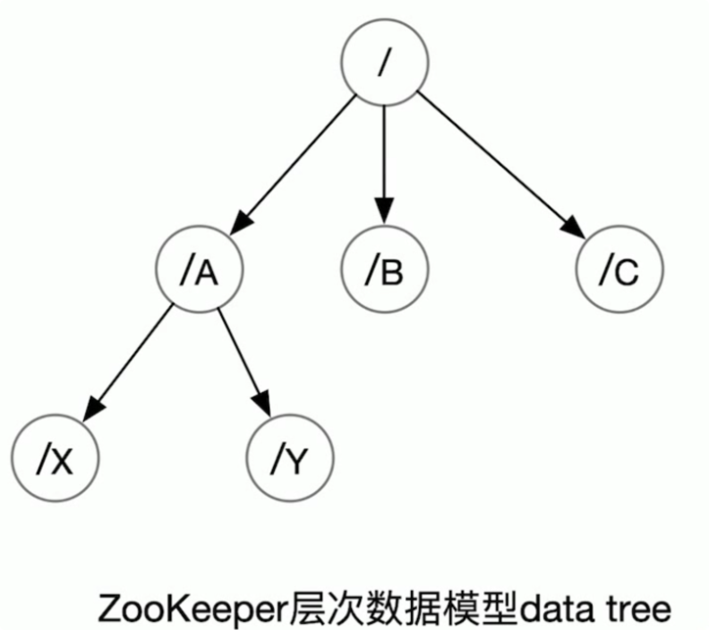
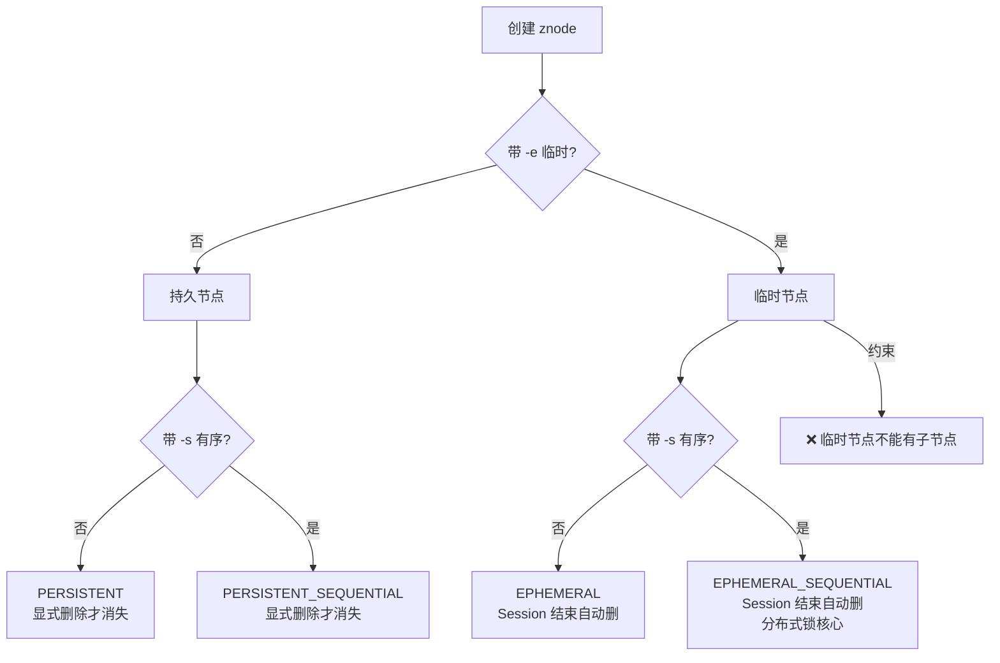
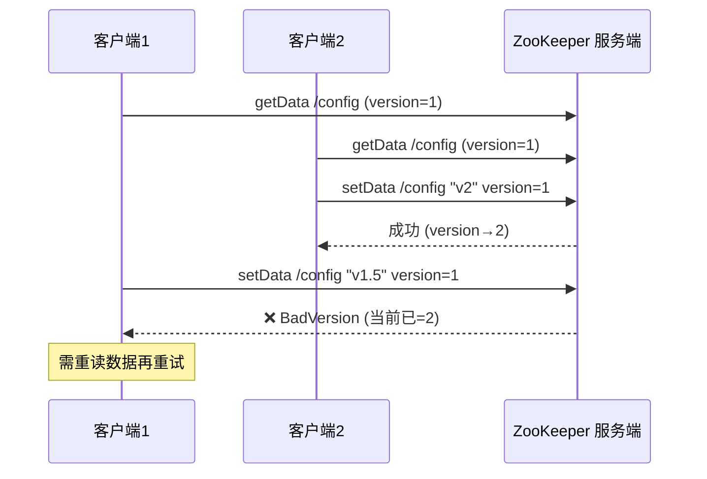
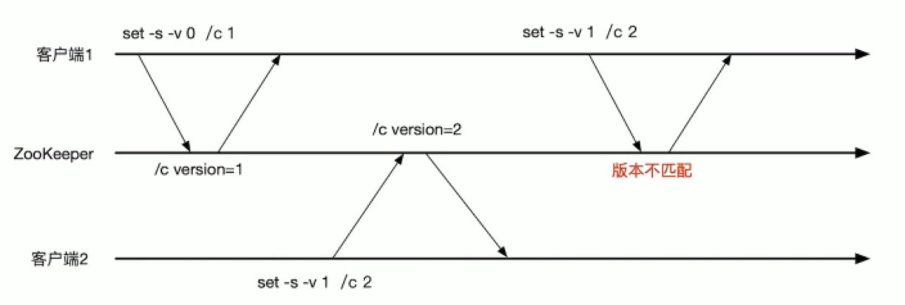

# 数据模型与节点详解

> 本文是 ZooKeeper 系列第 1 篇，深入 **数据模型与 znode**：data tree、znode 四种类型、节点属性（stat）、版本机制与条件更新、常用 shell 命令。
> 前置知识：[00-ZooKeeper总览](00-ZooKeeper总览.md)
> 关联笔记：[02-会话与Watch机制](02-会话与Watch机制.md)（临时节点依赖 Session）

## 版本基线

本文是基础概念，适用于 3.4+ 全系列。shell 命令以 3.6+ 为准（`deleteAll` 替代已废弃的 `rmr`）；容器节点为 3.5.0+ 特性；TTL 节点为 3.5.3+ 特性。

## 受众声明

面向已了解 [00-ZooKeeper总览](00-ZooKeeper总览.md) 的读者。假设已懂：文件系统树形结构、Java 基础。以下术语必须讲清：znode、data tree、zxid、stat 版本号、条件更新。

## 学习目标

学完本文你能：
1. 说清 **ZooKeeper 为什么用树形层次模型**（不用 KV）
2. 说清 **znode 六种类型**（四种基础 + 容器 + TTL）及各自生命周期，**临时节点为什么不能有子节点**
3. 看懂 **stat 状态信息**每个字段的含义（czxid/mzxid/version 等）
4. 理解**版本号与条件更新**（乐观锁）的原理与边界行为
5. 熟练使用 **create/set/delete/get/stat/ls** 等常用命令
6. 理解 **data tree API 的 wait-free 特性**意味着什么

## 前置知识

- [00-ZooKeeper总览](00-ZooKeeper总览.md)——总体架构与定位
- 需掌握：文件系统概念、基本 Linux 命令

---

## 目录

- [1. 数据模型：data tree](#1-数据模型data-tree)
- [2. znode 节点类型详解](#2-znode-节点类型详解)
- [3. znode 的属性（stat）](#3-znode-的属性stat)
- [4. 版本机制与条件更新（乐观锁）](#4-版本机制与条件更新乐观锁)
- [5. 常用 shell 命令](#5-常用-shell-命令)
- [6. 最佳实践](#6-最佳实践)
- [7. 常见踩坑](#7-常见踩坑)
- [8. 小结](#8-小结)

## 1. 数据模型：data tree

**一句话记忆**：ZooKeeper 的数据模型是**层次模型（树）**，类似文件系统，每个节点叫 **znode**，根节点为 `/`。

**生活类比**：公司组织架构图——部门下有小组、小组下有成员，每个人挂在明确的层级上；找谁直接按路径找（`/技术部/后端组/张三`），不用翻遍整个公司。

**为什么用树而不用 KV**（两种主流数据模型之二）：

1. 树的**层次结构便于表达数据之间的层级关系**（如 `/app/config/db`）
2. 树**便于为不同应用分配独立命名空间**（namespace，如 `/app1/...`、`/app2/...`）



**与文件系统的区别**：

| 维度 | 文件系统 | ZooKeeper data tree |
|---|---|---|
| 数据存储 | 只有文件能存数据，目录不能 | **每个 znode 都能存数据** |
| 版本控制 | 无（或依赖外部 VCS） | 每个节点都有**版本号**（从 0 开始计数） |
| 修改方式 | 可部分读写（追加/截断） | **只支持全量读写** |
| 事务保证 | 单机语义 | 分布式原子性（ZAB 广播） |

**data tree 访问接口特性**（简化版文件系统 API）：

- 路径用 UNIX 风格：`/A/X` 表示节点 A 的子节点 X
- znode 数据**只支持全量读写**，不支持部分读写（没有「追加/截断」）——读取整个 byte[]，写入整个 byte[]
- **所有 API 都是 wait-free 的**：正在执行的 API 调用不会阻塞、影响其他 API 完成（读操作无锁化，性能好）
- API 本身**不直接提供锁**等协同机制，但足够强大，可用来实现各种协同原语（见 [02-会话与Watch机制](02-会话与Watch机制.md) 与 [07-Curator详解](07-Curator详解.md)）

**路径规范**：

| 规则 | 示例 | 说明 |
|---|---|---|
| 绝对路径以 `/` 开头 | `/app/config` | 相对路径不支持 |
| 路径由 Unicode 字符组成 | `/app_1` | 字符集限制（`\u0000` 等除外） |
| 不能是 `/` 的重复 | `//` 非法 | 路径语义清晰 |
| 长度限制 | 单路径 ≤ 1024 字符 | 超长报错 |

> 💡 **记忆锚点**：树形模型 = 「目录」能存数据 + 每节点带版本号，这两点与文件系统不同，是 ZK 能实现分布式锁/配置中心的基础。

## 2. znode 节点类型详解

### 2.1 四种基础类型

| 类型 | 持久性 | 顺序性 | 生命周期 | 典型用途 |
|---|---|---|---|---|
| **持久节点 PERSISTENT** | 持久 | 无 | 显式 delete 才删，客户端会话关闭不影响 | 配置、元数据（最常用） |
| **临时节点 EPHEMERAL** | 临时 | 无 | **随创建它的 Session 结束而删除** | 会话状态、分布式锁 |
| **持久有序 PERSISTENT_SEQUENTIAL** | 持久 | 有序 | 显式删除 | 事件编号、队列 |
| **临时有序 EPHEMERAL_SEQUENTIAL** | 临时 | 有序 | Session 结束自动删 | **分布式锁的核心**（最小序号获锁） |

**两个关键边界**：

1. **临时节点不允许有子节点**（其子节点字段为 null）——因为临时节点的生命周期绑定 Session，若允许子节点，Session 结束时会牵连整棵子树，语义复杂化
2. **有序节点不是独立类型**，是在持久/临时基础上叠加「单调递增数字后缀」（如 `lock-0000000001`）

**顺序节点的序号规则**：

- 序号是 **10 位十进制数**（不足补零），单调递增
- 计数器是**父节点的 cversion**（子节点版本号），每创建一个子节点 +1
- 序号**不回收**：即使删除了 `lock-0000000001`，下一个仍是 `lock-0000000002`

### 2.2 节点类型生命周期图



此图说明：类型由「持久/临时」×「有序/无序」两维组合；临时性决定自动删除时机，顺序性决定是否带递增序号，两者正交。

### 2.3 容器节点（CONTAINER，3.5.0+）

当它的**所有子节点都被删除**时，容器节点会被服务端**自动删除**。典型用途是注册中心/服务发现里的「目录节点」（如 `/services/order-service`）——子节点（服务实例）删光后目录自动清理，避免垃圾节点堆积。

```bash
create -c /container-node     # 命令行创建容器节点
```

```java
// Java 创建
zk.create("/container", data, acl, CreateMode.CONTAINER);
```

> 💡 对比：普通持久节点需要手动删，容器节点是「自动回收的目录」——适合目录型占位节点。

### 2.4 TTL 节点（3.5.3+，需显式开启）

TTL 节点允许给**持久节点**设置过期时间，超时后自动删除（类似「带超时的持久节点」）：

```java
// Java：需先开启 TTL 支持（zoo.cfg 或系统属性）
// -Dzookeeper.extendedTypesEnabled=true
zk.create("/ttl-node", data, acl, CreateMode.PERSISTENT_WITH_TTL, ttl);
```

> ⚠️ 使用前提：必须设置 `zookeeper.extendedTypesEnabled=true`（默认关闭），否则创建 TTL 节点报错。**TTL 只对持久节点生效，临时节点不受影响**（临时节点本身由 Session 管理）。

### 2.5 记忆锚点

> 💡 **记忆锚点**：临时节点绑定 Session——Session 在，节点在；Session 亡，节点亡。这就是 ZK 能做「服务下线自动摘除」（集群成员管理）的原因。

## 3. znode 的属性（stat）

每个节点维护两类内容：

- **数据**：二进制数组 `byte data[]` + ACL 访问控制信息 + 子节点列表
- **状态信息 stat**：

| 属性 | 说明 | 变化时机 |
|---|---|---|
| czxid | 节点**创建**时的事务 ID | 创建时写入 |
| mzxid | 节点**最后一次更新**时的事务 ID | 每次 setData |
| pzxid | **子节点列表**最后一次被修改时的事务 ID | 子节点增删 |
| ctime | 创建时间 | 创建时写入 |
| mtime | 最后更新时间 | 每次 setData |
| version | 数据节点**版本号**（数据修改次数） | 每次 setData |
| cversion | **子节点**版本号（子节点更改次数） | 子节点增删 |
| aclversion | **ACL** 版本号 | 每次 setAcl |
| ephemeralOwner | 创建该临时节点的 **Session ID**；持久节点为 0 | 创建时写入 |
| dataLength | 数据内容长度 | 每次 setData |
| numChildren | 当前节点的直系子节点个数 | 子节点增删 |

> **ZXID 是什么**：能改变服务器状态的操作（创建/删除节点、更新数据）叫**事务操作**，每个事务分配一个**全局唯一递增的 64 位事务 ID = ZXID**。从 ZXID 可以识别出所有更新操作的全局顺序（详细见 [04-ZAB协议与一致性](04-ZAB协议与一致性.md)）。

**czxid vs mzxid vs pzxid 辨析**（易混点）：

| 场景 | czxid | mzxid | pzxid |
|---|---|---|---|
| 创建节点 `/a` | 变（创建事务） | 不变 | 变（父节点视角是子节点变化） |
| 更新 `/a` 数据 | 不变 | 变 | 不变 |
| 给 `/a` 增加子节点 | 不变 | 不变 | 变 |

> ⚠️ **坑**：`getData` 返回的 stat 的 `mzxid` 是**数据修改**的事务号，`pzxid` 是**子节点列表修改**的事务号——监控数据变化看 mzxid，监控子节点变化看 pzxid。

## 4. 版本机制与条件更新（乐观锁）

**一句话记忆**：ZK 每个节点有 3 种版本号（version / cversion / aclversion），对应数据、子节点、ACL 的修改次数——更新操作带上版本号就是**乐观锁**。

**条件更新（CAS）流程**：





**用法**：`set /c newData 1`——带 version 参数，服务端校验当前版本等于 1 才执行，否则抛 `BadVersion`。

**三种版本号的边界行为**：

| 操作 | 校验哪个版本 | version=-1 效果 | 失败异常 |
|---|---|---|---|
| `setData` | version | 无条件更新 | BadVersion |
| `delete` | version | 无条件删除 | BadVersion |
| `setACL` | aclversion | 无条件设置 | BadVersion |
| `create` | — | — | NodeExists |

> 💡 **为什么有用**：避免「基于过期数据的更新」（ABA 问题的解决思路），是 ZK 实现分布式锁/分布式队列时「防并发覆盖」的基础。

**面试追问**：

1. **版本号从几开始？** 从 0 开始，每次修改 +1
2. **-1 和 0 的区别？** -1 表示「不校验版本」（无条件），0 表示「要求当前版本必须是 0」（首次修改才允许）
3. **条件更新失败怎么办？** 重读数据（拿到新版本）再重试——客户端要做循环重试
4. **为什么能防 ABA？** 版本号单调递增，即使数据值变回原值（A→B→A），版本号也不会回退（1→2→3），因此能识别出「中间被改过」

## 5. 常用 shell 命令

### 5.1 新增

```
create [-s] [-e] [-c] [-t ttl] path data
# -s 有序节点；-e 临时节点；-c 容器节点；-t TTL 毫秒
```

### 5.2 更新

```
set /path data [version]
# version 可选；带版本 = 条件更新（乐观锁）
```

> ⚠️ 修改节点**不会改变节点类型**（持久不会变临时）。

### 5.3 删除

```
delete path [version]      # 单独删除（只能删无子节点的空节点）
deleteAll path             # 递归删除（3.5+；rmr 已废弃）
```

### 5.4 查看

```
get /path        # 返回数据 + 属性
stat /path       # 只返回属性（不含数据）
ls /path         # 列出子节点
ls -s /path      # 列出子节点 + 该节点属性
```

### 5.5 监听（watch，详见 [02-会话与Watch机制](02-会话与Watch机制.md)）

```
get -w path      # 节点内容改变时通知（一次性）
stat -w path     # 节点状态改变时通知（一次性）
ls -w path       # 子节点增删时通知（不含数据修改）
```

### 5.6 命令速查表

| 命令 | 作用 | 常见参数 |
|---|---|---|
| `create` | 创建节点 | `-s` 有序 / `-e` 临时 / `-c` 容器 / `-t` TTL |
| `get` | 读数据+stat | `-w` 注册 watch |
| `stat` | 只看 stat | `-w` 注册 watch |
| `set` | 更新数据 | `version` 条件更新 |
| `delete` | 删除空节点 | `version` 条件删除 |
| `deleteAll` | 递归删除 | — |
| `ls` | 列子节点 | `-s` 带 stat / `-w` 注册 watch |
| `getAcl` | 看 ACL | — |
| `setAcl` | 设 ACL | 见 [05-ACL权限控制](05-ACL权限控制.md) |
| `addauth` | 会话认证 | 见 [05-ACL权限控制](05-ACL权限控制.md) |
| `sync` | 强制同步 | — |

## 6. 最佳实践

1. 节点路径设计好命名空间：`/app/env/config` 层级，避免与别的应用冲突
2. **临时节点**做「存活探测」：服务上线创建、下线自动删，配合 watch 实现成员管理
3. 数据更新**带上版本号**做乐观锁，防止并发覆盖
4. 节点数据保持**小体积**（KB 级），ZK 是协调存储不是数据库
5. 不要创建大量**顺序节点**后忘记清理，会累积成「垃圾节点」
6. 目录型占位节点用**容器节点**（CONTAINER），子节点删光自动回收
7. 需要「持久 + 超时回收」语义时用 **TTL 节点**（记得开 `extendedTypesEnabled`）
8. 路径按业务/环境分层：`/业务/环境/服务`，避免平铺混乱

## 7. 常见踩坑

- **给临时节点建子节点**：直接报错（临时节点不允许有子节点）
- **delete 非空节点**：报 `NotEmptyException`，要用 `deleteAll`
- **条件更新失败**：`BadVersion` 异常，需要重读数据重试（不是 bug）
- **误用 rmr**：3.5+ 已废弃，用 `deleteAll`
- **set 想改节点类型**：做不到，类型创建时定死，需先删再建
- **TTL 节点创建报错**：`Unimplemented`/`KeeperException`——没开 `zookeeper.extendedTypesEnabled=true`
- **路径超长**：单路径超 1024 字符报错，设计路径时注意层级深度
- **顺序节点序号不回收**：删了也继续递增，监控节点总量防堆积

## 8. 小结

1. ZK 用**树形层次模型**（data tree），节点 = znode，路径 = UNIX 风格；「目录能存数据 + 每节点带版本号」是区别于文件系统的两大特性
2. znode 基础类型：持久/临时 × 有序/无序；**临时节点绑定 Session、不能有子节点**；3.5+ 补充容器节点（自动回收目录）与 TTL 节点（持久+超时）
3. stat 里 **zxid 系列**（czxid/mzxid/pzxid）是事务顺序标识，**version 系列**是修改次数
4. **版本号 + 条件更新** = 乐观锁，防并发覆盖；-1 = 不校验，0 = 要求首次
5. 命令就 6 个：create/set/delete/get/stat/ls，加 `-s/-e/-w/-c/-t` 修饰

## 下一篇

- 上一篇：[00-ZooKeeper总览](00-ZooKeeper总览.md)
- 下一篇：[02-会话与Watch机制](02-会话与Watch机制.md)

---
*创建于 2026-08-09（wolai 笔记转存 + 网络查证补充），2026-08-11 细化（补节点类型生命周期图/stat 辨析表/条件更新时序图/命令速查）*
