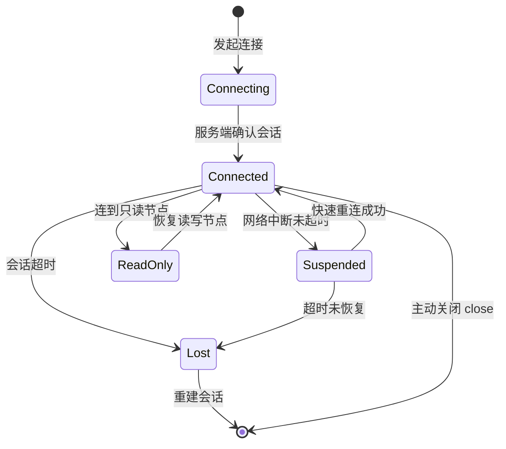
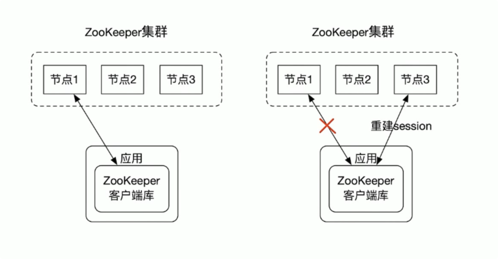
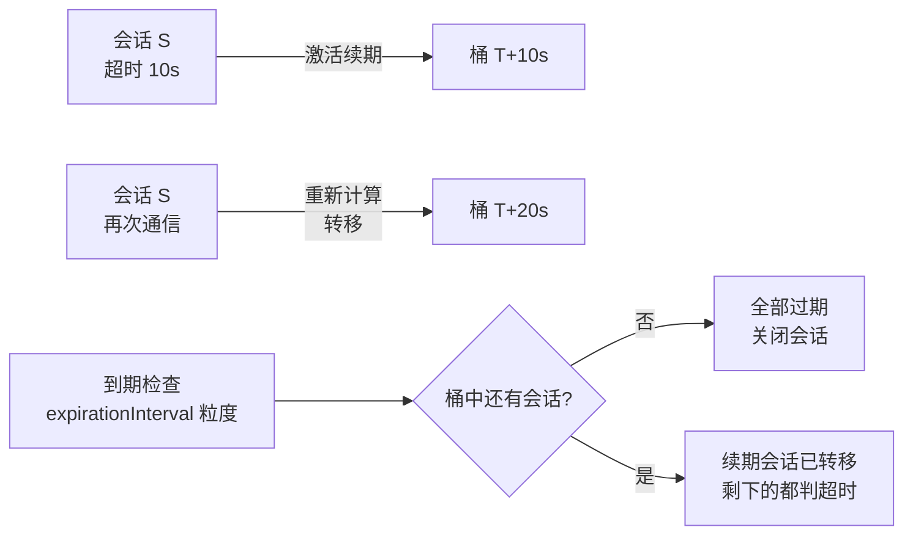
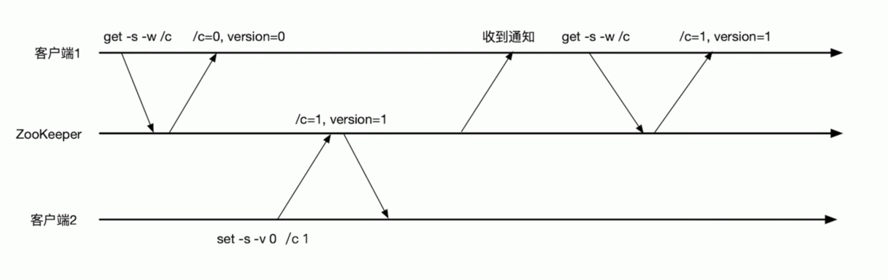
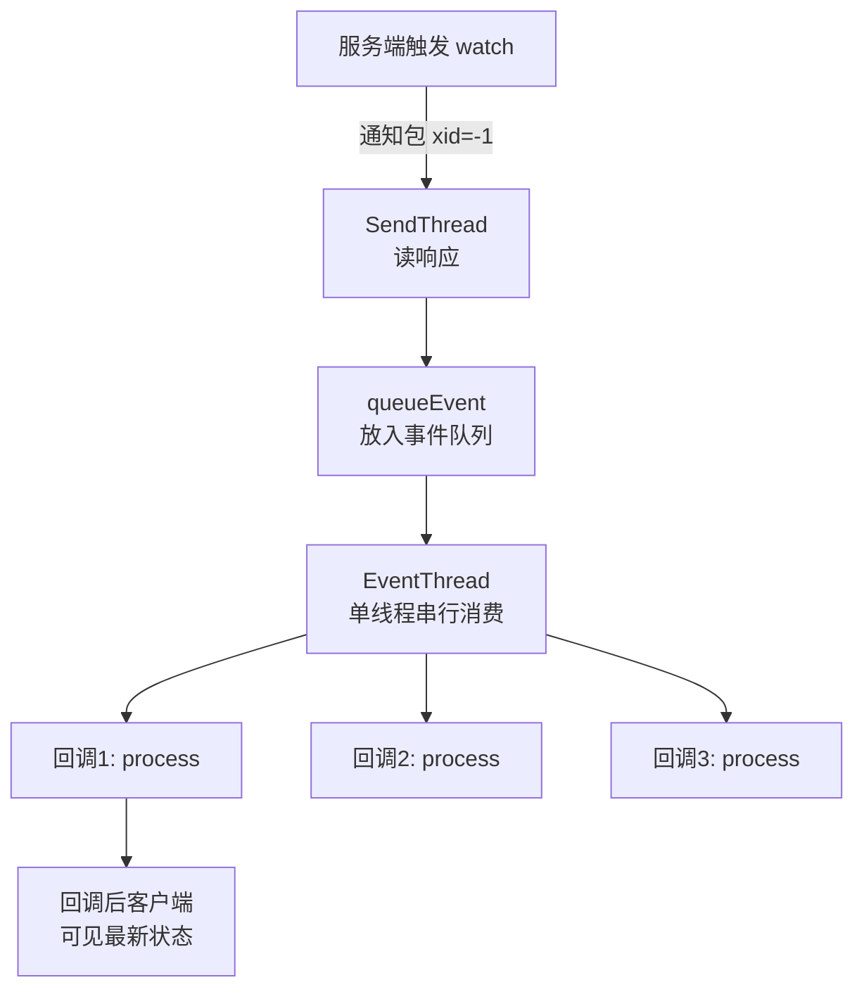

# 会话与Watch机制

> 本文是 ZooKeeper 系列第 2 篇，深入两大核心机制：**Session 会话**（生命周期、状态机、超时协商、分桶管理）与 **Watch 通知机制**（注册/触发/重注册、事件类型、底层原理、持久监听）。
> 前置知识：[01-数据模型与节点详解](01-数据模型与节点详解.md)
> 关联笔记：[03-集群与Leader选举](03-集群与Leader选举.md)（Session 与集群的关系）

## 版本基线

Watch 机制基础行为（一次性触发）自 3.1 起稳定；**3.6.0+ 新增持久监听（addWatch）**。Session 机制全版本通用。

## 受众声明

面向已了解 znode 基本概念的读者（[01-数据模型与节点详解](01-数据模型与节点详解.md)）。假设已懂：TCP 连接、观察者模式。以下术语必须讲清：Session、KeeperState、EventType、一次性触发、分桶策略。

## 学习目标

学完本文你能：
1. 说清 **Session 是什么**、由哪些数据组成、有哪几种状态
2. 说清**会话超时时间如何协商**（客户端 vs 服务端上下限）
3. 理解服务端**分桶策略**如何管理大量会话的过期
4. 说清 **Watch 机制**的完整流程：注册 → 触发 → 重注册
5. 分清 **KeeperState（连接状态）与 EventType（事件类型）**两个枚举
6. 记住 Watch 的**四个特性**（一次性/顺序回调/轻量/时效性）与 3.6+ 持久监听
7. 理解客户端/服务端两端 WatchManager 的**观察者模式实现**

## 前置知识

- [01-数据模型与节点详解](01-数据模型与节点详解.md)——znode 与临时节点（依赖 Session）
- 需掌握：观察者模式、Java 线程概念

---

## 目录

- [1. Session 会话](#1-session-会话)
- [2. Watch 机制](#2-watch-机制)
- [3. 最佳实践](#3-最佳实践)
- [4. 常见踩坑](#4-常见踩坑)
- [5. 小结](#5-小结)

## 1. Session 会话

**一句话记忆**：Session 是客户端与服务器的**连接 + 状态**，客户端的一切操作都建立在会话之上；临时节点的生死绑定会话。

**生活类比**：Session 像「游泳馆会员卡」——办卡（创建会话）后你才能在馆内活动，卡过期（超时）或主动退卡（close）后馆内所有属于你的物品（临时节点）都会被清走。

### 1.1 Session 的数据结构

| 组成 | 说明 |
|---|---|
| **SessionID** | 会话唯一标识，创建时自动分配（全局唯一） |
| **TimeOut** | 会话超时时间——从发起到被服务器关闭的时长 |
| **isClosing** | 会话是否已关闭；超时失效后置为关闭，不再处理该会话操作 |

> 💡 客户端请求的超时时间只是「建议值」，服务端会结合自身 `minSessionTimeout/maxSessionTimeout` **最终计算一个服务端自己的超时时间**来管理。

### 1.2 会话状态机



此图说明：正常路径是 Connecting→Connected，网络抖动走 Suspended→Connected（会话仍有效），只有超时才会 Lost（临时节点被删，必须重建会话）。

**各状态说明**：

| 状态 | 含义 | 临时节点命运 |
|---|---|---|
| **Connecting** | 正在建立连接 | — |
| **Connected** | 已连接 | 正常存活 |
| **ReadOnly** | 只读模式（客户端连到只读服务器） | 正常存活 |
| **Suspended** | 会话挂起（网络中断但未超时） | 存活（服务端未判死） |
| **Reconnected** | 重连成功（会话仍有效） | 存活 |
| **Lost** | 会话丢失（超时，需重新创建） | **全部删除** |
| **Closed** | 关闭 | 全部删除 |

> 💡 **关键点**：快速重连成功且未超时 → 会话有效、watch 仍在；Session 彻底失效（Expired）后，临时节点才被删除。

### 1.3 会话超时协商

客户端提交自己的超时时间 → 与服务器端 `minSessionTimeout/maxSessionTimeout` 比对：

- 在范围内 → 采用客户端的超时时间
- 超出范围 → 采用服务端设置的值

```text
服务端计算规则：
  客户端请求 timeout < minSessionTimeout → 用 minSessionTimeout（默认 tickTime×2）
  客户端请求 timeout > maxSessionTimeout → 用 maxSessionTimeout（默认 tickTime×20）
  在区间内 → 用客户端值
```

**边界行为**：

| 客户端请求值 | 服务端实际值 | 原因 |
|---|---|---|
| 1000ms（tickTime=2000） | 4000ms | 低于 min（tickTime×2=4000） |
| 30000ms（tickTime=2000） | 40000ms | 高于 max（tickTime×20=40000） |
| 10000ms | 10000ms | 在 [4000, 40000] 区间内 |

### 1.4 会话管理：分桶策略 ★

**问题**：分布式环境大量会话，逐个检查过期时间成本太高。

**方案（分桶策略）**：将**超时时间相近的 Session 放进同一个桶**管理。检查超时时只需检查桶中剩余会话（没被「续期转移」走的全是超时的）。

```text
超时时间计算：
expireTime = roundToInterval(now + timeout)
其中 roundToInterval(t) = (t / expirationInterval + 1) * expirationInterval
```

- 检查粒度 = `expirationInterval`，以它为单位分桶
- **会话激活**：客户端每次与服务器通信 → 会话被激活 → 超时时间重新计算 → 会话**转移到新的桶**





此图说明：分桶把「逐个检查」变成「按桶批量检查」——续期成功的会话已被转移出旧桶，检查时旧桶剩下的就是超时的，O(1) 级别判断。

**为什么高效**：

| 方案 | 复杂度 | 问题 |
|---|---|---|
| 逐个遍历所有会话 | O(n) | 会话量大时检查成本高 |
| 分桶 + 转移 | 近似 O(桶内残留数) | 续期即转移，检查只扫残留 |

> 💡 **面试考点**：分桶策略的本质是「用转移代替遍历」——续期的会话主动离开旧桶，旧桶自然只剩超时会话，检查成本极低。

## 2. Watch 机制

**一句话记忆**：Watch 是 ZK 的**轻量级发布-订阅**——客户端读数据时注册 watcher，数据变化时服务端**主动通知**（而不是客户端轮询）。

**生活类比**：「快递到货提醒」——你下单时登记手机号（注册 watch），快递到了快递员主动打电话（服务端通知），不用你每天去驿站问（免轮询）。注意：提醒一次后要重新登记（一次性触发）才能收到下次通知。

**为什么需要**：没有 watch 就得不断轮询，在分布式环境中非常耗时。

### 2.1 注册方式与可监听事件

```java
new ZooKeeper(String connectString, int sessionTimeout, Watcher watcher);  // 默认 watcher
```

| 注册方式 | NodeCreated | NodeChildrenChanged | NodeDataChanged | NodeDeleted |
|---|---|---|---|---|
| `exists(path, watcher)` | ✅ | | ✅ | ✅ |
| `getData(path, watcher)` | | | ✅ | ✅ |
| `getChildren(path, watcher)` | | ✅ | | ✅ |

**监听矩阵解读**：

- `exists` 监听最全（创建/数据/删除）——因为它用于「探测节点是否存在」，四种事件都可能发生
- `getData` 监听数据与删除——节点创建后数据才存在，无需监听创建
- `getChildren` 监听子节点增删与节点删除——注意**子节点数据变化不触发**（那是 getData 的事）

> ⚠️ **常见误解**：`getChildren` 收到 NodeChildrenChanged 只代表「子节点列表变了」（增/删子节点），子节点**内容**变了不会触发——内容变化要监听子节点自己的 getData。

### 2.2 通知的两个维度

**① KeeperState（连接状态）**——`Watcher.Event.KeeperState`

| 枚举 | 说明 |
|---|---|
| SyncConnected | 客户端与服务器正常连接 |
| Disconnected | 客户端与服务器断开连接 |
| Expired | 会话失效 |
| AuthFailed | 身份认证失败 |

**② EventType（事件类型）**——`Watcher.Event.EventType`

| 枚举 | 说明 |
|---|---|
| None | 无（KeeperState 变化时事件类型为 None） |
| NodeCreated | 监听的节点被创建 |
| NodeDeleted | 监听的节点被删除 |
| NodeDataChanged | 节点内容变更（无论内容是否真变） |
| NodeChildrenChanged | 子节点列表变更 |

> ⚠️ 两条不变式：**EventType 变化时 KeeperState 恒为 SyncConnected；KeeperState 变化时 EventType 恒为 None。**
> ⚠️ 通知中**只包含状态/类型/路径**，**不包含节点变化前后的内容**——旧数据自己存，新数据要重新 get。



### 2.3 Watch 四大特性

| 特性 | 说明 | 实践含义 |
|---|---|---|
| **一次性** | 触发即移除，需重新注册（3.6+ 有持久监听可免重注册） | 漏重注册 = 丢后续通知（经典 bug） |
| **顺序回调** | 回调**串行**执行（EventThread 单线程），回调后客户端才能看到最新状态 | 回调逻辑别太重，否则阻塞其他 watcher |
| **轻量级** | WatchedEvent 是最小通信单元（状态+类型+路径），不带数据内容 | 通知不传数据，变更内容要重新 get |
| **时效性** | 只要 Session 没彻底失效，重连成功 watcher 依然有效 | 快速重连后 watch 还在，别急着重建 |

**EventThread 单线程模型**：



此图说明：所有 watch 回调由一个 EventThread 单线程串行执行——回调顺序与触发顺序一致，但任何回调阻塞都会拖慢后续所有回调。

### 2.4 底层原理：分布式观察者模式 ★

核心：**客户端和服务端各自维护一个观察者列表**——客户端 `ZKWatchManager`，服务端 `WatchManager`。

**客户端注册流程**：

1. 标记请求带 watch（`request.setWatch(true)`）
2. 通过 `WatchRegistration` 保存 watcher 与节点对应关系
3. 请求封装成 `Packet` 入 `outgoingQueue`
4. 收到服务端响应后，`finishPacket()` 把 watch 注册进 `ZKWatchManager`

**服务端注册与触发流程**：

1. `FinalRequestProcessor.processRequest()` 解析请求，`getWatch()==true` 则注册到 `WatchManager`
2. 数据变更时（如 `setData`）调用 `WatchManager.triggerWatch(path, type)`
3. `triggerWatch` 内部：封装 `WatchedEvent` → 从 `watchTable` **移除**该路径的 watcher（这就是「一次性」的根源）→ 逐个调用 `watcher.process(e)` 通知客户端

**客户端回调流程**：

1. `SendThread.readResponse()` 收到 xid=-1 的响应（通知类型）→ 反序列化为 `WatchedEvent`（有 chrootPath 则处理路径前缀）
2. `eventThread.queueEvent()` 交给 **EventThread** 单线程处理
3. `materialize()` 从 `ZKWatchManager` 移除对应 watcher（再次印证一次性）→ 存入 `waitingEvents` 队列 → `processEvent()` 执行用户回调

**两端职责对比**：

| 端 | 类 | 存储结构 | 职责 |
|---|---|---|---|
| 客户端 | `ZKWatchManager` | 路径 → watcher 集合 | 记录已注册 watcher；触发时移除 |
| 服务端 | `WatchManager` | watchTable + watch2Paths | 注册/触发/移除 |

> 💡 **设计精髓**：两端各自保存「额外信息」，通信只传最小事件（状态+类型+路径），大幅减少通信量，提升性能。

### 2.5 持久监听（3.6.0+）★补充

一次性 watch 触发后要重注册，繁琐且易漏（漏注册=丢通知）。**3.6.0+ 提供持久监听**：

```java
// 持久监听：触发后不被删除，持续生效
zooKeeper.addWatch(path, watcher, AddWatchMode.PERSISTENT);
// PERSISTENT_RECURSIVE：递归监听子树
```

**两种模式对比**：

| 模式 | 监听范围 | 触发后 |
|---|---|---|
| `PERSISTENT` | 节点自身事件 | 不删除，持续生效 |
| `PERSISTENT_RECURSIVE` | 递归监听子树（含子节点的子节点） | 不删除，持续生效 |

- Curator 的 `PathChildrenCache`/`TreeCache` 底层就是类似思路（见 [07-Curator详解](07-Curator详解.md)）
- **注意**：持久监听同样「通知不带数据」，收到事件后仍要重新 getData

### 2.6 面试追问

1. **watch 事件会不会丢？** 会——一次性触发后没重注册就丢；服务端「只通知已注册的 watcher」，触发瞬间没注册的自然收不到
2. **Session 迁移（客户端连到别的节点）后 watch 还在吗？** 在——watch 注册在 Session 上，Session 有效则 watch 跟随迁移
3. **EventThread 阻塞会怎样？** 所有后续回调排队等待，客户端状态更新延迟——回调里别做 IO/重计算
4. **watch 通知和读操作谁先执行？** EventThread 串行保证「回调执行完后，客户端才能看到最新状态」——即通知顺序与数据可见性一致
5. **为什么通知不带数据？** 设计取舍：最小通信单元（状态+类型+路径），减少带宽；数据变化频率高，带数据会放大通信量

## 3. 最佳实践

1. **回调逻辑要轻**：EventThread 单线程串行执行所有回调，一个重回调会阻塞其他 watcher
2. 一次性 watch 用完**必须重注册**，推荐用 Curator 的 `Watcher` 封装或 3.6+ `addWatch` 避免漏注册
3. 通知不带数据 → 收到 NodeDataChanged 后**重新 getData** 拿新值
4. 会话超时设合理值：太小频繁 Expired，太大故障感知慢
5. 监控连接状态：`KeeperState.Expired` 后必须重建会话（临时节点已删除）
6. 用 `getChildren` 监听子节点变化时，同时监听**子节点自身数据**要分别注册 getData watch
7. Session 超时与业务心跳解耦：业务心跳 ≠ 会话保活，别混用

## 4. 常见踩坑

- **watch 丢事件**：一次性触发后忘记重注册（经典 bug）
- **回调阻塞**：在 watcher 里做耗时操作，拖垮所有监听
- **误以为通知带数据**：watch 事件只有状态/类型/路径，数据要重新拉
- **Session 超时设置不被采纳**：超出服务端 min/max 范围会被服务端覆盖
- **连接断开就当失败**：快速重连会话还在、watch 还在，别急着重建
- **Expired 后继续用旧会话**：临时节点已删、watch 已清，必须重建 ZooKeeper 实例
- **getChildren 监听子节点内容**：子节点数据变化不会触发 NodeChildrenChanged

## 5. 小结

1. **Session** = 连接 + 状态；超时由客户端建议、服务端裁决；分桶策略按 `expirationInterval` 粒度批量管理过期
2. **Watch** = 分布式观察者模式：注册（两端各存列表）→ 触发（服务端 triggerWatch 移除并通知）→ 客户端 EventThread 串行回调
3. 两个枚举分清：**KeeperState 管连接、EventType 管数据事件**，二者互斥出现
4. 四大特性：**一次性 / 顺序回调 / 轻量级 / 时效性**；3.6+ 用 `addWatch` 做持久监听
5. 临时节点 + watch = 成员管理、分布式锁的基础（见 [03-集群与Leader选举](03-集群与Leader选举.md)、[07-Curator详解](07-Curator详解.md)）

## 下一篇

- 上一篇：[01-数据模型与节点详解](01-数据模型与节点详解.md)
- 下一篇：[03-集群与Leader选举](03-集群与Leader选举.md)

---
*创建于 2026-08-09（wolai 笔记转存 + 网络查证补充），2026-08-11 细化（补会话状态机图/分桶策略图/EventThread 模型图/监听矩阵解读/面试追问）*
