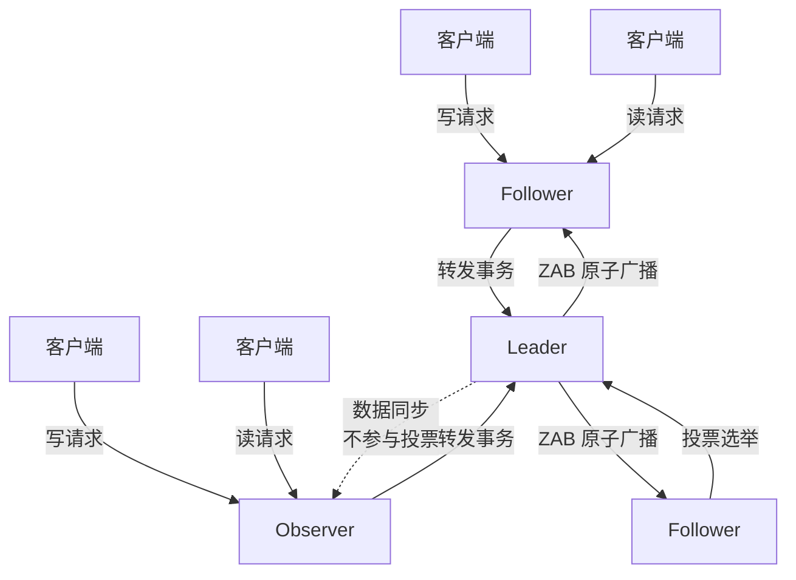
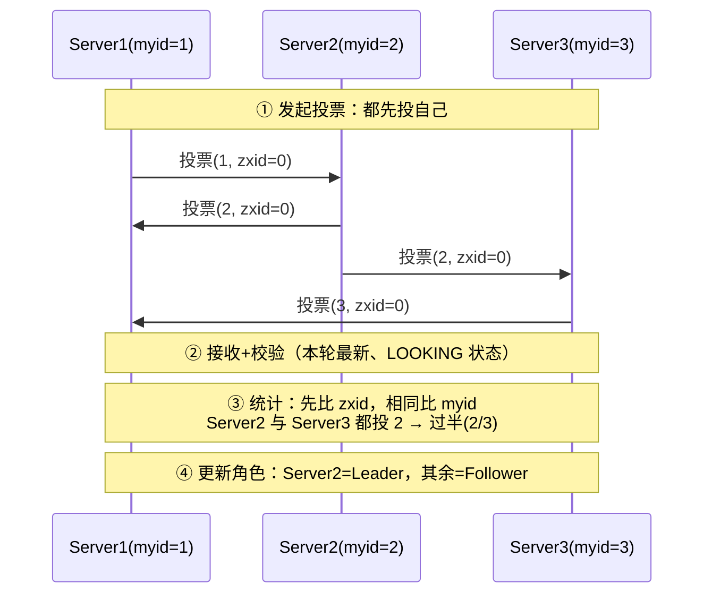
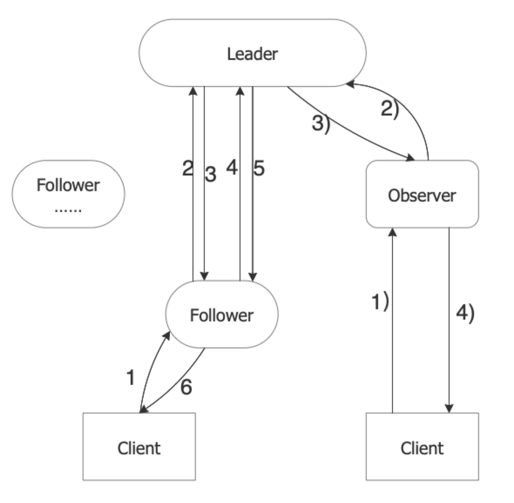
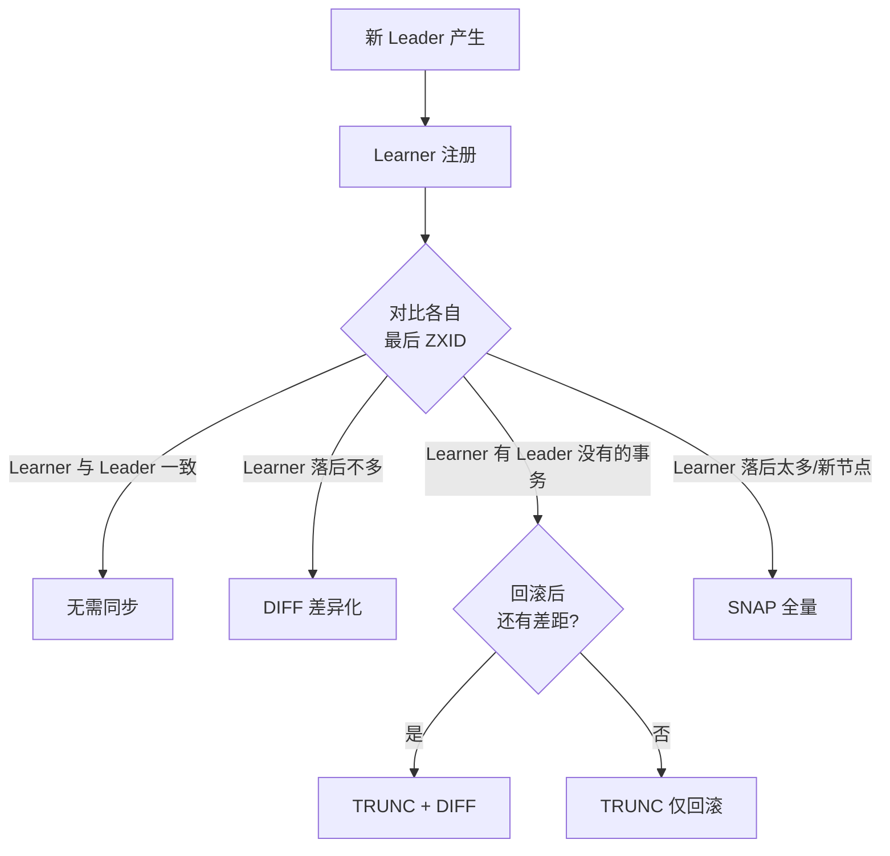

# 集群与Leader选举

> 本文是 ZooKeeper 系列第 3 篇，深入 **集群机制**：角色分工、一致性基础、Leader 选举（含 FastLeaderElection）、数据同步四种方式、启动原理、集群规模设计。
> 前置知识：[02-会话与Watch机制](02-会话与Watch机制.md)
> 关联笔记：[04-ZAB协议与一致性](04-ZAB协议与一致性.md)（选举与同步的协议层基础）、[02-CAP与BASE理论详解](../核心原理/02-CAP与BASE理论详解.md)

## 版本基线

选举算法自 **3.4.0 起只支持 FastLeaderElection**（旧 UDP 算法废弃）；数据同步策略 3.4+ 稳定。示例以 3 节点集群为主。

## 受众声明

面向已了解 Session/Watch 的读者（[02-会话与Watch机制](02-会话与Watch机制.md)）。假设已懂：CAP 定理、TCP、投票/多数原则。以下术语必须讲清：Quorum（过半）、LOOKING 状态、zxid、myid、DIFF/SNAP 同步。

## 学习目标

学完本文你能：
1. 说清 **Leader/Follower/Observer 三种角色**的分工与区别
2. 理解 ZK 一致性本质是**最终一致 + 多数原则**
3. 讲清 **Leader 选举四步流程**（发起投票/接收/统计/更新角色）
4. 理解 **FastLeaderElection**：为什么比 zxid 和 myid？逻辑时钟是什么
5. 说清 **四种数据同步方式**（DIFF/TRUNC+DIFF/TRUNC/SNAP）各自触发条件
6. 知道**单机/集群启动流程**与请求处理链（责任链模式）
7. 答出集群**为什么用奇数节点**

## 前置知识

- [02-会话与Watch机制](02-会话与Watch机制.md)——会话与连接状态
- [02-CAP与BASE理论详解](../核心原理/02-CAP与BASE理论详解.md)——一致性模型
- 需掌握：TCP 通信、多数投票思想

---

## 目录

- [1. 集群角色](#1-集群角色)
- [2. 一致性基础](#2-一致性基础)
- [3. Leader 选举](#3-leader-选举)
- [4. 数据同步（Leader 选举后）](#4-数据同步leader-选举后)
- [5. 启动原理](#5-启动原理)
- [6. 集群规模设计](#6-集群规模设计)
- [7. 最佳实践](#7-最佳实践)
- [8. 常见踩坑](#8-常见踩坑)
- [9. 小结](#9-小结)

## 1. 集群角色

| 角色 | 处理读请求 | 处理写请求 | 参与选举 | 事务日志/快照 |
|---|---|---|---|---|
| **Leader** | ✅ | ✅（唯一入口，协调全局） | 被选举方 | ✅ |
| **Follower** | ✅ | 转发给 Leader | ✅（候选人） | ✅ |
| **Observer** | ✅ | 转发给 Leader | ❌（不投票、不被选举） | 默认记录（`syncEnabled` 可关） |

**请求处理核心规则**：

- **事务性请求**（创建/删除/更新节点）：无论到哪台服务器，**统一转发给 Leader** 处理，保证执行顺序
- **非事务性请求**（查询）：Follower/Observer 直接处理

**角色职责图**：



此图说明：读写分离——读请求任意节点直接处理，写请求一律汇聚到 Leader 由它广播；Observer 只同步数据、不投票（水平扩展读能力）。

> ⚠️ 单台服务器不构成集群，**不会选举 Leader**；集群至少 3 台。

## 2. 一致性基础

- ZK 不是强一致：集群各服务器数据**每时每刻一致**做不到
- 采用**最终一致性**：经过一段时间后数据最终一致
- **多数原则（Quorum）**：事务请求导致数据变化时，只要**过半服务器**正确变更，即可保证一致性——这也是「过半可用」高可用的来源

**一致性语义对比**：

| 模型 | 读到的数据 | ZK 是否满足 |
|---|---|---|
| 强一致（线性一致） | 永远最新 | 写路径近似，读路径不一定 |
| 顺序一致 | 各节点看到顺序一致，值可能旧 | ✅ ZAB 广播保证 |
| 最终一致 | 一段时间后一致 | ✅ 主要语义 |

> 💡 **面试常考**：ZK 是「顺序一致性」（写全序 + 读可能旧），不是强一致——所以读请求可以直接打 Follower，代价是可能读到旧值。

## 3. Leader 选举

### 3.1 选举发生的两种时机

1. **集群启动时**：无 Leader，需要确定一台
2. **运行中 Leader 失效时**：集群暂停处理事务性请求，直到选出新 Leader

### 3.2 选举四步流程

以 3 台服务器（myid 1/2/3，初始 zxid 均为 0）为例：



1. **发起投票**：每台都先投自己——Server1 投 `(myid=1, zxid=0)`，Server2 投 `(2,0)`，Server3 投 `(3,0)`
2. **接收投票**：同时接收其他服务器的投票，校验有效性（本轮最新、发出者处于 LOOKING 状态）
3. **统计投票**：收到别人的投票后与自己对比——
   - **先比 zxid**：数值大的优先成为 Leader（数据越新越有资格）
   - **zxid 相同比 myid**：myid 大的胜出
   - 每轮统计是否有**过半机器**投出同样结果 → 有则选举完成
4. **更新角色**：胜出者变 Leader，其余变 Follower

### 3.3 FastLeaderElection 底层要点 ★

> 网络查证补充（2026-08）。3.4.0+ 唯一选举算法，核心是 **TCP 投票通道 + 逻辑时钟**。

- **逻辑时钟（logicalclock）**：标识「第几轮选举」。收到投票时：
  - 对方逻辑时钟更大 → 对方在更新的一轮，**更新自己的逻辑时钟并重新投票**
  - 相同 → 同一轮，正常比较归档
  - 更小 → 忽略（过期投票）
- **QuorumCnxManager**：管理服务器间 TCP 通信（选举端口 3888）的收发
- 投票对比规则同上（zxid → myid），过半即产生 Leader
- **Observer 不参与投票**，只同步数据（可水平扩展读能力）

**逻辑时钟场景表**：

| 场景 | 处理 |
|---|---|
| 收到投票的 logicalclock > 自己的 | 自己落后，更新时钟并重新发起投票 |
| logicalclock == 自己的 | 同一轮，正常对比 zxid/myid |
| logicalclock < 自己的 | 过期投票，忽略 |



### 3.4 运行中 Leader 失效的检测

Follower 定期向 Leader 发请求探活：

- 有响应 → 正常，继续服务
- 无响应 → 该 Follower 变 **LOOKING** 状态并发起投票；**个别失败不会立刻触发重新选举**，需要更多机器参与、最终过半才换 Leader

**检测链路**：

```text
Follower 请求 Leader（心跳/请求）
   ├─ 有响应 → 继续服务
   └─ 无响应（超时）
        └─ Follower 变 LOOKING，发起新一轮选举
             └─ 其他节点陆续参与 → 过半一致 → 新 Leader 产生
```

> 💡 **关键**：Leader 失效 ≠ 立即重选——要等「过半节点都认为 Leader 挂了」才会真正换人，这是防抖机制（避免网络抖动导致频繁选举）。

## 4. 数据同步（Leader 选举后）

选举出 Leader 后，其他服务器作为 **Learning 服务器**向 Leader 注册，开始同步；**只有事务性请求参与同步**。四种方式：

| 方式 | 含义 | 触发场景 |
|---|---|---|
| **DIFF** | 差异化同步：只同步缺失的 Proposal | 最常用——Learner 数据落后不多，Leader 把差额 Proposal 发给它，commit 后持久化 |
| **TRUNC+DIFF** | 先回滚再差异化同步 | Learner 有 Leader 没有的事务日志（Leader 已记录但未发起 Proposal 流程）→ 先回滚到一致状态再 DIFF |
| **TRUNC** | 仅回滚 | 回滚到与 Leader 一致，不做 DIFF |
| **SNAP** | 全量同步：Leader 内存数据序列化发给 Learner 载入 | Learner 落后太多（或新节点），差分成本高于全量 |

**同步方式选择流程**：



> 💡 **记忆锚点**：同步本质是「把 Learner 对齐到 Leader」——落后少用 DIFF，有脏数据先 TRUNC，落后多直接 SNAP。

**各方式对比**：

| 维度 | DIFF | TRUNC | SNAP |
|---|---|---|---|
| 传输量 | 小（只差额） | 最小（无数据传输） | 大（全量内存） |
| 适用场景 | 落后少 | 有脏数据 | 落后多/新节点 |
| 速度 | 快 | 最快 | 慢（序列化全量） |

## 5. 启动原理

### 5.1 单机启动流程

1. **启动准备**：入口 `QuorumPeerMain`（ZooKeeper 服务的启动接口）→ 解析 `zoo.cfg` → 创建日志文件清理器（`DatadirCleanupManager`，3.4.0+ 支持 `autopurge.snapRetainCount/purgeInterval` 自动清理）
2. **服务初始化**：创建统计工具类——
   - `ServerStats`：服务运行状态统计（响应包次数、请求包次数、延迟、处理次数）
   - `FileTxnSnapLog`：数据管理，按 `dataDir`（快照）与 `dataLogDir`（事务日志）创建
   - 会话管理类：设置 TickTime 与会话超时、创建会话管理器
   - `ServerCnxnFactory`：网络通信（NIO 框架，3.4.0+ 可换 Netty）
3. **初始化请求处理链**（责任链模式）：`PrepRequestProcessor → SyncRequestProcessor → FinalRequestProcessor`，请求按顺序经过三个处理器

**请求处理链（责任链模式）**：


此图说明：请求按固定顺序经过三个处理器——Prep 负责校验与编号、Sync 负责落盘（性能瓶颈）、Final 负责应用与响应。

### 5.2 集群启动流程

- `main → initializeAndRun` 根据 zoo.cfg 判断单机还是集群模式
- 集群模式：先通信检查 → 找 Leader（找不到则进入选举，见 §3）→ 数据同步 → 对外服务
- 选举算法：`electionAlg=3`（FastLeaderElection，TCP 形式；1/2 的 UDP 算法 3.4.0+ 废弃）

### 5.3 集群规模设计

> **最好奇数，最小 3 台**。偶数节点在选举投票时可能出现不满足多数原则的平局（如 2 台挂 1 台剩 1 台，1 票不够过半）。

| 节点数 | 可容忍故障数 | 过半阈值 | 说明 |
|---|---|---|---|
| 1 | 0 | 1 | 单机模式，无选举 |
| 3 | 1 | 2 | 最小生产集群 |
| 5 | 2 | 3 | 更稳，可配 Observer 扩展读 |
| 7 | 3 | 4 | 大型集群 |

**为什么不用偶数**：

| 节点数 | 故障数 | 剩余 | 过半？ |
|---|---|---|---|
| 2 | 1 | 1 | ❌ 1 < 2，不可用 |
| 4 | 1 | 3 | ✅ 3 ≥ 3，可用（但浪费 1 台） |
| 4 | 2 | 2 | ❌ 2 < 3，不可用（与 3 节点容 1 台相同，却多 1 台成本） |

> 💡 **结论**：4 节点与 3 节点容错能力一样（都只能挂 1 台），多花钱没收益——所以生产永远奇数。

## 6. 集群规模设计（续）

- 3 节点：容忍 1 台故障
- 5 节点：容忍 2 台故障（可再配 Observer 扩展读）
- **Observer 的用途**：读多写少场景，加 Observer 扩展读能力，不增加投票节点（选举/写性能不受影响）

## 7. 最佳实践

1. 生产 **3 或 5 节点**奇数集群；读多写少的场景加 **Observer** 水平扩展读
2. 选举端口（3888）与通信端口（2888）要稳定可达，网络抖动会引发频繁选举
3. 事务日志落盘速度决定写性能——`dataLogDir` 独立 SSD（见 [00-ZooKeeper总览](00-ZooKeeper总览.md)）
4. 监控 LOOKING 状态：集群长期处于 LOOKING = 选不出 Leader（网络分区/节点数不足）
5. Leader 失效期间写请求暂停——客户端要做好重试
6. 滚动升级时错峰重启，避免触发选举风暴
7. Observer 集群也要独立配置（`peerType=observer` + server 行加 `:observer` 后缀）

## 8. 常见踩坑

- **2 台集群**：1 台故障就失去过半，整个集群不可写
- **网络分区导致「脑裂」**：旧 Leader 被隔离仍以为自己是 Leader——ZK 靠**过半原则**保证只有多数派能继续服务，少数派自动降级
- **Observer 被误当 Follower**：它不投票，别指望它参与选举
- **zxid 落后节点抢 Leader**：zxid 大的优先，数据旧的节点当选会丢数据（选举规则已杜绝）
- **频繁重启触发选举风暴**：批量滚动重启时注意错峰
- **Leader 失效后写请求失败**：客户端收到 ConnectionLoss/超时，要重试（写请求在选举期间不可用）
- **Observer 配置漏加 `:observer` 后缀**：server.N 行没标 observer，节点会以 Follower 身份启动参与投票

## 9. 小结

1. 三种角色：**Leader 收写、Follower 读写+选举、Observer 只读**；事务请求统一转发 Leader
2. 一致性 = **最终一致 + 过半多数原则**；ZK 是顺序一致性不是强一致
3. 选举四步：发起投票（先投自己）→ 接收校验 → **zxid 优先、myid 次之**、过半胜出 → 更新角色；FastLeaderElection 用逻辑时钟区分轮次
4. 数据同步四方式：**DIFF / TRUNC+DIFF / TRUNC / SNAP**，本质是把 Learner 对齐到 Leader
5. 集群**至少 3 台奇数**；请求处理链是责任链模式（Prep → Sync → Final）
6. 集群规模：N 台容 N/2-1 台故障，4 节点与 3 节点容错相同不值得

## 下一篇

- 上一篇：[02-会话与Watch机制](02-会话与Watch机制.md)
- 下一篇：[04-ZAB协议与一致性](04-ZAB协议与一致性.md)