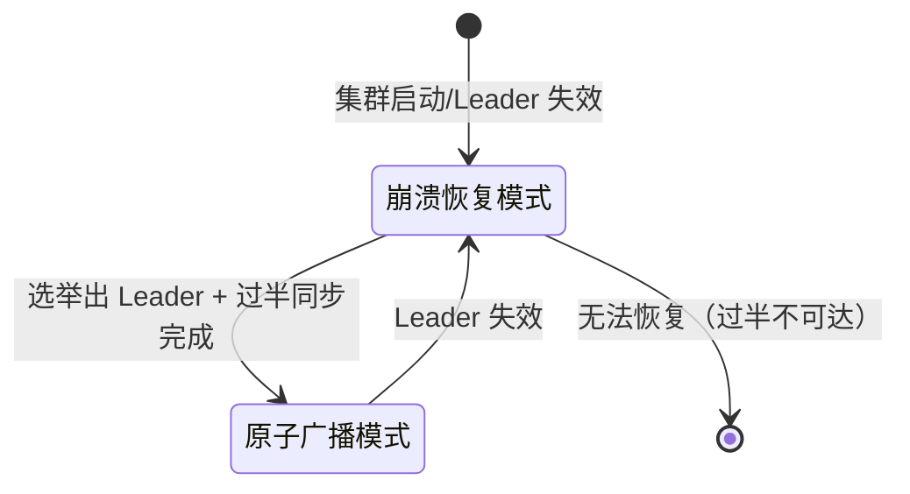
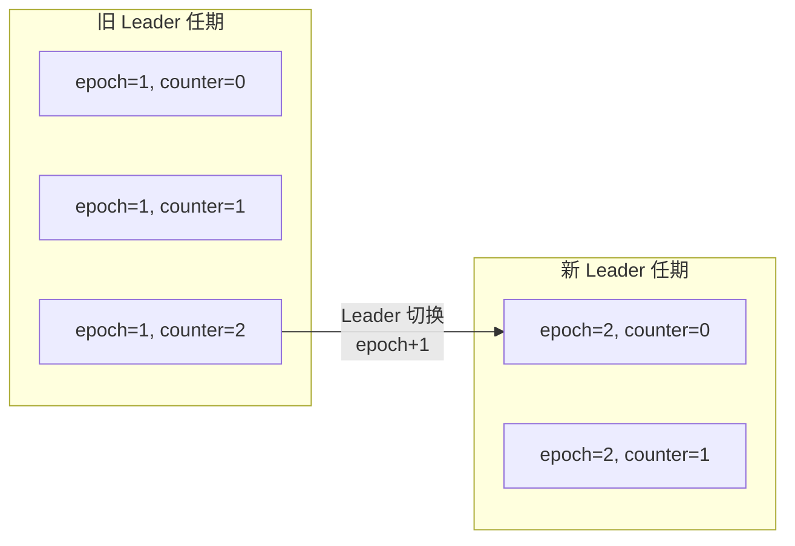
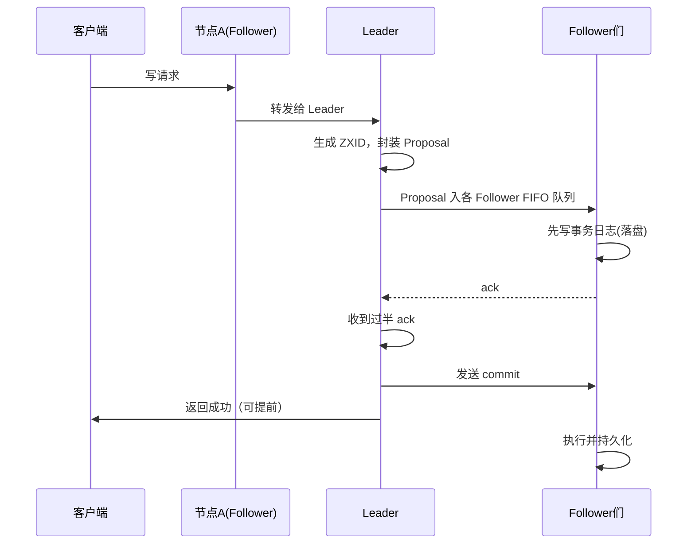
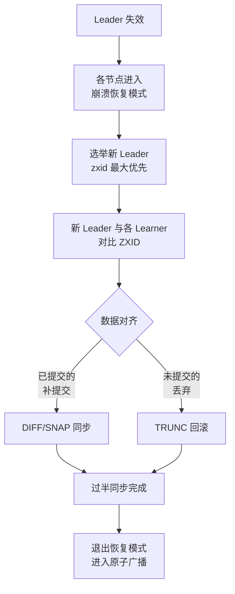
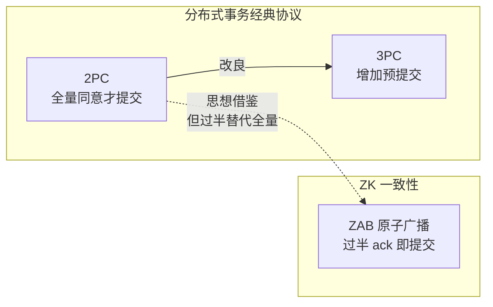

# ZAB协议与一致性

> 本文是 ZooKeeper 系列第 4 篇，深入 **ZAB 协议**（ZooKeeper 的原子广播协议）：崩溃恢复、原子广播、ZXID/epoch 机制，并与 **Paxos / Raft / 2PC / 3PC** 全面对比。
> 前置知识：[03-集群与Leader选举](03-集群与Leader选举.md)
> 关联笔记：[02-CAP与BASE理论详解](../核心原理/02-CAP与BASE理论详解.md)、[04-分布式事务详解](../核心原理/04-分布式事务详解.md)（2PC/3PC/TCC/Saga）

## 版本基线

ZAB 协议自 ZooKeeper 诞生起是其一致性基石，3.4.0+ 稳定。本文按协议理论（论文 + 实现）讲解，不依赖具体版本；3.7.0 新增 `zookeeper.learner.asyncSending` 异步发送优化。

## 受众声明

面向已了解集群角色与选举的读者（[03-集群与Leader选举](03-集群与Leader选举.md)）。假设已懂：2PC 思想、CAP、TCP。以下术语必须讲清：ZXID、epoch、Proposal、Quorum、崩溃恢复、原子广播。

## 学习目标

学完本文你能：
1. 说清 **ZAB 是什么**、解决什么问题、两个核心功能点
2. 说清 **ZXID 的 64 位结构**（高 32 epoch + 低 32 计数器）为什么这样设计
3. 讲清**原子广播**的完整流程（与 2PC 的异同）
4. 讲清**崩溃恢复**要保证的两件事（已提交的保留、未提交的丢弃）
5. 理解 **epoch 机制**如何防止旧 Leader 用旧 ZXID 乱发事务
6. 对比 **ZAB / Paxos / Raft** 的异同，能答面试追问
7. 区分 **2PC / 3PC** 与 ZAB 原子广播的关系

## 前置知识

- [03-集群与Leader选举](03-集群与Leader选举.md)——选举与同步机制
- [02-CAP与BASE理论详解](../核心原理/02-CAP与BASE理论详解.md)——一致性模型
- 需掌握：二阶段提交思想、半数投票

---

## 目录

- [1. ZAB 协议概述](#1-zab-协议概述)
- [2. ZXID 与 epoch](#2-zxid-与-epoch)
- [3. 原子广播（消息广播模式）](#3-原子广播消息广播模式)
- [4. 崩溃恢复模式](#4-崩溃恢复模式)
- [5. ZAB / Paxos / Raft 对比](#5-zab--paxos--raft-对比)
- [6. 2PC 与 3PC](#6-2pc-与-3pc)
- [7. 面试追问（提前覆盖）](#7-面试追问提前覆盖)
- [8. 最佳实践](#8-最佳实践)
- [9. 常见踩坑](#9-常见踩坑)
- [10. 小结](#10-小结)

## 1. ZAB 协议概述

**一句话记忆**：ZAB（ZooKeeper Atomic Broadcast，原子广播协议）是 **ZooKeeper 专门设计**的、**支持崩溃恢复**的原子广播协议，解决集群**最终一致性**问题。

**为什么需要**：无论处理客户端会话请求，还是 Leader 重选，都会产生数据不一致的情况。ZAB 的两个核心功能点：

1. **崩溃恢复**：Leader 故障时选出新 Leader 并恢复一致
2. **原子广播**：Leader 把事务按顺序广播给所有节点

**主备模型**：Leader 处理所有写请求并广播事务，Follower 同步数据（区别于 Paxos 的「多主对等」，更接近 Raft 的 Leader 制）。

**两种模式切换**：



此图说明：ZAB 是两模式的循环——崩溃恢复负责「选主 + 对齐数据」，原子广播负责「对外服务 + 顺序提交」；Leader 一旦失效立刻回到恢复模式。

## 2. ZXID 与 epoch ★

**ZXID（事务 ID）**：全局唯一且递增的 64 位数字，标识每个事务，可识别全局处理顺序。

```text
ZXID = 高 32 位 epoch + 低 32 位计数器
        └── Leader 任期编号     └── 每任期从 0 递增
```

- **低 32 位**：单调递增计数器，每产生一个新 Proposal 就 +1
- **高 32 位（epoch）**：**Leader 周期编号**。每选出新 Leader，从它本地日志最大 ZXID 解析出 epoch 再 +1，作为新任期号，低 32 位从 0 重新开始



此图说明：epoch 随 Leader 任期递增，counter 每任期从 0 重计——所以 ZXID 大小比较 = 先比任期、再比计数器，天然反映「数据新旧」。

> 💡 **epoch 的意义**：防止「上一个 Leader 周期的僵尸事务」混入新周期。一个含旧 epoch 事务的服务器无法成为 Leader（过半集合中必然存在更高 epoch 的事务），加入集群时也会被 Leader 要求回滚到一致版本。

## 3. 原子广播（消息广播模式）

**一句话记忆**：类似 2PC，但通过 FIFO 队列 + 过半 ack + 异步提交，比 2PC 快得多。

流程（节点 A 收到写请求）：



1. A 不是 Leader → 转发给 Leader
2. Leader 生成 **ZXID**，把请求封装成 **Proposal** 发给所有 Follower 的 FIFO 队列
3. Follower 收到 Proposal → **先写事务日志（落盘）** → 回复 Leader **ack**
4. Leader 收到**过半 ack** → 发送 **commit** 给所有 Follower（并给 Observer 发 Proposal）
5. Follower 收到 commit 执行并持久化 → 回复 ack
6. 客户端收到响应

**与 2PC 的区别**：

| 维度 | 2PC | ZAB 原子广播 |
|---|---|---|
| 协调方式 | 协调者询问**所有**参与者 | Leader 等**过半** ack |
| 阻塞性 | 同步阻塞（等所有人） | 异步（FIFO 队列，不阻塞） |
| 故障处理 | 协调者单点故障卡死 | Leader 失效走崩溃恢复 |
| 吞吐 | 低 | 高 |
| 顺序保证 | 无强顺序 | FIFO 队列 + ZXID 强顺序 |

**强顺序性保障**：如果 Follower 收到的 commit 的 zxid 不是它最近 pending 的那个（丢包/乱序），**Follower 直接退出**——宁可停止服务也不破坏顺序。

> 💡 **面试考点**：ZAB 用「过半」替代 2PC 的「全量」，用「异步队列」替代「同步阻塞」，是它在吞吐上碾压 2PC 的根本原因。

## 4. 崩溃恢复模式 ★

**触发**：Leader 崩溃 / 重启 / 无法与过半 Follower 通信 → 进入恢复模式 → 选举新 Leader → 数据同步 → 退出恢复，进入广播模式。

**崩溃恢复要保证两件事**：

1. **已经提交的事务必须最终被所有服务器提交**（如 Leader 已 commit 了 proposal2，恢复后 proposal2 必须在所有服务器上提交）
2. **只在 Leader 上提出、未提交的事务必须丢弃**（如 Leader 执行了 commit3 但没发出去就宕机，重新加入集群后要舍弃 proposal3）

**恢复流程**：



此图说明：恢复 = 选主 + 对齐两件事——把「已提交的补上、未提交的丢掉」，过半 Learner 对齐后才恢复服务。

**数据同步（对齐）**：详见 [03-集群与Leader选举](03-集群与Leader选举.md) 的四种同步方式（DIFF/TRUNC+DIFF/TRUNC/SNAP）。同步完成的判定：**过半 Follower 完成同步**后，退出恢复模式。

**恢复期间的可用性**：恢复模式服务不可用，直到过半 Follower 完成同步——这是 ZK 写可用性的代价。

## 5. ZAB / Paxos / Raft 对比 ★

| 维度 | ZAB | Paxos | Raft |
|---|---|---|---|
| 提出者 | ZooKeeper 专用 | Leslie Lamport | Diego Ongaro |
| 角色模型 | 主备（Leader/Follower） | 对等多角色（Proposer/Acceptor/Learner） | 主从（Leader/Follower/Candidate） |
| 选举 | 崩溃恢复时选 Leader | 无固定 Leader（Basic Paxos） | 心跳超时触发选举 |
| 日志顺序 | ZXID（epoch+计数器） | 实例编号 | term + log index |
| 复杂度 | 中 | 高（难理解难实现） | 中（为可理解性设计） |
| 使用方 | ZooKeeper | Chubby（Google） | **etcd / Consul / TiKV / K8s 生态** |
| 核心差异 | 专为协调服务设计，恢复与广播一体 | 理论基石，工程实现少直接用 | 选举与日志复制解耦清晰，事实标准 |

**Paxos 补充**（素材要点）：

- 运行在异步非拜占庭模型（agent 可失败重启、消息可丢失重复，但不会腐化）
- 角色：Client / Proposer / Acceptor / Learner
- Basic Paxos 决定一个值要两轮消息交换 → **MultiPaxos** 保持长期 Leader，只需执行第二阶段

**Raft 补充**（素材要点）：

- 三种状态：leader / follower / candidate；只有 leader 处理客户端请求
- 选举：心跳超时 → term+1 → 变 candidate → 发 RequestVote RPC → 三种结局（赢/输/平局超时重选）
- **日志匹配属性**：相同 index+term 的日志条目内容相同，且之前所有条目也相同
- 提交规则：**只有当前 term 的日志条目被复制到多数派才算提交**，旧 term 条目靠「新 term 条目提交后间接确认」
- 新 Leader 保证：日志条目只有复制到多数派才能提交 + candidate 要赢得多数投票且日志不落后才能当选 → 新 Leader 必含所有已提交日志

**ZAB vs Raft 关键差异**：

| 对比点 | ZAB | Raft |
|---|---|---|
| 恢复期间 | 整体不可用（过半同步完成才服务） | 日志追平即可，更快恢复 |
| 协议结构 | 恢复 + 广播耦合一体 | 选举/日志复制/安全性拆解清晰 |
| 可理解性 | 中 | 高（论文面向教学） |

> 💡 **面试结论**：Raft 是工程事实标准（etcd/K8s），ZAB 是 ZK 专属，Paxos 是理论基石——三者不是替代关系，是「理论 → 工程改良」的谱系。

## 6. 2PC 与 3PC

> ZAB 的原子广播「底层实现与二阶段提交非常相似」，但 ZK 的过半机制规避了 2PC 的多数问题。二者都要理解才能答对比题。

### 6.1 二阶段提交（2PC）

两阶段：**询问阶段（prepare）→ 提交阶段（commit）**

1. 协调者询问所有参与者能否执行
2. 参与者本地执行并记录日志，返回结果
3. 全部成功 → 协调者发 commit；有失败 → 发 rollback

**三大问题**：

- **性能**：所有参与者阻塞等待，并发效率低
- **单点故障**：协调者挂了，整个事务卡死
- **异常中断**：commit 阶段部分参与者收不到指令 → 数据不一致

### 6.2 三阶段提交（3PC）

在 2PC 基础上**增加预提交阶段**（canCommit → preCommit → doCommit），降低阻塞范围：

1. **预提交**：确认所有参与者已准备好并锁定事务日志
2. **提交**：全部成功才正式提交，否则回滚

3PC 缓解了 2PC 的阻塞与单点问题，但引入新问题（网络分区下可能违反一致性），**工程使用仍少**；实际分布式事务更常用 TCC / Saga / 本地消息表（见 [04-分布式事务详解](../核心原理/04-分布式事务详解.md)）。

### 6.3 2PC/3PC 与 ZAB 关系图



此图说明：ZAB 原子广播借鉴 2PC 的「询问-提交」两段式思想，但把「全部参与者同意」换成「过半 ack」，解决了 2PC 的阻塞与单点问题。

## 7. 面试追问（提前覆盖）

1. **ZAB 和 2PC 谁快？为什么？** ZAB 快：FIFO 队列 + 过半 ack 即提交（异步），2PC 要等全部参与者
2. **zxid 低 32 位溢出怎么办？** 理论上有溢出风险；实际上 epoch 轮换 + 单 Leader 任期内事务量远达不到 2^32，工程上安全
3. **为什么 ZK 选主比 etcd 慢？** ZK 恢复模式要「过半同步完成」才对外服务；etcd 的 Raft 只要求日志追平即可，且运维上 ZK 重客户端
4. **ZAB 与 Raft 谁更简单？** Raft——ZAB 的恢复与广播耦合在同一协议里，Raft 把选举、日志复制、安全性拆解得更清晰
5. **为什么 ZK 不用 Paxos？** Paxos 不直接提供「全序广播 + Leader 制」的工程形态，ZAB 是专为协调服务的原子广播设计的
6. **epoch 为什么能防僵尸 Leader？** 旧 Leader 的 ZXID 带旧 epoch，新任期 epoch 更高——过半集合必然包含新 epoch 事务，旧 Leader 无法说服多数派
7. **Follower 收到乱序 commit 为什么退出？** 顺序性是 ZK 的命根子——宁可退出重同步，也不能接受乱序导致的数据不一致

## 8. 最佳实践

1. 理解 ZAB 后看 ZK 写性能瓶颈：**事务日志落盘（fsync）是提交路径的咽喉**——独立 SSD 收益最直接
2. 崩溃恢复期间写不可用是设计使然，客户端要配**重试 + 会话保持**
3. 集群网络抖动会反复触发恢复模式，选举端口（3888）链路要稳
4. 学习顺序建议：先 ZAB（ZK 专属）→ 再 Raft（云原生标配）→ Paxos 了解思想即可
5. 面试答题结构：先讲两模式（恢复 + 广播）→ 再讲 ZXID/epoch → 最后对比 2PC/Raft
6. 监控指标：恢复模式耗时、同步时长、pending 队列长度——异常时优先查网络

## 9. 常见踩坑

- **把 ZK 当强一致**：ZK 是顺序一致性（读可能读到旧值），写路径严格、读路径可走 Follower——选型时注意
- **2PC 直接套 ZAB 逻辑**：2PC 要全部参与者、ZAB 只要过半，别混为一谈
- **忽略 epoch**：答崩溃恢复不提 epoch/zxid 结构 = 没讲透
- **以为 Paxos 过时**：Paxos 是理论基石，Raft 是工程化改良，面试常考两者关系
- **误以为恢复期间还能读**：崩溃恢复模式服务整体不可用（读写都停），直到过半同步完成
- **低 32 位溢出当危机**：理论风险，工程上 epoch 轮换已覆盖，别过度设计

## 10. 小结

1. ZAB = **崩溃恢复 + 原子广播**，专为 ZK 设计的主备式一致性协议
2. ZXID 64 位 = **epoch（高 32）+ 计数器（低 32）**，epoch 防僵尸 Leader 事务
3. 原子广播 ≈ 2PC 改良：FIFO 队列 + **过半 ack 即提交** + 顺序破坏即退出
4. 崩溃恢复保证：**已提交必保留、未提交必丢弃**；过半同步完成才恢复服务
5. 对比结论：**Raft 是工程事实标准（etcd/K8s），ZAB 是 ZK 专属，Paxos 是理论基石**
6. 2PC/3PC 是分布式事务协议，ZAB 借鉴其思想但用过半机制规避阻塞与单点

## 下一篇

- 上一篇：[03-集群与Leader选举](03-集群与Leader选举.md)
- 下一篇：[05-ACL权限控制](05-ACL权限控制.md)

---
*创建于 2026-08-09（wolai 笔记转存 + 网络查证补充），2026-08-11 细化（补两模式状态图/ZXID 结构图/原子广播时序图/恢复流程图/ZAB vs Raft 对比表）*
