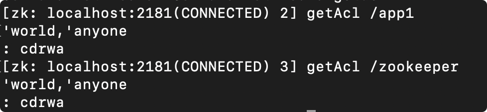

# ACL权限控制

> 本文是 ZooKeeper 系列第 5 篇，深入 **ACL 权限控制**：五种鉴权策略（schema）、权限位（cdrwa）、命令行实战、super 超管、自定义鉴权器。
> 前置知识：[01-数据模型与节点详解](01-数据模型与节点详解.md)
> 关联笔记：[00-ZooKeeper总览](00-ZooKeeper总览.md)（zoo.cfg 配置）

## 版本基线

ACL 机制 3.1+ 稳定，全版本通用。示例命令基于 zkCli 3.6+。

## 受众声明

面向已了解 znode 的读者（[01-数据模型与节点详解](01-数据模型与节点详解.md)）。假设已懂：SHA-1/Base64、IP 地址段。以下术语必须讲清：schema、授权对象 ID、权限位 cdrwa、super 超管。

## 学习目标

学完本文你能：
1. 说清 **ACL 解决什么问题**、基于什么粒度、子节点是否继承
2. 记住 **5 种 schema**（world/auth/digest/ip/super）各自含义
3. 记住 **5 个权限位** cdrwa 的完整含义
4. 用命令行 **setAcl/getAcl/addauth** 配置权限
5. 生成 **digest 密码密文**（openssl 命令）
6. 配置 **super 超管**绕过权限
7. 知道如何**自定义 AuthenticationProvider**

## 前置知识

- [01-数据模型与节点详解](01-数据模型与节点详解.md)——znode 与 stat
- 需掌握：Linux 命令行、SHA-1/Base64 基本概念

---

## 目录

- [1. ACL 是什么](#1-acl-是什么)
- [2. 写法](#2-写法)
- [3. 五种 Schema（鉴权策略）](#3-五种-schema鉴权策略)
- [4. 授权对象 ID](#4-授权对象-id)
- [5. 权限位：cdrwa](#5-权限位cdrwa)
- [6. 权限判定流程](#6-权限判定流程)
- [7. 命令行实战](#7-命令行实战)
- [8. Super 超级管理员](#8-super-超级管理员)
- [9. 自定义权限控制](#9-自定义权限控制)
- [10. 面试追问（提前覆盖）](#10-面试追问提前覆盖)
- [11. 最佳实践](#11-最佳实践)
- [12. 常见踩坑](#12-常见踩坑)
- [13. 小结](#13-小结)

## 1. ACL 是什么

**一句话记忆**：ACL（Access Control List）是 ZK 的**基于节点的访问控制**——每个 znode 可以设置不同的权限，保护存储在节点上的重要信息。

**生活类比**：小区门禁卡——每栋楼（节点）有自己的门禁规则（ACL），你有一楼的卡不代表能进二楼（子节点不继承），每层楼的卡要单独办。

**两个关键特性**：

- 权限**基于节点**：每个 znode 有自己的 ACL，可以不同
- **子节点不继承父节点权限**：能访问父节点不代表能访问子节点（每个节点独立维护自己的 ACL）

**与文件系统权限的区别**：

| 维度 | Linux 文件权限 | ZooKeeper ACL |
|---|---|---|
| 粒度 | 文件/目录 | znode |
| 继承 | 目录下新建文件继承父目录 | **不继承**，每个节点独立 |
| 权限位 | rwx（读/写/执行） | cdrwa（增/删/读/写/管理） |
| 认证 | 系统用户/组 | schema（world/ip/digest/auth/super） |
| 传播 | 递归 chmod 可批量 | 逐节点设置 |

## 2. 写法

```text
schema:ID:permission
```

三部分：**鉴权策略（schema）** : **授权对象（ID）** : **权限位（permission）**

## 3. 五种 Schema（鉴权策略）

| schema | 描述 | 说明 |
|---|---|---|
| **world** | 所有用户 | 只有一个 ID `anyone`；本质不设防，跳过权限验证 |
| **ip / host** | IP 地址认证 | 针对单个 IP 或 IP 段（如 `192.168.0.1/12`） |
| **auth** | 已认证用户 | 使用当前会话中已 addauth 的用户授权 |
| **digest** | 用户名:密码 | 密码用 SHA-1 + Base64 加密存储 |
| **super** | 超级用户 | 特殊 digest，可对任意节点做任意操作 |

> 💡 **auth vs digest**：`auth:lub:cdrwa` 用「当前会话已认证的用户」作为授权对象（写起来省事）；`digest:lub:密文:cdrwa` 显式指定用户名+密文。

## 4. 授权对象 ID

| 权限模式 | 授权对象 |
|---|---|
| ip/host | IP 地址或 IP 段：`192.168.0.1` 或 `192.168.0.1/12` |
| digest | 用户名:密文，如 `lub:37gflIXisByyYvWKTjjsSOozs1I=` |
| world | 唯一 ID：`anyone` |
| super | 与 digest 一致（用户名:密文） |

## 5. 权限位：cdrwa

| 权限 | 简写 | 描述 | 对应操作 |
|---|---|---|---|
| **c**reate | c | 创建子节点 | create 子节点 |
| **d**elete | d | 删除子节点（注意：是子节点） | delete 子节点 |
| **r**ead | r | 读取节点数据及子节点列表 | getData/getChildren |
| **w**rite | w | 设置节点数据 | setData |
| **a**dmin | a | 设置节点 ACL（权限管理权） | setAcl |

> ⚠️ 边界：`delete` 只作用于**子节点**（删除当前节点本身需要父节点的 delete 权限）；`admin` 权限用于 setAcl 自己。

**cdrwa 组合场景穷举**：

| 组合 | 含义 | 典型用途 |
|---|---|---|
| `crwa` | 除 admin 外全部 | 普通业务应用（读写节点但不改权限） |
| `cdrwa` | 全部权限 | 管理员/初始化脚本 |
| `r` | 只读 | 配置订阅方（只需读） |
| `rw` | 读写 | 配置发布方 |
| `cd` | 增删子节点 | 服务注册方（创建/注销实例节点） |

## 6. 权限判定流程

```mermaid
flowchart TD
    A[客户端发起操作] --> B{节点有 ACL?}
    B -->|无(默认 world:anyone)| C[放行]
    B -->|有| D{会话已认证?<br/>addauth 过?}
    D -->|否| E[匿名 → 按 world/ip 匹配]
    D -->|是| F[携带认证身份]
    E --> G{匹配到 ACL 条目?}
    F --> G
    G -->|无匹配条目| H[❌ NoAuthException]
    G -->|匹配到| I{权限位足够?<br/>如 delete 需父节点 d}
    I -->|是| J[✅ 执行成功]
    I -->|否| H
```

此图说明：权限判定 = 「有没有匹配的 ACL 条目」+「该条目的权限位是否覆盖本次操作」两步；认证信息通过 addauth 注入会话。

## 7. 命令行实战

### 7.1 查看

```text
getAcl /parentpath
```

### 7.2 设置（world）

```text
setAcl /parentpath world:anyone:wa
```

### 7.3 addauth（添加/认证用户）

```text
addauth digest lub:123456
```

### 7.4 auth 方式授权（示例，实测输出）

```text
create /p1 1                      # 创建节点
addauth digest lub:123456         # 添加用户 lub
setAcl /p1 auth:lub:cdrwa         # 给当前认证用户全部权限
getAcl /p1
# 'digest,'lub:37gflIXisByyYvWKTjjsSOozs1I=
# : cdrwa

# 换一个 shell 会话（未认证）：
get /p1
# org.apache.zookeeper.KeeperException$NoAuthException: KeeperErrorCode = NoAuth for /p1
```



### 7.5 IP 方式

```text
setAcl /node2 ip:192.168.100.1:cdrwa                       # 单 IP 全部权限
setAcl /node2 ip:192.168.100.1:cdrwa,ip:192.168.100.2:crwa  # 多 IP 分别授权
```

### 7.6 digest 方式（显式密文）

生成密文：

```text
echo -n lub:123456 | openssl dgst -binary -sha1 | openssl base64
# >> 37gflIXisByyYvWKTjjsSOozs1I=
```

```text
setAcl /p2 digest:lub:37gflIXisByyYvWKTjjsSOozs1I=:cdrwa
```

### 7.7 多种模式组合授权

用逗号分隔：

```text
setAcl /node2 ip:192.168.100.1:cdrwa,digest:lub:37gflIXisByyYvWKTjjsSOozs1I=:cdrwa
```

### 7.8 常见报错映射表

| 报错 | 原因 | 解决 |
|---|---|---|
| `NoAuthException: KeeperErrorCode = NoAuth` | 未认证或权限不足 | 检查 addauth 是否执行、用户名密码是否正确 |
| `InvalidACLException` | ACL 格式错误 | 检查 `schema:ID:permission` 三段格式 |
| `AuthFailedException` | addauth 认证失败 | 检查用户名:密码与 digest 密文是否一致 |

## 8. Super 超级管理员

超管可绕过所有节点的权限限制，配置方式（以 admin:admin 为例）：

1. 生成密文：`echo -n admin:admin | openssl dgst -binary -sha1 | openssl base64` → `x1nq8J5GOJVPY6zgzhtTtA9izLc=`
2. 编辑 `bin/zkServer.sh`，在启动命令的 JVM 参数中加：

```text
"-Dzookeeper.DigestAuthenticationProvider.superDigest=admin:x1nq8J5GOJVPY6zgzhtTtA9izLc="
```

3. 重启服务器后，客户端执行：`addauth digest admin:admin`

> ⚠️ 生产安全提醒：super 是后门级权限，只应在运维排障时使用，切勿暴露给应用。

## 9. 自定义权限控制

实现 ZK 提供的 **AuthenticationProvider** 接口，注册方式二选一：

1. JVM 系统属性：`-Dzookeeper.authProvider.x=CustomAuthenticationProvider`
2. zoo.cfg 配置：`authProvider.x=CustomAuthenticationProvider`

**扩展点说明**：

```text
AuthenticationProvider 接口核心方法：
- getScheme()：返回 scheme 名（如 "myauth"）
- handleAuthentication()：处理认证请求（返回 KeeperException.Code 判断结果）
- isValid()：校验凭据格式
- matches()：判断 ID 是否匹配（授权判定）
```

**常见认证方案对比**：

| 方案 | 实现方式 | 适用 |
|---|---|---|
| digest（内置） | SHA-1 + Base64 | 常规场景（推荐） |
| SASL/Kerberos | 内置支持 | 企业级强认证 |
| 自定义 Provider | 实现接口 + 注册 | 对接公司统一认证体系 |

## 10. 面试追问（提前覆盖）

1. **子节点会继承父节点 ACL 吗？** 不会——每个节点独立维护 ACL，删父节点权限不代表能删子节点
2. **digest 密码怎么传输？** 明文传输（addauth），服务端用 SHA-1+Base64 存储；**ZK 不加密传输通道**，敏感环境要配 TLS
3. **NoAuthException 怎么排查？** 检查 addauth 是否执行、用户名密码是否匹配、是否对错节点
4. **为什么 delete 是「删子节点」？** ZK 的 ACL 语义基于「父节点管子节点增删」，删除节点本身 = 父节点的 delete 权限
5. **ACL 能防止数据泄露吗？** 不能——ACL 只控制访问，不加密数据；存敏感信息要额外加密
6. **auth 和 digest 授权后 getAcl 显示什么？** 都显示为 digest 形式（auth 只是「用当前会话用户」的简写，存储时转化为 digest）

## 11. 最佳实践

1. 生产环境**不要用 world:anyone:cdrwa** 裸奔——至少对写操作加 digest 认证
2. 应用连接串里**用 addauth 认证会话**，配合 auth: 方式授权最省事
3. super 超管配置**只放在运维服务器**，应用服务器不带
4. 权限最小化：读多写少的节点只授 `r`，避免误改
5. 敏感数据（配置密码等）存 ZK 前**考虑加密存储**（ACL 挡的只是访问，不是泄露）
6. 修改 ACL 前**先确认有 super 或另一认证路径**，避免把自己锁在外面
7. 定期审计 getAcl：检查是否有意外开放的 world:anyone 节点
8. 生产开启 TLS 传输加密（敏感环境），ACL 只防访问不防窃听

## 12. 常见踩坑

- **改了 ACL 把自己锁外面**：先确保有 super 或另一认证路径再 setAcl
- **auth 方式授权后换会话失效**：auth: 绑定的是「当前会话认证过的用户」，新会话要先 addauth
- **以为 world 是「授权给某用户」**：world 只有一个 ID `anyone`，是「全部放行」不是用户授权
- **delete 权限误解**：删节点本身看**父节点**的 delete 权限
- **super 配置写错位置**：必须在 JVM 参数（`-D`），写在 zoo.cfg 不生效
- **digest 密文手输错误**：密文含 `=` 结尾（Base64 填充），复制时别漏；建议用变量保存
- **IP 段写错格式**：CIDR 格式 `192.168.0.1/24`，写 `192.168.0.1-192.168.0.10` 不识别

## 13. 小结

1. ACL = `schema:ID:permission`，**基于节点、子节点不继承**
2. 5 种 schema：world / ip / auth / digest / super；5 个权限位：**cdrwa**
3. 三命令：`getAcl` / `setAcl` / `addauth`；digest 密文 = `echo -n user:pwd | openssl dgst -binary -sha1 | openssl base64`
4. super 超管 = `-Dzookeeper.DigestAuthenticationProvider.superDigest=user:密文`
5. 扩展点：实现 AuthenticationProvider + `authProvider.x` 注册
6. 权限判定 = 匹配 ACL 条目 + 权限位覆盖；ACL 不加密数据，敏感信息要 TLS + 加密

## 下一篇

- 上一篇：[04-ZAB协议与一致性](04-ZAB协议与一致性.md)
- 下一篇：[06-Java客户端API详解](06-Java客户端API详解.md)

---
*创建于 2026-08-09（wolai 笔记转存 + 网络查证补充），2026-08-11 细化（补权限判定流程图/cdrwa 组合穷举表/报错映射表/认证方案对比）*
